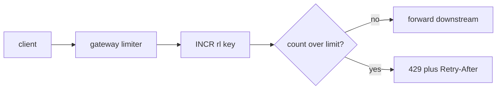

## Thesis

The boundary that turns unbounded incoming load into bounded, fair, predictable load --- a per-client cap so one noisy caller can't starve the rest or topple the service, with a shared counter that stays correct across a fleet and a deliberate choice of what to do when the limiter itself fails.

## Sub

**The algorithms** -> **where the limiter sits** -> **the shared-counter problem** -> **zoom out** to how throttling relates to load shedding, and the pivots an interviewer rides from "limit the requests" into token bucket, sliding window, and the distributed-counter race.

## Spine

- Cap the **rate**, not the total --- a limiter bounds requests per window, so a client gets a steady allowance rather than one hard ceiling, and a burst above the sustained rate is absorbed on purpose.
- **Token bucket** for bursts, **sliding window** for smoothness --- the two dominant algorithms, trading burst tolerance against precision and cost.
- The counter is **shared state** --- in a fleet, per-instance counters undercount and miss the true rate, so the limit lives in a shared store with atomic increments.
- **Fail open or closed** is a choice --- when the limiter store is down you decide between admitting everything (availability) and rejecting everything (protection); most user paths fail open with a local fallback.

## Companion Notes

### walk

The request path

A request from arrival to admit-or-reject, one hop at a time --- the mechanics you narrate before anyone cuts in.

Say the boundary out loud --- "the limiter runs at the edge, before business logic, keyed on the client, backed by a shared counter." That sentence is the whole design.

### drill

Probe Drill

Graded follow-ups on the algorithms, the distributed counter, and the failure mode --- the ones that separate a passing answer from a Staff signal.

Commit to a number's *source* before you reveal --- name where the limit lives and what it is keyed on, not just the algorithm.

## Drill

SDE2 | algorithm mechanics
SDE3 | distributed state and failure
Staff | policy and org trade-offs

### SDE2 | token bucket basics

How does a token bucket rate limiter work?

A bucket holds up to **N** tokens and refills at a steady rate; each request removes one token, and a request that finds the bucket empty is rejected or delayed. The bucket size sets the **burst** tolerance and the refill rate sets the **sustained** limit --- two knobs, one for spikes and one for the long-run rate.

### SDE2 | the fixed-window flaw

What is wrong with a fixed-window counter?

At a window boundary a client can send a full window's worth of requests just before the reset and another full window just after, so a "100 per minute" limit actually permits 200 in a two-second span. A sliding window closes that boundary gap by considering a moving interval instead of a fixed one.

### SDE2 | where to enforce

Where does the limiter sit in the request path?

At the **edge** --- an API gateway or an early middleware --- before the request reaches business logic, so a rejected request costs as little as possible and the protection applies uniformly across every downstream service instead of being reimplemented in each.

### SDE2 | what to key on

What do you key the limit on?

Usually the **client identity** --- an API key or an authenticated user id --- so the allowance is per-client. Keying on IP alone is weak because shared NATs and proxies collapse many users onto one address, so prefer authenticated identity wherever the caller has one.

### SDE2 | the reject response

How should a rejected request respond?

HTTP **429 Too Many Requests**, ideally with a **Retry-After** header telling the client when to try again, plus limit/remaining/reset headers so a well-behaved client can self-regulate and back off rather than hammering the endpoint.

### SDE2 | rate limit vs quota

What is the difference between a rate limit and a quota?

A **rate limit** caps requests per short window (per second or minute) to protect against bursts; a **quota** caps total usage over a long period (per day or month), usually for billing or fairness. They guard different things and are enforced as separate counters.

### SDE2 | leaky bucket vs token bucket

How does a leaky bucket differ from a token bucket?

A leaky bucket drains queued requests at a fixed rate, smoothing output to a constant stream with no bursts; a token bucket refills tokens at a steady rate but lets a client spend a burst up to the bucket size. Leaky bucket shapes traffic to a smooth downstream rate; token bucket permits controlled bursts. Choose leaky when a downstream needs a steady feed, token when short bursts are acceptable.

### SDE3 | why not per-instance

Why can't each instance keep its own counter?

With **M** instances behind a load balancer, a per-instance "100 per minute" lets a client do 100 times M per minute, and the client's requests spread across instances so no single instance ever sees the true rate. The counter has to be **shared** to reflect the client's real, fleet-wide rate.

### SDE3 | atomic increment

How do you keep the shared counter correct under concurrency?

Use an **atomic** operation in the shared store --- Redis `INCR` with an `EXPIRE`, or a small Lua script for check-and-increment --- so two concurrent requests can't both read the old count and both slip past the limit. The read-modify-write must be one indivisible step.

### SDE3 | precise sliding window

How do you implement a precise sliding window?

A sliding-window **log** stores one timestamp per request in a sorted set, trims entries older than the window, and counts what remains --- exact, but $O(n)$ memory, one stored entry per request in the window. A sliding-window **counter** approximates it by weighting the previous fixed window's count, far cheaper and usually accurate enough.

### SDE3 | fail open or closed

The limiter's Redis is down --- admit or reject?

A deliberate **choice**. Fail open (admit everything) preserves availability but drops protection; fail closed (reject everything) preserves protection but causes an outage. Most user-facing paths fail open behind a local in-process fallback limiter; protection-critical paths fail closed.

### SDE3 | the hot key

One API key drives most traffic --- what breaks?

That key's counter becomes a **hot key**: every request from that client hits one shard, so the counter is a throughput bottleneck. Mitigate by **sharding** the limit across sub-keys, or by a local token bucket per instance that syncs a fraction of the global limit periodically.

### SDE3 | time is the bug

What subtle bugs come from time in a limiter?

Window arithmetic depends on a clock, and skew across instances or a non-monotonic clock can double-count or reset a window early. Use the **store's** clock as the single source (for example Redis `TIME`) rather than each instance's wall clock, so every increment is timed consistently.

### SDE3 | the local fallback drift

While the shared store is down, your local fallback bucket has been counting. How do you reconcile when the store returns?

You don't merge the counts --- the local bucket is a coarse, lossy approximation used only for availability. On recovery you resume authoritative counting from the shared store and let the local state reset. Reconciling lossy per-instance counts is complexity for no real gain; accept a brief window of loose enforcement as the price of failing open.

### Staff | policy is a product call

How do you design rate-limit policy for a public API?

Tiered limits by plan, separate limits per **endpoint class** (cheap reads vs expensive writes), a burst allowance above the sustained rate, and clear response headers so clients can self-regulate. The numbers are a **product** decision about fairness and cost, not a value an engineer should guess alone.

### Staff | why layer limiters

Why run multiple limiters at once?

A **per-user** limit protects fairness, a **global** limit protects the service's total capacity, and a **per-endpoint** limit protects one expensive resource. A request must pass every applicable layer; each guards a different failure, and collapsing them into one number loses that separation.

### Staff | limiting vs shedding

How does rate limiting relate to load shedding?

Rate limiting is a **fair, per-client cap applied always**; load shedding is an **emergency, service-wide drop applied only under overload**, often by request priority. A mature system runs both --- the limiter for steady fairness, shedding for survival when the limiter alone isn't enough.

### Staff | abuse vs real spike

How do you separate abuse from a legitimate spike?

Often you can't in the moment, so you **design for it**: a burst allowance absorbs short legitimate spikes while sustained over-limit traffic is throttled. Pair the limit with per-client history and anomaly signals rather than trusting a single hard threshold to tell friend from foe.

### Staff | roll it out safely

How do you introduce a new rate limit without breaking users?

Start in **observe** mode --- log what *would* be rejected without rejecting --- measure the real request distribution, set the limit above the legitimate P99, then enforce. Guessing a number and enforcing it immediately is how you throttle real customers; observe-then-enforce is the same discipline as a safe migration.

### Staff | build vs buy

Gateway or in-app --- where should the limiter live?

Prefer the **edge** --- API gateway, service mesh, or CDN --- for uniform, cheap enforcement close to the client. Build limiting **in-app** only for limits that need business context the edge lacks, such as per-tenant quotas tied to billing state. Owning less limiter code is usually the win.

### Staff | limiting across regions

How do you enforce one client's limit across multiple regions?

A truly global limit needs a shared cross-region counter, which adds inter-region latency to every request. The common alternatives are to split the limit per region (each enforces a share, accepting that a client spread across regions could exceed the global cap) or to route a client consistently to one region so its counter stays local. The trade is global accuracy against cross-region latency.

## Walk

### The request arrives at the edge

```flow
c[client] -> g[gateway limiter] -> t[admit or reject] . a[before business logic]
```

Every request hits the **limiter first**, at the gateway, before it reaches any service. The limiter's job is a single decision --- admit or reject --- made as cheaply as possible so a rejected request never wastes downstream capacity.

Putting it at the edge is what makes it uniform: one limiter guards every service behind it, instead of each service reimplementing throttling with its own bugs. The gateway already has the client's identity from auth, which is exactly what the limit is keyed on.

### Identify the client and its counter

```flow
r[request] -> k[key = clientId + window] -> s[shared store] . a[Redis, not local]
```

The limiter derives a **key** from the client identity and the current time window --- something like a client id joined to the minute. That key names a counter in a **shared** store, because the count must reflect the client's whole-fleet rate, not what one instance happened to see.

### Atomically increment and check

```flow
r[request] -> i[INCR key] -> c[count vs limit] / x[over limit -> reject]
```

The limiter does an **atomic increment** and compares the result to the limit. Doing it atomically is the whole trick: two concurrent requests must not both read the old count and both be admitted.

```ts
// one atomic step -- INCR returns the post-increment value
const n = await redis.==incr==(key);
if (n === ==1==) await redis.expire(key, WINDOW);  // first hit sets the TTL
if (n > ==LIMIT==) return reject(==429==);           // over the cap this window
```

The `EXPIRE` is set only on the first increment of a window, so the counter self-cleans when the window rolls over --- no separate reaper, the TTL does it.

### Admit or reject with headers

```flow
d[decision] -> a[admit -> forward] . r[reject -> 429 + Retry-After]
```

An admitted request is forwarded downstream; a rejected one returns **429** with a **Retry-After** and the limit/remaining/reset headers. Those headers turn a blunt rejection into a contract: a well-behaved client reads them and backs off, so throttling reduces load instead of provoking a retry storm.

### Model Script

- Frame the boundary | "Rate limiting is a per-client cap at the edge. It runs before business logic, keyed on the client, and turns unbounded incoming load into a bounded, fair allowance so one noisy client can't starve the rest or topple the service."
- Name the algorithm | "For the algorithm I'd default to a token bucket if bursts are acceptable --- a bucket of N tokens refilled at a steady rate, so a client gets a burst then settles to the sustained limit. If I need strict smoothness instead, a sliding window: more precise, but more state."
- The shared counter | "The one hard part is that the counter is shared state. With ten servers behind a load balancer, a single client's requests spread across all of them, so no one instance sees the true rate. The count lives in a shared store --- Redis --- keyed by client and window, with an atomic increment: an INCR plus an expiry, or a small Lua script, so two concurrent requests can't both read the old count and both slip past."
- Decide the failure mode | "Then I decide up front what happens when that store is down: fail open to keep the service available, behind a local fallback bucket, or fail closed to protect it. For a user-facing API I fail open."
- Interviewer: "One client is sending most of the traffic. What breaks?"
- Trace it to the hot key | "That client's counter is a hot key --- every one of its requests hits one shard, so the counter becomes a throughput bottleneck. I'd shard the limit across sub-keys, or give each instance a local bucket that syncs a slice of the global limit, so no single key absorbs the whole load."
- Land the guarantees | "So the shape is a per-client cap at the edge, a token bucket for bursts, a shared counter with an atomic increment, a deliberate fail-open behind a local fallback, and 429s with Retry-After so clients back off. The hard part isn't the algorithm --- it's that the counter is shared state."

## Whiteboard

Sketch the decision an incoming request goes through, and where the counter lives.

### Where does the counter live?

In a shared store keyed by client and window --- never per instance, or the fleet undercounts.

### What happens when the window rolls over?

The key's TTL expires and the next request recreates it at count one; the TTL is the reaper.



Verdict: one atomic increment at the edge decides everything; the store is the only shared state.

## System

Zoom out to where throttling sits relative to the rest of the traffic path.

### Where it sits

Client: sends requests
Edge / gateway: limiter runs here [*]
Shared store: holds the counters
Services: receive only admitted traffic

### Pivots an interviewer rides

From "limit the requests" they push on the algorithm, the shared state, and the failure mode.

#### Which algorithm and why?

-> token bucket for bursts, sliding window for precision
Token bucket admits a burst up to the bucket size then throttles to the refill rate; a sliding window gives a smoother, more precise cap at higher cost. The choice is burst tolerance vs precision.

#### What happens when the store is down?

-> a deliberate fail-open or fail-closed
Fail open keeps the service available but unprotected; fail closed protects it but is an outage. Most user paths fail open with a local fallback bucket, the safer default for availability.

## Trade-offs

The calls that separate a mechanical answer from a designed one.

### Token bucket vs sliding window

- Token bucket: allows controlled bursts, cheap, constant state per client
- Sliding window: precise and smooth, but the exact log form is state per request

Pick token bucket unless the product genuinely needs burst-free smoothness; the burst allowance is usually a feature, not a bug.

### Local limiter vs shared counter

- Local per-instance: fast, no network hop, but undercounts across a fleet
- Shared store: correct fleet-wide rate, but a network hop and a hot-key risk

Use a shared store for correctness, with a local token bucket as a fallback for when the store is unreachable.

### Fail open vs fail closed

- Fail open: availability first, protection lost while the store is down
- Fail closed: protection first, an outage while the store is down

Default to fail open on user paths and fail closed only where over-admission is worse than downtime.

## Model Answers

### algorithm choice | How I pick the algorithm

Framed as a trade, not a default.

- Name the two | key | token bucket vs sliding window
- Tie to the requirement | store | bursts allowed picks the bucket
- State the cost | note | an exact sliding log is memory per request

### the distributed catch | Why the counter is shared

The point most answers miss.

- Per-instance undercounts | key | a client spread across the fleet
- Atomic increment | store | INCR plus EXPIRE, or a Lua script
- Name the hot key | note | one heavy client bottlenecks a shard

## Numbers

Back-of-envelope the store load a limiter adds.

Each admitted or rejected request is one atomic increment, so the limiter's own load is one store op per request --- the counter memory is tiny, the op rate is the thing to size.

- rps | Requests/sec | 50000 | 0 | 1000
- clients | Active clients | 100000 | 0 | 1000
- bytesPerKey | Bytes per counter | 100 | 0 | 10

```js
function (vals, fmt) {
  var rps = vals.rps, clients = vals.clients, bytesPerKey = vals.bytesPerKey;
  return [
    { k: 'Store ops/sec', v: fmt.n(rps), u: 'ops/s', n: 'one atomic increment per request \u2014 the limiter adds exactly one store op to every request, admitted or rejected', over: rps > 100000 },
    { k: 'Peak ops at 10x burst', v: fmt.n(rps * 10), u: 'ops/s', n: 'a 10x spike over average \u2014 what one shard must absorb, where a single node nears its wall around 100k ops/s', over: rps * 10 > 100000 },
    { k: 'Counter memory', v: fmt.n(Math.round(clients * bytesPerKey / 1e6)), u: 'MB', n: 'one ' + bytesPerKey + '-byte counter per active client \u2014 even a million clients is tens of MB, so memory is never the constraint', over: false },
    { k: 'Hottest-client load', v: fmt.n(Math.round(rps * 0.3)), u: 'ops/s', n: 'if one heavy client is 30 percent of traffic, its counter is a hot key on one shard \u2014 the real bottleneck, not memory', over: Math.round(rps * 0.3) > 50000 },
    { k: 'Added round-trip', v: '~1', u: 'ms', n: 'one store round-trip on the request path \u2014 cheap, but it is why a local fallback bucket matters when the store is slow', over: false }
  ];
}
```

## Red Flags

What makes an interviewer wince.

### "I'll just keep a counter in each instance"

Per-instance counters undercount --- a client spread across the fleet blows past the real limit.

Put the counter in a shared store with atomic increments, keyed by client and window.

Note: this is the single most common rate-limiting mistake in interviews.

### "Read the count, then increment it"

That is a race: two requests read the same old count and both get admitted past the cap.

Use one atomic operation (INCR, or a Lua script) so the read-modify-write cannot interleave.

### "If the store is down we just let everything through"

Maybe --- but say it is a choice, not an accident.

Decide fail-open vs fail-closed per path and back it with a local fallback bucket; do not discover the behavior during an outage.

## Opener

### 30s | The one-liner

How I open when asked to design rate limiting.

#### What is the boundary?

A per-client cap at the edge that turns unbounded load into bounded, fair load.

#### What is the one hard part?

The counter is shared state, so it needs an atomic increment in a shared store.

##### Hooks

Where an interviewer usually pushes next.

- Which algorithm? | token bucket vs window | trade
- Shared counter? | atomic INCR and hot key | drill
- Store is down? | fail open vs closed | trade

Foot: two sentences --- the boundary, then the shared-counter catch.

## Bank

### SCALE | Fifty thousand requests a second across the fleet

Task: size the limiter's store load and argue the counter memory is negligible.
Model: one atomic increment per request, roughly 100-byte counters, so op-rate dominates, not memory.
Int: what is the bottleneck at this scale?
The hottest client's counter shard, not total memory.

### DESIGN | A public API with paid tiers

Task: design the limit policy across plans and endpoints.
Model: tiered sustained rate plus a burst allowance, per-endpoint-class limits, clear headers.
Int: where does the number come from?
The legitimate P99 measured in observe mode, not a guess.

### Extra Curveballs

### CURVEBALL | outage | The store is down for thirty seconds --- what does the API do?

Model: fail open behind a local per-instance bucket so most traffic is still loosely bounded, then reconcile when the store returns.

### Frames

- Boundary first, algorithm second
- The counter is shared state, and that is the whole difficulty
- A limit you cannot measure is a limit you should not enforce yet
