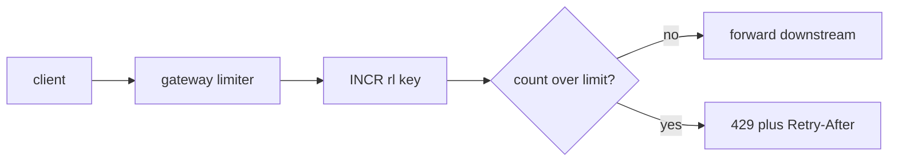

## Thesis

The boundary that turns unbounded incoming load into bounded, fair, predictable load --- a per-client cap so one noisy caller can't starve the rest or topple the service, with a shared counter that stays correct across a fleet and a deliberate choice of what to do when the limiter itself fails.

## Sub

**The algorithms** -> **where the limiter sits** -> **the shared-counter problem** -> **zoom out** to how throttling relates to load shedding, and the pivots an interviewer rides from "limit the requests" into token bucket, sliding window, and the distributed-counter race.

## Spine

- Cap the **rate**, not the total --- a limiter bounds requests per window, so a client gets a steady allowance rather than one hard ceiling, and a burst above the sustained rate is absorbed on purpose.
- **Token bucket** for bursts, **sliding window** for smoothness --- the two dominant algorithms, trading burst tolerance against precision and cost.
- The counter is **shared state** --- in a fleet, per-instance counters undercount and miss the true rate, so the limit lives in a shared store with atomic increments.
- **Fail open or closed** is a choice --- when the limiter store is down you decide between admitting everything (availability) and rejecting everything (protection); most user paths fail open with a local fallback.

## Companion Notes

### walk

The request path

A request from arrival to admit-or-reject, one hop at a time --- the mechanics you narrate before anyone cuts in.

Say the boundary out loud --- "the limiter runs at the edge, before business logic, keyed on the client, backed by a shared counter." That sentence is the whole design.

### drill

Probe Drill

Graded follow-ups on the algorithms, the distributed counter, and the failure mode --- the ones that separate a passing answer from a Staff signal.

Commit to a number's *source* before you reveal --- name where the limit lives and what it is keyed on, not just the algorithm.

### wb

Whiteboard

Rebuild the whole limiter decision from memory --- the cues, nothing in front of you.

Draw the boundary first --- the client on one side, the shared counter in the middle, the atomic increment crossing once. Recall is the test, not recognition.

### sys

System Map

Zoom out: the limiter sits at the edge between unbounded incoming load and the services it protects.

Lead with the boundary, not the boxes --- "the limiter runs at the gateway, backed by a shared counter, and decides admit-or-reject before any service is touched."

### trade

Trade-offs

The decisions they drill --- token bucket vs sliding window, local vs shared, fail open vs closed --- each with the switch condition.

Always say "pick when" --- name the constraint that flips the choice, never defend one algorithm as universally right.

### model

Model Answers

Full spoken scripts --- the beats, in order, the way you'd actually say them.

Steal the frame, not the words --- headline first ("a per-client cap at the edge, backed by a shared atomic counter"), then the one hard part you'd name.

### num

Numbers

Back-of-envelope the limiter's own load --- and know which number makes the shared counter the ceiling.

Lead with the op rate --- one atomic increment per request is the limiter's whole cost, and the hottest client's shard is the wall, not memory.

### rf

Red Flags

What sinks the round --- a per-instance counter, a read-then-increment race, an accidental fail-open --- and what to say instead.

Name what the interviewer hears --- "would let a client do N times the limit" is the fastest no-hire in the room.

### open

30-Second

The opener and the close --- matched to the altitude the question is asked at.

Match the altitude --- open at the throttling boundary, not the algorithm, and land on the shared counter and fail-open as the real hard parts.

## Drill

all | All four levels, mixed --- the way a real loop actually comes at you, from token-bucket mechanics up to org and cost trade-offs.
SDE2 | algorithm mechanics
SDE3 | distributed state and failure
Staff | policy and org trade-offs

### SDE2 | token bucket basics

How does a token bucket rate limiter work?

A bucket holds up to **N** tokens and refills at a steady rate; each request removes one token, and a request that finds the bucket empty is rejected or delayed. The bucket size sets the **burst** tolerance and the refill rate sets the **sustained** limit --- two knobs, one for spikes and one for the long-run rate.

Follow: Where does the refill actually happen --- do you run a background timer per bucket?
No --- a timer per key would mean millions of timers for millions of clients. You refill **lazily**, on read: store the token count and the timestamp of the last refill, and on each request compute `tokens = min(capacity, tokens + elapsed * rate)` before trying to spend one. The refill is arithmetic at request time, O(1), with no background sweeper.

Follow: A client sits idle for an hour, then sends a burst. How many go through instantly?
At most the bucket **capacity** N --- idle time refills the bucket only up to its cap (the `min(capacity, ...)` clamp), never beyond. An hour idle doesn't buy an hour's worth of tokens; it buys a full bucket. That's the whole point of separating the two knobs: sustained throughput is bounded by the refill rate, instantaneous burst by the capacity, independently.

Senior: Naming the two independent knobs (capacity = burst, refill = sustained) *and* knowing the refill is lazy, computed on read, not a per-key timer --- is the difference between having read about token bucket and having run it for millions of keys.
Speak: "A bucket of N tokens refilled at a steady rate --- each request spends one, empty means reject. Capacity is the burst knob, refill is the sustained knob, and you refill lazily on read, not with a timer per key."

### SDE2 | the fixed-window flaw

What is wrong with a fixed-window counter?

At a window boundary a client can send a full window's worth of requests just before the reset and another full window just after, so a "100 per minute" limit actually permits 200 in a two-second span. A sliding window closes that boundary gap by considering a moving interval instead of a fixed one.

Follow: Concretely, what is the worst-case burst, and over how short a span?
Up to **2x** the limit in an instant: the full N at the very end of window *k* and the full N at the very start of window *k+1*, so 2N requests within a span as short as the clock resolution straddling the boundary --- a "100/min" fixed window permits 200 across the `:59`-to-`:01` seam. The limit you advertise is not the limit you enforce at the boundary.

Follow: So do you jump straight to a per-request sliding-window log?
Usually not --- the sliding-window **counter** is the cheap middle ground: weight the previous window's count by the fraction of it still inside the rolling window, add the current window's count. It's O(1) memory (two counters), shrinks the boundary burst to a small approximation error, and costs far less than a timestamp-per-request log. You reach for the exact log only when even that approximation is unacceptable.

Senior: Quantifying the flaw as exactly 2x at the seam *and* reaching for the sliding-window counter as the cheap fix --- rather than ignoring the boundary or over-paying for an exact log --- is the calibrated answer.
Speak: "Fixed window lets a client burst 2x the limit across the boundary --- a full window just before the reset, a full window just after. The cheap fix is a sliding-window counter that weights the previous window; the exact log is only when that approximation isn't good enough."

### SDE2 | where to enforce

Where does the limiter sit in the request path?

At the **edge** --- an API gateway or an early middleware --- before the request reaches business logic, so a rejected request costs as little as possible and the protection applies uniformly across every downstream service instead of being reimplemented in each.

Follow: Why the edge specifically, and not inside each service?
Two reasons. **Cost:** a rejected request should burn as little as possible --- dropping it at the gateway means it never consumes a connection, a worker thread, or a database query downstream. **Uniformity:** one limiter at the edge protects every service behind it with one implementation, instead of each team reinventing throttling with its own bugs and its own counter. The edge already holds the client's identity from auth, which is exactly the key.

Follow: Is there ever a limit you *can't* enforce at the edge?
Yes --- anything that needs business context the edge doesn't have. A per-tenant monthly quota tied to billing state, or a limit on an operation whose cost is known only after parsing (a GraphQL query's complexity, a batch's size), has to live in-app where that context exists. So the pattern is: cheap, uniform, identity-based limits at the edge; semantically rich limits in the service --- and most limits are the former.
Senior: Defending the edge on *both* cost (reject cheaply) and uniformity (one implementation), then naming the exception (limits needing business context go in-app) --- shows you've thought about where the boundary actually is, not just repeated "put it at the gateway."
Speak: "At the edge, before business logic --- so a rejected request costs nothing downstream and one limiter guards every service. The exception is a limit that needs business context, like a per-tenant billing quota; that one lives in-app."

### SDE2 | what to key on

What do you key the limit on?

Usually the **client identity** --- an API key or an authenticated user id --- so the allowance is per-client. Keying on IP alone is weak because shared NATs and proxies collapse many users onto one address, so prefer authenticated identity wherever the caller has one.

Follow: You keyed on IP and a customer complains their whole office is throttled. What happened?
A shared NAT or corporate proxy collapses thousands of distinct users onto one public IP, so your per-IP counter sees them as a single client and throttles the whole office the moment any one of them is busy. IP is a poor identity for exactly this reason. Key on authenticated identity (API key, user id) wherever the caller has one, and reserve IP-keying for unauthenticated endpoints where it's the only signal --- expecting false positives from shared egress even there.

Follow: For an unauthenticated endpoint --- a login or signup --- what do you key on then?
You have no user identity yet, so you fall back to IP but *defend* it: a more forgiving per-IP limit (to tolerate NAT) combined with a stricter limit on the **action** --- failed logins per account, per username attempted --- plus device/fingerprint signals. The account-targeted limit is the important one for credential stuffing: it protects the victim account regardless of how many IPs the attacker rotates through. IP alone is both too coarse (NAT) and too easy to evade (a botnet is many IPs).
Senior: Knowing that IP is both too *coarse* (NAT collapses many users to one) and too *easy to evade* (a botnet is many IPs), and therefore layering an account-targeted limit for unauthenticated flows --- is the security-aware answer versus just "key on user id."
Speak: "Key on authenticated identity --- API key or user id --- so the allowance is per real client. IP is weak: a NAT collapses an office onto one address. Unauthenticated endpoints fall back to IP but pair it with an account-targeted limit, because that's what actually stops credential stuffing."

### SDE2 | the reject response

How should a rejected request respond?

HTTP **429 Too Many Requests**, ideally with a **Retry-After** header telling the client when to try again, plus limit/remaining/reset headers so a well-behaved client can self-regulate and back off rather than hammering the endpoint.

Follow: Why is Retry-After load-bearing and not just polite?
Without it, a throttled client's default is to retry immediately and keep hammering --- turning your throttle into a tight retry loop that adds *more* load exactly when you're trying to shed it. Retry-After (and the reset header) tells a well-behaved client precisely when the window frees, so it backs off instead of spinning. It converts rejection from "try again right now, repeatedly" into "come back at time T" --- the difference between throttling reducing load and throttling amplifying it.

Follow: A client ignores Retry-After and keeps hammering anyway. Now what?
You can't trust clients, so you defend in depth. Rejecting at the edge is already cheap (no downstream cost), but a client spinning on 429s still costs you the limiter check per request. For a persistent abuser you escalate --- a longer cooldown or temporary block on that key (a second-tier limit on "429s generated"), or push the drop even earlier, to the WAF or connection layer, so you're not even running the limiter logic. The headers help the honest majority; a hard outer limit and cheap rejection handle the ones who ignore them.
Senior: Framing Retry-After as the mechanism that stops throttling from becoming a self-inflicted retry storm --- then *not* trusting it, escalating to a hard block for clients that ignore it --- is the difference between "return a 429" and understanding the control loop between limiter and client.
Speak: "429 with Retry-After and the limit/remaining/reset headers, so a well-behaved client backs off to when the window frees instead of hammering. And because you can't trust clients, a caller that ignores Retry-After earns a longer hard block, dropped as early and cheaply as possible."

### SDE2 | rate limit vs quota

What is the difference between a rate limit and a quota?

A **rate limit** caps requests per short window (per second or minute) to protect against bursts; a **quota** caps total usage over a long period (per day or month), usually for billing or fairness. They guard different things and are enforced as separate counters.

Follow: Can the same counter serve both?
No --- they have different windows and different purposes, so they're separate counters. The rate limit is a short rolling window (per-second or minute) protecting the service from bursts, resetting continuously; the quota is a long fixed period (per-day or month) tied to a plan, resetting on a billing boundary and often needing durable, auditable accounting because you *bill* on it. You typically enforce both: a request must pass the per-second rate limit *and* not exceed the monthly quota.

Follow: Where does each one live --- the same store?
The rate limiter is hot, ephemeral, and tolerant of approximation, so it lives in an in-memory store (Redis) with TTL-based windows; losing it briefly is survivable. The quota is money --- it must be durable and accurate --- so it's backed by a persistent, transactional store (often the billing database), maybe with a fast counter in front for the hot check and periodic reconciliation to the source of truth. You can be sloppy with a rate-limit count; you cannot lose a quota count you're going to invoice on.
Senior: Recognizing that rate limit and quota differ not just in window length but in **durability** --- rate is ephemeral and approximate (Redis, TTL), quota is money (durable, reconciled) --- is the distinction that shows you've built billing, not just throttling.
Speak: "Rate limit caps requests per short window to absorb bursts; quota caps total usage per billing period for fairness and billing. Different windows, different stores --- the limiter is ephemeral in Redis, the quota is durable because you invoice on it --- and you enforce both."

### SDE2 | leaky bucket vs token bucket

How does a leaky bucket differ from a token bucket?

A leaky bucket drains queued requests at a fixed rate, smoothing output to a constant stream with no bursts; a token bucket refills tokens at a steady rate but lets a client spend a burst up to the bucket size. Leaky bucket shapes traffic to a smooth downstream rate; token bucket permits controlled bursts. Choose leaky when a downstream needs a steady feed, token when short bursts are acceptable.

Follow: Give me a concrete case where leaky bucket is the right choice over token bucket.
When a downstream needs a **steady feed** and cannot tolerate bursts --- pacing writes to a third-party API with a hard non-bursty rate, or feeding hardware that processes at a fixed rate. The leaky bucket, as a queue draining at a constant rate, shapes bursty input into a smooth output stream, which is exactly traffic-shaping. A token bucket would let a burst through, which the downstream can't absorb. Leaky = smooth output; token = smooth *average* with bursts allowed.

Follow: Leaky bucket queues requests to smooth them --- what's the cost of that queue?
Latency and memory. Because leaky bucket delays requests to pace them, a request can sit in the queue waiting its turn, so it adds latency, and under sustained overload the queue grows (bounded, or you drop when full). Token bucket decides admit-or-reject immediately with no queue --- lower latency, but it permits bursts. So the trade is: leaky bucket buys smooth downstream output at the cost of queueing latency and a buffer to manage; token bucket buys an instant decision at the cost of letting bursts through.
Senior: Framing leaky bucket as **traffic-shaping** (smooth output, at the cost of queueing latency) versus token bucket as **admission control** (instant decision, bursts allowed) --- and picking by whether the downstream needs a steady feed --- is the distinction most candidates blur into "they're basically the same."
Speak: "Leaky bucket drains a queue at a fixed rate --- smooth output, no bursts, but it adds queueing latency. Token bucket decides admit-or-reject instantly and allows bursts up to the bucket. Leaky when a downstream needs a steady feed; token when short bursts are fine."

### SDE3 | why not per-instance

Why can't each instance keep its own counter?

With **M** instances behind a load balancer, a per-instance "100 per minute" lets a client do 100 times M per minute, and the client's requests spread across instances so no single instance ever sees the true rate. The counter has to be **shared** to reflect the client's real, fleet-wide rate.

Follow: Could you just divide the limit by the instance count --- 100/M each --- and keep it local?
Tempting but fragile. It only holds if traffic is perfectly balanced across instances (it isn't --- a sticky client or an unlucky hash piles onto one node), and it breaks the moment the fleet **autoscales**: add or remove an instance and every local limit is now wrong until you re-divide, which requires every node to know the live instance count in real time. You've traded a shared-counter network hop for a distributed-consensus problem (agreeing on M). For an accurate global limit, one shared counter is simpler and correct.

Follow: Is a slightly-wrong local limit ever acceptable to avoid the shared store?
Yes --- that's the "approximate but cheap" end of the trade. If the goal is coarse protection (don't let one client melt the service) rather than a contractual "exactly 100/min," a per-instance local bucket sized to limit/M-with-headroom is fine and avoids a hot shared counter. Many high-scale limiters deliberately accept a fleet-factor of slop in exchange for zero per-request network hops, syncing local counters to a global view periodically. The rule: exact global limit -> shared atomic counter; coarse protection -> local buckets with periodic sync.
Senior: Recognizing that per-instance division doesn't just lose accuracy but couples the limit to real-time knowledge of the fleet size (and breaks under autoscaling), then knowing *when* approximate local limits are acceptable (coarse protection vs contractual number) --- is the judgment beyond "the counter must be shared."
Speak: "With M instances each enforcing the full limit, a client spread across them gets M times the cap --- no node sees the true rate. Dividing by M breaks under autoscaling, so an exact limit needs a shared counter; local buckets are fine only for coarse protection, not a contractual number."

### SDE3 | atomic increment

How do you keep the shared counter correct under concurrency?

Use an **atomic** operation in the shared store --- Redis `INCR` with an `EXPIRE`, or a small Lua script for check-and-increment --- so two concurrent requests can't both read the old count and both slip past the limit. The read-modify-write must be one indivisible step.

Follow: Walk me through the exact race if it isn't atomic.
Two requests arrive concurrently at count 99 with a limit of 100. Both **read** 99, both see "99 is under 100, admit," both **write** 100. Two requests were admitted at the boundary when only one should have been --- the classic read-modify-write interleaving, and N concurrent requests can all read the same sub-limit value and all pass. `INCR` returns the *post*-increment value in one atomic step, so the two requests get 100 and 101 and the one that got 101 is correctly rejected. Atomicity serializes the increment so exactly one crosses each threshold.

Follow: Why a Lua script rather than INCR then EXPIRE as two commands?
Because INCR and EXPIRE as two round-trips have a gap: if the process dies or the connection drops between the INCR that *created* the key and the EXPIRE, the key has **no TTL** and lives forever --- a counter that never resets, permanently throttling that client. A Lua script executes atomically on the server, so "increment, and set expiry if this is the first hit" is one indivisible operation with no gap, and Redis runs the whole script without interleaving other commands. It's also where token-bucket refill logic lives, which is more than a single INCR.
Senior: Naming the *exact* interleaving (both read 99, both admit) *and* the second-order bug --- a crash between INCR and EXPIRE leaves a TTL-less key that throttles forever, which is why increment-and-expire belongs in one atomic Lua script --- is the concurrency depth that separates SDE3 from "use INCR."
Speak: "One atomic step --- INCR returns the post-increment value, so two concurrent requests at 99 get 100 and 101 and exactly one is rejected. Non-atomic, both read 99 and both pass. And I'd put increment-and-expire in a Lua script, because a crash between INCR and EXPIRE leaves a key with no TTL that throttles forever."

### SDE3 | precise sliding window

How do you implement a precise sliding window?

A sliding-window **log** stores one timestamp per request in a sorted set, trims entries older than the window, and counts what remains --- exact, but $O(n)$ memory, one stored entry per request in the window. A sliding-window **counter** approximates it by weighting the previous fixed window's count, far cheaper and usually accurate enough.

Follow: That sorted set grows with every request from a heavy client --- what stops it becoming a memory bomb?
Two things. First, you **trim on every access** --- `ZREMRANGEBYSCORE` drops entries older than the window before you count --- so the set holds at most one window's worth of requests, not all history. Second, the catch: for a client sending far above its limit, "one window's worth" can still be large if you store a timestamp per *attempt*, including rejected ones. The mitigation is to stop appending once a request is already over the limit, and to cap the set size --- and if memory is still a concern, that's exactly when you drop to the O(1) sliding-window counter.

Follow: When is the exact log actually worth its cost over the counter?
When the counter's approximation error is unacceptable. The counter assumes the previous window's requests were uniformly distributed when it weights them --- if they were bunched at that window's end, the estimate is off by that skew, admitting or rejecting slightly wrong near the boundary. For most throttling that's fine. You pay for the exact log when the limit is a hard contractual or safety boundary where even a few percent of over-admission matters, *and* the request rate is low enough that a timestamp each is affordable. High-rate and tolerant -> counter; low-rate and exact -> log.
Senior: Knowing the exact log's failure mode (memory grows with a heavy client's rate, so you trim aggressively and stop logging over-limit attempts) *and* the counter's failure mode (it assumes uniform distribution, so it's wrong under bursty skew) --- and picking on rate times required-accuracy --- is the calibrated systems answer.
Speak: "Exact is a sorted set of timestamps --- trim everything older than the window, count what's left --- but it's $O(n)$ memory per client, so you stop logging over-limit attempts and cap the set. The counter weights the previous window at O(1); you only pay for the exact log when a few percent of boundary error actually matters."

### SDE3 | fail open or closed

The limiter's Redis is down --- admit or reject?

A deliberate **choice**. Fail open (admit everything) preserves availability but drops protection; fail closed (reject everything) preserves protection but causes an outage. Most user-facing paths fail open behind a local in-process fallback limiter; protection-critical paths fail closed.

Follow: You fail open, and the Redis outage happens *during* a traffic spike --- the exact moment the limit mattered. Defend it.
It's the honest tension. You defend it two ways. First, fail-open is not *no*-limit --- you fall back to a per-instance local bucket, so a single client is still coarsely bounded, just not globally accurate. It's degraded-protected, not unprotected. Second, it's a blast-radius call: for a user-facing API, a limiter outage causing a *full* outage (fail-closed) is usually worse than temporarily looser limits, because the limiter is a safety mechanism, not something that should be able to take the whole service down. For a protection-critical path (a payment, a login) you flip it and fail closed. The choice follows what's worse: over-admission or downtime.

Follow: Doesn't the limiter's store being a hard dependency make the limiter itself a single point of failure?
That's the core design pressure, and you avoid it by making the store a **best-effort** dependency, not a blocking one. The local fallback bucket means a slow or dead Redis degrades to local enforcement rather than failing the request; you set a tight timeout on the store call (single-digit ms) so a slow store doesn't add latency to every request; and a circuit breaker on the store lets you stop trying when it's clearly down and go straight to local until it recovers. The principle: the limiter protects the service, so the limiter must never be able to *take down* the service --- its dependency has to fail soft.
Senior: Framing fail-open as "degraded-protected via a local bucket, not unprotected," and seeing the deeper trap --- a limiter whose store is a hard dependency becomes a SPOF that can take down the very service it protects, so the store call must fail soft (tight timeout, local fallback, circuit breaker) --- is the reliability judgment a Staff interviewer is after.
Speak: "A deliberate choice: fail open for availability, fail closed for protection --- and most user paths fail open, but behind a local bucket, so it's degraded-protected, not unprotected. The deeper point: the limiter must never be a SPOF that takes down the service it guards, so the store call fails soft --- tight timeout, local fallback, circuit breaker."

### SDE3 | the hot key

One API key drives most traffic --- what breaks?

That key's counter becomes a **hot key**: every request from that client hits one shard, so the counter is a throughput bottleneck. Mitigate by **sharding** the limit across sub-keys, or by a local token bucket per instance that syncs a fraction of the global limit periodically.

Follow: You shard the hot key into N sub-keys. How do you enforce *one* global limit across N shards?
That's the catch. Splitting `key` into `key:0..key:N-1` and hashing each request to a sub-key spreads the write load, but now no single counter knows the client's total. You give each sub-key a share (limit/N), which is an approximation: it stays accurate only if requests distribute evenly across the sub-keys, and it can under-count under skew. For a true global limit you periodically aggregate the sub-counters, or use the local-bucket-with-sync approach instead. The honest framing: sharding trades exact global accuracy for throughput --- you accept bounded slop to remove the single-shard bottleneck, and you say so.

Follow: The local-bucket-with-periodic-sync approach --- how much can a client overshoot between syncs?
Up to roughly (local allowance times number of instances) worth of extra requests within one sync interval, because each instance independently grants its local slice before the next reconciliation pulls everyone back to the global view. You bound the overshoot with two knobs: the local allowance per instance (smaller = tighter global accuracy, more sync traffic) and the sync interval (shorter = tighter, more store load). It's the classic accuracy-vs-coordination trade --- you deliberately allow a *bounded, quantified* overshoot to keep the hot path off a single shared counter, which for a hot key is usually the right call.
Senior: Knowing that *both* mitigations (sub-key sharding, local-bucket sync) convert an exact global limit into a bounded-approximate one --- and being able to *quantify* the overshoot (limit/N under skew; local-allowance times instances per sync interval) rather than presenting sharding as a free fix --- is the Staff-level honesty.
Speak: "A hot key funnels every request to one shard, so the counter is a throughput bottleneck. You shard into sub-keys or give each instance a local bucket that syncs periodically --- but both turn an exact global limit into a bounded-approximate one, and I'd name the overshoot: local allowance times instances per sync interval."

### SDE3 | time is the bug

What subtle bugs come from time in a limiter?

Window arithmetic depends on a clock, and skew across instances or a non-monotonic clock can double-count or reset a window early. Use the **store's** clock as the single source (for example Redis `TIME`) rather than each instance's wall clock, so every increment is timed consistently.

Follow: Two gateway instances have clocks 500ms apart. Walk the concrete bug.
Each instance computes the current window from *its* wall clock. With a fixed window, instance A thinks it's still window `:00`-`:01` while instance B, 500ms ahead, has rolled to the next window --- so a client's requests get split across two different window keys depending on which instance they hit, effectively doubling the allowance near the boundary, or resetting a window early. With a token bucket, the elapsed-time refill uses each instance's clock, so skew makes one instance refill faster than another. The fix is one clock source: derive the time from the shared **store** (Redis `TIME`) inside the atomic op, so every increment across every instance is timed by one authority.

Follow: Even with one clock source, what about a non-monotonic clock --- an NTP step backward?
Wall clocks can jump backward (an NTP correction, leap-second handling), and if your refill does `elapsed = now - lastRefill`, a backward step makes `elapsed` negative --- which can wrongly subtract tokens, or stall refill if you clamp at zero. Using the store's clock consistently avoids most of this, but for any locally-computed duration you use a **monotonic** clock (one that only moves forward), never the wall clock. The wall clock answers "what time is it"; the monotonic clock answers "how much time has passed." Conflating them is the classic time bug: durations must come from a monotonic source.
Senior: Pinning time to the *store's* clock inside the atomic op (so all instances share one authority) *and* knowing durations must come from a monotonic clock, never the wall clock (which can step backward and make elapsed negative) --- is the subtle correctness depth that shows you've debugged a real limiter, not just drawn one.
Speak: "Every instance timing its own window from its own wall clock means skew splits a client across window keys and doubles the allowance at the boundary. Use one authority --- the store's clock, Redis TIME, inside the atomic op --- and for elapsed-time refill use a monotonic clock, because a wall clock can step backward and make elapsed negative."

### SDE3 | the local fallback drift

While the shared store is down, your local fallback bucket has been counting. How do you reconcile when the store returns?

You don't merge the counts --- the local bucket is a coarse, lossy approximation used only for availability. On recovery you resume authoritative counting from the shared store and let the local state reset. Reconciling lossy per-instance counts is complexity for no real gain; accept a brief window of loose enforcement as the price of failing open.

Follow: Why *not* merge the local counts back into the global counter --- wouldn't that be more accurate?
Because the local counts are a lossy, uncoordinated approximation, and merging them buys accuracy you don't need at real cost. Each instance counted independently with no global view, so summing them doesn't reconstruct the true total --- it's an estimate of an estimate --- and you'd need a reconciliation protocol (collect from every instance, dedupe, handle instances that died mid-outage) that's far more machinery than the problem warrants. The limit is a protection mechanism, not an accounting ledger. (Contrast a *quota* you bill on --- there you *would* reconcile, because it's money.)

Follow: On recovery the store's counter is stale --- it's missing everything that happened during the outage. Is that a problem?
Usually no, and by design. The store resumes from wherever it was (or from zero if its TTL expired during the outage), so for one window after recovery a client active during the outage might get a fresh full allowance --- a brief over-admission. That's the same "accept loose enforcement as the price of failing open" trade: you chose availability during the outage and a small recovery-window slop over the complexity of perfect accounting across a failure. If even that slop is unacceptable (a protection-critical limit), you'd have failed *closed* during the outage instead --- the other side of the fail-open/closed choice.
Senior: Treating the local fallback as explicitly *lossy* and refusing to merge (reconciliation is complexity for accuracy a rate limit doesn't need) --- while noting a *quota* you bill on is the opposite (reconcile, because it's money) --- is the judgment that separates "throttling" from "distributed accounting."
Speak: "You don't merge --- the local counts are a lossy, uncoordinated estimate, and reconciling them is complexity for accuracy a rate limit doesn't need. You resume authoritative counting from the store and let local reset, accepting a brief window of loose enforcement as the price of failing open. A quota you bill on is the opposite --- that you'd reconcile."

### Staff | policy is a product call

How do you design rate-limit policy for a public API?

Tiered limits by plan, separate limits per **endpoint class** (cheap reads vs expensive writes), a burst allowance above the sustained rate, and clear response headers so clients can self-regulate. The numbers are a **product** decision about fairness and cost, not a value an engineer should guess alone.

Follow: The product team asks you "what should the limit *be*?" How do you answer without guessing a number?
You don't pick from intuition --- you **measure**. Run in observe mode first: log each client's real request rate without enforcing, build the distribution, and find where legitimate usage sits (the P99 of real customers). Set the limit above that legitimate P99 with headroom, so real users never hit it and only genuine abuse does. Then it's a product conversation, grounded in data: "the free tier at X covers 99% of real free usage; paid tiers at Y and Z." The engineer supplies the measured distribution and the mechanism; the number is a fairness-and-cost decision the business owns --- but an informed one.

Follow: You set the limit above the legitimate P99. A week later a real customer's traffic legitimately grows past it and they start getting 429s. How does your design handle that?
This is why the limit can't be a static guess --- legitimate usage evolves. The design handles it with headroom and a burst allowance above the sustained rate (short-term growth doesn't immediately reject), clear remaining/reset headers (the customer *sees* they're approaching the limit), an easy tier-upgrade path (a customer outgrowing their limit is a good problem --- they should move up), and monitoring on **429-rate per customer**, so a legitimate customer suddenly hitting limits is an alert to reach out or auto-raise, not a silent throttle. The limit protects the service, but a customer hitting it is a signal to act on, not a wall to leave them at.
Senior: Answering "measure the legitimate P99 in observe mode, set above it, then it's a tiered product decision" *and* treating a customer *outgrowing* their limit as a monitored, actionable signal (upgrade, reach out) rather than a static wall --- is the product-plus-systems judgment the card is probing.
Speak: "The numbers come from measurement, not intuition --- observe real usage, find the legitimate P99, set the limit above it with a burst allowance, then it's a tiered product decision about fairness and price. And I'd monitor 429s per customer, because a real customer outgrowing their limit is a signal to upgrade them, not a wall."

### Staff | why layer limiters

Why run multiple limiters at once?

A **per-user** limit protects fairness, a **global** limit protects the service's total capacity, and a **per-endpoint** limit protects one expensive resource. A request must pass every applicable layer; each guards a different failure, and collapsing them into one number loses that separation.

Follow: A request has to pass per-user, per-endpoint, and global. In what *order* do you check them, and why does order matter?
Check cheapest-and-most-likely-to-reject first, so you do the least work before rejecting --- typically the most specific limit (per-user or per-endpoint) before the global one, because rejecting a single abusive user shouldn't require touching the global counter. Order also matters for **fairness accounting**: if a request will be rejected by the per-user limit, you don't want to have already spent a token from the global budget, or you'd penalize global capacity for a request you rejected anyway. So evaluate the limits, and ideally only **debit** the counters for a request you're actually admitting --- check all, commit tokens only on pass.

Follow: Three separate limiter checks means three round-trips to the store per request. Isn't that too expensive on the hot path?
It can be, so you optimize the common case: batch the checks into **one round-trip** --- a single Lua script that evaluates all applicable limits atomically and returns the combined verdict --- so it's one store call, not three. You short-circuit cheap local checks first (a per-instance local bucket rejects a blatant flood before you touch the shared store), and you only apply the limits that *matter* for a given endpoint (a cheap read might carry only the global limit, an expensive write all three). The principle: multiple logical limits, one physical atomic evaluation, with local pre-filtering for the obvious rejects.
Senior: Knowing to evaluate all limits but **debit only on admit** (so a reject by one doesn't spend another's budget), and to collapse the N logical checks into *one* atomic store round-trip with local pre-filtering --- is the implementation maturity behind the tidy "layer the limiters" answer.
Speak: "Per-user for fairness, global for total capacity, per-endpoint for one expensive resource --- each guards a different failure and a request passes all of them. I'd evaluate them in one atomic store call, debit the counters only on admit so a rejection doesn't spend another limit's budget, and pre-filter obvious floods with a local bucket."

### Staff | limiting vs shedding

How does rate limiting relate to load shedding?

Rate limiting is a **fair, per-client cap applied always**; load shedding is an **emergency, service-wide drop applied only under overload**, often by request priority. A mature system runs both --- the limiter for steady fairness, shedding for survival when the limiter alone isn't enough.

Follow: You have per-client rate limits on everyone. Under a real overload, why isn't that enough --- why *also* shed?
Because rate limits are per-client and static, but overload is an **aggregate**, dynamic condition. Every client can be individually under its limit and the sum can still exceed what the service can handle --- a thundering herd of many legitimate clients, or a downstream slowing so your capacity drops below the limits you set. Rate limiting bounds each client's fairness; it doesn't guarantee the total fits. Load shedding is the aggregate safety valve: when the service itself is in distress (queue depth, latency, CPU past a threshold), it drops load *service-wide by priority* --- shed low-priority traffic first to keep critical traffic and the service alive --- regardless of whether any individual client is over its limit.

Follow: How does the load shedder decide *what* to drop when it kicks in?
By priority and cost, not fairness. You classify traffic --- critical (a checkout, a health check, a paying customer's core flow) vs best-effort (a background sync, a prefetch, an analytics beacon) --- and shed the low-priority first, so you lose the traffic that hurts least. Ideally the priority is carried on the request (a criticality header) so the shedder doesn't guess. You trigger on the *service's* health signal (load average, queue depth, p99 latency) and shed progressively --- more as distress deepens --- rather than a hard cliff. The contrast is sharp: the limiter asks "is *this client* over *its* cap?"; the shedder asks "is the *service* dying, and what's the least-harmful traffic to drop right now?"
Senior: Articulating that per-client limits can't prevent aggregate overload (everyone under their cap can still sum past capacity), so you *also* need a service-health-triggered shedder that drops by *priority* --- and knowing the shedder keys on service distress plus request criticality, not per-client fairness --- is exactly the systems-survival judgment that reads as Staff.
Speak: "Rate limiting is per-client fairness, applied always; load shedding is a service-wide emergency drop when the service itself is in distress, by priority. You need both --- every client can be under its limit and the aggregate still exceed capacity. The limiter asks 'is this client over its cap,' the shedder asks 'is the service dying, and what's least harmful to drop.'"

### Staff | abuse vs real spike

How do you separate abuse from a legitimate spike?

Often you can't in the moment, so you **design for it**: a burst allowance absorbs short legitimate spikes while sustained over-limit traffic is throttled. Pair the limit with per-client history and anomaly signals rather than trusting a single hard threshold to tell friend from foe.

Follow: A legitimate flash sale and a scraping bot both look like a traffic spike. How does the *same* limiter treat them differently?
It doesn't distinguish intent --- it distinguishes **shape**. A burst allowance (the token-bucket capacity) absorbs a *short* spike: a flash sale's legitimate surge spends accumulated tokens and then settles to the sustained rate, which it can live within. A scraper's *sustained* over-limit traffic exhausts the burst and then hits the sustained cap and is throttled continuously. So the same limiter is lenient to short bursts and strict to sustained excess --- which happens to match "legitimate spikes are usually short, abuse is usually sustained" without reading intent. Where shape isn't enough (a bot pacing itself just under the limit) you layer anomaly signals, but burst-vs-sustained is the first line.

Follow: Your burst allowance that protects the flash sale is exactly what a smart attacker exploits to burst-then-pace. How do you handle that?
You accept that one static limit can't be both burst-friendly and abuse-proof, so you don't rely on one. Layers: the burst allowance handles the honest short spike; a **longer-window** limit or quota catches the attacker who bursts repeatedly (they pass the per-minute burst but blow the per-hour cap); **behavioral** anomaly detection keys on access *pattern* (sequential enumeration, no human timing) rather than raw volume; and an **escalating** response gives suspicious clients stricter limits or challenges (CAPTCHA, proof-of-work) rather than a binary block. The honest framing: the burst allowance is a deliberate, bounded generosity, and you bound the exploit with longer-window limits and behavioral signals, not by pretending one threshold tells friend from foe.
Senior: Reframing "abuse vs spike" as burst-vs-sustained *shape* (so one limiter is lenient-short and strict-sustained without reading intent), then acknowledging the burst allowance is itself exploitable and layering a longer-window limit plus behavioral anomaly detection plus escalating challenges --- is the security-systems depth that's the point of this Staff card.
Speak: "You don't judge intent in the moment --- you judge shape. A burst allowance absorbs a short legitimate spike, sustained over-limit gets throttled, and that matches 'spikes are short, abuse is sustained.' The catch is a smart attacker bursts-then-paces, so you layer a longer-window limit and behavioral anomaly signals rather than trusting one threshold."

### Staff | roll it out safely

How do you introduce a new rate limit without breaking users?

Start in **observe** mode --- log what *would* be rejected without rejecting --- measure the real request distribution, set the limit above the legitimate P99, then enforce. Guessing a number and enforcing it immediately is how you throttle real customers; observe-then-enforce is the same discipline as a safe migration.

Follow: You've been in observe mode for a week. What *exactly* do you look at before you flip to enforce?
The distribution of would-be-rejected requests, broken down by client. Specifically: how many *distinct* clients would have been throttled and who they are --- if flipping would reject your biggest legitimate customers, the limit is too low. You place the limit above the legitimate P99 (or P99.9) with headroom, so real usage clears it. You separate would-be-rejects into "obvious abuse" (a scraper at 100x everyone else --- good, throttle it) vs "legitimate heavy users" (a power customer --- the limit must sit above them, or you upgrade their tier first). And you check the would-be-reject rate is stable, not growing, so you're not enforcing right before organic growth pushes real users over.

Follow: You flip to enforce. How do you roll it out so that if you got the number wrong, you don't throttle everyone at once?
Gradually, with a kill switch. You don't flip global-enforce for 100% instantly --- you ramp: enforce for a small percentage of clients (or a canary set, or internal traffic) first, watch the real 429 rate and support tickets, then widen. You keep the limit as **dynamic config** (a feature flag or config value), *not* a code deploy, so if the 429 rate spikes on real customers you can raise the limit or revert to observe mode in seconds without shipping code, and you alert on 429-rate crossing a threshold. So the rollout is observe -> enforce-on-canary -> ramp -> 100%, with the limit hot-configurable and a one-switch revert the whole way --- the same discipline as any risky migration.
Senior: Extending observe-then-enforce with the *rollout* mechanics --- enforce on a canary/percentage ramp, keep the limit as hot-reloadable config (not a deploy) with a one-switch revert, alert on real-customer 429-rate --- is the operational maturity that turns "observe mode" from a slogan into a safe launch.
Speak: "Observe mode first --- log what would be rejected without rejecting --- then set the limit above the legitimate P99 so it catches abuse and spares real customers. Flipping to enforce, I ramp it on a canary before 100%, keep the limit as hot config not a deploy so I can revert in seconds, and alert on the real-customer 429 rate."

### Staff | build vs buy

Gateway or in-app --- where should the limiter live?

Prefer the **edge** --- API gateway, service mesh, or CDN --- for uniform, cheap enforcement close to the client. Build limiting **in-app** only for limits that need business context the edge lacks, such as per-tenant quotas tied to billing state. Owning less limiter code is usually the win.

Follow: Your API gateway offers built-in rate limiting. When would you *not* just use it and build your own instead?
You lean on the gateway's built-in limiter for the common case --- per-key, per-IP, simple sustained and burst limits --- because owning less limiter code is a real win and the gateway already sits at the edge with the client's identity. You build your own when the limit needs something the gateway can't express: business context (per-tenant limits tied to billing or plan state the gateway doesn't know), semantic cost (limiting by a *computed* request cost --- a GraphQL query's complexity, a batch's size --- not just request count), cross-service coordination (one global budget shared across services the gateway doesn't all front), or dynamic per-customer limits driven by your own data. Gateway for identity-and-count limits; custom for limits that need *your* domain's context or a cost model.

Follow: You use the gateway's limiter *and* an in-app limiter for the business-context limits. Isn't that two systems doing the same job --- a consistency problem?
It's two *layers* doing *different* jobs, and framing it that way keeps it sane. The gateway handles coarse, cheap, uniform protection (stop obvious floods, per-IP/per-key limits) --- the outer wall. The in-app limiter handles the semantic, business-aware limits the gateway can't (per-tenant quota, cost-based). They're defense in depth at different altitudes, and each is simpler for not trying to do the other's job. The consistency cost is real --- two places to configure, two sources of 429s --- so you mitigate it: centralize the limit *config* where possible, make both emit consistent 429s and headers so clients see one contract, and document which layer owns which limit. The win is that neither layer is over-complicated; the cost is coordinated config, which is manageable.
Senior: Drawing the build-vs-buy line precisely --- gateway for identity-and-count limits (own less code), custom only for business-context, cost-model, or cross-service limits --- then treating the two as defense-in-depth *layers* (different jobs, coordinated config, one client-facing 429 contract) rather than redundant systems, is the architectural judgment the card probes.
Speak: "Prefer the edge --- gateway, mesh, or CDN --- for uniform, cheap, identity-based limits, because owning less limiter code is the win. Build in-app only for limits that need business context the edge lacks, like per-tenant billing quotas or cost-based limits. The two are defense-in-depth layers with coordinated config, not redundant systems."

### Staff | limiting across regions

How do you enforce one client's limit across multiple regions?

A truly global limit needs a shared cross-region counter, which adds inter-region latency to every request. The common alternatives are to split the limit per region (each enforces a share, accepting that a client spread across regions could exceed the global cap) or to route a client consistently to one region so its counter stays local. The trade is global accuracy against cross-region latency.

Follow: You split the limit per region --- each enforces limit/R. A client hits all R regions and gets R times the intended global cap. Is that acceptable?
It depends on what the limit is *for*, and you say so explicitly. For most protective rate limits, per-region splitting with the accepted R-times worst case is fine --- a client would have to deliberately spread traffic across all regions to exploit it, and even then each region's local limit still protects that region's capacity, which is the thing that actually melts. You're trading a bounded, worst-case global over-admission for zero cross-region latency on the hot path. It's *not* fine when the limit is a hard contractual or billing boundary ("exactly 1000/day, period") --- there R-times is a real violation, and you need a true global counter or client-to-region pinning. Match the mechanism to whether the limit is protective (split is fine) or contractual (needs global accuracy).

Follow: You want a true global limit but can't afford a synchronous cross-region round-trip per request. What's the middle ground?
Asynchronous reconciliation with local enforcement. Each region enforces against its own fast local counter, but the regions periodically (sub-second to seconds) roll their counts up to a shared global view, and each region adjusts its local allowance based on the aggregate --- so a client burning through its budget in one region shrinks the allowance the others will grant. You never block a request on a cross-region hop; you accept a bounded overshoot within one reconciliation interval (the same accuracy-vs-coordination trade as the hot-key local-sync case, now geo-distributed). For a hard limit you tighten the interval; for a protective one you loosen it. The extremes are synchronous-global (accurate, high latency) and independent-per-region (fast, R-times slop); async reconciliation is the tunable middle.
Senior: Deciding per-region-split vs global-counter by whether the limit is *protective* (bounded R-times slop is fine) or *contractual* (R-times is a violation), and knowing the tunable middle --- async cross-region reconciliation with local enforcement and a bounded per-interval overshoot --- rather than presenting it as a binary, is the distributed-systems judgment that lands the Staff signal.
Speak: "A true global counter adds cross-region latency to every request, so you usually split the limit per region and accept that a client spread across R regions could hit R times the global cap --- fine for a protective limit, not a contractual one. The middle ground is async reconciliation: enforce locally, roll counts up between regions every interval, accept a bounded overshoot."

## Walk

### The request arrives at the edge

```flow
c[client] -> g[gateway limiter] -> t[admit or reject] . a[before business logic]
```

Every request hits the **limiter first**, at the gateway, before it reaches any service. The limiter's job is a single decision --- admit or reject --- made as cheaply as possible so a rejected request never wastes downstream capacity.

Putting it at the edge is what makes it uniform: one limiter guards every service behind it, instead of each service reimplementing throttling with its own bugs. The gateway already has the client's identity from auth, which is exactly what the limit is keyed on.

### Identify the client and its counter

```flow
r[request] -> k[key = clientId + window] -> s[shared store] . a[Redis, not local]
```

The limiter derives a **key** from the client identity and the current time window --- something like a client id joined to the minute. That key names a counter in a **shared** store, because the count must reflect the client's whole-fleet rate, not what one instance happened to see.

### Atomically increment and check

```flow
r[request] -> i[INCR key] -> c[count vs limit] / x[over limit -> reject]
```

The limiter does an **atomic increment** and compares the result to the limit. Doing it atomically is the whole trick: two concurrent requests must not both read the old count and both be admitted.

```ts
// one atomic step -- INCR returns the post-increment value
const n = await redis.==incr==(key);
if (n === ==1==) await redis.expire(key, WINDOW);  // first hit sets the TTL
if (n > ==LIMIT==) return reject(==429==);           // over the cap this window
```

The `EXPIRE` is set only on the first increment of a window, so the counter self-cleans when the window rolls over --- no separate reaper, the TTL does it.

### Admit or reject with headers

```flow
d[decision] -> a[admit -> forward] . r[reject -> 429 + Retry-After]
```

An admitted request is forwarded downstream; a rejected one returns **429** with a **Retry-After** and the limit/remaining/reset headers. Those headers turn a blunt rejection into a contract: a well-behaved client reads them and backs off, so throttling reduces load instead of provoking a retry storm.

### Refill and spend --- the token bucket

```flow
n[request] -> p[refill: min(cap, tokens + elapsed*rate)] -> t[spend a token] / r[empty -> reject]
```

Step 3 used the simplest algorithm --- a fixed-window counter. The one you'll usually reach for instead is the **token bucket**, because it gives burst tolerance. It stores just two numbers per client: the current token count and the timestamp of the last refill. On each request you refill **lazily** --- add the tokens accrued since the last refill, clamped to the capacity --- then spend one, rejecting if the bucket is empty.

```ts
// lazy refill -- no per-key timer; compute accrual on read
const now = store.==time==();                        // one clock authority
const elapsed = now - b.lastRefill;
b.tokens = Math.==min==(CAP, b.tokens + elapsed * RATE);
b.lastRefill = now;
if (b.tokens < ==1==) return reject(==429==);         // over the burst
b.tokens -= 1;                                        // spend one, admit
```

The refill is **computed on read**, not driven by a timer --- a million buckets don't need a million cron jobs. `CAP` is the burst knob (how many you can spend at once) and `RATE` is the sustained knob (the long-run rate); they're independent, which is the whole appeal.

### The sliding window, when you need precision

```flow
n[boundary burst = 2x] -> p[sliding-window counter] -> t[weight prev window] / r[exact log: O(n) memory]
```

The fixed-window counter has one flaw --- a client can burst up to **2x** the limit across the window boundary. When that matters you move to a **sliding window**.

The cheap form is a *counter*: weight the previous window's count by how much of it still overlaps the rolling window, then add the current count --- O(1) memory, boundary-accurate enough. The exact form is a *log*: one timestamp per request in a sorted set, trimmed to the window --- precise, but $O(n)$ memory that grows with a heavy client's rate. You pay for the log only when the counter's uniform-distribution assumption (a few percent of boundary error) is genuinely unacceptable.

### When the store is down --- fail open to a local bucket

```flow
n[store timeout] -> a[a deliberate choice] / p[fail open -> local bucket] . t[degraded, not unprotected]
```

The shared store is the one hard part, so what happens when it's unreachable is a **decision you make on purpose**, not a surprise. Most user-facing paths **fail open** --- but behind a per-instance local bucket, so a single client is still coarsely bounded. It's degraded-protected, not unprotected.

The deeper trap: the limiter's store must never be a **single point of failure** that takes down the very service it protects. So the store call fails *soft* --- a tight single-digit-ms timeout so a slow store doesn't add latency to every request, a local fallback bucket so a dead store degrades to local enforcement, and a circuit breaker so you stop hammering a downed store and go straight to local until it recovers. Protection-critical paths (a payment, a login) invert the default and fail closed.

### The hot key --- shard the heavy client

```flow
n[one key = 30% of traffic] -> a[single-shard bottleneck] / p[shard into sub-keys] . t[or local bucket + sync]
```

If one client is a large fraction of traffic, its counter is a **hot key**: every one of its requests hits the same shard, and that single counter becomes the throughput bottleneck --- long before memory is a concern.

You mitigate two ways, and both convert an *exact* global limit into a *bounded-approximate* one. **Sub-key sharding** splits the key into `key:0..key:N-1`, hashing each request to a sub-key with limit/N each --- accurate only if requests spread evenly, so you periodically aggregate for a true total. Or a **local bucket per instance** that syncs a slice of the global limit periodically --- the overshoot is bounded by (local allowance times instances) per sync interval. Either way you accept quantified slop to keep the hot path off one shard, and you name that slop out loud.

### Layer the limits, and roll out in observe mode

```flow
n[per-user] -> p[per-endpoint] -> t[global] . a[one atomic check] / a[observe -> enforce]
```

A mature limiter isn't one number --- it's **layers**: a per-user limit for fairness, a per-endpoint limit for one expensive resource, and a global limit for total capacity. A request must pass every applicable layer, evaluated in one atomic store call, debiting the counters only on admit so a rejection by one doesn't spend another's budget.

And you never guess a limit and enforce it cold. You roll it out like a migration: run in **observe mode** first (log what *would* be rejected without rejecting), measure the real distribution, set the limit above the legitimate P99, then enforce --- ramped on a canary before 100%, with the limit as hot-reloadable config so a wrong number is a one-switch revert, not a redeploy.

### Model Script

- Frame the boundary | "Rate limiting is a per-client cap at the edge. It runs before business logic, keyed on the client, and turns unbounded incoming load into a bounded, fair allowance so one noisy client can't starve the rest or topple the service."
- Name the algorithm | "For the algorithm I'd default to a token bucket if bursts are acceptable --- a bucket of N tokens refilled at a steady rate, so a client gets a burst then settles to the sustained limit. If I need strict smoothness instead, a sliding window: more precise, but more state."
- The shared counter | "The one hard part is that the counter is shared state. With ten servers behind a load balancer, a single client's requests spread across all of them, so no one instance sees the true rate. The count lives in a shared store --- Redis --- keyed by client and window, with an atomic increment: an INCR plus an expiry, or a small Lua script, so two concurrent requests can't both read the old count and both slip past."
- Decide the failure mode | "Then I decide up front what happens when that store is down: fail open to keep the service available, behind a local fallback bucket, or fail closed to protect it. For a user-facing API I fail open."
- Interviewer: "One client is sending most of the traffic. What breaks?"
- Trace it to the hot key | "That client's counter is a hot key --- every one of its requests hits one shard, so the counter becomes a throughput bottleneck. I'd shard the limit across sub-keys, or give each instance a local bucket that syncs a slice of the global limit, so no single key absorbs the whole load."
- Land the guarantees | "So the shape is a per-client cap at the edge, a token bucket for bursts, a shared counter with an atomic increment, a deliberate fail-open behind a local fallback, and 429s with Retry-After so clients back off. The hard part isn't the algorithm --- it's that the counter is shared state."

## Whiteboard

Sketch the decision an incoming request goes through, and where the counter lives.

### Where does the limiter sit, and why there?

At the **edge** --- an API gateway or an early middleware --- before the request reaches business logic. A rejected request costs nothing downstream, and one limiter guards every service behind it.

### What do you key the counter on?

The **client identity** (API key or user id), joined to the current time window. Not IP alone --- a shared NAT collapses many users onto one address, throttling a whole office as one client.

### Where does the counter live?

In a shared store keyed by client and window --- never per instance, or the fleet undercounts.

### The one atomic operation, and the race it closes?

An **atomic** INCR-and-check (or a Lua script), so the read-modify-write is one indivisible step. Non-atomic, two concurrent requests both read the old count and both slip past the cap.

### Token bucket: the two knobs?

**Capacity** = burst tolerance; **refill rate** = sustained limit. Two independent knobs, refilled lazily on read (no per-key timer): `tokens = min(cap, tokens + elapsed * rate)`.

### Sliding window: log vs counter?

The **log** stores a timestamp per request (exact, $O(n)$ memory); the **counter** weights the previous window (approximate, O(1)). Pay for the log only when a few percent of boundary error actually matters.

### The store is down --- admit or reject?

A **deliberate** choice. Fail open behind a local bucket (degraded, not unprotected) for user paths; fail closed for protection-critical ones. The limiter must never be a SPOF that downs the service it guards.

### One client is 30% of traffic --- what breaks, and the fix?

Its counter is a **hot key** on one shard --- a throughput bottleneck. Shard into sub-keys, or a local bucket with periodic sync --- both trade exact global accuracy for throughput, with a bounded overshoot.

### What happens when the window rolls over?

The key's TTL expires and the next request recreates it at count one; the TTL is the reaper.



Foot: **The one people forget:** fail-open is a choice you have to make on purpose. A limiter whose shared store is a hard dependency becomes a single point of failure that can take down the very service it protects --- so the store call fails soft, behind a local bucket. Say "admit or reject when Redis is down, and here's why" before anyone asks, and you've shown the hard part.

Verdict: one atomic increment at the edge decides everything; the store is the only shared state.

## System

Zoom out to where throttling sits relative to the rest of the traffic path.

### Where it sits

Client: sends requests
Edge / gateway: limiter runs here [*]
Shared store: holds the counters
Local fallback: per-instance bucket for when the shared store is down
Services: receive only admitted traffic
Observability: 429 rate, hot-key load, and store latency watched

### Pivots an interviewer rides

From "limit the requests" they push on the algorithm, the shared state, the failure mode, and how throttling relates to everything around it.

#### Which algorithm and why?

-> token bucket vs sliding window
Token bucket admits a burst up to the bucket size then throttles to the refill rate; a sliding window gives a smoother, more precise cap at higher cost. The choice is burst tolerance vs precision.

#### What happens when the store is down?

-> a deliberate fail-open or fail-closed
Fail open keeps the service available but unprotected; fail closed protects it but is an outage. Most user paths fail open with a local fallback bucket, the safer default for availability.

#### Where does the counter actually live --- and why Redis?

-> Caching (15)
In a shared, in-memory store --- almost always Redis --- for three reasons the limiter needs at once: it's **fast** (a sub-millisecond op on the request path), it has **atomic** primitives (`INCR`, and Lua scripts for check-increment-expire) so concurrent requests can't race, and it has **TTL** so a window counter self-expires with no reaper. A relational database would make every request a transaction against durable storage --- far too slow and hot for a per-request counter. The same properties that make Redis the default cache make it the default limiter store; the difference is you tolerate losing a rate-limit count (it's ephemeral) but not a cache you depend on for correctness.

#### An atomic check-and-increment --- isn't that just a distributed lock?

-> Distributed locks (34)
No, and the distinction matters. A rate-limit increment is a *single atomic operation* --- `INCR` returns the new value indivisibly --- so there's no lock to acquire and release, no lease to renew, no risk of a held lock outliving its owner. A distributed lock is heavier: it serializes a *critical section* of arbitrary work across processes, and it brings the hard problems (fencing tokens, lease expiry, the process that pauses mid-section). You reach for a real lock only when you must make a *multi-step* operation mutually exclusive; a counter needs just one atomic primitive, which is why a limiter is cheap and a lock is not. Confusing the two is how people over-engineer a limiter into a coordination bottleneck.

#### Where does the limiter physically run in the request path?

-> Load balancing (27)
At the **edge**, before the request fans out to services --- an API gateway, a service-mesh sidecar, a CDN, or the load balancer itself. That placement is deliberate: it's the first point that has the client's identity (from auth) and the last cheap place to reject before a request consumes a downstream connection, thread, or query. Putting it behind the load balancer means one limiter implementation protects every service uniformly, instead of each service reinventing throttling. The limiter and the load balancer are neighbors: the balancer spreads admitted traffic, the limiter decides what gets admitted in the first place.

#### How is this different from shedding load under overload?

-> Backpressure (32)
Rate limiting is a *per-client* cap applied *always* --- steady-state fairness, so one caller can't starve the rest. Load shedding is an *aggregate, emergency* drop applied *only under overload* --- the service, sensing its own distress (queue depth, p99 latency, CPU), sheds low-priority traffic service-wide to survive, regardless of whether any single client is over its cap. They're complementary: every client can be individually under its limit and the *sum* can still exceed capacity, which is exactly when shedding kicks in. The limiter asks "is this client over its cap?"; the shedder asks "is the service dying, and what's least harmful to drop?" A mature system runs both, plus backpressure to slow producers before they overwhelm consumers.

#### One tenant can't be allowed to starve the others --- how?

-> Multi-tenant (10)
With **per-tenant** limits and fair scheduling, so a noisy tenant's burst can't consume another tenant's share of a shared service --- the noisy-neighbor problem. Concretely: each tenant draws from its *own* rate-limit budget rather than a single global one, and at fan-out you schedule fairly across tenants (weighted or round-robin queues) so a huge tenant's flood interleaves with a small tenant's trickle instead of the small tenant waiting behind the whole burst. It's the same tenant-isolation boundary the rest of the platform enforces on data, applied to a shared throughput resource: a limit is only fair if one tenant's usage can't degrade another's.

## Trade-offs

The calls that separate a mechanical answer from a designed one.

### Token bucket vs sliding window

- Token bucket: allows controlled bursts, cheap, constant state per client
- Sliding window: precise and smooth, but the exact log form is state per request

Pick token bucket unless the product genuinely needs burst-free smoothness; the burst allowance is usually a feature, not a bug.

### Local limiter vs shared counter

- Local per-instance: fast, no network hop, but undercounts across a fleet
- Shared store: correct fleet-wide rate, but a network hop and a hot-key risk

Use a shared store for correctness, with a local token bucket as a fallback for when the store is unreachable.

### Fail open vs fail closed

- Fail open: availability first, protection lost while the store is down
- Fail closed: protection first, an outage while the store is down

Default to fail open on user paths and fail closed only where over-admission is worse than downtime.

### Reject vs throttle (queue the request)

- Reject (429): cheap and immediate --- the client owns the retry, and with Retry-After it backs off; no server-side buffer
- Throttle (queue and delay): smooths a bursty client into a steady downstream feed, but adds latency and a queue you must bound

Reject for a public API where the client can back off; queue-and-throttle only when a downstream needs a smooth feed and the added latency is acceptable. A queue that grows unbounded under sustained overload is just a slower failure.

### Per-region limit vs one global counter

- Per-region split: enforce limit/R locally --- fast, no cross-region hop, but a client spread across R regions can reach R times the global cap
- Global counter: one true count across regions --- accurate, but inter-region latency on every request

Split per region and accept the bounded R-times slop for *protective* limits; pay for a global counter (or async cross-region reconciliation) only when the limit is *contractual* and R-times is a real violation.

### Gateway limiter vs in-app limiter

- Gateway (edge): uniform, cheap, close to the client, and less code you own --- for identity-and-count limits
- In-app: has business context --- per-tenant billing quotas, cost-based limits the edge can't compute

Use the gateway for the common per-key and per-IP limits; build in-app only for limits that need your domain's context. Treat the two as defense-in-depth layers with coordinated config and one client-facing 429 contract, not redundant systems.

### Fixed limit vs adaptive (concurrency) limit

- Fixed limit: a set number per window --- simple and predictable, but you must *guess* the right number, and it's blind to the service's real health
- Adaptive limit: self-tunes to actual capacity (a concurrency limit with AIMD, gated on latency) --- protects against a slowing downstream, but is more complex and less predictable to clients

Default to a fixed, published limit for a public API contract clients can plan around; layer an adaptive concurrency limit *underneath* as the safety net that reacts when the service itself degrades and the fixed number is suddenly too high.

## Model Answers

### algorithm choice | How I pick the algorithm

Framed as a trade, not a default.

- Name the two | key | token bucket vs sliding window
- Tie to the requirement | store | bursts allowed picks the bucket
- State the cost | note | an exact sliding log is memory per request

### the distributed catch | Why the counter is shared

The point most answers miss.

- Per-instance undercounts | key | a client spread across the fleet
- Atomic increment | store | INCR plus EXPIRE, or a Lua script
- Name the hot key | note | one heavy client bottlenecks a shard

### design it | "Design a rate limiter."

A per-client cap at the edge, a token bucket for bursts, a shared atomic counter, a deliberate fail-open.

- FRAME | frame | I'd frame it as a **boundary**: a per-client cap that runs at the edge, before business logic, and turns unbounded incoming load into a bounded, fair allowance so one noisy client can't starve the rest or topple the service. Let me build it up.
- ALGORITHM | head | For the algorithm I'd default to a **token bucket** if bursts are acceptable --- a bucket of N tokens refilled at a steady rate, so a client gets a burst and then settles to the sustained rate. Capacity is the burst knob, refill is the sustained knob. A sliding window if I need strict smoothness, at more state.
- WHERE | sub | It runs at the **edge** --- an API gateway or early middleware --- so a rejected request costs as little as possible and one limiter guards every service uniformly. The gateway already has the client's identity from auth, which is exactly the key.
- KEY | sub | I key on **client identity** --- an API key or user id --- joined to the window, not IP alone, because a shared NAT collapses many users onto one address.
- SHARED COUNTER | sub | The one hard part is that the counter is **shared state**: with ten servers behind a load balancer, a client's requests spread across all of them, so no one instance sees the true rate. The count lives in a shared store like Redis with an **atomic** increment --- an INCR plus an expiry, or a Lua script --- so two concurrent requests can't both read the old count and both slip past.
- FAILURE | sub | Then I decide up front what happens when that store is **down**: fail open behind a local fallback bucket to keep the service available, or fail closed to protect it. For a user-facing API I fail open.
- NAME THE RISK | risk | The risk I'd name is the **read-then-increment race** --- why the op has to be atomic --- and the **hot key**, where one heavy client's counter bottlenecks a shard. Those two are the hard part; the algorithm is the easy part.
- CLOSE | close | So: a per-client cap at the edge, a token bucket for bursts, a shared atomic counter keyed by client and window, a deliberate fail-open behind a local bucket, and 429s with Retry-After so clients back off. The hard part isn't the algorithm --- it's that the counter is shared state.

### the failure mode | "The limiter's store just went down. Now what?"

A deliberate fail-open behind a local bucket --- and never let the limiter become a SPOF.

- FRAME | frame | The first thing I'd say is that this isn't an accident to discover in an outage --- it's a **decision I made up front**: what does the limiter do when its store is unreachable?
- THE CHOICE | head | It's **fail open vs fail closed**. Fail open admits everything --- availability, but protection is gone. Fail closed rejects everything --- protection, but an outage. There's no free answer; you pick by blast radius.
- FAIL OPEN | sub | For most user-facing paths I **fail open**, but not to *no* limit --- to a per-instance **local bucket**. So a single client is still coarsely bounded, just not globally accurate. It's degraded-protected, not unprotected.
- FAIL CLOSED | sub | For a **protection-critical** path --- a payment, a login, anything where over-admission is worse than downtime --- I flip it and fail closed. The choice follows what's worse for *that* endpoint.
- DON'T RECONCILE | sub | When the store comes back I **don't merge** the local counts --- they're a lossy, uncoordinated estimate, and reconciling them is complexity for accuracy a rate limit doesn't need. I resume authoritative counting from the store and let local reset, accepting a brief window of loose enforcement.
- THE DEEPER TRAP | risk | The real risk I'd name is the limiter becoming a **single point of failure** that takes down the very service it protects. So the store call fails *soft*: a tight single-digit-ms timeout, the local fallback, and a circuit breaker so I stop hammering a downed store.
- CONTRAST | trade | This is exactly where a rate limit differs from a **quota**: a quota is money, so you'd fail closed and reconcile; a rate limit is protection, so you can fail open and forget. Matching the failure policy to what the limit is *for* is the judgment.
- CLOSE | close | So: a deliberate fail-open behind a local bucket for user paths, fail closed for critical ones, no reconciliation of lossy local counts, and a store dependency that fails soft --- because the limiter must never be able to down the service it guards.

### at scale | "One client is 30% of your traffic. What breaks?"

The hot key --- every request hits one shard --- and the fix trades exact accuracy for throughput.

- FRAME | frame | At that concentration the constraint isn't memory --- it's the **hot key**. One client means every one of its requests hits the same counter on the same shard.
- THE BOTTLENECK | head | That single counter becomes a **throughput bottleneck**: the shard holding it is doing a huge fraction of the total limiter work, and it hits its ops ceiling long before the fleet as a whole is stressed. Memory is a non-issue --- a counter is ~100 bytes; the problem is concentrated *load*.
- SHARD THE KEY | sub | The first fix is to **shard the hot key** into sub-keys --- `key:0..key:N-1` --- hashing each request to one, so the write load spreads across N shards. Each sub-key gets limit/N.
- THE CATCH | sub | But now no single counter knows the client's total, so limit/N is an **approximation** --- accurate only if requests spread evenly across the sub-keys. For a true global limit I periodically aggregate the sub-counters.
- LOCAL BUCKET | sub | The alternative is a **local bucket per instance** that syncs a slice of the global limit periodically --- the hot path never touches a shared counter, at the cost of a bounded overshoot of (local allowance times instances) per sync interval.
- QUANTIFY | sub | Either way I'd **name the slop out loud**: I'm converting an exact global limit into a bounded-approximate one, and here's the bound. That honesty is the point --- I'm not pretending sharding is free.
- TRADE | trade | So the trade is **exact global accuracy vs throughput**. For a hot key that would otherwise melt one shard, accepting quantified slop to spread the load is almost always the right call.
- CLOSE | close | So: a hot key bottlenecks one shard; I shard into sub-keys or use local buckets with periodic sync, both of which trade exact accuracy for throughput, and I state the overshoot rather than hand-wave it.

### defend it | "Why a shared counter --- isn't per-instance simpler?"

Per-instance undercounts and breaks under autoscaling; the shared atomic counter is the correct default.

- FRAME | frame | Per-instance *is* simpler, and if the goal were only coarse protection I might use it. But for an accurate limit it's wrong, and I want to be precise about why.
- UNDERCOUNTS | head | With M instances each enforcing the full limit, a client's requests **spread across all of them**, so no single instance sees the true rate --- the client gets up to M times the intended cap. The per-instance counter is structurally blind to the fleet-wide rate.
- DIVIDING BREAKS | sub | The obvious patch --- divide the limit by M, enforce limit/M locally --- **breaks under autoscaling**: add or remove an instance and every local limit is wrong until you re-divide, which needs every node to know the live instance count. You've traded a network hop for a consensus problem.
- ATOMIC IS CHEAP | sub | The shared counter isn't expensive: it's **one atomic op** --- an INCR --- a single sub-millisecond round-trip, not a lock or a transaction. The cost people fear isn't really there.
- FALLBACK COVERS IT | sub | And the one real downside --- a dependency on the store --- I cover with a **local fallback bucket**, so a store outage degrades to local enforcement rather than failing requests. Best of both: shared for accuracy, local as the safety net.
- NAME THE RISK | risk | The risk that makes the shared counter *non-negotiable* is the **read-then-increment race**: without an atomic op, two concurrent requests both read the old count and both pass. Shared *and* atomic, or the count is wrong under concurrency.
- CONTRAST | trade | So it's a real trade: per-instance local for coarse protection where a fleet-factor of slop is fine; shared atomic for an accurate or contractual limit. I'd pick shared as the default and drop to local only deliberately.
- CLOSE | close | So: per-instance undercounts by a factor of the fleet size and breaks on autoscaling; the shared atomic counter is one cheap op, covered by a local fallback for outages, and it's the only thing that's correct under concurrency.

### operate it | "It's live. How do you know the limiter is working?"

Watch the 429 rate --- per customer --- plus hot-key load and store latency, and roll changes out observe-first.

- FRAME | frame | "Working" for a limiter means two things at once: it's **catching abuse** and it's **not throttling real customers**. So I instrument for both, because the failure modes point opposite directions.
- 429 RATE | head | The headline metric is the **429 rate**, but the aggregate hides the story --- I watch it **per customer**. A rising 429 rate on one abusive key is the limiter working; a rising 429 rate on a *legitimate* customer is a signal to reach out or raise their tier, not leave them at a wall.
- PER-CUSTOMER SIGNAL | sub | So I alert on a *real* customer crossing into sustained 429s. A paying customer outgrowing their limit is a good problem --- an upsell --- but only if I see it, so per-customer 429s is a first-class metric, not a footnote.
- HOT KEY + STORE | sub | On the mechanism side I watch **hot-key load** (is one key dominating a shard?) and **store latency** on the limiter call --- because that call is on every request's hot path, a slow store is a latency regression for the whole API, and that's exactly when the local fallback earns its keep.
- OBSERVE FIRST | sub | Any *new* limit or change goes out **observe-first**: log what would be rejected without rejecting, measure the real distribution, set above the legitimate P99, then enforce --- ramped on a canary, with the limit as hot config so a wrong number is a one-switch revert.
- ALERTING | trade | The trade in alerting is **sensitivity vs noise**: too tight and every legitimate burst pages someone; too loose and abuse runs for hours. I tune the alert to sustained per-customer 429s and DLQ-style hot-key spikes, not every transient rejection.
- CLOSE | close | So: 429 rate watched per customer (abuse vs a customer to upgrade), hot-key load and store latency for the mechanism, and every change rolled out observe-first with a hot-config revert. Operating a limiter is mostly about not silently throttling the people paying you.

### one you built | "Tell me about a rate limiter you've actually built."

A two-layer limiter: a per-user sliding window to suppress floods, a per-channel token bucket to pace a provider.

- CONTEXT | frame | The most interesting one was **two layers for two different jobs**: a per-user limit to protect the human from a flood, and a per-channel limit to protect a downstream provider from our own burst.
- THE TWO LAYERS | head | They needed *different algorithms* because they had different goals, which is the part I'd emphasize. Per-user, I wanted **accurate suppression** with no burst; per-channel, I wanted to **maximize throughput up to the provider's ceiling** with controlled bursts.
- PER-USER | sub | Per-user was a **sliding window** --- "no more than N in the last hour" --- because a user should never get a flood, and the sliding window gives precise boundary behavior with no burst allowance. Accurate suppression for the human.
- PER-CHANNEL | sub | Per-channel was a **token bucket** sized to the provider's rate --- it lets us burst up to the ceiling and then paces the rest, so we never trip the provider's throttling or reputation penalties while still going as fast as allowed.
- SHARED + ATOMIC | sub | The catch was the **fleet**: ten workers each enforcing the channel limit locally would allow ten times the rate and trip the provider. So the limiter state lived in a **shared store, decremented atomically** with a Lua script, so every worker drew from one global budget.
- RE-QUEUE | sub | And when the bucket was empty a worker **didn't drop** the request --- it **re-queued with a small delay**, so the work was *paced*, not lost. The queue absorbed the burst; the limiter metered the drain.
- RESULT | trade | The result was a system that never spammed a user and never tripped the provider, while running at the provider's full allowed rate --- the two limits doing genuinely different jobs, each with the algorithm that fit.
- CLOSE | close | What I'd carry forward: **match the algorithm to the goal** (sliding window to suppress, token bucket to pace), keep the limiter state **shared and atomic** across workers, and **re-queue rather than drop** when throttled so nothing is lost.

### name the limits | "Where does this design fall short?"

Exact global limits are expensive, distributed counting is approximate, time is a subtle bug, and the number is a guess until measured.

- FRAME | frame | Four limits I'd name, each with why it bites and what I'd do about it.
- GLOBAL IS EXPENSIVE | head | **A truly exact global limit is expensive.** One shared counter on the request path is a network hop and, for a hot client, a bottleneck. Across regions it's inter-region latency on every request. So "exactly N globally, always" costs real latency or real complexity.
- DISTRIBUTED IS APPROXIMATE | sub | **Every scaling trick makes it approximate.** Sub-key sharding, local buckets with sync, per-region splits --- all trade exact accuracy for throughput, with a bounded overshoot. That's usually fine for a protective limit and *not* fine for a contractual one, so I'm honest about which I have.
- TIME | sub | **Time is a subtle, recurring bug.** Clock skew across instances splits a client across window keys; a non-monotonic clock can make elapsed-time refill go backward. I pin time to the store's clock inside the atomic op and use a monotonic clock for durations --- but it's a class of bug that keeps reappearing.
- THE NUMBER | sub | **The limit itself is a guess until measured.** Set it too low and you throttle real customers; too high and it protects nothing. It has to come from observed usage (the legitimate P99), and legitimate usage *evolves*, so a static number rots.
- WHAT I'D WATCH | trade | None of these is a reason not to ship --- they're what I'd **monitor and sequence**: per-customer 429s so a rotting limit shows up, hot-key and store-latency alerts, and observe-mode plus hot config so I can retune without a deploy.
- CLOSE | close | So the limits are: exact-global is expensive, distributed counting is approximate, time is a subtle bug, and the number is a guess until measured --- each bounded, each watched, none a surprise. Naming them is how I show I know where the design bends.

## Numbers

Back-of-envelope the store load a limiter adds.

Each admitted or rejected request is one atomic increment, so the limiter's own load is one store op per request --- the counter memory is tiny, the op rate is the thing to size.

- rps | Requests/sec | 50000 | 0 | 1000
- clients | Active clients | 100000 | 0 | 1000
- bytesPerKey | Bytes per counter | 100 | 0 | 10
- nodes | Limiter instances | 10 | 1

```js
function (vals, fmt) {
  var rps = vals.rps, clients = vals.clients, bytesPerKey = vals.bytesPerKey, nodes = vals.nodes;
  return [
    { k: 'Store ops/sec', v: fmt.n(rps), u: 'ops/s', n: 'one atomic increment per request \u2014 the limiter adds exactly one store op to every request, admitted or rejected', over: rps > 100000 },
    { k: 'Peak ops at 10x burst', v: fmt.n(rps * 10), u: 'ops/s', n: 'a 10x spike over average \u2014 what one shard must absorb, where a single node nears its wall around 100k ops/s', over: rps * 10 > 100000 },
    { k: 'Counter memory', v: fmt.n(Math.round(clients * bytesPerKey / 1e6)), u: 'MB', n: 'one ' + bytesPerKey + '-byte counter per active client \u2014 even a million clients is tens of MB, so memory is never the constraint', over: false },
    { k: 'Hottest-client load', v: fmt.n(Math.round(rps * 0.3)), u: 'ops/s', n: 'if one heavy client is 30 percent of traffic, its counter is a hot key on one shard \u2014 the real bottleneck, not memory', over: Math.round(rps * 0.3) > 50000 },
    { k: 'Per-instance leak factor', v: fmt.n(nodes), u: '\u00D7 the cap', n: 'if each of the ' + nodes + ' limiter instances kept its OWN counter, a client spread across them gets ' + nodes + '\u00D7 the intended limit before any one node sees the true rate \u2014 which is why the counter has to be shared', over: nodes > 1 },
    { k: 'Added round-trip', v: '~1', u: 'ms', n: 'one store round-trip on the request path \u2014 cheap, but it is why a local fallback bucket matters when the store is slow', over: false }
  ];
}
```

## Red Flags

What makes an interviewer wince.

### "I'll just keep a counter in each instance"

Per-instance counters undercount --- a client spread across the fleet blows past the real limit.

Put the counter in a shared store with atomic increments, keyed by client and window.

Note: this is the single most common rate-limiting mistake in interviews.

### "Read the count, then increment it"

That is a race: two requests read the same old count and both get admitted past the cap.

Use one atomic operation (INCR, or a Lua script) so the read-modify-write cannot interleave.

### "If the store is down we just let everything through"

Maybe --- but say it is a choice, not an accident.

Decide fail-open vs fail-closed per path and back it with a local fallback bucket; do not discover the behavior during an outage.

### "I'll just key the limit on IP address"

A shared NAT or corporate proxy collapses thousands of users onto one IP, so you throttle a whole office as one client --- and a botnet is many IPs, so an attacker just spreads out and evades it. IP is both too coarse and too easy to evade.

Key on **authenticated identity** (API key, user id) wherever the caller has one. For unauthenticated endpoints, fall back to IP but pair it with an **action-targeted** limit (failed logins per account) --- that's what actually stops credential stuffing.

Note: interviewers ask "what do you key on?" specifically to see if you reach past IP.

### "One limit for the whole API"

A single number collapses three different jobs into one --- per-user *fairness*, per-endpoint *protection of an expensive resource*, and global *total-capacity* --- so it either lets one client monopolize a costly endpoint or throttles cheap reads to protect expensive writes.

**Layer** the limits: per-user, per-endpoint-class, and global, each guarding a different failure. A request passes all applicable layers, ideally evaluated in one atomic store call.

### "I'll pick a reasonable number and enforce it"

Guessing a limit and enforcing it cold is how you silently throttle your real customers --- you have no idea where legitimate usage actually sits.

Run in **observe mode** first: log what *would* be rejected without rejecting, measure the real distribution, set the limit above the legitimate P99, then enforce --- ramped on a canary, with the limit as hot config so a wrong number is a one-switch revert.

Note: "observe-then-enforce" is the same discipline as a safe migration, and interviewers reward it.

### "Just return a 429"

A 429 with no **Retry-After** leaves the client to retry immediately --- so your throttle becomes a tight retry loop that adds *more* load exactly when you're shedding it. You've turned a rejection into a self-inflicted retry storm.

Return 429 **with Retry-After** and the limit/remaining/reset headers, so a well-behaved client backs off to when the window frees. For clients that ignore it, escalate to a longer hard block dropped as early as possible.

### "Each instance just divides the limit by the number of servers"

Local `limit/M` only holds if traffic is perfectly balanced (it isn't) and **breaks the moment the fleet autoscales** --- add or remove an instance and every local limit is wrong until every node re-learns the live count. You've traded a network hop for a consensus problem.

Use a **shared** atomic counter for an accurate limit; use local buckets only when coarse protection (not a contractual number) is genuinely enough, and sync them to a global view periodically.

### "The rate limit and the billing quota are the same counter"

They differ in window *and* durability. A rate limit is a short, ephemeral, approximate-tolerant window (Redis, TTL); a quota is **money** --- total usage per billing period, which must be durable and accurate because you invoice on it.

Keep them **separate**: the rate limiter in a fast in-memory store you can afford to lose, the quota in a durable, reconciled store. You can be sloppy with a rate count; you cannot lose a quota count.

## Opener

### 30s | The one-liner

How I open when asked to design rate limiting.

#### What is the boundary?

A per-client cap at the edge that turns unbounded load into bounded, fair load.

#### What is the one hard part?

The counter is shared state, so it needs an atomic increment in a shared store.

##### Hooks

Where an interviewer usually pushes next.

- Which algorithm? | token bucket vs window | trade
- Shared counter? | atomic INCR and hot key | drill
- Store is down? | fail open vs closed | trade

Foot: two sentences --- the boundary, then the shared-counter catch.

### Land it | How to close --- name the shared-counter catch

When time's nearly up --- or they ask *"anything else?"* --- don't just stop. A proactive close is a seniority signal: restate the boundary, name what you'd watch, hand the wheel back. Thirty seconds, unprompted. Say each out loud before you reveal mine.

#### Summarize in one line.

"So --- a per-client cap at the edge, a token bucket for bursts, a shared atomic counter keyed by client and window, a deliberate fail-open behind a local bucket, and 429s with Retry-After so clients back off. The hard part isn't the algorithm; it's that the counter is shared state."

#### Name the three you'd watch.

"In production I'd watch three things: **per-customer 429s** --- a rising rate on a *legitimate* customer is a signal to upgrade them, not a wall to leave them at; **hot-key load and store latency** --- the limiter is on every request's hot path, so a slow store is an API-wide regression, which is why the local fallback exists; and the **fail-open behavior** --- I'd verify it degrades to the local bucket, not to no limit, during a store outage."

#### Say what's next, and what you cut.

"With more time I'd add per-tenant fairness so one tenant can't starve others, and an adaptive concurrency limit underneath the fixed one as a safety net when the service itself degrades. I left out the full multi-region story and the abuse-detection layer --- out of scope for the core throttling boundary. Where would you like to go deeper?"

Foot: The close hands the wheel back --- *"where would you like to go deeper?"* --- so the last minute is theirs. The tell: juniors stop at "and we return a 429"; seniors name the **shared counter and fail-open as the hard parts** and close on a summary, a risk list, and an invitation.

## Bank

### FRAME | "Design rate limiting for a public API. Start wherever you like."

Task: Frame the scope in one line, then give your one-sentence version.
Model: **Frame:** the API needs to protect itself and stay fair --- one noisy client can't be allowed to starve the rest or topple the service --- and rate limiting is the boundary that turns unbounded incoming load into a bounded, fair, per-client allowance. **One-liner:** a per-client cap at the edge, a token bucket for bursts, a shared atomic counter keyed by client and window, a deliberate fail-open behind a local fallback, and 429s with Retry-After so clients back off.
Int: Why put it at the edge rather than inside each service?
Because a rejected request should cost as little as possible --- dropping it at the gateway means it never consumes a downstream connection, thread, or query --- and because one limiter at the edge protects every service **uniformly** with one implementation, instead of each team reinventing throttling with its own bugs and its own counter. The edge also already has the client's identity from auth, which is exactly what the limit is keyed on. The exception is a limit that needs business context the edge lacks --- a per-tenant billing quota --- which lives in-app.
Int2: What's the very first thing you'd establish, before any algorithm?
That the counter is **shared state**, and it needs an **atomic** increment. Before I pick token bucket or sliding window, the load-bearing fact is that with a fleet of servers a client's requests spread across all of them, so a per-instance counter undercounts and the client blows past the real limit. So the count has to live in a shared store with a single atomic operation --- an INCR plus an expiry, or a Lua script --- so two concurrent requests can't both read the old count and both slip past. Get that wrong and the algorithm doesn't matter; the limit isn't enforced.

### SCALE | Fifty thousand requests a second across the fleet

Task: size the limiter's store load and argue the counter memory is negligible.
Model: one atomic increment per request, roughly 100-byte counters, so op-rate dominates, not memory.
Int: what is the bottleneck at this scale?
The hottest client's counter shard, not total memory.

### DESIGN | A public API with paid tiers

Task: design the limit policy across plans and endpoints.
Model: tiered sustained rate plus a burst allowance, per-endpoint-class limits, clear headers.
Int: where does the number come from?
The legitimate P99 measured in observe mode, not a guess.

### FAILURE | "Customers who shouldn't be throttled are getting 429s. Walk the incident."

Task: Walk the incident --- contain, diagnose, fix the class.
Model: **Diagnose, contain, fix the class.** First I'd look at the 429 rate **per customer** to confirm it's legitimate customers, not abuse --- the whole point of the metric. Likely causes: the limit was set too low (guessed, not measured, or set before organic growth pushed real usage past it), a shared-counter bug attributing several customers to one key, or a fail-*closed* misfire during a store blip that rejected everyone. To contain, since the limit is **hot config**, I raise it or drop to observe mode in seconds --- no deploy. Then I fix the class: re-derive the limit from the measured legitimate P99 with headroom and a burst allowance, add per-customer 429 alerting so a rotting limit surfaces early, and if it was a fail-closed misfire, confirm user paths fail *open* to a local bucket.
Int: The limit really was just too low. How do you make sure this doesn't recur the next time usage grows?
By treating the limit as a **living, measured number**, not a one-time guess. Concretely: per-customer 429-rate alerting so a customer *approaching* their limit is a signal to reach out or auto-raise their tier *before* they hit the wall; the limit as hot config so retuning is a switch, not a release; and headroom plus a burst allowance above the sustained P99 so normal growth doesn't immediately reject. A customer outgrowing their limit is a good problem --- an upsell --- but only if I see it coming, so the fix isn't just "raise the number," it's "monitor the thing that told me the number was wrong."

### CURVEBALL | Distributed overcount | "Ten servers each keep their own '50 per second' counter to avoid a network hop. A client's requests spread across all ten. Every dashboard says each server is under its limit. The client is doing 500 a second. Fix it."

Task: Reframe the premise out loud, then give the real mechanism.
Model: The premise to say aloud: each server is *individually* correct and the *system* is wrong --- that's the signature of **per-instance counters**. With ten servers each enforcing 50/s locally and a load balancer spreading one client across all of them, the client gets 10 times the intended limit, and no single server ever sees the true rate, so every dashboard looks healthy. The fix is a **shared counter**: the count lives in one store (Redis), incremented **atomically** (INCR plus EXPIRE, or a Lua script) so every server draws from one global budget for that client. Now the client's requests, wherever they land, all hit the same counter, and the eleventh request in a second is rejected regardless of which server handled it. Per-instance is fast but structurally blind to the fleet-wide rate; shared-and-atomic is the only thing that's correct under a load balancer.
Int: A shared counter means a network hop on every request, and if Redis hiccups the whole API stalls. Isn't the cure worse than the disease?
That's the real tension, and you close it by making the store a **best-effort** dependency, not a blocking one. The hop is one sub-millisecond atomic op, which is cheap; the danger is a *slow* or *down* store adding latency to every request. So: a tight single-digit-ms timeout on the limiter call, a **local fallback bucket** so a dead store degrades to coarse local enforcement rather than failing requests, and a circuit breaker so I stop hammering a downed store. The limiter must never become a single point of failure that takes down the service it protects. So you get the shared counter's accuracy in the normal case and the local counter's resilience in the outage case --- exactly the "shared for correctness, local as the safety net" split. The per-instance-only design isn't simpler, it's just wrong in a way that hides until someone counts.

### CLOSE | "Sum it up --- and what would you watch in prod?"

Task: Two-sentence close, then the one thing you'd alarm on.
Model: It's a boundary: a per-client cap at the edge, a token bucket for bursts, a shared atomic counter keyed by client and window, a deliberate fail-open behind a local fallback, and 429s with Retry-After --- so one noisy client can't starve the rest, and the hard part is that the counter is shared state, not the algorithm. In prod I'd alarm on **per-customer 429 rate** --- a rising rate on a legitimate customer is a silent throttle of someone paying me, and the earliest sign the limit is wrong or a customer needs an upgrade --- plus hot-key load and limiter store latency, since that call is on every request's hot path.
Int: You've got a week, not a month. Cut one thing you described to ship --- what goes?
The **sophistication** goes, never the correctness. I'd ship a single token-bucket per-client limit at the edge with a shared atomic counter and a fixed, generous limit --- and cut the per-endpoint and per-tenant *layers*, the adaptive concurrency limit, the multi-region story, and the abuse-detection signals, all addable later without a rewrite. What I would **not** cut is the **shared atomic counter** and a **deliberate fail-open behind a local bucket** --- those are the correctness and the resilience, and a limiter that undercounts across the fleet or takes the service down when Redis blips is worse than no limiter. Knowing which parts are the boundary and which are the polish is the answer.

### Extra Curveballs

### CURVEBALL | Store outage | "The limiter's Redis is down for thirty seconds. What does the API do?"

Task: Name the deliberate choice, then the resilient default.
Model: The answer is that this is a **decision made up front**, not an accident: fail open (admit everything --- availability, no protection) or fail closed (reject everything --- protection, an outage). For a user-facing API the resilient default is **fail open, but to a per-instance local bucket**, not to no limit --- so a single client is still coarsely bounded and the service stays up, degraded-protected rather than unprotected. Underneath, the store call already fails *soft* --- a tight timeout, the local fallback, a circuit breaker --- so a thirty-second outage is a thirty-second window of looser enforcement, not thirty seconds of downtime. Protection-critical paths (a payment) would fail closed instead. The point is the behavior is designed and testable, not discovered live.
Int: When Redis comes back, the local buckets have been counting independently. Do you merge those counts into the global counter?
No --- and refusing to is the senior move. The local counts are a **lossy, uncoordinated** estimate; summing them doesn't reconstruct the true global count, and building a reconciliation protocol (collect from every instance, dedupe, handle instances that died mid-outage) is a lot of machinery for accuracy a *rate limit* doesn't need. So I resume authoritative counting from the store and let local state reset, accepting a brief recovery-window of loose enforcement as the already-paid price of failing open. The one case where I *would* reconcile is a **quota** I bill on --- that's money, so the accounting has to be exact --- which is exactly the line between a rate limit (protection, ephemeral, forget it) and a quota (money, durable, reconcile it).

### CURVEBALL | Fail-open blindness | "You fail open. The Redis outage hits during a traffic spike --- the exact moment the limit mattered most. Defend that choice."

Task: Own the tension, then show it's still bounded.
Model: I'll own it: fail-open means that during the outage I've dropped *global* protection precisely when load is high. But two things make it defensible. First, fail-open is **not no-limit** --- I fall back to a per-instance local bucket, so each client is still coarsely bounded (to roughly limit-over-instances), just not globally accurate; the spike is dampened, not unthrottled. Second, it's a **blast-radius** call: for a user-facing API, a limiter outage that causes a *full* outage (fail-closed) is usually worse than temporarily looser limits, because the limiter is a safety mechanism and shouldn't be able to take down the whole service. If this were a protection-*critical* path --- a payment, a login --- I'd flip it and fail closed, because there over-admission is worse than downtime. The choice follows what's worse for *this* endpoint, and I'd have made it before the outage, not during.
Int: "Coarsely bounded by a local bucket" still lets a client do instances-times the limit during the outage. Is that actually safe under a spike?
It's bounded and usually acceptable, and I'd quantify it rather than wave at it. During the outage a client spread across N instances can reach up to N times its intended cap --- but that's a *bounded* overshoot for the *duration of the outage*, not unlimited, and each local bucket still stops a single client from melting the instance it lands on, which is the thing that actually fails first. If even that overshoot is unacceptable for a given endpoint, that endpoint shouldn't fail open --- it should fail closed and eat the availability hit, which is the whole point of making fail-open-vs-closed a *per-path* decision rather than a global one. I'd also shorten the exposure: a circuit breaker flips to local fast, and the store's own HA (replicas, failover) should make a thirty-second total outage rare. So: bounded overshoot, per-path choice, short window --- not "unprotected."

### CURVEBALL | Clock skew | "Two gateway instances have wall clocks 500ms apart. A client at the window boundary gets double its limit. Explain the bug and fix it."

Task: Trace the skew to the window math, then pin the clock.
Model: The bug is that each instance computes the **current window from its own wall clock**. With a fixed window, instance A still thinks it's window `:00`-`:01` while instance B, 500ms ahead, has already rolled to the next window --- so depending on which instance a request hits, it's counted against a *different* window key. A client whose requests straddle the boundary effectively gets two fresh windows, doubling the allowance --- or a window resets early. The fix is a **single clock authority**: derive the current time from the shared **store** (Redis `TIME`) inside the atomic operation, so every increment across every instance is timed by one source, not each node's drifting wall clock. The window boundary is then the same for all instances regardless of their local clocks.
Int: Even with one clock source, a token bucket computes elapsed time for its refill. What breaks if a clock steps backward?
That's the second time bug, and it's why **durations must come from a monotonic clock**. If the refill does `elapsed = now - lastRefill` off a wall clock, an NTP correction or leap-second handling can step the clock *backward*, making `elapsed` negative --- which either wrongly subtracts tokens or, if I clamp at zero, stalls the refill so the bucket never fills and the client is throttled forever. Using the store's clock consistently avoids most of it, but for any locally-computed duration I use a **monotonic** clock (one that only moves forward): the wall clock answers "what time is it," the monotonic clock answers "how much time has passed," and conflating them is the classic bug. So: store clock for the window boundary, monotonic clock for elapsed-time refill, never the raw wall clock for a duration.

### CURVEBALL | Sliding-log memory bomb | "Your precise sliding window stores a timestamp per request. One abusive client sends a million requests a minute. Redis memory is climbing. Now what?"

Task: Explain why the exact log blows up, then bound it or switch algorithms.
Model: The exact sliding-window **log** stores one entry per request in a sorted set, so its memory is O(requests-in-window) --- and an abusive client sending a million a minute is trying to make you store a million timestamps *for them*. The naive implementation makes it worse by logging *every attempt*, including the ones it's about to reject, so the abuser's rejected flood inflates the very structure meant to reject it. Fixes, in order: **trim on every access** (`ZREMRANGEBYSCORE` drops anything older than the window before counting, so you never keep more than one window); **stop appending once a client is already over the limit** (a rejected request doesn't need to be logged --- you already know the answer); and **cap the set size**. If memory is *still* a concern, that's the signal to drop from the exact log to the **sliding-window counter** --- two counters, O(1) per client regardless of request rate --- accepting a small approximation for constant memory. The exact log is a luxury you afford only at low request rates.
Int: If you stop logging over-limit requests, how do you still enforce a longer-window or escalating penalty on that abuser?
You separate the **precise short-window count** (which you can stop growing once over the limit) from a **cheap coarse counter** for the longer window and the penalty logic. The abuser doesn't need a per-request log to be penalized --- they need a simple incrementing counter: "how many times has this client been over the limit in the last hour," which is O(1). So the sliding-window log enforces the precise per-minute limit and stops appending once the answer is "reject," while a separate coarse counter tracks sustained abuse and drives an escalating response (a longer hard block, a challenge). This is the general pattern --- precise where precision is affordable, coarse where you just need "a lot," and never store a per-request log for a client you've already decided to throttle. The abuser's own excess shouldn't be able to grow your memory.

### CURVEBALL | Multi-region doubling | "Your global limit is 1000 a minute. A client hits us-east and eu-west; each region enforces 1000, so the client gets 2000. Fix it without a cross-region hop on every request."

Task: Decide whether the limit is protective or contractual, then pick the mechanism.
Model: First I'd ask what the limit is **for**, because it changes the answer. If it's a **protective** limit (don't let a client overwhelm a region), per-region enforcement of 1000 each is arguably *fine* --- each region is still protected, and a client would have to deliberately spread across regions to hit 2000, which no single region feels. If it's a **contractual** limit ("1000/min, period" --- a billing or fairness promise), then 2000 is a real violation and I need global accuracy. Without a synchronous cross-region hop, the mechanism is **asynchronous reconciliation**: each region enforces against its own fast local counter, but regions periodically (sub-second to seconds) roll their counts up to a shared global view, and each region shrinks its local allowance based on the aggregate --- so a client burning budget in us-east reduces what eu-west will grant. You never block a request on a cross-region round-trip; you accept a **bounded overshoot** within one reconciliation interval. Tighten the interval for a hard limit, loosen it for a protective one.
Int: The other option is to pin each client to a home region so its counter is always local. When would you do that instead of reconciliation?
Pinning is the right call when clients are **naturally regional and sticky** --- most clients hit one region anyway (geo-routing sends them to the nearest), so pinning a client's limit to its home region makes the counter purely local with *zero* cross-region machinery and *exact* enforcement, as long as the client stays put. The cost is failover and mobility: if the home region goes down or the client roams, you either follow them (and now their counter has to move or be re-created, briefly losing accuracy) or you accept they're served by a non-home region with a separate counter. So: **pin** when clients are sticky and you value simplicity and exactness over handling the roaming/failover edge; **reconcile** when clients genuinely spread across regions and you need one global number without a per-request hop. Reconciliation is more machinery but handles the spread-client case pinning can't; pinning is simpler but assumes stickiness. Both beat a synchronous global counter on the hot path.

### CURVEBALL | Retry-After self-DDoS | "You return 429 but no Retry-After. Clients retry immediately. Your throttle just became a tight retry loop that adds load. Explain what happened."

Task: Name the feedback loop, then the client contract that breaks it.
Model: What happened is a **feedback loop you built**: a bare 429 tells the client "no" but not "when," so the client's default is to retry *immediately* --- and keep retrying --- which means the moment you start throttling, throttled clients start hammering you *harder*, adding load exactly when you're trying to shed it. The throttle amplifies the very overload it's meant to relieve. The fix is the **client contract**: return 429 **with Retry-After** (and the reset/remaining headers) so a well-behaved client backs off to precisely when the window frees instead of spinning. That converts rejection from "try again right now, repeatedly" into "come back at time T," which is the difference between throttling reducing load and throttling multiplying it. The headers aren't politeness --- they're the mechanism that makes rejection actually reduce load.
Int: Retry-After only helps clients that honor it. A misbehaving client --- or a naive SDK --- ignores it and hammers anyway. How do you defend against that?
You can't trust clients, so you defend in depth beyond the header. Rejecting at the edge is already cheap (no downstream cost), but a client spinning on 429s still costs you the limiter check per request, so for a persistent offender I **escalate**: a second-tier limit on "429s generated" that trips a **longer hard block** (or tarpit) on that key, and pushing the drop as early as possible --- to the WAF or connection layer --- so I'm not even running limiter logic for a known abuser. I'd also add **jitter** guidance and, for our own SDKs, ship a client that honors Retry-After with exponential backoff by default, since a huge share of "misbehaving" clients are just naive retry loops I can fix at the source. So: Retry-After for the honest majority, an escalating hard block for the ones who ignore it, and a well-behaved default SDK so the naive case never becomes the DDoS case.

### CURVEBALL | IP keying and NAT | "You key the limit on IP. A customer complains their entire office is throttled as if it were one user. What happened, and how do you fix it?"

Task: Explain the NAT collapse, then the identity fix and its unauth caveat.
Model: What happened is a **NAT collapse**: the customer's office sits behind a single public IP (a corporate NAT or proxy), so all of their hundreds of users share one address --- and your per-IP counter can't tell them apart, so the moment the *office* collectively exceeds the per-user limit, *everyone* in it is throttled as though they were one heavy user. IP is a poor proxy for identity for exactly this reason: it's too **coarse** (many users, one address) and, separately, too **easy to evade** (one user, many addresses via a botnet). The fix is to key on **authenticated identity** --- an API key or user id --- wherever the caller has one, so the allowance is genuinely per-user regardless of shared egress. Then the office's 300 users get 300 independent allowances, and the limit does what it's supposed to.
Int: The endpoint being hammered is the *login* endpoint --- there's no authenticated identity yet, so you can't key on user id. Now what?
Right --- pre-auth you have no user identity, so IP is often the only signal, and you defend it rather than rely on it. Concretely: a **more forgiving per-IP limit** on login to tolerate NAT (so a shared office IP isn't throttled at single-user levels), combined with the limit that actually matters here --- an **account-targeted** one: failed login attempts **per account / per username attempted**, not per IP. That's what stops **credential stuffing**, because it protects the victim account regardless of how many IPs the attacker rotates through --- exactly the case where per-IP fails (a botnet spreads across thousands of IPs, each under the per-IP limit). Add device/fingerprint signals and escalating challenges (CAPTCHA, proof-of-work) for suspicious patterns. So the login endpoint uses a *lenient* per-IP limit for coarse abuse plus a *strict* per-account limit for the attack that matters --- because on an unauthenticated endpoint the thing you're really protecting is the account, not the address.

### Frames

- Boundary first, algorithm second
- The counter is shared state, and that is the whole difficulty
- A limit you cannot measure is a limit you should not enforce yet
