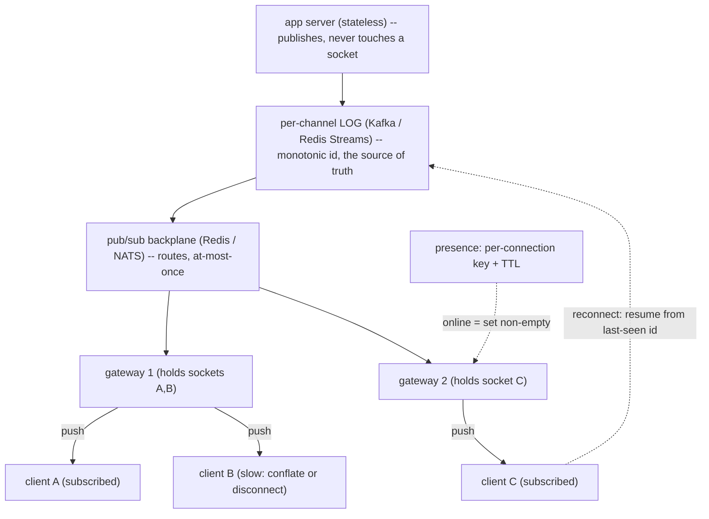

## Thesis

Real-time delivery is pushing data to connected clients the moment it changes --- a chat message, a live feed update, a presence change, a score --- which inverts the usual request/response model: the server must *push* rather than wait to be asked, so you need a **persistent connection** (WebSocket, SSE, or long-poll) and a **fan-out** strategy to route each event to the right connections. The two hard problems are the **transport choice** (bidirectional WebSocket versus server-push SSE versus a long-poll fallback, each trading capability against simplicity) and **fan-out** (on-write: push to every interested connection when an event happens, versus on-read: let clients pull and merge --- the classic timeline trade), layered on the operational reality of managing millions of *stateful* connections: a connection registry, graceful drains (a deploy is a mass reconnect --- you cannot migrate a live socket), presence, reconnection with resume, and backpressure when a client cannot keep up.

## Sub

**Why: the server must push, not wait to be asked** -> **transport: WebSocket (full-duplex) / SSE (server-push) / long-poll (fallback)** -> **fan-out: on-write vs on-read, and managing stateful connections at scale** -> **zoom out** to a connection-server + pub/sub-backplane architecture, presence, reconnection/resume with delivery guarantees, backpressure, and when polling is simply fine.

## Spine

- **Real-time delivery inverts request/response --- the server pushes** --- clients need updates the instant they happen, so instead of polling you hold a persistent connection and push events down it, which reshapes the architecture around stateful connections, a subscription model, and fan-out.
- **The transport is a capability-versus-simplicity trade** --- **WebSocket** (full-duplex, bidirectional --- the general answer for interactive apps); **SSE** (server-to-client only, over plain HTTP, simpler, auto-reconnecting --- great for one-way streams); **long-poll** (works everywhere, but inefficient --- a fallback); chosen by whether you need bidirectional and by client/network constraints.
- **Fan-out is the scaling decision** --- **fan-out-on-write** (push each event to all interested connections when it happens: fast reads, but write-amplifies for huge audiences) versus **fan-out-on-read** (clients pull and merge on demand: cheap writes, expensive reads), usually a **hybrid** (push for most, pull for celebrities) --- the timeline trade.
- **Managing stateful connections is the operational hard part** --- a connection registry mapping users to the servers holding their sockets, graceful drains (a deploy is a mass reconnect, because you cannot migrate a live socket --- only shed it), presence (who is online), reconnection with resume (miss nothing across a drop), and backpressure when a client falls behind --- all at millions of concurrent connections.

## Companion Notes

### walk

Pushing to connected clients the instant data changes

One live feature walked from polling to real-time push --- why the server must push, how WebSocket / SSE / long-poll trade capability against simplicity, how fan-out-on-write versus on-read is the scaling decision, and how you manage millions of stateful connections with a registry, a pub/sub backplane, presence, resume, and backpressure.

Say it as an inversion plus two decisions: the server pushes over a persistent connection (transport = WebSocket / SSE / long-poll), fan-out routes each event (on-write vs on-read), and the operational weight is managing stateful connections at scale.

### drill

Real-time-delivery reps

Graded reps on the transports, fan-out-on-write vs on-read, connection management, presence, and delivery guarantees --- the ones that separate "we added WebSockets" from a push architecture that fans out correctly and scales to millions of connections.

Anchor on push-not-poll, the transport trade (WebSocket bidirectional / SSE one-way / long-poll fallback), and the fan-out trade (on-write fast-reads-write-amplify vs on-read cheap-writes-expensive-reads, hybrid for celebrities).

### wb

Whiteboard

Rebuild the whole push path from memory --- polling's two failures, the transport choice, the gateway tier, the backplane, the log behind the socket, resume, presence, backpressure.

Draw the log first, then the socket on top of it. If you sketch the connection as the thing that delivers the message, you have already made the mistake the rest of the design is spent recovering from.

### sys

System Map

Zoom out: real-time delivery sits between the events the system produces and the sockets a user is holding open right now.

Lead with the tiers, not the transport --- "stateless producers publish, a backplane routes, a stateful gateway tier holds the sockets" --- and let them pull you into WebSocket-vs-SSE.

### trade

Trade-offs

The decisions they drill --- WebSocket vs SSE, on-write vs on-read, push vs poll, Pub/Sub vs a durable log --- each with the condition that flips it.

Always name the switch, never the winner --- "SSE until the client's upstream is itself a stream" beats "WebSockets are better," which is what a candidate who has only read about this says.

### model

Model Answers

Full spoken scripts --- the beats, in order, the way you would actually say them under time pressure.

Steal the arc, not the words --- inversion, tiering, guarantee --- and land on "persist before you push," which is the sentence most candidates never say.

### num

Numbers

Back-of-envelope the connection tier --- and know that memory, not ports, is what caps a gateway.

Lead with the memory arithmetic --- five million sockets at ~10 KB each is ~50 GB just to hold them idle --- because that is the cost of push that polling does not pay.

### rf

Red Flags

What sinks the round --- polling every second, fanning out a celebrity's post on write, treating the socket as the delivery, trusting Redis Pub/Sub for durability.

Name what the interviewer hears --- "would silently lose messages on every reconnect" is the fastest no-hire, and it is what "the client auto-reconnects, so we're covered" actually means.

### open

30-Second

The opener and the close --- matched to the altitude the question is asked at.

Match the altitude --- open on the inversion and the tiering, not on "I'd use WebSockets," which is the least interesting decision in the whole problem.

## Drill

all | All three levels, mixed --- the way a real loop actually comes at you
SDE2 | push vs poll, the transports, and fan-out
SDE3 | fan-out trade, connection routing, resume, presence
Staff | millions of connections, delivery semantics, architecture

### SDE2 | what real-time delivery is

What is real-time delivery, and why is polling a poor fit for it?

Real-time delivery is getting data to a client **the moment it changes** --- a new chat message, a live score, a feed update, a presence change --- rather than when the client next asks. Polling (the client repeatedly requesting "anything new?") is a poor fit for two reasons: **latency** (an update is only seen at the next poll, so a 5-second poll interval means up to 5 seconds of staleness --- shortening the interval reduces latency but multiplies load) and **waste** (the vast majority of polls return "nothing new," so you pay full request/response cost --- connection, auth, query --- for empty results, and this scales badly: a million clients polling every few seconds is enormous load, almost all of it wasted). The real-time answer inverts the model: instead of the client asking on a timer, the server **pushes** the moment something changes, over a **persistent connection** held open for exactly that purpose. That eliminates both the latency (delivery is immediate) and the waste (traffic flows only when there is something to send) --- at the cost of maintaining stateful connections, which is the complexity real-time delivery is really about.

Follow: You said polling wastes work because most polls return nothing. But a persistent connection costs memory around the clock even when it is idle. So when does polling actually win?
Compare the two cost curves and the answer falls out. **Polling cost is `users / interval`** --- a fixed request rate that is completely independent of the event rate, and it is *cheap per unit* if each poll is a cache hit (a Redis `GET` for an unread count is ~1ms and needs no connection state). **Push cost is `connections x per-connection memory`** --- paid permanently, even for a user who receives nothing all day --- plus the fan-out work on actual events. So polling wins whenever the **tolerable staleness is long**: at a 60-second interval, a million users is ~17,000 requests/second against a cache, which is nothing, and you get a stateless, cacheable, horizontally trivial service with no drains, no presence, no backpressure. Push wins when the **interval you would need is short**, because poll load is linear in `1/interval` --- driving 60s down to 1s is 60x the load, nearly all of it still returning nothing. The crossover is therefore set by the **latency requirement, not the user count**: polling scales much further than people assume *if each poll is cheap*, and you switch to push when you need sub-second, because push does work proportional to *events* rather than to the *polling rate*.
Follow: A client polls every 5 seconds and you switch it to a WebSocket. Have you actually reduced total server work, or just moved it?
Both --- and being precise about *which* dimension moved is the answer. You genuinely **eliminate CPU**: every poll was paying auth, routing, a query and a response serialization to discover that nothing had happened, and all of that disappears when the event rate is below the poll rate. But you **add a permanent memory cost** (kernel socket buffers plus app-side connection state, on every connection, all day, whether or not it ever receives a byte), you **add stateful routing** (a registry or a pub/sub backplane, because the event no longer originates on the machine holding the socket), and you **add operational weight** (you are now balancing long-lived *connections* rather than requests, graceful drains, reconnect storms, backpressure on slow clients). So the honest framing: you have traded **CPU-per-poll for memory-per-connection**, and you have converted a **stateless, cacheable, trivially-scalable** workload into a **stateful** one. That trade is clearly right when you need low latency and clearly wrong when you do not --- which is exactly why "should this be real-time?" is a real question and not a formality.
Senior: Framing push-vs-poll as a **cost curve with a crossover set by the latency requirement, not the user count** --- and naming what you *bought* (CPU) and what you *paid* (memory plus a permanently stateful tier) --- is what separates someone who has operated a push system from someone who assumes real-time is strictly better.
Speak: Lead with the inversion, then the cost: **"polling has a latency floor and pays full request cost to learn nothing, so the server pushes over a persistent connection instead."** Then the honest half --- you just traded CPU-per-poll for memory-per-connection and a stateful tier, which is why you only do it when the latency genuinely demands it.

### SDE2 | WebSocket basics

What is a WebSocket, and how does it differ from a normal HTTP request?

A WebSocket is a **persistent, full-duplex** connection between client and server: after an initial HTTP request that "upgrades" the connection (the `Upgrade: websocket` handshake), the same TCP connection stays open and both sides can send messages **at any time, in either direction**, until one closes it. That is the key difference from normal HTTP, which is request/response --- the client asks, the server answers, the connection is (logically) done, and the server cannot initiate. With a WebSocket the server can **push** a message to the client whenever it wants (no polling), and the client can send without a new handshake each time, with low per-message overhead (small frames, no repeated HTTP headers). This makes WebSockets the general-purpose transport for interactive real-time apps --- chat, collaborative editing, multiplayer, live dashboards with client input --- anywhere you need **bidirectional**, low-latency, ongoing communication. The trade is that it is a stateful, long-lived connection (which complicates load balancing, scaling, and deploys) and it is not plain HTTP (so some proxies/firewalls need configuration).

Follow: The browser's WebSocket constructor takes a URL and an optional subprotocol --- it will not let you set an `Authorization` header. So how do you actually authenticate the connection?
There are four options and each has a real cost. **(1) A cookie.** The handshake *is* an ordinary HTTP request, so cookies ride along automatically --- which is convenient and is also exactly what makes **cross-site WebSocket hijacking** possible, because WebSocket is *not* subject to CORS: any origin can open a socket to you and the browser will attach the victim's cookie. If you authenticate from a cookie you **must** validate the `Origin` header server-side against an allowlist; that check is not defence-in-depth, it is the defence. **(2) A token in the query string.** Simple and common, but the URL lands in access logs, proxy logs and browser history --- so you pass a **short-lived, single-use ticket** minted by an authenticated HTTP call, never a long-lived bearer token. **(3) The `Sec-WebSocket-Protocol` header**, which the browser *does* let you populate via the subprotocol argument, used as a token carrier --- it works and keeps the token out of the URL, but it is a hack and the server must echo back a valid subprotocol. **(4) Connect first, authenticate in-band**: accept the socket unauthenticated and refuse to service any message until the client's first message carries a valid token --- clean, but the socket is consuming a file descriptor and memory *before* it is authenticated, so you must rate-limit and aggressively time out unauthenticated connections or you have handed anyone a cheap resource-exhaustion vector. In practice: a **short-lived ticket** (option 2) or **first-message auth** (option 4), with an `Origin` check regardless.
Follow: Your WebSocket runs behind an ALB and an nginx. Users report the connection silently dying after about a minute of quiet. What is happening?
An **idle timeout in an intermediary** is reaping the connection. Load balancers and proxies close connections that have carried no traffic in either direction for N seconds --- AWS ALB's idle timeout defaults to **60 seconds**, and nginx's `proxy_read_timeout` also defaults to 60 --- and a WebSocket that is merely *open*, with nobody talking, looks exactly like an idle connection. The fix is an application-level **heartbeat**: the server sends a WebSocket **ping** frame on an interval comfortably shorter than the tightest idle timeout in the path (say every 30s), the client's stack automatically replies with a **pong**, and that traffic resets the idle timer on every hop in the chain. The heartbeat then does **double duty**, which is the part worth saying out loud: it keeps the middleboxes from reaping the socket, *and* it is how you detect a **dead peer** --- if a client's network vanishes without a clean close, TCP will happily hold the connection open for minutes, so a missing pong within a timeout window is what tells you the connection is actually gone. So the ping interval is dictated by the proxies, and the pong timeout is what drives your liveness detection --- and therefore your presence TTL.
Senior: Knowing that the browser **cannot set headers on the upgrade** (so auth rides a ticket, a cookie-plus-`Origin`-check, or a first message), and that a **proxy idle timeout is what silently kills quiet sockets** (so heartbeats are load-bearing, not cosmetic) --- is the operational detail that shows you have actually run WebSockets in production rather than read the RFC.
Speak: Define it crisply --- **"persistent, full-duplex, after an HTTP upgrade; the server can push at any time and per-message overhead is a small frame, not a header block."** Then the two production realities: **you cannot set an auth header on the handshake**, so a short-lived ticket or a first-message auth, and **heartbeats are mandatory**, because a proxy's 60-second idle timeout will quietly reap a healthy, quiet connection.

### SDE2 | SSE basics

What is Server-Sent Events, and when is it a better fit than WebSocket?

Server-Sent Events (SSE) is a **one-way, server-to-client** streaming protocol built on **plain HTTP**: the client opens a normal HTTP request to an event endpoint, the server keeps it open and streams a sequence of text events down it (`text/event-stream`), and the client receives them as they arrive. It is a better fit than WebSocket when the flow is **only server-to-client** --- a live feed, notifications, a stock ticker, progress updates, a dashboard the client only *reads* --- because it is **simpler**: it is just HTTP (so it works through standard proxies, load balancers, and HTTP/2 without special handling), the browser's `EventSource` gives you **automatic reconnection** and an event-id/`Last-Event-ID` resume mechanism for free, and there is no upgrade handshake or framing to manage. Its limits are that it is **unidirectional** (the client cannot send over the same channel --- it uses a normal HTTP request for that), it is **text-only**, and (over HTTP/1.1) browsers cap concurrent connections per domain. So the rule of thumb: if the client only needs to *receive* a stream, SSE is the simpler, HTTP-native choice; if it needs to *send* over the same low-latency channel, reach for WebSocket.

Follow: You said EventSource gives you auto-reconnect and resume "for free." Say exactly what the browser does --- and where that guarantee stops.
The browser gives you the **cursor plumbing and nothing else**, and the gap is where people get burned. Mechanically: the server tags events with an `id:` field; the browser remembers the last id it saw; on a dropped connection it **reconnects automatically** and replays that id back to you in a **`Last-Event-ID` request header** (it also honours a `retry:` field to set the reconnect delay). That is genuinely free. What is **not** free is the only part that matters for correctness: **the server must actually be able to replay from that id**, which means you need a **retained per-channel event log** (a ring buffer, a Redis stream, a Kafka topic) with a **retention window**, and a defined behaviour for a client whose cursor has fallen *outside* that window --- it must be told to discard its state and re-sync from a snapshot, not silently handed a partial stream. Two more sharp edges: EventSource **will not reconnect** if the server closes the stream cleanly (a `204`) or responds with the wrong content type or a non-2xx --- those are fatal and it just fires `error` and stops --- and the auto-reconnect is *per-connection*, so it does nothing about a server that is up but has lost the client's subscription. So: "free resume" means free *transport* resume; **the durability is entirely yours to build**, and it is exactly the same log-and-cursor machinery a WebSocket design needs.
Follow: But the client also needs to send things --- a typing indicator, a read receipt, an ack. You said SSE is one-way. Does that kill SSE for this app?
Not necessarily, and the deciding variable is the **upstream rate**, not the mere existence of upstream traffic. SSE is one-way, but the client is not mute --- it just sends over an **ordinary HTTP POST** on a separate request. That is a genuinely good architecture when the upstream is **low-rate and not latency-critical** (an ack, a read receipt, a typing ping every few seconds): the POSTs are **stateless**, so they can hit *any* server (no sticky routing), they carry **standard auth headers** and pass through all your normal HTTP middleware, and you pay one request's overhead per upstream message. It stops working when the upstream is itself **a stream** --- a collaborative editor shipping keystroke-level operations, a game's input, a client that must send tens of messages a second --- where a full HTTP request per message is both too slow (a round-trip, no persistent framing) and too expensive, and you would end up hand-rolling batching, which is precisely the complexity you were trying to avoid. So the rule: **SSE-down plus POST-up is the right shape for "mostly download" features, and most "live" features are mostly download.** You reach for WebSocket when the *upstream* is high-rate or latency-critical. Naming the upstream rate as the switch --- rather than "the client needs to send, therefore WebSocket" --- is the answer.
Senior: Being able to say that EventSource's free reconnect gives you the **cursor, not the durability** --- you still owe a retained event log and an explicit out-of-retention re-sync path --- and that the SSE-vs-WebSocket switch is the **upstream message rate**, not merely whether the client sends at all, is the transport fluency this card is probing.
Speak: **"SSE is one-way server-to-client over plain HTTP, with free auto-reconnect and `Last-Event-ID` resume."** Then the two things people miss: the resume is free only as *plumbing* --- **you still have to keep a replayable log** --- and one-way is not disqualifying, because the client can just POST; you only need WebSocket when the **upstream itself is a stream**.

### SDE2 | long-polling

What is long-polling, and why is it considered a fallback rather than a first choice?

Long-polling simulates push over ordinary request/response: the client sends a request and the server **holds it open** (does not respond) until there is data to return *or* a timeout; when the server responds (with the new data or empty on timeout), the client **immediately issues another** request, so there is almost always an outstanding request waiting to be answered the instant an event occurs. This gives near-real-time delivery using only standard HTTP (no WebSocket upgrade, works through any proxy/firewall), which is why it was the classic pre-WebSocket technique and remains a **fallback** for environments where WebSocket/SSE are blocked or unsupported. It is a fallback rather than a first choice because it is **inefficient**: each delivery still incurs a full HTTP request/response cycle (headers, connection handling, re-auth), there is overhead in constantly re-establishing requests, and a gap exists between one response and the next request where an event could arrive (mitigated but not eliminated by holding a request open). WebSocket and SSE deliver the same immediacy with a single persistent connection and far less per-message overhead, so long-poll is used mainly for compatibility, not as the primary transport in a new system.

Follow: You said there is a gap between the server's response and the client's next request. Doesn't that mean long-polling can silently lose an event that fires in the gap?
It does if you implement it naively --- and the fix is not a transport fix, it is a **cursor**. If the server's model is "hold the request open and push whatever happens *next*," then an event firing after the response is flushed but before the next request lands has nowhere to go, and it is gone. A correct long-poll is therefore **stateless and resumable**: the client sends its **last-seen sequence id** with *every* poll, and the server's first action is to check the per-channel log for anything **after that cursor**. If there is, it returns **immediately** with the backlog --- it does not hold at all --- and only if there is genuinely nothing new does it hold the request open waiting for the next event. Now the gap is harmless: whatever fired during it is simply already in the log, and it comes back instantly on the next poll. The important consequence, and the thing worth saying, is that this makes long-poll need **exactly the same machinery as WebSocket and SSE** --- a per-channel log, monotonic ids, and a client cursor. **The transport differs; the delivery guarantee does not.**
Follow: You keep a long-poll fallback alongside WebSocket. What does that cost you architecturally that a WebSocket-only design never pays?
It forces **sticky routing** you would otherwise not need, and that is a bigger deal than it sounds. A WebSocket is **one TCP connection**: the load balancer makes exactly one routing decision, at the upgrade, and after that the connection is a fixed pipe to that gateway --- there is no subsequent request to mis-route. Long-poll is the opposite: it is a **sequence of independent HTTP requests**, and each one can be balanced onto a *different* gateway. So unless the session state (the subscription set, the cursor, any pending buffer) is either **shared** in a backplane/Redis so any gateway can serve the poll, or the requests are **pinned** to one gateway with sticky sessions, the fallback is simply broken. This is precisely why Socket.IO documents sticky sessions as a **hard requirement** for multi-node deployments using its HTTP long-polling transport. So the fallback drags in a shared session store or LB stickiness, **plus a second delivery code path** that only a small population exercises --- which means it is also the path where bugs hide longest. The honest modern call: measure your actual WebSocket failure rate first, and be willing to conclude that "WebSocket, with SSE as the fallback, and no long-poll at all" is the better engineering trade.
Senior: Recognising that a correct long-poll is **cursor-based, not gap-prone** --- so the *delivery guarantee* is identical across transports and only the plumbing changes --- and that the fallback's real cost is **dragging sticky routing and a second code path into an otherwise pinned-by-construction design**, is the systems-level read this card wants.
Speak: **"Hold the request open, respond on an event, immediately re-issue --- near-real-time over plain HTTP."** Then the two things that matter: it only loses events if you forget the **cursor** (send the last-seen id on every poll and the gap is harmless), and keeping it as a fallback is what **forces sticky sessions** on you --- which a WebSocket-only design never needs, because a socket is pinned by construction.

### SDE2 | WebSocket vs SSE vs long-poll

How do you choose between WebSocket, SSE, and long-polling?

By **directionality** and **constraints**. If you need **bidirectional** low-latency communication (client sends *and* receives continuously --- chat, collaboration, games, anything interactive), use **WebSocket** --- it is the general-purpose full-duplex transport. If the client only needs to **receive** a stream (notifications, live feeds, tickers, progress), use **SSE** --- it is simpler, HTTP-native, works through standard infrastructure, and gives free auto-reconnect and resume. If your environment **cannot use** WebSocket or SSE (a restrictive proxy/firewall, an old client, a network that blocks upgrades), fall back to **long-polling** --- it works over plain request/response everywhere, at the cost of efficiency. The decision tree: bidirectional needed -> WebSocket; server-to-client only -> SSE; neither supported -> long-poll fallback. A robust real-time system often **degrades gracefully** (try WebSocket, fall back to SSE, then long-poll) so it works across all clients while using the best available transport for each. The one-liner: WebSocket for two-way, SSE for one-way-and-simple, long-poll for compatibility.

Follow: You said "degrade gracefully --- try WebSocket, fall back to SSE, then long-poll." Is building that ladder actually worth it today?
Usually **no**, and having a considered view here is the point rather than reciting the ladder. The three-transport cascade is a **legacy of an era when WebSocket support was genuinely patchy** --- old browsers, corporate middleboxes that mangled the `Upgrade` handshake. Today WebSocket is supported by every current browser and every major CDN and load balancer, so the population that truly *cannot* establish one is small and shrinking --- mostly clients behind hostile enterprise proxies. Meanwhile the ladder costs real money: **three transports to implement and test**, **sticky routing you would otherwise not need** (because of long-poll), and a matrix of bugs that only manifest on the path almost nobody takes --- which is exactly where defects survive longest. So the disciplined answer: **pick one transport that matches the directionality, instrument the connection-failure rate, and only buy a fallback if the data says a meaningful population is failing.** The exception is when you *know* your users sit behind hostile middleboxes (enterprise, government, some mobile carriers), where the fallback is a requirement rather than a nicety. The senior signal is not knowing the ladder --- it is saying **"I would measure the failure rate before paying for it."**
Follow: Chat is bidirectional, so WebSocket. But a chat client mostly just *receives*. Could you actually build chat on SSE plus POST?
Yes --- people ship exactly that --- and knowing **why you might not** is the real answer. SSE-down plus POST-up genuinely works for chat: the stream carries incoming messages, and the client POSTs the ones it sends. You buy HTTP-native infrastructure, **free reconnect and `Last-Event-ID` resume**, standard auth headers, and stateless upstream requests. What you give up: **(1) upstream latency and overhead** --- every sent message is a full HTTP request rather than a frame on an already-open socket, which starts to hurt badly once you add the *high-rate* signals a modern chat actually has (typing indicators, read receipts, delivery acks, presence pings), at which point you are batching POSTs and have re-invented the complexity you avoided; **(2) no cheap server-initiated request/response** over the same channel; and **(3) binary** --- SSE is text-only, so anything binary needs base64, roughly a 33% inflation. So the honest split: for a **low-interactivity** chat (a support widget, a comment thread) SSE+POST is arguably the *better* engineering choice --- simpler, and resume comes free. For a **high-interactivity** chat, the upstream genuinely *is* a stream and WebSocket is the right tool. "Chat means WebSocket" is a reflex; **"the upstream rate decides"** is an answer.
Senior: Refusing to recite the graceful-degradation ladder as dogma --- **naming its real cost (three code paths plus the sticky routing long-poll forces on you) and proposing to measure the failure rate before buying it** --- and being able to defend SSE+POST for a low-interactivity chat, is what distinguishes judgment from memorised decision trees.
Speak: Give the tree, then the judgment: **"bidirectional means WebSocket; receive-only means SSE; long-poll only for compatibility."** Then the part most people skip --- **the ladder is not free** (three transports, and long-poll is what drags sticky sessions in), so I would ship one transport, measure the connection-failure rate, and only buy the fallback if the data justifies it.

### SDE2 | what fan-out is

In a real-time system, what does fan-out mean?

Fan-out is **routing a single event to all the connections that should receive it**. When something happens --- a user posts a message in a channel, a match scores, a document is edited --- that one event must reach every client currently subscribed to it, which may be one connection or a million, spread across many servers. Fan-out is the logic that answers "who cares about this event, and which connections do I push it to?" It is a core problem because in real-time the interested clients are *connected right now* (unlike a database write, which just persists), so delivering an event means finding the relevant live connections and writing to each of them --- and at scale those connections are distributed across a fleet of servers, so fan-out involves both figuring out the recipient set (subscriptions, channel membership, followers) and physically routing the event to whichever servers hold those connections (typically via a pub/sub backplane between servers). How you do fan-out --- eagerly on write to everyone, or lazily on read as clients pull --- is *the* central scaling decision in real-time delivery, because the cost and latency profile of the whole system depends on it.

Follow: Concretely, where does the subscription set actually live --- in each gateway's memory, or in a shared store?
**Both, at different scopes, and that split is the whole design.** Each gateway holds, in **local memory**, the map `channel -> the sockets on THIS gateway subscribed to it` --- which is what makes the final hop a cheap in-process loop over a set, with no network call and no lookup per recipient. What is **shared** is the routing layer above it: the gateway **subscribes to the channel on the backplane** (`SUBSCRIBE chan:123` on Redis, a NATS subject), so the bus itself knows which gateways care, and **the bus does the cross-machine fan-out**. A message published once therefore travels: producer -> bus -> the N gateways that have at least one subscriber -> each gateway's local loop -> its M sockets. The consequence worth stating, because it is the thing that makes fan-out tractable, is that **the expensive dimension is the number of distinct gateways holding a subscriber, not the number of recipients**: 10,000 recipients spread across 20 gateways is **20** bus deliveries and 20 in-memory loops --- not 10,000 point-to-point sends. That is exactly why you route by **topic** and let the bus demultiplex, rather than looking each user up in a registry and issuing a directed send per person.
Follow: So if the bus routes by channel, when do you need a per-user connection registry at all?
Only for **directed** messages --- "deliver this to user U, wherever they are" --- where there is no natural channel to publish to. There are two ways to handle it and the trade is real. **(1) Give every user their own channel** (`user:U`): the registry disappears entirely, because the gateway holding U's socket simply subscribes to `user:U`, and a directed send is just a publish. This is elegant and it is what most systems do --- but it means the backplane must carry **one subscription per connected user**, i.e. millions of them, so the bus has to handle **very high subscription cardinality** cheaply. Redis Pub/Sub channels and NATS subjects are built for exactly that; **Kafka topics are emphatically not**. **(2) Keep an explicit registry** (`user -> gateway`, in Redis) and route the directed message to that one gateway. This keeps the bus's subscription cardinality low, but it puts a **lookup on the hot path** and introduces a **consistency problem**: the registry goes stale the instant a user reconnects to a different gateway, so you need a TTL, re-registration on connect, and a fallback path when the send to the recorded gateway fails. In practice the **per-user-channel** approach wins *unless your bus cannot take the cardinality* --- and knowing that **bus cardinality is the deciding constraint** is the actual answer.
Senior: Splitting the subscription state correctly --- **a local `channel -> sockets` map on each gateway, and a topic subscription on a shared bus** --- and drawing the conclusion that **fan-out cost scales with gateways-holding-subscribers, not with recipients**, is the insight that turns fan-out from "loop over users" into an architecture.
Speak: **"Fan-out is routing one event to every connection that should get it --- and at scale those connections live on different machines."** The move: each gateway keeps a **local `channel -> sockets` map**, and subscribes to that channel on a **bus**, so an event published once reaches only the gateways that care. The cost scales with **gateways**, not recipients --- which is why you route by topic, not by looking up each user.

### SDE2 | presence basics

What is presence, and why is it trickier than it looks?

Presence is knowing and showing **who is currently online / active** --- the green dots, "3 people viewing," "typing...", "last seen." It looks simple (a user is online if they have a live connection) but is trickier than it appears because connection state is **unreliable and distributed**: a client can drop without cleanly closing (a dead network, a killed app), so you cannot rely on a "disconnect" event to mark them offline --- you need **heartbeats** (periodic pings) and a **timeout/TTL** (if no heartbeat for N seconds, consider them offline). It is distributed (a user's connection lives on one of many servers, so presence state must be shared or aggregated across the fleet, often in a fast store like Redis with a TTL keyed by user). It is high-churn (presence changes constantly as people connect/disconnect, and each change may need to fan out to everyone watching that user --- so a popular user coming online can itself be a fan-out spike). And it has consistency quirks (a user on two devices, brief flaps on a flaky network). So presence is a small feature with the full real-time problem inside it: unreliable connection detection (heartbeats + TTL), distributed state (a shared store), and fan-out of the changes.

Follow: Your heartbeat is 30 seconds and the TTL is 60. A user shuts their laptop. How long do their friends see a stale green dot --- and can you just shrink the numbers?
Up to the **full TTL --- 60 seconds** --- because the last heartbeat may have landed a moment before the laptop died, so the key survives its entire remaining lifetime. And no, you cannot simply shrink the numbers, because **presence write load is `connections / heartbeat_interval`**: at 5 million connections with a 30s heartbeat that is already **~167,000 writes/second** doing nothing but keeping green dots alive; halving the interval to 15s **doubles it to ~333k/sec** to buy a 30-second improvement in worst-case staleness. So the dial has a price. What you actually do instead is three things. **(1) Take the clean disconnect whenever you get one** --- a closing tab sends a WebSocket close frame and TCP FIN usually arrives, so the gateway marks the user offline **immediately**; the TTL is only the backstop for the **unclean** case (dead network, killed process, closed lid). That is what makes presence *feel* instant in the common case. **(2) Accept the staleness where it is harmless and refuse it where it is not** --- a stale green dot is fine; **routing a call or a delivery decision off a 60-second-stale presence key is not**, so anything that gates behavior must confirm liveness rather than trust presence. **(3) Make the writes cheap enough that you can afford a shorter interval** --- batch every gateway's heartbeat refreshes into one pipelined write rather than a round-trip per connection. Naming that **presence latency is bought with heartbeat write load**, and that the **clean-close path** is what actually makes it feel instant, is the answer.
Follow: A user is connected on their phone and their laptop, and the laptop drops. What breaks in a naive presence implementation?
A naive single `presence:user_id` key gets **clobbered by the wrong device**. Two failure shapes: if the laptop's disconnect handler does a `DEL presence:U`, the user is marked **offline while their phone is still connected** --- a false offline, and one that is very visible. If instead you rely only on the TTL, the phone's heartbeats keep refreshing the shared key, so you can never observe the laptop leaving --- fine for a binary "is the user online," but wrong the instant you need **per-device** state (route the push to the *live* device, show "active on mobile," stop pushing to a device that is gone). The fix is that **presence is a set, not a boolean**: key it **per connection**, not per user --- `presence:U` is a Redis **hash or sorted set of connection/device ids**, each carrying its own last-heartbeat timestamp (a sorted set scored by timestamp is the usual trick, because Redis cannot TTL individual set members, so you expire stale members by score). A user is online iff the set is **non-empty after pruning stale members**, and the laptop's entry ages out on its own without touching the phone's. And the thing you actually broadcast is the **edge**: only a transition from empty to non-empty (or back) is a presence *change*, so a device dropping while another stays connected fires **no notification at all**. Modeling presence as a **union over live connections, with fan-out keyed on the transition rather than the heartbeat**, is what makes multi-device correct and cheap simultaneously.
Senior: Treating presence as a **union over per-connection entries with independent TTLs** (not a per-user boolean), broadcasting **only the transition edge** rather than every heartbeat, and being able to state that **presence write load is `connections / interval`** so the staleness dial has a real price --- is what separates a working presence system from the one that either lies about multi-device users or melts Redis.
Speak: **"Online means a live connection --- but connections die dirty, so it is heartbeat plus TTL, not a disconnect event."** Then the two things that bite: it must be a **set of devices, not a boolean** (or one device's drop marks a multi-device user offline), and you only fan out the **transition**, never the heartbeats --- because presence is high-churn, low-value data and it should be the cheapest thing in the system, not the most expensive.

### SDE3 | fan-out-on-write vs fan-out-on-read

Explain fan-out-on-write versus fan-out-on-read and when each is right.

They are the two ways to deliver an event to an audience, trading write cost against read cost. **Fan-out-on-write** (push): when an event happens, **immediately deliver it to every interested recipient** --- write it into each follower's feed/inbox, or push it down each subscribed connection. Reads are then trivial and fast (the data is already there / already delivered), but the **write** amplifies: one post by a user with a million followers is a million writes/pushes, so it is expensive (and bursty) for large audiences. **Fan-out-on-read** (pull): when an event happens, **store it once**; each client **pulls and merges** the relevant events when it reads (query the sources you follow and combine). Writes are cheap (one write), but **reads** are expensive (each read does the fan-out work --- querying and merging many sources). The rule: fan-out-on-write when the audience is bounded and reads dominate (most users, chat channels, most feeds --- you want instant delivery and cheap reads); fan-out-on-read when the audience is huge or writes dominate (a celebrity's millions of followers --- you cannot afford a million writes per post). This is the classic timeline design trade, and real systems rarely pick one globally.

Follow: In a *real-time push* system, is the write-amplification argument even the same as it is for a materialized feed? I am not writing a million rows --- I am pushing to whoever is connected.
It is **not the same**, and catching that is what separates someone who has built push from someone reciting the timeline chapter. There are **two different fan-outs with two different values of N**. **Feed materialization** fans out to *all* followers --- writing into a million inboxes, most of whom are offline and will read hours later. **Live push** fans out only to **currently connected** subscribers --- and at any instant that is a small fraction of the audience (a few percent of a million followers), which is far cheaper *and inherently self-limiting*: you literally cannot push to a socket that does not exist. So the **write-storm problem belongs to the durable feed, not to the live push.** The real system does **both, tiered**: push in real time to the connected (bounded by *concurrency*, not by follower count), and write to a **durable feed/log** so everyone else picks it up on next read --- and it is *that* write, the one that must reach people who are absent, that carries the million-write amplification and needs the celebrity special-case. Being able to say **"the live fan-out is bounded by who is online; the expensive fan-out is the one aimed at people who are not"** is exactly the precision this question is fishing for.
Follow: You said on-read is "cheap writes, expensive reads." If a user follows 500 accounts, what does that read actually cost --- and how do you keep it under a second?
Naively it is a **500-way scatter-gather plus a k-way merge** on every single feed load, which is genuinely bad --- and the reason nobody ships a *pure* on-read design is precisely that it does not survive this question. You keep it fast by making sure **k is never 500**. **(1) In the hybrid, on-read is only used for the celebrity tail**, so the merge is over the *handful* of high-fan-out accounts a user follows (typically single digits), not all 500 --- the other ~495 were pushed and are already materialized in the feed. Collapsing k from 500 to ~5 is the entire reason the hybrid works. **(2) Cache the hot sources.** A celebrity's recent timeline is read by *millions* of followers, which makes it the **most cacheable object in the system** --- one cache entry serves every follower's merge, so the read is k **cache hits**, not k database queries. **(3) Bound the merge**: you only need the top ~20 items, so it is a bounded k-way merge over pre-sorted, already-cached lists --- microseconds, not a scan. So the honest answer is that **on-read at k=500 genuinely does not hold up**, which is *why* you push the bulk (to collapse k) and cache the sources that the remaining k points at.
Senior: Distinguishing the **live push fan-out (bounded by who is connected)** from the **durable feed fan-out (bounded by the whole audience)** --- and recognising that the write storm lives in the second, not the first --- plus knowing that on-read is only viable because the hybrid **collapses k to a handful and caches it**, is the depth that shows you have reasoned about this rather than memorised it.
Speak: **"On-write: pay at write, reads are instant, but one post to a million followers is a million writes. On-read: pay at read, one cheap write, but every read re-does the fan-out."** Then the distinction most people miss: **in live push you only fan out to who is connected** --- the million-write storm is in the *durable feed*, for the people who are *not*.

### SDE3 | the hybrid fan-out

Why do large feed systems use a hybrid of fan-out-on-write and on-read?

Because neither pure strategy works across the whole user base: fan-out-on-write is great for normal users (bounded followers, instant delivery, cheap reads) but catastrophic for celebrities (millions of writes per post), while fan-out-on-read is fine for celebrities (one write) but makes *every* read expensive for *everyone*. The hybrid takes the best of each: **fan-out-on-write for normal accounts** (push their posts into followers' feeds --- most posts, bounded fan-out, fast reads) and **fan-out-on-read for celebrity accounts** (do *not* fan out their posts on write; instead, when a user reads their feed, **merge in** the recent posts of the few celebrities they follow, pulled on demand). So a user's feed is "pre-computed pushed posts from normal follows" + "pulled-and-merged posts from the handful of celebrities" --- avoiding the million-write storm while keeping most of the feed pre-materialized and reads cheap. The threshold (what counts as a "celebrity") is a tuned cutoff on follower count. This is exactly how systems like Twitter/Instagram approach the timeline: the write-amplification problem is concentrated in a few high-fan-out accounts, so you special-case *those* to pull while everyone else pushes --- a targeted hybrid rather than one global strategy.

Follow: An account sits just under the celebrity threshold, then crosses it. What actually happens at that boundary --- and does anything break?
Two real problems, neither exotic. **First, the flip is not free, because history does not flip with it.** Followers already have that author's *older* posts materialized in their feeds, while its *new* posts must now be merged in at read time --- so the read path has to produce a correct, correctly-ordered feed from a **mix of materialized and pulled items for the same author**. That forces two properties: the merge must be **by timestamp/sequence, not by source**, and it must **de-duplicate**, because an item can be both pushed *and* returned by the pull (a fan-out job already in flight when the flip lands). **Second, the boundary is a flapping hazard**: an account oscillating around the cutoff would flip strategy repeatedly, so you add **hysteresis** --- promote at, say, 100k followers but only demote below 80k --- and make the flip an **explicit asynchronous state change** on the account, not a value recomputed from follower count on every post. And the framing that lands it: this is *why* the threshold is a **tuned operational knob rather than a clean rule** --- the difficulty is not picking the number, it is making the read path tolerate **both strategies coexisting for the same author**.
Follow: Is follower count even the right signal? Give me a case where it picks wrong.
It picks wrong **in both directions**, and naming that shows you have thought past the textbook. **False positive:** a **dormant** account with five million followers that posts once a year. By follower count it is a celebrity, so you pull it --- forcing every one of its followers to pay a merge cost on *every* feed read, forever, to avoid a write storm that occurs... annually. The quantity you actually care about is `followers x posting_rate`, and follower count prices only one of the two terms. **False negative:** a **high-frequency** account with 20k followers posting hundreds of times a day (a bot, a live-scores feed, a monitoring channel) sails under the threshold and gets fan-out-on-write on *every* post --- a steady, grinding write load that in aggregate can exceed the celebrity you were worried about. So the better signal is the **product: expected deliveries per unit time** --- optimize on the *write rate the account generates*, not its raw audience. In practice you would also weight by **how many of those followers are actually active** (fanning out to a million dormant accounts is mostly wasted writes), and let the threshold be **adaptive** rather than one global constant. The senior move is recognising that follower count is a **proxy** for delivery-cost-per-unit-time, and that every proxy has a domain where it is wrong.
Senior: Knowing that the hybrid's hard part is **not choosing the threshold but making the read path merge materialized and pulled items for the same author** (by sequence, with dedupe, with hysteresis on the flip) --- and that **follower count is a proxy for `followers x post_rate`** that mis-fires on dormant celebrities and high-frequency small accounts --- is well past the textbook answer.
Speak: **"Push for normal accounts so reads are instant; pull for celebrities so one post is one write --- and merge the two at read time."** Then the part that shows depth: the threshold is a **tuned knob with hysteresis**, the read path must **merge pushed and pulled items for the same author by sequence and dedupe**, and follower count is only a **proxy** --- what you actually care about is followers times posting rate.

### SDE3 | connection routing at scale

A user's WebSocket is on server A, but the event that concerns them is produced on server B. How does it get delivered?

Through a **pub/sub backplane** plus a **connection registry**, because with many connection servers, the server producing (or receiving) an event is usually *not* the one holding the target user's socket. Two common patterns: (1) **Registry lookup** --- a shared registry (e.g. Redis) maps `user_id -> which server holds their connection`; server B looks up the target, then routes the message to server A (directly or via the bus), and A writes it to the socket. (2) **Pub/sub broadcast** --- servers subscribe to channels on a message bus (Redis Pub/Sub, Kafka, NATS); when an event for channel X occurs, it is published to the bus, and *every* server that holds a connection subscribed to X receives it and pushes to its local sockets --- no per-user lookup, the bus does the routing by topic. In practice large systems use a backplane so connection servers are decoupled from where events originate: any server can accept a connection, any producer can emit an event, and the bus (with topic/channel routing) delivers it to the servers that need it. The key idea is that the fleet of stateful connection servers is glued together by a pub/sub layer that turns "deliver to this user/channel" into "publish to a topic the right servers are listening on" --- so you never require the event and the connection to be on the same machine.

Follow: You named Redis Pub/Sub as the backplane. A gateway briefly loses its Redis connection and reconnects. What did its clients miss --- and did anything tell you?
They missed **everything published during the gap, silently** --- and this is the single most important property of Redis Pub/Sub to have internalised: it is **fire-and-forget, at-most-once, with no persistence, no replay and no acknowledgment**. A `PUBLISH` is delivered only to subscribers connected **at that instant**; a subscriber that is away misses those messages **permanently**, and neither side is informed. So a gateway that blips loses messages for **every client it was holding**, and the clients have no idea anything happened. That is precisely why a serious design **does not put its delivery guarantee in the pub/sub layer**: the backplane is a **routing** mechanism (get this event to the gateways that care, fast), and the **durability lives somewhere else** --- a per-channel event log with a monotonic sequence id (Redis Streams, Kafka) that clients resume from by cursor. The gateway's job on reconnect is therefore **subscribe first, then backfill**: re-subscribe so nothing *new* is missed, then read the log from each client's last-acked id to close the gap, and let client-side dedupe-by-id absorb the overlap. If you genuinely want a durable bus, that is the argument for **Redis Streams / Kafka / NATS JetStream** instead of plain Pub/Sub --- you pay cost and complexity for replayability. **Expecting plain Pub/Sub to be reliable is the classic mistake here.**
Follow: Why not just use Kafka as the backplane? It is durable, ordered, and you already run it.
Because **channel cardinality breaks the model**, and that is the real reason rather than performance. Kafka's unit of routing is a **topic/partition**, which is a **heavyweight, persistent** object --- files on disk, per-partition metadata and memory on every broker --- so a cluster handles **thousands to low tens of thousands** of partitions comfortably, **not millions**. A real-time system has the opposite profile: an enormous number of **cheap, ephemeral channels** --- one per conversation, per document, and (for directed sends) **one per connected user** --- easily millions. **You cannot create a Kafka topic per chat room.** So Kafka forces you into the other shape: a **fixed, modest number of partitions** with the routing key hashed into them, which means a gateway **can no longer subscribe to just the channels its clients care about** --- it must consume **whole partitions and filter locally**, discarding the overwhelming majority of what it reads. That is tolerable on a small fleet and **terrible as you scale**, because every gateway's inbound bandwidth then grows with **total system traffic** instead of with *its own* subscribers' traffic. Redis Pub/Sub and NATS are built for exactly the opposite profile --- millions of cheap, ephemeral subjects with **server-side demux**. Hence the usual answer: **Kafka (or Redis Streams) for the durable, replayable per-channel log where ordering and retention are the point, and a cardinality-friendly bus (Redis Pub/Sub, NATS) for the live routing** --- each doing what it is actually good at, instead of forcing one to do both.
Senior: Knowing that **Redis Pub/Sub is at-most-once with no replay** (so the guarantee must live in a separate log, and the reconnect order is subscribe-then-backfill), and that **Kafka's heavyweight topics cannot express millions of ephemeral channels** (forcing consume-everything-and-filter) --- is exactly the backplane literacy that separates a real design from a box labelled "pub/sub."
Speak: **"The event and the socket are almost never on the same box, so a pub/sub backplane routes by channel to the gateways holding subscribers."** Then the two things that decide the tech: **plain Redis Pub/Sub is at-most-once** --- so the durability lives in a separate per-channel log, not in the bus --- and **Kafka cannot do millions of ephemeral channels**, so it is the log, not the router.

### SDE3 | sticky sessions and scaling stateful connections

WebSocket connections are stateful and long-lived. What does that mean for load balancing and scaling?

It means you cannot treat servers as interchangeable per-request the way you do with stateless HTTP --- a WebSocket is **pinned to the specific server** that terminated it for the connection's whole life. Be precise about *why*, because this is exactly where the folklore starts: it is pinned **by construction**, not by a stickiness setting. The load balancer makes exactly **one** routing decision, at the HTTP upgrade, and thereafter the TCP connection is a fixed pipe to that gateway --- there is no second request for an affinity cookie to steer. Consequences: **load is per-connection, not per-request**, and it is uneven and long-lived, so you balance *new* connections across servers and watch for hot servers accumulating connections; **scaling out** adds capacity for *new* connections but does not rebalance existing ones (they stay put until they reconnect), so you scale ahead of demand and rely on natural reconnection churn to spread load; **deploys are disruptive** --- restarting a server drops all its connections, so you **drain gracefully** (stop taking new connections, let existing ones migrate/reconnect, or signal clients to reconnect elsewhere) rather than hard-restart; and **failure** of a server drops its connections, so clients must **reconnect** (to another server) and resume. The mental model shift is from stateless-and-fungible to stateful-and-pinned: connection servers hold state (the sockets), so balancing, scaling, and deploys are all about managing long-lived connections and their reconnection, not routing independent requests.

Follow: Hold on. A WebSocket is one TCP connection --- once the upgrade lands on a gateway, the connection *is* pinned. So why would you need sticky sessions at all?
**You largely do not, and catching that is the point** --- "WebSockets need sticky sessions" is one of the most reflexively repeated and least examined lines in real-time design. For a pure WebSocket you are exactly right: the load balancer makes **one** routing decision, at the HTTP upgrade, and thereafter the TCP connection is a fixed pipe between that client and that gateway. There is **no subsequent request to route**, so there is nothing for a stickiness cookie to do. Stickiness genuinely matters in three narrower places: **(1) the long-poll / HTTP fallback**, where the "connection" is really a *sequence of independent HTTP requests* that must land on the gateway holding the session state --- which is exactly why Socket.IO documents sticky sessions as a hard requirement for multi-node deployments using its polling transport; **(2) a multi-request handshake**, where a library establishes session state on one node and then upgrades (same root cause); and **(3) sidecar HTTP endpoints** that need to read connection-local state. So the accurate statement is not "WebSockets need sticky sessions" --- it is **"WebSockets are pinned by construction; it is the HTTP fallback that needs stickiness."** What *does* actually bite you about statefulness has nothing to do with the load balancer: **load is per-connection and long-lived** (so scaling out only helps *new* connections and never rebalances existing ones), and **a deploy or a crash drops every socket on that box at once**. Those are the real consequences; the stickiness is mostly folklore.
Follow: You scale from 10 gateways to 20 during a spike. The 10 new boxes sit nearly empty. What do you actually do about that?
Mostly **accept it, and design so you do not need to** --- because this is the defining property of a stateful tier: **scaling out adds capacity only for *new* connections.** Existing sockets are pinned for life and **nothing migrates them**, so the new boxes fill only as fast as clients naturally churn (reconnects, app restarts, network changes) --- fast for a mobile app, glacial for a desktop tab left open all day. That drives three real moves. **(1) Scale ahead of demand, not in reaction to it.** An autoscaler that reacts *after* the connections have landed is closing the barn door --- it cannot relieve the boxes that are already full --- so you scale on leading indicators (time of day, a known event). **(2) If you must rebalance, you do it by *shedding*, not migrating.** There is no way to move a live TCP connection between machines, so the **only** lever is to make some clients **reconnect**: an overloaded gateway politely closes a fraction of its sockets (ideally with a close reason meaning "reconnect, this is expected"), and they re-land through the LB on the emptier boxes. This works precisely *because* clients already implement **jittered-backoff reconnect-with-resume** --- you are **reusing the failure path as a load-management tool** --- and it must be gradual and jittered, or you have manufactured your own thundering herd. **(3) Bound the problem** by capping connections per gateway so the LB routes around full boxes and you never need an emergency rebalance. The one-liner worth landing: **you cannot rebalance connections, only re-establish them** --- which is why the reconnect path is the load-management primitive of a real-time system, not merely its failure path.
Senior: Puncturing the "WebSockets need sticky sessions" reflex --- **a socket is pinned by construction; stickiness is a long-poll/handshake requirement** --- and knowing that **you cannot migrate a live connection, only shed it**, so the reconnect path doubles as your rebalancing primitive, is the kind of correction that visibly moves an interviewer.
Speak: **"A socket is pinned to the box that terminated it, so the tier is stateful --- but that does not mean 'sticky sessions.'"** A WebSocket is pinned *by construction*; stickiness is what the **long-poll fallback** needs. What actually bites: **scaling out only helps new connections**, you **cannot migrate a live socket --- only shed it and let it reconnect**, and a deploy drops every socket on the box at once.

### SDE3 | reconnection and delivery guarantees

A client's connection drops for 10 seconds and reconnects. How do you ensure it did not miss messages?

You give each stream a **monotonic position (a sequence number or event id)** and have the client **resume from the last id it saw**, so on reconnect it tells the server "I last received event 4711," and the server replays everything after that from a buffer/log. Concretely: the server assigns each event an increasing id per channel/stream; the client tracks the highest id it has processed; on reconnect it sends that id (SSE does this automatically via `Last-Event-ID`; WebSocket apps send it in a resume message); the server reads the missed range from a **recent-events buffer** (a per-channel log/ring buffer, or a durable log like Kafka/a Redis stream retained for a window) and pushes it, then resumes live delivery. This turns reconnection into "catch up from a cursor, then continue," so nothing is missed within the retention window. The delivery semantics that fall out: it is effectively **at-least-once** (a message might be re-sent if the client reconnects before acking, or across an ambiguous drop), so clients **dedupe by event id**; ordering is preserved per channel by the monotonic id. The alternative --- relying on the client to re-fetch full state on reconnect --- works for small state but not for streams, so the cursor/resume-from-id model is the standard, and it is why real-time systems keep a short-retention event log per channel behind the live push.

Follow: The client resumes from event 4711 and you replay from the log. What if it has been offline for two days and your log retains one hour?
It has fallen **outside the retention window**, and the only correct move is to **stop pretending you can resume and force a re-sync**. The failure mode you must avoid at all costs is **silently replaying only what you still have** and letting the client believe it is caught up --- that leaves a **permanent, invisible hole** in its state, which is far worse than an expensive re-sync, because nothing will ever detect it. So the server compares the requested cursor against the log's **oldest retained offset**; if the cursor is older, it responds **not with events but with an explicit "resume rejected --- snapshot required"** signal, and the client **discards its local state**, fetches a **full snapshot** (the current message list / membership / document state, tagged with the sequence it is current as of), and resumes live from *that* cursor. Two design consequences fall out. **(1) You need a snapshot path at all** --- "the current state as of sequence N," not just a stream --- which is the same **snapshot-plus-log** shape every log-structured system has. **(2) Retention is a product decision, not an ops afterthought**: it must comfortably exceed the longest disconnect you intend to serve *cheaply* (a phone in a tunnel: minutes; a laptop closed overnight: hours; an app reopened after a week: you were always going to re-sync). The honest framing is that **resume-from-a-cursor is an optimization over re-syncing**, valid only inside the retention window, and the system must degrade **loudly** to a snapshot outside it --- Kafka's `OffsetOutOfRange` is exactly this problem wearing a different hat.
Follow: You said at-least-once, so the client dedupes by id. Where does the client keep those ids --- doesn't that set grow forever?
**No --- and the reason it does not is the whole payoff of using a *monotonic* id rather than a random one.** Because ids are monotonic **per channel**, dedupe is not a set-membership problem at all --- **it is a comparison**. The client never needs to remember every id it has seen; it only keeps **the highest contiguous sequence it has processed** (its cursor) and drops anything with an id `<=` that. That is **O(1) state per channel**. A random UUID per message, by contrast, would force you to retain a genuinely **unbounded seen-set** --- or a bounded/probabilistic one, which carries the intolerable risk of a false positive **dropping a real message**. The nuance to add: this clean version works because delivery **within a channel is ordered**, which the monotonic-id-over-an-ordered-log design gives you. If messages can arrive **out of order** (multiple producers, parallel delivery paths), the cursor alone is not sufficient --- you additionally track a **small sliding window** of "received but not yet contiguous" ids, which is still **bounded** (the ordering guarantee closes the window), not unbounded. So: **monotonic per-channel ids turn dedupe into an integer compare against a cursor**, with at most a small reordering window --- which is one more reason the sequence number is load-bearing rather than cosmetic.
Senior: Refusing to resume outside the retention window --- **degrading loudly to a snapshot rather than silently replaying a partial range** --- and knowing that **a monotonic per-channel id makes client dedupe an O(1) cursor compare** rather than an unbounded seen-set, is the correctness thinking that turns "reconnect and resubscribe" into an actual delivery guarantee.
Speak: **"Every event gets a monotonic id per channel; the client tracks its last-seen id and resumes from it, so a drop is 'catch up from a cursor, then continue.'"** Then the two sharp edges: outside the **retention window** you must **fail loudly and force a snapshot re-sync** --- never silently replay a partial range --- and dedupe is an **integer compare against the cursor**, not a growing set of ids.

### SDE3 | presence at scale

How do you implement presence for millions of users without it becoming a bottleneck?

Use **heartbeats with a TTL in a fast shared store**, and be deliberate about **fan-out of presence changes**. Each connection periodically sends a heartbeat; the server writes/refreshes a key like `presence:user_id` in Redis with a **short TTL** (say 30-60s); if the heartbeat stops (client dropped, even uncleanly), the key **expires** and the user is considered offline --- so you never depend on a clean disconnect event. A user is "online" if the key exists. This scales because it is O(1) per heartbeat and self-healing via TTL, and the store aggregates presence across the whole connection fleet (any server can check any user's presence). The bottleneck is usually not storing presence but **broadcasting changes**: when a user goes online/offline, everyone watching them may need to know, so a popular user's status change fans out --- handled by only notifying *subscribers* of that user's presence (channel/friend-list membership), **debouncing/coalescing** rapid flaps (do not broadcast a 2-second reconnect blip), and often only computing presence **on demand** for the specific users a client is currently viewing (query "are these 20 people online?" rather than pushing every change globally). Extra care: multi-device (a user is online if *any* device heartbeats --- track per-connection and union), and avoiding a **thundering herd** on mass reconnect (a deploy or network blip reconnecting millions at once spikes heartbeats and presence recomputation --- jittered reconnect backoff). So: heartbeat + TTL for detection, a shared store for aggregation, and disciplined, subscriber-scoped, debounced fan-out for the changes.

Follow: The heartbeats *are* the presence writes. At 5 million connections and a 30-second heartbeat, what is the actual load on Redis --- and is that fine?
It is **~167,000 writes/second** (5,000,000 / 30) doing **nothing but keeping green dots alive** --- and saying that number out loud should make you uncomfortable, because you have just spent an entire Redis instance's budget on the least valuable data in the system. Doing the multiplication *is* the answer, because it changes the design in three ways. **(1) Batch at the gateway.** Each gateway already knows which of its connections heartbeated in the last window, so it issues **one pipelined write** carrying thousands of refreshes rather than a round-trip per connection --- the load collapses from `connections/interval` to roughly `gateways/interval` round-trips, which is trivial. **(2) Decouple the heartbeat from the write.** The heartbeat's *real* job is **socket-level liveness** (WebSocket ping/pong), which is gateway-local and free; the shared store only needs refreshing often enough to keep the TTL alive --- so you can ping every 30s but refresh Redis only every half-TTL. **(3) Shard it.** Presence keys partition perfectly by user id, so if it genuinely needs to scale it scales horizontally with zero coordination. The reflex being tested is **doing the arithmetic before you get paged**: presence looks like a trivial feature, and the multiplication is what reveals that a naive implementation makes it the **highest-write-rate component in the entire system**.
Follow: Presence changes have to reach everyone watching that user. For a user with a million followers, isn't every login a fan-out storm?
It is --- **if you push it** --- and the resolution is to recognise that **presence is the one thing you should almost certainly not fan out on write.** A celebrity logging in would broadcast to a million connections to toggle a green dot: a colossal, self-inflicted burst delivering information nobody asked for and almost nobody is even looking at. So presence **inverts the usual push default and goes on-read, scoped to the viewport**: the client asks **"are *these 20 people* --- the ones actually rendered on my screen right now --- online?"**, which is one batched lookup, and it re-asks (or subscribes) only for that small, currently-visible set. That bounds the work by **what is visible**, not by the size of the audience. Layered on top: **(1) debounce and coalesce** --- never broadcast a 2-second network blip; require a state change to persist before it is real, so a flapping connection produces **zero** events; **(2) broadcast only the edge** (offline -> online), never the heartbeats; and **(3)** for the sets that genuinely *are* pushed --- your friends list, the members of the channel you have open --- the audience is inherently small and bounded, which is exactly why *that* push is affordable. The principle worth naming: **presence is high-churn, low-value data, so it must be the cheapest thing in the system, not the most expensive** --- and pulling it for the visible set instead of pushing it to the whole audience is how you guarantee that.
Senior: Doing the `connections / interval` arithmetic unprompted (**167k writes/sec at 5M connections**) and then **inverting the default --- pulling presence for the visible set rather than pushing every change to the whole audience** --- is the cost-modelling instinct that stops presence from quietly becoming the most expensive component you own.
Speak: **"Heartbeat plus TTL in a shared store: expire means offline, so you never depend on a clean disconnect."** Then the two things that keep it cheap: **batch the heartbeat writes at the gateway** (5M connections on a 30s heartbeat is 167k writes/sec if you do it naively), and **pull presence for the ~20 people on screen** rather than fanning a celebrity's login out to a million sockets.

### SDE3 | backpressure on a slow client

A client cannot consume messages as fast as the server produces them for it. What happens, and what do you do?

Without handling, messages **queue in the server-side send buffer for that connection**, and if production outpaces consumption the buffer grows unbounded --- consuming memory per slow connection, and with many slow clients this exhausts the server's memory and can take it down (a real-time-specific backpressure failure). So you must **bound the per-connection buffer** and pick a policy when it fills: **drop** (shed messages the client cannot keep up with --- acceptable for lossy data like presence, cursor positions, or a high-frequency feed where only the latest matters, often keeping just the newest and dropping stale intermediate updates --- "conflation"); **disconnect** (close a hopelessly-behind connection and let the client reconnect and resume from a cursor --- appropriate when every message matters and the client is simply too slow, since holding unbounded state for it is worse); or **slow the source** (apply backpressure upstream if the producer can be paused --- rarely possible when the producer is "the whole system's events," but possible for a per-client stream). The key decisions are per-connection bounds (never let one slow client consume unbounded memory) and a data-appropriate drop-vs-disconnect policy (conflate/drop lossy data, disconnect-and-resume for must-deliver data). This is the backpressure principle applied to push: the fast producer must not be allowed to overwhelm memory via a slow consumer, so you bound the buffer and shed or disconnect deliberately.

Follow: What is the *right* bound --- and when it is exceeded, do you really just throw a message away?
The bound is set by **how much memory you are willing to lose to your worst-behaved clients in aggregate**, and that is the calculation to say out loud: if a gateway holds **200,000 connections** and you allow each a **1 MB** buffer, you have just authorised **200 GB** of buffering on a box that does not have it. So the real bound is whatever keeps `connections x buffer` comfortably inside the machine's memory **even in the pathological case where every client is slow at once** --- which typically lands the per-connection buffer in the **tens to low hundreds of kilobytes**, not megabytes: big enough to absorb a normal hiccup (a GC pause, a slow render), far too small to absorb a genuinely stuck client. **That is the intent, not a limitation.** And no, "drop a message" is not one policy --- it is **two, chosen by the data's semantics**, and picking correctly per stream is the actual skill. For **lossy, state-like** data (a cursor position, a presence dot, a price tick, a gauge) you **conflate**: you do not queue a backlog at all, you keep only the **latest value per key** and send that when the socket drains --- the older values are *worthless*, superseded by the newer one, so a slow client simply sees **fewer, more recent** updates, which is a perfectly good degradation. For **must-deliver, event-like** data (chat messages, transactions) you may not drop anything, so when the buffer fills you **disconnect** --- and that is not a failure, it is the *correct* move, because the client holds a **cursor** and will reconnect and **resume from the log**, which is unboundedly cheaper than holding unbounded state for it in a socket buffer. The one thing you must **never** do is let it grow: a consumer that can make the server allocate memory without limit **just by not reading** is a denial-of-service vector, available to any client.
Follow: One slow client is contained. What about a slow *network segment* --- a whole region degrades and half your connections back up at once?
Then the per-connection bound is working exactly as designed and the **aggregate** is what kills you: 100,000 simultaneously-slow clients each holding a "small" 100 KB buffer is **10 GB**, and the box dies. So the second-order lesson is that per-connection limits are **necessary but not sufficient** --- you also need a **global** ceiling. Concretely: **(1) a gateway-wide outbound memory budget** with an admission rule --- when total buffered bytes crosses a high-water mark, the gateway stops being polite and **sheds aggressively**: conflate everything conflatable, then disconnect the worst offenders **first, ranked by buffered bytes**, so the process protects itself rather than OOMing. **(2) Fail fast rather than degrade slowly.** An OOM-killed gateway drops **all** 200k of its connections *and* hands you a reconnect storm on top of the original incident --- so a controlled shed of the worst 5% is strictly better than a heroic attempt to serve everyone that ends with the process dying. **(3) Recognise the failure is *correlated*, not independent** --- which is the whole point: connection buffers are a **shared, exhaustible resource**, and the interesting failures are exactly the ones where a *single* external event (a regional brownout, a carrier degradation, a bad client release that stalls) turns a large fraction of them bad **at the same instant**, so you cannot size for the average. And the sting in the tail: everyone you disconnect **reconnects and asks to resume**, so the shed must be **jittered** and the resume path **rate-limited**, or you have converted a memory problem into a thundering-herd problem.
Senior: Sizing the buffer from `connections x buffer` against the box's actual RAM (**200k x 1 MB = 200 GB --- so the bound is tens of KB, deliberately**), choosing **conflate-vs-disconnect by the data's semantics**, and then recognising that the real failure is the **correlated** one that needs an **aggregate ceiling** too --- is the backpressure depth that reads as genuinely operational.
Speak: **"An unbounded send buffer means one slow client can allocate your server's memory --- that's a DoS anyone can trigger by not reading."** So bound it, then pick by semantics: **conflate** lossy data (keep the latest, drop the stale), **disconnect** must-deliver data and let it resume from its cursor. And add an **aggregate ceiling**, because the failure that kills you is a whole region going slow at once, not one bad client.

### Staff | scaling to millions of connections

How do you architect a system to hold millions of concurrent real-time connections?

You separate **connection handling** from **application logic** and glue them with a **pub/sub backplane**, because the challenge (the C10M problem --- millions of concurrent connections) is about efficiently holding vast numbers of mostly-idle stateful sockets, which is a different problem from processing requests. The architecture: a tier of **connection servers (edge gateways)** whose only job is to terminate and hold client connections (WebSocket/SSE), each optimized to hold hundreds of thousands of sockets (event-driven I/O --- epoll/kqueue --- so a connection costs memory but not a thread; tuned OS limits for file descriptors and ephemeral ports); a **message router / pub/sub bus** (Redis, Kafka, NATS, or a custom backplane) that the connection servers subscribe to, so an event published once is delivered to whichever connection servers hold subscribed clients; and the **application servers** that produce events, fully decoupled from where connections live (they publish to the bus, never touching sockets directly). This lets each tier scale independently: add connection servers for more concurrent clients, scale the bus for more event throughput, scale app servers for more business logic. Supporting pieces: a **connection registry** (which server holds which user, for directed messages), **connection-aware load balancing** of new sockets (least-connections, not round-robin --- and *not* sticky sessions: a socket is pinned by construction at the upgrade, so stickiness has nothing to steer), and **presence in a shared TTL store**. The staff framing is that "millions of connections" is solved by a purpose-built, horizontally-scalable connection tier fronted by a pub/sub backplane --- not by making your app servers hold sockets --- so connection scaling, event throughput, and business logic are independent axes.

Follow: You mentioned tuning file descriptors and ephemeral ports. Isn't a server capped at 65,535 connections by the port limit anyway?
**No --- and this is the single most common misconception in the whole topic**, so it is worth being exact. A TCP connection is identified by a **4-tuple**: `(source IP, source port, destination IP, destination port)`. For a **server accepting** connections, the *destination* IP and port are **fixed** (your listener, say `:443`); what varies is the **client's** IP and port. So the number of connections a server can accept is bounded by the number of distinct `(client IP, client port)` pairs --- astronomically large --- and in practice by **memory and file descriptors**, not by 65,535. **A single listening port can hold millions of connections.** Where the 65k limit *is* real is the **outbound** side: a process opening connections **from one source IP to one destination IP:port** can only draw on ~65,535 ephemeral source ports, so it binds on **a load balancer or proxy connecting to a single backend**, on a service-mesh sidecar, or on a load generator during a test --- and the fixes there are the standard ones (add source IPs, add backend IP:ports, widen `net.ipv4.ip_local_port_range`, reduce `TIME_WAIT` pressure with `tcp_tw_reuse`). Being able to say **"65k is a client-side ephemeral-port limit, not a server-side accept limit --- the server is bounded by fds and memory"** is a genuine, checkable seniority signal; confidently asserting the opposite is a very visible way to fail this question.
Follow: So what actually *is* the ceiling on one box? Give me a number and what sets it.
**Memory**, essentially always --- and the useful thing is to **derive** it rather than quote it. Per idle connection you pay: the kernel's **socket send and receive buffers** (the dominant term --- Linux defaults are generous and auto-tune upward, which is exactly why you *lower* them for a connection-heavy workload), plus **file-descriptor and `struct sock` bookkeeping**, plus your **application's per-connection state** (its subscription set, its write buffer, and TLS session state, which alone can be tens of KB if you are careless). Tuned aggressively that lands around **~10 KB per idle connection**, which puts **1 million connections at roughly 10 GB** --- genuinely achievable on one large box, and consistent with the well-known datapoints (WhatsApp publicly demonstrated on the order of 1--2 million connections on a single FreeBSD/Erlang machine). The other limits are real but **softer**: **file descriptors** (`ulimit -n`, `fs.file-max`) are just a number you raise, and the **event loop is not the problem** because `epoll`/`kqueue` are **O(active), not O(total)** --- a million *idle* sockets cost the loop almost nothing. **It is the *active* ones that cost CPU**, which is why an honest capacity number is never "connections" alone but **connections x message rate**. And the reason you would *not* actually run a million per box even though you can: **blast radius.** Losing one machine means a million simultaneous reconnects hammering auth, the backplane and the resume path --- so real deployments deliberately run **smaller gateways and more of them**, trading hardware efficiency for a **survivable failure domain**. Naming memory as the binding constraint, doing the `10 KB x N` arithmetic, and then **rejecting the maximum on blast-radius grounds** is the Staff answer.
Senior: Correcting the **65,535 myth** (a server accepts on one port; a connection is a 4-tuple, so the limit is fds and memory, and 65k binds on the *client/proxy* side), deriving the ceiling as **~10 KB x N**, and then **deliberately declining to run at that ceiling because the blast radius is a million reconnects** --- is precisely the reasoning that marks a Staff answer rather than a recited architecture.
Speak: **"Separate the tiers: dumb gateways hold the sockets, a backplane routes, stateless app servers publish."** Then the number: **memory is the ceiling, not ports** --- a server accepts on one port and a connection is a 4-tuple, so it is ~10 KB per idle socket, about 10 GB for a million. And I would **still not run a million on one box**, because losing it is a million simultaneous reconnects.

### Staff | delivery semantics in real-time

What delivery and ordering guarantees can a real-time push system realistically provide?

Realistically **at-least-once, ordered-per-channel, with client-side dedupe** --- and you design the client and protocol around that rather than pretending to have exactly-once. *At-least-once*: because connections drop and acks can be lost, a message may be delivered more than once (re-sent after an ambiguous drop, replayed on reconnect-from-cursor), so each message carries a stable **id** and the client **deduplicates** (ignore an id it has already processed) --- which makes redelivery safe and lets you err toward re-sending rather than losing. *Ordering*: guaranteed **per channel/stream** by a monotonic sequence id (the client can detect gaps and knows the order); *global* ordering across channels is not guaranteed and usually not needed. *At-most-once* (fire-and-forget, no resume) is an option for purely ephemeral data (a live cursor position, a presence flap) where a lost message is irrelevant and you would rather drop than buffer. *Exactly-once* is not achievable over unreliable connections, so you approximate **effectively-once** = at-least-once delivery + idempotent/deduped handling by id. The design consequences: assign per-channel monotonic ids, keep a short-retention event log per channel for resume, have clients track-and-ack a cursor and dedupe by id, and choose per-stream whether it is must-deliver (at-least-once + resume) or lossy (at-most-once + conflation). Naming these guarantees precisely --- at-least-once + per-channel order + client dedupe, effectively-once via idempotency --- is the senior signal; it mirrors messaging semantics (the messaging/idempotency topics) applied to live connections.

Follow: You say exactly-once is unachievable. But Kafka ships an "exactly-once" mode. Reconcile that.
Kafka's exactly-once is **real** and it does **not** contradict the claim --- because it is exactly-once **processing inside a closed system**, not exactly-once **delivery to an external client**, and drawing that line precisely *is* the answer. What Kafka gives you is (a) an **idempotent producer** --- a producer id plus a monotonic sequence number per partition, so the broker detects and discards a duplicate caused by a producer retry --- and (b) **transactions**, which let a consume-transform-produce cycle **atomically commit both its output records and its input offsets**. The essential precondition is that **the effect and the record of the effect both live inside Kafka**, so they can be committed atomically. That precondition **simply does not hold** when the "effect" is a message pushed to a phone: you write to a socket, the client's network dies, and you **cannot distinguish "delivered but the ack was lost" from "not delivered"** --- there is no atomic commit spanning your broker and someone else's TCP stack. That is the two-generals problem, and it is not an engineering gap a better broker closes. So the honest formulation: **exactly-once is achievable *within* a transactional boundary and never *across* an unreliable one** --- which is why the contract at the edge stays **at-least-once plus idempotent (dedupe-by-id) handling on the client = effectively-once**. The pleasing closer: Kafka's mechanism *is itself* that pattern rendered internally (idempotent producer = a sequence number and a dedupe; transactions = an atomic commit). **Exactly-once is never magic --- it is always idempotency plus an atomic boundary, and at the client edge you have the idempotency but no atomic boundary.**
Follow: "Per-channel ordering by a monotonic id." Who *assigns* that id --- and doesn't that serialize every channel through one writer?
**It does --- and that is not a bug, it is the price of ordering, deliberately scoped so it is cheap.** Something has to be the **serialization point** for a channel, because "monotonic sequence" is precisely the claim that the channel has a single agreed order, and you cannot get that from N independent writers without coordination. The trick is that the scope is **per channel**, so the serialization is tiny and perfectly parallel *across* channels. **(1) Partition-per-channel over an ordered log**: hash the channel id to a Kafka partition (or a Redis Stream, whose ids are assigned by the single-threaded server); the **partition leader is the serialization point**, ordering falls out of the log for free, and different channels sit on different partitions and run fully in parallel --- the same primitive as partitioning by `user_id` to get per-user ordering. **(2) A per-channel counter** (a Redis `INCR`, a DB sequence) if you are not log-based --- same idea, same single point, atomically incremented. The costs you have genuinely accepted: **head-of-line blocking within a channel** (a slow write to one channel delays only *that* channel --- which is exactly the containment you wanted), and a **hot-channel ceiling** --- a single wildly-active channel cannot be scaled past one writer's throughput, and a million-person livestream chat is the pathological case, where the right answer is to **stop trying to totally-order it** and shard or sample instead, because **nobody can read a million messages a second anyway**. The framing that lands it: **you buy ordering exactly where it is observable --- one conversation, one document, one user's timeline --- and you refuse to buy it globally**, because a global sequence would serialize the entire system for a guarantee no user can perceive.
Senior: Being able to **reconcile Kafka's exactly-once with the impossibility claim** (exactly-once holds *within* a transactional boundary, never *across* an unreliable one) and to name the **serialization point** that per-channel ordering actually costs you --- head-of-line blocking within the channel, a hot-channel ceiling, and a deliberate refusal to order globally --- is distributed-systems literacy that very few candidates have.
Speak: **"At-least-once, ordered per channel, deduped by the client --- that's the honest guarantee; exactly-once delivery is not achievable across an unreliable link."** Then the two things that show depth: **Kafka's exactly-once is real but it is *inside* a transactional boundary** (you have no atomic commit spanning your broker and someone's TCP stack), and **per-channel ordering costs you a serialization point** --- which you buy only where the order is observable, never globally.

### Staff | fan-out at massive scale

At massive scale, fan-out-on-write to a huge audience is a write storm. Walk through handling it end to end.

The problem is **write amplification**: one event to N recipients is N deliveries, and for high-N producers (a celebrity, a global announcement, a trending channel) that is a sudden burst of millions of writes/pushes, which can overwhelm the fan-out path and starve everyone else. The end-to-end handling: (1) **Hybrid strategy** --- fan-out-on-write for bounded audiences, but **do not** fan out on write for high-fan-out producers; instead mark them and **fan-out-on-read** (recipients pull the celebrity's recent items and merge at read time), concentrating the special-casing on the few accounts that cause the storm. (2) **Asynchronous, queued fan-out** --- never fan out inline on the producer's request; enqueue the event and let a fleet of workers deliver it, so the write burst is absorbed by a queue and spread over time (a few seconds of delivery latency for a huge audience is fine), with the queue providing backpressure and retry (the messaging/backpressure topics). (3) **Batching and de-duplication** --- batch deliveries per destination server (one push carrying many recipients on that server, via the pub/sub backplane by channel) rather than per-recipient, so the bus does topic-level routing instead of N point-to-point sends. (4) **Prioritization and shedding** --- prioritize interactive/small fan-outs over a giant background broadcast, and for lossy data conflate. (5) **Tiered delivery** --- deliver to currently-*connected* recipients in near-real-time and let offline recipients pick up from the stored feed/log on next read (no point pushing to absent clients). The staff framing: massive fan-out is tamed by hybrid (pull the celebrities), async-queued-and-batched delivery (absorb and spread the burst, route by topic not per-recipient), and tiering (push to the connected, store for the rest) --- so a million-recipient event becomes a bounded, backpressured, batched stream rather than a synchronous million-write spike.

Follow: If you enqueue and let workers drain it, the celebrity's followers get the post seconds late while a small account's followers get it instantly. Is that acceptable?
**Yes --- and defending why is the point, because the instinct to "fix" it is wrong.** Fan-out latency is **inherently proportional to audience size**: a million deliveries take longer to execute than ten, and no amount of queueing changes the total work. So the choice is not "fast for everyone versus slow for everyone" --- it is **"a few seconds of skew for the huge audience, or a synchronous million-write spike that degrades latency for *everyone*, including the small accounts."** Absorbing the burst in a queue is precisely what **protects** the small account's instant delivery; delivering the celebrity's post inline is what would take the whole system down with it. And in product terms the skew is **invisible**, because **nobody has a reference**: no follower can tell whether they got the post 200ms or 3 seconds after publication --- there is no observer comparing timestamps across followers. Where it *would* matter is anywhere the delay is **perceptible against a shared clock**: a live sports score, an auction's closing seconds, a trading feed, a live quiz where everyone answers at once --- there, two users genuinely *can* compare, and you must engineer for **fairness** rather than throughput (bound the audience, or accept a **uniform** delay for everyone rather than a variable one). So the discipline is: **ask whether the skew is observable in your product.** For a social feed it is not, so absorb the burst and protect the common case; for a synchronous shared-clock experience it is, and *that* is the only time you should pay to close it.
Follow: You said batch per destination gateway rather than per recipient. Concretely, what does the gateway receive --- and what stops that message from being enormous?
The gateway receives **the event once**, and it does the final expansion **in-process** --- it does not receive N copies. Two things make that dramatically cheaper than per-recipient sends: **(1) the payload crosses the network once per gateway, not once per recipient** (10,000 recipients spread across 20 gateways means **20** copies of the body on the wire, not 10,000), and **(2) you serialize the payload once** and write the same buffer into every local socket --- 20 serializations, not 10,000. But the real answer to "what stops the message being enormous" is that in the common case **you never enumerate the recipients at all**: you **publish to the channel**, and each gateway already knows **locally** which of *its* sockets subscribed to that channel (that is the in-memory `channel -> sockets` map). The bus message is therefore just **`{channel, event}` --- constant size, completely independent of audience size** --- and the entire fan-out cost lives in each gateway's in-memory loop. You only fall back to carrying an **explicit recipient list** when the audience is *not* expressible as a channel (an ad-hoc set, a filtered subset), and **that** is exactly when message size becomes a problem --- at which point you chunk it, or better, you **create a channel** and return to the constant-size form. The insight worth stating plainly: **routing by topic makes the fan-out message O(1) in the audience; routing by recipient list makes it O(N)** --- which is precisely why topic-based backplanes are the shape real-time systems converge on.
Senior: Defending the **latency skew as correct** (it is invisible unless the product has a shared clock --- and the queue is what protects everyone *else*), and knowing that **publishing to a channel makes the bus message O(1) in audience size** while a recipient list makes it O(N) --- is the fan-out reasoning that separates a Staff answer from "add a queue and some workers."
Speak: **"Never fan out inline --- enqueue, batch per gateway, and pull the celebrities instead of pushing them."** Then the two defences: the resulting **seconds of skew is invisible** (nobody can compare timestamps across followers --- unless your product has a shared clock, like an auction or a live score), and **publishing to a channel keeps the bus message constant-size** no matter how big the audience is.

### Staff | the connection-server architecture

Describe the end-to-end architecture of a real-time system and how the pieces decouple.

Layered, with stateful connection handling isolated behind a stateless-ish routing layer. **Clients** hold a persistent connection (WebSocket/SSE, with long-poll fallback and graceful degradation). **Connection servers (edge gateways)** terminate those connections --- their sole responsibility is holding sockets and doing local fan-out to them; they are optimized for many idle connections (event-driven I/O, tuned limits) and are the only stateful tier. A **load balancer** distributes new connections across the gateways --- **least-connections, not round-robin**, because you are balancing long-lived connections rather than short requests. Note what it does *not* need: **session stickiness**. A WebSocket is **pinned by construction** --- the LB makes exactly one routing decision, at the upgrade, and the TCP connection is a fixed pipe thereafter --- so a connection stays on its gateway for life with no affinity configuration at all. (Stickiness is a requirement of the HTTP **long-poll fallback**, where the "connection" is really a sequence of independent requests --- never of the socket.) A **pub/sub backplane / message router** (Redis, Kafka, NATS, or custom) connects the gateways: gateways subscribe to the channels their connected clients care about, and any event published to a channel is delivered to exactly the gateways holding subscribers --- this is what lets a gateway push an event it did not originate. A **connection registry** (shared store) maps users to gateways for **directed** messages (send to *this user*, wherever they are), and a **presence store** (TTL keyed by user) tracks who is online. **Application servers** (stateless, normally scaled) produce events by publishing to the backplane --- they never touch sockets, so they scale and deploy independently. Behind that, a **durable event log per channel** (Kafka/Redis streams, short retention) backs reconnect/resume. The decoupling is the point: connection count scales on the gateway tier, event throughput on the backplane, business logic on the app tier, and delivery guarantees come from the log + cursors --- four independent axes, with the stateful part quarantined in one purpose-built tier so the rest of the system stays stateless and simple.

Follow: Deploys. Your gateway tier holds five million sockets and you ship twice a day. Walk me through a deploy that does not page anyone.
Start from the fact that shapes everything: **you cannot restart a gateway without dropping every socket it holds** --- there is no way to hand a live TCP connection to a new process on another box --- so **a deploy *is* a mass reconnect**, and the whole job is making that reconnect **gradual, cheap and invisible**. **(1) Roll in small waves, sized by the reconnect budget.** Never restart the tier at once; take out a small fraction (say 5%) at a time, and crucially **size the wave by how many simultaneous reconnects the auth service, the backplane and the resume/backfill path can absorb** --- because *those* are what fall over, not the gateways. **The deploy's pace is set by the slowest dependency in the reconnect path.** **(2) Drain, do not kill.** Pull the box from the LB so it accepts no *new* connections, then close the existing ones **gradually and jittered** (over minutes, not instantly) with a **graceful close** carrying a "going away, please reconnect" reason --- not a TCP reset. **(3) The client must already be good at this** --- jittered exponential backoff plus resume-from-cursor --- which means **deploy safety is inherited from the failure handling you built anyway**; if your clients stampede on reconnect, you do not have a deploy problem, you have a client problem that the deploy merely reveals. **(4) Hint where to go**: a close frame that carries "reconnect after N ms" spreads the herd **deterministically** rather than relying on client-side randomness alone. **(5) Keep the gateway boring.** The deepest fix is architectural --- because the gateway does nothing but hold sockets and route, **it changes rarely**; the business logic lives in the stateless app tier, which you can ship twenty times a day with **zero** connection impact. **The best deploy for the connection tier is the one you do not do**, and the app/gateway split is what buys that.
Follow: "Four independent axes" sounds clean. What coupling have you hidden --- where does this architecture actually bite?
The decoupling is real but it is **not free**, and three couplings survive it. **(1) The backplane is a shared fate.** Every gateway subscribes to it and every event flows through it, so it is the one component whose failure is **total, not degraded** --- no event reaches any client. It is also the hardest thing to scale, because its load is **`events x subscribing gateways`** --- it grows with the **product** of your two scaling axes rather than with either one, which is exactly the coupling the "independent axes" story papers over. That is why you shard the bus by channel, and why **"just add gateways" is not free**: each new gateway adds subscriptions and inbound traffic to the bus. **(2) The reconnect path couples everything to everything --- but only during an incident.** In steady state the tiers are beautifully independent; the moment a gateway dies, its clients **simultaneously** hit auth, the registry, the presence store and the resume log --- so a **connection-tier failure instantly becomes load on every other tier at once**, which is precisely the correlated failure the architecture claims to prevent. Your capacity planning therefore has to be done for the **reconnect storm, not the steady state**, and that is a far more expensive number. **(3) The event log is on the critical path for *correctness*, not just recovery** --- if it is unavailable you can still push live, but you can no longer **resume**, so any client that blips during the outage **silently loses messages**. So the sharp version: **the architecture buys independent scaling in the steady state and hands you fully correlated load during a failure --- and the failure is the case you actually have to survive.**
Senior: Naming the **reconnect dependencies (auth, backplane, presence, resume log) as what actually paces a deploy**, and puncturing your own "four independent axes" story by identifying the **backplane's `events x gateways` coupling** and the **fully correlated reconnect storm** --- is the architectural honesty that reads unmistakably as Staff.
Speak: **"Quarantine the state: dumb gateways hold the sockets, a backplane routes, stateless app servers publish, and a durable per-channel log backs resume."** Then the honesty that lands it: a **deploy is a mass reconnect** (paced by the slowest dependency in the reconnect path, not by the gateways), and the axes are only independent **in the steady state** --- during a failure the reconnect storm couples every tier at once, and *that* is the case you must size for.

### Staff | auth and security on a persistent connection

A WebSocket stays open for hours, but the user's token expires in an hour. How do you handle auth, authorization, and abuse on a persistent connection?

Persistent connections break the request-scoped auth model, so you handle it explicitly. **Authenticate at connect**: the client presents a token during the handshake (the browser cannot set custom headers on the WebSocket upgrade, so the token rides in the URL/subprotocol or an immediate first message; SSE can use a cookie or an auth param), and you validate it before accepting the socket --- and check **Origin** server-side to prevent cross-site WebSocket hijacking, since a WebSocket is not bound by CORS the way an XHR is. **Token expiry mid-connection**: because the socket outlives the token, you either require the client to periodically send a **refreshed token in-band** and re-validate (closing the connection if it lapses), or enforce a **max connection lifetime** that forces periodic reconnect-and-reauth, or both --- you cannot let a connection authenticated an hour ago run forever. **Authorization per message**: authenticating the connection is not enough --- each subscribe/action is authorized on the message (can this user join *this* channel, send to *this* conversation), because permissions change during a long-lived connection. **Revocation**: a logout, ban, or permission change must be able to **kill or re-authorize live connections** --- so you signal the gateway holding that user's socket (via the registry/backplane) to drop it, rather than waiting for the token to expire. **Abuse/DoS**: connections are a finite resource, so you rate-limit **connection establishment** (cap connections per user/IP so a flood cannot exhaust a gateway's memory and file descriptors), rate-limit **messages** per connection, and enforce the per-connection buffer bounds. The staff framing is that a persistent connection turns request-scoped concerns --- auth, authz, rate limiting, revocation --- into **connection-lifetime** concerns: authenticate at connect with an Origin check, re-validate or bound the lifetime as the token expires, authorize each message, propagate revocation to live sockets through the backplane, and rate-limit both connection setup and per-connection traffic --- because the usual per-request enforcement points simply do not exist on a socket held open for hours.

Follow: You say validate the `Origin` header. Why isn't CORS enough --- isn't the browser already protecting me?
**No, and this is the trap.** The same-origin policy and CORS were designed around XHR/fetch, and the browser enforces them by **withholding the response** from a cross-origin script unless the server opts in. **WebSocket is not subject to CORS at all.** A page on `evil.com` can open a WebSocket to `wss://yourapp.com` and the browser will **complete the handshake happily** --- and because the handshake **is** an ordinary HTTP request, it will **attach your cookies to it**. If your server authenticates the socket from that cookie, `evil.com` now holds an **authenticated, full-duplex, bidirectional** channel into your application **as the victim**, able to both send commands *and read everything you push*. That is **Cross-Site WebSocket Hijacking**, and it is CSRF with a persistent, **readable** channel --- strictly worse than classic CSRF, because the attacker gets the responses too. The browser gives you exactly **one** protection: it **always sends an `Origin` header** on the handshake and script cannot forge it. So the server **must** check it against an allowlist and reject everything else --- **that check is not defence-in-depth, it is the defence.** And it is why the more robust pattern is to **not authenticate from an ambient cookie at all**: require an explicit **short-lived ticket** minted by an authenticated HTTP call and presented on connect, so a cross-site handshake has **no credential to ride on** even if the Origin check were somehow bypassed. Note the mirror-image gotcha that pushes people into this hole in the first place: because the browser **cannot set custom headers** on the upgrade, you *cannot* just use an `Authorization` header --- which is exactly what tempts people back to cookies.
Follow: You said authorize each message, not just the connection. Isn't that a per-message permission check --- won't that destroy throughput?
It would if you did it naively, and the resolution is to **authorize at subscription time and cache the decision on the connection** --- not to re-evaluate a policy on every frame. Concretely: when a client says **"subscribe to channel X,"** you run the **full authorization check once** (may this user read this conversation?), and on success you record the grant **in that connection's local state**. The hot path --- an event for X arriving and being pushed to this socket --- then becomes a **membership test against an in-memory set**, which is effectively free. Same upstream: a client sending to X is checked against its **cached grant**, not re-authorized from scratch. So the check is not the problem. **The hard part is revocation**, and that is where the real engineering lives: the grant is now **cached on a socket that may live for hours**, so when a user is removed from the channel, banned, or their token is revoked, you must **invalidate that cached grant on a live connection** --- which means the authorization system needs a way to **reach into the gateway holding it**. You do that by publishing a **revocation event on the same backplane** (`revoke user U from channel X`), having gateways drop the grant and the subscription on receipt, and --- for a full logout or ban --- **closing the socket outright**. Belt and braces: also enforce a **maximum connection lifetime**, so any *missed* revocation self-heals at the next forced reconnect-and-reauth. The framing that separates a good answer from a great one: **on a persistent connection, authorization stops being a request-time check and becomes a piece of cached state with a lifecycle --- and all the interesting engineering is in *invalidating* it, not in evaluating it.**
Senior: Knowing that **WebSocket is exempt from CORS but always carries `Origin`** (so the server-side Origin check is *the* defence against cross-site hijacking, and a ticket beats an ambient cookie), and reframing per-message authz as **a cached grant whose hard problem is revocation over the backplane** --- is security depth that almost no candidate brings to this question.
Speak: **"A persistent connection turns request-scoped auth into connection-lifetime auth."** Authenticate at connect with a **short-lived ticket** (you cannot set an auth header on the upgrade) and **check `Origin` yourself --- WebSocket is not covered by CORS**, so a cookie-authenticated socket is hijackable from any site. Then **authorize at subscribe and cache the grant** --- and build the **revocation path over the backplane**, because that is the part that is actually hard.

### Staff | when NOT to use real-time push

When is real-time push the wrong choice, and what do you use instead?

When the **freshness requirement does not justify the cost of stateful connections**, which is often. Real-time push (persistent connections, fan-out, a connection tier, presence, resume, backpressure) is a significant, permanently-more-complex architecture, and much of what looks like it wants real-time is fine with something cheaper. Use **polling** when updates are infrequent or a few seconds/minutes of staleness is acceptable (a dashboard refreshed every 30s, a status page, a job whose result you check occasionally) --- a periodic fetch is trivially simple, stateless, and scales with ordinary HTTP/caching; the "waste" of polling only bites at high frequency and high client counts. Use **SSE instead of WebSocket** when the flow is one-way (most "live" features only push to the client) --- you get real-time without WebSocket's bidirectional complexity. Use **push notifications** (APNs/FCM) rather than a held connection for delivering to *offline* or mobile-background clients (you cannot hold a socket to a backgrounded app). Use a **normal request + a webhook/callback** for server-to-server "tell me when done" rather than a persistent stream. The staff judgment: reach for real-time push only when you genuinely need **low-latency, high-frequency, or bidirectional** delivery to *connected* clients (chat, collaboration, live trading, multiplayer, a fast-updating feed) --- and for everything else prefer polling, SSE, or push notifications, because the stateful-connection machinery is a cost you should pay only when the interactivity truly requires it.

Follow: Give me a concrete case where you would have shipped WebSockets and it would have been the wrong call --- and what you would ship instead.
The canonical one is **the in-app notification badge.** It *feels* like the paradigm real-time feature --- "the user should see it immediately!" --- and it is almost always the wrong place to spend a persistent connection. What you actually need is that an unread count is correct within, say, a minute; **nobody is timing it.** Shipping WebSockets for it buys you a stateful gateway tier, connection routing, presence, reconnect logic, backpressure, deploy drains, and **a socket held open for every logged-in user on every open tab** --- all so a number can change in 200ms instead of 30s. The alternative is embarrassingly cheap: **poll a cached unread count every 30--60 seconds.** Each poll is a Redis `GET` (~1ms), the endpoint is **stateless and horizontally trivial**, it is cacheable, there is nothing to drain on deploy, and it degrades gracefully under load. Say the arithmetic out loud: **a million users polling once a minute is ~17,000 requests/second against a cache** --- a genuinely small number, and **vastly cheaper than a million held sockets**. And the tell that you are in this situation: **the "real-time" requirement came from a product intuition, not a measured user need.** The discipline is to ask what the *actual* tolerable staleness is; if the answer is "tens of seconds," push is a very expensive way to buy something nobody will notice. (Where I *would* reach for push: chat, collaborative editing, live cursors, trading, multiplayer --- where **the latency *is* the product**.)
Follow: So what is the actual decision rule? Give me the question you ask that decides push versus poll.
**"What is the tolerable staleness, and is the client's *upstream* also a stream?"** --- two questions that map cleanly onto the two axes. On **staleness**: if seconds-to-minutes is fine, **poll** --- it is stateless, cacheable, trivially scalable, and its load is `users / interval`, a number you can compute and almost always afford when each poll is a cache hit. If you need **sub-second**, poll load explodes as the interval shrinks (linear in `1/interval`, and nearly all of it still returns nothing) --- **that is the wall**, and push is the only thing that does work proportional to **actual events** rather than to the **polling rate**. On **directionality**: if the client only receives, **SSE** --- you get push without WebSocket's complexity, plus free reconnect and resume. If the client's **upstream is itself a stream** (keystrokes, cursor positions, game input), you need full duplex --- **WebSocket**. And a third question that **overrides both**: **is the client even connected?** For a backgrounded mobile app or an offline user there **is no socket to push over**, so the answer is **APNs/FCM** --- a platform push notification --- with the durable store as the source of truth. Put together: **seconds of staleness -> poll; sub-second one-way -> SSE; sub-second two-way -> WebSocket; not connected -> platform push notification** --- and in every one of those cases **the durable store, not the connection, owns the data.**
Senior: Volunteering the case where **push is the wrong call** (the notification badge --- and doing the `1M / 60s = ~17k req/s` arithmetic to prove polling is cheap), and compressing the decision into **tolerable staleness x upstream rate x is-the-client-even-connected** --- is the restraint and judgment that distinguishes an architect from someone who reaches for the most sophisticated tool available.
Speak: **"Push only where the latency *is* the product --- chat, collaboration, cursors, trading. Everything else is cheaper."** The rule: **seconds of staleness means poll** (a million users on a 60s poll is ~17k requests/second against a cache --- trivial), **sub-second one-way means SSE**, **sub-second two-way means WebSocket**, and **not connected means APNs/FCM**. A notification badge does not need a socket; it needs a cached count.

### Staff | telling the real-time story

How do you present a real-time delivery design well in an interview?

Lead with the **inversion and the two decisions**, then the operational weight. "Real-time flips request/response --- the server has to push, so I hold a persistent connection and fan events out to the right connections." Decision one, **transport**: "WebSocket if it is bidirectional and interactive; SSE if it is server-to-client only, since it is HTTP-native with free reconnect; long-poll as a compatibility fallback --- and I would degrade gracefully across them." Decision two, **fan-out**: "on-write for bounded audiences so reads are instant, on-read for huge audiences to avoid a write storm, and a hybrid --- push for normal accounts, pull-and-merge for celebrities --- which is the timeline trade." Then the **scale/ops story**: "a dedicated connection-server tier holding the stateful sockets, a pub/sub backplane so any event reaches the gateways holding subscribers, a connection registry and a TTL presence store, least-connections balancing of new sockets --- and *no* sticky sessions, because a WebSocket is pinned by construction --- reconnect-from-a-cursor over a short per-channel event log for at-least-once delivery with client dedupe, and bounded per-connection buffers with conflate-or-disconnect backpressure." Ground it in the specific feature (chat vs a feed vs presence dictates the transport and fan-out), and close on judgment: "and I would only use real-time push where the interactivity truly needs it --- otherwise polling or SSE or push notifications, because the stateful-connection machinery is a real cost." That arc --- inversion, transport, fan-out, connection management, and the restraint to not over-use it --- covers the whole topic.

Follow: You have two minutes and the interviewer says "design chat." What are the first three sentences out of your mouth?
**(1)** *"The core inversion is that the server has to push, so I will hold a persistent connection --- WebSocket, because chat's upstream is genuinely a stream too --- and the real work is everything around it: routing an event to the right sockets, and managing millions of stateful connections."* **(2)** *"So I would separate the tiers: a dumb connection-gateway tier whose only job is holding sockets, a pub/sub backplane so any event reaches the gateways holding subscribers, and stateless app servers that just publish --- which makes connection count, event throughput and business logic three independent scaling axes."* **(3)** *"And the guarantee I would commit to is at-least-once with per-conversation ordering: every message gets a monotonic id and is **persisted to the per-conversation log before it is pushed**, and the client resumes from its last-seen id on reconnect and dedupes --- because the connection is the accelerator, never the source of truth."* That is the whole shape in three sentences --- **the inversion, the tiering, and the guarantee** --- and it deliberately leaves fan-out, presence and backpressure dangling as threads for them to pull. The mistake to avoid: **do not open with the transport.** "I'd use WebSockets" is the *least* interesting decision in the problem, and leading with it signals that you think the transport *is* the design.
Follow: What is the one thing you would make sure to say that most candidates will not?
**"Persist before you push."** Most candidates design **the socket** --- the transport, the fan-out, the gateway tier --- and implicitly treat the message as *being* the thing that travels down it. The senior framing is the **inverse**: **the durable log is the system, and the connection is a latency optimization layered on top of it.** State it as a rule: a message is written to the per-conversation log **with its sequence id**, and *only then* pushed to whoever happens to be connected. Everything hard then falls out **for free**: an **offline user is not a special case** (they read the log on next open); **reconnect is not a special case** (resume from a cursor into the log); a **dropped push costs latency, not data**; the **delivery guarantee is at-least-once by construction**; and a **gateway crash is survivable** because it held no state anyone needed. Whereas if you push first and persist second --- or worse, treat the socket *as* the delivery --- then every one of those becomes a bespoke problem, and you will be inventing a message-loss bug for the rest of the design. If I could land exactly one sentence in the whole interview, it is that one: **the connection is the accelerator; the log is the truth.**
Senior: Opening on **the inversion, the tiering and the guarantee** rather than on the transport --- and landing **"persist before you push; the connection is the accelerator, the log is the truth"** --- is the single highest-leverage framing in this topic, and it is the sentence that most reliably separates a Staff answer from a competent one.
Speak: Open with the arc, not the tech: **"Real-time inverts request/response, so I hold a socket --- but the interesting work is the tiering and the guarantee."** Then land the sentence most people never say: **"persist before you push."** The log is the source of truth and the connection is only an accelerator --- which is why offline users, reconnects and gateway crashes all stop being special cases.

## Walk

### Polling is wasteful; the server must push

```flow
poll[client polls every few seconds] -> waste[latency plus mostly-empty requests] -> push[hold a persistent connection and push on change]
```

Start with the inversion. In request/response the client asks and the server answers, so to see updates a client **polls** --- but that is bad two ways: **latency** (you only see a change at the next poll, and shortening the interval multiplies load) and **waste** (almost every poll returns "nothing new," yet pays full request cost --- a million clients polling every few seconds is enormous, mostly-empty traffic).

Real-time **inverts** this: the server **pushes** the moment something changes, over a **persistent connection** held open for exactly that purpose. That kills both problems --- delivery is immediate and traffic flows only when there is something to send. The cost is that you now maintain **stateful connections**, and that machinery --- transport, fan-out, connection management --- is what real-time delivery is really about.

### Choose the transport

```flow
bidi[need bidirectional?] -> ws[yes: WebSocket full-duplex] -> fallback[one-way: SSE over HTTP; blocked: long-poll]
```

The transport is a capability-versus-simplicity choice. **WebSocket**: a persistent full-duplex connection (after an HTTP upgrade), both sides send anytime --- the general answer for **interactive** apps (chat, collaboration, games). **SSE**: one-way server-to-client over plain HTTP with free auto-reconnect and resume --- simpler, and right when the client only **receives** (feeds, notifications, tickers). **Long-poll**: hold a request open, respond on an event, re-issue --- works everywhere, so a **fallback** when WebSocket/SSE are blocked.

The event itself, once produced, has to reach the interested connections. A connection server fans an event out to its local subscribers:

```python
subscriptions = {}   # channel -> set of local connections on this gateway

def fan_out(channel, event):
    for conn in subscriptions.get(channel, ()):   # only the connections that subscribed
        if conn.send_buffer_ok():                  # bounded buffer -> backpressure
            conn.send(event)
        else:
            conn.conflate_or_disconnect(event)     # slow client: drop-latest or close+resume
```

Decision tree: bidirectional -> WebSocket; server-to-client only -> SSE; neither supported -> long-poll. A robust system degrades gracefully across all three --- though the honest modern call is to **measure your connection-failure rate first** and only pay for a fallback the data justifies.

### Hold the sockets: the gateway tier

```flow
lb[load balancer routes the upgrade once] -> gw[connection gateway holds the socket for life] -> app[app servers stay stateless and never touch a socket]
```

The sockets need somewhere to live, and the answer is a **dedicated tier that does nothing else**. A **connection gateway** terminates WebSocket/SSE connections and holds them --- event-driven I/O (`epoll`/`kqueue`) so a connection costs **memory, not a thread** --- and its only jobs are: keep the socket alive, know which channels its sockets subscribed to, and write bytes. All business logic stays out.

The arithmetic is what makes this concrete: a tuned gateway pays roughly **10 KB per idle connection** (socket buffers dominate), so ~200k sockets is ~2 GB and a million is ~10 GB --- **memory, not ports, is the ceiling.** (The 65,535 figure is a *client-side* ephemeral-port limit; a server accepts on one port and a connection is a 4-tuple, so it is bounded by file descriptors and RAM.) And note what a WebSocket does **not** need: once the load balancer routes the upgrade, the TCP connection is **pinned by construction** --- there is no second request to mis-route, so "sticky sessions" is a requirement of the *long-poll fallback*, not of the socket.

### Route across machines: the pub/sub backplane

```flow
pub[app server publishes to channel X] -> bus[backplane delivers to gateways with subscribers] -> local[each gateway loops its local sockets for X]
```

The event is produced on a machine that is almost never the one holding the target socket, so the gateways are glued together by a **pub/sub backplane**. Each gateway subscribes to the channels *its* clients care about; an event **published once** is delivered by the bus to exactly the gateways that have a subscriber, and each does a cheap **in-memory loop** over its local sockets. The cost therefore scales with **gateways holding subscribers, not with recipients** --- 10,000 recipients across 20 gateways is 20 deliveries, not 10,000.

Two things decide the technology, and getting them wrong is the classic mistake. **Plain Redis Pub/Sub is at-most-once**: no persistence, no replay, no ack --- a gateway that blips loses messages for every client it holds and **nobody is told**. So the bus is a **router, not a guarantee**. And **Kafka cannot be the router**: its topics are heavyweight, persistent objects (thousands, not millions), so it cannot express one channel per conversation --- it would force every gateway to consume whole partitions and filter locally. Hence the split: a **cardinality-friendly bus (Redis Pub/Sub, NATS) routes live**, and a **durable log (Kafka, Redis Streams) holds the guarantee.**

### Fan-out: on-write vs on-read

```flow
event[an event happens] -> onwrite[fan-out-on-write: push to all now -- fast reads, write-amplifies] -> onread[fan-out-on-read: store once, clients pull -- cheap writes, costly reads]
```

Fan-out is *the* scaling decision. **Fan-out-on-write** (push): deliver the event to every interested recipient immediately --- reads are trivial and instant, but the write **amplifies** (a post to a million followers is a million writes). **Fan-out-on-read** (pull): store the event once; clients pull and merge relevant events on read --- writes are cheap, but every read does the fan-out work.

Neither is right for the whole user base, so large feeds go **hybrid**: fan-out-on-write for normal accounts (bounded audience, instant delivery, cheap reads) and fan-out-on-read for **celebrities** (do not fan out their post; merge their recent items into a follower's feed at read time). A feed becomes "pushed posts from normal follows" + "pulled posts from the few celebrities followed" --- avoiding the write storm while keeping most of it pre-materialized. And you never fan out **inline**: enqueue the event and let workers deliver asynchronously, so a burst is absorbed and spread, batched per destination gateway via the pub/sub backplane rather than sent per-recipient.

### Persist before you push

```flow
msg[message arrives] -> log[append to the per-channel log with a monotonic id] -> then[only THEN push to whoever is connected]
```

This is the ordering that makes everything else easy, and it is the step most designs get backwards. A message is **written to a durable per-channel log, with a monotonic sequence id, *before* it is pushed** to any socket. The connection is an **accelerator**; the log is the **source of truth**.

Every hard case then dissolves. An **offline user** is not a special case --- there was never a socket, and the message is simply in the log when they next read. A **reconnect** is not a special case --- resume from a cursor into the log. A **dropped push** costs *latency, not data*. A **gateway crash** is survivable, because it held no state anyone needed. Invert the order --- push first, persist second, or treat the socket *as* the delivery --- and every one of those becomes a bespoke bug you will be chasing for the rest of the design.

### Reconnect: resume from a cursor

```flow
drop[connection drops] -> resume[client sends its last-seen id] -> replay[server replays the log from there, then goes live] . miss[cursor older than retention: force a snapshot re-sync]
```

The client tracks the **highest id it has processed** and, on reconnect, sends it (SSE does this for you via `Last-Event-ID`; a WebSocket app sends a resume message). The server replays the missed range from the per-channel log, then resumes live delivery. That makes reconnection "**catch up from a cursor, then continue**," and it is what turns an unreliable socket into a delivery guarantee: **at-least-once**, ordered per channel, with the client **deduping by id** --- which is an O(1) integer compare against the cursor, not a growing set, precisely because the ids are monotonic.

The edge that must not be fudged: if the client's cursor is **older than the log's retention**, you **cannot** resume. Replaying only what you still have leaves a **silent, permanent hole** in the client's state --- far worse than an expensive re-sync. So the server rejects the resume explicitly and the client discards its state and fetches a **snapshot** ("state as of sequence N"), then resumes from there. Retention is therefore a **product decision** --- long enough to cheaply cover the disconnects you actually intend to serve.

### Presence: heartbeat, TTL, and the multi-device union

```flow
hb[connection heartbeats] -> ttl[refresh a per-connection key with a short TTL] -> edge[online = the set is non-empty; broadcast only the transition]
```

Presence looks trivial and contains the whole problem. Connections die **dirty** (a dead network, a killed app), so you cannot depend on a disconnect event: each connection **heartbeats**, refreshing a key with a short **TTL**, and expiry means offline --- self-healing, no clean close required. Take the clean close when you get one (it makes presence feel instant) and let the TTL be the backstop for the unclean case.

Two disciplines keep it from becoming your most expensive component. **It is a set, not a boolean**: key it **per connection**, so a user is online iff *any* device is live --- otherwise the laptop dropping marks a phone-connected user offline. And **fan out the edge, not the heartbeats**: only an empty-to-non-empty transition is a presence *change*, flaps are **debounced**, and for a huge audience you **pull** presence for the ~20 people actually on screen rather than pushing a celebrity's login to a million sockets. The arithmetic is the warning: 5M connections on a 30s heartbeat is **~167k writes/second** if you do it naively --- so batch the refreshes per gateway.

### Backpressure, deploys, and the reconnect storm

```flow
slow[a client stops reading] -> bound[bounded buffer: conflate lossy data, disconnect must-deliver] -> herd[a deploy drops every socket at once: jittered backoff and gradual drains]
```

Two failure modes define operating this tier. **Backpressure**: an unbounded send buffer means **one slow client can allocate your server's memory** --- a denial-of-service anyone can trigger just by not reading. So bound it (`200k connections x 1 MB` would be 200 GB, so the bound is *tens of KB*, deliberately) and pick by semantics: **conflate** lossy data (keep only the latest value --- the old one is worthless) and **disconnect** must-deliver data, letting the client resume from its cursor. Add an **aggregate ceiling** too, because the failure that kills you is a whole region going slow **at once**, not one bad client.

**Deploys and failures are the same event**: you cannot migrate a live TCP connection, so restarting a gateway **drops every socket it holds**. Which means you cannot rebalance connections, **only re-establish them** --- and the reconnect path becomes your load-management primitive. Roll in **small waves paced by what the reconnect path can absorb** (auth, the backplane, the resume log --- *they* are what fall over, not the gateways), **drain gracefully** with a "reconnect, this is expected" close rather than a reset, and rely on **jittered exponential backoff** in the client. And the deepest fix is architectural: keep the gateway **boring** so it changes rarely, and ship the stateless app tier twenty times a day instead.

### Model Script

- Frame the inversion | "Real-time delivery flips the request/response model. Normally the client asks and the server answers, so to see updates a client has to poll -- which is bad two ways: latency, because you only see a change at the next poll, and waste, because almost every poll returns nothing new. So instead the server pushes the moment something changes, over a persistent connection held open for exactly that. That kills both problems, and the cost is that I now maintain stateful connections -- which is what real-time is really about."
- The transport | "First decision is the transport, and it is capability versus simplicity. WebSocket is a persistent full-duplex connection -- both sides send anytime -- the general answer for interactive apps like chat and collaboration. SSE is one-way server-to-client over plain HTTP with free auto-reconnect and resume -- simpler, and right when the client only receives, like a feed or notifications. Long-poll holds a request open and re-issues -- a fallback when WebSocket and SSE are blocked. So bidirectional means WebSocket, one-way means SSE, and I'd degrade to long-poll only if the failure data justified it."
- Persist before you push | "The single most important sentence I'd say: persist before you push. The message is written to a durable per-channel log, with a monotonic sequence id, and only then pushed to whoever happens to be connected. The connection is an accelerator; the log is the source of truth. That one ordering makes the offline user, the reconnect, and a gateway crash all stop being special cases."
- Fan-out | "Second decision, and the real scaling one, is fan-out. On-write means push the event to every recipient immediately -- reads are instant, but the write amplifies: a post to a million followers is a million writes. On-read means store it once and have clients pull and merge on read -- cheap writes, expensive reads. Neither fits the whole user base, so large feeds go hybrid: fan-out-on-write for normal accounts, fan-out-on-read for celebrities. And I never fan out inline; I enqueue and let workers deliver asynchronously, batched per gateway, so a burst is absorbed and spread."
- Connection management | "Then the operational weight -- millions of stateful, pinned connections. I isolate them in a dedicated gateway tier whose only job is holding sockets; memory is the ceiling, roughly ten kilobytes a socket, so a million is about ten gigs -- and notably not ports, since a server accepts on one port and a connection is a four-tuple. A pub/sub backplane glues the gateways so an event published once reaches exactly the gateways holding subscribers. App servers stay stateless and just publish. Delivery guarantees come from the log: on reconnect the client resumes from its last-seen id, so it's at-least-once and the client dedupes by id. Presence is heartbeat plus TTL. And backpressure bounds each connection's buffer -- conflate lossy data, disconnect-and-resume must-deliver data."
- Interviewer: "How would you deliver a message from a user on one server to a user connected to a different server?"
- Cross-server delivery | "Through the pub/sub backplane, because with many gateways the sender's server usually isn't holding the recipient's socket. The gateways subscribe to the channels their clients care about, so an event published once is delivered by the bus to exactly the gateways with a subscriber, and each does a cheap in-memory loop over its local sockets -- so the cost scales with gateways, not recipients. Two things I'd be careful about: plain Redis Pub/Sub is at-most-once, so the durability lives in a separate per-channel log, not in the bus; and Kafka can't be the router, because its topics are heavyweight and you can't have one per conversation -- so Kafka is the log, and something cardinality-friendly like Redis Pub/Sub or NATS is the router."
- Land it | "So: real-time inverts request/response -- the server pushes over a persistent connection; the transport is WebSocket for bidirectional, SSE for one-way; the message is persisted to a per-channel log before it's pushed, so the connection is only an accelerator; fan-out is the scaling decision, on-write versus on-read with a hybrid for celebrities; and the operational weight is a gateway tier, a backplane, TTL presence, resume-from-a-cursor for at-least-once with client dedupe, and bounded-buffer backpressure. And I'd only use push where the interactivity truly needs it -- otherwise polling, SSE, or push notifications, because the stateful-connection machinery is a real cost."

## Whiteboard

Sketch why the server must push, how a fleet of connection servers delivers an event across machines, and where the delivery guarantee actually lives.

### Why can't you do real-time with polling, and what replaces it?

Polling has unavoidable latency (you see a change only at the next poll) and huge waste (almost every poll returns nothing but pays full request cost, which explodes at high client counts and short intervals). It is replaced by the server *pushing* over a **persistent connection** (WebSocket / SSE / long-poll) held open for the purpose --- so delivery is immediate and traffic flows only when there is something to send. The trade is that you now hold stateful, long-lived connections, which is the real complexity: fan-out, connection management, presence, resume, and backpressure. And the crossover is set by the **latency requirement, not the user count** --- polling scales further than people think if each poll is a cache hit.

### Which transport, and what decides it?

**Directionality and the upstream rate.** Bidirectional and high-rate upstream (chat with typing indicators, collaborative editing, games) -> **WebSocket** (full-duplex, low per-message overhead, but you build reconnect and resume yourself). Client only receives (feeds, tickers, notifications, progress) -> **SSE** (HTTP-native, free auto-reconnect and `Last-Event-ID` resume, text-only, one-way --- the client just POSTs its occasional upstream). Blocked environment -> **long-poll** as a compatibility fallback, which is also the *only* transport that forces sticky routing on you. The trap: "the client needs to send, therefore WebSocket" is a reflex --- the real switch is whether the **upstream is itself a stream**.

### How does an event reach a user whose socket is on a different server?

Via a **pub/sub backplane**. Connection servers (gateways) each hold a subset of the sockets; they subscribe on the bus to the channels their clients care about. When an event occurs it is **published once**, the bus delivers it to exactly the gateways holding subscribed connections, and each pushes to its **local** sockets --- so the event need not originate on the gateway holding the target socket, and the cost scales with **gateways, not recipients**. For a directed message to a specific user, either give every user their own channel (`user:U`) or keep a registry mapping `user -> gateway`. App servers just publish; they never touch sockets.

### Why isn't the backplane enough --- where does durability live?

In a **separate per-channel log**, never in the bus. Plain **Redis Pub/Sub is at-most-once**: no persistence, no replay, no acknowledgment --- a gateway that briefly loses Redis misses every message published in that window, for **every client it holds**, and **nobody is told**. So the bus is a **router**, and the **guarantee** lives in a durable append-only log (Kafka, Redis Streams) carrying a monotonic id per channel. Conversely, Kafka cannot *be* the router: its topics are heavyweight and persistent (thousands, not millions), so you cannot have one per conversation. Split the jobs: **cardinality-friendly bus routes; durable log guarantees.**

### Fan-out: on-write or on-read?

**On-write** (push): deliver to every recipient at write time --- reads are instant, but one post to a million followers is a million writes. **On-read** (pull): store once, clients merge at read --- cheap write, expensive read. Real systems go **hybrid**: push for normal accounts, pull for celebrities, merged by sequence at read time (with dedupe, because an item can be both pushed and pulled across the flip). The precision that matters in a *push* system: the **live** fan-out is bounded by **who is currently connected** --- the million-write storm belongs to the **durable feed**, aimed at the people who are *not*.

### A client drops for 30 seconds. How does it miss nothing?

**Resume from a cursor.** Every event carries a **monotonic id per channel**; the client tracks the highest it processed and sends it on reconnect; the server replays the missed range from the per-channel log and then resumes live. That yields **at-least-once, ordered per channel**, with the client **deduping by id** --- an O(1) compare against the cursor, not a growing set. The edge you must not fudge: if the cursor is **older than the retention window** you cannot resume, and replaying only what you still have leaves a **silent, permanent hole** --- so you reject the resume explicitly and force a **snapshot re-sync**.

### How do you know a user is online --- without melting Redis?

**Heartbeat plus TTL**, because connections die dirty and you cannot rely on a disconnect event: each connection refreshes a key with a short TTL, and expiry means offline. Two disciplines keep it cheap. It is a **set, not a boolean** --- keyed **per connection**, so a user is online iff *any* device is live (otherwise one device dropping falsely marks a multi-device user offline). And you fan out **only the transition edge**, never heartbeats, **debouncing** flaps --- and for a huge audience you **pull** presence for the ~20 people on screen rather than pushing a celebrity's login to a million sockets. The warning arithmetic: 5M connections on a 30s heartbeat is **~167k writes/second** if you do not batch per gateway.

### A client stops reading. What happens to your server's memory?

It **grows without bound** --- messages queue in that connection's send buffer, and a client can make you allocate memory indefinitely just by **not reading**, which is a denial-of-service anyone can trigger. So **bound the per-connection buffer** (`200k sockets x 1 MB` = 200 GB, so the bound is *tens of KB*, deliberately) and pick a policy by the data's semantics: **conflate** lossy/state-like data (keep only the latest value; the stale one is worthless) and **disconnect** must-deliver data, letting the client **resume from its cursor** --- which is far cheaper than holding unbounded state for it. Add an **aggregate ceiling**, because the real failure is a whole region slowing at once, not one bad client.

### You deploy the gateway tier. What must not happen?

A **thundering herd.** You cannot migrate a live TCP connection, so restarting a gateway **drops every socket on it** --- a deploy *is* a mass reconnect, and every reconnecting client simultaneously hits **auth, the backplane, presence, and the resume/backfill path**. Those dependencies are what fall over, not the gateways --- so the deploy's pace is set by **what the reconnect path can absorb**. Roll in small waves, **drain gracefully** (a "going away, please reconnect" close, not a reset), stagger the closes, and rely on **jittered exponential backoff** in the client. The structural fix: keep the gateway **boring** so it rarely needs deploying at all.



Verdict: persist to the log FIRST, then push --- the connection is an accelerator, the log is the truth. A gateway tier holds the stateful sockets (memory, not ports, is the ceiling), a pub/sub backplane routes an event to only the gateways with subscribers, and resume-from-a-cursor over the log gives at-least-once with client dedupe. Bound every send buffer; presence is a per-connection set whose transitions --- not heartbeats --- are what you broadcast.

## System

Zoom out to how a real-time delivery system is laid out and its cross-cutting concerns.

### Where it sits

Event producers: stateless app servers publish a domain event; they never hold a socket
Durable per-channel log: an append with a monotonic sequence id --- persist BEFORE you push
Fan-out + backplane: route the event to only the gateways that hold a subscriber [*]
Connection gateways: the one stateful tier --- hold the sockets, fan out locally, bound the buffers
The transport: WebSocket (bidirectional), SSE (one-way), long-poll (compatibility fallback)
The client: renders live, dedupes by id, and resumes from its last-seen cursor on reconnect

### Pivots an interviewer rides

From "make it real-time" they push on fan-out, on where the guarantee lives, and on what happens when the connections all come back at once.

#### Fan-out-on-write or on-read?

-> hybrid: push normal, pull celebrities
Push normal accounts' events into followers' feeds for cheap instant reads; do not fan out a celebrity's post on write -- merge their recent items in at read time -- and always deliver asynchronously via a queue, batched per gateway, so a burst is absorbed and spread.

#### How do you not miss messages across a reconnect?

-> resume from a cursor over a log
The client tracks the highest id it processed; on reconnect it sends it and the server replays the missed range from a per-channel buffer, then resumes live -- at-least-once, so the client dedupes by id, ordered per channel by the monotonic id.

#### The client can't keep up and my send buffer is growing. Where does that stop?

-> Backpressure and Flow Control (32)
It stops where you **bound** it, or it does not stop at all --- an unbounded per-connection buffer means a client that simply stops reading can make your gateway allocate memory until it dies, which is a denial-of-service available to anyone. This is the general backpressure principle applied to push: a fast producer must never be allowed to overwhelm memory through a slow consumer. So you bound the buffer and choose by the data's semantics --- **conflate** lossy data (keep the latest, drop the superseded) or **disconnect** must-deliver data and let the client resume from its cursor --- and you add an aggregate ceiling, because the failure that actually kills a gateway is a whole region slowing at once.

#### You keep saying the guarantee lives in a log, not the bus. What log?

-> Kafka Internals (35)
An **append-only, partitioned, replayable log** --- which is exactly what Kafka is, and why it is the natural fit. You partition **by channel**, so the partition leader becomes the channel's serialization point and the monotonic sequence id falls out of the log offset for free; retention gives you the resume window; and replay is a seek, not a rebuild. What Kafka is *not* is the live router --- its topics are heavyweight, persistent objects (thousands, not millions), so it cannot express one channel per conversation. Hence the division of labour: **Kafka (or Redis Streams) is the durable log that owns the guarantee; a cardinality-friendly bus like Redis Pub/Sub or NATS does the live routing.**

#### The client dedupes by id on an at-least-once stream. Isn't that just idempotency?

-> Idempotency (24)
It is **exactly** idempotency, relocated to the client. The identical logic that makes a retried payment safe --- a stable id plus a dedup check before the effect --- is what makes a redelivered message safe on a socket: at-least-once delivery **will** duplicate (an ambiguous drop, a replay from the cursor), so the receiver must make applying the same id twice a no-op. The one real-time refinement is that the id is **monotonic per channel** rather than a random UUID, which turns the dedup store from an unbounded seen-set into an **O(1) compare against a cursor** --- so the same guarantee costs constant state instead of growing forever. At-least-once plus idempotent handling equals effectively-once, on a socket exactly as in a queue.

#### A WebSocket is pinned to one gateway for life. What does that do to the load balancer?

-> Load Balancing (27)
Less than people assume, and this is where the folklore is worth puncturing. The LB makes **exactly one** routing decision --- at the HTTP upgrade --- and after that the TCP connection is a fixed pipe; there is **no subsequent request to route**, so a WebSocket is **pinned by construction** and needs no stickiness cookie. Stickiness is genuinely required only for the **long-poll fallback**, where the "connection" is really a sequence of independent HTTP requests that must land on the gateway holding the session state. What *does* change is the balancing **objective**: you are balancing long-lived **connections**, not short requests, so the load is uneven and sticky in practice, scaling out only helps **new** connections, and you must drain rather than kill a box --- least-connections beats round-robin, and health checks must not reap a quiet-but-healthy socket.

#### The user is offline --- there is no socket to push to. Now what?

-> Notifications (5)
Then push is simply the wrong mechanism, and the durable store carries the load. Because you **persisted before you pushed**, the message is already in the log --- so an offline user is **not a special case**: they read it on next open, resuming from their cursor. If they need to be *reached* while disconnected, that is a **different channel**: a platform push notification (APNs/FCM) delivered by the OS, or an email --- which is the notification system's fan-out-and-fallback problem, not real-time delivery's. The boundary is clean: **real-time delivers to who is connected; notifications reach who is not** --- and both sit on top of the same durable record, which is why the log, not the socket, has to be the source of truth.

#### A deploy drops every socket and a few million clients reconnect at once.

-> Retries, Timeouts, Deadlines (25)
That is a **thundering herd**, and the cure is the standard retry discipline applied to connections. The reconnect is not one load event but four simultaneous ones --- **auth**, the **backplane** re-subscribing, the **presence** store, and the **resume/backfill** path --- and those dependencies, not the gateways, are what fall over. So: **jittered exponential backoff** in the client (the single highest-leverage fix --- without jitter, everyone retries in lockstep and re-hammers a recovering service), **gradual, staggered drains** rather than a hard restart, a **rate limit on the resume path**, and a bounded replay window so per-client catch-up is small. And the deploy must be **paced by what the reconnect path can absorb**, which is exactly the "retry storms are a capacity event you engineer for" lesson, with a socket instead of an RPC.

## Trade-offs

The calls that separate "we added WebSockets" from a real-time architecture.

### WebSocket vs SSE

- WebSocket: full-duplex, bidirectional, low per-message overhead -- but a non-HTTP upgrade (some proxies need config), stateful and pinned, no auth header on the handshake, and you implement reconnect/resume yourself
- SSE: HTTP-native (works through standard infra), one-way server-to-client, free auto-reconnect and Last-Event-ID resume -- but unidirectional, text-only (binary needs base64), and limited concurrent connections per domain over HTTP/1.1

WebSocket when the client's **upstream is itself a stream** (keystrokes in a collaborative editor, game input, a chat with constant typing/read-receipt traffic); SSE when the client mostly **receives** and can POST its occasional upstream (feeds, notifications, tickers, and honestly most "live" features) -- the switch is the **upstream rate**, not merely whether the client ever sends.

### Fan-out-on-write vs fan-out-on-read

- On-write (push): reads are trivial and instant (pre-delivered), simple read path -- but one event to N recipients is N writes, so it write-amplifies and bursts for huge audiences
- On-read (pull): one cheap write per event -- but every read does the fan-out (query + merge many sources), so reads are expensive and slower

On-write for bounded audiences where reads dominate (most users, channels); on-read for huge-fan-out producers; a hybrid (push normal, pull celebrities) for feeds -- and deliver asynchronously via a queue regardless, so write bursts are absorbed. Note the precision a push system demands: the **live** fan-out is bounded by who is *connected*, so the write storm belongs to the **durable feed**, not to the sockets.

### Real-time push vs polling

- Push (persistent connection): immediate delivery, no wasted empty requests, efficient at high frequency -- but stateful connections, a connection tier, fan-out, presence, resume, and backpressure to build and operate
- Polling: trivially simple, stateless, cacheable, scales with ordinary HTTP -- but latency bounded by the interval and wasted mostly-empty requests that explode as you shorten it

The crossover is the **latency requirement, not the user count**: a million users polling a cached count every 60s is ~17k requests/second, which is nothing -- polling scales much further than people assume *if each poll is cheap*. You switch to push when you need **sub-second**, because poll load is linear in `1/interval` while push does work proportional to actual **events**. Do not pay for stateful connections you do not need.

### Redis Pub/Sub vs a durable log (Kafka / Redis Streams)

- Redis Pub/Sub (or NATS core): millions of cheap ephemeral channels, server-side demux, sub-millisecond routing -- but **at-most-once**: no persistence, no replay, no ack, so a gateway that blips silently loses messages for every client it holds
- Durable log (Kafka, Redis Streams, NATS JetStream): persistence, replay from an offset, ordering per partition -- but topics/partitions are **heavyweight** (thousands, not millions), so you cannot have one per conversation, and every gateway ends up consuming whole partitions and filtering locally

**Use both, for different jobs.** The bus is a **router** (cardinality-friendly, fast, lossy) and the log is the **guarantee** (durable, ordered, replayable, partitioned by channel). Trying to make one do both is the mistake: Pub/Sub as your durability silently drops messages; Kafka as your router forces every gateway to read the whole firehose.

### A channel per user vs a connection registry

- Per-user channel (`user:U`): a directed send is just a publish -- no lookup, no staleness, no registry to keep consistent -- but the bus must carry **one subscription per connected user** (millions), so it demands a high-cardinality bus
- Connection registry (`user -> gateway` in Redis): keeps bus subscription cardinality low -- but adds a lookup on the hot path and a **consistency problem**, since the mapping goes stale the instant a user reconnects to a different gateway (needing TTLs, re-registration on connect, and a fallback when the recorded gateway rejects the send)

Prefer the **per-user channel** -- it deletes an entire class of staleness bug -- **unless your bus cannot take the subscription cardinality**, which is exactly the case if you tried to build the backplane on Kafka. The bus's cardinality ceiling is the deciding constraint, not elegance.

### Conflate vs disconnect (the slow-client policy)

- Conflate (drop-and-replace): keep only the **latest value per key** and send it when the socket drains -- correct and cheap for lossy, state-like data (a cursor position, a presence dot, a price tick, a gauge), because the stale value is genuinely worthless
- Disconnect (close and let it resume): the client reconnects and **replays from its cursor** -- correct for must-deliver, event-like data (chat messages, transactions), where you may not drop anything and holding unbounded state is worse

Choose **per stream, by the data's semantics** -- and never choose "buffer it all," because an unbounded send buffer lets any client allocate your server's memory just by not reading. Conflation degrades gracefully (fewer, fresher updates); disconnection is not a failure but the *correct* move, precisely because the cursor makes resumption cheap.

### Few big gateways vs many small ones

- Few big gateways (a million sockets each): maximal hardware efficiency -- roughly 10 KB per idle connection, so ~10 GB holds a million -- and fewer boxes, fewer subscriptions on the bus
- Many small gateways: a far smaller **blast radius**, faster and safer rolling deploys, finer-grained capacity, and a reconnect storm that a single failure can actually be absorbed

Size the gateway by the **blast radius you can survive, not the memory you can fill**: losing one box means *every socket on it* reconnects simultaneously, hammering auth, the backplane, presence and the resume path all at once. Since those dependencies -- not the gateways -- are what fall over, the right size is "as many connections as my reconnect path can absorb in one hit," which is almost always far fewer than the box could physically hold.

## Model Answers

### Design it | "Design real-time message delivery for a chat app."

The whole shape: the inversion, the tiering, and the guarantee -- with "persist before you push" as the spine.

- FRAME | frame | I&rsquo;d frame it as an <b>inversion</b>: the server has to push, so I hold a persistent connection --- and the interesting work is everything around it, which is routing an event to the right sockets and managing millions of stateful connections. Let me build it up.
- HEADLINE | head | The sentence I want to land first is <b>persist before you push</b>. A message is written to a durable per-conversation log with a monotonic sequence id, and <i>only then</i> pushed to whoever is connected. The connection is an accelerator; the log is the source of truth. That one ordering makes the offline user, the reconnect, and a gateway crash all stop being special cases.
- TRANSPORT | sub | Transport is <b>WebSocket</b>, because chat&rsquo;s upstream is genuinely a stream too --- typing indicators, read receipts, acks --- not just the download. If it were a one-way feed I&rsquo;d use <b>SSE</b> instead and get reconnect and resume for free. That&rsquo;s the least interesting decision in the problem, so I don&rsquo;t open with it.
- TIERS | sub | I split three tiers so they scale independently: a <b>connection-gateway tier</b> whose only job is holding sockets (event-driven I/O, ~10 KB per idle connection, so memory --- not ports --- is the ceiling); a <b>pub/sub backplane</b> that routes an event published once to exactly the gateways holding subscribers; and <b>stateless app servers</b> that publish and never touch a socket.
- GUARANTEE | sub | The guarantee is <b>at-least-once, ordered per conversation, deduped by the client</b>. Every message gets a monotonic id; on reconnect the client sends its last-seen id and I replay the missed range from the log, then go live. Dedupe is an O(1) compare against the cursor, not a growing set --- which is the whole reason the id is monotonic rather than a UUID.
- NAME THE RISK | risk | The two risks I&rsquo;d name: <b>treating the socket as the delivery</b> (which silently loses every message for anyone who blips, and is the bug the persist-first ordering exists to prevent), and <b>an unbounded send buffer</b>, where one client that stops reading can allocate my server&rsquo;s memory until it dies --- so buffers are bounded, and I conflate lossy data or disconnect-and-resume must-deliver data.
- CLOSE | close | So: persist to a per-conversation log with a sequence id, then push over a WebSocket; a dumb gateway tier holds the sockets, a backplane routes by channel, stateless app servers publish; at-least-once with resume-from-a-cursor and client dedupe; presence is a per-connection set with a TTL; and every buffer is bounded. The connection is the accelerator --- the log is the truth.

### Pick the transport | "WebSocket, SSE, or long-poll --- and why?"

Directionality and the upstream rate decide it; the graceful-degradation ladder is not free.

- FRAME | frame | Two questions decide it: <b>does the client only receive</b>, and <b>is its upstream itself a stream</b>? Everything else is detail.
- WEBSOCKET | head | <b>WebSocket</b> is full-duplex after an HTTP upgrade --- both sides send anytime, per-message overhead is a small frame. It&rsquo;s the answer when the client&rsquo;s <i>upstream</i> is high-rate or latency-critical: a collaborative editor shipping keystrokes, game input, a chat with constant typing and read-receipt traffic. The costs: it&rsquo;s stateful and pinned, you can&rsquo;t set an auth header on the handshake, and you build reconnect and resume yourself.
- SSE | sub | <b>SSE</b> is one-way server-to-client over plain HTTP: it works through standard infrastructure, and <code>EventSource</code> gives you <b>auto-reconnect and <code>Last-Event-ID</code> resume for free</b>. It&rsquo;s right whenever the client mostly <i>receives</i> --- feeds, notifications, tickers, progress --- and the client just POSTs its occasional upstream. Honestly, most &lsquo;live&rsquo; features are mostly download, so SSE is under-used.
- THE REAL SWITCH | sub | The reflex &lsquo;the client needs to send, therefore WebSocket&rsquo; is wrong. A chat <i>can</i> be built on SSE plus POST --- what breaks it is the <b>upstream rate</b>: once typing indicators, receipts and acks are flowing constantly, a full HTTP request per message is too slow and too expensive, and you end up hand-rolling batching. So the switch is <b>the upstream rate</b>, not whether the client ever sends.
- LONG-POLL | sub | <b>Long-poll</b> is the compatibility fallback: hold the request open, respond on an event, re-issue. It only loses messages if you forget the <b>cursor</b> --- send the last-seen id on every poll and the gap between requests is harmless. Its real cost is architectural: because it&rsquo;s a <i>sequence of independent HTTP requests</i>, it&rsquo;s the one transport that <b>forces sticky routing</b> on you.
- TRADE | trade | So I&rsquo;d push back on the graceful-degradation ladder as a default. Three transports means three code paths, sticky sessions you&rsquo;d otherwise skip, and bugs that only appear on the path almost nobody takes. I&rsquo;d ship <b>one</b> transport matched to the directionality, <b>measure the connection-failure rate</b>, and only buy a fallback if the data justifies it --- unless I know my users sit behind hostile enterprise proxies, where it&rsquo;s a requirement.
- CLOSE | close | So: bidirectional-and-high-upstream means WebSocket; receive-mostly means SSE, and take the free resume; long-poll only if measured failure rates justify it, knowing it drags sticky routing in. And I&rsquo;d note that the <i>guarantee</i> --- a log, monotonic ids, a client cursor --- is identical across all three. The transport changes the plumbing, not the contract.

### Fan it out | "One event, a million interested clients. How does it reach them?"

Route by topic so cost scales with gateways, not recipients -- and split live push from the durable feed.

- FRAME | frame | The first thing I&rsquo;d do is <b>separate two different fan-outs</b> that people routinely conflate, because they have completely different values of N.
- THE SPLIT | head | <b>Live push</b> goes only to clients who are <i>connected right now</i> --- a small fraction of any audience, and inherently self-limiting, because you can&rsquo;t push to a socket that doesn&rsquo;t exist. <b>Feed materialization</b> goes to <i>everyone</i>, most of whom are offline and will read later. The million-write storm belongs to the <b>second</b> one. Saying that precisely is the difference between having built push and having read the timeline chapter.
- ROUTE BY TOPIC | sub | For the live half, I <b>publish once to the channel</b>. Each gateway holds a local <code>channel &rarr; sockets</code> map and subscribes to that channel on the bus, so the bus delivers to exactly the gateways with a subscriber and each does a cheap in-memory loop. The cost scales with <b>gateways holding subscribers, not recipients</b> --- 10,000 recipients across 20 gateways is 20 deliveries. And the bus message stays <b>constant size</b>, because it carries the channel, not a recipient list.
- HYBRID | sub | For the durable half, the write amplification is real, so it&rsquo;s a <b>hybrid</b>: fan-out-on-write for normal accounts (bounded audience, instant cheap reads), and fan-out-on-read for <b>celebrities</b> --- don&rsquo;t materialize their post to a million inboxes; merge their recent items in at read time. The read-side merge is over a <i>handful</i> of celebrities, not all 500 follows, and their timelines are the most cacheable objects in the system.
- ASYNC | sub | And I <b>never fan out inline</b> on the producer&rsquo;s request --- I enqueue and let workers deliver, so a burst is absorbed and spread over seconds. That skew is invisible: no follower can compare timestamps with another. The queue is precisely what <b>protects</b> the small account&rsquo;s instant delivery from the celebrity&rsquo;s burst.
- NAME THE RISK | risk | The risk is <b>the threshold</b>. Follower count is only a <i>proxy</i> --- what I actually care about is <code>followers x posting rate</code>, so a dormant celebrity gets needlessly pulled and a high-frequency 20k-follower bot slips under and grinds away on write. And the flip needs <b>hysteresis</b>, plus a read path that merges pushed <i>and</i> pulled items for the same author by sequence, with dedupe.
- CLOSE | close | So: publish once to a channel and let the bus demux --- cost scales with gateways, not recipients; push live only to the connected; hybrid the durable feed, pulling the high-fan-out accounts; and always deliver asynchronously, batched per gateway. Where it matters is a product with a <b>shared clock</b> --- an auction, a live score --- because there the skew becomes observable and I&rsquo;d have to engineer for fairness instead of throughput.

### Connections at scale | "How do you hold five million concurrent connections?"

Memory is the ceiling, not ports -- and you deliberately decline to run at that ceiling.

- FRAME | frame | Five million sockets is a <b>memory and blast-radius problem</b>, not a throughput problem --- and the first thing I&rsquo;d do is kill the misconception that usually shows up here.
- NOT PORTS | head | A server is <b>not</b> capped at 65,535 connections. A TCP connection is a <b>4-tuple</b>, and for a server the destination IP and port are fixed --- what varies is the client&rsquo;s IP and port --- so one listening port can hold millions. The 65k limit is a <b>client-side ephemeral-port</b> limit: it binds on a proxy or load balancer connecting <i>out</i> to a single backend, not on your accept path. Getting this backwards is a very visible way to fail the question.
- THE ARITHMETIC | sub | The real ceiling is <b>memory</b>. Per idle connection you pay kernel socket buffers (the dominant term --- which is why you <i>lower</i> them for this workload), fd and <code>struct sock</code> bookkeeping, plus your app state and TLS. Tuned, that&rsquo;s roughly <b>10 KB per idle connection</b> --- so a million is ~10 GB, and five million is ~50 GB across the fleet, just to <i>hold</i> them before a single message moves.
- THE TIER | sub | So I isolate them in a <b>gateway tier that does nothing else</b>: event-driven I/O (<code>epoll</code>/<code>kqueue</code>), which is <b>O(active), not O(total)</b> --- a million <i>idle</i> sockets cost the event loop almost nothing. That&rsquo;s why the honest capacity number is never connections alone but <b>connections x message rate</b>: idle sockets cost memory, active ones cost CPU.
- BLAST RADIUS | sub | And then I&rsquo;d <b>deliberately not run at the ceiling</b>. Losing one box means <i>every socket on it</i> reconnects at once --- simultaneously hammering auth, the backplane, presence and the resume path, which are what actually fall over. So I&rsquo;d size the gateway by <b>what my reconnect path can absorb in one hit</b>, which is far fewer connections than the box could physically hold. I trade hardware efficiency for a survivable failure domain.
- NAME THE RISK | risk | The risk that follows is that <b>you cannot rebalance connections, only re-establish them</b>. Scaling out adds capacity for <i>new</i> connections only --- existing sockets are pinned for life --- so an autoscaler reacting <i>after</i> the load lands can&rsquo;t relieve the full boxes. You scale ahead of demand, and if you must rebalance you <b>shed</b>: close a jittered fraction and let them re-land on the empty boxes.
- CLOSE | close | So: memory is the ceiling at roughly 10 KB a socket, not ports; a dedicated event-driven gateway tier holds them; capacity is connections <i>times</i> message rate; and I&rsquo;d run more, smaller gateways than the memory allows, because the reconnect storm --- not the RAM --- is what sets a survivable box size.

### Guarantee delivery | "A client drops for a minute. What did it miss?"

Nothing -- because it resumes from a cursor into a log it can trust. And when it can't, you fail loudly.

- FRAME | frame | The honest guarantee is <b>at-least-once, ordered per channel, deduped by the client</b> --- and I want to be precise, because the common wrong answer is &lsquo;exactly-once,&rsquo; which isn&rsquo;t achievable across an unreliable link.
- THE MECHANISM | head | Every event carries a <b>monotonic sequence id per channel</b>, assigned when it&rsquo;s appended to the durable log --- <i>before</i> anything is pushed. The client tracks the highest id it has processed. On reconnect it sends that id, the server <b>replays the missed range from the log</b>, and then resumes live delivery. Reconnection becomes &lsquo;catch up from a cursor, then continue.&rsquo;
- WHY MONOTONIC | sub | The id is monotonic rather than a random UUID for a specific reason: dedupe becomes an <b>O(1) integer compare against the cursor</b>, not an unbounded seen-set. A random id would force the client to remember every id forever --- or use a probabilistic set, which risks the one thing you can&rsquo;t tolerate: <b>false-positively dropping a real message</b>.
- THE HARD EDGE | sub | If the client&rsquo;s cursor is <b>older than the log&rsquo;s retention</b>, I <b>cannot</b> resume --- and the failure to avoid at all costs is silently replaying only what I still have, which leaves a <b>permanent, invisible hole</b> in the client&rsquo;s state. So the server rejects the resume explicitly, the client discards its state and fetches a <b>snapshot</b> (&lsquo;state as of sequence N&rsquo;), and resumes from there. Retention is a product decision: long enough to cheaply cover the disconnects I intend to serve.
- WHY NOT EXACTLY-ONCE | sub | Exactly-once <i>delivery</i> is impossible here: I can&rsquo;t distinguish &lsquo;delivered but the ack was lost&rsquo; from &lsquo;not delivered,&rsquo; so anything that guarantees no loss <i>must</i> risk a duplicate. Kafka&rsquo;s exactly-once doesn&rsquo;t contradict that --- it&rsquo;s exactly-once <i>within a transactional boundary</i>, and there is no atomic commit spanning my broker and someone else&rsquo;s TCP stack.
- NAME THE RISK | risk | The risk is putting the guarantee <b>in the bus</b>. Plain Redis Pub/Sub is <b>at-most-once</b> --- no persistence, no replay, no ack --- so a gateway that briefly loses Redis silently drops messages for <i>every client it holds</i>, and nobody is told. The bus is a router; the log is the guarantee. Conflating them is how you ship silent message loss.
- CLOSE | close | So: append to the log with a monotonic id, then push; the client resumes from its cursor and dedupes by id --- at-least-once, ordered per channel, effectively-once. Outside the retention window I fail <b>loudly</b> and force a snapshot. And the guarantee lives in the log, never in the pub/sub layer.

### Defend the design | "Isn't a whole gateway tier over-engineered for &lsquo;live updates&rsquo;?"

Every piece maps to a failure it prevents -- and the first thing I'd defend is not building it at all.

- FRAME | frame | The best defence starts by <b>conceding the premise</b>: real-time push <i>is</i> expensive, and most things that sound real-time shouldn&rsquo;t use it. So the first thing I&rsquo;d defend is the <b>decision to build it at all</b>.
- WHEN NOT TO | head | If the tolerable staleness is <b>seconds to minutes</b>, I&rsquo;d <b>poll</b> --- a million users polling a cached count every 60s is ~17,000 requests/second against Redis, which is nothing, and I get a stateless, cacheable service with no drains, no presence, no backpressure. A notification badge does not need a socket. Push is only right when <b>the latency is the product</b>: chat, collaborative editing, live cursors, trading, multiplayer.
- WHY THE TIER | sub | Given we <i>do</i> need push, the <b>gateway tier isn&rsquo;t an indulgence, it&rsquo;s a quarantine</b>. Sockets are stateful and pinned; app servers are stateless and deploy twenty times a day. Put them in the same process and <b>every deploy drops every connection</b>. Separating them means the stateful part changes rarely --- and the best deploy for a connection tier is the one you don&rsquo;t do.
- WHY THE LOG | sub | The <b>log</b> is the piece I&rsquo;d defend hardest, because it&rsquo;s the cheapest thing to add now and the most expensive to retrofit. Without persist-before-push, the offline user, the reconnect, and the gateway crash are <i>three separate bespoke bugs</i>. With it, they&rsquo;re all the same thing: read the log from your cursor. That&rsquo;s not over-engineering --- it&rsquo;s the thing that makes the rest simple.
- WHAT I&rsquo;D CUT | sub | To ship faster I&rsquo;d cut: the <b>long-poll fallback</b> (measure the failure rate first --- it also drags sticky routing in), <b>presence</b> (a genuinely separate feature), the <b>hybrid fan-out</b> (push everything until a celebrity actually hurts), and I&rsquo;d start on <b>one gateway</b> with a Redis backplane. All additive. I would <b>not</b> cut the log or bounded buffers --- those are correctness and survival.
- TRADE | trade | So the cost is a permanently more complex, stateful architecture; the payoff is delivery that survives a network blip, a deploy, and a slow client. A real-time MVP that <b>silently loses messages on reconnect</b> isn&rsquo;t an MVP, it&rsquo;s an incident --- and it&rsquo;s the one users notice, because they see a conversation with a hole in it.
- CLOSE | close | The defence: I&rsquo;d only build this where the latency <i>is</i> the product; given that, every piece maps to a failure --- the tier quarantines statefulness from deploys, the log makes offline-and-reconnect stop being special cases, and bounded buffers stop one slow client taking the box down. The polish is cuttable; those three aren&rsquo;t.

### Operate it | "It's live. What do you watch, and what breaks first?"

Watch the connection lifecycle and the reconnect path -- because the failures here are correlated, not independent.

- FRAME | frame | The thing to internalise about operating real-time is that <b>the failures are correlated</b>. In steady state the tiers look beautifully independent; the moment anything drops connections, <i>everything</i> gets hit at once. So I watch the connection lifecycle, and I capacity-plan for the <b>reconnect storm</b>, not the steady state.
- WHAT I WATCH | head | Four signals. <b>Connection count and churn rate</b> --- a spike in churn means clients are being dropped somewhere and is usually the first sign of trouble. <b>Reconnect rate and resume-rejection rate</b> --- rejections mean clients are falling outside retention and doing expensive full re-syncs. <b>Per-connection buffer depth</b> (p99) --- rising means clients are falling behind before anything has actually broken. And <b>backplane lag and publish errors</b> --- the bus is the one component whose failure is <i>total</i>.
- WHAT BREAKS FIRST | sub | Almost always the <b>reconnect path</b>, and never the gateways. A deploy or a gateway loss makes every affected client simultaneously hit <b>auth</b>, re-subscribe on the <b>backplane</b>, write to <b>presence</b>, and request a <b>resume/backfill</b> --- four dependencies, all at once, all sized for steady state. That&rsquo;s the outage: a connection-tier event instantly becomes load on every other tier.
- THE HIDDEN COUPLING | sub | And the &lsquo;independent axes&rsquo; story hides one more: the <b>backplane&rsquo;s load is <code>events x subscribing gateways</code></b> --- it grows with the <i>product</i> of my two scaling axes, not either one. So &lsquo;just add gateways&rsquo; is <b>not free</b>: each new gateway adds subscriptions and inbound traffic to the bus. That&rsquo;s the thing that surprises people at scale.
- DEPLOYS | sub | Deploys are the failure I <i>choose</i> to have, so I make them boring: roll in small waves <b>paced by what the reconnect path can absorb</b>, <b>drain gracefully</b> (a &lsquo;going away, please reconnect&rsquo; close, not a reset), stagger the closes, and rely on <b>jittered exponential backoff</b> in the client. If clients stampede on reconnect, I don&rsquo;t have a deploy problem --- I have a client problem the deploy merely revealed.
- TRADE | trade | The cost is real instrumentation and provisioning the reconnect path for a burst it only sees during incidents --- capacity that looks idle 99% of the time. The payoff is that a deploy, a bad box, or a regional blip is a <b>blip</b>, not an outage. Under-provisioning the reconnect path is how a small failure becomes a full one.
- CLOSE | close | So: watch churn, reconnect and resume-rejection rates, buffer depth, and backplane health. Expect the <b>reconnect path</b> to break first, size it for the storm rather than the steady state, and make deploys gradual and jittered. The architecture is independent when it&rsquo;s healthy and fully correlated when it isn&rsquo;t --- and the unhealthy case is the one you have to survive.

### Debug a miss | "Users say messages sometimes just don't arrive. Walk the debugging."

Three suspects, and the logs tell you which -- then close the class, not the instance.

- FRAME | frame | &lsquo;Sometimes messages don&rsquo;t arrive&rsquo; is almost always a <b>gap in the delivery path around a disconnect</b>, and there are three suspects. I&rsquo;d classify from the logs before touching anything, because each has a different fix.
- SUSPECT ONE | head | <b>The message was never persisted --- it was only pushed.</b> If the code writes to the socket and persists afterwards (or not at all), then anyone who was disconnected at that instant gets <i>nothing</i>, forever, and there&rsquo;s no record it should have existed. The tell: the message is missing for <i>some</i> recipients and <b>absent from the log</b>. The fix is structural --- <b>persist before you push</b>, so the socket is never the delivery.
- SUSPECT TWO | sub | <b>The reconnect has no cursor.</b> The client reconnects, re-subscribes, and resumes live --- silently skipping everything published while it was away. This is insidious because the client library&rsquo;s auto-reconnect makes it <i>look</i> like it&rsquo;s handling it. The tell: gaps that correlate exactly with disconnect windows, and messages present in the log but never seen. The fix: resume from a <b>last-seen id</b>, always.
- SUSPECT THREE | sub | <b>The bus dropped it.</b> Plain Redis Pub/Sub is <b>at-most-once</b>: a gateway that briefly lost its Redis connection missed everything published in that window, for <i>every client it held</i>, with no error anywhere. The tell: losses clustered by <b>gateway and time window</b>, not by user. The fix: the guarantee moves to the <b>log</b>, and gateways <b>subscribe first, then backfill</b> from each client&rsquo;s cursor.
- DIAGNOSE | sub | The logs separate them cleanly. <b>Missing from the log</b> means suspect one. <b>In the log, never delivered, gap aligns with a disconnect</b> means suspect two. <b>In the log, delivered to some gateways and not others, clustered in time</b> means suspect three. And a fourth, quieter possibility: the client hit a <b>bounded buffer</b> and got conflated or disconnected --- correct behaviour, but it must be <i>visible</i>, not silent.
- NAME THE RISK | risk | The fix I&rsquo;d resist is &lsquo;add a re-fetch on that screen.&rsquo; That&rsquo;s whack-a-mole --- it papers over a delivery guarantee that doesn&rsquo;t exist. <b>Message loss has to be closed at the class level</b>: one path where every message is logged with a sequence id before any push, and one resume path every reconnect goes through. Otherwise the next surface reintroduces it.
- CLOSE | close | So: classify from the logs --- never persisted, no resume cursor, or a lossy bus --- fix the specific cause, then make the mistake <b>unwritable</b>: persist-then-push as the only send path, resume-from-cursor as the only reconnect path, and the guarantee in the log rather than the bus. Silent message loss is the worst bug in this domain, because users see the hole and you don&rsquo;t.

### Name the limits | "Where does this design fall short?"

Four limits, each bounded, each watched -- and none of them a surprise.

- FRAME | frame | Four limits I&rsquo;d name, each with why it&rsquo;s a limit and when it actually bites.
- RETENTION | head | <b>Resume only works inside the retention window.</b> A client gone longer than the log retains <i>cannot</i> catch up incrementally --- it must do a full snapshot re-sync, which is expensive and, at scale, bursty (imagine everyone returning after a long outage). Retention is a cost/coverage dial, and there will always be a disconnect long enough to fall off the end. The honest position is that resume is an <b>optimization over re-syncing</b>, not a replacement.
- THE BACKPLANE | sub | <b>The bus is a shared fate and it doesn&rsquo;t scale linearly.</b> Its load is <code>events x subscribing gateways</code> --- the <i>product</i> of my two scaling axes --- so adding gateways is not free, and it&rsquo;s the one component whose failure is <b>total</b> rather than degraded. I&rsquo;d shard it by channel, but that&rsquo;s a real ceiling and the first place I&rsquo;d expect architectural pain.
- CORRELATED FAILURE | sub | <b>The tiers are only independent when healthy.</b> Any event that drops connections makes every reconnecting client hit auth, the backplane, presence and the resume log <b>simultaneously</b> --- so a connection-tier failure instantly becomes load on every other tier. I have to provision the reconnect path for a storm it only sees during incidents, which is expensive capacity that looks idle almost all the time.
- HOT CHANNELS | sub | <b>Per-channel ordering means a per-channel serialization point</b>, so a single wildly-active channel --- a million-person livestream chat --- can&rsquo;t be scaled past one writer&rsquo;s throughput. There&rsquo;s no clever fix: past a point you <b>stop totally-ordering it</b> and shard or sample instead, accepting that nobody can read a million messages a second anyway. That&rsquo;s a genuine limit of the model, not an implementation gap.
- HONEST CLOSE | trade | None of these is a reason not to ship --- they&rsquo;re what I&rsquo;d monitor and the follow-ups I&rsquo;d sequence: tune retention against measured disconnect durations, shard the bus by channel before it&rsquo;s the bottleneck, load-test the <b>reconnect storm</b> rather than the steady state, and special-case hot channels when one appears.
- CLOSE | close | So the limits are the retention window, the backplane&rsquo;s <code>events x gateways</code> coupling, fully correlated load during any failure, and a hot-channel ceiling from per-channel ordering --- each bounded, each watched, none a surprise. Naming them is how I show I know where the design bends, and none of them is discovered in production.

## Numbers

Back-of-envelope the three pressures: how many gateways you need, what those connections cost in **memory** (the real ceiling --- not ports), and the write amplification of fan-out-on-write.

Gateways = connections / per-gateway capacity; a gateway is capped by RAM (roughly 10 KB per idle socket), not by the 65,535 port myth; and fan-out-on-write turns one post into (audience) deliveries.

- conns | Concurrent connections (millions) | 5 | 0 | 1
- percap | Connections per gateway (thousands) | 200 | 10 | 10
- kbconn | RAM per connection (KB) | 10 | 1 | 1
- followers | Audience of the posting user (thousands) | 1000 | 0 | 50

```js
function (vals, fmt) {
  var conns = vals.conns * 1e6, percap = vals.percap * 1e3, kb = vals.kbconn, followers = vals.followers * 1e3;
  var gateways = Math.ceil(conns / percap);
  var ramGw = percap * kb / 1e6;          // KB -> GB, per gateway
  var ramAll = conns * kb / 1e6;          // KB -> GB, whole fleet
  var writesOnWrite = followers;
  function r(x, d) { var m = Math.pow(10, d); return Math.round(x * m) / m; }
  return [
    { k: 'Connection gateways', v: '~' + fmt.n(gateways), u: 'servers', n: 'ceil(' + fmt.n(conns) + ' connections / ' + fmt.n(percap) + ' per gateway) \u2014 the stateful tier scales on connection count, independent of event throughput', over: false },
    { k: 'RAM per gateway', v: '~' + r(ramGw, 1), u: 'GB', n: fmt.n(percap) + ' sockets \u00d7 ' + kb + ' KB \u2014 MEMORY is the ceiling on a connection server, NOT ports: a server accepts on ONE port and a connection is a 4-tuple, so 65,535 is a client-side ephemeral-port limit, never an accept limit', over: ramGw > 64 },
    { k: 'RAM to hold the fleet idle', v: '~' + r(ramAll, 0), u: 'GB', n: 'just to HOLD the sockets \u2014 before a single message is delivered. This is what push costs and polling does not; the event loop is O(active), so idle sockets cost memory and only the ACTIVE ones cost CPU', over: false },
    { k: 'Blast radius of one gateway', v: fmt.n(percap), u: 'reconnects', n: 'lose one box and this many clients reconnect AT ONCE \u2014 hitting auth, the backplane, presence and the resume path simultaneously. Size the gateway by what the reconnect path absorbs, not by the RAM you can fill', over: percap > 250000 },
    { k: 'Deliveries: fan-out-on-write', v: '~' + fmt.n(writesOnWrite), u: 'per post', n: 'one post by a ' + fmt.n(followers) + '-follower account is this many writes into the durable feed \u2014 instant reads, but a burst that must be queued and batched, never sent inline', over: writesOnWrite > 100000 },
    { k: 'Deliveries: fan-out-on-read', v: '1', u: 'per post', n: 'store the post once; each follower pulls and merges it at read time \u2014 cheap write, but every read now does fan-out work', over: false },
    { k: 'Write amplification', v: fmt.n(writesOnWrite) + 'x', u: 'on-write vs on-read', n: 'the write-cost multiple of pushing vs pulling \u2014 which is why huge-audience accounts are special-cased to fan-out-on-read (the hybrid). Note this is the DURABLE feed: the LIVE push only reaches whoever is currently connected', over: writesOnWrite >= 1000 },
    { k: 'Verdict for this account', v: (followers >= 100000 ? 'pull (on-read)' : 'push (on-write)'), u: '', n: followers >= 100000 ? 'a high-fan-out account: fan-out-on-read (merge at read time) to avoid the write storm \u2014 but check the posting RATE too, since a dormant celebrity is a false positive' : 'a bounded audience: fan-out-on-write for instant, cheap reads \u2014 unless it posts hundreds of times a day, which makes it a false negative', over: false }
  ];
}
```

## Red Flags

What makes an interviewer wince.

### "We'll poll every second for the live updates"

Polling has unavoidable latency (bounded by the interval) and huge waste (almost every poll returns nothing but pays a full request), and a one-second interval at scale is a flood of mostly-empty requests -- the opposite of efficient for genuinely live data.

For live, low-latency updates hold a persistent connection and push (WebSocket for bidirectional, SSE for one-way); reserve polling for infrequent updates where a few seconds of staleness is acceptable. Note the symmetry: a 60-second poll of a cached count is *cheap* and a perfectly good answer -- it is the one-second interval that is indefensible, because poll load is linear in `1/interval`.

### "Fan out every post to all followers on write"

Fan-out-on-write to a huge audience is a write storm -- one post by a celebrity is millions of synchronous writes/pushes -- which overwhelms the fan-out path and starves everyone else.

Use a hybrid: fan-out-on-write for bounded audiences, fan-out-on-read for high-fan-out accounts (merge their recent posts at read time), and always deliver asynchronously via a queue, batched per gateway, so bursts are absorbed and spread.

### "WebSocket servers are stateless, so just load-balance them like HTTP"

A WebSocket is a long-lived connection pinned to the server that terminated it, so it is stateful -- round-robin per-request balancing and treating servers as fungible breaks it (and a deploy that hard-restarts a server silently drops all its connections).

Isolate connections in a dedicated tier, balance *new* connections (least-connections, not round-robin), drain gracefully on deploy, and rely on client reconnect-with-resume. But be precise: a WebSocket is **pinned by construction** -- the LB routes the upgrade once and the TCP connection stays put -- so "sticky sessions" is a requirement of the *long-poll fallback*, not of the socket itself.

### "We push the message over the socket -- that's the delivery"

Treating the connection as the delivery means anyone who is disconnected at that instant gets **nothing, permanently**, and there is no record it should have existed. The interviewer hears *"silently loses messages for every user who blinks."*

**Persist before you push.** The message is appended to a durable per-channel log with a monotonic sequence id, and *only then* pushed to whoever happens to be connected. The connection is an accelerator; the log is the source of truth. That one ordering makes the offline user, the reconnect, and a gateway crash all stop being special cases.

### "Redis Pub/Sub is our backplane, so delivery is handled"

Plain Redis Pub/Sub is **at-most-once**: no persistence, no replay, no acknowledgment. A gateway that briefly loses its Redis connection misses everything published in that window -- for *every client it holds* -- and neither the server nor the clients are told. The interviewer hears *"has no delivery guarantee and doesn't know it."*

Keep the jobs separate: the **bus routes** (cardinality-friendly, fast, lossy -- Redis Pub/Sub, NATS) and a **durable log guarantees** (Kafka, Redis Streams, partitioned by channel, with a monotonic id and a retention window). On reconnect a gateway **subscribes first, then backfills** from each client's cursor, and the client dedupes by id.

### "One server can only hold 65,535 connections, so we'll need a lot of boxes"

This is the most common misconception in the topic, and it is simply wrong. A TCP connection is a **4-tuple** -- for a server the destination IP and port are *fixed*, and it is the client's IP and port that vary -- so **one listening port can hold millions** of connections. The interviewer hears *"doesn't understand how TCP identifies a connection."*

The real ceiling is **memory** (roughly 10 KB per tuned idle socket, so ~10 GB per million) plus file descriptors -- and the event loop is `O(active)`, not `O(total)`, so idle sockets are nearly free on CPU. The 65,535 figure *is* real, but on the **outbound** side: it limits a proxy or load balancer opening connections **from one source IP to one destination IP:port**, never your accept path.

### "We authenticate the WebSocket with the session cookie"

**WebSocket is not subject to CORS**, but the handshake *is* an ordinary HTTP request -- so the browser attaches your cookies to a socket opened from *any* origin. A page on `evil.com` can therefore open an authenticated, full-duplex channel into your app as the victim, and *read everything you push*. That is **cross-site WebSocket hijacking**: CSRF with a readable channel, which is strictly worse. The interviewer hears *"shipped a data-exfiltration vector."*

Validate the **`Origin` header** server-side against an allowlist -- the browser always sends it and script cannot forge it, so that check is not defence-in-depth, it *is* the defence. Better still, do not authenticate from an ambient cookie at all: mint a **short-lived, single-use ticket** via an authenticated HTTP call and present it on connect, so a cross-site handshake has no credential to ride on. (You cannot just use an `Authorization` header -- the browser will not let you set one on the upgrade, which is exactly what tempts people back to cookies.)

### "If the client is slow, we just buffer the messages for it"

An **unbounded send buffer** means a client can make your server allocate memory indefinitely **just by not reading** -- a denial-of-service available to anyone, and one that takes the whole gateway (and every other connection on it) down with it. The interviewer hears *"one slow phone can OOM the box."*

**Bound every per-connection buffer** (`200k sockets x 1 MB` would be 200 GB, so the bound is *tens of KB*, deliberately) and choose a policy by the data's semantics: **conflate** lossy, state-like data (keep only the latest value -- the superseded one is worthless) and **disconnect** must-deliver data, letting the client resume from its cursor. Add an **aggregate ceiling** too, because the failure that actually kills a gateway is a whole region slowing at once, not one bad client.

### "The client library reconnects automatically, so we're covered"

Auto-reconnect restores the *connection*, not the *data*. A client that reconnects, re-subscribes and resumes live has **silently skipped everything published while it was away** -- and it looks like it is working, which is why this survives to production and shows up as a conversation with a hole in it. The interviewer hears *"loses messages on every network blip and won't find out from a dashboard."*

Reconnect must carry a **cursor**: the client tracks the highest sequence id it processed, sends it on reconnect, and the server **replays the missed range from the log** before going live -- at-least-once, deduped by id. And if the cursor is **older than the retention window**, you must **fail loudly** and force a snapshot re-sync rather than replaying a partial range, because a silent hole is far worse than an expensive re-sync.

Note: This one reads as perfectly reasonable -- the library *does* auto-reconnect, and every demo works -- which is exactly what makes it dangerous. It is the "fine until it isn't" choice: the gap only appears under a real network drop, it is invisible to the server, and the user experiences it as messages that "sometimes just don't arrive."

## Opener

### 30s | The one-liner

How I open when asked to add live updates, a feed, chat, or presence. Say each out loud before you reveal mine.

#### What is the shape?

Real-time delivery inverts request/response: the server pushes the moment data changes instead of the client polling, so it needs a persistent connection (WebSocket for bidirectional, SSE for one-way, long-poll as a fallback) and a fan-out strategy to route each event to the right connections --- layered on the operational reality of managing millions of stateful connections.

#### What's the key move?

**Persist before you push.** The message is appended to a durable per-channel log with a monotonic sequence id, and *only then* pushed to whoever is connected --- so the connection is an accelerator and the log is the source of truth, which makes the offline user, the reconnect and a gateway crash all stop being special cases. Around that: a dedicated **gateway tier** holds the stateful sockets (memory, not ports, is the ceiling), a **pub/sub backplane** routes an event to only the gateways with subscribers, clients **resume from a cursor** and dedupe by id, and every send buffer is **bounded**. And use push only where the latency genuinely *is* the product.

##### Hooks

Where an interviewer usually pushes next.

- WebSocket, SSE, or long-poll? | the upstream rate decides -- not merely whether the client sends | drill
- Fan-out-on-write or on-read? | bounded push, huge pull, hybrid -- and live vs durable are different N | drill
- Cross-server delivery without losing messages? | a bus that routes, a log that guarantees, a cursor that resumes | wb

Foot: two sentences --- real-time delivery flips request/response so the server pushes over a persistent connection, and the shaping decisions are the transport (WebSocket bidirectional, SSE one-way) and fan-out (on-write for fast reads, on-read to avoid write-amplification, a hybrid that pushes normal accounts and pulls celebrities); the operational weight is managing millions of stateful, pinned connections --- a dedicated gateway tier glued by a pub/sub backplane, a TTL presence store, reconnect-from-a-cursor over a durable per-channel log for at-least-once delivery with client dedupe, and bounded per-connection buffers that conflate or disconnect --- and the sentence that carries the most weight is **persist before you push**, because the connection is the accelerator and the log is the truth.

### Land it | How to close --- name the hard part

When time is nearly up --- or they ask *"anything else?"* --- **don't just stop.** A proactive close is a seniority signal: summarize the shape, name what you'd watch, hand the wheel back. Thirty seconds, unprompted. Say each out loud before you reveal mine.

#### Summarize in one line

"So --- the server pushes over a persistent connection, but the message is **persisted to a per-channel log with a sequence id before it's pushed**, so the connection is only an accelerator. A dumb gateway tier holds the sockets, a pub/sub backplane routes an event to the gateways with subscribers, clients resume from a cursor and dedupe by id, and every send buffer is bounded. That's at-least-once delivery, ordered per channel, that survives a blip, a deploy, and a slow client."

#### Name the three you'd watch

"In production I'd watch three things. **Silent message loss** --- if anything bypasses persist-before-push, or a reconnect resumes without a cursor, users get a conversation with a hole in it and I'd never see it on a dashboard, so I keep both paths structural. **The reconnect storm** --- a deploy or a lost gateway makes every client hit auth, the backplane, presence and the resume log *simultaneously*, and those dependencies are what actually fall over, so I size them for the storm, not the steady state. And **buffer depth** --- a rising p99 means clients are falling behind before anything has visibly broken, and an unbounded buffer is a denial-of-service anyone can trigger by not reading."

#### Say what's next, and what you cut

"With more time I'd add the **hybrid fan-out** (push everything until a celebrity actually hurts) and **presence**, which is really a separate feature with the whole problem inside it. I left out the long-poll fallback deliberately --- I'd measure the connection-failure rate before paying for a third code path and the sticky routing it drags in --- and I left out end-to-end encryption and the mobile push-notification path for offline users, which is the notification system's problem, not this one's. Where would you like to go deeper?"

Foot: **The close hands the wheel back** --- *"where would you like to go deeper?"* --- so the last minute is theirs. The tell: juniors stop at "and we push it down the socket"; seniors name **persist-before-you-push and the reconnect storm as the hard parts**, and close on a *summary, a risk list, and an invitation.*

## Bank

### FRAME | "Design real-time message delivery for a chat app --- millions of concurrent users. Start wherever you like."

Task: Frame the scope in one line, then give your one-sentence version --- and do not open with the transport.
Model: **Frame:** the server has to push the instant a message exists, to whoever is connected, without ever losing it for whoever isn't --- and the system is the machinery that makes those two things simultaneously true. **One-liner:** a message is appended to a durable per-conversation log with a monotonic sequence id and *only then* pushed over a WebSocket; a dedicated gateway tier holds the stateful sockets, a pub/sub backplane routes an event published once to exactly the gateways holding subscribers, and clients resume from a cursor and dedupe by id --- so the connection is an accelerator and the log is the source of truth.
Int: Why not open with "I'd use WebSockets"?
Because the transport is the **least interesting decision in the problem**, and leading with it signals you think the transport *is* the design. WebSocket-vs-SSE is a ten-second call once you know the upstream rate; the parts that actually determine whether the system works are **where the guarantee lives** (a log, not the socket), **how one event reaches sockets on other machines** (a backplane routing by channel), and **what happens when five million connections come back at once** (the reconnect storm). Opening on the inversion, the tiering and the guarantee shows you know which decisions carry weight --- and it leaves the transport as a thread they can pull.
Int2: What is the very first thing you'd build, before any socket?
The **durable per-conversation log with a monotonic sequence id**. It goes first, not last, because *every* correctness property in the system is derived from it: the offline user reads it, the reconnecting client resumes from a cursor into it, the dedupe is a compare against an id it assigned, and per-conversation ordering is just its offset. If I build the socket first and bolt persistence on afterwards, I will have already shipped the bug --- a message that exists only as bytes on a wire, lost forever for anyone who blinked --- and I'll spend the rest of the design inventing special cases for offline users, reconnects and crashes that the log would have made disappear. **Persist before you push** is not an optimization; it is the foundation.

### STRUCTURE | "Walk me through it --- a message sent, to a message rendered on someone else's screen."

Task: Talk the whole flow, sender to rendered --- no code, just the spine.
Model: The sender's client **sends over its open WebSocket** to the gateway holding it -> the gateway hands it to a **stateless app server**, which authorizes it (may this user post to this conversation?) -> the app server **appends it to the per-conversation log** (Kafka or a Redis stream, partitioned by conversation), which **assigns the monotonic sequence id** --- this is the commit point, and the message now exists -> the app server **publishes `{channel, event}` once** to the **pub/sub backplane** -> the bus delivers it to **exactly the gateways holding a subscriber** for that conversation, not to every gateway -> each of those gateways does a **cheap in-memory loop** over its local `channel -> sockets` map, writing the same serialized payload into each socket and **checking the bounded send buffer** on the way (conflate or disconnect a client that cannot keep up) -> the recipient's client receives it, **dedupes by id** against its cursor, advances the cursor, and renders. Anyone **not connected** simply reads it from the log on next open --- which is not a special case, it is the same log.
Int: Where exactly is the message "delivered" --- at the socket write, or somewhere else?
At the **log append**, and that is the whole point. The socket write is a *best-effort accelerator*: it can fail, be conflated, hit a bounded buffer, or land on a client whose network dies a millisecond later --- and **none of that changes whether the message exists**. Once it is in the log with a sequence id, it is delivered *in the sense that matters*: every recipient will get it, either now over their socket or later from their cursor. If you define delivery as the socket write, then a client that blinks at the wrong moment loses a message **permanently** and you have **no record it should have existed** --- which is exactly the bug that makes users say "messages sometimes just don't arrive." The commit point is the log; the socket is how you make it fast.
Int2: The bus delivers to the gateways with subscribers. How does a gateway know an event is for it?
Because it **subscribed to the channel**. Each gateway keeps an in-memory `channel -> sockets` map for the connections it holds, and when the first of its clients joins conversation X it issues a `SUBSCRIBE chan:X` on the bus. So **the bus itself does the demultiplexing** --- an event published to `chan:X` reaches only the gateways that asked for it, and each then loops its own local set. Two consequences worth naming: the bus message is **`{channel, event}` --- constant size regardless of audience**, because it carries no recipient list; and the **cost scales with gateways-holding-subscribers, not with recipients** (10,000 recipients across 20 gateways is **20** bus deliveries and 20 in-memory loops, not 10,000 sends). That is precisely why you route by topic rather than looking each user up in a registry and issuing 10,000 directed sends.

### SCALE | "Five million concurrent connections. What is your first ceiling, and what actually breaks?"

Task: Name the binding constraint with a number, then the thing that actually breaks --- do not hand-wave "it scales."
Model: The binding constraint is **memory, not ports** --- and I would say that explicitly, because the 65,535 figure is the classic wrong answer: a connection is a **4-tuple** and a server accepts on **one** port, so a single listener holds millions; 65k is a *client-side* ephemeral-port limit that binds on a proxy dialling out. The arithmetic: roughly **10 KB per tuned idle socket** (kernel socket buffers dominate), so **5M connections is ~50 GB** across the fleet just to *hold* them, and at 200k per gateway that is **~25 gateways at ~2 GB each**. CPU is nearly free while they are idle, because `epoll`/`kqueue` are **O(active), not O(total)** --- which is why the honest capacity number is **connections x message rate**, never connections alone. But the thing that actually *breaks* is not the gateways: it is the **reconnect path**. Lose one box and 200,000 clients simultaneously slam **auth**, the **backplane** re-subscribe, the **presence** store and the **resume/backfill** read --- four dependencies sized for steady state, hit all at once.
Int: So how big do you make a gateway?
**As many connections as my reconnect path can absorb in one hit** --- which is almost always far fewer than the box could physically hold. That is the counterintuitive part: the memory math says you *could* run a million sockets on one machine, and you deliberately **do not**, because losing that machine means a million simultaneous reconnects hammering every other tier at once. So you trade hardware efficiency for a **survivable failure domain**: more, smaller gateways. The sizing question is not "how much RAM do I have," it is "**what is the largest reconnect burst my auth service and resume log can eat without cascading?**" --- and you set the per-gateway cap to that. **Blast radius, not capacity, sets the box size.**
Int2: Scaling out during a spike gives you new, empty gateways. How do they fill?
**Only as fast as clients churn** --- and that is the defining property of a stateful tier. Existing sockets are **pinned for life** and nothing migrates them (there is no way to hand a live TCP connection to another machine), so a new gateway receives only *new* connections: fast for a mobile app that reconnects constantly, glacial for a desktop tab left open all day. Two consequences. **Scale ahead of demand, not in reaction to it** --- an autoscaler that fires *after* the connections have landed cannot relieve the boxes that are already full. And **if you must rebalance, you shed rather than migrate**: an overloaded gateway politely closes a jittered fraction of its sockets with a "reconnect, this is expected" close, and they re-land through the load balancer on the empty boxes. That works precisely *because* clients already implement jittered-backoff reconnect-with-resume --- **you are reusing the failure path as a load-management tool.** The one-liner: **you cannot rebalance connections, only re-establish them.**

### FAILURE | "Users report that messages sometimes just don't arrive. Walk the incident."

Task: Walk the incident --- classify from the logs, fix the cause, then close the class.
Model: **Classify, fix, close the class.** Silent loss around a disconnect has three suspects and the logs separate them cleanly. **(1) Never persisted** --- the code pushed to the socket and persisted afterwards (or not at all), so anyone disconnected at that instant got nothing and there is no record it should have existed. *Tell:* the message is **missing from the log**. **(2) Reconnect without a cursor** --- the client's library auto-reconnected, re-subscribed and resumed *live*, silently skipping everything published while it was away. *Tell:* the message is **in the log, never delivered, and the gap aligns exactly with a disconnect window**. This is the insidious one, because auto-reconnect makes it *look* handled. **(3) The bus dropped it** --- plain Redis Pub/Sub is **at-most-once**, so a gateway that briefly lost Redis missed everything published in that window for *every client it held*, with no error anywhere. *Tell:* losses **clustered by gateway and time**, not by user. Then close the class: **persist-then-push as the only send path**, **resume-from-cursor as the only reconnect path**, and the **guarantee in the log, not the bus**.
Int: You added a cursor to the reconnect path that was losing messages. Why isn't that the end of it?
Because message loss is a **class, not a path**. The same gap exists anywhere a client can reconnect without replaying, and anywhere a send can reach a socket without first reaching the log --- so patching the one you found is whack-a-mole. The durable fix is **structural: make the mistake unwritable.** One `send()` that appends to the log and returns the sequence id *before* it publishes, so no code path can push something unpersisted; one reconnect handshake that **requires** a cursor, so a client physically cannot resume without one; and a test that drops a connection mid-stream on **every** surface and asserts zero gaps. You close it by making the wrong thing impossible to write, not by remembering to do the right thing --- exactly like enforcing a tenant filter at the data layer instead of in every query.
Int2: A gateway dies and its clients reconnect. How do you guarantee they miss nothing published *during* the reconnect?
By getting the **order right: subscribe first, then backfill.** The bug is fetch-then-subscribe, which leaves a window between "I read the backlog" and "my subscription is live" where a message lands **nowhere**. So you **establish the subscription first** --- so anything published from now on is captured --- and *then* read the log from the client's last-acked cursor to close the gap. A message firing mid-reconnect is therefore either caught by the now-live subscription, or included in the backfill, **or both** --- and "both" is harmless, because the client **dedupes by id** against its cursor. That is the same at-least-once-plus-idempotency pattern applied to the reconnect handshake: **overlap is free, gaps are fatal** --- so you deliberately arrange to overlap.

### CURVEBALL | Persist vs push | "Your design pushes the message over the socket the moment it arrives --- that's why it's fast. Someone notices you also write it to a database. So why not write to the DB *after* pushing, off the hot path, and shave the latency?"

Task: Reframe the premise out loud, then give the real mechanism --- and be precise about what that latency actually buys.
Model: The premise to say aloud: **that reordering shaves almost no latency, and it destroys the guarantee.** Pushing first and persisting second creates a window where the message **exists only as bytes on a wire** --- so anyone disconnected at that instant gets **nothing, permanently**, with **no record it should have existed**; a gateway crash in that window loses it; and a reconnecting client has nothing to resume *from*, because it was never in the log. You have traded a permanent, silent, undetectable message-loss bug for a few milliseconds. And the latency argument is weak on its own terms: appending to a partitioned log is a **sequential write --- single-digit milliseconds** --- while what users actually perceive (round-trip plus render) is tens to hundreds. So: **persist first, then push.** The log append is the **commit point** --- it assigns the sequence id that ordering, resume *and* dedupe all depend on --- and the socket write is a best-effort accelerator on top. The correct optimization is not reordering them; it is making the **append** fast.
Int: Fine --- but there is still a window: you append to the log, then crash before publishing. The message is durable but nobody was pushed. Isn't that just message loss with extra steps?
**No --- and that distinction is the entire point.** That is a **latency** failure, not a **loss** failure, and the two are not comparable. The message is **in the log with a sequence id**, so every recipient still gets it: an online client's *next* event advances its cursor and **reveals the gap** (ids are monotonic, so a hole is **detectable**), a reconnecting client replays it from its cursor, and an offline client reads it on next open. Nothing is lost --- delivery is merely *late*. Compare push-first, where a crash in the window means the message **never existed anywhere**: undetectable, unrecoverable, invisible to every dashboard. That asymmetry is exactly why you order the durable write **ahead** of the side effect: **you convert an unrecoverable loss into a recoverable delay.** You can close the residual window entirely by having a relay publish **from** the log (the transactional-outbox pattern), so the publish becomes a **consequence of the commit** rather than a separate step that can be skipped. And it is the same principle everywhere: **make the record of the effect durable before the effect, so a crash costs you time, not data.**

### CLOSE | "Sum it up --- and what would you alarm on in production?"

Task: Two-sentence close, then the one thing you would alarm on --- and why that one.
Model: It is an inversion with a guarantee underneath it: the server pushes over a persistent connection, but the message is **appended to a durable per-channel log with a monotonic sequence id before it is ever pushed**, so the connection is an accelerator and the log is the source of truth --- and around that sit a dumb gateway tier holding the stateful sockets, a pub/sub backplane routing each event to only the gateways with subscribers, clients resuming from a cursor and deduping by id, and bounded per-connection buffers that conflate lossy data or disconnect-and-resume must-deliver data. In production I would alarm on the **resume-rejection rate** and **reconnect churn** --- rejections mean clients are falling outside the log's retention and doing expensive full re-syncs (the leading indicator that my retention window is wrong), and a churn spike means something is dropping connections *before* users have noticed --- plus **p99 send-buffer depth**, which rises while clients are falling behind and nothing has visibly broken yet.
Int: Why alarm on those and not on message-delivery latency, which is what users actually feel?
Because latency is a **lagging** signal here, and the failures I fear are **silent**. By the time delivery latency moves, the incident is already user-visible --- and worse, **the worst bug in this domain does not move latency at all**: a message that was never persisted, or a reconnect that resumed without a cursor, produces a **hole in a conversation** with perfectly healthy latency on everything that *did* arrive. So I alarm on what goes wrong **first and quietly**: buffer depth rises before a client is disconnected, churn rises before users notice, and resume rejections rise before people start re-syncing en masse. I would still graph latency and page on a genuine cliff --- but the leading indicators are what stop an incident, and in a system whose signature failure is invisible, **I would rather alarm on the absence of a guarantee than on the symptom of losing it.**
Int2: You have a week, not a month. What do you cut to ship?
The **sophistication goes, never the guarantee.** I would cut the **long-poll fallback** (measure the connection-failure rate first --- it also drags sticky routing and a whole second code path in), the **hybrid fan-out** (push everything until a celebrity actually hurts --- it is a targeted fix for a problem I may not have yet), **presence** (genuinely a separate feature with the whole real-time problem inside it), and I would run **one gateway with a Redis backplane** rather than a sharded bus. All of that layers on later without a rewrite. What I would **not** cut: **persist-before-push with a sequence id**, **resume-from-a-cursor**, and **bounded send buffers**. The first two *are* the delivery guarantee --- skip them and you ship silent message loss, the one bug users see and you do not --- and the third is the difference between a slow client and a dead gateway. Knowing which parts are the foundation and which are the polish is the answer.

### Extra Curveballs

### CURVEBALL | thundering-herd | A deploy restarts your connection servers and a few million clients all reconnect within seconds. What breaks, and how do you prevent it?

Task: Name the four things the herd actually hits, then spread it in time.
Model: The mass simultaneous reconnect is a **thundering herd** that hammers several subsystems at once: the connection servers face a spike of TLS handshakes and connection setups; the auth service gets a flood of re-authentications; the pub/sub backplane re-subscribes millions of channels; the presence store takes a write spike; and every reconnecting client requests a **resume** (replay missed messages from the per-channel log), so the log/backfill path is slammed --- any of which can overload and cause cascading failures (and a retry storm if reconnects fail and clients retry immediately). Prevention, layered: (1) **Client-side jittered exponential backoff on reconnect** --- clients do not reconnect instantly or in lockstep; they wait a randomized, increasing delay, spreading the herd over a window (the single highest-leverage fix, and it is the retries/backpressure discipline applied to connections). (2) **Graceful draining on deploy** rather than hard restart --- take gateways out of rotation and let connections reconnect *gradually* (rolling, a fraction at a time), or signal clients to reconnect on a staggered schedule, so you never drop everything at once. (3) **Capacity headroom and rate limiting** on the reconnect path --- the auth service, backplane, and resume/backfill path provisioned (or rate-limited/queued) for a reconnect surge, and connection acceptance throttled so gateways are not overwhelmed. (4) **Cheap resume** --- bound how much history a resume replays (a window, not all history) and serve it from a fast log, so per-client catch-up is small. (5) **Reconnect hints** --- a close frame carrying "reconnect after N ms" spreads the herd *deterministically* rather than trusting client randomness alone. The staff framing: the fix is to *spread the herd in time* (jittered backoff, rolling graceful drains, staggered reconnect) and *provision and bound the reconnect path* (auth, backplane, resume) so the surge is absorbed rather than amplified --- treating mass reconnect as a load event you engineer for, exactly as you would any thundering-herd or retry-storm problem.
Int: The gateways themselves are fine --- they can accept connections quickly. So why does the deploy still take the system down?
Because **the gateways were never the bottleneck**, and that is the trap. Accepting a TCP connection is cheap; what is expensive is everything that happens *behind* each reconnect --- an **auth** check, a **backplane** re-subscribe, a **presence** write, and a **resume/backfill** read from the log --- four dependencies, each sized for *steady-state* traffic, all hit **simultaneously** by every client at once. So the deploy's safe pace is not set by how fast the gateways come up; it is set by **the slowest dependency in the reconnect path**. This is the coupling the "independent tiers" story hides: in the steady state the architecture really is beautifully decoupled, and the instant connections drop, **a connection-tier event becomes load on every other tier at the same moment** --- fully correlated. Which is why you capacity-plan for the **reconnect storm rather than the steady state**, and why the honest way to size a gateway is "how many simultaneous reconnects can my auth service and resume log actually eat?"

### CURVEBALL | the-port-myth | Your tech lead says "one box can only hold 65,535 connections --- that's a TCP limit --- so for 5 million we need at least 77 servers." Is he right?

Task: Correct the premise precisely, then give the real ceiling --- and the real sizing rule.
Model: **He is wrong, and it matters, because he is about to size a fleet on a myth.** A TCP connection is identified by a **4-tuple**: source IP, source port, destination IP, destination port. For a **server accepting** connections the destination IP and port are **fixed** (your listener, say `:443`) --- what varies is the **client's** IP and port. So the number of connections one listening port can accept is bounded by the number of distinct client IP/port pairs, which is astronomically large, and in practice by **file descriptors and memory**. **A single port can hold millions of connections.** Where 65,535 *is* real is the **outbound** side: a process opening connections **from one source IP to one destination IP and port** can only draw on ~65k ephemeral source ports --- so it binds on a **load balancer or proxy dialling a single backend**, a service-mesh sidecar, or a load generator during a test (fixes: more source IPs, more backend IP/port pairs, widen `net.ipv4.ip_local_port_range`, reduce `TIME_WAIT` pressure). The **real** ceiling on a gateway is **memory**: roughly **10 KB per tuned idle socket** (kernel socket buffers dominate --- which is why you *lower* them for this workload), so ~10 GB holds a million. CPU stays nearly free while they are idle, because `epoll`/`kqueue` are **O(active), not O(total)**.
Int: So if one box can hold a million connections, should we run five boxes instead of seventy-seven?
**No --- and this is the more interesting half of the answer.** The memory math tells you what is *possible*; **blast radius** tells you what is *wise*. Losing one box out of five means **a million clients reconnect simultaneously** --- and they do not merely re-open a socket: they all hit **auth**, re-subscribe on the **backplane**, write to **presence**, and request a **resume/backfill** from the log, at once. Those dependencies, not the gateways, are what fall over. So the correct sizing question is not "how many sockets fit in RAM," it is "**what is the largest reconnect burst my auth service and resume path can absorb without cascading?**" --- and you set the per-gateway cap to *that*, then run however many boxes that implies. You deliberately trade hardware efficiency for a **survivable failure domain**. The honest thing to tell the lead: your *number* is roughly right by accident and your *reasoning* is wrong --- which is the dangerous part, because the reasoning is what you will use next time.

### CURVEBALL | cswsh | Your WebSocket authenticates from the session cookie and it works perfectly. A security review flags it critical. Your auth is fine --- users log into the right account. What did they find?

Task: Name the vulnerability, explain why the browser did not save you, then fix it.
Model: They found **Cross-Site WebSocket Hijacking**, and it is critical precisely because the browser's usual protections **do not apply**. The WebSocket handshake **is an ordinary HTTP request**, so the browser **attaches your cookies to it** --- but **WebSocket is not subject to CORS**. The same-origin policy protects `fetch`/XHR by *withholding the response* from a cross-origin script unless the server opts in; there is no equivalent gate on a WebSocket. So a page on `evil.com` can open `wss://yourapp.com`, the browser completes the handshake **with the victim's cookie attached**, and the attacker now holds an **authenticated, full-duplex** channel into your application **as that user** --- able to send commands *and read everything you push down it*. That is **CSRF with a readable channel**, strictly worse than classic CSRF, because the attacker gets the responses too. The browser gives you exactly one defence: it **always sends an `Origin` header** on the handshake and script **cannot forge it**. So **validate `Origin` server-side against an allowlist and reject everything else** --- that is not defence-in-depth, it *is* the defence. Better still, **stop authenticating from an ambient cookie**: mint a **short-lived, single-use ticket** from an authenticated HTTP call and require it on connect, so a cross-site handshake has **no credential to ride on** even if the Origin check were somehow bypassed.
Int: Why did the team reach for a cookie in the first place --- wouldn't a bearer token be the obvious choice?
Because **the browser will not let you set a header on the WebSocket handshake.** The `WebSocket` constructor takes a URL and an optional subprotocol, and that is all --- no `Authorization` header, no custom headers, no request-options object. So the "obvious" choice is simply unavailable, and developers fall back on the one credential the browser attaches automatically: **the cookie** --- walking straight into the hijack. That constraint is exactly why the real-world patterns look the way they do: a **short-lived ticket in the query string** (accepting that URLs land in access logs, which is precisely why it must be single-use and expire in seconds, never a long-lived JWT); the **`Sec-WebSocket-Protocol` header abused as a token carrier** (the one header the browser *does* let you populate, via the subprotocol argument); or **connect-then-authenticate-in-band**, where the socket is accepted but serves no message until the client's first frame carries a valid token --- clean, but it means an unauthenticated socket is already holding a file descriptor and memory, so you must rate-limit and aggressively time out unauthenticated connections. Knowing *why* the cookie is the trap --- **the browser closed the front door and left this window open** --- is what stops you reintroducing it.

### CURVEBALL | slow-consumer | One user is on a terrible mobile connection. Your gateway's memory climbs steadily and eventually the box OOMs, taking 200,000 healthy connections down with it. What happened?

Task: Name the mechanism, then bound it --- and distinguish the two correct policies.
Model: An **unbounded per-connection send buffer**. The gateway produces messages for that client faster than its socket can drain them (TCP's receive window has collapsed on a bad link), so they **queue server-side**, and with no bound the queue grows until the process dies --- taking every *other* connection on the box with it. The sharp way to say it: **a client can make your server allocate memory indefinitely just by not reading**, which is a denial-of-service available to anyone, requiring no attack tooling at all. So **bound the buffer** --- and derive the bound rather than guessing it: `200,000 connections x 1 MB` would authorize **200 GB** on a box that does not have it, so the per-connection bound must keep `connections x buffer` inside RAM **even if every client is slow at once**, which lands it in the **tens to low hundreds of KB** (big enough for a GC pause, far too small for a stuck client --- and that is the intent, not a limitation). Then pick a policy by the data's **semantics**: **conflate** lossy, state-like data (a cursor position, a presence dot, a price tick --- keep only the **latest value per key**, because the superseded one is worthless, so a slow client simply sees fewer, fresher updates); **disconnect** must-deliver, event-like data (chat, transactions) and let the client **reconnect and resume from its cursor** --- which is not a failure but the *correct* move, and is only cheap **because** the log-and-cursor design exists.
Int: You have bounded each connection. Now an entire mobile carrier degrades and 100,000 of your connections go slow at the same instant. Are you safe?
**No --- and that is the second-order lesson.** Per-connection bounds are **necessary but not sufficient**: 100,000 clients each holding a "small" **100 KB** buffer is **10 GB**, and the box dies anyway. The failure you actually face is **correlated, not independent** --- a single external event (a carrier brownout, a regional network problem, a bad client release that stalls reading) turns a large fraction of your connections bad **simultaneously**, so sizing for the average case is meaningless. You need an **aggregate ceiling**: a gateway-wide outbound-memory budget with a high-water mark, past which the gateway **stops being polite** --- conflate everything conflatable, then disconnect the worst offenders **first, ranked by buffered bytes**. And **fail fast rather than degrade slowly**: an OOM-killed gateway drops **all** 200k sockets *and* hands you a reconnect storm on top of the original incident, so a controlled shed of the worst few percent is strictly better than a heroic attempt to serve everyone that ends with the process dying. The sting in the tail: everyone you shed **reconnects and asks to resume**, so the shed must be **jittered** and the resume path **rate-limited** --- or you have converted a memory problem into a thundering-herd problem.

### CURVEBALL | lossy-bus | Everything works in staging. In production a small fraction of messages never arrive --- but only sometimes, and only for some users. The database has every single message. The client's auto-reconnect works. Where are they going?

Task: Find the at-most-once hop, then move the guarantee off it.
Model: They are being dropped by the **pub/sub backplane**, and the clue is "the database has every message" --- **persistence is fine; routing is lossy**. If the backplane is plain **Redis Pub/Sub**, it is **at-most-once by design**: a `PUBLISH` is delivered only to subscribers connected **at that instant**, with **no persistence, no replay, no acknowledgment**. So whenever a gateway briefly loses its Redis connection --- a failover, a network blip, a slow-consumer disconnect on the Redis client, even a long GC pause --- it misses **everything published during that window**, for **every client it was holding**, and **nobody is told**: not the publisher, not the gateway, not the client. That is exactly the reported signature: losses **clustered by gateway and time window** (not by user), a small fraction overall, and invisible in staging where nothing ever blips. The fix is not "make the bus reliable" --- it is to **move the guarantee off the bus**: the backplane is a **router** (fast, cheap, high-cardinality, lossy) and a **durable per-channel log** (Kafka, Redis Streams) with a **monotonic sequence id** owns delivery. Clients resume from a **cursor**, so a bus drop costs *latency*, not data. And on reconnect the gateway **subscribes first, then backfills**.
Int: Then why not just replace Redis Pub/Sub with Kafka as the backplane and get durability for free?
Because **Kafka cannot be the router** --- its topics are the wrong *shape* for this workload, and that is the real constraint. A Kafka topic/partition is a **heavyweight, persistent** object (files on disk, per-partition metadata and memory on every broker), so a cluster handles **thousands to low tens of thousands** of partitions comfortably, **not millions**. But a real-time system's channels are the opposite: **cheap, ephemeral, and enormous in number** --- one per conversation, per document, and often **one per connected user** for directed sends. **You cannot create a Kafka topic per chat room.** So Kafka forces you into a fixed, modest partition count with the routing key hashed in --- which means a gateway can no longer subscribe to *just its own* channels: it must consume **whole partitions and filter locally**, discarding almost everything it reads. That is survivable on a tiny fleet and **terrible at scale**, because each gateway's inbound bandwidth then grows with **total system traffic** rather than with its own subscribers'. So you use **both, for what each is actually good at**: a **cardinality-friendly bus (Redis Pub/Sub, NATS) routes live**, and **Kafka (or Redis Streams) is the durable log** --- partitioned **by channel**, which conveniently also makes the partition leader the serialization point that gives you per-channel ordering for free.

### CURVEBALL | ordering | A user has your app open on their phone and their laptop. On the laptop the messages read "shipped" then "confirmed." On the phone, "confirmed" then "shipped." Same account, same conversation. Which one is right, and what is the bug?

Task: Diagnose it as a missing per-channel serialization point, then scope the fix.
Model: **Neither device is "right" --- the bug is that the system never established an order to be right *about*.** If two messages get their ids from **independent writers** (two app servers, two partitions, or wall-clock timestamps from boxes with drifting clocks), then there is **no total order in the data**, and each client is free to render whatever arrival order it happened to observe. That is the tell: the same conversation rendering differently on two clients means the **order is not in the log** --- it is an accident of delivery. The fix is a **per-channel serialization point**: every message in a conversation gets a **monotonic sequence id from a single writer for that channel** --- in practice, **partition the log by conversation id**, so the partition leader assigns the offsets and ordering falls out of the log for free (or a per-channel `INCR` if you are not log-based). Then both clients sort by sequence id and **cannot disagree**, because the order is now a **property of the data** rather than of the network. And crucially it is scoped **per channel**: different conversations sit on different partitions and run fully in parallel, so you buy ordering exactly where it is observable and pay nothing globally.
Int: Doesn't a single writer per channel just move the bottleneck --- now one busy conversation is serialized through one partition leader?
**Yes --- and that is the price of ordering, deliberately scoped so it is cheap.** You cannot get "these messages have an agreed order" from N independent writers without coordination; **something** has to be the serialization point. The design choice is to make that scope **one channel**, so the serialization is tiny and **perfectly parallel across channels** --- a million conversations run as a million independent orderings. The costs you have genuinely accepted are **head-of-line blocking within a channel** (a slow write to one conversation delays only *that* conversation, which is exactly the containment you wanted) and a **hot-channel ceiling**: a single wildly-active channel cannot be scaled past one writer's throughput. And for the pathological case --- a million-person livestream chat --- the right answer is to **stop trying to totally-order it**: shard or sample it, because **nobody can read a million messages a second anyway**, so the total order you would be paying dearly for is one no human can perceive. **You buy ordering where it is observable --- one conversation, one document, one user's timeline --- and you refuse to buy it globally.**

### CURVEBALL | presence-storm | A celebrity with 40 million followers opens your app. Your presence system --- heartbeat, TTL, broadcast-on-change --- immediately falls over. What did you build wrong?

Task: Invert the default, then bound the work by what is visible.
Model: You **fanned presence out on write**, and for presence that is backwards. The login fired a single state change that then had to be broadcast to **40 million connections** to toggle a green dot --- a colossal, self-inflicted burst delivering information **nobody asked for and almost nobody is even looking at** (of those 40M, the number with that celebrity's avatar actually rendered on screen at that instant is a rounding error). Presence is **high-churn, low-value** data, which makes it the one thing that should be the **cheapest** component in the system and never the most expensive. So **invert the default and go on-read, scoped to the viewport**: a client asks **"are *these 20 people* --- the ones actually on my screen right now --- online?"**, which is one batched lookup, and it re-asks (or subscribes) only for that small, currently-visible set. That bounds the work by **what is visible**, not by the size of the audience. Then three disciplines on top: **debounce and coalesce**, so a 2-second network blip produces **zero** events (a flapping connection must never generate a broadcast); **broadcast only the transition edge** (offline to online), never the heartbeats; and for the sets you genuinely *do* push --- a friends list, the members of an open channel --- the audience is inherently small and bounded, which is precisely why *that* push is affordable.
Int: Fine, presence is pull-based now. But the heartbeats themselves are still writes. At 5 million connections, what does that cost?
Do the arithmetic and it is alarming: at a **30-second heartbeat**, 5,000,000 connections is **~167,000 writes/second** to the presence store --- and that is the *steady state*, doing nothing but keeping green dots alive. You have spent an entire Redis instance's budget on the least valuable data you own. Three fixes, in order of leverage. **(1) Batch at the gateway**: each gateway already knows which of its connections heartbeated in the last window, so it issues **one pipelined write** carrying thousands of refreshes rather than a round-trip per connection --- collapsing the load from `connections/interval` to roughly `gateways/interval`, which is trivial. **(2) Decouple the heartbeat from the write**: the heartbeat's *real* job is **socket-level liveness** (WebSocket ping/pong), which is gateway-local and **free**; the shared store only needs refreshing often enough to keep the TTL alive, so you can ping every 30s and refresh Redis every half-TTL. **(3) Shard it** --- presence keys partition perfectly by user id, so it scales horizontally with zero coordination if it ever needs to. The reflex being tested is **doing the multiplication before you get paged**: presence looks trivial, and the arithmetic is what reveals that the naive version is the **highest-write-rate component in the entire system**.

### Frames

- "Design the system that delivers a message to millions of connected clients the instant it is sent --- and never loses it for the ones who are not connected."
- "Users should see updates live, without refreshing --- and a user who was offline for an hour should come back to exactly what they missed, in order. Build it."
- "Fan a live event out to every client subscribed to it, across a fleet of servers holding millions of sockets, and guarantee nobody misses one across a reconnect. Walk me through it."
