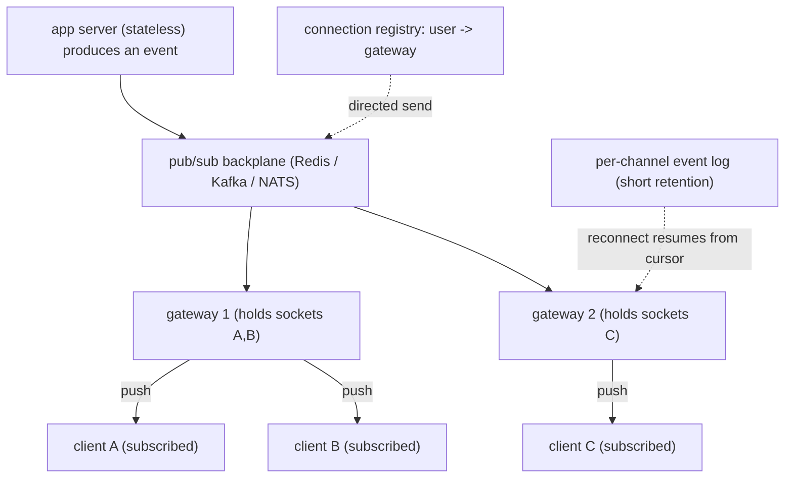

## Thesis

Real-time delivery is pushing data to connected clients the moment it changes --- a chat message, a live feed update, a presence change, a score --- which inverts the usual request/response model: the server must *push* rather than wait to be asked, so you need a **persistent connection** (WebSocket, SSE, or long-poll) and a **fan-out** strategy to route each event to the right connections. The two hard problems are the **transport choice** (bidirectional WebSocket versus server-push SSE versus a long-poll fallback, each trading capability against simplicity) and **fan-out** (on-write: push to every interested connection when an event happens, versus on-read: let clients pull and merge --- the classic timeline trade), layered on the operational reality of managing millions of *stateful* connections: a connection registry, sticky routing, presence, reconnection with resume, and backpressure when a client cannot keep up.

## Sub

**Why: the server must push, not wait to be asked** -> **transport: WebSocket (full-duplex) / SSE (server-push) / long-poll (fallback)** -> **fan-out: on-write vs on-read, and managing stateful connections at scale** -> **zoom out** to a connection-server + pub/sub-backplane architecture, presence, reconnection/resume with delivery guarantees, backpressure, and when polling is simply fine.

## Spine

- **Real-time delivery inverts request/response --- the server pushes** --- clients need updates the instant they happen, so instead of polling you hold a persistent connection and push events down it, which reshapes the architecture around stateful connections, a subscription model, and fan-out.
- **The transport is a capability-versus-simplicity trade** --- **WebSocket** (full-duplex, bidirectional --- the general answer for interactive apps); **SSE** (server-to-client only, over plain HTTP, simpler, auto-reconnecting --- great for one-way streams); **long-poll** (works everywhere, but inefficient --- a fallback); chosen by whether you need bidirectional and by client/network constraints.
- **Fan-out is the scaling decision** --- **fan-out-on-write** (push each event to all interested connections when it happens: fast reads, but write-amplifies for huge audiences) versus **fan-out-on-read** (clients pull and merge on demand: cheap writes, expensive reads), usually a **hybrid** (push for most, pull for celebrities) --- the timeline trade.
- **Managing stateful connections is the operational hard part** --- a connection registry mapping users to the servers holding their sockets, sticky routing, presence (who is online), reconnection with resume (miss nothing across a drop), and backpressure when a client falls behind --- all at millions of concurrent connections.

## Companion Notes

### walk

Pushing to connected clients the instant data changes

One live feature walked from polling to real-time push --- why the server must push, how WebSocket / SSE / long-poll trade capability against simplicity, how fan-out-on-write versus on-read is the scaling decision, and how you manage millions of stateful connections with a registry, a pub/sub backplane, presence, resume, and backpressure.

Say it as an inversion plus two decisions: the server pushes over a persistent connection (transport = WebSocket / SSE / long-poll), fan-out routes each event (on-write vs on-read), and the operational weight is managing stateful connections at scale.

### drill

Real-time-delivery reps

Graded reps on the transports, fan-out-on-write vs on-read, connection management, presence, and delivery guarantees --- the ones that separate "we added WebSockets" from a push architecture that fans out correctly and scales to millions of connections.

Anchor on push-not-poll, the transport trade (WebSocket bidirectional / SSE one-way / long-poll fallback), and the fan-out trade (on-write fast-reads-write-amplify vs on-read cheap-writes-expensive-reads, hybrid for celebrities).

## Drill

SDE2 | push vs poll, the transports, and fan-out
SDE3 | fan-out trade, connection routing, resume, presence
Staff | millions of connections, delivery semantics, architecture

### SDE2 | what real-time delivery is

What is real-time delivery, and why is polling a poor fit for it?

Real-time delivery is getting data to a client **the moment it changes** --- a new chat message, a live score, a feed update, a presence change --- rather than when the client next asks. Polling (the client repeatedly requesting "anything new?") is a poor fit for two reasons: **latency** (an update is only seen at the next poll, so a 5-second poll interval means up to 5 seconds of staleness --- shortening the interval reduces latency but multiplies load) and **waste** (the vast majority of polls return "nothing new," so you pay full request/response cost --- connection, auth, query --- for empty results, and this scales badly: a million clients polling every few seconds is enormous load, almost all of it wasted). The real-time answer inverts the model: instead of the client asking on a timer, the server **pushes** the moment something changes, over a **persistent connection** held open for exactly that purpose. That eliminates both the latency (delivery is immediate) and the waste (traffic flows only when there is something to send) --- at the cost of maintaining stateful connections, which is the complexity real-time delivery is really about.

### SDE2 | WebSocket basics

What is a WebSocket, and how does it differ from a normal HTTP request?

A WebSocket is a **persistent, full-duplex** connection between client and server: after an initial HTTP request that "upgrades" the connection (the `Upgrade: websocket` handshake), the same TCP connection stays open and both sides can send messages **at any time, in either direction**, until one closes it. That is the key difference from normal HTTP, which is request/response --- the client asks, the server answers, the connection is (logically) done, and the server cannot initiate. With a WebSocket the server can **push** a message to the client whenever it wants (no polling), and the client can send without a new handshake each time, with low per-message overhead (small frames, no repeated HTTP headers). This makes WebSockets the general-purpose transport for interactive real-time apps --- chat, collaborative editing, multiplayer, live dashboards with client input --- anywhere you need **bidirectional**, low-latency, ongoing communication. The trade is that it is a stateful, long-lived connection (which complicates load balancing, scaling, and deploys) and it is not plain HTTP (so some proxies/firewalls need configuration).

### SDE2 | SSE basics

What is Server-Sent Events, and when is it a better fit than WebSocket?

Server-Sent Events (SSE) is a **one-way, server-to-client** streaming protocol built on **plain HTTP**: the client opens a normal HTTP request to an event endpoint, the server keeps it open and streams a sequence of text events down it (`text/event-stream`), and the client receives them as they arrive. It is a better fit than WebSocket when the flow is **only server-to-client** --- a live feed, notifications, a stock ticker, progress updates, a dashboard the client only *reads* --- because it is **simpler**: it is just HTTP (so it works through standard proxies, load balancers, and HTTP/2 without special handling), the browser's `EventSource` gives you **automatic reconnection** and an event-id/`Last-Event-ID` resume mechanism for free, and there is no upgrade handshake or framing to manage. Its limits are that it is **unidirectional** (the client cannot send over the same channel --- it uses a normal HTTP request for that), it is **text-only**, and (over HTTP/1.1) browsers cap concurrent connections per domain. So the rule of thumb: if the client only needs to *receive* a stream, SSE is the simpler, HTTP-native choice; if it needs to *send* over the same low-latency channel, reach for WebSocket.

### SDE2 | long-polling

What is long-polling, and why is it considered a fallback rather than a first choice?

Long-polling simulates push over ordinary request/response: the client sends a request and the server **holds it open** (does not respond) until there is data to return *or* a timeout; when the server responds (with the new data or empty on timeout), the client **immediately issues another** request, so there is almost always an outstanding request waiting to be answered the instant an event occurs. This gives near-real-time delivery using only standard HTTP (no WebSocket upgrade, works through any proxy/firewall), which is why it was the classic pre-WebSocket technique and remains a **fallback** for environments where WebSocket/SSE are blocked or unsupported. It is a fallback rather than a first choice because it is **inefficient**: each delivery still incurs a full HTTP request/response cycle (headers, connection handling, re-auth), there is overhead in constantly re-establishing requests, and a gap exists between one response and the next request where an event could arrive (mitigated but not eliminated by holding a request open). WebSocket and SSE deliver the same immediacy with a single persistent connection and far less per-message overhead, so long-poll is used mainly for compatibility, not as the primary transport in a new system.

### SDE2 | WebSocket vs SSE vs long-poll

How do you choose between WebSocket, SSE, and long-polling?

By **directionality** and **constraints**. If you need **bidirectional** low-latency communication (client sends *and* receives continuously --- chat, collaboration, games, anything interactive), use **WebSocket** --- it is the general-purpose full-duplex transport. If the client only needs to **receive** a stream (notifications, live feeds, tickers, progress), use **SSE** --- it is simpler, HTTP-native, works through standard infrastructure, and gives free auto-reconnect and resume. If your environment **cannot use** WebSocket or SSE (a restrictive proxy/firewall, an old client, a network that blocks upgrades), fall back to **long-polling** --- it works over plain request/response everywhere, at the cost of efficiency. The decision tree: bidirectional needed -> WebSocket; server-to-client only -> SSE; neither supported -> long-poll fallback. A robust real-time system often **degrades gracefully** (try WebSocket, fall back to SSE, then long-poll) so it works across all clients while using the best available transport for each. The one-liner: WebSocket for two-way, SSE for one-way-and-simple, long-poll for compatibility.

### SDE2 | what fan-out is

In a real-time system, what does fan-out mean?

Fan-out is **routing a single event to all the connections that should receive it**. When something happens --- a user posts a message in a channel, a match scores, a document is edited --- that one event must reach every client currently subscribed to it, which may be one connection or a million, spread across many servers. Fan-out is the logic that answers "who cares about this event, and which connections do I push it to?" It is a core problem because in real-time the interested clients are *connected right now* (unlike a database write, which just persists), so delivering an event means finding the relevant live connections and writing to each of them --- and at scale those connections are distributed across a fleet of servers, so fan-out involves both figuring out the recipient set (subscriptions, channel membership, followers) and physically routing the event to whichever servers hold those connections (typically via a pub/sub backplane between servers). How you do fan-out --- eagerly on write to everyone, or lazily on read as clients pull --- is *the* central scaling decision in real-time delivery, because the cost and latency profile of the whole system depends on it.

### SDE2 | presence basics

What is presence, and why is it trickier than it looks?

Presence is knowing and showing **who is currently online / active** --- the green dots, "3 people viewing," "typing...", "last seen." It looks simple (a user is online if they have a live connection) but is trickier than it appears because connection state is **unreliable and distributed**: a client can drop without cleanly closing (a dead network, a killed app), so you cannot rely on a "disconnect" event to mark them offline --- you need **heartbeats** (periodic pings) and a **timeout/TTL** (if no heartbeat for N seconds, consider them offline). It is distributed (a user's connection lives on one of many servers, so presence state must be shared or aggregated across the fleet, often in a fast store like Redis with a TTL keyed by user). It is high-churn (presence changes constantly as people connect/disconnect, and each change may need to fan out to everyone watching that user --- so a popular user coming online can itself be a fan-out spike). And it has consistency quirks (a user on two devices, brief flaps on a flaky network). So presence is a small feature with the full real-time problem inside it: unreliable connection detection (heartbeats + TTL), distributed state (a shared store), and fan-out of the changes.

### SDE3 | fan-out-on-write vs fan-out-on-read

Explain fan-out-on-write versus fan-out-on-read and when each is right.

They are the two ways to deliver an event to an audience, trading write cost against read cost. **Fan-out-on-write** (push): when an event happens, **immediately deliver it to every interested recipient** --- write it into each follower's feed/inbox, or push it down each subscribed connection. Reads are then trivial and fast (the data is already there / already delivered), but the **write** amplifies: one post by a user with a million followers is a million writes/pushes, so it is expensive (and bursty) for large audiences. **Fan-out-on-read** (pull): when an event happens, **store it once**; each client **pulls and merges** the relevant events when it reads (query the sources you follow and combine). Writes are cheap (one write), but **reads** are expensive (each read does the fan-out work --- querying and merging many sources). The rule: fan-out-on-write when the audience is bounded and reads dominate (most users, chat channels, most feeds --- you want instant delivery and cheap reads); fan-out-on-read when the audience is huge or writes dominate (a celebrity's millions of followers --- you cannot afford a million writes per post). This is the classic timeline design trade, and real systems rarely pick one globally.

### SDE3 | the hybrid fan-out

Why do large feed systems use a hybrid of fan-out-on-write and on-read?

Because neither pure strategy works across the whole user base: fan-out-on-write is great for normal users (bounded followers, instant delivery, cheap reads) but catastrophic for celebrities (millions of writes per post), while fan-out-on-read is fine for celebrities (one write) but makes *every* read expensive for *everyone*. The hybrid takes the best of each: **fan-out-on-write for normal accounts** (push their posts into followers' feeds --- most posts, bounded fan-out, fast reads) and **fan-out-on-read for celebrity accounts** (do *not* fan out their posts on write; instead, when a user reads their feed, **merge in** the recent posts of the few celebrities they follow, pulled on demand). So a user's feed is "pre-computed pushed posts from normal follows" + "pulled-and-merged posts from the handful of celebrities" --- avoiding the million-write storm while keeping most of the feed pre-materialized and reads cheap. The threshold (what counts as a "celebrity") is a tuned cutoff on follower count. This is exactly how systems like Twitter/Instagram approach the timeline: the write-amplification problem is concentrated in a few high-fan-out accounts, so you special-case *those* to pull while everyone else pushes --- a targeted hybrid rather than one global strategy.

### SDE3 | connection routing at scale

A user's WebSocket is on server A, but the event that concerns them is produced on server B. How does it get delivered?

Through a **pub/sub backplane** plus a **connection registry**, because with many connection servers, the server producing (or receiving) an event is usually *not* the one holding the target user's socket. Two common patterns: (1) **Registry lookup** --- a shared registry (e.g. Redis) maps `user_id -> which server holds their connection`; server B looks up the target, then routes the message to server A (directly or via the bus), and A writes it to the socket. (2) **Pub/sub broadcast** --- servers subscribe to channels on a message bus (Redis Pub/Sub, Kafka, NATS); when an event for channel X occurs, it is published to the bus, and *every* server that holds a connection subscribed to X receives it and pushes to its local sockets --- no per-user lookup, the bus does the routing by topic. In practice large systems use a backplane so connection servers are decoupled from where events originate: any server can accept a connection, any producer can emit an event, and the bus (with topic/channel routing) delivers it to the servers that need it. The key idea is that the fleet of stateful connection servers is glued together by a pub/sub layer that turns "deliver to this user/channel" into "publish to a topic the right servers are listening on" --- so you never require the event and the connection to be on the same machine.

### SDE3 | sticky sessions and scaling stateful connections

WebSocket connections are stateful and long-lived. What does that mean for load balancing and scaling?

It means you cannot treat servers as interchangeable per-request the way you do with stateless HTTP --- a WebSocket is **pinned to the specific server** that terminated it for the connection's whole life, so the load balancer must keep that client's traffic on that server (**sticky/affinity routing**, often at L4 since the connection is long-lived; the initial upgrade decides the server and the TCP connection stays there). Consequences: **load is per-connection, not per-request**, and it is uneven and long-lived, so you balance *new* connections across servers and watch for hot servers accumulating connections; **scaling out** adds capacity for *new* connections but does not rebalance existing ones (they stay put until they reconnect), so you scale ahead of demand and rely on natural reconnection churn to spread load; **deploys are disruptive** --- restarting a server drops all its connections, so you **drain gracefully** (stop taking new connections, let existing ones migrate/reconnect, or signal clients to reconnect elsewhere) rather than hard-restart; and **failure** of a server drops its connections, so clients must **reconnect** (to another server) and resume. The mental model shift is from stateless-and-fungible to stateful-and-pinned: connection servers hold state (the sockets), so balancing, scaling, and deploys are all about managing long-lived connections and their reconnection, not routing independent requests.

### SDE3 | reconnection and delivery guarantees

A client's connection drops for 10 seconds and reconnects. How do you ensure it did not miss messages?

You give each stream a **monotonic position (a sequence number or event id)** and have the client **resume from the last id it saw**, so on reconnect it tells the server "I last received event 4711," and the server replays everything after that from a buffer/log. Concretely: the server assigns each event an increasing id per channel/stream; the client tracks the highest id it has processed; on reconnect it sends that id (SSE does this automatically via `Last-Event-ID`; WebSocket apps send it in a resume message); the server reads the missed range from a **recent-events buffer** (a per-channel log/ring buffer, or a durable log like Kafka/a Redis stream retained for a window) and pushes it, then resumes live delivery. This turns reconnection into "catch up from a cursor, then continue," so nothing is missed within the retention window. The delivery semantics that fall out: it is effectively **at-least-once** (a message might be re-sent if the client reconnects before acking, or across an ambiguous drop), so clients **dedupe by event id**; ordering is preserved per channel by the monotonic id. The alternative --- relying on the client to re-fetch full state on reconnect --- works for small state but not for streams, so the cursor/resume-from-id model is the standard, and it is why real-time systems keep a short-retention event log per channel behind the live push.

### SDE3 | presence at scale

How do you implement presence for millions of users without it becoming a bottleneck?

Use **heartbeats with a TTL in a fast shared store**, and be deliberate about **fan-out of presence changes**. Each connection periodically sends a heartbeat; the server writes/refreshes a key like `presence:user_id` in Redis with a **short TTL** (say 30-60s); if the heartbeat stops (client dropped, even uncleanly), the key **expires** and the user is considered offline --- so you never depend on a clean disconnect event. A user is "online" if the key exists. This scales because it is O(1) per heartbeat and self-healing via TTL, and the store aggregates presence across the whole connection fleet (any server can check any user's presence). The bottleneck is usually not storing presence but **broadcasting changes**: when a user goes online/offline, everyone watching them may need to know, so a popular user's status change fans out --- handled by only notifying *subscribers* of that user's presence (channel/friend-list membership), **debouncing/coalescing** rapid flaps (do not broadcast a 2-second reconnect blip), and often only computing presence **on demand** for the specific users a client is currently viewing (query "are these 20 people online?" rather than pushing every change globally). Extra care: multi-device (a user is online if *any* device heartbeats --- track per-connection and union), and avoiding a **thundering herd** on mass reconnect (a deploy or network blip reconnecting millions at once spikes heartbeats and presence recomputation --- jittered reconnect backoff). So: heartbeat + TTL for detection, a shared store for aggregation, and disciplined, subscriber-scoped, debounced fan-out for the changes.

### SDE3 | backpressure on a slow client

A client cannot consume messages as fast as the server produces them for it. What happens, and what do you do?

Without handling, messages **queue in the server-side send buffer for that connection**, and if production outpaces consumption the buffer grows unbounded --- consuming memory per slow connection, and with many slow clients this exhausts the server's memory and can take it down (a real-time-specific backpressure failure). So you must **bound the per-connection buffer** and pick a policy when it fills: **drop** (shed messages the client cannot keep up with --- acceptable for lossy data like presence, cursor positions, or a high-frequency feed where only the latest matters, often keeping just the newest and dropping stale intermediate updates --- "conflation"); **disconnect** (close a hopelessly-behind connection and let the client reconnect and resume from a cursor --- appropriate when every message matters and the client is simply too slow, since holding unbounded state for it is worse); or **slow the source** (apply backpressure upstream if the producer can be paused --- rarely possible when the producer is "the whole system's events," but possible for a per-client stream). The key decisions are per-connection bounds (never let one slow client consume unbounded memory) and a data-appropriate drop-vs-disconnect policy (conflate/drop lossy data, disconnect-and-resume for must-deliver data). This is the backpressure principle applied to push: the fast producer must not be allowed to overwhelm memory via a slow consumer, so you bound the buffer and shed or disconnect deliberately.

### Staff | scaling to millions of connections

How do you architect a system to hold millions of concurrent real-time connections?

You separate **connection handling** from **application logic** and glue them with a **pub/sub backplane**, because the challenge (the C10M problem --- millions of concurrent connections) is about efficiently holding vast numbers of mostly-idle stateful sockets, which is a different problem from processing requests. The architecture: a tier of **connection servers (edge gateways)** whose only job is to terminate and hold client connections (WebSocket/SSE), each optimized to hold hundreds of thousands of sockets (event-driven I/O --- epoll/kqueue --- so a connection costs memory but not a thread; tuned OS limits for file descriptors and ephemeral ports); a **message router / pub/sub bus** (Redis, Kafka, NATS, or a custom backplane) that the connection servers subscribe to, so an event published once is delivered to whichever connection servers hold subscribed clients; and the **application servers** that produce events, fully decoupled from where connections live (they publish to the bus, never touching sockets directly). This lets each tier scale independently: add connection servers for more concurrent clients, scale the bus for more event throughput, scale app servers for more business logic. Supporting pieces: a **connection registry** (which server holds which user, for directed messages), **sticky load balancing** for the connections, and **presence in a shared TTL store**. The staff framing is that "millions of connections" is solved by a purpose-built, horizontally-scalable connection tier fronted by a pub/sub backplane --- not by making your app servers hold sockets --- so connection scaling, event throughput, and business logic are independent axes.

### Staff | delivery semantics in real-time

What delivery and ordering guarantees can a real-time push system realistically provide?

Realistically **at-least-once, ordered-per-channel, with client-side dedupe** --- and you design the client and protocol around that rather than pretending to have exactly-once. *At-least-once*: because connections drop and acks can be lost, a message may be delivered more than once (re-sent after an ambiguous drop, replayed on reconnect-from-cursor), so each message carries a stable **id** and the client **deduplicates** (ignore an id it has already processed) --- which makes redelivery safe and lets you err toward re-sending rather than losing. *Ordering*: guaranteed **per channel/stream** by a monotonic sequence id (the client can detect gaps and knows the order); *global* ordering across channels is not guaranteed and usually not needed. *At-most-once* (fire-and-forget, no resume) is an option for purely ephemeral data (a live cursor position, a presence flap) where a lost message is irrelevant and you would rather drop than buffer. *Exactly-once* is not achievable over unreliable connections, so you approximate **effectively-once** = at-least-once delivery + idempotent/deduped handling by id. The design consequences: assign per-channel monotonic ids, keep a short-retention event log per channel for resume, have clients track-and-ack a cursor and dedupe by id, and choose per-stream whether it is must-deliver (at-least-once + resume) or lossy (at-most-once + conflation). Naming these guarantees precisely --- at-least-once + per-channel order + client dedupe, effectively-once via idempotency --- is the senior signal; it mirrors messaging semantics (the messaging/idempotency topics) applied to live connections.

### Staff | fan-out at massive scale

At massive scale, fan-out-on-write to a huge audience is a write storm. Walk through handling it end to end.

The problem is **write amplification**: one event to N recipients is N deliveries, and for high-N producers (a celebrity, a global announcement, a trending channel) that is a sudden burst of millions of writes/pushes, which can overwhelm the fan-out path and starve everyone else. The end-to-end handling: (1) **Hybrid strategy** --- fan-out-on-write for bounded audiences, but **do not** fan out on write for high-fan-out producers; instead mark them and **fan-out-on-read** (recipients pull the celebrity's recent items and merge at read time), concentrating the special-casing on the few accounts that cause the storm. (2) **Asynchronous, queued fan-out** --- never fan out inline on the producer's request; enqueue the event and let a fleet of workers deliver it, so the write burst is absorbed by a queue and spread over time (a few seconds of delivery latency for a huge audience is fine), with the queue providing backpressure and retry (the messaging/backpressure topics). (3) **Batching and de-duplication** --- batch deliveries per destination server (one push carrying many recipients on that server, via the pub/sub backplane by channel) rather than per-recipient, so the bus does topic-level routing instead of N point-to-point sends. (4) **Prioritization and shedding** --- prioritize interactive/small fan-outs over a giant background broadcast, and for lossy data conflate. (5) **Tiered delivery** --- deliver to currently-*connected* recipients in near-real-time and let offline recipients pick up from the stored feed/log on next read (no point pushing to absent clients). The staff framing: massive fan-out is tamed by hybrid (pull the celebrities), async-queued-and-batched delivery (absorb and spread the burst, route by topic not per-recipient), and tiering (push to the connected, store for the rest) --- so a million-recipient event becomes a bounded, backpressured, batched stream rather than a synchronous million-write spike.

### Staff | the connection-server architecture

Describe the end-to-end architecture of a real-time system and how the pieces decouple.

Layered, with stateful connection handling isolated behind a stateless-ish routing layer. **Clients** hold a persistent connection (WebSocket/SSE, with long-poll fallback and graceful degradation). **Connection servers (edge gateways)** terminate those connections --- their sole responsibility is holding sockets and doing local fan-out to them; they are optimized for many idle connections (event-driven I/O, tuned limits) and are the only stateful tier. A **load balancer** distributes new connections across the gateways with sticky affinity (a connection stays on its gateway for life). A **pub/sub backplane / message router** (Redis, Kafka, NATS, or custom) connects the gateways: gateways subscribe to the channels their connected clients care about, and any event published to a channel is delivered to exactly the gateways holding subscribers --- this is what lets a gateway push an event it did not originate. A **connection registry** (shared store) maps users to gateways for **directed** messages (send to *this user*, wherever they are), and a **presence store** (TTL keyed by user) tracks who is online. **Application servers** (stateless, normally scaled) produce events by publishing to the backplane --- they never touch sockets, so they scale and deploy independently. Behind that, a **durable event log per channel** (Kafka/Redis streams, short retention) backs reconnect/resume. The decoupling is the point: connection count scales on the gateway tier, event throughput on the backplane, business logic on the app tier, and delivery guarantees come from the log + cursors --- four independent axes, with the stateful part quarantined in one purpose-built tier so the rest of the system stays stateless and simple.

### Staff | auth and security on a persistent connection

A WebSocket stays open for hours, but the user's token expires in an hour. How do you handle auth, authorization, and abuse on a persistent connection?

Persistent connections break the request-scoped auth model, so you handle it explicitly. **Authenticate at connect**: the client presents a token during the handshake (the browser cannot set custom headers on the WebSocket upgrade, so the token rides in the URL/subprotocol or an immediate first message; SSE can use a cookie or an auth param), and you validate it before accepting the socket --- and check **Origin** server-side to prevent cross-site WebSocket hijacking, since a WebSocket is not bound by CORS the way an XHR is. **Token expiry mid-connection**: because the socket outlives the token, you either require the client to periodically send a **refreshed token in-band** and re-validate (closing the connection if it lapses), or enforce a **max connection lifetime** that forces periodic reconnect-and-reauth, or both --- you cannot let a connection authenticated an hour ago run forever. **Authorization per message**: authenticating the connection is not enough --- each subscribe/action is authorized on the message (can this user join *this* channel, send to *this* conversation), because permissions change during a long-lived connection. **Revocation**: a logout, ban, or permission change must be able to **kill or re-authorize live connections** --- so you signal the gateway holding that user's socket (via the registry/backplane) to drop it, rather than waiting for the token to expire. **Abuse/DoS**: connections are a finite resource, so you rate-limit **connection establishment** (cap connections per user/IP so a flood cannot exhaust a gateway's memory and file descriptors), rate-limit **messages** per connection, and enforce the per-connection buffer bounds. The staff framing is that a persistent connection turns request-scoped concerns --- auth, authz, rate limiting, revocation --- into **connection-lifetime** concerns: authenticate at connect with an Origin check, re-validate or bound the lifetime as the token expires, authorize each message, propagate revocation to live sockets through the backplane, and rate-limit both connection setup and per-connection traffic --- because the usual per-request enforcement points simply do not exist on a socket held open for hours.

### Staff | when NOT to use real-time push

When is real-time push the wrong choice, and what do you use instead?

When the **freshness requirement does not justify the cost of stateful connections**, which is often. Real-time push (persistent connections, fan-out, a connection tier, presence, resume, backpressure) is a significant, permanently-more-complex architecture, and much of what looks like it wants real-time is fine with something cheaper. Use **polling** when updates are infrequent or a few seconds/minutes of staleness is acceptable (a dashboard refreshed every 30s, a status page, a job whose result you check occasionally) --- a periodic fetch is trivially simple, stateless, and scales with ordinary HTTP/caching; the "waste" of polling only bites at high frequency and high client counts. Use **SSE instead of WebSocket** when the flow is one-way (most "live" features only push to the client) --- you get real-time without WebSocket's bidirectional complexity. Use **push notifications** (APNs/FCM) rather than a held connection for delivering to *offline* or mobile-background clients (you cannot hold a socket to a backgrounded app). Use a **normal request + a webhook/callback** for server-to-server "tell me when done" rather than a persistent stream. The staff judgment: reach for real-time push only when you genuinely need **low-latency, high-frequency, or bidirectional** delivery to *connected* clients (chat, collaboration, live trading, multiplayer, a fast-updating feed) --- and for everything else prefer polling, SSE, or push notifications, because the stateful-connection machinery is a cost you should pay only when the interactivity truly requires it.

### Staff | telling the real-time story

How do you present a real-time delivery design well in an interview?

Lead with the **inversion and the two decisions**, then the operational weight. "Real-time flips request/response --- the server has to push, so I hold a persistent connection and fan events out to the right connections." Decision one, **transport**: "WebSocket if it is bidirectional and interactive; SSE if it is server-to-client only, since it is HTTP-native with free reconnect; long-poll as a compatibility fallback --- and I would degrade gracefully across them." Decision two, **fan-out**: "on-write for bounded audiences so reads are instant, on-read for huge audiences to avoid a write storm, and a hybrid --- push for normal accounts, pull-and-merge for celebrities --- which is the timeline trade." Then the **scale/ops story**: "a dedicated connection-server tier holding the stateful sockets, a pub/sub backplane so any event reaches the gateways holding subscribers, a connection registry and a TTL presence store, sticky load balancing, reconnect-from-a-cursor over a short per-channel event log for at-least-once delivery with client dedupe, and bounded per-connection buffers with conflate-or-disconnect backpressure." Ground it in the specific feature (chat vs a feed vs presence dictates the transport and fan-out), and close on judgment: "and I would only use real-time push where the interactivity truly needs it --- otherwise polling or SSE or push notifications, because the stateful-connection machinery is a real cost." That arc --- inversion, transport, fan-out, connection management, and the restraint to not over-use it --- covers the whole topic.

## Walk

### Polling is wasteful; the server must push

```flow
poll[client polls every few seconds] -> waste[latency plus mostly-empty requests] -> push[hold a persistent connection and push on change]
```

Start with the inversion. In request/response the client asks and the server answers, so to see updates a client **polls** --- but that is bad two ways: **latency** (you only see a change at the next poll, and shortening the interval multiplies load) and **waste** (almost every poll returns "nothing new," yet pays full request cost --- a million clients polling every few seconds is enormous, mostly-empty traffic).

Real-time **inverts** this: the server **pushes** the moment something changes, over a **persistent connection** held open for exactly that purpose. That kills both problems --- delivery is immediate and traffic flows only when there is something to send. The cost is that you now maintain **stateful connections**, and that machinery --- transport, fan-out, connection management --- is what real-time delivery is really about.

### Choose the transport

```flow
bidi[need bidirectional?] -> ws[yes: WebSocket full-duplex] -> fallback[one-way: SSE over HTTP; blocked: long-poll]
```

The transport is a capability-versus-simplicity choice. **WebSocket**: a persistent full-duplex connection (after an HTTP upgrade), both sides send anytime --- the general answer for **interactive** apps (chat, collaboration, games). **SSE**: one-way server-to-client over plain HTTP with free auto-reconnect and resume --- simpler, and right when the client only **receives** (feeds, notifications, tickers). **Long-poll**: hold a request open, respond on an event, re-issue --- works everywhere, so a **fallback** when WebSocket/SSE are blocked.

The event itself, once produced, has to reach the interested connections. A connection server fans an event out to its local subscribers:

```python
subscriptions = {}   # channel -> set of local connections on this gateway

def fan_out(channel, event):
    for conn in subscriptions.get(channel, ()):   # only the connections that subscribed
        if conn.send_buffer_ok():                  # bounded buffer -> backpressure
            conn.send(event)
        else:
            conn.conflate_or_disconnect(event)     # slow client: drop-latest or close+resume
```

Decision tree: bidirectional -> WebSocket; server-to-client only -> SSE; neither supported -> long-poll. A robust system degrades gracefully across all three.

### Fan-out: on-write vs on-read

```flow
event[an event happens] -> onwrite[fan-out-on-write: push to all now -- fast reads, write-amplifies] -> onread[fan-out-on-read: store once, clients pull -- cheap writes, costly reads]
```

Fan-out is *the* scaling decision. **Fan-out-on-write** (push): deliver the event to every interested recipient immediately --- reads are trivial and instant, but the write **amplifies** (a post to a million followers is a million writes). **Fan-out-on-read** (pull): store the event once; clients pull and merge relevant events on read --- writes are cheap, but every read does the fan-out work.

Neither is right for the whole user base, so large feeds go **hybrid**: fan-out-on-write for normal accounts (bounded audience, instant delivery, cheap reads) and fan-out-on-read for **celebrities** (do not fan out their post; merge their recent items into a follower's feed at read time). A feed becomes "pushed posts from normal follows" + "pulled posts from the few celebrities followed" --- avoiding the write storm while keeping most of it pre-materialized. And you never fan out **inline**: enqueue the event and let workers deliver asynchronously, so a burst is absorbed and spread, batched per destination gateway via the pub/sub backplane rather than sent per-recipient.

### Manage stateful connections at scale

```flow
registry[connection registry: user -> gateway] -> bus[pub/sub backplane routes events to gateways with subscribers] -> ops[presence via TTL, resume from a cursor, bounded buffers]
```

The operational weight is millions of **stateful, pinned** connections. You isolate them in a dedicated **connection-server tier** (edge gateways whose only job is holding sockets, event-driven I/O for many idle connections), fronted by **sticky** load balancing (a socket lives on its gateway for life; scaling adds capacity for *new* connections; deploys **drain** gracefully). A **pub/sub backplane** glues the gateways: they subscribe to their clients' channels, and an event published once reaches exactly the gateways holding subscribers --- so an event need not originate on the server holding the target socket. A **connection registry** maps users to gateways for directed messages; app servers stay stateless and just **publish** events.

The guarantees fall out of a short per-channel **event log**: on reconnect a client **resumes from its last-seen id**, replaying the missed range --- **at-least-once** delivery, so clients **dedupe by id**, ordered per channel by monotonic id. **Presence** is heartbeat + TTL in a shared store (expire = offline, no clean disconnect needed), with debounced, subscriber-scoped change fan-out. And **backpressure** bounds each connection's buffer: conflate/drop lossy data, disconnect-and-resume must-deliver data. Inversion, transport, fan-out, connection management --- and the restraint to use push only where the interactivity truly needs it.

### Model Script

- Frame the inversion | "Real-time delivery flips the request/response model. Normally the client asks and the server answers, so to see updates a client has to poll -- which is bad two ways: latency, because you only see a change at the next poll, and waste, because almost every poll returns nothing new. So instead the server pushes the moment something changes, over a persistent connection held open for exactly that. That kills both problems, and the cost is that I now maintain stateful connections -- which is what real-time is really about."
- The transport | "First decision is the transport, and it is capability versus simplicity. WebSocket is a persistent full-duplex connection -- both sides send anytime -- the general answer for interactive apps like chat and collaboration. SSE is one-way server-to-client over plain HTTP with free auto-reconnect and resume -- simpler, and right when the client only receives, like a feed or notifications. Long-poll holds a request open and re-issues -- a fallback when WebSocket and SSE are blocked. So bidirectional means WebSocket, one-way means SSE, and I degrade gracefully to long-poll for compatibility."
- Fan-out | "Second decision, and the real scaling one, is fan-out. On-write means push the event to every recipient immediately -- reads are instant, but the write amplifies: a post to a million followers is a million writes. On-read means store it once and have clients pull and merge on read -- cheap writes, expensive reads. Neither fits the whole user base, so large feeds go hybrid: fan-out-on-write for normal accounts, fan-out-on-read for celebrities -- pull their posts in at read time instead of a million-write storm. And I never fan out inline; I enqueue and let workers deliver asynchronously, batched per gateway, so a burst is absorbed and spread."
- Connection management | "Then the operational weight -- millions of stateful, pinned connections. I isolate them in a dedicated connection-server tier whose only job is holding sockets, fronted by sticky load balancing because a socket lives on one server for life. A pub/sub backplane glues the gateways so an event published once reaches exactly the gateways holding subscribers -- the event doesn't have to originate where the socket lives. App servers stay stateless and just publish. Delivery guarantees come from a short per-channel event log: on reconnect the client resumes from its last-seen id, so it's at-least-once and the client dedupes by id. Presence is heartbeat plus TTL. And backpressure bounds each connection's buffer -- conflate lossy data, disconnect-and-resume must-deliver data."
- Interviewer: "How would you deliver a message from a user on one server to a user connected to a different server?"
- Cross-server delivery | "Through the pub/sub backplane plus a connection registry, because with many gateways the sender's server usually isn't holding the recipient's socket. Either the gateways subscribe to channels on a bus -- Redis Pub/Sub, Kafka, NATS -- so an event for a channel is delivered to every gateway holding a subscribed connection, and the bus does the routing by topic; or a shared registry maps user to gateway and I route the directed message to the right one. Large systems use the backplane so connection servers are fully decoupled from where events originate -- any gateway accepts connections, any app server publishes events, and the bus delivers to the gateways that need it."
- Land it | "So: real-time inverts request/response -- the server pushes over a persistent connection; the transport is WebSocket for bidirectional, SSE for one-way, long-poll as a fallback; fan-out is the scaling decision, on-write versus on-read with a hybrid for celebrities; and the operational weight is managing stateful connections -- a dedicated gateway tier, a pub/sub backplane, a registry, TTL presence, resume-from-a-cursor for at-least-once with client dedupe, and bounded-buffer backpressure. And I'd only use push where the interactivity truly needs it -- otherwise polling, SSE, or push notifications, because the stateful-connection machinery is a real cost."

## Whiteboard

Sketch why the server must push, and how a fleet of connection servers delivers an event across machines.

### Why can't you do real-time with polling, and what replaces it?

Polling has unavoidable latency (you see a change only at the next poll) and huge waste (almost every poll returns nothing but pays full request cost, which explodes at high client counts and short intervals). It is replaced by the server *pushing* over a **persistent connection** (WebSocket / SSE / long-poll) held open for the purpose --- so delivery is immediate and traffic flows only when there is something to send. The trade is that you now hold stateful, long-lived connections, which is the real complexity: fan-out, connection management, presence, resume, and backpressure.

### How does an event reach a user whose socket is on a different server?

Via a **pub/sub backplane** and a **connection registry**. Connection servers (gateways) each hold a subset of the sockets; they subscribe on a message bus to the channels their clients care about. When an event occurs it is **published once** to the bus, which delivers it to exactly the gateways holding subscribed connections, and each pushes to its local sockets --- so the event need not originate on the gateway holding the target socket. For a directed message to a specific user, a shared registry maps `user -> gateway`. App servers just publish; they never touch sockets.



Verdict: server pushes over a persistent connection (WebSocket / SSE / long-poll) -> a dedicated gateway tier holds the stateful sockets -> a pub/sub backplane routes any event to the gateways with subscribers -> a registry + TTL presence + resume-from-a-cursor + bounded-buffer backpressure make it correct and scalable.

## System

Zoom out to how a real-time delivery system is laid out and its cross-cutting concerns.

### Where it sits

Transport: the persistent connection -- WebSocket (bidi) / SSE (one-way) / long-poll (fallback) [*]
Fan-out: on-write (push, fast reads, write-amplify) vs on-read (pull, cheap writes) -- hybrid for celebrities
Connection tier: dedicated gateways hold the stateful sockets, sticky-balanced, decoupled from app servers
Backplane: pub/sub routes an event to the gateways holding subscribers; a registry maps user -> gateway
Guarantees: at-least-once via resume-from-a-cursor over a short per-channel log; client dedupes by id; presence = heartbeat + TTL

### Pivots an interviewer rides

From "make it real-time" they push on fan-out and connection scaling.

#### Fan-out-on-write or on-read?

-> on-write for bounded audiences (instant reads), on-read for huge audiences (avoid the write storm), hybrid for celebrities
Push normal accounts' events into followers' feeds for cheap instant reads; do not fan out a celebrity's post on write -- merge their recent items in at read time -- and always deliver asynchronously via a queue, batched per gateway, so a burst is absorbed and spread.

#### How do you not miss messages across a reconnect?

-> assign per-channel monotonic ids and resume from the client's last-seen id over a short event log
The client tracks the highest id it processed; on reconnect it sends it and the server replays the missed range from a per-channel buffer, then resumes live -- at-least-once, so the client dedupes by id, ordered per channel by the monotonic id.

## Trade-offs

The calls that separate "we added WebSockets" from a real-time architecture.

### WebSocket vs SSE

- WebSocket: full-duplex, bidirectional, low per-message overhead -- but a non-HTTP upgrade (some proxies need config), stateful and pinned, and you implement reconnect/resume yourself
- SSE: HTTP-native (works through standard infra), one-way server-to-client, free auto-reconnect and Last-Event-ID resume -- but unidirectional, text-only, and limited concurrent connections per domain over HTTP/1.1

WebSocket when the client must send over the same channel (chat, collaboration, games); SSE when it only receives (feeds, notifications, tickers) -- SSE's simplicity and free resume win for one-way streams, and many "live" features are one-way.

### Fan-out-on-write vs fan-out-on-read

- On-write (push): reads are trivial and instant (pre-delivered), simple read path -- but one event to N recipients is N writes, so it write-amplifies and bursts for huge audiences
- On-read (pull): one cheap write per event -- but every read does the fan-out (query + merge many sources), so reads are expensive and slower

On-write for bounded audiences where reads dominate (most users, channels); on-read for huge-fan-out producers; a hybrid (push normal, pull celebrities) for feeds -- and deliver asynchronously via a queue regardless, so write bursts are absorbed.

### Real-time push vs polling

- Push (persistent connection): immediate delivery, no wasted empty requests, efficient at high frequency -- but stateful connections, a connection tier, fan-out, presence, resume, and backpressure to build and operate
- Polling: trivially simple, stateless, scales with ordinary HTTP and caching -- but latency bounded by the interval and wasted mostly-empty requests that explode at high frequency/client counts

Push only when you need low-latency, high-frequency, or bidirectional delivery to connected clients (chat, collaboration, live trading, a fast feed); poll (or SSE, or push notifications) when a few seconds of staleness is fine -- do not pay for stateful connections you do not need.

## Model Answers

### the reframe | Real-time inverts request/response -- the server pushes

The frame to lead with.

- The server pushes over a persistent connection, instead of the client polling | key | kills polling's latency and waste, at the cost of stateful connections
- Transport = WebSocket (bidi) / SSE (one-way) / long-poll (fallback) | store | degrade gracefully across them
- Fan-out (on-write vs on-read) is the scaling decision | note | hybrid: push normal accounts, pull celebrities

### the depth | Connections at scale and delivery guarantees

Where it is really tested.

- A dedicated gateway tier + pub/sub backplane holds sockets and routes events across servers | key | connection count, event throughput, app logic scale independently
- At-least-once via resume-from-a-cursor over a short per-channel log; client dedupes by id | store | presence = heartbeat + TTL; ordered per channel
- Bounded per-connection buffers: conflate lossy data, disconnect-and-resume must-deliver | note | fan-out asynchronously (queue + batch) to absorb bursts

## Numbers

Back-of-envelope the two scaling pressures: how many connection servers you need, and the write amplification of fan-out-on-write.

Connection servers = concurrent connections / per-server capacity; and fan-out-on-write turns one post into (followers) deliveries, which for a large audience is a burst.

- conns | Concurrent connections (millions) | 5 | 0 | 1
- percap | Connections per gateway (thousands) | 200 | 10 | 10
- followers | Followers of the posting user (thousands) | 1000 | 0 | 50

```js
function (vals, fmt) {
  var conns = vals.conns * 1e6, percap = vals.percap * 1e3, followers = vals.followers * 1e3;
  var gateways = Math.ceil(conns / percap);
  var writesOnWrite = followers;         // one post -> one delivery per follower
  var writesOnRead = 1;                  // fan-out-on-read: store once
  function r(x, d) { var m = Math.pow(10, d); return Math.round(x * m) / m; }
  return [
    { k: 'Connection gateways', v: '~' + fmt.n(gateways), u: 'servers', n: 'ceil(' + fmt.n(conns) + ' connections / ' + fmt.n(percap) + ' per gateway) \u2014 the stateful tier scales on connection count, independent of event throughput', over: false },
    { k: 'Deliveries: fan-out-on-write', v: '~' + fmt.n(writesOnWrite), u: 'per post', n: 'one post to a ' + fmt.n(followers) + '-follower account is this many writes/pushes \u2014 instant reads, but a burst that must be queued and batched, not sent inline', over: writesOnWrite > 100000 },
    { k: 'Deliveries: fan-out-on-read', v: fmt.n(writesOnRead), u: 'per post', n: 'store the post once; each follower pulls and merges it at read time \u2014 cheap write, but every read now does fan-out work', over: false },
    { k: 'Write amplification', v: fmt.n(writesOnWrite) + 'x', u: 'on-write vs on-read', n: 'the write cost multiple of pushing vs pulling \u2014 which is why huge-audience accounts are special-cased to fan-out-on-read (the hybrid)', over: writesOnWrite >= 1000 },
    { k: 'Verdict for this account', v: (followers >= 100000 ? 'pull (on-read)' : 'push (on-write)'), u: '', n: followers >= 100000 ? 'a high-fan-out account: fan-out-on-read (merge at read) to avoid the write storm' : 'a bounded audience: fan-out-on-write for instant cheap reads', over: false }
  ];
}
```

## Red Flags

What makes an interviewer wince.

### "We'll poll every second for the live updates"

Polling has unavoidable latency (bounded by the interval) and huge waste (almost every poll returns nothing but pays a full request), and a one-second interval at scale is a flood of mostly-empty requests -- the opposite of efficient for genuinely live data.

For live, low-latency updates hold a persistent connection and push (WebSocket for bidirectional, SSE for one-way); reserve polling for infrequent updates where a few seconds of staleness is acceptable.

### "Fan out every post to all followers on write"

Fan-out-on-write to a huge audience is a write storm -- one post by a celebrity is millions of synchronous writes/pushes -- which overwhelms the fan-out path and starves everyone else.

Use a hybrid: fan-out-on-write for bounded audiences, fan-out-on-read for high-fan-out accounts (merge their recent posts at read time), and always deliver asynchronously via a queue, batched per gateway, so bursts are absorbed and spread.

### "WebSocket servers are stateless, so just load-balance them like HTTP"

A WebSocket is a long-lived connection pinned to the server that terminated it, so it is stateful -- round-robin per-request balancing and treating servers as fungible breaks it (and a deploy that hard-restarts a server silently drops all its connections).

Use sticky/affinity routing so a connection stays on its gateway for life, isolate connections in a dedicated tier, drain gracefully on deploy, and rely on client reconnect-with-resume when a connection is lost.

## Opener

### 30s | The one-liner

How I open when asked to add live updates, a feed, chat, or presence.

#### What is the shape?

Real-time delivery inverts request/response: the server pushes the moment data changes instead of the client polling, so it needs a persistent connection (WebSocket for bidirectional, SSE for one-way, long-poll as a fallback) and a fan-out strategy to route each event to the right connections --- layered on the operational reality of managing millions of stateful connections.

#### What's the key move?

Two decisions plus restraint: the transport (bidirectional -> WebSocket, one-way -> SSE), and fan-out (on-write for instant reads, on-read to avoid a write storm, hybrid for celebrities) --- managed by a dedicated connection tier and a pub/sub backplane, with resume-from-a-cursor for at-least-once delivery and bounded-buffer backpressure. And use push only where the interactivity truly needs it.

##### Hooks

Where an interviewer usually pushes next.

- WebSocket, SSE, or long-poll? | bidirectional / one-way / compatibility fallback | drill
- Fan-out-on-write or on-read? | bounded push / huge pull / hybrid for celebrities | drill
- Cross-server delivery + no missed messages? | pub/sub backplane + resume from a cursor | drill

Foot: two sentences --- real-time delivery flips request/response so the server pushes over a persistent connection, and the two shaping decisions are the transport (WebSocket bidirectional, SSE one-way, long-poll fallback) and fan-out (on-write for fast reads, on-read to avoid write-amplification, a hybrid that pushes normal accounts and pulls celebrities); the operational weight is managing millions of stateful, pinned connections --- a dedicated gateway tier glued by a pub/sub backplane, a connection registry and a TTL presence store, reconnect-from-a-cursor over a short per-channel log for at-least-once delivery with client dedupe, and bounded per-connection buffers that conflate or disconnect --- and the judgment to use push only where the interactivity genuinely requires it, preferring polling, SSE, or push notifications otherwise.

## Bank

### SCALE | A chat / messaging system for millions of concurrent users

Task: design real-time message delivery for a chat app at millions of concurrent connections.
Model: WebSocket transport (bidirectional --- users send and receive), with graceful fallback. A dedicated connection-server tier holds the sockets (event-driven I/O, sticky-balanced, drained on deploy), decoupled from stateless app servers. A pub/sub backplane (Redis/Kafka/NATS) routes a message published for a channel/conversation to exactly the gateways holding subscribed members; a connection registry maps user -> gateway for directed delivery. Persist each message to a per-conversation log with a monotonic id; on reconnect a client resumes from its last-seen id (at-least-once, dedupe by id, ordered per conversation). Presence via heartbeat + TTL in a shared store, with debounced, membership-scoped change fan-out and typing indicators as at-most-once/conflated. Backpressure: bounded per-connection buffers, disconnect-and-resume a hopelessly-behind client. For huge group channels, fan out asynchronously via a queue, batched per gateway. Offline users get a push notification (APNs/FCM) and pick up from the log on next open.
Int: what is the hardest part of scaling this?
Managing the stateful connections and their fan-out -- millions of pinned sockets across a gateway fleet glued by a pub/sub backplane, with sticky balancing, graceful draining on deploy, and resume-from-a-cursor so reconnections miss nothing; the message logic is easy, the connection tier and cross-server routing are the real engineering.

### DESIGN | A live activity feed with occasional celebrity posters

Task: deliver a live home feed in real time where most posters have small followings but a few have millions.
Model: hybrid fan-out. For normal accounts, fan-out-on-write --- push each post into followers' feeds (materialized), so feed reads are instant and cheap, and connected clients get a live push over SSE (one-way is enough for a feed). For celebrity accounts (follower count over a tuned threshold), do NOT fan out on write; instead, when a user loads/refreshes their feed, merge in the recent posts of the few celebrities they follow (fan-out-on-read), so one celebrity post is one write, not millions. Deliver all fan-out asynchronously via a queue with worker fleets, batched per destination gateway, so bursts are absorbed and spread. Live delivery to connected clients via SSE with Last-Event-ID resume over a short per-channel log (at-least-once, dedupe by id); offline users get the materialized feed on next open. Cache hot celebrity timelines aggressively since they are pulled by many.
Int: how do you pick the celebrity threshold?
Empirically, at the follower count where fan-out-on-write's per-post delivery cost and burstiness start to dominate --- you measure the write amplification and latency, and set the cutoff so the small number of high-fan-out accounts are pulled while the vast majority (whose bounded fan-out is cheap and gives instant reads) are pushed; it is a tuned operational parameter, revisited as the follower distribution shifts.

### Extra Curveballs

### CURVEBALL | thundering-herd | A deploy restarts your connection servers and a few million clients all reconnect within seconds. What breaks, and how do you prevent it?

Model: the mass simultaneous reconnect is a **thundering herd** that hammers several subsystems at once: the connection servers face a spike of TLS handshakes and connection setups; the auth service gets a flood of re-authentications; the pub/sub backplane re-subscribes millions of channels; the presence store takes a write spike; and every reconnecting client requests a **resume** (replay missed messages from the per-channel log), so the log/backfill path is slammed --- any of which can overload and cause cascading failures (and a retry storm if reconnects fail and clients retry immediately). Prevention, layered: (1) **Client-side jittered exponential backoff on reconnect** --- clients do not reconnect instantly or in lockstep; they wait a randomized, increasing delay, spreading the herd over a window (the single highest-leverage fix, and it is the retries/backpressure discipline applied to connections). (2) **Graceful draining on deploy** rather than hard restart --- take gateways out of rotation and let connections migrate/reconnect *gradually* (rolling, a fraction at a time), or signal clients to reconnect on a staggered schedule, so you never drop everything at once. (3) **Capacity headroom and rate limiting** on the reconnect path --- the auth service, backplane, and resume/backfill path provisioned (or rate-limited/queued) for a reconnect surge, and connection acceptance throttled so gateways are not overwhelmed. (4) **Cheap resume** --- bound how much history a resume replays (a window, not all history) and serve it from a fast log, so per-client catch-up is small. (5) **Connection draining that hands off** --- ideally migrate connections to other gateways before killing a server so many clients never reconnect at all. The staff framing: the fix is to *spread the herd in time* (jittered backoff + rolling/graceful drains + staggered reconnect) and *provision and bound the reconnect path* (auth, backplane, resume) so the surge is absorbed rather than amplified --- treating mass reconnect as a load event you engineer for, exactly as you would any thundering-herd/retry-storm problem.

### Frames

- Real-time inverts request/response -> the server pushes over a persistent connection (kills polling's latency + waste; the cost is stateful connections)
- Transport = WebSocket (bidirectional) / SSE (one-way, HTTP-native, free resume) / long-poll (fallback); fan-out = on-write (fast reads, write-amplify) vs on-read (cheap writes) -> hybrid: push normal, pull celebrities, deliver async + batched
- Scale via a dedicated gateway tier + pub/sub backplane (connection count / throughput / app logic scale independently); at-least-once via resume-from-a-cursor over a short per-channel log + client dedupe; presence = heartbeat + TTL; bounded-buffer backpressure (conflate or disconnect); use push only where interactivity truly needs it
