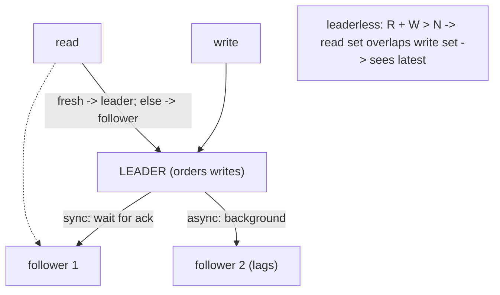

## Thesis

Keeping copies of data on multiple nodes --- so the system survives a node failing, reads scale across replicas, and data lives near its users --- via a leader that accepts writes and followers that copy them (synchronously for safety or asynchronously for speed), or a leaderless scheme where quorums of nodes agree; with the central tension that replication buys availability and throughput at the cost of consistency between the copies.

## Sub

**Why replicate: availability, read-scale, locality** -> **single-leader with sync or async** -> **replication lag and read-your-writes** -> **zoom out** to multi-leader, leaderless quorums, and the pivots an interviewer rides from "add a replica" into sync-vs-async, what lag breaks, and the quorum math.

## Spine

- Replication keeps **copies on multiple nodes** --- for **availability** (a node dies, another has the data), **read throughput** (spread reads across replicas), and **locality** (a copy near each region's users).
- The common model is **single-leader**: one node accepts writes and streams them to followers --- **synchronous** replication waits for a follower to confirm (durable, but slower, and a stalled follower blocks writes), **asynchronous** doesn't (fast, but the leader can acknowledge a write the followers don't have yet).
- The cost of async is **replication lag**: followers trail the leader, so a read from a follower can be stale --- breaking read-your-writes and monotonic reads unless you handle it.
- Beyond single-leader lie **multi-leader** (writes accepted in multiple regions, but conflicting writes must be resolved) and **leaderless / quorum** systems (any node takes writes, and **R + W > N** makes read and write quorums overlap so a read is guaranteed to see the latest write).

## Companion Notes

### walk

Copies on many nodes, and their cost

One write and one read across a replicated store --- the leader that takes the write and streams it to followers, the sync-vs-async choice and the lag it creates, the stale-read problem that lag causes, and the quorum math that leaderless systems use instead.

Say the trade first --- "replication buys availability and read throughput, and the bill is consistency between the copies." Every question (sync vs async, lag, quorums) is a point on that trade.

### drill

Probe Drill

Graded follow-ups on leader-follower, sync/async, replication lag, and quorums --- the ones that separate "add a read replica" from reasoning about consistency across copies.

Name the tension: more copies means better availability and read scale but weaker consistency between them -- sync/async, lag handling, and quorum math are all ways of placing yourself on that trade.

## Drill

SDE2 | the model and the mechanics
SDE3 | consistency, multi-leader, quorums
Staff | CAP, conflicts, and split-brain

### SDE2 | what replication is

What is replication and why do it?

Keeping copies of the same data on multiple nodes. Three reasons: **availability/durability** --- if one node fails, another copy still has the data, so you don't lose it or go down; **read scalability** --- you can serve reads from many replicas instead of overloading one node; and **locality** --- putting a copy near each region's users reduces read latency. It's foundational to any highly-available or large-scale data system, and the whole subject is really about managing the *consistency* of those copies as they inevitably diverge.

### SDE2 | leader-follower

What is leader-follower (primary-replica) replication?

One node is the **leader** (primary): all writes go to it. It applies each write and then streams the change to its **followers** (replicas), which apply the same changes in the same order to stay copies of the leader. Reads can go to the leader *or* any follower. This is the most common replication model --- it gives you a single place that orders all writes (avoiding write conflicts) while letting reads scale across followers. The leader is the source of truth; followers are read-only copies that trail it.

### SDE2 | sync vs async replication

What's the difference between synchronous and asynchronous replication?

**Synchronous**: the leader waits for a follower (or a quorum) to confirm it has the write before acknowledging success to the client --- so an acknowledged write is guaranteed to exist on more than one node (durable), but the client waits longer, and if a synchronous follower is slow or down, writes *stall*. **Asynchronous**: the leader acknowledges the write as soon as *it* has it and streams to followers in the background --- fast, and a slow follower doesn't block writes, but the leader can acknowledge a write the followers don't have yet, so a crash right then can lose it. The trade is durability/consistency versus write latency and availability.

### SDE2 | replication lag

What is replication lag?

The delay between the leader applying a write and a follower having it --- with asynchronous replication, followers are always a little behind the leader. Usually it's milliseconds, but under load, large writes, or network issues it can grow to seconds or more. The consequence is **stale reads**: a read served by a lagging follower may not reflect a write that already succeeded on the leader. Lag is the fundamental cost of asynchronous replication and the source of most replication consistency headaches (a user updates something, then reads a replica and doesn't see their own change).

### SDE2 | read scaling

How does replication scale reads?

By spreading read traffic across the followers instead of hitting a single node. Since followers are copies, a read can be served by any of them, so N replicas give you roughly N times the read capacity --- ideal for read-heavy workloads (which most are). Writes still all go to the single leader, so replication scales *reads* but not *writes* (write throughput is capped by the one leader). The catch is that follower reads can be stale (lag), so you route reads that must be fresh (like read-your-writes) to the leader and the rest to followers.

### SDE2 | failover

What happens when the leader fails?

**Failover**: a follower is promoted to become the new leader, and clients/other followers are redirected to it. This can be automatic (a system detects the leader is down and promotes a replica) or manual. The tricky parts: detecting failure reliably (not promoting on a transient network blip), choosing the most up-to-date follower, and redirecting traffic. With **asynchronous** replication, the promoted follower may be missing the last few writes the old leader had acknowledged but not yet replicated --- so those writes are *lost* on failover. Failover is where replication's durability promises get tested, and it's a common source of data loss and split-brain if done carelessly.

### SDE2 | replication vs backup

Isn't replication just a backup?

No --- they solve different problems. **Replication** keeps live, up-to-date copies for availability and scale; if you delete a row or a bad write corrupts data, replication faithfully copies the *deletion/corruption* to every replica instantly. **Backups** are point-in-time snapshots for recovering from mistakes, corruption, or ransomware --- they let you restore to *before* the bad thing happened. So replication protects against node/hardware failure and serves reads; backups protect against logical errors and let you go back in time. You need both: replication is not a substitute for backups, because it dutifully replicates your mistakes.

### SDE3 | sync vs async trade-offs

How do you decide between synchronous and asynchronous replication?

By what you can't afford to lose versus how much latency you can pay. **Sync** guarantees an acknowledged write survives a node failure (no data loss on failover) but adds the round-trip to a follower on every write, and worse, a slow or failed synchronous follower *blocks writes* entirely --- so pure sync trades availability for durability. **Async** keeps writes fast and available regardless of follower health, but risks losing recently-acknowledged writes if the leader dies before replicating. The common middle ground is **semi-synchronous**: replicate synchronously to *one* follower (so at least two copies exist) and asynchronously to the rest --- durability without a single slow follower stalling everything. The choice is really "how bad is losing the last few writes?"

### SDE3 | read-your-writes

What is read-your-writes consistency and how do you provide it?

The guarantee that after a user makes a write, their own subsequent reads reflect it --- so they never update something and then not see their change. Async replication breaks it: the write is on the leader, but their read hits a lagging follower without it. Fixes: **read from the leader** for data the user might have just modified (e.g. their own profile), **track the write timestamp/position** and only read from a follower caught up past it, or **route a user to a follower for a while after they write** to one that's caught up. It's the most user-visible replication anomaly, so read-your-writes is usually the first consistency guarantee you add on top of async replicas.

### SDE3 | monotonic reads

What are monotonic reads and why do they matter?

The guarantee that a user's successive reads don't go *backwards* in time --- once they've seen a value, they won't later see an older one. Without it, reading from different followers with different lag can show a user data, then show them *older* data on the next read (they see a comment, refresh, and it's gone). It's weaker than read-your-writes but still important for a coherent experience. The typical fix is **sticky routing**: pin a user's reads to the *same* replica (by hashing their id), so they always read from one consistent, monotonically-advancing copy rather than bouncing between followers at different lag. Different anomaly, related cause: multiple replicas at different points in time.

### SDE3 | multi-leader replication

What is multi-leader replication and when is it used?

Multiple nodes (often one per region) each accept writes and replicate to each other --- so writes are local/fast in every region and the system tolerates a region being partitioned. The hard problem is **write conflicts**: two leaders can accept conflicting writes to the same data concurrently (region A and region B both edit the same record), and there's no single order, so conflicts must be *detected and resolved* (last-writer-wins, application merge, CRDTs). Use it for multi-region write availability or offline-capable clients (each device is a leader that syncs later). It buys local writes and partition tolerance at the cost of conflict resolution --- which is genuinely hard, so single-leader is preferred unless you truly need multi-region writes.

### SDE3 | leaderless replication and quorums

How does leaderless (quorum) replication work?

There's no leader --- the client (or a coordinator) writes to *several* nodes and reads from *several* nodes directly. A write is considered successful when **W** nodes acknowledge it; a read queries **R** nodes and takes the newest version. The key is the quorum condition **R + W > N** (N = replicas): it forces the read set and the write set to *overlap* in at least one node, so any read is guaranteed to include at least one node that has the latest write. This is the Dynamo-style model (DynamoDB, Cassandra): high availability (no single leader to fail, writes succeed as long as W nodes are up) with tunable consistency via R and W, at the cost of needing read-repair and anti-entropy to reconcile divergent copies.

### SDE3 | quorum math

Why does R + W > N guarantee you read the latest write?

Because two sets that together exceed the total must share at least one element. If a write landed on W nodes and a read queries R nodes, and R + W > N, then by pigeonhole the read set and write set *must* intersect --- at least one node in the read set has the latest write, so the read (taking the newest version it sees) can't miss it. Example: N=3, W=2, R=2 --- any 2 write-nodes and any 2 read-nodes overlap in at least one. Tuning: W=N gives durable writes but low write availability; R=1, W=N gives fast reads; R=N, W=1 gives fast writes. **Sloppy quorums** relax this (accept writes on *any* reachable nodes during a partition, then hand off later) --- more available, but breaks the overlap guarantee, so strictly weaker consistency.

### SDE3 | failover hazards

What can go wrong during failover?

Two big hazards. **Lost writes**: with async replication, promoting a follower that hadn't received the leader's last writes silently loses them (and if the old leader comes back and its extra writes are discarded, that's data loss). **Split-brain**: if the old leader isn't truly dead (just partitioned) and a new one is promoted, you have *two* leaders both accepting writes --- divergent, conflicting data that's painful to reconcile. Guarding against these needs careful failure detection (don't promote on a transient blip), **fencing** (ensure the old leader can't keep accepting writes --- STONITH, a fencing token, or a lease), and choosing the most up-to-date follower. Failover is deceptively hard: the naive "promote a replica" hides lost-write and split-brain traps.

### Staff | the consistency-availability trade

How does replication embody the CAP trade-off?

Replication is where CAP becomes concrete. When a network partition splits your replicas, you must choose: keep accepting writes on both sides (**available**, but the sides diverge --- sacrificing consistency), or refuse writes on the minority side (**consistent**, but unavailable there). Single-leader sync leans CP (a partition from the sync follower stalls writes --- consistent but not available); leaderless/async leans AP (writes succeed on reachable nodes, copies diverge and reconcile later --- available but eventually consistent). The tunable middle is the quorum (R/W) and consistency-level knobs (Cassandra's ONE vs QUORUM vs ALL), which let you slide along the CA trade per operation. The senior framing: replication doesn't *solve* consistency-vs-availability, it *exposes the dial*, and you set it per workload.

### Staff | replication lag at scale

How do you manage replication lag in a large read-heavy system?

Layered mitigations, because you can't eliminate lag while staying async. Route **reads that need freshness to the leader** (or a synchronous replica) --- your own writes, critical reads --- and everything else to followers. Provide **read-your-writes** and **monotonic reads** via write-position tracking and sticky routing. **Monitor lag** as a first-class metric and shed follower reads (fall back to the leader) when a follower's lag exceeds a threshold. For causal correctness, propagate a **version/timestamp** with requests so a read waits for (or picks) a replica caught up past the client's last-seen write (causal consistency). The goal isn't zero lag --- it's ensuring the *specific* reads that would be harmed by staleness are protected, while the bulk still scale across followers.

### Staff | quorum consistency isn't linearizable

Does R + W > N give you strong (linearizable) consistency?

No --- it's stronger than eventual, but not linearizable, and there are edge cases. R+W>N guarantees a read set overlaps a *completed* write set, but concurrent operations, partial writes (a write that reached some but not W nodes), and read-repair timing can still surface stale or non-linearizable results --- e.g. two reads concurrent with a write may see different values, and a write that failed to reach W nodes may still have landed on some, to be read later. That's why quorum systems add **read-repair** (on a read, update any stale replicas found) and **anti-entropy** (background reconciliation like Merkle-tree sync) to converge, and why they're described as *tunable/eventual* rather than strongly consistent. True linearizability needs consensus (Paxos/Raft), which is more expensive; quorums are the pragmatic, highly-available approximation.

### Staff | multi-region replication

What's hard about replicating across regions?

The speed of light. Cross-region round-trips are tens to hundreds of milliseconds, so **synchronous** replication across regions makes every write pay that latency (often unacceptable), while **asynchronous** cross-region replication means large lag and real windows for lost writes / stale reads. So you choose: a single-region leader (writes are fast locally but far users pay latency and a region outage loses write availability), or multi-leader/multi-region writes (local writes everywhere, but cross-region conflict resolution). Where the leader lives, whether you do sync-within-region + async-across-region, and how you handle a region failover (promoting another region's replica, accepting the async lag as potential lost writes) are the core decisions. Geo-replication is fundamentally a latency-vs-consistency-vs-availability negotiation dictated by physics.

### Staff | conflict resolution

How do you resolve conflicting writes in multi-leader or leaderless systems?

Several strategies along a spectrum of correctness. **Last-writer-wins (LWW)**: pick the write with the latest timestamp --- simple, but *silently discards* the other write (and clock skew makes "latest" unreliable). **Version vectors / vector clocks**: detect whether two writes are truly concurrent (a genuine conflict) or one causally followed the other (no conflict), so you only need to resolve real conflicts --- surfacing concurrent versions to the application to merge. **Application-defined merge**: domain logic combines them (union two shopping carts). **CRDTs** (conflict-free replicated data types): data structures designed so concurrent updates *always* merge deterministically without conflict (counters, sets, sequences) --- the strongest option where the data fits. The choice trades simplicity against data loss: LWW is easy but lossy; CRDTs are elegant but only fit certain data types; most systems land on version-vector detection plus app or CRDT merge.

### Staff | split-brain and fencing

How do you prevent split-brain, and what is fencing?

Split-brain is two nodes both believing they're the leader (usually after a partition where the old leader wasn't really dead), both accepting writes, diverging. Prevention needs two things: a reliable way to elect *one* leader (consensus / a lease from a coordination service like ZooKeeper/etcd, so leadership is granted, time-bounded, and singular), and **fencing** --- ensuring a deposed or stale leader *cannot* still perform writes. Fencing mechanisms: **STONITH** ("shoot the other node in the head" --- forcibly power it off), or a **fencing token** (a monotonically increasing number handed out with leadership; the storage layer rejects any write carrying an older token, so an old leader that wakes up and tries to write is refused because its token is stale). The fencing token is the robust software approach: even if the old leader doesn't know it's been replaced, its writes are rejected because it's fenced out by a lower token.

### Staff | semi-synchronous replication

Why is semi-synchronous replication a common practical choice?

Because it captures most of sync's durability without sync's fragility. Pure synchronous replication to all followers makes writes slow and, worse, means *any* slow/failed follower stalls all writes (availability collapses to the weakest replica). Pure async risks losing acknowledged writes on failover. **Semi-synchronous** replicates synchronously to *one* follower (guaranteeing an acknowledged write exists on at least two nodes --- durable against a single node loss, no data loss on a clean failover to that follower) and asynchronously to the rest (so the other followers' health doesn't block writes). If the synchronous follower fails, a system typically promotes another follower to be the synchronous one. It's the pragmatic sweet spot most production databases default to: "at least two copies before I acknowledge, but don't let the whole fleet's slowness stall me."

## Walk

### One leader takes writes; followers copy them

```flow
w[write] -> l[leader applies + orders it] -> s[streams change to followers -> reads from any]
```

All writes go to a single leader, which applies each one, establishes the order, and streams the change to its followers. The followers apply the same changes in the same order, staying read-only copies of the leader. Reads can be served by the leader or any follower.

This single-leader model is the common default because the one leader gives every write a single, conflict-free order, while the followers let reads scale out across many nodes. The leader is the source of truth; the followers exist for availability (a copy survives the leader failing) and read throughput.

### Sync waits, async doesn't --- and async lags

```flow
a[write] -> sync[wait for follower ack: durable, can stall] -> async[ack immediately: fast, followers trail]
```

The critical choice is *when the leader acknowledges the write*. **Synchronous**: wait for a follower to confirm it has the write --- so an acknowledged write provably exists on two nodes (durable), but the client waits, and a stalled synchronous follower blocks writes entirely. **Asynchronous**: acknowledge as soon as the leader has it, replicate in the background --- fast and unaffected by follower health, but the leader can acknowledge a write the followers don't have yet.

The cost of async is **replication lag**: followers always trail the leader, usually by milliseconds but sometimes seconds. Most systems compromise with **semi-synchronous** --- synchronous to one follower (at least two copies), async to the rest (no single slow follower stalls everything).

### Lag breaks read-your-writes; quorums fix reads

```flow
r[read from lagging follower] -> miss[misses your own just-made write] -> q[leaderless: R + W > N overlaps -> read sees latest]
```

Replication lag surfaces as **stale reads**: a user writes (lands on the leader), then reads a lagging follower and doesn't see their own change --- breaking read-your-writes. Single-leader fixes route such reads to the leader or a caught-up follower. Leaderless systems solve it differently, with quorums:

```yaml
# leaderless / Dynamo-style quorum
replicas:        N = 3       # copies per key
write_quorum:    W = 2       # a write must ack on 2 nodes
read_quorum:     R = 2       # a read queries 2 nodes, takes the newest
# R + W > N  ->  2 + 2 > 3  ->  read set and write set MUST overlap
# so any read includes >=1 node with the latest write
consistency: tunable   # W=N durable writes; R=1 fast reads; sloppy quorum = more available, weaker
```

The quorum condition **R + W > N** forces the read set and write set to overlap in at least one node (two sets exceeding the total must intersect), so a read is guaranteed to include a node with the latest write. Tuning R and W slides between read and write availability; **sloppy quorums** relax the overlap for more availability during partitions, at the cost of the guarantee. This is the Dynamo-style model (DynamoDB, Cassandra) --- highly available, tunably consistent, reconciled by read-repair and anti-entropy.

### Failover, multi-leader, and split-brain

```flow
f[leader dies -> promote follower] -> lost[async: lagging follower loses recent writes] -> sb[old leader alive? split-brain -> fence it]
```

When the leader fails, a follower is promoted --- but this is where replication's promises get tested. With **async**, the promoted follower may be missing the leader's last acknowledged writes, silently losing them. If the old leader isn't truly dead but *partitioned*, promoting a new one gives you **split-brain**: two leaders accepting divergent writes.

Guarding this needs careful failure detection (don't promote on a blip), choosing the most up-to-date follower, and **fencing** the old leader --- a **fencing token** (a monotonic number handed out with leadership; the storage rejects writes carrying an older token, so a stale leader is refused) is the robust approach. And **multi-leader** replication (writes in multiple regions) trades local-write speed for genuine write-conflict resolution (LWW, version vectors, CRDTs). Zooming out: replication buys availability, read scale, and locality, and every mechanism here --- sync vs async, lag handling, quorums, failover, conflict resolution --- is managing the consistency bill that comes with more copies.

### Model Script

- Frame the trade | "Replication is keeping copies of data on multiple nodes -- for availability if a node dies, read throughput by spreading reads, and locality near users. The unifying tension is that more copies buy availability and read scale, and the bill is consistency between the copies. Every design question -- sync or async, how you handle lag, quorum math -- is choosing where to sit on that trade."
- Single-leader, sync vs async | "The common model is single-leader: one node takes all writes, orders them, and streams to followers, which serve reads. The key choice is when the leader acknowledges. Synchronous waits for a follower, so an acknowledged write exists on two nodes -- durable, but a slow follower stalls writes. Asynchronous acks immediately -- fast, but followers lag and the leader can ack a write they don't have yet. Most systems go semi-synchronous: sync to one follower for durability, async to the rest so one slow node doesn't stall everything."
- Lag and its anomalies | "Async's cost is replication lag -- followers trail the leader, so a follower read can be stale. That breaks read-your-writes: a user updates something, reads a lagging replica, and doesn't see their change. I fix it by routing reads that might reflect the user's own writes to the leader or a caught-up follower, tracking the write position, or sticky-routing them to one replica -- which also gives monotonic reads so they don't see data go backwards."
- Quorums and leaderless | "Leaderless systems handle this differently. Any node takes writes, a write needs W acks, a read queries R nodes and takes the newest, and R plus W greater than N forces the read and write sets to overlap -- so a read always includes a node with the latest write. That's the Dynamo model, DynamoDB and Cassandra: highly available, tunably consistent via R and W, reconciled with read-repair and anti-entropy. It's stronger than eventual but not linearizable -- true linearizability needs consensus like Raft."
- Interviewer: "Your leader fails over and you notice some writes were lost. Why, and how do you prevent it?"
- Failover and fencing | "Because the replication was asynchronous -- the follower promoted to leader hadn't received the old leader's last acknowledged writes, so promoting it silently dropped them. To prevent lost writes on failover you need synchronous or semi-synchronous replication so an acknowledged write is on at least two nodes before you ack. And you have to guard split-brain: if the old leader was only partitioned, not dead, you'd have two leaders -- so you fence it, ideally with a fencing token, a monotonic number where the storage rejects any write carrying an older token, so the stale leader's writes are refused even if it doesn't know it's been replaced."
- Land it | "So: replication gives availability, read scale, and locality via copies; single-leader with sync, async, or semi-sync trading durability against write latency; lag handled by routing fresh reads to the leader and providing read-your-writes and monotonic reads; leaderless quorums with R+W>N for tunable, highly-available consistency; and careful failover with fencing to avoid lost writes and split-brain. The one line is that replication exposes the consistency-availability dial rather than solving it, and you set the dial per workload."

## Whiteboard

Sketch single-leader replication and the quorum overlap.

### What does sync vs async change?

Sync waits for a follower before acknowledging (durable, but a slow follower stalls writes); async acks immediately (fast, but followers lag and a failover can lose the un-replicated writes).

### Why does R + W > N guarantee a fresh read?

Because a write set of W nodes and a read set of R nodes, together exceeding N, must overlap in at least one node -- so the read includes a node holding the latest write.



Verdict: single-leader orders writes and streams to followers (sync for durability, async for speed but with lag); leaderless quorums use R+W>N to overlap read and write sets, both trading consistency against availability.

## System

Zoom out to where replication sits in a data system.

### Where it sits

Writes: to the single leader (or W nodes in a quorum system) [*]
Leader: orders writes, streams to followers (sync / async / semi-sync)
Followers: read-only copies, serve reads, trail the leader by the lag
Reads: fresh ones to the leader; the rest scale across followers
Failover + fencing: promote a follower, fence the old leader (token/lease)

### Pivots an interviewer rides

From "add a replica" they push on sync/async, lag, and quorums.

#### Synchronous or asynchronous replication?

-> semi-synchronous usually: sync to one follower for durability, async to the rest for availability
Pure sync stalls writes on a slow follower; pure async risks losing acknowledged writes on failover; semi-sync guarantees at least two copies before acking without letting the whole fleet's slowness block writes.

#### How do leaderless systems stay consistent without a leader?

-> quorums: a write needs W acks, a read queries R, and R + W > N forces overlap so the read sees the latest write
Tuning R and W trades read vs write availability; sloppy quorums relax the overlap for more availability during partitions at the cost of the guarantee, reconciled by read-repair and anti-entropy.

## Trade-offs

The calls that separate "add a read replica" from reasoning about copies.

### Synchronous vs asynchronous replication

- Sync: an acknowledged write survives node failure (no data loss on failover) -- but adds latency and a slow/failed follower stalls writes
- Async: fast writes, unaffected by follower health -- but followers lag (stale reads) and recent writes can be lost on failover

Default to semi-synchronous (sync to one follower, async to the rest) for durability without a single slow node stalling everything.

### Single-leader vs multi-leader vs leaderless

- Single-leader: one write order, no write conflicts, simple -- but the leader caps write throughput and is a failover point
- Multi-leader: local writes per region, partition-tolerant -- but write conflicts you must detect and resolve
- Leaderless (quorum): highly available, no leader to fail, tunable consistency -- but eventual/non-linearizable, needs read-repair

Prefer single-leader unless you need multi-region write availability (multi-leader) or maximal availability with tunable consistency (leaderless).

### Strong (consensus) vs tunable (quorum) consistency

- Consensus (Raft/Paxos): linearizable, one agreed order -- but more coordination, lower throughput/availability under partition
- Quorum (R+W>N): highly available, tunable, simple -- but not linearizable, edge cases needing read-repair

Use consensus where you need linearizability (leader election, config, critical ordering); use quorums for highly-available data stores where eventual/tunable consistency is acceptable.

## Model Answers

### the reframe | Copies, and their consistency bill

The frame to lead with.

- Copies for availability, read-scale, locality | key | the reasons to replicate
- Sync durable / async fast, but lags | store | the core write-side choice
- More copies = weaker consistency | note | the bill you manage

### the depth | Quorums and failover

Where it's really tested.

- R + W > N overlaps read and write sets | key | leaderless tunable consistency
- Semi-sync = two copies without stalling | store | the practical durability sweet spot
- Fence the old leader on failover | note | fencing token stops split-brain lost writes

## Numbers

Back-of-envelope the quorum overlap, the failure tolerance, and the async cost.

R + W > N makes read and write quorums overlap (guaranteeing a fresh read); the R/W split tunes read-vs-write availability, and async trades durability for speed.

- nodes | Replicas (N) | 3 | 1 | 1
- writeQ | Write quorum (W) | 2 | 1 | 1
- readQ | Read quorum (R) | 2 | 1 | 1

```js
function (vals, fmt) {
  var N = vals.nodes, W = vals.writeQ, R = vals.readQ;
  var overlap = (R + W) > N;
  return [
    { k: 'R + W', v: fmt.n(R + W), u: 'vs N = ' + N, n: overlap ? 'R+W > N: read and write quorums overlap, so a read is guaranteed to see the latest completed write \u2014 strong quorum consistency' : 'R+W <= N: quorums may NOT overlap, so a read can miss the latest write \u2014 weaker, eventual consistency', over: !overlap },
    { k: 'Write survives', v: fmt.n(Math.max(0, N - W)), u: 'node failures', n: 'a write needs W=' + W + ' of ' + N + ' nodes, so it tolerates ' + Math.max(0, N - W) + ' failing \u2014 higher W means stronger durability but lower write availability', over: false },
    { k: 'Read survives', v: fmt.n(Math.max(0, N - R)), u: 'node failures', n: 'a read needs R=' + R + ' of ' + N + ', tolerating ' + Math.max(0, N - R) + ' failing \u2014 the R/W split tunes the read-vs-write availability balance', over: false },
    { k: 'Async lag', v: 'stale reads', u: 'on followers', n: 'asynchronous followers trail the leader, so a follower read can miss a just-committed write \u2014 breaks read-your-writes unless you read from the leader or a caught-up replica', over: false },
    { k: 'Failover cost', v: 'lost writes', u: 'on async promote', n: 'promoting a lagging async follower loses the writes it had not yet received \u2014 the durability price of async replication, why sync/semi-sync exists', over: false }
  ];
}
```

## Red Flags

What makes an interviewer wince.

### "We have replicas, so our data is backed up"

Replication copies live data including your mistakes -- a bad delete or corruption is replicated to every replica instantly, so replicas can't restore you to *before* the error.

Keep backups (point-in-time snapshots) as well as replicas: replication protects against node failure and scales reads; backups protect against logical errors and let you go back in time.

### "We read from replicas to scale, and users see their own updates"

Async replicas lag, so a user who writes then reads a follower may not see their own change -- read-your-writes is broken.

Route reads that might reflect the user's recent writes to the leader (or a follower caught up past their write position); scale the rest of the reads across followers.

### "On failover we just promote a replica"

With async replication the promoted replica may be missing recent acknowledged writes (lost writes), and if the old leader is only partitioned you get split-brain -- two leaders diverging.

Use synchronous/semi-synchronous replication so an acknowledged write is on two nodes, and fence the old leader (a fencing token) so a stale leader can't keep writing.

## Opener

### 30s | The one-liner

How I open when asked to make a data store highly available or scale reads.

#### What is the shape?

Keep copies on multiple nodes -- a leader takes writes and streams them to followers (sync for durability, async for speed but with lag), or a leaderless quorum where R + W > N -- for availability, read scale, and locality.

#### What's the tension?

More copies buy availability and throughput but cost consistency between them, so every choice (sync/async, lag handling, quorum math, failover) is where you set the consistency-availability dial.

##### Hooks

Where an interviewer usually pushes next.

- Sync or async? | semi-sync: durable without stalling | drill
- Leaderless consistency? | quorums, R + W > N | drill
- Lost writes on failover? | sync + fencing | drill

Foot: two sentences -- replication buys availability, read scale, and locality at the cost of consistency between copies, and it exposes the consistency dial rather than solving it -- so you set sync/async, lag handling, and quorums per workload.

## Bank

### SCALE | A read-heavy store replicated across nodes with tunable quorums

Task: reason about the quorum trade and failure tolerance.
Model: R + W > N makes read and write sets overlap so reads see the latest completed write; tuning R and W slides between read and write availability (a write tolerates N-W failures, a read N-R); sloppy quorums relax the overlap for more availability during partitions at the cost of the guarantee; and it's tunable/eventual, not linearizable, so read-repair and anti-entropy reconcile divergence.
Int: what does raising W do to write availability?
Lowers it -- a higher W needs more nodes up to accept a write (more durable, less available), which is the write side of the R/W dial.

### DESIGN | A highly-available data store with no data loss on failover

Task: design the replication for durability + availability.
Model: single-leader with semi-synchronous replication (sync to one follower so an acknowledged write is on at least two nodes -- no data loss on a clean failover -- async to the rest so one slow follower doesn't stall writes); read-your-writes by routing fresh reads to the leader; automatic failover that picks the most up-to-date follower and fences the old leader with a fencing token to prevent split-brain and lost writes; backups separately for logical-error recovery.
Int: why semi-synchronous rather than fully synchronous?
Because fully sync stalls all writes when any follower is slow; semi-sync guarantees two copies before acking without letting the whole fleet's slowness block writes.

### Extra Curveballs

### CURVEBALL | split-brain | After a network partition, two of your nodes both think they're the leader and both accept writes. What happened and how do you prevent it?

Model: split-brain -- the old leader was only partitioned, not dead, but a new leader was promoted, so both accept divergent, conflicting writes that are painful to reconcile. Prevention needs singular, granted leadership (a lease/consensus from a coordination service like etcd/ZooKeeper, so only one node holds leadership at a time and it's time-bounded) plus fencing so a stale leader cannot still write: STONITH (forcibly power off the old node) or, more robustly, a fencing token -- a monotonically increasing number issued with leadership that the storage layer checks, rejecting any write carrying an older token. So even if the old leader never realizes it's been replaced, its writes are refused because its token is stale -- it's fenced out.

### Frames

- Replication keeps copies for availability, read-scale, and locality -- at the cost of consistency between copies
- Single-leader (sync/async/semi-sync) orders writes; leaderless quorums use R + W > N to overlap read and write sets
- Failover must avoid lost writes (sync/semi-sync) and split-brain (fencing token); it exposes the consistency dial
