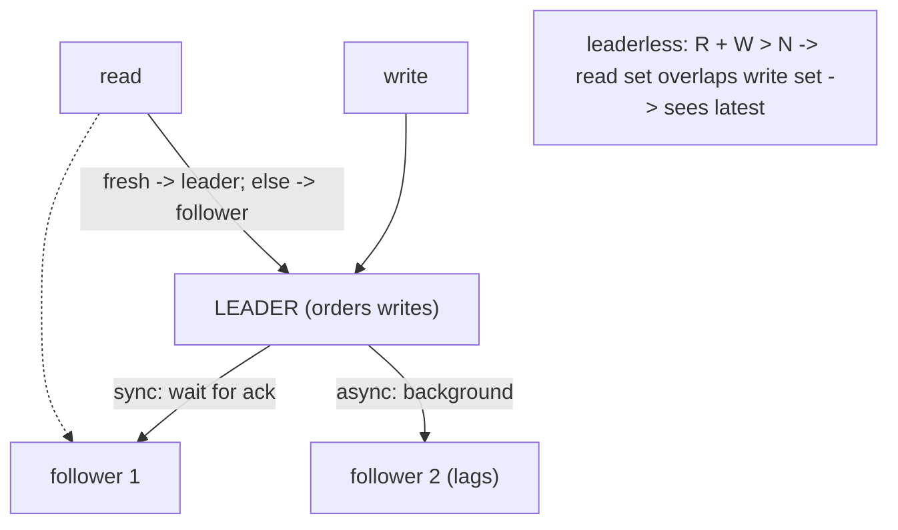

## Thesis

Keeping copies of data on multiple nodes --- so the system survives a node failing, reads scale across replicas, and data lives near its users --- via a leader that accepts writes and followers that copy them (synchronously for safety or asynchronously for speed), or a leaderless scheme where quorums of nodes agree; with the central tension that replication buys availability and throughput at the cost of consistency between the copies.

## Sub

**Why replicate: availability, read-scale, locality** -> **single-leader with sync or async** -> **replication lag and read-your-writes** -> **zoom out** to multi-leader, leaderless quorums, and the pivots an interviewer rides from "add a replica" into sync-vs-async, what lag breaks, and the quorum math.

## Spine

- Replication keeps **copies on multiple nodes** --- for **availability** (a node dies, another has the data), **read throughput** (spread reads across replicas), and **locality** (a copy near each region's users).
- The common model is **single-leader**: one node accepts writes and streams them to followers --- **synchronous** replication waits for a follower to confirm (durable, but slower, and a stalled follower blocks writes), **asynchronous** doesn't (fast, but the leader can acknowledge a write the followers don't have yet).
- The cost of async is **replication lag**: followers trail the leader, so a read from a follower can be stale --- breaking read-your-writes and monotonic reads unless you handle it.
- Beyond single-leader lie **multi-leader** (writes accepted in multiple regions, but conflicting writes must be resolved) and **leaderless / quorum** systems (any node takes writes, and **R + W > N** makes read and write quorums overlap so a read is guaranteed to see the latest write).

## Companion Notes

### walk

Copies on many nodes, and their cost

One write and one read across a replicated store --- the leader that takes the write and streams it to followers, the sync-vs-async choice and the lag it creates, the stale-read problem that lag causes, and the quorum math that leaderless systems use instead.

Say the trade first --- "replication buys availability and read throughput, and the bill is consistency between the copies." Every question (sync vs async, lag, quorums) is a point on that trade.

### drill

Probe Drill

Graded follow-ups on leader-follower, sync/async, replication lag, and quorums --- the ones that separate "add a read replica" from reasoning about consistency across copies.

Name the tension: more copies means better availability and read scale but weaker consistency between them -- sync/async, lag handling, and quorum math are all ways of placing yourself on that trade.

### wb

Whiteboard

Rebuild the replicated write and read path from memory --- leader and followers, what crosses the wire, where the lag comes from, the quorum overlap, and the failover --- from the cues, with nothing in front of you.

Draw the leader and two followers first, then label the one arrow that decides everything: when the leader acknowledges. Sync waits, async does not --- and every anomaly on the board hangs off that one choice.

### sys

System Map

Zoom out: replication sits between a single ordered write path and every copy that serves reads --- it is where availability, read throughput, and locality get bought, and where consistency is the currency.

Lead with the dial, not the boxes --- "replication does not solve consistency versus availability, it exposes the dial, and I set it per workload."

### trade

Trade-offs

The decisions they drill --- sync vs async, single-leader vs multi-leader vs leaderless, quorum vs consensus, leader reads vs follower reads --- each with the condition that flips it.

Always name the switch condition, never a favorite. "Semi-sync by default" is only a good answer when you can also say what would make you pick pure async, and what would make you pay for consensus.

### model

Model Answers

Full spoken scripts --- the beats, in order, the way you would actually say them under time pressure.

Steal the frame, not the words --- copies for availability, read-scale, and locality; sync, async, or a quorum commit; lag and its three anomalies; failover with fencing. Then name the one risk before they ask.

### num

Numbers

Back-of-envelope the quorum overlap, the failure tolerance, and the price of async --- and know which number is the ceiling.

Lead with RPO as an actual number: lag times write-rate. "At 200 milliseconds of lag and 5,000 writes a second, a leader loss puts a thousand acknowledged writes at risk." That sentence is worth more than any diagram.

### rf

Red Flags

What sinks the round --- replicas as backups, replicas as write-scaling, unqualified last-writer-wins, calling a quorum strongly consistent --- and what to say instead.

The fastest no-hire here is a vocabulary error: saying "R plus W greater than N means strongly consistent." It tells the interviewer you cannot distinguish fresh-most-of-the-time from linearizable.

### open

30-Second

The opener and the close --- pitched at the altitude the question was actually asked at.

Open at the trade, not the topology --- copies buy availability, read scale, and locality, and the bill is consistency between them. Land on the two things that actually bite: lost writes on failover, and split-brain.

## Drill

all | All four levels, mixed --- the way a real loop actually comes at you
SDE2 | the model and the mechanics
SDE3 | consistency, multi-leader, quorums
Staff | CAP, conflicts, and split-brain

### SDE2 | what replication is

What is replication and why do it?

Keeping copies of the same data on multiple nodes. Three reasons: **availability/durability** --- if one node fails, another copy still has the data, so you don't lose it or go down; **read scalability** --- you can serve reads from many replicas instead of overloading one node; and **locality** --- putting a copy near each region's users reduces read latency. It's foundational to any highly-available or large-scale data system, and the whole subject is really about managing the *consistency* of those copies as they inevitably diverge.

Follow: You said it scales reads. Does it scale writes?
No --- and this is the most common misconception about replication. Every follower must apply **100% of the write stream**, not 1/N of it: a replica is a full copy, so it does all the write work the leader did, plus serving reads. So adding replicas adds read capacity but *never* write capacity, and it actually adds total write work (the same write is now applied N times across the cluster). The ceiling is a single node's apply throughput: once the write stream saturates one node, another replica cannot help, because that replica also has to keep up with the same stream. Scaling **writes** means **partitioning** (sharding), which splits the write stream; replication copies it.
Follow: You said a node dies and another copy has the data. Does that make the system available, or just the data durable?
Only **durable** --- availability is a separate, harder claim. A replica holding the data means the bytes survived; it does not mean the system is still serving. If writes only go to the leader, losing the leader means **zero write availability** until a failover completes, and that failover has to detect the failure (seconds), pick the right follower, promote it, and redirect clients --- during which you are down. And with async replication the promoted follower may be *missing* the last acknowledged writes, so you did not even keep durability for those. Replicas give durability immediately; they give availability only if failover is automatic, fast, and correct --- which is where most of the real difficulty lives.
Senior: Separating the **three motivations** (availability, read throughput, locality) and immediately naming that replication scales reads but **not** writes --- with partitioning as the write-side answer --- is what distinguishes someone who has operated replicas from someone who has read the definition.
Speak: Lead with the three reasons: **"copies on multiple nodes --- for availability if a node dies, read throughput by spreading reads, and locality near each region's users."** Then get ahead of the obvious follow-up: replication scales *reads*, never writes, because every follower applies the whole write stream. Sharding is what scales writes.

### SDE2 | leader-follower

What is leader-follower (primary-replica) replication?

One node is the **leader** (primary): all writes go to it. It applies each write and then streams the change to its **followers** (replicas), which apply the same changes in the same order to stay copies of the leader. Reads can go to the leader *or* any follower. This is the most common replication model --- it gives you a single place that orders all writes (avoiding write conflicts) while letting reads scale across followers. The leader is the source of truth; followers are read-only copies that trail it.

Follow: Why does a single leader remove write conflicts?
Because every write passes through **one node that assigns a single total order**. Two clients writing the same row are serialized by the leader (its locks / MVCC decide who is first), so there is exactly one "latest" value and exactly one sequence of changes, which every follower then replays. A conflict only exists when two writes to the same item happen with **no agreed order between them** --- which is precisely what multi-leader and leaderless systems allow, and precisely why they have to *detect* concurrency (version vectors) and *resolve* it (LWW, merge, CRDT). Single-leader does not resolve conflicts cleverly; it makes them impossible by construction, and that is the whole reason it is the default.
Follow: Do followers have to apply the changes in the same order the leader did?
Yes --- this is state-machine replication: **same starting state + same operations in the same order = same final state**. Apply them out of order and the replica silently diverges (a later UPDATE overwritten by an earlier one). That is why the replication stream is an **ordered log with a position** --- an LSN in Postgres, a binlog offset or GTID in MySQL --- and why every follower tracks exactly how far it has consumed. That position is doing double duty: it is how the follower resumes after a disconnect, how you measure lag, and how you pick the most up-to-date follower at failover. Systems that parallelize apply for throughput must preserve the ordering of *conflicting* writes (MySQL's multi-threaded applier parallelizes by schema or by logical-clock groups that are known not to conflict) --- they relax the order only where it provably does not matter.
Senior: Naming the leader as **the thing that supplies a single total order**, and grounding replay in state-machine replication with an **ordered log plus a per-follower position**, shows you understand *why* the model works --- not just that "the leader sends changes to followers."
Speak: Say the mechanism and its purpose in one breath: **"one node takes every write, orders them, and streams that ordered log to followers, which replay it in the same order."** Then name the payoff: the single order is what makes write conflicts impossible --- and it is why multi-leader, which gives that up, has to resolve conflicts instead.

### SDE2 | sync vs async replication

What's the difference between synchronous and asynchronous replication?

**Synchronous**: the leader waits for a follower (or a quorum) to confirm it has the write before acknowledging success to the client --- so an acknowledged write is guaranteed to exist on more than one node (durable), but the client waits longer, and if a synchronous follower is slow or down, writes *stall*. **Asynchronous**: the leader acknowledges the write as soon as *it* has it and streams to followers in the background --- fast, and a slow follower doesn't block writes, but the leader can acknowledge a write the followers don't have yet, so a crash right then can lose it. The trade is durability/consistency versus write latency and availability.

Follow: You said a synchronous ack makes the write durable. Durable in what sense --- has the follower actually applied it?
Usually **no**, and the distinction matters. In MySQL semi-synchronous replication the follower acks once it has **received and persisted the event to its relay log** --- it has not necessarily replayed it into the tables yet. So the write is *safe* (it exists on two nodes, and a failover to that follower can recover it once the relay log drains) but it is not necessarily *visible* there: a read on that follower immediately after the ack can still miss it. Postgres makes the level explicit with `synchronous_commit`: `remote_write` (the standby's OS has it), `on` (flushed to the standby's WAL --- the usual choice), and `remote_apply` (actually replayed and visible to readers there, the only level that makes a follower read see your write, and the slowest). Knowing that sync replication bounds **data loss** but not **staleness** --- unless you pay for `remote_apply` --- is the precise version of this answer.
Follow: If the synchronous follower goes down, do writes just stop forever?
That is the pure-sync failure mode, and it is why nobody runs pure sync naively. Real systems escape it in one of three ways, and the differences matter. (1) **Timeout and downgrade** --- MySQL semi-sync falls back to asynchronous after `rpl_semi_sync_master_timeout`, which keeps you writing but **silently drops the durability guarantee at exactly the moment you needed it**, so an ack no longer means two copies and you must alarm on the downgrade, not just configure it. (2) **Any-of-N** --- Postgres `synchronous_standby_names = ANY 1 (s1, s2, s3)` lets *any* one of several standbys ack, so a single sick node cannot stall you. (3) **Quorum commit** --- require a majority to persist, which is what consensus protocols do. The general principle: never make your write path depend on **one named node** being healthy; depend on **k of n**.
Senior: Knowing that an ack means **received, not applied** (and that Postgres exposes exactly this as `remote_write` / `on` / `remote_apply`), and that semi-sync **silently downgrades to async on timeout**, is operational depth that almost nobody volunteers --- it says you have run this, not read about it.
Speak: Frame it as **"when does the leader say yes."** Say: **"sync waits for a follower to persist it, so an acknowledged write exists on two nodes; async acks immediately, so the leader can ack a write the followers do not have."** Then add the precise bit: the ack usually means *received*, not *applied* --- so sync bounds data loss, not staleness.

### SDE2 | replication lag

What is replication lag?

The delay between the leader applying a write and a follower having it --- with asynchronous replication, followers are always a little behind the leader. Usually it's milliseconds, but under load, large writes, or network issues it can grow to seconds or more. The consequence is **stale reads**: a read served by a lagging follower may not reflect a write that already succeeded on the leader. Lag is the fundamental cost of asynchronous replication and the source of most replication consistency headaches (a user updates something, then reads a replica and doesn't see their own change).

Follow: Your dashboard says the lag is 2 seconds. Two seconds of what --- and can that number lie?
It can lie, and it famously does. MySQL's `Seconds_Behind_Master` is derived from the timestamp of the event the follower is *currently applying* versus now --- so if the follower has stopped **receiving** (a wedged connection, a dead network path), it has nothing to apply, and the metric happily reports **0**: perfectly caught up, on a replica that is silently hours stale. Say precisely what it is blind to: **events the I/O thread has not yet fetched.** It is really measuring the SQL (applier) thread's lag behind the I/O (receiver) thread, so a slow or wedged *receiver* makes it read *low* --- MySQL's own manual says the applier "may quite often be caught up with the slow-reading" receiver, showing 0 "even if the I/O thread is late compared to the source." A relay-log backlog is the one thing it *does* surface (the applier is replaying an event the leader committed minutes ago, so the number climbs) --- which is exactly why a **0** is the reading to distrust, not a large one. The honest measurements are **positional** and **end-to-end**: compare log positions (the LSN byte-difference between the leader's current WAL and what the follower has received *and* replayed --- Postgres separates `sent`, `write`, `flush`, and `replay` LSNs for exactly this reason), and run a **heartbeat table** the leader writes a timestamp into every second, so the follower's lag is `now() - last_heartbeat_it_can_see`. That measures the thing you actually care about: how stale a read served here would be.
Follow: Why does lag grow at all? The network is not slower under load.
Because lag is almost always an **apply-throughput** problem, not a bandwidth one. The leader commits with hundreds of concurrent connections; the follower has to replay that stream with far less parallelism (Postgres replays WAL in a single startup process; MySQL needs multi-threaded applier explicitly configured, and it can only parallelize writes it knows do not conflict). So the leader's *concurrent* write throughput can simply exceed the follower's *serialized* replay throughput, and the follower falls behind under bursts. Then there are the spike-makers: **one huge transaction** (a backfill, a mass `DELETE`, a schema migration) arrives as a giant contiguous chunk that must be replayed largely serially; and a **long-running read on the follower** can block replay outright (in Postgres, replay of a change that would remove rows a long query still needs will either wait or cancel the query, depending on `hot_standby_feedback` / `max_standby_streaming_delay`). The fixes are at the source: chunk mass writes into small, lag-aware batches, enable parallel apply, and isolate heavy analytical reads on a replica whose lag you do not care about.
Senior: Distrusting `Seconds_Behind_Master` --- knowing it reads **0 on a follower that has stopped receiving** --- and reaching for **positional lag plus a heartbeat table**, then attributing lag to **serialized apply rather than bandwidth**, is the diagnostic instinct that separates operating replicas from configuring them.
Speak: Define it crisply: **"the delay between the leader committing a write and a follower having it --- so a follower read can miss a write that already succeeded."** Then show you have chased it: measure it positionally or with a heartbeat (the built-in seconds-behind metric reads zero on a *stalled* replica), and know it grows because the follower's apply is less parallel than the leader's write path.

### SDE2 | read scaling

How does replication scale reads?

By spreading read traffic across the followers instead of hitting a single node. Since followers are copies, a read can be served by any of them, so N replicas give you roughly N times the read capacity --- ideal for read-heavy workloads (which most are). Writes still all go to the single leader, so replication scales *reads* but not *writes* (write throughput is capped by the one leader). The catch is that follower reads can be stale (lag), so you route reads that must be fresh (like read-your-writes) to the leader and the rest to followers.

Follow: You said N replicas give roughly N times the read capacity. Is that actually true?
Not quite, and the gap matters. Every follower spends part of its capacity **applying the entire write stream** --- not a share of it, all of it --- so its spare capacity for reads is (its total capacity minus the apply cost). At a low write rate that overhead is negligible and the N-times approximation holds. At a **high** write rate, apply eats the node: each new replica arrives already burdened with 100% of the writes, so it contributes much less than a node's worth of read capacity, while adding to the leader's fan-out work. The honest statement is: **replication scales reads until the write stream saturates a single node's apply throughput** --- past that, adding replicas buys you almost nothing and you have to **partition**.
Follow: So which reads do you actually send to a follower?
Route by the **freshness the operation needs**, not by node load. Safe on a follower: analytics and reporting, browse and search and list views, feeds, recommendations, anything already cached or explicitly eventually-consistent, and anything where you can show a "last updated" timestamp. **Not** safe on a lagging follower: a user's **read-your-writes** (they just edited it and are looking at it), any **read-modify-write** --- reading a value, computing from it, and writing it back, because a stale read here silently produces a **lost update**, which is a correctness bug, not a freshness annoyance --- and any read feeding a **correctness decision** (checking a balance before a debit, checking inventory before committing an order, checking a permission that was just revoked). The tell of a strong answer is that you classify reads by *consequence of staleness* and route on that, instead of saying "reads go to replicas."
Senior: Puncturing the naive "N replicas equals N times the reads" (because **every follower applies the full write stream**), and then classifying reads by the **consequence of staleness** --- singling out **read-modify-write as a lost-update hazard**, not just a stale-data annoyance --- is exactly the reasoning a senior round is listening for.
Speak: Give the mechanism, then the ceiling: **"reads spread across followers, so a read-heavy workload scales out --- but every follower still applies every write, so replication scales reads, never writes, and past a certain write rate adding replicas stops helping."** Then route deliberately: stale-tolerant reads to followers, read-your-writes and anything read-modify-write to the leader.

### SDE2 | failover

What happens when the leader fails?

**Failover**: a follower is promoted to become the new leader, and clients/other followers are redirected to it. This can be automatic (a system detects the leader is down and promotes a replica) or manual. The tricky parts: detecting failure reliably (not promoting on a transient network blip), choosing the most up-to-date follower, and redirecting traffic. With **asynchronous** replication, the promoted follower may be missing the last few writes the old leader had acknowledged but not yet replicated --- so those writes are *lost* on failover. Failover is where replication's durability promises get tested, and it's a common source of data loss and split-brain if done carelessly.

Follow: How do you decide the leader is actually dead, and not just slow?
You fundamentally **cannot** distinguish them --- a crashed leader and a partitioned-but-healthy leader look identical from the outside, and so does one stuck in a long GC pause. So detection is a **heuristic**: a timeout, ideally confirmed by a **quorum of observers** rather than one monitor (a single monitor that is itself partitioned will happily declare a healthy leader dead). And the timeout is a direct trade: **short** means fast recovery but more false promotions on a transient blip (and every false promotion is a split-brain opportunity); **long** means fewer false positives but a longer outage. The senior move is to stop trying to make detection perfect --- it cannot be --- and instead make **being wrong safe**: fence the old leader so that even if you promote while it is still alive, its writes are refused.
Follow: Which follower do you promote, and does the choice matter?
It matters enormously: promote the follower with the **most advanced log position** (highest LSN / GTID), because every write the promoted node had not yet received is **permanently discarded**. Promoting a follower that is 1,000 log records behind a healthier one loses exactly those 1,000 acknowledged writes. Raft builds this into the protocol --- its election restriction means a candidate can only win a majority if its log is at least as up-to-date as the voters', so an out-of-date node structurally cannot become leader --- while naive "promote the first healthy replica" tooling has to check the positions itself, and often does not. Then there is the flip side: when the **old** leader returns with writes the new leader never saw, those writes must be discarded (`pg_rewind`, or re-clone the node) --- and that discard is silent data loss unless someone surfaces it.
Senior: Saying out loud that **you cannot distinguish a dead leader from a slow one**, so detection is a tuned heuristic and the real protection is making a wrong decision **safe** (fencing) rather than making detection perfect --- plus promoting on **log position**, not health --- is the distributed-systems maturity an interviewer is probing for.
Speak: Do not just say "promote a replica." Say: **"detect --- which is a heuristic, because I cannot tell a dead leader from a slow one --- then promote the most up-to-date follower, redirect clients, and fence the old leader."** Then name what it costs: with async, whatever the promoted follower had not received is lost.

### SDE2 | replication vs backup

Isn't replication just a backup?

No --- they solve different problems. **Replication** keeps live, up-to-date copies for availability and scale; if you delete a row or a bad write corrupts data, replication faithfully copies the *deletion/corruption* to every replica instantly. **Backups** are point-in-time snapshots for recovering from mistakes, corruption, or ransomware --- they let you restore to *before* the bad thing happened. So replication protects against node/hardware failure and serves reads; backups protect against logical errors and let you go back in time. You need both: replication is not a substitute for backups, because it dutifully replicates your mistakes.

Follow: So what is the actual data-protection story --- what does each layer cover?
Three layers, each covering a threat the others do not. **Replicas** cover node, disk, and AZ loss --- fast recovery, and with sync/semi-sync, no data loss --- but they faithfully copy logical damage. **Backups plus point-in-time recovery** cover logical errors (a bad migration, an app bug, a `DELETE` with no `WHERE`, ransomware): you restore a base backup and replay the WAL or binlog **up to just before the offending transaction**, which is the only mechanism that can go *back in time*. And a **delayed replica** --- a follower deliberately held N hours behind (`recovery_min_apply_delay` in Postgres, `MASTER_DELAY` in MySQL) --- covers the same logical-error class but recovers in *minutes* instead of the hours a full restore takes, provided you notice inside the delay window. On top of all three: backups must be **offsite and immutable** (ransomware encrypts the backups too, if it can reach them), and they must be **tested by actually restoring** --- an untested backup is a hypothesis, not a backup.
Follow: Someone drops a production table. Walk me through the recovery.
The `DROP` replicates to every replica in **milliseconds**, so no replica helps --- that is the entire point of this card. Recovery is **PITR**: restore the most recent base backup, then replay the WAL/binlog forward and **stop immediately before the offending transaction** --- which means you need its exact position or timestamp, recovered from the log, so the first move in the incident is to *stop archiving from being aged out* and find that position. If you kept a **delayed replica** and you are still inside its delay window, the much faster path is to stop its replay before the DROP and either promote it or dump the table out of it --- minutes, not hours. Two lessons to state: your **RTO is dominated by restore time** (a 5 TB restore is measured in hours, whether or not the backup is perfect), so size the strategy by how long a *tested* restore actually takes; and this is exactly why "we have three replicas" is not an answer to "what is your backup story."
Senior: Layering the defenses by **threat model** --- replicas for hardware loss, PITR for logical errors, a **delayed replica** as the fast path back in time --- and adding that **RTO is dominated by restore time** and an untested backup is a hypothesis, is the operational judgment a senior round rewards.
Speak: Draw the line hard: **"replication protects against a node dying; backups protect against a mistake --- because replication copies the mistake to every replica instantly."** Then show the layers: replicas for hardware, PITR for logical errors, and a delayed replica if you want to recover from a bad `DELETE` in minutes rather than hours.

### SDE3 | sync vs async trade-offs

How do you decide between synchronous and asynchronous replication?

By what you can't afford to lose versus how much latency you can pay. **Sync** guarantees an acknowledged write survives a node failure (no data loss on failover) but adds the round-trip to a follower on every write, and worse, a slow or failed synchronous follower *blocks writes* entirely --- so pure sync trades availability for durability. **Async** keeps writes fast and available regardless of follower health, but risks losing recently-acknowledged writes if the leader dies before replicating. The common middle ground is **semi-synchronous**: replicate synchronously to *one* follower (so at least two copies exist) and asynchronously to the rest --- durability without a single slow follower stalling everything. The choice is really "how bad is losing the last few writes?"

Follow: You reach for semi-synchronous. What failure mode still bites you?
Two, and both are the kind that only show up in production. **The silent downgrade**: MySQL semi-sync falls back to asynchronous when the follower fails to ack within `rpl_semi_sync_master_timeout` --- so under exactly the load spike where you most need the guarantee, you quietly lose it, an ack stops meaning "two copies," and nothing in the application notices. You must **alarm on the downgrade itself**, not merely configure the timeout. **The ack means received, not applied**: the sync follower has the event in its relay log but may not have replayed it, so a failover to that node must fully drain the relay log before serving, and a read there right after the ack can still miss the write. Semi-sync bounds **data loss**; it does not bound **staleness**, and it does not survive its own timeout.
Follow: Quantify it. How much data can you actually lose with async?
**RPO is approximately the replication lag at the instant the leader dies** --- so you can compute it instead of hand-waving. At a p99 lag of 200 ms and 5,000 writes/sec, a leader loss puts roughly **1,000 acknowledged writes** at risk. That is the number to put in front of the business: not "we might lose a few recent writes," but "we lose up to *lag times write-rate* transactions, and here is that number." Then price the alternative honestly: sync or semi-sync drives RPO toward zero and adds one round-trip to **every** commit --- about 1--2 ms across AZs in a region (cheap, almost always worth it) versus 60--100 ms across regions (which can be a 10x increase on a 5 ms commit, and usually is not). Framing it as **RPO priced against per-commit latency** turns a philosophical argument into an engineering decision.
Senior: Converting the trade into a **number** --- RPO is roughly lag times write-rate, priced against the per-commit latency of a sync round-trip (1--2 ms cross-AZ vs 60--100 ms cross-region) --- and knowing semi-sync **silently downgrades to async on timeout**, is precisely what separates a Staff answer from a textbook one.
Speak: Make it quantitative: **"the question is what you can afford to lose versus what you can afford to wait. Async risks losing about lag times write-rate on a leader failure --- at 200 ms of lag and 5,000 writes a second, that is a thousand acknowledged writes."** Then land on semi-sync as the practical middle, and name its trap: it downgrades to async on timeout, so you alarm on the downgrade.

### SDE3 | read-your-writes

What is read-your-writes consistency and how do you provide it?

The guarantee that after a user makes a write, their own subsequent reads reflect it --- so they never update something and then not see their change. Async replication breaks it: the write is on the leader, but their read hits a lagging follower without it. Fixes: **read from the leader** for data the user might have just modified (e.g. their own profile), **track the write timestamp/position** and only read from a follower caught up past it, or **route a user to a follower for a while after they write** to one that's caught up. It's the most user-visible replication anomaly, so read-your-writes is usually the first consistency guarantee you add on top of async replicas.

Follow: You route the user's reads to the leader after they write. For how long --- and what does that cost?
The naive version --- "send this user to the leader for 30 seconds after any write" --- works but **destroys your read scaling**: if 30% of active sessions have written recently, roughly 30% of your reads now land on the leader, which is already the busiest node. And the window is a guess; you would have to size it off the *observed* p99 lag, and it is wrong exactly when lag spikes. The engineering answer is to **track the write's log position** (the LSN/GTID returned by the commit), carry it in the user's session, and route their read to **any follower that has replayed past that position**, falling back to the leader only if none has. That gives you exactly the freshness the operation requires and nothing more --- most reads still spread across followers, and the leader absorbs only the reads that genuinely cannot be served anywhere else.
Follow: The user writes on their phone and reads on their laptop. Does your fix still work?
**No** --- and this is the caveat worth volunteering. Anything keyed to the *client* breaks: a last-write LSN in a cookie, sticky routing to one replica, a per-session timer --- none of them travel to a second device. Cross-device read-your-writes needs the watermark tracked **per user, server-side**: store the user's last-write position centrally, so *any* device's read consults the same watermark and waits for (or picks) a replica caught up past it. The same problem appears when a single client's requests are routed to **different datacenters** (their IP moved, or the load balancer changed) --- the write went to one region and the read arrived in another that is behind it, so the watermark has to be meaningful across regions too, which is genuinely hard and is one reason people pin a user to a home region. Naming the cross-device and cross-datacenter holes unprompted is a strong signal.
Senior: Moving from a **blanket "read from the leader for N seconds"** (which quietly collapses read-scaling) to **position-based routing --- read from any follower that has replayed past the client's write LSN** --- and then volunteering the **cross-device / cross-datacenter** hole in it, is the depth an interviewer is actually mining for here.
Speak: Name the anomaly precisely, then the good fix: **"read-your-writes --- the user updates something, reads a lagging follower, and does not see their own change. I track the LSN of their write and route their read to a replica that has replayed past it, falling back to the leader only if none has."** Then get ahead of it: that breaks across devices unless the watermark is stored per user, server-side.

### SDE3 | monotonic reads

What are monotonic reads and why do they matter?

The guarantee that a user's successive reads don't go *backwards* in time --- once they've seen a value, they won't later see an older one. Without it, reading from different followers with different lag can show a user data, then show them *older* data on the next read (they see a comment, refresh, and it's gone). It's weaker than read-your-writes but still important for a coherent experience. The typical fix is **sticky routing**: pin a user's reads to the *same* replica (by hashing their id), so they always read from one consistent, monotonically-advancing copy rather than bouncing between followers at different lag. Different anomaly, related cause: multiple replicas at different points in time.

Follow: Sticky routing pins a user to one replica. What breaks when that replica dies or gets rebalanced?
The user's reads move to a **different replica, which may be behind the one they were pinned to** --- so they travel *backwards in time* at precisely the moment the system is already degraded. Sticky routing is a heuristic that gives monotonic reads only as long as the stickiness holds; a node failure, a rebalance, a deploy, or a scale-in silently voids it. Two mitigations, and they compose: pin by **hashing the user id** (ideally with consistent hashing, so removing one node remaps only that node's users rather than reshuffling everyone), and on any **re-pin, carry the user's last-seen version/LSN** so the new replica can be *chosen* to be at least that fresh, or made to wait until it is. The watermark is the real guarantee; stickiness is just an optimization that usually makes the watermark unnecessary.
Follow: Is there a third anomaly beyond read-your-writes and monotonic reads?
Yes --- **consistent prefix reads**, and it is the one candidates forget. You see writes **out of causal order**: person A asks a question, person B answers it, and an observer reads the *answer before the question*. It arises when causally-related writes live on **different partitions** that replicate at different rates --- each partition has its own leader and its own ordering, and there is no global order across them, so a slow partition can deliver the earlier write later. Note that single-leader **per partition** does not fix this, because the problem is *between* partitions. The fixes: keep causally-related writes in the **same partition** (so one leader orders them), or track causal dependencies explicitly --- a version/`happens-before` token attached to the read, so it waits for a replica that has seen the write it depends on. Sharding is what introduces this anomaly, which is why it shows up as soon as you scale writes.
Senior: Naming **consistent prefix reads** as the third anomaly --- and correctly attributing it to **causally-related writes on different partitions with independent orderings**, which per-partition single-leader does *not* fix --- is a genuine distributed-systems literacy signal that most candidates never reach.
Speak: Give the anomaly and the mechanism: **"monotonic reads means a user's reads never go backwards in time --- without it, bouncing between replicas at different lag can show them a comment, then show them an older view where it is gone. I get it by pinning a user's reads to one replica, hashed by user id."** Then extend: the third anomaly is consistent prefix --- causally-related writes on different partitions arriving out of order.

### SDE3 | multi-leader replication

What is multi-leader replication and when is it used?

Multiple nodes (often one per region) each accept writes and replicate to each other --- so writes are local/fast in every region and the system tolerates a region being partitioned. The hard problem is **write conflicts**: two leaders can accept conflicting writes to the same data concurrently (region A and region B both edit the same record), and there's no single order, so conflicts must be *detected and resolved* (last-writer-wins, application merge, CRDTs). Use it for multi-region write availability or offline-capable clients (each device is a leader that syncs later). It buys local writes and partition tolerance at the cost of conflict resolution --- which is genuinely hard, so single-leader is preferred unless you truly need multi-region writes.

Follow: Last-writer-wins resolves conflicts by timestamp. Why is that dangerous?
Two independent reasons, and both cause **silent data loss**. First, LWW is lossy **by definition**: the losing write is discarded, and the client who made it already received a success --- so you acknowledged a write and then threw it away, with no error anywhere. Second, "latest" depends on **wall clocks across independent machines**, and those skew: NTP drift, a leap-second smear, a VM whose clock jumps after a live migration. A node whose clock runs 100 ms fast **wins every conflict**; a node running slow silently loses writes it acknowledged --- so the winner is decided by clock error, not by causality. Cassandra's per-cell LWW timestamps are the canonical example of this hazard. If you must use LWW, use it only where losing a concurrent write is genuinely acceptable (a "last seen" timestamp, a cached preference), and say that out loud rather than presenting it as conflict *resolution*.
Follow: Two datacenters, each with a leader. What writes will actually conflict --- and can you design them away?
A conflict requires **concurrent writes to the same item on both sides**, which means you can usually engineer them close to zero rather than resolving them cleverly. The main technique is **partitioning ownership**: give every record a **home leader** --- route all writes for a given user, tenant, or key to one designated region --- so a given item is only ever written in one place, and the other leader handles only *its* records. Then multi-leader gives you local low-latency writes with essentially **no real conflicts**, and genuine conflicts only arise transiently during a failover or a rehoming, which you can handle explicitly. The second technique is choosing **conflict-free operations**: append to a log rather than overwrite, increment a counter rather than set it, "add to set" rather than "replace the set" --- operations that commute do not conflict. Production multi-leader systems keep the conflict problem small **structurally**; they do not get good at resolving conflicts.
Senior: Knowing that LWW's danger is **clock skew deciding your data** (not just "we pick one"), and that mature multi-leader designs **avoid conflicts structurally** --- home-region ownership per key, plus commutative operations --- rather than resolving them, is the architectural judgment that reads as senior.
Speak: State the shape and the cost together: **"multiple regions each accept writes locally, so writes are fast everywhere and survive a partition --- and the price is genuine write conflicts, because there is no single order any more."** Then show maturity: the real technique is avoiding conflicts, not resolving them --- give each key a home region so it is only ever written in one place.

### SDE3 | leaderless replication and quorums

How does leaderless (quorum) replication work?

There's no leader --- the client (or a coordinator) writes to *several* nodes and reads from *several* nodes directly. A write is considered successful when **W** nodes acknowledge it; a read queries **R** nodes and takes the newest version. The key is the quorum condition **R + W > N** (N = replicas): it forces the read set and the write set to *overlap* in at least one node, so any read is guaranteed to include at least one node that has the latest write. This is the Dynamo-style model (DynamoDB, Cassandra): high availability (no single leader to fail, writes succeed as long as W nodes are up) with tunable consistency via R and W, at the cost of needing read-repair and anti-entropy to reconcile divergent copies.

Follow: The read gets different versions back from the R nodes. How does it know which one is newest --- and what if they are concurrent?
It uses **version metadata, not a wall clock**. Each write carries a version --- a **version vector** (a per-replica counter set) for the key. On read, the coordinator compares them: if one version **dominates** the others (it descends from every one of them, meaning the client that wrote it had already seen them), it is unambiguously newer and wins. If **neither dominates the other**, the writes are genuinely **concurrent** --- a real conflict --- and the system must either pick one (LWW, which silently discards the other) or return **both siblings to the application to merge** (the Dynamo/Riak model). Cassandra takes the LWW road with per-cell timestamps; Riak returns siblings. The point to make is that "take the newest" is only well-defined for *causally ordered* writes --- when writes are concurrent there **is no newest**, and pretending there is via timestamps is exactly where LWW's silent loss comes from.
Follow: What repairs the nodes that missed the write?
Three mechanisms, and you need all three because each leaves a gap. **Read repair**: on a read, the coordinator sees a node returned a stale version and writes the fresh value back to it --- cheap and free-riding on traffic you were doing anyway, but it only ever repairs keys that are actually **read**, so cold data can stay stale indefinitely. **Anti-entropy**: a background process compares replicas and reconciles, using **Merkle trees** so you compare a hash tree of key ranges and only ship the sub-ranges that actually differ, instead of streaming the whole dataset --- this is what covers the cold keys read repair never touches. **Hinted handoff**: when a node is down, a peer accepts the write and holds a "hint," delivering it when the node returns --- which is what makes a sloppy quorum durable-ish, at the cost of breaking the R+W overlap guarantee while the hint is outstanding.
Senior: Being precise that **"newest" is only defined for causally ordered writes** --- version vectors *detect* concurrency, and concurrent writes have no newest, which is exactly the hole LWW papers over --- plus knowing **read repair only fixes what is read**, so **anti-entropy with Merkle trees** is mandatory, is real Dynamo-level depth.
Speak: Give the mechanism and the condition together: **"no leader --- the client writes to several nodes and reads from several. A write needs W acks, a read queries R and takes the newest version, and R plus W greater than N forces the read set and write set to overlap, so a read always includes a node with the latest write."** Then name the machinery underneath: version vectors to detect concurrency, read repair and anti-entropy to converge.

### SDE3 | quorum math

Why does R + W > N guarantee you read the latest write?

Because two sets that together exceed the total must share at least one element. If a write landed on W nodes and a read queries R nodes, and R + W > N, then by pigeonhole the read set and write set *must* intersect --- at least one node in the read set has the latest write, so the read (taking the newest version it sees) can't miss it. Example: N=3, W=2, R=2 --- any 2 write-nodes and any 2 read-nodes overlap in at least one. Tuning: W=N gives durable writes but low write availability; R=1, W=N gives fast reads; R=N, W=1 gives fast writes. **Sloppy quorums** relax this (accept writes on *any* reachable nodes during a partition, then hand off later) --- more available, but breaks the overlap guarantee, so strictly weaker consistency.

Follow: N=3, W=2, R=2. A write acks on two nodes while the third is down. That node comes back, and a read hits it plus one other. Is the read safe?
**Yes** --- and walking this through is the fastest way to show the math actually working. The write landed on 2 of the 3 nodes. The read queries 2 of the 3. Since 2 + 2 = 4 > 3, the read set **must** include at least one of the two nodes that took the write (there is simply no way to choose 2 nodes that avoids both of them). So the read sees the new version alongside the stale one, compares versions, and returns the newest --- the overlap doing exactly its job. Two things to add: it does **not** repair the stale node --- that is read repair's job, triggered by noticing the divergence. And if the client had read with **R=1**, then 1 + 2 = 3, which is **not** greater than 3, so the read could hit only the stale node and miss the write entirely. The inequality is not decoration; it is the whole guarantee.
Follow: Then why do people say quorums are not safe? Where does R + W > N actually fail?
Because the guarantee only holds for a write that **completed** --- and the edges around that are where real systems live. **Sloppy quorums** accept the write on any W *reachable* nodes, possibly none of them in the key's home replica set, so the later read set genuinely may not overlap the write set. A **failed** write that reached only some nodes (1 of the required 2) is **not rolled back** --- it sits there and can surface on a later read as though it succeeded. **Concurrent** writes have no defined order, so overlap tells you nothing about which value you get. A node **restored from a snapshot or backup** can lose acknowledged writes and silently drop the number of live copies below W. And read-repair timing means two **concurrent reads** can legitimately see different values. So the honest characterization is: R+W>N buys you strong *freshness for completed writes*, not linearizability --- and if you need linearizability, you need consensus.
Senior: Being able to **derive the overlap on a concrete N/W/R and then immediately enumerate where it breaks** (sloppy quorums, un-rolled-back partial writes, concurrent writes, a node restored from backup) --- rather than reciting the inequality as a guarantee --- is exactly the difference between having read about quorums and having reasoned about them.
Speak: Prove it, do not assert it: **"two sets that together exceed the total must intersect --- if a write is on W nodes and a read queries R nodes and R plus W is greater than N, the read set cannot avoid every node that took the write. With N=3, W=2, R=2, any two read-nodes overlap the two write-nodes."** Then immediately bound it: that holds only for a *completed* write --- sloppy quorums, partial writes, and concurrent writes are where it stops holding.

### SDE3 | failover hazards

What can go wrong during failover?

Two big hazards. **Lost writes**: with async replication, promoting a follower that hadn't received the leader's last writes silently loses them (and if the old leader comes back and its extra writes are discarded, that's data loss). **Split-brain**: if the old leader isn't truly dead (just partitioned) and a new one is promoted, you have *two* leaders both accepting writes --- divergent, conflicting data that's painful to reconcile. Guarding against these needs careful failure detection (don't promote on a transient blip), **fencing** (ensure the old leader can't keep accepting writes --- STONITH, a fencing token, or a lease), and choosing the most up-to-date follower. Failover is deceptively hard: the naive "promote a replica" hides lost-write and split-brain traps.

Follow: The old leader comes back holding writes the new leader never saw. What happens to them?
They get **discarded** --- and this is real, acknowledged data being deleted. The new leader's history is now the truth, and it has since accepted its own writes at the same log positions, so the old leader's extra tail **conflicts** and cannot simply be merged. Standard practice is to roll the old leader back to the divergence point (`pg_rewind`, or just re-clone it from the new leader) and re-attach it as a follower --- which is exactly the moment those writes die. GitHub's well-known 2012 outage is the canonical version of this: a failover under a network blip, writes on both sides, and an ugly manual reconciliation. The only genuine prevention is **never acknowledging them in the first place**: sync or semi-sync so an acked write is already on a second node, or a consensus protocol where a leader that has lost its majority **cannot commit at all** --- a minority leader physically cannot ack, so there is no divergent tail to discard.
Follow: How do you stop the old leader from acknowledging writes while it is partitioned?
Make leadership **time-bounded and verified at the point of use**. A **lease** is the first half: leadership is granted for a bounded term and must be renewed, and a leader that cannot reach the coordination service must **stop serving writes before its lease expires** (self-fencing). But a lease alone is not sufficient, because of the **process-pause problem** --- a stop-the-world GC pause, a hypervisor live-migration, or an over-committed VM can suspend the leader *past* its lease expiry, and it resumes mid-flight, about to issue a write, its own lease check having already passed *before* the pause. No amount of client-side checking closes that, because the check and the write are not atomic and an arbitrary pause can land between them. So the durable answer is **fencing at the resource**: leadership hands out a **monotonically increasing token**, the storage remembers the highest token it has seen, and it **rejects any write carrying an older one** --- the deposed leader's write is refused by the storage even though the deposed leader is entirely convinced it is still leader.
Senior: Knowing that a **lease is not enough** --- the process-pause problem means a paused leader wakes up and writes past its own expiry, so the check must happen **at the resource, at the moment of the write** via a fencing token --- is the single sharpest signal available on this topic.
Speak: Name both hazards and separate them: **"lost writes --- with async, the promoted follower never received the leader's last acked writes, so promoting it silently drops them. And split-brain --- if the old leader was only partitioned, not dead, you now have two leaders diverging."** Then land the fix: fence at the resource with a monotonic token, because a lease alone cannot survive a GC pause.

### Staff | the consistency-availability trade

How does replication embody the CAP trade-off?

Replication is where CAP becomes concrete. When a network partition splits your replicas, you must choose: keep accepting writes on both sides (**available**, but the sides diverge --- sacrificing consistency), or refuse writes on the minority side (**consistent**, but unavailable there). Single-leader sync leans CP (a partition from the sync follower stalls writes --- consistent but not available); leaderless/async leans AP (writes succeed on reachable nodes, copies diverge and reconcile later --- available but eventually consistent). The tunable middle is the quorum (R/W) and consistency-level knobs (Cassandra's ONE vs QUORUM vs ALL), which let you slide along the CA trade per operation. The senior framing: replication doesn't *solve* consistency-vs-availability, it *exposes the dial*, and you set it per workload.

Follow: CAP says pick two. Is that actually the choice you make in production?
Not really --- CAP is a narrow formal result (linearizability versus total availability, **during a network partition**) and it is badly over-applied. Partitions are comparatively rare; the trade you make **every single day, with a perfectly healthy network**, is the one CAP says nothing about: **latency versus consistency**. That is **PACELC**: *if Partitioned*, choose A or C; ***Else***, choose **L or C**. A synchronous cross-region commit is a consistency choice that costs 60--100 ms on *every* write with no partition anywhere in sight --- and that decision, not the partition scenario, is what actually shapes the system. So the honest framing is: CAP describes the edge case; **PACELC describes the everyday trade**, and nearly all real design pressure lives in the "Else" half.
Follow: And "CA" systems --- is that a real category?
Not meaningfully, for anything distributed. **You do not get to choose whether partitions happen** --- the network will partition regardless of your preference --- so "we tolerate P" is not an option you select, it is a fact you live with. A system marketed as "CA" is really either a **single node** (where no partition is possible, so the question is void) or a system that simply **becomes unavailable when partitioned** --- which is CP with better marketing. The useful reading of CAP is therefore not "pick two," it is: **when a partition occurs, will you sacrifice consistency or availability?** --- because you *will* be forced to choose, and the only real question is whether you chose deliberately in advance or discovered your choice in the middle of an incident.
Senior: Reframing the question from **CAP to PACELC** --- pointing out that the partition case is rare while the **latency-versus-consistency choice is made on every write**, and that "CA" is not a real category because P is not optional --- is the Staff-level correction an interviewer is hoping someone finally makes.
Speak: Do not recite CAP --- correct it. **"Replication is where CAP gets concrete: partition your replicas and you must choose --- keep taking writes on both sides and diverge, or refuse writes on the minority side and be unavailable there. But CAP only describes the partition. The trade I make every day is PACELC's else-branch: latency versus consistency, because a synchronous cross-region write costs me 60 to 100 milliseconds on every commit."** Then land it: replication does not solve the trade, it exposes the dial --- and you set it per workload.

### Staff | replication lag at scale

How do you manage replication lag in a large read-heavy system?

Layered mitigations, because you can't eliminate lag while staying async. Route **reads that need freshness to the leader** (or a synchronous replica) --- your own writes, critical reads --- and everything else to followers. Provide **read-your-writes** and **monotonic reads** via write-position tracking and sticky routing. **Monitor lag** as a first-class metric and shed follower reads (fall back to the leader) when a follower's lag exceeds a threshold. For causal correctness, propagate a **version/timestamp** with requests so a read waits for (or picks) a replica caught up past the client's last-seen write (causal consistency). The goal isn't zero lag --- it's ensuring the *specific* reads that would be harmed by staleness are protected, while the bulk still scale across followers.

Follow: You shed follower reads to the leader when a follower's lag crosses a threshold. What is the danger in that?
You have just built a **positive feedback loop** --- a textbook metastable failure. Followers usually lag *because* of a load spike; your mitigation responds by moving their read traffic onto the **leader**, which is already the node under the most write pressure. The extra read load slows the leader, which slows the write stream it is producing, which makes the remaining followers lag **more**, which sheds **more** reads onto the leader. The mitigation amplifies the failure, and the system will not recover on its own even after the original spike passes. Safer construction: shed to **other followers first** (only the single worst replica is taken out of rotation), put a hard **concurrency cap or load-shedding limit** on the leader's read share so it can never be swamped, prefer serving **stale data with an explicit staleness indicator** over serving fresh-from-the-leader wherever the product tolerates it, and **alarm** on lag rather than silently re-routing --- so a human sees the degradation instead of the system quietly eating itself.
Follow: What actually causes the lag spike in the first place --- how do you kill it at the source?
Almost always the follower's **apply throughput**, not the network. The usual culprits: one **enormous transaction** --- a backfill, a mass `DELETE`, a schema migration --- arriving as a giant contiguous chunk that must be replayed largely serially; a follower whose replay is **less parallel** than the leader's concurrent write path (Postgres replays WAL in a single process; MySQL needs its multi-threaded applier deliberately configured); and **long-running queries on the follower blocking replay** (in Postgres, replay that would remove rows a long query still needs must either wait or cancel that query). So you fix it at the source: **chunk mass writes** into small batches and make the job **lag-aware and self-throttling** (check replication lag between batches and back off --- a backfill that ignores lag *is* the outage), enable parallel apply, isolate heavy analytical queries on a dedicated replica whose lag nobody depends on, and never run an unbounded migration against a replicated primary.
Senior: Spotting that **"fall back to the leader when lag is high" is a positive feedback loop** --- the mitigation that turns a load spike into a metastable collapse --- and knowing lag is an **apply-throughput** problem cured by **lag-aware chunked writes**, is the systems-failure intuition that marks a Staff answer.
Speak: Give layered mitigations, then the trap: **"route reads that need freshness to the leader or a caught-up replica, provide read-your-writes and monotonic reads by position tracking, monitor lag as a first-class SLO, and propagate a version so a causal read waits for a replica that has seen it."** Then show the sharp edge: naively failing reads back to the leader when lag spikes is a feedback loop --- the leader slows, lag grows, more reads shed to the leader.

### Staff | quorum consistency isn't linearizable

Does R + W > N give you strong (linearizable) consistency?

No --- it's stronger than eventual, but not linearizable, and there are edge cases. R+W>N guarantees a read set overlaps a *completed* write set, but concurrent operations, partial writes (a write that reached some but not W nodes), and read-repair timing can still surface stale or non-linearizable results --- e.g. two reads concurrent with a write may see different values, and a write that failed to reach W nodes may still have landed on some, to be read later. That's why quorum systems add **read-repair** (on a read, update any stale replicas found) and **anti-entropy** (background reconciliation like Merkle-tree sync) to converge, and why they're described as *tunable/eventual* rather than strongly consistent. True linearizability needs consensus (Paxos/Raft), which is more expensive; quorums are the pragmatic, highly-available approximation.

Follow: So what does give you linearizability, and what does it cost?
**Consensus** --- Raft, Paxos, Zab. A single elected leader sequences every operation, and a **majority quorum** (floor(N/2)+1) must persist an entry before it is committed, which yields one agreed total order and therefore linearizable writes. One caveat worth naming: **reads are not automatically linearizable** --- a deposed leader that has not yet noticed will happily serve stale reads from its own state, so a correct implementation makes the leader confirm it still holds leadership before answering (a read-index round-trip against the majority, or a leader lease). The costs are real: every write pays a **majority round-trip**, so a cross-region Raft group pays the WAN RTT on *every commit*; throughput is capped by the single leader; and the cluster **loses write availability entirely** when it cannot form a majority --- 2 of 3 nodes down means zero writes, whereas a Dynamo quorum with W=1 would cheerfully keep accepting them. Consensus buys correctness with availability and latency.
Follow: If quorums are not linearizable, why does anyone use them?
Because **linearizability is rarely what the product actually needs, and it is expensive**. A shopping cart, a feed, a session store, a metrics store, a device's last-reported state --- all of them tolerate bounded staleness and converge-later semantics perfectly well, and in exchange you get writes that still succeed when a majority is unreachable (W=1), no leader to elect or fail over, no majority requirement at all, and predictable low latency. So you spend consensus only on the **small, high-value core** where a stale read is a genuine correctness bug: leader election itself, cluster configuration, distributed locks, uniqueness constraints, financial ledger ordering. The Staff answer is that a real system uses **both**, deliberately --- and that the skill is knowing **which data sits in which bucket**, rather than picking one consistency model and applying it to everything.
Senior: Knowing that consensus gives linearizability but that its **reads are only linearizable if the leader re-confirms leadership** (read-index or lease), pricing it as a **majority round-trip plus total loss of writes without a majority**, and then arguing that a real system runs **both models side by side** with judgment about which data needs which, is precisely the Staff framing.
Speak: Answer the question honestly, then bound it: **"no --- it is stronger than eventual, but it is not linearizable. Overlap only guarantees the read set intersects a *completed* write set; concurrent operations, a partial write that reached some nodes but never W, and read-repair timing can all still surface non-linearizable results."** Then land the escalation: true linearizability needs consensus, which costs a majority round-trip and write availability --- so quorums are the pragmatic, highly available approximation, reconciled by read-repair and anti-entropy.

### Staff | multi-region replication

What's hard about replicating across regions?

The speed of light. Cross-region round-trips are tens to hundreds of milliseconds, so **synchronous** replication across regions makes every write pay that latency (often unacceptable), while **asynchronous** cross-region replication means large lag and real windows for lost writes / stale reads. So you choose: a single-region leader (writes are fast locally but far users pay latency and a region outage loses write availability), or multi-leader/multi-region writes (local writes everywhere, but cross-region conflict resolution). Where the leader lives, whether you do sync-within-region + async-across-region, and how you handle a region failover (promoting another region's replica, accepting the async lag as potential lost writes) are the core decisions. Geo-replication is fundamentally a latency-vs-consistency-vs-availability negotiation dictated by physics.

Follow: Give me the actual numbers. What does synchronous cross-region replication cost per write?
Physics sets the floor and you should quote it. Light in fiber travels at roughly **200,000 km/s**, and real routes run about 1.5x the great-circle distance, so: **US-East to US-West** (~4,000 km) is about **60--70 ms RTT** in practice; **US-East to Europe**, about **75--90 ms**; **US to Singapore**, **200 ms** and up. A synchronous commit that waits on a remote ack adds **one full RTT to every single write** --- so a 5 ms local commit becomes ~75 ms across the Atlantic, a **more than 10x** increase, and the write throughput of any single connection drops by the same factor. That is why the standard shape is **synchronous within a region, across AZs** (~1--2 ms --- cheap, and it buys you zero-RPO durability against an entire AZ failing) and **asynchronous across regions** (accepting a lag-sized RPO for the much rarer loss of a whole region). Note also that no amount of engineering fixes this: you cannot tune your way past the speed of light.
Follow: A region dies and you fail over. What exactly have you lost, and what breaks?
You have lost **RPO = the cross-region replication lag at the moment of failure** --- typically hundreds of milliseconds to seconds of writes, which at 5,000 writes/sec is **thousands of acknowledged transactions**, gone. But the loss is not even the worst part: the **ambiguity** is. You usually cannot enumerate *which* writes were lost, so you cannot tell affected users or reconcile with downstream systems that already observed them --- an email was sent, a payment webhook fired, a partner API was called, all for a transaction that no longer exists. Then the failover itself is its own incident: DNS/anycast cutover time, **cold caches** in the surviving region driving a thundering herd onto a database that has never carried this load, connection-pool storms, and the possibility that the "dead" region is not dead and is still taking writes --- split-brain at region scale. So: make the RPO **explicit and agreed with the business** rather than discovered, make the failover **practiced** (game days) rather than theoretical, and design the application to be **idempotent and reconcilable** so that replaying the ambiguous window is safe rather than catastrophic.
Senior: Quoting **defensible physical numbers** (cross-region RTT of 60--100 ms, versus 1--2 ms cross-AZ) to justify **sync-within-region / async-across-region**, and then naming that the real cost of a region failover is the **ambiguity** of the lost window --- not merely the count of lost writes --- is the systems-and-business judgment that lands a Staff signal.
Speak: Lead with physics: **"the speed of light. A cross-region round trip is 60 to 100 milliseconds, so synchronous cross-region replication puts that on every commit --- often unacceptable --- while asynchronous means real lag and a real window of lost writes."** Then give the standard shape: sync within the region across AZs, async across regions, with the RPO named as a number and agreed in advance.

### Staff | conflict resolution

How do you resolve conflicting writes in multi-leader or leaderless systems?

Several strategies along a spectrum of correctness. **Last-writer-wins (LWW)**: pick the write with the latest timestamp --- simple, but *silently discards* the other write (and clock skew makes "latest" unreliable). **Version vectors / vector clocks**: detect whether two writes are truly concurrent (a genuine conflict) or one causally followed the other (no conflict), so you only need to resolve real conflicts --- surfacing concurrent versions to the application to merge. **Application-defined merge**: domain logic combines them (union two shopping carts). **CRDTs** (conflict-free replicated data types): data structures designed so concurrent updates *always* merge deterministically without conflict (counters, sets, sequences) --- the strongest option where the data fits. The choice trades simplicity against data loss: LWW is easy but lossy; CRDTs are elegant but only fit certain data types; most systems land on version-vector detection plus app or CRDT merge.

Follow: CRDTs always merge. So why isn't everything a CRDT?
Because the merge must be **commutative, associative, and idempotent** --- and that constraint means **you do not get to choose the merge semantics; the data type chooses them for you**. A CRDT set can be "add wins" or "remove wins," but it fundamentally cannot express *"reject the second add because it violates a uniqueness constraint"* --- and that generalizes: **any invariant that requires seeing all the writes together** (a globally unique username, a balance that must never go negative, a decrement against limited inventory) is **not expressible as a conflict-free merge**, because enforcing it *requires coordination* by definition. That is the deep limit, not an implementation gap. Then the practical costs: CRDT **metadata grows** (tombstones for deletions, per-replica counters that must be retained), and the merged result can be **consistent but semantically wrong** --- both users' edits are faithfully preserved, producing a document that neither of them actually wrote. CRDTs remove the *conflict*; they do not make the answer *correct*.
Follow: How do you decide which strategy to use --- is there a rule?
Yes: **match the resolution to the invariant**, and ask what a lost or garbled write actually costs. If concurrent writes are genuinely rare and losing one is harmless --- a "last active" timestamp, a cached preference --- use **LWW**, and say plainly that it is lossy. If the data is **naturally a merge** --- a set of tags, a counter, a cart's contents, a collaborative document --- use a **CRDT or an application-defined merge**, because union and increment commute and losing a write is unacceptable. If the operation carries a **hard invariant** --- uniqueness, non-negative balance, limited inventory --- then **you cannot resolve it after the fact at all**, and no amount of cleverness will save you: that operation needs a **single point of ordering** (a single leader for that key, or consensus). The most valuable move here is recognizing that the third case is really telling you **that data should not have been multi-leader in the first place** --- the conflict-resolution question is a symptom of a placement mistake.
Senior: Knowing that CRDTs **cannot express invariants requiring coordination** (uniqueness, a non-negative balance) --- that this is a theoretical limit and not a library gap --- and then using the invariant to conclude that **such data should never have been multi-leader**, is the deepest available answer on this card.
Speak: Give the spectrum with its cost: **"LWW is simple but silently discards a write, and clock skew decides the winner. Version vectors detect whether writes are truly concurrent or causally ordered, so you only resolve real conflicts. CRDTs merge deterministically by construction --- where the data fits."** Then land the rule: match the resolution to the invariant --- and if the operation has a hard invariant like uniqueness or a non-negative balance, no merge can save you and it needs a single ordering point.

### Staff | split-brain and fencing

How do you prevent split-brain, and what is fencing?

Split-brain is two nodes both believing they're the leader (usually after a partition where the old leader wasn't really dead), both accepting writes, diverging. Prevention needs two things: a reliable way to elect *one* leader (consensus / a lease from a coordination service like ZooKeeper/etcd, so leadership is granted, time-bounded, and singular), and **fencing** --- ensuring a deposed or stale leader *cannot* still perform writes. Fencing mechanisms: **STONITH** ("shoot the other node in the head" --- forcibly power it off), or a **fencing token** (a monotonically increasing number handed out with leadership; the storage layer rejects any write carrying an older token, so an old leader that wakes up and tries to write is refused because its token is stale). The fencing token is the robust software approach: even if the old leader doesn't know it's been replaced, its writes are rejected because it's fenced out by a lower token.

Follow: You take a lease from etcd, so only one node can hold leadership. Why is that still not enough?
The **process-pause problem**. A leader can hold a perfectly valid lease, check it, and then be **suspended** --- a long stop-the-world GC pause, a hypervisor live-migration, an over-committed VM, heavy swapping, even a `SIGSTOP` --- for longer than the lease's remaining term. While it is frozen the lease expires, the coordination service elects a new leader, and then the old process **resumes exactly where it left off**: at the instruction after its lease check, about to issue a write, entirely convinced it is still the leader. Its check *did* pass --- it just passed before an arbitrary gap. No amount of client-side re-checking fixes this, because **the check and the write are not atomic**, and an arbitrary pause can always land between them. This is why leadership must be verified **at the resource, at the moment of the write**, and not by the leader about itself.
Follow: So what does the storage layer actually have to support for a fencing token to work?
It has to **remember the highest token it has seen and reject anything lower** --- that is the entire requirement, and it is also the reason fencing so often is not implemented: the resource has to participate. Concretely, the storage must expose a **conditional write that carries the token**: an epoch/version column guarded by `WHERE token >= :token` in the same transaction as the write; a compare-and-set on an object store (a conditional `PUT` on an ETag, or an Azure blob **lease id**); HDFS's `recoverLease` with a generation stamp; or a database that stores the epoch in a row updated atomically with the data. **If the resource cannot check a token, you do not have fencing** --- you are relying on the deposed leader to notice it has been deposed, which is precisely the assumption that just failed. When the resource genuinely cannot be made token-aware, your fallbacks are blunter: make the write **idempotent and safely re-orderable** so a late duplicate is harmless, or fall back to **STONITH** --- forcibly cut the node's power or network, fencing it at the infrastructure layer instead.
Senior: Explaining the **process-pause problem** --- that a lease cannot save you because the check and the write are not atomic --- and then stating the concrete requirement it forces on the **storage layer** (remember the highest token, reject anything lower, via a conditional write), is the single most senior thing you can say about split-brain.
Speak: Define it and then fix it at the right layer: **"split-brain is two nodes both believing they are leader after a partition, both accepting writes, diverging. You need singular, granted leadership --- a lease from etcd or ZooKeeper --- and fencing so a stale leader cannot still write."** Then deliver the key insight: a lease alone is not enough, because a GC pause can suspend the leader past its expiry and it wakes up still writing --- so the token check must happen at the storage, which rejects any write carrying an older token.

### Staff | semi-synchronous replication

Why is semi-synchronous replication a common practical choice?

Because it captures most of sync's durability without sync's fragility. Pure synchronous replication to all followers makes writes slow and, worse, means *any* slow/failed follower stalls all writes (availability collapses to the weakest replica). Pure async risks losing acknowledged writes on failover. **Semi-synchronous** replicates synchronously to *one* follower (guaranteeing an acknowledged write exists on at least two nodes --- durable against a single node loss, no data loss on a clean failover to that follower) and asynchronously to the rest (so the other followers' health doesn't block writes). If the synchronous follower fails, a system typically promotes another follower to be the synchronous one. It's the pragmatic sweet spot most production databases default to: "at least two copies before I acknowledge, but don't let the whole fleet's slowness stall me."

Follow: Semi-sync guarantees two copies. Does that guarantee zero data loss on failover?
**No** --- and this is the trap. Semi-sync guarantees that *some* replica has the write. If you have five followers and exactly one acked, but your failover tooling promotes a **different** one, you have lost the write anyway --- the guarantee was never cashed. So semi-sync is only a zero-RPO story when it is paired with a promotion rule that **provably picks the most advanced follower** (highest position / GTID), verified, rather than "promote the first healthy replica." Two further caveats: the ack means **received, not applied**, so the promoted node must fully **drain its relay log** before it starts serving, or you will read a node that technically has the write but cannot see it yet; and the **silent downgrade to async on timeout** still applies, so under stress the two-copy guarantee may not have been in force at all. Semi-sync is a **precondition** for zero data loss --- the failover procedure is what actually delivers it.
Follow: How would you get true zero-RPO without paying full-sync latency to every replica?
Use a **quorum commit** rather than "one" or "all": require the write to be persisted by **k of n** --- typically a majority --- before acknowledging. Postgres expresses this directly as `synchronous_standby_names = ANY 2 (s1, s2, s3)`; Kafka expresses it as `acks=all` with `min.insync.replicas=2` on replication factor 3; and consensus protocols like Raft make a majority commit the protocol itself. The property that makes this so much better than sync-to-all is that **you pay the latency of the k-th fastest replica, not the slowest** --- so a single sick or slow node can never stall your write path, which is exactly the failure mode that makes pure sync unusable. And you still cannot lose an acknowledged write while fewer than k nodes are lost, because **any surviving majority necessarily intersects the set that acked it** --- which is the *same overlap argument as R + W > N*, applied to durability instead of freshness. That symmetry is worth saying out loud: quorum intersection is the one idea underneath both.
Senior: Catching that **semi-sync alone does not give zero RPO unless failover promotes the follower that actually acked**, and then reaching for **quorum commit (k of n)** --- paying the k-th fastest rather than the slowest, and recognizing it as **the same intersection argument as R + W > N applied to durability** --- is the unifying insight that ties the whole topic together.
Speak: Position it as the pragmatic middle: **"pure sync means any one slow follower stalls every write --- availability collapses to your weakest replica. Pure async risks losing acknowledged writes on failover. Semi-sync acks once one follower has it, so an acknowledged write is on at least two nodes, without the whole fleet's slowness blocking you."** Then go one better: the real answer is a quorum commit --- k of n --- so you wait for the k-th fastest replica, not the slowest, and a single sick node never stalls the write path.

## Walk

### One leader takes writes; followers copy them

```flow
w[write] -> l[leader applies + orders it] -> s[streams change to followers -> reads from any]
```

All writes go to a single leader, which applies each one, establishes the order, and streams the change to its followers. The followers apply the same changes in the same order, staying read-only copies of the leader. Reads can be served by the leader or any follower.

This single-leader model is the common default because the one leader gives every write a single, conflict-free order, while the followers let reads scale out across many nodes. The leader is the source of truth; the followers exist for availability (a copy survives the leader failing) and read throughput.

### What crosses the wire --- the replication log

```flow
c[commit on leader] -> log[ordered log: WAL or row-based] -> f[follower replays in order] . p[each follower tracks a position]
```

What the leader ships is not "the data" --- it is an **ordered log of changes**, and every follower replays that log **in order**, tracking exactly how far it has got. That position (an **LSN** in Postgres, a binlog offset or **GTID** in MySQL) is the single most load-bearing number in the whole topic: it is how a follower resumes after a disconnect, how you measure lag honestly, and how you pick the right follower to promote at failover.

The *format* of that log is a real design choice with a real trap. **Statement-based** replication ships the SQL text --- compact, but it **diverges** the moment a statement is non-deterministic. **WAL / physical** shipping sends the byte-level changes --- exact, but it couples the replica to the leader's storage engine and version, so you cannot do a zero-downtime upgrade across it. **Logical / row-based** ships the resulting rows --- deterministic by construction, decoupled from the storage format, and it is the same stream that Change Data Capture consumes, which is why a CDC pipeline and a read replica are drinking from the same tap.

```sql
-- STATEMENT-based: ships the SQL TEXT. Non-determinism = silent divergence.
INSERT INTO tokens (id) VALUES (UUID());        -- different value on every node
UPDATE  jobs SET owner = 'me' WHERE done = 0    -- WHICH 10 rows? No ORDER BY =
  LIMIT 10;                                     -- an arbitrary, per-node choice.
-- ...the follower now holds different data than the leader. NOTHING errors.
-- (MySQL patches over SOME cases -- it logs the timestamp so NOW() replicates,
--  and the seed so RAND() does -- but the edge cases are exactly why ROW won.)

-- ROW-based (logical): ships the RESULTING ROW. Deterministic by construction.
-- UPDATE jobs: id=4471, owner: NULL -> 'me'    <- the outcome, not the recipe
-- This is also precisely the stream CDC reads. One log, two consumers.
```

This is why MySQL defaults to **row-based** now. Statement-based replication ships the *recipe*, so it is only correct if the recipe is **deterministic** --- and the exceptions are endless: `UUID()`, `SYSDATE()`, an `UPDATE ... LIMIT` with no `ORDER BY`, triggers, user-defined functions. MySQL special-cases some of them (it logs the timestamp so `NOW()` replicates faithfully, and the RNG seed so `RAND()` does), but patching individual functions is a losing game, and any one it misses diverges the replica **silently** --- no error, no log line, the replica just quietly stops being a copy. Row-based ships the **outcome** instead of the recipe, so determinism is not required at all. It is the cleanest illustration of the underlying rule: replication only works if followers apply **the same changes, in the same order, deterministically**.

### Sync waits, async doesn't --- and async lags

```flow
a[write] -> sync[wait for follower ack: durable, can stall] -> async[ack immediately: fast, followers trail]
```

The critical choice is *when the leader acknowledges the write*. **Synchronous**: wait for a follower to confirm it has the write --- so an acknowledged write provably exists on two nodes (durable), but the client waits, and a stalled synchronous follower blocks writes entirely. **Asynchronous**: acknowledge as soon as the leader has it, replicate in the background --- fast and unaffected by follower health, but the leader can acknowledge a write the followers don't have yet.

The cost of async is **replication lag**: followers always trail the leader, usually by milliseconds but sometimes seconds. Most systems compromise with **semi-synchronous** --- synchronous to one follower (at least two copies), async to the rest (no single slow follower stalls everything).

### The follower applies --- and falls behind

```flow
r[receive into relay log] -> a[apply: replay in order] -> lag[lag = leader position - replayed position] . h[heartbeat measures it honestly]
```

Receiving is not applying. A follower first **receives** the log, then **replays** it --- and lag is the gap between the leader's current position and the follower's *replayed* position. That distinction is not pedantic: a synchronous follower can have **acknowledged** a write (it is safely in the relay log, so it cannot be lost) and still not **serve** it yet, which is why sync replication bounds data loss but not staleness.

Lag is almost always an **apply-throughput** problem, not a network one. The leader commits with hundreds of concurrent connections; the follower replays with far less parallelism --- Postgres replays WAL in a **single** process, and MySQL only parallelizes writes it can prove do not conflict. So a burst of concurrent writes on the leader arrives as a stream the follower must largely serialize, and it falls behind. The spike-makers are the big ones: a **mass `DELETE`, a backfill, or a schema migration** ships as one enormous contiguous chunk, and a **long-running query on the follower** can block replay outright. Which is why a backfill must be **chunked and lag-aware** --- checking replication lag between batches and backing off. A backfill that ignores lag *is* the outage.

```sql
-- Postgres: POSITIONAL lag, per follower. Note sent -> write -> flush -> replay.
SELECT client_addr,
       pg_wal_lsn_diff(pg_current_wal_lsn(), replay_lsn) AS replay_lag_bytes
FROM   pg_stat_replication;

-- The honest end-to-end check: leader writes a heartbeat row every second;
-- run this ON THE FOLLOWER:   SELECT now() - ts FROM heartbeat;
-- Why bother? MySQL's Seconds_Behind_Master reports 0 on a follower that has
-- STOPPED RECEIVING -- nothing to apply looks identical to fully caught up.
```

Measure lag **positionally** or with a **heartbeat**, never with a self-reported "seconds behind" number. The classic production betrayal is a follower whose replication connection has wedged: it has nothing to apply, so it cheerfully reports **zero lag** --- while serving reads that are hours stale. The metric you trust must be one the follower cannot fake by doing nothing.

### Lag breaks read-your-writes; quorums fix reads

```flow
r[read from lagging follower] -> miss[misses your own just-made write] -> q[leaderless: R + W > N overlaps -> read sees latest]
```

Replication lag surfaces as **stale reads**: a user writes (lands on the leader), then reads a lagging follower and doesn't see their own change --- breaking read-your-writes. Single-leader fixes route such reads to the leader or a caught-up follower. Leaderless systems solve it differently, with quorums:

```yaml
# leaderless / Dynamo-style quorum
replicas:        N = 3       # copies per key
write_quorum:    W = 2       # a write must ack on 2 nodes
read_quorum:     R = 2       # a read queries 2 nodes, takes the newest
# R + W > N  ->  2 + 2 > 3  ->  read set and write set MUST overlap
# so any read includes >=1 node with the latest write
consistency: tunable   # W=N durable writes; R=1 fast reads; sloppy quorum = more available, weaker
```

The quorum condition **R + W > N** forces the read set and write set to overlap in at least one node (two sets exceeding the total must intersect), so a read is guaranteed to include a node with the latest write. Tuning R and W slides between read and write availability; **sloppy quorums** relax the overlap for more availability during partitions, at the cost of the guarantee. This is the Dynamo-style model (DynamoDB, Cassandra) --- highly available, tunably consistent, reconciled by read-repair and anti-entropy.

### Routing the read --- who is allowed to serve it

```flow
q[read arrives] -> c[what staleness can it tolerate?] / l[read-your-writes, read-modify-write: leader or caught-up replica] / f[stale-tolerant: any follower]
```

The fix for stale reads is **not** "send reads to the leader" --- that collapses the read-scaling you built replicas for. It is to route **by the freshness the operation actually needs**. Stale-tolerant reads (browse, search, feeds, reporting, analytics) go to any follower. Reads that cannot be stale go somewhere caught up: a user's **read-your-writes**, and --- the one people miss --- any **read-modify-write**, because reading a stale value, computing from it, and writing it back is a silent **lost update**. That is a correctness bug, not a freshness annoyance.

The good mechanism is **position-based routing**: the commit returns its log position, you remember it, and you send that user's next read to any replica that has **replayed past** it, falling back to the leader only if none has. That gives you exactly the freshness required and nothing more. Two holes to name before the interviewer does: the watermark must live **per user, server-side** --- a cookie or a sticky session breaks the moment the user picks up a different device --- and it must be meaningful **across datacenters**, or a write in one region and a read in another will still miss.

```ts
// Route by the freshness the OPERATION needs -- not by node load.
const lsn = await db.leader.commit(write);      // the commit returns its log position
await watermarks.set(userId, lsn);              // ==per user, server-side== -- not a cookie

const replica = replicas.find(r => r.replayLsn >= await watermarks.get(userId));
return (replica ?? db.leader).query(sql);       // ==leader only if nobody is caught up==
```

Note what this buys: most reads still spread across the followers, and the leader absorbs **only** the reads that genuinely cannot be served anywhere else. The blunt alternative --- "pin this user to the leader for 30 seconds after any write" --- works, but if 30% of your sessions have written recently, you have just sent 30% of your reads to the busiest node in the system.

### Replicas scale reads, never writes

```flow
w[write rate] -> e[EVERY follower applies 100% of it] -> ceil[ceiling: the apply throughput of a single node] . s[to scale writes: partition]
```

This is the sentence that separates a real answer from a recited one: **a follower applies the entire write stream, not a share of it.** A replica is a full copy, so it does all the write work the leader did *and* serves reads. Add a replica and you add read capacity --- but that replica arrives already carrying 100% of the writes, and the cluster now applies the same write N times.

So the ceiling is hard: **replication scales reads only until the write stream saturates a single node's apply throughput.** Past that point, another replica buys you almost nothing --- it cannot even keep up --- while adding fan-out cost to the leader. At that point the only real move is to **partition**: split the write stream across shards so no single node sees all of it. Replication and partitioning are **orthogonal axes** and they solve different problems --- replication makes copies of a stream (availability, read scale, locality), partitioning **splits** it (write scale, dataset size). Every serious system does both: shard for write throughput, replicate each shard for durability and reads.

### When quorums aren't enough --- consensus

```flow
q[quorum: R + W > N] -> fr[fresh for COMPLETED writes, NOT linearizable] -> c[consensus: majority commit, one total order] . cost[pays a majority RTT; no majority = no writes]
```

A quorum gives you **freshness for a completed write** --- powerful, cheap, and highly available, but it is not linearizability, and the gap is where people get burned. When you genuinely need one agreed order --- leader election itself, cluster config, a distributed lock, a uniqueness constraint, ledger ordering --- you escalate to **consensus** (Raft, Paxos, Zab), where an elected leader sequences every operation and a **majority** must persist it before commit.

```yaml
# Two points on the dial. Choose per DATA, not per system -- real systems run both.
quorum_tunable:        # Dynamo-style: Cassandra, DynamoDB, Riak
  write:   W of N      # W=1 still accepts writes with most nodes down
  read:    R of N      # R + W > N -> read set overlaps a COMPLETED write set
  gives:   tunable, highly available, eventually consistent -- NOT linearizable
  repair:  read-repair (only fixes what is READ) + anti-entropy (Merkle trees)
  use_for: carts, feeds, sessions, metrics, last-reported device state

consensus:             # Raft (etcd), Zab (ZooKeeper), multi-Paxos (Spanner: one group per tablet)
  write:   majority -- floor(N/2) + 1
  gives:   linearizable, ONE agreed total order
  costs:   a majority round-trip per write; NO majority -> NO writes at all
  caveat:  reads are linearizable ONLY if the leader re-confirms it is still leader
  use_for: leader election, config, locks, uniqueness, ledger ordering
```

The trade is stark and worth stating plainly: with a tunable quorum and W=1, writes keep succeeding when most of the cluster is unreachable; with consensus, **2 of 3 nodes down means zero writes** --- it would rather stop than be wrong. That is not a defect, it is the purchase. And note the caveat in the yaml: consensus does not hand you linearizable *reads* for free --- a deposed leader that has not yet noticed will serve stale reads from its own state unless it re-confirms leadership first.

### Failover, multi-leader, and split-brain

```flow
f[leader dies -> promote follower] -> lost[async: lagging follower loses recent writes] -> sb[old leader alive? split-brain -> fence it]
```

When the leader fails, a follower is promoted --- but this is where replication's promises get tested. With **async**, the promoted follower may be missing the leader's last acknowledged writes, silently losing them. If the old leader isn't truly dead but *partitioned*, promoting a new one gives you **split-brain**: two leaders accepting divergent writes.

Guarding this needs careful failure detection (don't promote on a blip), choosing the most up-to-date follower, and **fencing** the old leader --- a **fencing token** (a monotonic number handed out with leadership; the storage rejects writes carrying an older token, so a stale leader is refused) is the robust approach. And **multi-leader** replication (writes in multiple regions) trades local-write speed for genuine write-conflict resolution (LWW, version vectors, CRDTs). Zooming out: replication buys availability, read scale, and locality, and every mechanism here --- sync vs async, lag handling, quorums, failover, conflict resolution --- is managing the consistency bill that comes with more copies.

### Model Script

- Frame the trade | "Replication is keeping copies of data on multiple nodes -- for availability if a node dies, read throughput by spreading reads, and locality near users. The unifying tension is that more copies buy availability and read scale, and the bill is consistency between the copies. Every design question -- sync or async, how you handle lag, quorum math -- is choosing where to sit on that trade."
- Single-leader, sync vs async | "The common model is single-leader: one node takes all writes, orders them, and streams to followers, which serve reads. The key choice is when the leader acknowledges. Synchronous waits for a follower, so an acknowledged write exists on two nodes -- durable, but a slow follower stalls writes. Asynchronous acks immediately -- fast, but followers lag and the leader can ack a write they don't have yet. Most systems go semi-synchronous: sync to one follower for durability, async to the rest so one slow node doesn't stall everything."
- Lag and its anomalies | "Async's cost is replication lag -- followers trail the leader, so a follower read can be stale. That breaks read-your-writes: a user updates something, reads a lagging replica, and doesn't see their change. I fix it by routing reads that might reflect the user's own writes to the leader or a caught-up follower, tracking the write position, or sticky-routing them to one replica -- which also gives monotonic reads so they don't see data go backwards."
- Quorums and leaderless | "Leaderless systems handle this differently. Any node takes writes, a write needs W acks, a read queries R nodes and takes the newest, and R plus W greater than N forces the read and write sets to overlap -- so a read always includes a node with the latest write. That's the Dynamo model, DynamoDB and Cassandra: highly available, tunably consistent via R and W, reconciled with read-repair and anti-entropy. It's stronger than eventual but not linearizable -- true linearizability needs consensus like Raft."
- Interviewer: "Your leader fails over and you notice some writes were lost. Why, and how do you prevent it?"
- Failover and fencing | "Because the replication was asynchronous -- the follower promoted to leader hadn't received the old leader's last acknowledged writes, so promoting it silently dropped them. To prevent lost writes on failover you need synchronous or semi-synchronous replication so an acknowledged write is on at least two nodes before you ack. And you have to guard split-brain: if the old leader was only partitioned, not dead, you'd have two leaders -- so you fence it, ideally with a fencing token, a monotonic number where the storage rejects any write carrying an older token, so the stale leader's writes are refused even if it doesn't know it's been replaced."
- Land it | "So: replication gives availability, read scale, and locality via copies; single-leader with sync, async, or semi-sync trading durability against write latency; lag handled by routing fresh reads to the leader and providing read-your-writes and monotonic reads; leaderless quorums with R+W>N for tunable, highly-available consistency; and careful failover with fencing to avoid lost writes and split-brain. The one line is that replication exposes the consistency-availability dial rather than solving it, and you set the dial per workload."

## Whiteboard

Sketch single-leader replication and the quorum overlap.

### Entry: what takes the write, and what does the ack promise?

**One leader** takes every write and gives it an **order** --- that single ordering is what makes write conflicts impossible, and it is the whole reason single-leader is the default. Draw the write landing on the leader, and label the arrow that actually decides the design: **when does the leader say yes?** Everything else on this board hangs off that one choice.

### What actually crosses the wire to a follower?

An **ordered log of changes** --- not "the data" --- plus a **position** per follower (LSN in Postgres, GTID in MySQL). Draw the log as an arrow from the leader to each follower, and write the position on each one: it is how a follower resumes, how you measure lag, and how you choose whom to promote. Say the format trap out loud: **statement-based replication ships the recipe**, so it silently diverges on anything non-deterministic (`UUID()`, an `UPDATE ... LIMIT` with no `ORDER BY`); **row-based ships the outcome**, so determinism is not required --- and it is the same stream CDC reads.

### What does sync vs async change?

Sync waits for a follower before acknowledging (durable, but a slow follower stalls writes); async acks immediately (fast, but followers lag and a failover can lose the un-replicated writes).

### Where does the lag come from --- and how do you measure it honestly?

From **apply throughput**, not the network: the leader commits with hundreds of concurrent connections, the follower replays with far less parallelism, so it falls behind under bursts --- and a mass `DELETE`, a backfill, or a migration arrives as one huge chunk. Draw the gap between the leader's position and the follower's *replayed* position, and label it: **that** is the lag. Measure it **positionally**, or with a **heartbeat** row the leader writes every second --- because MySQL's `Seconds_Behind_Master` reads **0** on a follower that has stopped receiving entirely.

### Which reads can you safely serve from a follower?

Route by the **freshness the operation needs**, not by node load. Draw two arrows off the read: **stale-tolerant** (browse, search, feeds, reporting) to any follower; **must-be-fresh** to the leader or a replica that has **replayed past the client's write position**. Circle the one people miss: a **read-modify-write** off a stale replica is a silent **lost update** --- a correctness bug, not a staleness annoyance.

### Why does R + W > N guarantee a fresh read?

Because a write set of W nodes and a read set of R nodes, together exceeding N, must overlap in at least one node -- so the read includes a node holding the latest write.

### The leader dies: which follower do you promote, and what do you lose?

The **most up-to-date** one --- highest log position --- because every write the promoted node had not yet received is **permanently discarded**. Draw the promotion arrow, and write the loss next to it: with async, **RPO is roughly the lag at the moment of death** (at 200 ms of lag and 5,000 writes/sec, about a thousand acknowledged writes). Say the uncomfortable part: detection is a **heuristic** --- you cannot distinguish a dead leader from a slow one --- so the protection is not perfect detection, it is making a wrong decision **safe**.

### The old leader wakes up: how do you stop it writing?

**Fence it at the resource.** Draw the old leader, alive and confident, still holding what it thinks is leadership --- and draw the storage **rejecting** its write. A lease is not enough: a **GC pause** can suspend a leader past its lease expiry, and it resumes mid-flight, its own check already passed. So the check must happen where the write lands: a **monotonically increasing token** issued with leadership, and storage that **remembers the highest token it has seen and refuses anything lower**.

### When do you stop tuning quorums and reach for consensus?

When a stale read would be a **correctness bug**, not an inconvenience. Draw the dial: **quorum** (tunable, highly available, fresh for completed writes, *not* linearizable --- carts, feeds, sessions, metrics) on one end, **consensus** (majority commit, one total order, linearizable --- leader election, config, locks, uniqueness, ledger ordering) on the other. Label the price of consensus honestly: a **majority round-trip on every write**, and **no majority means no writes at all**. Real systems run both, chosen per data.



Foot: The one people forget is **fencing**. Everyone draws the leader, the followers, and the failover arrow --- and then leaves the old leader alive on the board. A lease does not stop it (a GC pause outlives the lease, and it wakes up still writing), so the check has to live at the **storage**: a monotonic token, and any write carrying an older one is refused. The second thing people forget is that **every follower applies the whole write stream** --- so replicas scale reads, never writes, and past that ceiling the answer is to partition.

Verdict: single-leader orders writes and streams to followers (sync for durability, async for speed but with lag); leaderless quorums use R+W>N to overlap read and write sets, both trading consistency against availability.

## System

Zoom out to where replication sits in a data system.

### Where it sits

Writes: to the single leader (or W nodes in a quorum system) [*]
Leader: orders writes, streams to followers (sync / async / semi-sync)
Followers: read-only copies, serve reads, trail the leader by the lag
The log: an ordered stream (WAL or row-based) with a position per follower --- the same log a CDC pipeline consumes
Reads: fresh ones to the leader; the rest scale across followers
Failover + fencing: promote a follower, fence the old leader (token/lease)
Beyond one leader: multi-leader (regional writes, real conflicts), leaderless quorums (R + W > N), consensus (Raft) when you need linearizability

### Pivots an interviewer rides

From "add a replica" they push on sync/async, lag, and quorums.

#### Synchronous or asynchronous replication?

-> semi-synchronous usually: sync to one follower for durability, async to the rest for availability
Pure sync stalls writes on a slow follower; pure async risks losing acknowledged writes on failover; semi-sync guarantees at least two copies before acking without letting the whole fleet's slowness block writes.

#### How do leaderless systems stay consistent without a leader?

-> quorums: a write needs W acks, a read queries R, and R + W > N forces overlap so the read sees the latest write
Tuning R and W trades read vs write availability; sloppy quorums relax the overlap for more availability during partitions at the cost of the guarantee, reconciled by read-repair and anti-entropy.

#### R + W > N is not linearizable. So what consistency does a replicated read actually give you?

-> Consistency Models (41)
Quorum overlap guarantees freshness only for a **completed** write --- sloppy quorums, partial writes that were never rolled back, and concurrent writes with no defined order all break it. What you actually have is a point on a spectrum: linearizable (consensus), causal, read-your-writes, monotonic, eventual. The senior habit is naming the **specific guarantee per operation** rather than saying "strongly consistent," which is the vocabulary error that costs the most credibility.

#### Who decides which follower gets promoted --- and what stops two nodes both claiming leadership?

-> Leader Election (33)
Not the database: a **coordination service** grants leadership as a time-bounded lease (etcd, ZooKeeper) or the nodes run **consensus** (Raft) and elect a leader whose log is provably at least as up to date as the majority. And a lease alone does not stop split-brain --- a GC-paused leader wakes up past its expiry still writing --- so leadership must be enforced at the **resource** with a fencing token.

#### Replication scales reads. What scales writes?

-> Sharding and Partitioning (42)
**Partitioning**, and nothing else. Every follower applies **100% of the write stream**, so replicas can never add write capacity --- the ceiling is a single node's apply throughput. Sharding splits the stream so no node sees all of it. The two are **orthogonal axes**: partition for write throughput and dataset size, then replicate each shard for durability and read scale. Every serious system does both.

#### You replicate across regions. What is the RPO, and how do you actually fail over?

-> Multi-Region and DR (44)
RPO is **the cross-region lag at the moment the region dies** --- at 5,000 writes/sec that is thousands of acknowledged transactions, and worse, you usually cannot enumerate *which*. Synchronous across regions costs 60--100 ms on every commit (the speed of light, not an engineering problem), so the standard shape is **sync within a region across AZs, async across regions** --- and the failover must be practiced, because cold caches and DNS cutover are their own incident.

#### In a leaderless system, which N nodes actually hold a given key?

-> Consistent Hashing (29)
The **ring** decides: hash the key, walk clockwise, and the first N distinct nodes are its replica set --- which is exactly the "N" in R + W > N. That is why the two topics are inseparable in Dynamo-style systems: consistent hashing chooses *which* replicas, and the quorum decides *how many* must answer. It also bounds the damage of adding or removing a node, so replica sets shift for a fraction of keys rather than reshuffling everything.

#### The fencing token stops a stale leader. Where else does that exact pattern show up?

-> Distributed Locks (34)
Everywhere a lock or lease can be held by a node that has stopped noticing --- which is the **same process-pause problem**. A lock service that hands out a lease without a **monotonic fencing token** does not actually provide mutual exclusion: the paused holder wakes and writes. The resource must reject an older token. It is the identical argument as split-brain, which is why "how do you fence?" is the question that connects replication, locking, and leader election.

## Trade-offs

The calls that separate "add a read replica" from reasoning about copies.

### Synchronous vs asynchronous replication

- Sync: an acknowledged write survives node failure (no data loss on failover) -- but adds latency and a slow/failed follower stalls writes
- Async: fast writes, unaffected by follower health -- but followers lag (stale reads) and recent writes can be lost on failover

Default to semi-synchronous (sync to one follower, async to the rest) for durability without a single slow node stalling everything.

### Single-leader vs multi-leader vs leaderless

- Single-leader: one write order, no write conflicts, simple -- but the leader caps write throughput and is a failover point
- Multi-leader: local writes per region, partition-tolerant -- but write conflicts you must detect and resolve
- Leaderless (quorum): highly available, no leader to fail, tunable consistency -- but eventual/non-linearizable, needs read-repair

Prefer single-leader unless you need multi-region write availability (multi-leader) or maximal availability with tunable consistency (leaderless).

### Strong (consensus) vs tunable (quorum) consistency

- Consensus (Raft/Paxos): linearizable, one agreed order -- but more coordination, lower throughput/availability under partition
- Quorum (R+W>N): highly available, tunable, simple -- but not linearizable, edge cases needing read-repair

Use consensus where you need linearizability (leader election, config, critical ordering); use quorums for highly-available data stores where eventual/tunable consistency is acceptable.

### Leader reads vs follower reads

- Leader read: the operation cannot tolerate staleness --- read-your-writes, any read-modify-write (a stale read here is a silent lost update), or a read feeding a correctness decision (a balance check before a debit)
- Follower read: the operation tolerates bounded staleness --- browse, search, feeds, recommendations, reporting and analytics
- Caught-up follower read: the best of both --- route to any replica that has replayed past the client's last-write position, and fall back to the leader only if none has

Route by the **freshness the operation needs**, never by node load. The blunt version ("pin a user to the leader for 30 seconds after any write") is correct but collapses your read-scaling --- if 30% of sessions have written recently, 30% of reads now hit the busiest node. Position-based routing buys exactly the freshness required and nothing more.

### Last-writer-wins vs version vectors vs CRDTs

- Last-writer-wins: only where losing a concurrent write is genuinely acceptable (a "last active" timestamp, a cached preference) --- it is lossy by definition, and clock skew decides the winner
- Version vectors: when you need to know whether two writes are truly concurrent or causally ordered, so you only resolve real conflicts --- and can surface siblings to the application
- CRDTs: when the data is naturally a merge --- a set, a counter, a cart, a collaborative document --- so concurrent updates converge deterministically with no conflict at all

Match the resolution to the **invariant**. If the operation carries a hard invariant --- uniqueness, a non-negative balance, limited inventory --- **no merge strategy can save you**, because enforcing it requires seeing all writes together; that data needs a single ordering point and should probably never have been multi-leader. Noticing that is the real signal.

### Sync within a region vs sync across regions

- Sync within a region (across AZs): almost always --- roughly 1--2 ms per commit, and it buys zero-RPO durability against an entire availability zone failing. Cheap insurance
- Sync across regions: only when a region-loss RPO of zero is genuinely required and you can pay 60--100 ms on every single write --- the speed of light, not an engineering problem
- Async across regions: the default --- fast local commits, at the cost of an RPO equal to the cross-region lag when a region dies

The standard shape is **sync within the region, async across it**, and it is standard because the numbers force it: a 5 ms local commit becomes ~75 ms trans-Atlantic, a more than 10x hit on every write. Name your RPO as an actual number (lag times write-rate) and get the business to agree to it, rather than discovering it during a region failover.

### Replication vs partitioning

- Replication: copies the same write stream to N nodes --- buys availability, read throughput, and locality; buys **no** write capacity
- Partitioning (sharding): splits the write stream across shards --- buys write throughput and dataset size; buys **no** redundancy on its own
- Both: shard for write scale, then replicate each shard for durability and reads --- what every serious system actually does

These are **orthogonal axes**, not alternatives, and confusing them is the most common failure on this topic. Every follower applies 100% of the write stream, so adding replicas can never raise the write ceiling --- it is a single node's apply throughput. When you hit it, replication has nothing left to offer and the answer is to partition.

## Model Answers

### the reframe | Copies, and their consistency bill

The frame to lead with.

- Copies for availability, read-scale, locality | key | the reasons to replicate
- Sync durable / async fast, but lags | store | the core write-side choice
- More copies = weaker consistency | note | the bill you manage

### the depth | Quorums and failover

Where it's really tested.

- R + W > N overlaps read and write sets | key | leaderless tunable consistency
- Semi-sync = two copies without stalling | store | the practical durability sweet spot
- Fence the old leader on failover | note | fencing token stops split-brain lost writes

### Design it | "I'd keep copies on multiple nodes for availability, read scale, and locality --- and then spend the whole design deciding where to sit on the consistency bill that comes with them."

The whole design in one breath, then the mechanism.

- Frame the trade | frame | Replication is copies of data on multiple nodes --- for availability if a node dies, read throughput by spreading reads, and locality near each region's users. The unifying tension is that more copies buy availability and read scale, and the bill is consistency between them. Every question after this is where I set that dial.
- Single leader | head | The default is single-leader: one node takes every write and gives it a total order, then streams an ordered log to followers that replay it in the same order. That single order is what makes write conflicts impossible --- it is the whole reason single-leader is the default, and the reason multi-leader has to resolve conflicts.
- When do I acknowledge | sub | The load-bearing choice is when the leader says yes. Sync waits for a follower to persist it, so an acked write is on two nodes. Async acks immediately, so the leader can ack a write the followers do not have. I default to a quorum commit --- ack on k of n --- so I wait for the k-th fastest replica, not the slowest, and one sick node never stalls the write path.
- The cost of async | sub | Async's bill is lag, and lag surfaces as stale reads: read-your-writes, monotonic reads, and consistent prefix. I handle it by routing on the client's last-write log position --- read from any replica that has replayed past it --- rather than blanket-routing writers to the leader, which would collapse the read-scaling I built replicas for.
- The ceiling I name upfront | risk | Replication scales reads, never writes. Every follower applies 100% of the write stream, not a share of it, so the ceiling is a single node's apply throughput. Past that, another replica buys nothing --- I partition. Replication and partitioning are orthogonal axes and I would use both.
- Failure | risk | Failover is where the promises get tested: with async, the promoted follower is missing whatever it had not received, so those acked writes are silently gone. And if the old leader was only partitioned, I have two leaders. So I promote on log position, and I fence the old one at the storage with a monotonic token.
- The trade, stated | trade | So the shape is priced, not asserted: quorum commit for durability, position-based routing for freshness, partitioning for write scale, and fencing for safety. Consensus only for the small core where a stale read would be a correctness bug --- leader election, config, locks, uniqueness.
- Land it | close | Replication does not solve consistency versus availability --- it exposes the dial, and I set it per workload. The two things I would never skip: an acked write must exist on more than one node, and a deposed leader must be unable to write.

### Choose sync, async, or a quorum | "The question is what I can afford to lose versus what I can afford to wait --- and I'd rather price that than argue it."

The write-side durability call, made with numbers.

- Frame it as a price | frame | This is not a philosophical choice, it is a priced one. Async risks losing acknowledged writes; sync pays a round-trip on every commit. So I put both sides in numbers and let the business choose knowingly, rather than discovering the answer during an incident.
- Quantify async | head | RPO is roughly the replication lag at the instant the leader dies. At a p99 lag of 200 ms and 5,000 writes a second, a leader loss puts about a thousand acknowledged transactions at risk. That is the sentence to say --- not "we might lose a few recent writes."
- Quantify sync | sub | Sync adds one round-trip to every write: roughly 1--2 ms across AZs inside a region, which is cheap and almost always worth it; and 60--100 ms across regions, which turns a 5 ms commit into 75 ms. That is a more than 10x hit on every write, and it is the speed of light, so no amount of tuning fixes it.
- Why not pure sync | risk | Because pure sync makes availability collapse to your weakest replica --- any one slow or failed follower stalls every write in the system. That is the failure mode that makes naive synchronous replication unusable in practice, and it is why nobody actually runs it.
- The real answer | head | A quorum commit: require k of n --- typically a majority --- to persist before acking. Postgres says ANY 2 of three standbys; Kafka says acks=all with min.insync.replicas=2 on RF 3; Raft makes a majority the protocol. I pay the latency of the k-th fastest replica, not the slowest, so one sick node never stalls me.
- Why it is still safe | sub | And I still cannot lose an acked write while fewer than k nodes are lost, because any surviving majority necessarily intersects the set that acked it. That is the same intersection argument as R + W > N --- applied to durability instead of freshness. One idea, two uses.
- The trap I name | risk | Semi-sync silently downgrades to async on timeout --- so under exactly the load spike where I need the guarantee, an ack quietly stops meaning two copies. I alarm on the downgrade itself, not just configure the timeout. And the ack means received, not applied: it bounds data loss, not staleness.
- Close | close | So: quorum commit as the default, sized to an RPO the business has actually agreed to; sync within the region because it is cheap; async across regions because physics says so. And an alarm on any silent downgrade, because a guarantee that disappears under load was never a guarantee.

### Kill the stale read | "Lag is not a bug I can eliminate --- so I make sure the specific reads that would be harmed by staleness are the ones that never see it."

The three anomalies, and the routing that fixes them.

- Frame | frame | With async replication, followers trail the leader. I cannot eliminate that while staying async, so the goal is not zero lag --- it is making sure the reads that would be harmed by staleness are protected, while the bulk still scale across followers.
- Read-your-writes | head | The most user-visible anomaly: a user updates something, reads a lagging follower, and does not see their own change. It is the first guarantee I add on top of async replicas, because it is the one users actually notice and report.
- The good fix | sub | Not "send writers to the leader for 30 seconds" --- that collapses read-scaling, because if 30% of sessions wrote recently, 30% of reads now hit the busiest node. Instead: the commit returns its log position, I store it per user server-side, and I route their read to any replica that has replayed past it.
- The hole in it | risk | That watermark has to live per user, server-side --- a cookie or a sticky session breaks the moment they pick up a second device, and it breaks again if their write lands in one datacenter and their read arrives in another. I would name that before the interviewer does.
- Monotonic reads | sub | The second anomaly: a user's reads going backwards in time, because they bounced between replicas at different lag. Sticky routing --- hashing the user id to one replica --- fixes it, but it is a heuristic: a node failure or a rebalance silently voids it, so the version watermark is the actual guarantee.
- Consistent prefix | sub | The third, and the one people forget: causally-related writes on different partitions arriving out of order --- you read the answer before the question. Per-partition single-leader does not fix it, because the problem is between partitions. Keep causal writes in one partition, or track the dependency explicitly.
- The hazard I circle | risk | The read that really bites is not a stale display --- it is a read-modify-write. Reading a stale value, computing from it, and writing it back is a silent lost update. That is a correctness bug, not a freshness annoyance, and it must never be served from a lagging replica.
- Close | close | So: classify reads by the consequence of staleness, route on the client's write position, monitor lag as a first-class SLO --- and never naively fail reads back to the leader when lag spikes, because that is a feedback loop: the leader slows, lag grows, more reads shed to the leader.

### Work the quorum | "R plus W greater than N is a pigeonhole argument, not a magic phrase --- and I'd rather derive it and then tell you exactly where it breaks."

Leaderless, and the honest limits of the overlap.

- The model | frame | No leader. The client writes to several nodes and reads from several. A write succeeds when W nodes ack; a read queries R nodes and takes the newest version. That is the Dynamo shape --- DynamoDB, Cassandra --- and it buys extreme availability, because there is no leader to fail.
- Derive it | head | R + W > N forces the read set and the write set to intersect: two sets that together exceed the total must share an element. With N=3, W=2, R=2, there is simply no way to pick two read-nodes that avoid both write-nodes. So the read is guaranteed to include a node holding the latest write.
- Show it biting | sub | And if I read with R=1, then 1 + 2 = 3, which is not greater than 3 --- so the read could hit only the stale node and miss the write entirely. The inequality is not decoration; it is the entire guarantee, and it fails the moment you undercut it.
- What newest means | sub | "Take the newest" is only well-defined for causally ordered writes. Version vectors tell me whether one write descends from another or whether they are genuinely concurrent --- and concurrent writes have no newest. Pretending they do, via wall-clock timestamps, is exactly where last-writer-wins silently loses data.
- Repair | sub | Read repair fixes staleness on read --- but only for keys that are actually read, so cold data stays stale forever. That is why anti-entropy with Merkle trees is mandatory: compare hash trees of key ranges and ship only the sub-ranges that differ. Hinted handoff covers writes taken while a node was down.
- Where it breaks | risk | The guarantee holds only for a completed write. Sloppy quorums write to any reachable nodes, so the sets may genuinely not overlap. A failed partial write is not rolled back and can surface later. Concurrent writes have no order. A node restored from backup can drop the live copy count below W.
- So say it correctly | risk | Which is why calling a quorum "strongly consistent" is the vocabulary error that costs the most credibility. It is tunable and eventually consistent, with a quorum-overlap freshness guarantee for completed writes. If I need linearizability, I use consensus --- and I say which one I need.
- Close | close | So: derive the overlap, tune R and W to slide between read and write availability, repair with read-repair plus anti-entropy --- and be the candidate who names the five places the overlap does not save you, rather than the one who recites the inequality.

### Survive the failover | "Detection is a heuristic --- I cannot tell a dead leader from a slow one --- so I don't try to be right, I make being wrong safe."

Lost writes, split-brain, and fencing at the resource.

- The uncomfortable truth | frame | I cannot distinguish a crashed leader from a partitioned one, or from one stuck in a long GC pause --- they look identical from the outside. So detection is a timeout, which is a heuristic. Short means fast recovery and more false promotions; long means fewer false positives and a longer outage.
- So change the goal | head | Rather than trying to make detection perfect, which is impossible, I make a wrong decision safe. If I promote while the old leader is still alive, its writes must be refused. That reframing is the whole answer, and everything else follows from it.
- Promote correctly | sub | Promote the follower with the highest log position, because every write the promoted node had not received is permanently discarded --- promoting a node a thousand records behind loses exactly those writes. Raft builds this into the protocol; naive tooling has to check, and often does not.
- Lost writes | risk | With async, those writes were acked to clients and are now gone, silently. And when the old leader returns holding writes the new one never saw, they must be discarded --- pg_rewind, or re-clone the node. The only real prevention is never acking them: quorum commit, so an acked write is already on a majority.
- Split-brain | risk | If the old leader was only partitioned, I now have two leaders taking divergent writes. So leadership must be singular and granted --- a lease from etcd or ZooKeeper, or consensus, where a minority leader physically cannot commit.
- Why a lease is not enough | risk | Because of the process-pause problem. A GC pause, a live migration, or an over-committed VM can suspend a leader past its lease expiry --- and it resumes mid-flight, about to write, its own lease check having already passed before the pause. The check and the write are not atomic.
- Fence at the resource | head | So the check has to happen where the write lands: leadership issues a monotonically increasing token, and the storage remembers the highest token it has seen and rejects anything lower. The deposed leader's write is refused even though the deposed leader is entirely convinced it is still leader.
- Close | close | So: promote on position, quorum-commit so there is nothing to lose, and fence at the storage --- not at the client. If the resource cannot check a token, I do not have fencing; I have a hope. Then the fallbacks are idempotent writes, or STONITH.

### Replicate across regions | "The hard part isn't the software --- it's the speed of light, and I'd rather quote the number than argue about it."

Geography, RPO, and what a region failover really costs.

- Physics first | frame | Light in fiber is about 200,000 km/s and real routes run 1.5x the great-circle distance. So US-East to US-West is roughly 60--70 ms round-trip, US-East to Europe 75--90 ms, US to Singapore over 200 ms. That is a floor, not an implementation detail.
- What sync costs | head | A synchronous cross-region commit adds one full round-trip to every write --- so a 5 ms local commit becomes 75 ms trans-Atlantic, a more than 10x hit, and single-connection write throughput drops by the same factor. Usually that is simply unaffordable.
- The standard shape | sub | So: synchronous within a region, across availability zones --- 1--2 ms, cheap, and it buys zero-RPO durability against an entire AZ failing. And asynchronous across regions, accepting a lag-sized RPO for the much rarer loss of a whole region.
- Where the leader lives | sub | Then the real decision is placement: a single-region leader means far users pay latency on writes and a region outage costs write availability; multi-leader means local writes everywhere and genuine cross-region conflicts. I would rather give each key a home region so it is only ever written in one place.
- Name the RPO | risk | RPO is the cross-region lag when the region dies --- at 5,000 writes/sec that is thousands of acknowledged transactions. I make that a number, agreed with the business in advance, rather than something we discover at 3am.
- The worse problem | risk | And the loss is not even the worst part --- the ambiguity is. I usually cannot enumerate which writes were lost, so I cannot tell users or reconcile downstream systems that already acted on them: an email sent, a webhook fired, a partner API called for a transaction that no longer exists.
- The failover is its own incident | trade | Cold caches in the surviving region cause a thundering herd onto a database that has never carried this load; DNS and anycast cutover takes time; connection pools storm; and the "dead" region may not be dead. So the failover must be practiced with game days, not theorized.
- Close | close | So: sync in-region, async cross-region, an RPO stated as a number and agreed, the application built to be idempotent and reconcilable so replaying the ambiguous window is safe --- and a failover that has actually been rehearsed. Geo-replication is a negotiation with physics.

### Name the limits | "Replication buys availability, read throughput, and locality --- and every one of those is paid for in consistency, write capacity, or both. I'd rather say so."

What replication costs, said plainly.

- It never scales writes | frame | The biggest and least-known limit: every follower applies 100% of the write stream, not a share of it. So replicas add read capacity and zero write capacity, and the ceiling is a single node's apply throughput. Past that, only partitioning helps --- and I would say that before being asked.
- It copies your mistakes | head | Replication is not a backup. A bad DELETE or a corrupt write replicates to every replica in milliseconds. Only point-in-time recovery can go back in time, and only a delayed replica makes that recovery fast. Replicas cover hardware failure; they do nothing for logical error.
- Async loses data | sub | An async leader failure loses roughly lag times write-rate in acknowledged writes --- and they were acked, so clients believe they succeeded. Sync fixes that but pays a round-trip on every commit, and pure sync stalls all writes on your slowest replica.
- Quorums are not linearizable | risk | R + W > N gives freshness for completed writes, not linearizability --- sloppy quorums, un-rolled-back partial writes, and concurrent writes all break it. Anything that needs a real total order needs consensus, which costs a majority round-trip and refuses to write at all without a majority.
- Conflicts cannot always be resolved | risk | Multi-leader and leaderless mean concurrent writes with no order. LWW discards a write and lets clock skew pick the winner. CRDTs merge deterministically but cannot express an invariant that needs coordination --- uniqueness, a non-negative balance. Some data simply should not be multi-leader.
- Failover is genuinely hard | risk | Detection is a heuristic (a dead leader and a slow one are indistinguishable), the promoted node is missing whatever it did not receive, and a lease does not stop a GC-paused leader from waking up and writing. Fencing at the resource is required, and is often not implemented.
- The mitigations are the design | trade | Which is why the mitigations are not add-ons: quorum commit, position-based read routing, lag as a monitored SLO, partitioning for write scale, fencing tokens, and backups plus a delayed replica. Each one is buying back something replication took.
- Close | close | So I would use replication deliberately, name the write ceiling and the RPO as numbers, keep real backups, and reserve consensus for the small core where a stale read is a correctness bug. Replication does not solve consistency versus availability --- it exposes the dial, and the maturity is knowing where I set it and why.

## Numbers

Back-of-envelope the quorum overlap, the failure tolerance, and the async cost.

R + W > N makes read and write quorums overlap (guaranteeing a fresh read); the R/W split tunes read-vs-write availability, and async trades durability for speed.

- nodes | Replicas (N) | 3 | 1 | 1
- writeQ | Write quorum (W) | 2 | 1 | 1
- readQ | Read quorum (R) | 2 | 1 | 1
- writeRate | Writes/sec on the leader | 5000 | 0 | 500
- lagMs | p99 replication lag (ms) | 200 | 0 | 50

```js
function (vals, fmt) {
  var N = vals.nodes, W = vals.writeQ, R = vals.readQ;
  var wr = vals.writeRate, lag = vals.lagMs;
  var overlap = (R + W) > N;
  var majority = Math.floor(N / 2) + 1;
  var rpo = Math.round(wr * lag / 1000);
  return [
    { k: 'R + W', v: fmt.n(R + W), u: 'vs N = ' + N, n: overlap ? 'R+W > N: read and write quorums overlap, so a read is guaranteed to see the latest completed write \u2014 strong quorum consistency' : 'R+W <= N: quorums may NOT overlap, so a read can miss the latest write \u2014 weaker, eventual consistency', over: !overlap },
    { k: 'Write survives', v: fmt.n(Math.max(0, N - W)), u: 'node failures', n: 'a write needs W=' + W + ' of ' + N + ' nodes, so it tolerates ' + Math.max(0, N - W) + ' failing \u2014 higher W means stronger durability but lower write availability', over: false },
    { k: 'Read survives', v: fmt.n(Math.max(0, N - R)), u: 'node failures', n: 'a read needs R=' + R + ' of ' + N + ', tolerating ' + Math.max(0, N - R) + ' failing \u2014 the R/W split tunes the read-vs-write availability balance', over: false },
    { k: 'Async lag', v: 'stale reads', u: 'on followers', n: 'asynchronous followers trail the leader, so a follower read can miss a just-committed write \u2014 breaks read-your-writes unless you read from the leader or a caught-up replica', over: false },
    { k: 'Failover cost', v: 'lost writes', u: 'on async promote', n: 'promoting a lagging async follower loses the writes it had not yet received \u2014 the durability price of async replication, why sync/semi-sync exists', over: false },
    { k: 'RPO: writes at risk (async)', v: fmt.n(rpo), u: 'acknowledged writes', n: 'lag \u00d7 write-rate \u2014 the acknowledged transactions a leader loss destroys RIGHT NOW. THIS is the number to put in front of the business: not \u201cwe might lose a few recent writes\u201d but \u201cwe lose ' + fmt.n(rpo) + ' writes clients were told succeeded.\u201d Quorum commit (k of n) drives it to ~0', over: rpo > 0 },
    { k: 'Follower apply load', v: fmt.n(wr), u: 'writes/sec, EACH', n: 'every follower applies 100% of the write stream \u2014 NOT 1/N of it. A replica is a full copy, so it does all the write work the leader did, plus serving reads. This is why replication scales reads but NEVER writes', over: false },
    { k: 'Cluster write amplification', v: fmt.n(wr * N), u: 'applied writes/sec', n: 'the same write, applied N times across the cluster \u2014 the true IO and storage cost of durability. Adding a replica ADDS write work while adding read capacity that its own apply load partly eats', over: false },
    { k: 'Write-scaling ceiling', v: 'partition', u: 'not replicate', n: 'once ' + fmt.n(wr) + ' writes/sec saturates the apply throughput of a SINGLE node, another replica cannot help \u2014 it cannot keep up either. Replication copies the stream; PARTITIONING splits it. Orthogonal axes: shard for write scale, replicate each shard for reads', over: false },
    { k: 'Majority (consensus) quorum', v: fmt.n(majority), u: 'of ' + N + ' nodes', n: 'Raft/Paxos need floor(N/2)+1 to commit, tolerating ' + (N - majority) + ' failure(s) \u2014 linearizable, but NO majority means NO writes at all. A tunable quorum with W=1 would still accept them, and would not be linearizable. That is the purchase', over: false }
  ];
}
```

## Red Flags

What makes an interviewer wince.

### "We have replicas, so our data is backed up"

Replication copies live data including your mistakes -- a bad delete or corruption is replicated to every replica instantly, so replicas can't restore you to *before* the error.

Keep backups (point-in-time snapshots) as well as replicas: replication protects against node failure and scales reads; backups protect against logical errors and let you go back in time.

### "We read from replicas to scale, and users see their own updates"

Async replicas lag, so a user who writes then reads a follower may not see their own change -- read-your-writes is broken.

Route reads that might reflect the user's recent writes to the leader (or a follower caught up past their write position); scale the rest of the reads across followers.

### "On failover we just promote a replica"

With async replication the promoted replica may be missing recent acknowledged writes (lost writes), and if the old leader is only partitioned you get split-brain -- two leaders diverging.

Use synchronous/semi-synchronous replication so an acknowledged write is on two nodes, and fence the old leader (a fencing token) so a stale leader can't keep writing.

### "We're read-heavy, so we'll just add more replicas as we grow"

This works right up until it catastrophically does not, and it shows you think a replica is a partial copy. **Every follower applies 100% of the write stream**, not a share of it --- so a new replica arrives already carrying all the write work, and the cluster now applies the same write N times. Adding replicas never raises the write ceiling, and past a point it barely raises the read ceiling either, because apply is eating the node.

Say the ceiling out loud: **replication scales reads only until the write stream saturates a single node's apply throughput --- and then you partition.** Replication and partitioning are orthogonal axes: sharding splits the write stream, replication copies it. Every serious system does both, and knowing which one your bottleneck needs is the whole point.

### "We'll do synchronous replication to all the replicas --- then we can't lose data"

It is technically true and operationally fatal. Pure synchronous replication means **any single slow or failed follower stalls every write in the system** --- your availability collapses to the health of your weakest replica, and you have converted a one-node problem into a total outage. Add a cross-region replica to that set and you have also put 60--100 ms on every commit.

Ask for a **quorum commit** instead: ack on **k of n**, typically a majority (`ANY 2 (s1,s2,s3)` in Postgres, `acks=all` with `min.insync.replicas=2` in Kafka). You then wait for the **k-th fastest** replica rather than the slowest, so one sick node never stalls you --- and an acked write still cannot be lost, because any surviving majority intersects the set that acked it.

### "We use last-writer-wins to resolve conflicts"

Said without qualification, this tells the interviewer you do not know that LWW is **lossy by definition** --- the losing write is discarded, and the client that made it was already told it succeeded. Worse, "latest" is decided by **wall clocks on independent machines**, which skew: a node whose clock runs 100 ms fast wins every conflict, and a node running slow silently loses writes it acknowledged. Your data is being chosen by NTP drift.

Detect concurrency with **version vectors** first --- they tell you whether one write causally follows another (no conflict) or the two are genuinely concurrent (a real conflict) --- then resolve with an **application merge or a CRDT**. Use LWW only where losing a concurrent write is genuinely acceptable, and **say that it is lossy** when you choose it.

### "Lag is only a couple hundred milliseconds, so stale reads aren't really an issue"

This dismisses an entire anomaly class instead of bounding it, and it misses the read that actually hurts. A stale **display** is cosmetic. A stale **read-modify-write** --- read a value, compute from it, write it back --- is a **silent lost update**, a correctness bug that produces no error and no log line. And lag is not a constant: it spikes precisely when you are under load, which is exactly when the traffic is highest.

Classify reads by the **consequence of staleness**, not by convenience: route read-your-writes and anything read-modify-write to the leader or to a replica that has replayed past the client's write position, and let the genuinely stale-tolerant reads scale across followers. Then treat lag as a **monitored SLO**, not an assumption.

### "We'll take a lock or a lease so only one node can be leader --- that prevents split-brain"

It does not, and this is the single most common wrong answer on this topic. A lease makes leadership singular *at the moment it is checked* --- but the **check and the write are not atomic**. A stop-the-world GC pause, a hypervisor live-migration, or an over-committed VM can suspend the leader **past its lease expiry**; a new leader is elected; and the old process then **resumes mid-flight**, about to issue its write, its own lease check having already passed before the pause.

**Fence at the resource.** Leadership hands out a **monotonically increasing token**, and the storage remembers the highest token it has seen and **rejects any write carrying an older one** --- so the deposed leader's write is refused by the storage even though the deposed leader is completely convinced it is still leader. If the resource cannot check a token, you do not have fencing; you have a hope.

### "Our quorum is R + W > N, so our reads are strongly consistent"

Note: This is the subtle one --- and the most damaging, because every other flag on this list is a **mechanism** error while this is a **vocabulary** error. It does not just mean you got a detail wrong; it tells the interviewer you cannot distinguish "fresh almost all of the time" from "linearizable," which is the distinction the entire field of distributed consistency exists to make.

R + W > N guarantees the read set overlaps a **completed** write set --- and that is all. **Sloppy quorums** write to any reachable nodes, so the sets may genuinely never overlap. A **partial write** that reached one node but never W is **not rolled back** and can surface later as though it succeeded. **Concurrent writes** have no defined order at all. A node **restored from a snapshot** can silently drop the live copy count below W. None of that is linearizable.

Say what you actually have: **"tunable and eventually consistent, with a quorum-overlap freshness guarantee for completed writes, reconciled by read-repair and anti-entropy --- and if I need linearizability, I use consensus."** That single sentence, with the limits named before the interviewer names them, turns this from the worst flag on the list into the strongest signal in the round.

## Opener

### 30s | The one-liner

How I open when asked to make a data store highly available or scale reads.

#### What is the shape?

Keep copies on multiple nodes -- a leader takes writes and streams them to followers (sync for durability, async for speed but with lag), or a leaderless quorum where R + W > N -- for availability, read scale, and locality.

#### What's the tension?

More copies buy availability and throughput but cost consistency between them, so every choice (sync/async, lag handling, quorum math, failover) is where you set the consistency-availability dial.

##### Hooks

Where an interviewer usually pushes next.

- Sync or async? | semi-sync: durable without stalling | drill
- Leaderless consistency? | quorums, R + W > N | drill
- Lost writes on failover? | sync + fencing | drill

Foot: two sentences -- replication buys availability, read scale, and locality at the cost of consistency between copies, and it exposes the consistency dial rather than solving it -- so you set sync/async, lag handling, and quorums per workload.

### The Close | Land it, and name what bites

Closing a replication design, compress to the spine --- copies for availability, read scale and locality; a single ordered write path; a quorum commit; freshness routed by position --- and then name the three things that actually bite, before the interviewer has to.

#### Lost writes on failover

The performance risk everyone forgets is a **durability** risk. With async replication, the promoted follower is missing whatever it had not yet received --- and those writes were **acknowledged to clients**, so they believe the writes succeeded. RPO is roughly **lag times write-rate**: at 200 ms and 5,000 writes/sec, that is about a thousand transactions, gone silently. Fix it at the source with a **quorum commit** (k of n, so an acked write is already on a majority) and a failover that promotes on **log position**, not on health.

#### Split-brain, and why a lease isn't enough

If the old leader was only **partitioned**, not dead, promoting a new one gives you two leaders taking divergent writes. And a lease does **not** close this: a GC pause can suspend a leader past its expiry, and it resumes mid-flight still believing it is leader --- the check and the write are not atomic. So you **fence at the resource**: a monotonically increasing token, and storage that rejects any write carrying an older one. If the resource cannot check a token, you do not have fencing.

#### The write ceiling

Replication scales **reads, never writes** --- every follower applies 100% of the write stream, so the ceiling is a single node's apply throughput, and another replica cannot help because it cannot keep up either. Naming this unprompted is the fastest way to show you have actually run replicas: **replication copies the stream, partitioning splits it.** They are orthogonal axes, and past the ceiling the only answer is to shard.

Foot: What I'd do with more time: size the RPO with the business and pick the quorum to match, build position-based read routing for read-your-writes, and make lag a monitored SLO with a bounded fallback (never a naive fail-back to the leader --- that is a feedback loop). What I'd cut first: multi-leader and CRDT conflict resolution --- real, but only if the product genuinely needs multi-region writes, and most do not.

## Bank

### FRAME | Design the replication for a database that must survive a node failure and scale reads.

Task: Frame the trade before any topology --- move from "we need copies" to "copies buy availability, read scale, and locality, and the bill is consistency between them." Do not draw boxes first.
Model: I would frame replication as keeping copies on multiple nodes for three reasons --- availability if a node dies, read throughput by spreading reads, and locality near each region's users --- and then say plainly that the bill is consistency between the copies. Every decision after that is where I sit on that dial: single-leader for a single ordered write path, a quorum commit so an acknowledged write is already on a majority, and reads routed by the freshness each operation actually needs. I would also name the ceiling immediately: replication scales reads, never writes, because every follower applies the whole write stream.
Int: Why is "add a read replica" not a complete answer to a scaling problem?
Because it only answers the read half. Every follower applies 100% of the write stream, not a share of it --- so a replica adds read capacity and zero write capacity, and the write ceiling stays exactly where it was: the apply throughput of a single node. If the bottleneck is writes, replicas cannot help, and the answer is partitioning. Replication copies the stream; sharding splits it.
Int2: What is the single biggest risk you are taking on with this design?
Lost writes on failover. With asynchronous replication the promoted follower is missing whatever it had not received, and those writes were acknowledged to clients --- so they are silently gone. I bound it with a quorum commit so an acked write is already on a majority, a failover that promotes on log position rather than health, and a fencing token so a deposed leader cannot keep writing.

### STRUCTURE | Walk me through it --- one write and one read across the replicas.

Task: Narrate the pipeline end to end: the write lands, the log ships, followers replay, the read is routed. A clean flow, not a pile of components.
Model: A write goes to the single leader, which gives it an order --- that single ordering is what makes write conflicts impossible. The leader appends it to an ordered log --- row-based rather than statement-based, because statement-based ships the recipe and so diverges silently on anything non-deterministic, like UUID() or an UPDATE with a LIMIT and no ORDER BY --- and streams that log to the followers, which replay it in the same order, each tracking its position. The leader acknowledges once k of n replicas have persisted it, so I wait for the k-th fastest rather than the slowest. On the read side, I route by the freshness the operation needs: stale-tolerant reads to any follower, and read-your-writes or read-modify-write to a replica that has replayed past the client's write position, falling back to the leader only if none has.
Int: Why does the follower have to replay in the same order?
Because this is state-machine replication --- same starting state, same operations, same order, same final state. Apply them out of order and the replica silently diverges, with a later update overwritten by an earlier one and no error anywhere. That is why the stream is an ordered log with a position, and why systems that parallelize apply for throughput only do so for writes they can prove do not conflict.
Int2: What does the leader's acknowledgement actually promise?
That k of n replicas have persisted it --- which usually means received and flushed, not applied. So the write is safe from a node loss, but it is not necessarily visible on that follower yet. Sync replication bounds data loss; it does not bound staleness unless you pay for something like Postgres remote_apply. Being precise there matters, because people routinely assume an ack means a follower read will see it.

### SCALE | A read-heavy store replicated across nodes with tunable quorums

Task: reason about the quorum trade and failure tolerance.
Model: R + W > N makes read and write sets overlap so reads see the latest completed write; tuning R and W slides between read and write availability (a write tolerates N-W failures, a read N-R); sloppy quorums relax the overlap for more availability during partitions at the cost of the guarantee; and it's tunable/eventual, not linearizable, so read-repair and anti-entropy reconcile divergence.
Int: what does raising W do to write availability?
Lowers it -- a higher W needs more nodes up to accept a write (more durable, less available), which is the write side of the R/W dial.

### DESIGN | A highly-available data store with no data loss on failover

Task: design the replication for durability + availability.
Model: single-leader with semi-synchronous replication (sync to one follower so an acknowledged write is on at least two nodes -- no data loss on a clean failover -- async to the rest so one slow follower doesn't stall writes); read-your-writes by routing fresh reads to the leader; automatic failover that picks the most up-to-date follower and fences the old leader with a fencing token to prevent split-brain and lost writes; backups separately for logical-error recovery.
Int: why semi-synchronous rather than fully synchronous?
Because fully sync stalls all writes when any follower is slow; semi-sync guarantees two copies before acking without letting the whole fleet's slowness block writes.

### FAILURE | After a failover, support reports that a few hundred orders "disappeared." Walk the incident.

Task: Diagnose lost writes on an async promote --- and fix it at the right layer, which is the acknowledgement, not the failover script.
Model: The symptom is orders that clients were told succeeded but that no longer exist. Root cause: replication was asynchronous, so the leader acknowledged writes it had not yet streamed, and the follower we promoted had never received the last few hundred of them. Promoting it discarded them permanently --- and because the old leader was rebuilt from the new one, there is no copy anywhere. Two fixes, at two layers. The real one is at the acknowledgement: a quorum commit, so a write is only acked once a majority has persisted it, which means there is nothing to lose on promotion. The secondary one is at the failover: promote the follower with the highest log position, verified, rather than the first healthy one. And I would check whether we also had a split-brain window, because the old leader may have kept acking during the partition.
Int: Could you recover those orders from anywhere?
Possibly, if the old leader's disk still exists and has not been rewound or re-cloned --- its log tail holds them, and you could extract them and replay them if the application is idempotent. But that is forensics, not a design. The honest answer is that once you acknowledge a write that exists on only one node, you have accepted that a single machine failure can destroy it. The fix is upstream: do not acknowledge it there.
Int2: How do you stop this class of failure from recurring?
Make the guarantee structural and alarmed. Quorum commit so an acked write is on a majority by construction; a failover that asserts it is promoting the most advanced node; and an alarm on any silent downgrade --- because semi-sync falls back to async on timeout, which quietly removes the guarantee exactly when load is highest. A durability guarantee that disappears under stress was never a guarantee.

### CURVEBALL | the paused leader | Your leader had a 20-second stop-the-world GC pause. etcd expired its lease and a new leader was elected. Then the old leader woke up and wrote. How is that possible when you had a lease?

Task: Handle the process-pause problem honestly --- a lease cannot fence a paused process, so the check has to move to the resource.
Model: It is possible because the lease check and the write are not atomic. The old leader checked its lease, found it valid, and was then suspended mid-flight for 20 seconds --- long enough for the lease to expire and a new leader to be elected. When it resumed, it simply continued from the next instruction: issuing a write, entirely convinced it was still leader. Nothing it could have checked would have helped, because an arbitrary pause can always land between the check and the write. So the check must happen where the write lands. Leadership issues a monotonically increasing fencing token; the storage remembers the highest token it has seen and rejects any write carrying an older one. The old leader's write is refused by the storage, even though the old leader never learns it was deposed. Fence at the resource, not at the client.
Int: What if the storage cannot check a token?
Then you do not have fencing --- you have a hope, and you should say so rather than pretend. The fallbacks are blunter: make the writes idempotent and safely re-orderable so a late duplicate is harmless, or fall back to STONITH and forcibly cut the old node's power or network, which fences at the infrastructure layer instead. But the clean answer is to pick storage that supports a conditional write on an epoch or token --- a version column guarded in the same transaction, an object-store conditional PUT on an ETag, a blob lease id.
Int2: Is a shorter lease a fix?
No, and reaching for one is the tell. A shorter lease shrinks the window but cannot close it, because the pause is unbounded --- a GC pause, a live migration, or a descheduled VM can exceed any timeout you pick. Worse, shorter leases mean more spurious failovers on ordinary blips, so you trade one correctness hazard for more of another. The window is not the problem; the missing check at the resource is.

### CLOSE | Two sentences --- sell me the design.

Task: Compress the whole design to its spine and its governing judgment, with no hedging.
Model: Copies on multiple nodes for availability, read throughput and locality, with a single leader giving every write one order, a quorum commit so an acknowledged write already lives on a majority, reads routed by the freshness each operation actually needs, and a fencing token so a deposed leader cannot write --- so a node can die without losing data or serving lies. The hard part is not the copying; it is that replication does not solve consistency versus availability, it exposes the dial --- so the real skill is knowing what each piece of data needs, and that replication scales reads while only partitioning scales writes.
Int: If you had to cut one thing to ship, what goes?
Multi-leader and CRDT conflict resolution go first --- genuinely valuable, but only if the product needs multi-region writes, and most do not. What I would never cut: a quorum commit so an acked write survives a node loss, and fencing so a deposed leader cannot keep writing. Those two are the difference between a database and a rumour.

### Extra Curveballs

### CURVEBALL | split-brain | After a network partition, two of your nodes both think they're the leader and both accept writes. What happened and how do you prevent it?

Model: split-brain -- the old leader was only partitioned, not dead, but a new leader was promoted, so both accept divergent, conflicting writes that are painful to reconcile. Prevention needs singular, granted leadership (a lease/consensus from a coordination service like etcd/ZooKeeper, so only one node holds leadership at a time and it's time-bounded) plus fencing so a stale leader cannot still write: STONITH (forcibly power off the old node) or, more robustly, a fencing token -- a monotonically increasing number issued with leadership that the storage layer checks, rejecting any write carrying an older token. So even if the old leader never realizes it's been replaced, its writes are refused because its token is stale -- it's fenced out.

### CURVEBALL | clock skew | Two regions both edited the same record. Last-writer-wins picked one. A week later you find the "winning" write came from the node whose clock was 400ms fast. What now?

Task: Confront LWW as silent, clock-driven data loss --- and get to detection (version vectors) rather than a better timestamp.
Model: This is the failure mode LWW guarantees, not a bug in it. Last-writer-wins is lossy by definition --- the losing write is discarded, and the client that made it was already told it succeeded --- and "latest" is decided by wall clocks on independent machines, which skew from NTP drift, leap smears, or a VM clock jumping after a live migration. So the node with the fast clock wins every conflict, and the node with the slow clock silently loses writes it acknowledged. Tightening NTP does not fix it; it only shrinks the window. The real fix is to stop pretending a total order exists: use version vectors to detect whether the two writes were causally ordered (in which case there is no conflict) or genuinely concurrent (in which case there is no "latest" at all), and then resolve concurrency deliberately --- surface both siblings to the application, merge them, or use a CRDT where the data allows it.
Int: So when is LWW acceptable?
When losing a concurrent write is genuinely harmless --- a "last active" timestamp, a cached preference, a presence indicator. The test is whether anyone would notice or care that one of two concurrent writes vanished. If the answer is yes, LWW is the wrong tool, and you should say out loud that you are choosing a lossy strategy rather than presenting it as conflict resolution.
Int2: Would a logical clock fix it?
It fixes the *detection*, not the resolution. A logical clock or version vector correctly tells you whether one write happened-before the other or whether they are concurrent --- which is exactly what a wall clock cannot do. But once you know two writes are truly concurrent, you still have to decide what the answer is, and no clock can tell you that. That decision is a product question: merge them, keep both, or ask the user.

### CURVEBALL | metastable failure | Under load your followers lag, so your system automatically sends their reads to the leader. Now the whole site is down and it will not recover even though the traffic spike passed. What did you build?

Task: Recognize the mitigation as a positive feedback loop --- a congestive collapse --- and redesign the shedding.
Model: A positive feedback loop --- a textbook metastable failure, where the mitigation is the outage. Followers lag *because* of the load spike; the system responds by shedding their read traffic onto the leader, which is already the node under the most write pressure. The extra reads slow the leader, which slows the write stream it produces, which makes the remaining followers lag more, which sheds more reads onto the leader. The loop sustains itself after the original trigger is gone, which is why it does not recover on its own --- that is the defining property of a metastable failure. The redesign: shed to *other followers* first, so only the single worst replica leaves rotation; put a hard concurrency cap on the leader's read share so it can never be swamped; prefer serving slightly stale data with an explicit staleness indicator over serving fresh-from-the-leader wherever the product tolerates it; and alarm on lag instead of silently re-routing, so a human sees the degradation rather than the system quietly eating itself.
Int: How do you get out of it once you are in it?
You have to break the loop, which almost always means shedding load rather than adding capacity --- turn off the automatic fallback, drop or queue the follower reads entirely, and let the leader catch up so the followers can drain. Adding replicas mid-incident does not help, because a new replica arrives needing to replay the entire backlog. The lesson is that metastable systems need an explicit escape hatch you can pull, because they will not self-heal.
Int2: How would you have caught this before production?
Load-test the *mitigation*, not just the happy path. Most feedback loops are invisible until the thing that only fires under stress actually fires, so you have to induce the stress: inject replication lag, watch what your fallback does to the leader, and check whether the system returns to health after the load is removed. If it does not return on its own, you have found a metastable failure in staging instead of at 3am.

### CURVEBALL | region loss | Your primary region goes dark. You fail over to the async standby region. What exactly did you just lose, and what breaks next?

Task: Turn the RPO into a number, then get past the number to the ambiguity and the failover itself.
Model: You lost RPO equal to the cross-region replication lag at the moment the region died --- at 5,000 writes/sec and a couple of seconds of lag, that is many thousands of acknowledged transactions, gone. But the loss is not the worst part; the ambiguity is. You typically cannot enumerate *which* writes were lost, so you cannot tell the affected users and you cannot reconcile with downstream systems that already acted on them --- an email was sent, a payment webhook fired, a partner API was called for an order that no longer exists. And the failover is its own incident: cold caches in the surviving region create a thundering herd onto a database that has never carried this load, DNS or anycast cutover takes time, connection pools storm, and the "dead" region may not actually be dead. So: state the RPO as a number agreed with the business in advance, build the application to be idempotent and reconcilable so replaying the ambiguous window is safe, and rehearse the failover with game days rather than theorizing about it.
Int: Why not just replicate synchronously across regions and have zero RPO?
Because of the speed of light. A cross-region round trip is 60 to 100 milliseconds, and a synchronous commit pays that on every single write --- so a 5 millisecond local commit becomes 75 milliseconds, a more than tenfold increase on every write in the system. For most products that is simply unaffordable, which is why the standard shape is synchronous within a region across availability zones, where it costs 1 to 2 milliseconds and buys zero-RPO durability against an AZ failure, and asynchronous across regions.
Int2: How do you decide what RPO is acceptable?
It is a business decision, not an engineering one, and my job is to price it rather than pick it. I put the number in front of them --- "a region loss costs us up to N acknowledged transactions, and we may not be able to say which" --- and let them decide whether that is acceptable or whether the latency cost of synchronous cross-region replication is worth paying. What is not acceptable is discovering the RPO during the incident.

### CURVEBALL | lost update | A user's account balance is wrong. No error, no exception, nothing in the logs. You find the code read the balance from a replica, added to it, and wrote it back. Explain.

Task: Diagnose read-modify-write off a stale replica as a lost update --- a correctness bug, not a staleness annoyance.
Model: A lost update, caused by a read-modify-write against a lagging replica. The code read a stale balance from a follower that had not yet replayed a recent credit, computed a new value from that stale number, and wrote the result back to the leader --- silently overwriting the write it never saw. There is no error because nothing failed: every individual operation succeeded. This is the read that actually hurts, and it is why "stale reads are only a display problem" is wrong: a stale *display* is cosmetic, but a stale value that is then *computed from and written back* is data corruption. Fixes, in order of strength: never serve a read-modify-write from a replica --- route it to the leader or to a replica that has replayed past the client's write position; better, do not read-modify-write at all --- use an atomic operation (an UPDATE that increments in place) so there is no read to be stale; and best of all, for anything with a hard invariant like a balance, use a conditional write with a version check so a concurrent modification is detected and rejected rather than silently clobbered.
Int: Would routing this read to the leader have been enough?
It fixes this instance but not the class. Even on the leader, a naive read-modify-write can lose an update if two requests interleave --- read, read, write, write --- so you still want either an atomic in-place update or an optimistic version check. Routing to the leader removes the *replication* cause; making the operation atomic or conditional removes the *concurrency* cause. A balance deserves both.
Int2: How would you find other instances of this bug in the codebase?
Look for the shape, not the symptom: any read that is followed by a write derived from it, where the read is allowed to go to a replica. That is a mechanical search --- find the read paths that can be served by a follower, then find which of them feed a subsequent write. The systemic fix is to make it hard to do by accident: make the replica-read path a distinct, explicitly-named client that is simply not available inside a write transaction.

### CURVEBALL | the lying metric | Your dashboard shows replication lag at 0 seconds. Users are complaining about data that is hours out of date. The replica is healthy. What is happening?

Task: Catch the classic instrumentation betrayal --- a lag metric that reads zero because the follower is receiving nothing at all.
Model: The follower has almost certainly stopped *receiving*, and the metric cannot tell the difference between "fully caught up" and "has nothing to apply." MySQL's Seconds_Behind_Master is computed from the timestamp of the event currently being applied versus now --- so if the replication connection has wedged and nothing is arriving, there is no event to compare against and it happily reports 0. A replica that is hours stale and a replica that is perfectly current look identical to that metric. The fix is to measure something the follower cannot fake by doing nothing: measure lag *positionally* --- compare the leader's current log position against what the follower has received and replayed, which is why Postgres exposes sent, write, flush, and replay LSNs separately --- and run a heartbeat table the leader writes a timestamp into every second, then on the follower compute now() minus the newest heartbeat it can see. That gives true end-to-end freshness. Also alarm on the replication connection itself, not just the lag number.
Int: What is the general lesson here?
Never trust a health metric that a dead component can satisfy by doing nothing. The same trap appears with a queue depth of zero when the consumer has crashed and nothing is being enqueued, or a 100% success rate when no requests are arriving at all. The good metrics are the ones that require ongoing work to look healthy --- which is exactly what a heartbeat is: proof of liveness, not absence of complaint.
Int2: What should the alert have been?
Alert on the heartbeat's age as observed on the follower, and on the state of the replication connection --- both of which go bad the moment the stream wedges. The lag number is a fine dashboard metric but a terrible alert, precisely because its failure mode is to look good.

### CURVEBALL | the backfill | An engineer ran a one-off backfill updating 40 million rows in a single transaction. The site went down --- but the leader was fine the whole time. Explain.

Task: Trace a replication-lag outage back to an unchunked mass write, and make the fix lag-aware rather than merely smaller.
Model: The leader was fine because the leader was never the problem --- the followers were. A single 40-million-row transaction ships as one enormous contiguous chunk of the replication log, and the followers have to replay it with far less parallelism than the leader had when it wrote it (Postgres replays WAL in a single process). So the followers fell minutes or hours behind, and since the read traffic is served from followers, every user-facing read was suddenly serving badly stale data --- or, if there was an automatic fallback, the reads shed onto the leader and made it worse. The fix is not "run it at night." It is to make the job structurally safe: chunk the backfill into small batches, commit each one, and make it lag-aware and self-throttling --- check replication lag between batches and back off or pause when it exceeds a threshold. A backfill that ignores replication lag is not a backfill, it is a scheduled outage.
Int: Why does batching help if the total amount of work is identical?
Because the problem is not the total work, it is the size of the indivisible unit and the absence of any feedback. Small committed batches let the followers interleave replay with everything else and stay close to the leader, and --- crucially --- they give you a checkpoint at which you can *observe* the lag and stop. One giant transaction offers no such point: it must be replayed as a unit, and by the time you notice the damage you cannot abort it without rolling the whole thing back.
Int2: How do you prevent an engineer from doing this again?
Make the safe path the easy path. Provide a backfill helper that chunks, throttles on replication lag, and reports progress, and make running an unbounded mass write against a replicated primary something you have to work around rather than something you can do by accident. Guardrails in a shared tool beat a wiki page nobody reads.

### Frames

- Replication keeps copies for availability, read-scale, and locality -- at the cost of consistency between copies
- Single-leader (sync/async/semi-sync) orders writes; leaderless quorums use R + W > N to overlap read and write sets
- Failover must avoid lost writes (sync/semi-sync) and split-brain (fencing token); it exposes the consistency dial
