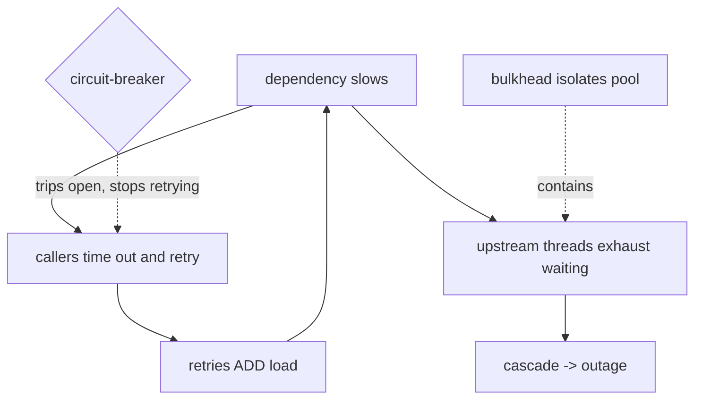

## Thesis

Bounding how long you wait and how you re-attempt when a dependency is slow or failing --- a timeout so one call can't hang forever, a retry with backoff and jitter so a transient failure recovers without stampeding, and a deadline propagated across the call chain so the whole request shares one time budget --- because unbounded waits and naive retries are exactly how one slow dependency becomes a system-wide outage.

## Sub

**Why bound waiting: unbounded waits cascade** -> **timeouts** -> **retries with backoff and jitter** -> **zoom out** to deadlines across a chain, retry storms, and the pivots an interviewer rides from "just retry it" into picking a timeout, retry-safety, and why retries can cause the outage.

## Spine

- A **timeout** turns an indefinite wait into a bounded failure --- without one, a hung dependency ties up the thread and connection until you exhaust the pool, and the caller hangs too, so the slowness propagates upstream instead of staying contained.
- A **retry** recovers from a *transient* failure --- but only for idempotent or retry-safe operations, and only with **backoff and jitter**, or every client retrying in lockstep stampedes the recovering dependency and turns a blip into an outage.
- A **deadline** bounds the *whole* request across the call chain --- propagated downstream so every hop knows how much time is left, because per-hop timeouts that ignore the total let a chain of "fast enough" calls quietly blow the caller's budget.
- The failure modes are **retry storms and cascading timeouts** --- retries amplify load precisely when a dependency is struggling, and a slow dependency exhausts upstream resources, so the mechanisms meant to add resilience will cause the outage if they're naive.

## Companion Notes

### walk

Bounding the wait and the re-attempt

One call to a slow dependency, made safe --- the timeout that bounds the wait, the retry with backoff and jitter that recovers a transient failure without stampeding, the deadline that bounds the whole chain, and the retry-storm/cascade failure mode the whole thing exists to avoid.

Say the cascade first --- "an unbounded wait on a slow dependency exhausts your threads and propagates upstream." Timeouts, retries, and deadlines are all about stopping one slow thing from taking down everything above it.

### drill

Probe Drill

Graded follow-ups on timeouts, backoff, jitter, deadlines, and retry storms --- the ones that separate "wrap it in a retry" from a call path that survives a struggling dependency.

Name the trap: retries amplify load exactly when a dependency is already failing, so naive retries turn a blip into an outage -- backoff, jitter, budgets, and circuit-breakers exist to stop that.

### wb

The blank whiteboard

Nine cues from the first bounded wait to the way out of a live retry storm. Draw each from memory before you reveal it --- the storm loop and the cascade are the two you must be able to sketch cold.

The one people fumble is the last: getting *out* of a storm is not waiting, and not adding capacity. It is removing load.

### sys

Where the bounds sit

The caller owns the budget, the call is bounded by three separate timeouts, the retry loop is bounded by a budget, and the guards --- breaker, bulkhead, shedding --- bound what the retries can do to the dependency.

Zoom out before you zoom in. The interviewer wants to hear that a timeout is one bound among several, not the whole answer.

### trade

The calls that separate levels

Seven decisions where a defensible answer names the alternative and its cost --- retry vs fail fast, per-hop vs propagated deadline, one retrying layer vs many, count budget vs rate budget.

Nobody is grading you on picking the "right" option. They are grading you on whether you know what the other option costs.

### model

Say it out loud

Nine model answers across the arc an interviewer actually walks: design it, pick the timeout, walk a storm, bound a chain, defend it, operate it, one you built, test it, name the limits.

The close matters. Naming your own risks --- unbudgeted retries, a static timeout under load --- reads as senior, not insecure.

### num

The back-of-envelope

Three numbers you can defend: the exponential amplification of retrying at every layer, the floor a timeout must sit above, and how many attempts a deadline can actually afford.

The killer figure is the last one. Most retry policies configure more attempts than the request's deadline can physically fit --- a policy that lies to you.

### rf

What makes an interviewer wince

Nine lines a shakier candidate genuinely says. Most trace back to one error: treating a retry as free, and a timeout as a detail the client library already handled.

The single most common one is silent: never setting a timeout at all, because the default looked fine. In most HTTP clients the default is no timeout.

### open

The altitude

Two cards --- the thirty-second open when they say "how do you make this call resilient," and the close that hands the wheel back.

Open with the cascade, not with the retry. The reason all of this exists is that an unbounded wait propagates upward, and the candidate who leads with that has already shown the systems instinct.

## Drill

all | **All four levels, mixed** --- the way a real loop actually comes at you.
SDE2 | **The model and the mechanics** --- what a timeout is, what a retry is, backoff, jitter, what is safe to retry. The bar is "this is a bounded call, not a hopeful one": name the failure each bound prevents, and know that a timeout is a claim about *this* dependency, not a global constant.
SDE3 | **Backoff, deadlines, and storms** --- full jitter, retry budgets, deadline propagation and cancellation, the different timeouts, the amplification spiral. The bar is "it depends, here's the switch": name the constraint each mechanism bounds, and know that a retry re-sends an operation whose fate is *ambiguous*.
Staff | **Cascades, budgets, and the stack** --- Little's Law occupancy, metastable failure, load shedding by value, and how timeout / retry / breaker / bulkhead compose. The bar is "retries are the mechanism most likely to be net-negative": name why reducing load is the recovery, not trying harder.

### SDE2 | what a timeout is

What is a timeout and why do you need one?

A limit on how long you'll wait for a response before giving up and treating the call as failed. You need it because without one, a hung or extremely slow dependency ties up the calling thread and its connection indefinitely --- and if enough calls hang, you exhaust the thread pool or connection pool, and now the *caller* is down too, not just the dependency. A timeout converts "wait forever" into "fail after N", keeping the slowness contained instead of letting it propagate up the stack.

Follow: You said the thread is tied up. On an async runtime --- Node, Go, Netty --- there is no blocked OS thread. Do I still need a timeout?
Yes, and the reasoning is the useful part. Async changes *which* resource is exhausted, not *whether* it is: you still hold the socket and its file descriptor, the connection-pool slot, the heap for the in-flight request state, and --- above all --- your own caller, who is still waiting on you. Ten thousand hung in-flight requests on an event loop will exhaust file descriptors and memory just as surely as a thread pool. It also changes the *shape* of the failure, and arguably for the worse: a thread pool fills up and stops accepting work loudly, while an event loop with unbounded in-flight work degrades silently --- the queue grows, latency climbs, and nothing announces that you are already dead. The unbounded wait is the bug; blocked threads were only its most visible symptom.
Follow: What is the default timeout in most HTTP clients, and why does that matter?
For a startling number of them it is *none*. Python's `requests` has no default timeout and will wait indefinitely unless you pass one. Go's zero-value `http.Client` has `Timeout: 0`, which means no timeout. Java's `HttpURLConnection` defaults both connect and read timeouts to `0`, which is documented as infinite. That is the trap: the most dangerous configuration in your system is the one nobody ever wrote down. Client defaults are chosen so that a legitimately slow call never fails spuriously --- correctness in the small --- not so that a hung dependency can't take you down --- resilience in the large. So "I set a timeout" is a real design statement, and the absence of one is never "the default is sensible"; it is "wait forever," chosen by default, by nobody.
Senior: Knowing that the resource exhausted is not always a *thread* --- and that the client-library default is usually **no timeout at all**, so an unbounded wait is the state you are in unless you explicitly left it --- is what separates someone who has debugged a cascade from someone who has read about one.
Speak: A timeout turns an indefinite wait into a bounded failure. Without one a hung dependency holds your thread, your connection, and your pool slot until you exhaust them --- and then *you* are down, not just the dependency. And say the trap out loud: in `requests`, in a zero-value Go client, in `HttpURLConnection`, the default is **no timeout**. The dangerous config is the one you never wrote.

### SDE2 | what a retry is

What is a retry and when should you use one?

Re-attempting a failed call, on the assumption the failure was *transient* --- a brief network blip, a momentary overload, a dropped packet --- that a second attempt will get past. You use it for failures that are plausibly temporary and for operations that are safe to repeat. You should *not* retry a failure that won't change on re-attempt (a 400 Bad Request, a 404, a validation error), because retrying a deterministic failure just wastes attempts and adds load without any chance of success.

Follow: The call timed out. You do not know whether the server processed it. Do you retry?
That ambiguity *is* the whole problem, and naming it is the answer. A timeout is not a failure --- it is an **unknown**. The request may have arrived, been processed, and been committed, with only the *response* lost on the way back. So "retry on timeout" actually means "re-send an operation that may already have taken effect," which is safe only if the operation is idempotent or carries an idempotency key. If it isn't, the honest options are to not retry and surface the ambiguity to someone who can resolve it, or to make the operation retry-safe first. The naive reading --- "it timed out, so it didn't happen" --- is the single most common source of duplicate writes in production.
Follow: So which failures *are* unambiguous enough to retry without idempotency?
The ones where you know the server never processed the request at all: a connection refused, a DNS failure, a TLS handshake failure --- the bytes never reached the application. Also an explicit rejection made *before* any side effect: a 429, or a 503 from a load balancer that shed the request without forwarding it. Those are genuinely safe to retry even for a non-idempotent operation, because the request provably had no effect. Everything else --- and especially a read timeout, which by definition happens *after* you sent the request --- is ambiguous. And even "connection refused" stops being airtight once there is a proxy in the path that may already have forwarded the body. Which is why the disciplined answer is not to build a taxonomy of which failures are safe: it is to make the write idempotent, so you never have to be right about that taxonomy.
Senior: Treating a timeout as an **unknown, not a failure** --- and refusing to reason your way to "which errors are safe to retry" when the robust move is to make the operation idempotent and stop needing to know --- is the distributed-systems literacy the question is actually testing.
Speak: A retry assumes the failure was transient. But be precise: a timeout doesn't mean it failed, it means you *don't know* --- the write may have landed and only the response was lost. So a retry re-sends an operation that may already have taken effect, which is safe only if it's idempotent. Retry transient failures, never deterministic ones, and never a naked non-idempotent write.

### SDE2 | what backoff is

What is backoff?

Waiting longer between successive retries instead of hammering immediately --- typically **exponential**: wait 100ms, then 200ms, then 400ms, doubling each attempt. The reason is that if a dependency is failing because it's overloaded, retrying instantly makes it worse; backing off gives it time to recover before the next attempt. Exponential backoff means a brief blip is retried quickly (short first wait) while a sustained problem gets exponentially more breathing room, which is the right shape for "probably transient, but maybe not."

Follow: Why exponential specifically --- why not just wait a fixed 500ms between attempts?
Because a constant delay does not *adapt*. Exponential backoff encodes a hypothesis: the longer this keeps failing, the less likely it is a brief blip, so wait proportionally longer before assuming otherwise. That buys you two properties at once --- a fast first retry, so a genuine one-off blip is recovered cheaply and invisibly, and an aggregate request rate against a *sustained* failure that decays geometrically. A fixed delay gives you neither: it hammers at a flat rate forever, so the load a struggling dependency sees never falls, which is precisely the load it cannot absorb. Exponential is the shape that is cheap when the problem is small and self-limiting when the problem is big.
Follow: Your first backoff is 100ms but the dependency's p99 is 800ms. Is 100ms a sensible first wait?
Probably not --- and this is where people pick a round number instead of a reason. The backoff should be sized to the failure you are actually recovering from. If the dependency is *saturated* rather than *down*, re-entering 100ms after a timeout means you arrive while it is still struggling, adding load in exactly the window it is trying to drain. For a fast transient --- a dropped packet, a reset connection --- a short first wait is right. For a timeout or a 503 from a loaded service, the first wait wants to be on the order of that service's recovery time, and the attempt count wants to be smaller. So you choose `base` from the *class* of failure you are retrying, not from habit. And the best case of all is when you do not have to guess: if the server sent a `Retry-After`, honor it --- it is the only party that knows.
Senior: Sizing `base` from the *failure class* --- short for connection-level blips, long and few for a saturated dependency --- and honoring `Retry-After` instead of guessing when the server has told you, is what separates a tuned backoff from a copy-pasted one.
Speak: Backoff means waiting longer between attempts --- exponentially, doubling each time. The point is that it *adapts*: fast first retry for a real blip, geometrically decaying load if the problem is sustained. A fixed delay keeps hammering at a flat rate forever. And size the base to the failure class --- and if the server sent `Retry-After`, honor it rather than guessing.

### SDE2 | what jitter is

What is jitter and why add it to backoff?

Randomness added to the backoff delay, so retries don't all fire at the same instant. Without it, many clients that failed together (say, during a shared dependency hiccup) back off by the *same* amount and retry in perfect lockstep --- a synchronized thundering herd that slams the recovering dependency at exactly the same moment, knocking it back down. Jitter spreads the retries across a window (e.g. a random delay between 0 and the backoff bound), de-synchronizing the clients so the load is smeared out instead of spiked. Backoff sets the spacing; jitter breaks the synchronization.

Follow: Where does the synchronization even come from? Clients don't coordinate --- why would they ever be in lockstep?
The *failure* synchronizes them. Clients never self-synchronize; a shared event does it for them. A dependency blips, or a deploy restarts it, or a load balancer drains a node --- and every in-flight call fails within the same few milliseconds. So every client starts its backoff clock at nearly the same instant, and a *deterministic* backoff function faithfully maps that same start time to the same retry time. The backoff didn't create the herd; it preserved one that the failure created, and then amplified it by making everyone's second attempt land together too. Round-numbered cache TTLs and cron-aligned traffic do exactly the same thing for the same reason. That is why jitter is not a tuning nicety: it is the only thing in the loop that actively *destroys* correlation, and correlation is the entire problem.
Follow: There are several jitter strategies --- full, equal, decorrelated. Which do you actually pick?
**Full jitter** is the right default: `sleep = random(0, min(cap, base * 2^attempt))`. AWS's well-known analysis of exactly this found that adding jitter dramatically cut both total work and contention versus plain exponential backoff, with full jitter performing best --- it simply gives the maximum spread. The objection to it is that a client can, by chance, draw a very short wait and come back almost immediately; **equal jitter** (`base/2 + random(0, base/2)`) trades some of that spread to guarantee a minimum spacing. **Decorrelated jitter** (`sleep = min(cap, random(base, prev * 3))`) keeps the growth while staying random and avoids a strict per-attempt ceiling. In practice: take full jitter unless you have a concrete reason to guarantee a minimum wait --- and understand that the choice between the three matters *far* less than whether jitter exists at all. Plain exponential with no jitter is the one that actually hurts you.
Senior: Explaining that the *failure itself* is the synchronizing event --- so a deterministic backoff preserves a herd rather than creating one --- and then naming full vs equal vs decorrelated jitter with a default and a reason, is a depth signal very few candidates reach.
Speak: Jitter is randomness in the delay, and it exists because the *failure* synchronizes the clients --- everyone fails in the same millisecond, so a deterministic backoff has everyone retry in the same millisecond too. Full jitter --- a uniform random wait between zero and the current backoff bound --- is the default; equal and decorrelated jitter trade spread for a minimum wait. What matters is that jitter exists at all.

### SDE2 | which operations are safe to retry

Which operations can you safely retry?

Idempotent ones --- where a repeat has the same effect as a single application (a GET, a PUT that sets a value, a DELETE, or a write protected by an idempotency key). Retrying a *non*-idempotent operation is dangerous: if the first attempt actually succeeded but the response was lost, the retry does the thing again --- a double charge, a duplicate record. So retry-safety and idempotency are linked: you can only freely retry an operation you've made safe to repeat, which is why "add retries" and "make it idempotent" usually go together.

Follow: HTTP says POST is not idempotent. So a POST can never be retried?
HTTP's method semantics tell you what a *generic intermediary* is allowed to assume, not what your handler actually does. "POST is not idempotent" means no proxy may replay it on your behalf --- it is not a law about your endpoint. You make a specific POST retry-safe with an **idempotency key**: the client mints a unique key for the logical operation, sends it on *every* attempt of that operation, and the server records the key together with the result of the first execution. A retry presents the same key, the server recognizes it, and returns the *original* response rather than executing again. That is exactly how Stripe's API makes charge creation safe to retry. So the correct statement is not "POST is unsafe"; it is "POST is unsafe *until you give it a key*" --- and the mechanism, not the HTTP verb, is the thing that makes the call retryable.
Follow: DELETE is idempotent --- deleting twice leaves the same state. So retrying a DELETE is always fine?
Idempotent in *effect*, yes, and that is what the word guarantees. But the **response** differs, and that is where it bites. The first DELETE returns 204; the retry finds nothing there and returns 404. The resource state is identical --- the system is perfectly correct --- but a caller that treats 404 as an error will now report a failure for an operation that *actually succeeded*. So the retry is safe for the system and misleading for the client. The fix is to treat "already gone" as success on a delete path, or return 204 for both. The generalization is the point worth saying out loud: idempotency guarantees the same final **state**, not the same **response** --- and if any downstream logic branches on the response, "it's idempotent" does not automatically mean "safe to retry blindly."
Senior: Knowing that an idempotency **key** is the mechanism that makes a POST retryable --- and that idempotency guarantees the same final *state*, not the same *response*, so an idempotent DELETE can still confuse a caller --- is the precision that reads as having actually shipped this.
Speak: Retry idempotent operations --- a GET, a PUT, a DELETE, or a write carrying an idempotency key. POST isn't idempotent by default, but that's a statement about what a proxy may assume, not a law: give it a key and it's retry-safe. And be precise --- idempotency promises the same final state, not the same response, so a retried DELETE returns 404 even though it worked.

### SDE2 | retry only transient failures

Why shouldn't you retry every failure?

Because a deterministic failure won't change on re-attempt, so retrying it is pure waste and added load. A 4xx client error (bad request, unauthorized, not found) means *your request* is wrong --- retrying sends the same wrong request and fails identically. Retries are for *transient* failures: timeouts, connection resets, 503s, throttling --- things a later attempt might get past. Distinguishing "retryable" (transient, server-side, throttling) from "non-retryable" (client errors, permanent failures) is essential, or you burn attempts and amplify load on failures that can never succeed.

Follow: A 429 is a 4xx. You just said don't retry 4xx. So don't retry a 429?
429 is the deliberate exception, and it is a good test of whether someone learned the *rule* or the *reason*. The rule was never "the status code starts with a 4." The rule is: *will re-sending this exact request plausibly succeed?* A 400 or a 422 will not --- the request is malformed, so the identical bytes fail identically. A 429 says something completely different: your request was perfectly fine, you are simply going too fast. That request *will* succeed later, which makes it one of the most retryable responses there is. And you retry it correctly by honoring the server's `Retry-After` header when it sends one, rather than guessing your own backoff --- the server knows when it will have capacity and you do not. 408 Request Timeout is a similar case. The classification is **semantic**, not numeric.
Follow: What about a 500 from a service that already committed the write and *then* blew up serializing the response?
That is the ugly case, and it is why "5xx is retryable" is a heuristic and not a guarantee. A 500 only tells you that something went wrong on the server's side --- it says *nothing* about whether the side effect landed. If the handler committed its transaction and then threw while building the response body, a retry re-executes a write that has already happened. So a 500 on a **write** is ambiguous in precisely the same way a timeout is, and it has precisely the same resolution: make the write idempotent, and then retrying an ambiguous 500 is harmless. Without idempotency, the honest move is to *not* retry the write and to surface it, or reconcile it later. This is why every serious retry conversation converges on the same place --- classification *narrows* the ambiguity, but only idempotency *removes* it.
Senior: Deriving 429 from the *reason* rather than the status class --- and admitting that a 5xx on a write is just as ambiguous as a timeout, so classification narrows ambiguity while only idempotency removes it --- is the reasoning an interviewer is fishing for here.
Speak: Retry transient failures, not deterministic ones --- but the rule isn't "don't retry 4xx," it's "will the same request plausibly succeed later?" A 400 won't; a **429 will**, so you retry it, honoring `Retry-After`. And be honest that a 500 on a write is as ambiguous as a timeout: classification narrows the ambiguity, only idempotency removes it.

### SDE2 | timeout too short vs too long

What goes wrong if a timeout is too short or too long?

**Too short**: you time out healthy-but-slightly-slow calls, failing requests that would have succeeded and triggering needless retries --- you manufacture failures. **Too long**: a genuinely hung dependency ties up your resources for ages before you give up, so slowness propagates and pools exhaust before the timeout ever fires --- the timeout isn't protecting you. The right value is set from the dependency's real latency distribution (comfortably above its p99, with margin), so normal calls pass and only genuinely-stuck ones trip it.

Follow: If you set it above p99, aren't you deliberately failing 1% of healthy calls?
Only if you set it *at* p99 --- and the word doing the work in "above p99 with margin" is **margin**. The p99 is a description of where the healthy distribution mostly ends, not a target to aim at. Set the timeout exactly at p99 and you kill 1% of good calls, which then become retries, which is 1% of extra load bought for nothing. So you place the line where the healthy distribution has genuinely run out --- often nearer p99.9, or some multiple over p99 --- not where it is still going. A good sanity check to state out loud: *what fraction of calls does this timeout kill in steady state?* If the answer isn't approximately zero, the timeout is too tight, and it is manufacturing the failures it is supposed to be catching.
Follow: The dependency's p99 gets worse under load --- exactly when you need the timeout most. Doesn't a static timeout break precisely then?
Yes, and that is the real critique of a statically-tuned timeout. Latency is load-dependent, so a value tuned on a quiet Tuesday is too tight during peak --- and it starts failing healthy-but-loaded calls and converting them into retries, which adds load at the worst possible moment. Three answers. First: tune from the *loaded* p99, not the idle one, so the value holds when it matters. Second, and better: prefer a **deadline** over a per-call timeout, because a deadline expresses what the *caller* can afford to wait, and that number doesn't move around with the dependency's mood. Third, at high scale, adaptive timeouts driven by the observed live distribution. The failure to avoid is a timeout tight enough to turn a latency problem into a retry storm --- which is the machine converting slowness into an outage all by itself.
Senior: Recognizing that a static timeout is *most wrong* exactly under load --- and that the deadline (what the caller can afford) is the more stable quantity than the dependency's latency (which moves) --- is the insight that turns "set it above p99" into a real position.
Speak: Too short and you manufacture failures on healthy-but-slow calls, and each becomes a retry. Too long and your pool is exhausted long before the timeout ever fires. Set it above the dependency's p99 *with margin* --- and say the sharp part: the p99 degrades under load, exactly when you need the timeout, which is why the caller's deadline is a more stable number than the dependency's latency.

### SDE3 | exponential backoff with jitter

Walk through exponential backoff with jitter.

Each retry waits an exponentially growing base delay --- `base * 2^attempt` (100ms, 200ms, 400ms...) --- capped at a maximum, and then jittered: instead of waiting exactly that, you wait a *random* amount within that bound (full jitter: a uniform random value between 0 and the current backoff). Exponential growth gives a struggling dependency increasing recovery time; the cap prevents absurd waits; the jitter de-synchronizes clients so they don't retry in a herd. "Exponential backoff with full jitter" is the canonical recipe, and the jitter is the part people forget --- backoff alone still lets everyone retry at the same moments.

Follow: Where do you put the cap, and what does capping actually cost you?
You set the cap relative to the **deadline**, not to a round number --- a backoff longer than the remaining budget is pure waste, because the retry it is waiting for will be abandoned before it fires. And there is a genuine cost, which people miss: *at* the cap, the backoff stops growing, so the retry rate stops decaying. Every client is now retrying at a fixed interval forever, and the aggregate load the failing dependency sees flattens out instead of continuing to shrink toward zero. That is the tension in one line: an uncapped backoff protects the dependency best and serves the user worst. Which is exactly why the cap is not the thing that saves you --- once you are at the cap you are back to a constant retry rate against a dead dependency, and the mechanism that is actually supposed to stop the load at that point is the **circuit breaker**, not an ever-growing sleep.
Follow: Attempt counts, base, cap, jitter --- should the *client* even be choosing these numbers?
Increasingly, no. A per-call-site retry policy is a *local* decision with a *global* consequence: every team independently choosing "three attempts, exponential, seems safe" produces an aggregate retry rate against the shared dependency that nobody designed and nobody owns. That is why mature systems push the policy down into a shared layer --- a common client library, a service-mesh sidecar, or the gateway --- where two things can be enforced that a single call site cannot enforce for itself: a **retry budget** expressed as a fraction of traffic (Envoy and Finagle both do this --- retries may not exceed some percentage of active or successful requests), and a **circuit breaker**. Together those bound the total amplification regardless of what each individual caller believes is reasonable. The senior framing: retry policy is a property of the *call graph*, not a knob on one call.
Senior: Knowing that the cap *stops the decay* --- so a capped backoff is a constant retry rate against a dead dependency, and the breaker is what must actually stop the load --- and arguing retry policy belongs in a shared layer with a budget rather than at each call site, is Staff-adjacent reasoning.
Speak: `sleep = random(0, min(cap, base * 2^attempt))` --- exponential for growth, cap for sanity, full jitter for de-synchronization. Then the two things people miss: the cap is where the *decay stops*, so beyond it you're just retrying at a constant rate into a dead dependency, and only a breaker stops that. And these numbers shouldn't be a per-call-site guess --- they belong in a shared layer with a retry budget.

### SDE3 | retry budget and giving up

How do you decide when to stop retrying?

With a bounded **retry budget** --- a max attempt count and/or a total time cap --- because retries can't be infinite: past a few attempts, a failure is probably not transient, and continuing just adds load and delays the inevitable failure. Some systems use a *retry budget as a rate* (retries may be at most X% of requests) so that when failures are widespread, retries are automatically throttled rather than doubling the load. The key judgment is that retries are for the occasional transient blip; when they stop helping, you fail fast and surface the error rather than retrying into an outage.

Follow: A count budget (3 attempts) versus a rate budget (retries at most 10% of requests). Why is the rate one the important one?
Because the count budget is *per request* and therefore blind to everything else happening in the system. "Three attempts" is completely harmless when 0.1% of calls are failing --- and the *identical policy* is a 3x load multiplier when 100% of calls are failing. Which is to say: a count budget scales the damage **with** the outage, and does its worst at exactly the moment the dependency can absorb the least. A rate budget --- "retries may be at most 10% of successful requests" --- is self-limiting by construction: when everything is failing there are almost no successes to draw budget from, so the retry rate collapses toward zero automatically, with no operator and no alert. That is the property you actually want. The retry mechanism should get *quieter* as the system gets sicker, and only a budget expressed relative to the *health* of the dependency has that shape.
Follow: The budget is exhausted. What do you actually return to your caller?
An honest failure, and --- the part that matters --- a **fast** one. You surface a "dependency unavailable" immediately rather than continuing to hold the request open. The discipline is that whatever you do must not consume your caller's remaining deadline: a caller who granted you 2 seconds should get their error back at 800ms, not at 1.99 seconds, because they need budget left to do something intelligent with it. And that raises the question worth asking out loud --- is an error even the right answer? Often a **degraded** response beats a failure: serve the stale cached value, omit the optional section, render the page without the recommendations, or accept the write into a queue and process it asynchronously. "The dependency is down" does not have to mean "the request fails." The seniority tell is treating budget exhaustion as a *decision point about what to serve*, not merely as the moment you throw.
Senior: Arguing for a **rate-based** budget because it self-limits precisely when everything is failing (where a count budget multiplies the damage) --- and then treating exhaustion as a decision about what to *serve*, preserving the caller's remaining deadline --- is the systems judgment this card is graded on.
Speak: Bound the retries --- but the sharp version is that a *count* budget ("3 attempts") multiplies the damage exactly when everything is failing, while a *rate* budget ("retries at most 10% of successful requests") self-limits automatically, because there are no successes left to draw from. And when the budget is spent, fail *fast* --- leave the caller enough deadline to degrade gracefully instead of burning it all.

### SDE3 | deadline propagation

What is deadline propagation and why does it matter?

Passing the *remaining* time budget down the call chain, so each service knows how long it has left rather than applying an independent timeout. If a request has a 2-second deadline and the first hop takes 1.5s, the next hop should be told it has 0.5s left --- not start its own fresh 2s timeout. Without propagation, a chain of individually-reasonable timeouts can far exceed the caller's budget (the caller already gave up, but downstream work keeps running, wasting resources). Propagating a deadline (a timestamp or remaining-duration passed in the request/context) gives the whole distributed call one shared clock, so everyone stops when the budget is spent.

Follow: Does the deadline travel as an absolute timestamp or as a remaining duration? Does it matter?
It matters, and the difference is **clocks**. An absolute deadline timestamp is beautifully composable --- every hop just compares it to `now` --- but it requires that clocks across services agree, so it inherits clock skew as a correctness dependency. A remaining *duration* does not: the caller computes "you have 470ms left" from its own clock alone and sends that number, and each hop subtracts its own elapsed time before calling the next. That is why gRPC propagates a `grpc-timeout` **duration** header on each hop rather than a wall-clock deadline --- it deliberately avoids depending on cross-machine clock agreement. The pragmatic answer is: propagate a duration *on the wire*, and convert it to an absolute deadline *inside* a process, where there is only one clock and the composition is free.
Follow: The caller has timed out at 2 seconds. What is the downstream service supposed to *do* about it --- it's mid-query.
**Cancel** --- and this is the half everybody skips. A propagated deadline is nearly worthless if nothing *acts* on it, because the entire value proposition is that downstream stops burning capacity on work whose result no one will ever read. So the deadline has to be wired into a real cancellation primitive: a Go `context.Context` that gets cancelled and is actually checked, a gRPC call that returns `DEADLINE_EXCEEDED` and cancels the RPC, a database driver that issues a query cancellation or sets `statement_timeout`. Without that, here is the failure: the caller gives up at 2s, and the 5-second query keeps running --- still holding its connection, still holding its buffers, still consuming the database it is saturating --- computing an answer for an audience that has left. That is how a latency spike becomes self-sustaining: the system is 100% busy producing results nobody will read. Propagating the deadline is half of it; **honoring** it by cancelling is the other half, and it is the half that actually returns capacity.
Senior: Splitting the mechanism from the effect --- propagate a *duration* to avoid a clock-skew dependency, and then insist the deadline is only worth anything if it is wired to a real **cancellation** (context, `DEADLINE_EXCEEDED`, `statement_timeout`) that returns the capacity --- is the depth that lands.
Speak: Propagate the *remaining* budget to each hop, not a fresh timeout --- one clock for the whole distributed call. Send it as a duration (gRPC's `grpc-timeout`), so you don't take a dependency on clock skew. And say the half people forget: a deadline nobody *acts* on is decoration. It has to be wired to real cancellation --- context cancel, `DEADLINE_EXCEEDED`, `statement_timeout` --- or downstream keeps burning capacity computing an answer nobody is waiting for.

### SDE3 | the different timeouts

What are the different kinds of timeout on a single call?

At least three: **connection timeout** (how long to wait to *establish* the connection), **read/socket timeout** (how long to wait for data once connected / between bytes), and an overall **request timeout** (total time for the whole call, cap on everything). They protect different failures --- a connect timeout catches an unreachable host fast, a read timeout catches a server that accepted the connection but stalled mid-response, and a total timeout bounds the end-to-end. Setting only one leaves gaps (a short connect but unbounded read can still hang forever on a stalled response), so robust clients set all of them.

Follow: You set a connect timeout and a read timeout. Where is the gap that still lets a call hang effectively forever?
In a response that **trickles**. A read/socket timeout is almost always an *inactivity* timeout: it fires when no bytes have arrived for N seconds --- not when the response has taken too long overall. So a server that dribbles out one byte every N-1 seconds resets that clock forever, and the call never times out, even after an hour. (This is exactly the shape of a Slowloris-style stall, seen from the client side.) The only thing that closes it is a **total/request timeout** that bounds wall-clock time for the whole call regardless of activity. And there is a second gap on the same theme: waiting to *acquire a connection from the pool* when every pooled connection is already in use is a wait that neither the connect nor the read timeout covers --- so a **pool-acquisition timeout** is the fourth one people forget, and under a cascade it is often the one actually holding your requests. The rule is: every wait must be bounded, and each timeout bounds only the wait it names.
Follow: What about DNS and the TLS handshake --- are those covered?
Frequently not, and this is a classic outage. DNS resolution typically happens *before* your "connect" timeout starts counting and is governed by the **resolver's** own timeout and retry behavior --- which is often long (seconds, multiplied by retries, multiplied by search-domain attempts) and lives entirely outside your HTTP client's configuration. So a slow or dead DNS server can stall a call far past the carefully-chosen connect timeout you set, and it will look like an inexplicable hang. TLS handshake time may or may not be counted inside the connect timeout depending on the client library. The practical answer is the same one as before: bound the **total** time for the call, because that is the one timeout that covers every stage --- including the stages you forgot existed. And treat DNS as a real dependency: cache it, monitor its latency, and accept that your resolver's defaults are part of your latency budget whether you chose them or not.
Senior: Knowing the read timeout is an *inactivity* timeout (so a trickling response never trips it), that pool acquisition is an unbounded wait nobody names, and that DNS sits *outside* the connect timeout --- and concluding that only a **total** timeout closes all of it --- is battle-scar knowledge.
Speak: Three at minimum --- connect, read, total --- and the read one is an *inactivity* timeout, which is the gap: a response that trickles one byte at a time resets it forever, so only a **total** timeout actually bounds the call. Then name the two nobody sets: waiting for a connection from the pool, and DNS, which resolves before your connect timeout even starts counting.

### SDE3 | retry storms

What is a retry storm and how does it form?

An amplification spiral: a dependency slows down, callers time out and retry, the retries *add* load to the already-struggling dependency, which slows further, causing more timeouts and more retries --- a positive feedback loop that drives a temporary degradation into a full outage. It's worst in layered systems where each layer retries, so the amplification multiplies down the stack. The defenses are backoff and jitter (space and de-sync the retries), retry budgets (cap the amplification), and circuit-breakers (stop retrying a dependency that's clearly down). The core insight is that retries add the most load exactly when the system can least handle it.

Follow: Walk me through the actual feedback loop. Why doesn't it just settle?
Because the loop has **gain greater than one**. Trace it. Steady state: the dependency serves offered load L at capacity C. It degrades to C' below L. Now some fraction of requests exceed the timeout, and every one of them becomes R additional requests --- so the offered load rises to roughly `L + (failed_fraction * L * R)`, at the exact moment the service can serve *less*. Higher offered load means deeper queues, deeper queues mean higher latency, higher latency means a *larger* fraction of requests blow the timeout, which means *more* retries. Each pass through the loop amplifies its own input, so it does not damp --- it runs away, and the system latches into a state where it is spending its entire capacity serving requests that are already guaranteed to time out before the answer is delivered. That is why the storm outlives its trigger: the retries have *become* the load.
Follow: The original trigger is gone and the system is still down. What actually gets it back?
You have to **remove load**. Nothing else works, and that is the whole lesson. The system is in a *metastable failure state* --- it is saturated by retry traffic it is now generating itself, so it cannot drain even though the original cause has been fixed. In rough order: trip the circuit breakers or turn retries off outright, so the amplification stops; shed aggressively at the edge so the queues can actually drain; **drop the doomed work** --- anything already past its deadline is guaranteed-worthless, so serving it burns capacity for exactly zero value, and dropping it is free capacity; and if none of that is available, the crude version is to take traffic to zero and ramp it back in slowly, because a cold start with controlled admission escapes the loop where a hot restart simply re-enters it. The line to say out loud: once a system is metastable, **adding capacity or waiting does not fix it --- only reducing offered load does**, and that is deeply counter-intuitive to everyone in the room.
Senior: Describing it as a **loop with gain above one** --- and naming the **metastable failure state**, where the retries have become the load, so the system stays down after its trigger is fixed and only *removing* load (not capacity, not patience) recovers it --- is the answer that marks a real operator.
Speak: A dependency slows, callers time out and retry, the retries *add* load, it slows more --- a feedback loop with gain above one, so it runs away instead of settling. And the part that wins the question: it's **metastable**. Fix the original cause and it stays down, because the retries are now the load. You don't recover by adding capacity or waiting. You recover by *removing* load --- breakers open, shed at the edge, and drop the work that's already past its deadline.

### SDE3 | retries and idempotency

Why are retries and idempotency two sides of the same coin?

Because a retry re-sends a request whose fate is ambiguous --- the original may have succeeded with a lost response --- so retrying is only safe if a second application is harmless, which *is* idempotency. If you retry a non-idempotent write, you risk a double effect; so to retry writes safely you make them idempotent (an idempotency key, an upsert on a natural key, a conditional update). This is why the two topics are always paired: timeouts and retries give you resilience against slow/failing dependencies, and idempotency is what makes the retries safe rather than a source of duplicate side effects.

Follow: Concretely, where is the key checked --- and what stops two concurrent retries from both getting through?
The key must be claimed with an **atomic conditional write**, never a read-then-write. Read-check-then-act is a textbook race: two concurrent attempts both read "not seen," both conclude they are first, and both apply the operation. So you make claiming the key itself atomic --- a unique constraint or `INSERT ... ON CONFLICT DO NOTHING`, a Redis `SET NX`, a DynamoDB conditional write --- and *only the attempt that wins the write* performs the operation. The loser does not retry; it waits for, or reads back, the original result. The other half is what you store alongside the key: you record the **outcome**, not just the fact of the key, so a retry can return the *original response* rather than a bare "already done." That is what makes the retry genuinely transparent to the caller, which was the entire point.
Follow: The process crashes after claiming the key but before doing the work. Now the key says "done" and the work never happened. What then?
That is the fundamental gap, and the senior move is to name it rather than pretend the key dissolved it. Claim-then-act risks a **lost** operation (key present, work never performed); act-then-record risks a **duplicate** (work performed, key never recorded, retry redoes it). No ordering of two non-transactional steps is atomic across a crash --- you are choosing which failure you prefer, not eliminating failure. So you close it structurally. First: if the work and the key live in the **same database**, put them in one transaction and the problem simply vanishes --- which is exactly why an idempotency key colocated with the write is far stronger than one parked in a separate cache. Second: if they genuinely cannot be colocated, record the key in a **PENDING** state with a lease, do the work, then mark it COMPLETE --- so a retry that finds a *stale* PENDING key (lease expired) can correctly decide to redo the work rather than assume it was done. Third: make the operation reconcilable, so a sweeper can detect and repair the residue. The answer that scores is the one that says the gap out loud.
Senior: Insisting the key is claimed by an **atomic conditional write** (not read-then-write) and storing the *outcome* with it --- then naming the crash-between-claim-and-act gap honestly and closing it with a same-transaction key, or a leased PENDING state --- is what separates having built this from having read about it.
Speak: A retry re-sends an operation whose fate is *ambiguous*, so it's only safe if a repeat is harmless --- that's idempotency. Mechanically: claim the key with an **atomic conditional write**, not a read-then-write, or two concurrent retries both get through. Store the *outcome* with the key so the retry returns the original response. And name the gap --- a crash between claiming and acting loses the work, which is why the key belongs in the same transaction as the write.

### SDE3 | tuning timeout values

How do you choose the actual timeout value for a dependency?

From its latency distribution, per-dependency --- set the timeout comfortably above the dependency's p99 (or p99.9) with margin, so healthy-but-slightly-slow calls pass and only genuinely-stuck ones trip. A single global timeout is wrong because dependencies have very different latency profiles: a cache is sub-millisecond, a heavy report query is seconds, so one shared value is either too tight for the slow ones (manufacturing failures) or too loose for the fast ones (letting them hang). You measure each dependency's real latency and set the timeout from that, revisiting it as the profile shifts --- a timeout is a claim about "how slow is abnormal for *this* dependency," which is inherently dependency-specific, not a global constant.

Follow: Whose p99 --- the latency the dependency reports, or the latency you observe?
The one **you** observe, measured at your client, and the distinction matters more than it sounds. Your call's latency includes everything you actually wait on: DNS, connection acquisition from the pool, TLS, the network, and --- critically --- the time your request spent **queued at the dependency's front door** before its handler ever touched it. A service that proudly reports "p99 = 20ms" is almost always reporting its own *handler* time, which excludes exactly that queueing. And under load, the queue *is* the latency. So tuning against the server's self-reported number is how you end up with a timeout that looks generous on the dashboard and fires constantly in production. Measure client-side, from the moment you decide to make the call to the moment you hold a usable response.
Follow: Should the timeout be the same for that call in a user's request path and in a nightly batch job?
No --- and this is the reframe. A timeout is a property of the **caller's budget**, not only of the dependency's speed. The identical downstream call has completely different economics in the two paths: in a synchronous user request a human is waiting, so anything past a few hundred milliseconds is worthless and you would much rather fail fast and degrade; in a batch job nothing is waiting, a 30-second wait is fine, and a retry is nearly free. So there is no such thing as "the timeout for service X" --- there is a timeout per **call site**. The dependency's latency distribution gives you the **floor** (below this you are just manufacturing failures); the caller's deadline gives you the **ceiling** (above this the answer arrives after anyone cares). The right value lives between them --- and if the floor is *above* the ceiling, that is not a tuning problem, it is a design problem: that call does not belong in that path, and it needs to be made async, cached, or precomputed.
Senior: Measuring the **client-observed** latency (which includes the dependency's inbound queue, where its self-reported handler p99 does not) --- and framing the timeout as bounded *below* by the dependency and *above* by the caller's deadline, so "floor above ceiling" is a design smell, not a tuning one --- is the sharpest available answer.
Speak: Per dependency, from its *real* latency, above p99 with margin --- and measured **client-side**, because the server's self-reported p99 excludes the time your request sat in its inbound queue, which under load *is* the latency. Then the reframe: it's per **call site**, not per dependency. The dependency's latency is the floor, the caller's deadline is the ceiling, and if the floor is above the ceiling that call doesn't belong in that path.

### Staff | cascading failures

How does a single slow dependency cause a system-wide outage?

Through resource exhaustion propagating upward. A downstream dependency slows; upstream callers, waiting on it (especially without tight timeouts), hold their threads and connections occupied; as more requests pile up waiting, the upstream service's pools fill, so it can no longer serve *any* request --- including ones that don't even touch the slow dependency. The failure has cascaded: the slowness of one component became the unavailability of everything above it. The defenses are tight timeouts (release resources fast), bulkheads (isolate the resource pool per dependency so one can't consume all threads), and circuit-breakers (stop calling the slow dependency entirely). Cascading failure is *the* reason unbounded waits are dangerous at scale.

Follow: You tightened the timeouts and the cascade *still* happens. Why?
Because a timeout bounds how long **one** call waits --- it does nothing about how many calls **arrive**. That is the whole misconception. If the dependency is slow, requests keep arriving at the same rate, and each one now occupies a slot for the full timeout duration. By Little's Law, concurrent occupancy is `arrival_rate * time_in_system`: at 1,000 rps with a 2-second timeout, that is **2,000 concurrent in-flight calls**. If your pool holds 200, you are saturated no matter how correct your timeout is --- you have merely chosen how long each doomed request occupies its slot. The timeout sets the *latency* of failing; it does not set the *rate*. To bound occupancy you need something that bounds concurrency (a bulkhead / concurrency limiter), or something that stops you calling at all (a breaker), or something that reduces arrivals (shedding). This is precisely why the resilience stack is a *stack*: tightening the timeout alone just makes you fail faster while still failing.
Follow: A bulkhead isolates the pool --- but my service has one thread pool serving all HTTP. How do I bulkhead *that*?
You partition the **resource**, not the process. The cheap, in-process version: give each downstream dependency its own bounded concurrency limit --- a semaphore capping in-flight calls to *that* dependency at, say, 20 --- so a hung dependency can occupy at most 20 slots and the 21st call is rejected instantly rather than queueing. That is exactly what Hystrix's semaphore isolation did and what every modern concurrency limiter does, and it costs you almost nothing. The stronger form is a separate thread pool per dependency: full isolation, at the price of context switches and complexity. And you can partition on a different axis entirely --- by **workload** rather than by dependency, with separate pools or even separate instances for the critical path versus everything else --- so a flood of low-value traffic cannot starve the requests that actually matter. The principle underneath all three: an unbounded, *shared* resource is a single point of failure, so you bound each consumer's share of it.
Senior: Invoking **Little's Law** --- occupancy equals arrival rate times timeout, so tightening the timeout changes how fast you fail but not how many slots are consumed --- and then reaching for a per-dependency **concurrency limit** rather than more timeout tuning, is the answer that shows you have actually stopped one of these.
Speak: A slow dependency exhausts the *caller's* pool, so the caller stops serving even the requests that never touch it --- that's the cascade. And the sharp bit: tightening the timeout doesn't fix it. Little's Law --- occupancy is arrival rate times timeout --- so 1,000 rps against a 2-second timeout is 2,000 in-flight calls no matter how correct that timeout is. To bound *occupancy* you need a concurrency limit, a breaker, or shedding.

### Staff | retry amplification at scale

Why is retrying especially dangerous in a deep call chain?

Because the amplification is multiplicative. If each of N layers retries a failed call 3 times, a single top-level request can generate 3^N calls to the bottom layer in the worst case --- three layers is 27x, and it hits the deepest, most-likely-overloaded dependency hardest. So retries at *every* layer compound into a massive load spike on the struggling component. The mitigation is to retry at *fewer* layers (ideally only where you have the context to know it's worth it, often near the edge or at a single designated layer), to enforce retry budgets that cap the total, and to propagate deadlines so downstream stops when the top-level caller has already given up. Retrying everywhere feels safe locally but is catastrophic globally.

Follow: You said three retries per layer gives 3^N. Is it 3^N or 4^N --- and does the difference matter?
It matters, and being loose here is a tell. Be precise: if each layer makes **A total attempts** (one initial call plus A-1 retries), the worst-case load at the leaf is `A^N` for N layers. So "three *attempts* per layer" across three layers is 3^3 = **27x**, while "three *retries* per layer" means four attempts, and that is 4^3 = **64x**. The *shape* is the point --- it is exponential in **depth**, which is the thing to say out loud --- but you should state which quantity you mean, because the gap between 27x and 64x is the gap between a bad afternoon and a dead dependency. And one honest caveat: that worst case is only realized when *everything* is failing. At a low failure rate the *expected* amplification is close to 1, which is precisely why the policy feels perfectly safe in testing and load tests, and is lethal in the outage.
Follow: So who is allowed to retry? Give me the actual rule.
Retry at **one** layer --- the layer that has the context to know a retry is worth it --- and make every other layer fail fast and propagate. In practice that means the edge, gateway, or outermost service owns the retry policy for a user request, and internal service-to-service calls **do not retry**: they surface the error immediately. The reasoning is not aesthetic. Only the outer layer knows the request's *remaining deadline* and its *business value*; an inner layer retrying is optimizing locally with no view of the total cost it is imposing, and its three attempts get multiplied by everyone else's. If you genuinely cannot collapse to one layer, then the layers that *do* retry must share a **budget**, so the total amplification is bounded regardless of depth --- which is exactly what a mesh-level retry budget buys you. The anti-pattern is every team independently adding "just a couple of retries, to be safe": each is locally reasonable, and the product of all of them is catastrophic.
Senior: Pinning the arithmetic precisely (`A^N` in *attempts*, so 27x vs 64x) while noting the worst case only lands during an outage --- and then giving a hard rule: **one retrying layer**, chosen for context, everyone else fails fast --- is the level of exactness a Staff round is measuring.
Speak: Amplification is exponential in *depth*: A attempts per layer across N layers is `A^N` at the leaf --- three attempts, three layers, 27x, and it lands hardest on the deepest, sickest dependency. And it only shows up when everything is failing, which is why it passes every load test. The rule: retry at **one** layer, the one that knows the remaining deadline and the business value. Everyone else fails fast.

### Staff | deadlines as a budget

How should deadlines work across a whole request?

As a single shared budget, set at the entry point and propagated to every hop, so the entire distributed call has one clock. The edge assigns "this request must complete in 2s"; each downstream call is given the *remaining* budget, and any work that can't finish in time is abandoned rather than run to completion nobody's waiting for. This does two things: it bounds tail latency end-to-end (the user never waits longer than the budget), and it *stops wasted work* --- once the caller has timed out, continuing downstream just burns capacity. Deadlines also compose with retries: a retry has to fit within the remaining budget, so you don't retry into a deadline you've already blown. The budget, not per-hop timeouts, is the correct mental model for latency in a distributed system.

Follow: You have a 2-second budget and three downstream calls to make. How do you divide it?
Not evenly, and not by dividing the total up front. **Sequential** calls consume the budget in order, so each is simply handed the *remaining* budget rather than a fixed slice --- if call one finishes in 100ms, call two gets 1.9 seconds, not 660ms. **Parallel** calls share the same wall clock, so each can be handed nearly the full remaining budget at once. But the real decision is that not every call deserves the same share: a **critical** call (the one whose failure means the request has failed) gets whatever it needs, while an **optional enrichment** call --- recommendations, a badge count, a "customers also bought" strip --- gets a deliberately tight, few-hundred-millisecond timeout, because you would far rather render the page without it than spend the user's budget on a nice-to-have. That is the real skill the budget forces on you: it makes you *decide, explicitly, which downstream calls are load-bearing*, and aggressively bound the ones that are not.
Follow: What happens if the deadline is *already expired* when the request arrives at a downstream service?
It must not do the work at all --- fail immediately, and do not touch the database. This is the single highest-leverage line in the whole deadline story. Work whose result is already guaranteed to be discarded is pure waste, and during an overload event it is an *enormous amount* of waste, because overload is precisely when queues are deep and requests arrive stale. A service that checks the deadline at **admission** and drops already-expired work converts a queue of doomed requests into free capacity --- and that is very often the thing that lets it climb out of a meltdown under its own power. The same logic applies inside queues and worker pools: before processing a queued item, ask whether anyone still cares about the answer. Once deadlines are propagated, "is this still worth doing?" evaluated at admission is a load-shedding mechanism you get **for free**, and it is the one most systems leave on the table.
Senior: Allocating the budget by *criticality* (tight bounds on optional enrichment calls, so the budget forces you to name what is load-bearing) --- and treating an **expired deadline at admission** as free load-shedding that recovers capacity during a meltdown --- is the Staff-level use of deadlines.
Speak: One budget, set at the edge, propagated as *remaining* time to every hop --- so the whole distributed call runs on one clock and a retry has to fit what's left. Two Staff moves on top: allocate by criticality, so an optional enrichment call gets a deliberately tight bound while the load-bearing one gets what it needs; and **drop already-expired work at admission** --- it's guaranteed-worthless, so dropping it is free capacity exactly when you're melting down.

### Staff | load shedding and failing fast

When should a system stop retrying and instead fail fast or shed load?

When the dependency is overloaded rather than blipping --- there, retries and patient waiting make it *worse*, so the correct behavior is to fail fast (return an error immediately) and shed load (reject some requests outright) to let the dependency recover. A circuit-breaker automates the "fail fast" decision (trip open after a failure threshold, stop calling, periodically probe). Load shedding automates the "reject some" decision (drop low-priority or excess requests to keep the system within capacity). The senior judgment is recognizing that under sustained overload, *reducing* load is the recovery mechanism --- retrying and queueing are the opposite of what helps --- so resilience sometimes means deliberately failing requests fast rather than trying harder to serve them.

Follow: You have to drop requests. *Which* ones?
Never at random --- shed by **value** and by **cost**, and be able to say which. The usual axes: (1) **criticality** --- requests carry a priority, so a checkout beats a recommendation carousel and a paying customer's write beats a bulk export, and you shed the lowest tier first (which means criticality has to be a *propagated request attribute*, decided at the edge, not something each service re-guesses from scratch); (2) **cost** --- shed the expensive requests that buy back the most capacity per unit of unhappiness; (3) **doomed work** --- anything already past its deadline, which is free to drop because nobody is waiting; (4) **retries before first attempts** --- a first attempt is a user, a retry is a duplicate, so under pressure you protect originals. The failure mode to name and reject is *uniform random shedding*: it degrades every user's experience a little instead of protecting the most valuable traffic completely, and it leaves you unable to say who you chose to protect.
Follow: How does the system even *know* it is overloaded? What's the signal?
Not CPU. The reliable signal is **queue delay** --- how long a request waits before a worker picks it up --- because that is what actually goes non-linear at saturation, and it is a direct measurement of "am I falling behind?" rather than a proxy for it. This is the core of CoDel-style adaptive shedding as used at Facebook: if the queue's *minimum* sojourn time over a window stays above a threshold, you are genuinely overloaded (as opposed to briefly bursty) and you start dropping. CPU is a bad trigger in both directions: a service can be completely latency-dead at 60% CPU because it is blocked on a slow dependency, and perfectly healthy at 90% because it is efficiently saturated. The other good signal is an **adaptive concurrency limit** inferred from observed throughput and latency --- effectively hunting for the Little's Law knee and refusing to go past it, which is what TCP-congestion-control-style limiters (Netflix's, for instance) do. The Staff point: overload is a property of **queueing**, so measure the queue, not the machine.
Senior: Shedding by **propagated criticality** rather than uniformly --- and knowing the overload signal is **queue delay**, not CPU, because a service can be latency-dead at 60% CPU and healthy at 90% --- is the operational judgment that separates a Staff answer here.
Speak: Under sustained overload, retrying is the *opposite* of what helps --- reducing load is the recovery. So fail fast (a breaker) and shed (reject). Then the two Staff details: shed by **value**, not at random --- criticality propagated from the edge, doomed work first, retries before first attempts. And detect overload from **queue delay**, not CPU: you can be latency-dead at 60% CPU and fine at 90%.

### Staff | the resilience stack

How do timeouts, retries, circuit-breakers, and bulkheads fit together?

As complementary layers. **Timeouts** bound each wait so resources are released. **Retries (with backoff and jitter)** recover transient failures. **Circuit-breakers** stop retrying a dependency that's clearly down, preventing retry storms and giving it room to recover. **Bulkheads** isolate resource pools per dependency so one slow dependency can't consume all the threads and starve the rest. Together they form a defense against cascading failure: timeout fast, retry a little, break the circuit when it's hopeless, and isolate so the blast radius is contained. No single one suffices --- retries without circuit-breakers cause storms, timeouts without bulkheads still let one dependency hog the pool --- so senior designs layer them.

Follow: Give me the *order* they engage in, on one failing call.
Outermost guard inward, on a single call. **(1) The bulkhead / concurrency limit** decides whether you are even permitted to make the call: if this dependency already has its maximum in flight, you are rejected right here, without touching the network. **(2) The circuit breaker** decides whether it is *worth* calling: if it is open, you fail immediately. **(3) The timeout / deadline** bounds the call you do make. **(4) The retry** --- with backoff, jitter, and a budget --- reacts to the failure, and critically, *each retry goes back through the breaker and the bulkhead*, which is what stops retries from quietly bypassing the very protections that exist to contain them. **(5) The fallback** decides what to serve once you have given up: cache, default, degraded response, or an honest error. Saying it in that order demonstrates you know these are not five parallel "best practices" but a pipeline in which each layer bounds a *different quantity*: the bulkhead bounds **concurrency**, the breaker bounds **futility**, the timeout bounds **duration**, the budget bounds **amplification**, and the fallback bounds **user impact**.
Follow: If you could only keep *two*, which two?
**Timeouts and a circuit breaker** --- and the interesting part is what I would give up. The timeout is non-negotiable: without it every other mechanism is moot, because an unbounded wait exhausts you regardless of what else you built, and its absence is the one that *guarantees* a cascade. The breaker is second because it is the only mechanism that stops the load **entirely**, and load is what actually kills you --- with a timeout and a breaker you fail fast *and* you stop hammering a dying dependency, which defuses the cascade and the storm together. Now notice what I dropped: **retries**. A system with correct timeouts and a breaker but *no retries at all* is merely a little less available on transient blips --- a real but modest cost. A system with retries and *no breaker* is a system that takes down its own dependency. Retries are the mechanism most likely to be **net-negative** when everything else is wrong, which is the exact opposite of most people's intuition, and it is the whole thesis of this topic.
Senior: Ordering the stack as a *pipeline* where each layer bounds a different quantity (concurrency, futility, duration, amplification, impact) --- and then arguing that **retries are the first thing you drop**, because they are the one mechanism that can be net-negative, is the framing that lands a Staff signal.
Speak: They're a pipeline, not a checklist, and each bounds a different quantity: bulkhead bounds concurrency, breaker bounds futility, timeout bounds duration, budget bounds amplification, fallback bounds user impact --- and a retry re-enters the breaker and bulkhead, so it can't bypass them. And the line that lands: if I could keep only two, it's **timeout and breaker** --- I'd drop retries, because retries are the one mechanism that's net-negative when everything else is wrong.

### Staff | retry-on-write safety

How do you safely retry a write operation?

Make the write idempotent first, then retry within a budget. Attach an idempotency key (or use a natural-key upsert / conditional update) so that if the first attempt succeeded but the response was lost, the retry is deduplicated to a no-op returning the original result rather than applying the write twice. Only then is retrying a write safe. Additionally, be careful that the retry fits the remaining deadline and that you don't retry on ambiguous *success-ish* responses without the idempotency guarantee. The rule: never retry a non-idempotent write blindly --- either make it idempotent and retry, or don't retry it and surface the failure for the caller to handle explicitly.

Follow: Who generates the idempotency key --- the client or the server?
The **client**, and it must be minted **once per logical operation** and then reused on every attempt of that operation. That is the entire mechanism: the key is the only thing that tells the server "these two requests are the same *intent*, not two different intents." If the server generates it, it is necessarily different per request and deduplicates precisely nothing. If the client regenerates it on retry, same failure. So the key is created at the moment the user takes the action --- typically a UUID minted the instant the checkout button is pressed --- and it stays pinned to every retry of that operation, which may mean persisting it client-side so it survives a page reload or an app restart. And here is the subtle trap worth calling out: deriving the key from the request **content** is dangerous for operations that are *legitimately repeatable*. Two identical $5 coffee purchases a minute apart are two real charges, and a content hash would silently swallow the second one. A unique key per **intent**, supplied by the caller --- not a hash of the payload.
Follow: The retry arrives while the original is still **in flight**. What does the server return?
It must not execute, and it must not lie. Because the key claim was an atomic conditional write, the retry *loses* that race and finds the key in a **PENDING** state --- which tells it the original is still running. There are three honest responses. **Block briefly** and return the original's result once it lands (nicest for the caller, costs you a held connection and a bounded wait). Return **409 Conflict** --- "a request with this idempotency key is in progress, retry shortly" --- so the caller backs off and re-asks; this is what Stripe does for a concurrent request on the same key. Or return **202** with a way to poll for the outcome. What you must *never* do is return a success the operation has not actually achieved, or fall through and execute anyway --- which is the bug that turns an idempotency key into pure decoration while everyone believes they are protected. And note that all three options are only *available* because the key was claimed atomically; a read-then-write check cannot even detect this state.
Senior: Knowing the key is **client-generated, per-intent, persisted across attempts** --- and never a content hash, because two identical legitimate purchases are two real charges --- plus handling the **in-flight retry** honestly (block, 409, or 202; never a success you haven't achieved) is production-grade detail.
Speak: Make it idempotent, *then* retry within a budget. The key is **client-generated, once per intent**, and reused on every attempt --- never server-generated (deduplicates nothing) and never a content hash (two identical $5 coffees are two real charges). And handle the in-flight retry honestly: it finds the key PENDING, so you block for the result, or return a 409 telling it to retry shortly --- never a success you haven't achieved.

### Staff | when not to retry

When should you *not* retry at all?

On non-retryable failures (4xx client errors --- the request itself is wrong), on non-idempotent operations you haven't made safe (risk of double effect), and when the dependency is *overloaded* (retrying adds load and deepens the outage --- fail fast instead). Also avoid retrying at multiple layers simultaneously (amplification), and avoid retrying past the request's deadline (pointless work after the caller gave up). The anti-pattern is treating retries as a universal band-aid: they help precisely for *occasional, transient, retry-safe* failures, and they *hurt* for deterministic errors, unsafe writes, and overloaded systems. Knowing when retrying makes things worse is as important as knowing how to retry.

Follow: You have argued against retries pretty hard. When is a retry unambiguously the *right* call?
When the failure is genuinely **independent** and the operation is **safe** --- and that is a real and common case, so do not over-rotate into retry-nihilism. The clean ones: a transient network fault on an idempotent **read**, where retrying costs almost nothing and hides the blip completely; a call to a **replicated** service where the retry will very likely land on a *different, healthy* instance (the retry buys you a fresh draw, which is exactly why retries pair so naturally with load balancing); a **throttled** request carrying `Retry-After`, where the server has told you precisely when to come back; and a **background job** with no user waiting, where a slow retry is nearly free and failing costs real work that must then be redone by a human. The unifying property is worth stating: the retry has a genuinely *different* probability of succeeding, **and** the aggregate cost when everyone does it is bounded. Retries are not bad. **Unbudgeted retries into a shared, saturated dependency** are bad.
Follow: A dependency is up but failing 30% of calls. Retry, or open the breaker?
**Retry** --- with a budget --- and this case is exactly what distinguishes the two tools. A 30% error rate means 70% of calls are *succeeding*, so a retry has a genuinely good chance: if the failures are independent, two attempts succeed roughly `1 - 0.3^2 = 91%` of the time. Meanwhile, opening the breaker would throw away a dependency that is 70% functional --- converting a partial degradation into a **total outage that you caused**. That is the classic breaker mistake: tripping on a partial failure rate and killing what still works. So the division is clean: **retries** are the right tool for a *partial, independent* failure rate; the **breaker** is for when the dependency is effectively *down* --- near-100% failure, or latency so high that every call times out anyway and retrying is just a slower way to fail. Calibrating that threshold *is* the design question. And there is a third answer that beats both: if the failures are **not independent** --- if the same 30% of requests always fail, say one bad shard or one poisoned replica --- then retrying is useless (the retry hits the same broken thing) and the breaker is wrong (it kills the healthy 70%). The correct fix is neither: it is **routing** --- eject the bad instance, or route around the bad shard.
Senior: Refusing the false binary --- retries for a *partial, independent* failure rate; a breaker only for effectively-down; and, if the 30% is **correlated** (one bad shard or replica), neither, because the real fix is **routing/ejection** --- is the diagnostic instinct that reads as Staff.
Speak: Don't retry deterministic errors, unsafe writes, an overloaded dependency, at multiple layers, or past the deadline. But don't over-rotate --- retries are *right* for an independent transient failure on a safe operation, especially against a replicated dependency where the retry lands somewhere healthy. And the discriminator: 30% errors means retry (70% still works --- opening the breaker is an outage *you* caused), unless the 30% is **correlated**, in which case the answer is neither. It's routing.

## Walk

### A timeout bounds the wait

```flow
c[call dependency] -> s[it is slow / hung] -> t[timeout fires -> bounded failure]
```

A call goes out to a dependency that's slow or hung. Without a timeout, the calling thread and its connection wait indefinitely --- and as more calls pile up waiting, the pool fills and the caller itself stops serving requests.

A timeout converts that indefinite wait into a bounded failure: after N milliseconds, give up, release the thread and connection, and treat the call as failed. This is the foundation --- it keeps a slow dependency's problem *contained* to that call instead of letting it climb the stack and exhaust the caller's resources. The value is set from the dependency's real latency (above its p99, with margin), so healthy calls pass and only genuinely-stuck ones trip.

### Bound every wait, not just the one you remembered

```flow
d[dns] -> p[pool acquire] -> n[connect] -> r[read] . t[total bounds all of it]
```

"I set a timeout" usually means one timeout, and a single call has at least four separate waits. **Connect** bounds establishing the connection. **Read** bounds waiting for bytes once connected --- but it is an *inactivity* timeout, so a response that trickles one byte every N-1 seconds resets it forever and never trips. **Pool acquisition** bounds waiting for a free connection when they are all in use, and it is the one that silently holds your requests during a cascade. And DNS resolves *before* your connect timeout even starts counting, under the resolver's own generous defaults.

Which is why the one that actually saves you is the **total** timeout --- it bounds wall-clock time for the whole call regardless of which stage is stuck, including the stages you forgot existed.

```python
# Not "a timeout" -- four of them, plus a total that covers what you missed.
s = requests.Session()
r = s.get(url, timeout=(0.3, 2.0))   # (connect, read) -- read is INACTIVITY, not total
# ^ and requests' DEFAULT is None: wait forever. The dangerous config is the one you never wrote.
```

Every wait must be bounded, and each timeout bounds only the wait it names. The default in most clients --- `requests`, a zero-value Go `http.Client`, `HttpURLConnection` --- is no timeout at all.

### Classify the failure before you reach for a retry

```flow
f[call failed] -> q[deterministic or transient?] / a[or simply ambiguous?]
```

Not every failure is retryable, and the rule is not "don't retry 4xx." The rule is: *will re-sending this exact request plausibly succeed?* A 400 or 422 will not --- the same bytes fail identically, so a retry is pure waste and pure added load. A **429** will --- your request was fine, you were just too fast --- so you retry it, honoring `Retry-After` rather than guessing.

And then the case that matters most: a **timeout is not a failure, it is an unknown**. The request may have arrived, been processed, and been committed, with only the response lost. So retrying it re-sends an operation that may already have taken effect --- which is safe only if that operation is idempotent. A 500 on a write is ambiguous in exactly the same way. Classification narrows the ambiguity; only idempotency removes it.

### Retry the transient failure --- with backoff and jitter

```flow
f[call failed] -> q[transient + retry-safe?] -> r[backoff + jitter, then retry]
```

A failed call *might* be a transient blip worth re-attempting --- but only if the failure is transient (a timeout, a 503, throttling; never a 4xx) and the operation is retry-safe (idempotent or keyed). And the retry must back off with jitter:

```python
def call_with_retry(fn, max_attempts=4, base=0.1, cap=2.0):
    for attempt in range(max_attempts):
        try:
            return fn()
        except Transient as e:
            if attempt == max_attempts - 1:
                raise                       # budget spent -> fail fast
            backoff = min(cap, base * (2 ** attempt))   # exponential, capped
            time.sleep(random.uniform(0, backoff))      # full jitter
```

Exponential backoff gives a struggling dependency increasing room to recover; the cap prevents absurd waits; and the full jitter (a random delay within the backoff bound) de-synchronizes clients so they don't all retry at the same instant and stampede. The bounded attempt count is the retry budget --- when it's spent, you fail fast rather than retry into an outage. The jitter is the part people forget, and it's exactly what prevents a synchronized thundering herd.

### Bound the retries --- and prefer a rate to a count

```flow
b[retry budget] -> c[count: 3 attempts] / r[rate: retries <= 10% of traffic]
```

A count budget --- "three attempts" --- is per-request and therefore blind to the rest of the system. It is harmless when 0.1% of calls fail and it is a 3x load multiplier when 100% of calls fail, which means it does its worst damage at precisely the moment the dependency can absorb the least. A count budget scales the damage *with* the outage.

A **rate** budget --- "retries may be at most 10% of successful requests," the shape Envoy and Finagle use --- is self-limiting by construction: when everything is failing there are almost no successes left to draw budget from, so retries collapse toward zero automatically, with no operator and no alert. That is the property you want. The retry mechanism should get *quieter* as the system gets sicker.

### A deadline bounds the whole chain

```flow
d[request deadline: 2s] -> p[propagate remaining time to each hop] -> b[hop stops when budget is spent]
```

A per-call timeout isn't enough across a chain of services --- three hops each with a "reasonable" 2-second timeout can run for six seconds while the caller gave up long ago. The fix is a **deadline**: set one budget at the entry point and propagate the *remaining* time to each hop.

If the request has 2 seconds and the first hop takes 1.5, the next hop is told it has 0.5 left --- not a fresh 2. Every service shares one clock, so work stops when the budget is spent instead of running to a completion nobody's waiting for. This bounds end-to-end tail latency and stops wasted downstream work, and it composes with retries: a retry has to fit the remaining budget, so you never retry into a deadline you've already blown.

### Honor the deadline: cancel, and drop the doomed work

```flow
x[deadline expired] -> c[cancel the in-flight work] . a[and drop it at admission]
```

A propagated deadline that nothing *acts* on is decoration. The value was never the number --- it is that downstream **stops burning capacity** on work whose result nobody will read. So the deadline has to be wired to a real cancellation primitive.

```go
ctx, cancel := context.WithTimeout(ctx, remaining)  // remaining, NOT a fresh 2s
defer cancel()
row := db.QueryRowContext(ctx, q)   // cancels the query when the budget is spent
```

Two things fall out of it. **Cancellation** returns the capacity: without it, the caller gives up at 2s while the 5-second query keeps running, still holding its connection and its buffers, still saturating the database, computing an answer for an audience that left. And **admission control** becomes free: a service that checks the deadline *before starting* and drops already-expired requests converts a queue of doomed work into free capacity --- which is very often what lets it climb out of a meltdown under its own power.

### The failure modes: retry storms and cascading timeouts

```flow
sl[dependency slows] -> amp[retries amplify load / upstream threads exhaust] -> out[cascade -> outage]
```

The mechanisms that add resilience cause the outage when naive. **Retry storms**: a dependency slows, callers retry, the retries add load, it slows more --- a feedback loop, multiplied in layered systems (three layers each retrying 3x is up to 27x load on the bottom). **Cascading timeouts**: a slow dependency ties up upstream threads until the upstream can't serve anything, even requests that don't touch it.

The guards are the rest of the resilience stack: **circuit-breakers** stop retrying a dependency that's clearly down (breaking the storm), **bulkheads** isolate the thread pool per dependency (containing the cascade), **retry budgets** cap the amplification, and **load shedding / failing fast** reduces load when the dependency is overloaded --- because under sustained overload, *retrying harder is the opposite of what helps*. Timeouts and retries are necessary but not sufficient; at scale they're paired with breakers and bulkheads or they become the failure.

### Why tightening the timeout doesn't save you --- Little's Law

```flow
l[occupancy = arrival rate x timeout] -> n[1000 rps x 2s = 2000 in flight] -> p[pool of 200 is gone]
```

Here is the trap that catches good engineers: you tighten the timeout, and the cascade happens anyway. A timeout bounds how long **one** call waits. It does nothing about how many calls **arrive**. By Little's Law, concurrent occupancy is `arrival_rate * time_in_system` --- so 1,000 rps against a 2-second timeout is 2,000 concurrent in-flight calls, and if your pool holds 200 you are saturated no matter how correct the timeout is. You have only chosen *how long each doomed request occupies its slot*.

To bound **occupancy** you need a different tool: a **bulkhead / concurrency limit** (a semaphore capping in-flight calls per dependency, so the 21st call is rejected instantly instead of queueing), a **circuit breaker** (stop calling at all), or **shedding** (reduce arrivals). That is why this is a *stack* and not a checklist --- each layer bounds a different quantity: bulkhead bounds concurrency, breaker bounds futility, timeout bounds duration, budget bounds amplification, fallback bounds user impact. And a retry re-enters the breaker and the bulkhead, so it can never bypass the guards that exist to contain it.

### Model Script

- Frame the cascade | "The reason all of this exists: an unbounded wait on a slow dependency ties up your threads and connections, and as calls pile up your pool fills and you stop serving anything -- one slow dependency becomes a system-wide outage. So the first move is always a timeout: bound the wait, release resources fast, keep the slowness contained instead of letting it climb the stack."
- Retries with backoff and jitter | "Then retries, but carefully. Only for transient failures -- timeouts, 503s, throttling, never a 4xx -- and only for retry-safe operations, which means idempotent. And with exponential backoff plus full jitter: backoff gives a struggling dependency room to recover, and jitter de-synchronizes clients so they don't all retry at the same instant and stampede. Bounded by a retry budget, so when it's spent I fail fast instead of retrying into an outage."
- Deadlines across the chain | "Per-hop timeouts aren't enough across services -- three hops with reasonable timeouts can far exceed the caller's budget. So I propagate a deadline: one budget set at the edge, and each hop is told the remaining time, not a fresh timeout. Everyone shares one clock, work stops when the budget's spent, and a retry has to fit the remaining budget. That bounds end-to-end latency and stops wasted downstream work after the caller already gave up."
- The failure modes and the stack | "The subtlety is that retries add load exactly when a dependency is struggling -- that's a retry storm, and it multiplies in layered systems. So retries never stand alone: circuit-breakers stop calling a dependency that's clearly down and break the storm, bulkheads isolate the thread pool per dependency so one can't starve the rest, retry budgets cap the amplification, and under sustained overload I fail fast and shed load, because retrying harder is the opposite of what helps."
- Interviewer: "Your service calls a payment processor that starts timing out intermittently. What do you do?"
- Applied | "Tight timeout above the processor's p99 so hung calls release fast. Retry only if the charge is idempotent -- an idempotency key -- and only on transient timeouts, with exponential backoff and jitter, capped at a couple of attempts within the request deadline. A circuit-breaker so that if the processor is genuinely down, I stop hammering it and fail fast, maybe queuing for later rather than retrying inline. And bulkhead the processor calls so their slowness can't exhaust the threads serving the rest of my API. That's timeout, safe retry, breaker, isolation -- resilience without turning a processor blip into my outage."
- Interviewer: "You've tightened every timeout and it still cascades. Why?"
- The Little's Law beat | "Because a timeout bounds how long one call waits -- not how many calls arrive. Occupancy is arrival rate times time-in-system, so a thousand requests a second against a two-second timeout is two thousand calls in flight, and a pool of two hundred is gone regardless of how correct that timeout is. Tightening it only changes how fast each doomed request fails; it doesn't change how many slots they occupy. To bound occupancy you need a concurrency limit per dependency, or a breaker so you stop calling, or shedding so fewer arrive. That's why it's a stack: the timeout bounds duration, the bulkhead bounds concurrency, and they are not substitutes."
- Land it | "So: timeouts bound the wait and release resources; retries recover transient failures but only for idempotent ops, with backoff, jitter, and a budget; deadlines give the whole chain one clock; and because retries amplify load on a struggling dependency, they're paired with circuit-breakers, bulkheads, and load shedding. The one line is that unbounded waits and naive retries are how one slow dependency takes down the system, and this whole toolkit exists to keep that contained."

## Whiteboard

Sketch the retry storm and mark where the circuit-breaker cuts it. For each cue, draw it from memory first --- then reveal to check.

### Bound the wait --- which timeouts, and the gap between them

Connect, read, total --- plus pool acquisition. The read timeout is an *inactivity* timeout, so a response that trickles resets it forever; only the **total** timeout bounds the call. And DNS resolves before your connect timeout starts counting.

### Classify --- retryable, not retryable, or ambiguous

Deterministic (400, 422) -> never retry, the same bytes fail identically. Throttled (429) -> retry, honoring `Retry-After`. Timeout or 5xx on a write -> **ambiguous**: it may have committed and lost only the response. Classification narrows the ambiguity; only idempotency removes it.

### Back off --- exponential, capped

`base * 2^attempt`, capped. Exponential because it *adapts*: fast first retry for a real blip, geometrically decaying load if the problem is sustained. And note where the cap bites --- at the cap the decay stops, so you're back to a constant rate against a dead dependency.

### Jitter --- why backoff alone isn't enough

The *failure* synchronizes the clients: everyone fails in the same millisecond, so a deterministic backoff has everyone retry in the same millisecond too. Full jitter --- `random(0, min(cap, base * 2^attempt))` --- is the only thing in the loop that destroys the correlation.

### Budget --- when you stop, and why a rate beats a count

A count ("3 attempts") multiplies the damage exactly when everything is failing. A **rate** ("retries at most 10% of successes") self-limits: no successes left, no budget, retries collapse to zero automatically. The mechanism should get quieter as the system gets sicker.

### Deadline --- one budget, propagated, and *honored*

One budget at the edge; each hop gets the **remaining** time, sent as a duration so you don't inherit clock skew. Then the half people forget: wire it to real **cancellation** (context cancel, `DEADLINE_EXCEEDED`, `statement_timeout`), or downstream keeps computing an answer nobody will read.

### How does a slow dependency become an outage?

Two ways: retries pile load onto the struggling dependency (a storm), and upstream callers waiting on it exhaust their thread pools (a cascade) -- so the slowness propagates upward into unavailability.

### What stops it?

Timeouts release resources fast, backoff and jitter space and de-sync retries, retry budgets cap amplification, circuit-breakers stop calling a dead dependency, and bulkheads isolate the pool. But note what a timeout does *not* do: occupancy is arrival rate times timeout (Little's Law), so tightening it changes how fast you fail, not how many slots are consumed. Only a concurrency limit bounds that.

### You're *in* a storm. What actually gets you out?

Not waiting, and not adding capacity --- the system is **metastable**, saturated by retry traffic it now generates itself, so it stays down after the original cause is fixed. You must *remove* load: trip the breakers, shed at the edge, and drop the work already past its deadline (it is guaranteed-worthless, so dropping it is free capacity). If nothing else works: traffic to zero, then ramp back in slowly.



Foot: **The one people forget:** cue 9. Everyone can draw the storm; almost nobody can say how you get *out* of one. The answer is counter-intuitive and it is the whole topic --- a metastable system does not recover by waiting or by adding capacity, only by *reducing offered load*. If you can say that out loud, you have shown you've actually been in the incident, not just read the diagram.

Verdict: retries plus unbounded waits form a feedback loop into cascade; timeouts, backoff+jitter, budgets, circuit-breakers, and bulkheads are the layered defense that breaks it.

## System

Zoom out to where these bounds sit on a call.

### Where it sits

Caller: sets the timeout, retry policy, and deadline budget [*]
The call: connection + read + total timeouts bound each wait
The dependency: queues, throttles with 429 + Retry-After, sheds when overloaded
Retry loop: backoff + jitter + budget, only for transient + idempotent
Deadline: one budget propagated to every downstream hop
Resilience stack: circuit-breaker + bulkhead guard against storms + cascades

### Pivots an interviewer rides

From "just retry" they push on timeout values, retry-safety, and cascades. Each one leads into another deep-dive --- tap to see the connecting answer.

#### How do you pick the timeout value?

-> from the dependency p99, with margin
Too short manufactures failures on healthy-but-slow calls; too long lets a hung dependency exhaust your pool before it fires. Set it from the **client-observed** p99 (the server's self-reported number excludes the time you spent queued at its front door, and under load that queue *is* the latency), and set connect/read/total separately. Then the reframe: the timeout is bounded *below* by the dependency's latency and *above* by the caller's deadline --- so it belongs to the **call site**, not the dependency. If the floor is above the ceiling, that call doesn't belong in that path.

#### Won't retrying make an overloaded dependency worse?

-> yes --- that's a retry storm
Retries add load exactly when the dependency is struggling, multiplied across layers, and the loop has gain above one so it runs away rather than settling. Worse, it becomes **metastable**: fix the original cause and the system stays down, because the retries are now the load. You cap it with backoff, jitter, and a **rate-based** budget, and you break it with a circuit-breaker --- and under sustained overload you fail fast and shed rather than retrying harder.

#### Retrying a write is only safe if a repeat is harmless. How do you get that?

-> Idempotency (24)
With a **client-generated idempotency key**, minted once per intent and reused on every attempt, claimed with an **atomic conditional write** so two concurrent retries can't both get through, and stored with the *outcome* so the retry returns the original response. A timeout is an *unknown*, not a failure --- the write may have committed with only the response lost --- so idempotency is not an optional companion to retries, it is the thing that makes them legal on a write path at all.

#### Retrying a dependency that's clearly down just hammers it. What stops that?

-> Circuit breaker (26)
The breaker is the only mechanism in the stack that stops the load **entirely** --- backoff merely spaces it, and once you hit the backoff cap the decay stops and you're retrying at a constant rate into a corpse. It trips open on a failure threshold, fails fast without touching the network, and periodically probes for recovery. The subtlety: don't trip it on a *partial* failure rate. A dependency failing 30% of calls is 70% healthy, and opening the breaker there converts a degradation into a total outage you caused.

#### Under sustained overload, retries make it worse. What's the actual recovery?

-> Backpressure and Flow Control (32)
**Reducing offered load** --- which is deeply counter-intuitive, and it is the whole topic. Shed by *value*, not at random: propagate criticality from the edge, drop already-expired work first (it is guaranteed-worthless, so dropping it is free capacity), and protect first attempts over retries. Detect overload from **queue delay**, not CPU --- a service can be latency-dead at 60% CPU and perfectly healthy at 90%.

#### Where does the "2-second deadline" number even come from?

-> SLOs and Error Budgets (30)
From the **latency SLO**, working backwards. The user-facing objective ("p99 under 2 seconds") is the budget you have to spend, and every hop's timeout is an allocation out of it --- which is what turns "pick a timeout" from a vibe into arithmetic. It also tells you which downstream calls are load-bearing: an optional enrichment call gets a deliberately tight bound because you'd rather render without it than spend the user's budget on a nice-to-have.

#### Which failures are even retryable --- and who decides?

-> Error Propagation (39)
The classification has to be **semantic, not numeric** --- "will re-sending this exact request plausibly succeed?" --- which is why 429 is retryable despite being a 4xx, and why a 5xx on a write is as ambiguous as a timeout. That means the error contract between services must carry retryability and a `Retry-After` deliberately, rather than making each caller guess from a status code. A service that returns a bare 500 for everything has made correct retry behavior impossible for every one of its callers.

#### The dependency answers 429. Now what?

-> Rate Limiting (9)
You are being throttled deliberately, which is the *most* retryable response there is --- the request was fine, you were just too fast. So retry it, but honor the server's `Retry-After` instead of guessing your own backoff: the server knows when it will have capacity and you do not. This is the cooperative half of the story --- a dependency that throttles is protecting itself so it doesn't have to fall over, and a caller that respects the throttle is what makes that work.

#### How do you know your timeouts and retries are actually healthy?

-> Observability (19)
You watch the things that indicate the mechanism is *lying* to you: the **timeout rate** in steady state (if it isn't approximately zero, the timeout is too tight and manufacturing failures), the **retry rate as a fraction of traffic** (that is your amplification, live), the ratio of attempts to successes, breaker state transitions, and the **deadline-exceeded rate at admission** (work you dropped because it arrived already-doomed). And the signal that matters most under load is **queue delay**, not CPU --- because overload is a property of queueing.

## Trade-offs

The calls that separate "wrap it in a retry" from a resilient call path.

### Retry aggressively vs fail fast

- Aggressive retries: recover more transient blips, hide brief failures from the user -- but amplify load on a struggling dependency and risk a storm
- Fail fast: protect the dependency and the caller, surface errors quickly -- but give up on failures a retry would have recovered

Retry a little for transient failures with backoff/jitter/budget; fail fast (circuit-breaker) once a dependency is clearly overloaded or down.

### Per-hop timeouts vs a propagated deadline

- Per-hop timeouts: simple, each service owns its limit -- but they compound, so a chain can far exceed the caller's budget and do wasted work
- Propagated deadline: one shared budget, bounds end-to-end latency, stops wasted downstream work -- but requires threading the deadline through every call

Propagate a deadline for anything that spans multiple services; per-hop timeouts alone are fine only for a single, shallow call.

### Retry at every layer vs at one layer

- Every layer: local resilience everywhere -- but multiplicative amplification (3 layers x 3 attempts = 27x) that hammers the deepest dependency
- One layer: bounded amplification, predictable load -- but that layer must have the context to decide retrying is worth it

Retry at as few layers as possible (often the edge or one designated layer), not at every hop; the amplification of retrying everywhere is catastrophic at scale.

### A count budget vs a rate budget

- Count ("3 attempts per request"): trivial to implement, per-call-site, no shared state --- but it is blind to system health, so it becomes a 3x load multiplier at exactly the moment everything is failing
- Rate ("retries at most 10% of successful requests"): self-limiting --- when everything fails there are no successes to draw from, so retries collapse toward zero automatically --- but it needs shared state and a layer (mesh, gateway, shared client) that can see the aggregate

Use a count budget per call *and* a rate budget in aggregate; the count bounds one request, but only the rate bounds the *system*, and it is the rate that saves you during the outage.

### Retry inline vs enqueue and retry asynchronously

- Inline: the caller gets the answer on this request, no extra infrastructure --- but every attempt burns the user's deadline, and you can only afford one or two before the budget is gone
- Enqueue: accept the write, return 202, and retry from a durable queue with a generous budget and a DLQ --- but the caller no longer gets a synchronous answer, and you now own a queue, a worker, and an eventual-consistency story

If a human is waiting, retry inline once or twice within the deadline and then degrade. If the operation is a *write that must eventually happen* (a charge, an email, an event), enqueue it --- a durable queue can retry for an hour with backoff, which no request path can.

### Fail fast vs serve degraded

- Fail fast: honest, cheap, and it frees capacity immediately --- but the user gets an error for a page that could largely have been rendered
- Degrade: serve the stale cache, omit the optional section, render without the enrichment --- but you must decide *in advance* what is optional, and a stale value is sometimes worse than none (a stale price, a stale permission)

Budget exhaustion is a decision point about what to *serve*, not just the moment you throw. Degrade for anything decorative or cacheable; fail fast for anything where a wrong answer is worse than no answer.

### Retry policy in the client vs owned by the mesh or gateway

- In the client: full context (this call site knows the deadline and the business value), no extra infrastructure --- but it is a *local* decision with a *global* consequence, and the aggregate retry rate against a shared dependency ends up being one nobody designed
- In the mesh / gateway: enforces a shared retry budget and breaker across every caller, so total amplification is bounded regardless of what each team thinks is reasonable --- but it is one more layer, and a policy tuned for the average call site is wrong for the unusual one

Own the *budget and the breaker* centrally (they are properties of the call graph, and no single call site can enforce them); leave the *deadline* to the caller, because only the caller knows what it can afford to wait.

## Model Answers

### Design it | "Make this call to a flaky dependency resilient."

The frame to lead with --- bound the wait, contain the slowness.

- FRAME | frame | I'd start from *why* any of this exists: an **unbounded wait** on a slow dependency ties up my thread, my connection, and my pool slot --- and as calls pile up, my pool fills and I stop serving *everything*, including requests that never touch it. One slow dependency becomes a system-wide outage. So the whole toolkit is about keeping that contained. Let me build it up.
- HEADLINE | head | **A timeout, first.** Not "a" timeout --- connect, read, and a **total**, because the read timeout is an *inactivity* timeout and a trickling response resets it forever. The value comes from the dependency's client-observed p99, with margin.
- CLASSIFY | sub | Then I **classify the failure** before I even think about retrying. A 400 will never succeed on re-send. A **429 will** --- so I retry it, honoring `Retry-After`. And a **timeout is an unknown, not a failure**: the write may have committed with only the response lost.
- RETRY SAFELY | sub | So a retry is only legal on a write if the write is **idempotent** --- a client-generated key, minted once per intent, claimed with an atomic conditional write. Then: exponential backoff with **full jitter**, because the failure synchronizes every client and only jitter de-correlates them. And a small budget.
- BOUND THE CHAIN | sub | Above the call, one **deadline** set at the edge and propagated as the *remaining* time to each hop --- and actually **honored** by cancellation, so downstream stops burning capacity on an answer nobody will read. A retry has to fit what's left of the budget.
- NAME THE RISK | risk | The risk is that **retries amplify load precisely when the dependency is struggling**. Three layers each making three attempts is 27x on the deepest, sickest component. So retries never stand alone: a **circuit-breaker** to stop calling a dead dependency, a **bulkhead** so its slowness can't eat the pool serving everything else.
- CLOSE | close | So: bound every wait, classify before retrying, make writes idempotent, back off with jitter under a budget, share one deadline, and pair it all with a breaker and a bulkhead. The one line is that **unbounded waits and naive retries are how one slow dependency takes down the system** --- and this whole stack exists to keep that contained.

### Pick the timeout | "What timeout do you set on that call, and why that number?"

The question that separates a tuned system from a copy-pasted one.

- FRAME | frame | A timeout is a **claim about what is abnormal for this dependency** --- so it can't be a global constant. A cache is sub-millisecond and a report query is seconds; one shared value is either too tight for the slow ones (manufacturing failures) or too loose for the fast ones (letting them hang).
- HEADLINE | head | So: **above the dependency's p99, with margin.** Set it *at* p99 and you deliberately kill 1% of healthy calls, which then become retries --- 1% of extra load bought for nothing. You put the line where the healthy distribution has genuinely ended.
- MEASURE IT RIGHT | sub | And measure **client-side**, not from the server's self-reported number. The server reports its *handler* time, which excludes the time my request spent **queued at its front door** --- and under load, that queue *is* the latency. Tuning against the server's p99 is how you get a timeout that looks generous and fires constantly.
- THE REFRAME | sub | Then the part people miss: the timeout belongs to the **call site**, not the dependency. The identical call in a user's request path (a human is waiting, so anything past a few hundred ms is worthless) and in a nightly batch (nothing is waiting, 30s is fine) wants completely different values.
- FLOOR AND CEILING | sub | So: the dependency's latency sets the **floor** (below it you manufacture failures), and the caller's deadline sets the **ceiling** (above it the answer arrives after anyone cares). The right value lives between them.
- NAME THE RISK | risk | The risk is that a **static** timeout is most wrong exactly when it matters --- latency degrades under load, so a value tuned on a quiet day starts failing healthy-but-loaded calls at peak, converting them into retries. Tune from the *loaded* p99, and prefer the deadline (which doesn't move) to the dependency's latency (which does).
- CLOSE | close | Above p99, with margin, client-observed, per call site --- floor from the dependency, ceiling from the caller. And if the **floor is above the ceiling**, that's not a tuning problem, it's a design problem: that call doesn't belong in that path, and it needs to be async, cached, or precomputed.

### Walk a retry storm | "Your dependency degraded, and now your service is down too. Diagnose it."

The live incident. Trace the loop, then get out of it.

- FRAME | frame | Two things are happening at once and they need separating: a **retry storm** (I am adding load to the thing that is failing) and a **cascade** (I am exhausting my *own* resources waiting on it). They have different fixes, so I'd name both before touching anything.
- HEADLINE | head | The storm is a feedback loop with **gain above one**. The dependency slows, some calls exceed the timeout, each becomes R more calls --- so offered load *rises* exactly as capacity falls. Deeper queues, higher latency, *more* timeouts, *more* retries. It amplifies its own input, so it doesn't damp. It runs away.
- THE CASCADE | sub | Meanwhile, upstream, my requests each occupy a slot for the full timeout. By **Little's Law** occupancy is `arrival_rate * timeout` --- a thousand rps against a two-second timeout is **two thousand in flight**, and my pool of two hundred is gone. I now fail requests that never touched the dependency at all.
- WHY TIGHTENING FAILS | sub | Which is why the instinct --- "tighten the timeout" --- doesn't save me. The timeout bounds how long **one** call waits; it does nothing about how many **arrive**. I've only chosen how fast each doomed request fails, not how many slots they consume.
- THE TRAP | sub | And here's the part that surprises people: I fix the original cause and **the system stays down**. It's **metastable** --- saturated by retry traffic it is now generating itself. The retries have *become* the load, so the trigger is irrelevant.
- NAME THE RISK | risk | So the failure mode is that the room reaches for the two things that *don't* work: **waiting** (it won't drain --- the input is self-sustaining) and **adding capacity** (which the storm simply consumes). Both feel right. Both prolong the outage.
- CLOSE | close | You get out by **removing load**, and nothing else. Trip the breakers so amplification stops. Shed at the edge so queues can drain. **Drop the work already past its deadline** --- it is guaranteed-worthless, so dropping it is free capacity. And if that isn't enough: traffic to zero, then ramp back in slowly, because a cold start escapes the loop where a hot restart re-enters it.

### Deadlines at depth | "A chain of five services, one user waiting. Bound it."

Where per-hop timeouts stop being enough.

- FRAME | frame | Per-hop timeouts **compound**. Five hops each with a perfectly reasonable two-second timeout is a ten-second worst case, while the user left after two. Each service made a locally sensible decision and the system produced a nonsensical one --- which is the signature of a missing global constraint.
- HEADLINE | head | So: **one deadline**, set at the edge, propagated as the **remaining** time to each hop. Hop one takes 1.5s of a 2s budget, hop two is told it has 0.5s --- not a fresh 2s. The whole distributed call runs on one clock.
- ON THE WIRE | sub | Propagate a **duration**, not an absolute timestamp --- that's why gRPC sends `grpc-timeout` as "you have 470ms left." A duration doesn't take a dependency on cross-machine **clock skew**. Convert it to an absolute deadline *inside* the process, where there's only one clock.
- HONOR IT | sub | And a deadline nothing *acts* on is decoration. It has to be wired to real **cancellation** --- a `context.Context` that's actually checked, a gRPC `DEADLINE_EXCEEDED`, a `statement_timeout` on the query. Otherwise the caller gives up at 2s and the 5-second query keeps running, still holding its connection, computing an answer for an audience that left.
- ALLOCATE IT | sub | Then I **allocate by criticality**. Sequential calls each get the *remaining* budget, not a fixed slice. Parallel calls each get nearly all of it. But an **optional enrichment** call --- recommendations, a badge count --- gets a deliberately tight bound, because I'd rather render without it than spend the user's budget on a nice-to-have.
- TRADE | trade | The cost is real: I have to thread the deadline through **every** call, every client, every queue --- and a single hop that ignores it and starts a fresh timeout silently breaks the guarantee for everything below it. That's why it belongs in the framework or the mesh, not in each handler's discipline.
- CLOSE | close | One budget, propagated as remaining time, honored by cancellation, allocated by criticality. And the highest-leverage line falls out of it for free: a service that finds the deadline **already expired at admission** must not do the work at all --- which turns a queue of doomed requests into free capacity, exactly when it's melting down.

### Defend the design | "Why the whole stack? Why not just retries?"

Why each layer exists, and what it bounds.

- FRAME | frame | Because they are not five parallel "best practices" --- they're a **pipeline**, and each layer bounds a **different quantity**. If you can't say which quantity, you're cargo-culting. Bulkhead bounds **concurrency**. Breaker bounds **futility**. Timeout bounds **duration**. Budget bounds **amplification**. Fallback bounds **user impact**.
- HEADLINE | head | And they engage in that **order** on a single call: the bulkhead decides if I'm even allowed to call, the breaker decides if it's *worth* calling, the timeout bounds the call I do make, the retry reacts to failure --- and each retry goes **back through the breaker and the bulkhead**, so it can't bypass the guards meant to contain it.
- WHY NOT JUST TIMEOUTS | sub | A timeout alone doesn't stop a cascade: occupancy is `arrival_rate * timeout`, so tightening it changes how *fast* I fail, not how many slots are consumed. I still saturate. Only a **concurrency limit** bounds occupancy.
- WHY NOT JUST RETRIES | sub | Retries alone are actively dangerous: they add load precisely when the dependency can absorb the least, and the amplification is exponential in call-chain **depth**. Retries without a breaker are how you *cause* the outage you were protecting against.
- WHY NOT JUST A BREAKER | sub | And a breaker alone is too blunt --- it's binary. It has nothing to say about a dependency failing 30% of calls, where retrying is genuinely correct and opening the breaker would throw away 70% of a working dependency, converting a degradation into a total outage *I* caused.
- TRADE | trade | The honest cost is **complexity and tuning surface**: five mechanisms, each with parameters, and each capable of causing an incident when misconfigured (a breaker that trips on partial failure; a timeout tuned on an idle day). Which is exactly why the budget and the breaker belong in a shared layer rather than in every team's client code.
- CLOSE | close | If I could keep only **two**: the timeout and the breaker. And notice what I'd drop --- **retries**. No retries with correct timeouts is merely slightly less available on blips; retries with no breaker is a system that kills its own dependency. Retries are the mechanism most likely to be **net-negative**, which is the opposite of everyone's intuition, and it's the whole thesis.

### Operate it | "It's in production. What do you actually watch?"

The four numbers that tell you the mechanism is lying to you.

- FRAME | frame | Every one of these mechanisms can be **quietly wrong** --- a timeout that's too tight looks like a flaky dependency, a retry policy that's too generous looks fine until the outage. So I instrument the things that reveal the mechanism itself is misbehaving, not just the dependency.
- HEADLINE | head | **Timeout rate in steady state.** It should be approximately **zero**. If it isn't, my timeout is too tight and I am *manufacturing* the failures --- and worse, converting each into a retry, so I'm adding load to a dependency that was fine.
- AMPLIFICATION | sub | **Retries as a fraction of traffic.** That number *is* my live amplification factor, and it's the one to alert on: it should be a low single-digit percentage in normal operation, and if it spikes toward 100% I am in a storm, whether or not anything else looks wrong yet.
- THE CHAIN | sub | **Deadline-exceeded at admission** --- work I dropped because it arrived already-doomed. Rising means upstream is queueing badly. And **breaker state transitions**, because a breaker flapping open and closed is telling me my threshold is wrong.
- OVERLOAD | sub | And for "am I overloaded," I watch **queue delay**, not CPU. A service can be latency-dead at 60% CPU (blocked on a slow dependency) and perfectly healthy at 90% (efficiently saturated). Overload is a property of **queueing**, so measure the queue.
- TRADE | trade | The operational trap is that all of these look *fine* under normal load --- the amplification is near 1 when almost nothing fails, so a lethal retry policy passes every load test you'll ever run. Which is why I'd **game-day it**: fail the dependency deliberately and watch the retry fraction, rather than trusting a green dashboard.
- CLOSE | close | Timeout rate (should be zero), retry fraction (that's the amplification), deadline-exceeded at admission, breaker transitions, and queue delay. And the meta-point: the worst case only appears **during** the outage, so a policy that has never been tested against a failing dependency has never been tested at all.

### One you built | "Tell me about a retry or timeout problem you actually hit."

Context, the bug, the fix, and what it cost.

- CONTEXT | frame | The shape I've seen most often: a service calling a third-party API --- a payment processor, a provider --- with the client library's **defaults**. Which is to say: no timeout at all, because in `requests`, in a zero-value Go `http.Client`, in `HttpURLConnection`, the default is *wait forever*. Nobody decided that. It's just what happens if you don't decide.
- THE INCIDENT | head | The provider degraded --- not down, just **slow**. And the service went down with it, including every endpoint that never touched the provider, because the request threads were all sitting in an unbounded wait and the pool was gone.
- THE FIRST FIX | sub | The obvious fix --- **set a timeout** --- helped, and then it *didn't*. The cascade still happened, because a timeout bounds how long one call waits, not how many arrive: at that arrival rate the pool was still exhausted, I'd just chosen how long each doomed request held its slot. That's the Little's Law lesson, learned the expensive way.
- THE REAL FIX | sub | So: a **concurrency limit** per dependency (a semaphore, so the provider could occupy at most N slots and the rest failed instantly), a **breaker** so we stopped calling once it was clearly down, and only *then* retries --- bounded, jittered, and only because the charge carried an **idempotency key**.
- THE DETAIL I'M PROUD OF | sub | Adding the key was the part that took the longest, and it's the part that actually mattered: the key had to be **client-generated per intent**, claimed with an atomic conditional write, and stored *with the outcome* --- so a retry returned the original response instead of double-charging. Retries were illegal on that path until that existed.
- TRADE | trade | What it cost: the concurrency limit means we now **shed** provider calls under load rather than queueing them, so some users get an explicit "try again" instead of a slow success. We took that deliberately --- a bounded number of honest failures beats an unbounded number of silent ones plus a full outage.
- CLOSE | close | The lesson I'd generalize: the **dangerous configuration is the one nobody wrote**, and the intuitive fix (tighten the timeout) doesn't bound the thing that actually kills you (occupancy). Timeout, then concurrency limit, then breaker --- and retries **last**, and only once the write was idempotent.

### Test it | "How do you prove any of this actually works?"

You cannot test a resilience stack with a green dashboard.

- FRAME | frame | The uncomfortable truth first: **the worst case only appears during the outage.** At a low failure rate the expected amplification is close to 1, so a lethal retry policy passes every unit test, every integration test, and every load test you will ever run against a *healthy* dependency. Testing the happy path proves nothing here.
- HEADLINE | head | So you test against a **failing** dependency, deliberately. Fault injection: make the dependency slow (not down --- **slow** is the dangerous one), make it fail 30%, make it fail 100%, make it *trickle* a response. Then assert on your own behavior, not on the dependency's.
- THE ASSERTIONS | sub | Concretely: with the dependency at 100% failure, does the **retry fraction** stay bounded, or does it approach the amplification limit? Does the breaker actually open? Does the pool stay healthy, or do you saturate? Does a request arriving with an **expired deadline** get dropped at admission rather than executed?
- THE TIMEOUT TEST | sub | For timeouts specifically, the test people skip is the **trickle**: a server that sends one byte just under the read-timeout interval, forever. If the call doesn't terminate, you've proved your read timeout is an *inactivity* timeout and you have no **total** timeout --- which is exactly the bug.
- IDEMPOTENCY | sub | And for the write path: fire the *same* idempotency key concurrently and assert **exactly one** effect. Then kill the process between claiming the key and doing the work, and assert the system detects the stale PENDING and recovers --- because that gap is real and "we have an idempotency key" doesn't close it.
- TRADE | trade | The cost is that this is genuinely hard to test in CI --- it needs a controllable fault-injecting dependency and it's slow. Which is why the honest answer includes **game days**: inject the failure in a real (or staging) environment and watch the real dashboards, because the interaction between five mechanisms under load is not something a unit test reproduces.
- CLOSE | close | Test against a **slow** dependency, not a dead one. Assert on your own retry fraction, breaker state, pool health, and admission drops. Trickle-test the total timeout. Concurrency-test the idempotency key. And accept that a policy which has never met a failing dependency has never been tested at all.

### Name the limits | "Where does this break?"

The honest close --- what I'd watch, and what I know is still wrong.

- FRAME | frame | I'd name the limits before they're asked for, because most of these mechanisms fail in the direction of *looking fine*. The biggest one first.
- THE BIGGEST GAP | head | **Static timeouts are wrong exactly when they matter.** Latency is load-dependent, so a value tuned on a quiet day is too tight at peak --- and it starts failing healthy-but-loaded calls, converting each into a retry, adding load at the worst possible moment. The timeout becomes a *source* of the storm it exists to prevent. Adaptive timeouts help; they're also much harder to reason about at 3am.
- THE KNOWING TRADE | trade | **Idempotency has a real gap and a key doesn't close it.** A crash between claiming the key and doing the work loses the operation; the reverse order duplicates it. No ordering of two non-transactional steps is atomic. I close it structurally when the key can live in the same transaction as the write --- and when it can't, I use a leased PENDING state and accept that a sweeper has to reconcile the residue. Anyone who says the key makes it airtight hasn't hit it.
- THE SMALLER SMELLS | sub | The breaker is **binary** and has nothing intelligent to say about a 30% failure rate. Retry budgets need shared state, so they're only real if something (mesh, gateway, shared client) can see the aggregate. And a deadline is only as good as the *least disciplined hop* --- one service that ignores it and starts a fresh timeout silently breaks the guarantee for everything beneath it.
- WHAT I'D DO NEXT | sub | With more time: adaptive concurrency limits rather than a hand-tuned semaphore, criticality propagated from the edge so shedding is by *value* rather than uniform, and a real game-day cadence --- because the worst case only appears during the outage, and a policy that has never met a failing dependency has never been tested.
- THE TELL | risk | And the risk I'd flag loudest: **retries are the mechanism most likely to be net-negative.** Everything else in the stack fails toward *less* availability. Retries fail toward *taking down the dependency* --- which is why they're the first thing I'd remove if I had to simplify, and the last thing I'd add when building it up.
- CLOSE | close | So the honest summary: this bounds the wait, it bounds the amplification, and it bounds the blast radius --- but it doesn't make the dependency reliable, and every one of these mechanisms can cause an incident when it's misconfigured. Which is why the two I'd never ship without are the **timeout** and the **breaker**, and why I'd rather have no retries than unbudgeted ones.

## Numbers

Back-of-envelope the retry amplification, the timeout floor, and whether the deadline can even afford the retries you configured.

Retries multiply across a call chain and hit the deepest dependency hardest; a timeout below the dependency p99 manufactures failures; and most retry policies configure more attempts than the request's deadline can physically fit --- a policy that lies to you.

- layers | Call-chain depth | 3 | 1 | 1
- retries | Attempts per layer (1 try + retries) | 3 | 1 | 1
- p99 | Dependency p99 (ms) | 200 | 0 | 10
- deadline | Request deadline (ms) | 2000 | 0 | 100

```js
function (vals, fmt) {
  var layers = vals.layers, attempts = vals.retries, p99 = vals.p99, deadline = vals.deadline;
  var amp = Math.pow(attempts, layers);
  var timeout = Math.round(p99 * 1.5);
  var base = 100, cap = 2000;
  var t = 0, fit = 0, wait = 0;
  while (fit < 12) {
    if (t + timeout > deadline) break;
    t += timeout; fit++;
    wait = Math.min(cap, base * Math.pow(2, fit - 1)) / 2;
    if (t + wait + timeout > deadline) break;
    t += wait;
  }
  var naive = layers * attempts * timeout;
  return [
    { k: 'Retry amplification', v: fmt.n(amp) + '\u00D7', u: 'worst-case load on the leaf', n: attempts + ' attempts \u00D7 ' + layers + ' layers = ' + attempts + '^' + layers + ' = ' + fmt.n(amp) + '\u00D7 calls on the deepest, sickest dependency. It is exponential in DEPTH \u2014 and the worst case only arrives when everything is already failing, which is exactly why the policy passes every load test.', over: amp > 10 },
    { k: 'Timeout floor', v: fmt.n(p99), u: 'ms \u2014 must sit above this', n: 'a timeout at or below the dependency p99 (' + fmt.n(p99) + 'ms) kills healthy-but-slow calls and turns each into a retry. Above p99 with margin \u2014 say ~' + fmt.n(timeout) + 'ms \u2014 so only genuinely-stuck calls trip it. Measure it CLIENT-side: the server p99 excludes the time you spent queued at its door.', over: false },
    { k: 'Attempts the deadline affords', v: fmt.n(fit), u: 'fit the budget', n: 'at a ~' + fmt.n(timeout) + 'ms timeout with exponential backoff (base ' + base + 'ms, cap ' + cap + 'ms, full jitter) only ' + fmt.n(fit) + ' attempt(s) actually fit inside a ' + fmt.n(deadline) + 'ms deadline. Configuring more than that is a policy that lies to you \u2014 the extra attempts are abandoned unfired.', over: fit < attempts },
    { k: 'Naive chain wall-clock', v: fmt.n(naive), u: 'ms if every hop retries', n: layers + ' hops \u00D7 ' + attempts + ' attempts \u00D7 ' + fmt.n(timeout) + 'ms = ' + fmt.n(naive) + 'ms against a ' + fmt.n(deadline) + 'ms budget. Per-hop timeouts that ignore the total are exactly how a chain of fast-enough calls blows the caller budget \u2014 which is what the propagated deadline fixes.', over: naive > deadline },
    { k: 'Occupancy (Little\u2019s Law)', v: 'rate \u00D7 timeout', u: 'in-flight calls', n: 'concurrency = arrival rate \u00D7 time-in-system, so 1,000 rps against a ' + fmt.n(timeout) + 'ms timeout is ~' + fmt.n(Math.round(1000 * timeout / 1000)) + ' calls in flight. A pool smaller than that is exhausted no matter how correct the timeout is \u2014 tightening it changes how fast you fail, not how many slots you consume.', over: true },
    { k: 'Retry only if', v: 'transient + idempotent', u: '', n: 'retry only on transient failures (timeout, 503, 429 \u2014 honoring Retry-After) and only for retry-safe operations. Never a 400/422 (the same bytes fail identically), and never a naked non-idempotent write (a timeout is an UNKNOWN, not a failure \u2014 it may have committed).', over: false }
  ];
}
```

## Red Flags

What makes an interviewer wince.

### "We retry failed calls up to five times, immediately"

Immediate retries with no backoff hammer a struggling dependency, and retrying every failure (including client errors) amplifies load exactly when it's least able to cope -- a retry storm.

Retry only transient failures, with exponential backoff and full jitter, a small bounded budget, and a circuit-breaker to stop retrying a dependency that's clearly down.

### "Every service has its own timeout, so we're covered"

Independent per-hop timeouts compound -- a chain of reasonable timeouts can far exceed the caller's budget, and downstream keeps working after the caller has given up.

Propagate a single deadline from the edge, passing the remaining budget to each hop, so the whole request shares one clock and stops when the budget is spent.

### "We add retries to make the writes reliable"

Retrying a non-idempotent write risks a double effect -- if the first attempt succeeded but the response was lost, the retry applies it again.

Make the write idempotent first (an idempotency key or natural-key upsert), *then* retry; retries and idempotency are inseparable for writes.

### "We just use the HTTP client's default timeout"

In most clients the default is **no timeout at all** --- `requests` waits indefinitely, a zero-value Go `http.Client` has `Timeout: 0`, `HttpURLConnection` documents `0` as infinite. So this sentence usually means "we have no timeout," said by someone who believes they have one. The dangerous configuration is the one nobody wrote.

Set connect, read, *and* total explicitly --- and know that the read timeout is an *inactivity* timeout, so only the total one bounds a response that trickles.

Note: this is the most common real-world version of the whole failure, and it's silent --- nothing in the code review shows an absent timeout.

### "It timed out, so it didn't happen --- we just retry"

A timeout is an **unknown**, not a failure. The request may have arrived, been processed, and been committed, with only the response lost on the way back. "Retry on timeout" therefore means "re-send an operation that may already have taken effect" --- which is how you double-charge a customer.

Treat a timeout as ambiguous: retry it only if the operation is idempotent or carries an idempotency key; otherwise surface it or reconcile it.

### "The dependency is flaky, so we bumped the retries from three to five"

This is the reflex that turns a degradation into an outage. Raising the retry count adds the most load precisely when the dependency can absorb the least, and it does so multiplicatively down a call chain. The instinct --- try harder --- is exactly backwards.

Under sustained overload you **reduce** load: trip a circuit-breaker, shed at the edge, drop already-expired work. Retries are for the *occasional* transient blip, not for a dependency that is already failing.

Note: say this out loud in an incident and someone senior will stop you --- it is the single most reliable way to deepen an outage.

### "We set one global 30-second timeout for every call"

A timeout is a claim about what is abnormal for *this* dependency, from *this* call site. One global value is simultaneously far too loose for a cache (a hung 1ms call holds a slot for 30 seconds) and possibly too tight for a heavy report --- and 30 seconds is far longer than any user-facing request can afford anyway.

Per dependency, from its client-observed p99, with margin --- and per **call site**, because the same call in a user's request path and in a batch job want completely different values.

### "The call timed out, so we caught it and returned an empty list with a 200"

Now a failure looks like a success to everyone above you. The caller can't retry (it doesn't know anything failed), can't degrade intelligently, and can't alert --- and if that empty list gets cached or written back, the timeout has silently become data loss.

Fail explicitly. If you want to degrade, degrade *deliberately* and say so --- a stale cached value with a "stale" flag, or an explicit partial response --- so the caller can decide what it means.

### "The circuit-breaker opens at a 50% error rate, so we're protected"

Opening a breaker on a *partial* failure rate throws away a dependency that is still half working --- converting a degradation into a total outage that **you** caused. At a 30--50% error rate a retry has a genuinely good chance (two independent attempts at 30% failure succeed ~91% of the time), and that is the case retries are *for*.

Retry (with a budget) for a partial, independent failure rate; open the breaker when the dependency is effectively **down** --- near-total failure, or latency so high every call times out anyway.

Note: if the failures are *correlated* --- the same 30% always fail, one bad shard or replica --- then neither works. Retrying hits the same broken thing and the breaker kills the healthy majority. The fix is **routing**: eject the bad instance.

## Opener

### 30s | The one-liner

How I open when asked about calling a flaky or slow dependency.

#### What is the shape?

Bound the wait with a timeout so a slow dependency can't exhaust your pool, retry only transient failures with backoff, jitter, and a budget, and propagate one deadline across the whole chain.

#### What's the danger?

Retries amplify load precisely when a dependency is struggling, so they're paired with circuit-breakers, bulkheads, and load shedding -- otherwise the resilience mechanism becomes the outage.

##### Hooks

Where an interviewer usually pushes next.

- Pick the timeout? | above the dependency p99 | drill
- Won't retries worsen it? | storm; backoff/jitter/budget/breaker | drill
- Retry a write? | only if idempotent | drill

Foot: two sentences -- unbounded waits and naive retries are how one slow dependency takes down the system, so you bound the wait, retry safely and sparingly, share one deadline, and layer breakers and bulkheads on top.

### Land it | How to close --- name the hard part

When time's nearly up --- or they ask "anything else?" --- don't just stop. A proactive close is a seniority signal: summarize the boundary, name what you'd watch, hand the wheel back. Thirty seconds, unprompted. Say each out loud before you reveal mine.

#### Summarize in one line

"So --- bound every wait with a timeout, classify the failure before retrying, retry only transient *and* idempotent operations with backoff, jitter and a budget, propagate one deadline across the chain and honor it by cancelling --- and because retries amplify load exactly when a dependency is struggling, pair them with a breaker and a bulkhead."

#### Name the three you'd watch

"In production I'd watch three numbers. The **timeout rate** in steady state --- it should be approximately zero, and if it isn't, my timeout is too tight and I'm manufacturing the failures. The **retry fraction of traffic** --- that number *is* my live amplification factor, and it's the one to alert on. And **queue delay**, not CPU, because overload is a property of queueing and a service can be latency-dead at 60% CPU."

#### Say what's next, and what you cut

"With more time: adaptive concurrency limits instead of a hand-tuned semaphore, and criticality propagated from the edge so shedding is by *value* rather than uniform. I deliberately left out the breaker's internals --- that's its own topic --- and I didn't do the fallback design, which is really a product question about what's safe to serve stale."

Foot: the close hands the wheel back --- "where would you like to go deeper?" --- so the last minute is theirs. The tell: juniors close on "and then we retry it"; seniors close by naming the thing that scares them, which here is that **retries are the one mechanism that can be net-negative**, so they're the first thing to drop and the last thing to add.

## Bank

### FRAME | "Your service calls a third-party payment processor. It starts timing out intermittently. Walk me through what you do."

Task: Frame *why* this is dangerous before you reach for a fix, then give your one-sentence version.
Model: **Frame:** the danger isn't the processor --- it's that an unbounded wait on a slow dependency ties up my threads, connections and pool slots, so as calls pile up I stop serving *everything*, including endpoints that never touch the processor. One slow dependency becomes my outage. **One-liner:** bound the wait with connect/read/total timeouts above the processor's client-observed p99, classify the failure (a timeout is an *unknown*, not a failure), retry only because the charge carries an idempotency key --- with backoff, full jitter and a small budget inside the request deadline --- and pair it with a circuit-breaker so I stop hammering a dead processor and a bulkhead so its slowness can't eat the pool serving the rest of my API.
Int: Why lead with the cascade rather than with the retry?
Because the retry is the *answer to a question nobody asked yet*. The reason any of this exists is that an unbounded wait propagates upward --- and a candidate who opens with "I'd add a retry" has skipped the failure mode entirely and is now proposing the mechanism most likely to make it worse. Leading with the cascade shows you know what you're defending against, which is what makes the rest of your choices legible. It also sets up the punchline: retries *amplify* load on a struggling dependency, so they're the last thing I add, not the first.
Int2: What's the very first thing you'd build, before any retry?
The **timeout** --- and specifically the *total* one. It's first because without it every other mechanism is moot: an unbounded wait exhausts me regardless of what else I built, and its absence is the one thing that *guarantees* a cascade. And I'd say the trap out loud: in `requests`, in a zero-value Go `http.Client`, in `HttpURLConnection`, the default is **no timeout**. So this isn't "add a timeout" --- it's "discover that you never had one." The dangerous configuration is the one nobody wrote down.

### STRUCTURE | "Design the client. Walk me through the call path end to end."

Task: Lay out the layers in the order they engage, and say what each one bounds.
Model: A **pipeline**, not a checklist, and each layer bounds a different quantity. **(1) Bulkhead / concurrency limit** --- am I even allowed to call? A semaphore caps in-flight calls to *this* dependency, so it can occupy at most N slots and the N+1th fails instantly without touching the network. Bounds **concurrency**. **(2) Circuit breaker** --- is it *worth* calling? Open means fail immediately. Bounds **futility**. **(3) Timeout / deadline** --- connect, read, total, and the remaining budget from the caller. Bounds **duration**. **(4) Retry** --- backoff, full jitter, a budget, only for transient failures on retry-safe operations, and each retry goes **back through the breaker and the bulkhead** so it can't bypass the guards. Bounds **amplification**. **(5) Fallback** --- cache, default, degraded response, or an honest error. Bounds **user impact**.
Int: Why does the retry go back through the breaker and the bulkhead rather than looping inside the call?
Because otherwise the retries **escape the protections that exist to contain them**, which is the exact bug. A retry loop nested *inside* the bulkhead holds its slot for every attempt --- so one logical request occupies a slot for 3x the timeout, and my concurrency limit silently means a third of what I think it means. And a retry that doesn't re-check the breaker will happily keep hammering a dependency the breaker has already declared dead. Re-entering both is what makes the amplification actually bounded rather than nominally bounded.
Int2: You put the bulkhead *first*, before the breaker. Why that order?
Because the bulkhead is the cheapest possible rejection --- it's a local counter, no network, no state machine, no clock. If this dependency already has its maximum in flight, there is nothing to think about and I want to fail before I've spent anything. The breaker is a *judgment* (is it worth calling?) and requires state; the bulkhead is a *fact* (there's no room). Order them cheap-and-certain first. It also composes correctly: the bulkhead is what protects me from *my own* retries during a storm, so it has to sit outside them.

### SCALE | "A deep call chain where every layer retries a struggling dependency."

Task: Reason about the amplification and how to bound it.
Model: Retries multiply down the chain: with **A total attempts per layer** across **N layers**, the worst-case load at the leaf is `A^N` --- three attempts across three layers is **27x** on the bottom dependency, and note it lands hardest on the deepest, most-overloaded component. Say the arithmetic precisely: if you mean three *retries* that's four attempts and 4^3 = 64x, and the difference between 27x and 64x matters. Bound it by retrying at **as few layers as possible** (ideally one --- the one that knows the remaining deadline and the business value), enforcing a **rate-based retry budget** so the total is capped regardless of depth, propagating a **deadline** so downstream stops the moment the caller gives up, and tripping a **circuit-breaker** when the dependency is clearly down.
Int: What's the single biggest risk of retrying at every layer?
Multiplicative amplification --- a retry storm that turns a degradation into an outage. And the reason it keeps happening despite everyone knowing about it is that each layer's decision is *locally* reasonable: "just a couple of retries, to be safe" is a defensible sentence in isolation, and the product of six such sentences is a 64x load spike on the sickest component in the system. It's a coordination failure, not an ignorance failure, which is precisely why the fix has to be structural (one retrying layer, a shared budget in the mesh) rather than educational.
Int2: If the worst case is 27x, why does this pass every load test you run?
Because the **worst case only materializes when everything is already failing**. At a 1% failure rate, the *expected* amplification is barely above 1 --- 99% of calls succeed first time and never retry at all --- so the policy looks completely benign in a load test against a healthy dependency. The amplification is a function of the *failure rate*, and your tests run at a failure rate of approximately zero. That's the trap: the mechanism is dormant in every environment where you'd notice it, and fully armed in the one where you wouldn't. Which is why you have to *inject* the failure --- fail the dependency deliberately and watch your retry fraction --- rather than trusting a green dashboard.

### FAILURE | "The dependency recovered ten minutes ago. Your service is still down. Explain."

Task: Diagnose the state, then say what actually recovers it.
Model: This is a **metastable failure state**. The system is saturated by retry traffic it is now generating *itself*, so the original trigger has become irrelevant --- the retries *are* the load. Mechanically: the loop has gain above one (each timeout becomes R more calls, so offered load rises as capacity falls, which causes more timeouts), and it has latched. Meanwhile every request occupies a slot for the full timeout, so by **Little's Law** occupancy is `arrival_rate * timeout` and the pool is gone. The recovery is counter-intuitive and it is the whole topic: **you must remove load.** Trip the breakers so the amplification stops. Shed at the edge so the queues can drain. **Drop the work already past its deadline** --- it is guaranteed-worthless, so dropping it is free capacity. And if that isn't enough, take traffic to zero and ramp it back slowly, because a cold start escapes the loop where a hot restart re-enters it.
Int: The room's instinct is to add capacity. Why doesn't that work?
Because the retry traffic **scales with the capacity you add**. You bring up more instances, they accept more requests, those requests still time out (the leaf dependency is still saturated by the retry flood), and each timeout generates R more calls --- so the new capacity is immediately consumed by amplified traffic and you're back where you started, with a bigger bill. Adding capacity works when the offered load is *fixed* and you're merely under-provisioned. It doesn't work when the offered load is a *function of your own failure rate*, which is exactly what a retry storm is. That's the definition of metastability: the system has a stable bad equilibrium that it will hold regardless of resources.
Int2: You said "drop the work past its deadline." Isn't that just failing requests you could have served?
No --- those requests are already failed, you just haven't told anyone yet. The caller's deadline has *expired*: whatever you compute will be discarded on arrival, so the work has provably zero value. Serving it is not generosity, it's burning capacity on an audience that has left --- and during an overload event, when the queues are deepest, it's a *huge* fraction of what you're doing. Dropping it at admission is the rare move that is strictly free: you lose nothing (the request was already lost) and you recover real capacity for the requests that *can* still be served in time. It's the highest-leverage line in the whole deadline story, and it's the one most systems leave on the table.

### CURVEBALL | Retry storm | "Your retry logic is textbook --- exponential backoff, full jitter, capped, three attempts. And it's still taking down your dependency. How?"

Task: Reframe the premise --- accept that the policy is correct and find the level it's wrong at.
Model: The premise to say out loud: that policy **is** textbook, and it's still lethal, because backoff and jitter solve the wrong problem here. They control the *timing* of retries --- spacing them and de-correlating them --- but they do nothing about the **volume**. Three attempts per call is a 3x multiplier on the offered load whenever the failure rate is high, no matter how beautifully those three attempts are spaced. And if this is a deep chain, it's `3^N`, not 3x. The mistakes hiding behind a correct-looking policy: **(1)** the budget is a *count*, not a *rate* --- so it multiplies the damage precisely when everything fails, whereas "retries at most 10% of successful requests" collapses to zero automatically during an outage; **(2)** it's a *per-call-site* policy, so every layer has its own textbook three attempts and they compose multiplicatively; and **(3)** there's no **circuit-breaker**, so once the backoff hits the cap, the decay stops and every client is retrying at a constant rate into a corpse, forever. Backoff spaces the load. Only a breaker *stops* it.
Int: So is jitter useless?
Not useless --- necessary but not sufficient, and the distinction is the whole answer. Jitter is the only thing in the loop that destroys **correlation**, and correlation is what turns a retry wave into a thundering herd that re-kills a recovering dependency at the exact instant it comes back. Without jitter you get a *spike*; with jitter you get a *smear*. But a smear of 3x the load your dependency can serve is still 3x the load it can serve --- you have converted a sharp overload into a sustained one, which is arguably harder to notice and just as fatal. So: jitter fixes the *shape* of the load, a budget fixes the *amount* of it, and a breaker fixes the *existence* of it. You need all three, and the one people ship is the one that looks the most like engineering.

### CLOSE | "We're nearly out of time. Anything you'd add?"

Task: Close proactively --- summarize, name your own risks, hand the wheel back.
Model: **Summary:** bound every wait (connect, read, and a *total*, because read is an inactivity timeout), classify before retrying (a timeout is an *unknown*, not a failure), retry only transient *and* idempotent operations with backoff, full jitter and a budget, propagate one deadline and *honor* it by cancelling --- and because retries amplify load exactly when a dependency is struggling, pair them with a breaker and a bulkhead. **What I'd watch:** the timeout rate (should be ~zero, or I'm manufacturing failures), the retry fraction of traffic (that's my live amplification), and queue delay rather than CPU. **What I know is still wrong:** static timeouts are most wrong under load, and the idempotency key has a real crash-window gap that only a same-transaction key truly closes. **What I cut:** the breaker's internals and the fallback design, which is really a product question about what's safe to serve stale.
Int: If you had to remove one mechanism from the stack, which goes?
**Retries.** And I'd argue it's not close. A system with correct timeouts and a breaker but *no retries at all* is merely slightly less available on transient blips --- a real but modest, bounded cost. A system with retries and *no breaker* is a system that takes down its own dependency. Retries are the only mechanism in the stack that can be **net-negative**: everything else fails toward less availability, retries fail toward *causing the outage*. So they're the first thing I'd drop under simplification and the last thing I'd add when building up --- which is precisely the opposite of the order most teams do it in, and it's the whole thesis of the topic.
Int2: And if you could keep only two?
The **timeout** and the **circuit-breaker**. The timeout is non-negotiable --- without it every other mechanism is moot, because an unbounded wait exhausts you no matter what else you've built, and its absence is the one thing that *guarantees* a cascade. The breaker is second because it's the only mechanism that stops the load **entirely**, and load is what actually kills you: backoff merely spaces it, and once you hit the cap the decay stops. With a timeout and a breaker I fail fast *and* I stop hammering a dying dependency --- which defuses the cascade and the storm together, which are the only two ways this topic actually kills you.

### Extra Curveballs

### CURVEBALL | overload | "Your dependency is overloaded and everything is timing out. Should you retry harder?"

Task: Reject the premise and name the recovery mechanism.
Model: No --- that's exactly when retries make it worse. Under sustained overload, retries and patient queueing add load to a component that needs *less* of it, deepening the outage. The correct response is to **reduce** load: fail fast (a circuit-breaker trips open and stops calling the dependency, returning errors immediately so callers don't pile up), and shed load (reject low-priority or excess requests) so the dependency can recover. Retrying is for *occasional transient blips*; for an overloaded system, backing off and shedding **is** the recovery mechanism, and retrying harder is the opposite of what helps.
Int: How do you even know it's "overloaded" rather than "blipping"? The errors look the same.
By the **shape**, not the status code. A blip is brief, and it's *uncorrelated* --- a small fraction of calls fail, independently, and the failure rate is flat. Overload is *sustained*, it's **correlated** (everything degrades together), and critically, **latency rises before the errors do**: a saturating service gets slow first and starts failing second, because the queue grows before it overflows. So the tell is the *latency* trend, not the error rate --- and the cleanest signal is **queue delay** (how long a request waits before a worker picks it up), because that's what actually goes non-linear at saturation. CPU is a bad proxy in both directions: latency-dead at 60% CPU when blocked on a slow dependency, perfectly healthy at 90% when efficiently saturated. Blip means retry; sustained-and-correlated means stop.

### CURVEBALL | ambiguity | "The charge request to the payment processor timed out. Did the customer get charged? You have to decide right now."

Task: Refuse the false binary and name the mechanism that resolves it.
Model: The honest answer is **I don't know, and neither does anyone else** --- and that's the entire point of the question. A timeout is an *unknown*, not a failure: the request may have arrived, the charge may have been authorized and committed, and only the *response* was lost coming back. So both intuitive moves are wrong. Retry blindly and you may double-charge. Fail the order and you may have taken the money without shipping. The resolution is not cleverness, it's **mechanism**: if the charge carried a client-generated **idempotency key**, I retry it safely --- the processor recognizes the key, doesn't re-execute, and returns the *original* outcome, which tells me definitively what happened. If it didn't carry a key, I have no safe move and must **reconcile**: query the processor for that order's status (if it exposes one), or hold the order in a PENDING state and settle it against the processor's ledger. And then I fix it structurally, because "we'll ask a human" doesn't scale.
Int: Suppose there's no idempotency key and no status API. What do you actually do?
Then I've already lost, and the honest answer is to say so --- but there's still a *least-bad* move, and it's chosen by **which error is cheaper to be wrong about**. For a charge, a double-charge is far worse than a delayed charge: it's a customer-trust and chargeback event, versus a support ticket. So I do *not* retry --- I park the order in PENDING, surface it, and reconcile against the processor's settlement report, which is the ledger of record. The general principle is worth stating: when an operation is ambiguous and you cannot make it idempotent, you choose the failure direction deliberately based on which error is *recoverable*, and you build the reconciliation path --- because "we couldn't tell" will happen again tomorrow. And then, non-negotiably, you add the key.

### CURVEBALL | tight timeout | "A senior engineer set the timeout to the dependency's p50, arguing 'fail fast.' Traffic is fine. What happens?"

Task: Find the error in a plausible-sounding principle applied at the wrong level.
Model: They've confused **failing fast** with **failing often**. Setting the timeout at p50 means you deliberately kill **half of all healthy calls** --- and each one becomes a retry, so you have just manufactured a 50% failure rate against a dependency that was perfectly fine, and doubled the load on it. Worst case, that extra load pushes the dependency's real latency up, which pushes *more* calls past the p50, which generates *more* retries: you have bootstrapped a retry storm out of a healthy system, with no external trigger at all. "Fail fast" is a principle about not *waiting* on something already broken --- it is not an argument for setting the line inside the healthy distribution. The timeout must sit **above** p99 with margin; the steady-state timeout rate should be approximately **zero**, and if it isn't, the timeout is the bug.
Int: But "fail fast" is a real principle. Where does it correctly apply here?
It applies to the *futile* wait, not the *slow* one --- and the distinction is exactly what the stack encodes. Fail fast when the call is **known to be pointless**: the circuit-breaker is open (fail without touching the network), the bulkhead is full (no slot, reject instantly), the deadline has already expired (the answer will be discarded on arrival --- so don't even start), or the retry budget is spent. Every one of those is a case where waiting *cannot* produce value. What "fail fast" never means is "guess aggressively that a healthy call has failed," which is what a p50 timeout does. The clean formulation: **fail fast on futility, not on slowness** --- slowness is what the timeout is for, and it belongs above the healthy distribution, not inside it.

### CURVEBALL | correlated failure | "Your dependency is failing 30% of calls. Do you retry, or open the breaker?"

Task: Reject the binary --- and find the third answer.
Model: With **independent** failures the answer is **retry**, and confidently: 70% of calls are succeeding, so two attempts succeed roughly `1 - 0.3^2 = 91%` of the time, and opening the breaker there would throw away a dependency that is 70% functional --- converting a partial degradation into a **total outage that you caused**. That's the classic breaker mistake: tripping on a partial failure rate and killing what still works. The breaker is for a dependency that is effectively **down** (near-total failure, or latency so high that every call times out anyway and retrying is just a slower way to fail). But there's a third possibility, and it's the one the question is really about: what if the 30% is **correlated** --- the same 30% of requests always fail, because one shard is bad, one replica is poisoned, one instance is serving stale config? Then retrying is useless (the retry hits the same broken thing) *and* the breaker is wrong (it kills the healthy 70%). Neither tool applies, and the correct fix is **routing**: eject the bad instance from the pool, route around the bad shard, and let the healthy majority keep serving.
Int: How do you tell independent from correlated, in the moment?
By **slicing the failures** --- and this is precisely what your observability is for. If the failures are independent, they're spread evenly across every dimension you can group by: instance, shard, availability zone, customer, request type. If they're correlated, the error rate **concentrates** --- 100% failure on one instance and ~0% everywhere else, or every failure carrying the same tenant id or the same shard key. So the first move in the incident is not to touch the retry policy at all: it's to break the error rate down by instance and by key-range and see whether it's *flat* or *lumpy*. Flat means genuinely degraded --- retry with a budget. Lumpy means one thing is broken --- eject it, and the problem disappears entirely without touching a single resilience knob. The failure that gets people is treating a lumpy failure as flat, retrying into the same dead shard forever, and then opening a breaker that takes the healthy shards down with it.

### CURVEBALL | deadline leak | "Every hop in your chain has a sensible 2-second timeout, and every hop is fast. The user still waits nine seconds. Explain."

Task: Find why locally-correct decisions produce a globally-wrong outcome.
Model: Because **per-hop timeouts compose additively and nobody owns the total.** Each service was asked "is 2 seconds a reasonable bound for *your* call?" and each answered correctly --- but nobody was asked "what can the *user* afford?" A five-hop chain where each hop is merely *slow-ish* (1.8s, well within its own limit) sums to nine seconds, and every single service is behaving exactly as designed. That's the signature of a missing **global constraint**: a set of locally-valid decisions producing an invalid system. It gets worse with retries: a hop that retries twice inside its own 2-second timeout can burn 6 seconds while remaining, in its own view, perfectly well-behaved. The fix is one **deadline** set at the edge and propagated as the *remaining* budget to every hop --- so hop three doesn't get "2 seconds," it gets "you have 400ms left" --- and it is *honored* by cancellation, so work stops when the budget is spent.
Int: You add the deadline. One team's service ignores it and starts a fresh 2-second timeout. What breaks?
**Everything below that hop**, and silently --- which is why a deadline is only as strong as its **least disciplined hop**. That service becomes a *deadline sink*: budget goes in, nothing comes out, and every service beneath it is now operating with a fabricated budget that has no relationship to what the user is actually still waiting for. The whole guarantee --- "nobody works on a request the caller has abandoned" --- is void for that entire subtree, and you can't see it from the top: the traces look fine, because each hop reports finishing within *its own* timeout. This is exactly why deadline propagation cannot be a convention that each team is trusted to follow. It belongs in the framework, the client library, or the mesh, where it's automatic and where a hop that starts a fresh timeout is a *bug you can detect* rather than an oversight nobody notices until the tail latency is unexplainable.

### CURVEBALL | thundering herd | "Your cache has a 60-second TTL. Every 60 seconds your database briefly falls over. There is no retry logic anywhere. Explain."

Task: Recognize a synchronization failure with no retry in sight.
Model: This is the **same failure as a retry storm, with the retries removed** --- which is what makes it a good test of whether you understood the mechanism or memorized the label. The cause is **synchronization**: every cache entry was populated at roughly the same moment (a deploy, a cold start, a flush), so every entry *expires* at roughly the same moment, and at that instant every request misses simultaneously and stampedes the database. Nothing retried; the load spike came from correlated *expiry*, not correlated *failure*. The cure is identical to the one from retries, because the disease is identical: **jitter the TTL** (60s +/- a random spread) so the expiries de-correlate, and add **request coalescing / single-flight** so that N concurrent misses for the same key produce **one** database read rather than N. Optionally refresh *ahead* of expiry so the entry never goes cold under load.
Int: What's the general principle underneath this and the retry storm?
That **correlation is the enemy, and shared events create it for free.** Independent clients never synchronize themselves --- something synchronizes *them*: a dependency failing (so everyone's backoff clock starts together), a TTL expiring (so everyone's cache misses together), a cron firing on the minute, a deploy restarting every instance at once, a leader election completing. In each case a perfectly reasonable *deterministic* policy faithfully preserves that correlation and converts it into a spike. So the general rule is: **anywhere many clients compute the same time from the same event, add randomness** --- jitter the backoff, jitter the TTL, jitter the cron, jitter the reconnect. And where you can't de-correlate, **coalesce**: single-flight the duplicate work so N callers produce one call. Same failure, different costume, and once you see it you see it everywhere.

### CURVEBALL | retry-after | "The dependency is returning 429 with a `Retry-After: 30` header. Your client backs off exponentially from 100ms. What's wrong?"

Task: Notice that the server told you the answer and you ignored it.
Model: You are **guessing when the server has told you.** A 429 with `Retry-After: 30` is a cooperative, explicit statement --- "your request was fine, I have no capacity, come back in 30 seconds" --- and it is strictly better information than any backoff formula you could invent, because the server actually knows its own recovery window and your client does not. Backing off from 100ms means your first several retries arrive *long* before the dependency has any capacity, so they are guaranteed 429s: pure added load on a service that is already telling you it's saturated, and they burn your retry budget on attempts that cannot possibly succeed. It's the polite version of ignoring a "closed" sign and rattling the door. **Honor `Retry-After` when it's present; fall back to exponential backoff with full jitter only when it isn't.**
Int: The header says 30 seconds but your request deadline is 2 seconds. Now what?
Then you **don't retry at all** --- and that's the *useful* answer, not a defeat. The server has told you it will not be able to serve you within your budget, which means every retry you make is *provably* doomed before you send it. So you stop immediately and spend the remaining budget on something that can actually work: serve a degraded or cached response, fail fast so your caller keeps *its* budget, or (if this is a write that must eventually happen) **enqueue it** for asynchronous delivery, where a durable queue can happily wait 30 seconds and retry with a generous budget that no request path could ever afford. This is the deadline doing exactly its job --- it converts "should I retry?" from a guess into arithmetic: **a retry that cannot fit in the remaining budget is not a retry, it's just extra load.** That's also the cleanest example of the two mechanisms composing, and it's the sentence I'd want to land.

### Frames

- Timeouts bound the wait and contain the slowness; retries recover only transient, idempotent failures
- Backoff + jitter + budget, and one propagated deadline across the whole chain
- Retries amplify load on a struggling dependency, so pair them with circuit-breakers, bulkheads, and load shedding
