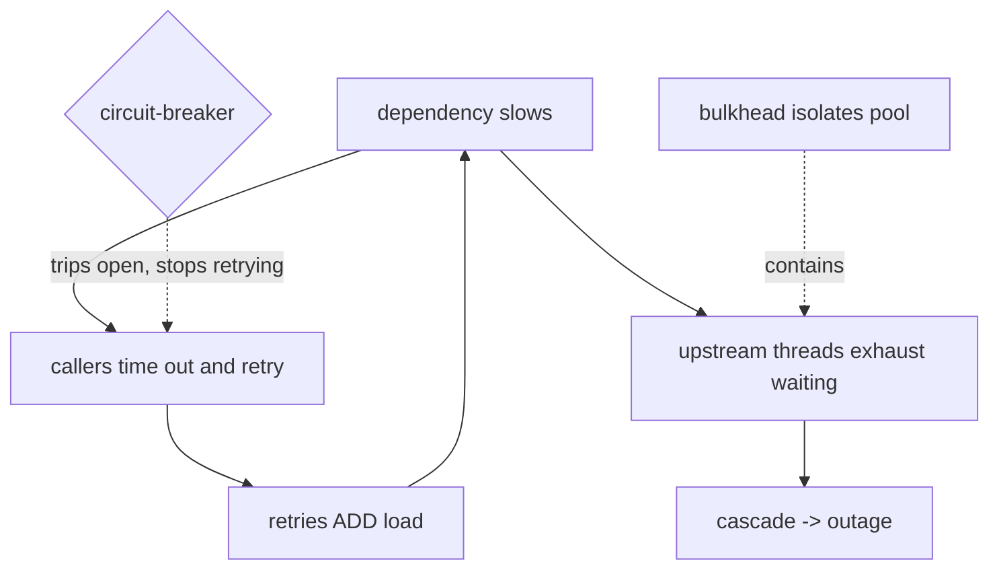

## Thesis

Bounding how long you wait and how you re-attempt when a dependency is slow or failing --- a timeout so one call can't hang forever, a retry with backoff and jitter so a transient failure recovers without stampeding, and a deadline propagated across the call chain so the whole request shares one time budget --- because unbounded waits and naive retries are exactly how one slow dependency becomes a system-wide outage.

## Sub

**Why bound waiting: unbounded waits cascade** -> **timeouts** -> **retries with backoff and jitter** -> **zoom out** to deadlines across a chain, retry storms, and the pivots an interviewer rides from "just retry it" into picking a timeout, retry-safety, and why retries can cause the outage.

## Spine

- A **timeout** turns an indefinite wait into a bounded failure --- without one, a hung dependency ties up the thread and connection until you exhaust the pool, and the caller hangs too, so the slowness propagates upstream instead of staying contained.
- A **retry** recovers from a *transient* failure --- but only for idempotent or retry-safe operations, and only with **backoff and jitter**, or every client retrying in lockstep stampedes the recovering dependency and turns a blip into an outage.
- A **deadline** bounds the *whole* request across the call chain --- propagated downstream so every hop knows how much time is left, because per-hop timeouts that ignore the total let a chain of "fast enough" calls quietly blow the caller's budget.
- The failure modes are **retry storms and cascading timeouts** --- retries amplify load precisely when a dependency is struggling, and a slow dependency exhausts upstream resources, so the mechanisms meant to add resilience will cause the outage if they're naive.

## Companion Notes

### walk

Bounding the wait and the re-attempt

One call to a slow dependency, made safe --- the timeout that bounds the wait, the retry with backoff and jitter that recovers a transient failure without stampeding, the deadline that bounds the whole chain, and the retry-storm/cascade failure mode the whole thing exists to avoid.

Say the cascade first --- "an unbounded wait on a slow dependency exhausts your threads and propagates upstream." Timeouts, retries, and deadlines are all about stopping one slow thing from taking down everything above it.

### drill

Probe Drill

Graded follow-ups on timeouts, backoff, jitter, deadlines, and retry storms --- the ones that separate "wrap it in a retry" from a call path that survives a struggling dependency.

Name the trap: retries amplify load exactly when a dependency is already failing, so naive retries turn a blip into an outage -- backoff, jitter, budgets, and circuit-breakers exist to stop that.

## Drill

SDE2 | the model and the mechanics
SDE3 | backoff, deadlines, and storms
Staff | cascades, budgets, and the stack

### SDE2 | what a timeout is

What is a timeout and why do you need one?

A limit on how long you'll wait for a response before giving up and treating the call as failed. You need it because without one, a hung or extremely slow dependency ties up the calling thread and its connection indefinitely --- and if enough calls hang, you exhaust the thread pool or connection pool, and now the *caller* is down too, not just the dependency. A timeout converts "wait forever" into "fail after N", keeping the slowness contained instead of letting it propagate up the stack.

### SDE2 | what a retry is

What is a retry and when should you use one?

Re-attempting a failed call, on the assumption the failure was *transient* --- a brief network blip, a momentary overload, a dropped packet --- that a second attempt will get past. You use it for failures that are plausibly temporary and for operations that are safe to repeat. You should *not* retry a failure that won't change on re-attempt (a 400 Bad Request, a 404, a validation error), because retrying a deterministic failure just wastes attempts and adds load without any chance of success.

### SDE2 | what backoff is

What is backoff?

Waiting longer between successive retries instead of hammering immediately --- typically **exponential**: wait 100ms, then 200ms, then 400ms, doubling each attempt. The reason is that if a dependency is failing because it's overloaded, retrying instantly makes it worse; backing off gives it time to recover before the next attempt. Exponential backoff means a brief blip is retried quickly (short first wait) while a sustained problem gets exponentially more breathing room, which is the right shape for "probably transient, but maybe not."

### SDE2 | what jitter is

What is jitter and why add it to backoff?

Randomness added to the backoff delay, so retries don't all fire at the same instant. Without it, many clients that failed together (say, during a shared dependency hiccup) back off by the *same* amount and retry in perfect lockstep --- a synchronized thundering herd that slams the recovering dependency at exactly the same moment, knocking it back down. Jitter spreads the retries across a window (e.g. a random delay between 0 and the backoff bound), de-synchronizing the clients so the load is smeared out instead of spiked. Backoff sets the spacing; jitter breaks the synchronization.

### SDE2 | which operations are safe to retry

Which operations can you safely retry?

Idempotent ones --- where a repeat has the same effect as a single application (a GET, a PUT that sets a value, a DELETE, or a write protected by an idempotency key). Retrying a *non*-idempotent operation is dangerous: if the first attempt actually succeeded but the response was lost, the retry does the thing again --- a double charge, a duplicate record. So retry-safety and idempotency are linked: you can only freely retry an operation you've made safe to repeat, which is why "add retries" and "make it idempotent" usually go together.

### SDE2 | retry only transient failures

Why shouldn't you retry every failure?

Because a deterministic failure won't change on re-attempt, so retrying it is pure waste and added load. A 4xx client error (bad request, unauthorized, not found) means *your request* is wrong --- retrying sends the same wrong request and fails identically. Retries are for *transient* failures: timeouts, connection resets, 503s, throttling --- things a later attempt might get past. Distinguishing "retryable" (transient, server-side, throttling) from "non-retryable" (client errors, permanent failures) is essential, or you burn attempts and amplify load on failures that can never succeed.

### SDE2 | timeout too short vs too long

What goes wrong if a timeout is too short or too long?

**Too short**: you time out healthy-but-slightly-slow calls, failing requests that would have succeeded and triggering needless retries --- you manufacture failures. **Too long**: a genuinely hung dependency ties up your resources for ages before you give up, so slowness propagates and pools exhaust before the timeout ever fires --- the timeout isn't protecting you. The right value is set from the dependency's real latency distribution (comfortably above its p99, with margin), so normal calls pass and only genuinely-stuck ones trip it.

### SDE3 | exponential backoff with jitter

Walk through exponential backoff with jitter.

Each retry waits an exponentially growing base delay --- `base * 2^attempt` (100ms, 200ms, 400ms...) --- capped at a maximum, and then jittered: instead of waiting exactly that, you wait a *random* amount within that bound (full jitter: a uniform random value between 0 and the current backoff). Exponential growth gives a struggling dependency increasing recovery time; the cap prevents absurd waits; the jitter de-synchronizes clients so they don't retry in a herd. "Exponential backoff with full jitter" is the canonical recipe, and the jitter is the part people forget --- backoff alone still lets everyone retry at the same moments.

### SDE3 | retry budget and giving up

How do you decide when to stop retrying?

With a bounded **retry budget** --- a max attempt count and/or a total time cap --- because retries can't be infinite: past a few attempts, a failure is probably not transient, and continuing just adds load and delays the inevitable failure. Some systems use a *retry budget as a rate* (retries may be at most X% of requests) so that when failures are widespread, retries are automatically throttled rather than doubling the load. The key judgment is that retries are for the occasional transient blip; when they stop helping, you fail fast and surface the error rather than retrying into an outage.

### SDE3 | deadline propagation

What is deadline propagation and why does it matter?

Passing the *remaining* time budget down the call chain, so each service knows how long it has left rather than applying an independent timeout. If a request has a 2-second deadline and the first hop takes 1.5s, the next hop should be told it has 0.5s left --- not start its own fresh 2s timeout. Without propagation, a chain of individually-reasonable timeouts can far exceed the caller's budget (the caller already gave up, but downstream work keeps running, wasting resources). Propagating a deadline (a timestamp or remaining-duration passed in the request/context) gives the whole distributed call one shared clock, so everyone stops when the budget is spent.

### SDE3 | the different timeouts

What are the different kinds of timeout on a single call?

At least three: **connection timeout** (how long to wait to *establish* the connection), **read/socket timeout** (how long to wait for data once connected / between bytes), and an overall **request timeout** (total time for the whole call, cap on everything). They protect different failures --- a connect timeout catches an unreachable host fast, a read timeout catches a server that accepted the connection but stalled mid-response, and a total timeout bounds the end-to-end. Setting only one leaves gaps (a short connect but unbounded read can still hang forever on a stalled response), so robust clients set all of them.

### SDE3 | retry storms

What is a retry storm and how does it form?

An amplification spiral: a dependency slows down, callers time out and retry, the retries *add* load to the already-struggling dependency, which slows further, causing more timeouts and more retries --- a positive feedback loop that drives a temporary degradation into a full outage. It's worst in layered systems where each layer retries, so the amplification multiplies down the stack. The defenses are backoff and jitter (space and de-sync the retries), retry budgets (cap the amplification), and circuit-breakers (stop retrying a dependency that's clearly down). The core insight is that retries add the most load exactly when the system can least handle it.

### SDE3 | retries and idempotency

Why are retries and idempotency two sides of the same coin?

Because a retry re-sends a request whose fate is ambiguous --- the original may have succeeded with a lost response --- so retrying is only safe if a second application is harmless, which *is* idempotency. If you retry a non-idempotent write, you risk a double effect; so to retry writes safely you make them idempotent (an idempotency key, an upsert on a natural key, a conditional update). This is why the two topics are always paired: timeouts and retries give you resilience against slow/failing dependencies, and idempotency is what makes the retries safe rather than a source of duplicate side effects.

### SDE3 | tuning timeout values

How do you choose the actual timeout value for a dependency?

From its latency distribution, per-dependency --- set the timeout comfortably above the dependency's p99 (or p99.9) with margin, so healthy-but-slightly-slow calls pass and only genuinely-stuck ones trip. A single global timeout is wrong because dependencies have very different latency profiles: a cache is sub-millisecond, a heavy report query is seconds, so one shared value is either too tight for the slow ones (manufacturing failures) or too loose for the fast ones (letting them hang). You measure each dependency's real latency and set the timeout from that, revisiting it as the profile shifts --- a timeout is a claim about "how slow is abnormal for *this* dependency," which is inherently dependency-specific, not a global constant.

### Staff | cascading failures

How does a single slow dependency cause a system-wide outage?

Through resource exhaustion propagating upward. A downstream dependency slows; upstream callers, waiting on it (especially without tight timeouts), hold their threads and connections occupied; as more requests pile up waiting, the upstream service's pools fill, so it can no longer serve *any* request --- including ones that don't even touch the slow dependency. The failure has cascaded: the slowness of one component became the unavailability of everything above it. The defenses are tight timeouts (release resources fast), bulkheads (isolate the resource pool per dependency so one can't consume all threads), and circuit-breakers (stop calling the slow dependency entirely). Cascading failure is *the* reason unbounded waits are dangerous at scale.

### Staff | retry amplification at scale

Why is retrying especially dangerous in a deep call chain?

Because the amplification is multiplicative. If each of N layers retries a failed call 3 times, a single top-level request can generate 3^N calls to the bottom layer in the worst case --- three layers is 27x, and it hits the deepest, most-likely-overloaded dependency hardest. So retries at *every* layer compound into a massive load spike on the struggling component. The mitigation is to retry at *fewer* layers (ideally only where you have the context to know it's worth it, often near the edge or at a single designated layer), to enforce retry budgets that cap the total, and to propagate deadlines so downstream stops when the top-level caller has already given up. Retrying everywhere feels safe locally but is catastrophic globally.

### Staff | deadlines as a budget

How should deadlines work across a whole request?

As a single shared budget, set at the entry point and propagated to every hop, so the entire distributed call has one clock. The edge assigns "this request must complete in 2s"; each downstream call is given the *remaining* budget, and any work that can't finish in time is abandoned rather than run to completion nobody's waiting for. This does two things: it bounds tail latency end-to-end (the user never waits longer than the budget), and it *stops wasted work* --- once the caller has timed out, continuing downstream just burns capacity. Deadlines also compose with retries: a retry has to fit within the remaining budget, so you don't retry into a deadline you've already blown. The budget, not per-hop timeouts, is the correct mental model for latency in a distributed system.

### Staff | load shedding and failing fast

When should a system stop retrying and instead fail fast or shed load?

When the dependency is overloaded rather than blipping --- there, retries and patient waiting make it *worse*, so the correct behavior is to fail fast (return an error immediately) and shed load (reject some requests outright) to let the dependency recover. A circuit-breaker automates the "fail fast" decision (trip open after a failure threshold, stop calling, periodically probe). Load shedding automates the "reject some" decision (drop low-priority or excess requests to keep the system within capacity). The senior judgment is recognizing that under sustained overload, *reducing* load is the recovery mechanism --- retrying and queueing are the opposite of what helps --- so resilience sometimes means deliberately failing requests fast rather than trying harder to serve them.

### Staff | the resilience stack

How do timeouts, retries, circuit-breakers, and bulkheads fit together?

As complementary layers. **Timeouts** bound each wait so resources are released. **Retries (with backoff and jitter)** recover transient failures. **Circuit-breakers** stop retrying a dependency that's clearly down, preventing retry storms and giving it room to recover. **Bulkheads** isolate resource pools per dependency so one slow dependency can't consume all the threads and starve the rest. Together they form a defense against cascading failure: timeout fast, retry a little, break the circuit when it's hopeless, and isolate so the blast radius is contained. No single one suffices --- retries without circuit-breakers cause storms, timeouts without bulkheads still let one dependency hog the pool --- so senior designs layer them.

### Staff | retry-on-write safety

How do you safely retry a write operation?

Make the write idempotent first, then retry within a budget. Attach an idempotency key (or use a natural-key upsert / conditional update) so that if the first attempt succeeded but the response was lost, the retry is deduplicated to a no-op returning the original result rather than applying the write twice. Only then is retrying a write safe. Additionally, be careful that the retry fits the remaining deadline and that you don't retry on ambiguous *success-ish* responses without the idempotency guarantee. The rule: never retry a non-idempotent write blindly --- either make it idempotent and retry, or don't retry it and surface the failure for the caller to handle explicitly.

### Staff | when not to retry

When should you *not* retry at all?

On non-retryable failures (4xx client errors --- the request itself is wrong), on non-idempotent operations you haven't made safe (risk of double effect), and when the dependency is *overloaded* (retrying adds load and deepens the outage --- fail fast instead). Also avoid retrying at multiple layers simultaneously (amplification), and avoid retrying past the request's deadline (pointless work after the caller gave up). The anti-pattern is treating retries as a universal band-aid: they help precisely for *occasional, transient, retry-safe* failures, and they *hurt* for deterministic errors, unsafe writes, and overloaded systems. Knowing when retrying makes things worse is as important as knowing how to retry.

## Walk

### A timeout bounds the wait

```flow
c[call dependency] -> s[it is slow / hung] -> t[timeout fires -> bounded failure]
```

A call goes out to a dependency that's slow or hung. Without a timeout, the calling thread and its connection wait indefinitely --- and as more calls pile up waiting, the pool fills and the caller itself stops serving requests.

A timeout converts that indefinite wait into a bounded failure: after N milliseconds, give up, release the thread and connection, and treat the call as failed. This is the foundation --- it keeps a slow dependency's problem *contained* to that call instead of letting it climb the stack and exhaust the caller's resources. The value is set from the dependency's real latency (above its p99, with margin), so healthy calls pass and only genuinely-stuck ones trip.

### Retry the transient failure --- with backoff and jitter

```flow
f[call failed] -> q[transient + retry-safe?] -> r[backoff + jitter, then retry]
```

A failed call *might* be a transient blip worth re-attempting --- but only if the failure is transient (a timeout, a 503, throttling; never a 4xx) and the operation is retry-safe (idempotent or keyed). And the retry must back off with jitter:

```python
def call_with_retry(fn, max_attempts=4, base=0.1, cap=2.0):
    for attempt in range(max_attempts):
        try:
            return fn()
        except Transient as e:
            if attempt == max_attempts - 1:
                raise                       # budget spent -> fail fast
            backoff = min(cap, base * (2 ** attempt))   # exponential, capped
            time.sleep(random.uniform(0, backoff))      # full jitter
```

Exponential backoff gives a struggling dependency increasing room to recover; the cap prevents absurd waits; and the full jitter (a random delay within the backoff bound) de-synchronizes clients so they don't all retry at the same instant and stampede. The bounded attempt count is the retry budget --- when it's spent, you fail fast rather than retry into an outage. The jitter is the part people forget, and it's exactly what prevents a synchronized thundering herd.

### A deadline bounds the whole chain

```flow
d[request deadline: 2s] -> p[propagate remaining time to each hop] -> b[hop stops when budget is spent]
```

A per-call timeout isn't enough across a chain of services --- three hops each with a "reasonable" 2-second timeout can run for six seconds while the caller gave up long ago. The fix is a **deadline**: set one budget at the entry point and propagate the *remaining* time to each hop.

If the request has 2 seconds and the first hop takes 1.5, the next hop is told it has 0.5 left --- not a fresh 2. Every service shares one clock, so work stops when the budget is spent instead of running to a completion nobody's waiting for. This bounds end-to-end tail latency and stops wasted downstream work, and it composes with retries: a retry has to fit the remaining budget, so you never retry into a deadline you've already blown.

### The failure modes: retry storms and cascading timeouts

```flow
sl[dependency slows] -> amp[retries amplify load / upstream threads exhaust] -> out[cascade -> outage]
```

The mechanisms that add resilience cause the outage when naive. **Retry storms**: a dependency slows, callers retry, the retries add load, it slows more --- a feedback loop, multiplied in layered systems (three layers each retrying 3x is up to 27x load on the bottom). **Cascading timeouts**: a slow dependency ties up upstream threads until the upstream can't serve anything, even requests that don't touch it.

The guards are the rest of the resilience stack: **circuit-breakers** stop retrying a dependency that's clearly down (breaking the storm), **bulkheads** isolate the thread pool per dependency (containing the cascade), **retry budgets** cap the amplification, and **load shedding / failing fast** reduces load when the dependency is overloaded --- because under sustained overload, *retrying harder is the opposite of what helps*. Timeouts and retries are necessary but not sufficient; at scale they're paired with breakers and bulkheads or they become the failure.

### Model Script

- Frame the cascade | "The reason all of this exists: an unbounded wait on a slow dependency ties up your threads and connections, and as calls pile up your pool fills and you stop serving anything -- one slow dependency becomes a system-wide outage. So the first move is always a timeout: bound the wait, release resources fast, keep the slowness contained instead of letting it climb the stack."
- Retries with backoff and jitter | "Then retries, but carefully. Only for transient failures -- timeouts, 503s, throttling, never a 4xx -- and only for retry-safe operations, which means idempotent. And with exponential backoff plus full jitter: backoff gives a struggling dependency room to recover, and jitter de-synchronizes clients so they don't all retry at the same instant and stampede. Bounded by a retry budget, so when it's spent I fail fast instead of retrying into an outage."
- Deadlines across the chain | "Per-hop timeouts aren't enough across services -- three hops with reasonable timeouts can far exceed the caller's budget. So I propagate a deadline: one budget set at the edge, and each hop is told the remaining time, not a fresh timeout. Everyone shares one clock, work stops when the budget's spent, and a retry has to fit the remaining budget. That bounds end-to-end latency and stops wasted downstream work after the caller already gave up."
- The failure modes and the stack | "The subtlety is that retries add load exactly when a dependency is struggling -- that's a retry storm, and it multiplies in layered systems. So retries never stand alone: circuit-breakers stop calling a dependency that's clearly down and break the storm, bulkheads isolate the thread pool per dependency so one can't starve the rest, retry budgets cap the amplification, and under sustained overload I fail fast and shed load, because retrying harder is the opposite of what helps."
- Interviewer: "Your service calls a payment processor that starts timing out intermittently. What do you do?"
- Applied | "Tight timeout above the processor's p99 so hung calls release fast. Retry only if the charge is idempotent -- an idempotency key -- and only on transient timeouts, with exponential backoff and jitter, capped at a couple of attempts within the request deadline. A circuit-breaker so that if the processor is genuinely down, I stop hammering it and fail fast, maybe queuing for later rather than retrying inline. And bulkhead the processor calls so their slowness can't exhaust the threads serving the rest of my API. That's timeout, safe retry, breaker, isolation -- resilience without turning a processor blip into my outage."
- Land it | "So: timeouts bound the wait and release resources; retries recover transient failures but only for idempotent ops, with backoff, jitter, and a budget; deadlines give the whole chain one clock; and because retries amplify load on a struggling dependency, they're paired with circuit-breakers, bulkheads, and load shedding. The one line is that unbounded waits and naive retries are how one slow dependency takes down the system, and this whole toolkit exists to keep that contained."

## Whiteboard

Sketch the retry storm and mark where the circuit-breaker cuts it.

### How does a slow dependency become an outage?

Two ways: retries pile load onto the struggling dependency (a storm), and upstream callers waiting on it exhaust their thread pools (a cascade) -- so the slowness propagates upward into unavailability.

### What stops it?

Timeouts release resources fast, backoff and jitter space and de-sync retries, retry budgets cap amplification, circuit-breakers stop calling a dead dependency, and bulkheads isolate the pool.



Verdict: retries plus unbounded waits form a feedback loop into cascade; timeouts, backoff+jitter, budgets, circuit-breakers, and bulkheads are the layered defense that breaks it.

## System

Zoom out to where these bounds sit on a call.

### Where it sits

Caller: sets the timeout, retry policy, and deadline budget [*]
The call: connection + read + total timeouts bound each wait
Retry loop: backoff + jitter + budget, only for transient + idempotent
Deadline: one budget propagated to every downstream hop
Resilience stack: circuit-breaker + bulkhead guard against storms + cascades

### Pivots an interviewer rides

From "just retry" they push on timeout values, retry-safety, and cascades.

#### How do you pick the timeout value?

-> from the dependency's latency distribution -- above p99 with margin
Too short manufactures failures on healthy-but-slow calls; too long lets a hung dependency exhaust your pool before it fires. Set it from real p99, and set connect/read/total separately.

#### Won't retrying make an overloaded dependency worse?

-> yes -- that's a retry storm; cap with backoff, jitter, budgets, and a circuit-breaker
Retries add load exactly when the dependency is struggling, multiplied across layers; under sustained overload you fail fast and shed load instead of retrying harder.

## Trade-offs

The calls that separate "wrap it in a retry" from a resilient call path.

### Retry aggressively vs fail fast

- Aggressive retries: recover more transient blips, hide brief failures from the user -- but amplify load on a struggling dependency and risk a storm
- Fail fast: protect the dependency and the caller, surface errors quickly -- but give up on failures a retry would have recovered

Retry a little for transient failures with backoff/jitter/budget; fail fast (circuit-breaker) once a dependency is clearly overloaded or down.

### Per-hop timeouts vs a propagated deadline

- Per-hop timeouts: simple, each service owns its limit -- but they compound, so a chain can far exceed the caller's budget and do wasted work
- Propagated deadline: one shared budget, bounds end-to-end latency, stops wasted downstream work -- but requires threading the deadline through every call

Propagate a deadline for anything that spans multiple services; per-hop timeouts alone are fine only for a single, shallow call.

### Retry at every layer vs at one layer

- Every layer: local resilience everywhere -- but multiplicative amplification (3 layers x 3 retries = 27x) that hammers the deepest dependency
- One layer: bounded amplification, predictable load -- but that layer must have the context to decide retrying is worth it

Retry at as few layers as possible (often the edge or one designated layer), not at every hop; the amplification of retrying everywhere is catastrophic at scale.

## Model Answers

### the reframe | Bound the wait, contain the slowness

The frame to lead with.

- Timeout bounds each wait | key | releases threads/connections, keeps slowness contained
- Retry only transient + idempotent | store | backoff + jitter + budget, or fail fast
- Deadline for the whole chain | note | one budget propagated to every hop

### the danger | Retries amplify at the worst time

Why the toolkit is layered.

- Retry storm + cascade | key | retries add load, upstream pools exhaust
- Circuit-breaker + bulkhead | store | stop the storm, contain the cascade
- Under overload, fail fast | note | reducing load is the recovery

## Numbers

Back-of-envelope the retry amplification, the timeout floor, and the budget.

Retries multiply across a call chain and hit the deepest dependency hardest; a timeout below the dependency p99 manufactures failures, and the whole chain needs one propagated budget.

- layers | Call-chain depth | 3 | 1 | 1
- retries | Retries per layer | 3 | 0 | 1
- p99 | Dependency p99 (ms) | 200 | 0 | 10

```js
function (vals, fmt) {
  var layers = vals.layers, retries = vals.retries, p99 = vals.p99;
  var amp = Math.pow(retries, layers);
  return [
    { k: 'Retry amplification', v: fmt.n(amp) + 'x', u: 'worst-case load', n: layers + ' layers each retrying ' + retries + 'x multiplies load up to ' + amp + 'x on a struggling dependency \u2014 retries add load exactly when you can least afford it', over: amp > 10 },
    { k: 'Timeout floor', v: fmt.n(p99), u: 'ms (set above this)', n: 'a timeout below the dependency p99 (' + p99 + 'ms) fails healthy-but-slow calls; set it above p99 with margin so only genuinely-stuck calls trip it', over: false },
    { k: 'Deadline', v: 'one budget', u: 'across the chain', n: 'the whole request needs one clock propagated to each hop \u2014 per-hop timeouts that ignore the total let a chain of fast-enough calls blow the caller budget', over: false },
    { k: 'Retry only if', v: 'transient + idempotent', u: '', n: 'retry only on transient failures (timeout, 503, throttling) and only for retry-safe (idempotent/keyed) operations \u2014 never a 4xx or a naked non-idempotent write', over: false },
    { k: 'Backoff + jitter', v: 'exponential + random', u: '', n: 'without jitter every client retries in lockstep and stampedes the recovering dependency \u2014 exponential backoff spaces attempts, full jitter de-synchronizes them', over: false }
  ];
}
```

## Red Flags

What makes an interviewer wince.

### "We retry failed calls up to five times, immediately"

Immediate retries with no backoff hammer a struggling dependency, and retrying every failure (including client errors) amplifies load exactly when it's least able to cope -- a retry storm.

Retry only transient failures, with exponential backoff and full jitter, a small bounded budget, and a circuit-breaker to stop retrying a dependency that's clearly down.

### "Every service has its own timeout, so we're covered"

Independent per-hop timeouts compound -- a chain of reasonable timeouts can far exceed the caller's budget, and downstream keeps working after the caller has given up.

Propagate a single deadline from the edge, passing the remaining budget to each hop, so the whole request shares one clock and stops when the budget is spent.

### "We add retries to make the writes reliable"

Retrying a non-idempotent write risks a double effect -- if the first attempt succeeded but the response was lost, the retry applies it again.

Make the write idempotent first (an idempotency key or natural-key upsert), *then* retry; retries and idempotency are inseparable for writes.

## Opener

### 30s | The one-liner

How I open when asked about calling a flaky or slow dependency.

#### What is the shape?

Bound the wait with a timeout so a slow dependency can't exhaust your pool, retry only transient failures with backoff, jitter, and a budget, and propagate one deadline across the whole chain.

#### What's the danger?

Retries amplify load precisely when a dependency is struggling, so they're paired with circuit-breakers, bulkheads, and load shedding -- otherwise the resilience mechanism becomes the outage.

##### Hooks

Where an interviewer usually pushes next.

- Pick the timeout? | above the dependency p99 | drill
- Won't retries worsen it? | storm; backoff/jitter/budget/breaker | drill
- Retry a write? | only if idempotent | drill

Foot: two sentences -- unbounded waits and naive retries are how one slow dependency takes down the system, so you bound the wait, retry safely and sparingly, share one deadline, and layer breakers and bulkheads on top.

## Bank

### SCALE | A deep call chain where every layer retries a struggling dependency

Task: reason about the amplification and how to bound it.
Model: retries multiply down the chain (N layers x R retries approaches R^N calls on the bottom dependency), hitting the most-overloaded component hardest; bound it by retrying at as few layers as possible, enforcing retry budgets, propagating a deadline so downstream stops when the caller gave up, and tripping a circuit-breaker when the dependency is clearly down.
Int: what's the single biggest risk of retrying at every layer?
Multiplicative amplification -- a retry storm that turns a degradation into an outage.

### DESIGN | A resilient client for a flaky payment processor

Task: design the call path to a payment processor that times out intermittently.
Model: a timeout above the processor's p99 so hung calls release fast; retry only on transient timeouts and only because the charge is idempotent (an idempotency key), with exponential backoff + jitter capped at a couple of attempts within the request deadline; a circuit-breaker to fail fast (and queue for later) when the processor is genuinely down; and a bulkhead so the processor's slowness can't exhaust the threads serving the rest of the API.
Int: why is the idempotency key essential here?
Because retrying a charge is only safe if a duplicate is deduplicated -- otherwise a lost response plus a retry double-charges.

### Extra Curveballs

### CURVEBALL | overload | Your dependency is overloaded and everything is timing out. Should you retry harder?

Model: no -- that's exactly when retries make it worse. Under sustained overload, retries and patient queueing add load to a component that needs *less* of it, deepening the outage. The correct response is to reduce load: fail fast (a circuit-breaker trips open and stops calling the dependency, returning errors immediately so callers don't pile up), and shed load (reject low-priority or excess requests) so the dependency can recover. Retrying is for occasional transient blips; for an overloaded system, backing off and shedding is the recovery mechanism, and retrying harder is the opposite of what helps.

### Frames

- Timeouts bound the wait and contain the slowness; retries recover only transient, idempotent failures
- Backoff + jitter + budget, and one propagated deadline across the whole chain
- Retries amplify load on a struggling dependency, so pair them with circuit-breakers, bulkheads, and load shedding
