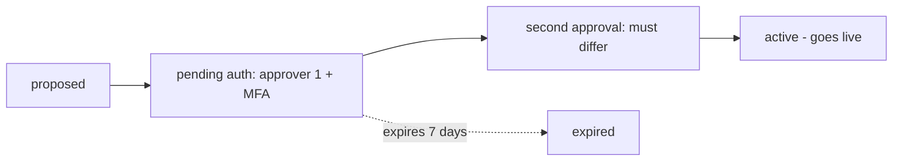

## Thesis

Rules as governed data --- a catalog of rule definitions plus per-tenant subscriptions, evaluated by a generic engine, so changing policy is a data change the engine reads next cycle rather than a code deploy --- and because a live rule change is a high-stakes action, the sensitive ones move through a dual-authorization state machine that requires two **different** approvers, is MFA-gated, blocks self-approval and same-person double-approval, and expires half-approved requests.

## Sub

**Rules as data, not if-statements** -> **the dual-authorization state machine** -> **the four-eyes integrity details** -> **zoom out** to the evaluation cycle and the health rollup, and the pivots an interviewer rides from "an engine, not code" into four-eyes, the same-person subtlety, and why a rule change needs approval at all.

## Spine

- Rules are **data, not code** --- a catalog of rule definitions plus per-tenant subscriptions, so changing policy is a data change the running engine reads next cycle, with no deploy and no release.
- Sensitive changes need **dual authorization** --- a state machine, proposed to pending to second-approval to active, requiring two *different* approvers and gated by MFA.
- The control is real only if it blocks **self-approval and same-person double-approval** --- the second-approval step rejects both the requester and the first approver, or the four-eyes principle is theater.
- Half-approved requests **expire** --- a derived, unambiguous status and a time-box, so nothing lingers pending forever as a security liability.

## Companion Notes

### walk

A rule change under governance

One sensitive change from proposal to live --- through the two-approver state machine and into the engine that evaluates it, no deploy.

Lead with the four-eyes control and its subtlety --- "two different approvers, and the requester can't be the second one." That detail is the whole signal.

### drill

Probe Drill

Graded follow-ups on engine-versus-code, the dual-authorization state machine, and four-eyes integrity --- the ones that separate "a rules engine" from a real governance design.

Name the same-person block explicitly --- blocking self-approval but not same-person double-approval is still theater.

### wb

Whiteboard

Rebuild the whole governed path from memory --- catalog to subscription to approval to evaluation --- with only the cues in front of you.

Draw the state machine first and mark the edge where the two approvers must differ. That edge is the topic; everything else hangs off it.

### sys

System Map

Zoom out: the engine sits between the rules people write and the fleet those rules judge, with the approval workflow guarding the way in and the rollup carrying the verdict out.

Lead with the split, not the boxes --- "the engine ships through CI/CD, the rules ship through approvals." That one line places every component on the map.

### trade

Trade-offs

The calls they drill --- engine versus hardcoded, one approver versus two, a restricted rule language versus arbitrary code --- each with the condition that flips it.

Always name the switch. An engine is not better than an if-statement; it is better when policy changes often or varies per tenant, and worse when it does not.

### model

Model Answers

Full spoken scripts --- the beats, in order, the way you would actually say them under time pressure.

Steal the frame, not the words. Headline first ("policy is data, the engine is code"), then volunteer the cost you just took on: no code review, no CI, no staged rollout.

### num

Numbers

Back-of-envelope the evaluation set the join produces, and the one number that actually bites --- the history rows.

Lead with the shape, not the total. The rules are cheap and the tenants are cheap; it is devices times rules times cycles that explodes, which is why you record transitions, not every evaluation.

### rf

Red Flags

What sinks the round --- if-statements in code, a single approver, a self-approval check you think is enough --- and the line that flips each one.

Name what the interviewer hears. "Self-approval is blocked, so it is safe" is the sentence that says you have not thought about the first approver coming back as the second.

### open

30-Second

The opener and the close --- matched to the altitude the question is asked at.

Open at policy-versus-code, not at the state machine. Land on the trade: you bought runtime editability and you gave up the deploy pipeline's safety net, so the rule path needs its own.

## Drill

all | **All four levels, mixed** --- the way a real loop actually comes at you.
SDE2 | the model and the mechanics
SDE3 | the state machine and its integrity
Staff | evaluation, rollup, and org calls

### SDE2 | engine vs if-statements

Why a rules engine instead of if-statements in code?

Because it separates **policy from code**. Rules live as data --- definitions and parameters --- and a generic engine evaluates them, so changing a threshold or adding a rule is a data change, not a code change that needs a pull request, a review, a build, and a deploy. If-statements bury policy in code where every change is a release; an engine makes policy editable at runtime.

Follow: You said a rule change needs no deploy. So it also skips code review, CI, and staged rollout --- how is that not strictly more dangerous?
It is more dangerous, unless you rebuild those guarantees on the data path --- and that is the honest answer. Rules-as-data does not remove the need for release discipline, it **moves** it: the parameter schema validates on write (the type check), a **dry-run** against recent data is the test, the **approval workflow** is the code review, **staged enablement** (one tenant, then the fleet) is the canary, and because the previous version of the rule row still exists, **rollback is re-pointing to it** --- faster than a deploy rollback. Skip all that and you have traded a slow, safe path for a fast, unsafe one. The engine is only a win when the rule path has its own gate.

Follow: When is "just an if-statement" actually the right answer?
When the rules are few, stable, and global. An engine buys runtime editability and per-tenant variation; if policy changes once a quarter and is identical for everyone, you are paying for indirection, a rule store, a validation layer, and a governance workflow --- all to avoid a two-line diff that CI would have tested for free. The engine earns its keep when the change **rate** or the per-tenant **variance** is high, not because it is the more sophisticated option.

Senior: Volunteering that rules-as-data **deletes the safety net CI/CD gave you** --- and naming what rebuilds it (schema validation on write, a dry-run, staged enablement, versioned rollback, the approval as the review) --- is the difference between "I know the pattern" and "I have operated it."
Speak: Lead with the separation: **"policy is data, the engine is code --- so a threshold change is a row edit the engine reads next cycle, not a release."** Then immediately volunteer the cost: you just lost code review, CI, and staged rollout, so the rule path needs its own gate.

### SDE2 | what a rule is

What actually is a rule here?

Two rows. A **catalog** entry defines the rule --- its condition (say, a metric over a threshold), its severity, and a parameter schema. A per-tenant **subscription** enables that rule for a tenant with concrete parameters. The definition is shared; the subscription is what makes it active for a specific tenant with specific numbers.

Follow: Why split it into two rows instead of one row per tenant per rule?
Because the **definition** is shared and the **parameters** are not. One catalog row holds the condition, the severity, and the schema --- authored and reviewed once --- and each subscription holds only what varies: this tenant's numbers. Collapse them into one row per tenant and you duplicate the condition N times, so fixing a bug in the condition means editing every tenant's copy, and nothing stops two copies drifting apart. The split is just normalization: the shared definition in one place, the per-tenant variation in another.

Follow: The rule's parameter schema changes --- you add a required field. What happens to the 400 tenants already subscribed?
That is a **data migration** across every subscription, and it has the same shape as any migration: a new required field with no default makes 400 existing subscriptions instantly invalid. So the rule definition is **versioned** --- existing subscriptions stay pinned to the version they were validated against, and new or migrated ones move forward. You either backfill the field with a safe default and migrate, or run both versions until the tenants are moved. What you must not do is let the engine read 400 subscriptions that no longer validate. Rules-as-data makes the edit trivially easy, which is exactly why the migration discipline has to be deliberate.

Senior: Recognizing that a parameter-schema change is a **data migration across every subscription** --- and reaching for **versioned rule definitions** rather than an in-place edit --- separates "rules are just rows" from "I have evolved a rule schema in production."
Speak: Two rows, and say why: **"a catalog entry defines the rule and its parameter schema; a per-tenant subscription enables it with that tenant's numbers."** The definition is shared so a fix lands once; the subscription is what makes it live for one tenant.

### SDE2 | change without a deploy

How does changing a rule not require a deploy?

The engine reads the rule rows each cycle, so an edit to a catalog entry or a subscription takes effect on the next evaluation --- no code changed, nothing shipped. That is the whole value proposition: the engine (code) changes rarely and goes through CI/CD; the rules (data) change anytime through an admin path and are live next cycle.

Follow: So how quickly is it live --- and what actually decides that number?
It is live on the **next cycle**, so the bound is the cycle interval plus however long the engine caches the rule set. Re-read the active set at the top of every cycle and a change is live within one cycle --- minutes. Cache the rules with a TTL to spare the store and the real bound is the TTL, which a change can lag behind. That is the knob: reload-every-cycle is freshest and hits the store hardest; a TTL is cheaper and staler. The mistake is saying "instant" --- it is "next cycle," and you should know which number you are quoting.

Follow: The engine is running mid-cycle when the rule changes. Does it pick up the new rule halfway through?
It must not. You **snapshot** the active rule set at the start of the cycle and evaluate the whole pass against that snapshot. If rules could change mid-cycle, two devices in the same sweep would be judged by different policy, their results would not be comparable, and the rollup built from them would be meaningless. So a change that lands mid-cycle applies to the **next** one. That is also the reason a result should record **which rule version produced it** --- it is what makes a verdict explainable after the fact.

Senior: Refusing to say "instant" --- naming the cycle interval and the cache TTL as the actual bound --- then insisting the rule set is **snapshotted per cycle** so one sweep is judged by one policy, is the precision an interviewer is listening for.
Speak: Be exact rather than impressive: **"it is live on the next cycle, not instantly --- the bound is the cycle interval plus the rule-cache TTL."** Then the detail that shows you have run it: the active set is snapshotted at the top of the cycle, so one sweep is never judged by two policies.

### SDE2 | what dual authorization is

What does dual authorization mean?

A sensitive change can't be enacted by one person --- it requires **two** to approve before it takes effect. The request moves through states (proposed, pending authorization, pending second authorization, active), and only when a second, distinct approver signs off does it go live. It is the "four-eyes principle": two sets of eyes on anything high-stakes.

Follow: Which changes go through it --- all of them?
No, and gating everything is its own failure mode. Four-eyes is scoped to changes with a **high blast radius**: a rule that pages the whole fleet, a threshold that could mass-alert or mass-suppress, anything security-relevant. Routine, low-stakes, easily-reversible edits take the normal path. Gate everything and you get **approval fatigue** --- reviewers rubber-stamp because ninety percent of what they see is trivial, and a rubber-stamped approval is not a second pair of eyes, it is a second click. The control works only if being asked to approve is rare enough to still mean something.

Follow: What determines whether a given rule change is "sensitive"?
The blast radius of the change --- and it must be a **property of the rule**, not a judgment call made at edit time. The catalog entry carries the rule's severity or class, so "changes to a paging rule" or "changes to a security rule" are sensitive by definition and the workflow triggers automatically. Leave it to the editor to decide whether to request approval and the one change that most needs review is precisely the one somebody routes around. The classification lives with the rule; the workflow reads it.

Senior: Volunteering that gating **everything** breaks four-eyes --- approval fatigue turns reviewers into rubber-stamps --- and that "sensitive" must be a property of the rule the workflow reads rather than a choice the editor makes, is the security-operations judgment most candidates miss entirely.
Speak: Define it, then immediately scope it: **"two different people must approve before a sensitive change takes effect --- and 'sensitive' is a property of the rule, not the editor's choice."** Then the trap: gate everything and reviewers rubber-stamp, which is four-eyes in name only.

### SDE2 | why two approvers

Why require two approvers at all?

To remove the single point of failure that is one person. A single compromised, mistaken, or malicious account can otherwise push a sensitive change alone. Requiring a second distinct approver means an attacker needs two accounts, and an honest mistake gets a second look --- the control's entire purpose is that no one actor can act unilaterally on something high-stakes.

Follow: Two approvers who both report to the same manager, under pressure to ship. Is that really two sets of eyes?
Structurally, no --- and that is the honest limit of the control. Four-eyes defends against a **single** compromised or mistaken actor; it does not defend against **collusion**, or against an org where both approvers face identical pressure. You can strengthen it --- require the second approver from a different team, or require a security-role approver for security-class rules --- but you cannot make it collusion-proof. What you can do is make collusion **expensive and attributable**: the audit trail names both approvers permanently. The control raises the cost of a bad change from one compromised account to two plus a permanent record. That is real, and it is also all it is.

Follow: The requester just asks a colleague to click approve without reading it. Now what?
That is the rubber-stamp failure, and no identity check catches it --- both approvers genuinely **are** distinct people. The fixes are procedural and design-level: keep approval requests **rare** so they get read; show the approver a **diff** of what actually changes rather than a raw rule blob; require a **stated reason**; and where it matters, show a **dry-run** --- "this rule would have fired on 4,000 devices last week." An approver who can see the blast radius is a reviewer; one shown an opaque row is a button. The technical control guarantees two identities; the **design** is what makes the second one actually look.

Senior: Naming the limit out loud --- four-eyes stops one actor, not collusion and not rubber-stamping --- and then fixing what *can* be fixed (a diff, a stated reason, a dry-run showing blast radius) reads far stronger than pretending the control is airtight.
Speak: Give the reason, then the limit: **"it removes the single point of failure that is one person --- an attacker needs two accounts, and an honest mistake gets a second look."** Then be honest: it stops neither collusion nor rubber-stamping, so show the approver a diff and a dry-run, not an opaque row.

### SDE2 | what MFA adds

What does MFA-gating the approval add?

It raises the bar on *who* is approving. An approval is a high-value action, so requiring a TOTP (or equivalent) at the moment of approval means a stolen session or password alone isn't enough to approve --- the approver must prove a second factor right then. Four-eyes stops one actor; MFA makes each of the two harder to impersonate.

Follow: The approver already logged in with MFA an hour ago. Why challenge them again?
Because session-level MFA proves who **started the session**, not who is performing **this action**. An hour later that session could be hijacked, left open on an unlocked laptop, or driven by a malicious script in the browser. Re-challenging at the moment of approval --- **step-up authentication** --- binds the second factor to the *act of approving*, which is the only thing you actually care about. Session MFA authenticates a login; step-up MFA authenticates a decision.

Follow: So they enter a TOTP. What stops that code being replayed against a different request?
You **bind the assertion to this request**: the challenge is issued for a specific request id and the resulting assertion is accepted only for that request, and consumed once. Otherwise a code generated to approve a benign change can be captured and used to approve a sensitive one inside the same thirty-second window --- which is the transaction-signing problem: the user must be approving *what they think they are approving*. Sign the action, not just the session. An MFA assertion that is not bound to the request proves someone had a token, not that they consented to **this** change.

Senior: Distinguishing **session MFA from step-up MFA bound to the specific request** --- and knowing an unbound assertion is replayable across requests inside its window --- is the depth that shows you have implemented a high-value approval, not just switched MFA on.
Speak: Say what it actually protects: **"MFA at the moment of approval means a stolen session alone can't approve --- the approver proves a second factor right then."** Then the subtlety: bind the challenge to *that request id*, or the code is replayable against a different one.

### SDE2 | validating a rule change

What stops an invalid rule from being saved?

The rule's own schema. A rule change is validated against the definition's parameter schema before it is written --- a threshold outside its allowed range or a malformed condition is rejected at write time, so the engine never reads an invalid rule. Validation-on-write is what makes rules-as-data as safe as code review makes code.

Follow: A threshold of zero is schema-valid --- and it fires on every device in the fleet. Your schema didn't save you. What does?
Nothing at the type level, because it is not a type error --- it is a **semantic** one, which is exactly why validation-on-write is not the last gate. You need bounds that encode intent (a threshold has a min and a max, not merely "is a number"), and beyond that a **dry-run**: evaluate the proposed rule against recent data and show the result *before* it goes live --- "this would fire on 9,800 of 10,000 devices." A rule that suddenly matches the entire fleet is the signature of a mass-alert, and that number is what the approver should be looking at. Schema validation catches **malformed**; a dry-run catches **catastrophic-but-well-formed**.

Follow: Where does that validation actually run --- the admin UI?
Server-side, on the write path, always --- and the engine still stays defensive when it reads. UI validation is a convenience for the human, never a control, because the API is what writes and anything that can call the API bypasses the form. So validation lives at the **write boundary** in the service. And because rules are data that outlive the code that wrote them, the engine treats a rule that fails to parse or evaluate as one that is **skipped and loudly reported** --- not one that crashes the pass, and not one that is silently ignored. Validate on write; still fail safe on read.

Senior: Knowing that schema validation catches **malformed but not catastrophic** --- and reaching for a **dry-run that shows the approver the blast radius** ("this would fire on 9,800 devices") --- is the instinct of someone who has watched a perfectly well-formed rule mass-alert a fleet.
Speak: Name the two layers: **"the parameter schema rejects a malformed rule at write time --- but a threshold of zero is schema-valid and pages the whole fleet."** So the real gate is a dry-run against recent data that shows the approver what the rule would actually have fired on.

### SDE3 | the state machine

What is the dual-authorization state machine?

A request advances through explicit states: **proposed** (a draft), **pending authorization** (awaiting the first approver), **pending second authorization** (first approval in, awaiting a different second), and **active** (both in, the change is live) --- with **expired** as a terminal state for requests that time out. Modeling it as a state machine is what makes the current state unambiguous and every transition a place to enforce a rule.

Follow: Why model it as an explicit state machine rather than a couple of boolean columns?
Because the states are what make the **transitions enforceable**. With booleans --- `approved_once`, `approved_twice` --- there is no single place that says "you may only go from pending-second to active, and only if the approver is distinct." The rules end up scattered across whatever code happens to write those columns, and any path that forgets one is a hole. An explicit machine gives you **one guarded transition per edge**, so the four-eyes check has exactly one place to live and cannot be bypassed by a code path that sets a flag directly. It also makes illegal states unrepresentable: there is no "approved twice but never proposed."

Follow: What are the terminal states, and does anything ever leave "active"?
The terminals are **active**, **expired**, and **rejected** --- a request that was withdrawn or explicitly declined needs a state of its own, or you cannot distinguish "nobody got to it" from "someone said no." Nothing ever leaves active: the request is the record of a change that **happened**, and it stays that way permanently, because it is an audit artifact. Undoing the change is a **new request in the opposite direction**, which goes through the same approval. You never mutate history to un-apply something --- that is the difference between a workflow record (a log of decisions) and a settings row (mutable state).

Senior: Insisting on **one guarded transition per edge** so the four-eyes check has a single enforcement point --- and that **active is terminal**, with a reversal being a *new* approved request rather than an edit to history --- shows you treat the workflow as an audit artifact, not a status field.
Speak: Name the states, then say why it is a machine: **"proposed, pending first, pending a distinct second, active --- with expired and rejected as terminals."** The point of the machine is that each edge is a guarded transition, so the four-eyes check has exactly one place to live and can't be routed around.

### SDE3 | blocking self-approval

How do you stop someone approving their own request?

An identity check at the approval step: the approver's id must not equal the requester's. If they match, the approval is rejected. It sounds obvious, but without it the whole control collapses --- the person proposing a sensitive change could simply approve it, and two-person integrity would mean nothing.

Follow: They have a second account. The identity check passes. Did your control just fail?
Yes --- and this is the honest boundary of the mechanism. The check enforces two distinct **principals**, not two distinct **humans**, and one human controlling two principals defeats four-eyes without ever tripping it. The defenses sit elsewhere: **identity hygiene** (no shared or service accounts in the approver role), **MFA bound to each approval** so both factors must genuinely be present, an approver role granted deliberately and reviewed, and **anomaly detection on the audit trail** --- two accounts that always approve each other's requests, or that approve from the same device or IP, is exactly the pattern to alert on. The check is necessary and it is not sufficient; the audit trail catches what it cannot.

Follow: Where does the check have to live so it can't be bypassed?
Inside the **transition itself**, server-side, in the same atomic write that advances the state --- not in the UI, not in a service method someone can call around, and never as a separate read-then-check-then-write. If the check lives anywhere other than the guarded transition, every new code path that advances the state is a potential bypass. The strongest form pushes it into storage: a **conditional update whose WHERE clause carries the distinctness predicate**, so the database itself refuses to advance a request when the approver is the requester or the first approver.

Senior: Admitting the check enforces two distinct **principals, not two distinct humans** --- and reaching for identity hygiene plus audit-trail anomaly detection (the same two accounts always approving each other) rather than pretending the check is complete --- is the security honesty that reads as senior.
Speak: The check is one line, so lead with what it does *and* doesn't cover: **"the approver's id can't equal the requester's --- but that enforces two distinct principals, not two distinct humans."** One person with two accounts still passes, so identity hygiene and audit-trail anomaly detection are the rest of the control.

### SDE3 | the same-person subtlety

What is the subtle failure even with self-approval blocked?

**Same-person double-approval.** If the check only stops the requester from approving, the *first approver* could still be the *second approver* --- one person clicking approve twice, or the requester using a second account they also control as the first approver. The real control rejects the requester and the first approver at the second step, so the two approvers are provably distinct. Miss this and four-eyes is theater.

Follow: Concretely, what does the check at the second-approval step have to compare?
The candidate approver against **both** stored identities: reject if the approver equals `requested_by`, **and** reject if the approver equals `first_approver`. Two comparisons, not one --- and the second is the one people forget, because the first *feels* like it already covers "you can't approve your own thing." It does not. Once the first approval is in, the request is no longer "yours" from the code's point of view, so a check that only looks at the requester will happily let the first approver come back as the second. Which is precisely why **both identities must be persisted on the record**: the request has to *remember* who has already approved it.

Follow: Generalize it --- you now need three approvers. What does the check become?
It stops being a pair of comparisons and becomes a **set operation**: keep the set of approver ids on the request; the transition requires that the new approver is **not already in the set**, is not the requester, and that the set's size then reaches the threshold. That generalizes cleanly to N-of-M --- distinctness is "not already in the set," completion is "the set is big enough" --- and it is the shape you want even for N=2, because it removes the special-casing that lets the same-person bug exist at all. Two named columns *invite* you to check one and forget the other; a **set of approvers** makes distinctness a single, obvious invariant.

Senior: Generalizing four-eyes to an **approver set with a distinctness invariant and a threshold** --- rather than two named columns and two hand-written comparisons --- is what makes the same-person bug **structurally impossible** instead of merely checked-for.
Speak: This is the line that wins the card: **"blocking self-approval isn't enough --- the first approver could be the second. The second step must reject BOTH the requester and the first approver."** Then generalize: keep a *set* of approvers and require the new one isn't in it, and the bug can't exist.

### SDE3 | why requests expire

Why do half-approved requests expire?

Because a pending sensitive change is a liability. A request approved once but not twice, left open for weeks, is a half-armed action someone could complete later out of context. A time-box (say seven days) auto-expires it, so the fleet is never carrying stale, partially-authorized changes. Expiry keeps the set of live-or-pending changes small and current.

Follow: What is expiry actually protecting you from --- give me the concrete accident, or the concrete attack.
The accident: someone proposes a rule change during an incident, one approver signs off, the incident resolves, everyone forgets. Three weeks later the second approver clears their queue and clicks approve --- and a change designed for a situation that no longer exists goes live against a fleet that has moved on. The attack is the same window from the other side: compromise **one** approver account, and every stale half-approved request is a change that now needs only one more signature. Expiry keeps the pending set small, current, and reviewed **in the context it was proposed in**.

Follow: Seven days --- where does that number come from, and what breaks if you make it seven hours?
It comes from the approval turnaround you can actually sustain: long enough that a legitimate request survives a weekend and somebody's PTO, short enough that nothing goes stale. Seven **hours** would expire real changes proposed on a Friday evening, and the failure mode is worse than it sounds --- people **work around** a window that is too tight, by pre-arranging approvals or batching changes to beat the clock, which is exactly the rubber-stamping you were trying to prevent. The number is an operational parameter, not a security constant: tune it to the org's real response time, and **watch the expiry rate** --- a lot of expiries means either the window is too short or approvals are too slow, and both are worth knowing.

Senior: Justifying the time-box **operationally** --- long enough to survive a weekend, short enough that nothing goes stale --- and noting that too *short* a window drives people to pre-arrange approvals (recreating the rubber-stamp you were preventing), shows you have tuned a control against real human behavior.
Speak: Make the risk concrete: **"a request approved once and left open for weeks is a half-armed change someone completes out of context."** Then treat the window as an operational number, not a constant --- and watch the expiry rate, because a lot of expiries means the window is too tight or approvals are too slow.

### SDE3 | the derived status

Why compute the request status rather than store it?

So the state is always unambiguous and can't drift. The status is **derived** from the facts --- who has approved, whether the window has passed --- so there's no stored flag to get out of sync with reality. A request is "expired" because its timestamp says so, "pending second" because exactly one distinct approval exists; the state is a function of the record, not a field someone might forget to update.

Follow: A derived status means you can't just SELECT WHERE status = 'pending'. So how do you find the pending ones?
You query the **facts** instead of the label --- "requests with fewer than two distinct approvals whose creation time is still inside the window" --- which is precisely what "pending" *means*. When that gets expensive you do not retreat to a mutable status column; you **materialize the derivation**: a generated or computed column, or an index over the columns the status is a function of, so the query stays driven by the facts while the read stays cheap. The point is that the status has **one definition, in one place**, and the API, the dashboard, and the expiry sweep all agree because they all derive it identically. A stored column buys you a fast query and a second source of truth.

Follow: Nobody runs the expiry job for a week. Is a half-approved request from eight days ago approvable?
No --- and that is the single strongest argument for deriving it. Because "expired" is a **function of the timestamp**, the request is expired the moment the window passes, whether or not any job has run; the approval transition evaluates the same predicate and refuses it. With a **stored** status, that request would still read "pending second" until a background job got around to flipping it, and an approval landing in that gap would **succeed** --- a security control silently defeated by a cron that was down. Deriving the status makes the sweep a convenience for *visibility*, not the thing that enforces the rule. Never let an invariant depend on a job having run.

Senior: Recognizing that a **stored status makes the expiry job load-bearing** --- an approval landing while the sweep is down would succeed --- and that a derived status enforces the window **at the transition** regardless, is the failure-mode thinking that separates the levels on this card.
Speak: Say what it buys: **"the status is a function of the record --- who has approved, whether the window passed --- so it can't drift."** Then the killer detail: with a *stored* status, an approval landing while the expiry job is down still succeeds. Never let an invariant depend on a cron having run.

### SDE3 | which rules run

How does the engine pick which rules to run for a tenant?

It joins the **catalog** to that tenant's **subscriptions** --- the intersection is the tenant's active rule set. A tenant runs only the rules it subscribed to, with its own parameters; a rule in the catalog that a tenant didn't subscribe to is skipped for it. The join is the mechanism that makes one shared engine serve many tenants with different policy.

Follow: You do that join for every tenant on every cycle. At five hundred tenants, is that five hundred queries?
It had better not be --- that is the N+1 in a loop, and it is the obvious first thing to get wrong. You load the active set for the **whole cycle in one pass**: a single query joining the catalog to all enabled subscriptions, grouped by tenant, and the engine then evaluates in memory from that snapshot. The active rule set is small --- tens of rules, hundreds of tenants, a few thousand rows --- so it fits comfortably in memory, and reading it once per cycle is both cheaper *and* gives you the consistent snapshot you wanted anyway. The expensive dimension is never the rules; it is the **devices** you evaluate them against.

Follow: A rule is removed from the catalog while two hundred tenants are still subscribed to it. What happens?
The join simply stops returning it, so it **silently stops evaluating** for all two hundred --- and that is a dangerous kind of silent, because a compliance rule that quietly stopped running looks *exactly* like a compliance rule that is passing. So catalog entries are not hard-deleted; they are **retired** --- marked inactive, with subscriptions either blocked by a referential guard or explicitly migrated first --- and removing a rule that tenants depend on is itself a high-blast-radius change that belongs in the approval workflow. Deleting a rule *is* a policy change, and "nothing is being checked anymore" is the worst possible outcome to arrive at silently.

Senior: Spotting that **deleting a catalog rule silently stops evaluating it for every subscribed tenant** --- and that "no rule ran" is indistinguishable from "the rule passed" --- so retirement is a governed change behind a referential guard, is exactly the failure an interviewer is fishing for here.
Speak: Name the mechanism, then the trap: **"the tenant's active set is the catalog joined to its subscriptions --- loaded once per cycle, not once per tenant."** Then the failure: delete a catalog rule and it silently stops running for everyone subscribed --- and "nothing checked" looks just like "everything passed."

### SDE3 | the concurrent second approval

Two people approve a pending request at almost the same instant. What could go wrong?

A race: both reads see pending second approval and both try to advance, or a non-atomic check lets the requester slip through as the second approver. The advance must be a conditional, atomic transition --- a compare-and-set on the state together with the distinct-identity check in one transaction --- so exactly one transition to active occurs and concurrency can't bypass the four-eyes rule.

Follow: Show me the write. What exactly makes it atomic?
A **single conditional UPDATE** that carries the entire guard in its WHERE clause: set the state to active and record the second approver *where* the id matches **and** the state is still `pending_second` **and** `requested_by` is not me **and** `first_approver` is not me. Then check the **affected row count** --- one means you won the transition, zero means someone else did or you failed the distinctness check. The key property is that the check and the write are **the same statement**, so nothing can change between them. A read, then an `if`, then a write is a TOCTOU bug wearing a business-logic costume: the state was valid when you read it, and neither it nor the approver is guaranteed still valid when you write.

Follow: Two of those UPDATEs run at the same instant in Postgres under READ COMMITTED. Walk me through it.
The first takes the row lock and commits, moving the state to active. The second **blocks on that row lock**; when the first commits, Postgres **re-evaluates the second statement's WHERE clause against the newly-committed version of the row** --- the state is no longer `pending_second`, the predicate fails, and the UPDATE touches **zero rows**. That is exactly the outcome you want, and you get it with no explicit lock, because the conditional update *is* a compare-and-set. The bug appears only if you split it --- SELECT the request, check the approver in application code, then UPDATE --- because now both transactions read "pending second," both pass the check, and both write.

Senior: Being able to state that under READ COMMITTED the blocked UPDATE **re-checks its WHERE clause against the newly-committed row** --- so the conditional update is a genuine compare-and-set and the loser affects zero rows --- is the concurrency depth that separates "wrap it in a transaction" from "I know *why* this is safe."
Speak: Put the guard **in** the write, not around it: **"one conditional UPDATE --- set active WHERE the state is still pending-second AND the approver is neither the requester nor the first approver --- then check the row count."** Read-then-check-then-write is a TOCTOU bug in business-logic clothing.

### Staff | engine vs hardcoded

When is a rules engine worth it over hardcoded logic?

When policy changes often, varies per tenant, or must change without a release --- an engine pays for its complexity there. When rules are few, stable, and global, hardcoded logic is simpler and an engine is over-engineering. The trade is flexibility and runtime editability against the indirection and the need to validate rule data as carefully as you'd review code.

Follow: Give me the signal that you built the engine too early.
The engine is serving one hardcoded set of rules nobody has changed since launch, and every "rule change" still ships with a code deploy because the condition needed something the DSL could not express. That is the tell: you paid for the indirection --- a rule store, a validation layer, an approval workflow, an entire evaluation cycle --- and you are *still* deploying to change policy. The engine's value is realized only when people actually change rules in production without a release. If the change rate is effectively zero, the abstraction is pure cost, and the honest move is to notice that and not build it until the second or third tenant asks for different numbers.

Follow: The opposite --- you're deep in if-statements and per-tenant special cases. What's the migration path? Do you rewrite?
No, you **extract incrementally**, starting with the axis that actually varies. Usually the conditions are nearly identical and only the **numbers** differ per tenant, so the first move is to lift the thresholds out into per-tenant **configuration** while the conditions stay as code. That alone kills most of the per-tenant special-casing and needs no engine at all. Only if the **conditions themselves** start to vary do you generalize the condition into data and introduce an evaluator. The order matters: parameterizing is cheap and reversible; a rule DSL is neither. Most systems that "need a rules engine" actually needed **per-tenant parameters**.

Senior: Naming the built-too-early tell --- an engine whose rules never change, where a policy edit still ships with a deploy --- and prescribing the incremental path (**lift the numbers into config first; generalize the condition into data only if it truly varies**) is the judgment that keeps this from being resume-driven architecture.
Speak: Give the switch, not a preference: **"an engine pays when policy changes often or varies per tenant; hardcode when the rules are few, stable, and global."** Then the honest tell that you over-built: the rules never change, and a policy edit *still* ships with a deploy.

### Staff | the evaluation cycle

How does the evaluation cycle run at scale?

On a schedule, the engine loads the active rule set (catalog joined to subscriptions) and the device data, and runs the rules in **sequential passes** by class --- validation, then compliance, then connectivity, then threshold, then alerting --- each pass loading its own rules. Results are written twice: hot current state to a fast store with a TTL, and an append-only history for audit. The passes are ordered so later ones can rely on earlier results.

Follow: Why sequential passes rather than evaluating every rule against every device in one go?
Because the classes have a **dependency order**, and one undifferentiated pass throws it away. Validation must run before compliance, because a device whose data failed validation should not be judged compliant or non-compliant --- it should be judged **unknown**. Connectivity must run before threshold, because a device that is offline has not "breached a threshold," it is **absent**, and alerting on it as a breach is a false positive. Ordering lets each pass consume the previous one's verdict and short-circuit, which is cheaper --- but far more importantly it is the difference between a fleet dashboard that means something and one that alerts on ghosts.

Follow: Cycle N+1 starts before cycle N has finished. What happens?
You must not let them overlap, or two cycles write results for the same device and the last writer wins non-deterministically --- and a slow cycle quietly becomes a **stampede**, each tick piling another sweep onto the previous. The guard is a **lock or lease** per tenant (or per shard of the fleet): a tick that cannot acquire it **skips rather than queues**, so you shed load instead of amplifying it, and you emit a metric for the skip. Then you watch **cycle duration against the interval** as your real capacity signal --- when duration approaches the interval, that is the ceiling, and the fix is to **shard the fleet across workers**, not to shorten the cycle.

Senior: Knowing the passes are ordered because of a genuine **dependency** (offline is not "threshold breached"; unvalidated is not "non-compliant") --- and that an overlapping cycle must **skip under a lease rather than queue**, with duration-versus-interval as the capacity signal --- is fleet-scale operational depth.
Speak: The ordering *is* the point: **"passes run by class in order --- validation, compliance, connectivity, threshold, alerting --- so a later pass can rely on an earlier verdict."** An offline device hasn't breached a threshold; it's absent, and alerting on it is a false positive.

### Staff | rolling up to health

How do per-item results become a health signal?

By aggregation into a **rollup** --- a view that turns raw per-device pass/fail into a site or fleet status, with a threshold (for example, over 50 percent of a site's devices failing makes the site critical). The dashboard reads the rollup, not the raw results, so the expensive aggregation happens once on refresh rather than on every dashboard load.

Follow: A site has three devices and two are failing --- that's 67 percent, so it's critical. Is that right?
Almost certainly not, and it is the classic **small-denominator** problem: a percentage over a tiny population is noise, and one device rebooting flips a site to critical. So the threshold needs a **minimum count alongside the ratio** --- critical when over half are failing **and** at least N devices are affected --- or an absolute count for small sites and a ratio for large ones. Otherwise your alerting is loudest exactly where it matters least, and operators learn to ignore it. That is the real cost: a rollup that cries wolf trains people to dismiss the signal, which is worse than having no signal, because now you believe you have one.

Follow: Why is the rollup a stored view at all --- why not just aggregate on read?
Because the aggregation scans every per-item result in the fleet, and the dashboard is read constantly by many people --- so aggregating on read repeats the same expensive scan over and over for an answer that only **changes once per cycle**. Materializing does the work once per refresh and turns the dashboard into an indexed lookup. The trade you accept is **staleness**, bounded by the refresh --- which is fine precisely *because* the underlying results only change once per evaluation cycle; refreshing faster than the cycle buys literally nothing. The rule of thumb: materialize when reads massively outnumber writes **and the write cadence is known**. That is exactly this shape.

Senior: Catching the **small-denominator trap** --- two of three devices is 67 percent and would flip a tiny site to critical --- and pairing the ratio with a minimum count is the alerting-quality instinct. Then justifying the materialized view by the **read:write ratio and known write cadence**, not by "it's faster."
Speak: Give the mechanism, then immediately the trap: **"a rollup turns per-device pass/fail into a site signal --- say, over half a site's devices failing makes it critical."** Then catch the small denominator: two of three devices is 67 percent, and a rollup that cries wolf on tiny sites trains people to ignore it.

### Staff | plain vs CONCURRENTLY

How do you refresh that rollup without stalling dashboards?

A plain materialized-view refresh takes an **exclusive lock** and blocks readers for the whole rebuild --- dashboards stall. Refreshing **CONCURRENTLY** builds the new snapshot alongside the old one and swaps atomically, so readers keep serving the stale-but-valid data throughout. It needs a unique index on the view and the rebuild is slower, but the reader block goes to zero --- the right trade for a dashboard people watch.

Follow: What does CONCURRENTLY actually require, and when can you NOT use it?
It requires a **unique index** on the view --- that is what lets Postgres compute the difference row by row instead of swapping the whole relation --- and the view must **already be populated**, so the very first refresh cannot be CONCURRENTLY. It is also not free: it builds the new data into a temporary relation and applies the delta as inserts, updates, and deletes, so it does strictly **more I/O** than a plain rebuild and leaves dead tuples behind for autovacuum. And even with CONCURRENTLY, only **one refresh at a time** runs against a given view. You are buying "readers never block" and paying with a slower, heavier refresh.

Follow: Refreshing the whole view every cycle is getting expensive as the fleet grows. Now what?
You stop rebuilding the world. First choice: make the refresh **incremental** --- only the sites whose devices actually changed this cycle need recomputing, and the engine *already knows which those are*, because it just evaluated them. Failing that, **partition** the rollup by tenant or region and refresh only the partitions that moved. The framing that matters: a full refresh is an **O(fleet)** cost paid to reflect an **O(changes)** delta, and once the fleet is big enough that stops being acceptable. The fix is to compute the **delta**, not to make the full rebuild faster.

Senior: Knowing the CONCURRENTLY preconditions cold --- a unique index, an already-populated view, more I/O and dead tuples, one refresh at a time --- and then **seeing past it**: a full refresh is O(fleet) to reflect an O(changes) delta, so the real fix at scale is an incremental or partitioned rollup.
Speak: State the trade precisely: **"a plain refresh takes an exclusive lock and dashboards stall for the whole rebuild; CONCURRENTLY builds alongside and swaps, so readers never block."** Then the price: it needs a unique index, the view must already be populated, and it does more I/O.

### Staff | auditability

Why does a governed system need an audit trail?

Because "who changed this rule, and who approved it" is a question you *will* be asked --- after an incident, in a compliance review. Every rule change and every approval is recorded append-only, so the history is reconstructable and tamper-evident. A governance control without an audit trail can't prove it worked; the trail is what turns "we require two approvers" into something you can demonstrate.

Follow: What exactly goes in it --- and what makes it an audit trail rather than just logs?
Per event: **who** acted, **what** changed (the before and after, or a diff --- not merely "rule 7 updated"), **when**, from **where**, **why** (the stated reason), and **which request** it belonged to. What makes it an *audit trail* rather than logs is that it is **append-only and tamper-evident** --- no updates, no deletes, ideally hash-chained so a modified or removed entry is detectable --- and that it is a first-class, queryable store with a retention policy, not a text stream that rotates away in fourteen days. Application logs are for debugging: mutable, lossy, expiring. An audit trail is **evidence**, and its entire job is to still be there, and still be trustworthy, when someone asks a hostile question a year later.

Follow: Who can read the audit trail --- and who can write to it?
Write access belongs to the **system**, not to people: the workflow appends, and **no human --- including an administrator --- holds UPDATE or DELETE**, or the trail is only as trustworthy as your most privileged account. In practice that means a separate store, or a separate credential with append-only permissions, precisely so that compromising the app does not let you rewrite history. Read access is its own decision: the trail records who did what, which is itself sensitive, so it is scoped --- security and compliance read broadly, a tenant reads their own. The failure to avoid is the one where **the person who can change the rules is also the person who can edit the record of having changed them**. That collapses the entire control.

Senior: Insisting the trail is **append-only with no human holding UPDATE or DELETE** --- so the person who can change the rules cannot edit the record of having changed them --- and that it carries the before/after diff and the stated reason, is what turns "we log approvals" into **evidence**.
Speak: Say what it is *for*: **"'who changed this rule, and who approved it' is a question you WILL be asked --- after an incident, or in a compliance review."** So it is append-only and tamper-evident, carrying the before/after diff and the stated reason --- and nobody, including an admin, holds delete on it.

### Staff | when four-eyes is worth it

Four-eyes adds friction. When is it worth it?

When the blast radius of a single bad change is high --- a rule that pages the fleet, a config that touches every device, a security-relevant setting. There, the friction of a second approver is cheap insurance against one actor causing wide damage. For low-stakes, easily-reversible changes it's overkill; the skill is scoping the control to the changes that actually warrant it, not gating everything.

Follow: It's 3am, the fleet is mass-alerting because of a bad rule, and the only other approver is asleep. Your control is now the outage. What do you do?
You design the **break-glass before 3am** --- because otherwise the control gets bypassed at 3am by whoever has database access, and *that* bypass is unaudited, which is far worse than the friction ever was. So: a documented emergency path that lets a **single on-call actor** make the change, with the trade priced in --- it is **logged loudly**, it **pages a second person immediately** (rather than *blocking* on them), it is **time-boxed** so it auto-reverts or requires ratification within N hours, and it is reviewed afterward. You keep the accountability and drop only the **synchronous** part of the second approval. And crucially: **disabling** a rule should not need the same gate as enabling one. The safe direction must always be the fast direction.

Follow: That asymmetry --- disabling is cheap, enabling is gated. Isn't that a hole?
It is a **deliberate** one, and it is the right shape, because the two directions have completely different blast radii. Turning a rule **off** makes the system do *less*: the worst case is that you stop detecting something --- bad, but visible, bounded, and recoverable. Turning a rule **on** makes the system *act* on the fleet: page thousands of devices, suppress real alerts, apply a threshold to everyone. So you gate the direction that can cause harm and keep the safety valve fast. If the OFF switch needs two approvals, then during an incident people will route around the control **entirely**, and you have traded a small hole for a total bypass. It *is* a hole; the alternative is a control nobody can afford to obey.

Senior: Designing the **break-glass before the incident** --- single actor, loudly logged, *pages* the second approver rather than blocking on them, time-boxed and ratified after --- and making **disabling cheaper than enabling**, is the judgment that keeps a control from being bypassed the first time it is inconvenient.
Speak: Scope it by blast radius, then handle 3am: **"gate the changes where one bad edit hits the whole fleet --- and design the break-glass before you need it."** Single actor, loudly logged, pages the second approver rather than blocking on them, time-boxed and ratified after. And make turning a rule *off* cheaper than turning it on.

### Staff | reload frequency vs freshness

How quickly does an approved rule change take effect, and what is the knob?

It is live in seconds, not a deploy --- but exactly when depends on how the engine picks up rules. Reloading the active set each evaluation cycle makes it live next cycle; a short cache TTL trades a little staleness for fewer reads. The knob is the reload frequency or TTL: shorter is fresher but hits the store more often, longer is cheaper but a change lags.

Follow: Half your engine workers have the new rule and half still have the old one, mid-rollout. Is that a problem?
It is, if the results are compared --- and they are, because they all feed the same rollup. Two devices evaluated in the same window under different policy produce results that land in one site's health number, and now that number is a **blend of two policies** and means nothing. You bound it structurally: workers pick up the active set **at the start of a cycle**, never mid-cycle, and you **version the rule set** so each result records which version produced it. Then a mixed window is **visible** rather than silent, and the rollup can ignore results from a stale version or simply converge next cycle. The invariant you want is **"one cycle, one policy"** --- not "every worker is always instantly current," which is unachievable in a distributed engine anyway.

Follow: Why not push the change to the workers instead of having them poll?
You can, and it makes propagation immediate rather than TTL-bounded --- but a push is a **delivery** problem, and a worker that was restarting, partitioned, or newly scaled up during the push has **silently missed it** and is now running stale policy with no way to know. So the durable pattern is **push as an optimization on top of poll as the ground truth**: the poll (or the per-cycle re-read) guarantees eventual convergence for **every** worker regardless of what it missed, and the push just makes the common case fast. Pushing *instead of* polling means a missed message is permanent, silent divergence --- which is exactly the failure the polling loop exists to make impossible.

Senior: Treating push as an **optimization over a poll that remains the ground truth** --- so a worker that was partitioned or restarting during the push still converges --- plus the **"one cycle, one policy"** invariant with a versioned rule set, is the distributed-systems maturity this card is really testing.
Speak: Give the knob, then the invariant: **"a change is live on the next cycle --- the knob is the reload interval or cache TTL: shorter is fresher, longer is cheaper."** Then what actually matters: *one cycle, one policy* --- workers snapshot the rule set at the cycle start, so a sweep is never a blend of two.

## Walk

### Rules are data, not code

```flow
c[rule catalog] -> j[join subscriptions] -> e[engine reads each cycle]
```

A rule is not code --- it's rows. A catalog entry defines the rule and its parameter schema; a per-tenant subscription enables it with concrete values. The running engine reads these rows every cycle, so which rules run and with what parameters is a data question, resolved by a join.

```sql
-- which rules run for a tenant: catalog joined to its subscriptions
SELECT c.rule_id, c.condition, s.params
FROM rule_catalog c
JOIN tenant_subscription s ON s.rule_id = c.rule_id
WHERE s.tenant_id = 7 AND s.enabled;
```

Because the engine reads this each cycle, changing a threshold or adding a rule is an edit to a row --- live on the next evaluation, no deploy. The engine (code) changes rarely and ships through CI/CD; the rules (data) change anytime through a governed admin path.

### The rule is validated before it is ever stored

```flow
p[proposed rule] -> v[schema + bounds] -> d[dry-run on recent data] -> w[write]
```

Rules-as-data means the engine will faithfully execute whatever is in the row --- so the write path, not the compiler, is where correctness is enforced. A change is validated against the definition's parameter schema before it is stored: a malformed condition or a threshold outside its allowed range is rejected at write time.

But schema validation only catches **malformed**, never **catastrophic**. A threshold of zero is perfectly schema-valid and fires on every device you own, so the second gate is a dry-run: evaluate the proposed rule against recent data and show the approver what it *would* have done.

```ts
// the number the approver actually needs to see
const hits = await dryRun(proposed, lastWeekSnapshot);
if (hits / fleetSize > 0.5) {
  warn(`==would fire on ${hits} of ${fleetSize} devices==`);   // the mass-alert signature
}
```

Validation on write keeps the engine from ever reading an invalid rule. The dry-run keeps a *valid* rule from paging the fleet --- and it turns the approver from someone clicking a button into someone reviewing a blast radius.

### A sensitive change enters dual authorization

```flow
p[proposed] -> a[pending auth] -> s[pending second auth] -> v[active]
```

Editing a rule directly would be a single actor changing live policy --- too much power for one person on a high-stakes change. So a sensitive change is a **request** that advances through a state machine: proposed, then pending the first authorization, then pending a distinct second, then active only when both are in.

The state is derived from the facts of the record, not a stored flag, so it's always unambiguous --- and a request that sits half-approved past its window expires, so nothing lingers partially armed.

### Two different approvers, self-approval blocked

```flow
f[approver 1 + MFA] -> s[approver 2 must differ] -> v[active]
```

The first approver signs off with MFA. The second approval is where the integrity lives: the approver must be a *different* person, and the check rejects both the requester and the first approver. That is what makes it genuine four-eyes rather than one person clicking twice.

```ts
// four-eyes: the second approver must not be the requester or the first approver
function approveSecond(req, approver) {
  if (approver.id === req.requestedBy)   throw new Error('self-approval blocked');
  if (approver.id === req.firstApprover) throw new Error('same-person double-approval blocked');
  return advance(req, 'active');   // ==two provably distinct approvers, MFA-verified==
}
```

Blocking self-approval alone is not enough --- without the same-person check, the first approver could be the second, and the control is theater. Rejecting both identities at the second step is what makes the two approvers provably distinct.

### The approval is one atomic transition

```flow
a[approver A] -> u[conditional UPDATE] -> v[active] . b[approver B, same instant] -> z[0 rows]
```

That check in application code is only safe if nothing can change between reading the request and writing it. Two approvers clicking at the same instant both read "pending second," both pass the distinctness check, and both advance --- a TOCTOU race that walks straight through four-eyes. So the guard does not sit *around* the write; it sits **inside** it.

```sql
-- compare-and-set: the guard IS the WHERE clause, so check and write are one statement
UPDATE auth_request
   SET state = 'active', second_approver = $me, activated_at = now()
 WHERE id = $id
   AND state = 'pending_second'
   AND requested_by  <> $me      -- no self-approval
   AND first_approver <> $me;    -- no same-person double-approval
```

Check the affected row count: one means you won the transition, zero means someone else did --- or you failed the distinctness check. Under Postgres READ COMMITTED the losing statement blocks on the row lock, then re-evaluates its WHERE against the newly-committed row, finds the state is no longer `pending_second`, and touches zero rows. Exactly one transition to active, with no explicit lock.

### The status is derived, and stale requests expire

```flow
f[facts: approvers, timestamps] -> d[derive status] . x[past window -> expired]
```

Nothing stores a status column. The state is a **function of the record** --- how many distinct approvals exist, and whether the window has passed --- so there is no flag to drift out of sync with reality, and every reader (the API, the dashboard, the approval transition) computes the same answer from the same facts.

This is not tidiness, it is a control. With a *stored* status, a request that timed out still reads "pending second" until a background job flips it --- so an approval landing while that job is down would **succeed**. Deriving it means the window is enforced at the transition itself, whether or not any sweep has run. Never let a security invariant depend on a cron having fired.

### The approved rule goes live, no deploy

```flow
v[active rule] -> n[next eval cycle] -> r[evaluated + rolled up]
```

Once active, the rule is just data the engine reads on its next cycle --- no build, no release. The engine evaluates it against the incoming data, writes per-item results, and the rollup turns those into a health signal the dashboard reads.

That is the shape end to end: policy is editable data, high-stakes edits are governed by four-eyes, and the engine picks up the approved change on the next pass. The deploy pipeline is for the engine; the approval workflow is for the rules.

### The engine evaluates in ordered passes

```flow
s[snapshot rule set] -> v[validation] -> c[compliance] -> n[connectivity] -> t[threshold] -> a[alerting]
```

Each cycle the engine snapshots the active rule set --- one query, not one per tenant --- so the whole sweep is judged by one policy, and a rule edited mid-cycle applies to the next one. Then it runs the rules in passes **by class**, in order.

The order is a dependency, not a preference. A device whose data failed validation is **unknown**, not non-compliant. A device that is offline has not breached a threshold --- it is **absent**, and alerting on it as a breach is a false positive. Each pass consumes the previous pass's verdict, which is what keeps the fleet dashboard from alerting on ghosts.

### Results roll up to a health signal

```flow
r[per-device results] -> m[rollup view] -> d[dashboard reads the rollup]
```

Per-device pass/fail is not something a human can act on. A rollup aggregates it into a site or fleet status --- over half of a site's devices failing makes the site critical --- and the dashboard reads the rollup rather than re-aggregating the whole fleet on every page load.

```sql
-- CONCURRENTLY: readers keep serving the old snapshot while the new one is built
REFRESH MATERIALIZED VIEW CONCURRENTLY site_health;
```

A plain refresh takes an exclusive lock and stalls every dashboard for the whole rebuild; CONCURRENTLY builds alongside and swaps, so the reader block goes to zero --- at the cost of a unique index, an already-populated view, and more I/O. And pair the ratio with a **minimum device count**, or a three-device site flips to critical the moment one reboots.

### Model Script

- Frame the engine | "A rules engine separates policy from code. Rules live as data --- a catalog of definitions plus per-tenant subscriptions --- and a generic engine evaluates them, so changing a threshold or adding a rule is a data change the engine reads next cycle, not a code deploy. That's the answer to 'why an engine instead of if-statements.'"
- The governance problem | "But a live rule change is high-stakes --- one person editing policy that touches the fleet. So sensitive changes don't happen directly; they go through a dual-authorization state machine: proposed, pending first approval, pending a distinct second, active. Two different people have to approve before it takes effect."
- The four-eyes integrity | "The subtle, important part is that the two approvers must be provably distinct. Blocking self-approval is obvious, but the real control also blocks same-person double-approval --- the second-approval step rejects both the requester and the first approver. Miss that and four-eyes is theater. It's MFA-gated too, so a stolen session alone can't approve."
- Expiry and status | "Half-approved requests expire on a time-box so nothing lingers partially armed, and the request status is derived from the record --- who approved, whether it timed out --- so the state is always unambiguous and can't drift out of sync."
- Interviewer: "How do you stop someone from just approving their own request?"
- Name the check | "An identity check at the approval step. The approver's id can't equal the requester's, which blocks self-approval; and it can't equal the first approver's, which blocks one person being both approvals. Both checks together are what guarantee two distinct people."
- Make it atomic | "And that check has to live inside the write, not around it --- a single conditional UPDATE that sets active only where the state is still pending-second and the approver is neither the requester nor the first approver. Read-then-check-then-write is a TOCTOU race: two approvers clicking at the same instant both pass the check and both advance."
- Interviewer: "You said no deploy. So a rule change skips code review, CI, and staged rollout?"
- Volunteer the cost | "It does, and that's the real trade --- so the rule path has to rebuild what the deploy pipeline gave you for free. Schema validation on write is the type check, a dry-run against recent data is the test, staged enablement is the canary, the approval workflow is the code review, and because the old rule row is still there, rollback is re-pointing to it. Rules-as-data isn't safer by default; it's safe only if you rebuild the gate."
- Land the shape | "So: rules are governed data, evaluated by an engine that resolves a catalog-to-subscriptions join each cycle; sensitive changes go through an MFA-gated, four-eyes state machine that provably requires two distinct approvers and expires stale requests; and the approved rule is live on the next pass with no deploy. The one line is that the engine changes through CI/CD and the rules change through approvals."

## Whiteboard

Sketch the authorization state machine and mark where two distinct approvers are enforced.

### What is a rule, physically?

Two rows --- a catalog entry (the condition, the severity, the parameter schema) and a per-tenant subscription that enables it with that tenant's numbers. Shared definition, per-tenant variation.

### Which rules run for a tenant?

The catalog joined to that tenant's enabled subscriptions --- loaded once per cycle as a snapshot, not once per tenant in a loop.

### Why does a rule change need no deploy?

The engine re-reads the active set each cycle, so an edited row is live on the next pass. The engine ships through CI/CD; the rules ship through approvals.

### Why can't a sensitive change be applied directly?

One actor would be changing live policy on the whole fleet. So it becomes a request advancing through a state machine: proposed, pending first, pending a distinct second, active.

### What makes it genuine four-eyes?

Two *provably distinct* approvers --- the second-approval step rejects both the requester and the first approver, not just the requester.

### What happens to a half-approved request?

It expires on a time-box, and its status is derived from the record, so nothing lingers partially armed or ambiguous.

### Two approvals land at the same instant --- what stops the race?

One conditional UPDATE that carries the guard: set active WHERE the state is still pending-second AND the approver is neither the requester nor the first approver. The loser touches zero rows.

### What does the engine do each cycle?

Snapshots the active set, runs the passes in order --- validation, compliance, connectivity, threshold, alerting --- and writes results twice: hot current state with a TTL, and an append-only history.

### How do per-item results become something you can page on?

A rollup view aggregates pass/fail into a site signal, refreshed CONCURRENTLY so dashboards never block --- with a minimum device count alongside the ratio, so a tiny site doesn't flip on one reboot.



Verdict: two distinct MFA-gated approvers with self- and same-person approval blocked, a derived status, and a time-box --- four-eyes that actually holds.

## System

Zoom out to where the engine and its governance sit.

### Where it sits

Rule catalog: shared rule definitions, conditions, severity, parameter schema
Tenant subscriptions: which rules a tenant runs, with its own parameters
Authorization workflow: two distinct MFA-gated approvers on a sensitive change [*]
Audit log: append-only --- who proposed, who approved, what changed, why
Evaluation engine: joins catalog to subscriptions, runs the passes each cycle
Results store: hot current state with a TTL, plus append-only history
Rollup view: per-item results become a site or fleet health signal

### Pivots an interviewer rides

From "an engine, not code" they push on why an engine, how four-eyes is enforced, and how results become a signal.

#### Why an engine instead of hardcoded rules?

-> policy is editable data
Rules as data mean a threshold change is a row edit the engine reads next cycle, not a code change through CI/CD. It pays off when policy changes often or varies per tenant; for a few stable global rules, hardcoding is simpler.

#### How is two-person integrity actually enforced?

-> reject requester and first approver
Blocking self-approval is not enough; the second-approval check must also reject the first approver, so the two are provably distinct. MFA gates each approval, and a time-box expires half-approved requests.

#### Isn't this just a feature flag with extra steps?

-> Feature flags (17)
Both are config-as-data read at runtime, and the high-blast-radius ones need the same governance. The difference is what they *do*: a flag gates a **code path** and is evaluated per request; a rule evaluates a **condition over data** on a cycle and produces a verdict. A flag decides which code runs; a rule decides what the data means. Where they converge is the kill-switch --- a flag that can page or silence a fleet needs four-eyes just as much as a rule does.

#### Rules change with no deploy --- what replaces code review, CI, and rollback?

-> IaC (8)
This is the real cost of rules-as-data, and it is answered the same way infrastructure-as-code answers it: the change is **versioned, reviewed, and rollback-able** even though it isn't a binary. Schema validation on write is the type check, a dry-run is the test, staged enablement is the canary, the approval workflow is the code review, and the previous rule row is the rollback target. Config that can break production deserves production's discipline.

#### Who is even allowed to approve?

-> Tenant Authorization (3)
Four-eyes sits *on top of* authorization, it does not replace it. Authorization decides who holds the approver role at all (and for which rule classes); four-eyes then demands that **two distinct holders** of it act. Get the role model wrong --- a broad admin role everyone has --- and four-eyes degrades to "any two people," which is a much weaker control than it looks.

#### The approval flow is a state machine --- how do you model and store it?

-> State Machine Design (21)
Explicit states with **one guarded transition per edge**, so the distinctness check has exactly one place to live and no code path can set a flag around it. Active, expired, and rejected are terminal; a reversal is a *new* request, never an edit to history --- which is what keeps the workflow an audit artifact rather than a mutable status row.

#### Two approvals land at the same instant --- how do you serialize?

-> Distributed Locks (34)
Here you don't need one: a **conditional UPDATE** (compare-and-set) puts the state check and the identity check in the same statement, so the loser affects zero rows. Reach for an actual lock at the *other* end --- the evaluation cycle, where a per-tenant lease stops an overlapping sweep from stampeding --- and note the general rule: if a single-row CAS suffices, a distributed lock is a liability you don't need.

#### How do per-device results become a signal you can page on?

-> Observability (19)
The rollup is the aggregation layer, but the alerting quality is where this is won or lost: pair the ratio with a **minimum count** so a three-device site doesn't flip critical on one reboot, and make sure "no rule ran" is **distinguishable from "the rule passed"** --- a green that means *unchecked* is the most dangerous signal in the system.

## Trade-offs

The calls that separate "a rules engine" from a governed one.

### Engine vs hardcoded rules

- Engine: policy is editable data, changeable per tenant without a release, but adds indirection and needs rule data validated like code
- Hardcoded: simplest for few stable global rules, but every change is a deploy and per-tenant variation is painful

Use an engine where policy changes often or varies per tenant; hardcode when the rules are few, stable, and shared.

### Single approval vs dual authorization

- Single: fast, low friction, but one actor can enact a high-stakes change alone
- Dual: no single point of failure and a second look, at the cost of coordination friction

Scope four-eyes to high-blast-radius changes; gating everything is friction without proportional benefit.

### Plain vs CONCURRENTLY refresh

- Plain refresh: simpler, but an exclusive lock blocks readers for the whole rebuild and dashboards stall
- CONCURRENTLY: rebuilds side-by-side and swaps atomically with zero reader block, but is slower and needs a unique index

Use CONCURRENTLY for any view a dashboard reads live; accept the slower rebuild to keep readers unblocked.

### Restricted rule DSL vs general-purpose code

- Restricted DSL: evaluation always terminates and is analyzable, so a rule can be statically checked, dry-run, and sandboxed safely --- but some policy simply cannot be expressed and needs an engine change
- Arbitrary code: expresses anything, but evaluation is unbounded (one bad loop stalls the whole cycle), it is a sandbox-escape surface, and you have re-created deploys with none of the safety

Keep the rule language non-Turing-complete --- bounded, total, analyzable --- and accept the occasional engine change. The moment a rule can run arbitrary code, "rules are data" stops being a safety property and becomes a remote-code-execution path with an approval workflow bolted on.

### Derived status vs a stored status column

- Derived: one definition and no drift, and the expiry window is enforced at the transition even if the sweep job is down --- but every query goes through the facts rather than a label
- Stored: trivially indexable and queryable --- but it is a second source of truth, and an approval landing while the expiry job is down still succeeds

Derive it, and *materialize the derivation* (a computed column, or an index on the facts it depends on) if the query cost ever bites. Never let a security invariant depend on a cron having run.

### Naive evaluation vs a Rete network

- Naive (every rule against every item, each cycle): trivial to reason about, trivially parallel, and the right answer when you re-read the whole fact base each cycle anyway
- Rete: caches partial matches across evaluations so incremental fact changes are cheap --- but it is memory-hungry and only pays when many rules share conditions over a large, slowly-changing fact base

For a periodic sweep that re-reads the fleet every cycle, naive evaluation wins --- there is no partial match to reuse, so Rete's memory cost buys nothing. Reach for it only when facts change **incrementally** and you would otherwise recompute the same joins over and over.

### Reload every cycle vs a cached rule set with a TTL

- Reload each cycle: freshest --- an approved change is live on the very next pass --- and it hands you the consistent per-cycle snapshot you want anyway, but every cycle hits the store
- Cached with a TTL: far fewer reads, but a change lags by up to the TTL and workers can disagree about the active set mid-window

The rule set is small --- tens of rules, hundreds of tenants, a few thousand rows --- so reload it per cycle and take the read. Keep the snapshot boundary at the cycle start, so a sweep is never judged by two policies at once.

## Model Answers

### rules as data | Why an engine, not code

The answer to "why not if-statements."

- Policy is data | key | a catalog plus per-tenant subscriptions
- Change with no deploy | store | the engine reads rows each cycle
- Catalog joined to subs | note | the intersection is a tenant's rule set

### four-eyes integrity | Two provably distinct approvers

The subtle part most answers miss.

- Block self-approval | key | approver id not equal to requester
- Block same-person | store | and not equal to the first approver
- MFA plus expiry | note | gate each approval, time-box the request

### govern a change | "Design the approval flow for a change that touches the whole fleet."

The whole governance story, in the order I'd say it.

- FRAME | key | The danger isn't the rule, it's that **one person** can put it in front of ten thousand devices. So the change doesn't get applied --- it gets **requested**.
- THE MACHINE | key | It's a state machine: **proposed, pending first authorization, pending a distinct second, active**, with expired and rejected as terminals. Every edge is a guarded transition, so the checks have exactly one place to live.
- THE DISTINCTNESS | store | The second-approval step rejects **both the requester and the first approver**. Blocking self-approval alone is theater --- the first approver could simply come back as the second.
- MFA | store | Each approval is **step-up MFA bound to that request id**, not just a session that authenticated an hour ago. A stolen session can't approve, and the code can't be replayed against a different request.
- ATOMIC | store | The guard lives **inside the write** --- one conditional UPDATE, state and identity checks in the WHERE clause. Read-then-check-then-write is a TOCTOU race two simultaneous approvers walk straight through.
- EXPIRY | note | Half-approved requests **expire on a time-box**, and the status is **derived** from the record --- so nothing lingers half-armed, and an approval can't sneak through while the expiry job is down.
- THE SCOPE | note | And I'd gate only the **high-blast-radius** changes. Gate everything and reviewers rubber-stamp, which is four-eyes in name only.
- CLOSE | note | So: two provably distinct MFA-gated approvers, one atomic guarded transition, a derived status, a time-box --- and the friction spent only where one bad change hits the fleet.

### walk an incident | "A bad rule went live and paged all ten thousand devices. Two people approved it. Walk me through it."

Contain, then explain why a working control still let it through.

- FRAME | key | Say the uncomfortable thing first: **the control worked.** Two distinct people approved. So this isn't an integrity failure --- it's a **review-quality** failure, and those have completely different fixes.
- CONTAIN | key | **Disable the rule first, discuss later.** Turning a rule off reduces blast radius, so it must not need the same two-approver gate as turning it on --- the safe direction has to be the fast direction, or people route around the control during an incident.
- DIAGNOSE | store | Then the audit trail: **who proposed it, who approved, what the diff was, what reason they gave.** Almost always the approvers were shown an opaque rule row --- a threshold changed from 90 to 9 --- with no sense of what it would match.
- THE ROOT CAUSE | store | Four-eyes guarantees **two identities, not two informed reviewers**. If the approver can't see the blast radius, the second signature is a click, not a review.
- THE FIX | store | So the approval screen shows a **diff** and a **dry-run**: "this rule would have fired on 9,800 of 10,000 devices last week." A number like that stops a human cold. Schema validation catches malformed; only a dry-run catches catastrophic-but-well-formed.
- CLOSE THE CLASS | note | And **bounds on the parameter** --- a threshold has a legal min and max, not merely "is a number" --- plus staged enablement, so a new rule hits one tenant before the fleet.
- WATCH FOR IT | note | In prod I'd alarm on a **rule whose match rate jumps** --- from 2 percent of the fleet to 98 --- because that is the signature of a mass-alert before the pages land.
- CLOSE | note | So: contain by disabling, read the audit trail, and fix the **review**, not the control. The two approvers weren't the problem --- what they were shown was.

### defend the design | "Rules as data means no code review, no CI, no staged rollout. Defend that."

The strongest objection to the whole pattern --- and it deserves a real answer.

- CONCEDE IT | key | I'd concede the premise, because it's correct: moving policy out of code **removes the deploy pipeline's safety net**. Anyone who claims rules-as-data is *safer* by default hasn't operated one.
- THE REFRAME | key | The discipline isn't deleted, it's **moved** --- from the code path to the data path. Every guarantee CI gave me, I have to rebuild on the rule.
- THE TYPE CHECK | store | The **parameter schema, with bounds**, validated server-side on write. A malformed condition or an out-of-range threshold never reaches the store.
- THE TEST | store | A **dry-run** against recent data --- "this would fire on 9,800 of 10,000 devices" --- which catches the catastrophic-but-well-formed rule a schema cannot.
- THE REVIEW | store | The **approval workflow is the code review**: two distinct people, MFA-gated, shown a diff and the dry-run rather than a raw row.
- THE CANARY | store | **Staged enablement** --- one tenant, then a cohort, then the fleet --- because a subscription is per-tenant, which is exactly what makes a canary trivial here.
- THE ROLLBACK | note | And rollback is the easy part: the **previous rule version is still a row**, so reverting is re-pointing to it --- live next cycle, faster than any deploy rollback.
- CLOSE | note | So the honest claim isn't "rules-as-data is safe." It's: **rules-as-data is safe only if the rule path has its own gate** --- and if you skip that, you've traded a slow safe path for a fast unsafe one.

### serve many tenants | "How does one engine serve five hundred tenants with different policy?"

The join is the whole mechanism --- and the cost model is the follow-up.

- HEADLINE | key | One engine, one catalog, and a **per-tenant subscription table**. A tenant's active rule set is the **catalog intersected with its own subscriptions**, carrying its own parameters.
- WHY IT SCALES | store | The definition is written **once** and shared; only the parameters vary. So a fix to a condition lands in one row for everyone, and a tenant's policy is just which rules it subscribes to and with what numbers.
- LOAD IT ONCE | store | The join runs **once per cycle for all tenants**, not once per tenant --- a few thousand rows, held in memory as a snapshot. Doing it per tenant is the N+1 that turns a cheap read into five hundred queries.
- THE REAL COST | store | The rules are never the expensive dimension. It's **tenants x subscribed rules x devices** --- five hundred tenants at ten rules over two hundred devices each is a million evaluations a cycle. That's the number to size against.
- THE SPARSITY | store | Catalog times tenants is the *ceiling*; subscriptions make it **sparse**, because a tenant runs only what it subscribed to. That's what keeps the real work well under the ceiling.
- THE TRAP | note | And never hard-delete a catalog rule --- the join silently stops returning it and it **stops evaluating for every subscribed tenant**. "No rule ran" looks exactly like "the rule passed." Retire, don't delete.
- CLOSE | note | So: shared definitions, per-tenant subscriptions, one snapshot join per cycle --- and size on devices, not rules.

### operate it | "How would you run this in production?"

What I'd watch, and what would page me.

- FRAME | key | Two systems to operate, with completely different failure modes: **the engine** (a scheduled job that must finish) and **the governance** (a control that must not be routed around).
- CAPACITY | key | The single most important number is **cycle duration against the cycle interval**. When duration approaches the interval, that's the ceiling --- and the fix is to **shard the fleet across workers**, not to shorten the cycle.
- OVERLAP | store | An overlapping cycle must **skip under a lease, never queue** --- otherwise a slow cycle turns into a stampede, each tick piling another sweep on the last. I'd emit a metric on every skip.
- THE SILENT FAILURE | store | I'd alarm on a rule whose **evaluation count drops to zero** --- a rule that quietly stopped running is indistinguishable from a rule that's passing, and a green dashboard that means *unchecked* is the most dangerous signal in the system.
- THE MASS-ALERT | store | And on a rule whose **match rate jumps** --- 2 percent of the fleet to 98 --- which is the signature of a bad threshold before the pages start landing.
- GOVERNANCE HEALTH | store | On the control side: the **expiry rate** of half-approved requests. Lots of expiries means either the window is too tight or approvals are too slow --- and both push people toward pre-arranging approvals, which is rubber-stamping.
- BREAK-GLASS | note | And I'd have designed the **emergency path before 3am** --- single actor, loudly logged, pages the second approver rather than blocking on them, time-boxed and ratified after. Otherwise the control gets bypassed by whoever has database access, unaudited.
- CLOSE | note | So: cycle duration as the capacity signal, zero-evaluation and match-rate-jump as the correctness alarms, expiry rate as the governance health check --- and a break-glass that exists before you need it.

### cut scope | "You have two weeks. What do you cut?"

The sophistication goes; the boundary stays.

- FRAME | key | I'd cut **sophistication**, never the **integrity**. The question is which parts are the control and which are the polish.
- CUT THE ENGINE FIRST | key | Honestly? Maybe the engine. If policy is the same for every tenant and changes twice a year, **per-tenant parameters over hardcoded conditions** gets most of the value for a fraction of the cost. Most systems that "need a rules engine" needed per-tenant numbers.
- CUT | store | The **rule DSL** (a fixed set of condition types, not a language), the **rollup materialization** (aggregate on read until the dashboard hurts), **staged enablement**, and rule **versioning** beyond keeping the previous row.
- KEEP | store | The **catalog-plus-subscription split**, because retrofitting per-tenant variation onto a single table is the painful migration.
- KEEP | store | **Two distinct approvers, with both checks** --- reject the requester *and* the first approver. This is one line of code and it is the entire point; shipping a four-eyes control that isn't one is worse than shipping nothing, because now people trust it.
- KEEP | store | The **atomic conditional UPDATE** and the **append-only audit trail**. Both are nearly free, and both are impossible to retrofit honestly --- you cannot reconstruct an audit trail you never wrote.
- THE LINE | note | The test I'd apply: can I **add it later without a rewrite or a lie?** A rollup, a DSL, staged rollout --- all addable. A missing audit trail, or a four-eyes control that never actually enforced distinctness --- those are lies you can't backfill.
- CLOSE | note | So: cut the DSL, the rollup, and possibly the engine itself. Keep the distinctness check, the atomic transition, and the audit trail --- they're the contract, and they're the cheap part.

### name the limits | "Where does this approach fall short?"

The honest boundaries --- said before the interviewer finds them.

- THE HONEST FRAME | key | Every one of these is real, and I'd rather name them than be caught by them.
- COLLUSION | key | Four-eyes stops **one** actor. It does **not** stop collusion, and it does not stop two people under the same deadline pressure rubber-stamping each other. It raises the cost from one compromised account to two, plus a permanent record. That's real --- and that's all it is.
- TWO ACCOUNTS | store | The check enforces two distinct **principals**, not two distinct **humans**. One person with a second account defeats it without ever tripping it. Identity hygiene and audit-trail anomaly detection --- two accounts that always approve each other --- are what catch that, not the check.
- REVIEW QUALITY | store | The control guarantees two signatures, **not two informed reviewers**. Without a diff and a dry-run at approval time, the second signature is a click.
- THE LOST PIPELINE | store | And rules-as-data genuinely **gives up code review, CI, and staged rollout** unless you deliberately rebuild each one on the data path. That's a cost, not a feature.
- EXPRESSIVENESS | store | A restricted rule language --- which you want, so evaluation always terminates --- means some policy simply **can't be expressed**, and you're back to an engine change. Make the language Turing-complete to fix that and you've built a remote-code-execution path with an approval workflow on it.
- STALENESS | note | And the rollup is **as fresh as its last refresh**, so the dashboard always trails reality by up to a cycle. Fine here, because the results only change once a cycle --- but it's a real property, not something to hide.
- CLOSE | note | So the pattern buys **runtime-editable policy and a control against one bad actor**. It does not buy safety from collusion, from rubber-stamping, or from a well-formed rule that pages the fleet. Those need design, not a state machine.

## Numbers

Back-of-envelope the evaluation set the join produces and the friction the control adds.

Catalog times tenants is the ceiling; subscriptions make it sparse, so a tenant runs only what it subscribed to. The governance cost is fixed and small --- two approvers on the changes that warrant it. The number that actually bites is none of those: it is devices times rules times cycles, which is why you record transitions, not every evaluation.

- rules | Rules in catalog | 50 | 0 | 5
- tenants | Tenants | 500 | 0 | 50
- devices | Devices per tenant | 200 | 0 | 10
- subPct | Subscribed % of catalog | 20 | 0 | 5
- cycleMin | Eval cycle (min) | 5 | 1 | 1
- expiryDays | Expiry (days) | 7 | 1 | 1

```js
function (vals, fmt) {
  var rules = vals.rules, tenants = vals.tenants, devices = vals.devices;
  var subPct = vals.subPct, cycleMin = vals.cycleMin, expiryDays = vals.expiryDays;
  var ceiling = rules * tenants;
  var activePerTenant = rules * (subPct / 100);
  var subs = Math.round(ceiling * (subPct / 100));
  var evalsPerCycle = Math.round(tenants * activePerTenant * devices);
  var cyclesPerDay = Math.round(1440 / cycleMin);
  var evalsPerSec = Math.round(evalsPerCycle / (cycleMin * 60));
  var historyPerDay = evalsPerCycle * cyclesPerDay;
  var transitionsPerDay = Math.round(historyPerDay * 0.01);
  return [
    { k: 'Evaluation ceiling', v: fmt.n(ceiling), u: 'rule-subs', n: 'catalog times tenants if everyone subscribed to everything \u2014 the ceiling the join stays under', over: false },
    { k: 'Actual subscriptions', v: fmt.n(subs), u: 'rule-subs', n: 'each tenant runs only its subscribed rules \u2014 the catalog-to-subscriptions join is what keeps the rule set sparse', over: false },
    { k: 'Evaluations per cycle', v: fmt.n(evalsPerCycle), u: 'evals', n: 'tenants \u00D7 subscribed rules \u00D7 devices \u2014 the rules are cheap, the DEVICES are the expensive dimension', over: evalsPerCycle > 5000000 },
    { k: 'Evaluation rate', v: fmt.n(evalsPerSec), u: '/sec', n: 'spread across the cycle; when cycle DURATION approaches the interval you are at the ceiling \u2014 shard the fleet, do not shorten the cycle', over: false },
    { k: 'History rows/day (all results)', v: fmt.n(historyPerDay), u: 'rows', n: 'appending EVERY evaluation result: ' + fmt.n(cyclesPerDay) + ' cycles a day \u00D7 the per-cycle evaluations \u2014 this is the number that kills you', over: historyPerDay > 50000000 },
    { k: 'History rows/day (transitions)', v: fmt.n(transitionsPerDay), u: 'rows', n: 'the fix: record only STATE CHANGES (~1% churn), not every pass \u2014 a device that passed again is not news, and the hot current state lives in a TTL store', over: false },
    { k: 'Approvers per change', v: '2', u: 'distinct', n: 'four-eyes on a sensitive change: two provably different people, MFA-gated; the friction is the feature \u2014 and it is a FIXED cost, independent of fleet size', over: false },
    { k: 'Auto-expire after', v: fmt.n(expiryDays), u: 'days', n: 'a half-approved request older than this expires \u2014 long enough to survive a weekend, short enough that nothing goes stale', over: false }
  ];
}
```

## Red Flags

What makes an interviewer wince.

### "I'd just put the rules in if-statements"

Then every policy change is a code change --- a pull request, a build, a deploy --- and per-tenant variation is painful.

Store rules as data (a catalog plus subscriptions) and evaluate them with a generic engine, so policy changes without a release.

Note: this misses the entire reason an engine exists.

### "One approver signs off and it goes live"

That leaves a single point of failure --- one compromised or mistaken account enacts a high-stakes change alone.

Require two distinct approvers via a state machine, MFA-gated, for sensitive changes; that's the four-eyes control.

### "Self-approval is blocked, so it's safe"

Blocking only the requester still lets the first approver be the second --- one person, two approvals. That is four-eyes in name only.

Reject both the requester and the first approver at the second-approval step, so the two approvers are provably distinct.

### "Rules are data, so a rule change doesn't need review or testing"

This is the one that reads as genuinely dangerous. Moving policy out of code **removes** code review, CI, staged rollout, and deploy rollback --- it does not make them unnecessary. The interviewer hears *"traded the safety net for convenience and didn't notice."*

Rebuild every guarantee on the data path: **schema validation with bounds** on write, a **dry-run** against recent data, **staged enablement** per tenant, the **approval workflow as the code review**, and the previous rule row as the **rollback target**.

### "The rule's condition is just a snippet of code we evaluate"

Now a rule can loop forever and stall the entire evaluation cycle, or escape the sandbox --- you have built a remote-code-execution path and put an approval form in front of it. It also can't be statically analyzed or safely dry-run.

Keep the rule language **restricted and non-Turing-complete** --- a bounded expression grammar --- so evaluation always terminates, can be analyzed, and can be dry-run safely. Take the occasional engine change when policy outgrows it.

### "I read the request, check the approver isn't the requester, then update it"

That is a **TOCTOU race**. Two approvers clicking at the same instant both read "pending second," both pass the check, and both advance --- concurrency walks straight through your four-eyes control.

Put the guard **inside** the write: one **conditional UPDATE** whose WHERE clause carries the state check *and* both identity checks, then assert the affected row count. Check and write become a single statement, so nothing can change between them.

### "We store the status column and update it as approvals come in"

Two sources of truth, and one is load-bearing. If the expiry sweep is down, a timed-out request still reads "pending second" --- and an approval landing in that gap **succeeds**. Your security invariant now depends on a cron having run.

**Derive** the status from the facts (who has approved, whether the window passed) so the transition enforces the window regardless of any job. If the query cost bites, materialize the derivation --- never reintroduce a mutable flag.

### "Every change goes through four-eyes --- we gate everything"

Approval fatigue. When ninety percent of what a reviewer sees is trivial, they rubber-stamp --- and a rubber-stamped approval is not a second pair of eyes, it is a second click. Gating everything **weakens** the control it looks like it strengthens.

Scope four-eyes to **high-blast-radius** changes, classified as a **property of the rule** rather than the editor's choice. And make disabling a rule cheaper than enabling it --- the safe direction must be the fast direction, or people route around the gate during an incident.

### "The approvals are recorded in our application logs"

Logs are mutable, lossy, and rotate away in two weeks. An audit trail is **evidence** --- its job is to still be there, and still be trustworthy, when someone asks a hostile question a year later.

Make it **append-only and tamper-evident** (hash-chained), carrying who, what changed (the before/after diff), when, why, and which request --- with **no human, including an admin, holding UPDATE or DELETE**. The person who can change the rules must not be able to edit the record of having changed them.

## Opener

### 30s | The one-liner

How I open when asked about a rules engine with governance.

#### What is the shape?

Rules are data --- a catalog plus per-tenant subscriptions --- evaluated by a generic engine, so policy changes without a deploy.

#### What is the high-stakes part?

Sensitive changes go through a dual-authorization state machine: two distinct approvers, MFA-gated, self- and same-person approval blocked.

#### What did you give up?

Code review, CI, and staged rollout --- so the rule path rebuilds them: schema validation with bounds on write, a dry-run against recent data, staged enablement per tenant, and a previous rule row you can roll back to.

##### Hooks

Where an interviewer usually pushes next.

- Engine or code? | policy as editable data | trade
- Stop self-approval? | reject requester and first approver | drill
- Half-approved forever? | derived status plus expiry | drill
- No deploy, no review? | the rule path needs its own gate | model

Foot: two sentences --- rules are governed data, and sensitive changes need two provably distinct approvers.

### Close | Name the hard part, then hand it back

The close is where you show you know what you built --- and what it costs.

#### Summarize in one line

The engine changes through CI/CD; the rules change through approvals --- policy is data, and the edits that can hit the whole fleet need two provably distinct approvers.

#### Name what you'd watch

Cycle duration against the interval (the real capacity ceiling), any rule whose evaluation count drops to zero (a green that means *unchecked*), any rule whose match rate jumps (the mass-alert signature), and the expiry rate on half-approved requests (approvals too slow, or the window too tight).

#### Name the hard part

That four-eyes guarantees two *signatures*, not two *informed reviewers*. It stops one bad actor; it does not stop collusion, and it does not stop a well-formed rule paging the fleet. That's what the diff and the dry-run at approval time are actually for.

Foot: close on the trade you made, not on a list of features.

## Bank

### FRAME | "Design a rules engine with governed changes --- start wherever you like."

Task: frame the scope in one line, then give your one-sentence version.
Model: **Frame:** policy has to be changeable at runtime and per tenant, but a live policy change touches the whole fleet --- so the design is two halves, an engine that treats rules as data and a control that governs who can change them. **One-liner:** rules are a catalog plus per-tenant subscriptions that a generic engine reads each cycle, so policy changes without a deploy; and the high-blast-radius changes go through an MFA-gated state machine requiring two provably distinct approvers.
Int: why does a rules engine need governance at all --- isn't it just config?
That framing is exactly the trap. Because it *is* just config, one person can change it in seconds with no pull request, no review, no build, and no deploy --- and it takes effect across every tenant on the next cycle. The very thing that makes rules-as-data valuable (no release) is what removes every gate that used to stand between one person's mistake and production. So the governance isn't bureaucracy bolted on; it's the **replacement** for the pipeline you deliberately removed.
Int2: so which changes get the gate, and who decides?
The rule's **class** decides, not the editor. The catalog entry carries the severity --- a paging rule, a security rule, anything that can mass-alert or mass-suppress --- and the workflow reads it and triggers automatically. Leave it to the person making the edit and the change that most needs a second pair of eyes is precisely the one somebody routes around. And you deliberately *don't* gate everything: blanket approval breeds rubber-stamping, which is four-eyes in name only.

### STRUCTURE | "Walk me through it."

Task: talk the whole path, rule edit to fleet verdict --- no code, just the spine.
Model: A rule is **two rows** --- a catalog definition plus a per-tenant subscription --- so an edit is a data change. A sensitive edit isn't applied, it's **requested**: proposed, pending first authorization, pending a **distinct second**, active, with expired and rejected as terminals. Each approval is **MFA-gated**, the second-approval step rejects **both the requester and the first approver**, and the whole transition is **one conditional UPDATE** so two simultaneous approvals can't race it. The status is **derived**, so a stale request expires whether or not the sweep ran. Once active, the engine picks it up on the **next cycle**: snapshot the active set (catalog joined to subscriptions), run the passes in order --- validation, compliance, connectivity, threshold, alerting --- write results **twice** (hot state with a TTL, append-only history), and a **rollup view** turns per-device pass/fail into a site signal the dashboard reads.
Int: why is the status derived rather than just a column you update?
Because a column is a second source of truth and it makes the expiry job **load-bearing**. If the status is stored, a request that timed out still reads "pending second" until some background job flips it --- so an approval landing while that job is down would succeed, and a security control is silently defeated by a cron being down. Derive it from the facts and the window is enforced **at the transition itself**, whether or not any sweep has run. The sweep becomes a convenience for visibility, not the thing that enforces the rule.
Int2: results written twice --- why not just the history?
Because they answer different questions and have wildly different access patterns. The dashboard asks **"what is the state of this device right now?"** --- a point lookup that must be fast, so it's a hot store with a TTL. Audit and trend analysis ask **"what did this device look like last Tuesday?"** --- an append-only history you scan, never a hot read. Serve the dashboard from the history and every page load scans a rapidly growing table for an answer that only changes once a cycle. And that history is exactly why you record **transitions, not every evaluation** --- a device that passed again is not news.

### SCALE | Fifty rules across five hundred tenants

Task: argue the engine stays cheap and per-tenant.
Model: catalog times tenants is the ceiling, but the catalog-to-subscriptions join keeps each tenant to its subscribed rules, so the real work is sparse; rules run in sequential passes by class.
Int: how does one engine serve different tenant policy?
The join --- each tenant's active set is the catalog intersected with its own subscriptions and parameters.
Int2: fifty rules is nothing. So what actually gets expensive?
The **devices**, not the rules. The cost is tenants x subscribed rules x devices --- five hundred tenants running ten rules each over two hundred devices is a **million evaluations per cycle**, and at a five-minute cycle that's 288 cycles a day. If you append every evaluation result to history that's **288 million rows a day**, which is the number that actually kills you. The fix is to record **state transitions only** --- a device that passed again isn't news --- and keep the current state in a TTL store. The rules dimension is a rounding error; always size on the fleet.

### DESIGN | Govern a high-stakes config change

Task: design so no single actor can enact it.
Model: a dual-authorization state machine --- proposed to pending to distinct-second to active --- MFA-gated, blocking self- and same-person approval, with a derived status and a time-box expiry.
Int: how do you guarantee the two approvers are different people?
Reject both the requester and the first approver at the second step, so the pair is provably distinct.
Int2: you guaranteed two distinct people. Did you guarantee two distinct *humans*?
No --- and that's the honest boundary. The check enforces two distinct **principals**; one person holding a second account defeats it without ever tripping it. So the mechanism is necessary and insufficient, and the rest of the control lives elsewhere: **identity hygiene** (no shared or service accounts in the approver role), **step-up MFA bound to each approval**, a deliberately granted and periodically reviewed approver role, and **anomaly detection on the audit trail** --- two accounts that always approve each other's requests, or that approve from the same device or IP, is exactly the pattern to alert on. The check stops the accident; the audit trail catches the abuse.

### FAILURE | "A compliance rule stopped firing three weeks ago and nobody noticed. The dashboard is green."

Task: explain how a green dashboard can mean nothing --- then close the class.
Model: **Green meant "unchecked," not "passing."** Almost certainly the catalog rule was deleted or deactivated, or the subscriptions were disabled --- so the catalog-to-subscriptions join simply stopped returning it, and the engine silently stopped evaluating it for every subscribed tenant. Nothing errored, because nothing *ran*. The fix is threefold: **retire, never delete** (mark inactive, with a referential guard so a rule with live subscriptions can't vanish); treat rule **removal as a high-blast-radius change** that goes through the same approval as adding one; and above all make **"no rule ran" structurally distinguishable from "the rule passed"** --- alarm when a rule's evaluation count drops to zero, and render a device with no verdict as **unknown**, never as green.
Int: why is "no result" so much more dangerous than a failing result?
Because a failing result is a **signal** --- somebody sees red and acts. A missing result renders as the *absence* of a problem, which is indistinguishable from the *solution* of one. That's the worst property a monitoring system can have: it fails **silently and reassuringly**. It's the same reason a device that's offline must be reported as **unknown** rather than passing --- an absent verdict is not a good verdict, and the moment you let those two collapse into the same colour, your dashboard is actively lying to you.
Int2: how would you have caught this in week one instead of week three?
Two cheap mechanisms. First, **evaluation-count monitoring per rule**: every rule the fleet subscribes to should produce a non-zero count of verdicts each cycle, and a drop to zero pages --- it's a one-line invariant that catches deletion, a disabled subscription, and a crashed pass. Second, **coverage as a first-class number on the dashboard** --- not just "how many devices are passing" but "**how many devices were actually evaluated**." Once coverage is displayed next to health, a rule that stops running shows up as coverage falling off a cliff, and nobody has to *notice* an absence. You make the absence visible.

### CURVEBALL | blast radius | "The four-eyes control worked --- two distinct people approved --- and the rule still paged all ten thousand devices at 3am. Explain that."

Task: reframe the premise out loud, then fix the thing that actually failed.
Model: The premise to say aloud: **the control did its job.** Two distinct, MFA-verified principals approved. This is not an integrity failure, it's a **review-quality** failure --- and those have completely different fixes, which is why naming it matters. Four-eyes guarantees **two signatures, not two informed reviewers**. If what the approver sees is an opaque rule row --- a threshold moving from 90 to 9 --- then the second signature is a **click**, not a review. The fix is at the approval surface, not the state machine: show a **diff**, show a **dry-run** ("this rule would have fired on 9,800 of 10,000 devices last week"), and put **bounds** on the parameter so a threshold has a legal min and max, not merely "is a number." Then **stage** it --- one tenant, then a cohort, then the fleet, which is trivial here because a subscription is already per-tenant.
Int: so is four-eyes worthless?
Not at all --- it's just precisely scoped, and you should say so. It defends against a **single** compromised, mistaken, or malicious actor, and it makes every change permanently attributable to two named people. That's real and worth having. What it never claimed to defend against is **collusion**, **rubber-stamping**, or a **well-formed rule with a catastrophic blast radius**. Confusing "the control passed" with "the change was safe" is the actual bug here --- the control is a check on *authority*, not on *judgment*, and you need a separate mechanism for judgment. That mechanism is the dry-run.
Int2: at 3am, with the fleet mass-alerting, do you need two approvers to turn it off?
Absolutely not, and that asymmetry is deliberate: **the safe direction must be the fast direction**. Turning a rule **off** makes the system do less --- worst case you stop detecting something, which is bad but visible, bounded, and recoverable. Turning a rule **on** makes the system *act* on the fleet. So you gate the direction that causes harm, and you design the **break-glass before 3am**: a single on-call actor can disable, it's logged loudly, it **pages** the second approver rather than blocking on them, it's time-boxed, and it's ratified afterward. Require two approvals on the OFF switch and people will route around the control entirely with database access --- and *that* bypass is unaudited, which is far worse than the friction you were trying to keep.

### CLOSE | "Sum it up --- and what would you watch in prod?"

Task: two-sentence close, then the one thing you'd alarm on.
Model: Rules are governed data --- a catalog joined to per-tenant subscriptions that a generic engine snapshots and evaluates each cycle, so policy changes without a deploy --- and the changes that can hit the whole fleet go through an MFA-gated state machine that provably requires two distinct approvers, enforced by a single atomic conditional UPDATE, with a derived status and a time-box. In prod, the alarm I'd care most about is a rule whose **evaluation count drops to zero**: a rule that quietly stopped running is indistinguishable from a rule that's passing, and a green dashboard that actually means *unchecked* is the most dangerous signal the system can produce.
Int: you have a week, not a month. What ships?
The **boundary** ships; the **sophistication** waits. I'd cut the rule DSL (a fixed set of condition types instead of a language), the materialized rollup (aggregate on read until the dashboard hurts), staged enablement, and rule versioning beyond keeping the previous row. What I would **not** cut: the **catalog-plus-subscription split** (retrofitting per-tenant variation onto one table is the painful migration), **both distinctness checks** (one line of code, and it's the entire point --- shipping a four-eyes control that isn't one is worse than shipping nothing, because now people trust it), the **atomic conditional UPDATE**, and the **append-only audit trail**. The test is: can I add it later without a rewrite *or a lie*? A rollup I can add. An audit trail I never wrote, I cannot backfill.
Int2: and if the rules turn out never to change?
Then I over-built, and I'd say so. The tell is an engine serving one static rule set where every "rule change" still ships with a deploy because the DSL couldn't express the condition --- at which point you've paid for a rule store, a validation layer, an approval workflow, and an evaluation cycle to achieve exactly nothing. The honest path is incremental: lift the **numbers** into per-tenant configuration first (cheap, reversible, and it kills most per-tenant special-casing), and only generalize the **condition** into data once it genuinely varies. Most systems that "need a rules engine" actually needed per-tenant parameters.

### Extra Curveballs

### CURVEBALL | dashboards | The health rollup refresh is stalling dashboards --- fix it?

Model: the plain materialized-view refresh takes an exclusive lock and blocks readers for the whole rebuild; refresh CONCURRENTLY instead, which builds a new snapshot side-by-side and swaps atomically, so readers keep serving throughout --- needs a unique index on the view, and accepts a slower rebuild for zero reader block.

### CURVEBALL | the race | "Your four-eyes check is correct, but a request went active with the same person recorded as both approvers. How?"

Model: A **TOCTOU race** --- the check ran outside the write. Two approvals arriving at nearly the same instant both SELECT the request, both see `pending_second`, both pass an in-application distinctness check against a *stale* read, and both UPDATE --- so a check that is logically perfect is bypassed by concurrency. (In the nastier variant the same person double-clicks and two identical requests race each other.) The fix is to stop guarding *around* the write and put the guard **inside** it: a single conditional UPDATE that sets active `WHERE state = 'pending_second' AND requested_by <> $me AND first_approver <> $me`, then assert the affected row count is one. Check and write become one statement, so nothing can change between them --- and under Postgres READ COMMITTED the loser blocks on the row lock, re-evaluates its WHERE against the newly-committed row, and touches zero rows.

### CURVEBALL | two accounts | "Four-eyes is enforced. An engineer proposes from one account and approves from a second account they also own. Your check passed. Now what?"

Model: Say the uncomfortable thing plainly: the check enforces **two distinct principals, not two distinct humans**, and no amount of identity comparison can fix that --- it is a *category* limit of the mechanism, not a bug in it. The defenses are all outside the check. **Identity hygiene**: no shared or service accounts in the approver role, and the role granted deliberately and reviewed periodically. **Step-up MFA bound to each approval**, so both approvals demand a live second factor rather than a session. And critically, **anomaly detection on the audit trail** --- two accounts that only ever approve each other, or that approve from the same device fingerprint or IP within seconds, is precisely the pattern to alert on. The identity check stops the *accident*; the audit trail is what catches the *abuse*.

### CURVEBALL | stale policy | "Half your engine workers are evaluating with the new rule and half with the old one. The site health rollup is now nonsense. Explain."

Model: The rollup aggregates results from **both** policies into one number, so a site's health is a blend of two rule sets and means nothing --- and worse, it changes as workers converge, so it looks like real fleet movement. The invariant you actually want is **"one cycle, one policy"**: workers snapshot the active rule set **at the start of a cycle**, never mid-cycle, so a sweep is judged by exactly one policy and an edit that lands mid-cycle applies to the next one. Then **version the rule set** and record which version produced each result, so a mixed window is **visible** rather than silent, and the rollup can either exclude stale-version results or simply converge on the next cycle. And keep the pickup mechanism honest: **push as an optimization on top of poll as the ground truth** --- a worker that was restarting or partitioned during a push has silently missed it, and only the per-cycle re-read guarantees it converges anyway.

### CURVEBALL | emergency | "It's 3am, a bad rule is mass-alerting the fleet, and the only other approver is asleep. Your four-eyes control is now the outage."

Model: If you have to invent the answer at 3am, someone with database access will invent it for you --- **unaudited**, which is far worse than the friction. So the break-glass is designed **beforehand**: a documented emergency path where a **single on-call actor** can act, with the trade priced in --- it is **logged loudly**, it **pages** the second approver immediately (rather than *blocking* on them), it is **time-boxed** so it auto-reverts or requires ratification within N hours, and it is reviewed after the fact. You keep the accountability and drop only the **synchronous** part of the second approval. And structurally: **disabling a rule must never need the same gate as enabling one** --- turning a rule off reduces blast radius, so the safe direction has to be the fast direction. A control nobody can afford to obey during an incident is a control that will be bypassed entirely.

### CURVEBALL | expressiveness | "A tenant needs a rule your DSL can't express. Do you make the rule language Turing-complete?"

Model: **No** --- and this is the moment the whole safety story is either kept or thrown away. The restricted language is *why* evaluation always terminates, why a rule can be statically analyzed and safely dry-run, and why a bad rule can't stall the entire cycle. Make it Turing-complete and you have built a **remote-code-execution path with an approval form in front of it**: a rule can loop forever, exhaust memory, or escape the sandbox, and "rules are data" stops being a safety property. So the answer is to **extend the language deliberately** --- add the specific predicate or aggregate this tenant needs as a first-class, bounded primitive in the grammar, shipped through the engine's normal CI/CD. That's an engine change, and it is *supposed* to be: the engine goes through the pipeline, the rules go through approvals. If tenants routinely need new primitives, that's real signal about the domain model --- but it is never an argument for arbitrary code.

### CURVEBALL | precedence | "Two rules match the same device and disagree --- one says page, one says suppress. Which wins?"

Model: The wrong answer is "whichever the engine evaluates first," and that is what most engines quietly do --- **implicit precedence by insertion order**, which is a governance bug wearing the costume of an implementation detail. It means adding a rule can **silently change the behaviour of a rule nobody touched**, so your two approvers reviewed a diff whose real blast radius was invisible to them: the four-eyes control passed, and the meaning of a separate, already-approved rule changed anyway. Conflict resolution has to be an **explicit, declared property of the rule set**, never an accident of row order. In the order I would reach for them: make conflict **structurally impossible** where the domain allows --- rules contribute *evidence* (a severity, a vote, a score) and one deterministic combiner decides the action, so two matching rules compose instead of fighting; where a genuine winner is required, use an **explicit priority or specificity** field the author must set and the reviewer can see; and make the **safe direction win by construction** --- suppress beats page, deny beats allow --- so a conflict fails toward the *smaller* blast radius rather than the larger one. Then make it visible: **detect overlap statically at authoring time** (which existing rules can match the same entity as this one?) and surface it in the approval diff, so the reviewer is approving the *interaction* and not just the new rule; and **record the winning rule and its version on every decision**, so a page that fired, or an alert that was suppressed, can still be explained three months later. The invariant: in a governed engine the effect of a rule must be readable from the rule set itself, not from the order somebody happened to insert rows.

### Frames

- Rules are data, not code --- change without a deploy
- Four-eyes is real only if the two approvers are provably distinct
- Govern the high-blast-radius changes, not everything
