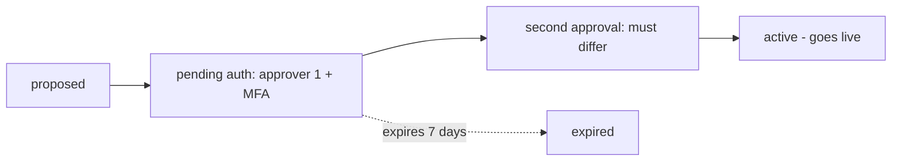

## Thesis

Rules as governed data --- a catalog of rule definitions plus per-tenant subscriptions, evaluated by a generic engine, so changing policy is a data change the engine reads next cycle rather than a code deploy --- and because a live rule change is a high-stakes action, the sensitive ones move through a dual-authorization state machine that requires two **different** approvers, is MFA-gated, blocks self-approval and same-person double-approval, and expires half-approved requests.

## Sub

**Rules as data, not if-statements** -> **the dual-authorization state machine** -> **the four-eyes integrity details** -> **zoom out** to the evaluation cycle and the health rollup, and the pivots an interviewer rides from "an engine, not code" into four-eyes, the same-person subtlety, and why a rule change needs approval at all.

## Spine

- Rules are **data, not code** --- a catalog of rule definitions plus per-tenant subscriptions, so changing policy is a data change the running engine reads next cycle, with no deploy and no release.
- Sensitive changes need **dual authorization** --- a state machine, proposed to pending to second-approval to active, requiring two *different* approvers and gated by MFA.
- The control is real only if it blocks **self-approval and same-person double-approval** --- the second-approval step rejects both the requester and the first approver, or the four-eyes principle is theater.
- Half-approved requests **expire** --- a derived, unambiguous status and a time-box, so nothing lingers pending forever as a security liability.

## Companion Notes

### walk

A rule change under governance

One sensitive change from proposal to live --- through the two-approver state machine and into the engine that evaluates it, no deploy.

Lead with the four-eyes control and its subtlety --- "two different approvers, and the requester can't be the second one." That detail is the whole signal.

### drill

Probe Drill

Graded follow-ups on engine-versus-code, the dual-authorization state machine, and four-eyes integrity --- the ones that separate "a rules engine" from a real governance design.

Name the same-person block explicitly --- blocking self-approval but not same-person double-approval is still theater.

## Drill

SDE2 | the model and the mechanics
SDE3 | the state machine and its integrity
Staff | evaluation, rollup, and org calls

### SDE2 | engine vs if-statements

Why a rules engine instead of if-statements in code?

Because it separates **policy from code**. Rules live as data --- definitions and parameters --- and a generic engine evaluates them, so changing a threshold or adding a rule is a data change, not a code change that needs a pull request, a review, a build, and a deploy. If-statements bury policy in code where every change is a release; an engine makes policy editable at runtime.

### SDE2 | what a rule is

What actually is a rule here?

Two rows. A **catalog** entry defines the rule --- its condition (say, a metric over a threshold), its severity, and a parameter schema. A per-tenant **subscription** enables that rule for a tenant with concrete parameters. The definition is shared; the subscription is what makes it active for a specific tenant with specific numbers.

### SDE2 | change without a deploy

How does changing a rule not require a deploy?

The engine reads the rule rows each cycle, so an edit to a catalog entry or a subscription takes effect on the next evaluation --- no code changed, nothing shipped. That is the whole value proposition: the engine (code) changes rarely and goes through CI/CD; the rules (data) change anytime through an admin path and are live next cycle.

### SDE2 | what dual authorization is

What does dual authorization mean?

A sensitive change can't be enacted by one person --- it requires **two** to approve before it takes effect. The request moves through states (proposed, pending authorization, pending second authorization, active), and only when a second, distinct approver signs off does it go live. It is the "four-eyes principle": two sets of eyes on anything high-stakes.

### SDE2 | why two approvers

Why require two approvers at all?

To remove the single point of failure that is one person. A single compromised, mistaken, or malicious account can otherwise push a sensitive change alone. Requiring a second distinct approver means an attacker needs two accounts, and an honest mistake gets a second look --- the control's entire purpose is that no one actor can act unilaterally on something high-stakes.

### SDE2 | what MFA adds

What does MFA-gating the approval add?

It raises the bar on *who* is approving. An approval is a high-value action, so requiring a TOTP (or equivalent) at the moment of approval means a stolen session or password alone isn't enough to approve --- the approver must prove a second factor right then. Four-eyes stops one actor; MFA makes each of the two harder to impersonate.

### SDE2 | validating a rule change

What stops an invalid rule from being saved?

The rule's own schema. A rule change is validated against the definition's parameter schema before it is written --- a threshold outside its allowed range or a malformed condition is rejected at write time, so the engine never reads an invalid rule. Validation-on-write is what makes rules-as-data as safe as code review makes code.

### SDE3 | the state machine

What is the dual-authorization state machine?

A request advances through explicit states: **proposed** (a draft), **pending authorization** (awaiting the first approver), **pending second authorization** (first approval in, awaiting a different second), and **active** (both in, the change is live) --- with **expired** as a terminal state for requests that time out. Modeling it as a state machine is what makes the current state unambiguous and every transition a place to enforce a rule.

### SDE3 | blocking self-approval

How do you stop someone approving their own request?

An identity check at the approval step: the approver's id must not equal the requester's. If they match, the approval is rejected. It sounds obvious, but without it the whole control collapses --- the person proposing a sensitive change could simply approve it, and two-person integrity would mean nothing.

### SDE3 | the same-person subtlety

What is the subtle failure even with self-approval blocked?

**Same-person double-approval.** If the check only stops the requester from approving, the *first approver* could still be the *second approver* --- one person clicking approve twice, or the requester using a second account they also control as the first approver. The real control rejects the requester and the first approver at the second step, so the two approvers are provably distinct. Miss this and four-eyes is theater.

### SDE3 | why requests expire

Why do half-approved requests expire?

Because a pending sensitive change is a liability. A request approved once but not twice, left open for weeks, is a half-armed action someone could complete later out of context. A time-box (say seven days) auto-expires it, so the fleet is never carrying stale, partially-authorized changes. Expiry keeps the set of live-or-pending changes small and current.

### SDE3 | the derived status

Why compute the request status rather than store it?

So the state is always unambiguous and can't drift. The status is **derived** from the facts --- who has approved, whether the window has passed --- so there's no stored flag to get out of sync with reality. A request is "expired" because its timestamp says so, "pending second" because exactly one distinct approval exists; the state is a function of the record, not a field someone might forget to update.

### SDE3 | which rules run

How does the engine pick which rules to run for a tenant?

It joins the **catalog** to that tenant's **subscriptions** --- the intersection is the tenant's active rule set. A tenant runs only the rules it subscribed to, with its own parameters; a rule in the catalog that a tenant didn't subscribe to is skipped for it. The join is the mechanism that makes one shared engine serve many tenants with different policy.

### SDE3 | the concurrent second approval

Two people approve a pending request at almost the same instant. What could go wrong?

A race: both reads see pending second approval and both try to advance, or a non-atomic check lets the requester slip through as the second approver. The advance must be a conditional, atomic transition --- a compare-and-set on the state together with the distinct-identity check in one transaction --- so exactly one transition to active occurs and concurrency can't bypass the four-eyes rule.

### Staff | engine vs hardcoded

When is a rules engine worth it over hardcoded logic?

When policy changes often, varies per tenant, or must change without a release --- an engine pays for its complexity there. When rules are few, stable, and global, hardcoded logic is simpler and an engine is over-engineering. The trade is flexibility and runtime editability against the indirection and the need to validate rule data as carefully as you'd review code.

### Staff | the evaluation cycle

How does the evaluation cycle run at scale?

On a schedule, the engine loads the active rule set (catalog joined to subscriptions) and the device data, and runs the rules in **sequential passes** by class --- validation, then compliance, then connectivity, then threshold, then alerting --- each pass loading its own rules. Results are written twice: hot current state to a fast store with a TTL, and an append-only history for audit. The passes are ordered so later ones can rely on earlier results.

### Staff | rolling up to health

How do per-item results become a health signal?

By aggregation into a **rollup** --- a view that turns raw per-device pass/fail into a site or fleet status, with a threshold (for example, over 50 percent of a site's devices failing makes the site critical). The dashboard reads the rollup, not the raw results, so the expensive aggregation happens once on refresh rather than on every dashboard load.

### Staff | plain vs CONCURRENTLY

How do you refresh that rollup without stalling dashboards?

A plain materialized-view refresh takes an **exclusive lock** and blocks readers for the whole rebuild --- dashboards stall. Refreshing **CONCURRENTLY** builds the new snapshot alongside the old one and swaps atomically, so readers keep serving the stale-but-valid data throughout. It needs a unique index on the view and the rebuild is slower, but the reader block goes to zero --- the right trade for a dashboard people watch.

### Staff | auditability

Why does a governed system need an audit trail?

Because "who changed this rule, and who approved it" is a question you *will* be asked --- after an incident, in a compliance review. Every rule change and every approval is recorded append-only, so the history is reconstructable and tamper-evident. A governance control without an audit trail can't prove it worked; the trail is what turns "we require two approvers" into something you can demonstrate.

### Staff | when four-eyes is worth it

Four-eyes adds friction. When is it worth it?

When the blast radius of a single bad change is high --- a rule that pages the fleet, a config that touches every device, a security-relevant setting. There, the friction of a second approver is cheap insurance against one actor causing wide damage. For low-stakes, easily-reversible changes it's overkill; the skill is scoping the control to the changes that actually warrant it, not gating everything.

### Staff | reload frequency vs freshness

How quickly does an approved rule change take effect, and what is the knob?

It is live in seconds, not a deploy --- but exactly when depends on how the engine picks up rules. Reloading the active set each evaluation cycle makes it live next cycle; a short cache TTL trades a little staleness for fewer reads. The knob is the reload frequency or TTL: shorter is fresher but hits the store more often, longer is cheaper but a change lags.

## Walk

### Rules are data, not code

```flow
c[rule catalog] -> j[join subscriptions] -> e[engine reads each cycle]
```

A rule is not code --- it's rows. A catalog entry defines the rule and its parameter schema; a per-tenant subscription enables it with concrete values. The running engine reads these rows every cycle, so which rules run and with what parameters is a data question, resolved by a join.

```sql
-- which rules run for a tenant: catalog joined to its subscriptions
SELECT c.rule_id, c.condition, s.params
FROM rule_catalog c
JOIN tenant_subscription s ON s.rule_id = c.rule_id
WHERE s.tenant_id = 7 AND s.enabled;
```

Because the engine reads this each cycle, changing a threshold or adding a rule is an edit to a row --- live on the next evaluation, no deploy. The engine (code) changes rarely and ships through CI/CD; the rules (data) change anytime through a governed admin path.

### A sensitive change enters dual authorization

```flow
p[proposed] -> a[pending auth] -> s[pending second auth] -> v[active]
```

Editing a rule directly would be a single actor changing live policy --- too much power for one person on a high-stakes change. So a sensitive change is a **request** that advances through a state machine: proposed, then pending the first authorization, then pending a distinct second, then active only when both are in.

The state is derived from the facts of the record, not a stored flag, so it's always unambiguous --- and a request that sits half-approved past its window expires, so nothing lingers partially armed.

### Two different approvers, self-approval blocked

```flow
a1[approver 1 + MFA] -> a2[approver 2 must differ] -> v[active]
```

The first approver signs off with MFA. The second approval is where the integrity lives: the approver must be a *different* person, and the check rejects both the requester and the first approver. That is what makes it genuine four-eyes rather than one person clicking twice.

```ts
// four-eyes: the second approver must not be the requester or the first approver
function approveSecond(req, approver) {
  if (approver.id === req.requestedBy)   throw new Error('self-approval blocked');
  if (approver.id === req.firstApprover) throw new Error('same-person double-approval blocked');
  return advance(req, 'active');   // ==two provably distinct approvers, MFA-verified==
}
```

Blocking self-approval alone is not enough --- without the same-person check, the first approver could be the second, and the control is theater. Rejecting both identities at the second step is what makes the two approvers provably distinct.

### The approved rule goes live, no deploy

```flow
v[active rule] -> n[next eval cycle] -> r[evaluated + rolled up]
```

Once active, the rule is just data the engine reads on its next cycle --- no build, no release. The engine evaluates it against the incoming data, writes per-item results, and the rollup turns those into a health signal the dashboard reads.

That is the shape end to end: policy is editable data, high-stakes edits are governed by four-eyes, and the engine picks up the approved change on the next pass. The deploy pipeline is for the engine; the approval workflow is for the rules.

### Model Script

- Frame the engine | "A rules engine separates policy from code. Rules live as data --- a catalog of definitions plus per-tenant subscriptions --- and a generic engine evaluates them, so changing a threshold or adding a rule is a data change the engine reads next cycle, not a code deploy. That's the answer to 'why an engine instead of if-statements.'"
- The governance problem | "But a live rule change is high-stakes --- one person editing policy that touches the fleet. So sensitive changes don't happen directly; they go through a dual-authorization state machine: proposed, pending first approval, pending a distinct second, active. Two different people have to approve before it takes effect."
- The four-eyes integrity | "The subtle, important part is that the two approvers must be provably distinct. Blocking self-approval is obvious, but the real control also blocks same-person double-approval --- the second-approval step rejects both the requester and the first approver. Miss that and four-eyes is theater. It's MFA-gated too, so a stolen session alone can't approve."
- Expiry and status | "Half-approved requests expire on a time-box so nothing lingers partially armed, and the request status is derived from the record --- who approved, whether it timed out --- so the state is always unambiguous and can't drift out of sync."
- Interviewer: "How do you stop someone from just approving their own request?"
- Name the check | "An identity check at the approval step. The approver's id can't equal the requester's, which blocks self-approval; and it can't equal the first approver's, which blocks one person being both approvals. Both checks together are what guarantee two distinct people."
- Land the shape | "So: rules are governed data, evaluated by an engine that resolves a catalog-to-subscriptions join each cycle; sensitive changes go through an MFA-gated, four-eyes state machine that provably requires two distinct approvers and expires stale requests; and the approved rule is live on the next pass with no deploy. The one line is that the engine changes through CI/CD and the rules change through approvals."

## Whiteboard

Sketch the authorization state machine and mark where two distinct approvers are enforced.

### What makes it genuine four-eyes?

Two *provably distinct* approvers --- the second-approval step rejects both the requester and the first approver, not just the requester.

### What happens to a half-approved request?

It expires on a time-box, and its status is derived from the record, so nothing lingers partially armed or ambiguous.



Verdict: two distinct MFA-gated approvers with self- and same-person approval blocked, a derived status, and a time-box --- four-eyes that actually holds.

## System

Zoom out to where the engine and its governance sit.

### Where it sits

Rule catalog: shared rule definitions and schemas
Tenant subscriptions: which rules a tenant runs, with parameters
Authorization workflow: governs sensitive rule changes [*]
Evaluation engine: reads active rules each cycle, evaluates data
Rollup view: turns per-item results into a health signal

### Pivots an interviewer rides

From "an engine, not code" they push on why an engine, how four-eyes is enforced, and how results become a signal.

#### Why an engine instead of hardcoded rules?

-> policy is editable data, changeable without a release
Rules as data mean a threshold change is a row edit the engine reads next cycle, not a code change through CI/CD. It pays off when policy changes often or varies per tenant; for a few stable global rules, hardcoding is simpler.

#### How is two-person integrity actually enforced?

-> reject the requester and the first approver at the second step
Blocking self-approval is not enough; the second-approval check must also reject the first approver, so the two are provably distinct. MFA gates each approval, and a time-box expires half-approved requests.

## Trade-offs

The calls that separate "a rules engine" from a governed one.

### Engine vs hardcoded rules

- Engine: policy is editable data, changeable per tenant without a release, but adds indirection and needs rule data validated like code
- Hardcoded: simplest for few stable global rules, but every change is a deploy and per-tenant variation is painful

Use an engine where policy changes often or varies per tenant; hardcode when the rules are few, stable, and shared.

### Single approval vs dual authorization

- Single: fast, low friction, but one actor can enact a high-stakes change alone
- Dual: no single point of failure and a second look, at the cost of coordination friction

Scope four-eyes to high-blast-radius changes; gating everything is friction without proportional benefit.

### Plain vs CONCURRENTLY refresh

- Plain refresh: simpler, but an exclusive lock blocks readers for the whole rebuild and dashboards stall
- CONCURRENTLY: rebuilds side-by-side and swaps atomically with zero reader block, but is slower and needs a unique index

Use CONCURRENTLY for any view a dashboard reads live; accept the slower rebuild to keep readers unblocked.

## Model Answers

### rules as data | Why an engine, not code

The answer to "why not if-statements."

- Policy is data | key | a catalog plus per-tenant subscriptions
- Change with no deploy | store | the engine reads rows each cycle
- Catalog joined to subs | note | the intersection is a tenant's rule set

### four-eyes integrity | Two provably distinct approvers

The subtle part most answers miss.

- Block self-approval | key | approver id not equal to requester
- Block same-person | store | and not equal to the first approver
- MFA plus expiry | note | gate each approval, time-box the request

## Numbers

Back-of-envelope the evaluation set the join produces and the friction the control adds.

Catalog times tenants is the ceiling; subscriptions make it sparse, so a tenant runs only what it subscribed to. The governance cost is fixed and small --- two approvers on the changes that warrant it.

- rules | Rules in catalog | 50 | 0 | 5
- tenants | Tenants | 500 | 0 | 50
- expiryDays | Expiry (days) | 7 | 1 | 1

```js
function (vals, fmt) {
  var rules = vals.rules, tenants = vals.tenants, expiryDays = vals.expiryDays;
  return [
    { k: 'Evaluation ceiling', v: fmt.n(rules * tenants), u: 'evals', n: 'catalog times tenants if everyone subscribed to everything \u2014 the ceiling the join stays under', over: rules * tenants > 100000 },
    { k: 'Actual at 20% subscribe', v: fmt.n(Math.round(rules * tenants * 0.2)), u: 'evals', n: 'each tenant runs only its subscribed rules \u2014 the catalog-to-subscriptions join is what keeps the real work sparse', over: false },
    { k: 'Sequential passes', v: '5', u: 'engines', n: 'rules run by class in order \u2014 validation, compliance, connectivity, threshold, alerting \u2014 each pass loading its own set', over: false },
    { k: 'Approvers per change', v: '2', u: 'distinct', n: 'four-eyes on a sensitive change: two provably different people, MFA-gated; the friction is the feature', over: false },
    { k: 'Auto-expire after', v: fmt.n(expiryDays), u: 'days', n: 'a half-approved request older than this expires \u2014 so no stale, partially-armed change lingers as a liability', over: false }
  ];
}
```

## Red Flags

What makes an interviewer wince.

### "I'd just put the rules in if-statements"

Then every policy change is a code change --- a pull request, a build, a deploy --- and per-tenant variation is painful.

Store rules as data (a catalog plus subscriptions) and evaluate them with a generic engine, so policy changes without a release.

Note: this misses the entire reason an engine exists.

### "One approver signs off and it goes live"

That leaves a single point of failure --- one compromised or mistaken account enacts a high-stakes change alone.

Require two distinct approvers via a state machine, MFA-gated, for sensitive changes; that's the four-eyes control.

### "Self-approval is blocked, so it's safe"

Blocking only the requester still lets the first approver be the second --- one person, two approvals. That is four-eyes in name only.

Reject both the requester and the first approver at the second-approval step, so the two approvers are provably distinct.

## Opener

### 30s | The one-liner

How I open when asked about a rules engine with governance.

#### What is the shape?

Rules are data --- a catalog plus per-tenant subscriptions --- evaluated by a generic engine, so policy changes without a deploy.

#### What is the high-stakes part?

Sensitive changes go through a dual-authorization state machine: two distinct approvers, MFA-gated, self- and same-person approval blocked.

##### Hooks

Where an interviewer usually pushes next.

- Engine or code? | policy as editable data | trade
- Stop self-approval? | reject requester and first approver | drill
- Half-approved forever? | derived status plus expiry | drill

Foot: two sentences --- rules are governed data, and sensitive changes need two provably distinct approvers.

## Bank

### SCALE | Fifty rules across five hundred tenants

Task: argue the engine stays cheap and per-tenant.
Model: catalog times tenants is the ceiling, but the catalog-to-subscriptions join keeps each tenant to its subscribed rules, so the real work is sparse; rules run in sequential passes by class.
Int: how does one engine serve different tenant policy?
The join --- each tenant's active set is the catalog intersected with its own subscriptions and parameters.

### DESIGN | Govern a high-stakes config change

Task: design so no single actor can enact it.
Model: a dual-authorization state machine --- proposed to pending to distinct-second to active --- MFA-gated, blocking self- and same-person approval, with a derived status and a time-box expiry.
Int: how do you guarantee the two approvers are different people?
Reject both the requester and the first approver at the second step, so the pair is provably distinct.

### Extra Curveballs

### CURVEBALL | dashboards | The health rollup refresh is stalling dashboards --- fix it?

Model: the plain materialized-view refresh takes an exclusive lock and blocks readers for the whole rebuild; refresh CONCURRENTLY instead, which builds a new snapshot side-by-side and swaps atomically, so readers keep serving throughout --- needs a unique index on the view, and accepts a slower rebuild for zero reader block.

### Frames

- Rules are data, not code --- change without a deploy
- Four-eyes is real only if the two approvers are provably distinct
- Govern the high-blast-radius changes, not everything
