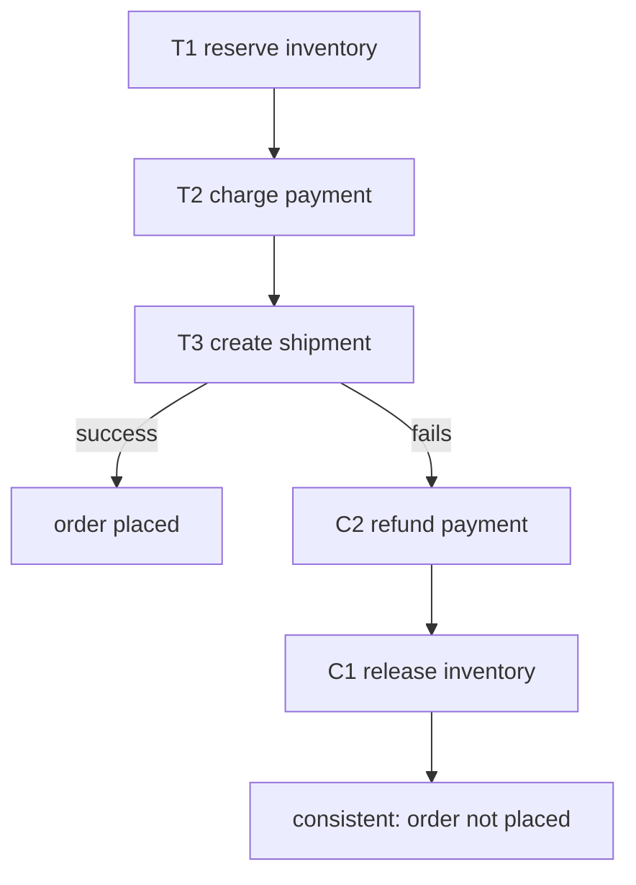

## Thesis

Managing a transaction that spans multiple services --- where you can't hold one ACID transaction across service boundaries --- by breaking it into a sequence of local transactions, each with a compensating action that semantically undoes it, so that if a later step fails you run the compensations in reverse to unwind the work --- trading atomicity for eventual consistency, because a distributed lock across services (two-phase commit) doesn't scale.

## Sub

**Why: no ACID across services, and 2PC doesn't scale** -> **the saga: local transactions plus compensations** -> **choreography vs orchestration** -> **zoom out** to eventual consistency, semantic rollback, and the pivots an interviewer rides from "one transaction spanning services" into compensations, the two coordination styles, and failure handling.

## Spine

- You **can't hold one ACID transaction across services** --- each service owns its own database, so "reserve inventory, charge the card, create the shipment" spanning three services has no shared transaction, and two-phase commit (2PC) to coordinate them holds locks across the network and doesn't scale (blocking, a coordinator SPOF).
- A **saga** is a sequence of local transactions with compensations --- each step commits locally and signals it's done; if a later step fails, you run the **compensating actions** for the completed steps in reverse to semantically undo them (refund the charge, release the inventory), reaching a consistent end state without a global lock.
- Coordination is either **choreography or orchestration** --- choreography has each service react to events and emit the next (decentralized, no coordinator, but the flow is implicit and hard to follow); orchestration has a central coordinator that tells each service what to do and handles failures (explicit and traceable, but a component you must build and own).
- Sagas trade **atomicity for eventual consistency** --- there's no isolation (intermediate states are visible), and compensations must be idempotent and may not perfectly reverse side effects, so you design for the messy middle (semantic rollback, not a clean database rollback) --- the cost of transactions that cross service boundaries.

## Companion Notes

### walk

One transaction across many services

A workflow that spans service boundaries with no shared database --- why you can't use one ACID transaction or 2PC, how a saga chains local transactions each with a compensating undo, what happens when a step fails, and how choreography and orchestration coordinate it.

Say the constraint first --- "there's no ACID transaction across services." Everything else (compensations, the messy middle, eventual consistency) follows from giving up the global lock and unwinding with semantic undos instead.

### drill

Probe Drill

Graded follow-ups on compensations, the two coordination styles, isolation, and failure handling --- the ones that separate "just use a distributed transaction" from designing a workflow that stays consistent across services without a global lock.

Name the shape: local transactions forward, compensating transactions in reverse on failure -- a semantic undo reaching a consistent end state, not a clean rollback, because there's no isolation and no shared transaction.

### wb

Whiteboard

Rebuild the whole saga from memory --- the forward chain, the compensation path, and the machinery that makes both survive a crash.

Draw the two rows first --- T1, T2, T3 across the top and C1, C2, C3 underneath, arrows going the other way. Everything else (idempotency, the outbox, the saga log, the semantic lock) hangs off that picture.

### sys

System Map

Zoom out: a saga sits wherever one business operation crosses a service boundary that a database transaction cannot.

Lead with the constraint, not the pattern --- "there is no transaction across these services" --- and let the compensations, the coordination style, and the missing isolation fall out of it.

### trade

Trade-offs

The calls they drill --- saga vs 2PC, choreography vs orchestration, compensate backward vs retry forward, build vs buy the coordinator --- each with the condition that flips it.

Never defend a saga as universally right. Say "pick when": name the constraint (how much isolation the business truly needs, how many steps, how long-running) that forces the choice.

### model

Model Answers

Full spoken scripts --- the beats, in order, the way you would actually say them under time pressure.

Steal the frame, not the words. Headline first ("no ACID across services, so local transactions plus compensations"), then the one risk you would name unprompted --- a timeout is not a failure.

### num

Numbers

Back-of-envelope how often a saga must compensate, what the orchestrator's state store costs, and how many sagas land on a human every day.

Lead with the compounding: failure probability compounds with step count, so more steps means more compensation --- and at real volume, "compensations sometimes fail" is a staffed daily job, not a footnote.

### rf

Red Flags

What sinks the round --- "we'll roll back the previous steps," "we retry the whole saga," an in-memory orchestrator --- and the line that flips each one.

Name what the interviewer hears. "We would retry the saga from the beginning" is heard as "would double-charge the customer," and that is the fastest no-hire in the room.

### open

30-Second

The opener and the close --- matched to the altitude the question is asked at.

Match the altitude: open on the constraint (no ACID across services), not on the word "saga," and land on the messy middle --- idempotency, the outbox, the missing isolation --- as the real hard parts.

## Drill

all | All three tiers, mixed --- the way a real loop actually comes at you.
SDE2 | the model and the two styles
SDE3 | compensations, isolation, and state
Staff | countermeasures, the spectrum, and failure

### SDE2 | what a saga is

What is a saga and what problem does it solve?

A saga is a way to manage a transaction that spans multiple services, implemented as a **sequence of local transactions**, where each step commits in one service and, if a later step fails, previously-completed steps are undone by running their **compensating transactions**. The problem it solves: in a microservices system each service owns its own database, so a business operation touching several services (place an order = reserve inventory + charge payment + create shipment) can't be wrapped in a single ACID transaction --- there's no shared transactional boundary. A saga gives you a way to keep that multi-service operation consistent (all steps complete, or completed steps get undone) without needing one global transaction across all the services.

Follow: Suppose those three services all happen to share one Postgres. Do you still want a saga?
No --- and reaching for one anyway is a real mistake. If the whole operation fits inside one transactional boundary, a plain local ACID transaction is strictly better: you get true atomicity *and* isolation for free, and the saga would add compensations, idempotency, and eventual consistency for nothing. A saga is a **workaround for a broken transaction boundary**, not an upgrade to one. If a design proposes a saga across tables in a single database, the correct answer is `BEGIN` / `COMMIT`.
Follow: You said a saga gives you atomicity. Does it give you the rest of ACID?
It gives you **A, C and D --- but not I**. Each step's local transaction is atomic, consistent and durable on its own, and the saga as a whole is "atomic" only in a weakened, *semantic* sense: it ends either fully committed or fully compensated, never in an undefined middle. What you lose is **isolation** --- the intermediate states are genuinely committed and visible to everyone else. So a saga is **ACD**, and essentially every hard saga problem (dirty reads, lost updates, overselling, the customer who sees a charge appear and vanish) descends from that one missing letter.
Senior: Framing the saga as a *consequence of the broken transaction boundary* rather than a pattern you reach for --- and naming what it **costs** (isolation) in the same breath as what it buys (scale) --- is what separates a Staff answer from a memorized definition.
Speak: Lead with the constraint, not the pattern: **"each service owns its own database, so no transaction spans them."** Then the shape --- a sequence of local transactions, each with a compensating transaction, so a failure at step 3 is unwound by running C2 then C1. Then say the price out loud: **ACD without the I.**

### SDE2 | why not 2PC

Why not use a distributed transaction (two-phase commit) across the services?

Because 2PC doesn't scale and hurts availability. In two-phase commit, a coordinator asks all participants to "prepare" (locking their resources), then tells them all to "commit" --- which means **resources stay locked across the network for the whole duration**, so a slow or failed participant blocks everyone, throughput collapses under contention, and the coordinator is a single point of failure whose crash can leave participants stuck holding locks ("in-doubt"). It also requires every participant to support the distributed-transaction protocol (many databases/services don't). For a high-throughput microservices system, holding cross-service locks is a non-starter --- so sagas deliberately give up the global lock (and thus atomic isolation) in exchange for scalability and availability, coordinating with local transactions and compensations instead.

Follow: You keep blaming the coordinator. Doesn't a Paxos/Raft-replicated coordinator (or 3PC) fix that?
Partly --- and not enough to change the answer. Replicating the coordinator (which is essentially what Spanner does) genuinely removes the **single point of failure**, and 3PC adds a pre-commit phase to make it non-blocking --- but only under a *synchronous* network with reliable failure detection, which is why almost nobody runs 3PC. Crucially, neither removes the actual cost: **participants still hold locks from prepare to commit**, so cross-service latency and contention still multiply into a throughput collapse, and every participant still has to implement the protocol. The coordinator was never the whole problem --- the **held locks** are.
Follow: So is 2PC ever the right answer?
Yes --- when the participants are **few, close and low-latency**, and the business genuinely cannot tolerate a visible intermediate state: two databases behind a single service, an XA transaction across a database and a broker in the same datacenter, a ledger transfer where a half-state is unacceptable. The heuristic is that **2PC scales *down*** (few, close, strict) while **sagas scale *out*** (many, far, tolerant). And check whether your stack can even play: Kafka and most NoSQL stores don't speak XA, so for a typical microservices system the choice is frequently made for you.
Senior: Not stopping at "2PC is slow." Naming that the **locks are held across the network from prepare to commit**, that a coordinator crash strands participants **in-doubt still holding them**, and that most modern datastores don't even implement the protocol --- and then *still* being able to say when 2PC is right --- is the difference between a slogan and a judgment.
Speak: One sentence carries the whole objection: **"2PC holds locks across the network from prepare to commit."** A slow participant blocks everyone, contention collapses throughput, and a coordinator crash leaves participants in-doubt still holding locks --- and half your stack (Kafka, most NoSQL) can't participate anyway. So you give up the global lock, and you pay for it in lost isolation.

### SDE2 | what a compensating transaction is

What is a compensating transaction?

An operation that **semantically undoes** the effect of a completed saga step. Each forward step (T1: charge the card) has a paired compensation (C1: refund the card) that reverses its business effect. If the saga fails partway, you run the compensations for the steps that already committed, in reverse order, to bring the system back to a consistent state. Crucially it's a *new* transaction that counteracts the original --- not a database rollback (the original already committed and is visible). So "refund" not "un-charge," "release the reserved inventory" not "un-reserve." Every step that has a visible side effect needs a compensation defined, and designing those compensations (what does it mean to undo this?) is much of the work of building a saga.

Follow: Give me a compensation that is genuinely hard to write, and tell me what you'd actually do.
"Send the customer an email," or "hand the parcel to the courier." There is no un-send and no un-ship --- the effect has **left your system**. So the compensation stops being a data operation and becomes a **business process**: a correction email ("we're sorry, your order was cancelled"), a recall request to the carrier, a return label, a refund. But the real engineering move is upstream of that: **don't put an irreversible step where it might need compensating.** You order the saga so the irreversible steps run *last* --- after the point of no return --- so nothing that can fail runs after them.
Follow: Does every step need a compensation?
No --- and knowing which don't is the design. A step needs one only if it has an externally visible effect **and** a step that can fail runs after it. That splits the saga into three parts: the **compensatable** steps at the front (undo-able, and these are the only ones you write compensations for), the **pivot** transaction --- the go/no-go point, past which the saga is committed to going forward --- and the **retriable** steps after it, which are designed so they *cannot* fail for a business reason and are simply retried forward until they succeed. So you write compensations only for the compensatable prefix, which is exactly why you order the steps to make that prefix short and genuinely reversible.
Senior: "A compensation is a semantic undo, not a rollback" is table stakes. The Staff move is the very next sentence: **structure the saga into compensatable steps, a pivot, then retriable steps** --- so the set of things you must undo is small and truly reversible. Design the workflow to *shrink the compensation surface*; don't just write an undo for whatever order the steps happened to land in.
Speak: **"A compensation is a new transaction that semantically undoes a committed one --- refund, not un-charge."** Then the sharp bit: some effects can't be undone at all --- an email is sent, a parcel is on a van --- so you *order* the saga: compensatable steps first, then the pivot (the point of no return), then only steps you can retry forward. You write compensations for the prefix, not for everything.

### SDE2 | the happy path

Walk through the happy path of a saga.

Each step runs as a local transaction and, on success, triggers the next. For an order: **T1** reserve inventory (commits in the inventory service), which triggers **T2** charge the payment (commits in the payment service), which triggers **T3** create the shipment (commits in the shipping service), which completes the saga. Each service commits its own local transaction independently and durably; there's no shared lock, and each step's success is what advances the flow (via an event it emits, or the orchestrator calling the next service). The saga is complete when the final step commits. On the happy path it just looks like a chain of local transactions across services, each one moving the workflow forward.

Follow: What actually triggers T2 --- how does the saga know T1 finished?
In **orchestration**, the orchestrator invoked T1, got the result back, durably recorded "step 1 complete," and then issues T2's command. In **choreography**, T1's service publishes an `InventoryReserved` event and the payment service is subscribed to it. Either way, the load-bearing detail is the same and it's invisible in the diagram: **"T1 committed" and "the world was told T1 committed" must be atomic.** If they're two separate writes, a crash between them leaves the saga stalled --- the inventory is reserved and *nobody is driving the flow forward*. That's the dual-write problem, and the transactional outbox is the fix.
Follow: What if a step is slow rather than failed --- the charge takes 40 seconds and your timeout is 30?
Then you have an **unknown, not a failure** --- and this is the single most dangerous moment in a saga. If you treat the timed-out charge as failed and compensate, you may refund a charge that never happened, or the charge lands *after* your refund and you're inconsistent with real money. So on a timeout you do one of two things: **retry the same idempotent command** (safe, because the `(saga_id, step_id)` key dedupes, so you either get the original result or you finally get an answer), or **query the participant for that step's status** and reconcile. You compensate **only on a definite failure**. Designing every participant so its step status is queryable by saga id is what turns an unknown back into a known.
Senior: Recognizing that **a timeout is an unknown, not a failure**, and refusing to compensate until the outcome is *definite* --- via an idempotent retry or a status query --- is the instinct that separates someone who has actually operated a saga from someone who has only drawn one.
Speak: Narrate the chain, then name the invisible part: **"each step commits locally and, on success, advances the flow --- the orchestrator records 'done' and issues the next command, or the service publishes an event the next one consumes."** Then the part people miss: **"committed" and "the world knows it committed" have to be atomic**, or the saga stalls with the work done and nobody driving it.

### SDE2 | what happens on failure

What happens when a step in the saga fails?

You **run the compensating transactions** for the steps that already succeeded, in reverse order, to unwind the work. If T3 (create shipment) fails after T1 (reserve inventory) and T2 (charge payment) committed, the saga executes C2 (refund the payment) then C1 (release the reserved inventory), leaving the system in a consistent "order not placed" state --- the money is refunded and the inventory is freed. So instead of a global rollback (which you can't do --- the local transactions already committed), you compensate forward: each completed step gets its business effect reversed by a new transaction. The end state is consistent, but note it was reached by *doing more work* (the compensations), not by undoing --- and there was a window where intermediate state (a charge that's about to be refunded) was visible.

Follow: Why *reverse* order? Does the order of compensations actually matter?
It matters whenever the steps have **dependencies**, which is most of the time. If T1 created the order record and T2 attached a payment to it, running C1 (cancel the order) before C2 (refund the payment) leaves the refund pointing at a record that no longer exists --- or fails outright. Reverse order is the safe default for the same reason a call stack unwinds in reverse: **each compensation runs while the state its step depended on still exists.** Where steps are genuinely independent you *can* compensate in parallel, and people do for latency --- but reverse-sequential is the default precisely because it's the order that's always correct.
Follow: You compensate, so "nothing happened." What does the customer actually see?
Not "nothing." They may watch a pending charge appear and then disappear, or see a charge-and-refund pair on their statement, and any downstream process that read the intermediate state already acted on it. That's the honest answer: the saga reaches a consistent **end state**, but it got there by **doing more work, visibly** --- not by rewinding. The design consequence is concrete: you model the record and the UI for a **pending** state --- "order pending," not "order placed" --- so nothing downstream (and nobody looking at a screen) treats an intermediate state as final. That's precisely what a semantic lock is.
Senior: Being precise that the end state is reached by **forward-executing new transactions** --- more work, visible to the customer --- and then converting that into a design consequence (**model the record as `PENDING`** so nothing downstream treats the intermediate state as final). A candidate who says "we roll back the previous steps" has not understood the pattern.
Speak: **"You can't roll back --- those local transactions already committed. You run the compensations for the completed steps, in reverse order."** T3 fails, so C2 refunds and C1 releases, landing on a consistent "order not placed." Then say the uncomfortable part: the customer may see the charge appear and vanish. It's a consistent end state, reached by doing *more* work.

### SDE2 | choreography vs orchestration

What are the two ways to coordinate a saga?

**Choreography** and **orchestration**. In *choreography*, there's no central coordinator --- each service listens for events and reacts: inventory-reserved -> payment service charges -> payment-charged -> shipping service ships, each step emitting an event the next one consumes. The logic is distributed across the services. In *orchestration*, a central **orchestrator** (a saga coordinator) explicitly drives the flow: it calls inventory, then calls payment, then calls shipping, and on failure it invokes the compensations --- the workflow logic lives in one place. Choreography is decentralized and loosely coupled but the overall flow is implicit (spread across event handlers, hard to follow); orchestration centralizes the flow (explicit, easy to see and change) at the cost of building and owning the coordinator. It's the core design choice when implementing a saga.

Follow: It's a 3-step saga today, and it'll be 9 steps in a year. Which do you pick *now*?
**Orchestration** --- and I'd pick it now rather than migrate later, because choreography's cost is not linear. At 3 steps the implicit flow is fine. At 9, it's an event chain nobody can hold in their head, "where is order 123" has no answer, and adding a step means editing subscriptions across several teams' services. And the migration *out* of choreography is painful for exactly the reason you'd want to leave: the workflow logic has been **smeared across the services** and has to be extracted from them. If I genuinely knew it would stay at three simple steps forever, choreography is less machinery --- but the direction of travel is almost always "more steps."
Follow: Doesn't a central orchestrator recreate the coupling you were trying to avoid?
It centralizes **workflow knowledge**, which is a real cost --- but it's a different, better-behaved coupling than the one that hurts. The failure mode to watch for is **business logic leaking into the orchestrator**: it starts deciding *whether* to charge, not just *when*, and becomes a god service that every team has to change. You prevent that by keeping it a **dumb sequencer** --- it knows the order of the steps and their compensations, and nothing about pricing, tax, or eligibility, which stay in the services. The services keep autonomy over *what* they do; the orchestrator owns only *when*. And that coupling is the one you actually *want* centralized, because a workflow nobody can see is worse than one that lives in a named place.
Senior: Naming orchestration's real failure mode --- **business logic leaking into the orchestrator until it's a god service** --- and the discipline that prevents it (the orchestrator is a dumb sequencer; the services own the decisions) shows you have lived with one, rather than knowing the two boxes on the slide.
Speak: **"Choreography: services react to events and emit the next --- no coordinator, but the flow is implicit. Orchestration: a central coordinator drives the steps and the compensations --- explicit and observable, but it's a component you own."** Then commit: few simple steps, choreography; complex or failure-heavy, orchestration --- and keep the orchestrator a **dumb sequencer** so business logic doesn't leak into it.

### SDE2 | an example

Give a concrete example of a saga.

**Order placement** across three services. Happy path: reserve inventory (inventory service), charge the card (payment service), create the shipment (shipping service) --- order placed. Failure: if creating the shipment fails (no carrier capacity), compensate --- refund the card, release the reserved inventory --- so the customer isn't charged for an order that can't ship. Another classic is **travel booking**: book flight, book hotel, book car; if the car booking fails, cancel the hotel and cancel the flight. In both, each booking/charge is a local transaction in its own service, and each has a compensation (cancel/refund/release). These are natural sagas because the operation genuinely spans independent services, each with its own database, and a failure partway needs to undo the parts that succeeded.

Follow: In your order example, what is the *right order* for those three steps, and why?
Cheapest and most reversible first; irreversible last. **Reserve inventory** first --- it's trivially released and costs nothing to undo. **Charge the card** next --- compensatable, but a refund is visible to the customer and costs you payment fees. **Create the shipment** last --- once a parcel physically moves it's the closest thing to a point of no return. Flip that order and an inventory failure would force you to un-ship, which you can't. The general rule: order the steps so the **compensatable prefix is short and cheap**, and the **pivot** --- the step past which you're committed --- comes as late as you can push it.
Follow: Travel booking: flight, hotel, car. The car fails, you cancel the hotel --- and the hotel charges a cancellation fee. Is your compensation still "correct"?
It is **semantically correct and economically lossy** --- and that is the honest character of every real compensation. The system reaches a consistent end state (nothing booked), but the undo wasn't free: a fee, a visible charge-and-refund, a burnt inventory hold. So the design responses are: **reserve rather than commit** where the provider supports it (a *hold*, not a booking --- which is exactly TCC's Try phase), **order the expensive-to-undo step last**, and **price the residual loss** where you can't avoid it. Pretending compensation is free is the mistake; engineering so that it's *cheap* is the job.
Senior: Using the example to expose the **ordering principle** (cheap-and-reversible first, irreversible last) and being honest that compensation has a **real economic cost** --- fees, visible refunds, burnt holds --- so the goal is to make the compensatable prefix short and cheap, not merely to have *an* undo for every step.
Speak: Ground it fast: **"place an order = reserve inventory, charge the card, create the shipment --- three services, three databases."** Shipment fails, so you refund then release. Then add what makes it a *design* rather than a diagram: the order of the steps isn't arbitrary --- **cheap and reversible first, irreversible last** --- so the part you might have to undo stays short and cheap.

### SDE3 | choreography in depth

How does choreography work, and what are its trade-offs?

Each service publishes **events** on completion, and other services subscribe and react --- the saga is the emergent result of this event chain, with no central controller. *Pros:* decoupled (services only know about events, not each other), no coordinator to build or scale, naturally resilient (no central SPOF). *Cons:* the overall workflow is **implicit and hard to understand** --- to know "what happens when an order is placed" you have to trace events across many services' handlers; it's easy to create cyclic dependencies or hard-to-follow flows; adding a step means touching multiple services and their event subscriptions; and **observability/debugging is hard** (the flow isn't in one place, so tracing a stuck or failed saga means correlating events across services). Choreography shines for simple sagas with few steps where the decoupling is worth the diffuse logic, but gets unwieldy as the workflow grows.

Follow: Concretely, what breaks *first* as a choreographed saga grows?
The answer to **"where is this order?"** --- because there is no component that knows. Then, close behind: **cyclic event dependencies** (A's event triggers B, whose event triggers A) that nobody designed and nobody can see; **accidental participation** (some other team subscribes to `PaymentCharged` for their own reasons and is now silently a step in your saga); and **change amplification** (inserting a step means editing publishers and subscribers across several services). But the load-bearing symptom is the first one: the day support asks "why is order 123 stuck" and the honest answer is "we'd have to grep four services' logs," choreography has exceeded its budget.
Follow: How would you rescue an existing choreographed saga without a rewrite?
Rebuild the missing centre **without centralizing control**. Propagate a **saga / correlation id** on every event, then add a **saga-tracking consumer**: a service that subscribes to all of the saga's events purely to *record* each instance's progress and answer "order 123 is at step 3, waiting on payment." That gives you the observability an orchestrator has for free, with **no change to the flow itself** --- so it's a genuinely good, low-risk intermediate step. It is also, notably, the moment many teams realize they have now built half an orchestrator and decide to finish the job.
Senior: Naming the **specific** failure --- not "it's harder to debug," but "**no component knows where a saga is**, so 'why is order 123 stuck' has no answer" --- and offering the surgical rescue (correlation id + a saga-tracking consumer, no flow change) shows you have operated one rather than compared bullet points.
Speak: **"The saga is emergent --- nobody owns it."** That's the whole trade: no coordinator to build, no SPOF, real decoupling --- and no place that knows where any given saga *is*. Then give the operational tell: the day support asks "why is order 123 stuck," the bill comes due --- and the fix is a **correlation id plus a saga-tracking consumer**.

### SDE3 | orchestration in depth

How does orchestration work, and what are its trade-offs?

A central **orchestrator** holds the workflow definition and drives it: it invokes each service in turn (usually via commands/requests), receives the results, decides the next step, and on failure invokes the compensations in order. The saga's logic lives in one place. *Pros:* the workflow is **explicit and centralized** (easy to see, reason about, and change the sequence and failure handling), straightforward to add steps, and much easier to monitor and debug (the orchestrator knows the current state of each saga). *Cons:* the orchestrator is a **component you must build, deploy, and make reliable** (it needs durable state so it can resume after a crash --- typically implemented as a persistent state machine); it can become a point of coupling (services' logic can leak into it) and a bottleneck/SPOF if not designed for HA. Orchestration is generally preferred for complex sagas (many steps, intricate failure handling) because the explicit, observable, centralized flow outweighs the cost of owning the coordinator.

Follow: You said the orchestrator needs durable state. What exactly do you persist, and *when*?
Per saga instance: the **saga id**, the **workflow definition and its version**, the **current step**, which steps have **completed** (with their results, if later steps need them), and whether it is **compensating**. You persist on **every transition** --- and specifically you persist *"I am about to invoke step 3"* **before** you invoke it. That ordering is the whole trick: if you crash after the service commits but before you record its result, recovery must know step 3 may be **in flight**, so it re-issues the idempotent command and reconciles rather than skipping it. **Persist, then act**, and let the idempotency key absorb the re-issue. Persisting only *after* the result is the classic bug --- a crash loses the fact that you ever dispatched it.
Follow: How do you deploy a change to the workflow when 50,000 sagas are mid-flight?
You **version the workflow definition** and pin each saga instance to the version it started on, so in-flight sagas run to completion on the shape they began with and only new sagas get the new one. The alternative --- mutating the definition under running instances --- means a saga that completed step 3 of the *old* flow suddenly faces a different step 4, or a compensation that no longer matches the step it's meant to undo. This is precisely what workflow engines exist to handle (Temporal's versioning, versioned Step Functions state machines), and it's one of the strongest build-vs-buy arguments: **long-running workflows outlive your deploys**, so the migration story is a first-class requirement, not an afterthought.
Senior: Two details that only come from having run one: **persist-then-act** (record "about to dispatch step N" *before* dispatching, so a crash can't lose an in-flight command), and **versioning the workflow definition** so a deploy doesn't mutate 50,000 in-flight sagas. Neither is ever in a slide-deck answer.
Speak: **"The orchestrator is a durable, crash-recoverable state machine --- that's the whole job."** The workflow logic is easy; surviving a crash without losing or duplicating a saga is the engineering. Persist on every transition, persist **before** you dispatch, make every command idempotent so recovery can safely re-issue --- and **version the workflow**, because sagas outlive your deploys.

### SDE3 | compensations aren't perfect rollbacks

Why aren't compensating transactions the same as a rollback?

Because the original transaction **already committed and its effects were visible** --- you can't un-happen it, you can only counteract it with a new action, and that counteraction may not perfectly erase all side effects. Refunding a charge leaves a charge-then-refund pair on the statement (visible), not a clean slate. Worse, some effects **can't be undone at all**: an email was sent, a physical item shipped, an external API triggered --- the compensation can only do the best *semantic* reversal (send an apology/correction email, initiate a return), not remove the effect. And anything that happened *because* of the intermediate state (another process read the not-yet-refunded charge and acted on it) isn't reversed by your compensation. So compensations are **semantic undos**, not transactional rollbacks: you design them to reach a business-consistent end state, accepting visible intermediate states and irreversible side effects as inherent to the pattern.

Follow: If some effects can't be undone, is the saga's "atomicity" just a lie?
It's a **weaker but honest** atomicity, and the precise phrasing matters in an interview. The saga guarantees the system ends in one of two **defined** states --- fully completed, or fully compensated --- and never in an undefined middle. It does **not** guarantee the world is as if nothing happened; that's unachievable once effects escape your systems. So call it **semantic atomicity**: the saga always terminates in a consistent *business* end state. Claiming a saga gives you real ACID atomicity is a red flag; saying "it always reaches a defined, consistent end state --- which may include a refunded charge and an apology email" is correct.
Follow: What about the process that read the intermediate state and acted on it? Your compensation never reaches it.
Correct --- and that's the **missing-isolation** problem, not a compensation problem. A compensation undoes *your* step; it cannot undo decisions *other* actors made from the state your step made visible. Every mitigation is therefore about **not letting the intermediate state look final**: a **semantic lock** (the record is marked `PENDING`, so a reader knows not to treat it as committed), and where you can't do that, choosing consumers that are *tolerant of reversal* (an eventually-consistent read model that will also see the compensation). If a downstream decision is genuinely irreversible **and** depends on your intermediate state, that's a signal the step ordering is wrong --- or that this operation shouldn't be a saga.
Senior: Distinguishing the **two different holes**: effects that *escaped the system* (can't be undone, only semantically corrected) and decisions *others made from your visible intermediate state* (your compensation never reaches them at all --- only a semantic lock helps). Lumping both under "compensations are imperfect" is the shallow answer.
Speak: **"The original committed and was visible --- you can't un-happen it, only counteract it."** So a refund lands as a charge-then-refund pair, an email that's gone is gone --- and anything that *read* the intermediate state and acted on it isn't touched by your compensation at all. A saga promises a consistent **end state**, not a rewind.

### SDE3 | idempotency in sagas

Why do saga steps and compensations need to be idempotent?

Because the messaging and coordination are unreliable, so steps and compensations **will sometimes run more than once**. An orchestrator might crash after a service commits but before recording that it did, then retry the same step on recovery; a choreography event might be delivered twice; a compensation might be re-issued after a timeout when it actually succeeded. If "charge the card" isn't idempotent, a retry double-charges; if "release inventory" isn't idempotent, a retry over-releases. So every step and every compensation must be safe to apply repeatedly with the same effect as applying it once --- typically via an idempotency key (the saga id + step) that lets the service detect and ignore a duplicate. Idempotency is not optional in a saga; the at-least-once nature of the coordination guarantees duplicates, so correctness depends on each operation absorbing them.

Follow: What exactly *is* the idempotency key for a saga step? Be specific.
`(saga_id, step_id)` --- the identity of the **logical operation**, never of the attempt. The participating service records that key with a **conditional write in the same local transaction as the effect**, so a re-issued command finds the key present and **returns the original result** instead of re-executing. Two details people get wrong: the key must **not** include an attempt number or retry counter (if it did, every retry would be a fresh key and dedupe nothing --- the "random UUID" bug in a different costume), and the service must return the **stored result**, not merely "already done," because the orchestrator may have crashed before it recorded what step 3 returned.
Follow: The service records the key and performs the effect. What if those are two different systems --- the charge is at Stripe, the key is in your database?
Then you cannot make them atomic yourself, so you use **the provider's own idempotency mechanism**: pass your `(saga_id, step_id)` as *their* idempotency key --- Stripe and most payment APIs support exactly this --- and they guarantee a second identical request returns the first result rather than charging twice. Where a provider offers nothing of the sort, you fall back to **record-intent-then-act**: durably write "about to charge, key K" *before* calling, and on recovery **query the provider by K** to find out whether it landed. You're converting an un-closable dual-write into a **reconcilable** one --- you may not know immediately, but you can always find out.
Senior: Being specific that the key is `(saga_id, step_id)` --- the **logical operation, never the attempt** --- and then handling the case the diagram hides: when the effect lives at a **third party**, you either use *their* idempotency key or you record-intent-then-reconcile-by-query. That's the gap between knowing the word "idempotent" and having shipped one.
Speak: **"The coordination is at-least-once, so every step and every compensation *will* run more than once --- idempotency isn't optional."** Key it on `(saga_id, step_id)` --- the logical operation, not the attempt --- recorded with a **conditional write in the same local transaction as the effect**. And when the effect is at a third party, pass that same key as *their* idempotency key.

### SDE3 | lack of isolation

Sagas lack the "I" in ACID --- what does that cause?

Because there's no global transaction, **intermediate states are visible to other operations** (no isolation), which creates anomalies. A concurrent saga or query can see a partial result: it can read data a saga will later compensate away (a *dirty read* --- e.g. seeing a balance that reflects a charge that's about to be refunded), or a saga can act on data another saga changed mid-flight (*lost updates*), or re-read and see different values (*non-repeatable reads*). Classic example: saga A reserves the last item and is about to fail-and-compensate; saga B reads inventory, sees it's taken, and rejects a customer --- but A then releases it, so B rejected them unnecessarily. Sagas are **ACD without I**: atomic (via compensation), consistent, durable --- but not isolated. You must either tolerate these anomalies or add explicit countermeasures (semantic locks, etc.), which is the staff-level concern.

Follow: Name the anomalies precisely, with a saga example of each.
**Lost update** --- two sagas read the same record and both write; one silently overwrites the other, and a later compensation may undo a value the *other* saga set (two sagas adjusting a customer's balance concurrently). **Dirty read** --- saga B reads state that saga A committed but will later compensate away (B sees the charge that's about to be refunded and reports the customer as having paid). **Non-repeatable / fuzzy read** --- saga A reads a record at step 1 and again at step 4 and gets different values because B changed it in between (A validates a price, then charges the *new* one). They are exactly the anomalies a database's isolation levels exist to prevent --- you've simply lost the database's help, because the transaction now spans systems it doesn't control.
Follow: Which anomaly actually hurts most in practice, and what's the cheapest fix?
**Lost updates** --- because dirty and fuzzy reads are usually *stale but self-correcting*, whereas a lost update **silently destroys data**. And the cheapest fix is emphatically **not** a lock: make the dangerous write **atomic and conditional at the store** --- `UPDATE inventory SET available = available - 1 WHERE sku = ? AND available > 0` instead of read-modify-write, or an optimistic **version check** (compare-and-set) so a concurrent write is *detected and retried* rather than clobbered. That single change kills the oversell and the lost update with **no cross-service coordination at all**. Semantic locks are the next tool up, and you reach for them only where a *visible* intermediate state causes a wrong decision --- because they cost you availability.
Senior: Naming the anomalies by their real names (**lost update / dirty read / non-repeatable read**) *and* knowing the cheapest fix is an **atomic conditional update at the store**, not a lock. Reaching for a distributed lock to stop an oversell is precisely the reflex a saga is supposed to have trained out of you.
Speak: **"A saga is ACD without the I --- the intermediate states are committed and visible."** So you get the classic anomalies: lost updates, dirty reads of state you're about to compensate away, non-repeatable reads. Then give the fix in the same breath: guard the dangerous writes with an **atomic conditional update** (`decrement WHERE available > 0`), and reach for a semantic lock only where a *visible* intermediate state would cause a wrong decision.

### SDE3 | a failing compensation

What happens if a compensating transaction itself fails?

This is a serious case, because compensations are the safety net --- if C2 (refund) fails, the saga can't cleanly reach a consistent state. The standard answer: compensations must be **retried until they succeed** (they're designed to be idempotent and, ideally, cannot fail for business reasons --- a refund should always be *possible*), backed by durable state so the retry survives crashes. If a compensation genuinely can't complete after retries (a downstream service is down), the saga is **stuck** and typically escalates: it's flagged for human intervention / alerting, moved to a dead-letter/manual-resolution queue, and the incident is handled operationally. The design principle is to make compensations as **reliably-completable as possible** (simple, idempotent, no business rejection) precisely because they're the last line of defense; a saga framework must also persist saga state so a failed compensation can be resumed rather than lost.

Follow: You said "retry until it succeeds." What if it never succeeds?
Then the saga is **stuck**, and the correct engineering is to make that a **first-class, visible state** --- not an exception that disappears into a log. Concretely: bounded retries with backoff, then the saga transitions to an explicit `COMPENSATION_FAILED` state, lands in a **stuck-saga queue**, fires an alert, and is picked up by a human with a runbook. It is *not* retried forever (which hides the problem and hammers a downed dependency), and *not* dropped (which leaves real money in limbo). And the arithmetic matters here: at any serious volume even a tiny ultimate-failure rate on compensations means **hundreds of stuck sagas a day** --- so the human path is a designed, staffed part of the system, not a theoretical branch.
Follow: How do you design a compensation so it *can't* fail for a business reason?
You make it **unconditional and additive**, never validated. "Refund the charge" is built so the payment service will *always* accept it on the internal path: no balance check, no eligibility rule, no "can't refund after 30 days" gate --- because a compensation **must not be rejectable by business logic**, since there is nothing behind it. And where the real world refuses to cooperate (a refund to a closed card), the compensation's *contract* becomes "**make the customer whole by some means**" --- issue a credit, kick off a manual payout --- so it always **terminates** even when the ideal mechanism fails. The principle: a compensation may fail **technically** (retry it), but it must never fail **semantically** --- there has to be a path to done.
Senior: Two moves. **Design compensations to be un-rejectable** --- no business validation on the undo path, because nothing sits behind it. And treat **"stuck" as a designed, alerted, staffed state** with a runbook, not an exception --- knowing from the arithmetic that at real volume it happens hundreds of times a day, so it *will* need an owner.
Speak: **"Compensations are the safety net --- there's nothing behind them, so they must be retried to completion."** Make them un-rejectable by design: no business validation on the undo path. And when one genuinely cannot complete, the saga moves to an explicit **stuck** state --- alerted, queued, with a human runbook --- because at real volume that's a daily event, not a hypothetical.

### SDE3 | tracking saga state

How do you track a saga's state, and why does it matter?

You persist the saga's progress in a durable **saga log / state store** --- for each saga instance, which steps have completed, what the current step is, and whether it's compensating --- so the coordination can survive crashes and resume. In orchestration, the orchestrator maintains this state (often as a persistent state machine): if it crashes mid-saga, on restart it reads the log and continues from where it left off (invoke the next step, or resume compensating). In choreography, the "state" is more diffuse (implicit in which events have been emitted/consumed), which is part of why it's harder to track. This durability is essential: without it, a coordinator crash would lose in-flight sagas (leaving orphaned partial work with no one to complete or compensate it). So a production saga implementation is fundamentally about **durable state + reliable step/compensation execution**, and the log is what makes recovery and observability possible.

Follow: Where does the saga log actually live --- and can it share a database with the participants?
It lives in the **coordinator's own durable store** --- a table in the orchestrator's database, or the engine's store (Temporal's event history, a Step Functions execution). It must **not** live only in memory, and it should **not** live in a participant's database, because that couples the coordinator's ability to recover to a service that might be the very one that's down. The one hard requirement is that the **state transition and the decision to act are consistent**: you durably write "step 3 dispatched" *before* you dispatch it, so recovery can never lose an in-flight command.
Follow: You run two orchestrator instances for HA. How do you stop both from driving the same saga?
You make ownership **exclusive** --- **partition saga instances** across the fleet (hash the saga id, so exactly one instance owns each saga --- the same trick as a partitioned consumer group), or take a **lease / leader-elect per saga** with a fencing token. And then you **assume that will fail anyway**, because it's a distributed system and a partition can leave two instances both believing they own saga 42. So the belt-and-braces is: **conditional writes on the saga state** (compare-and-set on a version, so the stale owner's write is *rejected*), and **idempotent step commands** (so even if both instances dispatch step 3, the participant executes it once). Exclusive ownership is the control; **idempotency is what makes a failure of that control survivable** rather than a double-charge.
Senior: Knowing the saga log must be the **coordinator's own store** (never a participant's, never memory), that you write "dispatched" **before** dispatching, and that HA needs **both** exclusive ownership (partition / lease + fencing) **and** idempotent commands --- because the ownership mechanism itself will occasionally fail, and idempotency is the only thing standing between that failure and a double-charge.
Speak: **"The saga log is the product --- it's what makes a crash resumable and a stuck saga findable."** Per instance: which steps completed, the current step, whether it's compensating --- persisted on every transition, in the coordinator's own store, written **before** the step is dispatched. In choreography that state is diffuse, which is exactly why "where is order 123" has no answer.

### Staff | isolation countermeasures

Since sagas lack isolation, how do you handle the resulting anomalies?

With explicit countermeasures, chosen per-anomaly rather than a global lock. **Semantic lock**: mark records touched by an in-flight saga with a pending state (e.g. an order flagged "pending," a balance "held") so other operations know not to treat them as final --- a lightweight application-level lock that other sagas/queries respect. **Commutative updates**: design operations so order doesn't matter (increment/decrement rather than set), so interleaving sagas don't corrupt each other. **Pessimistic view / reordering**: order the saga steps so the hardest-to-compensate or most-visible step runs last (or so a risky step is preceded by a semantic lock), minimizing the window of visible intermediate state. **Re-read / version checks**: detect that data changed under you (optimistic concurrency) and abort/retry. **By value**: decide isolation strategy per request based on business risk (a high-value order gets stricter handling). The staff framing: sagas are ACD-without-I, so you *engineer* the isolation you need at the application level for the specific anomalies that matter, accepting the rest --- there's no free lunch, but you rarely need full isolation everywhere.

Follow: A semantic lock sounds like a lock. What happens when the saga holding it dies?
Exactly the problem a real lock has --- which is why a semantic lock needs a **lease and an owner**, not just a flag. The record is marked `PENDING` **with the owning saga id and an expiry**. If the saga dies, the mark must not pin the record forever, so either the orchestrator's recovery resumes the saga and resolves the lock (the good path, and another reason durable saga state matters), or the **lease expires and a sweeper resolves it** --- it queries the owning saga's state, and if that saga is dead or unknown, it releases. And every *reader* has to know what `PENDING` **means** --- block, fail fast, or surface it as pending --- because a semantic lock only works if readers respect it. **An unrespected semantic lock is just a column.**
Follow: You listed five countermeasures. If I only let you have one, which?
**Commutative / atomic conditional updates** --- `UPDATE ... SET n = n - 1 WHERE n > 0` instead of read-modify-write. It is free, needs **no coordination, no reader cooperation and no cleanup path**, and it kills the anomaly that actually destroys data (the lost update, the oversell). Everything else costs something: a semantic lock needs readers to respect it and a sweeper to clean it up; reordering constrains the workflow; re-reading adds a retry loop; by-value is policy complexity. So: make the dangerous **writes** atomic and conditional first, and add a semantic lock only where a *visible* intermediate state --- not a concurrent write --- causes a genuinely wrong decision.
Senior: The five countermeasures are memorizable; the Staff signal is the **ranking and the failure modes**. Atomic conditional updates first (free, no cooperation needed). Semantic locks only where a *visible* intermediate state causes a wrong decision --- and knowing a semantic lock needs a **lease, an owner, respecting readers, and a sweeper**, or it becomes a permanent un-releasable lock on your hottest row.
Speak: **"Sagas are ACD without the I, so you engineer the isolation you actually need, per anomaly --- not a global lock."** Lead with the cheap one: make the dangerous writes **atomic and conditional** (`decrement WHERE available > 0`) and the oversell dies for free. Then semantic locks (mark it `PENDING`) only where a visible intermediate state causes a wrong decision --- and remember a semantic lock needs a **lease, an owner and a sweeper**.

### Staff | saga vs 2PC vs TCC

Where do saga, 2PC, and TCC sit on the spectrum?

They trade isolation against availability/scalability. **2PC** (two-phase commit): full atomicity *and* isolation (resources locked from prepare to commit), but blocking, coordinator-SPOF, poor scalability, and requires protocol support --- good only for a few tightly-coupled resources needing strict guarantees. **Saga**: no distributed locks, high availability and scalability, but no isolation and only eventual/semantic consistency (compensations) --- good for long-running, cross-service workflows where you can tolerate visible intermediate states. **TCC (Try-Confirm-Cancel)**: a middle ground --- each step first *reserves* resources (Try, e.g. hold the funds without capturing), and once all steps succeed you *Confirm* (capture), or on failure *Cancel* (release the holds). TCC gives better isolation than a bare saga (the Try phase reserves, so intermediate state is a *hold* not a committed effect) without 2PC's blocking coordinator, but requires services to support the three-phase reserve/confirm/cancel semantics. So the spectrum is: 2PC (strong, doesn't scale) -> TCC (reserve-based, better isolation, more service work) -> saga (weakest isolation, most scalable). You pick by how much isolation the business genuinely requires versus the scale/coupling you can afford.

Follow: TCC's Try phase reserves. Isn't that just a lock with better branding?
It *is* a lock --- but a **short, local, application-level** one, not a distributed database lock held by a coordinator, and the differences are the whole point. The Try is a **local transaction that commits**, so the hold is durable and visible *as a hold*; a crash doesn't strand a participant in-doubt. The hold is owned by the **participant**, not by a blocking coordinator. And it carries a **timeout the participant enforces itself** --- a hold that is never confirmed simply expires and releases. So you get the isolation benefit of a reservation (the intermediate state is a *hold*, not a committed effect) **without 2PC's core defect**: nothing is blocked waiting on a coordinator that might be dead. The price is that every participant must implement three operations instead of one.
Follow: Where would you actually reach for TCC over a plain saga?
When a **visible committed intermediate effect is unacceptable but 2PC is unaffordable** --- which in practice means money and scarce inventory. "Hold the funds, then capture" **is** TCC, and it's why card payments already work this way: an **authorization is a Try**, a **capture is a Confirm**, a **void is a Cancel**. Same shape for an airline seat or a limited-stock item. If your steps are naturally *reservation*-shaped, TCC is nearly free and buys you real isolation. If they're not --- if a service only offers "do it" and "undo it" --- then forcing TCC means asking every participant to build a reservation model, which is a large cross-team ask that a plain saga sidesteps.
Senior: Knowing that a **card authorization is a Try and a capture is a Confirm** --- that TCC isn't exotic, it's what payments already do --- and being able to say when it's nearly free (the steps are naturally reservation-shaped) versus when it's a large cross-team ask (every participant must build a three-phase API).
Speak: Lay out the spectrum in one breath: **"2PC gives you isolation and doesn't scale; a bare saga scales and gives you none; TCC sits between --- Try reserves a hold, then Confirm or Cancel."** Then make it concrete and it lands: a card **authorization is a Try, a capture is a Confirm** --- TCC is what payments already do. You pay for it in participant complexity: three operations instead of one.

### Staff | orchestrator design

How do you design a reliable saga orchestrator?

As a **durable, crash-recoverable state machine**, because it holds in-flight sagas that must survive failures. Core elements: persist each saga's state (current step, completed steps, compensating flag) transactionally on every transition, so a crash can be recovered by replaying from the last persisted state; make step invocation and result handling idempotent (a recovered orchestrator may re-issue a command a service already processed); and drive compensations from the same persisted state on failure. For availability, the orchestrator itself must not be a SPOF --- run multiple instances with the saga state in a shared durable store (a database, or a workflow engine), using leader election or partitioning of saga instances so exactly one instance drives each saga, and so a failed instance's sagas are picked up by another. Many teams use a **workflow engine** (Temporal, AWS Step Functions, Camunda) rather than hand-rolling this, because it provides the durable-state, retry, and recovery machinery. The staff point: the orchestrator's whole job is *reliable state management* --- the workflow logic is easy; making it survive crashes without losing or duplicating sagas is the engineering, which is why durable state + idempotent execution + HA (not a single coordinator process) is the design.

Follow: Build it or buy it? Sell me on Temporal --- or on not using it.
**Buy it, for almost everyone.** What you are actually building is *durable execution*: persist every transition, recover mid-flight state after a crash, retry with backoff, handle timers, version a long-running workflow across deploys, and answer "where is saga 42." That is a year of someone's life and a permanent operational burden, and Temporal / Step Functions / Camunda already have all of it. The honest case *against*: it's a new load-bearing dependency (Temporal is a cluster you now operate, or a vendor you now depend on), it imposes its programming model on you, and for a **two-step saga inside one team's service** the machinery is heavier than the problem --- a status column and a cron-driven reconciler genuinely suffices. The line I'd draw: hand-roll only while the saga is small, single-team and short-lived; **buy the moment you're about to write your own retry-and-recovery loop**, because that loop *is* the product.
Follow: Isn't the orchestrator now a SPOF and a bottleneck for every workflow in the company?
It's a **shared dependency**, which is a real risk --- but it is neither inherently a SPOF nor a bottleneck if you design it right, because **saga instances are independent** and therefore partition cleanly: shard by saga id across a fleet of workers and throughput scales horizontally. The two genuine risks are elsewhere. First, **the durable store**: it takes roughly two writes per step, so it sees several times the saga rate, and *that* is the thing to size and partition. Second, **blast radius**: one orchestrator serving every workflow in the company means one bad deploy or one poison workflow can hurt all of them --- so you isolate, with separate namespaces / task queues per domain, per-workflow concurrency limits, and the guarantee that a stuck saga cannot head-of-line-block anyone else's. **The state store is the scaling problem; the shared blast radius is the organizational one.**
Senior: Naming the **state store** as the real scaling constraint (roughly two durable writes per step, so it runs at several times the saga rate) and the **shared blast radius** as the real organizational one (namespaces, task-queue isolation, per-workflow concurrency caps) --- and drawing an honest build-vs-buy line rather than reflexively recommending Temporal for a two-step workflow.
Speak: **"The orchestrator's job is reliable state management --- the workflow logic is the easy part."** Durable state on every transition, persist-before-dispatch, idempotent commands so recovery can safely re-issue, and HA by **partitioning saga instances across workers**, not one process. Then be honest: most teams should **buy** this --- Temporal, Step Functions --- because the retry-and-recovery loop *is* the product.

### Staff | choreography observability

What's the hardest operational problem with choreography, and how do you address it?

**Observability** --- because the workflow is an emergent event chain with no central place holding "the state of this saga," it's very hard to answer "where is order 123 in the flow?" or "why did it get stuck?" A failure can leave a saga half-done with no coordinator aware of it, and debugging means correlating events across many services' logs. Addressing it: propagate a **correlation/saga id** through every event so you can trace the whole chain across services; emit the events/state transitions to a central **tracing/observability system** (distributed tracing, an event store) that can reconstruct the flow; and consider a **saga-tracking consumer** that subscribes to all the saga's events purely to record and expose each instance's progress (effectively rebuilding centralized visibility without centralizing control). Some teams conclude that once observability needs this much scaffolding, an **orchestrator** (which has the state inherently) is simpler --- which is a common reason complex choreographed sagas migrate to orchestration. The staff insight is that choreography's decentralization, which is its strength, directly costs you the centralized state that makes sagas observable and debuggable, so you must deliberately rebuild that visibility.

Follow: You've added a correlation id and a tracking consumer. Is choreography now as observable as orchestration?
**Nearly, for reading --- not at all for acting**, and that asymmetry is the real answer. The tracking consumer gives you a queryable view: where each saga is, which are stuck, how long steps take. What it **cannot** give you is *control*. It can't drive a stuck saga forward, can't re-issue a lost command, can't decide to compensate --- because in choreography **nobody has that authority**; the flow lives in the subscriptions. So you can now *see* that order 123 is wedged between payment and shipping, and your remediation is to hand-craft an event and publish it into the stream, which is exactly as alarming as it sounds. Observability without a control plane is half the problem solved, and that gap is the strongest practical argument for orchestration.
Follow: Then why does anyone still choose choreography?
Because for the **right shape** of problem its advantages are real: no coordinator to build or operate, no shared component whose outage stops every workflow, genuine team autonomy (a team subscribes to an event without asking permission), and a natural fit when the "saga" is really just **a couple of services reacting to a domain event** rather than a designed business transaction. The trap is that those two things look **identical on day one** --- "payment reacts to order-created" is also what a nine-step choreographed saga looks like at step one --- and choreography's bill only arrives later, once the flow has grown and no place knows it. Hence the honest rule: **choreography for reactions, orchestration for transactions.**
Senior: The asymmetry --- a tracking consumer restores **visibility but never control**, because in choreography nobody has the authority to drive a stuck saga forward, so your remediation is hand-publishing an event into the stream --- and the crisp rule that follows: **choreography for reactions, orchestration for transactions**. They look identical on day one, which is the trap.
Speak: **"Choreography's strength --- nobody owns the flow --- is exactly what it costs you: no place knows where a saga *is*."** Rebuild the centre deliberately: a **correlation id** on every event and a **saga-tracking consumer** that subscribes purely to record progress. Then state the honest limit: that buys **visibility, not control** --- nobody can drive a stuck saga forward, so you end up hand-publishing events into the stream.

### Staff | reliable event publishing

How do you reliably publish saga events given the dual-write problem?

The hazard: a step must both **commit its local transaction and publish an event** (that it completed), and if these are two separate operations, a crash between them breaks the saga --- commit-but-no-event (the saga stalls, nobody knows the step finished) or event-but-no-commit (downstream acts on work that didn't happen). This is the *dual-write problem*, and you can't wrap a database and a message broker in one transaction. The standard fix is the **transactional outbox**: within the *same* local transaction that commits the step, write the event to an `outbox` table in the same database; a separate relay process (or CDC tailing the DB log) reads the outbox and publishes to the broker, marking rows sent. Now the commit and the event-intent are atomic (one local transaction), and the relay guarantees at-least-once delivery of the event. Combined with **idempotent** consumers (to absorb the at-least-once duplicates), this makes saga step-transitions reliable. The staff framing: sagas depend on "step committed -> event published" being atomic, the dual-write problem says it isn't for free, and the outbox (often plus event sourcing / CDC) is how you make it atomic --- reliable event publishing is a prerequisite for a correct choreographed (or event-driven orchestrated) saga.

Follow: Outbox relay polling the table, vs CDC tailing the database log --- which, and why?
**CDC** (Debezium tailing the WAL or binlog) when you can run it: the relay reads the database's own replication log, so it adds **no query load** to the table, it cannot miss a row, and it gives you ordering for free. The cost is operational --- another distributed system to run, and a coupling to the database's log and its **replication-slot behaviour**: a stalled connector means the WAL is retained and grows until the disk fills, which is a genuinely nasty production failure. **Polling the outbox table** needs no extra infrastructure and is perfectly fine at moderate volume --- `SELECT ... WHERE sent = false ORDER BY id LIMIT n`, publish, mark sent --- at the cost of some query load and a little latency. Start with polling; move to CDC when the poll load or the latency actually hurts, not before.
Follow: The relay crashes after publishing but before marking the row sent. Now you publish twice.
Yes --- and that is **by design, not a bug**. The outbox gives you **at-least-once** publication, which is precisely *why* every consumer in the saga must be idempotent. You could chase exactly-once (transactional producers, a dedup store keyed on the outbox row id), but the standard and correct answer is to **accept the duplicate and make it harmless**: the event carries a stable id --- the outbox row id, or the `(saga_id, step_id)` --- and the consumer's conditional write turns the second delivery into a no-op. It's the same shape as everywhere else in this topic: **at-least-once delivery plus idempotent processing equals effectively exactly-once**, and claiming exactly-once *delivery* from the broker is the tell that you haven't thought about lost acks.
Senior: Knowing the outbox is **deliberately at-least-once** --- the relay's crash-after-publish is by design, absorbed by idempotent consumers, not a bug to be chased with exactly-once semantics --- and weighing **CDC vs polling** honestly, including that a stalled Debezium slot will grow your WAL until the disk fills.
Speak: Name the hazard first: **"committing the local transaction and publishing the event are two writes --- a crash between them stalls the saga (committed, no event) or corrupts it (event, no commit)."** The fix is the **transactional outbox**: write the event to an outbox table *in the same local transaction*, and a relay (polling, or CDC on the WAL) publishes it. It is deliberately **at-least-once**, which is exactly why consumers are idempotent.

### Staff | when a saga is overkill

When is a saga the wrong choice?

When the operation **doesn't actually span services** or **can't tolerate the lack of isolation**. If the whole business operation lives in one service/database, use a plain local ACID transaction --- a saga adds compensation logic and eventual-consistency complexity for nothing. If you genuinely need **strict isolation/atomicity** (intermediate states absolutely must not be visible, e.g. certain financial settlements), a saga's visible messy middle is unacceptable and you need real transactional guarantees (keep those operations within one transactional boundary, or use 2PC/TCC despite the cost, or redesign so the atomic part is co-located). Sagas also aren't worth it for operations that are **trivially compensatable-or-not** in a way that a simpler retry handles (if a step can just be retried to completion and never needs undoing, you don't need the full saga machinery). And they add real complexity (compensations for every step, idempotency, isolation countermeasures, orchestration or event-tracing) --- so if a modest redesign lets the operation stay within one service's transaction, that's usually better. The staff judgment: a saga earns its complexity specifically when the operation *must* span independently-owned services *and* the business can accept eventual consistency with semantic rollback --- otherwise co-locate the transaction or use a stronger protocol.

Follow: Give me a case where people reach for a saga and shouldn't.
Three, in order of frequency. **A saga inside one service** --- two or three writes to the *same* database, wrapped in compensation logic because "microservices." That's a plain ACID transaction; the saga buys nothing and costs you compensations, idempotency and eventual consistency. **A saga that's really just a retry** --- if every step will eventually succeed given enough attempts (send an email, update a search index), you don't need backward recovery at all: a durable queue with retries and a DLQ *is* the whole design. And **a saga papering over bad service boundaries** --- if one business operation *always* needs four services in lockstep, the services are probably split wrong, and the right fix is to move the transaction inside one boundary rather than build machinery around the split.
Follow: How do you tell an interviewer you'd *avoid* a saga without sounding like you're dodging the question?
By naming the **test**, not by declining. *"Does this operation genuinely span services that must own their own data --- and can the business tolerate a visible intermediate state?"* If both are yes, it's a saga and I'd design it. If the first is no, **co-locate the transaction**. If the second is no --- an intermediate state absolutely must not be seen, as with certain financial settlements or regulatory records --- then a saga is the **wrong tool** and you need real isolation: keep the atomic part inside one boundary, or pay for TCC or 2PC despite the cost. Showing you know when the pattern *doesn't* apply is a stronger signal than reciting it, **as long as you give the criteria** rather than just refusing.
Senior: Carrying an explicit **two-part test** --- does it truly span independently-owned data, *and* can the business tolerate a visible intermediate state --- and being willing to conclude "then it isn't a saga; co-locate the transaction" or "then you need real isolation, not a saga." The candidates who fail here are the ones who apply the pattern *because it is the pattern*.
Speak: Give the test, not an opinion: **"A saga earns its complexity only if the operation genuinely spans independently-owned data AND the business can tolerate a visible intermediate state."** All one database? Use `BEGIN` / `COMMIT`. Every step just needs retrying forward? You want a queue and a DLQ, not compensations. An intermediate state truly can't be seen? Then you need real isolation --- and that isn't a saga.

### Staff | real-world failure modes

What real-world failure modes bite saga implementations?

Several beyond the happy-path theory. **Non-idempotent steps under retries** -> double-charges/double-releases (the most common bug; every step and compensation must absorb duplicates). **Compensation ordering / partial compensation** -> if you compensate in the wrong order or a compensation fails midway, you can leave inconsistent state; compensations must be ordered (reverse) and individually retried to completion. **Poison messages / stuck sagas** -> a step or event that always fails blocks the saga; you need timeouts, dead-letter handling, and human-escalation paths, not infinite silent retries. **The dual-write problem** -> commit-without-event or event-without-commit stalls or corrupts the flow (needs the outbox). **Isolation anomalies in production** -> dirty reads of not-yet-compensated state causing wrong downstream decisions (needs semantic locks where it matters). **Orchestrator crash mid-saga** -> lost in-flight sagas if state isn't durably persisted per transition. **Compensation of irreversible actions** -> an email sent or item shipped can't be truly undone, so the "consistent end state" is a business approximation (return/apology), which must be designed deliberately. **Time-outs vs slow success** -> a step that timed out but actually succeeded, then gets compensated or retried, causing inconsistency (needs idempotency + status reconciliation). The staff summary: sagas move the hard part from "one atomic transaction" to "reliably coordinating many local transactions and their undos under failure and duplication" --- and every one of these failure modes is a place where a naive saga silently corrupts state, which is why durable state, idempotency, reliable event publishing, and explicit stuck-saga handling are mandatory, not optional.

Follow: Of that list, which one actually bites teams first?
**The timeout that wasn't a failure.** The others are either caught in review (a non-idempotent step, a missing outbox) or accepted as a known cost (isolation anomalies). But "the charge timed out, so we compensated --- and then the charge landed" produces a **silently** inconsistent state that nobody notices until a customer complains or a reconciliation report finds it, and it happens on the very first bad day your payment provider has. The rule that prevents it: **never compensate on an unknown.** A timeout means "I don't know," so you retry the idempotent command or you query the participant for that step's status, and you compensate **only on a definite failure**. Designing every participant so its step status is queryable by `(saga_id, step_id)` is the single API that turns an unknown back into a known.
Follow: How would you *find* these in an existing system --- what would you go look at right now?
Four places, and they're all greppable. **(1) The stuck-saga queue** --- or the fact that there isn't one: if failed compensations have nowhere to go, they are currently going nowhere. **(2) The step handlers**, for a conditional write on `(saga_id, step_id)` --- a bare `INSERT` or a bare `charge()` will double-apply on the first retry. **(3) The publish path**, for a `commit()` followed by a separate `publish()` --- that's the dual-write, and it's usually sitting right there in the code. **(4) The timeout handler**, for anything that treats a timeout as a failure and triggers compensation. Those four find most of what's actually broken; and a **reconciliation report** --- money moved versus orders placed --- tells you how much it has already cost.
Senior: Singling out **"a timeout is not a failure, it's an unknown"** as the one that bites first and hardest --- because it corrupts state *silently* --- and then being able to say exactly where you'd look in an existing codebase: the conditional write on `(saga_id, step_id)`, the commit-then-publish, the timeout handler, and whether a stuck-saga queue exists at all.
Speak: Compress the whole topic: **"a saga moves the hard part from 'one atomic transaction' to 'reliably coordinating many local transactions and their undos, under failure and duplication.'"** Then name the one that actually bites: **a timeout is not a failure, it's an unknown** --- compensate on it and you'll refund a charge that then lands. Retry the idempotent command or query the step's status; compensate only on a *definite* failure.

## Walk

### No ACID across services, and 2PC doesn't scale

```flow
op[operation spans 3 services + 3 DBs] -> no[no shared transaction] -> twopc[2PC would lock resources across the network -> blocks, coordinator SPOF]
```

Start with the constraint. A business operation like "place an order" touches inventory, payment, and shipping --- three services, three separate databases. There's no way to wrap all three in one ACID transaction; each service can only commit its *own* local transaction.

The classic fix, two-phase commit, coordinates them by having a coordinator ask everyone to "prepare" (locking resources) then "commit" --- but that **holds locks across the network for the whole duration**, so a slow participant blocks everyone, throughput collapses under contention, and the coordinator crashing can strand participants holding locks. For a high-throughput microservices system, cross-service locks are a non-starter --- which is exactly why sagas give up the global lock.

### Break it into local transactions with compensations

```flow
t[T1 reserve -> T2 charge -> T3 ship] -> c[each step has a compensation: C1 release, C2 refund, C3 cancel]
```

A saga replaces the one big transaction with a **sequence of local transactions**, each committing in its own service and advancing the flow. But because those commits are real and visible, you can't roll them back --- so each step is paired with a **compensating transaction** that semantically *undoes* its business effect: reserve inventory <-> release inventory, charge card <-> refund card, create shipment <-> cancel shipment.

On the happy path it's just the forward chain: T1 reserve -> T2 charge -> T3 ship -> done, each service committing independently with no shared lock. The compensations only come into play on failure. The key mental shift is that "undo" here means *doing more work* (a refund), not reverting a database --- the original already committed.

### On failure, run compensations in reverse

```flow
f[T3 ship fails] -> comp[run C2 refund, then C1 release] -> end[consistent 'order not placed' state]
```

If a step fails after earlier steps committed, you execute the **compensations for the completed steps, in reverse order**, to unwind. T3 fails -> C2 refunds the payment -> C1 releases the inventory -> the system rests in a consistent "order not placed" state.

```python
def run_saga(steps, ctx):
    """steps: list of (action, compensation). Each is idempotent."""
    done = []                                  # completed steps, for reverse compensation
    for action, compensation in steps:
        try:
            action(ctx)                        # local transaction, commits in one service
            done.append(compensation)
            persist_state(ctx.saga_id, done)   # durable log -> survives a crash
        except StepFailed:
            for comp in reversed(done):        # unwind in reverse order
                retry_until_success(comp, ctx) # compensations MUST complete (idempotent)
            return "compensated"               # consistent 'did not happen' end state
    return "committed"
```

Two things this makes concrete: the saga state is **persisted per step** (so an orchestrator crash resumes rather than orphaning the saga), and compensations are **retried until they succeed** (they're the safety net --- a compensation that can't complete escalates to human intervention). The end state is consistent, but reached by *forward compensation*, and there was a visible window where intermediate state (a charge about to be refunded) existed --- sagas have no isolation.

### Order the steps: compensatable, then the pivot, then retriable

```flow
p[compensatable steps: cheap, reversible] -> r[the PIVOT: the point of no return] -> t[retriable steps: cannot fail, retry forward] . a[you only write compensations for the prefix]
```

Before you write a single compensation, you choose the **order of the steps** --- because that order decides which compensations you need at all. Put the **cheap, reversible** steps first (reserve inventory: trivially released). Put the **irreversible** ones last (hand the parcel to a courier: there is no un-ship). The step you can't take back is the **pivot** --- the go/no-go point, past which the saga is committed to going forward.

That gives the saga three zones. **Compensatable** steps sit before the pivot and are the *only* ones you write undos for. The **pivot** is the point of no return. **Retriable** steps sit after it and are designed so they cannot fail for a business reason --- they are simply retried forward until they succeed, so they need no compensation. The design goal is therefore not "write an undo for every step" but **make the compensatable prefix short, cheap and genuinely reversible** --- because a saga whose first step is "ship the parcel" has no correct failure path at all.

### Make every step and every compensation idempotent

```flow
r[retry, redelivery, or a recovered orchestrator] -> p[key = (saga_id, step_id)] -> t[conditional write in the SAME local txn as the effect] . a[a duplicate returns the stored result]
```

The coordination is **at-least-once**: an orchestrator can crash after a service commits but before recording it, an event can be delivered twice, a timed-out compensation can be re-issued when it actually succeeded. So every step and every compensation **will** run more than once, and correctness depends on each one absorbing the duplicate.

```sql
-- The key is the LOGICAL operation -- (saga_id, step_id) -- never the attempt.
BEGIN;
  INSERT INTO processed_steps (saga_id, step_id, result)
  VALUES ($1, $2, $3)
  ON CONFLICT (saga_id, step_id) DO NOTHING;   -- second delivery: 0 rows
  -- only apply the effect if THIS statement claimed the key:
  UPDATE inventory SET available = available - 1
   WHERE sku = $4 AND available > 0;           -- atomic + conditional: no oversell
COMMIT;                                        -- key and effect commit together
```

Two things are load-bearing. The key is `(saga_id, step_id)` --- the **logical operation**, never the attempt, because a key that included a retry counter would be fresh on every retry and dedupe nothing. And the key is written in the **same local transaction as the effect**, so they cannot diverge. When the effect lives at a third party, you pass that same key as *their* idempotency key (a card charge) --- or you record the intent first and, on recovery, **query them by the key** to find out what happened.

### Persist the saga state --- before you act, not after

```flow
o[orchestrator] -> p[durably write: step 3 DISPATCHED] -> t[invoke the service] . a[crash here: recovery re-issues, the key dedupes]
```

The orchestrator is a **durable, crash-recoverable state machine**, and the saga log is what makes it one: per instance, which steps completed, what the current step is, whether it is compensating. It is persisted on **every transition**, in the coordinator's own store --- never in memory, never in a participant's database.

The ordering is the part people get wrong. You write *"about to dispatch step 3"* **before** you dispatch it. If you only persist *after* the result comes back, a crash in between loses the fact that you ever issued the command --- so recovery skips a step that is actually in flight. Persist-then-act means recovery always knows a command *may* have landed, so it **re-issues** it and lets the idempotency key make the re-issue harmless. And because sagas are long-running, you **version the workflow definition** and pin each instance to the version it started on: a deploy must not mutate the shape of 50,000 in-flight sagas.

### Publish the step event atomically --- the transactional outbox

```flow
p[local txn: commit the step AND insert the event row] -> t[outbox table] -> n[relay or CDC publishes to the broker] . a[at-least-once, so consumers are idempotent]
```

A step must both **commit its local transaction** and **tell the world it committed**. If those are two separate writes, a crash between them breaks the saga: commit-but-no-event (the work is done and nobody advances the flow --- the saga silently stalls with the money taken), or event-but-no-commit (downstream acts on work that never happened). You cannot wrap a database and a broker in one transaction; this is the **dual-write problem**.

```sql
BEGIN;
  UPDATE orders SET status = 'PAID' WHERE id = $1;          -- the step's effect
  INSERT INTO outbox (saga_id, step_id, type, payload)      -- the event, same txn
  VALUES ($2, $3, 'PaymentCharged', $4);
COMMIT;                       -- both, or neither -- one local transaction
-- A relay (polling the table, or CDC tailing the WAL) publishes and marks it sent.
```

Now "the step committed" and "the event exists" are **one atomic fact**, and a separate relay guarantees the event eventually reaches the broker. The relay is deliberately **at-least-once** --- it can crash after publishing but before marking the row sent, and publish again --- which is precisely why every consumer is idempotent. At-least-once delivery plus idempotent processing is **effectively exactly-once**; claiming exactly-once *delivery* from the broker is the tell that you haven't thought about lost acks.

### The messy middle --- there is no isolation

```flow
r[intermediate state is committed and visible] -> p[atomic conditional update kills the lost update] -> t[semantic lock: mark the row PENDING] . a[readers must respect PENDING or it is just a column]
```

The saga's steps commit as they go, so other operations **see** the half-finished state. That is the missing **I**, and it produces real anomalies: a **lost update** (two sagas read-modify-write the same row and one silently clobbers the other), a **dirty read** (someone reads a charge that is about to be refunded and reports the customer as paid), a **non-repeatable read** (a saga validates a price at step 1 and charges a different one at step 4).

You do not fix this with a global lock --- that would reintroduce the very thing the saga exists to avoid. You engineer the isolation you need, **per anomaly**. The cheap, free one first: make the dangerous writes **atomic and conditional at the store** (`UPDATE ... SET available = available - 1 WHERE available > 0` rather than read-modify-write), which kills the lost update and the oversell with no coordination at all. Then a **semantic lock** --- mark the record `PENDING`, *with the owning saga id and a lease* --- but only where a **visible** intermediate state would cause a wrong decision, because a semantic lock costs you availability, needs every reader to respect it, and needs a sweeper to release it when the owning saga dies.

### Choreography vs orchestration

```flow
ch[choreography: service reacts to event -> emits next event] -> or[orchestration: central coordinator calls each service + drives compensations]
```

Two ways to coordinate the chain. In **choreography**, there's no coordinator --- each service listens for an event and emits the next (inventory-reserved -> payment charges -> payment-charged -> shipping ships). Decentralized and loosely coupled, but the overall flow is *implicit* (spread across event handlers) and hard to trace or debug. In **orchestration**, a central **orchestrator** holds the workflow and drives it --- calling each service in turn and invoking compensations on failure. Explicit, centralized, and observable (the orchestrator knows each saga's state), at the cost of building and owning that coordinator.

Zooming out: a saga trades atomicity for eventual consistency --- ACD without the I --- so you design for the messy middle: compensations for every visible step, idempotency everywhere (the coordination is at-least-once, so steps *will* re-run), reliable event publishing (the outbox, to avoid commit-without-event), and isolation countermeasures (semantic locks) where visible intermediate state would cause wrong decisions. Choreography suits simple sagas; orchestration suits complex ones; and the whole pattern earns its complexity only when the operation genuinely spans independently-owned services and the business can accept semantic rollback.

### Model Script

- Frame the constraint | "The core constraint is that there's no ACID transaction across services -- each microservice owns its own database, so an operation like placing an order that touches inventory, payment, and shipping can't be one atomic transaction. And two-phase commit doesn't fix it at scale: it holds locks across the network from prepare to commit, so a slow participant blocks everyone, the coordinator is a single point of failure, and throughput collapses under contention. So sagas deliberately give up the global lock."
- The saga and compensations | "A saga replaces the one big transaction with a sequence of local transactions -- each commits in its own service and advances the flow. Because those commits are real and visible, you can't roll them back, so each step is paired with a compensating transaction that semantically undoes its effect: reserve maps to release, charge maps to refund, ship maps to cancel. Happy path is just the forward chain. On failure, you run the compensations for the completed steps in reverse order -- so if shipping fails after charging, you refund then release, landing in a consistent 'order not placed' state. The mental shift is that undo means doing more work, a refund, not reverting a database."
- The two coordination styles | "Two ways to coordinate it. Choreography has no coordinator -- each service reacts to an event and emits the next one. It's decentralized and loosely coupled, but the overall flow is implicit, spread across event handlers, and hard to trace or debug. Orchestration has a central coordinator that holds the workflow, calls each service in turn, and drives the compensations on failure. It's explicit, centralized, and observable -- the orchestrator knows each saga's state -- at the cost of building and owning that coordinator. I'd lean choreography for simple sagas and orchestration for complex ones with intricate failure handling."
- The messy middle | "The thing to be honest about is that a saga is ACD without the I -- it trades atomicity for eventual consistency. There's no isolation, so intermediate states are visible: another operation can read a charge that's about to be refunded. Compensations are semantic undos, not clean rollbacks, and some effects -- an email sent, an item shipped -- can't truly be undone. So you design for that: idempotency on every step and compensation because the coordination is at-least-once and things will re-run; reliable event publishing via a transactional outbox so you never commit without publishing the event; and semantic locks -- marking a record 'pending' -- where a visible intermediate state would cause a wrong decision."
- Interviewer: "Your orchestrator crashes in the middle of a saga. What happens?"
- Durable state | "That's exactly why the orchestrator has to be a durable, crash-recoverable state machine. It persists each saga's state -- completed steps, current step, whether it's compensating -- transactionally on every transition. So on restart it reads the log and resumes from the last persisted state: either invoke the next step or continue compensating. And because a recovered orchestrator might re-issue a command a service already processed, every step and compensation is idempotent so the re-issue is harmless. For availability I wouldn't run a single coordinator -- I'd run multiple instances with the saga state in a shared durable store and partition or leader-elect so exactly one instance drives each saga and a failed instance's sagas get picked up. In practice I'd often use a workflow engine like Temporal or Step Functions that provides that durable-state and recovery machinery rather than hand-rolling it."
- Land it | "So: there's no ACID across services and 2PC doesn't scale, so a saga chains local transactions each with a compensating undo, running compensations in reverse on failure to reach a consistent end state; choreography coordinates by events -- decoupled but implicit -- and orchestration by a central durable coordinator -- explicit and observable; and because it's ACD without isolation you design for the messy middle with idempotency, a transactional outbox, and semantic locks. The one line is that a saga buys you cross-service consistency without a global lock, at the price of eventual consistency and semantic rollback -- which is the right trade when the operation genuinely spans independently-owned services."

## Whiteboard

Sketch the forward chain and the compensation path.

### The constraint --- why can't this just be one transaction?

Each service owns its own database, so there is **no transactional boundary that spans them** --- and 2PC, which would create one, holds locks across the network from prepare to commit: a slow participant blocks everyone, a coordinator crash strands participants in-doubt still holding locks, and most of the stack (Kafka, most NoSQL) can't even speak the protocol. So you give up the global lock.

### The two rows --- draw the forward chain and the compensation path

Top row, left to right: **T1 reserve --- T2 charge --- T3 ship**, each committing in its own service. Bottom row, right to left: **C3 cancel --- C2 refund --- C1 release**. The forward arrows advance on success; on failure you drop down and run the compensations for the *completed* steps in **reverse**. Everything else on the board hangs off this picture.

### Why compensations instead of a rollback?

Because each local transaction already committed and its effect is visible -- you can't un-commit it, so you counteract it with a new transaction (refund, release). It's a semantic undo reaching a consistent end state, not a database rollback, and some effects can't be fully undone.

### Step order --- which steps even need a compensation?

Only the ones **before the pivot**. You order the saga so the cheap, reversible steps come first (the **compensatable** prefix --- these are the only undos you write), then the **pivot** (the point of no return), then **retriable** steps that cannot fail for a business reason and are simply retried forward. A saga whose first step is "ship the parcel" has no correct failure path at all.

### Idempotency --- what is the key, and where is it written?

The key is `(saga_id, step_id)` --- the **logical operation, never the attempt** --- recorded with a **conditional write in the same local transaction as the effect**, so a duplicate finds the key and returns the *stored result* instead of re-executing. The coordination is at-least-once, so every step and every compensation *will* run twice; this is what makes that harmless.

### The saga log --- what does the orchestrator persist, and when?

Per instance: completed steps, current step, whether it is compensating --- in the **coordinator's own durable store**, written on **every transition**. Crucially, you persist *"about to dispatch step 3"* **before** dispatching it: persist-then-act, so a crash can never lose an in-flight command --- recovery re-issues it and the idempotency key absorbs the duplicate.

### The outbox --- why isn't "commit, then publish" good enough?

Because they are **two writes**, and a crash between them either stalls the saga (committed, no event, nobody advancing it) or corrupts it (event, no commit). The fix: write the event to an **outbox table in the same local transaction** as the step, and let a relay (polling, or CDC on the WAL) publish it. Deliberately at-least-once --- which is why consumers are idempotent.

### No isolation --- what actually breaks, and what do you do?

Intermediate states are committed and **visible**: lost updates, dirty reads of a charge about to be refunded, non-repeatable reads. The fix is per-anomaly, never a global lock --- first the free one, an **atomic conditional update** (`SET available = available - 1 WHERE available > 0`) which kills the oversell outright; then a **semantic lock** (mark the row `PENDING`, with an owner and a lease) only where a *visible* intermediate state would drive a wrong decision.

### A compensation itself fails --- now what?

Retry it, because there is nothing behind it --- and design it so it **cannot be rejected** for a business reason (no validation on the undo path). If it still can't complete, the saga moves to an explicit **`COMPENSATION_FAILED`** state: a stuck-saga queue, an alert, and a human runbook. Never retried forever (that hides it and hammers a downed dependency), never dropped (that leaves real money in limbo).

### Choreography or orchestration -- how do you choose?

Choreography (services react to events, emit the next) is decoupled but the flow is implicit and hard to trace; orchestration (a central durable coordinator drives steps and compensations) is explicit and observable but is a component you own. Simple sagas -> choreography; complex, failure-heavy sagas -> orchestration.



Foot: **The one people forget:** the timeout. Every candidate draws the failure arrow; almost nobody draws the *ambiguous* one. A step that times out has not failed --- it is an **unknown** --- and if you compensate on it you will refund a charge that then lands. Retry the idempotent command, or query the participant for that step's status, and compensate **only on a definite failure**. Draw that third arrow and you are ahead of the room.

Verdict: local transactions run forward (each committing in its own service); on failure, compensations run in reverse to a consistent end state -- a semantic undo, not a rollback -- with no global lock, no isolation, and idempotency required throughout.

## System

Zoom out to where a saga sits in a microservices workflow.

### Where it sits

The workflow: spans several independently-owned services + databases [*]
Forward: each step a local transaction, advancing on success
Compensation: on failure, reverse-order semantic undos of completed steps
Coordination: choreography (events) or orchestration (durable coordinator)
Reliability: idempotent steps + transactional outbox + persisted saga state
End state: eventually consistent --- every step committed, or every completed step compensated

### Pivots an interviewer rides

From "one operation across services" they push on coordination, isolation, and reliability.

#### Choreography or orchestration?

-> choreography = event-driven, decoupled, implicit flow; orchestration = central coordinator, explicit, observable
Simple sagas suit choreography (no coordinator); complex/failure-heavy sagas suit orchestration (durable state machine knows each saga's status) -- and choreography's hardest cost is observability.

#### Sagas have no isolation -- what breaks?

-> intermediate states are visible: dirty reads of a not-yet-compensated charge, lost updates between concurrent sagas
It's ACD without I; add semantic locks (mark records 'pending'), commutative updates, or reorder steps to shrink the visible window -- countermeasures per anomaly, not a global lock.

#### Every step and compensation has to absorb duplicates. What actually makes one idempotent?

-> Idempotency (24)
A saga's coordination is **at-least-once** by construction --- a recovered orchestrator re-issues a command it isn't sure landed, an event gets redelivered, a timed-out compensation is retried --- so this isn't an optimization, it's the **precondition for correctness**. The mechanism is the same one the idempotency topic builds: a **deterministic key for the logical operation** --- here `(saga_id, step_id)`, never the attempt --- recorded with a **conditional write in the same local transaction as the effect**, so a duplicate finds the key and returns the *stored result* instead of re-executing. And where the effect lives at a third party, you hand them that same key as *their* idempotency key. The saga inherits idempotency wholesale; it doesn't reinvent it.

#### You said commit-then-publish isn't atomic. So how does the event actually get out?

-> Change Data Capture (16)
Through an **outbox**, and the relay behind it is where CDC comes in. The step writes its effect **and** the event row in one local transaction, so they're atomic; then a relay publishes the outbox rows to the broker. That relay is either a **poller** (`SELECT ... WHERE sent = false`, simple, no new infrastructure, fine at moderate volume) or **CDC** --- Debezium tailing the WAL/binlog --- which adds no query load, cannot miss a row, and gives ordering for free. CDC's price is operational: another distributed system, and a coupling to replication slots, where a stalled connector retains WAL until the disk fills. Start with polling; move to CDC when the poll load or the latency genuinely hurts.

#### The orchestrator holds each saga's progress. What *is* that thing, structurally?

-> State machine design (21)
It **is** a state machine, and treating it as one is the whole design. Each saga instance has a state (`STEP_2_PENDING`, `COMPENSATING`, `COMPLETED`, `COMPENSATION_FAILED`), transitions driven by step results, and the transitions are **durably persisted before the side effect is issued** --- persist-then-act, so a crash can never lose an in-flight command. Everything the state-machine topic cares about applies directly: explicit states rather than a pile of booleans, transitions as the only way state changes, invalid transitions rejected, and the state store as the system of record. It's also why teams **buy** this (Temporal, Step Functions) instead of hand-rolling: a durable, versioned, crash-recoverable state machine *is* the product.

#### Why not just take a distributed lock across the services instead?

-> Distributed locks (34)
Because that's 2PC wearing a different hat, and it fails the same way. A lock held across services for the duration of a multi-second business operation means a slow participant blocks everyone, throughput collapses under contention, and the lock holder's crash strands the resource --- and a lock built on a lease (Redlock, a Zookeeper ephemeral node) gives you **no safety guarantee** if the holder pauses past its lease and keeps acting, which is exactly what a GC pause or a VM migration does. A saga is the deliberate refusal of that lock: you take **no cross-service lock at all**, accept that intermediate state is visible, and buy back the isolation you actually need with **atomic conditional updates** and **semantic locks with fencing** --- local mechanisms, not a global one.

#### You keep saying "eventually consistent." Consistent in what sense, exactly?

-> Consistency models (41)
In the sense that the system **converges on a defined end state** --- either every step committed, or every completed step compensated --- with **no isolation guarantee in between**. That's a much weaker promise than a database's serializability, and it's worth being precise: a saga gives you **A, C and D but not I**, so concurrent readers can and will observe states that will later be undone. The consistency-models topic names what you're actually offering: not linearizable, not serializable, but **convergent to a business-consistent state, with visible intermediates**. Saying "eventually consistent" as if it were a synonym for "fine" is the tell; saying which anomalies are therefore *possible* --- and which you've engineered away --- is the answer.

## Trade-offs

The calls that separate "use a distributed transaction" from a workflow that scales across services.

### Saga vs 2PC (distributed transaction)

- 2PC: full atomicity and isolation -- but locks resources across the network, blocks on a slow participant, coordinator SPOF, doesn't scale
- Saga: no distributed locks, highly available and scalable -- but no isolation, only eventual consistency via semantic compensations

Use a saga for long-running cross-service workflows that tolerate visible intermediate state; reserve 2PC for a few tightly-coupled resources that genuinely need strict guarantees.

### Choreography vs orchestration

- Choreography (events): decoupled, no coordinator, resilient -- but the flow is implicit, hard to trace/debug, and grows unwieldy with steps
- Orchestration (coordinator): explicit, centralized, observable, easy to change -- but a durable component you must build, own, and make HA

Use choreography for simple, few-step sagas where decoupling wins; orchestration for complex sagas with intricate failure handling where explicit, observable flow matters.

### Bare saga vs TCC (Try-Confirm-Cancel)

- Bare saga: steps commit immediately, simplest -- but zero isolation, so intermediate committed state is fully visible
- TCC: a Try phase reserves (a hold, not a commit), then Confirm or Cancel -- better isolation without 2PC's blocking, but every service must support reserve/confirm/cancel

Use a bare saga when visible intermediate state is acceptable; TCC when you need reserve-style isolation (holds, not committed effects) without a blocking 2PC coordinator.

### Compensate backward vs retry forward

- Backward recovery (compensate): the step can genuinely fail for a **business** reason -- the card is declined, the item is out of stock. There is no amount of retrying that makes it succeed, so you unwind.
- Forward recovery (retry): the step can only fail **transiently** -- a timeout, a 5xx, a downed dependency -- and is designed so it cannot be rejected on business grounds. You retry it, with backoff, until it completes.

Real sagas are **both**, split by the pivot: compensatable steps come first, then the pivot (the point of no return), then retriable steps that are only ever driven forward. The judgment is knowing which side of the pivot a step belongs on -- and never compensating on a **timeout**, which is an *unknown*, not a failure.

### Hand-rolled orchestrator vs a workflow engine

- Hand-rolled (a status column + a reconciler): the saga is **small, single-team and short-lived** -- two or three steps inside one service's blast radius, where a state column and a cron-driven sweeper genuinely suffice.
- A workflow engine (Temporal, Step Functions, Camunda): the saga is **long-running, multi-team, or you are about to write your own retry-and-recovery loop** -- because durable execution, timers, versioning and "where is saga 42" are exactly what these buy you.

You are not choosing a library, you are choosing whether to build **durable execution**: persist every transition, recover mid-flight after a crash, retry with backoff, and version a workflow that outlives your deploys. That is a year of work and a permanent operational burden. Buy it -- unless the saga is so small that the engine is heavier than the problem.

### Transactional outbox vs publish after commit

- Publish after commit: **never**, for a saga step. A crash between the commit and the publish stalls the saga (work done, nobody advancing it) or, in the other order, tells the world about work that never happened.
- Transactional outbox: **always** -- write the event to an outbox table in the **same local transaction** as the step, and let a relay (polling, or CDC on the WAL) publish it at-least-once to the broker.

This one barely has two sides: commit-then-publish is a **dual write**, and it is a bug the moment the process can die (it can). The outbox makes "the step committed" and "the event exists" one atomic fact. It is deliberately at-least-once, which is why every consumer is idempotent -- and that is the design, not a leak.

### Semantic lock vs tolerate the anomaly

- Tolerate it: the anomaly is a **stale read that self-corrects** -- someone briefly saw a charge that is about to be refunded, and nothing irreversible was decided on it. Add nothing; you are paying for isolation you do not need.
- Semantic lock (mark it `PENDING`): a **visible intermediate state would drive a genuinely wrong, hard-to-reverse decision** -- rejecting a customer, releasing a payout, shipping a duplicate.

Before either, reach for the free one: make the dangerous **writes** atomic and conditional (`SET n = n - 1 WHERE n > 0`), which kills the lost update and the oversell with no coordination at all. A semantic lock is the next tier up and it is not free -- it costs availability, every reader must respect `PENDING`, and it needs an **owner, a lease and a sweeper** or a dead saga leaves a permanent lock on your hottest row.

## Model Answers

### the reframe | Local transactions plus compensations

The frame to lead with.

- No ACID across services; 2PC locks and doesn't scale | key | each service owns its DB
- Sequence of local transactions, each with a compensation | store | reverse-order undo on failure
- Trades atomicity for eventual consistency | note | ACD without the I

### the depth | Coordination and reliability

Where it's really tested.

- Choreography (events) vs orchestration (durable coordinator) | key | implicit vs explicit flow
- Idempotency + transactional outbox are mandatory | store | coordination is at-least-once
- No isolation -> semantic locks where it matters | note | dirty reads of un-compensated state

### Design it | "Design the order-placement flow across inventory, payment, and shipping."

The full script, the way I'd actually say it.

- FRAME | frame | I'd start with the constraint, not the pattern: three services, three databases, so there is **no transaction that spans them** --- and 2PC, which would create one, holds locks across the network from prepare to commit and doesn't scale. So I'm deliberately giving up the global lock, and everything else follows from that.
- ORDER THE STEPS | head | Before I write a single compensation I'd **order the steps** --- cheap and reversible first, irreversible last. Reserve inventory, then charge the card, then create the shipment. That keeps the part I might have to undo short and cheap, and pushes the **pivot** --- the point of no return --- as late as it will go.
- THE CHAIN | sub | Forward, each step is a **local transaction** committing in its own service and advancing the flow. On failure I run the **compensations for the completed steps in reverse**: shipping fails, so refund, then release, landing on a consistent "order not placed." Reached by doing *more work*, not by rolling back --- nothing here can be rolled back.
- IDEMPOTENCY | sub | The coordination is **at-least-once**, so every step and compensation *will* run twice --- a recovered orchestrator re-issues a command it isn't sure landed, an event redelivers. So each carries a key of `(saga_id, step_id)` --- the **logical operation, never the attempt** --- written with a conditional write in the **same local transaction as the effect**.
- THE OUTBOX | sub | A step must both commit **and** tell the world it committed, and those are two writes --- a crash between them stalls the saga with the money taken and nobody advancing it. So the event goes into an **outbox table in the same transaction**, and a relay publishes it. Now "the step committed" and "the event exists" are one atomic fact.
- COORDINATION | sub | I'd **orchestrate** this: a durable state machine that drives the steps and the compensations, persisting each transition *before* it acts. Three steps today is nine next year, and choreography's real cost is that nobody can tell you where an order *is*. In practice I'd use a workflow engine rather than hand-roll the recovery loop.
- NAME THE RISK | risk | The risk I'd name unprompted is the **timeout**. A charge that times out has **not failed** --- it's an *unknown* --- and if I compensate on it, I'll refund a charge that then lands. So I only compensate on a **definite** failure: retry the idempotent command, or query the participant for that step's status.
- CLOSE | close | So: order the steps around the pivot, local transactions forward with reverse compensations on failure, idempotency on every step, an outbox so an event can't be lost, and a durable orchestrator. It's **ACD without the I**, so I'd mark the order `PENDING` and let nothing downstream treat the middle as final.

### Choreography or orchestration | "Which coordination style would you use, and why?"

The one they always drill. Commit to a side, then name the switch.

- FRAME | frame | I'll commit rather than hedge: **choreography for reactions, orchestration for transactions.** A couple of services reacting to a domain event --- choreograph it. A designed, multi-step business transaction with real failure handling --- orchestrate it. Let me say what each actually costs.
- CHOREOGRAPHY | head | **Choreography** has no coordinator: each service reacts to an event and emits the next --- inventory-reserved, payment charges, payment-charged, shipping ships. Decoupled, nothing to build or operate, no shared component whose outage stops every workflow, and genuine team autonomy.
- ITS COST | sub | But the saga is **emergent --- nobody owns it.** No component knows where any given saga *is*, so "why is order 123 stuck" has no answer. Grow it and you get cycles nobody designed, accidental participants who subscribed for their own reasons, and a change that touches four teams' services.
- ORCHESTRATION | sub | **Orchestration** puts the workflow in one place: a coordinator invokes each service, receives results, and on failure drives the compensations in order. It's explicit, it's traceable, and it **knows the state of every saga** --- which is exactly the thing choreography structurally cannot give you.
- ITS COST | sub | The price is that it's a **component you own** --- durable state, crash recovery, HA --- and the failure mode is **business logic leaking into it** until it's a god service. So I keep it a **dumb sequencer**: it knows the order of the steps and their compensations, and nothing about pricing or eligibility, which stay in the services.
- THE TRAP | trade | The trap is that on **day one they look identical** --- "payment reacts to order-created" is also what a nine-step choreographed saga looks like at step one --- and choreography's bill only arrives later, when the flow has grown and there's no place that knows it. Since the direction of travel is almost always "more steps," I'd take the coordinator early.
- THE RESCUE | sub | If I inherited a choreographed saga that had outgrown itself, I wouldn't rewrite first --- I'd propagate a **correlation id** on every event and add a **saga-tracking consumer** that records each instance's progress. That restores visibility with no change to the flow. But be honest about what it buys: **visibility, not control.** Nobody can still *drive* a stuck saga forward.
- CLOSE | close | So: choreography for reactions, orchestration for transactions --- and if I'm orchestrating, I'd almost certainly **buy** the durable-execution machinery (Temporal, Step Functions) rather than hand-roll it, because the retry-and-recovery loop *is* the product.

### Walk a stuck saga | "An order has been stuck for six hours. Walk me through the debugging."

Classify from the saga log before touching anything.

- FRAME | frame | "Stuck" means the saga is **neither completing nor compensating** --- it's waiting on an answer it will never get. There are only about four ways that happens, and I'd tell them apart from the **saga log** before touching a thing.
- READ THE LOG FIRST | head | The first question is *what state does the orchestrator think it's in?* The log gives me the current step and whether it's compensating, and that one lookup splits the problem. "Step 3 dispatched" means a command went out and no result came back. **No record at all** means the saga never started --- which is a completely different bug.
- SUSPECT ONE | sub | **The dual write.** The log says a step completed, the money moved --- and the next service never heard about it. The step committed and the event was never published. That's what the outbox exists to prevent, and its absence is usually visible right in the code as a `commit()` followed by a separate `publish()`.
- SUSPECT TWO | sub | **The lost command.** The log says *dispatched* and the participant has no record of it --- or the orchestrator crashed *before* persisting that it dispatched. The cure is persist-then-act, and the recovery is to **re-issue the idempotent command**: safe by construction, because `(saga_id, step_id)` dedupes it.
- SUSPECT THREE | sub | **The poison step.** It's failing *every* time --- a malformed payload, a validation bug --- so retries will never drain it. That needs **bounded** retries and a dead-letter path, not an infinite loop. And I'd check whether it's head-of-line blocking anyone else: one poison saga must not stall the fleet.
- SUSPECT FOUR | sub | **The failed compensation** --- the worst case, because there is nothing behind it. If the saga is compensating and hasn't finished, a compensation is failing. It should have transitioned to an explicit `COMPENSATION_FAILED` state and landed in a stuck-saga queue with an alert. If it didn't, the real bug is that **"stuck" isn't a state** in this system.
- NAME THE RISK | risk | The thing I would emphatically **not** do is "retry the saga from the beginning." The completed steps already **committed** --- re-running them double-charges the customer. Recovery **resumes from the persisted state**; it never restarts.
- CLOSE | close | So: read the log, classify --- dual write, lost command, poison step, failed compensation --- resume or compensate from the persisted state, and then **close the class**: an outbox so events can't be lost, persist-then-act so commands can't be, bounded retries with a DLQ, and "stuck" as a first-class, alerted state with an owner.

### Defend the design | "Isn't this over-engineered? Just use a distributed transaction."

Name what 2PC actually costs --- and where they'd be right.

- FRAME | frame | The distributed transaction is the thing that *looks* simpler and isn't. I'd defend the saga by naming precisely what 2PC costs and what the saga's complexity buys --- and I'd also say clearly **where I'd agree with them**, because sometimes they're right.
- WHY NOT 2PC | head | 2PC **holds locks across the network from prepare to commit.** A slow participant blocks everyone, contention collapses throughput, and a coordinator crash strands participants **in-doubt, still holding their locks**. And half a typical stack --- Kafka, most NoSQL --- can't even speak the protocol. It doesn't fail loudly; it becomes a throughput ceiling you cannot engineer past.
- WHAT THE SAGA BUYS | sub | The saga buys **no cross-service locks at all.** Each step is a local transaction, nothing waits on a coordinator, and the services stay autonomous and independently deployable. That is what makes it scale, and it is the *only* reason to accept what it costs.
- WHAT IT COSTS | trade | And it costs real things, which I'd say out loud rather than have them found: **no isolation**, compensations that are semantic undos rather than rollbacks, idempotency on every step, an outbox, and a stuck-saga queue with a human on it. That's not decorative complexity --- every piece maps to a specific failure it prevents.
- WHERE I'D AGREE | sub | If the business genuinely cannot tolerate a **visible intermediate state** --- certain financial settlements, regulatory records --- then they're right and I'm wrong. The answer then isn't a *better saga*, it's **real isolation**: keep the atomic part inside one boundary, or pay for TCC or 2PC despite the cost.
- THE MIDDLE OPTION | sub | And there's a middle they may actually want: **TCC.** Try reserves a *hold*, then Confirm or Cancel --- so the intermediate state is a hold, not a committed effect, and you get real isolation without a blocking coordinator. It isn't exotic: a card **authorization is a Try, a capture is a Confirm.** It costs three operations per participant instead of one.
- NAME THE RISK | risk | What I would **not** defend is a saga where there isn't one. If the whole operation lives in a single database, this is `BEGIN` / `COMMIT` and a saga is pure cost. If every step just needs retrying forward, it's a queue and a DLQ. **The pattern has to be earned.**
- CLOSE | close | So here's the test I'd offer: **does this operation genuinely span independently-owned data, and can the business tolerate a visible intermediate state?** Both yes --- it's a saga, and I'll design it. First no --- co-locate the transaction. Second no --- you need real isolation, not a saga. That's a decision rule, not a preference.

### Operate it | "It's live. What do you watch, and what pages someone?"

A saga's failures are silent. Operating one is making them loud.

- FRAME | frame | A saga's failures are mostly **silent** --- money moved and nobody advanced the flow, a compensation that quietly gave up --- so operating one is almost entirely about **surfacing the states that would otherwise sit invisible** until a customer finds them.
- THE ONE ALARM | head | If I only get one alarm, it's **stuck sagas**: any instance in a non-terminal state longer than its expected duration. That single alarm catches the dual write, the lost command, the poison step *and* the failed compensation --- because every one of them presents as a saga that stopped moving.
- THE COMPENSATION QUEUE | sub | Second: the **`COMPENSATION_FAILED` queue**, and it needs a named owner and a runbook --- because the arithmetic guarantees it won't be empty. At a hundred sagas a second, with a few percent needing compensation and even a fraction of a percent of compensations ultimately failing, that's **hundreds of sagas a day** landing on a human. Staffed job, not a theoretical branch.
- OUTBOX LAG | sub | Third: **outbox lag** --- unsent rows and their age. A relay that has quietly stopped means every saga is stalling *right now* and nothing else has noticed yet. If it's CDC, I'd watch the **replication slot** too, because a stalled connector retains WAL until the disk fills.
- RECONCILIATION | sub | And I'd run a **reconciliation independent of the saga itself** --- money moved versus orders placed, inventory reserved versus inventory held. That's the backstop for the one thing the saga log *cannot* see: the charge that landed *after* we compensated a timeout.
- TRACING | sub | Every event and command carries the **saga id as a correlation id**, so "where is order 123" is one query. In an orchestrator that's nearly free. In choreography it's the whole game --- and if it isn't there, adding it is the first thing I'd do.
- TRADE | trade | The cost is instrumentation and a staffed stuck-queue. The payoff is learning from a **metric** that compensations are failing, rather than from a customer whose refund never arrived. Silent inconsistency is the enemy; every one of these exists to make it loud.
- CLOSE | close | So: alarm on stuck sagas and on the compensation-failure queue, watch outbox lag, reconcile against reality, correlate everything by saga id --- and **staff the stuck queue**, because at real volume it's a daily job, and a system that pretends otherwise is quietly losing money.

### Test it | "How do you test a saga?"

Every bug is in a failure path. So test the failure paths --- and inject the crash.

- FRAME | frame | Every bug in a saga lives in a **failure path**, and the happy path tests none of them. So I test the guarantees directly --- and the sharpest tool is a test that **injects the crash**, because "what if we die *here*" is where the real bugs are.
- THE CORE TEST | head | The first one I'd write: **apply a step twice and assert one effect.** Same `(saga_id, step_id)`, re-applied --- the conditional write must make the second a no-op and return the *stored result*. Then the same test for every **compensation**, because a re-issued "release inventory" that over-releases is the identical bug in different clothes.
- COMPENSATION ORDER | sub | Then: **fail step 3 and assert C2 ran, then C1, exactly once each.** Reverse order matters the moment steps have dependencies --- cancelling the order before refunding the payment can leave the refund pointing at nothing --- so the ordering is an **assertion**, not an implementation detail.
- CRASH INJECTION | sub | Then the crash tests, which are the ones people skip. **Kill the orchestrator between dispatch and result**, and assert recovery re-issues the command and the participant does *not* double-apply. **Kill it mid-compensation**, and assert it *resumes compensating* rather than restarting the saga.
- THE TIMEOUT TEST | sub | The single most valuable test in the suite: **make a step time out but actually succeed.** Assert the saga does **not** compensate --- it retries the idempotent command or queries the step's status, and converges on "committed." A system that fails this test will refund charges that landed, in production, on the payment provider's first bad day.
- THE OUTBOX TEST | sub | And: **kill the process between the local commit and the relay's publish**, and assert the event still reaches the broker --- that's the outbox doing its job. Then deliver the same event twice and assert the consumer no-ops, because the relay is **at-least-once by design**, not by accident.
- TRADE | trade | I'd lean on **integration tests against real infrastructure** --- a real database, a real broker --- for the crash and outbox paths, because the bugs are in the *interleavings* and an in-memory mock will happily pass a test the real world fails. Unit tests are for compensation ordering and retry classification.
- CLOSE | close | So: duplicate a step, assert one effect; fail a step, assert reverse-order compensation; crash between dispatch and result, assert no double-apply; time out a step that actually succeeded, assert we don't compensate. **I test the guarantees I'm claiming**, not that a happy path happened.

### Name the limits | "Where does this design fall short?"

Four limits, each bounded, each watched --- none a surprise.

- FRAME | frame | Four limits I'd name, each with when it bites. None of them is a reason not to ship --- they're what I'd **watch**, and the follow-ups I'd sequence.
- NO ISOLATION | head | **There is no isolation, and no amount of engineering fully restores it.** An atomic conditional update kills the lost update, and a semantic lock hides the state that matters most --- but a saga touching many entities across many services still leaves intermediate state visible *somewhere*, and something will read it. I can shrink the window. I cannot close it.
- IRREVERSIBLE EFFECTS | sub | **Some things simply cannot be undone.** An email is sent, a parcel is on a van, a third-party API fired. The compensation becomes a *business process* --- an apology, a recall, a return label --- and the "consistent end state" is a business approximation. Ordering the irreversible steps last shrinks this; it doesn't eliminate it.
- THE AMBIGUOUS OUTCOME | sub | **A timeout stays an unknown until someone answers.** I can retry the idempotent command or query the participant --- but if the participant is *down*, the saga waits, and I genuinely do not know whether the charge landed. Reconciliation catches it eventually. Nothing lets me know *immediately*.
- OPERATIONAL COST | sub | **Compensations fail, and that is a permanent, staffed cost.** At real volume the stuck-saga queue is a daily reality, not an exception branch --- a human cost a single ACID transaction simply doesn't have. Pretending otherwise is exactly how it becomes a silent backlog of customers who never got their refund.
- THE HONEST ONE | trade | And the biggest limit is the one people don't say out loud: **if the business truly cannot tolerate a visible intermediate state, none of this is fixable and the saga is the wrong tool.** Then you keep the atomic part inside one boundary, or you pay for TCC or 2PC. Choosing a saga *is* choosing to accept the messy middle.
- WHAT I'D WATCH | sub | Which is why my monitoring maps one-to-one onto the limits: **stuck sagas, the compensation-failure queue, outbox lag, and an independent reconciliation** of money-moved against orders-placed. Every limit above surfaces first as one of those four.
- CLOSE | close | So the limits are **no isolation, irreversible effects, ambiguous outcomes, and a permanent operational cost** --- each bounded, each watched, none a surprise. And none of them changes the call: when the operation genuinely spans independently-owned data and the business can live with the messy middle, a saga is still the right answer.

## Numbers

Back-of-envelope how often a saga must compensate and what the coordination costs.

Compensation probability compounds with step count; every step and compensation must be idempotent and durable.

- steps | Saga steps | 5 | 2 | 1
- pfail | Per-step failure (%) | 1 | 0 | 0.5
- rps | Sagas/sec | 100 | 1 | 10
- pcfail | Compensation ultimately fails (%) | 0.1 | 0 | 0.05

```js
function (vals, fmt) {
  var steps = vals.steps, pfail = vals.pfail / 100, rps = vals.rps, pcfail = vals.pcfail / 100;
  var clean = Math.pow(1 - pfail, steps);
  var needComp = 1 - clean;
  function r(x, d) { var m = Math.pow(10, d); return Math.round(x * m) / m; }
  // A saga that fails at step k has k-1 committed steps to undo; with a small per-step
  // failure rate the failing step is ~uniform over the chain, so E[compensations] ~ (steps-1)/2.
  var avgComp = Math.max(0, (steps - 1) / 2);
  var pStuck = 1 - Math.pow(1 - pcfail, avgComp);
  var stuckDay = needComp * rps * 86400 * pStuck;
  // Durable saga state: ~2 writes per step (one when the step is dispatched, one when its
  // result lands) plus a start and a finish -- the orchestrator's store, not the services'.
  var writesPerSaga = 2 * steps + 2;
  var writes = writesPerSaga * rps;
  return [
    { k: 'Completes cleanly', v: r(clean * 100, 1) + '%', u: 'of sagas', n: '(1 - per-step failure)^steps \u2014 more steps compound the chance some step fails and triggers compensation', over: false },
    { k: 'Needs compensation', v: r(needComp * 100, 1) + '%', u: 'of sagas', n: '1 minus that \u2014 this fraction hits a failure and must run compensating transactions to unwind', over: needComp > 0.1 },
    { k: 'Compensation flows', v: '~' + fmt.n(Math.round(needComp * rps)) + '/s', u: 'undo runs', n: 'at ' + fmt.n(rps) + ' sagas/s, roughly this many trigger compensations \u2014 each must be idempotent, durable, and retried to completion', over: false },
    { k: 'Events (choreography)', v: '~' + fmt.n(steps * 2), u: 'msgs / saga', n: 'roughly one event per step plus reactions \u2014 more steps means a longer, harder-to-trace event chain (the observability cost)', over: false },
    { k: 'Saga-state writes', v: '~' + fmt.n(Math.round(writes)) + '/s', u: 'durable writes', n: '~' + writesPerSaga + ' per saga (2 per step \u2014 dispatched, then result \u2014 plus start and finish) \u00d7 ' + fmt.n(rps) + ' sagas/s. The orchestrator\u2019s state store runs at several times the saga rate: it is the component that has to scale, and the one people forget', over: writes > 5000 },
    { k: 'Stuck sagas / day', v: '~' + fmt.n(Math.round(stuckDay)), u: 'need a human', n: 'compensating sagas \u00d7 the chance at least one of their ~' + r(avgComp, 1) + ' compensations ultimately fails. Even at ' + r(pcfail * 100, 2) + '% this is a daily, staffed job \u2014 so COMPENSATION_FAILED is a real state with a queue, an alert and a runbook, not a theoretical branch', over: stuckDay > 10 },
    { k: 'Not atomic', v: 'eventual', u: 'no isolation', n: 'intermediate states are visible and compensations are semantic undos, not clean rollbacks \u2014 design for the messy middle (idempotency, semantic locks, outbox)', over: false }
  ];
}
```

## Red Flags

What makes an interviewer wince.

### "We'll wrap the cross-service operation in a distributed transaction"

Two-phase commit across services holds locks over the network for the whole operation -- a slow participant blocks everyone, the coordinator is a SPOF, and it doesn't scale; many services don't even support it.

Use a saga (local transactions + compensations) to keep the operation consistent without a global lock, accepting eventual consistency -- reserve 2PC for a few tightly-coupled resources that truly need strict isolation.

### "On failure we just roll back the previous steps"

Those steps already committed in their own services and their effects are visible -- there's nothing to roll back; you have to run compensating transactions (refund, release) that semantically undo them, and some effects (an email sent, an item shipped) can't be fully undone.

Define an idempotent compensation for every step with a visible effect, run them in reverse order, and retry them to completion -- a semantic undo, not a rollback.

### "The saga steps fire events, so we're done"

Committing the local transaction and publishing the event are two writes -- a crash between them stalls the saga (commit, no event) or corrupts it (event, no commit); and duplicate/redelivered events double-apply non-idempotent steps.

Use a transactional outbox (write the event in the same local transaction, relay it to the broker) plus idempotent consumers, and persist saga state durably so a coordinator crash resumes rather than orphaning the saga.

### "If a step fails, we just retry the whole saga from the beginning"

The earlier steps **already committed** -- re-running them charges the card a second time and reserves the inventory twice. The interviewer hears *"would double-charge the customer on the first retry,"* which is the fastest no-hire in a payments-adjacent round.

Recovery **resumes from the persisted saga state**, it never restarts: the log says which steps completed, so you continue forward from the current step or you compensate backward from it. Re-driving a saga from step 1 is only ever safe if every step is idempotent -- and if you're relying on that, say so explicitly rather than describing a restart as if it were free.

### "If a compensation fails, we log it and move on"

A failed compensation is the **one failure with nothing behind it** -- the charge stays taken, the inventory stays held, and the system is now inconsistent with **no process that will ever fix it**. "Log and move on" means that inconsistency is silent and permanent. The interviewer hears *"loses real customer money and never notices."*

Compensations are **retried to completion**, and are designed so they **cannot be rejected for a business reason** (no validation on the undo path). When one genuinely can't complete, the saga moves to an explicit **`COMPENSATION_FAILED`** state with a stuck-saga queue, an alert, and a human runbook -- and at real volume that queue gets hundreds of entries a day, so it needs an owner, not a log line.

### "The orchestrator keeps each saga in memory while it drives the steps"

An in-memory orchestrator **loses every in-flight saga when the process dies** -- and it will die, on the next deploy. Those sagas are left with committed work, no one to advance them and no one to compensate them: orphaned partial transactions, invisible. The interviewer hears *"a routine deploy silently corrupts state."*

The orchestrator is a **durable, crash-recoverable state machine**: persist each saga's state (completed steps, current step, compensating or not) on **every transition**, in its own store -- and persist *"about to dispatch step 3"* **before** dispatching, so recovery can re-issue the idempotent command rather than losing it. In practice, use a workflow engine that already does this.

### "We use an exactly-once queue, so a step can't run twice -- we don't need idempotency"

**Exactly-once *delivery* across a network doesn't exist**, and claiming it is a distributed-systems tell. You cannot distinguish "the send succeeded but the ack was lost" from "the send failed," so any system that guarantees no loss must risk a duplicate. The interviewer hears *"hasn't thought about a lost ack."*

Say the achievable thing instead: **at-least-once delivery plus idempotent processing equals effectively exactly-once.** Broker features that market themselves as exactly-once give you exactly-once *processing within their own boundary* -- they do not make your card charge or your inventory decrement idempotent. That's still your job: a conditional write keyed on `(saga_id, step_id)`, in the same local transaction as the effect.

### "The step timed out, so it failed -- we run the compensations"

A timeout is **not a failure, it's an unknown.** The charge may have landed and the response was lost. Compensate on it and you refund a charge that never happened -- or worse, the charge settles *after* your refund and you're inconsistent with real money, silently, until someone reconciles. The interviewer hears *"would corrupt payment state on the provider's first slow day."*

You **only compensate on a definite failure.** On a timeout you either **retry the same idempotent command** (safe: the key returns the original result, or you finally get an answer) or **query the participant for that step's status** and reconcile. Building every participant so its step status is queryable by `(saga_id, step_id)` is the one API that turns an unknown back into a known.

Note: This one reads as completely reasonable -- a timeout looks like a failure and every retry library treats it as one -- which is exactly why it is the failure mode that most often survives review and bites in production.

### "It's a twelve-step workflow, so we chose choreography -- there's no coordinator to build"

Choreography's cost is **not linear in the number of steps.** At twelve steps the flow exists nowhere: no component knows where a saga is, so *"why is order 123 stuck"* has no answer; cycles appear that nobody designed; a team subscribes to your event and silently becomes a step. The interviewer hears *"built a distributed system nobody can debug, to avoid writing one service."*

Choreography is for **reactions** -- a couple of services responding to a domain event. **Orchestration is for transactions** -- a designed, multi-step flow with real failure handling, where an explicit coordinator holds the state and drives the compensations. Twelve steps is emphatically a transaction. If you've inherited the choreographed version, the surgical first move is a **correlation id plus a saga-tracking consumer** to restore visibility -- but be clear that it buys visibility, not control.

## Opener

### 30s | The one-liner

How I open when asked to handle a transaction spanning multiple services.

#### What is the shape?

Break the cross-service operation into a sequence of local transactions, each with a compensating action; run them forward, and if a later step fails, run the compensations in reverse to semantically undo the completed ones -- consistency without a global lock.

#### What's the key trade?

It's ACD without isolation -- you trade atomicity for eventual consistency, so intermediate states are visible and compensations are semantic undos (not rollbacks); design for that with idempotency, a transactional outbox, and semantic locks.

##### Hooks

Where an interviewer usually pushes next.

- Choreography or orchestration? | events (decoupled, implicit) vs coordinator (explicit, observable) | drill
- Why not 2PC? | it locks across the network and doesn't scale | drill
- No isolation -- what breaks? | dirty reads of un-compensated state; use semantic locks | drill

Foot: two sentences -- a saga gives cross-service consistency without a distributed lock by chaining local transactions and compensating in reverse on failure, coordinated by events (choreography) or a durable coordinator (orchestration) -- and the price is eventual consistency with semantic rollback, so idempotency, reliable event publishing, and isolation countermeasures are mandatory, not optional.

### Land it | How to close -- name the hard part

When time's nearly up -- or they ask *"anything else?"* -- **don't just stop.** A proactive close is a seniority signal: restate the shape, name what you'd watch, hand the wheel back. Thirty seconds, unprompted. Say each out loud before you reveal mine.

#### **Summarize in one line.** Re-state the shape so they remember it, not the detours.

"So -- there's no ACID transaction across these services and 2PC doesn't scale, so it's a saga: local transactions forward, ordered cheap-and-reversible first, and on failure the compensations for the completed steps run in reverse to a consistent end state. I'd orchestrate it with a durable state machine, make every step and compensation idempotent on `(saga_id, step_id)`, and publish step events through a transactional outbox. It's **ACD without the I** -- so the order is `PENDING` until it isn't."

#### **Name the three you'd watch.** Naming your own risks reads as senior, not insecure.

"In production I'd watch three things. **Stuck sagas** -- any instance that stopped moving, because that one alarm catches the dual write, the lost command, the poison step and the failed compensation. The **compensation-failure queue** -- it needs an owner and a runbook, because at real volume it's hundreds a day, not a theoretical branch. And the **ambiguous outcome** -- a step that timed out but actually succeeded, which is the one that silently corrupts state, so I never compensate on a timeout; I retry the idempotent command or query the step's status."

#### **Say what's next, and what you cut.** Shows you scoped on purpose, not from missing it.

"With more time I'd add **semantic locks** on the entities where a visible intermediate state drives a wrong decision, and I'd look hard at whether the payment step should be **TCC** -- an authorization is a Try, a capture is a Confirm -- because that would give me real isolation on the part that matters most. I left out multi-region and the nested-saga case as out of scope. Where would you like to go deeper?"

Foot: **The close hands the wheel back** -- *"where would you like to go deeper?"* -- so the last minute is theirs. The tell: juniors stop at *"and then we roll back the previous steps"* (which is the one thing a saga cannot do); seniors name **the messy middle** -- no isolation, ambiguous outcomes, compensations that themselves fail -- and close on a *summary, a risk list, and an invitation.*

## Bank

### FRAME | "Design checkout. Placing an order reserves inventory, charges the card, and creates a shipment -- three services, three databases. Start wherever you like."

Task: Frame the constraint in one line, then give your one-sentence version.
Model: **Frame:** these are three independently-owned services with three databases, so there is **no ACID transaction that spans them** -- and 2PC, which would create one, holds locks across the network from prepare to commit and doesn't scale. So the entire design is the answer to "what do you do when you can't have one transaction?" **One-liner:** a saga -- a sequence of local transactions, ordered cheap-and-reversible first, each with a compensating transaction, run forward on success and unwound in reverse on a definite failure, driven by a durable orchestrator, with idempotency on every step and an outbox so no step can commit without its event escaping.
Int: Why not just use a distributed transaction and keep it simple?
Because 2PC **holds locks across the network from prepare to commit** -- a slow participant blocks everyone, contention collapses throughput, and a coordinator crash strands participants **in-doubt, still holding their locks**. And Kafka and most NoSQL stores can't even speak the protocol, so for a typical microservices stack the option often isn't on the table at all. It doesn't fail loudly; it becomes a throughput ceiling you cannot engineer past. The saga is the deliberate trade: **no cross-service locks at all**, paid for in lost isolation -- which you then buy back *selectively*, with atomic conditional updates and semantic locks, only where it actually matters.
Int2: What is the very first design decision you'd make, before any code?
**The order of the steps.** Before I write a single compensation, I decide which steps are cheap and reversible (reserve inventory), which are expensive to undo (charge the card -- a refund is visible to the customer and costs fees), and which are effectively irreversible (hand a parcel to a courier). Then I order them so the **compensatable prefix is short and cheap** and the **pivot** -- the point past which the saga is committed to going forward -- is as late as it will go. That single decision determines which compensations I even have to write, and everything after it is machinery serving that shape. A saga whose first step is "ship the parcel" has no correct failure path at all, and no amount of idempotency, outboxing or orchestration will give it one.

### STRUCTURE | "Walk me through it -- the happy path, and then what happens when step three fails."

Task: Talk the whole flow, no code -- the forward chain, then the unwind.
Model: **Forward:** T1 reserves inventory, committing in the inventory service and, *in the same local transaction*, writing its event to an **outbox** -> a relay publishes it -> the orchestrator records "step 1 complete," then durably records "**about to dispatch step 2**" *before* it dispatches -> T2 charges the card, carrying an idempotency key of `(saga_id, step_id)` so a re-issue cannot double-charge -> T3 creates the shipment -> done. **On T3 failing:** the orchestrator flips the saga to **compensating** and runs the compensations for the *completed* steps in **reverse** -- C2 refund, then C1 release -- each idempotent, each retried to completion, landing on a consistent "order not placed." Throughout, the order row is marked **`PENDING`**, so nothing downstream treats the intermediate state as final.
Int: You said the orchestrator records "about to dispatch step 2" *before* dispatching. Why not just record the result when it comes back?
Because then a crash between the dispatch and the result leaves **no record that the command was ever issued** -- so recovery sees "step 1 complete, step 2 not started," dispatches step 2 again, and a payment service that has already charged charges again. **Persist-then-act** means recovery always knows step 2 **may be in flight**, so it re-issues the *same* idempotent command and the key makes that harmless: the participant returns the original result rather than re-executing. The general rule is that **the durable record of intent must precede the side effect** -- you can always discard a redundant record, and you can never undo a charge you don't know about.

### SCALE | An order-placement flow across inventory, payment, and shipping services

Task: design the cross-service transaction.
Model: a saga -- reserve inventory, charge payment, create shipment as local transactions, each with a compensation (release, refund, cancel); on failure run compensations in reverse to a consistent 'not placed' state; make every step and compensation idempotent (the coordination is at-least-once); publish step events via a transactional outbox to avoid commit-without-event; add semantic locks (order 'pending') where visible intermediate state would cause wrong decisions; and orchestrate with a durable state machine (or a workflow engine) so a coordinator crash resumes rather than orphaning the saga.
Int: shipping fails after the card was charged -- what happens?
Run C2 (refund the payment) then C1 (release the reserved inventory), reaching a consistent 'order not placed' state -- a semantic undo, retried to completion, not a rollback.

### DESIGN | Choosing choreography vs orchestration for a multi-step saga

Task: pick and justify a coordination style.
Model: choreography (services react to events and emit the next) for simple, few-step sagas -- decoupled, no coordinator, but implicit flow and hard observability; orchestration (a central durable coordinator drives steps and compensations) for complex, failure-heavy sagas -- explicit, centralized, observable, at the cost of building and owning the coordinator; in both, propagate a saga/correlation id, persist state durably, and use an outbox + idempotent consumers; if choreography's observability needs too much scaffolding (a saga-tracking consumer to rebuild central visibility), that's a signal to move to orchestration.
Int: what's choreography's biggest hidden cost?
Observability -- the flow is an emergent event chain with no central state, so answering 'where is this saga / why is it stuck' means correlating events across services.

### FAILURE | "An order has been sitting in PENDING for six hours. The customer's card was charged. Walk me through the incident."

Task: Walk the incident -- classify from the saga log, contain, then close the class.
Model: **Read the log first.** The orchestrator's state says which step the saga is on, so I classify before touching anything. If it says a step **completed** but the next service never heard about it, that's the **dual write** -- the step committed and the event was never published (look for a `commit()` followed by a separate `publish()`). If it says **dispatched** and the participant has no record of it, the command was lost, or we crashed before persisting the dispatch -- recovery is to **re-issue the idempotent command**. If it's **compensating**, a compensation is failing, which is the worst case because nothing sits behind it. **Contain** by resuming from the persisted state -- never by restarting the saga. Then **close the class**: an outbox so an event can't be lost, persist-then-act so a command can't be, bounded retries with a dead-letter path, and **`COMPENSATION_FAILED` as a real, alerted state** with a queue and an owner.
Int: The obvious fix is to just re-run the saga for that order. Why isn't that the answer?
Because the completed steps **already committed** -- re-running from step 1 reserves the inventory a second time and **charges the card a second time**. A saga has no "start over": it has **resume** (continue forward from the persisted current step) and **compensate** (unwind backward from it), and which one you do is a function of the saga log, not of convenience. The only world where a restart is safe is one where *every* step is idempotent on a key that survives the restart -- and if you're relying on that, say it explicitly rather than describing a restart as though it were free. "Just retry the whole saga" is the fastest way to turn a stuck order into a double-charged customer.
Int2: You said "look for commit() followed by publish()." What if the code is fine and the event genuinely was published?
Then the failure is on the **consuming** side, and there are three shapes. The event was published and **nobody was subscribed** (a routing or filter-policy bug -- extremely common right after a step is added). Or it was consumed and the handler **threw, and the message was dropped** rather than retried or dead-lettered. Or it was consumed, the handler **succeeded, and it never told the orchestrator** (the dual write again, in the other direction). You tell them apart with the **saga id on every event and command**: if the event sits in the broker and no consumer offset advanced past it, it's a subscription problem; if the offset advanced but no state transition was recorded, a handler is swallowing the failure. Which is really the lesson of the whole incident -- you can only debug this in minutes if every message carries the **saga id** and the orchestrator's state is a **queryable log**. Without those two, six hours becomes six days.

### CURVEBALL | Ambiguous outcome | "Your payment step times out. You compensate -- refund the charge you assume never happened -- and mark the order failed. Two minutes later the provider confirms the charge went through. Now what?"

Task: Reframe the premise out loud, then give the real mechanism.
Model: The premise to say aloud: **the timeout was never a failure.** A timeout is an **unknown** -- the request may have succeeded and the *response* was lost -- and by treating it as a failure and compensating, we made an irreversible decision on information we did not have. The bug happened *before* the refund. The rule is **never compensate on an unknown**: on a timeout you either **retry the same idempotent command** (safe -- the `(saga_id, step_id)` key makes the provider return the *original* result, so we would have learned the charge existed) or **query the participant for that step's status** and reconcile. You compensate only on a **definite** failure. As for the mess right now: reconcile against the provider -- establish what actually moved. If the refund correctly reversed a real charge, the customer is whole and "order not placed" is a *consistent* end state, so we're lucky. If it didn't land, we owe a correction. The durable fix is to make every participant's step status **queryable by saga id** -- that one API is what converts an unknown back into a known.
Int: Suppose the refund was issued *before* the charge settled, so the provider rejected it -- and now the charge lands with no refund behind it. What now?
Now there is a **real, committed charge against an order the system has already declared failed** -- exactly the state a saga exists to prevent, and precisely why "never compensate on an unknown" is a hard rule rather than a nicety. The immediate remediation is a compensating transaction issued **now**: re-attempt the refund against the settled charge, and if that path is closed, fall back to the compensation's real contract -- **make the customer whole by some means** (a credit, a manual payout). That saga does not get to be "done" until that terminates, so it belongs in the **`COMPENSATION_FAILED` queue** with a human on it, not in a log line. The systemic fixes are three: never compensate on a timeout; make compensations **idempotent and re-drivable** so a rejected refund can be retried once the charge settles rather than being lost forever; and run an **independent reconciliation** -- money moved at the provider versus orders placed in your system -- because that report is the only thing that can see an inconsistency the saga log itself believes does not exist. This is the failure mode that most often survives code review, because treating a timeout as a failure looks entirely reasonable on the page.

### CLOSE | "Sum it up -- and what would you watch in prod?"

Task: Two-sentence close, then the one thing you'd alarm on.
Model: There's no ACID transaction across independently-owned services and 2PC doesn't scale, so it's a saga: local transactions forward -- ordered cheap-and-reversible first, then the pivot, then retriable steps -- and on a **definite** failure the compensations for the completed steps run in reverse to a consistent end state; a durable orchestrator drives it, every step and compensation is idempotent on `(saga_id, step_id)`, and step events leave through a transactional outbox. The price is that it's **ACD without the I**, so intermediate states are visible, and I buy isolation back selectively with atomic conditional updates and semantic locks. In prod I'd alarm above all on **stuck sagas** -- any instance in a non-terminal state longer than its expected duration -- because that single alarm catches the dual write, the lost command, the poison step *and* the failed compensation: every one of them presents as a saga that stopped moving. Right behind it, the **`COMPENSATION_FAILED` queue**, which needs a named owner, because the arithmetic says it will have hundreds of entries a day.
Int: You've got two weeks, not two months. What do you cut?
The **sophistication** goes; the **correctness** never does. I'd cut semantic locks (accept the dirty reads and the occasional unnecessary rejection), TCC on payments (a plain charge-and-refund is fine to start), a polished observability stack (a saga id in the logs beats a dashboard) -- and I'd cut the **hand-rolled orchestrator entirely**, taking Step Functions or Temporal on day one *precisely because* I'm short on time, since durable execution is the part I cannot safely improvise. What I would **not** cut: **idempotency on every step and compensation**, the **transactional outbox**, **durable saga state**, and a **`COMPENSATION_FAILED` queue with a human on it**. Those four are the difference between a saga and a distributed corruption engine -- without them the first retry double-charges, the first crash orphans an order with the money taken, and the first failed refund vanishes into a log. A saga MVP that double-charges isn't an MVP, it's an incident.

### Extra Curveballs

### CURVEBALL | isolation | Two concurrent sagas both act on the same inventory item, and one is about to fail and compensate. What can go wrong, and how do you handle it?

Model: sagas are ACD without isolation, so intermediate committed state is visible and concurrent sagas can interfere. Saga A reserves the last unit and is about to fail-and-release; saga B reads inventory, sees zero available, and rejects its customer -- but A then releases the unit, so B rejected someone unnecessarily (a dirty read of state A will compensate away). Or both sagas read 'one available' and both reserve it (a lost update / oversell) if the reservation isn't atomic. Handling: make the reservation itself an atomic conditional local transaction (decrement-if-available, so only one saga can reserve the last unit -- a commutative/guarded update, not read-then-write); use a semantic lock -- mark the unit 'held by saga X' so B treats it as pending rather than gone, and only frees or confirms on A's outcome; and where the business risk is high, reorder steps so the risky reserve happens as late as possible to shrink the visible window, or apply stricter handling by value. The staff point is that you don't get isolation for free in a saga -- you engineer it per-anomaly with atomic guarded updates and semantic locks for exactly the cases where a visible intermediate state causes a wrong decision, accepting the rest.
Int: You said mark the unit "held by saga X." What happens to that hold if saga X's orchestrator dies and never comes back?
That is the question that turns a semantic lock from a good idea into a **permanent lock on your hottest row**, so it has to be answered at design time. A semantic lock needs an **owner and a lease**, not just a flag: the record is marked `PENDING` *with the owning saga id and an expiry*. Then there are two release paths. The good one: the orchestrator's **durable state** means it recovers, resumes the saga, and resolves the lock itself -- which is one more reason the saga log is non-negotiable. The backstop: the lease **expires** and a **sweeper** asks the owning saga's state store what happened -- if that saga is dead, unknown, or already terminal, the sweeper releases the hold. And every *reader* must know what `PENDING` means (block, fail fast, or display as pending), because **an unrespected semantic lock is just a column**. Design the lock with an owner, a lease, a sweeper and respecting readers, or don't add it at all.

### CURVEBALL | Irreversible step | "Step 3 hands the parcel to a courier and emails the customer 'your order has shipped.' Step 4, the loyalty-points service, fails. Your orchestrator dutifully starts compensating. Now what?"

Task: Reframe it as an ordering bug, then fix the class.
Model: The reframe first: **the saga is ordered wrong, and no compensation can fix that.** There is no un-ship and no un-send -- the effect left the system -- so "compensate step 3" is not a data operation, it is a business process: a recall request to the carrier, a correction email, a return label, a refund. That's slow, expensive and visible to the customer -- all because a **loyalty-points update** was allowed to fail *after* an irreversible step. The fix is the ordering: irreversible steps go **last**, at or after the **pivot**, and anything running after the pivot must be a **retriable** step -- designed so it cannot fail for a business reason and is simply retried forward until it succeeds. Loyalty points are the textbook retriable step: they can always eventually be applied, so they should be retried, never compensated, and they must never sit in a position where their failure can unwind a shipment. Move the shipment last (or make it the pivot), make points retry-forward with a dead-letter path, and the entire class disappears. The lesson: **you don't write a compensation for every step -- you order the steps so the ones you cannot compensate never need one.**
Int: Say you genuinely can't reorder -- the courier hand-off has to happen before the loyalty step for business reasons. Then what?
Then the shipment **is** the pivot, and everything after it must be made **retriable** -- which means changing what "failure" *means* for the loyalty step: it is no longer permitted to fail the saga. Concretely, it gets **bounded-then-unbounded retries with backoff** and a dead-letter queue, and its exhaustion raises an **operational alert** rather than triggering compensation. The parcel ships; the points land late. That's a **product decision** as much as an engineering one, and it is obviously the right one -- a customer would far rather get their order and their points an hour late than have the parcel recalled because a points service was down. And if some post-pivot step *truly* cannot be made retriable -- if its failure genuinely must unwind the shipment -- then the shipment **isn't a valid pivot** and this isn't a saga: you'd have to hold the physical hand-off until every fallible step has committed, which is just moving the pivot back to where it always belonged.

### CURVEBALL | Compensation rejected | "Your compensation is 'refund the card.' The customer's card is closed. The provider rejects the refund. Your compensation cannot succeed. Now what?"

Task: Separate technical from semantic failure, then fix the contract.
Model: Separate the two ways a compensation fails, because they need different answers. A **technical** failure (a 500, a timeout, a downed provider) is **retried**, with backoff, as long as it takes -- that's the easy case and it's what "retry to completion" means. This is the other one: a **semantic rejection**, where retrying will never help. And the rule is that **a compensation must never be semantically rejectable** -- so the fact that this one is tells you its contract was written too narrowly. "Refund to the original card" is a **mechanism**; the compensation's real **contract** is *"make the customer whole,"* and that has fallbacks: refund the card; failing that, credit the account; failing that, raise a payout task for finance. The compensation terminates when the customer is whole, **not** when one API returns 200. Operationally, the saga moves to **`COMPENSATION_FAILED`**, lands in the stuck-saga queue with an alert, and a human executes the fallback from a runbook -- which is exactly why that queue needs a named owner, because the arithmetic guarantees it is a daily occurrence, not a theoretical one. The design lesson: **no business validation on the undo path**, and state the compensation's contract as an **outcome**, not a mechanism.
Int: Doesn't a human-in-the-loop fallback mean the saga isn't really automated -- and doesn't that undercut the whole pattern?
It means the saga is **honest**, and every real one has this. The 2PC alternative doesn't remove the problem, it just fails earlier and louder: the transaction blocks, everyone's locks are held, and a human intervenes anyway. What the saga does is **bound the damage** -- the failure is isolated to **one instance**, the system knows exactly which one and exactly what state it's in, and every other order in flight is completely unaffected. That is a dramatically better operational position than a blocked distributed transaction. What *would* undercut the pattern is a saga that **loses** these: one that logs the failed refund and moves on, so the inconsistency is silent and permanent. Automation covering 99.8% of cases with a **designed, staffed, visible** escape hatch for the rest is the correct engineering outcome; pretending the 0.2% doesn't exist is the failure.

### CURVEBALL | Split-brain orchestrator | "You run two orchestrator instances for HA. A partition makes both believe they own saga 42. Both dispatch step 3 -- 'charge the card.' Explain what saves you, and what doesn't."

Task: Say what leader election does NOT give you, then name the real safety net.
Model: What does **not** save you: leader election on its own. Every lease-based leader -- Redis, Zookeeper, a database lock with a TTL -- has the same hole: the "leader" can be **paused past its lease** (a GC pause, a VM migration, a slow disk), still believe it is the leader, and act. A partition makes both instances certain they own saga 42, and both dispatch. What **does** save you is the layer beneath: **idempotent commands**. Both instances issue the charge with the *same* key -- `(saga_id, step_id)`, derived from the **saga**, not from the instance -- so the payment service's conditional write means the second one **executes nothing and returns the first one's result**. The customer is charged once. Then, to stop the two instances corrupting the saga *state* (both writing "step 3 complete" with different results, or one resuming while the other compensates), you need **conditional writes on the saga record**: a compare-and-set on a version, or a **fencing token** that increases with each ownership change, so the stale owner's write is **rejected by the store** rather than accepted. So: **exclusive ownership as the control** (partition saga ids across instances, or lease with fencing), and **idempotency plus fenced conditional writes as the safety net** -- because the control *will* occasionally fail. Anyone who answers this with "we use leader election" and stops has not thought about what happens when the leader is **wrong**.
Int: If idempotency saves you anyway, why bother with exclusive ownership at all?
Because idempotency makes a split-brain **survivable**, not **correct**. With no ownership control, both instances race on every step: they duplicate all the work (doubling the load on every participant), they can **interleave a resume with a compensate** -- one instance decides to go forward while the other decides to unwind, and the saga oscillates -- and the state store takes conflicting writes at every transition. Idempotency guarantees the **external effects** happen once; it does nothing to make the **coordination** coherent. So ownership is what makes the saga *make sense* (exactly one driver, a coherent sequence of decisions), and idempotency plus fencing is what makes a *failure* of ownership non-catastrophic rather than a double-charge. It's defense in depth: the control for correctness and efficiency, the safety net for the days the control is wrong -- which, in a distributed system, is all of them eventually.

### CURVEBALL | Poison saga | "A malformed event makes step 2 throw every single time. Your orchestrator retries it forever with backoff. Overnight, ten thousand other sagas pile up behind it. Diagnose the design flaw."

Task: Find BOTH flaws -- the retry policy and the thing that let one saga block others.
Model: There are **two** flaws, and separating them is the answer. The first is **unbounded retries**: a step that fails *deterministically* will never succeed, so retrying it forever isn't resilience -- it's a busy-wait that hides a bug and hammers a dependency. Retries must be **bounded** (a handful, with backoff), after which the saga transitions to an explicit failed state, leaves the hot path, and **alerts a human**. The second flaw is the one that turned a single bad order into an outage: **the sagas are not isolated from each other.** In a correctly-built orchestrator, saga instances are **independent** state machines -- one stuck saga simply sits there stuck while ten thousand others complete normally. For ten thousand to pile up *behind* it, they must share something that preserves order: a single-threaded worker, a shared in-order queue, or a **partition where the poison message head-of-line blocks everything behind it**. That's the real bug. The fix: bounded retries plus a dead-letter path so the poison message leaves the hot path, **per-saga concurrency** so instances can't block one another, and dead-lettering rather than infinitely re-consuming on a partitioned log. And a metric on **saga age** would have caught this in minutes rather than overnight.
Int: You dead-letter the poison saga. But its step 1 already reserved inventory -- so it's holding stock, and now it's parked in a queue. Is that acceptable?
No -- and this is the important distinction: **dead-lettering a saga is not the same as ending it.** A saga abandoned mid-flight is still **holding real resources**: reserved inventory, a semantic lock on the order, maybe an authorization hold on a card. If it just sits in a DLQ, that stock is stranded indefinitely and cannot be sold. So the correct action on exhausting retries is not "park it," it's **compensate it**: run C1, release the inventory, and drive the saga to a defined terminal state (fully compensated) so it stops holding anything. It goes to the stuck queue only if the **compensation** also fails. This is exactly why semantic locks need a **lease and a sweeper** as a backstop -- even a well-built orchestrator will occasionally lose a saga, and a resource must never be held forever by a saga that no longer exists. The principle: a saga has **terminal states**, and "stuck in a queue" is not one of them. Every path ends in *committed* or *compensated*, or in an explicitly-owned, alerted exception that a human drives to one of those two.

### CURVEBALL | Non-idempotent compensation | "Your compensation for 'reserve 1 unit' is 'release 1 unit.' A network blip re-issues it. You've now released two units and you're overselling -- even though every forward step was idempotent. Where did you go wrong?"

Task: Name the commutative-vs-idempotent confusion, then fix the model.
Model: The mistake is treating idempotency as a property of the **forward** path. **Compensations are transactions too** -- they ride the same at-least-once coordination and they *will* be re-issued: by a retry after a timeout, by a recovered orchestrator unsure whether the compensation landed, by a redelivered message. So a compensation needs exactly the same treatment as a step: a **conditional write on `(saga_id, step_id)`** in the same local transaction as the effect, so the second `release` finds the key already recorded and **does nothing**. The specific bug is that "release 1 unit" is a **blind relative update** (`available = available + 1`), which is **commutative but not idempotent** -- and people conflate those two constantly. Commutativity makes *concurrent* updates safe from lost updates; it does **nothing** to make a *duplicate delivery* safe. The fix is to make the compensation **absolute and keyed**: "mark reservation R released, and if it was not already released, return its units." Define the operation in terms of the **reservation's state**, not an arithmetic delta -- **model the reservation as an entity with a state, not as a number you add to** -- and idempotency falls out for free.
Int: Couldn't you just use a compare-and-set on a version number instead of tracking a reservation entity?
You could, and it fixes the **lost update** -- but it does **not** fix the **duplicate**, which is the actual failure here. A CAS says "apply this only if the value is what I last saw." A re-issued compensation carrying a *stale* version simply fails and is retried (fine) -- but one that **re-reads and then CASes** will happily release a second unit, because from the store's point of view nothing distinguishes "release for saga 42" from "release for saga 42, again." The store has to be able to answer **"have I already applied *this specific operation*?"**, and that requires the operation to have an **identity** -- the `(saga_id, step_id)` key, or the reservation row -- not merely a version. That's the crisp distinction to have ready: **CAS gives you concurrency safety; an idempotency key gives you delivery safety.** A saga needs *both*, because it has both concurrent sagas *and* at-least-once redelivery -- and reaching for the version check alone is the most common way this bug survives a code review.

### CURVEBALL | Choreography black hole | "Nine services, fully choreographed, no coordinator -- the team is proud of the decoupling. A customer says their order is stuck. Nobody in the room can say where it is. What do you do today, and what do you do next quarter?"

Task: Separate today's forensics from the structural fix -- and be honest about what the fix does NOT buy.
Model: **Today** you cannot answer the question, and *that is the finding*: in a choreographed saga the flow is an emergent property of nine subscription lists, and **no component's job is to know where an order is**. So today is forensic -- correlate logs across nine services by whatever id is common, reconstruct the event chain by hand, find the gap. If the services don't propagate a shared id, you're grepping timestamps, and the honest answer to the customer is "we don't know yet." **This quarter**, restore the missing centre *without touching the flow*: propagate a **saga / correlation id** on every event, and stand up a **saga-tracking consumer** -- a service subscribed to all the saga's events purely to record each instance's progress and answer "order 123 is at step 3, waiting on payment." Low-risk, high-value, no change to the flow. **Then be honest about what it doesn't buy: control.** The tracker can tell you a saga is wedged; it cannot drive it forward, re-issue a lost command, or decide to compensate, because in choreography **nobody has that authority** -- so your remediation is to hand-craft an event and publish it into the stream, which is exactly as alarming as it sounds. At nine services, that asymmetry *is* the argument for orchestration. And notice: the tracking consumer is already half of one.
Int: The team will say orchestration recreates the coupling they deliberately removed. What's your answer?
That they are **conflating two different couplings**, and only one of them was ever bad. What they removed -- services depending on each other's **APIs and availability** -- stays removed: with an orchestrator the services still don't call each other, still own their own data, and still deploy independently. What they *also* removed, without meaning to, is any **single place that knows the workflow** -- and a workflow that lives nowhere isn't decoupled, it's **undocumented and unownable**. Orchestration centralizes exactly one thing: the **sequence**. That's the coupling you *want* in a named place, because it's the thing you need to see, change, version and debug. The legitimate risk they should hold me to is **business logic leaking into the orchestrator** until it becomes a god service -- so I'd commit to keeping it a **dumb sequencer**: it knows the order of the steps and their compensations, and nothing about pricing, tax or eligibility, which stay in the services. Autonomy over *what*; central over *when*. And I'd point at the tracking consumer they just built: they have already conceded that **something** needs to know where the saga is. Orchestration is just admitting that the thing which knows should also be the thing that can act.

### Frames

- No ACID across services and 2PC doesn't scale -> chain local transactions, each with a compensating undo, reversed on failure
- Choreography (events, decoupled, implicit) vs orchestration (durable coordinator, explicit, observable); simple vs complex sagas
- ACD without isolation: idempotency + transactional outbox + semantic locks are mandatory; compensations are semantic undos, not rollbacks
