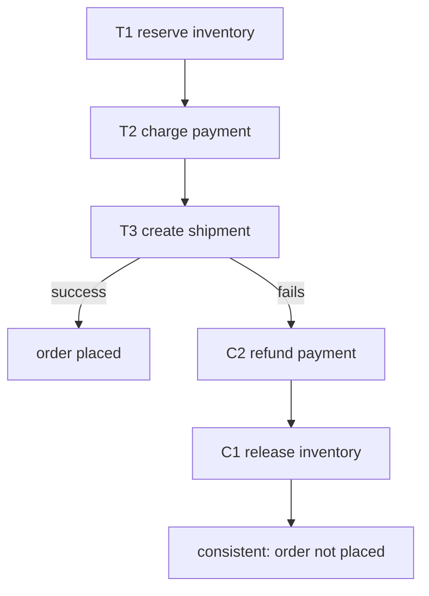

## Thesis

Managing a transaction that spans multiple services --- where you can't hold one ACID transaction across service boundaries --- by breaking it into a sequence of local transactions, each with a compensating action that semantically undoes it, so that if a later step fails you run the compensations in reverse to unwind the work --- trading atomicity for eventual consistency, because a distributed lock across services (two-phase commit) doesn't scale.

## Sub

**Why: no ACID across services, and 2PC doesn't scale** -> **the saga: local transactions plus compensations** -> **choreography vs orchestration** -> **zoom out** to eventual consistency, semantic rollback, and the pivots an interviewer rides from "one transaction spanning services" into compensations, the two coordination styles, and failure handling.

## Spine

- You **can't hold one ACID transaction across services** --- each service owns its own database, so "reserve inventory, charge the card, create the shipment" spanning three services has no shared transaction, and two-phase commit (2PC) to coordinate them holds locks across the network and doesn't scale (blocking, a coordinator SPOF).
- A **saga** is a sequence of local transactions with compensations --- each step commits locally and signals it's done; if a later step fails, you run the **compensating actions** for the completed steps in reverse to semantically undo them (refund the charge, release the inventory), reaching a consistent end state without a global lock.
- Coordination is either **choreography or orchestration** --- choreography has each service react to events and emit the next (decentralized, no coordinator, but the flow is implicit and hard to follow); orchestration has a central coordinator that tells each service what to do and handles failures (explicit and traceable, but a component you must build and own).
- Sagas trade **atomicity for eventual consistency** --- there's no isolation (intermediate states are visible), and compensations must be idempotent and may not perfectly reverse side effects, so you design for the messy middle (semantic rollback, not a clean database rollback) --- the cost of transactions that cross service boundaries.

## Companion Notes

### walk

One transaction across many services

A workflow that spans service boundaries with no shared database --- why you can't use one ACID transaction or 2PC, how a saga chains local transactions each with a compensating undo, what happens when a step fails, and how choreography and orchestration coordinate it.

Say the constraint first --- "there's no ACID transaction across services." Everything else (compensations, the messy middle, eventual consistency) follows from giving up the global lock and unwinding with semantic undos instead.

### drill

Probe Drill

Graded follow-ups on compensations, the two coordination styles, isolation, and failure handling --- the ones that separate "just use a distributed transaction" from designing a workflow that stays consistent across services without a global lock.

Name the shape: local transactions forward, compensating transactions in reverse on failure -- a semantic undo reaching a consistent end state, not a clean rollback, because there's no isolation and no shared transaction.

## Drill

SDE2 | the model and the two styles
SDE3 | compensations, isolation, and state
Staff | countermeasures, the spectrum, and failure

### SDE2 | what a saga is

What is a saga and what problem does it solve?

A saga is a way to manage a transaction that spans multiple services, implemented as a **sequence of local transactions**, where each step commits in one service and, if a later step fails, previously-completed steps are undone by running their **compensating transactions**. The problem it solves: in a microservices system each service owns its own database, so a business operation touching several services (place an order = reserve inventory + charge payment + create shipment) can't be wrapped in a single ACID transaction --- there's no shared transactional boundary. A saga gives you a way to keep that multi-service operation consistent (all steps complete, or completed steps get undone) without needing one global transaction across all the services.

### SDE2 | why not 2PC

Why not use a distributed transaction (two-phase commit) across the services?

Because 2PC doesn't scale and hurts availability. In two-phase commit, a coordinator asks all participants to "prepare" (locking their resources), then tells them all to "commit" --- which means **resources stay locked across the network for the whole duration**, so a slow or failed participant blocks everyone, throughput collapses under contention, and the coordinator is a single point of failure whose crash can leave participants stuck holding locks ("in-doubt"). It also requires every participant to support the distributed-transaction protocol (many databases/services don't). For a high-throughput microservices system, holding cross-service locks is a non-starter --- so sagas deliberately give up the global lock (and thus atomic isolation) in exchange for scalability and availability, coordinating with local transactions and compensations instead.

### SDE2 | what a compensating transaction is

What is a compensating transaction?

An operation that **semantically undoes** the effect of a completed saga step. Each forward step (T1: charge the card) has a paired compensation (C1: refund the card) that reverses its business effect. If the saga fails partway, you run the compensations for the steps that already committed, in reverse order, to bring the system back to a consistent state. Crucially it's a *new* transaction that counteracts the original --- not a database rollback (the original already committed and is visible). So "refund" not "un-charge," "release the reserved inventory" not "un-reserve." Every step that has a visible side effect needs a compensation defined, and designing those compensations (what does it mean to undo this?) is much of the work of building a saga.

### SDE2 | the happy path

Walk through the happy path of a saga.

Each step runs as a local transaction and, on success, triggers the next. For an order: **T1** reserve inventory (commits in the inventory service), which triggers **T2** charge the payment (commits in the payment service), which triggers **T3** create the shipment (commits in the shipping service), which completes the saga. Each service commits its own local transaction independently and durably; there's no shared lock, and each step's success is what advances the flow (via an event it emits, or the orchestrator calling the next service). The saga is complete when the final step commits. On the happy path it just looks like a chain of local transactions across services, each one moving the workflow forward.

### SDE2 | what happens on failure

What happens when a step in the saga fails?

You **run the compensating transactions** for the steps that already succeeded, in reverse order, to unwind the work. If T3 (create shipment) fails after T1 (reserve inventory) and T2 (charge payment) committed, the saga executes C2 (refund the payment) then C1 (release the reserved inventory), leaving the system in a consistent "order not placed" state --- the money is refunded and the inventory is freed. So instead of a global rollback (which you can't do --- the local transactions already committed), you compensate forward: each completed step gets its business effect reversed by a new transaction. The end state is consistent, but note it was reached by *doing more work* (the compensations), not by undoing --- and there was a window where intermediate state (a charge that's about to be refunded) was visible.

### SDE2 | choreography vs orchestration

What are the two ways to coordinate a saga?

**Choreography** and **orchestration**. In *choreography*, there's no central coordinator --- each service listens for events and reacts: inventory-reserved -> payment service charges -> payment-charged -> shipping service ships, each step emitting an event the next one consumes. The logic is distributed across the services. In *orchestration*, a central **orchestrator** (a saga coordinator) explicitly drives the flow: it calls inventory, then calls payment, then calls shipping, and on failure it invokes the compensations --- the workflow logic lives in one place. Choreography is decentralized and loosely coupled but the overall flow is implicit (spread across event handlers, hard to follow); orchestration centralizes the flow (explicit, easy to see and change) at the cost of building and owning the coordinator. It's the core design choice when implementing a saga.

### SDE2 | an example

Give a concrete example of a saga.

**Order placement** across three services. Happy path: reserve inventory (inventory service), charge the card (payment service), create the shipment (shipping service) --- order placed. Failure: if creating the shipment fails (no carrier capacity), compensate --- refund the card, release the reserved inventory --- so the customer isn't charged for an order that can't ship. Another classic is **travel booking**: book flight, book hotel, book car; if the car booking fails, cancel the hotel and cancel the flight. In both, each booking/charge is a local transaction in its own service, and each has a compensation (cancel/refund/release). These are natural sagas because the operation genuinely spans independent services, each with its own database, and a failure partway needs to undo the parts that succeeded.

### SDE3 | choreography in depth

How does choreography work, and what are its trade-offs?

Each service publishes **events** on completion, and other services subscribe and react --- the saga is the emergent result of this event chain, with no central controller. *Pros:* decoupled (services only know about events, not each other), no coordinator to build or scale, naturally resilient (no central SPOF). *Cons:* the overall workflow is **implicit and hard to understand** --- to know "what happens when an order is placed" you have to trace events across many services' handlers; it's easy to create cyclic dependencies or hard-to-follow flows; adding a step means touching multiple services and their event subscriptions; and **observability/debugging is hard** (the flow isn't in one place, so tracing a stuck or failed saga means correlating events across services). Choreography shines for simple sagas with few steps where the decoupling is worth the diffuse logic, but gets unwieldy as the workflow grows.

### SDE3 | orchestration in depth

How does orchestration work, and what are its trade-offs?

A central **orchestrator** holds the workflow definition and drives it: it invokes each service in turn (usually via commands/requests), receives the results, decides the next step, and on failure invokes the compensations in order. The saga's logic lives in one place. *Pros:* the workflow is **explicit and centralized** (easy to see, reason about, and change the sequence and failure handling), straightforward to add steps, and much easier to monitor and debug (the orchestrator knows the current state of each saga). *Cons:* the orchestrator is a **component you must build, deploy, and make reliable** (it needs durable state so it can resume after a crash --- typically implemented as a persistent state machine); it can become a point of coupling (services' logic can leak into it) and a bottleneck/SPOF if not designed for HA. Orchestration is generally preferred for complex sagas (many steps, intricate failure handling) because the explicit, observable, centralized flow outweighs the cost of owning the coordinator.

### SDE3 | compensations aren't perfect rollbacks

Why aren't compensating transactions the same as a rollback?

Because the original transaction **already committed and its effects were visible** --- you can't un-happen it, you can only counteract it with a new action, and that counteraction may not perfectly erase all side effects. Refunding a charge leaves a charge-then-refund pair on the statement (visible), not a clean slate. Worse, some effects **can't be undone at all**: an email was sent, a physical item shipped, an external API triggered --- the compensation can only do the best *semantic* reversal (send an apology/correction email, initiate a return), not remove the effect. And anything that happened *because* of the intermediate state (another process read the not-yet-refunded charge and acted on it) isn't reversed by your compensation. So compensations are **semantic undos**, not transactional rollbacks: you design them to reach a business-consistent end state, accepting visible intermediate states and irreversible side effects as inherent to the pattern.

### SDE3 | idempotency in sagas

Why do saga steps and compensations need to be idempotent?

Because the messaging and coordination are unreliable, so steps and compensations **will sometimes run more than once**. An orchestrator might crash after a service commits but before recording that it did, then retry the same step on recovery; a choreography event might be delivered twice; a compensation might be re-issued after a timeout when it actually succeeded. If "charge the card" isn't idempotent, a retry double-charges; if "release inventory" isn't idempotent, a retry over-releases. So every step and every compensation must be safe to apply repeatedly with the same effect as applying it once --- typically via an idempotency key (the saga id + step) that lets the service detect and ignore a duplicate. Idempotency is not optional in a saga; the at-least-once nature of the coordination guarantees duplicates, so correctness depends on each operation absorbing them.

### SDE3 | lack of isolation

Sagas lack the "I" in ACID --- what does that cause?

Because there's no global transaction, **intermediate states are visible to other operations** (no isolation), which creates anomalies. A concurrent saga or query can see a partial result: it can read data a saga will later compensate away (a *dirty read* --- e.g. seeing a balance that reflects a charge that's about to be refunded), or a saga can act on data another saga changed mid-flight (*lost updates*), or re-read and see different values (*non-repeatable reads*). Classic example: saga A reserves the last item and is about to fail-and-compensate; saga B reads inventory, sees it's taken, and rejects a customer --- but A then releases it, so B rejected them unnecessarily. Sagas are **ACD without I**: atomic (via compensation), consistent, durable --- but not isolated. You must either tolerate these anomalies or add explicit countermeasures (semantic locks, etc.), which is the staff-level concern.

### SDE3 | a failing compensation

What happens if a compensating transaction itself fails?

This is a serious case, because compensations are the safety net --- if C2 (refund) fails, the saga can't cleanly reach a consistent state. The standard answer: compensations must be **retried until they succeed** (they're designed to be idempotent and, ideally, cannot fail for business reasons --- a refund should always be *possible*), backed by durable state so the retry survives crashes. If a compensation genuinely can't complete after retries (a downstream service is down), the saga is **stuck** and typically escalates: it's flagged for human intervention / alerting, moved to a dead-letter/manual-resolution queue, and the incident is handled operationally. The design principle is to make compensations as **reliably-completable as possible** (simple, idempotent, no business rejection) precisely because they're the last line of defense; a saga framework must also persist saga state so a failed compensation can be resumed rather than lost.

### SDE3 | tracking saga state

How do you track a saga's state, and why does it matter?

You persist the saga's progress in a durable **saga log / state store** --- for each saga instance, which steps have completed, what the current step is, and whether it's compensating --- so the coordination can survive crashes and resume. In orchestration, the orchestrator maintains this state (often as a persistent state machine): if it crashes mid-saga, on restart it reads the log and continues from where it left off (invoke the next step, or resume compensating). In choreography, the "state" is more diffuse (implicit in which events have been emitted/consumed), which is part of why it's harder to track. This durability is essential: without it, a coordinator crash would lose in-flight sagas (leaving orphaned partial work with no one to complete or compensate it). So a production saga implementation is fundamentally about **durable state + reliable step/compensation execution**, and the log is what makes recovery and observability possible.

### Staff | isolation countermeasures

Since sagas lack isolation, how do you handle the resulting anomalies?

With explicit countermeasures, chosen per-anomaly rather than a global lock. **Semantic lock**: mark records touched by an in-flight saga with a pending state (e.g. an order flagged "pending," a balance "held") so other operations know not to treat them as final --- a lightweight application-level lock that other sagas/queries respect. **Commutative updates**: design operations so order doesn't matter (increment/decrement rather than set), so interleaving sagas don't corrupt each other. **Pessimistic view / reordering**: order the saga steps so the hardest-to-compensate or most-visible step runs last (or so a risky step is preceded by a semantic lock), minimizing the window of visible intermediate state. **Re-read / version checks**: detect that data changed under you (optimistic concurrency) and abort/retry. **By value**: decide isolation strategy per request based on business risk (a high-value order gets stricter handling). The staff framing: sagas are ACD-without-I, so you *engineer* the isolation you need at the application level for the specific anomalies that matter, accepting the rest --- there's no free lunch, but you rarely need full isolation everywhere.

### Staff | saga vs 2PC vs TCC

Where do saga, 2PC, and TCC sit on the spectrum?

They trade isolation against availability/scalability. **2PC** (two-phase commit): full atomicity *and* isolation (resources locked from prepare to commit), but blocking, coordinator-SPOF, poor scalability, and requires protocol support --- good only for a few tightly-coupled resources needing strict guarantees. **Saga**: no distributed locks, high availability and scalability, but no isolation and only eventual/semantic consistency (compensations) --- good for long-running, cross-service workflows where you can tolerate visible intermediate states. **TCC (Try-Confirm-Cancel)**: a middle ground --- each step first *reserves* resources (Try, e.g. hold the funds without capturing), and once all steps succeed you *Confirm* (capture), or on failure *Cancel* (release the holds). TCC gives better isolation than a bare saga (the Try phase reserves, so intermediate state is a *hold* not a committed effect) without 2PC's blocking coordinator, but requires services to support the three-phase reserve/confirm/cancel semantics. So the spectrum is: 2PC (strong, doesn't scale) -> TCC (reserve-based, better isolation, more service work) -> saga (weakest isolation, most scalable). You pick by how much isolation the business genuinely requires versus the scale/coupling you can afford.

### Staff | orchestrator design

How do you design a reliable saga orchestrator?

As a **durable, crash-recoverable state machine**, because it holds in-flight sagas that must survive failures. Core elements: persist each saga's state (current step, completed steps, compensating flag) transactionally on every transition, so a crash can be recovered by replaying from the last persisted state; make step invocation and result handling idempotent (a recovered orchestrator may re-issue a command a service already processed); and drive compensations from the same persisted state on failure. For availability, the orchestrator itself must not be a SPOF --- run multiple instances with the saga state in a shared durable store (a database, or a workflow engine), using leader election or partitioning of saga instances so exactly one instance drives each saga, and so a failed instance's sagas are picked up by another. Many teams use a **workflow engine** (Temporal, AWS Step Functions, Camunda) rather than hand-rolling this, because it provides the durable-state, retry, and recovery machinery. The staff point: the orchestrator's whole job is *reliable state management* --- the workflow logic is easy; making it survive crashes without losing or duplicating sagas is the engineering, which is why durable state + idempotent execution + HA (not a single coordinator process) is the design.

### Staff | choreography observability

What's the hardest operational problem with choreography, and how do you address it?

**Observability** --- because the workflow is an emergent event chain with no central place holding "the state of this saga," it's very hard to answer "where is order 123 in the flow?" or "why did it get stuck?" A failure can leave a saga half-done with no coordinator aware of it, and debugging means correlating events across many services' logs. Addressing it: propagate a **correlation/saga id** through every event so you can trace the whole chain across services; emit the events/state transitions to a central **tracing/observability system** (distributed tracing, an event store) that can reconstruct the flow; and consider a **saga-tracking consumer** that subscribes to all the saga's events purely to record and expose each instance's progress (effectively rebuilding centralized visibility without centralizing control). Some teams conclude that once observability needs this much scaffolding, an **orchestrator** (which has the state inherently) is simpler --- which is a common reason complex choreographed sagas migrate to orchestration. The staff insight is that choreography's decentralization, which is its strength, directly costs you the centralized state that makes sagas observable and debuggable, so you must deliberately rebuild that visibility.

### Staff | reliable event publishing

How do you reliably publish saga events given the dual-write problem?

The hazard: a step must both **commit its local transaction and publish an event** (that it completed), and if these are two separate operations, a crash between them breaks the saga --- commit-but-no-event (the saga stalls, nobody knows the step finished) or event-but-no-commit (downstream acts on work that didn't happen). This is the *dual-write problem*, and you can't wrap a database and a message broker in one transaction. The standard fix is the **transactional outbox**: within the *same* local transaction that commits the step, write the event to an `outbox` table in the same database; a separate relay process (or CDC tailing the DB log) reads the outbox and publishes to the broker, marking rows sent. Now the commit and the event-intent are atomic (one local transaction), and the relay guarantees at-least-once delivery of the event. Combined with **idempotent** consumers (to absorb the at-least-once duplicates), this makes saga step-transitions reliable. The staff framing: sagas depend on "step committed -> event published" being atomic, the dual-write problem says it isn't for free, and the outbox (often plus event sourcing / CDC) is how you make it atomic --- reliable event publishing is a prerequisite for a correct choreographed (or event-driven orchestrated) saga.

### Staff | when a saga is overkill

When is a saga the wrong choice?

When the operation **doesn't actually span services** or **can't tolerate the lack of isolation**. If the whole business operation lives in one service/database, use a plain local ACID transaction --- a saga adds compensation logic and eventual-consistency complexity for nothing. If you genuinely need **strict isolation/atomicity** (intermediate states absolutely must not be visible, e.g. certain financial settlements), a saga's visible messy middle is unacceptable and you need real transactional guarantees (keep those operations within one transactional boundary, or use 2PC/TCC despite the cost, or redesign so the atomic part is co-located). Sagas also aren't worth it for operations that are **trivially compensatable-or-not** in a way that a simpler retry handles (if a step can just be retried to completion and never needs undoing, you don't need the full saga machinery). And they add real complexity (compensations for every step, idempotency, isolation countermeasures, orchestration or event-tracing) --- so if a modest redesign lets the operation stay within one service's transaction, that's usually better. The staff judgment: a saga earns its complexity specifically when the operation *must* span independently-owned services *and* the business can accept eventual consistency with semantic rollback --- otherwise co-locate the transaction or use a stronger protocol.

### Staff | real-world failure modes

What real-world failure modes bite saga implementations?

Several beyond the happy-path theory. **Non-idempotent steps under retries** -> double-charges/double-releases (the most common bug; every step and compensation must absorb duplicates). **Compensation ordering / partial compensation** -> if you compensate in the wrong order or a compensation fails midway, you can leave inconsistent state; compensations must be ordered (reverse) and individually retried to completion. **Poison messages / stuck sagas** -> a step or event that always fails blocks the saga; you need timeouts, dead-letter handling, and human-escalation paths, not infinite silent retries. **The dual-write problem** -> commit-without-event or event-without-commit stalls or corrupts the flow (needs the outbox). **Isolation anomalies in production** -> dirty reads of not-yet-compensated state causing wrong downstream decisions (needs semantic locks where it matters). **Orchestrator crash mid-saga** -> lost in-flight sagas if state isn't durably persisted per transition. **Compensation of irreversible actions** -> an email sent or item shipped can't be truly undone, so the "consistent end state" is a business approximation (return/apology), which must be designed deliberately. **Time-outs vs slow success** -> a step that timed out but actually succeeded, then gets compensated or retried, causing inconsistency (needs idempotency + status reconciliation). The staff summary: sagas move the hard part from "one atomic transaction" to "reliably coordinating many local transactions and their undos under failure and duplication" --- and every one of these failure modes is a place where a naive saga silently corrupts state, which is why durable state, idempotency, reliable event publishing, and explicit stuck-saga handling are mandatory, not optional.

## Walk

### No ACID across services, and 2PC doesn't scale

```flow
op[operation spans 3 services + 3 DBs] -> no[no shared transaction] -> twopc[2PC would lock resources across the network -> blocks, coordinator SPOF]
```

Start with the constraint. A business operation like "place an order" touches inventory, payment, and shipping --- three services, three separate databases. There's no way to wrap all three in one ACID transaction; each service can only commit its *own* local transaction.

The classic fix, two-phase commit, coordinates them by having a coordinator ask everyone to "prepare" (locking resources) then "commit" --- but that **holds locks across the network for the whole duration**, so a slow participant blocks everyone, throughput collapses under contention, and the coordinator crashing can strand participants holding locks. For a high-throughput microservices system, cross-service locks are a non-starter --- which is exactly why sagas give up the global lock.

### Break it into local transactions with compensations

```flow
t[T1 reserve -> T2 charge -> T3 ship] -> c[each step has a compensation: C1 release, C2 refund, C3 cancel]
```

A saga replaces the one big transaction with a **sequence of local transactions**, each committing in its own service and advancing the flow. But because those commits are real and visible, you can't roll them back --- so each step is paired with a **compensating transaction** that semantically *undoes* its business effect: reserve inventory <-> release inventory, charge card <-> refund card, create shipment <-> cancel shipment.

On the happy path it's just the forward chain: T1 reserve -> T2 charge -> T3 ship -> done, each service committing independently with no shared lock. The compensations only come into play on failure. The key mental shift is that "undo" here means *doing more work* (a refund), not reverting a database --- the original already committed.

### On failure, run compensations in reverse

```flow
f[T3 ship fails] -> comp[run C2 refund, then C1 release] -> end[consistent 'order not placed' state]
```

If a step fails after earlier steps committed, you execute the **compensations for the completed steps, in reverse order**, to unwind. T3 fails -> C2 refunds the payment -> C1 releases the inventory -> the system rests in a consistent "order not placed" state.

```python
def run_saga(steps, ctx):
    """steps: list of (action, compensation). Each is idempotent."""
    done = []                                  # completed steps, for reverse compensation
    for action, compensation in steps:
        try:
            action(ctx)                        # local transaction, commits in one service
            done.append(compensation)
            persist_state(ctx.saga_id, done)   # durable log -> survives a crash
        except StepFailed:
            for comp in reversed(done):        # unwind in reverse order
                retry_until_success(comp, ctx) # compensations MUST complete (idempotent)
            return "compensated"               # consistent 'did not happen' end state
    return "committed"
```

Two things this makes concrete: the saga state is **persisted per step** (so an orchestrator crash resumes rather than orphaning the saga), and compensations are **retried until they succeed** (they're the safety net --- a compensation that can't complete escalates to human intervention). The end state is consistent, but reached by *forward compensation*, and there was a visible window where intermediate state (a charge about to be refunded) existed --- sagas have no isolation.

### Choreography vs orchestration

```flow
ch[choreography: service reacts to event -> emits next event] -> or[orchestration: central coordinator calls each service + drives compensations]
```

Two ways to coordinate the chain. In **choreography**, there's no coordinator --- each service listens for an event and emits the next (inventory-reserved -> payment charges -> payment-charged -> shipping ships). Decentralized and loosely coupled, but the overall flow is *implicit* (spread across event handlers) and hard to trace or debug. In **orchestration**, a central **orchestrator** holds the workflow and drives it --- calling each service in turn and invoking compensations on failure. Explicit, centralized, and observable (the orchestrator knows each saga's state), at the cost of building and owning that coordinator.

Zooming out: a saga trades atomicity for eventual consistency --- ACD without the I --- so you design for the messy middle: compensations for every visible step, idempotency everywhere (the coordination is at-least-once, so steps *will* re-run), reliable event publishing (the outbox, to avoid commit-without-event), and isolation countermeasures (semantic locks) where visible intermediate state would cause wrong decisions. Choreography suits simple sagas; orchestration suits complex ones; and the whole pattern earns its complexity only when the operation genuinely spans independently-owned services and the business can accept semantic rollback.

### Model Script

- Frame the constraint | "The core constraint is that there's no ACID transaction across services -- each microservice owns its own database, so an operation like placing an order that touches inventory, payment, and shipping can't be one atomic transaction. And two-phase commit doesn't fix it at scale: it holds locks across the network from prepare to commit, so a slow participant blocks everyone, the coordinator is a single point of failure, and throughput collapses under contention. So sagas deliberately give up the global lock."
- The saga and compensations | "A saga replaces the one big transaction with a sequence of local transactions -- each commits in its own service and advances the flow. Because those commits are real and visible, you can't roll them back, so each step is paired with a compensating transaction that semantically undoes its effect: reserve maps to release, charge maps to refund, ship maps to cancel. Happy path is just the forward chain. On failure, you run the compensations for the completed steps in reverse order -- so if shipping fails after charging, you refund then release, landing in a consistent 'order not placed' state. The mental shift is that undo means doing more work, a refund, not reverting a database."
- The two coordination styles | "Two ways to coordinate it. Choreography has no coordinator -- each service reacts to an event and emits the next one. It's decentralized and loosely coupled, but the overall flow is implicit, spread across event handlers, and hard to trace or debug. Orchestration has a central coordinator that holds the workflow, calls each service in turn, and drives the compensations on failure. It's explicit, centralized, and observable -- the orchestrator knows each saga's state -- at the cost of building and owning that coordinator. I'd lean choreography for simple sagas and orchestration for complex ones with intricate failure handling."
- The messy middle | "The thing to be honest about is that a saga is ACD without the I -- it trades atomicity for eventual consistency. There's no isolation, so intermediate states are visible: another operation can read a charge that's about to be refunded. Compensations are semantic undos, not clean rollbacks, and some effects -- an email sent, an item shipped -- can't truly be undone. So you design for that: idempotency on every step and compensation because the coordination is at-least-once and things will re-run; reliable event publishing via a transactional outbox so you never commit without publishing the event; and semantic locks -- marking a record 'pending' -- where a visible intermediate state would cause a wrong decision."
- Interviewer: "Your orchestrator crashes in the middle of a saga. What happens?"
- Durable state | "That's exactly why the orchestrator has to be a durable, crash-recoverable state machine. It persists each saga's state -- completed steps, current step, whether it's compensating -- transactionally on every transition. So on restart it reads the log and resumes from the last persisted state: either invoke the next step or continue compensating. And because a recovered orchestrator might re-issue a command a service already processed, every step and compensation is idempotent so the re-issue is harmless. For availability I wouldn't run a single coordinator -- I'd run multiple instances with the saga state in a shared durable store and partition or leader-elect so exactly one instance drives each saga and a failed instance's sagas get picked up. In practice I'd often use a workflow engine like Temporal or Step Functions that provides that durable-state and recovery machinery rather than hand-rolling it."
- Land it | "So: there's no ACID across services and 2PC doesn't scale, so a saga chains local transactions each with a compensating undo, running compensations in reverse on failure to reach a consistent end state; choreography coordinates by events -- decoupled but implicit -- and orchestration by a central durable coordinator -- explicit and observable; and because it's ACD without isolation you design for the messy middle with idempotency, a transactional outbox, and semantic locks. The one line is that a saga buys you cross-service consistency without a global lock, at the price of eventual consistency and semantic rollback -- which is the right trade when the operation genuinely spans independently-owned services."

## Whiteboard

Sketch the forward chain and the compensation path.

### Why compensations instead of a rollback?

Because each local transaction already committed and its effect is visible -- you can't un-commit it, so you counteract it with a new transaction (refund, release). It's a semantic undo reaching a consistent end state, not a database rollback, and some effects can't be fully undone.

### Choreography or orchestration -- how do you choose?

Choreography (services react to events, emit the next) is decoupled but the flow is implicit and hard to trace; orchestration (a central durable coordinator drives steps and compensations) is explicit and observable but is a component you own. Simple sagas -> choreography; complex, failure-heavy sagas -> orchestration.



Verdict: local transactions run forward (each committing in its own service); on failure, compensations run in reverse to a consistent end state -- a semantic undo, not a rollback -- with no global lock, no isolation, and idempotency required throughout.

## System

Zoom out to where a saga sits in a microservices workflow.

### Where it sits

The workflow: spans several independently-owned services + databases [*]
Forward: each step a local transaction, advancing on success
Compensation: on failure, reverse-order semantic undos of completed steps
Coordination: choreography (events) or orchestration (durable coordinator)
Reliability: idempotent steps + transactional outbox + persisted saga state

### Pivots an interviewer rides

From "one operation across services" they push on coordination, isolation, and reliability.

#### Choreography or orchestration?

-> choreography = event-driven, decoupled, implicit flow; orchestration = central coordinator, explicit, observable
Simple sagas suit choreography (no coordinator); complex/failure-heavy sagas suit orchestration (durable state machine knows each saga's status) -- and choreography's hardest cost is observability.

#### Sagas have no isolation -- what breaks?

-> intermediate states are visible: dirty reads of a not-yet-compensated charge, lost updates between concurrent sagas
It's ACD without I; add semantic locks (mark records 'pending'), commutative updates, or reorder steps to shrink the visible window -- countermeasures per anomaly, not a global lock.

## Trade-offs

The calls that separate "use a distributed transaction" from a workflow that scales across services.

### Saga vs 2PC (distributed transaction)

- 2PC: full atomicity and isolation -- but locks resources across the network, blocks on a slow participant, coordinator SPOF, doesn't scale
- Saga: no distributed locks, highly available and scalable -- but no isolation, only eventual consistency via semantic compensations

Use a saga for long-running cross-service workflows that tolerate visible intermediate state; reserve 2PC for a few tightly-coupled resources that genuinely need strict guarantees.

### Choreography vs orchestration

- Choreography (events): decoupled, no coordinator, resilient -- but the flow is implicit, hard to trace/debug, and grows unwieldy with steps
- Orchestration (coordinator): explicit, centralized, observable, easy to change -- but a durable component you must build, own, and make HA

Use choreography for simple, few-step sagas where decoupling wins; orchestration for complex sagas with intricate failure handling where explicit, observable flow matters.

### Bare saga vs TCC (Try-Confirm-Cancel)

- Bare saga: steps commit immediately, simplest -- but zero isolation, so intermediate committed state is fully visible
- TCC: a Try phase reserves (a hold, not a commit), then Confirm or Cancel -- better isolation without 2PC's blocking, but every service must support reserve/confirm/cancel

Use a bare saga when visible intermediate state is acceptable; TCC when you need reserve-style isolation (holds, not committed effects) without a blocking 2PC coordinator.

## Model Answers

### the reframe | Local transactions plus compensations

The frame to lead with.

- No ACID across services; 2PC locks and doesn't scale | key | each service owns its DB
- Sequence of local transactions, each with a compensation | store | reverse-order undo on failure
- Trades atomicity for eventual consistency | note | ACD without the I

### the depth | Coordination and reliability

Where it's really tested.

- Choreography (events) vs orchestration (durable coordinator) | key | implicit vs explicit flow
- Idempotency + transactional outbox are mandatory | store | coordination is at-least-once
- No isolation -> semantic locks where it matters | note | dirty reads of un-compensated state

## Numbers

Back-of-envelope how often a saga must compensate and what the coordination costs.

Compensation probability compounds with step count; every step and compensation must be idempotent and durable.

- steps | Saga steps | 5 | 2 | 1
- pfail | Per-step failure (%) | 1 | 0 | 0.5
- rps | Sagas/sec | 100 | 1 | 10

```js
function (vals, fmt) {
  var steps = vals.steps, pfail = vals.pfail / 100, rps = vals.rps;
  var clean = Math.pow(1 - pfail, steps);
  var needComp = 1 - clean;
  function r(x, d) { var m = Math.pow(10, d); return Math.round(x * m) / m; }
  return [
    { k: 'Completes cleanly', v: r(clean * 100, 1) + '%', u: 'of sagas', n: '(1 - per-step failure)^steps \u2014 more steps compound the chance some step fails and triggers compensation', over: false },
    { k: 'Needs compensation', v: r(needComp * 100, 1) + '%', u: 'of sagas', n: '1 minus that \u2014 this fraction hits a failure and must run compensating transactions to unwind', over: needComp > 0.1 },
    { k: 'Compensation flows', v: '~' + fmt.n(Math.round(needComp * rps)) + '/s', u: 'undo runs', n: 'at ' + fmt.n(rps) + ' sagas/s, roughly this many trigger compensations \u2014 each must be idempotent, durable, and retried to completion', over: false },
    { k: 'Events (choreography)', v: '~' + fmt.n(steps * 2), u: 'msgs / saga', n: 'roughly one event per step plus reactions \u2014 more steps means a longer, harder-to-trace event chain (the observability cost)', over: false },
    { k: 'Not atomic', v: 'eventual', u: 'no isolation', n: 'intermediate states are visible and compensations are semantic undos, not clean rollbacks \u2014 design for the messy middle (idempotency, semantic locks, outbox)', over: false }
  ];
}
```

## Red Flags

What makes an interviewer wince.

### "We'll wrap the cross-service operation in a distributed transaction"

Two-phase commit across services holds locks over the network for the whole operation -- a slow participant blocks everyone, the coordinator is a SPOF, and it doesn't scale; many services don't even support it.

Use a saga (local transactions + compensations) to keep the operation consistent without a global lock, accepting eventual consistency -- reserve 2PC for a few tightly-coupled resources that truly need strict isolation.

### "On failure we just roll back the previous steps"

Those steps already committed in their own services and their effects are visible -- there's nothing to roll back; you have to run compensating transactions (refund, release) that semantically undo them, and some effects (an email sent, an item shipped) can't be fully undone.

Define an idempotent compensation for every step with a visible effect, run them in reverse order, and retry them to completion -- a semantic undo, not a rollback.

### "The saga steps fire events, so we're done"

Committing the local transaction and publishing the event are two writes -- a crash between them stalls the saga (commit, no event) or corrupts it (event, no commit); and duplicate/redelivered events double-apply non-idempotent steps.

Use a transactional outbox (write the event in the same local transaction, relay it to the broker) plus idempotent consumers, and persist saga state durably so a coordinator crash resumes rather than orphaning the saga.

## Opener

### 30s | The one-liner

How I open when asked to handle a transaction spanning multiple services.

#### What is the shape?

Break the cross-service operation into a sequence of local transactions, each with a compensating action; run them forward, and if a later step fails, run the compensations in reverse to semantically undo the completed ones -- consistency without a global lock.

#### What's the key trade?

It's ACD without isolation -- you trade atomicity for eventual consistency, so intermediate states are visible and compensations are semantic undos (not rollbacks); design for that with idempotency, a transactional outbox, and semantic locks.

##### Hooks

Where an interviewer usually pushes next.

- Choreography or orchestration? | events (decoupled, implicit) vs coordinator (explicit, observable) | drill
- Why not 2PC? | it locks across the network and doesn't scale | drill
- No isolation -- what breaks? | dirty reads of un-compensated state; use semantic locks | drill

Foot: two sentences -- a saga gives cross-service consistency without a distributed lock by chaining local transactions and compensating in reverse on failure, coordinated by events (choreography) or a durable coordinator (orchestration) -- and the price is eventual consistency with semantic rollback, so idempotency, reliable event publishing, and isolation countermeasures are mandatory, not optional.

## Bank

### SCALE | An order-placement flow across inventory, payment, and shipping services

Task: design the cross-service transaction.
Model: a saga -- reserve inventory, charge payment, create shipment as local transactions, each with a compensation (release, refund, cancel); on failure run compensations in reverse to a consistent 'not placed' state; make every step and compensation idempotent (the coordination is at-least-once); publish step events via a transactional outbox to avoid commit-without-event; add semantic locks (order 'pending') where visible intermediate state would cause wrong decisions; and orchestrate with a durable state machine (or a workflow engine) so a coordinator crash resumes rather than orphaning the saga.
Int: shipping fails after the card was charged -- what happens?
Run C2 (refund the payment) then C1 (release the reserved inventory), reaching a consistent 'order not placed' state -- a semantic undo, retried to completion, not a rollback.

### DESIGN | Choosing choreography vs orchestration for a multi-step saga

Task: pick and justify a coordination style.
Model: choreography (services react to events and emit the next) for simple, few-step sagas -- decoupled, no coordinator, but implicit flow and hard observability; orchestration (a central durable coordinator drives steps and compensations) for complex, failure-heavy sagas -- explicit, centralized, observable, at the cost of building and owning the coordinator; in both, propagate a saga/correlation id, persist state durably, and use an outbox + idempotent consumers; if choreography's observability needs too much scaffolding (a saga-tracking consumer to rebuild central visibility), that's a signal to move to orchestration.
Int: what's choreography's biggest hidden cost?
Observability -- the flow is an emergent event chain with no central state, so answering 'where is this saga / why is it stuck' means correlating events across services.

### Extra Curveballs

### CURVEBALL | isolation | Two concurrent sagas both act on the same inventory item, and one is about to fail and compensate. What can go wrong, and how do you handle it?

Model: sagas are ACD without isolation, so intermediate committed state is visible and concurrent sagas can interfere. Saga A reserves the last unit and is about to fail-and-release; saga B reads inventory, sees zero available, and rejects its customer -- but A then releases the unit, so B rejected someone unnecessarily (a dirty read of state A will compensate away). Or both sagas read 'one available' and both reserve it (a lost update / oversell) if the reservation isn't atomic. Handling: make the reservation itself an atomic conditional local transaction (decrement-if-available, so only one saga can reserve the last unit -- a commutative/guarded update, not read-then-write); use a semantic lock -- mark the unit 'held by saga X' so B treats it as pending rather than gone, and only frees or confirms on A's outcome; and where the business risk is high, reorder steps so the risky reserve happens as late as possible to shrink the visible window, or apply stricter handling by value. The staff point is that you don't get isolation for free in a saga -- you engineer it per-anomaly with atomic guarded updates and semantic locks for exactly the cases where a visible intermediate state causes a wrong decision, accepting the rest.

### Frames

- No ACID across services and 2PC doesn't scale -> chain local transactions, each with a compensating undo, reversed on failure
- Choreography (events, decoupled, implicit) vs orchestration (durable coordinator, explicit, observable); simple vs complex sagas
- ACD without isolation: idempotency + transactional outbox + semantic locks are mandatory; compensations are semantic undos, not rollbacks
