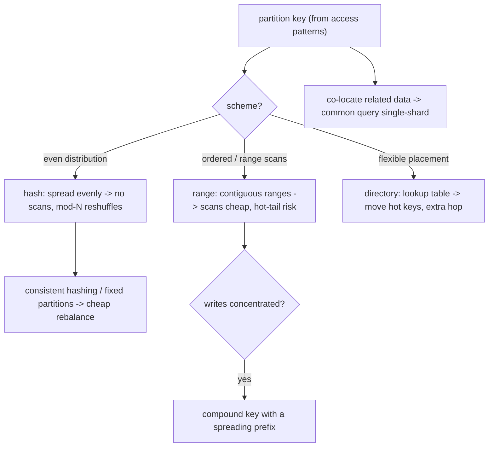

## Thesis

Sharding is horizontally partitioning data across multiple nodes when one node can no longer hold the data or serve the write load --- and it is primarily a *design decision* dominated by two choices: the **partition key** and the **partitioning scheme**. The key determines everything downstream: a good key spreads data and load evenly *and* keeps the common queries on a single shard, while a bad key creates a hot shard (a celebrity, a monotonically-increasing key) or forces every query to scatter-gather across all shards. The scheme (range, hash, or directory) trades range-query support against even distribution. And the genuinely hard part is operational --- resharding a live system without downtime, queries and transactions that span shards, rebalancing when shards grow uneven --- which is exactly why sharding is a *last resort* you defer until read replicas, caching, and vertical scaling are exhausted.

## Sub

**Why: one node cannot hold the data or the write load** -> **choose a partition key and a scheme (range / hash / directory)** -> **avoid hot shards, and handle cross-shard queries, transactions, and resharding** -> **zoom out** to consistent hashing as a rebalancing technique, co-locating related data, when *not* to shard, and the operational cost that makes it a last resort.

## Spine

- **Sharding splits data horizontally when one node is not enough** --- you partition rows across nodes to scale storage and write throughput past a single machine's ceiling, but it is a last resort (after read replicas, caching, and vertical scaling) because it adds real, permanent complexity.
- **The partition key is the most important decision** --- it determines whether data and load spread evenly and whether the common queries stay on one shard; the wrong key creates a hot shard that bottlenecks the whole system, or forces every query to fan out to all shards.
- **The scheme trades range-queries against even distribution** --- **range** partitioning keeps ordered data together (great for range scans, prone to hot spots on the active range); **hash** partitioning spreads evenly (but kills range scans); **directory/lookup** partitioning is the most flexible (but needs a lookup service on the path).
- **The hard part is operational** --- resharding a live system without downtime, queries and transactions that span shards (scatter-gather, distributed transactions), and rebalancing when shards grow uneven --- which is why you choose a key that co-locates related data and shard as late as you possibly can.

## Companion Notes

### walk

Splitting a dataset that outgrew one node

One dataset walked from a single overloaded node to a sharded design --- why you shard only as a last resort, how the partition key and the scheme (range / hash / directory) decide everything, how a bad key creates hot shards and scatter-gather, and how you reshard a live system without downtime.

Say it as two decisions and a warning: the partition key (even spread plus common query on one shard) and the scheme (range vs hash vs directory), with resharding and cross-shard queries as the operational cost that makes sharding a last resort.

### drill

Partitioning-design reps

Graded reps on when to shard, choosing a partition key, the range/hash/directory schemes, hot shards, and resharding --- the ones that separate "we split the database" from a partitioning design that spreads evenly and stays operable.

Anchor on the key and the scheme: a good key spreads load and keeps the common query on one shard; range vs hash trades scans against even distribution; and mod-N reshuffles everything on resize, which is why consistent hashing exists.

### wb

Blank-slate the partition design

Nine cues, drawn cold --- the trigger, the key, the scheme, routing, replication, the hot shard, cross-shard queries, cross-shard transactions, and the live reshard. If you can draw these from memory, you can rebuild a sharding design on a whiteboard under pressure.

The one people forget is the hot shard. Draw all three ways a key concentrates load --- a whale, a monotonic tail, low cardinality --- and the fix for each, because that is the failure an interviewer will hand you.

### sys

Where the partition sits

The data layer end to end: the ceiling that forced the split, the key, the scheme, routing, replication underneath each shard, and the operations that keep it balanced --- plus the seven places an interviewer bridges out of sharding into another topic.

Sharding is the crossroads of the data group. It touches replication, consistent hashing, sagas, CDC and multi-tenancy. Know which one you are being walked into, and step there deliberately rather than being dragged.

### trade

The calls that separate levels

Seven real decisions with the alternative named and its cost stated --- range vs hash, shard vs wait, co-locate vs global index, ring vs fixed partitions, computed vs directory placement, saga vs 2PC, and a dedicated shard vs suffixing the hot key.

Never answer a sharding trade-off with a preference. Name the workload property that decides it --- does the query scan an ordered key, do nodes churn, can this write tolerate eventual consistency --- and the choice falls out on its own.

### model

Said out loud, under time pressure

The full arc: design it, pick the key, debug a hot shard, handle a non-key query, defend the restraint, operate it, tell one you built, test it, and name the limits --- each as beats you could actually deliver in a loop.

Lead every sharding answer with restraint, then the key. If you open with the scheme, or with consistent hashing, you have skipped the two things the interviewer is actually grading.

### num

Back-of-envelope the split

Shard count from data and per-shard capacity, the concentration a skewed tenant creates, and the migration cost of naive hashing against a rebalance-friendly scheme --- with figures you can defend under questioning.

The number that wins the room is the hot-shard one: a tenant at 30% of traffic caps an 8-shard cluster at about 2.6 shards of usable throughput. That is the whole reason sharding cannot fix a hot key.

### rf

What makes an interviewer wince

Nine phrasings that fail the loop --- mod-N hashing, sharding by reflex, a monotonic range key, deferring the key, confusing shards with replicas, planning to scatter-gather, per-shard auto-increment ids, 2PC by default, and a maintenance-window reshard.

Most of these are one mistake wearing different clothes: treating the partition key as something you can decide later or change cheaply. You cannot. It is the one genuinely irreversible call in the design.

### open

Opening and closing on sharding

The one-liner for when you are asked to shard a datastore or scale a write-bound database, and the close that names the hard part --- with the hooks an interviewer reaches for next.

Open with the restraint and close with the key. In a real 45-minute design you spend about 60 seconds on sharding: name the key, name why, name the hot-shard risk before they do --- then let them pull the thread.

## Drill

all | All four levels, mixed --- the way a real loop actually comes at you
SDE2 | **Fundamentals under pressure** --- what sharding is (and is not), what forces it, the partition key, the schemes, hot shards, scatter-gather. The bar is "this is a partitioning *design*, not `ALTER TABLE`": name the key and what it decides.
SDE3 | **Depth and trade-offs** --- choosing and validating a key, range vs hash in depth, the mod-N trap, directory placement, the celebrity key, cross-shard transactions, rebalancing. The bar is "it depends, here is the switch": name the workload property that decides it.
Staff | **Systems judgment** --- co-location and the whale, global vs local indexes, zero-downtime resharding, when NOT to shard, the fan-out tail. The bar is "the key is the whole game, and it is irreversible": name the hard part and defer the decision until you can defend it.

### SDE2 | what sharding is

What is sharding, and how is it different from replication?

**Sharding** (horizontal partitioning) splits a dataset into disjoint subsets --- **shards** --- each held on a different node, so each node stores only *part* of the data. **Replication** copies the *same* data to multiple nodes. They solve different problems and compose: replication is for **availability and read scaling** (every replica has everything, so you can lose one or spread reads), while sharding is for **capacity and write scaling** (the data is too big or the write rate too high for one node, so you split it). A real system does both --- shard the data across N nodes, then replicate *each shard* to a few nodes for durability and read scaling. The key distinction to state cleanly: replicas are copies (redundancy), shards are partitions (division). If your problem is "reads are too many" you add replicas; if it is "the data or the writes are too much for one machine" you shard.

Follow: You said a real system does both. Concretely, what does "shard, then replicate each shard" actually look like?
Each shard is its own **replica set** --- a primary plus followers --- holding *only that shard's slice* of the data. With 8 shards at replication factor 3 you run 24 nodes: 8 primaries, each absorbing the writes for its own slice, and each streaming its changes to 2 followers that hold a full copy *of that shard only*. No node holds the whole dataset, and no single node's death loses data. The two axes are **orthogonal knobs**: shard count is your write/capacity dial, replication factor is your durability/read-scaling dial, and you turn them independently. The confusion to avoid is thinking a replica of shard 1 can answer a read for a key on shard 3 --- it cannot, it has none of that data. So routing is two steps: pick the **shard** (from the key), then pick a **node** within that shard's replica set (the primary for writes, any replica for reads).

Follow: Does sharding improve availability the way replication does?
No --- on its own it makes availability *worse*, and this is the part people get backwards. One unsharded node: a failure takes out 100% of your data. Eight unreplicated shards: a failure takes out 12.5% of your data --- but you now have **eight machines that can each fail**, so the probability that *something* is down has gone up roughly eightfold. If a typical request can touch any shard, your effective availability is the probability that *all* shards are up, which is `(1-p)^8` --- strictly worse than `(1-p)`. So sharding converts total outages into partial ones while *increasing* how often you have an outage at all: more machines, more failure domains. That is exactly why every real sharded system replicates each shard --- **replication buys back the availability that sharding spends.** Shard for scale, replicate for safety; one without the other is usually a mistake.

Senior: The one-line distinction is cheap. What separates the levels is knowing they compose on **orthogonal axes** --- shard for write/capacity, replicate *each shard* for durability and reads --- and that sharding *alone* **lowers** availability by multiplying failure domains, which is precisely why replication on top of it is not optional.
Speak: "Replicas are copies; shards are partitions." Then compose them: shard for capacity and write throughput, then replicate *each shard* for durability and read scaling. If the pressure is reads, add replicas. If the data or the write rate no longer fits on one machine, shard --- and then replicate each shard, because sharding on its own gives you *more* things that can fail, not fewer.

### SDE2 | why shard at all

What forces you to shard, given that it adds complexity?

A **single node's ceiling** --- on either **storage** (the dataset no longer fits on one machine's disk/memory) or **write throughput** (one primary cannot absorb the write rate, and unlike reads you cannot just add replicas because every replica must apply every write). Reads you can scale with replicas and caching; writes and raw capacity you eventually cannot, because a single primary is the write bottleneck and a single machine has a size limit. So sharding is the answer specifically to **write-scaling and capacity limits**: by partitioning the data, each shard handles only its slice of the writes and holds only its slice of the data, and you scale by adding shards. That is also why it is a last resort --- you exhaust the cheaper options (vertical scaling to a bigger machine, read replicas, caching, archiving cold data) first, and only shard when the write rate or data size genuinely exceeds what one node plus replicas can do, because sharding's complexity is permanent.

Follow: You say replicas cannot scale writes. Why not --- a replica is another machine, isn't it?
Because in a single-leader system **every replica must apply every write**. A follower is not absorbing a *share* of the write load, it is replaying *100%* of it --- so N replicas do N times the *total* write work, and each individual node still sustains the same per-node write rate as the leader. Adding replicas multiplies **read** capacity (each copy can answer a read) and leaves **write** capacity exactly where it was: the leader still serializes every write, and every follower still has to keep up with the entire stream. That asymmetry is the whole reason sharding exists --- reads are *replicable* (a copy can answer) and writes are *not* (a copy must repeat). The only way to make a node do *less* write work is to give it **less data**, and giving a node less data is the definition of sharding. (Multi-leader or leaderless replication softens this, but you buy it with write conflicts and conflict resolution, which is a different --- and usually worse --- bill.)

Follow: Is it data size or write rate that is actually forcing your hand --- and does the distinction matter?
It matters enormously, because they have **different cheap escapes**. If the binding constraint is **data size**, a great deal of "too much data" is *cold* data --- archiving or tiering old rows out of the hot table often removes the pressure entirely with no application change, and disk is cheap. If it is **write throughput**, archiving does nothing at all (the write rate is about *new* data, not old), and you are genuinely against the single-leader ceiling. So you diagnose which one binds *before* you commit: a capacity problem often has a boring fix, a write-rate problem usually does not. And they point at **different partition keys**: a capacity problem wants an even *data* split, a write-rate problem wants an even *write* split --- and a key can be excellent at one and terrible at the other. A monotonic timestamp key spreads *data* across shards perfectly evenly over time, while sending *every single write* to the newest shard. Even data distribution is not even load distribution, and if you optimise the wrong one you will build a hot shard on purpose.

Senior: Explaining *why* replicas cannot scale writes --- **every follower replays 100% of the write stream, so a copy repeats the work rather than absorbing a share of it** --- and then separating a *capacity* ceiling (which archiving may simply dissolve) from a *write-rate* ceiling (which it cannot touch). Running that diagnosis before proposing any design is the senior move; the two ceilings even want different keys.
Speak: "Reads you can replicate. Writes you cannot --- every replica has to apply every write, so N replicas do N times the work and the leader is still the bottleneck." The only way to make a node do less write work is to give it less data, which is sharding. Then name which ceiling you are actually hitting: capacity, which archiving might fix, or write rate, which it will not.

### SDE2 | sharding is a last resort

Why is "just shard it" often the wrong first move?

Because sharding adds **permanent, pervasive complexity** --- cross-shard queries and joins become scatter-gather or impossible, transactions that span shards need distributed protocols or must be avoided, resharding is a hard operational project, secondary indexes get complicated, and every query now has to know or discover which shard(s) to hit. So you reach for the cheaper wins first: **vertical scaling** (a bigger machine is astonishingly capable and buys years), **read replicas** (if reads are the pressure), **caching** (offload hot reads entirely), **archiving/tiering** cold data out of the hot path, and schema/query optimization. Only when the *write rate* or *data size* genuinely exceeds a single well-provisioned primary do you shard --- and then you design the key carefully, because a bad sharding decision is very expensive to reverse. "Shard last" is not laziness; it is recognizing that the complexity is forever and the alternatives often suffice for a long time.

Follow: "Vertical scaling buys years" --- quantify that. What can one machine actually still do?
Concretely: a single modern cloud instance can carry **hundreds of gigabytes to a few terabytes of RAM, tens of terabytes of NVMe, and dozens of cores** --- and a well-tuned Postgres or MySQL primary on hardware like that comfortably holds **single-digit terabytes** and sustains **many thousands to tens of thousands of writes per second** (the exact number depends heavily on transaction size, index count, and commit/fsync settings, which is why you measure yours rather than quote mine). The point of having the number is the restraint it buys: if you are at a few thousand writes per second and a few hundred gigabytes, you are nowhere near a single node's ceiling --- you have a *query, index, or schema* problem, not a sharding problem. That is why "we're at 500 GB, time to shard" is the classic over-engineering tell. The ceiling is far higher than most people's intuition, which is exactly why sharding gets reached for years too early.

Follow: Once you HAVE sharded, why is it so hard to go back --- or to change the key?
Because the partition key is baked into **every layer at once**. It lives in the routing logic; in the queries (which were all written to be single-shard *on that key*); in the secondary indexes; in the transaction boundaries you designed around co-location; and in the physical placement of every row on disk. Changing it is therefore not a config flip --- it is a **full data migration** (potentially every row moves to a different shard) *plus* a rewrite of every access path that assumed the old key, executed against a live system with dual-writes, a throttled backfill, and a gradual cutover. That is what "the complexity is permanent" really means: if you built for it, *adding shards* is cheap, but **changing what you sharded on is a second full migration**. Which is why the key must come out of the access patterns up front, and why "we'll figure out the key later" is one of the most expensive sentences in system design.

Senior: Being able to **quantify what a single node still does**, so that "we have 500 GB" is visibly *not* a sharding trigger --- and being able to explain precisely *why the decision is one-way*: the key is baked into routing, queries, indexes and transaction boundaries, so changing it later is a second full migration. Restraint backed by numbers and by irreversibility, not by taste.
Speak: "Sharding is the heaviest tool in the box, and its complexity is permanent." So: cheap levers first --- vertical scaling (a modern box holds terabytes and does many thousands of writes a second), read replicas, caching, archiving cold data. Shard only when the *write rate or data size* genuinely beats a well-provisioned primary --- because you can add shards later cheaply, but changing the *key* later is a second full migration.

### SDE2 | the partition key

What is a partition (shard) key, and why is it the most important decision in sharding?

The **partition key** is the column (or columns) whose value decides which shard a row lives on --- the sharding scheme maps the key to a shard (by range, by hash, or by a lookup). It is the most important decision because it determines two make-or-break properties: **distribution** (does data and load spread evenly across shards, or does one shard get a disproportionate share --- a hot shard) and **query locality** (do the *common* queries include the key, so they hit a single shard, or must they fan out to all shards because they filter on something else). A great key spreads evenly *and* matches the dominant access pattern (e.g. sharding by `user_id` when almost every query is scoped to a user). A poor key --- one with skew (a few values dominate) or one that is not in the common queries --- gives you hot shards or scatter-gather. And it is hard to change later, so you choose it up front based on the access patterns. The key is the whole game: get it right and sharding is transparent; get it wrong and you fight it forever.

Follow: You named two properties --- even distribution and query locality. What do you do when they conflict?
They conflict *constantly*, and resolving that tension is the actual design work. Sharding by `tenant_id` gives you perfect **locality** (every tenant-scoped query is single-shard, every tenant-scoped transaction is local) and potentially terrible **distribution** (one enterprise customer 1000 times the size of the median pins a hot shard). Hashing by `row_id` gives you perfect **distribution** and destroys locality (a tenant's rows scatter across every shard, so every tenant query fans out). When they fight, you generally **favour locality and then fix the distribution surgically** --- because locality is *structural*: you cannot bolt it on later without a reshard. Skew, by contrast, has *targeted* fixes: a composite key that adds a spreading component *within* the hot tenant, a dedicated shard for the whale, a cache. Going the other way --- taking even distribution and trying to bolt locality on --- means building a global index or a read model for *every* common query, which is a far bigger permanent cost. So: locality first, then break up the specific keys that concentrate.

Follow: Can a compound key give you both --- and what does it cost?
Often yes, and it is the standard escape hatch. A compound key such as `(tenant_id, bucket)`, where `bucket = hash(row_id) % 16`, keeps a tenant's data on a **bounded set of 16 shards** instead of one: a giant tenant's load now spreads over 16 shards rather than pinning a single one, while a tenant-scoped query fans out to **16 shards, not all N**. That is a completely different cost curve from an unbounded fan-out --- crucially, it does *not* grow as you add shards. The cost is real: every tenant query now touches 16 shards, so it inherits the tail latency of 16 rather than 1, and small tenants pay that fan-out for no benefit. Which is why in practice you apply the bucketing **only to the tenants that need it**, storing the bucket count *per tenant* in the placement metadata (a whale gets 16 buckets, everyone else gets 1). That is the general shape of the answer: buy spread with a **bounded, tunable** fan-out instead of an unbounded one, and apply it selectively.

Senior: Recognising that even distribution and query locality **routinely conflict**, and having a principled resolution --- **locality first, because it is structural and cannot be added later without a reshard; then break up the specific hot keys** with a bounded compound key, applied per-tenant --- rather than reciting the two properties as though they always agree.
Speak: "The key has to do two jobs at once: spread the load, and appear in the queries you actually run." Then name the tension: when they fight, take locality first --- you cannot add it later without resharding --- and fix skew surgically with a compound key that buys a *bounded* fan-out: a whale spread over 16 buckets, not over all N shards.

### SDE2 | range vs hash partitioning

What is the difference between range-based and hash-based sharding?

**Range partitioning** assigns *contiguous ranges* of the key to shards --- e.g. users A-F on shard 1, G-M on shard 2, timestamps for January on shard 1, February on shard 2. It keeps ordered data together, so **range scans** ("all events in this time window," "users alphabetically") hit few shards, but it is prone to **hot spots**: if writes cluster in one range (the latest timestamp, the newest ids), one shard takes all the load. **Hash partitioning** applies a hash function to the key and assigns by the hash --- e.g. `hash(user_id) % N` --- which **spreads data and load evenly** (a good hash scatters even skewed keys), but **destroys range queries** (adjacent keys land on random shards, so a range scan must hit all of them). The trade is direct: range gives you efficient ordered scans at the risk of hot spots; hash gives you even distribution at the cost of range scans. You choose based on whether your workload needs range queries (favor range, and mitigate hot spots) or even write distribution (favor hash).

Follow: You said hashing destroys range scans. Is there any way to keep both?
Yes --- **hash the prefix, order within it.** A compound key of `(hash_component, sort_component)` places a row by the hash of the *first* component (so rows spread evenly across shards) but keeps rows **sorted by the second component within each partition** --- so a range scan is still an efficient, contiguous read *inside* one partition. That is exactly the DynamoDB partition-key/sort-key model and Cassandra's partition-key/clustering-key model: `(user_id, timestamp)` spreads users evenly across the cluster *and* makes "the last 50 events for user X" a single ordered read on one node. What you *cannot* recover is a **global** range scan --- "all events across all users between T1 and T2" still fans out to every shard, because global ordering is precisely what hashing destroyed. So the honest statement is: hashing destroys *global* ordering, but a compound key preserves *local* ordering within the partition --- and local ordering is usually the ordering the query actually wanted.

Follow: Which one does a real system default to, and why?
It follows the dominant query. Most **OLTP** systems default to **hash** (or a hash-prefixed compound key), because the dominant access is "give me this entity's rows" --- a point lookup, or a scan *within* one entity --- so even write distribution matters far more than global ordering. Most **time-series and analytical** systems default to **range on time**, because their dominant access genuinely *is* a global range ("everything in this window"), and they pay for it by attacking the hot tail directly: aggressively **splitting the newest range**, or writing across several time-buckets at once. The useful diagnostic is that each wrong choice has its own symptom: a **hot tail** means you range-partitioned a monotonic key, and a **fan-out on every query** means you hash-partitioned away the ordering your workload actually needed. Read the symptom, and it tells you which mistake was made.

Senior: Knowing that a **compound key (hash prefix + sort key) recovers ordering *within* a partition** --- the DynamoDB/Cassandra model --- so the real trade is **global ordering vs even spread**, not "scans or no scans". Most candidates present it as a hard either/or. It is not, and saying so is the tell.
Speak: "Range keeps ordered data together --- great scans, but a hot tail when you write the latest key every time. Hash spreads evenly and kills the ordering." Then recover it: a compound key --- hash the entity, sort by time *within* it --- gets you even spread *and* ordered scans inside a partition. Only *global* ordering is genuinely gone.

### SDE2 | a hot shard

What is a hot shard, and what typically causes one?

A **hot shard** is one shard receiving a disproportionate share of the traffic or data while the others sit idle --- so the system's throughput is capped by that single overloaded shard, defeating the point of sharding. Common causes: a **skewed key** where a few values dominate (a "celebrity" user or a huge tenant whose rows all hash to one shard --- the celebrity problem); a **monotonically-increasing key** used with range partitioning (every new write has the latest timestamp/id, so it all lands on the last shard --- the "hot tail"); or simply a **low-cardinality key** (sharding by `country` when 80% of traffic is one country). The symptom is uneven shard load --- one shard's CPU/disk/latency pegged while the rest are underused. The fixes depend on the cause: pick a higher-cardinality, more evenly-distributed key; add a hash or a random/derived suffix to spread a hot key across shards; give a known hot entity its own dedicated shard; or use hash partitioning to avoid the monotonic-tail problem. A hot shard is the classic sharding failure, and it almost always traces back to the partition-key choice.

Follow: How would you actually *detect* a hot shard --- what goes on the dashboard?
**Per-shard** series, never aggregates --- and that is the whole trick, because an *average across shards* hides exactly this failure. You chart **per-shard QPS, CPU, p99 latency and storage**, and you alert on the **spread** (the max-to-median ratio), not the mean: a healthy cluster has all the lines bunched together, and a hot shard is one line running 3 to 10 times the others. You also keep a **top-K keys by traffic** per shard, so a celebrity is *identifiable* --- not merely "shard 3 is hot" but "shard 3 is hot *because of this key*" --- because the fix depends entirely on whether the heat is **one key** (suffix it, cache it, isolate it) or **a whole range** (re-split it). The failure mode worth naming out loud: a dashboard showing *cluster-average* CPU at 40% while one shard sits pegged at 100%. Everything looks healthy, and the system is already at its ceiling. So: per-shard series, the max/median spread, and top-K keys.

Follow: The heat is on one single key. Adding shards does not help --- explain precisely why not.
Because sharding partitions the **keyspace**, not a **key**. Every scheme --- range, hash, directory --- is ultimately a function from key to shard, and a *single* key maps to exactly *one* shard by definition. So doubling the shard count halves the number of *keys* per shard and leaves the hot key's entire traffic on whichever shard now owns it: that shard is just as hot, and you have paid for twice the machines to fix nothing. This is the **structural limit of sharding**, and it is why a hot key demands an *out-of-band* answer. Either you **split the key artificially** --- write it under `key:0` through `key:9` so one logical key occupies ten shards, paying a scatter-read to reassemble it --- or you **take the load off the shard entirely** (cache it, add read replicas, give it dedicated capacity). Recognising "this is a *concentration* problem, not a *partitioning* problem" is exactly what stops you from throwing shards at it forever.

Senior: Two things. Knowing that an **averaged dashboard hides a hot shard** --- you need per-shard series, the max/median spread, and top-K keys to distinguish a hot *key* from a hot *range* --- and being able to say precisely why **adding shards can never fix a single hot key**: sharding divides the keyspace, and one key is one shard by definition.
Speak: "A hot shard means one shard is pegged while the rest idle --- so the cluster's ceiling is that one node, and sharding has bought you nothing." The causes are all key choices: skew (a celebrity, a whale tenant), a monotonic key on range partitioning (the hot tail), or low cardinality. And watch it *per shard* --- the average hides it completely.

### SDE2 | the cross-shard query problem

Once data is sharded, why do some queries become expensive, and what is scatter-gather?

Because a query that does **not** filter on the partition key cannot be routed to a single shard --- the system does not know which shard(s) hold the matching rows, so it must **query every shard and combine the results**, which is called **scatter-gather** (or fan-out/fan-in). That is expensive for several reasons: it hits all N shards (N times the work), it is as **slow as the slowest shard** (tail latency dominates --- one slow shard delays the whole result), and combining/sorting/paginating across shards is complex (a global sort or a top-K needs partial results from every shard). Joins across shards are even worse (there is no single node with both sides). This is why the partition key must match the common queries: a query on the key hits one shard (fast), while a query on a non-key attribute fans out to all (slow). The design response is to choose the key so the *dominant* queries are single-shard, and to serve the unavoidable cross-shard queries a different way (a secondary index, a search system, or a denormalized read model) rather than scatter-gathering the primary store on the hot path.

Follow: Pagination across shards. "Page 5, 20 rows, sorted by created_at" --- what actually has to happen?
This is the nastiest fan-out case, and the obvious answer is wrong. You **cannot** ask each of N shards for "rows 80 to 100" and merge --- global rows 80--100 might all live on a single shard, so each shard's *local* offset 80 is meaningless. To be correct with an OFFSET, every shard must return its **top `offset + limit`** rows (here, its top 100), and the coordinator merges all `N x 100` of them and takes the slice --- so the work grows with **page depth times shard count**, and deep pages become brutal. The fix is to **stop using offsets**: switch to **keyset (or "seek") pagination** --- "give me the next 20 rows where `(created_at, id) > (last_seen_values)`" --- so each shard returns only 20 rows *no matter how deep you are*, and the coordinator merges `N x 20` and takes 20. Constant work per page. This is exactly why sharded systems push so hard toward cursor-based APIs: offset pagination is `O(offset)` work *per shard*, and keyset pagination is `O(page size)`.

Follow: What about COUNT, SUM or an aggregate across shards --- same problem?
It depends entirely on whether the aggregate **decomposes**. **Distributive** aggregates --- `COUNT`, `SUM`, `MIN`, `MAX` --- are easy: each shard computes its own partial result and the coordinator simply combines them (sum the sums, max the maxes). One cheap number per shard, trivial merge. `AVG` is **algebraic**: you cannot average the averages, but you can ship `(sum, count)` from each shard and divide at the end. The hard ones are **holistic**: an exact `COUNT(DISTINCT ...)` or an exact median genuinely does *not* decompose --- a shard cannot know whether its distinct value also appears on another shard, and no partial summary short of the raw values will tell it. Exactness there means shipping the raw data, which is the very fan-out you were trying to avoid. Which is why sharded systems answer those with **mergeable sketches**: **HyperLogLog** for distinct-count and **t-digest** (or another quantile sketch) for percentiles --- both of which *do* merge across shards, cheaply and with bounded error. So the rule: if the aggregate is mergeable, fan-out is fine; if it is holistic, use a sketch or a pre-computed read model.

Senior: Naming the two genuinely hard fan-out cases and the fix for each: **offset pagination is `O(offset)` work per shard, so you move to keyset/cursor pagination**, and **holistic aggregates (exact `COUNT DISTINCT`, exact median) do not decompose, so you use mergeable sketches (HyperLogLog, t-digest)**. Saying *which* queries break, rather than "fan-out is slow", is the difference.
Speak: "A query that does not filter on the partition key cannot be routed --- so it hits every shard, and it is as slow as the slowest one." Then the design response: choose the key so the *dominant* queries are single-shard, and serve the unavoidable cross-cutting ones from a **differently-partitioned path** --- a global index or a search store --- rather than scatter-gathering the primary on the hot path.

### SDE3 | choosing a good partition key

What makes a partition key good, and how do you choose one?

A good key satisfies two things at once: **high cardinality and even distribution** (so data and load spread across all shards with no hot shard), and **presence in the dominant queries** (so the common access patterns hit a single shard rather than scatter-gathering). You choose it by studying the **access patterns first**: what are the highest-volume queries, and what do they filter by? If almost everything is scoped to a user, `user_id` is a strong candidate (even distribution across many users, and most queries include it); for a multi-tenant system, `tenant_id` co-locates a tenant's data (great for tenant-scoped queries, but watch for a giant tenant creating a hot shard). Sometimes you use a **composite key** (`tenant_id` + `user_id`) to both co-locate and spread. Anti-choices: a low-cardinality key (few distinct values -> few effective shards, hot shards), a monotonic key with range partitioning (hot tail), or a key absent from the common queries (everything fans out). The discipline is that the key is chosen from the *query patterns*, not the data model --- you shard on what you query by, so the queries stay single-shard, and you verify the chosen key distributes evenly for your actual data.

Follow: You have picked user_id. How do you *validate* it before you commit --- what would you actually measure?
You test the candidate key against **real data and the real query log**, offline, before a single row moves. Two measurements. **Distribution**: take a production key dump, apply the candidate scheme (`hash(user_id) % N`), and histogram the result --- looking at both bytes-per-shard and rows-per-shard, and specifically at the **max-to-mean ratio**; anything much beyond roughly 1.2--1.5 is skew that will only get worse as you grow. Crucially, weight it by **traffic, not row count** --- a key can distribute *data* beautifully and still concentrate *load*, which is the failure that actually hurts. **Locality**: pull the top queries by volume from the *actual* query log and compute what fraction of them include the candidate key in their predicate. That fraction is your single-shard hit rate, and if the dominant queries do not contain the key you have just discovered the problem for the price of an afternoon rather than the price of a reshard. Both analyses run against a snapshot in a few hours, and they are the cheapest insurance in the entire project.

Follow: What if no single key works --- the workload genuinely has two dominant access patterns?
Then you stop trying to force one key to serve both, and you **partition the primary for the write/transaction path and build a second, differently-partitioned read path for the other**. Concretely: shard the primary store by the key that keeps writes and transactions local (say `user_id`), and materialize a **second view partitioned by the other key** (say `merchant_id`), fed asynchronously by **CDC** from the primary --- so *both* query shapes are single-shard, each on its *own* store. You have traded storage and eventual consistency for two fast paths instead of one fast path and one permanent scatter-gather. It is worth naming this for what it is: **CQRS applied to partitioning** --- the write model is partitioned for writes, the read model is partitioned for reads, and the stream between them is the price you pay. The two wrong answers are picking one key and letting half the workload fan out forever, or trying to build a single clever key that satisfies both --- which almost always makes both mediocre.

Senior: **Validating the key against real data and the real query log before committing** --- histogramming the distribution *weighted by traffic, not by row count*, and measuring the single-shard hit rate of the top queries --- and knowing the escape when no single key serves both patterns: a second, differently-partitioned read model fed by CDC, rather than forcing one key to do two jobs badly.
Speak: "The key comes from the access patterns, not from the data model --- you shard on what you *query by*." It needs two things: high cardinality with even *load* (not merely even rows), and presence in the dominant queries. And I would validate it offline first --- histogram the real keys weighted by traffic, and measure what fraction of the top queries actually include it.

### SDE3 | range partitioning in depth

When is range partitioning the right choice, and how do you handle its hot-spot risk?

Range partitioning is right when your workload is **range-scan heavy** and the key has a natural order you query by --- time-series data queried by time window, records browsed alphabetically or by sequential id, any "give me everything between X and Y" pattern. Contiguous ranges on a shard make those scans hit one or a few shards instead of all of them, which hash partitioning cannot do. Its danger is the **hot spot**: if writes (or reads) concentrate at one end of the range --- the newest timestamp, the latest ids, today's data --- one shard absorbs it all (the hot tail), which is common because most systems write "now." Mitigations: **compound the key** so the leading component spreads load and the range component still orders within it (e.g. shard by `(hash_bucket, timestamp)` so writes spread across buckets but each bucket is time-ordered --- the pattern DynamoDB and Bigtable use); **pre-split** ranges based on expected distribution rather than letting one range grow unbounded; and **split hot ranges** dynamically (an auto-sharding system like HBase/Bigtable splits a range that grows too large or too hot). So you keep range partitioning's scan efficiency while breaking up the concentration that causes the hot tail --- the key insight is that a pure monotonic range key is the hot-spot trap, and a *compound* key with a spreading prefix fixes it.

Follow: You said auto-split handles a range that grows too hot. What does the split actually do to in-flight traffic?
A split is a **metadata operation with a brief ownership handoff, not a data copy** --- and that distinction is the whole point. In a system like HBase or Bigtable the range's data already lives in immutable files in shared storage, so splitting a range at a key means creating two new range descriptors that (initially) point at the *same* underlying files, updating the placement metadata, and reassigning the two halves to servers. The physical data is only rewritten *lazily*, by later compaction. So the split itself is fast. But there is a real window: during the handoff the range is briefly **unavailable** (requests to it are rejected and retried while ownership moves), and every client holding a **cached routing entry** for the old range now has a stale map --- it will route to the wrong server, get back a "not serving this region" error, and have to **re-fetch the routing metadata and retry**. So the operational realities are: a short unavailability blip per split, a burst of retries and metadata lookups just after it, and a client that must treat **"I routed to the wrong node" as a normal, retryable condition** rather than an error. Systems that auto-split make that retry path a first-class part of the client library.

Follow: Range partitioning has to know where the boundaries ARE. Who holds that, and is it not a single point of failure?
A **metadata / placement service** holds the key-range-to-shard map (HBase's `hbase:meta`, Bigtable's METADATA tablets, a router's config), which is worth noticing for its own sake: range partitioning is **inherently directory-like at the routing layer** --- unlike `hash % N`, you cannot *compute* the shard, you must *look it up*. It is protected the way every such map is: it is **small** (one entry per range, not per key), so it is **aggressively cached in every client**, and the source of truth is consulted only on a **cache miss or a misroute**. That means it sits almost entirely *off* the hot path, so a brief outage of the metadata service does not stop traffic that is already routing correctly from its cached entries --- you lose the ability to *change* placement, not the ability to *serve*. And it is itself replicated for durability. So: yes, it is a critical dependency, and it is made survivable by being tiny, cached everywhere, and consulted only on a miss --- structurally the same pattern that makes DNS workable at internet scale.

Senior: Knowing that a range split is a **metadata operation over shared immutable files, not a data copy** --- so it is fast, but it leaves a brief unavailability window and **invalidates every client's cached routing entry**, which is why a sharded client must treat "you routed to the wrong node" as a normal retryable condition. And noticing that range partitioning is *inherently directory-based at the routing layer*: you look the shard up, you cannot compute it.
Speak: "Range is right when the workload genuinely scans an ordered key --- time windows, sequential ids." Its trap is the hot tail: everybody writes *now*, so the newest range takes all the load. The fix is a **compound key with a spreading prefix** --- `(bucket, timestamp)` --- so writes fan out across buckets while staying time-ordered *inside* each one. Plus pre-splitting, and auto-splitting a range that gets too big or too hot.

### SDE3 | hash partitioning and the mod-N problem

Hash partitioning spreads data evenly. What breaks when you add or remove a shard, and how is it solved?

Naive hash partitioning uses **`hash(key) % N`** to pick a shard, which distributes evenly --- but the moment you change **N** (add or remove a shard), **almost every key's `% N` result changes**, so nearly the entire dataset has to move to a different shard. That makes resharding catastrophic: adding one node to a 10-node cluster remaps ~90% of keys, a massive, disruptive data migration. The solution is **consistent hashing**: keys and nodes are mapped onto a hash ring, and a key belongs to the next node clockwise, so adding or removing a node only remaps the keys in *that node's arc* (~1/N of the data) rather than all of them --- and virtual nodes smooth the distribution. (An alternative in some systems is a **fixed large number of logical partitions** --- e.g. 1024 --- distributed across the physical nodes, so adding a node just reassigns whole partitions without rehashing keys.) The point to make: `hash % N` is the trap that makes hash-sharded systems painful to scale, and consistent hashing (or fixed logical partitions) is the technique that makes rebalancing cheap --- which is exactly why the consistent-hashing algorithm exists as its own topic.

Follow: Quantify it. Going from N shards to N+1 with `hash % N`, exactly what fraction of keys move --- and why?
**N/(N+1)** --- so going from 10 shards to 11 moves about **91%** of all keys. The derivation is clean enough to say out loud. A key stays put only if `h mod N == h mod (N+1)`. Because `N` and `N+1` are coprime, the Chinese Remainder Theorem says the pair `(h mod N, h mod N+1)` is uniformly distributed over all `N(N+1)` possible pairs for a uniform `h` --- and only the `N` pairs where the two components are *equal* leave the key in place. So `P(stays) = N / (N(N+1)) = 1/(N+1)`, and therefore `P(moves) = N/(N+1)`. The intuition underneath is simpler: changing the modulus re-scrambles the entire mapping, so essentially *everything* moves, and the small fraction that stays is just the `1/(N+1)` that got lucky. Now put it beside consistent hashing, where adding the `(N+1)`-th node takes over only its own arc and therefore moves `1/(N+1)` of the keys --- **exactly the fraction that mod-N happens to leave alone.** The two are perfect mirrors, and the ratio between them is exactly `N`.

Follow: You mentioned fixed logical partitions as an alternative. When would you pick that OVER consistent hashing?
When you want **operational simplicity and deliberate placement** more than you want a ring. You pre-create a large, fixed number of logical partitions on day one (say 1024), hash keys to *partitions* --- `hash(key) % 1024`, a mapping that **never changes** --- and then keep a small, mutable **partition-to-node** table. Adding a node means reassigning roughly `1/N` of the *partitions* (moving those partitions' data) and editing a table with 1024 rows: no ring, no virtual nodes, no hash-order reasoning. And critically, you can **place partitions deliberately** --- move a hot partition to a beefier node, isolate a noisy one --- which a pure hash ring will not let you do. This is what **Kafka** does (you can *increase* a topic's partition count but never decrease it --- and increasing it rehashes keys onto different partitions, so a key's future messages land where its history is not, breaking per-key ordering and co-partitioning; which is why in practice you fix the count up front and only reassign brokers) and what **Elasticsearch** does (primary shard count is fixed at index creation --- `_split` and `_shrink` build a *new* index). The cost is that the partition count is **effectively permanent**: you must choose it big enough up front, because changing it re-runs the mod-N problem on your own partition map. Be precise about *how* bad, though, because this is where people over-claim: **1024 -> 2048 moves exactly half the keys**, not all of them --- a key stays exactly when `h % 2048 < 1024`, and that is half of them. Doubling is the **kindest resize there is**, which is precisely why power-of-two partition counts are conventional; any *non*-doubling change moves nearly everything, per the `N/(N+1)` result above. And half your data is still a migration you would rather never run. So: **fixed partitions** when you can bound your maximum future scale and want explicit, controllable placement; **consistent hashing** when nodes join and leave constantly and you need that to be automatic, Dynamo/Cassandra style.

Senior: Being able to **derive** the mod-N move fraction --- `N/(N+1)` from the CRT, so a 10-to-11 resize moves ~91%, while consistent hashing moves exactly the `1/(N+1)` that mod-N leaves alone --- and knowing the *two* fixes with their real trade: a **ring** (automatic, right when nodes churn) versus **fixed logical partitions** (Kafka/Elasticsearch: explicit and placeable, but the count is effectively permanent --- Kafka lets you grow it and never shrink it, and growing it rehashes your keys).
Speak: "`hash(key) % N` spreads evenly --- and then the moment N changes, almost every key's shard changes with it: going from 10 to 11 shards moves about 91% of the data." That is the trap. The fixes are consistent hashing (a ring, so a new node only takes its own arc, about `1/N`) or a fixed large number of logical partitions you reassign wholesale --- which is exactly why consistent hashing exists as a topic of its own.

### SDE3 | directory-based partitioning

What is directory (lookup) based partitioning, and what does it buy and cost?

Directory-based partitioning uses an explicit **lookup table/service** that maps each key (or key range, or bucket) to its shard --- instead of *computing* the shard from the key (hash or range), you *look it up*. What it buys is **maximum flexibility**: you can place any key on any shard, move a hot key to a dedicated shard, rebalance by just updating the mapping (no rehashing), and split/merge shards freely --- the mapping is data you control, not a function you are bound by. What it costs is a **lookup on the path** (every operation consults the directory, adding a hop and latency, though the mapping is small and heavily cached) and a **new critical dependency** (the directory service must be highly available and consistent, or a stale/unavailable mapping routes queries wrong --- so it is itself replicated and cached carefully). It is the model many large systems use (a metadata/placement service that tracks which shard owns what), because the operational flexibility --- especially for rebalancing and isolating hot keys --- outweighs the extra hop. The trade in one line: directory partitioning turns shard placement into mutable data (flexible, rebalanceable) at the cost of a lookup hop and a critical placement service.

Follow: The directory sits on every request's path. How do you keep it from being a latency tax and a SPOF?
You lean on the fact that the mapping is **tiny and changes rarely**. It holds one entry per *shard* or per *partition* --- hundreds or thousands of rows, not one per key --- so the whole map fits in memory and every client **caches it locally**. That means the steady-state routing cost is **zero network hops, not one**: clients refresh in the background (or on a version bump) and consult the source of truth only on a **cold start or a misroute**. Three consequences follow. It is **off the hot path**, so it is not a latency tax. If the directory service is *down*, traffic keeps routing correctly from cached maps --- you lose the ability to *change* placement, not the ability to *serve*, which is a dramatically softer failure than it first sounds. And you still replicate it. The genuinely critical piece is the **misroute path**: a client with a stale map will send a request to the wrong shard, and that shard must **tell it so** --- "I do not own this key" --- rather than silently serving or writing wrong data. The shard validates ownership, rejects, and the client refreshes and retries. Get that wrong and a stale cache stops being a retry and becomes a **correctness bug**.

Follow: If the directory can put any key anywhere, why does not everyone just use it?
Because **per-key** flexibility does not scale, and that is the distinction most people miss. A directory that maps *every key* to a shard has an entry per key --- a mapping as large as the dataset itself. Now you have to shard *the directory*, and you have recursed into the problem you were solving. So real directory systems do not map keys: they map **key ranges or hash buckets** to shards (a bounded number of entries), which buys you most of the flexibility --- move a *bucket*, split a *range*, place a *partition* deliberately --- while keeping the map small enough to cache in every client. The genuinely per-key case is reserved for **exceptions**: a handful of known whales get an explicit override entry pinning them to dedicated shards, layered on top of the normal bucket mapping. So the honest framing is that directory partitioning is what you get when placement is **data rather than a function** --- and it is practical precisely because the *unit of placement* is a bucket or a range, not a key, with per-key overrides as a small, deliberate exception list.

Senior: Knowing that the directory is practical because it maps **buckets and ranges, not keys** (a per-key map is as big as the dataset --- you would have to shard the directory), that it is **cached in every client so the steady state is zero extra hops**, and above all that a **stale cached map must produce a retry, not wrong data**: the owning shard has to reject a key it does not own.
Speak: "Directory partitioning turns shard placement into **mutable data** instead of a function of the key --- so you can move a hot bucket, split a shard, or pin a whale just by editing a map." The cost is a lookup and a critical placement service --- but the map is tiny and cached in every client, so the steady state is zero extra hops, and a directory outage stops *rebalancing*, not *serving*.

### SDE3 | the celebrity / hot-key problem

One key gets vastly more traffic than the rest (a celebrity user, a viral item). Sharding by that key still overloads one shard. How do you fix it?

The problem is that **all of the hot key's traffic lands on the single shard that owns it**, so no amount of adding shards helps --- the hotness is concentrated on one value, not spread across the keyspace. Fixes, by situation: **split the hot key** by appending a suffix so it spreads across multiple shards --- e.g. write the celebrity's data as `celebrity_id:0` ... `celebrity_id:9` across 10 shards, and read by fanning out across the suffixes and merging (trades a scatter-read for spreading the write load); **give the hot entity a dedicated shard** (or dedicated capacity) so its load does not affect others and can be scaled independently; **cache the hot key aggressively** (a celebrity's profile is read-heavy and cacheable, so a cache absorbs most reads before they hit the shard); or **replicate the hot key** to more read replicas if reads dominate. The choice depends on read-vs-write and whether the hot keys are known in advance (dedicated shard) or emergent (dynamic splitting/caching). The staff framing: a hot key is a *concentration* problem that generic sharding cannot solve because sharding spreads the *keyspace*, not a single key's load --- so you either spread that one key artificially (suffixing) or handle it out-of-band (dedicated capacity, caching, replication).

Follow: You suffix the hot key across 10 shards, so now every read has to gather from all 10. When is that trade actually worth it?
When the key is **write-hot, not read-hot** --- and that asymmetry is the entire decision. Suffixing converts one concentrated *write* stream into ten spread ones (the win) at the cost of turning one point-*read* into a ten-way scatter-read (the loss). So it pays when **writes dominate**: a counter, an activity feed being appended to, a viral item's like-count --- because there is genuinely no other way to spread a write. **You cannot cache a write.** If instead the key is **read-hot** --- a celebrity's *profile* being fetched a million times --- suffixing is the *wrong tool entirely*: you would be *adding* a fan-out to every read in order to solve a problem that a **cache** eliminates outright, since a read-hot key is by definition maximally cacheable (one value, enormous reuse). So the discipline is: **read-hot means cache it** (or add read replicas); **write-hot means spread it** (suffix or bucket it, and accept the gather on read); both means suffix for the writes *and* cache the gathered result. Reaching for suffixing on a read-hot key is the classic over-application of this pattern.

Follow: How do you even know a key is hot --- especially when it becomes hot *suddenly*, like something going viral?
You need **runtime detection**, because the defining property of an emergent hot key is that you did not know about it at design time. In practice you sample the request stream and maintain an approximate **top-K / heavy-hitters** structure --- a count-min sketch or a space-saving counter --- per shard: cheap, bounded memory, and it will surface "this key is taking 30% of this shard's traffic" within seconds. That feeds two responses. An **automatic** one: promote the key into a local or edge cache with a short TTL, which handles the read-hot viral case immediately and is exactly what CDNs and cache tiers already do. And an **operational** one: alert, then pin the key to dedicated capacity or switch on bucketing for it via the placement metadata. The design property that actually matters here is that **the mitigation must be dynamic** --- if your only way to spread a hot key is a schema change and a migration, you cannot possibly respond on the timescale that virality happens. So: known whales get handled at *design* time (a composite key, a dedicated shard), and *emergent* ones need detection plus a runtime lever --- and a cache is almost always the fastest lever you have.

Senior: Splitting the fix by **read-hot vs write-hot** --- cache or replicate a read-hot key, *suffix or bucket* a write-hot one, because you cannot cache a write and you should never fan out a read you could have cached --- and knowing that **emergent** hot keys need *runtime* detection (a top-K sketch) plus a *dynamic* lever, because you cannot answer virality with a migration.
Speak: "Sharding spreads the *keyspace*, so it can never fix a single hot *key* --- one key is one shard by definition." The fixes are out-of-band: cache or replicate it if it is read-hot; split it across shards with a suffix (`celebrity:0` through `celebrity:9`) if it is write-hot, paying a scatter-read to reassemble. Known whales you handle at design time; viral ones need detection and a cache.

### SDE3 | cross-shard transactions

A transaction needs to touch data on two different shards. What are your options?

Three, in rough order of preference. **Avoid it by co-locating**: choose the partition key so the data that participates in a transaction lands on the same shard (e.g. shard by `account_id` so a transfer *within* an account is single-shard, or model the aggregate so its consistency boundary is one shard) --- the best cross-shard transaction is the one you designed away. When you cannot avoid it: a **saga** --- break the operation into a sequence of local (single-shard) transactions with compensating actions to undo on failure, giving eventual consistency without a distributed lock (the saga topic) --- appropriate for most business workflows. Or a **distributed transaction / two-phase commit (2PC)** --- a coordinator prepares all shards then commits, giving atomicity across shards but with real costs: it holds locks across a network round-trip (latency, reduced throughput), and it blocks if the coordinator fails mid-commit (the classic 2PC availability problem). The staff point is that cross-shard *atomic* transactions are expensive and fragile, so the mature approach is to **design the shard key to keep transactional data together** and fall back to a saga for cross-shard workflows, reserving 2PC (or a system like Spanner that makes it efficient with special infrastructure) for the rare cases that genuinely need synchronous cross-shard atomicity.

Follow: You said 2PC blocks if the coordinator dies. Explain exactly what is stuck, and why that is so bad.
In the window between **prepare** and **commit**, every participant has voted yes, durably written its change in a *prepared* state, and is now **holding its locks** waiting to be told the outcome --- and it **cannot decide on its own**. It may not unilaterally commit (another participant might have voted no) and it may not unilaterally abort (the coordinator may already have told someone else to commit, which would shatter atomicity). So if the coordinator dies right there, the participant is stuck **in-doubt**: locks held, rows unavailable, indefinitely. And because those locks block *other, unrelated* transactions touching the same rows, the stall **spreads outward** from the participants. That is the real knock against 2PC --- it is not merely slow; it has a failure window in which a **single coordinator failure can freeze data across multiple shards** until a recovery protocol or a human intervenes. The mitigations are real: log the coordinator's decision durably *before* responding, **replicate the coordinator** so it can fail over and finish the protocol from its log, and give participants timeouts plus a cooperative-termination protocol. And that is precisely what Spanner does --- its coordinator is a **Paxos group, not a single process**, so "the coordinator died" stops being an unrecoverable state. Which is the actual lesson: 2PC's blocking problem is a **coordinator-availability** problem, and you fix it by making the coordinator fault-tolerant, not by hoping.

Follow: A saga gives up atomicity. What does the application actually have to live with?
Three concrete things. **(1) Intermediate states become visible.** Between the first local transaction and the last, the system is in a state that is neither the before-state nor the after-state --- money has left account A and not yet arrived at B --- and other readers *can see it*. So the API and the UI have to model that honestly ("transfer pending") rather than pretending an atomic boundary exists. **(2) Compensations are semantic, not mechanical.** You cannot "roll back" a transaction that has already committed; you can only apply a *new* transaction that offsets it. And some actions simply have no clean inverse --- you can refund a charge, but you cannot un-send an email, so you compensate with an apology email, which is a *business* decision, not a database one. **(3) Compensations can themselves fail.** So every saga step *and* every compensation must be **idempotent and retryable**, and the saga needs durable state (which step am I on?) so it can resume after a crash --- which is why sagas are normally driven by a state machine or an orchestrator with a persistent log. The summary worth saying out loud: a saga trades **atomicity for availability**, and it pays for that in *application* complexity --- visible intermediate states, hand-written compensations, and idempotency everywhere. That is an excellent trade for a business workflow and a bad one for an invariant that must never be violated even momentarily.

Senior: Explaining 2PC's blocking failure *precisely* --- participants stuck **in-doubt holding locks**, unable to commit or abort alone, so one coordinator death freezes rows across several shards and the stall spreads --- and knowing the real fix is a **fault-tolerant coordinator** (Spanner's Paxos group), not avoidance by superstition. Plus naming what a saga actually costs the *application*: visible intermediate states, semantic compensations, and idempotency everywhere.
Speak: "The best cross-shard transaction is the one you designed away --- choose the key so the data in a transaction lands on one shard, and it is just a *local* transaction." When you cannot: a **saga** (local transactions plus compensations --- eventual consistency, no distributed locks) for business workflows, and **2PC** only where you genuinely need synchronous atomicity, knowing that it holds locks across a network round trip and blocks if the coordinator dies.

### SDE3 | resharding and rebalancing

Your shards have grown uneven, or you need to add capacity. How do you rebalance without a catastrophic migration?

The goal is to move as **little data as possible** while restoring balance, which rules out naive `hash % N` (changing N moves almost everything). The techniques: **consistent hashing** so adding/removing a node only remaps its arc (~1/N of keys) rather than all of them; or a **fixed large number of logical partitions** (say 1024) mapped onto physical nodes, so adding a node just **reassigns whole partitions** (moving those partitions' data) without rehashing individual keys --- the approach many systems use because it decouples the (stable) key-to-partition mapping from the (mutable) partition-to-node mapping; or **dynamic splitting** where a partition that grows too large or too hot is **split** into two (range systems like HBase/Bigtable do this automatically). For the *live migration* itself, you typically **double-write** to old and new locations during a transition, **backfill** the existing data in the background, verify, then **cut over** reads and stop the old writes --- all without downtime. The principle: make the mapping-to-nodes mutable and cheap to change (fixed partitions or consistent hashing), so rebalancing moves a bounded fraction of data, and do the actual move as a background double-write-backfill-cutover rather than a stop-the-world copy.

Follow: During the backfill, a row is being written to the old shard AND copied at the same time. How do you not lose or corrupt it?
The rule is **idempotent, order-insensitive writes plus a reconciliation pass** --- you *design so the race cannot corrupt*, rather than trying to prevent the race. Three parts. **(1) Dual-write first, backfill second.** You turn dual-writes on *before* the copy starts, so from that instant every *new* write lands on both sides and the backfill only ever has to deal with *history*. **(2) Make the copy idempotent and never-clobbering.** The backfill writes with `INSERT ... ON CONFLICT DO NOTHING`, or compares a version/timestamp, so it can **never overwrite a newer dual-written value with a stale row it read earlier** --- which is *exactly* the corruption you are worried about: the backfill reads a row at T1, a live update writes it at T2, and the backfill then writes its stale copy at T3. Refusing to overwrite an existing row (or losing the version comparison) makes that sequence harmless. **(3) Reconcile at the end.** After the backfill, sweep and compare --- checksums, or simply re-read everything modified during the window --- to catch anything the race did miss. The general principle behind every successful live migration: **make the migration's writes idempotent and never let them clobber a newer value**, then verify. Do not try to lock or coordinate the two paths.

Follow: Rebalancing moves data between live shards. What stops it from saturating the network and taking production down?
**Throttling and prioritisation** --- rebalancing has to be a *background* activity that yields to foreground traffic, and getting this wrong is a genuinely common way to cause an outage. A naive "just move the data" migrates at full speed, saturates disk and network on both the source and the destination, and collapses the latency of the *live* queries on both --- so you take an outage while *trying* to add capacity. So: **rate-limit** the transfer (an explicit MB/s or rows/s cap, tuned well below the available headroom), move in **small batches with pauses**, prefer **off-peak windows**, and --- most importantly --- **use foreground p99 as the control signal**: if production latency rises, the migration automatically backs off. Move **one partition at a time**, not all of them, so the blast radius stays bounded and you can actually stop. And it must be **resumable and abortable**: a migration that cannot be paused the moment it starts hurting is a loaded gun. The framing that lands well: rebalancing is a background job competing with production for the very same disks and NICs, so it needs a rate limit, a feedback loop on live latency, and a stop button.

Senior: Naming the **backfill/live-write race** and the invariant that defuses it --- the backfill must be **idempotent and must never overwrite a newer value** (a version compare, or `ON CONFLICT DO NOTHING`), with dual-writes enabled *before* the copy begins --- and treating the move itself as a **throttled background job with live p99 as its control signal and a stop button**, because a full-speed rebalance is a classic self-inflicted outage.
Speak: "Rebalancing has to move as *little* data as possible --- which is exactly why you never use `hash % N`." Consistent hashing remaps one arc (about `1/N`); fixed logical partitions let you reassign whole partitions with no rehashing at all. And the live move itself is a **program**: dual-write, backfill in throttled idempotent batches, verify, cut over gradually --- never a stop-the-world copy.

### Staff | relationship to consistent hashing

How does consistent hashing relate to sharding --- are they the same thing?

No --- **sharding is the design decision** (partition the data horizontally across nodes; choose a key and a scheme), and **consistent hashing is one *technique* for the hash-partitioning scheme**, specifically for making *rebalancing* cheap. Sharding is the broader concern: whether to partition at all, what the partition key is, whether to use range/hash/directory partitioning, how to handle hot shards and cross-shard queries. Within that, *if* you choose hash partitioning, you need a mapping from key to node that does not reshuffle everything when the node count changes --- and consistent hashing (or fixed logical partitions) is how you get that: it is the answer to the mod-N problem, minimizing data movement on resize. So consistent hashing does not decide *what* to shard on or *how* to handle range queries or hot keys --- it decides *how to place hashed keys on nodes so that adding/removing a node is cheap*. In an interview: sharding is the strategy (key + scheme + operations), consistent hashing is a specific algorithm you reach for inside the hash-partitioning branch to make rebalancing efficient. Conflating them is a common imprecision; separating "the partitioning design" from "the placement/rebalancing algorithm" is the senior distinction.

Follow: Consistent hashing needs virtual nodes. What actually breaks without them?
**Load imbalance, and lumpy rebalancing.** With one point on the ring per physical node, the arcs between nodes are *randomly sized* --- and random arcs are strikingly uneven: place N points at random on a circle and the largest gap is on the order of `log N / N` of the circumference rather than the `1/N` you were hoping for, so some node ends up owning several times its fair share of the keyspace. Worse, when a node **leaves**, its *entire* arc is inherited by the single node next to it on the ring --- which abruptly takes roughly double its previous load, and can cascade. **Virtual nodes** fix both. Each physical node is placed at, say, 100--200 points around the ring, so (1) its total share is the **sum of many small arcs**, which by the law of large numbers concentrates tightly around the mean and gives a smooth distribution, and (2) when a node leaves, its 200 little arcs are inherited by **many different successors**, so its load is redistributed *evenly across the whole cluster* instead of being dumped on one unlucky neighbour. A third benefit falls out for free: give a bigger machine **more virtual nodes** and it takes proportionally more data --- heterogeneous capacity, at no extra cost. Without vnodes, consistent hashing "works" but it distributes badly and it *fails* badly.

Follow: Where does consistent hashing actually *live* --- inside the database, or somewhere else?
It lives wherever the **key-to-node** decision is made, and that is usually one of three places --- worth being precise about, because it changes who owns the problem. **(1) Inside a distributed database** (Cassandra, DynamoDB, Riak): the ring *is* the data-placement layer, and a client library or a coordinator node routes by it. You do not implement it, you *configure* it (replication factor, vnode count). **(2) In a client library or routing proxy** in front of a set of otherwise-independent stores --- the classic case being **memcached**, where the client hashes the key onto a ring of cache servers. This is literally why consistent hashing was invented: a cache node dying should invalidate about `1/N` of the cache, not all of it. **(3) In your own routing layer**, if you are hand-sharding a relational database --- although in practice most teams reach for a **directory/placement service** there instead, because they want *deliberate, movable* placement (pin the whale to its own shard) rather than a hash function's opinion. So the honest positioning: the **ring** is the default for caches and Dynamo-style stores where nodes churn; a **directory** is the default for hand-sharded relational systems that want explicit placement. Knowing which situation you are in tells you which to reach for.

Senior: Knowing why **virtual nodes are not optional** --- one point per node gives wildly uneven arcs, and a departing node dumps its *whole* arc on a single successor, whereas vnodes spread both the load and the departure across the entire cluster (and let you weight bigger machines) --- and being able to say *where* the ring actually lives (a memcached-style client, a Dynamo-style store) versus where a **directory** is the better tool (a hand-sharded relational system that wants deliberate placement).
Speak: "They are not the same thing. **Sharding is the design decision** --- do I partition, on what key, with what scheme. **Consistent hashing is one *algorithm*** inside the hash-partitioning branch, with a narrow job: place hashed keys on nodes so that adding or removing a node moves about `1/N` of the data instead of nearly all of it." It is the answer to the mod-N problem. It does not pick your key, handle range queries, or fix a hot key.

### Staff | co-locating related data

Why is co-locating related data on the same shard such a powerful lever, and how do you achieve it?

Because the two most expensive things in a sharded system --- **cross-shard queries** and **cross-shard transactions** --- both disappear when the related data lives on one shard. If a user's orders, profile, and cart are all on the same shard, a query for "this user's data" hits one shard (no scatter-gather) and a transaction across them is a local transaction (no 2PC/saga). So co-location converts distributed problems into single-node ones. You achieve it by choosing the partition key to be the **common ancestor / consistency boundary** of the related data --- shard everything by `user_id` (or `tenant_id`, or `account_id`) so all rows belonging to that entity share a shard. This is why entity-oriented or hierarchical sharding is so common: you pick the top of the hierarchy that most queries and transactions are scoped to, and partition by it, so the natural access patterns stay single-shard. The trade-off to name: co-locating optimizes the *entity-scoped* queries at the expense of *cross-entity* queries (which now fan out) and risks a hot shard if one entity is huge --- so it works when the workload is dominated by entity-scoped access (which most OLTP workloads are). The staff instinct is to choose the shard key as the aggregate/tenant boundary precisely to keep queries and transactions local.

Follow: Co-locating by tenant is the standard move. What happens when one tenant outgrows a single shard?
That is the **whale problem**, and it is the known, *structural* ceiling of tenant co-location --- so you design *for* it rather than being ambushed by it. In the order you would actually apply them: **(1) Give the whale its own shard (or shards).** The placement layer pins that tenant to dedicated capacity --- which *requires a directory*, not a hash function, because you need to **override** placement for one specific key. This is by far the most common answer, and it is a large part of why big multi-tenant systems end up directory-partitioned. It has a valuable side effect too: the whale gets an isolated blast radius and can be scaled, backed up, and even upgraded independently. **(2) Sub-partition *within* the whale.** Switch that tenant --- and only that tenant --- to a composite key `(tenant_id, hash(entity) % k)`, so its data spreads across `k` shards. Its queries now fan out to `k` shards instead of 1, but `k` is small and *bounded*, so it is a bounded fan-out, not a global one. Note the routing layer must know that tenant's bucket count, which means it is placement metadata again. **(3) Accept a tiered architecture**, where the largest tenants get single-tenant deployments outright and the long tail shares pooled shards --- which is where a lot of enterprise SaaS actually converges. The Staff point: tenant co-location has a **built-in ceiling at the size of your biggest tenant**, so the escape hatch has to exist in the design *before* the whale arrives, because retrofitting one under load *is* a migration.

Follow: Co-location optimises entity-scoped queries. What does it cost, and when is it the wrong bet?
It costs you **every cross-entity query**, permanently --- and it is the wrong bet when those queries are the point of the product. If you shard by `user_id`, then "all orders for this user" is a single shard (excellent), but "all orders for this *merchant*", "all orders in this *region*", "today's top-selling *products*", and every analytic that cuts *across* users are **full fan-outs, forever**. So co-location is a **bet that the workload is overwhelmingly entity-scoped** --- which is true of most OLTP (a user acts on their own data) and flatly **false** of most analytics, reporting, search, and any marketplace-style query that joins two independent entities. When the cross-cutting queries genuinely matter, you do *not* abandon co-location: you keep the primary partitioned for the transactional path and **move the cross-cutting queries off it entirely** --- a differently-partitioned read model, a search index, or a columnar analytics store, fed by CDC. Say the bet out loud and see whether you believe it: "the hot path is entity-scoped, and everything that cuts across entities will be served from a different store." If you cannot say that honestly about your workload, co-locating on that entity is the wrong key.

Senior: Naming the built-in ceiling --- **tenant co-location caps out at the size of your largest tenant** --- and having the escape hatch designed in *before* the whale arrives (a directory that can pin it to dedicated shards, or per-tenant bucketing for a bounded fan-out). Plus stating the bet honestly: co-location wagers that the workload is overwhelmingly entity-scoped, and everything cross-cutting must be served from a *different* store.
Speak: "Co-location is the highest-leverage thing the key buys you: put a user's or a tenant's related rows on one shard and the two expensive problems --- cross-shard *queries* and cross-shard *transactions* --- simply disappear. They become a local query and a local transaction." So you shard by the aggregate or consistency boundary the workload is scoped to. The cost is cross-entity queries, which now fan out, and a whale that outgrows one shard --- which is exactly why you want a directory that can pin it.

### Staff | secondary indexes across shards

You sharded by user_id, but you need to query by email (a non-partition-key attribute). How do you support that?

Two models, each with a trade. A **local (per-shard) secondary index**: each shard indexes its own rows by email, so a query by email has no idea which shard holds it and must **scatter-gather** every shard's local index (fan-out, tail-latency, N times the work) --- simple to maintain (the index is local and consistent with the shard's data) but slow to query for a global lookup. A **global secondary index**: a separate index, itself partitioned by the *indexed* attribute (email), that maps email -> the location of the row, so a query by email hits **one** index shard then one data shard (no fan-out) --- fast to query but harder to keep consistent (the index is on a different shard from the data it points to, so updating a row means updating a remote index, which is often done **asynchronously**, making the global index eventually consistent). The choice: use a local index when the non-key queries are rare or you can tolerate fan-out; use a global index (or an external search/secondary store fed by CDC) when you frequently query by a non-partition-key attribute and need it fast. The staff point is that a secondary access path in a sharded system is itself a partitioning decision --- you either fan out over local indexes (consistent, slow) or maintain a separately-partitioned global index (fast, eventually consistent), and DynamoDB's LSI vs GSI is exactly this distinction.

Follow: The global index is updated asynchronously. What breaks, concretely, and how does the application cope?
You get a **read-your-writes violation on the index path**: a user changes their email and immediately queries by the new one --- the data shard has committed, the index shard has not caught up, and the lookup returns nothing (or worse, the *old* entry still resolves, pointing at a row that no longer matches). Three things follow. **(1) A stale hit must be verified, not trusted.** The index says "email E lives on shard 3, row R"; the reader fetches row R from shard 3 and then **re-checks that R actually has email E**, discarding it if not. That single step makes a stale index **harmless** (a wasted fetch) rather than **wrong** (returning a row that does not match the query) --- and it is exactly why DynamoDB is explicit that a GSI read is eventually consistent. **(2) A stale miss is a product decision.** Usually "it will appear in a moment" is fine (a search result, a directory listing); where it is not, you read the authoritative path instead --- look it up by primary key, or go straight to the data shard. **(3) Uniqueness cannot be enforced by the index.** An async global index on `email` can **never** guarantee email uniqueness: two concurrent signups both see "no such email", and both succeed. If you need a unique constraint on a non-partition-key attribute, you need a *synchronous* mechanism --- make that attribute *itself* the partition key of a small dedicated "claims" table, so the uniqueness check becomes a **single-shard conditional insert**. That last one is the trap most people walk straight into.

Follow: When is a scatter-gather over local indexes actually the *right* choice?
When the query is **rare, prunable, or must be transactionally consistent**. Three concrete cases. **(1) Low-frequency queries**: an admin looking someone up by email a few times a day does not justify building, maintaining, and paying storage for a whole second index --- fanning out across 16 shards' local indexes takes tens of milliseconds and costs nothing to build. A global index only earns its keep when the query is *hot*. **(2) The query already has partial key selectivity**: if you can prune to a *few* shards (you know the region, or the tenant), then the "fan-out" is 2 shards rather than 200 --- cheap, and the global index is pointless. **(3) The index must be strongly consistent with the data**: a local index lives *on the same shard as its rows*, so it is updated in the **same local transaction** --- it is never stale. A global index structurally cannot offer that. So if the requirement is "if the write committed, the index reflects it", the local index is not the slow option, it is the **only** option. The decision rule: **global index when the non-key query is hot and you can tolerate eventual consistency; local index when it is rare, prunable, or must be transactionally consistent.** And if the cross-cutting query is genuinely central to the product, the answer is often *neither* --- it is a purpose-built search or analytics store fed by CDC.

Senior: Knowing what an async global index actually breaks --- **a stale entry must be verified against the row on read** (so staleness costs a wasted fetch, never a wrong answer), and **an eventually-consistent index cannot enforce uniqueness**, so a unique constraint on a non-key attribute needs that attribute to *be* the partition key of a claims table. And knowing the local index is not merely "the slow one": it is the only one that is **transactionally consistent** with its data.
Speak: "A secondary access path in a sharded system is itself a partitioning decision." A **local** index is per-shard --- consistent with its own data, but a query by that attribute must scatter-gather every shard. A **global** index is partitioned *by the indexed attribute*, so a lookup hits one index shard and then one data shard --- fast, but it is remote from its data, so it is updated asynchronously and is eventually consistent. That is exactly DynamoDB's LSI versus GSI.

### Staff | resharding a live system with zero downtime

Walk me through resharding a production database (e.g. splitting one shard into two) without downtime.

The pattern is **double-write, backfill, verify, cut over** --- never a stop-the-world copy. Steps: (1) **Provision** the new shard(s) and decide the new key-to-shard mapping (ideally via a directory/placement service or logical partitions so the mapping is mutable data). (2) **Dual-write**: start writing every new write to *both* the old and the new location (the application or a proxy routes writes to both), so the new shard stays current from this point forward. (3) **Backfill**: copy the existing historical data from the old shard to the new one in the background, in batches, throttled so it does not overwhelm production --- reconciling against the dual-writes so nothing is missed. (4) **Verify**: compare old and new (row counts, checksums, sampled reads) until they match. (5) **Cut over reads**: flip reads to the new shard (often gradually --- a percentage, or per-key via the directory), monitoring for correctness and latency. (6) **Stop dual-writes** to the old location and decommission it once you are confident and have a rollback window. Throughout: keep the mapping in a placement service so routing is a config change (and reversible), make writes idempotent so the backfill/dual-write overlap does not corrupt data, and keep the ability to roll back reads to the old shard until the very end. The staff framing: resharding is a *migration program* (dual-write + backfill + verify + gradual cutover + rollback), not a copy command --- and the reason to defer sharding is that every reshard is this much work.

Follow: You verify with row counts and checksums --- but on a live system both sides are moving. How is that comparison even meaningful?
It is not a single atomic diff, and pretending otherwise is the mistake. You cannot take a consistent global snapshot of two live stores, so you make the comparison **convergent** instead. Three techniques, used together. **(1) Compare bounded, quiescent slices.** Verify only data behind a **watermark** --- rows not modified in, say, the last five minutes --- where both sides have definitely converged. The actively-changing tail is *excluded* from the comparison and is covered instead by the dual-write path, which you trust because it is synchronous. **(2) Re-check and converge.** Any mismatch is simply re-read a moment later: a genuine bug stays mismatched, a race resolves itself. You alarm only on **persistent** mismatches, so the noise from in-flight writes is filtered out by construction rather than by luck. **(3) Continuous sampled read-comparison in production.** For some fraction of live reads, query *both* the old and the new store and compare the results --- a **shadow read** --- logging any divergence. That is the strongest signal available, because it tests exactly the data users are actually touching, under real conditions, continuously; the cost is a small percentage of read amplification. The framing: verification of a live migration is **statistical and convergent** --- you prove the two sides agree on the settled data and on a continuous sample of real reads, and you let the dual-write path own the moving edge.

Follow: Cutting reads over "gradually" --- what does that actually mean, and what is your rollback trigger?
Gradual means the cutover is a **dial you control at request time, not a deploy** --- because the entire value of it is being able to turn it back in *seconds*. Concretely: route reads by a **runtime flag in the placement/config layer** and ramp it. Start with **shadow reads** (read old, *also* read new, serve old, compare --- zero user risk, maximum signal), then serve **1%** of reads from the new shard, then 10, 50, 100, pausing at each step. Ramp **per-tenant or per-key** where you can, so an internal tenant or a low-risk cohort goes first and one tenant's problem is not everyone's. Your **rollback triggers are pre-agreed and mostly automatic**: any divergence in the shadow comparison, an error-rate or p99 regression on the new path against the old baseline, or any correctness alarm. And rollback is *flipping the flag back* --- it must take **seconds, with no deploy and no data movement**. Which is precisely *why you keep dual-writing to the old shard until the very end*: the old copy stays **current**, so it remains a valid rollback target. The moment you stop dual-writing, you have burned the boat. So that step comes **last**, after a deliberate soak, and it is the only genuinely irreversible one in the whole sequence. That is the discipline: every step before decommission is reversible in seconds, and you sequence it so the irreversible step happens last and with the most evidence.

Senior: Understanding that a live migration's **verification is statistical and convergent, not an atomic diff** --- compare settled data behind a watermark, re-check to filter races, and run continuous **shadow reads** against live traffic --- and that the **cutover is a runtime dial, not a deploy**, with dual-writes deliberately kept on to the end *because they are what keeps the old shard a current, valid rollback target*. Stopping them is the one irreversible step, so it goes last.
Speak: "Resharding is a **migration program**, not a copy command: dual-write, backfill, verify, cut over, decommission." Dual-write first so the new shard stays current; backfill history in throttled, idempotent batches that never overwrite a newer value; verify with checksums on settled data and shadow reads on live traffic; ramp reads 1 to 10 to 100% behind a runtime flag; and keep dual-writing until the very end, because that is what keeps rollback instant.

### Staff | when NOT to shard, and alternatives

Before sharding, what alternatives do you exhaust, and when is sharding genuinely the wrong answer?

You exhaust, roughly in order: **vertical scaling** (a bigger instance --- modern machines are enormous and buy years, and it is zero application complexity); **read replicas** (if reads are the bottleneck, not writes/capacity); **caching** (offload hot reads entirely, often the highest-leverage move); **archiving/tiering** cold data out of the hot dataset (a lot of "too much data" is old data that could live in cheaper storage); **schema and query optimization** (indexes, denormalization, removing N+1s); and **functional partitioning / service decomposition** (split *different kinds* of data into separate databases per service, which scales without the complexity of sharding one dataset). Sharding is genuinely the wrong answer when your problem is *reads* (replicas/cache solve it), when the data would fit after archiving cold rows, when a bigger machine is still affordable, or when you have not yet optimized the schema/queries --- because you would take on permanent complexity to solve a problem a cheaper lever handles. It is the *right* answer only when the **write throughput or data size genuinely exceeds a single well-provisioned primary (plus replicas)**, and you have a clear partition key from the access patterns. The staff position: sharding is a real, sometimes necessary tool, but it is the *heaviest* one, so you reach for it last and only for write-scaling/capacity, not as a reflex for any scaling pressure.

Follow: Functional partitioning --- splitting different *tables* into different databases. Why is that so much cheaper than sharding one table?
Because it **preserves the very thing sharding destroys: the single-node query and the single-node transaction.** Move `orders` to one database and `analytics_events` to another, and *every* query within `orders` is still an ordinary single-node query --- joins work, transactions work, secondary indexes work, `ORDER BY ... LIMIT` works, uniqueness constraints work. You have bought capacity and isolated the load *without introducing a single cross-shard query*, because you split along a boundary the queries **do not cross anyway**. Sharding one table, by contrast, cuts straight *through* the middle of a working set: rows that used to be joinable and transactable together now sit on different machines --- and *that* is where all of the permanent complexity comes from. So the ordering principle is: **split along the boundaries your workload already respects (services, domains, hot vs cold, OLTP vs analytics) before you split *through* one it does not.** Functional partitioning's limit is that it only helps until a *single* table or domain is itself too big for one node --- one `orders` table outgrowing one machine cannot be functionally partitioned any further, and *that* is exactly the point at which you genuinely shard. Which is why it comes first: it is the cheap capacity, and it costs you nothing structurally.

Follow: Give me the actual decision rule. What evidence would make you say "yes, shard" in a design review?
Four things on the table, and I would block on any one of them being hand-waved. **(1) The binding constraint is named and *measured*** --- it is *write throughput* or *data size* against a single primary, not reads (replicas and cache solve those) and not a bad query plan. If nobody can show me the write rate against a tuned primary's demonstrated ceiling, they have not earned the reshard. **(2) The cheaper levers are genuinely exhausted, not merely dismissed** --- vertical scaling has a ceiling we have actually hit or costed, cold data has been archived (or shown to be negligible), the schema and the hot queries have been optimised, and functional partitioning has been applied wherever a boundary exists. **(3) A partition key is identified *from the query log*, with evidence** --- a histogram showing it distributes real *traffic* evenly (not just rows), plus a measurement of what fraction of the dominant queries include it. If they cannot name the key with evidence, the project is not ready, because **the key is the project**. **(4) There is a plan for the known-hard parts** --- what happens to cross-shard queries, what happens to cross-shard transactions, what the rebalance and reshard mechanism is, and what the whale/hot-key escape hatch is. If any of those four is a shrug, the answer is **"not yet"** --- because this is the one decision here you will live with for the life of the system, and doing it early with the wrong key is strictly worse than doing it late with the right one.

Senior: Having an actual **decision rule backed by evidence**, not a vibe: the binding constraint must be *measured* (writes or capacity, never reads), the cheap levers *exhausted* (vertical, cache, archive, and functional partitioning --- which is cheap precisely because it splits along a boundary the workload *already respects*), the key *identified from the query log with a traffic-weighted histogram*, and the hard parts *planned*. Anything hand-waved means "not yet".
Speak: "Sharding is the heaviest tool, so it goes last. Reads mean replicas and caching. Data size means archiving cold rows and a bigger machine, which buys years. Different *kinds* of data mean functional partitioning --- which is cheap because it splits along a boundary the queries never cross anyway." Shard only when the *write rate or data size* genuinely beats a well-provisioned primary, and only with a key you can defend from the query log.

### Staff | cross-shard fan-out and tail latency

A query has to fan out to all shards. Beyond "it does more work," why is fan-out especially bad at scale, and what do you do about it?

Because a scatter-gather query is **as slow as the slowest shard it touches**, and with many shards the probability that *at least one* is slow (a GC pause, a hot moment, a struggling node) approaches certainty --- so tail latency dominates and gets *worse* as you add shards, even though each shard's individual latency is fine. This is the tail-at-scale problem: p99 of the fan-out is driven by the max over N shards, so a query over 100 shards routinely waits on whichever one is momentarily slow. Mitigations: **avoid the fan-out** by design (choose the key so the query is single-shard, or serve it from a differently-partitioned index/read-model) --- the real fix; **hedged requests** (send to a replica of the slow shard after a short delay and take the first response) to cut the tail; **request only the shards that can have matches** (partition pruning) if the query has any selectivity on the key; and **bound the fan-out** (cap how many shards a single query may hit, or pre-aggregate). The staff framing is that fan-out queries do not just cost more --- they inherit the *worst* latency of all shards they touch, which is why a sharded primary should serve single-shard queries and the cross-cutting queries should come from a purpose-built, differently-partitioned path (search index, materialized read model) rather than scatter-gathering the shards on the hot path.

Follow: Do the math. If each shard is p99 = 10ms, what is the p99 of a query that fans out to 100 of them?
Far, far worse than 10ms --- because the fan-out waits for the **slowest of the 100**, and "the maximum of 100 samples" is a completely different distribution from any single one of them. If each shard independently has a 1% chance of exceeding 10ms, then the probability that **all 100** come back under 10ms is `0.99^100`, which is about **37%**. So roughly **63% of your fan-out queries exceed what you call the per-shard p99.** Put the other way round: the *median* fan-out now lands out in the per-shard *tail*, and to get a genuine 99th percentile on the whole query you would need essentially every shard to be at its ~99.99th percentile. That is the **tail-at-scale** result (Dean and Barroso): **the tail of the whole is set by the maximum over the parts, so a rare per-shard slowness becomes a common whole-query slowness** --- and it gets *worse as you add shards*, which is perverse, because the very act of scaling out degrades the fan-out query. Mitigations soften it (**hedged requests**: after a short delay, send a duplicate to another replica and take whichever answers first, which cuts the tail dramatically for a few percent extra load) but they do not repeal it. Which is why the real answer stays: **do not fan out on the hot path.**

Follow: Hedged requests cut the tail. Why not just use them everywhere?
Because they buy latency **with load**, and that trade turns against you at exactly the worst moment. A hedge is a *duplicate* request. Hedge after the 95th percentile and you add only about 5% extra traffic --- cheap, and Dean and Barroso's point is precisely that it is remarkably effective for that price. But hedge aggressively (say, at the median) and you have nearly **doubled** your request volume, which raises utilisation, which *lengthens the very queues you were trying to escape* --- a feedback loop that makes the tail worse and, in the limit, is a self-inflicted overload. Worse still, hedging is most *tempting* during an incident, when the system is **already** slow --- and that is exactly when adding duplicate load is most dangerous: it can convert a degradation into a **metastable failure**, where retry-and-hedge amplification keeps the system down even after the original trigger is gone. So hedges must be **budgeted** (cap them at a small fraction of requests --- "at most 5% of traffic may be hedged"), **throttled or disabled under load** (the circuit-breaker instinct), and used **only on idempotent reads** (a hedged non-idempotent write is simply a duplicate write). They are a scalpel for the tail, not a general-purpose latency fix --- and if you find you *need* them on your hot path, the real bug is that your hot path fans out at all.

Senior: Being able to actually **compute** the fan-out tail --- if each shard is 1%-slow, a 100-shard scatter is `1 - 0.99^100`, about **63%** slow, so a *rare* per-shard event becomes the *common* case, and it gets **worse as you add shards** --- and knowing that hedged requests are a **budgeted** scalpel (a few percent of extra load, idempotent reads only, throttled under stress or they drive a metastable failure), not a licence to keep fanning out.
Speak: "A scatter-gather is as slow as the *slowest* shard it touches --- so its tail is the *maximum* over N, not the average." Concretely: 100 shards, each 1% likely to be slow, means about 63% of fan-out queries hit that slow path. And it gets *worse* as you add shards. So the real fix is to not fan out on the hot path --- serve the cross-cutting queries from a differently-partitioned read model --- with hedged requests as a budgeted stopgap.

### Staff | telling the sharding story

How do you present a sharding decision well in a system-design interview?

Lead with **restraint and the key**: "First, I would confirm sharding is actually needed --- if it is reads, replicas and caching; if it is capacity, archiving and a bigger machine first --- because sharding's complexity is permanent, so it is a last resort for genuine write-scaling or data-size limits." Then make the **partition key** the centerpiece, driven by access patterns: "I would shard by the entity most queries are scoped to --- say `user_id` --- so the dominant queries stay single-shard and the load spreads evenly across many users; I would check for hot shards (a huge tenant, a monotonic key) and mitigate by suffixing or a dedicated shard." Then the **scheme trade** ("hash for even distribution since I do not need range scans here, or range with a spreading prefix if I do") and the **operational plan** ("consistent hashing or fixed logical partitions so rebalancing is cheap; cross-shard queries served from a global index or a search store rather than scatter-gather; cross-shard transactions avoided by co-location or handled with a saga; and resharding done as dual-write-backfill-cutover, not a stop-the-world copy"). Ground it in the concrete workload and close on the principle: sharding is a last-resort write-scaling tool whose success is decided almost entirely by the partition key --- so you defer it, and when you do it, you choose the key from the query patterns to keep the common access single-shard.

Follow: The interviewer says "we already sharded --- and we sharded on the wrong key." Now what is your story?
I would **stop trying to fix the key and start triaging the queries**, because a reshard is a months-long program and they are in pain right now. The sequence, out loud: **(1) Quantify.** Which queries are actually hurting, and are they hurting from **fan-out** (a non-key predicate) or from **skew** (a hot shard)? Those have completely different fixes, and people conflate them constantly. **(2) Relieve without moving data.** If it is fan-out on a hot read, a **differently-partitioned read model or a global index fed by CDC** gives that query a single-shard path in *weeks*, not months, and never touches the primary's partitioning at all. If it is a hot key, cache or isolate it. This buys the time to think clearly. **(3) Only then decide whether to reshard** --- and the honest test is whether the wrong key is a **permanent structural mismatch** (the dominant, still-growing query will *never* contain the key) or a **specific** one (a handful of queries you can serve from a read model indefinitely --- which is a perfectly respectable end state; plenty of systems live happily with a "wrong" primary key and a purpose-built read path beside it). **(4) If you must reshard**, it is the dual-write/backfill/cutover program --- and you get *one* shot at the new key, so this time you do the query-log analysis properly. The Staff signal here is **refusing the false binary**: the options are not "live with it" or "reshard". The highest-value move is almost always to *route the painful queries off the primary* first --- cheaper, reversible, and very often the permanent answer.

Follow: You have 45 minutes and "design Twitter". How much of this do you actually say?
Very little of it unprompted --- **sharding is a *depth* topic you signal early and open on demand**, not a monologue you deliver. Inside the design itself I would spend about **60 seconds**: name that the data layer will need partitioning; state the key **and why**, derived from the access pattern I *just* established ("reads are overwhelmingly 'this user's timeline', so I would shard by `user_id`"); name the one hot-shard risk the interviewer is *definitely* already thinking about (for Twitter, the **celebrity fan-out**); and say I would handle it out-of-band with a dedicated path and a cache for the whales. Then **move on**, and let *them* pull the thread. That single move --- **naming the failure mode of your own choice before they can** --- is what makes an interviewer conclude you have actually done this, and it is what earns you the follow-up where the real depth lands. The two failure modes candidates fall into are the mirror images of each other: never mentioning partitioning at all (so it looks like you do not know the data layer has a ceiling), or delivering a ten-minute lecture on consistent hashing that has nothing to do with the product you were asked about. The signal being graded is **judgment about relevance**, not volume. So: one sentence of restraint, one of the key and why, one of the risk and its mitigation --- then let the conversation come to you.

Senior: **Refusing the false binary.** When the key is wrong, the choice is not "suffer" or "reshard" --- the highest-value move is to **route the painful queries off the primary** (a CDC-fed read model or a global index, in weeks rather than months), which is cheaper, reversible, and frequently the permanent answer. And knowing that in a real 45-minute loop, sharding is about **60 seconds of signal** --- the key, the why, and the hot-shard risk you name *before they do* --- not a lecture.
Speak: "Lead with **restraint**, then the **key**, then the **operational cost**." Confirm sharding is actually needed --- reads mean replicas and caching, size means archiving --- because the complexity is permanent. Then the key, chosen from the access patterns, and name its hot-shard risk yourself before they ask. Then the plan: consistent hashing or fixed partitions to rebalance, a differently-partitioned path for cross-cutting queries, co-location or a saga for transactions, and dual-write/backfill/cutover to reshard.

## Walk

### One node is not enough

```flow
single[single node holds everything] -> ceiling[hits a ceiling: data size or write throughput] -> last[shard, but only after replicas, cache, and vertical scaling]
```

Start with the pressure and the restraint. A single node holds the whole dataset and takes every write --- fine until it hits a ceiling on **storage** (the data no longer fits) or **write throughput** (one primary cannot absorb the write rate, and you cannot fix writes with replicas because every replica must apply every write).

But sharding is a **last resort**, because its complexity is permanent --- cross-shard queries, distributed transactions, resharding, complicated indexes. So you exhaust the cheaper levers first: vertical scaling (a bigger machine buys years), read replicas (if reads are the pressure), caching (offload hot reads), archiving cold data. Only when the *write rate or data size* genuinely exceeds a single well-provisioned primary do you shard --- and then the whole outcome rides on the next decision.

### Exhaust the cheaper levers first

```flow
big[a bigger machine] -> repl[read replicas] -> cache[cache the hot reads] -> arch[archive cold data] -> func[functional partitioning] . last[shard only when all of these are spent]
```

Before you split anything, spend the levers that cost you no permanent complexity. **Vertical scaling** first --- a modern instance holds terabytes and sustains many thousands of writes a second, and it is zero application change. Then **read replicas** (if the pressure is reads), **caching** (which offloads the hot reads entirely and is often the highest-leverage single move), and **archiving cold data** out of the hot table, because a great deal of "too much data" is simply old data.

Then the one people forget: **functional partitioning** --- put `orders` and `analytics_events` in *different databases*. It buys capacity and isolates load while **introducing zero cross-shard queries**, because it splits along a boundary the queries never cross anyway. That is the ordering principle: split along the boundaries your workload **already respects** before you split *through* one it does not. Functional partitioning runs out only when a *single* table outgrows a single node --- and that is precisely the moment sharding becomes the right answer rather than a reflex.

### Choose the partition key and the scheme

```flow
key[partition key from the access patterns] -> scheme[range for scans, hash for even spread, directory for flexibility] -> good[even distribution plus common query on one shard]
```

The **partition key** is the decision that makes or breaks sharding: it must spread data and load **evenly** (high cardinality, no skew) *and* appear in the **common queries** so they hit a single shard instead of fanning out. You choose it from the access patterns --- shard by the entity most queries are scoped to (`user_id`, `tenant_id`).

The **scheme** maps the key to a shard, and the mapping is where `hash % N` bites:

```python
def shard_for(key, num_shards):
    return hash(key) % num_shards      # even spread... but mod-N is the trap

# add one shard (N: 4 -> 5) and almost every key's shard changes:
moved = sum(1 for k in all_keys
            if shard_for(k, 4) != shard_for(k, 5))   # ~80% of keys move!
```

**Range** partitioning keeps ordered data together (great for range scans, prone to a hot tail); **hash** spreads evenly (kills range scans, and naive `% N` reshuffles everything on resize); **directory** partitioning looks the shard up in a table (maximally flexible, at the cost of a lookup hop). The trade is scans-vs-even-distribution, and the mod-N problem is why consistent hashing exists.

### Route a query to its shard

```flow
qr[a query arrives] -> f[does it filter on the partition key?] -> one[yes: route to ONE shard] . all[no: scatter-gather all N, as slow as the slowest]
```

Routing is where the key choice cashes out. If the query filters on the partition key, the router computes (or looks up) the one shard that can hold the rows and sends it there --- **one shard, full speed**. If it does not, the router has no idea which shards could match, so it must ask **every** shard and merge --- **scatter-gather**.

And scatter-gather is worse than "N times the work", because a fan-out is only as fast as the **slowest shard it touches** --- its tail is the *maximum* over N, not the average:

```python
def route(query):
    if PARTITION_KEY in query.filters:                 # the common case, by design
        return [shard_for(query.filters[PARTITION_KEY])]   # ONE shard
    return ALL_SHARDS                                  # scatter-gather: N shards, N x work

# the tail is the killer: if each shard is 1% likely to be slow,
# P(all 100 are fast) = 0.99 ** 100 = 0.37  ->  ~63% of fan-out queries hit the slow path
```

That is the tail-at-scale result, and it gets *worse* as you add shards --- so a rare per-shard hiccup becomes the common case for the whole query. Which is why the key must put the **dominant** queries on one shard, and the cross-cutting ones must be served from somewhere else entirely.

### Replicate each shard

```flow
shard[each shard] -> pri[a primary absorbs its writes] -> foll[followers hold a copy of THAT shard only] . axes[shard for capacity, replicate for durability]
```

Sharding on its own actually makes availability **worse**: eight unreplicated shards means eight machines that can each fail, and a request that can touch any of them now needs *all* of them up. You have converted total outages into partial ones while making an outage *more likely*.

So every shard is itself a **replica set** --- a primary plus followers holding a full copy *of that shard's slice*. Eight shards at replication factor three is 24 nodes. The two axes are **orthogonal knobs**: shard count is the write/capacity dial, replication factor is the durability/read-scaling dial, and you turn them independently. **Replication buys back the availability that sharding spends** --- which is why routing is two steps: pick the *shard* from the key, then pick a *node* within that shard's replica set.

### Avoid hot shards, and handle cross-shard queries

```flow
bad[a skewed or monotonic or non-query key] -> pain[a hot shard, or scatter-gather on every query] -> fix[co-locate related data, suffix or isolate hot keys]
```

A bad key produces the two classic failures. A **hot shard**: a skewed key (a celebrity, a giant tenant), a monotonic key with range partitioning (the hot tail), or low cardinality --- one shard is pegged while the rest idle, capping throughput. **Scatter-gather**: a query that does not filter on the key must hit *every* shard and is as slow as the slowest one (tail latency), because the system cannot route it.

The fixes trace back to the key. Spread a hot key by suffixing it across shards (`celebrity:0..9`) or give a known hot entity a dedicated shard (or cache it). Keep the *common* queries single-shard by co-locating related data under one key (all of a user's data on the user's shard), and serve the unavoidable cross-cutting queries from a **differently-partitioned path** --- a global secondary index or a search store fed by CDC --- rather than scatter-gathering the primary on the hot path.

### Serve the cross-cutting queries somewhere else

```flow
nk[a query with no partition key] -> no[do NOT scatter-gather the primary] -> path[a differently-partitioned read path] . how[global index, or a CDC-fed search or analytics store]
```

Some queries will never contain the key --- "find the user by email", "all orders for this merchant", anything analytic. The instinct to scatter-gather them on the primary is the trap: it puts the worst-case tail on your hot path and it gets worse every time you add a shard.

Instead, give them a **path partitioned for *them***. A **global secondary index** is partitioned by the *indexed* attribute, so a lookup hits one index shard then one data shard --- fast, but it lives remote from its data, so it is updated asynchronously and is **eventually consistent** (which means a stale entry must be **verified against the row on read**, and it can *never* enforce uniqueness). Or feed a **search or analytics store via CDC**, decoupling the query from the primary's partitioning entirely. A **local** per-shard index remains the right call when the query is rare, prunable, or must be transactionally consistent --- it is the only index that is never stale, because it commits with its own rows.

### Keep transactions on one shard

```flow
txn[a write spanning two shards] -> best[co-locate: make it a LOCAL transaction] . saga[or a saga: local writes plus compensations] . tpc[2PC only if you truly need synchronous atomicity]
```

The best cross-shard transaction is the one you **designed away**. Choose the key so that the data participating in a transaction lands on the same shard --- shard by `account_id` so a transfer *within* an account is local; model the aggregate so its consistency boundary *is* one shard. Co-location converts a distributed problem into a single-node one, and it is the single highest-leverage thing the key buys you.

When you genuinely cannot: a **saga** --- a sequence of local transactions with compensating actions --- gives eventual consistency with no distributed locks, and is right for most business workflows (the price is visible intermediate states, semantic compensations, and idempotency everywhere). **Two-phase commit** is the last resort: it holds locks across a network round trip and, if the coordinator dies between prepare and commit, participants sit **in-doubt holding locks** --- which is why systems that do use it (Spanner) make the coordinator a **replicated Paxos group** rather than a single process.

### Reshard without downtime

```flow
modn[mod-N reshuffles almost everything] -> stable[consistent hashing or fixed logical partitions moves ~1/N] -> live[dual-write, backfill, verify, cut over]
```

Rebalancing must move **as little data as possible**, so you avoid `hash % N` (changing N moves ~everything) in favor of **consistent hashing** (adding a node remaps only its arc, ~1/N of keys) or a **fixed large number of logical partitions** mapped onto physical nodes (adding a node reassigns whole partitions, no rehashing) --- decoupling the stable key-to-partition mapping from the mutable partition-to-node mapping.

The live migration itself is a **program, not a copy command**: dual-write to old and new locations so the new shard stays current, backfill the historical data in the background (throttled, idempotent), verify (counts/checksums/sampled reads), cut over reads gradually (per-percentage or per-key via a placement service), then stop the old writes with a rollback window. Every reshard is this much work --- which is the deepest reason sharding is a last resort. Two decisions and a warning: the key (even spread + single-shard common queries), the scheme (range/hash/directory), and the operational cost that says defer it.

### Model Script

- Frame the restraint | "The first thing I do with a sharding question is push back on whether it is needed. If the pressure is reads, that is replicas and caching; if it is data size, that is archiving cold data and a bigger machine. Sharding is a last resort because its complexity is permanent -- cross-shard queries, distributed transactions, resharding. You shard only when the write rate or data size genuinely exceeds one well-provisioned primary."
- The partition key | "Then the decision that makes or breaks it: the partition key. It has to do two things at once -- spread data and load evenly, so no hot shard, and appear in the common queries, so they hit one shard instead of fanning out. I choose it from the access patterns, usually the entity most queries are scoped to -- user id, tenant id. Get the key right and sharding is transparent; get it wrong and you fight hot shards and scatter-gather forever."
- The scheme and mod-N | "The scheme maps the key to a shard. Range keeps ordered data together -- great for range scans but prone to a hot tail if you write the latest timestamp every time. Hash spreads evenly but kills range scans, and naive hash mod N is a trap: change the shard count and almost every key moves. Directory partitioning looks the shard up in a table -- maximally flexible at the cost of a lookup hop. So it is scans versus even distribution, and mod-N is why consistent hashing exists."
- Hot shards and cross-shard | "Two classic failures, both from the key. A hot shard -- a celebrity, a giant tenant, a monotonic key -- caps throughput on one node; I fix it by suffixing the hot key across shards, a dedicated shard, or caching. And scatter-gather -- a query that does not filter on the key hits every shard and is as slow as the slowest one. So I co-locate related data under one key to keep the common queries single-shard, and serve the cross-cutting queries from a differently-partitioned global index or search store, not by scatter-gathering the primary."
- Interviewer: "You sharded by user_id but now you need to query by email. What do you do?"
- Secondary access path | "That is a secondary-index decision, and it is itself a partitioning choice. A local per-shard index means a query by email has no idea which shard, so it scatter-gathers all of them -- simple but slow. A global secondary index is partitioned by email itself, so a query hits one index shard then one data shard -- fast, but the index is on a different shard than the data, so it is updated asynchronously and is eventually consistent. If I query by email a lot, I build the global index -- or feed a search store via CDC. That is exactly DynamoDB's LSI versus GSI."
- Land it | "So: shard as a last resort for write-scaling or capacity; the partition key is the whole game -- even distribution plus common queries single-shard, chosen from the access patterns; the scheme trades scans against even spread; consistent hashing or fixed logical partitions makes rebalancing cheap; cross-shard queries come from a differently-partitioned path and cross-shard transactions are co-located away or handled with a saga; and resharding is a dual-write-backfill-cutover program, not a copy. The one line is that sharding's success is decided almost entirely by the partition key, so you defer it and choose the key from the queries."

## Whiteboard

Sketch why the partition key decides everything, and how the schemes trade off.

### The trigger --- what actually forces a shard, and what do you try first?

A **single node's ceiling**, on either **storage** (the data no longer fits) or **write throughput** (one primary cannot absorb the write rate --- and you cannot fix writes with replicas, because every replica must apply *every* write, so a copy repeats the work rather than absorbing a share of it). Reads are not a reason to shard. Before splitting anything you spend the levers that cost no permanent complexity: vertical scaling (a modern box holds terabytes), read replicas, caching, archiving cold data, and **functional partitioning** --- putting different tables in different databases, which buys capacity while introducing *zero* cross-shard queries because it splits along a boundary the queries never cross. Shard only when a *single* table's write rate or size beats a well-provisioned primary.

### Why does the partition key decide whether sharding works?

Because it controls the two things that make or break a sharded system: **distribution** (does load and data spread evenly, or does one shard get a skewed share --- a hot shard that caps throughput) and **query locality** (do the common queries include the key, so they hit one shard, or must they scatter-gather every shard because they filter on something else). A key that is high-cardinality, evenly distributed, and present in the dominant queries makes sharding transparent; a skewed, low-cardinality, or non-query key gives you hot shards and fan-out. And it is expensive to change, so it is chosen up front from the access patterns.

### How do range, hash, and directory partitioning trade off?

Range keeps contiguous key ranges together --- efficient range scans, but a hot spot when writes concentrate at one end (the monotonic tail). Hash spreads evenly via a hash of the key --- no hot tail, but range scans must hit all shards, and naive `% N` reshuffles everything on resize (so you use consistent hashing). Directory looks the shard up in a mutable table --- maximally flexible (move hot keys, rebalance by editing the map) at the cost of a lookup hop and a critical placement service. The choice is scans-vs-even-distribution, plus how you want rebalancing to work.

### Routing --- how does a query find its shard, and what happens when it cannot?

If the query filters on the partition key, the router computes or looks up the single shard that can hold the rows: **one shard, full speed**. If it does not, the router cannot know which shards match, so it must ask **every** shard and merge --- **scatter-gather**. And that is worse than "N times the work", because a fan-out is only as fast as the **slowest shard it touches**: its tail is the *maximum* over N, not the average. If each shard is 1% likely to be slow, then `0.99^100` is about 0.37, so roughly **63% of a 100-shard fan-out exceeds the per-shard p99** --- and it gets *worse* as you add shards.

### Replication --- where do replicas sit relative to shards?

Underneath each shard. A shard is a *partition* (a disjoint slice of the data); a replica is a *copy*. Each shard is its own **replica set** --- a primary that absorbs that shard's writes plus followers holding a full copy of *that shard only* --- so 8 shards at RF 3 is 24 nodes. They are **orthogonal knobs**: shard count is the write/capacity dial, replication factor is the durability/read-scaling dial. This matters because sharding *alone* makes availability **worse** (more machines, more failure domains, and a request may need all of them up) --- **replication buys back the availability that sharding spends.**

### The hot shard --- the three ways a key concentrates load, and the fix for each

**Skew** (a celebrity, a whale tenant --- a few key values dominate); a **monotonic key on range partitioning** (every new write carries the latest id or timestamp, so it all lands on the last shard --- the hot tail); and **low cardinality** (sharding by `country` when 80% of traffic is one country). The fixes: cache or replicate a **read-hot** key; **suffix or bucket** a **write-hot** one (`celebrity:0..9`, paying a scatter-read to reassemble) --- you cannot cache a write; give a known whale a **dedicated shard** via the directory; and use a **compound key with a spreading prefix** to break a monotonic tail. And detect it with **per-shard** series plus the max/median spread --- a cluster *average* hides a pegged shard completely.

### Cross-shard queries --- which ones genuinely break, and what do you do?

**Offset pagination** breaks first: each shard must return its top `offset + limit` rows for the merge to be correct, so the work grows with page depth times shard count --- fix it with **keyset (cursor) pagination**, which is constant work per page. **Holistic aggregates** break next: exact `COUNT(DISTINCT)` and exact medians do not decompose (a shard cannot know if its value appears elsewhere) --- use **mergeable sketches**, HyperLogLog and t-digest. Distributive aggregates (`COUNT`, `SUM`, `MIN`, `MAX`) merge trivially, and `AVG` merges if you ship `(sum, count)`. Everything else: give it a **differently-partitioned path** --- a global index or a CDC-fed store --- rather than scatter-gathering the primary.

### Cross-shard transactions --- co-locate, saga, or 2PC?

In that order of preference. **Co-locate**: pick the key so the data in a transaction lands on one shard and it becomes a *local* transaction --- the best cross-shard transaction is the one you designed away. **Saga**: a sequence of local transactions with compensating actions --- eventual consistency, no distributed locks, right for most business workflows; you pay in visible intermediate states, semantic compensations, and idempotency everywhere. **2PC**: real atomicity, but it holds locks across a network round trip, and if the coordinator dies between prepare and commit the participants sit **in-doubt holding locks** --- which is why Spanner makes its coordinator a replicated **Paxos group** rather than a single process.

### Resharding --- how do you move data under live traffic?

First make the *mapping* cheap to change: never `hash % N` (going from N to N+1 moves `N/(N+1)` of all keys --- about 91% at N=10), but **consistent hashing** (a new node takes only its own arc, about `1/N`) or **fixed logical partitions** you reassign wholesale. Then the move itself is a **program, not a copy**: **dual-write** to old and new *first* so the new shard stays current; **backfill** history in throttled, idempotent batches that can never overwrite a newer value; **verify** with checksums on settled data and **shadow reads** on live traffic; **cut over** reads gradually behind a runtime flag (1% to 10% to 100%); and only then stop dual-writing --- because the dual-write is exactly what keeps the old shard a valid, instant rollback target.



Foot: The one people forget is the hot shard --- draw all three ways a key concentrates load (a whale, a monotonic tail, low cardinality) and the fix for each, because that is the failure an interviewer will hand you. And remember the structural limit underneath it: sharding spreads the *keyspace*, so it can never fix a single hot *key*.

Verdict: choose the partition key from the access patterns (even spread + common query single-shard) -> pick the scheme by scans-vs-distribution (range / hash / directory) -> make rebalancing cheap (consistent hashing or fixed partitions) -> serve cross-shard queries from a differently-partitioned path, not scatter-gather.

## System

Zoom out to how a sharded data layer is laid out and its cross-cutting concerns.

### Where it sits

The ceiling: one primary out of write throughput or capacity -- and replicas cannot fix writes
Partition key: chosen from the access patterns -- decides distribution and query locality [*]
Scheme: range (scans) / hash (even + consistent hashing) / directory (flexible + lookup)
Routing: the key maps to a shard; a non-key query fans out (scatter-gather)
Replication: each shard is its own replica set -- shard for capacity, replicate for durability
Hot shards: skew / monotonic / low-cardinality -> suffix, dedicated shard, or cache
Operations: consistent hashing / fixed partitions for rebalance; dual-write-backfill-cutover for reshard

### Pivots an interviewer rides

From "shard this" they push on the key and the operational cost.

#### How do you pick the partition key?

-> from the access patterns: even distribution plus the common queries on a single shard
Shard by the entity most queries are scoped to (user/tenant/account) so the dominant access is single-shard and load spreads across many values; check for a hot shard (a giant tenant, a monotonic key) and mitigate with a suffix or a dedicated shard.

#### How do you reshard without moving everything?

-> consistent hashing or fixed logical partitions, then dual-write, backfill, verify, cut over
Naive hash mod N moves ~all keys on resize, so you use consistent hashing (remap one arc) or fixed partitions (reassign whole partitions); the live move is a background dual-write + backfill + gradual cutover with rollback, never a stop-the-world copy.

#### Sharding gives capacity -- but how do I not lose a shard's data when its node dies?

-> Replication and quorums (28)
Sharding and replication are orthogonal: each shard is itself a replica set (a primary plus followers holding a copy of that shard's slice). Sharding alone actually lowers availability by multiplying failure domains, so replication is what buys it back -- and quorum sizing is how you tune durability against latency underneath every shard.

#### You keep saying consistent hashing makes rebalancing cheap. How does the ring actually work?

-> Consistent hashing (29)
Keys and nodes map onto a hash ring and a key belongs to the next node clockwise, so adding a node only remaps its own arc -- about 1/N of keys instead of the N/(N+1) that mod-N moves. Virtual nodes are what make the arcs even and spread a departing node's load across the whole cluster rather than dumping it on one neighbour.

#### A write spans two shards and you said avoid 2PC. What do you use instead?

-> The saga pattern (31)
A sequence of local (single-shard) transactions, each with a compensating action to undo it on failure -- eventual consistency and no distributed locks, at the cost of visible intermediate states, semantic compensations, and idempotency on every step. It is the standard answer once co-locating the data on one shard is genuinely impossible.

#### You would serve the non-key queries from a differently-partitioned read model. How is it kept in sync?

-> Change data capture (16)
Stream the primary's committed changes off its log and project them into a store partitioned by the *other* key (or into a search index). That is what makes "shard by user_id, still query fast by merchant_id" work -- CQRS applied to partitioning, where the write model is partitioned for writes and the read model for reads, and the stream is the price.

#### Sharding by tenant_id -- what happens when one tenant is 100x the others?

-> Multi-tenant isolation (10)
That is the whale, and it is the built-in ceiling of tenant co-location: the design caps out at the size of your biggest tenant. You need an escape hatch before it arrives -- a directory that can pin the whale to dedicated shards, per-tenant bucketing for a bounded fan-out, or a separate tier entirely -- plus per-tenant limits so one tenant's burst is not everyone's latency.

## Trade-offs

The calls that separate "we split the database" from a partitioning design.

### Range vs hash partitioning

- Range: efficient range scans and ordered access (few shards per scan) -- but hot spots when writes concentrate at one end (the monotonic tail)
- Hash: even data and load distribution (no hot tail) -- but range scans must hit all shards, and naive % N reshuffles everything on resize

Hash when you need even write distribution and do not need range scans (with consistent hashing for rebalancing); range when the workload is range-scan heavy -- and then use a compound key with a spreading prefix to break up the hot tail.

### Shard vs do not shard (yet)

- Shard: scales write throughput and capacity past a single node's ceiling -- but permanent complexity (cross-shard queries/transactions, resharding, complex indexes)
- Do not shard: keep the simplicity of one logical database -- but bounded by a single primary's write rate and a single machine's size

Exhaust replicas, caching, archiving, and vertical scaling first; shard only when the write rate or data size genuinely exceeds a well-provisioned primary -- because sharding's complexity is forever and the alternatives usually buy years.

### Co-locate vs global secondary index

- Co-locate under one key: common entity-scoped queries and transactions stay single-shard (fast, local) -- but cross-entity queries fan out and a huge entity risks a hot shard
- Global secondary index (partitioned by the indexed attribute): fast lookups on a non-partition-key attribute (one index shard + one data shard) -- but the index is remote from its data, so it is updated asynchronously and is eventually consistent

Co-locate by the entity the workload is dominated by (keeping the hot path single-shard), and add a global index (or a CDC-fed search store) for the specific non-key attributes you query often -- accepting its eventual consistency.

### Consistent hashing vs fixed logical partitions

- Consistent hashing: nodes join and leave automatically, each taking only its own arc (~1/N of keys) -- but placement is the hash function's opinion, so you cannot deliberately move a hot key, and you need virtual nodes or the arcs come out badly uneven
- Fixed logical partitions (e.g. 1024, reassigned to nodes): explicit, controllable placement -- move a hot partition, isolate a noisy one, reassign whole partitions with no rehashing -- but the partition count is effectively permanent, since changing it rehashes keys (a doubling moves half of them; any other resize moves nearly all)

Fixed partitions when you can bound your maximum future scale and want deliberate placement (the Kafka and Elasticsearch model); a ring when nodes churn constantly and rebalancing must be automatic (the Dynamo and Cassandra model). Pick the partition count generously on day one -- doubling it later still moves half your keys, and any other resize moves nearly all of them.

### Computed placement vs a directory service

- Computed (hash or range function): zero lookup, zero extra dependency -- the client derives the shard from the key -- but placement is whatever the function says, so you cannot pin a whale, move a hot bucket, or split a shard without changing the function
- Directory (a lookup table of bucket or range to shard): placement becomes mutable data -- rebalance by editing a map, pin the whale, split freely -- but you add a critical placement service, and a stale cached map must fail as a retry, never as wrong data

Take the directory whenever placement needs to be *deliberate* -- which is almost always true in multi-tenant systems, because sooner or later you must isolate a whale. It is cheaper than it looks: the map is per-bucket (not per-key), so it is tiny, cached in every client, and a directory outage stops rebalancing, not serving.

### Saga vs two-phase commit (a write across two shards)

- Saga: local transactions plus compensations -- no distributed locks, no blocking, stays available -- but atomicity is gone: intermediate states are visible, compensations are semantic (you cannot un-send an email) and must themselves be idempotent and retryable
- Two-phase commit: real cross-shard atomicity -- but it holds locks across a network round trip, and a coordinator that dies between prepare and commit leaves participants in-doubt holding locks, freezing rows across shards

Design the transaction away first by co-locating its data on one shard -- that is the answer that costs nothing. Failing that, a saga for business workflows, and 2PC only where an invariant must never be violated even momentarily -- and if you do use it, make the coordinator fault-tolerant (a replicated group, as Spanner does), because its availability *is* the protocol's weakness.

### A dedicated shard vs suffixing the hot key

- Dedicated shard (pin the whale to its own capacity): the key's queries stay single-shard and its blast radius is isolated, and it can be scaled and backed up independently -- but it requires a directory to override placement, and it only works for hot keys you know about in advance
- Suffixing / bucketing (`celebrity:0..9` across k shards): spreads a *write*-hot key that nothing else can spread, and can be switched on dynamically -- but every read of that key becomes a k-way scatter-read that you must merge

Split by read-hot vs write-hot. A read-hot key wants a **cache** (or replicas) -- suffixing it would add a fan-out to fix a problem caching removes for free. A write-hot key wants **suffixing**, because you cannot cache a write. Known whales get a dedicated shard at design time; emergent viral keys need runtime detection (a top-K sketch) and a dynamic lever, because you cannot answer virality with a migration.

## Model Answers

### the reframe | Sharding is a last resort decided by the partition key

The frame to lead with.

- Confirm it is needed: reads -> replicas/cache; capacity -> archive/vertical first | key | the complexity is permanent
- The partition key decides distribution and query locality | store | even spread + common query single-shard, from the access patterns
- The scheme trades range-scans against even distribution | note | range / hash / directory

### the depth | Hot shards, cross-shard, and rebalancing

Where it is really tested.

- A hot shard is concentration, not a keyspace problem | key | suffix the hot key, dedicate a shard, or cache it
- mod-N reshuffles everything; consistent hashing / fixed partitions fix rebalancing | store | reshard = dual-write + backfill + cutover
- Cross-shard queries fan out (tail latency); transactions want co-location or a saga | note | secondary access = local (fan-out) vs global (async) index

### Design it | "Our database has outgrown one node. Design the data layer."

The full arc, in the order I would actually say it.

- FRAME | frame | I would start by *not* sharding. Sharding is the heaviest tool in the box and its complexity is permanent --- cross-shard queries, cross-shard transactions, resharding --- so first I want to know *which* ceiling we are hitting, because reads and cold data have far cheaper answers. Let me build it up from there.
- HEADLINE | head | Reads scale with replicas and caching. Writes and raw capacity do **not**, because every replica has to apply every write --- a copy repeats the work rather than absorbing a share of it. So sharding is the answer to exactly two problems: **write throughput and data size on a single primary**. If it is neither of those, we are done.
- THE KEY | sub | Assuming it is, the **partition key** is the whole game. It has to do two things at once: spread data and *load* evenly, so no hot shard, and appear in the **dominant queries**, so they hit one shard instead of fanning out. I would pull it from the query log, not the data model --- usually the entity most queries are scoped to, a `user_id` or a `tenant_id`.
- THE SCHEME | sub | Then the scheme. **Hash** for even spread when I do not need global ordering; **range** when the workload genuinely scans an ordered key, with a compound key `(bucket, timestamp)` so writes fan out instead of piling onto the newest range. And never naive `hash % N` --- going from N to N+1 shards moves `N/(N+1)` of the keys. Consistent hashing or fixed logical partitions instead.
- THE REST OF THE SYSTEM | sub | Each shard is itself **replicated** (sharding alone *lowers* availability by multiplying failure domains). Queries that do not carry the key get a **differently-partitioned path** --- a global index or a CDC-fed store --- not a scatter-gather on the primary. And transactions get **co-located** onto one shard, or a saga.
- NAME THE RISK | risk | The risk is a **hot shard**, and it is always a key problem: a whale tenant, a monotonic id, low cardinality. I would say that out loud before being asked, and name the mitigation --- cache a read-hot key, suffix a write-hot one, pin a known whale to its own shard through the placement layer.
- CLOSE | close | So: shard last, and only for writes or capacity. The partition key decides everything and it is effectively **irreversible**, so it comes from the access patterns. Everything after that --- scheme, rebalancing, cross-shard queries --- is mechanical once the key is right, and a permanent fight once it is wrong.

### Pick the key | "How do you actually choose the partition key?"

The single highest-stakes decision in the topic.

- FRAME | frame | The key is chosen from the **access patterns, not the data model** --- you shard on what you *query by*. And it is effectively irreversible, because it is baked into routing, every query, the indexes, and the transaction boundaries, so changing it later is a second full migration. That is why I spend real time here.
- TWO PROPERTIES | head | It has to satisfy two things simultaneously: **even distribution** (high cardinality, no skew --- so no shard gets a disproportionate share) and **query locality** (the dominant queries include the key, so they hit one shard rather than scatter-gathering all N). A key that is great at one and bad at the other will hurt you forever.
- WHEN THEY CONFLICT | sub | They conflict constantly. `tenant_id` gives perfect locality and terrible distribution if one tenant is a whale; hashing a row id gives perfect distribution and destroys locality. I take **locality first** --- it is structural and cannot be bolted on later --- and then fix skew *surgically*, with a compound key that buys a **bounded** fan-out for just the tenants that need it.
- VALIDATE IT | sub | Before committing I test it offline: take a real key dump, apply the scheme, and **histogram the result weighted by traffic, not row count** --- because a key can spread *data* perfectly and still concentrate *load*. Then take the top queries from the real query log and measure what fraction include the key. That is an afternoon of work and it is the cheapest insurance in the project.
- NO SINGLE KEY WORKS | sub | If the workload genuinely has two dominant access patterns, I stop trying to make one key serve both. Shard the primary by the key that keeps **writes and transactions** local, and materialize a **second, differently-partitioned read model** fed by CDC for the other pattern. Both shapes end up single-shard --- on their own store.
- NAME THE RISK | risk | The classic failures are all key choices: a **monotonic** key on range partitioning (every write hits the last shard --- the hot tail), a **low-cardinality** key (sharding by country when 80% of traffic is one country), and a key **absent from the common queries** (everything fans out, forever).
- CLOSE | close | So: derive the key from the query log, favour locality, verify the distribution against real traffic, and name its hot-shard risk yourself. Get the key right and sharding is almost transparent. Get it wrong and you will fight it for the life of the system.

### Walk a hot shard | "One shard is pegged at 100% CPU while the others idle. Debug it."

The most common sharding failure in production, and it is always the key.

- FRAME | frame | First I would name what this *is*: the cluster's throughput is now capped by one node, so sharding has bought us nothing. And I would immediately suspect the **partition key**, because a hot shard is almost never a hardware problem --- it is a distribution problem wearing a hardware costume.
- IS IT A HOT KEY OR A HOT RANGE? | head | That is the fork, and everything downstream depends on it. I would look at **top-K keys by traffic** on that shard. If one key is taking a third of it, that is a **celebrity**. If the load is spread across the shard's whole range but the range itself is hot, that is a **monotonic tail** --- we range-partitioned an increasing key and every new write lands on the newest shard.
- SUSPECT: SKEW | sub | A whale tenant or a viral item whose rows all hash to one shard. Confirm it from the top-K, then split by whether it is **read-hot or write-hot**: read-hot wants a **cache** or read replicas; write-hot wants **suffixing** across k shards, because you cannot cache a write --- and you pay for that with a k-way scatter-read.
- SUSPECT: THE MONOTONIC TAIL | sub | An auto-increment id or a timestamp under range partitioning. The fix is a **compound key with a spreading prefix** --- `(hash_bucket, timestamp)` --- so writes fan out across buckets while staying time-ordered *within* each one, which is exactly the DynamoDB and Bigtable pattern. Or split the hot range.
- SUSPECT: LOW CARDINALITY | sub | Sharding by something with too few distinct values --- `country`, `status`, `plan_tier`. Then you have only as many *effective* shards as you have distinct values, and the popular ones are pegged by construction. This one has no clever fix; it needs a different key.
- NAME THE RISK | risk | The trap is reaching for **more shards**. It cannot work: sharding partitions the **keyspace**, and a single key maps to exactly one shard by definition --- so doubling the cluster leaves the hot key exactly as hot and doubles the bill. And note that the *average* dashboard hides all of this: cluster CPU at 40% while one shard sits at 100%.
- CLOSE | close | So: per-shard metrics and top-K keys to tell a hot *key* from a hot *range*; then cache it, suffix it, split the range, or pin the whale to dedicated capacity. And recognize the structural limit --- a concentration problem is not a partitioning problem, so no amount of sharding will solve it.

### Query by a non-key | "You sharded by user_id. Now the product needs to query by email."

The canonical "the key does not cover this query" problem.

- FRAME | frame | This is a **secondary access path**, and the thing to say first is that it is *itself a partitioning decision* --- not an afterthought. The query filters on something that is not the partition key, so by default the system cannot route it and must ask **every** shard.
- THE TWO MODELS | head | A **local** index (each shard indexes its own rows by email): simple, and it is updated in the same local transaction as the data, so it is **never stale** --- but a global lookup must scatter-gather every shard's local index. A **global** index (a separate index partitioned *by email*): the lookup hits one index shard, then one data shard --- fast, no fan-out --- but it is remote from its data.
- THE COST OF GLOBAL | sub | Because the index lives on a different shard than the row it points at, it cannot be updated in the same transaction --- so it is updated **asynchronously** and is **eventually consistent**. That is not a footnote, it is the whole trade. This is precisely DynamoDB's LSI versus GSI.
- LIVING WITH STALENESS | sub | Two rules make it safe. A stale **hit** must be **verified against the row on read** --- fetch the row, re-check that it really has that email, discard it if not --- so staleness costs a wasted fetch, never a wrong answer. And an async index can **never enforce uniqueness**: two concurrent signups both see "no such email" and both win.
- THE UNIQUENESS ESCAPE | sub | If I need email to be *unique*, the index cannot do it --- I need a **single-shard conditional insert**. So I make email itself the partition key of a small dedicated claims table, and the uniqueness check becomes an atomic operation on one shard. That is the detail most people miss.
- NAME THE RISK | risk | The wrong answer is "we will just fan out and merge". A fan-out is as slow as the **slowest** shard it touches, so its tail is the max over N --- 100 shards each 1% slow means about **63%** of those queries land in the tail --- and it gets *worse* as you add shards.
- CLOSE | close | So: **global index (or a CDC-fed search store) when the non-key query is hot and eventual consistency is acceptable; local index when it is rare, prunable, or must be transactionally consistent.** And if the cross-cutting query is really central to the product, the honest answer is often neither --- it is a purpose-built read model.

### Defend the design | "Isn't this premature? Why not just buy a bigger machine?"

They are testing whether you sharded by reflex.

- FRAME | frame | Usually they are **right**, and I would say so --- that is the point of the question. Most scaling pressure is reads or cold data, and both have far cheaper answers than sharding. So my defence starts by agreeing with the challenge and then showing exactly what evidence would change the answer.
- WHY A BIGGER MACHINE FIRST | head | Because it is astonishingly capable and costs **zero application complexity**. A modern instance holds terabytes and sustains many thousands of writes a second, so if we are at a few hundred gigabytes and a few thousand writes a second we are nowhere near a single node's ceiling --- we have a query or index problem, not a sharding problem.
- WHY REPLICAS AND CACHE FIRST | sub | If the pressure is **reads**, sharding is simply the wrong tool: replicas and a cache solve it directly and reversibly. Sharding buys write throughput and capacity --- nothing else --- so if I cannot show the constraint is writes or size, I have not earned it.
- WHY FUNCTIONAL PARTITIONING FIRST | sub | And before splitting one table, split *different* tables into different databases. That buys capacity while introducing **zero cross-shard queries**, because it splits along a boundary the queries never cross anyway. It only runs out when a *single* table outgrows a node --- which is exactly when sharding becomes right.
- WHAT WOULD CHANGE MY MIND | sub | Four pieces of evidence: the binding constraint is **measured** as write throughput or data size on a tuned primary; the cheap levers are genuinely spent; a partition key is identified **from the query log** with a traffic-weighted distribution histogram; and there is a plan for cross-shard queries, transactions, rebalancing and the whale.
- TRADE | trade | The asymmetry is what decides it: sharding **early with the wrong key** is strictly worse than sharding **late with the right one**, because the key is baked into routing, queries, indexes and transaction boundaries --- so changing it is a second full migration. When the cost of being early is a permanent tax and the cost of being late is a busy quarter, you wait.
- CLOSE | close | So I would defend the restraint, not the design: sharding is a last-resort tool for write-scaling and capacity, and I want the measurement and the key --- with evidence --- before I take on complexity that is permanent. If they cannot produce those, the honest answer is "not yet".

### Operate it | "It is live and sharded. What do you watch, and what happens when a shard fills up?"

Sharding is mostly an operations problem after day one.

- FRAME | frame | The thing to say first is that the interesting failures are all **distributional**, not total --- a sharded system rarely goes down, it goes *lopsided*. So the whole operational posture is built around detecting imbalance and moving data safely while the system is serving.
- WATCH PER-SHARD, NEVER THE AVERAGE | head | Every metric is **per shard** --- QPS, CPU, p99, storage --- and I alert on the **spread** (max over median), not the mean. A cluster average of 40% CPU can sit happily on top of one shard pegged at 100%: the aggregate *hides* the exact failure I care about. Plus **top-K keys per shard**, so I can tell a hot *key* from a hot *range*.
- WHEN A SHARD FILLS UP | sub | Rebalance --- and the mechanism must already exist, because inventing one under pressure is how outages happen. With **fixed logical partitions** I reassign whole partitions; with a **ring** I add a node and it takes its arc; with a **directory** I move a bucket by editing the map. All three move a *bounded* fraction of data. What I never do is `hash % N`.
- MOVE DATA LIKE A BACKGROUND JOB | sub | A rebalance competes with production for the same disks and NICs, so a full-speed copy is a classic **self-inflicted outage**. I rate-limit it, move one partition at a time, use **live p99 as the control signal** so it backs off automatically when production hurts, and keep it **resumable and abortable**. A migration you cannot pause is a loaded gun.
- WATCH THE FAN-OUT | sub | I track what fraction of queries are **single-shard** versus scatter-gather, because that ratio silently rots: a new feature ships a query without the key, and now the p99 is the max over N shards. If a fan-out query becomes hot, that is the signal to build it a differently-partitioned read path --- before it becomes the hot path.
- TRADE | trade | The tension is that every safety measure --- throttling, one partition at a time, gradual cutover --- makes rebalancing **slow**. That is the right trade: a rebalance that takes a week and never touches production latency beats one that takes an hour and causes an incident. Capacity problems are rarely so urgent that a self-inflicted outage is an improvement.
- CLOSE | close | So: per-shard series and the spread (never the average), top-K keys to identify the hot one, a rebalance mechanism that exists *before* you need it, and data movement treated as a throttled background job with a feedback loop and a stop button.

### One you built | "Tell me about a system you actually partitioned."

Concrete, with the decision and what it cost.

- CONTEXT | frame | The honest and most useful version of this story usually starts with restraint: the pressure looked like a sharding problem and was not. So I would tell it as a diagnosis --- what we thought the ceiling was, what it actually turned out to be, and what we did about it.
- THE DIAGNOSIS | head | The first move is always to separate **reads** (replicas and a cache), **cold data** (archive it --- a great deal of "too much data" is old data nobody queries), and a genuine **write or capacity ceiling**. Only the last one justifies partitioning, and naming which one you were actually facing is the most credible thing you can say here.
- THE KEY | sub | Then the decision that mattered: the partition key, taken from the **access patterns** --- the entity almost every query was scoped to. Co-locating that entity's rows meant the dominant query stayed **single-shard** and, just as valuably, the transactions that mattered stayed **local** --- no saga, no 2PC.
- WHAT BIT US | sub | The skew. There is always a whale --- one tenant or one entity far larger than the median --- and the key that distributes beautifully in aggregate pins that one onto a single shard. That is why the placement layer has to be able to **override** for a specific key, and why we wanted a directory rather than a bare hash function.
- THE THING I WOULD DO DIFFERENTLY | sub | Validate the key against **real traffic** before committing --- histogram the actual keys weighted by *load*, not row count, and measure what fraction of the top queries include it. It is an afternoon of offline work, and it is the difference between finding the skew in analysis and finding it in production.
- TRADE | trade | The cost we accepted knowingly: every query that did not carry the key --- reporting, admin lookups, anything cross-entity --- became a fan-out, permanently. We took that deliberately, and served the ones that mattered from a **differently-partitioned read model** rather than pretending the primary could do everything.
- CLOSE | close | The lesson I would lead with: the key *is* the project. Everything else is mechanical once it is right, and everything else is a permanent fight once it is wrong --- and you find that out on a timescale of years, which is exactly why you validate it in an afternoon.

### Test it | "How do you test a sharded system --- and a live reshard?"

Most of the bugs are in the routing and the migration, not the storage.

- FRAME | frame | The bugs cluster in two places: the **routing layer** (does the right key reach the right shard, and what happens when the map is stale) and the **migration** (does data survive being copied under live writes). The storage engine itself is the least interesting part, and that is worth saying.
- TEST THE DISTRIBUTION FIRST | head | Before any code, run the candidate key against a **production key dump** and histogram the result --- weighted by **traffic, not row count**, because a key can spread data evenly while concentrating load. A max-to-mean ratio well above ~1.2--1.5 is skew you will meet again in production. This is a test, and it is the cheapest one you will ever run.
- TEST THE MISROUTE PATH | sub | Deliberately hand a client a **stale routing map** and assert it fails *correctly*: the owning shard must **reject a key it does not own**, and the client must refresh and retry. If a stale map can produce a silent wrong answer instead of a retry, that is a correctness bug, and it is the single scariest failure mode in a directory- or range-partitioned system.
- TEST THE HOT SHARD | sub | Load-test with a **skewed** distribution, not a uniform one --- a uniform load generator will never find the failure that actually happens. Send 30% of traffic to one key and confirm the system degrades the way you expect, and that the mitigation (cache, suffixing, isolation) actually engages.
- TEST THE MIGRATION | sub | The backfill/live-write race is the one to prove: write to a row *while* it is being backfilled and assert the backfill can **never overwrite a newer value**. Then run **shadow reads** in production --- read old and new, serve old, compare --- because that is the only test that exercises the real data under real conditions, continuously.
- TRADE | trade | You cannot take a consistent snapshot of two live stores, so verification is **statistical and convergent, not an atomic diff**: compare settled data behind a watermark, re-check mismatches to filter out races, and alarm only on **persistent** divergence. Accepting that is what makes the verification tractable at all.
- CLOSE | close | So: histogram the key against real traffic before you build; prove a stale map produces a retry and never a wrong answer; load-test with skew, not uniformity; and prove the backfill cannot clobber a newer write, then run shadow reads all the way through the cutover.

### Name the limits | "Where does this design fall short?"

The honest close --- and the one that reads as senior.

- FRAME | frame | The limits are all *structural*, not fixable with more machines --- which is the point worth making. Sharding buys exactly two things (write throughput and capacity) and charges for them permanently, so being precise about what it *cannot* do is most of the judgment here.
- IT CANNOT FIX A HOT KEY | head | This is the hard ceiling. Sharding partitions the **keyspace**, and a single key maps to exactly one shard by definition --- so no number of shards will ever spread one celebrity. That has to be solved out-of-band: cache it, replicate it, suffix it, or pin it. Adding shards to a hot key is spending money to fix nothing.
- THE KEY IS EFFECTIVELY IRREVERSIBLE | sub | It is baked into routing, every query, the secondary indexes, and the transaction boundaries you designed around co-location. Changing it is a full data migration *plus* a rewrite of every access path --- a second migration on top of the one you already paid for. So one early wrong call is a multi-year tax.
- CROSS-CUTTING QUERIES NEVER GET BETTER | sub | Any query that does not carry the key is a fan-out **forever**, and its tail is the max over N shards --- so it gets *worse* as you scale out, which is perverse. You can move it to a read model, but then you have a second store and eventual consistency. There is no version of this where it is free.
- CO-LOCATION CAPS AT ONE TENANT | sub | Sharding by tenant is the standard move and it has a **built-in ceiling: the size of your largest tenant**. When the whale outgrows one shard, no key can save you --- you need a directory that can pin it, per-tenant bucketing, or a separate tier. That has to be designed in *before* the whale arrives.
- HONEST CLOSE | trade | And it lowers availability before replication buys it back --- more shards means more machines that can fail, and a request that may need all of them. Sharding is not a scaling *win*; it is a scaling *trade*, and everything on the cost side of it is permanent.
- CLOSE | close | So the design falls short exactly where people expect it to shine: it cannot fix a hot key, it cannot cheaply change its mind, and it makes cross-cutting queries permanently worse. Which is the real argument for deferring it --- and for spending real effort on the key when you finally do.

## Numbers

Back-of-envelope shard count and the migration cost of naive hashing vs a rebalance-friendly scheme.

Shards needed = data / per-shard capacity; and naive hash mod N moves a huge fraction of keys on a resize, while consistent hashing moves only about 1/N.

- data | Total data (GB) | 4000 | 0 | 100
- cap | Per-shard capacity (GB) | 500 | 1 | 50
- keys | Total keys (millions) | 800 | 0 | 10
- skew | Biggest tenant's share of traffic (%) | 30 | 0 | 5

```js
function (vals, fmt) {
  var data = vals.data, cap = vals.cap, keys = vals.keys, skew = vals.skew;
  var shards = Math.max(1, Math.ceil(data / cap));
  var evenPerShard = data / shards;
  // RESIZE COST. Adding one shard to a `hash % N` scheme: a key keeps its home only if
  // h % N === h % (N+1). N and N+1 are coprime, so by the CRT that pair is uniform over the
  // N*(N+1) combinations and only N of them match -- P(stay) = 1/(N+1), so N/(N+1) of keys MOVE.
  // Consistent hashing: the new node takes over exactly one arc -- ~1/(N+1) of keys move.
  // The ratio between them is therefore exactly N.
  var modNmoved = keys * shards / (shards + 1);
  var chMoved = keys / (shards + 1);
  // CONCENTRATION. The biggest tenant is `skew` percent of all traffic and lives on ONE shard,
  // which also carries its 1/N share of everything else. Throughput is capped by the busiest
  // shard, so only `shards / hotRatio` shards' worth of headroom is actually usable.
  var evenShare = 100 / shards;
  var hotShare = skew + (100 - skew) / shards;
  var hotRatio = hotShare / evenShare;
  var usable = shards / hotRatio;
  function r(x, d) { var m = Math.pow(10, d); return Math.round(x * m) / m; }
  return [
    { k: 'Shards needed', v: fmt.n(shards), u: 'nodes', n: 'ceil(total data / per-shard capacity) = ceil(' + fmt.n(data) + ' / ' + fmt.n(cap) + ') \u2014 plus headroom, and each shard is itself replicated for durability, so the node count is this times the replication factor', over: false },
    { k: 'Even load / shard', v: '~' + fmt.n(r(evenPerShard, 0)) + ' GB', u: 'if the key spreads', n: 'the ideal per-shard data with an evenly-distributed key; a skewed key puts far more on one shard \u2014 the hot-shard failure', over: false },
    { k: 'Hot shard vs average', v: r(hotRatio, 1) + 'x', u: 'load on the busiest', n: 'the biggest tenant is ' + fmt.n(skew) + '% of all traffic and lives on ONE shard, so that shard carries ~' + r(hotShare, 1) + '% of total load against a fair share of ' + r(evenShare, 1) + '%', over: hotRatio >= 2 },
    { k: 'Usable shards', v: '~' + r(usable, 1), u: 'of ' + fmt.n(shards), n: 'throughput is capped by the BUSIEST shard, so past this point adding shards buys nothing \u2014 sharding spreads the keyspace, and can never spread a single hot key. Cache it, suffix it, or pin it to its own shard', over: usable < shards / 2 },
    { k: 'Keys moved: hash % N resize', v: '~' + fmt.n(Math.round(modNmoved)) + 'M', u: 'of ' + fmt.n(keys) + 'M', n: 'going from ' + fmt.n(shards) + ' to ' + fmt.n(shards + 1) + ' shards, a key stays only if h%N == h%(N+1) \u2014 probability 1/(N+1) \u2014 so N/(N+1) of ALL keys move. A catastrophic migration, and why naive hashing does not scale', over: true },
    { k: 'Keys moved: consistent hashing', v: '~' + fmt.n(Math.round(chMoved)) + 'M', u: 'of ' + fmt.n(keys) + 'M', n: 'the new node takes over one arc: ~1/(N+1) of the keyspace \u2014 exactly the fraction that mod-N happens to leave alone. A bounded, throttled, background migration', over: false },
    { k: 'Migration reduction', v: fmt.n(shards) + 'x', u: 'less data moved', n: 'the ratio is exactly N: consistent hashing moves 1/(N+1) where mod-N moves N/(N+1) \u2014 which is the entire reason the ring (or a fixed partition count) exists as a rebalancing technique', over: false }
  ];
}
```

## Red Flags

What makes an interviewer wince.

### "We hash the key mod the number of shards"

Naive `hash(key) % N` distributes evenly but reshuffles almost the entire dataset whenever N changes (adding one shard to ten remaps ~90% of keys) -- so the cluster is catastrophic to scale.

Use consistent hashing (adding a node remaps only its arc, ~1/N of keys) or a fixed large number of logical partitions mapped onto physical nodes, so rebalancing moves a bounded fraction of the data.

### "It's getting big, let's shard it"

Sharding adds permanent complexity (cross-shard queries and transactions, resharding, complex indexes), and most scaling pressure is reads or cold data, which cheaper levers solve.

Exhaust read replicas, caching, archiving cold data, and vertical scaling first; shard only when the write throughput or data size genuinely exceeds a single well-provisioned primary.

### "We'll shard by an auto-incrementing id with range partitioning"

A monotonically-increasing key with range partitioning sends every new write to the last shard (the hot tail), so one shard takes all the write load while the rest idle -- a hot shard by construction.

Shard on a high-cardinality, evenly-distributed key present in the common queries (hash it, or use a compound key with a spreading prefix so writes fan out while data stays ordered within a bucket).

### "We'll pick the partition key later --- let's get the schema right first"

The partition key is the one decision in this design you cannot walk back. It is baked into the routing layer, every query (which gets written to be single-shard *on that key*), the secondary indexes, and the transaction boundaries you co-located around --- so changing it later is a full data migration *plus* a rewrite of every access path.

Derive the key **first**, from the query log: it is the *premise* the schema and the access paths are built on, not a detail you bolt on afterwards. If you cannot name it with evidence yet, you are not ready to shard.

Note: "we'll figure out the key later" is the most expensive sentence in this topic --- you can add shards cheaply forever, but changing what you sharded *on* is a second full migration.

### "Sharding also gives us high availability --- if one shard goes down we still have the others"

Backwards. Sharding **multiplies failure domains**: eight unreplicated shards means eight machines that can each fail, and a request that may touch any of them now needs *all* of them up --- so your availability is `(1-p)^8`, strictly worse than a single node's `(1-p)`. Sharding converts total outages into partial ones while making an outage *more likely*.

Say it precisely: **shards are partitions, replicas are copies.** Sharding buys capacity and write throughput; **replication** buys availability and read scaling --- and each shard must itself be replicated, because replication is what buys back the availability that sharding spends.

### "For queries without the shard key, we just fan out to all the shards and merge"

Scatter-gather is the *failure mode*, not the plan. A fan-out is as slow as the **slowest shard it touches**, so its tail is the max over N --- 100 shards each 1% likely to be slow means about **63%** of those queries land in the tail --- and it gets **worse as you add shards**, so scaling out actively degrades the query.

Choose the key so the *dominant* queries are single-shard, and give the unavoidable cross-cutting queries a **differently-partitioned path** --- a global secondary index, or a search/analytics store fed by CDC --- rather than scatter-gathering the primary on the hot path.

Note: fan-out is acceptable when the query is rare, prunable to a few shards, or must be transactionally consistent. It is not acceptable as the answer for a *hot* query.

### "Each shard has its own auto-incrementing primary key"

Then two different rows on two different shards get the same id, and the id stops identifying anything globally --- foreign keys, caches, logs, idempotency keys and any future re-merge all break. It is a silent data-integrity bug that only surfaces once you are already sharded.

Use a **globally unique id** that needs no coordination: a UUIDv4 (random, but poor index locality), or a **time-sortable** id --- ULID, UUIDv7, or a Snowflake-style `(timestamp, node_id, sequence)` --- which stays unique across shards *and* keeps writes roughly ordered for the index.

Note: do not then use that time-sortable id as the *partition key* under range partitioning --- it is monotonic, so you would hand every new write to the last shard. Unique id and partition key are different jobs.

### "We'll use two-phase commit whenever a write touches two shards"

2PC holds locks across a network round trip, and if the coordinator dies between prepare and commit, the participants are stuck **in-doubt** --- they cannot commit alone (someone may have voted no) and cannot abort alone (someone may already have committed) --- so they sit holding locks, and the stall spreads to unrelated transactions on those rows.

Design the transaction away by **co-locating** its data on one shard, so it becomes a *local* transaction. Failing that, use a **saga** (local transactions plus compensations) for business workflows. Reserve 2PC for invariants that genuinely cannot tolerate a visible intermediate state --- and then make the coordinator fault-tolerant (a replicated group, as Spanner does), because its availability *is* the protocol's weak point.

### "We'll reshard in a maintenance window --- take the site down, copy the data, bring it back"

Downtime is proportional to the data size (so it grows exactly as the need becomes urgent), and there is **no safe rollback**: if the copy is subtly wrong, you discover it with the old shard already stale and the site already live on the new one.

Do it as a **program**: dual-write to old and new *first* so the new shard stays current; backfill history in throttled, idempotent batches that can never overwrite a newer value; verify with checksums on settled data and **shadow reads** on live traffic; cut reads over gradually behind a runtime flag; then stop dual-writing **last**.

Note: the dual-write is what keeps the old shard a *current* rollback target --- so turning it off is the only irreversible step, and it goes at the very end, after a deliberate soak.

## Opener

### 30s | The one-liner

How I open when asked to shard a datastore or scale a write-bound database.

#### What is the shape?

Sharding is horizontally partitioning data across nodes when one node cannot hold the data or the write load --- and it is a last resort after replicas, caching, and vertical scaling. It is dominated by two decisions: the partition key (which must spread evenly and keep the common queries on one shard) and the scheme (range for scans, hash for even distribution, directory for flexibility).

#### What's the key move?

Get the partition key right --- chosen from the access patterns, high-cardinality and even, and present in the dominant queries --- because it decides distribution and query locality; a bad key gives you a hot shard or scatter-gather. And make rebalancing cheap (consistent hashing or fixed partitions) so resharding moves ~1/N of the data, not everything.

##### Hooks

Where an interviewer usually pushes next.

- How do you pick the key? | from access patterns: even spread + common query single-shard | drill
- What about a hot key? | suffix it across shards, dedicate a shard, or cache | drill
- Reshard without moving everything? | consistent hashing / fixed partitions + dual-write-cutover | drill

Foot: two sentences --- sharding is a last-resort write-scaling and capacity tool whose success is decided almost entirely by the partition key, so you defer it until replicas, caching, and vertical scaling are exhausted, then choose the key from the query patterns to keep the common access single-shard and the load even; and the operational realities --- hot shards, cross-shard queries and transactions, and zero-downtime resharding as a dual-write-backfill-cutover program --- are what make it heavy, so you co-locate related data under one key and use consistent hashing or fixed logical partitions to keep rebalancing cheap.

### Land it | How to close --- name the hard part

How I close a sharding answer so the last thing they hear is judgment, not mechanism.

#### What is the one line?

Sharding is a last-resort tool for **write throughput and capacity** --- nothing else --- and its success is decided almost entirely by the **partition key**, which must spread real *load* evenly and keep the dominant queries on a single shard. Everything downstream is mechanical once the key is right, and a permanent fight once it is wrong.

#### What is the hard part?

Not the splitting --- the **operations**. Cross-shard queries (whose tail is the max over N and gets *worse* as you scale), cross-shard transactions (co-locate them away, or a saga), resharding a live system (dual-write, backfill, verify, cut over), and the whale that outgrows a single shard. And the structural limit underneath all of it: sharding spreads the *keyspace*, so it can **never** spread a single hot key.

#### What would you watch in production?

**Per-shard** series and the max-to-median spread --- never the cluster average, which hides a pegged shard completely --- plus **top-K keys per shard** to tell a hot *key* from a hot *range*, and the **fraction of queries that are single-shard**, because that ratio silently rots the moment someone ships a feature that queries without the key.

Foot: The close that lands is the honest one: sharding is not a scaling *win*, it is a scaling *trade* --- you buy write throughput and capacity, and you pay in cross-shard queries, cross-shard transactions, resharding, and an irreversible key. So you defer it until you can measure the ceiling, you derive the key from the query log, and you name its hot-shard risk yourself before the interviewer does.

## Bank

### FRAME | "Your database has outgrown a single node. Design the data layer."

Task: Frame the scope in one line, then give your one-sentence version.
Model: **Frame:** the question is really "which ceiling are we hitting?" --- because reads scale with replicas and caching, cold data scales with archiving, and only *write throughput* and *raw capacity* actually force a partition. Sharding is the heaviest tool available and its complexity is permanent, so it is a last resort, not a default. **One-liner:** confirm the constraint is writes or size, derive the partition key from the query log so the dominant queries stay single-shard and real load spreads evenly, pick the scheme (hash for even spread, range with a spreading prefix if you genuinely scan), replicate each shard, serve non-key queries from a differently-partitioned path, and make rebalancing cheap with consistent hashing or fixed logical partitions.
Int: Why not just shard immediately --- more machines is more capacity, surely?
Because the complexity is permanent and the key is irreversible. Sharding buys exactly two things --- write throughput and capacity --- and charges you cross-shard queries, cross-shard transactions, hard resharding, and complicated indexes *forever*. Most scaling pressure is reads (replicas and caching) or cold data (archive it), and a modern single primary holds terabytes and sustains many thousands of writes a second. Shard early with the wrong key and you have bought a multi-year tax; shard late with the right one and you have lost a quarter. That asymmetry is why you wait.
Int2: What is the very first thing you would decide, before any of the mechanism?
The **partition key** --- and I would take it from the *access patterns*, not the data model. It has to do two things at once: spread data and *load* evenly (so no hot shard), and appear in the dominant queries (so they hit one shard rather than fanning out to all N). Everything else --- the scheme, the routing, the rebalancing algorithm --- is mechanical once the key is right, and an unwinnable fight once it is wrong. So the key is not a detail inside the design; it *is* the design.

### STRUCTURE | "Walk me through it --- the key, the scheme, and how a query finds its shard."

Task: Narrate the path from a query to the row, and say where it goes wrong.
Model: The **key** decides everything: it maps a row to a shard, and it must both distribute load evenly and appear in the common queries. The **scheme** is the function from key to shard --- range (contiguous ranges: ordered scans are cheap, but a monotonic key gives you a hot tail), hash (even spread, but global ordering is gone, and naive `% N` reshuffles nearly everything on resize), or directory (a mutable lookup table: maximum placement flexibility --- pin a whale, move a bucket --- at the cost of a lookup and a critical placement service). **Routing** then splits into two worlds: a query that filters on the key goes to exactly one shard at full speed; a query that does not cannot be routed at all and must scatter-gather every shard and merge. Underneath, each shard is its own replica set, because sharding alone multiplies failure domains and *lowers* availability --- replication buys it back.
Int: What actually goes wrong, and where?
Two failures, and both trace back to the key. A **hot shard** --- a whale tenant or celebrity, a monotonically-increasing key on range partitioning (every new write lands on the last shard), or a low-cardinality key --- so one shard is pegged while the rest idle and the cluster's ceiling is that one node. And **scatter-gather** --- a query without the key hits every shard and is as slow as the slowest one, so its tail is the max over N and it gets *worse* as you add shards. Both are key-choice failures wearing different costumes.
Int2: A query has to fan out. Beyond "more work", why is that specifically bad?
Because the fan-out inherits the **worst** latency of every shard it touches --- the tail of the whole is the max over the parts. If each shard is only 1% likely to be slow, a 100-shard scatter is `1 - 0.99^100`, so roughly **63%** of those queries exceed what you call the per-shard p99. The median fan-out lands out in the per-shard tail. And it degrades as you scale out, which is perverse. So the fix is not to make fan-out faster --- it is to not fan out on the hot path: give the cross-cutting query a differently-partitioned read path, with hedged requests only as a budgeted stopgap.

### SCALE | A write-bound OLTP database that has outgrown its primary

Task: shard a database whose single primary can no longer absorb the write rate.
Model: first confirm it is a write/capacity problem, not reads (replicas/cache) or cold data (archive); then choose the partition key from the access patterns -- the entity most queries and transactions are scoped to (e.g. user_id or tenant_id) so the dominant access is single-shard and load spreads across many values; check for hot shards (a giant tenant, a monotonic key) and mitigate (suffix the hot key, a dedicated shard, caching); pick the scheme (hash + consistent hashing for even distribution and cheap rebalance, since range scans are not the dominant pattern); replicate each shard for durability and read scaling; serve non-partition-key queries from a global secondary index or a CDC-fed search store rather than scatter-gather; keep cross-shard transactions rare by co-locating (or use a saga); and plan resharding as dual-write + backfill + verify + gradual cutover with a placement service so routing is mutable and reversible.
Int: what single decision determines whether this succeeds?
The partition key -- it decides whether load spreads evenly (no hot shard) and whether the common queries stay single-shard (no scatter-gather); a key chosen from the access patterns makes sharding transparent, and a skewed or non-query key makes you fight it forever.
Int2: How would you validate the key before you commit to it?
Offline, against real data and the real query log, in an afternoon. **Distribution:** take a production key dump, apply the candidate scheme, and histogram the result -- looking at the max-to-mean ratio, and weighting by **traffic, not row count**, because a key can spread *data* perfectly and still concentrate *load* (a monotonic timestamp is the classic: even data, every write on one shard). Anything much above ~1.2-1.5 is skew that will only get worse. **Locality:** pull the top queries by volume from the actual query log and compute what fraction include the candidate key in their predicate -- that is your single-shard hit rate. If the dominant queries do not contain the key, you have just found the problem for the price of an afternoon instead of the price of a reshard.

### DESIGN | Resharding a live production shard with zero downtime

Task: split one overloaded shard into two without downtime or data loss.
Model: dual-write, backfill, verify, cut over. Provision the new shard and define the new mapping via a placement service (mutable, reversible); start dual-writing every new write to both old and new locations so the new shard stays current; backfill the historical data in throttled, idempotent batches, reconciling with the dual-writes; verify with row counts, checksums, and sampled reads until they match; cut over reads gradually (per-percentage or per-key via the placement service), monitoring correctness and latency; then stop dual-writes to the old location and decommission it after a rollback window. Make writes idempotent so the backfill/dual-write overlap cannot corrupt data, and keep the ability to route reads back to the old shard until the very end.
Int: why not just take a lock, copy the data, and switch?
Because a stop-the-world copy means downtime proportional to the data size and no safe rollback if the copy is wrong; the dual-write-backfill-cutover pattern keeps the system fully available throughout, keeps both copies consistent during the transition, and lets you cut over gradually and roll back instantly if something looks off.
Int2: During the backfill, a row is being written live AND copied at the same time. How do you not corrupt it?
You make the race *harmless* rather than trying to prevent it. Dual-writes go on **before** the backfill starts, so every *new* write already lands on both sides and the copy only has to deal with history. Then the backfill is **idempotent and never-clobbering** -- `INSERT ... ON CONFLICT DO NOTHING`, or a version/timestamp compare -- so it can never overwrite a newer dual-written value with a stale row it read earlier. That is precisely the corruption you are worried about: the backfill reads a row at T1, a live update writes it at T2, and the backfill writes its stale copy at T3. Refusing to overwrite an existing row makes that sequence a no-op. Then reconcile at the end. The invariant to state: **the migration's writes must be idempotent and must never clobber a newer value** -- do not try to lock or coordinate the two paths.

### CURVEBALL | hot tenant | "You shard by tenant_id. It works beautifully --- until your biggest customer signs an enterprise deal and becomes 40% of your traffic, all on one shard. Fix it."

Task: Recognize the whale, and know why more shards cannot save you.
Model: This is the **built-in ceiling of tenant co-location**: the design caps out at the size of your largest tenant. And the trap is reaching for more shards --- **it cannot work**, because sharding partitions the *keyspace*, and one `tenant_id` maps to exactly one shard by definition, so doubling the cluster leaves that shard exactly as hot and doubles the bill. Quantitatively: with 8 shards, a tenant at 40% of traffic puts ~47% of all load on one shard against a fair share of 12.5% --- that shard runs about **3.8x** the average, so the cluster delivers only ~2 shards' worth of usable throughput no matter how many you add. The fixes are out-of-band. **Pin the whale to its own shard (or shards)** via the placement layer --- which *requires a directory*, not a hash function, because you must be able to *override* placement for one key; it also isolates their blast radius and lets them be scaled and backed up independently. **Sub-partition within the whale**: switch that one tenant to a composite key `(tenant_id, hash(entity) % k)` so their data spreads over `k` shards --- their queries now fan out to `k`, but `k` is small and *bounded*, and the routing layer reads the per-tenant bucket count from placement metadata. Or **tier it**: the biggest tenants get single-tenant deployments and the long tail shares pooled shards, which is where a lot of enterprise SaaS converges. The Staff point is that the escape hatch has to exist *before* the whale arrives, because retrofitting one under load is itself a migration.
Int: They are read-heavy, not write-heavy. Does that change your answer?
Completely --- and this is the distinction that separates a good answer from a rote one. **Read-hot** means **cache it** (and add read replicas to that shard): a read-hot key is by definition maximally cacheable --- one value, enormous reuse --- so a cache absorbs the load before it ever reaches the shard, at a fraction of the cost and complexity of resharding anything. Suffixing a read-hot key would be actively *wrong*: you would be adding a k-way scatter-read to every request in order to solve a problem caching removes for free. **Write-hot** is the case where you have no choice but to spread, because **you cannot cache a write** --- and that is when suffixing or bucketing earns its keep, and you accept the gather on read. So: diagnose read-hot versus write-hot *first*, and the fix follows from it.
Int2: Their traffic is bursty --- they run a batch job at midnight that swamps everyone. Same fix?
No, that is a **fairness** problem, not a placement problem, and the fix is different. Even on a dedicated shard, a tenant that shares *any* pooled resource (a connection pool, a queue, a rate-limited downstream) can starve everyone else. So you add **per-tenant rate limits** so a tenant draws from its own budget rather than the global one, and ideally **fair scheduling** across tenants at the work queue --- round-robin or weighted --- so a whale's 10-million-row batch interleaves with a small tenant's two requests instead of the small tenant queueing behind the entire job. Interactive traffic should also outrank bulk, so a user-facing read never waits behind a batch. Without that, the system is technically multi-tenant and operationally single-tenant: the biggest tenant sets everyone's latency.

### CLOSE | "Sum it up --- and what would you watch in production?"

Task: Compress the whole topic to its spine, then name the operational signals.
Model: **The spine:** shard last, and only for write throughput or capacity --- reads are replicas and caching, and cold data is archiving. The **partition key** is the whole game and it is effectively irreversible: it must spread real *load* evenly and appear in the dominant queries, and it comes from the query log, not the data model. The **scheme** trades ordered scans (range) against even spread (hash) against mutable placement (directory) --- and never naive `hash % N`, which reshuffles `N/(N+1)` of all keys on a resize. Then the operational layer: replicate each shard (sharding alone *lowers* availability), serve non-key queries from a differently-partitioned path rather than scatter-gathering the primary, co-locate transactions onto one shard or use a saga, and treat resharding as a dual-write/backfill/verify/cutover program. **What I would watch:** per-shard QPS, CPU, p99 and storage --- with alerting on the max-to-median **spread**, never the cluster average, because an average hides a pegged shard completely; **top-K keys per shard** to distinguish a hot key from a hot range; and the **fraction of queries that are single-shard**, because that number silently rots the moment a new feature ships a query without the key.
Int: If you could only get one thing right, what would it be?
The **partition key**, and it is not close. Every other decision here is reversible or mechanical: you can change the scheme, add a global index, bolt on a cache, swap the rebalancing algorithm, improve the migration tooling. The key is the one thing baked into *everything at once* --- routing, every query, the secondary indexes, and the transaction boundaries you co-located around --- so changing it is a full data migration plus a rewrite of every access path. Get the key right and sharding is close to transparent. Get it wrong and you will fight hot shards and scatter-gather for the life of the system, and the only real cure is doing the whole migration again.
Int2: What is the thing most candidates get wrong on this topic?
Reaching for it too early, and then treating the key as a detail. They hear "the database is slow" and jump straight to sharding, without establishing that the constraint is *writes or capacity* rather than reads, a bad query plan, or cold data that should have been archived --- and then they pick the key from the data model (the row's own id) rather than from the dominant query, which produces a system where the top query fans out to every shard forever. The senior version is the opposite on both counts: push back on whether sharding is needed at all, and then spend real effort on the key --- because it is the only irreversible decision in the entire design.

### Extra Curveballs

### CURVEBALL | wrong-key | A team sharded their orders table by order_id (hash). Now the product needs "show me all of a user's orders" as the top query, and it is slow. What went wrong, and what are the options?

Model: they sharded on the wrong key for their access pattern. Hashing by `order_id` spreads orders evenly (no hot shard, good) but a user's orders are scattered across *all* shards, so "all orders for user X" filters on `user_id` --- which is not the partition key --- and must **scatter-gather every shard** and merge, which is slow and gets worse with more shards (tail latency). The root cause is that the partition key was chosen from the data model (the order's own id) rather than the dominant query (user-scoped access). Options, in order of preference: (1) **Reshard by user_id** so a user's orders co-locate on one shard and the top query becomes single-shard --- correct but a full resharding program (dual-write, backfill, cutover), justified if this query truly dominates. (2) **Add a global secondary index** partitioned by `user_id` mapping user -> their orders' locations, so the query hits one index shard then targeted data shards without full fan-out --- faster to ship than a reshard, at the cost of an eventually-consistent index. (3) **A CDC-fed read model** (a separate store keyed by user_id, or a search index) that materializes "orders by user," updated from the orders stream --- decouples the query from the primary's partitioning entirely. (4) If the fan-out is tolerable in volume, **hedged requests and partition pruning** to cut the tail as a stopgap. The staff point is that this is the canonical "sharded on the wrong key" situation: the fix hierarchy is reshard-by-the-right-key (best, expensive) -> global index / read model (pragmatic, eventually consistent) -> mitigate the fan-out (stopgap) --- and the lesson is that the partition key must come from the dominant query, because changing it later is exactly this costly.

### CURVEBALL | mod-N | "You are on 8 shards using hash(key) % 8. You need 9 by Friday. Estimate the migration, then tell me how to never be here again."

Task: Quantify the mod-N trap exactly, then name the two escapes.
Model: The estimate first: with `hash % N`, a key keeps its home only if `h % N == h % (N+1)`. `N` and `N+1` are coprime, so by the **Chinese Remainder Theorem** the pair `(h mod 8, h mod 9)` is uniform over all 72 combinations, and only the 8 where they are equal leave a key in place --- so `P(stay) = 1/9` and **8/9 of every key in the system moves**. That is ~89% of the dataset relocating, which is not a Friday, it is a quarter. Contrast: **consistent hashing** would move only the arc the new node takes over --- `1/9`, about 11% --- which is *exactly the fraction mod-N happens to leave alone*. The ratio between the two is precisely `N`. The two escapes, and they are the whole answer: **(1) a hash ring with virtual nodes** --- adding a node remaps only its arc, and vnodes keep the arcs even and spread a departing node's load across the whole cluster instead of dumping it on one neighbour; **(2) a fixed large number of logical partitions** (say 1024) with a mutable partition-to-node table --- `hash(key) % 1024` *never changes*, and adding a node just reassigns whole partitions, which is what Kafka and Elasticsearch do, and it additionally lets you place a hot partition *deliberately*. The catch with fixed partitions is that the partition count is effectively permanent, so you choose it generously on day one. For Friday itself: you cannot avoid the migration, so you run it as a dual-write/backfill/cutover program and use it as the opportunity to move to one of those two schemes permanently.
Int: Could you just move to 16 shards instead of 9, so the modulus doubles?
Clever, and it genuinely helps --- doubling is the one special case. If you go from `% 8` to `% 16`, a key's new shard is either its old one or its old one plus 8 (because `h % 16` is `h % 8` or `h % 8 + 8`), so exactly **half** the keys move, and each old shard splits cleanly into two --- meaning the move is a local split rather than a full reshuffle, and each shard only has to hand rows to *one* destination. That is far better than 8/9. But it is a tactic, not a fix: you have bought one doubling, the migration is still 50% of the data, and you have to double *again* next time (16, 32, 64...), which is a coarse and increasingly expensive step function. So use power-of-two doubling to survive Friday if you must, and still move to a ring or fixed logical partitions afterwards, so growth stops being a migration at all.

### CURVEBALL | emergent hot key | "A key that was cold yesterday is now 30% of one shard's traffic. Nobody predicted it. Your fix has to work in minutes, not months."

Task: Handle a hot key you did not know about at design time.
Model: The defining property here is that it is **emergent** --- so any fix that requires a schema change, a new key, or a migration is *useless by construction*: you cannot answer virality on the timescale virality happens. So you need two things in place beforehand. **Detection at runtime:** sample the request stream and maintain an approximate **top-K / heavy-hitters** structure per shard --- a count-min sketch or a space-saving counter --- which is cheap, bounded in memory, and will surface "this key is taking 30% of this shard" within seconds. Without it you only see "shard 3 is hot" and cannot tell a hot *key* from a hot *range*, which have completely different fixes. **A dynamic lever:** the mitigation has to be something you can turn on *now*. If it is **read-hot** (the common viral case --- everyone is looking at the same thing), promote the key into a local or edge **cache** with a short TTL. That is the fastest lever you have, it needs no data movement, and a read-hot key is by definition maximally cacheable: one value, enormous reuse. If it is **write-hot**, switch that key to **bucketing** at runtime (`key:0..k`) via the placement metadata, accepting a k-way scatter-read to reassemble --- because you cannot cache a write, so spreading is the only option. Then, once the fire is out, decide whether it is permanent enough to deserve a dedicated shard.
Int: Why not just add more shards while it is happening?
Because it cannot possibly help, and it is worth being precise about why: sharding partitions the **keyspace**, and a single key maps to exactly **one** shard by definition, under every scheme --- range, hash, or directory. So doubling the shard count halves the number of *keys* per shard and leaves the hot key's entire traffic on whichever shard now owns it. The hot shard stays exactly as hot, you have doubled the bill, and you have added a rebalance (which competes with production for disk and network) *during an incident*. A hot key is a **concentration** problem, not a partitioning problem --- so the fix has to be out-of-band: cache it, replicate it, spread that one key artificially, or give it dedicated capacity.

### CURVEBALL | id collision | "You sharded, and now two rows on different shards have the same primary key. Both are 'real'. What happened, and what do you do?"

Task: Diagnose a global-uniqueness failure and fix it without breaking existing data.
Model: What happened: each shard kept its own **auto-incrementing** sequence, so shard 1 and shard 3 both minted `id = 90210` for completely different rows. The id no longer identifies anything globally --- which quietly breaks foreign keys, cache keys, log correlation, idempotency keys, analytics joins, and any future merge or reshard. It is a data-integrity bug that is invisible right up until something crosses a shard boundary. The fix is a **globally unique id that requires no coordination**: a **UUIDv4** (random, uncoordinated, but poor index locality --- random inserts scatter across the B-tree and hurt write throughput), or better, a **time-sortable** id --- **ULID**, **UUIDv7**, or a **Snowflake**-style `(timestamp, node_id, sequence)` --- which is unique across shards *and* keeps inserts roughly ordered so the index stays write-friendly. A shared central id-allocator is the answer to avoid: it is a synchronous dependency and a bottleneck on the write path, which is the exact thing you sharded to escape (though handing each shard a *block* of ids to spend locally is a reasonable middle ground). Remediation for the existing collisions is the ugly part: you cannot just re-key rows other things point at, so you introduce a new globally-unique column, backfill it, migrate the references over, and only then retire the old id --- a dual-write/backfill/cutover in miniature.
Int: You suggested a time-sortable id. Is there a trap with that?
Yes, and it is a good one: do **not** then use that time-sortable id as your **partition key under range partitioning**. It is monotonically increasing, so every new write carries the newest value and lands on the last shard --- the **hot tail** --- and you would have solved a uniqueness bug by building a hot shard on purpose. Unique-id generation and partition-key selection are **different jobs** and must be decided separately: the id just needs to be globally unique and index-friendly, while the partition key needs to spread load and match the dominant query. If you *do* want to range-partition on time, use a **compound key with a spreading prefix** --- `(bucket, timestamp)` --- so writes fan out across buckets while staying time-ordered within each one.

### CURVEBALL | cross-shard write | "A transfer moves money from account A to account B. They are on different shards. Make it correct."

Task: Get atomicity across shards, and know what each option really costs.
Model: The first and best answer is to make the question go away: **co-locate**. If transfers overwhelmingly happen *within* some boundary --- a customer, a household, a ledger --- then partition by that boundary and the transfer becomes an ordinary **local ACID transaction**. The best cross-shard transaction is the one you designed away, and you should say that before reaching for any protocol. If transfers are genuinely arbitrary across the whole keyspace, you choose. **2PC** gives real atomicity --- prepare, then commit --- but it holds locks across a network round trip (latency, reduced throughput), and if the coordinator dies between prepare and commit the participants are stuck **in-doubt**: they cannot commit alone (someone may have voted no) and cannot abort alone (someone may already have committed), so they sit holding locks and the stall spreads to unrelated transactions on those rows. That is survivable only if the coordinator is **fault-tolerant** --- which is exactly why Spanner makes it a replicated Paxos group rather than a single process. **A saga** gives availability instead: debit A locally, credit B locally, and compensate (re-credit A) if the second step fails. No distributed locks, but atomicity is gone --- the intermediate state is *visible* (money has left A and not arrived at B), so the domain must model it honestly as "transfer pending", every step and every compensation must be **idempotent and retryable**, and the saga needs durable state so it can resume after a crash. For money specifically, the mature answer is usually the saga plus a **ledger**: model the transfer as an explicit entity with its own state machine, use double-entry bookkeeping so the intermediate state is *representable and auditable* rather than an inconsistency, and reconcile continuously.
Int: So is "eventual consistency for money" actually acceptable?
It is acceptable and it is what real financial systems do --- provided the intermediate state is **modelled**, not merely *tolerated*. That is the whole distinction. Banks have run on eventual consistency for centuries: a transfer is *pending*, a cheque *clears*, a card authorization *settles*. What makes it safe is not atomicity, it is that the in-between state is a **first-class, named, auditable thing** --- a double-entry ledger where every movement has a matching pair, so at any instant the books either balance or you can *see exactly* which transfer is in flight. What is unacceptable is a system that *pretends* the operation is atomic and simply loses money when step two fails, or that leaves an intermediate state nobody can name or reconcile. So the honest answer is: do not fight for cross-shard atomicity you cannot afford --- design the domain so the pending state is explicit, compensations are defined, and reconciliation is continuous.

### CURVEBALL | fan-out tail | "Every shard reports a healthy p99 of 10ms. Your cross-shard query has a p99 of 400ms. Both numbers are correct. Explain."

Task: Explain the tail-at-scale effect and say what actually fixes it.
Model: Both numbers are correct because they measure different distributions. A scatter-gather does not experience the *average* shard --- it waits for the **slowest** one, so its latency is the **maximum over N samples**, and the max of N is a completely different (and far worse) distribution than any individual one. Make it concrete: if each shard independently has a 1% chance of exceeding 10ms, the probability that **all 100** come back under 10ms is `0.99^100`, about **37%** --- so roughly **63% of your fan-out queries exceed the per-shard p99**. The *median* fan-out has landed out in the per-shard tail. And to get a genuine 99th percentile on the whole query you would need essentially every shard to be at its ~99.99th percentile. This is the **tail-at-scale** result (Dean and Barroso), and its most perverse property is that it gets **worse as you add shards** --- so scaling out actively degrades the fan-out query. Mitigations exist but do not repeal it: **hedged requests** (after a short delay, send a duplicate to another replica and take whichever answers first) cut the tail dramatically for a few percent of extra load; **partition pruning** helps if the query has *any* selectivity on the key; and you can cap how many shards a query may touch. But the real fix is structural: **do not fan out on the hot path.** Choose the key so the dominant queries are single-shard, and serve the cross-cutting ones from a differently-partitioned read model, a global index, or a search store fed by CDC.
Int: Then why not just hedge everything?
Because hedging buys latency **with load**, and that trade turns against you exactly when you most want it. Hedge after the 95th percentile and you add only ~5% extra traffic --- cheap, and remarkably effective, which is Dean and Barroso's point. Hedge aggressively (say at the median) and you have nearly **doubled** request volume, which raises utilization, which *lengthens the very queues you were trying to escape* --- a feedback loop that makes the tail worse and, in the limit, is a self-inflicted overload. Worse, hedging is most *tempting* during an incident, when the system is already slow --- and that is precisely when duplicate load is most dangerous: it can turn a degradation into a **metastable failure**, where retry and hedge amplification keeps the system down even after the original trigger is gone. So hedges must be **budgeted** (a hard cap, e.g. at most 5% of traffic), **throttled or disabled under load**, and used **only on idempotent reads** --- a hedged non-idempotent write is simply a duplicate write.

### CURVEBALL | migration rollback | "You are 60% through cutting reads over to the new shards. Shadow reads start showing divergence on 0.2% of rows. What do you do, in order?"

Task: Run a migration abort correctly, and know why rollback is even possible.
Model: **Stop the ramp immediately and roll reads back to the old shard.** That is a runtime flag flip, it takes seconds, it needs no deploy and no data movement --- and users are instantly served correct data again while you investigate. Do *not* try to diagnose while 60% of traffic is being served from a store you now have evidence is wrong: the first move is always to remove user impact, and only then debug. Critically, **keep dual-writing.** The dual-write is what has kept the old shard *current* this whole time, which is precisely what makes an instant rollback possible --- and it is also what will let you resume the cutover later without redoing the backfill. Then investigate with the evidence you already have: the shadow-read log tells you *which* rows diverge, and the pattern is the diagnosis. Are they all recently-written (a backfill/live-write race --- your copy overwrote a newer value, meaning the backfill was not version-compared or not idempotent)? All in one key range (a routing bug --- some keys are landing on the wrong shard)? All of one type (a serialization or schema-mapping bug)? Then fix, re-backfill the affected range, verify until the divergence is *persistently* zero, and only then restart the ramp --- from 1%, not from 60%. And keep dual-writes on until a deliberate soak at 100% has passed, because turning them off is the **only irreversible step** in the entire program.
Int: 0.2% is tiny. Is stopping a 60%-complete migration really the right call?
Yes --- and the reasoning is what is being graded. 0.2% is not "small", it is **unexplained**, and an unexplained correctness divergence in a data migration is exactly the class of bug that turns out to be systematic once you understand it. You do not yet know whether it is 0.2% of rows or 0.2% *so far* --- a backfill race, for example, will keep producing divergence for as long as writes keep landing, so the number is a *rate*, not a total. And you do not know whether the corrupted rows are uniformly boring or happen to include the ones that matter most. Rolling back costs you a flag flip and some schedule; continuing costs you an unknown volume of silently wrong data in your primary store, discovered later, with the old copy by then stale and the rollback gone. The asymmetry is enormous and entirely one-directional. That asymmetry is the whole reason the migration was *designed* with a runtime dial and a live rollback target in the first place --- so **use the mechanism you built.** A rollback you were too invested to pull is a rollback you did not have.

### Frames

- Sharding = horizontal partitioning for write-scaling/capacity; a last resort after replicas, caching, archiving, and vertical scaling (the complexity is permanent)
- The partition key decides everything -> even distribution (no hot shard) + common queries single-shard, chosen from the access patterns; scheme trades scans (range) vs even spread (hash) vs flexibility (directory)
- mod-N reshuffles everything -> consistent hashing / fixed partitions for cheap rebalance; cross-shard queries from a differently-partitioned path (global index / search); cross-shard transactions co-located or via saga; reshard = dual-write + backfill + cutover
