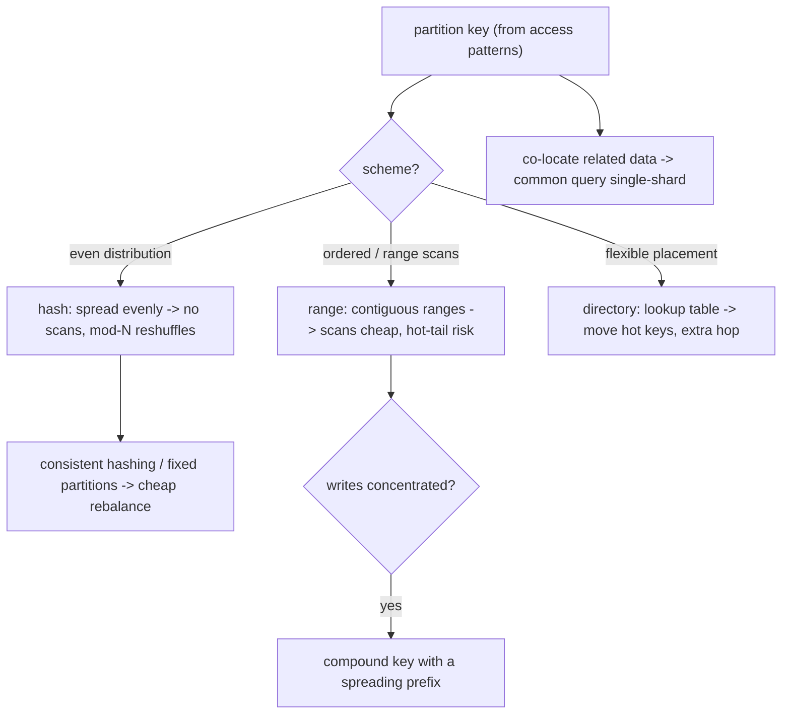

## Thesis

Sharding is horizontally partitioning data across multiple nodes when one node can no longer hold the data or serve the write load --- and it is primarily a *design decision* dominated by two choices: the **partition key** and the **partitioning scheme**. The key determines everything downstream: a good key spreads data and load evenly *and* keeps the common queries on a single shard, while a bad key creates a hot shard (a celebrity, a monotonically-increasing key) or forces every query to scatter-gather across all shards. The scheme (range, hash, or directory) trades range-query support against even distribution. And the genuinely hard part is operational --- resharding a live system without downtime, queries and transactions that span shards, rebalancing when shards grow uneven --- which is exactly why sharding is a *last resort* you defer until read replicas, caching, and vertical scaling are exhausted.

## Sub

**Why: one node cannot hold the data or the write load** -> **choose a partition key and a scheme (range / hash / directory)** -> **avoid hot shards, and handle cross-shard queries, transactions, and resharding** -> **zoom out** to consistent hashing as a rebalancing technique, co-locating related data, when *not* to shard, and the operational cost that makes it a last resort.

## Spine

- **Sharding splits data horizontally when one node is not enough** --- you partition rows across nodes to scale storage and write throughput past a single machine's ceiling, but it is a last resort (after read replicas, caching, and vertical scaling) because it adds real, permanent complexity.
- **The partition key is the most important decision** --- it determines whether data and load spread evenly and whether the common queries stay on one shard; the wrong key creates a hot shard that bottlenecks the whole system, or forces every query to fan out to all shards.
- **The scheme trades range-queries against even distribution** --- **range** partitioning keeps ordered data together (great for range scans, prone to hot spots on the active range); **hash** partitioning spreads evenly (but kills range scans); **directory/lookup** partitioning is the most flexible (but needs a lookup service on the path).
- **The hard part is operational** --- resharding a live system without downtime, queries and transactions that span shards (scatter-gather, distributed transactions), and rebalancing when shards grow uneven --- which is why you choose a key that co-locates related data and shard as late as you possibly can.

## Companion Notes

### walk

Splitting a dataset that outgrew one node

One dataset walked from a single overloaded node to a sharded design --- why you shard only as a last resort, how the partition key and the scheme (range / hash / directory) decide everything, how a bad key creates hot shards and scatter-gather, and how you reshard a live system without downtime.

Say it as two decisions and a warning: the partition key (even spread plus common query on one shard) and the scheme (range vs hash vs directory), with resharding and cross-shard queries as the operational cost that makes sharding a last resort.

### drill

Partitioning-design reps

Graded reps on when to shard, choosing a partition key, the range/hash/directory schemes, hot shards, and resharding --- the ones that separate "we split the database" from a partitioning design that spreads evenly and stays operable.

Anchor on the key and the scheme: a good key spreads load and keeps the common query on one shard; range vs hash trades scans against even distribution; and mod-N reshuffles everything on resize, which is why consistent hashing exists.

## Drill

SDE2 | what sharding is, why, and the schemes
SDE3 | choosing keys, hot shards, cross-shard, resharding
Staff | co-location, global indexes, zero-downtime resharding

### SDE2 | what sharding is

What is sharding, and how is it different from replication?

**Sharding** (horizontal partitioning) splits a dataset into disjoint subsets --- **shards** --- each held on a different node, so each node stores only *part* of the data. **Replication** copies the *same* data to multiple nodes. They solve different problems and compose: replication is for **availability and read scaling** (every replica has everything, so you can lose one or spread reads), while sharding is for **capacity and write scaling** (the data is too big or the write rate too high for one node, so you split it). A real system does both --- shard the data across N nodes, then replicate *each shard* to a few nodes for durability and read scaling. The key distinction to state cleanly: replicas are copies (redundancy), shards are partitions (division). If your problem is "reads are too many" you add replicas; if it is "the data or the writes are too much for one machine" you shard.

### SDE2 | why shard at all

What forces you to shard, given that it adds complexity?

A **single node's ceiling** --- on either **storage** (the dataset no longer fits on one machine's disk/memory) or **write throughput** (one primary cannot absorb the write rate, and unlike reads you cannot just add replicas because every replica must apply every write). Reads you can scale with replicas and caching; writes and raw capacity you eventually cannot, because a single primary is the write bottleneck and a single machine has a size limit. So sharding is the answer specifically to **write-scaling and capacity limits**: by partitioning the data, each shard handles only its slice of the writes and holds only its slice of the data, and you scale by adding shards. That is also why it is a last resort --- you exhaust the cheaper options (vertical scaling to a bigger machine, read replicas, caching, archiving cold data) first, and only shard when the write rate or data size genuinely exceeds what one node plus replicas can do, because sharding's complexity is permanent.

### SDE2 | sharding is a last resort

Why is "just shard it" often the wrong first move?

Because sharding adds **permanent, pervasive complexity** --- cross-shard queries and joins become scatter-gather or impossible, transactions that span shards need distributed protocols or must be avoided, resharding is a hard operational project, secondary indexes get complicated, and every query now has to know or discover which shard(s) to hit. So you reach for the cheaper wins first: **vertical scaling** (a bigger machine is astonishingly capable and buys years), **read replicas** (if reads are the pressure), **caching** (offload hot reads entirely), **archiving/tiering** cold data out of the hot path, and schema/query optimization. Only when the *write rate* or *data size* genuinely exceeds a single well-provisioned primary do you shard --- and then you design the key carefully, because a bad sharding decision is very expensive to reverse. "Shard last" is not laziness; it is recognizing that the complexity is forever and the alternatives often suffice for a long time.

### SDE2 | the partition key

What is a partition (shard) key, and why is it the most important decision in sharding?

The **partition key** is the column (or columns) whose value decides which shard a row lives on --- the sharding scheme maps the key to a shard (by range, by hash, or by a lookup). It is the most important decision because it determines two make-or-break properties: **distribution** (does data and load spread evenly across shards, or does one shard get a disproportionate share --- a hot shard) and **query locality** (do the *common* queries include the key, so they hit a single shard, or must they fan out to all shards because they filter on something else). A great key spreads evenly *and* matches the dominant access pattern (e.g. sharding by `user_id` when almost every query is scoped to a user). A poor key --- one with skew (a few values dominate) or one that is not in the common queries --- gives you hot shards or scatter-gather. And it is hard to change later, so you choose it up front based on the access patterns. The key is the whole game: get it right and sharding is transparent; get it wrong and you fight it forever.

### SDE2 | range vs hash partitioning

What is the difference between range-based and hash-based sharding?

**Range partitioning** assigns *contiguous ranges* of the key to shards --- e.g. users A-F on shard 1, G-M on shard 2, timestamps for January on shard 1, February on shard 2. It keeps ordered data together, so **range scans** ("all events in this time window," "users alphabetically") hit few shards, but it is prone to **hot spots**: if writes cluster in one range (the latest timestamp, the newest ids), one shard takes all the load. **Hash partitioning** applies a hash function to the key and assigns by the hash --- e.g. `hash(user_id) % N` --- which **spreads data and load evenly** (a good hash scatters even skewed keys), but **destroys range queries** (adjacent keys land on random shards, so a range scan must hit all of them). The trade is direct: range gives you efficient ordered scans at the risk of hot spots; hash gives you even distribution at the cost of range scans. You choose based on whether your workload needs range queries (favor range, and mitigate hot spots) or even write distribution (favor hash).

### SDE2 | a hot shard

What is a hot shard, and what typically causes one?

A **hot shard** is one shard receiving a disproportionate share of the traffic or data while the others sit idle --- so the system's throughput is capped by that single overloaded shard, defeating the point of sharding. Common causes: a **skewed key** where a few values dominate (a "celebrity" user or a huge tenant whose rows all hash to one shard --- the celebrity problem); a **monotonically-increasing key** used with range partitioning (every new write has the latest timestamp/id, so it all lands on the last shard --- the "hot tail"); or simply a **low-cardinality key** (sharding by `country` when 80% of traffic is one country). The symptom is uneven shard load --- one shard's CPU/disk/latency pegged while the rest are underused. The fixes depend on the cause: pick a higher-cardinality, more evenly-distributed key; add a hash or a random/derived suffix to spread a hot key across shards; give a known hot entity its own dedicated shard; or use hash partitioning to avoid the monotonic-tail problem. A hot shard is the classic sharding failure, and it almost always traces back to the partition-key choice.

### SDE2 | the cross-shard query problem

Once data is sharded, why do some queries become expensive, and what is scatter-gather?

Because a query that does **not** filter on the partition key cannot be routed to a single shard --- the system does not know which shard(s) hold the matching rows, so it must **query every shard and combine the results**, which is called **scatter-gather** (or fan-out/fan-in). That is expensive for several reasons: it hits all N shards (N times the work), it is as **slow as the slowest shard** (tail latency dominates --- one slow shard delays the whole result), and combining/sorting/paginating across shards is complex (a global sort or a top-K needs partial results from every shard). Joins across shards are even worse (there is no single node with both sides). This is why the partition key must match the common queries: a query on the key hits one shard (fast), while a query on a non-key attribute fans out to all (slow). The design response is to choose the key so the *dominant* queries are single-shard, and to serve the unavoidable cross-shard queries a different way (a secondary index, a search system, or a denormalized read model) rather than scatter-gathering the primary store on the hot path.

### SDE3 | choosing a good partition key

What makes a partition key good, and how do you choose one?

A good key satisfies two things at once: **high cardinality and even distribution** (so data and load spread across all shards with no hot shard), and **presence in the dominant queries** (so the common access patterns hit a single shard rather than scatter-gathering). You choose it by studying the **access patterns first**: what are the highest-volume queries, and what do they filter by? If almost everything is scoped to a user, `user_id` is a strong candidate (even distribution across many users, and most queries include it); for a multi-tenant system, `tenant_id` co-locates a tenant's data (great for tenant-scoped queries, but watch for a giant tenant creating a hot shard). Sometimes you use a **composite key** (`tenant_id` + `user_id`) to both co-locate and spread. Anti-choices: a low-cardinality key (few distinct values -> few effective shards, hot shards), a monotonic key with range partitioning (hot tail), or a key absent from the common queries (everything fans out). The discipline is that the key is chosen from the *query patterns*, not the data model --- you shard on what you query by, so the queries stay single-shard, and you verify the chosen key distributes evenly for your actual data.

### SDE3 | range partitioning in depth

When is range partitioning the right choice, and how do you handle its hot-spot risk?

Range partitioning is right when your workload is **range-scan heavy** and the key has a natural order you query by --- time-series data queried by time window, records browsed alphabetically or by sequential id, any "give me everything between X and Y" pattern. Contiguous ranges on a shard make those scans hit one or a few shards instead of all of them, which hash partitioning cannot do. Its danger is the **hot spot**: if writes (or reads) concentrate at one end of the range --- the newest timestamp, the latest ids, today's data --- one shard absorbs it all (the hot tail), which is common because most systems write "now." Mitigations: **compound the key** so the leading component spreads load and the range component still orders within it (e.g. shard by `(hash_bucket, timestamp)` so writes spread across buckets but each bucket is time-ordered --- the pattern DynamoDB and Bigtable use); **pre-split** ranges based on expected distribution rather than letting one range grow unbounded; and **split hot ranges** dynamically (an auto-sharding system like HBase/Bigtable splits a range that grows too large or too hot). So you keep range partitioning's scan efficiency while breaking up the concentration that causes the hot tail --- the key insight is that a pure monotonic range key is the hot-spot trap, and a *compound* key with a spreading prefix fixes it.

### SDE3 | hash partitioning and the mod-N problem

Hash partitioning spreads data evenly. What breaks when you add or remove a shard, and how is it solved?

Naive hash partitioning uses **`hash(key) % N`** to pick a shard, which distributes evenly --- but the moment you change **N** (add or remove a shard), **almost every key's `% N` result changes**, so nearly the entire dataset has to move to a different shard. That makes resharding catastrophic: adding one node to a 10-node cluster remaps ~90% of keys, a massive, disruptive data migration. The solution is **consistent hashing**: keys and nodes are mapped onto a hash ring, and a key belongs to the next node clockwise, so adding or removing a node only remaps the keys in *that node's arc* (~1/N of the data) rather than all of them --- and virtual nodes smooth the distribution. (An alternative in some systems is a **fixed large number of logical partitions** --- e.g. 1024 --- distributed across the physical nodes, so adding a node just reassigns whole partitions without rehashing keys.) The point to make: `hash % N` is the trap that makes hash-sharded systems painful to scale, and consistent hashing (or fixed logical partitions) is the technique that makes rebalancing cheap --- which is exactly why the consistent-hashing algorithm exists as its own topic.

### SDE3 | directory-based partitioning

What is directory (lookup) based partitioning, and what does it buy and cost?

Directory-based partitioning uses an explicit **lookup table/service** that maps each key (or key range, or bucket) to its shard --- instead of *computing* the shard from the key (hash or range), you *look it up*. What it buys is **maximum flexibility**: you can place any key on any shard, move a hot key to a dedicated shard, rebalance by just updating the mapping (no rehashing), and split/merge shards freely --- the mapping is data you control, not a function you are bound by. What it costs is a **lookup on the path** (every operation consults the directory, adding a hop and latency, though the mapping is small and heavily cached) and a **new critical dependency** (the directory service must be highly available and consistent, or a stale/unavailable mapping routes queries wrong --- so it is itself replicated and cached carefully). It is the model many large systems use (a metadata/placement service that tracks which shard owns what), because the operational flexibility --- especially for rebalancing and isolating hot keys --- outweighs the extra hop. The trade in one line: directory partitioning turns shard placement into mutable data (flexible, rebalanceable) at the cost of a lookup hop and a critical placement service.

### SDE3 | the celebrity / hot-key problem

One key gets vastly more traffic than the rest (a celebrity user, a viral item). Sharding by that key still overloads one shard. How do you fix it?

The problem is that **all of the hot key's traffic lands on the single shard that owns it**, so no amount of adding shards helps --- the hotness is concentrated on one value, not spread across the keyspace. Fixes, by situation: **split the hot key** by appending a suffix so it spreads across multiple shards --- e.g. write the celebrity's data as `celebrity_id:0` ... `celebrity_id:9` across 10 shards, and read by fanning out across the suffixes and merging (trades a scatter-read for spreading the write load); **give the hot entity a dedicated shard** (or dedicated capacity) so its load does not affect others and can be scaled independently; **cache the hot key aggressively** (a celebrity's profile is read-heavy and cacheable, so a cache absorbs most reads before they hit the shard); or **replicate the hot key** to more read replicas if reads dominate. The choice depends on read-vs-write and whether the hot keys are known in advance (dedicated shard) or emergent (dynamic splitting/caching). The staff framing: a hot key is a *concentration* problem that generic sharding cannot solve because sharding spreads the *keyspace*, not a single key's load --- so you either spread that one key artificially (suffixing) or handle it out-of-band (dedicated capacity, caching, replication).

### SDE3 | cross-shard transactions

A transaction needs to touch data on two different shards. What are your options?

Three, in rough order of preference. **Avoid it by co-locating**: choose the partition key so the data that participates in a transaction lands on the same shard (e.g. shard by `account_id` so a transfer *within* an account is single-shard, or model the aggregate so its consistency boundary is one shard) --- the best cross-shard transaction is the one you designed away. When you cannot avoid it: a **saga** --- break the operation into a sequence of local (single-shard) transactions with compensating actions to undo on failure, giving eventual consistency without a distributed lock (the saga topic) --- appropriate for most business workflows. Or a **distributed transaction / two-phase commit (2PC)** --- a coordinator prepares all shards then commits, giving atomicity across shards but with real costs: it holds locks across a network round-trip (latency, reduced throughput), and it blocks if the coordinator fails mid-commit (the classic 2PC availability problem). The staff point is that cross-shard *atomic* transactions are expensive and fragile, so the mature approach is to **design the shard key to keep transactional data together** and fall back to a saga for cross-shard workflows, reserving 2PC (or a system like Spanner that makes it efficient with special infrastructure) for the rare cases that genuinely need synchronous cross-shard atomicity.

### SDE3 | resharding and rebalancing

Your shards have grown uneven, or you need to add capacity. How do you rebalance without a catastrophic migration?

The goal is to move as **little data as possible** while restoring balance, which rules out naive `hash % N` (changing N moves almost everything). The techniques: **consistent hashing** so adding/removing a node only remaps its arc (~1/N of keys) rather than all of them; or a **fixed large number of logical partitions** (say 1024) mapped onto physical nodes, so adding a node just **reassigns whole partitions** (moving those partitions' data) without rehashing individual keys --- the approach many systems use because it decouples the (stable) key-to-partition mapping from the (mutable) partition-to-node mapping; or **dynamic splitting** where a partition that grows too large or too hot is **split** into two (range systems like HBase/Bigtable do this automatically). For the *live migration* itself, you typically **double-write** to old and new locations during a transition, **backfill** the existing data in the background, verify, then **cut over** reads and stop the old writes --- all without downtime. The principle: make the mapping-to-nodes mutable and cheap to change (fixed partitions or consistent hashing), so rebalancing moves a bounded fraction of data, and do the actual move as a background double-write-backfill-cutover rather than a stop-the-world copy.

### Staff | relationship to consistent hashing

How does consistent hashing relate to sharding --- are they the same thing?

No --- **sharding is the design decision** (partition the data horizontally across nodes; choose a key and a scheme), and **consistent hashing is one *technique* for the hash-partitioning scheme**, specifically for making *rebalancing* cheap. Sharding is the broader concern: whether to partition at all, what the partition key is, whether to use range/hash/directory partitioning, how to handle hot shards and cross-shard queries. Within that, *if* you choose hash partitioning, you need a mapping from key to node that does not reshuffle everything when the node count changes --- and consistent hashing (or fixed logical partitions) is how you get that: it is the answer to the mod-N problem, minimizing data movement on resize. So consistent hashing does not decide *what* to shard on or *how* to handle range queries or hot keys --- it decides *how to place hashed keys on nodes so that adding/removing a node is cheap*. In an interview: sharding is the strategy (key + scheme + operations), consistent hashing is a specific algorithm you reach for inside the hash-partitioning branch to make rebalancing efficient. Conflating them is a common imprecision; separating "the partitioning design" from "the placement/rebalancing algorithm" is the senior distinction.

### Staff | co-locating related data

Why is co-locating related data on the same shard such a powerful lever, and how do you achieve it?

Because the two most expensive things in a sharded system --- **cross-shard queries** and **cross-shard transactions** --- both disappear when the related data lives on one shard. If a user's orders, profile, and cart are all on the same shard, a query for "this user's data" hits one shard (no scatter-gather) and a transaction across them is a local transaction (no 2PC/saga). So co-location converts distributed problems into single-node ones. You achieve it by choosing the partition key to be the **common ancestor / consistency boundary** of the related data --- shard everything by `user_id` (or `tenant_id`, or `account_id`) so all rows belonging to that entity share a shard. This is why entity-oriented or hierarchical sharding is so common: you pick the top of the hierarchy that most queries and transactions are scoped to, and partition by it, so the natural access patterns stay single-shard. The trade-off to name: co-locating optimizes the *entity-scoped* queries at the expense of *cross-entity* queries (which now fan out) and risks a hot shard if one entity is huge --- so it works when the workload is dominated by entity-scoped access (which most OLTP workloads are). The staff instinct is to choose the shard key as the aggregate/tenant boundary precisely to keep queries and transactions local.

### Staff | secondary indexes across shards

You sharded by user_id, but you need to query by email (a non-partition-key attribute). How do you support that?

Two models, each with a trade. A **local (per-shard) secondary index**: each shard indexes its own rows by email, so a query by email has no idea which shard holds it and must **scatter-gather** every shard's local index (fan-out, tail-latency, N times the work) --- simple to maintain (the index is local and consistent with the shard's data) but slow to query for a global lookup. A **global secondary index**: a separate index, itself partitioned by the *indexed* attribute (email), that maps email -> the location of the row, so a query by email hits **one** index shard then one data shard (no fan-out) --- fast to query but harder to keep consistent (the index is on a different shard from the data it points to, so updating a row means updating a remote index, which is often done **asynchronously**, making the global index eventually consistent). The choice: use a local index when the non-key queries are rare or you can tolerate fan-out; use a global index (or an external search/secondary store fed by CDC) when you frequently query by a non-partition-key attribute and need it fast. The staff point is that a secondary access path in a sharded system is itself a partitioning decision --- you either fan out over local indexes (consistent, slow) or maintain a separately-partitioned global index (fast, eventually consistent), and DynamoDB's LSI vs GSI is exactly this distinction.

### Staff | resharding a live system with zero downtime

Walk me through resharding a production database (e.g. splitting one shard into two) without downtime.

The pattern is **double-write, backfill, verify, cut over** --- never a stop-the-world copy. Steps: (1) **Provision** the new shard(s) and decide the new key-to-shard mapping (ideally via a directory/placement service or logical partitions so the mapping is mutable data). (2) **Dual-write**: start writing every new write to *both* the old and the new location (the application or a proxy routes writes to both), so the new shard stays current from this point forward. (3) **Backfill**: copy the existing historical data from the old shard to the new one in the background, in batches, throttled so it does not overwhelm production --- reconciling against the dual-writes so nothing is missed. (4) **Verify**: compare old and new (row counts, checksums, sampled reads) until they match. (5) **Cut over reads**: flip reads to the new shard (often gradually --- a percentage, or per-key via the directory), monitoring for correctness and latency. (6) **Stop dual-writes** to the old location and decommission it once you are confident and have a rollback window. Throughout: keep the mapping in a placement service so routing is a config change (and reversible), make writes idempotent so the backfill/dual-write overlap does not corrupt data, and keep the ability to roll back reads to the old shard until the very end. The staff framing: resharding is a *migration program* (dual-write + backfill + verify + gradual cutover + rollback), not a copy command --- and the reason to defer sharding is that every reshard is this much work.

### Staff | when NOT to shard, and alternatives

Before sharding, what alternatives do you exhaust, and when is sharding genuinely the wrong answer?

You exhaust, roughly in order: **vertical scaling** (a bigger instance --- modern machines are enormous and buy years, and it is zero application complexity); **read replicas** (if reads are the bottleneck, not writes/capacity); **caching** (offload hot reads entirely, often the highest-leverage move); **archiving/tiering** cold data out of the hot dataset (a lot of "too much data" is old data that could live in cheaper storage); **schema and query optimization** (indexes, denormalization, removing N+1s); and **functional partitioning / service decomposition** (split *different kinds* of data into separate databases per service, which scales without the complexity of sharding one dataset). Sharding is genuinely the wrong answer when your problem is *reads* (replicas/cache solve it), when the data would fit after archiving cold rows, when a bigger machine is still affordable, or when you have not yet optimized the schema/queries --- because you would take on permanent complexity to solve a problem a cheaper lever handles. It is the *right* answer only when the **write throughput or data size genuinely exceeds a single well-provisioned primary (plus replicas)**, and you have a clear partition key from the access patterns. The staff position: sharding is a real, sometimes necessary tool, but it is the *heaviest* one, so you reach for it last and only for write-scaling/capacity, not as a reflex for any scaling pressure.

### Staff | cross-shard fan-out and tail latency

A query has to fan out to all shards. Beyond "it does more work," why is fan-out especially bad at scale, and what do you do about it?

Because a scatter-gather query is **as slow as the slowest shard it touches**, and with many shards the probability that *at least one* is slow (a GC pause, a hot moment, a struggling node) approaches certainty --- so tail latency dominates and gets *worse* as you add shards, even though each shard's individual latency is fine. This is the tail-at-scale problem: p99 of the fan-out is driven by the max over N shards, so a query over 100 shards routinely waits on whichever one is momentarily slow. Mitigations: **avoid the fan-out** by design (choose the key so the query is single-shard, or serve it from a differently-partitioned index/read-model) --- the real fix; **hedged requests** (send to a replica of the slow shard after a short delay and take the first response) to cut the tail; **request only the shards that can have matches** (partition pruning) if the query has any selectivity on the key; and **bound the fan-out** (cap how many shards a single query may hit, or pre-aggregate). The staff framing is that fan-out queries do not just cost more --- they inherit the *worst* latency of all shards they touch, which is why a sharded primary should serve single-shard queries and the cross-cutting queries should come from a purpose-built, differently-partitioned path (search index, materialized read model) rather than scatter-gathering the shards on the hot path.

### Staff | telling the sharding story

How do you present a sharding decision well in a system-design interview?

Lead with **restraint and the key**: "First, I would confirm sharding is actually needed --- if it is reads, replicas and caching; if it is capacity, archiving and a bigger machine first --- because sharding's complexity is permanent, so it is a last resort for genuine write-scaling or data-size limits." Then make the **partition key** the centerpiece, driven by access patterns: "I would shard by the entity most queries are scoped to --- say `user_id` --- so the dominant queries stay single-shard and the load spreads evenly across many users; I would check for hot shards (a huge tenant, a monotonic key) and mitigate by suffixing or a dedicated shard." Then the **scheme trade** ("hash for even distribution since I do not need range scans here, or range with a spreading prefix if I do") and the **operational plan** ("consistent hashing or fixed logical partitions so rebalancing is cheap; cross-shard queries served from a global index or a search store rather than scatter-gather; cross-shard transactions avoided by co-location or handled with a saga; and resharding done as dual-write-backfill-cutover, not a stop-the-world copy"). Ground it in the concrete workload and close on the principle: sharding is a last-resort write-scaling tool whose success is decided almost entirely by the partition key --- so you defer it, and when you do it, you choose the key from the query patterns to keep the common access single-shard.

## Walk

### One node is not enough

```flow
single[single node holds everything] -> ceiling[hits a ceiling: data size or write throughput] -> last[shard, but only after replicas, cache, and vertical scaling]
```

Start with the pressure and the restraint. A single node holds the whole dataset and takes every write --- fine until it hits a ceiling on **storage** (the data no longer fits) or **write throughput** (one primary cannot absorb the write rate, and you cannot fix writes with replicas because every replica must apply every write).

But sharding is a **last resort**, because its complexity is permanent --- cross-shard queries, distributed transactions, resharding, complicated indexes. So you exhaust the cheaper levers first: vertical scaling (a bigger machine buys years), read replicas (if reads are the pressure), caching (offload hot reads), archiving cold data. Only when the *write rate or data size* genuinely exceeds a single well-provisioned primary do you shard --- and then the whole outcome rides on the next decision.

### Choose the partition key and the scheme

```flow
key[partition key from the access patterns] -> scheme[range for scans, hash for even spread, directory for flexibility] -> good[even distribution plus common query on one shard]
```

The **partition key** is the decision that makes or breaks sharding: it must spread data and load **evenly** (high cardinality, no skew) *and* appear in the **common queries** so they hit a single shard instead of fanning out. You choose it from the access patterns --- shard by the entity most queries are scoped to (`user_id`, `tenant_id`).

The **scheme** maps the key to a shard, and the mapping is where `hash % N` bites:

```python
def shard_for(key, num_shards):
    return hash(key) % num_shards      # even spread... but mod-N is the trap

# add one shard (N: 4 -> 5) and almost every key's shard changes:
moved = sum(1 for k in all_keys
            if shard_for(k, 4) != shard_for(k, 5))   # ~80% of keys move!
```

**Range** partitioning keeps ordered data together (great for range scans, prone to a hot tail); **hash** spreads evenly (kills range scans, and naive `% N` reshuffles everything on resize); **directory** partitioning looks the shard up in a table (maximally flexible, at the cost of a lookup hop). The trade is scans-vs-even-distribution, and the mod-N problem is why consistent hashing exists.

### Avoid hot shards, and handle cross-shard queries

```flow
bad[a skewed or monotonic or non-query key] -> pain[a hot shard, or scatter-gather on every query] -> fix[co-locate related data, suffix or isolate hot keys]
```

A bad key produces the two classic failures. A **hot shard**: a skewed key (a celebrity, a giant tenant), a monotonic key with range partitioning (the hot tail), or low cardinality --- one shard is pegged while the rest idle, capping throughput. **Scatter-gather**: a query that does not filter on the key must hit *every* shard and is as slow as the slowest one (tail latency), because the system cannot route it.

The fixes trace back to the key. Spread a hot key by suffixing it across shards (`celebrity:0..9`) or give a known hot entity a dedicated shard (or cache it). Keep the *common* queries single-shard by co-locating related data under one key (all of a user's data on the user's shard), and serve the unavoidable cross-cutting queries from a **differently-partitioned path** --- a global secondary index or a search store fed by CDC --- rather than scatter-gathering the primary on the hot path.

### Reshard without downtime

```flow
modn[mod-N reshuffles almost everything] -> stable[consistent hashing or fixed logical partitions moves ~1/N] -> live[dual-write, backfill, verify, cut over]
```

Rebalancing must move **as little data as possible**, so you avoid `hash % N` (changing N moves ~everything) in favor of **consistent hashing** (adding a node remaps only its arc, ~1/N of keys) or a **fixed large number of logical partitions** mapped onto physical nodes (adding a node reassigns whole partitions, no rehashing) --- decoupling the stable key-to-partition mapping from the mutable partition-to-node mapping.

The live migration itself is a **program, not a copy command**: dual-write to old and new locations so the new shard stays current, backfill the historical data in the background (throttled, idempotent), verify (counts/checksums/sampled reads), cut over reads gradually (per-percentage or per-key via a placement service), then stop the old writes with a rollback window. Every reshard is this much work --- which is the deepest reason sharding is a last resort. Two decisions and a warning: the key (even spread + single-shard common queries), the scheme (range/hash/directory), and the operational cost that says defer it.

### Model Script

- Frame the restraint | "The first thing I do with a sharding question is push back on whether it is needed. If the pressure is reads, that is replicas and caching; if it is data size, that is archiving cold data and a bigger machine. Sharding is a last resort because its complexity is permanent -- cross-shard queries, distributed transactions, resharding. You shard only when the write rate or data size genuinely exceeds one well-provisioned primary."
- The partition key | "Then the decision that makes or breaks it: the partition key. It has to do two things at once -- spread data and load evenly, so no hot shard, and appear in the common queries, so they hit one shard instead of fanning out. I choose it from the access patterns, usually the entity most queries are scoped to -- user id, tenant id. Get the key right and sharding is transparent; get it wrong and you fight hot shards and scatter-gather forever."
- The scheme and mod-N | "The scheme maps the key to a shard. Range keeps ordered data together -- great for range scans but prone to a hot tail if you write the latest timestamp every time. Hash spreads evenly but kills range scans, and naive hash mod N is a trap: change the shard count and almost every key moves. Directory partitioning looks the shard up in a table -- maximally flexible at the cost of a lookup hop. So it is scans versus even distribution, and mod-N is why consistent hashing exists."
- Hot shards and cross-shard | "Two classic failures, both from the key. A hot shard -- a celebrity, a giant tenant, a monotonic key -- caps throughput on one node; I fix it by suffixing the hot key across shards, a dedicated shard, or caching. And scatter-gather -- a query that does not filter on the key hits every shard and is as slow as the slowest one. So I co-locate related data under one key to keep the common queries single-shard, and serve the cross-cutting queries from a differently-partitioned global index or search store, not by scatter-gathering the primary."
- Interviewer: "You sharded by user_id but now you need to query by email. What do you do?"
- Secondary access path | "That is a secondary-index decision, and it is itself a partitioning choice. A local per-shard index means a query by email has no idea which shard, so it scatter-gathers all of them -- simple but slow. A global secondary index is partitioned by email itself, so a query hits one index shard then one data shard -- fast, but the index is on a different shard than the data, so it is updated asynchronously and is eventually consistent. If I query by email a lot, I build the global index -- or feed a search store via CDC. That is exactly DynamoDB's LSI versus GSI."
- Land it | "So: shard as a last resort for write-scaling or capacity; the partition key is the whole game -- even distribution plus common queries single-shard, chosen from the access patterns; the scheme trades scans against even spread; consistent hashing or fixed logical partitions makes rebalancing cheap; cross-shard queries come from a differently-partitioned path and cross-shard transactions are co-located away or handled with a saga; and resharding is a dual-write-backfill-cutover program, not a copy. The one line is that sharding's success is decided almost entirely by the partition key, so you defer it and choose the key from the queries."

## Whiteboard

Sketch why the partition key decides everything, and how the schemes trade off.

### Why does the partition key decide whether sharding works?

Because it controls the two things that make or break a sharded system: **distribution** (does load and data spread evenly, or does one shard get a skewed share --- a hot shard that caps throughput) and **query locality** (do the common queries include the key, so they hit one shard, or must they scatter-gather every shard because they filter on something else). A key that is high-cardinality, evenly distributed, and present in the dominant queries makes sharding transparent; a skewed, low-cardinality, or non-query key gives you hot shards and fan-out. And it is expensive to change, so it is chosen up front from the access patterns.

### How do range, hash, and directory partitioning trade off?

Range keeps contiguous key ranges together --- efficient range scans, but a hot spot when writes concentrate at one end (the monotonic tail). Hash spreads evenly via a hash of the key --- no hot tail, but range scans must hit all shards, and naive `% N` reshuffles everything on resize (so you use consistent hashing). Directory looks the shard up in a mutable table --- maximally flexible (move hot keys, rebalance by editing the map) at the cost of a lookup hop and a critical placement service. The choice is scans-vs-even-distribution, plus how you want rebalancing to work.



Verdict: choose the partition key from the access patterns (even spread + common query single-shard) -> pick the scheme by scans-vs-distribution (range / hash / directory) -> make rebalancing cheap (consistent hashing or fixed partitions) -> serve cross-shard queries from a differently-partitioned path, not scatter-gather.

## System

Zoom out to how a sharded data layer is laid out and its cross-cutting concerns.

### Where it sits

Partition key: chosen from the access patterns -- decides distribution and query locality [*]
Scheme: range (scans) / hash (even + consistent hashing) / directory (flexible + lookup)
Routing: the key maps to a shard; a non-key query fans out (scatter-gather)
Hot shards: skew / monotonic / low-cardinality -> suffix, dedicated shard, or cache
Operations: consistent hashing / fixed partitions for rebalance; dual-write-backfill-cutover for reshard

### Pivots an interviewer rides

From "shard this" they push on the key and the operational cost.

#### How do you pick the partition key?

-> from the access patterns: even distribution plus the common queries on a single shard
Shard by the entity most queries are scoped to (user/tenant/account) so the dominant access is single-shard and load spreads across many values; check for a hot shard (a giant tenant, a monotonic key) and mitigate with a suffix or a dedicated shard.

#### How do you reshard without moving everything?

-> consistent hashing or fixed logical partitions, then dual-write, backfill, verify, cut over
Naive hash mod N moves ~all keys on resize, so you use consistent hashing (remap one arc) or fixed partitions (reassign whole partitions); the live move is a background dual-write + backfill + gradual cutover with rollback, never a stop-the-world copy.

## Trade-offs

The calls that separate "we split the database" from a partitioning design.

### Range vs hash partitioning

- Range: efficient range scans and ordered access (few shards per scan) -- but hot spots when writes concentrate at one end (the monotonic tail)
- Hash: even data and load distribution (no hot tail) -- but range scans must hit all shards, and naive % N reshuffles everything on resize

Hash when you need even write distribution and do not need range scans (with consistent hashing for rebalancing); range when the workload is range-scan heavy -- and then use a compound key with a spreading prefix to break up the hot tail.

### Shard vs do not shard (yet)

- Shard: scales write throughput and capacity past a single node's ceiling -- but permanent complexity (cross-shard queries/transactions, resharding, complex indexes)
- Do not shard: keep the simplicity of one logical database -- but bounded by a single primary's write rate and a single machine's size

Exhaust replicas, caching, archiving, and vertical scaling first; shard only when the write rate or data size genuinely exceeds a well-provisioned primary -- because sharding's complexity is forever and the alternatives usually buy years.

### Co-locate vs global secondary index

- Co-locate under one key: common entity-scoped queries and transactions stay single-shard (fast, local) -- but cross-entity queries fan out and a huge entity risks a hot shard
- Global secondary index (partitioned by the indexed attribute): fast lookups on a non-partition-key attribute (one index shard + one data shard) -- but the index is remote from its data, so it is updated asynchronously and is eventually consistent

Co-locate by the entity the workload is dominated by (keeping the hot path single-shard), and add a global index (or a CDC-fed search store) for the specific non-key attributes you query often -- accepting its eventual consistency.

## Model Answers

### the reframe | Sharding is a last resort decided by the partition key

The frame to lead with.

- Confirm it is needed: reads -> replicas/cache; capacity -> archive/vertical first | key | the complexity is permanent
- The partition key decides distribution and query locality | store | even spread + common query single-shard, from the access patterns
- The scheme trades range-scans against even distribution | note | range / hash / directory

### the depth | Hot shards, cross-shard, and rebalancing

Where it is really tested.

- A hot shard is concentration, not a keyspace problem | key | suffix the hot key, dedicate a shard, or cache it
- mod-N reshuffles everything; consistent hashing / fixed partitions fix rebalancing | store | reshard = dual-write + backfill + cutover
- Cross-shard queries fan out (tail latency); transactions want co-location or a saga | note | secondary access = local (fan-out) vs global (async) index

## Numbers

Back-of-envelope shard count and the migration cost of naive hashing vs a rebalance-friendly scheme.

Shards needed = data / per-shard capacity; and naive hash mod N moves a huge fraction of keys on a resize, while consistent hashing moves only about 1/N.

- data | Total data (GB) | 4000 | 0 | 100
- cap | Per-shard capacity (GB) | 500 | 1 | 50
- keys | Total keys (millions) | 800 | 0 | 10

```js
function (vals, fmt) {
  var data = vals.data, cap = vals.cap, keys = vals.keys;
  var shards = Math.max(1, Math.ceil(data / cap));
  var evenPerShard = data / shards;
  var modNmoved = keys * (shards > 0 ? (shards - 1) / shards : 0);   // ~ (N-1)/N move on adding one
  var chMoved = keys / (shards + 1);                                 // consistent hashing: ~1/N moves
  function r(x, d) { var m = Math.pow(10, d); return Math.round(x * m) / m; }
  return [
    { k: 'Shards needed', v: fmt.n(shards), u: 'nodes', n: 'ceil(total data / per-shard capacity) = ceil(' + fmt.n(data) + ' / ' + fmt.n(cap) + ') \u2014 plus headroom, and each shard is itself replicated for durability', over: false },
    { k: 'Even load / shard', v: '~' + fmt.n(r(evenPerShard, 0)) + ' GB', u: 'if the key spreads', n: 'the ideal per-shard data with an evenly-distributed key; a skewed key puts far more on one shard \u2014 the hot-shard failure', over: false },
    { k: 'Keys moved: hash % N resize', v: '~' + fmt.n(Math.round(modNmoved)) + 'M', u: 'of ' + fmt.n(keys) + 'M', n: 'adding one shard to a mod-N scheme remaps roughly (N-1)/N of all keys \u2014 a catastrophic migration, which is why naive hashing does not scale', over: true },
    { k: 'Keys moved: consistent hashing', v: '~' + fmt.n(r(chMoved, 0)) + 'M', u: 'of ' + fmt.n(keys) + 'M', n: 'consistent hashing (or fixed logical partitions) remaps only ~1/N of keys on resize \u2014 a bounded, background migration', over: false },
    { k: 'Migration reduction', v: (chMoved > 0 ? fmt.n(Math.round(modNmoved / chMoved)) : '0') + 'x', u: 'less data moved', n: 'consistent hashing moves this many times less data than mod-N on a resize \u2014 the whole reason it exists as a rebalancing technique', over: false }
  ];
}
```

## Red Flags

What makes an interviewer wince.

### "We hash the key mod the number of shards"

Naive `hash(key) % N` distributes evenly but reshuffles almost the entire dataset whenever N changes (adding one shard to ten remaps ~90% of keys) -- so the cluster is catastrophic to scale.

Use consistent hashing (adding a node remaps only its arc, ~1/N of keys) or a fixed large number of logical partitions mapped onto physical nodes, so rebalancing moves a bounded fraction of the data.

### "It's getting big, let's shard it"

Sharding adds permanent complexity (cross-shard queries and transactions, resharding, complex indexes), and most scaling pressure is reads or cold data, which cheaper levers solve.

Exhaust read replicas, caching, archiving cold data, and vertical scaling first; shard only when the write throughput or data size genuinely exceeds a single well-provisioned primary.

### "We'll shard by an auto-incrementing id with range partitioning"

A monotonically-increasing key with range partitioning sends every new write to the last shard (the hot tail), so one shard takes all the write load while the rest idle -- a hot shard by construction.

Shard on a high-cardinality, evenly-distributed key present in the common queries (hash it, or use a compound key with a spreading prefix so writes fan out while data stays ordered within a bucket).

## Opener

### 30s | The one-liner

How I open when asked to shard a datastore or scale a write-bound database.

#### What is the shape?

Sharding is horizontally partitioning data across nodes when one node cannot hold the data or the write load --- and it is a last resort after replicas, caching, and vertical scaling. It is dominated by two decisions: the partition key (which must spread evenly and keep the common queries on one shard) and the scheme (range for scans, hash for even distribution, directory for flexibility).

#### What's the key move?

Get the partition key right --- chosen from the access patterns, high-cardinality and even, and present in the dominant queries --- because it decides distribution and query locality; a bad key gives you a hot shard or scatter-gather. And make rebalancing cheap (consistent hashing or fixed partitions) so resharding moves ~1/N of the data, not everything.

##### Hooks

Where an interviewer usually pushes next.

- How do you pick the key? | from access patterns: even spread + common query single-shard | drill
- What about a hot key? | suffix it across shards, dedicate a shard, or cache | drill
- Reshard without moving everything? | consistent hashing / fixed partitions + dual-write-cutover | drill

Foot: two sentences --- sharding is a last-resort write-scaling and capacity tool whose success is decided almost entirely by the partition key, so you defer it until replicas, caching, and vertical scaling are exhausted, then choose the key from the query patterns to keep the common access single-shard and the load even; and the operational realities --- hot shards, cross-shard queries and transactions, and zero-downtime resharding as a dual-write-backfill-cutover program --- are what make it heavy, so you co-locate related data under one key and use consistent hashing or fixed logical partitions to keep rebalancing cheap.

## Bank

### SCALE | A write-bound OLTP database that has outgrown its primary

Task: shard a database whose single primary can no longer absorb the write rate.
Model: first confirm it is a write/capacity problem, not reads (replicas/cache) or cold data (archive); then choose the partition key from the access patterns -- the entity most queries and transactions are scoped to (e.g. user_id or tenant_id) so the dominant access is single-shard and load spreads across many values; check for hot shards (a giant tenant, a monotonic key) and mitigate (suffix the hot key, a dedicated shard, caching); pick the scheme (hash + consistent hashing for even distribution and cheap rebalance, since range scans are not the dominant pattern); replicate each shard for durability and read scaling; serve non-partition-key queries from a global secondary index or a CDC-fed search store rather than scatter-gather; keep cross-shard transactions rare by co-locating (or use a saga); and plan resharding as dual-write + backfill + verify + gradual cutover with a placement service so routing is mutable and reversible.
Int: what single decision determines whether this succeeds?
The partition key -- it decides whether load spreads evenly (no hot shard) and whether the common queries stay single-shard (no scatter-gather); a key chosen from the access patterns makes sharding transparent, and a skewed or non-query key makes you fight it forever.

### DESIGN | Resharding a live production shard with zero downtime

Task: split one overloaded shard into two without downtime or data loss.
Model: dual-write, backfill, verify, cut over. Provision the new shard and define the new mapping via a placement service (mutable, reversible); start dual-writing every new write to both old and new locations so the new shard stays current; backfill the historical data in throttled, idempotent batches, reconciling with the dual-writes; verify with row counts, checksums, and sampled reads until they match; cut over reads gradually (per-percentage or per-key via the placement service), monitoring correctness and latency; then stop dual-writes to the old location and decommission it after a rollback window. Make writes idempotent so the backfill/dual-write overlap cannot corrupt data, and keep the ability to route reads back to the old shard until the very end.
Int: why not just take a lock, copy the data, and switch?
Because a stop-the-world copy means downtime proportional to the data size and no safe rollback if the copy is wrong; the dual-write-backfill-cutover pattern keeps the system fully available throughout, keeps both copies consistent during the transition, and lets you cut over gradually and roll back instantly if something looks off.

### Extra Curveballs

### CURVEBALL | wrong-key | A team sharded their orders table by order_id (hash). Now the product needs "show me all of a user's orders" as the top query, and it is slow. What went wrong, and what are the options?

Model: they sharded on the wrong key for their access pattern. Hashing by `order_id` spreads orders evenly (no hot shard, good) but a user's orders are scattered across *all* shards, so "all orders for user X" filters on `user_id` --- which is not the partition key --- and must **scatter-gather every shard** and merge, which is slow and gets worse with more shards (tail latency). The root cause is that the partition key was chosen from the data model (the order's own id) rather than the dominant query (user-scoped access). Options, in order of preference: (1) **Reshard by user_id** so a user's orders co-locate on one shard and the top query becomes single-shard --- correct but a full resharding program (dual-write, backfill, cutover), justified if this query truly dominates. (2) **Add a global secondary index** partitioned by `user_id` mapping user -> their orders' locations, so the query hits one index shard then targeted data shards without full fan-out --- faster to ship than a reshard, at the cost of an eventually-consistent index. (3) **A CDC-fed read model** (a separate store keyed by user_id, or a search index) that materializes "orders by user," updated from the orders stream --- decouples the query from the primary's partitioning entirely. (4) If the fan-out is tolerable in volume, **hedged requests and partition pruning** to cut the tail as a stopgap. The staff point is that this is the canonical "sharded on the wrong key" situation: the fix hierarchy is reshard-by-the-right-key (best, expensive) -> global index / read model (pragmatic, eventually consistent) -> mitigate the fan-out (stopgap) --- and the lesson is that the partition key must come from the dominant query, because changing it later is exactly this costly.

### Frames

- Sharding = horizontal partitioning for write-scaling/capacity; a last resort after replicas, caching, archiving, and vertical scaling (the complexity is permanent)
- The partition key decides everything -> even distribution (no hot shard) + common queries single-shard, chosen from the access patterns; scheme trades scans (range) vs even spread (hash) vs flexibility (directory)
- mod-N reshuffles everything -> consistent hashing / fixed partitions for cheap rebalance; cross-shard queries from a differently-partitioned path (global index / search); cross-shard transactions co-located or via saga; reshard = dual-write + backfill + cutover
