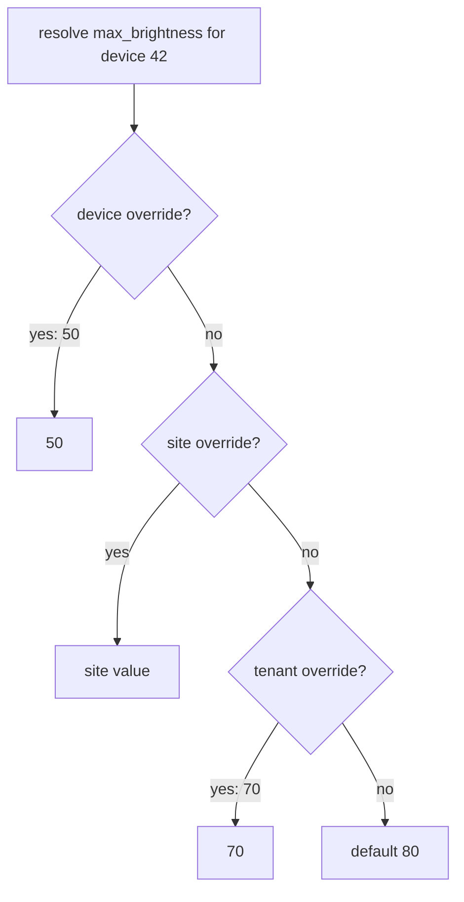

## Thesis

One shared definition holding the contract and default exactly once, plus a per-entity values table holding *only* the deviations --- resolved with a LEFT JOIN and COALESCE, and for a hierarchy a DISTINCT ON with ORDER BY specificity so the narrowest override wins in one pass. It is the keystone a rule catalog, a feature-flag hierarchy, and an EAV model all reduce to.

## Sub

**Two tables --- contract once, deviations only** -> **resolution with LEFT JOIN and COALESCE** -> **hierarchy with DISTINCT ON and ORDER BY specificity** -> **zoom out** to the polymorphic key, JSON-Schema validation, and that this is EAV --- and the pivots an interviewer rides from "store the overrides" into the missing foreign key, the JSONB trade, and when columns beat this entirely.

## Spine

- The contract and default live **exactly once** --- a definitions table holds the key, type, JSON-Schema, and default; nothing repeats them per entity.
- The values table stores **only deviations** --- a row exists only where an entity overrides the default, keyed polymorphically by `entity_type` plus `entity_id`, so one table serves any entity.
- Resolution is **LEFT JOIN plus COALESCE** --- take the override row if present, else fall back to the definition's default, in a single query.
- A hierarchy is **DISTINCT ON plus ORDER BY specificity** --- device beats site beats tenant beats default, the narrowest override winning in one pass.

## Companion Notes

### walk

A value resolving through the waterfall

One attribute resolved for one entity --- from the two tables, through the LEFT JOIN, down the specificity waterfall to the answer.

Say the trick in one breath --- "LEFT JOIN plus COALESCE: the override if it exists, else the shared default." That sentence is the pattern.

### drill

Probe Drill

Graded follow-ups on the two tables, the resolution query, the hierarchy, and the EAV trade --- the ones that separate "an overrides table" from a designed model.

Name it as EAV out loud, then defend it --- validate against the JSON-Schema on write to claw back the type safety you gave up.

## Drill

SDE2 | the model and the mechanics
SDE3 | resolution, hierarchy, and integrity
Staff | the pattern behind the patterns

### SDE2 | the problem it solves

What problem does shared-definition-plus-overrides solve?

Storing a setting that has a shared default but per-entity exceptions, without repeating the default everywhere. A definitions table holds each attribute once --- its type, validation, and default --- and a values table holds only the entities that deviate. You get one place for the contract and a small table of just the differences.

### SDE2 | the two tables

What are the two tables?

**Definitions**: the shared layer --- key, data type, a JSON-Schema, and the default value, one row per attribute. **Values**: the per-entity layer --- a reference to the definition, the entity it applies to, and the overriding value. The definition says what exists and the default; the value says where an entity differs.

### SDE2 | why store only deviations

Why store only the overrides, not a value for every entity?

Because most entities use the default, so writing a row for every entity-attribute pair explodes the table with rows that carry no information. Storing only deviations means the values table is proportional to how much the fleet actually differs from the default --- usually a small fraction --- and the default lives once in the definition.

### SDE2 | LEFT JOIN plus COALESCE

How do you resolve a value for an entity?

A LEFT JOIN from the definition to the entity's value row, then COALESCE: `COALESCE(v.value, d.default_value)`. If an override row exists, the join finds it and COALESCE returns it; if not, the join yields null and COALESCE falls back to the definition's default. One query gives the resolved value whether or not the entity overrode it.

### SDE2 | where the default lives

Where does the default value live, and why there?

In the **definition** row, once. Putting it there means changing a default is a single update, and no entity carries a stale copy. The values table never stores a default --- only a genuine override --- so the default and the deviations can't drift apart, and the default is always exactly what the definition says.

### SDE2 | the write path

What happens on a write?

Load the definition, validate the incoming value against its JSON-Schema, and only then upsert the override row. Validation first is the point: because the value column is schemaless, the schema on the definition is what enforces type and range. A value that fails the schema is rejected with a 400; a valid one is upserted and resolves on the next read.

### SDE3 | the polymorphic key

How does one values table serve devices, sites, and tenants?

A **polymorphic key**: `entity_type` plus `entity_id`. The row says "this override is for a device with id 42" or "a tenant with id 7", so one table covers every entity kind without a separate values table each. The uniqueness constraint is on definition plus entity_type plus entity_id, so an entity has at most one override per attribute.

### SDE3 | the hierarchy query

How do you resolve a hierarchy where device beats site beats tenant?

`DISTINCT ON (key)` plus `ORDER BY` a specificity rank. The join pulls any override at any level; you order each key's candidates by specificity --- device 1, site 2, tenant 3 --- and DISTINCT ON keeps the first, the narrowest. COALESCE still supplies the default if no level overrode. One pass returns each attribute resolved to its most-specific override or the default.

### SDE3 | the missing foreign key

What integrity problem does the polymorphic key create?

You lose a real **foreign key**. `entity_type` plus `entity_id` points into different tables depending on the type, and a foreign key can only target one table --- so the database can't guarantee the entity exists. You either enforce it in the application, or use separate nullable columns (`device_id`, `site_id`, `tenant_id`) each with its own foreign key and a CHECK that exactly one is set. That is the honest cost of the polymorphic design.

### SDE3 | the JSONB value

Why is the value a JSONB column, and what does it cost?

So one column can hold heterogeneous types --- an int for one attribute, a bool or an object for another --- without a column per type. The cost is losing column-level type checking: the database won't stop you writing a string where an int belongs. You recover that by validating against the definition's JSON-Schema on write, which is why validation is not optional in this design.

### SDE3 | validating on write

Why validate against a JSON-Schema instead of trusting the column?

Because the JSONB column has no opinion about the value's shape, so without validation a caller could write anything and it would resolve later as garbage. The definition carries a JSON-Schema, and the write path checks the value against it before the upsert --- so the type safety you gave up at the column level is enforced at the write instead. The schema travels with the definition, so it's always the right one.

### SDE3 | indexing the lookup

How do you keep resolution fast?

Index the values table on the lookup key --- `(entity_type, entity_id)` --- so resolving an entity's overrides is an index seek, not a scan of every override in the system. Without it, every resolution scans the whole values table; with it, the LEFT JOIN finds exactly the handful of rows for that entity. The index is what makes the single-query resolution actually cheap.

### Staff | this is EAV

An interviewer says "this is just EAV." Are they right?

Yes --- entity, attribute, value is exactly EAV, and I'd own that. It's the **right** choice when the attribute set is variable or tenant-defined, where columns would mean a migration per new attribute. It's the **wrong** choice when the schema is fixed and known, where plain typed columns are simpler, type-safe, and faster. The skill is knowing which regime you're in, not avoiding the word.

### Staff | the FK alternative

When would you take the separate-columns approach over the polymorphic key?

When referential integrity matters more than the uniform single table --- separate nullable `device_id` / `site_id` / `tenant_id` columns each get a real foreign key, and a CHECK enforces exactly one is set. You trade the clean one-column key for database-guaranteed integrity and a slightly awkward schema. For a small, fixed set of entity types where a dangling reference would be a real bug, that trade is often right.

### Staff | a rule catalog is this

How does a rule catalog with per-tenant subscriptions reduce to this pattern?

Directly. The rule catalog *is* the definitions table --- each rule defined once with its schema and default parameters. The per-tenant subscriptions *are* the values table --- a row only where a tenant enables a rule with its own parameters, resolved by the same join. Learn shared-definition-plus-overrides once and the rule engine, feature flags, and EAV are all the same shape with different names.

### Staff | a feature-flag hierarchy is this

How does a hierarchical feature-flag system reduce to this?

A flag has a global default (the definition) and overrides per environment, per tenant, per user (the values, at increasing specificity). Resolving a flag for a user is exactly DISTINCT ON plus ORDER BY specificity --- user override beats tenant beats environment beats the global default. The "flag hierarchy" is this waterfall with the entity levels renamed.

### Staff | when not to use it

When should you *not* reach for this pattern?

When the attributes are fixed, few, and known at design time. Then plain typed columns win on every axis --- type safety, query simplicity, index efficiency, readability --- and the definition-plus-values indirection is pure overhead. This pattern earns its complexity only when the attribute set is genuinely variable or user-defined; forcing it onto a fixed schema is over-engineering.

### Staff | caching the resolution

The resolution query runs on every read --- do you cache it?

Usually worth it. A resolved value changes only when an override or a default changes, which is rare next to reads, so caching the resolved value per entity-attribute turns a per-read join into a cache hit. The write path already loads the definition and upserts, so it is exactly where you invalidate the cache key. Cache the *output* of the waterfall, keyed by entity plus attribute, and let the write that changes an override evict it.

## Walk

### Two tables --- contract once, deviations only

```flow
d[attribute_definition] -> v[attribute_value overrides] -> o[one contract, only differences]
```

The whole design is two tables. The definition holds each attribute once --- its key, type, validation schema, and default. The values table holds only the entities that deviate from that default.

```sql
-- shared layer: what exists, plus the default (once)
CREATE TABLE attribute_definition (
  id            BIGSERIAL PRIMARY KEY,
  key           TEXT NOT NULL UNIQUE,   -- max_brightness
  data_type     TEXT NOT NULL,          -- int, bool, json
  default_value JSONB,                  -- the shared default
  schema        JSONB                   -- JSON-Schema for validation
);

-- per-entity layer: only the deviations, for any entity type
CREATE TABLE attribute_value (
  id            BIGSERIAL PRIMARY KEY,
  definition_id BIGINT NOT NULL REFERENCES attribute_definition(id),
  entity_type   TEXT   NOT NULL,        -- device, site, tenant
  entity_id     BIGINT NOT NULL,
  value         JSONB  NOT NULL,
  UNIQUE (definition_id, entity_type, entity_id)
);
```

The contract and default appear exactly once, and the values table is proportional to how much the fleet actually differs --- not to its size. The `entity_type` plus `entity_id` pair is the polymorphic key that lets one table serve devices, sites, and tenants alike.

### Resolution --- override if set, else default

```flow
q[resolve for an entity] -> j[LEFT JOIN the value] -> c[COALESCE to default]
```

To resolve an attribute for an entity, LEFT JOIN the definition to that entity's value row and COALESCE. The override wins if it exists; otherwise the default fills in.

```sql
-- override if the entity has one, else the shared default
SELECT d.key, COALESCE(v.value, d.default_value) AS resolved
FROM attribute_definition d
LEFT JOIN attribute_value v
       ON v.definition_id = d.id
      AND v.entity_type = 'device' AND v.entity_id = $1;
```

That is the entire trick: a LEFT JOIN so a missing override yields null rather than dropping the row, and COALESCE so null becomes the definition's default. One query returns the resolved value whether or not the entity overrode it --- no branching in application code.

### The hierarchy --- narrowest wins

```flow
h[device / site / tenant] -> r[ORDER BY specificity] -> f[DISTINCT ON keeps narrowest]
```

When overrides can live at several levels, the join pulls candidates from all of them and the query picks the most specific. Order each key's rows by a specificity rank and keep the first.

```sql
-- device beats site beats tenant: the narrowest override wins
SELECT DISTINCT ON (d.key)
       d.key, COALESCE(v.value, d.default_value) AS resolved
FROM attribute_definition d
LEFT JOIN attribute_value v
       ON v.definition_id = d.id
      AND ( (v.entity_type = 'device' AND v.entity_id = $device)
         OR (v.entity_type = 'site'   AND v.entity_id = $site)
         OR (v.entity_type = 'tenant' AND v.entity_id = $tenant) )
ORDER BY d.key,
         CASE v.entity_type WHEN 'device' THEN 1 WHEN 'site' THEN 2 WHEN 'tenant' THEN 3 END;
```

`DISTINCT ON (key)` keeps the first row per key after the `ORDER BY` sorts device before site before tenant, so the narrowest override wins; COALESCE still supplies the default when no level overrode. The whole waterfall --- device to site to tenant to default --- resolves in one pass.

### The write path --- validate, then upsert

```flow
w[PUT device 42 = 50] -> s[validate vs JSON-Schema] -> u[upsert override row]
```

A write loads the definition, validates the incoming value against its JSON-Schema, and only then upserts the override row. Because the value column is schemaless JSONB, the definition's schema is the type check.

A value inside the schema --- 50 within min 0, max 100 --- is upserted and resolves through the COALESCE waterfall on the next read. A value that fails the schema is rejected with a 400 and never becomes a row. Validation on write is what claws back the type safety a JSONB column gives up.

### Model Script

- Frame the two tables | "The pattern is two tables. A definitions table holds each attribute once --- its key, type, a JSON-Schema, and the default. A values table holds only the entities that deviate, keyed polymorphically by entity_type plus entity_id so one table serves devices, sites, and tenants. The contract lives once; the values table is just the differences."
- The resolution trick | "Resolving a value is a LEFT JOIN plus COALESCE: LEFT JOIN the entity's override row, and COALESCE to the definition's default. If the override exists the join finds it; if not, the row survives as null and COALESCE fills in the default. One query, no branching --- the override if present, else the shared default."
- The hierarchy | "For a hierarchy --- device beats site beats tenant --- I use DISTINCT ON the key plus ORDER BY a specificity rank. The join pulls candidates from every level, the order sorts narrowest first, DISTINCT ON keeps the first, and COALESCE still supplies the default if nothing overrode. The whole waterfall resolves in a single pass."
- The honest trades | "Two costs I'd name. First, no real foreign key on the polymorphic pair --- entity_type plus entity_id points to different tables --- so I enforce existence in the app, or use separate nullable FK columns with a CHECK. Second, the JSONB value loses column-level type checking, which I recover by validating against the definition's JSON-Schema on write. And yes, this is EAV --- right when the attribute set is variable, wrong when it's fixed."
- Interviewer: "Isn't this just a rule catalog with a different name?"
- Show it's the keystone | "It's the same shape. The rule catalog is the definitions table, per-tenant subscriptions are the values table, resolved by the same join. A feature-flag hierarchy is this waterfall with the levels renamed. Learn shared-definition-plus-overrides once and the rule engine, flags, and EAV are all one pattern."
- Land it | "So: contract and default once in definitions, only deviations in a polymorphic values table, LEFT JOIN plus COALESCE to resolve, DISTINCT ON plus ORDER BY specificity for a hierarchy, and JSON-Schema validation on write to keep it type-safe. It's EAV, used deliberately where the attributes are genuinely variable."

## Whiteboard

Sketch the resolution waterfall for one attribute across the levels.

### What is the resolution trick in one line?

LEFT JOIN the override, COALESCE to the default --- override if present, else the shared default, in one query.

### How does a hierarchy pick a winner?

ORDER BY specificity and DISTINCT ON the key --- device beats site beats tenant, the narrowest override kept, default if none.



Verdict: one LEFT JOIN with COALESCE resolves override-or-default, and DISTINCT ON plus ORDER BY specificity runs the whole waterfall in a single pass.

## System

Zoom out to where this model sits under the features that use it.

### Where it sits

Definitions table: each attribute once --- type, schema, default [*]
Values table: only deviations, keyed by entity_type plus entity_id
Resolution query: LEFT JOIN plus COALESCE, hierarchy via DISTINCT ON
Write path: validate against the schema, then upsert
Callers: rule catalog, feature flags, EAV --- all this shape

### Pivots an interviewer rides

From "store the overrides" they push on one-table-versus-many, integrity, and whether this is EAV.

#### One polymorphic table or a table per entity type?

-> one table keyed by entity_type plus entity_id, at the cost of a real FK
One table serves every entity kind and keeps resolution uniform. The price is that the polymorphic pair can't have a true foreign key, so you enforce existence in the app or switch to separate nullable FK columns with a CHECK.

#### Isn't this just EAV?

-> yes, and it is the right tool when the attribute set is variable
Entity, attribute, value is EAV. It's correct when attributes are tenant-defined or open-ended, where columns would need a migration each; it's wrong for a fixed schema, where typed columns are simpler and safer. Owning that it's EAV, and validating on write, is the mature answer.

## Trade-offs

The calls that separate "an overrides table" from a designed model.

### Definition plus overrides vs a column per attribute

- Definition plus overrides: variable, tenant-defined attributes with no migration per attribute, but it's EAV --- weaker type safety and more complex queries
- Column per attribute: type-safe, simple, fast for a fixed known schema, but every new attribute is a migration

Use definition-plus-overrides only when the attribute set is genuinely variable; for a fixed schema, columns win.

### Polymorphic key vs separate FK columns

- Polymorphic entity_type plus entity_id: one uniform table for every entity kind, but no real foreign key, so integrity is the app's job
- Separate nullable FK columns with a CHECK: database-guaranteed integrity, but an awkward schema and a fixed set of entity types

Take the polymorphic key for reach and uniformity; take separate FK columns when a dangling reference would be a real bug.

### JSONB value vs typed columns

- JSONB value: one column holds any type, but no column-level type checking --- recovered by JSON-Schema validation on write
- Typed columns: the database enforces types, but you need a column per type and lose the single-table generality

Use JSONB with schema-on-write validation for heterogeneous attributes; use typed columns when the types are few and fixed.

## Model Answers

### the two tables | Contract once, deviations only

The shape the whole pattern rests on.

- Definition holds it once | key | key, type, schema, default
- Values holds only overrides | store | polymorphic entity_type plus entity_id
- Default never duplicated | note | so it can't drift per entity

### the resolution | Override or default, in one query

The trick that makes it one query, not branching code.

- LEFT JOIN the override | key | missing override yields null, not a dropped row
- COALESCE to the default | store | null becomes the definition's default
- Hierarchy by specificity | note | DISTINCT ON plus ORDER BY, narrowest wins

## Numbers

Back-of-envelope why storing only deviations is the whole win.

The naive design writes a value for every entity-attribute pair; deviations-only writes a row only where an entity differs. At realistic override rates that is a small fraction, and resolution stays a single indexed query.

- definitions | Definitions | 200 | 0 | 10
- entities | Entities | 50000 | 0 | 1000
- overridePct | Overridden (%) | 5 | 0 | 1

```js
function (vals, fmt) {
  var definitions = vals.definitions, entities = vals.entities, overridePct = vals.overridePct;
  return [
    { k: 'Naive: value per entity', v: fmt.n(definitions * entities), u: 'rows', n: 'a row for every entity-attribute pair, even unchanged ones \u2014 the explosion the deviations-only design avoids', over: definitions * entities > 1000000 },
    { k: 'Deviations only', v: fmt.n(Math.round(definitions * entities * overridePct / 100)), u: 'rows', n: 'a row only where an entity overrides the default \u2014 at ' + overridePct + ' percent it is a small fraction of the naive table', over: false },
    { k: 'Rows never written', v: fmt.n(Math.round(definitions * entities * (1 - overridePct / 100))), u: 'rows', n: 'the unchanged values that never become rows because the default lives once in the definition \u2014 the whole win', over: false },
    { k: 'Resolution', v: '1', u: 'query', n: 'one LEFT JOIN plus COALESCE, indexed on (entity_type, entity_id) \u2014 resolution is a single indexed seek, not a scan of all overrides', over: false },
    { k: 'Waterfall depth', v: '<=4', u: 'levels', n: 'device, site, tenant, default \u2014 DISTINCT ON plus ORDER BY specificity resolves all four in one pass, narrowest first', over: false }
  ];
}
```

## Red Flags

What makes an interviewer wince.

### "I'd add a column for every attribute"

Fine for a fixed schema, but if attributes are tenant-defined or open-ended, every new one is a migration and the table grows unbounded columns.

For a variable attribute set, use a definitions table plus a per-entity values table, resolved by join.

Note: the tell is whether the attribute set is fixed or variable --- match the model to that.

### "Store the default value on every entity"

Then the default is duplicated across every entity and drifts the moment you change it in one place but not another.

Store the default once in the definition and only genuine overrides in the values table, so the default can't drift.

### "Put a foreign key on entity_type and entity_id"

A foreign key can only target one table, but the polymorphic pair points into several --- so a real FK there is impossible.

Enforce the entity's existence in the app, or use separate nullable FK columns with a CHECK that exactly one is set.

## Opener

### 30s | The one-liner

How I open when asked to store settings with per-entity overrides.

#### What is the shape?

A definitions table holds each attribute once with its default; a values table holds only the entities that override it.

#### What is the resolution trick?

LEFT JOIN the override and COALESCE to the default --- override if present, else the shared default, in one query.

##### Hooks

Where an interviewer usually pushes next.

- One table or many? | polymorphic entity_type plus entity_id | trade
- A hierarchy? | DISTINCT ON plus ORDER BY specificity | drill
- Isn't this EAV? | yes, validate on write | drill

Foot: two sentences --- contract and default once, deviations only, resolved by LEFT JOIN plus COALESCE.

## Bank

### SCALE | Two hundred attributes across fifty thousand entities

Task: argue the values table stays small and resolution stays cheap.
Model: only deviations become rows, so the table is proportional to how much the fleet differs, not its size; resolution is one LEFT JOIN plus COALESCE indexed on the entity key.
Int: what would blow this up?
Writing a value per entity-attribute pair instead of only deviations --- storing the contract once is the whole point.

### DESIGN | A setting with a device-site-tenant hierarchy

Task: resolve the most-specific override per attribute.
Model: DISTINCT ON the key with ORDER BY a specificity rank so device beats site beats tenant, COALESCE supplying the default when no level overrode --- the whole waterfall in one pass.
Int: how do you keep it type-safe with a JSONB value?
Validate against the definition's JSON-Schema on write, so the schemaless column is enforced at write time.

### Extra Curveballs

### CURVEBALL | integrity | The polymorphic key has no foreign key --- how do you keep it honest?

Model: either enforce entity existence in the application on write, or drop the polymorphic pair for separate nullable device_id / site_id / tenant_id columns, each with a real foreign key and a CHECK that exactly one is set --- trading the uniform single table for database-guaranteed integrity.

### Frames

- Contract and default once, deviations only
- LEFT JOIN plus COALESCE: override if present, else default
- It is EAV --- so validate against the schema on write
