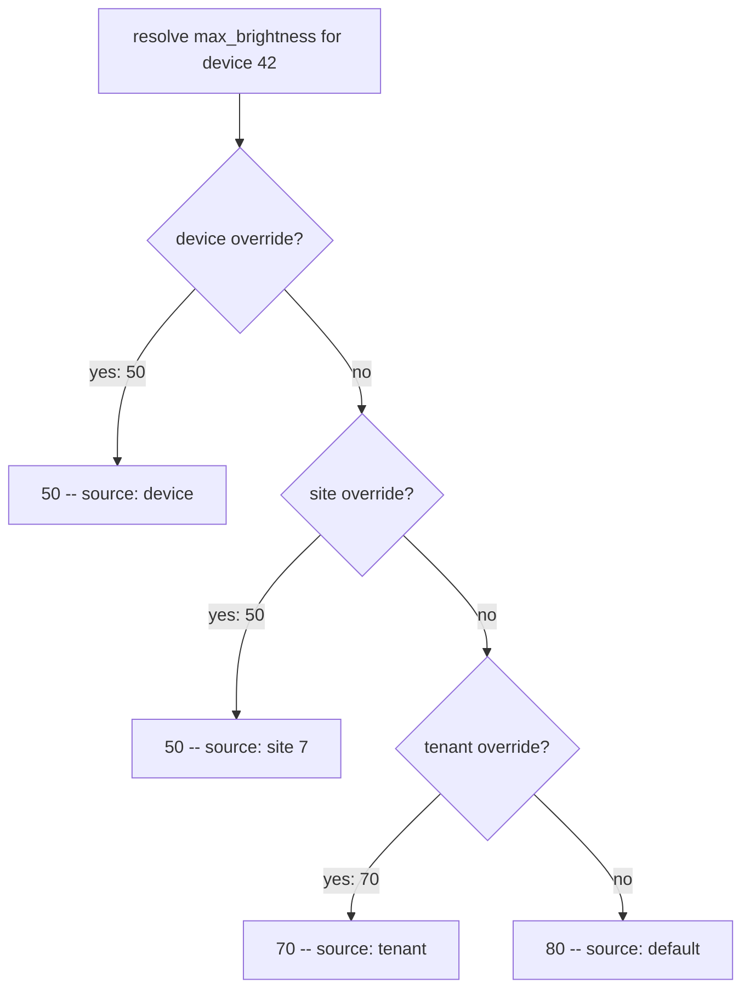

## Thesis

One shared definition holding the contract and default exactly once, plus a per-entity values table holding *only* the deviations --- resolved with a LEFT JOIN and COALESCE, and for a hierarchy a DISTINCT ON with ORDER BY specificity so the narrowest override wins in one pass. It is the keystone a rule catalog, a feature-flag hierarchy, and an EAV model all reduce to.

## Sub

**Two tables --- contract once, deviations only** -> **resolution with LEFT JOIN and COALESCE** -> **hierarchy with DISTINCT ON and ORDER BY specificity** -> **zoom out** to the polymorphic key, JSON-Schema validation, and that this is EAV --- and the pivots an interviewer rides from "store the overrides" into the missing foreign key, the JSONB trade, and when columns beat this entirely.

## Spine

- The contract and default live **exactly once** --- a definitions table holds the key, type, JSON-Schema, and default; nothing repeats them per entity.
- The values table stores **only deviations** --- a row exists only where an entity overrides the default, keyed polymorphically by `entity_type` plus `entity_id`, so one table serves any entity.
- Resolution is **LEFT JOIN plus COALESCE** --- take the override row if present, else fall back to the definition's default, in a single query.
- A hierarchy is **DISTINCT ON plus ORDER BY specificity** --- device beats site beats tenant beats default, the narrowest override winning in one pass.

## Companion Notes

### walk

A value resolving through the waterfall

One attribute resolved for one entity --- from the two tables, through the LEFT JOIN, down the specificity waterfall to the answer.

Say the trick in one breath --- "LEFT JOIN plus COALESCE: the override if it exists, else the shared default." That sentence is the pattern.

### drill

Probe Drill

Graded follow-ups on the two tables, the resolution query, the hierarchy, and the EAV trade --- the ones that separate "an overrides table" from a designed model.

Name it as EAV out loud, then defend it --- validate against the JSON-Schema on write to claw back the type safety you gave up.

### wb

Whiteboard

Rebuild the two tables and the resolution waterfall from blank --- the cues, nothing in front of you.

Draw the two boxes first, then the arrow that walks UP the waterfall until a level answers. Recall is the test, not recognition.

### sys

System Map

Zoom out: the model sits between a contract everyone shares and the handful of entities that genuinely differ from it.

Lead with the shape, not the DDL --- "the contract lives once, the values table is only the differences, and resolution is a single join."

### trade

Trade-offs

The decisions they drill --- this pattern vs columns, polymorphic key vs real foreign keys, resolve in SQL vs in code, delete-to-inherit vs an explicit sentinel --- each with the switch condition.

Always say "pick when" --- name the constraint that flips the choice. This is EAV, and EAV is a bill you pay on purpose.

### model

Model Answers

Full spoken scripts --- the beats, in order, the way you would actually say them.

Steal the frame, not the words --- headline first ("contract once, deviations only, LEFT JOIN plus COALESCE"), then the one risk you would name.

### num

Numbers

Back-of-envelope why storing only deviations is the whole win --- and which one-row write moves the most entities.

Lead with the rows you never wrote, then the number that actually bites: the blast radius of a write at each level of the waterfall.

### rf

Red Flags

What sinks the round --- duplicating the default, a foreign key that cannot exist, COALESCE swallowing a deliberate null, a hierarchy resolved level by level --- and what to say instead.

Name what the interviewer hears --- "we write the default onto every row" tells them the whole point of the pattern went past you.

### open

30-Second

The opener and the close --- matched to the altitude the question is asked at.

Match the altitude --- open at the shape (contract once, deviations only), not the DDL, and land on the missing foreign key and the default's blast radius as the real hard parts.

## Drill

all | **All four levels, mixed** --- the way a real loop actually comes at you.
SDE2 | **The model and the mechanics** --- the two tables, why only deviations, where the default lives, and LEFT JOIN plus COALESCE. The bar is "the contract lives exactly once": say what is shared, say what is a deviation, and never duplicate the default.
SDE3 | **Resolution, hierarchy, and integrity** --- the polymorphic key, DISTINCT ON with a specificity rank, the foreign key you cannot have, and validating a schemaless column. The bar is "the waterfall resolves in one pass": name the query, then name what it costs you.
Staff | **The pattern behind the patterns** --- that this is EAV, that a rule catalog and a flag hierarchy are the same shape, when columns win, and what a one-row default change actually moves. The bar is "I know which regime I am in": use it deliberately, and know its blast radius.

### SDE2 | the problem it solves

What problem does shared-definition-plus-overrides solve?

Storing a setting that has a shared default but per-entity exceptions, without repeating the default everywhere. A definitions table holds each attribute once --- its type, validation, and default --- and a values table holds only the entities that deviate. You get one place for the contract and a small table of just the differences.

Follow: You said "without repeating the default everywhere." Be concrete --- what actually goes wrong if I do store a value for every entity?
Two things, and the second is the one that hurts. First, **size**: a row per entity-attribute pair is the full cartesian product, so the table tracks the fleet's size rather than how much it actually differs. Second, and worse, **drift**: the default now exists in fifty thousand places, so changing it is a mass update, and any row that update misses --- a failed batch, an entity created mid-migration --- silently keeps the old value forever with nothing marking it as stale. Storing only deviations gives the default exactly one home, so it cannot disagree with itself.
Follow: When is a value-per-entity actually the right call, then?
When there is no meaningful shared default --- every entity's value is genuinely its own, set at creation, and "the default" is a fiction nobody uses. Then the override table *is* the value table, the sparseness argument evaporates, and you are paying the indirection for nothing. That is also the tell that the attribute wants a plain typed column on the entity table: if everyone sets it, it is a property of the entity, not a deviation from a shared contract.
Senior: Naming both failures --- the row explosion **and** the drift --- and knowing the drift is the worse one is what separates "the values table is smaller" from "the default cannot disagree with itself."
Speak: Lead with the invariant, not the tables: **"the contract and the default live exactly once, and the values table holds only the differences."** Then give the real reason --- a duplicated default drifts the moment one update misses a row.

### SDE2 | the two tables

What are the two tables?

**Definitions**: the shared layer --- key, data type, a JSON-Schema, and the default value, one row per attribute. **Values**: the per-entity layer --- a reference to the definition, the entity it applies to, and the overriding value. The definition says what exists and the default; the value says where an entity differs.

Follow: What is the unique key on the values table, and what does it buy you?
`UNIQUE (definition_id, entity_type, entity_id)` --- an entity has **at most one** override per attribute. That is what makes resolution a single deterministic lookup rather than a "latest row wins" scan, and it makes the write an **upsert** (`ON CONFLICT DO UPDATE`) so setting a value replaces the override instead of accumulating duplicates. Without it, resolution would have to pick among several candidate rows, and you would be inventing an implicit tiebreak nobody wrote down.
Follow: Why does the definition carry a JSON-Schema and not just a data type?
Because the data type gets you "this is an integer" and the schema gets you the *semantics*: an integer **between 0 and 100**, one of an enum, a string matching a pattern, an object with required fields. The value column is schemaless, so the database will not stop you writing a technically-valid-but-nonsensical value --- a brightness of -5, a mode of "banana". The type is the primitive check; the schema is the constraint the database would have given you as a CHECK if this were a real column. It travels with the definition, so the write path always validates against the right one.
Senior: Drawing the split as **shared contract vs per-entity deviation** --- and putting uniqueness on `(definition, entity_type, entity_id)` so resolution lands on one deterministic row --- is the clean data-modeling signal.
Speak: Draw two boxes: **"a definitions table --- key, type, JSON-Schema, default, one row per attribute --- and a values table holding only the entities that deviate, unique on definition plus entity."** The definition is the contract; the value is the exception.

### SDE2 | why store only deviations

Why store only the overrides, not a value for every entity?

Because most entities use the default, so writing a row for every entity-attribute pair explodes the table with rows that carry no information. Storing only deviations means the values table is proportional to how much the fleet actually differs from the default --- usually a small fraction --- and the default lives once in the definition.

Follow: You find an attribute where ninety percent of entities override. What is that telling you?
That the **default is wrong**, or that the attribute is not an override-style attribute at all. If nearly everyone deviates, the default carries no weight, you are materializing a row per entity anyway, and the sparseness assumption the whole design rests on is simply false. Two honest responses: fix the default so most entities fall through to it, or recognize that a universally-set value is a **property of the entity**, not a deviation --- and give it a real typed column. A non-sparse attribute is a modeling signal, not something to shrug at.
Follow: How does storing only deviations change what a DELETE means?
It makes DELETE the **revert** operation. Because a row exists only where an entity deviates, removing the row means the join finds nothing and the entity falls back through the waterfall --- so "reset this setting" is a delete, not a write. That is a genuinely nice property: you never write a default in order to get back to the default, which is exactly what keeps the default in one place. The subtlety to hold on to is that in a *hierarchy* the delete does not revert to the default, it reverts to the next level up.
Senior: Reading a **non-sparse attribute as a modeling smell** --- the default is wrong, or it wanted a column --- rather than accepting it and materializing rows shows you understand the design's load-bearing assumption.
Speak: Say what the table's size actually tracks: **"the values table is proportional to how much the fleet deviates, not to how big it is."** Then add the tell --- an attribute everyone overrides has a wrong default, or wanted a real column.

### SDE2 | LEFT JOIN plus COALESCE

How do you resolve a value for an entity?

A LEFT JOIN from the definition to the entity's value row, then COALESCE: `COALESCE(v.value, d.default_value)`. If an override row exists, the join finds it and COALESCE returns it; if not, the join yields null and COALESCE falls back to the definition's default. One query gives the resolved value whether or not the entity overrode it.

Follow: Why LEFT JOIN and not an INNER JOIN?
Because an INNER JOIN would **drop the row entirely** when the entity has no override --- which is the common case. The whole point is that an entity with no override still resolves, to the default, so the definition row has to survive the join with nulls in the value columns. LEFT preserves it; COALESCE then turns that null into the default. Swap in an INNER JOIN and resolution silently returns only the attributes the entity happened to override, and every defaulted attribute vanishes from the result --- which looks like missing data, not like a wrong join, so it is diagnosed slowly.
Follow: Your values table declares `value JSONB NOT NULL`. Why does that matter to COALESCE?
Because COALESCE keys off **SQL NULL**, and in this query SQL NULL is already carrying a meaning: "the LEFT JOIN found no override row." If the value column were nullable, an entity that deliberately overrode an attribute *to null* would store a SQL NULL, and `COALESCE(v.value, d.default_value)` would step straight over it and return the default --- the override row exists, is correct, and is silently ignored. `NOT NULL` removes the ambiguity: a SQL NULL there can only mean "no row." A deliberate null override is stored as the JSON value `'null'`, which is **not** a SQL NULL (`'null'::jsonb IS NULL` is false), so COALESCE returns it. The rule worth carrying out of this: **the presence of the row is the signal, not the nullness of the value.** Where the column cannot be NOT NULL, drop COALESCE and resolve on presence instead --- `CASE WHEN v.definition_id IS NULL THEN d.default_value ELSE v.value END`.
Senior: Knowing that **COALESCE conflates "no row" with "a NULL value"** --- and that `NOT NULL` plus a JSONB `'null'` is what keeps a deliberate null override expressible --- is the precise correctness detail that marks someone who has actually shipped this.
Speak: State the trick, then guard it: **"LEFT JOIN the override and COALESCE to the default --- the override if present, else the shared default."** Then pre-empt the trap: the value column is NOT NULL, because otherwise COALESCE swallows a deliberate null override.

### SDE2 | where the default lives

Where does the default value live, and why there?

In the **definition** row, once. Putting it there means changing a default is a single update, and no entity carries a stale copy. The values table never stores a default --- only a genuine override --- so the default and the deviations can't drift apart, and the default is always exactly what the definition says.

Follow: Changing the default is a one-row update. Whose behaviour does it actually change?
**Every entity with no override for that attribute** --- which, by the design's own sparseness assumption, is nearly all of them. That is the trap: the edit is one row, the effect is fleet-wide. It is a config deployment wearing the costume of a data edit. So it gets deploy discipline: count the blast radius before you write (the entities with no override at any level), stage it, roll it out to a canary slice and watch, then expand. And expect it to invalidate a very large number of cached resolutions at once.
Follow: A handful of entities need the OLD default after you move it. What do you do, and when?
Create **explicit override rows carrying the old value, before the default changes** --- not after. The order is the whole answer: move the default first and those entities silently pick up the new behaviour in the window before you pin them, which is precisely the incident you were trying to avoid. Pin first, then move the default, and the pinned entities are unaffected by construction, because an override shadows the default. It is also worth naming the cost: "opt out of a default change" is only expressible as an override, so the values table gains permanent rows every time you do this, and those entities will never receive a future default change either.
Senior: Treating a **default change as a fleet-wide deploy, not a data edit** --- blast radius first, pin the exceptions *before* the change, then canary --- is the operational maturity a senior round listens for.
Speak: Name the asymmetry out loud: **"the default lives in one row, but changing it moves every entity that never overrode it."** So it is a config deploy --- count the blast radius, pin the exceptions first, canary, expand.

### SDE2 | the write path

What happens on a write?

Load the definition, validate the incoming value against its JSON-Schema, and only then upsert the override row. Validation first is the point: because the value column is schemaless, the schema on the definition is what enforces type and range. A value that fails the schema is rejected with a 400; a valid one is upserted and resolves on the next read.

Follow: Why validate in the write path rather than with a CHECK constraint on the values table?
Because a CHECK constraint is **one expression for the whole column**, and the valid shape of a value depends on which definition its row points at. There is no single CHECK that can mean "an int 0-100 if this is max_brightness, an enum if this is mode, an object with required keys if this is a network config" --- it would have to reach into another table and switch on it, which a CHECK cannot do. So the per-attribute contract lives on the definition as data, and the one place that can see both the definition and the incoming value --- the write path --- is the only place that can enforce it. That is not a workaround; it is the direct consequence of choosing a schemaless value column.
Follow: The definition's schema is tightened. What about the values already stored?
They are **not** retroactively validated --- tightening the schema does nothing to rows that already exist, so the store can now legally hold values its own contract would reject. Treat it as a migration: dry-run the new schema against every existing value for that definition *first*, so you know the exceptions before you commit; then fix or quarantine the failures, and only then tighten. Skipping the dry run means the next read hands a consumer a value the current contract says is impossible --- and it will be a consumer that trusted the contract, so it will fail somewhere far from here.
Senior: Explaining that **no CHECK constraint can express a per-definition contract**, so the write path is the *only* place enforcement can live --- and that tightening a schema needs a validate-then-migrate pass over the existing values --- shows you know where the schema's guarantees went, not just that they went.
Speak: Say why the enforcement moved: **"the value column is schemaless, so the definition's JSON-Schema is the type check, applied at the one place every value passes through --- the write."** A CHECK cannot switch on which attribute the row is.

### SDE2 | reverting to the default

How does an entity go back to the default value?

Delete its override row. Because the values table holds only deviations, removing the row means the LEFT JOIN finds nothing and COALESCE falls back to the definition's default --- reverting is a delete, not a write of the default. It is another reason the default lives only in the definition and never in the values table.

Follow: In a hierarchy, deleting the device override does *not* get you the default. What does it get you?
The **next level up that has an override** --- the site's value, or failing that the tenant's, and only if no level overrode does it reach the default. The waterfall simply resumes one step higher. So "revert" and "reset to default" are two different operations, and a button labelled "reset to default" that issues a delete is lying whenever a site or tenant override exists. The concrete failure: an operator deletes a device override expecting 80, gets 70, because the tenant overrode it and the UI never showed them that level existed.
Follow: So how does an operator force the definition's default, ignoring the site and the tenant?
They cannot express it as a delete --- they have to **write an override row carrying the default's value** at the device level, which shadows every ancestor. And that has a permanent cost: the entity is now **pinned**. It carries an explicit row, so a later change to the definition's default will never reach it, and you have re-created exactly the duplicated-default drift the pattern exists to prevent. So "force the default" is not free --- it is an override that happens to currently equal the default. If the product genuinely needs it, model it honestly: an explicit sentinel meaning *inherit-from-definition*, resolved as a special case, so the row records the **intent** to take the default rather than a frozen copy of its value.
Senior: Knowing that **delete reverts to the next level, not to the default** --- and that "force the default" is really a pin that reintroduces the drift the pattern was built to kill --- separates someone who has drawn this waterfall from someone who has operated it.
Speak: Make the distinction explicit: **"deleting the override reverts to the next level up, not to the default."** And flag the trap --- writing the default into an override row pins the entity, so a later default change will never reach it.

### SDE3 | the polymorphic key

How does one values table serve devices, sites, and tenants?

A **polymorphic key**: `entity_type` plus `entity_id`. The row says "this override is for a device with id 42" or "a tenant with id 7", so one table covers every entity kind without a separate values table each. The uniqueness constraint is on definition plus entity_type plus entity_id, so an entity has at most one override per attribute.

Follow: Why not just a values table per entity type --- device_value, site_value, tenant_value?
Because then the **resolution query has to know how many levels exist**, and every level you add is a new table plus a new branch in every query that resolves. With one polymorphic table, resolving a single entity or a whole waterfall is the same shape --- a join against one table with a set of `(entity_type, entity_id)` pairs --- and adding a level changes the *data* (a new entity_type value), not the schema. You buy that uniformity with the missing foreign key. Per-type tables buy back real foreign keys at the price of a schema change and a query rewrite per level, which is precisely the migration-per-change this pattern exists to avoid.
Follow: What stops two rows overriding the same attribute for the same entity?
The `UNIQUE (definition_id, entity_type, entity_id)` constraint, and it is load-bearing rather than defensive --- without it, resolution would have to *choose* among duplicate rows, so you would be inventing an implicit tiebreak (latest wins? highest id?) that nobody wrote down and nobody can predict. With it, resolution lands on a single deterministic row and the write is a clean upsert. Worth noticing that the constraint works here precisely because all three columns are NOT NULL; the same idea quietly breaks in the separate-nullable-FK-columns design, where NULLs are distinct and the "equivalent" unique constraint permits duplicates.
Senior: Justifying the polymorphic key as **"adding a level is data, not a schema change"** --- and paying for it with a named, understood cost rather than presenting it as free --- is the trade-off literacy a senior round is checking for.
Speak: Give the key and the bill in one breath: **"one values table, keyed polymorphically by entity_type plus entity_id, so any entity kind fits and adding a level is data, not a migration --- at the cost of a real foreign key."**

### SDE3 | the hierarchy query

How do you resolve a hierarchy where device beats site beats tenant?

`DISTINCT ON (key)` plus `ORDER BY` a specificity rank. The join pulls any override at any level; you order each key's candidates by specificity --- device 1, site 2, tenant 3 --- and DISTINCT ON keeps the first, the narrowest. COALESCE still supplies the default if no level overrode. One pass returns each attribute resolved to its most-specific override or the default.

Follow: DISTINCT ON is a Postgres extension. What do you write on MySQL or SQL Server?
A window function, which is standard SQL and available on MySQL 8, SQL Server, Oracle and SQLite 3.25+: number each key's candidate rows by specificity and keep the first. `ROW_NUMBER() OVER (PARTITION BY d.key ORDER BY <rank>) AS rn` in a subquery, then `WHERE rn = 1` outside it. Same algorithm --- partition by the key, order by specificity, take the winner --- just spelled portably; DISTINCT ON is Postgres shorthand for exactly this. The other thing people reach for, a correlated `NOT EXISTS` ("no more specific override exists for this key"), is also correct but re-derives the precedence rule inside a subquery, which is harder to read and one more place for it to drift.
Follow: A device belongs to two tags, both at the same level of the hierarchy, and both override the same key. Which one wins?
As written, **it is undefined** --- and that is the sharp edge. DISTINCT ON keeps the first row of each group *as determined by the ORDER BY*, so if the ORDER BY does not uniquely order the rows within a group, which row survives is arbitrary and can change between query plans or releases. Two tag-level overrides tie at the same rank, so the query is silently non-deterministic: it will look right in testing and pick the other one in production. The fix is to make the ordering **total**. Either forbid the ambiguity (an entity belongs to at most one group per level, enforced by a constraint), or add a deterministic tiebreak that encodes a real policy --- an explicit `priority` column on the override row, or most-recently-updated --- so the ORDER BY fully determines the winner. A hierarchy is a total order, or it is a bug.
Senior: Spotting that **DISTINCT ON with a non-total ORDER BY is non-deterministic** --- so any level where two peers can override the same key needs an explicit tiebreak --- is a genuinely rare catch and reads as Staff.
Speak: Give the algorithm, then the portable form: **"DISTINCT ON the key, ORDER BY a specificity rank --- device 1, site 2, tenant 3 --- so the narrowest override wins in one pass, with COALESCE for the default."** Off Postgres it is `ROW_NUMBER() OVER (PARTITION BY key ORDER BY rank) = 1`.

### SDE3 | the missing foreign key

What integrity problem does the polymorphic key create?

You lose a real **foreign key**. `entity_type` plus `entity_id` points into different tables depending on the type, and a foreign key can only target one table --- so the database can't guarantee the entity exists. You either enforce it in the application, or use separate nullable columns (`device_id`, `site_id`, `tenant_id`) each with its own foreign key and a CHECK that exactly one is set. That is the honest cost of the polymorphic design.

Follow: You said separate nullable FK columns with a CHECK. What quietly breaks about the UNIQUE constraint in that design?
The obvious constraint does not do what it looks like it does. `UNIQUE (definition_id, device_id, site_id, tenant_id)` will **not** stop two identical device overrides, because SQL treats NULLs as distinct in a unique constraint: two rows of `(7, 42, NULL, NULL)` compare as unequal --- NULL is not equal to NULL --- so both are accepted. You have gained referential integrity and silently lost uniqueness, which is worse than the problem you set out to fix, because resolution now has duplicate candidate rows again. The fix is one **partial unique index per column** --- `UNIQUE (definition_id, device_id) WHERE device_id IS NOT NULL`, and the same for site and tenant --- or, on Postgres 15 and later, `UNIQUE NULLS NOT DISTINCT`. Worth saying out loud, because "just use real foreign keys" is usually offered as the simple, safe option and it is neither.
Follow: You are living with the polymorphic key. How do you find the dangling references you already have?
Accept that they exist and **detect them**, because you cannot prevent them declaratively. A periodic reconciliation job anti-joins the values table against each entity table per `entity_type` and reports (or soft-deletes) rows pointing at entities that are gone. Then close the common hole: deleting an entity must cascade its override rows, and because the database will not do it for you, that cascade is application code or a trigger --- which is exactly the guarantee the missing foreign key used to give you for free. Naming the leak *and* the sweeper is the honest answer; claiming the polymorphic key has no integrity cost is not.
Senior: Knowing that the separate-FK-columns "fix" **silently loses uniqueness to NULL-distinctness** --- and needs partial unique indexes, or `NULLS NOT DISTINCT`, to get it back --- is precise, correct, and almost nobody says it.
Speak: Own the cost plainly: **"a foreign key can only target one table, so the polymorphic pair cannot have one --- existence is the application's job, plus a sweeper for dangling rows."** And if they push you toward separate FK columns, name the NULL-distinctness trap in the unique constraint.

### SDE3 | the JSONB value

Why is the value a JSONB column, and what does it cost?

So one column can hold heterogeneous types --- an int for one attribute, a bool or an object for another --- without a column per type. The cost is losing column-level type checking: the database won't stop you writing a string where an int belongs. You recover that by validating against the definition's JSON-Schema on write, which is why validation is not optional in this design.

Follow: Why one JSONB column rather than value_int, value_bool, value_json with a CHECK that exactly one is set?
Per-type columns buy **database-native typing and indexing** --- a real numeric index, correct numeric ordering, cheap range filters --- at the price of a wider, sparser table, an awkward CHECK, and a resolution query that has to know which column to read for each attribute. That last part is the killer for *this* pattern specifically: the whole appeal is one uniform resolution query, and per-type columns push a type switch straight into it. One JSONB column keeps the query uniform, and JSONB preserves the value's JSON type, so a number stays a number rather than becoming a string. So: per-type columns when you genuinely need native indexing and range queries *on values*; one JSONB column when the access pattern is "resolve this entity's values," which is what this pattern is for.
Follow: You cannot range-query a JSONB value as cheaply as an int column. Does that matter here?
Mostly no, and knowing *why* is the point. The access pattern is **key the lookup by entity, read the value** --- resolution filters on `(entity_type, entity_id)` and never on the value itself. The value is a **payload, not a predicate**, so its indexability is nearly irrelevant to the query this model exists to serve. It starts to matter the moment someone asks the reverse question --- "which entities have max_brightness above 80" --- which filters by value across entities. That is a different workload, and if it is a real requirement you serve it deliberately: an expression index on the extracted value for the few attributes people actually filter on, or the honest answer that a heavily-filtered attribute has outgrown this model and wants a real typed column.
Senior: Distinguishing the value as a **payload rather than a predicate** --- so JSONB's weak indexability is a non-issue for resolution, and a value-filtering requirement is itself the signal that the attribute wants a column --- is exactly the access-pattern reasoning a senior round rewards.
Speak: Justify the column by the access pattern: **"one JSONB value column, so a single uniform resolution query serves every attribute type --- the value is a payload, not a predicate."** The cost is no column-level typing, which the definition's JSON-Schema buys back on write.

### SDE3 | validating on write

Why validate against a JSON-Schema instead of trusting the column?

Because the JSONB column has no opinion about the value's shape, so without validation a caller could write anything and it would resolve later as garbage. The definition carries a JSON-Schema, and the write path checks the value against it before the upsert --- so the type safety you gave up at the column level is enforced at the write instead. The schema travels with the definition, so it's always the right one.

Follow: An override is written at the site level, not the device level. Which schema validates it?
The **same one** --- the schema belongs to the *definition*, not to the level. That is the invariant that makes the waterfall safe: every candidate value for a key, at every level, has passed the identical contract, so whichever one wins the DISTINCT ON is guaranteed well-formed. If levels could carry different schemas, resolution would be a lottery over differently-shaped values and a consumer could no longer trust the resolved type at all. One key, one contract, regardless of who set it or where.
Follow: A tenant wants to narrow the allowed range for its own devices --- max_brightness capped at 60 rather than 100. Does that go in the schema?
No --- and this is a scope trap worth naming out loud. That is not a *value*, it is a **constraint on values**, and it is per-tenant, so it belongs neither in the definition's schema (which is global) nor in the values table (which holds values). You are being asked for **policy inheritance**: a second waterfall, over constraints rather than values, which the write path consults in addition to the definition's schema. It is buildable --- the same shape, resolved the same way --- but it is a second system, and the mature answer is to say so and scope it, rather than quietly overloading the value schema and discovering six months later that "the tenant's cap" and "the attribute's contract" have become the same field with two meanings.
Senior: Holding the line that **the schema belongs to the definition, not the level** --- so every candidate in the waterfall is guaranteed well-formed --- and recognizing a per-tenant *constraint* as a second, separate waterfall rather than schema overload, is real modeling judgment.
Speak: Tie validation to the definition, not the writer: **"the JSON-Schema lives on the definition, so every override at every level passes the identical contract --- whichever one wins is guaranteed well-formed."**

### SDE3 | indexing the lookup

How do you keep resolution fast?

Index the values table on the lookup key --- `(entity_type, entity_id)` --- so resolving an entity's overrides is an index seek, not a scan of every override in the system. Without it, every resolution scans the whole values table; with it, the LEFT JOIN finds exactly the handful of rows for that entity. The index is what makes the single-query resolution actually cheap.

Follow: The hierarchy query's join predicate is an OR across three (entity_type, entity_id) pairs. Does the composite index still help?
Yes --- but write it so the planner can see it. An OR of three exact equality pairs is three disjoint, highly selective lookups, and Postgres will typically satisfy it as a bitmap OR over that same composite index rather than a scan. The clearer spelling is a row-constructor IN list --- `(v.entity_type, v.entity_id) IN (('device', :device), ('site', :site), ('tenant', :tenant))` --- which states plainly that this is a small set of exact keys. The thing to actually *do* is check `EXPLAIN`, because the real failure mode is a predicate shaped so the planner cannot use the index at all (a function wrapped around the column, a type mismatch between the parameter and the column) and it falls back to scanning every override in the system. The index is not the hard part; not accidentally disabling it is.
Follow: You resolve two hundred attributes for one device. How many index lookups is that?
One seek per *level*, not one per attribute --- three, for a device-site-tenant waterfall. The index leads with `(entity_type, entity_id)`, so all of one entity's override rows are physically adjacent: the query seeks to `('device', 42)` and reads that entity's handful of rows in a single range scan, then does the same for its site and its tenant. The attributes come along for free because they share the entity prefix. The way people accidentally turn this into two hundred lookups is by putting the *attribute* in the query instead of the entity --- resolving one key at a time in a loop --- which is the N+1 in a different costume.
Senior: Understanding that the index prefix makes cost scale with **levels, not attributes** --- and that the real risk is a predicate shape that quietly disables the index, which `EXPLAIN` is how you know --- is concrete, verifiable indexing depth.
Speak: Name the index and what it buys: **"index the values table on (entity_type, entity_id), so one entity's overrides sit adjacent and a full resolve is one seek per level --- three, not one per attribute."**

### SDE3 | the N+1 on resolution

You resolve attributes one entity at a time in a loop. What is wrong and how do you fix it?

That is an N+1 --- one query per entity. Resolve as a set instead: one query with the entity ids in an IN list, or joined against the batch, returning every resolved value at once. The single-query resolution generalizes to a single batched query, so a page of entities is one round-trip rather than one per entity.

Follow: Show me what actually changes in the batched query.
The entity stops being a parameter and becomes a **column**. Instead of joining the values table against one hard-coded entity, you join it against the *set* of entities you are resolving --- their ids in an IN list, or a VALUES list joined in --- and you add the entity to the DISTINCT ON and to the leading ORDER BY: `DISTINCT ON (e.id, d.key) ... ORDER BY e.id, d.key, <rank>`. Everything else is byte-for-byte the same: same LEFT JOIN, same COALESCE, same specificity rank. That is the quiet strength of doing resolution in SQL --- the waterfall generalizes from one entity to five hundred by adding a column to the partition, where the same fix in application code means rewriting a loop into a fetch-and-fold.
Follow: The batched query returns one row per (entity, key). Who turns that into objects?
The application, in a **single fold** --- group the flat rows by entity id into a map, and you have five hundred resolved config objects from one round-trip. That part is cheap and mechanical. The trap is the version that looks almost identical and is not: fetching the rows and then *querying per entity* to fill in whatever is missing, which quietly reintroduces the N+1 you just removed. The rule is the same one that governs any row-per-attribute model --- fetch the whole set in one query, pivot once, and never loop the entities or the keys.
Senior: Knowing the batched form is the **same query with the entity promoted into the DISTINCT ON and the leading ORDER BY** --- one round-trip, one fold, no per-entity fill-in pass --- is the performance instinct that keeps this model usable on a list view.
Speak: State the rule, then the shape: **"never resolve in a loop --- one query for the whole set, then one fold."** The batched query is the same waterfall with the entity added to the DISTINCT ON and the leading ORDER BY.

### SDE3 | concurrent override writes

Two operators set the same device's attribute at the same time. What happens, and is it correct?

They serialize on the row. The values table is unique on `(definition_id, entity_type, entity_id)` and the write is an upsert (`ON CONFLICT DO UPDATE`), so both writes contend for one row and the second overwrites the first --- **last-write-wins**, with no duplicate rows and no corruption. That is exactly what the unique key buys you, and it is correct for a simple override. What it does *not* do is tell the second operator that they just erased somebody's change.

Follow: When is last-write-wins not good enough?
When a **lost update** has real consequences --- two operators making different, deliberate changes, where silently keeping only one is wrong. The sharp version is read-modify-write: an operator reads the current value, makes a decision based on it, and writes back --- and by the time the write lands, the value they reasoned about is gone. If that matters, add **optimistic concurrency**: a version column on the override row, and the write carries the version it read --- `UPDATE ... WHERE version = :seen` affects zero rows if someone else moved it, so the stale write is *rejected* rather than silently clobbering. For a low-stakes flag, last-write-wins is fine; for meaningful config, make the conflict visible instead of resolving it by luck.
Follow: Does the same race exist between a write and a revert?
Yes --- and it is nastier, because there is nothing to lock against. If one operator sets device 42 to 50 while another deletes its override, the two orderings give genuinely different outcomes: set-then-delete leaves the device inheriting from its site, delete-then-set leaves it pinned at 50. Both are "correct" by the row semantics; only one is what anybody wanted. And optimistic locking cannot save you here, because a delete leaves **no row** --- there is no version column left to compare against, so the losing operation cannot even detect that it lost. If revert races matter, you have to give the conflict something to hold onto: keep the revert as a tombstone row (soft delete, so a version still exists), or serialize the operations for a given entity-attribute pair. This is the one place where "absence means inherit" --- otherwise the pattern's cleanest idea --- actively bites.
Senior: Seeing that the unique key plus an upsert makes concurrent writes **safe (no duplicate rows) without making them correct (a lost update is still silent)** --- and that a *revert* leaves no row for optimistic locking to check against --- is the concurrency precision a senior round rewards.
Speak: Give the guarantee, then its limit: **"the unique key plus an upsert means the writes serialize on one row --- last-write-wins, no duplicates, no corruption."** Then the caveat: that is safe, not correct. If a lost update matters, version the row and reject the stale write.

### Staff | this is EAV

An interviewer says "this is just EAV." Are they right?

Yes --- entity, attribute, value is exactly EAV, and I'd own that. It's the **right** choice when the attribute set is variable or tenant-defined, where columns would mean a migration per new attribute. It's the **wrong** choice when the schema is fixed and known, where plain typed columns are simpler, type-safe, and faster. The skill is knowing which regime you're in, not avoiding the word.

Follow: If it is EAV, what does the shared-definition framing add that the word "EAV" does not?
The **resolution rule**. Plain EAV tells you where a value is *stored* --- a row per entity-attribute --- and says nothing at all about what an entity's value *is* when there is no row. Shared-definition adds the defaulting and inheritance semantics on top: the contract and default live once on the definition, a row means "deviation," absence means "inherit," and a hierarchy resolves narrowest-first. That second half is where all the interesting engineering actually is --- the COALESCE, the specificity order, delete-is-revert, the default's blast radius --- and none of it is implied by the letters E, A and V. So the storage is EAV; the pattern is EAV *plus a defaulting rule*, and the defaulting rule is where the work lives.
Follow: So when you say "yes, it's EAV" out loud, what do you say next so it doesn't sink you?
Immediately name the **tax and the boundary**, before they can. The tax: no column-level typing (bought back with JSON-Schema validation on write), no real foreign key on the polymorphic pair, and querying *by value* across entities is awkward. The boundary: this is for the **variable** attribute set --- tenant-defined, open-ended, added without a deploy --- and the fixed, hot, heavily-queried attributes belong in real columns. "Yes, it's EAV; here is the bill, and here is where I would not use it" turns the question from a trap into a signal. Saying "no, it's different" is how you lose the room, because they can see that it isn't.
Senior: Separating **EAV the storage shape from the defaulting-and-inheritance rule layered on top** --- and volunteering the tax and the boundary in the same breath as the concession --- is the framing that turns an accusation into a Staff signal.
Speak: Concede instantly, then reframe: **"Yes --- it is EAV, and I would use the word. What shared-definition adds is the resolution rule: the contract lives once, a row means deviation, absence means inherit."** Then name the bill before they ask for it.

### Staff | the FK alternative

When would you take the separate-columns approach over the polymorphic key?

When referential integrity matters more than the uniform single table --- separate nullable `device_id` / `site_id` / `tenant_id` columns each get a real foreign key, and a CHECK enforces exactly one is set. You trade the clean one-column key for database-guaranteed integrity and a slightly awkward schema. For a small, fixed set of entity types where a dangling reference would be a real bug, that trade is often right.

Follow: You now have three nullable columns. What does that do to the resolution query?
It **fans the join predicate out per level**, which is survivable but no longer uniform: the join has to test each column against its own parameter, and the specificity rank now switches on *which column is non-null* rather than on a single type value --- `CASE WHEN v.device_id IS NOT NULL THEN 1 WHEN v.site_id IS NOT NULL THEN 2 ELSE 3 END`. And every level you add is now a new column, a new foreign key, a new branch in the CHECK, a new branch in the rank, a new partial unique index and a new index --- a schema migration per level, which is the exact thing this pattern was supposed to make unnecessary. So the real axis is not "integrity vs a slightly awkward schema"; it is **integrity vs the ability to add a level as data**.
Follow: When do you take the polymorphic key anyway, dangling references and all?
When the set of entity types is **open or expected to grow** --- a platform where a new scope level is a product decision rather than a schema decision --- and when entities are not routinely hard-deleted, so dangling rows are rare and cheap to sweep. Then the uniformity is worth more than the declarative guarantee, and you pay for it with a delete cascade plus a reconciliation job. Flip it when the entity types are few, fixed and known at design time and a dangling override would cause a real user-visible bug: that is exactly when the database should be the one enforcing it, and the schema migration you would need to add a level is a cost you were never going to pay anyway.
Senior: Framing the choice as **"integrity vs adding a level as data"** --- rather than the usual "integrity vs a bit of schema ugliness" --- is the sharper axis, and it is the one that actually decides the call.
Speak: Give the real axis: **"separate FK columns buy database-enforced integrity, but every new level becomes a migration --- the polymorphic key keeps a new level as data."** Take the FKs when the levels are few and fixed and a dangling row is a genuine bug.

### Staff | a rule catalog is this

How does a rule catalog with per-tenant subscriptions reduce to this pattern?

Directly. The rule catalog *is* the definitions table --- each rule defined once with its schema and default parameters. The per-tenant subscriptions *are* the values table --- a row only where a tenant enables a rule with its own parameters, resolved by the same join. Learn shared-definition-plus-overrides once and the rule engine, feature flags, and EAV are all the same shape with different names.

Follow: A rule's parameters are a nested object, not a scalar. Does the pattern still hold?
Yes, with one decision you have to make explicitly rather than by accident: whether an override **replaces** the default object or **merges** into it. Replace is the pattern's literal reading and the simpler one --- the override row *is* the value, so a tenant overriding `{threshold: 5}` against a default of `{threshold: 3, window: 60}` gets exactly `{threshold: 5}` and loses `window` entirely. Merge --- resolve the object key by key, so unspecified keys inherit --- is almost always what people actually want, and it means the waterfall now runs *per leaf*, not per row. It is expressible (Postgres will merge JSONB objects), but you have to say which one you built, because a silent replace-vs-merge mismatch is the nastiest bug in this family: the tenant's config looks right in the diff and is missing a field at runtime.
Follow: The rule catalog also needs enable/disable per tenant. Is that an override, or something else?
It is **cleanly an override**, and noticing that is the whole point of the topic. "Enabled" is just another attribute with a shared default (off, usually) and per-tenant deviations, resolved by the identical join. The mistake is modeling enablement as a *separate mechanism* --- a subscriptions table with its own semantics --- and then discovering you need a default enablement, and then a per-site override of that, and rebuilding the waterfall badly, right next to the one you already have. If it has a shared default and per-entity exceptions, it is this pattern. The fact that the value happens to be a boolean called "enabled" changes nothing at all.
Senior: Forcing the **replace-vs-merge decision into the open** for object-valued overrides --- and recognizing enablement as just another attribute rather than a second mechanism --- is the pattern-level judgment that stops you building the same waterfall twice.
Speak: Show the mapping, then the gotcha: **"the rule catalog is the definitions table, the per-tenant subscriptions are the values table, resolved by the same join."** For object-valued rules, say whether an override replaces or merges --- silently replacing drops every key the tenant did not set.

### Staff | a feature-flag hierarchy is this

How does a hierarchical feature-flag system reduce to this?

A flag has a global default (the definition) and overrides per environment, per tenant, per user (the values, at increasing specificity). Resolving a flag for a user is exactly DISTINCT ON plus ORDER BY specificity --- user override beats tenant beats environment beats the global default. The "flag hierarchy" is this waterfall with the entity levels renamed.

Follow: The flag admin UI shows every level's resolved value and saves all fields on submit. What just happened to inheritance?
You **pinned everything**. A form that writes back every field it displayed cannot distinguish "the user explicitly set this" from "the user is inheriting this and I rendered the inherited value into the box" --- so on save it writes an override row for every attribute at that level, each one equal to the value it was already inheriting. Nothing appears to change: the resolved values are identical the moment after the save. Then, weeks later, someone changes the global default and it reaches **nobody**, because every entity is now shadowed by an explicit row holding the old value. This is one of the most common real bugs in flag and config systems, it is completely silent, and it does not surface until the day a default change actually matters. The fix is at the API and the UI, not the schema: "inherit" must be a distinct, representable state --- a tri-state control, not a pre-filled box --- the write path must only create a row when the user explicitly overrode, and choosing inherit must **delete** the row.
Follow: Percentage rollouts and targeting rules are not overrides. Where do they live?
Not in the values table, and knowing that is where the pattern ends. This model resolves to a **fixed value from the most specific scope**. A percentage rollout resolves to a value computed from a hash of the subject; a targeting rule evaluates a predicate against the subject's attributes. Those are *evaluation strategies*, not deviations --- and cramming them into the value column (storing `{rollout: 20}` and having the resolver special-case it) turns a clean waterfall into an interpreter, at which point the specificity order no longer explains the answer and nobody can debug a flag. The honest architecture keeps the waterfall for scoped overrides and treats rollout and targeting as a separate evaluation layer that runs *after* resolution: the waterfall says which rule applies to this subject, the evaluator says what it computes to. Flag systems that blur those two are precisely the ones nobody can reason about.
Senior: Catching the **save-all-fields pin** --- a UI bug that silently converts every inherited value into a permanent override, and only surfaces when a default change fails to propagate --- is exactly the hard-won, system-level insight a Staff loop is fishing for.
Speak: Map it, then name the killer: **"a flag hierarchy is this waterfall with the levels renamed --- user beats tenant beats environment beats the global default."** Then guard it: "inherit" has to be a real state in the API, or a save-all-fields UI pins the whole fleet.

### Staff | when not to use it

When should you *not* reach for this pattern?

When the attributes are fixed, few, and known at design time. Then plain typed columns win on every axis --- type safety, query simplicity, index efficiency, readability --- and the definition-plus-values indirection is pure overhead. This pattern earns its complexity only when the attribute set is genuinely variable or user-defined; forcing it onto a fixed schema is over-engineering.

Follow: What is the symptom that you have over-applied it?
You are **rebuilding the database inside it**. The tells are specific: every report is a pile of self-joins or a crosstab, you are adding expression indexes so you can filter by value, and you have written application code to enforce types, ranges and referential integrity. When the list of things you had to reimplement is a list of things a real schema gives away for free, you have paid the full tax. And the loudest signal is the one nobody checks: **has anyone actually added an attribute without a deploy in the last year?** If not, the flexibility is entirely unspent and the tax is entirely paid --- which is the worst possible position, and it is invisible because everything technically works.
Follow: Half your attributes are fixed and hot, half are variable and sparse. What do you actually build?
**Both, deliberately.** Real typed columns on the entity table for the fixed, hot, queried core --- where you want the database's typing, indexing and foreign keys --- and definition-plus-overrides for the variable, sparse, rarely-filtered tail. It is a hybrid, not a religion, and the governing discipline is a **promotion loop**: measure which attributes are densely set and frequently filtered, and graduate those out of the overrides table into real columns (add the column, backfill from the value rows, cut readers over, retire the definition). Defaulting *everything* into the flexible model because it is uniform is how the tax quietly becomes total; defaulting everything into columns is how you end up shipping a migration for every checkbox.
Senior: Reading **"no new attributes in a year"** as the loudest evidence of over-application --- flexibility unspent, tax fully paid --- and running an explicit, measured promotion loop, is the governance instinct a Staff round is testing.
Speak: Draw the boundary and the loop: **"typed columns for the fixed, hot, queried core; definition-plus-overrides for the variable, sparse tail --- a hybrid, not a religion."** Then govern it: measure usage, and promote the attributes that turn out to be hot and stable.

### Staff | caching the resolution

The resolution query runs on every read --- do you cache it?

Usually worth it. A resolved value changes only when an override or a default changes, which is rare next to reads, so caching the resolved value per entity-attribute turns a per-read join into a cache hit. The write path already loads the definition and upserts, so it is exactly where you invalidate the cache key. Cache the *output* of the waterfall, keyed by entity plus attribute, and let the write that changes an override evict it.

Follow: A site-level override changes. Which cache keys do you evict?
This is where the hierarchy makes invalidation genuinely hard, and it is the best question on this topic. Not the site's own key --- nothing reads it. The cache is keyed by the *resolving* entity, so the affected keys are the **devices under that site**... **minus the ones that shadow it**, the devices carrying their own device-level override for that key, whose resolved value did not change at all. So the eviction set is "the subtree below the changed level, minus whatever is overridden more specifically." Note the asymmetry in getting it wrong: evict too **broadly** (including the shadowed devices) and you have merely wasted some re-resolution; evict too **narrowly** (just the level you wrote) and every device under that site serves a stale value indefinitely --- which is a silent correctness bug, not a performance one. And the fan-out grows the higher up the waterfall you write.
Follow: A definition default changes. Now which keys, and what does that do to your cache?
Every entity with **no override at any level** for that key --- which, by the sparseness assumption the whole design rests on, is very nearly the entire fleet. So the cheapest possible write (one row on the definition) triggers the most expensive possible invalidation, and they are the same event. Two consequences. First, it is a **mass-invalidation / thundering-herd** risk: every affected entity re-resolves on its next read, all at once. Mitigate by re-warming proactively rather than waiting for the misses, staggering the eviction, and rolling the default change out gradually --- which you were already doing for the behavioural blast radius, so the two mitigations turn out to be the same mitigation. Second, precise invalidation requires knowing the *shadowing set*, which is fiddly enough that many systems deliberately go coarser: version the definition and fold that version into the cache key, so a default change makes every derived key instantly cold. You re-resolve the shadowed entities unnecessarily --- pure waste, zero correctness risk --- and coarse-and-right beats precise-and-subtly-wrong when the failure mode of "wrong" is silent staleness.
Senior: Working out that **the eviction set is the subtree minus the more-specifically-overridden** --- and that the cheapest possible write causes the largest possible invalidation --- is the hardest, most system-level insight in this topic.
Speak: Cache the output, then say the hard part: **"cache the resolved value keyed by entity plus attribute, and invalidate on write."** Then name it: an override at level L evicts everything below L that is not shadowed by a more specific override --- so a default change evicts almost the whole fleet.

### Staff | auditing an override change

Someone asks who changed device 42's setting and when. How do you answer?

The values table alone shows only the current override, not its history. For an audit trail you record each change append-only, or use history/temporal tables, so who set device 42 to 50, and when, is answerable. A governed setting needs its change history, not just the current row --- the same audit discipline the rules engine applies to rule changes.

Follow: An operator asks why device 42's brightness is 50. You check the audit log and there is no change against device 42. What is your answer?
That **nobody changed device 42** --- the value moved because something *above* it moved. It inherited 50 from its site, or its tenant, or the definition's default, and that change was recorded against *that* level, not against the device. This question is exactly what exposes the difference between an audit log and **provenance**: the audit log answers "what writes happened," and the operator is asking "why is this value what it is," which is a question about the *resolution*, not about the writes. Without an answer to the second one, every inherited value is an unexplainable value --- and the operator's natural next move, deleting the device's override to "fix" it, does nothing at all, because there was never a device override to delete.
Follow: How do you make that answerable directly from the resolution query?
**Return the winning level alongside the value.** The DISTINCT ON already selected one specific row, so the source is sitting right there --- `COALESCE(v.entity_type, 'default') AS source`, and its `entity_id` with it --- and the resolver hands back `{value: 50, source: 'site', source_id: 7}` instead of a bare 50. It costs nothing: no extra query, no extra join, just carrying out the row you already picked. Now the UI renders "50, inherited from site 7" rather than "50", the operator immediately knows which level to edit, and "why is this value 50" is answered by the read path instead of an investigation. Provenance is the cheapest feature in this entire topic and the one left out most often --- and it is what makes a mid-level default change *debuggable* instead of merely surprising.
Senior: Separating **audit (what writes happened) from provenance (which level won)** --- and realizing the resolution query already knows the answer, so returning the source is free --- is the operability insight that makes this model usable by humans rather than merely correct.
Speak: Split the two questions: **"the audit log says who wrote what; provenance says which level won --- and the operator is almost always asking the second one."** Return the source with the value: the DISTINCT ON already picked the row, so it costs nothing.

## Walk

### The problem --- one default, a few exceptions

```flow
p[a setting with one shared default] -> e[a few entities genuinely differ] . n[do not repeat the default 50,000 times]
```

Every configurable system arrives here. A setting has a value that is right for almost everyone --- a screen timeout, a retry budget, a feature's on-ness --- and a small number of entities that genuinely need something else. The naive model writes a value for every entity, and the whole design is a refusal to do that.

The reason is not primarily size, though the size argument is real. It is **drift**. A default stored on fifty thousand rows exists in fifty thousand places, so changing it is a mass update --- and any row that update misses keeps the old value silently, forever, with nothing marking it as stale. The moment you accept "the default lives in exactly one place, and a row means *this entity is different*," everything else in this topic follows: resolution has to fall back, revert has to be a delete, and a one-row edit to the default becomes a fleet-wide event.

### Two tables --- contract once, deviations only

```flow
d[attribute_definition] -> v[attribute_value overrides] -> o[one contract, only differences]
```

The whole design is two tables. The definition holds each attribute once --- its key, type, validation schema, and default. The values table holds only the entities that deviate from that default.

```sql
-- shared layer: what exists, plus the default (once)
CREATE TABLE attribute_definition (
  id            BIGSERIAL PRIMARY KEY,
  key           TEXT NOT NULL UNIQUE,   -- max_brightness
  data_type     TEXT NOT NULL,          -- int, bool, json
  default_value JSONB,                  -- the shared default
  schema        JSONB                   -- JSON-Schema for validation
);

-- per-entity layer: only the deviations, for any entity type
CREATE TABLE attribute_value (
  id            BIGSERIAL PRIMARY KEY,
  definition_id BIGINT NOT NULL REFERENCES attribute_definition(id),
  entity_type   TEXT   NOT NULL,        -- device, site, tenant
  entity_id     BIGINT NOT NULL,
  value         JSONB  NOT NULL,        -- NOT NULL: see the null trap
  UNIQUE (definition_id, entity_type, entity_id)
);
```

The contract and default appear exactly once, and the values table is proportional to how much the fleet actually differs --- not to its size. The `entity_type` plus `entity_id` pair is the polymorphic key that lets one table serve devices, sites, and tenants alike.

### The write path --- validate, then upsert

```flow
w[PUT device 42 = 50] -> s[validate vs JSON-Schema] -> u[upsert override row]
```

A write loads the definition, validates the incoming value against its JSON-Schema, and only then upserts the override row. Because the value column is schemaless JSONB, the definition's schema is the type check.

A value inside the schema --- 50 within min 0, max 100 --- is upserted and resolves through the COALESCE waterfall on the next read. A value that fails the schema is rejected with a 400 and never becomes a row. Validation on write is what claws back the type safety a JSONB column gives up --- and it has to live here, in code, because no CHECK constraint can switch on which definition a row happens to point at.

### Resolution --- override if set, else default

```flow
q[resolve for an entity] -> j[LEFT JOIN the value] -> c[COALESCE to default]
```

To resolve an attribute for an entity, LEFT JOIN the definition to that entity's value row and COALESCE. The override wins if it exists; otherwise the default fills in.

```sql
-- override if the entity has one, else the shared default
SELECT d.key, COALESCE(v.value, d.default_value) AS resolved
FROM attribute_definition d
LEFT JOIN attribute_value v
       ON v.definition_id = d.id
      AND v.entity_type = 'device' AND v.entity_id = $1;
```

That is the entire trick: a LEFT JOIN so a missing override yields null rather than dropping the row, and COALESCE so null becomes the definition's default. One query returns the resolved value whether or not the entity overrode it --- no branching in application code. Make it an INNER JOIN and every attribute the entity did *not* override silently disappears from the result.

### The null trap --- presence is the signal, not nullness

```flow
r[no override row] -> n[SQL NULL from the join] -> c[COALESCE takes the default] . d[a deliberate null override looks identical]
```

COALESCE keys off SQL NULL, and in this query SQL NULL is already carrying a meaning: *the LEFT JOIN found no override row*. The moment the value column can also **hold** a SQL NULL, that meaning becomes ambiguous --- an entity that deliberately overrode an attribute to null is now indistinguishable from an entity that never overrode it at all, and COALESCE steps over the override and returns the default. The row exists. It is correct. It is ignored, and nothing raises an error.

That is why the column is declared `value JSONB NOT NULL`, and it is not incidental. A deliberate null override is stored as the JSON value `'null'`, which is a perfectly ordinary non-NULL JSONB value --- `'null'::jsonb IS NULL` is false --- so COALESCE returns it and the override is honoured. The general rule is worth carrying out of this topic: **the presence of the row is the signal, not the nullness of the value.** Where you inherit a schema whose value column is nullable, stop using COALESCE, because it cannot express the distinction --- resolve on presence instead: `CASE WHEN v.definition_id IS NULL THEN d.default_value ELSE v.value END`.

### The hierarchy --- narrowest wins

```flow
h[device / site / tenant] -> r[ORDER BY specificity] -> f[DISTINCT ON keeps narrowest]
```

When overrides can live at several levels, the join pulls candidates from all of them and the query picks the most specific. Order each key's rows by a specificity rank and keep the first.

```sql
-- device beats site beats tenant: the narrowest override wins
SELECT DISTINCT ON (d.key)
       d.key, COALESCE(v.value, d.default_value) AS resolved
FROM attribute_definition d
LEFT JOIN attribute_value v
       ON v.definition_id = d.id
      AND ( (v.entity_type = 'device' AND v.entity_id = $device)
         OR (v.entity_type = 'site'   AND v.entity_id = $site)
         OR (v.entity_type = 'tenant' AND v.entity_id = $tenant) )
ORDER BY d.key,
         CASE v.entity_type WHEN 'device' THEN 1 WHEN 'site' THEN 2 WHEN 'tenant' THEN 3 END;
```

`DISTINCT ON (key)` keeps the first row per key after the `ORDER BY` sorts device before site before tenant, so the narrowest override wins; COALESCE still supplies the default when no level overrode. The whole waterfall --- device to site to tenant to default --- resolves in one pass. Two things to say before they are asked: DISTINCT ON is Postgres-only, and the portable spelling is `ROW_NUMBER() OVER (PARTITION BY key ORDER BY rank) = 1`; and that ORDER BY must be a **total** order, because if two overrides ever tie at the same rank, which one DISTINCT ON keeps is arbitrary.

### Provenance --- which level won

```flow
r[resolved value 50] -> s[source: site 7] . w[why it is 50, not who wrote it]
```

The resolved value alone cannot be explained. An operator looking at device 42's brightness of 50 cannot tell whether the device overrode it, its site did, its tenant did, or that is simply the default --- so they cannot predict what deleting the device's override will do, or explain why the value moved when nobody touched the device.

```sql
-- the DISTINCT ON already picked a row -- carry the winner out with the value
SELECT DISTINCT ON (d.key)
       d.key,
       COALESCE(v.value, d.default_value) AS resolved,
       COALESCE(v.entity_type, 'default') AS source,
       v.entity_id                        AS source_id
FROM attribute_definition d
LEFT JOIN attribute_value v
       ON v.definition_id = d.id
      AND (v.entity_type, v.entity_id) IN
          (('device', $1), ('site', $2), ('tenant', $3))
ORDER BY d.key,
         CASE v.entity_type WHEN 'device' THEN 1 WHEN 'site' THEN 2 WHEN 'tenant' THEN 3 END;
```

The source is free: the query already chose one specific row, so returning its `entity_type` costs nothing --- no extra join, no second query. Now the resolver hands back `{value: 50, source: 'site', source_id: 7}`, the UI renders "50, inherited from site 7", and "why is this value what it is" is answered by the read path instead of an investigation. Note this is a *different question* from the **audit log**: audit says who wrote what, provenance says which level won --- and the operator is almost always asking the second one.

### Reverting --- delete the row, do not write the default

```flow
d[DELETE the override row] -> u[falls to the next level up] . p[writing the default instead PINS it forever]
```

Because the values table holds only deviations, the revert operation is a **delete**: remove the row and the waterfall resumes. But in a hierarchy it does not resume at the default --- it resumes at the *next level that has an override*. Delete device 42's override and it inherits its site's value, not the definition's default. A button labelled "reset to default" that issues a delete is lying whenever a site or tenant override exists.

The tempting fix is the one that breaks the pattern: writing the default's value into the entity's override row to force it. That does force it, once --- and then **pins** the entity. It now carries an explicit row, so a later change to the definition's default will never reach it, and you have re-created the duplicated-default drift the whole design exists to prevent. If a product genuinely needs "ignore my ancestors and take the definition's default," model it as an explicit sentinel meaning *inherit-from-definition*, resolved as a special case --- so the row records the **intent** to take the default rather than a frozen copy of its current value.

### Operating it --- the cheapest write has the largest blast radius

```flow
w[edit one definition row] -> b[every entity with no override] . c[mass cache invalidation]
```

The operational fact that catches people is an inversion: in this model the **cheapest possible write causes the largest possible change**. Editing a device override touches one entity. Editing a site override touches that site's devices --- minus the ones shadowed by their own device-level override. Editing the definition's default touches *every entity with no override at any level*, which, by the sparseness assumption the design rests on, is nearly the whole fleet. One row in, fifty thousand behaviours out.

So a default change is a **config deployment** and gets deploy discipline: count the blast radius before writing, pin the exceptions with explicit overrides *first*, canary the change to a slice, watch, then expand. The same fan-out governs the cache, because the eviction set is the same set --- everything below the changed level that is not shadowed by a more specific override. That is why a default change is simultaneously the cheapest write and the biggest mass-invalidation event in the system, and why many implementations give up on precise eviction, version the definition, and fold that version into the cache key instead.

### Model Script

- Frame the two tables | "The pattern is two tables. A definitions table holds each attribute once --- its key, type, a JSON-Schema, and the default. A values table holds only the entities that deviate, keyed polymorphically by entity_type plus entity_id so one table serves devices, sites, and tenants. The contract lives once; the values table is just the differences."
- The resolution trick | "Resolving a value is a LEFT JOIN plus COALESCE: LEFT JOIN the entity's override row, and COALESCE to the definition's default. If the override exists the join finds it; if not, the row survives as null and COALESCE fills in the default. One query, no branching --- the override if present, else the shared default."
- The trap in that sentence | "One thing I'd guard: the value column is NOT NULL. COALESCE keys off SQL NULL, and SQL NULL already means 'the join found no row' --- so if the column were nullable, an entity that deliberately overrode to null would resolve to the default instead, with its override row sitting there being ignored. Presence of the row is the signal, not nullness of the value."
- The hierarchy | "For a hierarchy --- device beats site beats tenant --- I use DISTINCT ON the key plus ORDER BY a specificity rank. The join pulls candidates from every level, the order sorts narrowest first, DISTINCT ON keeps the first, and COALESCE still supplies the default if nothing overrode. The whole waterfall resolves in a single pass. And that ORDER BY has to be a total order, or the winner is arbitrary."
- The honest trades | "Two costs I'd name. First, no real foreign key on the polymorphic pair --- entity_type plus entity_id points to different tables --- so I enforce existence in the app, or use separate nullable FK columns with a CHECK. Second, the JSONB value loses column-level type checking, which I recover by validating against the definition's JSON-Schema on write. And yes, this is EAV --- right when the attribute set is variable, wrong when it's fixed."
- Interviewer: "Isn't this just a rule catalog with a different name?"
- Show it's the keystone | "It's the same shape. The rule catalog is the definitions table, per-tenant subscriptions are the values table, resolved by the same join. A feature-flag hierarchy is this waterfall with the levels renamed. Learn shared-definition-plus-overrides once and the rule engine, flags, and EAV are all one pattern."
- Name what actually bites | "The thing I'd flag before they ask: the cheapest write has the biggest blast radius. Editing one definition default moves every entity that never overrode it --- nearly the whole fleet --- and mass-invalidates all of their cached resolutions. So a default change is a config deploy: count who's affected, pin the exceptions first, canary, expand."
- Land it | "So: contract and default once in definitions, only deviations in a polymorphic values table, LEFT JOIN plus COALESCE to resolve, DISTINCT ON plus ORDER BY specificity for a hierarchy, JSON-Schema validation on write to keep it type-safe, and the source returned with the value so a resolved number is explainable. It's EAV, used deliberately where the attributes are genuinely variable."

## Whiteboard

Rebuild the model from blank --- the two tables, the resolution query, the specificity waterfall, and what a write at each level actually moves.

### The two tables: what is shared, what is a deviation?

Draw **two boxes**. **Definition** --- one row per attribute: key, data type, JSON-Schema, default value. **Values** --- `(definition_id, entity_type, entity_id, value)`, unique on the triple, one row **only** where an entity deviates. The definition is the shared contract; the values table is the diff. Say the thesis as you draw it: the contract and the default live exactly once.

### Where does the default live, and why only there?

On the **definition**, once. Draw it inside the definition box and nowhere else. Duplicating it per entity means a mass update to change it, and any row that update misses keeps the old value silently forever --- the drift is the real cost, not the row count. It is also what makes revert a **delete**: you never write a default in order to get back to the default.

### What is the resolution trick in one line?

LEFT JOIN the override, COALESCE to the default --- override if present, else the shared default, in one query.

### Why LEFT JOIN, and why is the value column NOT NULL?

**LEFT**, because an INNER JOIN drops the row when there is no override --- and no override is the common case, so every defaulted attribute would vanish from the result. **NOT NULL**, because COALESCE keys off SQL NULL, and here SQL NULL must mean exactly one thing: "the join found no row." If the column could hold a NULL, a deliberate null override would be indistinguishable from no override and COALESCE would silently return the default over the top of it. Write the rule on the board: presence of the row is the signal, not nullness of the value.

### How does a hierarchy pick a winner?

ORDER BY specificity and DISTINCT ON the key --- device beats site beats tenant, the narrowest override kept, default if none.

### Two overrides tie at the same level. Who wins?

**Nobody --- it is undefined**, and that is a bug rather than a detail. DISTINCT ON keeps the first row per group *as ordered*, so if the ORDER BY does not fully determine the order within a group (a device in two tags, both overriding the same key), the survivor is arbitrary and can change with the query plan. Draw the two tied rows and put a question mark between them. The fix is a **total** order: forbid the ambiguity, or add a real tiebreak --- an explicit priority column, or most-recently-updated.

### How do you answer "why is this value 50"?

Return the **source** with the value. The DISTINCT ON already selected one specific row, so carry its `entity_type` out: `COALESCE(v.entity_type, 'default') AS source`. The resolver hands back `{value: 50, source: 'site', source_id: 7}` and the UI can say "inherited from site 7". Draw the arrow coming back out of the winning row. And note it is not the audit log --- audit says who wrote, provenance says which level won.

### An operator deletes the device override. What do they get?

**The next level up, not the default.** The waterfall resumes one step higher --- the site's value, then the tenant's, and only then the definition's default. Draw the delete crossing out the device row, and the arrow continuing *upward*. Then label the trap beside it: writing the default's value into the row to "force the default" **pins** the entity, so a later default change will never reach it.

### A site override changes. What has to be invalidated?

Every device under that site --- **minus the ones with their own device-level override**, which shadow the site and did not change. Draw the subtree, then cross out the shadowed leaves. Then generalize it, because it is the whole operating story: the eviction set is everything below the changed level that is not shadowed more specifically, so the fan-out grows the higher you write --- and a change to the definition's default evicts nearly the entire fleet at once.



Verdict: one LEFT JOIN with COALESCE resolves override-or-default, DISTINCT ON plus ORDER BY specificity runs the whole waterfall in a single pass, and the winning row's entity_type comes back as the value's provenance for free.

Foot: The one people forget: **a write high in the waterfall is a write to everything below it.** Editing one definition default moves every entity that never overrode the key and invalidates all of their cached resolutions --- the cheapest write in the system has the largest blast radius, which is why a default change is a config deploy, not a data edit.

## System

Zoom out to where this model sits under the features that use it.

### Where it sits

Intent: a setting with one shared default and a handful of entities that genuinely differ
Definitions table: each attribute once --- type, schema, default [*]
Values table: only deviations, keyed by entity_type plus entity_id
Write path: validate against the definition's schema, then upsert the override row
Resolution query: LEFT JOIN plus COALESCE, hierarchy via DISTINCT ON plus specificity
Provenance and audit: which level won, and who changed it --- two different questions
Callers: rule catalog, feature flags, device config, EAV --- all this shape

### Pivots an interviewer rides

From "store the overrides" they push on one-table-versus-many, integrity, whether this is EAV, and what a one-row default change actually moves.

#### One polymorphic table or a table per entity type?

-> one table, no real FK
One table serves every entity kind, keeps resolution uniform, and makes adding a level a matter of **data** rather than a schema migration. The price is that the polymorphic pair cannot carry a true foreign key, so you enforce existence in the app --- plus a sweeper for the dangling rows you will still accumulate --- or switch to separate nullable FK columns with a CHECK, and then every new level becomes a migration again.

#### Isn't this just EAV?

-> Attribute Store (6)
Entity, attribute, value is EAV, and I would use the word. What this framing adds on top is the **resolution rule** --- the contract and default live once, a row means deviation, absence means inherit, and a hierarchy resolves narrowest-first --- which is where all the actual engineering lives. The Attribute Store topic covers the storage half (typing, the reconstruction pivot, searchability); this one covers the defaulting and inheritance half. Own it, then name the tax: no column typing (bought back by validating on write) and no real foreign key.

#### A rule catalog with per-tenant parameters --- same thing?

-> Rules Engine (13)
Exactly the same shape. The rule catalog **is** the definitions table (each rule once, with its schema and default parameters); the per-tenant subscriptions **are** the values table, resolved by the identical join. Two things to decide out loud: whether an object-valued override **replaces** or **merges** into the default (silently replacing drops every key the tenant did not set), and that "enabled" is just another attribute with a default --- not a separate mechanism deserving its own half-built waterfall next to this one.

#### And a hierarchical feature-flag system?

-> Feature Flags & Dynamic Config (17)
This waterfall with the levels renamed: user beats tenant beats environment beats the global default, resolved by DISTINCT ON plus specificity. Two boundaries matter. First, "inherit" must be a **representable state** in the API, or a save-all-fields admin UI silently pins every flag and a later default change reaches nobody. Second, percentage rollouts and targeting rules are **not** overrides --- they are evaluation strategies that run *after* resolution, and folding them into the value column turns a clean waterfall into an interpreter nobody can debug.

#### These are the values a fleet should run. How do they get there and stay there?

-> Desired State (7)
The resolved values are the **input** to the desired state: the reconciler renders the desired config from them, diffs it against what the device reports, and deploys. This topic answers "what value"; the desired-state topic answers "how it becomes reality, and stays there." Which is also exactly why a default change is not a data edit --- it silently moves the desired state of every non-overriding device, so it gets staged and rolled out like a deploy.

#### Resolution runs on every read. Do you cache it, and what breaks?

-> Caching Strategies (15)
Cache the **output** of the waterfall, keyed by entity plus attribute, and invalidate on write. The hierarchy is what makes it hard: an override written at level L invalidates everything **below** L that is not shadowed by a more specific override --- so the fan-out grows the higher you write, and a definition-default change mass-invalidates nearly the fleet at once. Evict too broadly and you waste re-resolution; evict too narrowly (just the level you wrote) and every entity below it serves stale values forever, which is a correctness bug.

#### Tenant is a level in the waterfall. Is it also the isolation boundary?

-> Multi-Tenant Isolation (10)
They are **two different things wearing one word**, and conflating them is how a resolution query leaks. Tenant as a **scope level** is a resolution rule --- one rank in the specificity order, beatable by a site or a device override. Tenant as an **isolation boundary** is a security predicate that must be on every read and write regardless of the waterfall: row-level security, or a mandatory filter the data layer injects. Resolving "for tenant 7" is not the same as *being scoped to* tenant 7, and a query that does the first and forgets the second is the missing-`WHERE tenant_id` class of bug in a costume.

## Trade-offs

The calls that separate "an overrides table" from a designed model.

### Definition plus overrides vs a column per attribute

- Definition plus overrides: variable, tenant-defined attributes with no migration per attribute, but it's EAV --- weaker type safety and more complex queries
- Column per attribute: type-safe, simple, fast for a fixed known schema, but every new attribute is a migration

Use definition-plus-overrides only when the attribute set is genuinely variable; for a fixed schema, columns win. The honest test is whether anyone has actually added an attribute without a deploy in the last year --- if not, you are paying the full tax for flexibility you never spend, which is the worst position to be in and the hardest to notice.

### Polymorphic key vs separate FK columns

- Polymorphic entity_type plus entity_id: one uniform table for every entity kind, and a new level is data rather than a migration --- but no real foreign key, so integrity is the app's job
- Separate nullable FK columns with a CHECK: database-guaranteed integrity, but every new level is a column, an FK, a CHECK branch, a rank branch and an index --- a migration each time

Take the polymorphic key when the set of levels is open or expected to grow, and pay for it with a delete cascade plus a sweeper for dangling rows. Take separate FK columns when the levels are few, fixed, and a dangling override would be a real bug --- but know that the obvious `UNIQUE (definition_id, device_id, site_id, tenant_id)` does **not** hold, because NULLs are distinct in a unique constraint; you need a partial unique index per column, or `UNIQUE NULLS NOT DISTINCT`.

### JSONB value vs typed columns

- JSONB value: one column holds any type, but no column-level type checking --- recovered by JSON-Schema validation on write
- Typed columns: the database enforces types, but you need a column per type and lose the single-table generality

Use JSONB with schema-on-write validation for heterogeneous attributes; use typed columns when the types are few and fixed. The deciding question is whether the value is a **payload or a predicate**: resolution only ever reads it, so JSONB's weak indexability is irrelevant --- and the moment someone needs to filter *by value across entities*, that attribute has outgrown the model and wants a real column.

### Resolve in SQL vs resolve in application code

- One SQL query (LEFT JOIN, COALESCE, DISTINCT ON): the whole waterfall in one pass, one round-trip, and it generalizes to a batch by adding the entity to the DISTINCT ON
- Application-side resolution: fetch each level and take the first hit in code --- readable, portable, and a round-trip per level

Resolve in SQL. The application version looks simpler and is an N+1 in disguise: a round-trip per level, per entity, so a page of 500 devices across three levels is 1,500 queries before a single attribute is resolved. It also re-implements the precedence rule in code, where it will drift from the SQL that everything else uses. Reach for the application version only when the levels genuinely cannot be expressed in one query --- and then batch it, and keep exactly one implementation of the precedence order.

### Specificity as data vs a hard-coded CASE

- Rank stored as data (a scope-level table, joined in): adding a level is an INSERT --- the same argument this pattern already makes about defaults
- Hard-coded CASE on entity_type: simple, visible, fast to write --- and duplicated into every query that resolves

Start with the CASE, but notice the irony out loud: a pattern whose entire thesis is "do not hard-code the shared thing in fifty thousand places" has hard-coded the precedence order into every query that resolves. The moment a second level is added --- a device-group between device and site --- you are editing every one of them, and the one you miss resolves with a *different* precedence than the rest. Promote the rank to data before that happens, not after, because the query you miss will be the reporting one nobody runs until quarter end.

### Delete-to-inherit vs an explicit inherit sentinel

- Delete the row to inherit: clean, and it is the pattern's own logic --- absence means "no deviation," so removing the row resumes the waterfall
- An explicit sentinel value meaning inherit: the row records the *intent* to inherit, which survives being displayed and re-saved by a UI

Delete-to-inherit is the right default and the honest model. Reach for the sentinel when a UI or API cannot represent absence --- a form that renders the inherited value into a box and writes back every field on save will **pin** every attribute it displayed, silently converting the fleet to explicit overrides, and a later default change will reach nobody. The real fix is at the API (make "inherit" a first-class state and delete on it); the sentinel is what you use when you cannot get that.

### Cache the resolved value vs resolve on every read

- Cache the waterfall's output, keyed by entity plus attribute: turns a per-read join into a hit, and writes are rare next to reads
- Resolve on every read: always correct, no invalidation to get wrong --- and the query is a handful of indexed seeks anyway

Cache it when reads dominate and resolution sits on a hot path, but price the invalidation honestly, because the hierarchy is what makes it hard: an override at level L must evict everything below L that is **not** shadowed by a more specific override, and a definition-default change evicts nearly the fleet at once. If precise eviction is too fiddly to get right, version the definition and fold that version into the cache key --- coarser, wasteful on the shadowed entities, and actually correct, which beats precise-and-subtly-wrong when the failure mode is silent staleness.

## Model Answers

### Design it | Contract once, deviations only

The whole design in one breath, then the two tables.

- Frame | frame | The problem is a setting with one shared default and a handful of entities that genuinely differ. The naive model writes a value per entity, which duplicates the default everywhere --- and a duplicated default drifts the moment one update misses a row.
- The two tables | head | A definitions table --- key, data type, JSON-Schema, default --- one row per attribute. And a values table holding **only** the entities that deviate, keyed polymorphically by entity_type plus entity_id, unique on the triple.
- Resolution | sub | Reading a value is a LEFT JOIN to the entity's override row plus COALESCE to the definition's default --- the override if present, else the shared default, in one query with no branching in application code.
- The hierarchy | sub | If overrides can live at several levels, DISTINCT ON the key with ORDER BY a specificity rank --- device beats site beats tenant --- so the narrowest override wins in a single pass.
- The tax | risk | Two costs I'd name up front: the polymorphic pair can't carry a real foreign key, and the JSONB value column has no type checking --- which is exactly why validating against the definition's schema on write is not optional here.
- The trade | trade | It is EAV, deliberately. Right when the attribute set is genuinely variable or tenant-defined; wrong when it is fixed and known, where plain typed columns win on every axis.
- Land it | close | So: the contract and default exactly once, only deviations in the values table, LEFT JOIN plus COALESCE to resolve, DISTINCT ON plus specificity for a hierarchy --- and validation on write to keep a schemaless column honest.

### Resolve a value | Override if set, else default

The query, and the two things that quietly break it.

- Frame | frame | Resolution has to answer "what is this entity's value" whether or not the entity overrode it --- so it cannot be a lookup, it has to be a fallback.
- The join | head | LEFT JOIN the definition to the entity's value row, then `COALESCE(v.value, d.default_value)`. If the override exists the join finds it; if not, the row survives with nulls and COALESCE fills in the default.
- Why LEFT | sub | An INNER JOIN drops the row when there is no override --- which is the common case --- so every defaulted attribute would silently vanish from the result. It looks like missing data, not like a wrong join, so it gets diagnosed slowly.
- Why NOT NULL | risk | COALESCE keys off SQL NULL, and here SQL NULL already means "the join found no row." If the value column were nullable, a deliberate null override would be indistinguishable from no override and COALESCE would return the default straight over the top of it.
- The general rule | sub | Presence of the **row** is the signal, not nullness of the value. A deliberate null is stored as the JSONB value `'null'`, which is not a SQL NULL --- and where the column can't be NOT NULL, resolve on presence with a CASE instead of COALESCE.
- No branching | trade | The payoff is that application code never asks "did they override this?" --- it just reads a resolved value. One query, one code path, and the fallback rule lives in exactly one place instead of in every caller.
- Close | close | So: LEFT JOIN so the row survives, COALESCE so null becomes the default, NOT NULL so a deliberate null override isn't swallowed --- the override if present, else the shared default.

### Walk the hierarchy | Narrowest wins, in one pass

The waterfall, its portable form, and the tie that makes it non-deterministic.

- Frame | frame | Overrides live at several levels --- device, site, tenant --- and the answer is the most specific one that exists, falling through to the default if none do. The naive version queries each level in turn, which is a round-trip per level.
- One pass | head | Instead: the LEFT JOIN pulls candidates from **every** level at once, ORDER BY a specificity rank sorts them narrowest-first, and DISTINCT ON the key keeps the first. COALESCE still supplies the default when nothing overrode.
- The rank | sub | `CASE v.entity_type WHEN 'device' THEN 1 WHEN 'site' THEN 2 WHEN 'tenant' THEN 3 END` --- and note this hard-codes the precedence into every query that resolves, so it wants to be data before a fourth level ever shows up.
- Portability | sub | DISTINCT ON is Postgres-only. The standard-SQL spelling is `ROW_NUMBER() OVER (PARTITION BY key ORDER BY rank) = 1` in a subquery --- same algorithm, and it works on MySQL 8, SQL Server and SQLite.
- The tie | risk | That ORDER BY must be a **total** order. If a device is in two tags at the same level and both override the same key, the candidates tie and DISTINCT ON keeps an arbitrary one --- silently non-deterministic, fine in testing, wrong in production when the plan changes.
- The fix | trade | Either forbid the ambiguity (at most one group per level, enforced), or add a deterministic tiebreak that encodes a real policy --- an explicit priority column, or most-recently-updated. A hierarchy is a total order, or it is a bug.
- Close | close | So: one join, one sort, one DISTINCT ON --- the whole waterfall in a single pass, with the precedence order stated once and made total.

### Keep it honest | Integrity without a foreign key

The cost of the polymorphic key, and why the obvious fix is worse than it looks.

- Frame | frame | `entity_type` plus `entity_id` points into different tables depending on the type, and a foreign key can only target one table. So the database cannot guarantee that the entity on an override row exists.
- Own it | head | I'd name that as the honest cost of the polymorphic design rather than hide it. What I buy is a uniform resolution query and a new level that is **data**, not a schema migration --- and that is usually the better trade.
- The mitigation | sub | Existence is enforced in the application on write; deleting an entity must cascade its override rows; and a reconciliation job anti-joins the values table against each entity table to find the dangling rows that get through anyway.
- The alternative | sub | Separate nullable `device_id` / `site_id` / `tenant_id` columns, each with a real FK, plus a CHECK that exactly one is set --- `num_nonnulls(device_id, site_id, tenant_id) = 1`.
- The catch | risk | And the obvious uniqueness there does not hold: `UNIQUE (definition_id, device_id, site_id, tenant_id)` permits duplicate device overrides, because NULLs are distinct in a unique constraint --- two rows of `(7, 42, NULL, NULL)` compare as unequal. You need a partial unique index per column, or `UNIQUE NULLS NOT DISTINCT`.
- The trade | trade | So the real axis isn't "integrity vs an ugly schema," it is **integrity vs adding a level as data** --- because with per-level columns, every new level is a column, an FK, a CHECK branch, a rank branch and an index.
- Close | close | Polymorphic key when the levels are open or growing, with a cascade and a sweeper. Real FK columns when the levels are few, fixed, and a dangling row is a genuine bug --- and then get the partial unique indexes right.

### Keep it type-safe | A schemaless column, enforced on write

Where the schema's guarantees went, and where you put them back.

- Frame | frame | One JSONB value column is what lets a single table hold an int for one attribute and an object for another --- and it is also what makes the database stop caring whether the value is well-formed at all.
- The enforcement | head | The definition carries a **JSON-Schema**, and the write path validates against it before the upsert. A bad value is rejected with a 400 and never becomes a row. Validation isn't a nicety here; it is the replacement for column typing.
- Why not a CHECK | sub | Because a CHECK is one expression for the whole column, and the valid shape depends on which definition the row points at. No CHECK can mean "an int 0-100 if this is max_brightness, an enum if this is mode" --- so the write path is the only place that can see both.
- One schema per key | sub | The schema belongs to the **definition**, not to the level. An override written at the site level passes the identical contract as one at the device level --- which is what lets a consumer trust whichever candidate the waterfall picks.
- The gap | risk | Tightening a schema does **not** retroactively validate the rows already stored, so the store can legally hold values its own contract now rejects. Dry-run the new schema over every existing value first, fix or quarantine the failures, and only then tighten.
- The boundary | trade | And a per-tenant *cap* on an attribute's range is not a value --- it is a constraint on values, which is a second waterfall over constraints. Buildable, same shape, but a separate feature; overloading the value schema with it is how the two quietly become one confused field.
- Close | close | So: JSONB for uniformity, JSON-Schema on the definition for the contract, validation at the single write path --- and a migration pass whenever the contract itself gets stricter.

### Change a default safely | The cheapest write, the largest blast radius

Why a one-row edit is a config deployment.

- Frame | frame | The inversion that catches people: in this model the cheapest possible write causes the largest possible change. Editing one definition row moves every entity that never overrode that key --- which, by the design's own sparseness assumption, is nearly the whole fleet.
- Blast radius first | head | So before writing, **count who is affected**: the entities with no override at any level for that key. That number *is* the risk assessment, and the system should show it before the change, not after.
- Pin the exceptions | sub | Entities that need the old value get **explicit override rows carrying it, before the default moves** --- not after. Move the default first and they silently pick up the new behaviour in the window, which is the incident you were preventing.
- Roll it out | sub | Then treat it like a deploy: canary the change to a slice, watch, expand. There is no technical reason a config change deserves less care than a code change when its reach is exactly the same.
- The cache | risk | It also mass-invalidates: every affected entity's cached resolution is now stale, so they all re-resolve at once --- a thundering herd whose size is that same blast radius. Re-warm proactively and stagger the eviction, or version the definition into the cache key.
- The trade | trade | And note the cost of pinning: every exception you create is a permanent explicit row that no future default change will ever reach. Opting out of a default is only expressible as an override, so the values table accretes rows each time.
- Close | close | So: count the blast radius, pin the exceptions first, canary and expand, and expect the cache re-warm. A default change is a config deploy wearing the costume of a data edit.

### Cache it | Invalidating a waterfall

Why the hierarchy makes eviction the hard part.

- Frame | frame | A resolved value changes only when an override or a default changes, which is rare next to reads --- so it is an excellent cache candidate. Cache the **output** of the waterfall, keyed by entity plus attribute.
- Where to invalidate | head | The write path already loads the definition and upserts the row, so it is exactly where eviction belongs. The question isn't *where*, it is *what* --- and the hierarchy is what makes that hard.
- Device level | sub | An override written at the device level evicts one key. That is the easy case, and unfortunately it is the one people design for.
- Site level | risk | A **site** override evicts every device under that site --- minus the ones carrying their own device-level override, which shadow the site and did not change at all. The eviction set is "the subtree below the write, minus what is more specifically overridden."
- Definition level | risk | A **definition default** change evicts every entity with no override at any level: nearly the fleet, all at once. The fan-out grows the higher up the waterfall you write, so the cheapest write is the biggest invalidation event in the system.
- The honest fallback | trade | Precise eviction needs the shadowing set, which is fiddly. So many systems go coarser on purpose --- version the definition, fold that version into the cache key --- and accept re-resolving the shadowed entities. Wasteful, and actually correct, which is the better trade when the alternative fails silently.
- Close | close | So: cache the resolved value, invalidate on write, and price the fan-out honestly --- evict everything below the changed level that is not shadowed, or version the definition and let the coarse key be right.

### Test it | The resolution truth table

The invariants worth a test, because a schemaless column has no compiler.

- Frame | frame | The model's value is its guarantees --- the right level wins, the default is never duplicated, a bad value never lands --- so the tests target those, not a happy-path round trip.
- The truth table | head | Exhaust the waterfall: no override anywhere resolves to the default; device-only to the device; site-only to the site; device **and** site to the device; all three set to the device. That table is the specification.
- The regressions | sub | Two specific ones. Delete the device override and assert it resolves to the **site**, not the default --- the mistake a "reset to default" button encodes. And override to a JSON `null` and assert it resolves to null, **not** the default --- the COALESCE trap, and the reason the column is NOT NULL.
- Determinism | risk | Put two same-level overrides on one key and assert resolution is stable --- either it is rejected outright, or the tiebreak picks the same winner every time. An arbitrary DISTINCT ON survivor passes a single run and fails under a different query plan.
- Validation | sub | Property-style tests that bad values are rejected at write: wrong type, out of range, schema violation --- each rejected with a located error, never stored. The invariant is "the store never holds a value its own contract rejects."
- Invalidation | trade | And a cache test: write a site override, then assert the shadowed devices' cached values are untouched and the inheriting ones are evicted. That is the assertion that catches the eviction bug, which is otherwise entirely silent.
- Close | close | So: the full resolution truth table, delete-reverts-to-the-next-level, null-override-is-not-the-default, a deterministic tiebreak, validation rejects garbage, and eviction respects shadowing.

### Name the limits | What this pattern actually costs

Said plainly, before they ask.

- It is EAV | frame | Which means the database no longer knows the shape of an entity: no column typing, no CHECK constraints, no foreign key on the polymorphic pair. Every guarantee the schema gave for free is now code I wrote and have to keep writing.
- Querying by value | head | The model resolves **by entity**. Asking the reverse question --- which entities have this attribute above 80 --- is awkward, and an attribute that gets filtered constantly has outgrown the model and wants a real column.
- The precedence is hard-coded | sub | The specificity rank sits in a CASE inside every resolving query, which is exactly the duplication this pattern exists to prevent, one level up. It wants to be data, and usually is not until a fourth level forces it.
- The default's reach | risk | The cheapest write has the largest blast radius. One row on the definition moves every non-overriding entity and mass-invalidates all of their cached resolutions --- and nothing in the schema makes that visible before you press the button.
- Pinning | risk | "Force the default" and "save all fields" both create explicit rows, which shadow every ancestor forever --- silently re-introducing the duplicated-default drift the design was built to kill. It fails only later, when a default change reaches nobody.
- The mitigations are the design | trade | So: validate on write, make the ORDER BY total, return the source with the value, price the invalidation fan-out, and keep the fixed hot attributes in real columns. A hybrid, governed --- not this model for everything.
- Close | close | I'd use it deliberately for the variable tail, name the EAV tax and the default's blast radius up front, and keep the promotion loop running --- because the maturity is knowing this is a tool with a bill, not a free lunch.

## Numbers

Back-of-envelope why storing only deviations is the whole win --- and which one-row write moves the most entities.

The naive design writes a value for every entity-attribute pair; deviations-only writes a row only where an entity differs. At realistic override rates that is a small fraction, and resolution stays a single indexed query. Then flip to the number that actually bites: the **blast radius** of a write at each level --- a device override moves one entity, a site override moves a site, and a one-row default change moves everything that never overrode.

- definitions | Definitions | 200 | 0 | 10
- entities | Entities | 50000 | 0 | 1000
- overridePct | Overridden (%) | 5 | 0 | 1
- devicesPerSite | Devices per site | 100 | 1 | 10

```js
function (vals, fmt) {
  var definitions = vals.definitions, entities = vals.entities;
  var overridePct = vals.overridePct, devicesPerSite = vals.devicesPerSite;
  var p = overridePct / 100, inherit = 1 - p;
  var dense = definitions * entities;
  var actual = Math.round(dense * p);
  var defaultBlast = Math.round(entities * inherit);
  var siteBlast = Math.round(devicesPerSite * inherit);
  return [
    { k: 'Naive: value per entity', v: fmt.n(dense), u: 'rows', n: 'a row for every entity-attribute pair, even unchanged ones \u2014 the explosion the deviations-only design avoids, and the duplicated default that drifts the moment one update misses a row', over: dense > 1000000 },
    { k: 'Deviations only', v: fmt.n(actual), u: 'rows', n: 'a row only where an entity overrides the default \u2014 at ' + overridePct + ' percent it is a small fraction of the naive table', over: false },
    { k: 'Rows never written', v: fmt.n(dense - actual), u: 'rows', n: 'the unchanged values that never become rows because the default lives once in the definition \u2014 the whole win', over: false },
    { k: 'Default change: entities moved', v: fmt.n(defaultBlast), u: 'entities', n: 'ONE row edited on the definition moves every entity with no override \u2014 the cheapest write in the system has the largest blast radius, and it evicts all of their cached resolutions at once', over: true },
    { k: 'Site override: devices moved', v: fmt.n(siteBlast), u: 'devices', n: 'a site-level write moves the devices under it MINUS the ones shadowed by their own device override \u2014 the eviction set is the subtree, less whatever is overridden more specifically', over: false },
    { k: 'Resolution', v: '1', u: 'query', n: 'one LEFT JOIN plus COALESCE, indexed on (entity_type, entity_id) \u2014 one index seek per LEVEL (3), not one per attribute (200), because the entity prefix keeps its override rows adjacent', over: false }
  ];
}
```

## Red Flags

What makes an interviewer wince.

### "I'd add a column for every attribute"

Fine for a fixed schema, but if attributes are tenant-defined or open-ended, every new one is a migration and the table grows unbounded columns.

For a variable attribute set, use a definitions table plus a per-entity values table, resolved by join.

Note: the tell is whether the attribute set is fixed or variable --- match the model to that.

### "Store the default value on every entity"

Then the default is duplicated across every entity and drifts the moment you change it in one place but not another.

Store the default once in the definition and only genuine overrides in the values table, so the default can't drift.

### "Put a foreign key on entity_type and entity_id"

A foreign key can only target one table, but the polymorphic pair points into several --- so a real FK there is impossible.

Enforce the entity's existence in the app, or use separate nullable FK columns with a CHECK that exactly one is set --- and if you take that route, know that the obvious `UNIQUE` across the nullable columns does not hold, because NULLs are distinct in a unique constraint; you need a partial unique index per column.

### "COALESCE handles it --- if the override is null, we fall back to the default"

That sentence has the bug inside it. COALESCE cannot distinguish "the LEFT JOIN found no row" from "the row exists and its value is NULL," so an entity that deliberately overrode an attribute *to null* silently resolves to the default --- its override row sits there, correct, and is ignored, and no error is raised anywhere.

Make the value column `NOT NULL` so a SQL NULL can only ever mean "no row," and store a deliberate null as the JSONB value `'null'`, which is not a SQL NULL. The rule to say out loud: **presence of the row is the signal, not nullness of the value.** Where the column cannot be NOT NULL, drop COALESCE and resolve on presence with a CASE.

### "To resolve the hierarchy, I query each level and take the first hit"

That is a round-trip per level, per entity --- so a page of 500 devices across a three-level waterfall is 1,500 queries before you have resolved a single attribute. It also re-implements the precedence rule in application code, where it will drift from the SQL that everything else uses.

Pull candidates from every level in **one** join and let the database pick: `DISTINCT ON (key)` with `ORDER BY` a specificity rank. It is one pass, and it generalizes to a batch of entities by adding the entity to the DISTINCT ON and the leading ORDER BY.

### "To reset a device to the default, I write the default value into its override row"

That does not reset it --- it **pins** it. The entity now carries an explicit row that shadows every ancestor, so a later change to the definition's default will never reach it, and you have re-created exactly the duplicated-default drift the pattern exists to prevent. It looks correct on the day you do it and fails silently months later.

Reverting is a **delete**: remove the row and the waterfall resumes at the next level up. If the product genuinely needs "ignore my ancestors, take the definition's default," model it as an explicit sentinel meaning *inherit-from-definition* --- so the row records the intent, not a frozen copy of a value that is about to change.

### "Changing the default? That's a one-row update --- trivial."

The edit is one row; the **effect** is every entity that never overrode that key, which by this design's own sparseness assumption is nearly the whole fleet. Calling it trivial says you are thinking about the write and not the blast radius --- and it is simultaneously the largest cache-invalidation event the system can produce.

Treat it as a **config deploy**: count who resolves to that default before you write it, create explicit overrides for the entities that need the old value *first*, then canary, watch, and expand --- and expect to re-warm or stagger the cache.

### "The device is in two groups, so I just ORDER BY entity_type"

If two overrides can tie at the same specificity, the ORDER BY no longer determines which row DISTINCT ON keeps --- so resolution is **non-deterministic**. It will pass your test, and pick the other row in production when the plan changes. A hierarchy with a partial order is not a hierarchy.

Make the ordering **total**: either forbid the ambiguity (an entity belongs to at most one group per level, enforced by a constraint), or add a real tiebreak that encodes a policy --- an explicit `priority` column on the override row, or most-recently-updated --- so the ORDER BY fully determines the winner every time.

### "We're adding a level --- just update the CASE in every query"

Look at what that sentence actually is: the precedence order, hard-coded, duplicated across every query that resolves --- inside a pattern whose entire thesis is that you do not hard-code the shared thing in many places. The query you miss resolves with a different precedence than the rest, and it will be the reporting one nobody runs until quarter end.

Promote the specificity rank to **data**: a scope-level table mapping entity_type to a rank, joined into the resolution query. Then adding a device-group between device and site is an INSERT --- which is precisely the move the pattern already makes for the default.

Note: this is the subtle one, and the deepest signal of all --- the pattern applied to itself. The topic's whole argument is "the shared thing lives exactly once," and the precedence order is a shared thing that almost every implementation duplicates into every query that reads. Spotting that is the difference between having used this pattern and having understood it.

## Opener

### 30s | The one-liner

How I open when asked to store settings with per-entity overrides.

#### What is the shape?

A definitions table holds each attribute once with its default; a values table holds only the entities that override it.

#### What is the resolution trick?

LEFT JOIN the override and COALESCE to the default --- override if present, else the shared default, in one query. For a hierarchy, DISTINCT ON the key with ORDER BY a specificity rank, so the narrowest override wins in a single pass.

##### Hooks

Where an interviewer usually pushes next.

- One table or many? | polymorphic entity_type plus entity_id, at the cost of a real FK | trade
- A hierarchy? | DISTINCT ON plus ORDER BY specificity, and the order must be total | drill
- Isn't this EAV? | yes --- own it, then name the tax and validate on write | drill

Foot: two sentences --- contract and default once, deviations only, resolved by LEFT JOIN plus COALESCE. Then name the bill before they ask for it: no real foreign key on the polymorphic pair, and no column typing on the JSONB value.

### The Close | Land it, and name what bites

Closing this one, compress to the spine --- contract once, deviations only, LEFT JOIN plus COALESCE, DISTINCT ON for the hierarchy --- then name the three things that separate a designed model from an overrides table.

#### The default's blast radius

The cheapest write causes the largest change: one row edited on the definition moves every entity that never overrode that key --- nearly the whole fleet --- and mass-invalidates all of their cached resolutions at once. So a default change is a config deploy: count who is affected, pin the exceptions with explicit overrides *first*, canary, then expand.

#### Pinning, and the inheritance that silently dies

Writing a value into an override row --- to "force the default," or because an admin UI saved every field it displayed --- creates a row that shadows every ancestor forever. Nothing appears to change, and then a default change months later reaches nobody. "Inherit" has to be a representable state in the API, and reverting has to be a delete.

#### Provenance, not just audit

A resolved value nobody can explain is a value nobody can operate. The audit log says who wrote what; **provenance** says which level won --- and the operator is almost always asking the second one. The DISTINCT ON already picked a row, so returning `COALESCE(v.entity_type, 'default') AS source` alongside the value costs nothing, and turns "why is this 50" into a read instead of an investigation.

Foot: What's next with more time: promoting the specificity rank out of the CASE and into data, the precise cache-eviction rule (the subtree below the write, minus whatever is shadowed), and the audit/history table. What I'd cut first: the temporal history and the sentinel-based inherit --- real, but not the core of the model.

## Bank

### FRAME | Store a setting that has a shared default and per-entity exceptions.

Task: Frame the invariant before any DDL --- move from "a settings table" to "the contract lives exactly once and a row means deviation," and name what that buys.
Model: I'd frame it as one shared contract plus the differences. A definitions table holds each attribute once --- key, type, JSON-Schema, default --- and a values table holds **only** the entities that deviate, keyed polymorphically by entity_type plus entity_id so one table serves devices, sites and tenants. Resolution is a LEFT JOIN plus COALESCE: the override if it exists, else the definition's default. And the reason it isn't a value-per-entity is not really size, it's drift --- a default stored in 50,000 places changes by mass update, and any row that update misses keeps the old value silently forever.
Int: Why not just store a value for every entity? Disk is cheap.
It isn't really a storage argument. Duplicating the default means changing it is a mass update, and a partial failure leaves rows that disagree with the contract with nothing marking them stale --- the default stops being authoritative, because there are 50,000 copies of it. Storing only deviations gives the default exactly one home, and gets you revert-as-a-delete for free.
Int2: What's the single biggest risk you're taking on with this design?
The default's blast radius. The cheapest write in the system --- one row on the definition --- moves every entity that never overrode that key, and mass-invalidates all of their cached resolutions. Nothing in the schema makes that visible before you do it, so it has to be process: count who resolves to the default, pin the exceptions first, canary, expand.

### STRUCTURE | Walk me through it --- definition to resolved value.

Task: Narrate the flow end to end --- define, override, validate, resolve, revert --- as a pipeline, not a pile of tables.
Model: A definition row declares the attribute: key, data type, a JSON-Schema, and the default. Setting one entity's value is an upsert into the values table, unique on (definition, entity_type, entity_id), so an entity has at most one override per attribute. On write the value is validated against the definition's JSON-Schema and rejected if it fails --- the schemaless column can't type itself, so the write path does. Reading is a LEFT JOIN plus COALESCE: the override if present, else the default. With a hierarchy, the join pulls candidates from every level and DISTINCT ON with an ORDER BY specificity rank keeps the narrowest. And reverting is a DELETE --- remove the row and the waterfall resumes at the next level up.
Int: Why LEFT JOIN rather than INNER, and why is the value column NOT NULL?
LEFT, because an INNER JOIN drops the row when there's no override --- the common case --- so every defaulted attribute would vanish from the result. NOT NULL, because COALESCE keys off SQL NULL, and SQL NULL already means one thing here: the join found no row. If the column could hold NULL, a deliberate null override would be indistinguishable from no override and COALESCE would silently return the default over the top of it.

### SCALE | Two hundred attributes across fifty thousand entities.

Task: Argue the values table stays small and resolution stays cheap --- then name the number that actually becomes the ceiling.
Model: Entities times attributes is 10 million potential rows, and the design never materializes it: only deviations become rows, so the table tracks how much the fleet actually differs, not how big it is. Resolution stays one LEFT JOIN plus COALESCE, indexed on (entity_type, entity_id) --- and because that index leads with the entity, one entity's overrides sit adjacent, so a full resolve is **one seek per level** (three), not one per attribute (200). The ceiling isn't storage; it's the write fan-out. A one-row change to a definition's default moves every non-overriding entity and mass-invalidates all their cached resolutions at once.
Int: What would blow the storage argument up?
An attribute that nearly everyone overrides --- then the values table is the dense cartesian product after all, and the sparseness assumption the design rests on is simply false. That's a modeling signal rather than a capacity problem: either the default is wrong, or the value is a property of the entity rather than a deviation from a shared contract, and it wants a real typed column.
Int2: You resolve a page of 500 devices. What's the query count?
One. The waterfall generalizes to a batch by promoting the entity into the DISTINCT ON and the leading ORDER BY --- same LEFT JOIN, same COALESCE, same rank --- and the application folds the flat (entity, key, value) rows into 500 objects in a single pass. Resolving per entity in a loop is the N+1; resolving per **level** in a loop is a worse one, because it's a round-trip per level, per entity.

### FAILURE | A device kept ignoring a config change and nobody could explain why. Walk the incident.

Task: Diagnose a pinned entity --- an override row shadowing the ancestors --- and fix it at the API layer, not the schema.
Model: The symptom: the team changed a definition's default, it propagated across the fleet, and one cohort of devices kept the old behaviour with no error anywhere. Root cause: those devices carried **explicit override rows** holding the old value, so the waterfall never reached the default. Where the rows came from is the real bug --- the admin UI rendered each field's *inherited* value into an editable box and wrote back every field on save, so every "no-op" save silently converted an inherited value into a permanent override. The fix is at the API and the UI, not the schema: "inherit" has to be a first-class representable state (a tri-state control, not a pre-filled box), the write path must only create a row when the user explicitly overrode, and choosing inherit must **delete** the row. Then a cleanup pass: find override rows equal to their resolved-parent value and delete the ones that were never deliberate.
Int: How would you have caught this before it bit you?
Provenance on the read path. If the resolver returned `{value, source}` --- which the DISTINCT ON already knows --- the UI would have shown "80, inherited from default" versus "80, set on this device," and the pinning would have been visible the day it happened, instead of invisible until a default change failed to propagate.
Int2: How do you stop the class of bug, not just this instance?
Make absence representable end to end, and gate it: the API distinguishes set from inherit, inherit is a DELETE, and CI carries a test that a save-with-no-changes creates **zero** rows. The invariant is "a row exists only where someone deliberately deviated" --- and if that isn't enforced at the write path, the pattern's entire defaulting story quietly stops working.

### CURVEBALL | non-deterministic resolution | A device is in two tags, and both override the same key. Which wins --- and is your query even deterministic?

Task: Show that DISTINCT ON with a non-total ORDER BY is arbitrary, and turn the hierarchy back into a total order.
Model: As written, it's **undefined** --- and that's a bug, not a detail. DISTINCT ON keeps the first row of each group *as determined by the ORDER BY*; two tag-level overrides tie at the same specificity rank, so the ORDER BY doesn't fully order them and which row survives is arbitrary. It will look fine in testing and pick the other one in production when the plan changes. A hierarchy has to be a **total order**. Two honest fixes: forbid the ambiguity --- an entity belongs to at most one group per level, enforced by a constraint --- or add a deterministic tiebreak that encodes a real policy, an explicit `priority` column on the override row or most-recently-updated. What you cannot do is leave the ordering partial and hope.
Int: Which fix do you take?
It depends on whether the ambiguity is meaningful in the domain. If two tags overriding one key is nonsense, forbid it --- a constraint is cheaper than a rule nobody can predict. If it's a real product capability (a device in "kiosks" and in "high-brightness"), then the precedence between them is a **product decision**, and an explicit priority column is where that decision belongs. The actual failure is letting the database pick, because then nobody made the decision at all.

### CLOSE | Two sentences --- sell me the design.

Task: Compress the whole model to its spine and its governing judgment, with no hedging.
Model: One definitions table holding each attribute's contract and default exactly once, plus a values table holding only the entities that deviate --- resolved with a LEFT JOIN and COALESCE, and for a hierarchy a DISTINCT ON with ORDER BY specificity so the narrowest override wins in a single pass, with the winning level returned alongside the value so a resolved number is explainable. It is EAV, used deliberately for the variable tail --- and the thing I'd watch is that the cheapest write has the largest blast radius: one row on a definition moves every entity that never overrode it.
Int: If you had to cut one thing to ship, what goes?
The audit/history table and the sentinel-based inherit go first --- real, but not core. What I'd never cut is the three that make it correct: only-deviations-are-rows (so the default can't drift), LEFT JOIN plus COALESCE with a NOT NULL value column (so a null override isn't swallowed), and a **total** specificity order (so the waterfall is deterministic). Provenance is the cheapest thing on the list and I'd fight for it, because a value nobody can explain is a value nobody can operate.

### Extra Curveballs

### CURVEBALL | integrity | The polymorphic key has no foreign key --- how do you keep it honest?

Task: Own the missing FK, mitigate it, and know why the obvious alternative is worse than it looks.
Model: Either enforce entity existence in the application on write --- plus a cascade on entity delete, and a reconciliation job that anti-joins the values table against each entity table to find the dangling rows --- or drop the polymorphic pair for separate nullable `device_id` / `site_id` / `tenant_id` columns, each with a real foreign key and a CHECK that exactly one is set. But name the catch in that alternative: `UNIQUE (definition_id, device_id, site_id, tenant_id)` does **not** prevent duplicate device overrides, because NULLs are distinct in a unique constraint --- two rows of `(7, 42, NULL, NULL)` compare as unequal, so both are accepted. You need a partial unique index per column, or Postgres 15's `UNIQUE NULLS NOT DISTINCT`. So "just use real foreign keys" trades a known integrity gap for a subtler one, plus a migration every time you add a level.
Int: So which do you pick?
Polymorphic key when the set of levels is open or expected to grow, because a new level should be data, not a schema change --- and pay for it with a delete cascade and a sweeper. Real FK columns when the levels are few, fixed and known, and a dangling override would be a genuine user-visible bug. The axis people get wrong is thinking it's "integrity vs an ugly schema"; it is actually **integrity vs the ability to add a level without a migration**.

### CURVEBALL | the null override | An entity sets a value to null on purpose, and it resolves to the default. Why?

Task: Diagnose COALESCE conflating "no row" with "a NULL value," and fix it at the column, not with a special case.
Model: Because COALESCE keys off SQL NULL, and in this query SQL NULL is already carrying a meaning: "the LEFT JOIN found no override row." If the value column is nullable, a deliberate null override stores a SQL NULL, `COALESCE(v.value, d.default_value)` steps straight over it, and the entity resolves to the default --- the override row exists, is correct, and is silently ignored. The fix is the column: `value JSONB NOT NULL`, so a SQL NULL there can only ever mean "no row," and a deliberate null is stored as the JSONB value `'null'` --- which is *not* a SQL NULL (`'null'::jsonb IS NULL` is false), so COALESCE returns it. The rule worth carrying out of this: **presence of the row is the signal, not nullness of the value.**
Int: What if you inherited a schema where the column is already nullable?
Then stop using COALESCE, because it cannot express the distinction. Resolve on **presence** instead: `CASE WHEN v.definition_id IS NULL THEN d.default_value ELSE v.value END` --- keying off whether the joined row exists rather than whether its value happens to be null. Then migrate the column to NOT NULL (rewriting existing NULLs to the JSONB `'null'`, or deleting them if they were never deliberate), because carrying a nullable value column means carrying an ambiguity you have to remember forever.

### CURVEBALL | default blast radius | Someone edited one definition row and half the fleet's behaviour changed instantly. What went wrong?

Task: Show that a one-row default edit is a fleet-wide config deploy, and make the reach visible and gradual.
Model: Nothing went wrong *mechanically* --- the system did exactly what it was designed to do, which is the problem. The default lives in one place precisely so that changing it changes everyone who never overrode it, and by the sparseness assumption that's nearly the whole fleet. What went wrong is that a change with the reach of a deploy was made with the ceremony of a data edit. So: the system must show the **blast radius before the write** (how many entities resolve to this default right now), the change must be staged and rolled out (canary a slice, watch, expand) rather than flipped globally, entities needing the old value get explicit override rows created **before** the default moves, and you expect a cache re-warm spike because that same set of entities all went stale at once.
Int: How would you make this hard to do accidentally?
Take the direct edit away. Route default changes through the same staged, rolled-out path as any config change, with a mandatory preview of the affected-entity count, so "flip a default globally and instantly" is not a one-click action. The point isn't to make it hard --- it's to make the reach **visible** at the moment of the decision, because the schema will never tell you that one row means fifty thousand devices.

### CURVEBALL | cache eviction | You cache resolved values. A site override changes. Which keys do you evict?

Task: Derive the eviction set from the hierarchy --- the subtree below the write, minus what is shadowed more specifically.
Model: Not the site's own key --- nothing reads it. The cache is keyed by the *resolving* entity, so the affected keys are the **devices under that site** --- minus the ones carrying their own device-level override for that key, which shadow the site and whose resolved value did not change at all. So the rule generalizes: an override written at level L invalidates everything below L that is not overridden more specifically. And the fan-out grows as you write higher --- a device override evicts one key, a site override evicts a site's worth, and a definition-default change evicts every entity with no override at any level, which is nearly the fleet all at once and a thundering herd. Note the asymmetry: getting it wrong broadly (evicting the shadowed devices too) merely wastes re-resolution, while getting it wrong narrowly (evicting only the level you wrote) serves stale values forever, which is a correctness bug.
Int: Computing the shadowing set on every write sounds fiddly. Is there a cheaper correct answer?
Yes, and it's usually the right call: **version the definition** and fold that version into the cache key. A default change bumps the version and every key derived from it is instantly cold, with no subtree to compute --- you re-resolve the shadowed entities unnecessarily, which is pure waste and zero correctness risk. Coarse and right beats precise and subtly wrong, especially when the precise version's failure mode is silent staleness.

### CURVEBALL | adding a level | Product wants a device-group between device and site. How much of your system changes?

Task: Expose the precedence order hard-coded in every resolving query --- the pattern's own thesis violated one level up --- and promote the rank to data.
Model: With a polymorphic values table, the **storage** doesn't change at all: a device-group override is just a row with a new `entity_type`, which is the entire point of the polymorphic key. What changes is every query that resolves, because the specificity rank is hard-coded in a `CASE v.entity_type WHEN 'device' THEN 1 ...` inside each of them --- so you're editing all of them, and the one you miss (the reporting query, the export, an admin read path) resolves with a *different* precedence than the rest, which is about as bad a bug as this model can produce. Say the irony out loud: a pattern whose entire thesis is "don't hard-code the shared thing in many places" has hard-coded the precedence order in many places. The fix is to promote the rank to **data** --- a scope-level table mapping entity_type to a rank, joined into resolution --- so adding a level is an INSERT, exactly the move the pattern already makes for the default.
Int: And if you'd taken the separate-FK-columns design instead?
Then it's a full migration: a new nullable `device_group_id` column, a new foreign key, a new branch in the CHECK, a new partial unique index, a new branch in the rank expression, and a rewrite of every resolution query's join. That is precisely the cost the polymorphic key was buying its way out of --- and it's why "just use real foreign keys" is not the free improvement it sounds like.

### CURVEBALL | tenant scope | A resolution query returned one tenant's overrides to another. How?

Task: Separate the tenant as a *level in the waterfall* from the tenant as an *isolation boundary*, and enforce the second structurally.
Model: Almost certainly by conflating the two things the word "tenant" is doing here. As a **scope level**, tenant is one rank in the specificity order --- a resolution rule, and one that a site or device override can beat. As an **isolation boundary**, tenant is a security predicate that must be on every read and write regardless of the waterfall. A query that resolves "for tenant 7" has done the first and can still have forgotten the second, and then a join against the values table happily returns rows belonging to tenant 8 --- the missing-`WHERE tenant_id` class, in a costume. The fix is to stop relying on developers to remember it: push the tenant predicate below where queries are written --- row-level security, or a data-access layer that injects it on every read and write --- and gate it with a cross-tenant test in CI that fires as tenant A and asserts zero visibility into tenant B.
Int: Can a tenant define its own attributes without affecting others?
Yes, and that's a genuine advantage of this model in multi-tenant: because attributes are **data**, a tenant-scoped definition is visible and resolvable only within that tenant, so tenant A adding a custom attribute doesn't touch tenant B's schema or clutter their list. Resolution considers the global definitions plus *that* tenant's, never another's. The flexibility that motivates the pattern gives you per-tenant extensibility without a shared migration --- as long as definitions carry a tenant scope, and that scope is on the query.

### CURVEBALL | over-application | Your team now models every new field this way, including the ones you filter and sort on constantly. Problem?

Task: Diagnose the creep --- hot structured data paying the full tax for flexibility it never spends --- and install a governed promotion loop.
Model: Yes --- and the loudest evidence is the thing nobody checks: **has anyone actually added an attribute without a deploy in the last year?** If not, the flexibility is entirely unspent and the tax is entirely paid, which is the worst possible position and invisible because everything technically works. The symptoms are specific: reports are piles of self-joins, you're adding expression indexes so you can filter by value, and you've written application code to enforce types, ranges and referential integrity --- a list of things a real schema gives away for free. That's reimplementing a database inside the pattern. The fix is governance, not cleverness: new fields default to **real typed columns** unless they're genuinely sparse, variable, or tenant-defined, and a measured promotion loop graduates the attributes that turn out to be hot and stable --- add the column, backfill from the value rows, cut readers over, retire the definition. A hybrid, not a religion.
Int: How do you decide the boundary in practice?
By stability and query-frequency, measured rather than argued. An attribute that's densely set (nearly everyone overrides it --- so it isn't a deviation at all), frequently filtered or sorted, and stable over time is a promotion candidate: the data is telling you it's a property of the entity, not an exception to a shared contract. Sparse, variable, rarely-filtered attributes stay. It's a feedback loop with evidence, not a one-time architectural bet.

### Frames

- Design a system that stores a shared default with per-entity exceptions.
- Model config that resolves through a device-site-tenant hierarchy, narrowest override winning.
- Store settings for fifty thousand entities where nearly all of them use the defaults.
