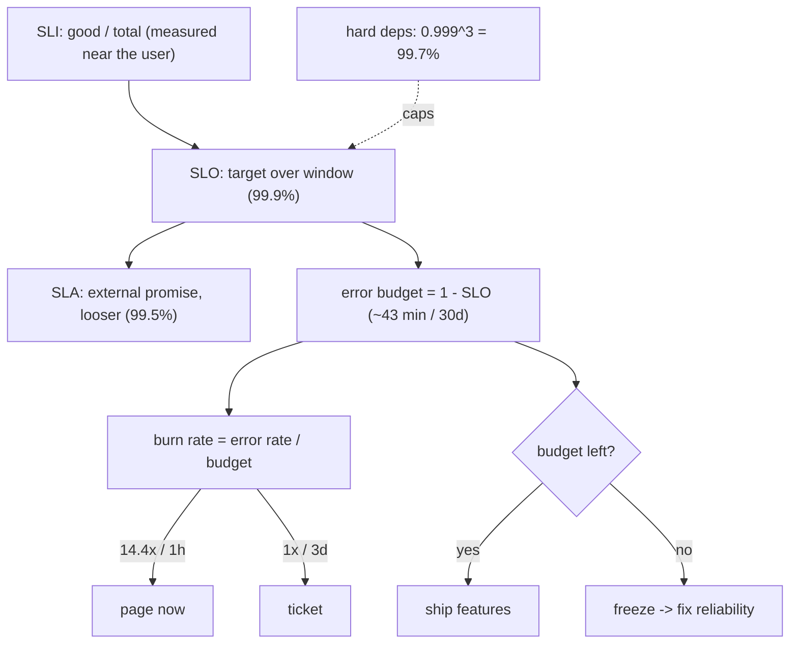

## Thesis

Defining reliability as a measurable target and managing to it --- an SLI is a metric of user-visible health (success rate, latency), an SLO is the target for that metric over a window (99.9% of requests succeed), the gap below 100% is an error budget you are allowed to spend, and the burn rate is how fast you are consuming it --- so reliability becomes a quantified, decision-driving number rather than a vague "keep it up," and the budget tells you when to ship versus when to freeze and stabilize.

## Sub

**Why: reliability has to be measurable** -> **SLI, SLO, SLA** -> **the error budget and burn rate** -> **zoom out** to burn-rate alerting, the budget as a ship-vs-freeze decision, and the pivots an interviewer rides from "make it reliable" into what makes a good SLI, error-budget policy, and burn-rate alerting.

## Spine

- An **SLI** is a metric of user-visible health, an **SLO** is the target for it, an **SLA** is the contractual promise --- SLI is what you *measure* (the proportion of good requests), SLO is the internal *goal* (99.9%), and SLA is the external *contract* (with penalties), set looser than the SLO to leave margin.
- **100% is the wrong target** --- perfect reliability is impossibly expensive and pointless (the user's own network and device fail far more often than that), so you pick a target that's good enough, and the gap below 100% is the budget for the unreliability you accept.
- The **error budget** = 1 - SLO, spent by real errors --- 99.9% over 30 days allows about 43 minutes of downtime; every incident spends budget, and how fast you spend it (the **burn rate**) drives alerting and the ship-versus-freeze decision.
- **Reliability becomes a shared, quantified decision** --- budget remaining means ship features and take risks; budget exhausted means freeze features and focus on stability --- aligning development velocity and reliability on one number instead of an argument.

## Companion Notes

### walk

Reliability as a number you manage

One service's reliability made measurable --- the SLI that captures user-visible health, the SLO target over a window, why the target isn't 100%, the error budget that gap defines, and how the burn rate turns it into alerting and a ship-vs-freeze decision.

Say the reframe first --- "reliability is a number, not a vibe." An SLI you measure, an SLO you target, and an error budget you're allowed to spend turns 'keep it up' into a shared, quantified decision.

### drill

Probe Drill

Graded follow-ups on SLIs, SLOs, error budgets, and burn rate --- the ones that separate "we monitor uptime" from managing reliability as a budget that drives engineering decisions.

Name the chain: SLI (measure user health) -> SLO (the target) -> error budget (1 - SLO, what you may spend) -> burn rate (how fast) -> policy (ship or freeze). That chain is the whole discipline.

### wb

Whiteboard

Rebuild the whole discipline from memory --- SLI to SLO to SLA, the budget, the burn rate, the alert, the policy, and the ceiling your dependencies impose.

Draw the chain left to right and put the measurement point on it first --- where you measure decides what the SLI can even see, and that is the step everyone skips.

### sys

System Map

Zoom out: the SLI is measured at the edge, the SLO targets it, the budget is drawn down by incidents, the burn rate pages, the policy decides ship-vs-freeze --- and your dependencies cap the whole thing.

Lead with the chain, not the dashboard --- "measure at the edge, target over a window, spend a budget, alert on the rate, freeze on the policy." The dependencies are the ceiling you name last and they change the answer.

### trade

Trade-offs

The calls they drill --- how high to set the target, burn-rate vs threshold alerting, rolling vs calendar windows, request- vs time-based SLIs, and journey vs component SLOs.

Always name the axis that flips the choice. There is no universally right target; there is the lowest nine that keeps users happy, and everything else is a consequence of it.

### model

Model Answers

Full spoken scripts --- the beats, in order, the way you would actually say them under time pressure.

Steal the frame, not the words. Headline first ("reliability is a number with a window"), then the one risk you would name --- usually that the SLI does not actually track users.

### num

Numbers

Back-of-envelope the budget as a percentage, as minutes, and as failed requests --- then the two numbers nobody computes: the outage burn rate and the ceiling your dependencies impose.

Lead with 0.1% of 30 days is 43 minutes, then go somewhere they do not expect --- a total outage burns at 1000x, and three hard 99.9% dependencies cap you at 99.7%.

### rf

Red Flags

What sinks the round --- a 100% target, an SLI on CPU, a static error-rate threshold, an aspirational number, an SLA equal to the SLO, and a budget policy with no teeth.

Name what the interviewer hears --- "would have zero error budget, so no deploy is ever allowed" is the fastest way to show you have never run one of these.

### open

30-Second

The opener and the close --- matched to the altitude the question is asked at.

Match the altitude --- open on the chain (SLI, SLO, budget, burn rate, policy), and land on the two hard parts: an SLI that genuinely tracks users, and a policy with actual teeth.

## Drill

all | **All three tiers, shuffled** --- the way a real loop actually comes at you.
SDE2 | **The terms and the math** --- SLI, SLO, SLA, the error budget, and the nines as time. The bar is &ldquo;reliability is a number with a window&rdquo;: name what you *measure*, what you *target*, and what you *promise* --- and do 0.1% of 30 days in your head without reaching for a calculator.
SDE3 | **Good SLIs, policy, and burn rate** --- what makes an SLI honest, how the budget gets teeth, and why alerting keys off the *rate*. The bar is &ldquo;it depends, here&rsquo;s the switch&rdquo;: name the constraint (the measurement point, the window, the percentile) and the failure each choice bounds.
Staff | **Alerting, dependencies, and pitfalls** --- multi-window burn rates, the dependency ceiling, and how SLO programs quietly die. The bar is &ldquo;the number changes a decision&rdquo;: say what pages versus what tickets, why your dependencies cap your target, and which pitfall turns an SLO into a dashboard.

### SDE2 | what an SLI is

What is an SLI?

A **Service Level Indicator** --- a quantitative measure of some aspect of the service's health *as the user experiences it*. The canonical form is a ratio of good events to total events: the proportion of requests that succeed, the proportion served under some latency threshold, the proportion of data that's fresh. So an SLI is a number between 0 and 100% that says "how well is this specific dimension doing." Good SLIs are user-centric (they reflect what users actually care about --- did my request work, was it fast) rather than internal machine metrics (CPU, memory) that don't directly map to user pain.

Follow: You said "as the user experiences it" --- but you measure success rate at the application server. Your load balancer has a bad config and half of all requests never reach the server at all. What does your SLI show?
It shows roughly **100%**, and that is the single most common way an SLI lies. The requests that never arrived were never counted, so `good / total` is computed over only the traffic that *made it* --- the denominator silently shrank along with the numerator, and the ratio stays beautiful while half your users get errors. The lesson is that **an SLI is only as honest as the place you measure it**: measure at the application server and you are blind to every failure upstream of your own code --- the load balancer, the CDN, DNS, TLS termination, the client's network. So you push measurement as close to the user as you practically can: the **load balancer's own logs** (it sees the request even when the backend never does), or **client-side / RUM telemetry** for the failures that happen outside your infrastructure entirely. The measurement point is not an implementation detail; it *defines the set of failures the SLI is capable of seeing*.

Follow: Your service handles 10 requests an hour. One fails. What does your 99.9% SLO say, and is it telling you the truth?
It says you have **catastrophically breached** --- one failure in ten is a 90% success rate, roughly a hundred times over budget --- and it is *not* telling you the truth, because a ratio SLI is statistically meaningless at a small denominator. A single error swings the number wildly, burn-rate alerts fire constantly on noise, and the team learns to ignore the SLO, which is worse than not having one. This is the **low-traffic problem**, and the fixes are all about getting a bigger denominator or a more stable signal: **lengthen the window** so the ratio has enough events to be meaningful; **aggregate the SLI across a group** of related low-traffic services or endpoints rather than SLO-ing each in isolation; add **synthetic probe traffic** so there is a steady, known floor of measurements even when real traffic is quiet; and **require a minimum event count** before an alert is allowed to fire, so one error out of three requests cannot page anyone. What you must not do is quote "99.9%" with a straight face over 10 requests --- at that volume the number is noise wearing a percentage sign.

Senior: Defining an SLI as a **ratio of good events over valid events, measured where the user's request actually lands** --- and understanding that the *measurement point* determines which failures the SLI is even capable of seeing --- is what separates it from &ldquo;we graph our error rate.&rdquo;

Speak: Give the shape first: **&lsquo;good events over valid events, measured as close to the user as I can get.&rsquo;** Then the two traps in one breath --- measure at the app server and an upstream load-balancer failure is invisible, and at low traffic the ratio is just noise. An SLI is a *proportion*, and *where* you measure it decides what it can see.

### SDE2 | what an SLO is

What is an SLO?

A **Service Level Objective** --- the *target* value for an SLI over a time window. If the SLI is "proportion of successful requests," the SLO might be "99.9% of requests succeed over 30 days." It's the goal you're managing to: the line that separates "reliable enough" from "not." The SLO is an *internal* target the team sets and holds itself to --- it's the reliability bar for the service, chosen deliberately (not 100%), and it's the reference point for the error budget and for deciding whether the service is healthy.

Follow: Your SLO is 99.9% over a rolling 30 days. Right now today's success rate is 99.95% and the month is half over. Are you meeting the SLO?
Careful --- that question contains a category error, and I would say so out loud. &ldquo;Meeting the SLO&rdquo; is a statement about the **window**, not about today: the SLI is aggregated over the whole trailing 30 days and compared to the target, so an instantaneous reading of 99.95% tells you almost nothing on its own. You could be at 99.95% today and still be deep in breach because of an incident three weeks ago that is still inside the window. The useful reframing --- and the one that shows you have actually operated this --- is to stop asking &ldquo;are we meeting it&rdquo; and start asking the two **budget** questions: **how much of the 0.1% is left**, and **how fast am I still spending it**. Those are the numbers that drive action; the point-in-time SLI drives nothing. An SLO is a statement over a window, so any single-moment reading is at best half an answer.

Follow: Who actually owns the SLO --- engineering, or product?
**Both, jointly --- and that is the entire point, not a diplomatic dodge.** An SLO set by engineering alone is a technical opinion that nobody else is bound by; the first time it blocks a launch it gets overruled. An SLO set by product alone is a wish with no grounding in what the system can do. It has to be a *negotiated commitment*: product brings what level of failure is actually acceptable to users and to the business, engineering brings what is achievable and what each additional nine genuinely costs, and the two sides agree on **the number and on what happens when the budget runs out** --- the error-budget policy. The reason ownership is the right thing to probe here is that the SLO's whole purpose is to be **the shared decision rule between those two groups**. If only one side ever signed up for it, the freeze will not hold the first time it is inconvenient, and you do not really have an SLO --- you have a chart.

Senior: Stating an SLO as **a target for a specific SLI over a specific window, jointly owned with product** --- and reflexively converting &ldquo;are we meeting it?&rdquo; into &ldquo;how much budget is left and how fast are we spending it?&rdquo; --- is the framing an SDE2 almost always misses.

Speak: Say it as a **contract with a window**: *&lsquo;99.9% of requests succeed over a rolling 30 days.&rsquo;* Three parts, all load-bearing --- the SLI it targets, the number, and the window. Then pivot immediately to the operational form: *&lsquo;so what I actually watch is budget remaining and burn rate, not today&rsquo;s number.&rsquo;*

### SDE2 | SLI vs SLO vs SLA

What's the difference between SLI, SLO, and SLA?

**SLI** is the *measurement* (the actual number: 99.95% of requests succeeded this month). **SLO** is the *internal target* for that measurement (we aim for 99.9%). **SLA** is the *external contract* with customers that promises a level and specifies *consequences* if you miss it (99.5% or we credit your bill). The key relationships: the SLI is what you measure against the SLO, and the SLA is set *looser* than the SLO --- you promise customers less than you target internally, so you have margin to miss the internal goal without breaching the contract. SLI is reality, SLO is the goal, SLA is the promise-with-penalty.

Follow: Suppose your SLO is 99.9% and your SLA also promises 99.9%. What specifically goes wrong?
You have deleted your own margin, and the consequence is sharper than it first looks. The **entire premise of an error budget is that you spend it** --- you *will* dip below the internal target, deliberately, because that is what the budget is for. But if the SLA sits at the same number, the moment the internal goal slips you are *simultaneously* in breach of a contract that carries **financial penalties**. There is no early-warning zone at all: the internal number and the contractual number cross the line at exactly the same instant, so the first signal you receive is a customer service credit rather than a burn-rate ticket. The whole reason the SLA is deliberately **looser** --- say 99.5% against a 99.9% SLO --- is to make the internal target fail **first and harmlessly**, giving you weeks of warning before anything with a dollar sign attached is triggered. An SLA that is equal to or tighter than the SLO is not ambitious; it is a design error that removes the buffer whose only job is to absorb a bad month.

Follow: The SLA says 99.5% and the SLO says 99.9%. Which number do you actually engineer to, and what do you tell the customer?
You **engineer to the SLO** and you **communicate the SLA**. Internally, every mechanism keys off 99.9%: the burn-rate thresholds, what pages, what tickets, the ship-versus-freeze policy --- because 99.9% is the bar at which users are genuinely well served, and it is the budget you are actively managing. Externally you commit to 99.5%, because that is what you can defend in a contract under adverse conditions with money attached. The gap between the two is **deliberate slack**, not sandbagging: it is precisely the buffer that lets a bad month be an internal problem rather than a legal one. And the discipline that matters is **never publishing the SLO as if it were the SLA** --- the moment customers start holding you to your internal target, you have lost the buffer, and the pressure will be to loosen the SLO to restore it, which defeats the mechanism entirely. Promise less than you aim for, and keep the two numbers in different conversations.

Senior: Naming the **direction of the gap** --- SLA looser than SLO, so the internal target fails first and harmlessly --- and being able to say what you *engineer to* versus what you *promise*, is the distinction that catches candidates who can only recite the three acronyms.

Speak: Three words, three roles: **&lsquo;SLI is reality, SLO is the goal, SLA is the promise-with-penalties.&rsquo;** Then land the direction, because that is the part they are actually testing: *&lsquo;and the SLA is deliberately looser than the SLO, so the internal target fails first and I get a warning instead of a customer credit.&rsquo;*

### SDE2 | why not 100%

Why not aim for 100% reliability?

Because it's effectively impossible and not worth it. Each additional "nine" of reliability costs dramatically more (redundancy, engineering, operational rigor) for diminishing user benefit, and beyond a point *the user's own environment* --- their WiFi, their ISP, their device --- is less reliable than your service, so extra nines are invisible to them. Chasing 100% also means never being able to take the risks (deploys, changes, experiments) that deliver features. So you pick a target that's good enough for users, and the gap below 100% is deliberate: it's the room you give yourself to change things, the budget for accepted unreliability. 100% is the wrong target because it's infinitely expensive and users can't even perceive it.

Follow: Suppose 100% were free --- no extra cost, no extra engineering. Should you take it?
Even then, **no** --- and this is the part that separates a memorized answer from an understood one, because most people think the argument is purely about cost. Two reasons stand independent of price. First, it is **unobservable**: your users reach you across their own WiFi, their ISP, their carrier, their device --- every one of which fails far more often than a well-run service --- so the reliability they *perceive* is capped by the weakest link in a chain you do not own, and your extra nines are simply invisible to them. Second, and far more important: a 100% target means a **zero error budget**, which means that *any* change is, by construction, a policy violation. You could never deploy, never migrate, never run an experiment, never take a calculated risk --- because there is no allowance for a change to go wrong. The target would force you to **stop changing the system**, and a system that cannot change cannot ship features. So the gap below 100% is not merely what you can afford; it is the **room you structurally require in order to move at all**.

Follow: So where does the number actually come from? Is 99.9% just a convention?
Largely, yes --- and treating it as a default is exactly the mistake. The number should come from **what users actually notice and what the business actually loses**. In practice you triangulate three things. **(1) Current performance**: an SLO you are already missing by a mile is not a target, it is a wish that will be ignored within a month; one you have never come close to breaching is meaningless and constrains nothing. **(2) User expectation for *this specific* service**: a payment authorization path and a recommendations widget do not deserve the same number, and pretending otherwise is how you end up over-investing in the widget and under-investing in the thing that makes money. **(3) The marginal cost of the next nine**, against the marginal benefit --- which you can often ground in real signals: at what failure rate do support tickets, session abandonment, or churn actually start moving? You want to set the bar just *above* the point where users stop caring. 99.9% is a common landing spot because for a lot of interactive web services that is roughly where failure stops being *felt* --- not because it is a law of nature, and a candidate who can say *why* their number is their number is instantly ahead of one who recites the industry default.

Senior: Going past the cost argument to the **budget argument** --- 100% means a zero error budget, therefore no deploys and no change *ever* --- and knowing the user's own network is the real ceiling, is what separates a real answer from &ldquo;nines are expensive.&rdquo;

Speak: Two reasons, one breath: **&lsquo;the user&rsquo;s own WiFi is less reliable than my service, so the extra nines are invisible --- and a 100% target leaves zero error budget, so any change is a breach.&rsquo;** The second one is the real one: the gap below 100% is not just what I can afford, it is the room I *need* in order to ship at all.

### SDE2 | what an error budget is

What is an error budget?

The amount of unreliability you're *allowed* to have --- **1 minus the SLO**. If your SLO is 99.9%, your error budget is 0.1%: that fraction of requests (or that much time) is *permitted* to be bad over the window. It reframes reliability from "never fail" to "you have this much failure to spend." Every incident, bad deploy, or error consumes budget; as long as budget remains, you're meeting your objective and can keep taking risks; when it's exhausted, you've hit your reliability limit and should stop introducing risk. The error budget turns the SLO into an actionable quantity --- a balance you draw down and must manage.

Follow: If budget remaining is permission to take risk, then it's the end of the month and we still have 80% of the budget unspent. Should we go break something?
No --- and this misread genuinely happens, so it is worth killing explicitly. The error budget is a **ceiling on acceptable unreliability, not a quota to consume**. Unspent budget is not waste; it is **headroom**, and it is exactly what lets you absorb the next incident you did not plan for. What &ldquo;budget remaining&rdquo; licenses is *taking the normal risks you already wanted to take* --- shipping, doing the migration you have been deferring, running an experiment, rolling out aggressively --- not manufacturing failure in order to use it up. The one legitimate form of &ldquo;spend it deliberately&rdquo; is a **planned experiment**: a chaos or failure-injection exercise, or a controlled risky migration, where you are *buying information* with a known, bounded amount of budget. That is a considered trade. &ldquo;Use it or lose it&rdquo; is the anti-pattern; *&ldquo;we have room, so now is the right time to do the scary migration&rdquo;* is the instinct the budget is supposed to produce.

Follow: An incident spent 90% of the month's budget in one afternoon. It's day 3. What actually happens for the other 27 days?
Under a real error-budget policy the answer is **already decided**, which is the whole value of having one --- nobody negotiates it in the moment. You are effectively out of budget, so **feature work stops and reliability work starts**: you fix the class of failure that caused the incident and you do not ship new risk for the rest of the window. But two nuances matter and are where candidates get caught. First, a freeze does **not** mean &ldquo;no deploys&rdquo; --- it means **no new feature risk**. Reliability fixes, security patches, and anything that *reduces* risk all still ship; a freeze that blocks the very fix that would restore the budget is self-defeating and will be ignored within a day. Second, if the window is **rolling**, the budget does not sit at zero waiting for the 1st of the month --- the incident ages out of the trailing 30 days gradually, so the budget recovers continuously and the freeze lifts as it does, rather than at an arbitrary calendar boundary. The policy is what converts &ldquo;we had a very bad afternoon&rdquo; into an automatic, unarguable, pre-agreed response instead of a fight.

Senior: Knowing the budget is a **ceiling, not a quota** --- unspent budget is headroom, not waste --- and that a freeze stops *feature risk* while reliability and security fixes keep shipping, is the nuance that shows you have actually lived under one of these policies rather than read about them.

Speak: Frame it as **permission, not a target**: *&lsquo;one minus the SLO is how much failure I&rsquo;m allowed; while it&rsquo;s there I can take normal risks, and when it&rsquo;s gone I stop taking them.&rsquo;* Then kill the misread out loud, because interviewers wait for it: *&lsquo;it&rsquo;s a ceiling, not a quota --- I don&rsquo;t go break things just because there&rsquo;s budget left.&rsquo;*

### SDE2 | computing allowed downtime

99.9% over 30 days --- how much downtime is that?

Compute the budget as a fraction of the window. 0.1% (1 - 99.9%) of 30 days: 30 days is 43,200 minutes, times 0.001 = **~43 minutes** of allowed downtime per month. For reference: 99% is ~7.2 hours/month, 99.9% is ~43 minutes/month, 99.99% ("four nines") is ~4.3 minutes/month, 99.999% ("five nines") is ~26 seconds/month. Each nine cuts the allowed downtime by 10x. This time-based view is the intuitive way to feel an error budget --- "we can be down about 43 minutes this month before we breach 99.9%" --- and it makes the cost of each additional nine visceral.

Follow: That's 43 minutes of *downtime*. But your SLI is a ratio of *requests*. Are those the same budget?
Not quite, and the gap between them is a real trap. &ldquo;43 minutes&rdquo; is the **time-based translation**, and it quietly assumes two things: that a failure is *total* (every request in that period fails) and that traffic is *uniform*. A **request-based** SLI does not work that way --- it spends budget in proportion to **traffic**, not to time. So a complete outage at 3am, when you are serving 5% of peak volume, costs you a small fraction of the budget that a same-length outage at peak would, because far fewer bad events landed in the denominator. Both views are legitimate and they answer genuinely different questions: the request-based number is a better proxy for **how many users you actually hurt**, while the time-based number is what an **SLA** usually promises, because &ldquo;minutes of downtime&rdquo; is something a contract can define and a customer can independently verify. So the 43-minute figure is the right *intuition pump* --- it makes the budget visceral --- but if my SLI is a request ratio I should say plainly that the real budget is &ldquo;0.1% of requests,&rdquo; rather than let the interviewer catch me conflating them.

Follow: Do the same arithmetic for 99.95% over 30 days --- and tell me why anyone bothers with a half-nine.
0.05% of 43,200 minutes is **about 21.6 minutes a month** --- exactly half of 99.9%'s 43. People reach for the half-step because **the cost curve between nines is not smooth, it is a cliff**. Going from 99.9% (43 minutes) to 99.99% (4.3 minutes) is not a tuning exercise, it is a **step change in architecture**: four minutes leaves no room for a human to be paged, wake up, orient on a dashboard and act, so the entire recovery path has to become automatic --- automated failover, no single points of failure, detection in seconds. That is a different system, and a much more expensive one. 99.95% buys you a meaningfully tighter promise --- half the allowed downtime --- while staying *inside the regime where a fast human response is still viable*. So the half-nines exist precisely because of that discontinuity: 99.95% is the useful ledge partway up the cliff, and reaching for it is a sign you understand where the cliff actually is.

Senior: Doing the arithmetic cold **and** immediately flagging that &ldquo;downtime minutes&rdquo; and &ldquo;failed requests&rdquo; are *different budgets* --- time-based versus request-based --- is what separates someone who memorized the nines table from someone who has managed one.

Speak: Do the arithmetic out loud: **&lsquo;0.1% of 30 days --- 43,200 minutes --- is about 43 minutes a month.&rsquo;** Then the ladder in one breath: *99% is 7 hours, 99.9% is 43 minutes, 99.99% is 4 minutes, 99.999% is 26 seconds --- each nine cuts it tenfold.* Then the honest caveat: *&lsquo;though if my SLI is a request ratio, the real budget is 0.1% of requests --- the minutes are the intuition.&rsquo;*

### SDE2 | a good SLI example

Give an example of a good SLI.

The classic **availability SLI**: proportion of successful requests = (successful requests) / (total valid requests), measured at the load balancer or server. Or a **latency SLI**: proportion of requests served faster than a threshold, e.g. "proportion of requests completing under 300ms." Both are user-centric ratios of good events to total. For a data pipeline it might be **freshness** (proportion of data updated within X minutes); for a queue, **correctness** or processing latency. The pattern is always: pick the thing users actually feel (did it work, was it fast, was it fresh), express it as good/total, and set an SLO on it. "CPU under 80%" is *not* a good SLI --- it's an internal metric that doesn't directly reflect user experience.

Follow: You said "total *valid* requests." Define valid for me --- what exactly is in the denominator?
This is where SLIs get quietly gamed and quietly broken, so I would be explicit rather than hand-wave the word. **Valid** means the requests you are actually responsible for serving. You *exclude* what is genuinely not your failure --- a 4xx caused by a truly malformed client request, load-test traffic, your own health-check probes --- and you *include* everything you are responsible for, **especially the failures that are inconvenient to count**. The two failure modes are opposite and both are real. Under-prune the denominator and the SLI is noisy with things you cannot control. But **over-prune it** --- *&ldquo;that 500 was really the payment provider, not us&rdquo;*, *&ldquo;those errors came from a client on a stale SDK&rdquo;* --- and you have **redefined your way to a green SLO** while users continue to get errors, which is the most insidious way an SLO program dies. The test is always the same one: *if I exclude this class of event, and a real user hit it, would they say the service worked?* If the answer is no, it belongs in the numerator as a failure. Concretely: a **429 from my own rate limiter is mine**; a **400 from a genuinely broken client is not**.

Follow: Which status codes count as failures? A 500 obviously. What about a 429 --- or a 200 that returns an empty result because a dependency timed out?
The rule is **user-visible outcome, not status code**, and those two examples are precisely why. A **500** is a failure, trivially. A **429** *is* a failure --- your service did not serve that user, and the fact that *you* chose to shed the load does not make their experience better. It has to count against you, because the alternative creates a genuinely perverse incentive: a rate limiter that keeps your SLI green by rejecting traffic. But the nastiest of the three is the last: a **200 carrying a degraded or empty body** because a dependency timed out and you &ldquo;gracefully degraded.&rdquo; If the user got a search page with no results, they were **not served** --- and an SLI computed from HTTP status alone will cheerfully record that as a success. That is exactly how you end up green while the support queue fills. Which is why good SLIs are frequently defined on a **semantic success signal the application itself emits** --- *did we actually return results?* --- rather than on the status code, because the status code is a **proxy**, and proxies are precisely where SLIs lie to you.

Senior: Interrogating the **denominator and the definition of &ldquo;good&rdquo;** --- that a 429 is *your* failure, and that a 200 with an empty body is a failure the status code will happily call a success --- is the depth that shows you have had an SLI lie to you in production.

Speak: Give one concrete SLI, then immediately go to the trap: **&lsquo;proportion of requests returning a correct response under 300ms, measured at the edge.&rsquo;** Then: *&lsquo;and I&rsquo;d pin down &ldquo;valid&rdquo; and &ldquo;good&rdquo; out loud --- a 429 is my failure, and a 200 with an empty body because a dependency timed out is a failure my status code will call a success.&rsquo;*

### SDE3 | what makes a good SLI

What distinguishes a good SLI from a bad one?

A good SLI **tracks user-perceived reliability** and moves *with* user happiness --- when the SLI drops, users are actually hurting; when it's healthy, they're fine. Properties: it's a **proportion of good events over valid events** (naturally 0-100%, easy to target and aggregate); it's measured **as close to the user as practical** (at the load balancer or client, not deep in a backend that misses failures upstream); and it *excludes* things outside your control or irrelevant to users. Bad SLIs are internal resource metrics (CPU, memory --- weakly correlated with user pain), or metrics that stay green while users suffer (or red while they're fine). The test: "if this SLI is met, are users happy?" If the answer isn't reliably yes, it's the wrong SLI.

Follow: You have a dashboard with 40 metrics on it. How do you actually pick the two or three that become SLIs?
You do not pick them from the dashboard at all --- you start from the **critical user journeys**, because a dashboard is a list of things you happen to be able to measure, and an SLI has to be a thing users can actually **feel**. So: enumerate the handful of journeys that genuinely matter (for a payments product: authorize a payment, check a balance, load the dashboard), and for each, ask what &ldquo;working&rdquo; means to the person doing it --- which almost always lands on one **availability** signal and one **latency** signal, occasionally **freshness** or **correctness** for a data path. That yields two or three SLIs *per journey*, not forty. The discipline is **subtractive**, and two questions do the cutting: *&ldquo;if this metric is healthy and users are complaining, would I be surprised?&rdquo;* and *&ldquo;if this metric is unhealthy, are users definitely hurting?&rdquo;* A candidate that fails either test is **monitoring, not an SLI**. You keep all 40 --- they are how you *debug* a breach --- you simply do not *promise* on them.

Follow: Your SLI is green and users are complaining. Walk me through what you check.
I treat **the SLI itself as the prime suspect**, in a fixed order --- because &ldquo;green SLI, unhappy users&rdquo; is almost never a user problem, it is evidence that the SLI does not track the experience. **(1) The measurement point.** Am I measuring somewhere that structurally *cannot* see this failure? If the SLI is computed at the app server and the breakage is in the CDN, the load balancer, DNS, TLS, or the client, my numbers are perfect and my users are down. **(2) The definition of &ldquo;good.&rdquo;** Am I counting a degraded 200 as a success --- an empty result set, a fallback page, a stale cache --- or excluding a class of error from &ldquo;valid&rdquo;? **(3) Aggregation hiding a segment.** A global average will happily conceal a catastrophe: one **region**, one large **tenant**, one **API version**, or one **device class** can be completely broken while the blended number barely twitches; the fix is to slice the SLI by the dimensions that can fail independently. **(4) The wrong journey.** My SLI covers an endpoint nobody is complaining about, and their actual pain is on a path I never instrumented. **(5) The wrong percentile.** I am targeting a percentile that hides the tail they are feeling. The through-line: when the SLI and the users disagree, **the SLI is the bug** --- and I would fix that before I touched the service.

Senior: Owning that **&ldquo;SLI green, users angry&rdquo; means the SLI is wrong** --- and having an *ordered* list of why (measurement point, definition of good, aggregation hiding a segment, wrong journey, wrong percentile) --- is the diagnostic reflex that reads as senior.

Speak: One test, said out loud: **&lsquo;if this SLI is met, are users happy? If I can&rsquo;t confidently answer yes, it&rsquo;s the wrong SLI.&rsquo;** Then the properties: a proportion of good over valid, measured near the user, and *sliced* --- so one broken region or one broken tenant can&rsquo;t hide inside a healthy average.

### SDE3 | error budget policy

What is an error budget policy?

The pre-agreed rule for *what you do* as the budget depletes --- the teeth that make error budgets matter. Typically: while budget remains, the team ships features freely and takes normal risks; when the budget is **exhausted** (SLO at risk of being missed), a **feature freeze** kicks in --- new development stops and the team focuses exclusively on reliability work until the budget recovers. Variants add graduated responses (at 50% burned, slow down risky changes; at 100%, freeze). The point is that the policy is agreed *in advance* by both engineering and product, so when the budget runs out there's no argument --- the response is automatic. Without a policy, error budgets are just interesting numbers; the policy is what turns them into a decision-making mechanism.

Follow: The budget is exhausted, the freeze kicks in --- and a VP says the feature ships Friday regardless. Now what?
This is the moment the policy is actually tested, and a **good policy anticipates it rather than pretending to be inviolable**. It names an **explicit, documented escalation path**: someone senior *can* grant an exception --- but the exception is **visible, attributable, and costly to use**. It is written down, it names who authorized it and why, and it carries a **commitment** (the reliability work gets scheduled, not vaporized). That does two things at once. It keeps the policy from being quietly ignored --- an unbreakable rule gets ignored the first time it is inconvenient, whereas a bendable one with a paper trail survives. And it converts a quiet override into an **organizational decision with a name attached**, which is what actually creates pressure not to do it repeatedly. What you must avoid is the freeze being overridden *informally and routinely*; at that point the budget has no teeth and the mechanism is dead. And here is the read most people miss: **if you are being overridden every month, your SLO is probably wrong** --- set tighter than what the business actually wants to buy --- and the correct response is to **renegotiate the number**, not to keep declaring a freeze nobody honors.

Follow: What exactly is frozen? Can I really not deploy at all?
No --- a freeze that blocks *all* change is self-defeating, because **the changes that restore the budget are themselves deploys**. What is frozen is **new feature risk**: new functionality, risky migrations, anything that adds surface area without reducing failure. What explicitly keeps shipping is (a) **reliability work** --- the fixes for whatever burned the budget, (b) **security patches**, and (c) anything that measurably *reduces* risk. Teams write that list down, and they should, because **the ambiguity is exactly where the policy dies**: without it, someone freezes the fix, someone else ships a &ldquo;small&rdquo; feature under the reliability banner, and within a month nobody knows what the policy means. There is also usually a **graduated** version rather than a binary cliff --- at 50% burned, risky changes need extra review and the deploy cadence slows; at 75%, only low-risk changes; at 100%, features stop. That is gentler, it lets the team *steer* before it crashes, and in practice it produces a far better-behaved response than one hard switch everybody resents.

Senior: Knowing the policy needs a **documented, attributable escape hatch** --- and that a freeze stops *feature risk*, not deploys --- plus the read that *&ldquo;we override it every month&rdquo;* means **the SLO is wrong, not the policy**, is genuine organizational judgment.

Speak: Lead with the teeth: **&lsquo;the policy is agreed in advance, so when the budget runs out there&rsquo;s no argument to have.&rsquo;** Then the two things people get wrong: *the freeze stops new feature risk, not reliability or security fixes --- and there&rsquo;s a documented, named escalation path, because a rule that can&rsquo;t bend gets ignored instead of followed.*

### SDE3 | burn rate

What is burn rate?

How *fast* you're consuming the error budget, relative to the rate that would exactly exhaust it over the window. A burn rate of 1 means you'll spend exactly the whole budget by the end of the window (right on target); a burn rate of 10 means you're spending it 10x too fast (a serious problem --- you'll exhaust the month's budget in a tenth of the time); a burn rate below 1 means you're comfortably under. It's the crucial signal for alerting: rather than alerting on every error, you alert when the *burn rate* is high enough to threaten the budget. A brief spike that burns a little budget is fine; a sustained high burn rate means you'll blow the SLO and needs attention. Burn rate turns the static budget into a rate-of-change you can alert on.

Follow: Make it concrete. 99.9% SLO, 30-day window, and your error rate right now is 1%. What's the burn rate, and how long until the budget is gone?
Burn rate is just the **error rate divided by the budget fraction**. The budget is 1 - 0.999 = **0.1%**; you are erroring at **1%**; so the burn rate is 0.01 / 0.001 = **10x**. And since a burn rate of 1 means you would exactly exhaust the budget at the end of the window, 10x means you exhaust it in **one tenth of the window: 30 days / 10 = 3 days**. That is the whole intuition, and it is worth stating as a rule: *burn rate is how many times faster than sustainable you are going, and window divided by burn rate is your time-to-exhaustion.* The extreme case is the one to have loaded and ready, because interviewers reach for it: a **total outage** is a 100% error rate, so its burn rate is 1 / 0.001 = **1000x**, which exhausts the month's budget in 30 days / 1000 = **43 minutes** --- which is exactly the allowed-downtime figure. The same fact, seen from the other end.

Follow: Burn rate 10 for one minute, versus burn rate 2 sustained for a week. Which do you page on?
**Neither on its own** --- and that is precisely why you look at burn rate *over a window* rather than instantaneously. Do the arithmetic. A 10x burn for one minute spends 10 x (1 minute / 43,200 minutes), about **0.02% of the month's budget** --- statistically nothing, and paging a human for it is how you manufacture alert fatigue. A 2x burn sustained for a week spends 2 x (7 / 30), roughly **47% of the month's budget** --- a serious, genuinely budget-threatening problem, and it will **never** trip an instantaneous &ldquo;error rate above 1%&rdquo; threshold, because a 2x burn against a 0.1% budget is only a **0.2% error rate**. It is a slow leak, and a static threshold is *structurally blind* to it. So the answer inverts the naive intuition: the **spikier** event is the one you ignore, and the **milder, sustained** one is the one you must catch. That inversion is the entire argument for multi-window burn-rate alerting --- a short window with a high threshold catches the genuine emergency fast, and a long window with a low threshold catches the leak a threshold alert cannot see at all.

Senior: Computing it cold --- **burn rate = error rate / budget fraction**, and **time-to-exhaustion = window / burn rate** --- and then using it to show that a big spike can matter *less* than a mild sustained leak, is the fluency the entire alerting design rests on.

Speak: Define it as a ratio, not a feeling: **&lsquo;burn rate is my error rate divided by my budget --- 1% errors against a 0.1% budget is 10x, which eats a 30-day budget in 3 days.&rsquo;** Then land the consequence: *&lsquo;so I alert on burn rate over a window --- a brief 10x spike is noise, and a sustained 2x leak will quietly eat half my month without ever tripping a threshold.&rsquo;*

### SDE3 | choosing an SLO target

How do you choose the right SLO target?

Base it on **what users actually need**, then set it just high enough --- not aspirationally high. Look at current performance (don't set an SLO you're already missing badly, or one so loose it's always met and meaningless), at user expectations (what level of failure do users notice/tolerate for *this* service), and at the cost of each nine. The SLO should be **achievable but meaningful**: tight enough that meeting it means users are genuinely well-served, loose enough that you have error budget to work with (an SLO of 100% or 99.999% for a service that doesn't need it just creates a permanently-exhausted budget and constant firefighting). A common mistake is setting SLOs by aspiration ("we want five nines!") rather than by user need and achievability --- which produces SLOs nobody can meet and everybody ignores.

Follow: You're setting the first SLO for an existing service. You measure it: it currently runs at 99.5%. Do you set the SLO at 99.5%, or at the 99.9% you want?
Neither mechanically --- but the honest starting point is **close to what you actually achieve**, and the reasoning matters more than the number. If I set 99.9%, I am **born in breach**: the budget is exhausted on day one, the freeze triggers immediately, the alerts scream continuously, and within a month everyone has learned that the SLO is noise --- which destroys the credibility of the **entire mechanism**, not just this one number. If I set exactly 99.5%, I have enshrined the status quo and the SLO exerts no pull at all. So the first question is not about the number, it is: **is 99.5% actually hurting users?** If it is not --- if support load, churn and escalations are flat at this level --- then the SLO **is** 99.5%, or a touch above, and I am done, because an SLO's job is to describe *enough*, not *aspiration*. If 99.5% *is* hurting users, then the gap is a **project, not an SLO**: I set a realistic near-term target I can actually hold, I make the reliability work explicit and funded, and I **ratchet the target upward as the service genuinely improves**. The rule is that an SLO has to be a bar you can hold *today* while still being one users are happy with --- anything else is a wish that trains the organization to ignore its own alerting.

Follow: Should every service get its own SLO?
**No** --- and resisting that impulse is one of the most valuable things you can do, because it is the failure mode of enthusiastic SLO adoption. SLOs cost real money to run: measurement, review, alerting, an on-call rotation that answers them. And their entire value is **focus**. SLO everything and you get two hundred dashboards, nobody can act on any of them, the alerts get muted, and the mechanism dies of noise --- you have spent a quarter building an elaborate machine for producing charts. You SLO the **critical user journeys**: the handful of paths whose failure means a genuinely bad experience or lost revenue. Everything else is covered by ordinary monitoring and, transitively, by the journey SLOs its components sit underneath. An internal service with no direct user impact usually does not need its own externally-facing SLO --- what it needs is a clear **contract with its callers**, and its reliability surfaces inside the journey SLO of whatever it serves. The test is blunt: *if this SLO were breached, would anyone change what they are doing?* If not, do not have it.

Senior: Refusing to set an SLO the service is **already missing** --- because being born in breach destroys the policy's credibility permanently --- and refusing to SLO everything, is the judgment that separates someone who has *run* SLOs from someone who has read about them.

Speak: Anchor to reality before ambition: **&lsquo;I&rsquo;d start from what the service actually does today and what users actually tolerate --- not from a number I like the sound of.&rsquo;** Then name the trap: *&lsquo;the classic mistake is an aspirational target --- you&rsquo;re in breach on day one, the freeze fires immediately, and everyone learns to ignore the whole mechanism.&rsquo;*

### SDE3 | the nines and their cost

Why does each additional nine cost so much more?

Because reliability gains are exponential in effort. Going from 99% to 99.9% (7.2 hours to 43 min of monthly downtime) might mean better monitoring and faster incident response. From 99.9% to 99.99% (43 min to 4.3 min) demands eliminating most single points of failure, automated failover, and very fast detection --- you can't fix things by hand in 4 minutes. From 99.99% to 99.999% (26 seconds/month) requires near-perfect automation, multi-region redundancy, and removing humans from the recovery path entirely (no human responds in seconds). Each nine roughly 10x's the allowed downtime reduction *and* the engineering investment, while the *user-perceived* benefit shrinks (past ~99.9%, other things in their path dominate). This exponential cost curve is exactly why you target the *lowest* nine that satisfies users, not the highest you can imagine.

Follow: You're at 99.9% and you want 99.99%. Concretely --- what changes?
The binding constraint becomes **time**, and that is what forces the architecture. At 99.9% you have roughly **43 minutes a month**, which is genuinely enough for a human to be paged, wake up, open a dashboard, form a hypothesis and act --- so 99.9% is reachable with good monitoring, a competent on-call rotation and a fast rollback. At 99.99% you have about **4.3 minutes a month**, and **no human does anything useful in four minutes** --- so the entire recovery path has to become automatic. Concretely: **no single points of failure** (redundancy across instances, availability zones, often regions); **automated failover** with health checks that detect and shift traffic within seconds; **detection in seconds**, not minutes; and --- the one people forget --- **deploys that cannot take you down**, because at that level *your own releases become a leading cause of your downtime*, so you need progressive rollout with automatic rollback on SLI regression. You also start caring about things that were rounding errors before: a 30-second DNS TTL, a slow leader election, a cache stampede on restart. The step from 99.9% to 99.99% is not &ldquo;be more careful&rdquo; --- it is **&ldquo;remove the human from the recovery path,&rdquo;** which is a *different* system, not a tuned one.

Follow: Is there anything that buys you an extra nine *cheaply*?
Yes --- and it is the highest-leverage question in the whole topic: **stop failing at things that were never hard**. Before you buy redundancy, go and look at what is *actually* spending the budget, because in most services a large share of incidents are **self-inflicted by change** --- a bad deploy, a bad config push, a bad migration. So the cheap nine usually comes from **progressive delivery**: canary the release *against the SLI*, roll back automatically on regression, and treat configuration as code with the same gates. That converts &ldquo;a bad deploy takes the service down for 20 minutes&rdquo; into &ldquo;a bad deploy degrades 1% of traffic for 2 minutes&rdquo; --- an order of magnitude of budget recovered, for engineering you almost certainly wanted anyway. The other cheap wins have the same shape: **taking a hard dependency off the critical path** (cache it, make it async, degrade gracefully) buys back *all* of that dependency's unreliability; and **fixing the top one or two recurring incident classes** usually beats a broad redundancy program on pure return. Redundancy is what you buy **once you have run out of self-inflicted failures to eliminate** --- it is expensive precisely because it is the *last* lever, not the first.

Senior: Framing the jump as **&ldquo;remove the human from the recovery path&rdquo;** --- because 4 minutes a month is below human reaction time --- and then knowing the *cheap* nine is usually eliminating self-inflicted change failures **before** buying redundancy, is Staff-adjacent cost reasoning.

Speak: Make it about time, not effort: **&lsquo;at 99.9% I have 43 minutes a month --- a human can be paged and act. At 99.99% I have four minutes, and no human is useful in four minutes, so the recovery path has to be automated.&rsquo;** Then the cheap lever: *&lsquo;and before I buy redundancy, I&rsquo;d fix the deploys --- most budget is spent on self-inflicted change.&rsquo;*

### SDE3 | latency SLOs

How do you define a latency SLO correctly?

As a **proportion under a threshold**, using **percentiles**, never averages. "99% of requests complete under 300ms" is a good latency SLO; "average latency under 300ms" is a bad one --- averages hide the tail, so a great average can coexist with a slow, painful experience for a meaningful fraction of users. You typically set it at a high percentile (p95, p99) because that captures the *worst* experiences users actually get, which is what erodes trust. Often you define *multiple* latency thresholds (e.g. 90% under 100ms *and* 99% under 500ms) to shape the whole distribution, not just one point. The core discipline: latency is a distribution, so SLO it by percentile-under-threshold, because the average is the one statistic that reliably lies about tail pain.

Follow: You set "p99 under 300ms." Your service makes 5 sequential internal calls, each with a p99 of 300ms. What's the p99 of the whole request?
Far worse than 300ms --- and this is the trap that makes naive latency budgets fall apart. If the calls are independent, the chance that **all five** land under their p99 is 0.99^5, which is about **95%**. So roughly **1 request in 20** has at least one call in its tail --- not 1 in 100. Put another way: a component's p99 becomes something closer to the **p95** of a five-call request, and tail latency **amplifies** as you chain or fan out --- the &ldquo;tail at scale&rdquo; effect. Two consequences follow. First, you **cannot** hand each internal service the same percentile target as the user-facing SLO; the internal budgets have to be **tighter** than the external one, or you must reduce the number of serial calls. Second, the real fixes are architectural, not numerical: **parallelize** what does not need to be sequential (though note the tail then depends on the *slowest of N*, which is *also* worse than one --- so you additionally reach for **hedged requests** or a fallback for stragglers); **shorten the call chain**; and set aggressive **timeouts with a degraded response** so a single straggler cannot own the request's latency. The percentile of a composed request is not the percentile of its parts, and knowing *which direction* it moves --- and roughly by how much --- is the entire point of the question.

Follow: Why not just SLO the average latency? It's simpler, and it's what the dashboard already shows.
Because the **average is the one statistic that reliably lies about tail pain**, and it fails in three separate ways. First, latency is a **heavily skewed distribution**: a service can hold a beautiful 80ms mean while 2% of requests take 5 seconds --- and those 2% are real people having a genuinely terrible time, whom the mean simply averages out of existence. A mean-based SLO would call that service perfectly healthy. Second, the mean is **actively misleading under load**: as a system saturates, the *tail* blows out long before the mean moves appreciably, so the average is the **last** signal to degrade --- exactly backwards for alerting, where you want the earliest honest indicator. Third, it is **not robust**: one 60-second outlier can drag a mean and send you chasing a phantom. So a latency SLO is always **a proportion under a threshold** --- &ldquo;99% of requests under 300ms&rdquo; --- which buys three things at once: it is **directly meaningful to a user** (*did my request feel fast?*); it is a **good/total ratio just like availability**, so it plugs straight into the same error-budget and burn-rate machinery with no special cases; and it is **honest about the tail**. And you frequently set two or three thresholds together (90% under 100ms *and* 99% under 500ms) so you are pinning the *shape* of the distribution rather than one point on it.

Senior: Knowing that **tail latency compounds across a call chain** --- five serial calls at p99 300ms gives ~95%, not 99%, under 300ms --- and that a latency SLO must be a *proportion under a threshold* so it plugs into the same budget machinery as availability, is real distributed-systems literacy.

Speak: State the **form**, not just the number: **&lsquo;99% of requests under 300ms&rsquo; --- a proportion under a threshold, never an average**, because the average hides the tail and it&rsquo;s the last thing to move when the system saturates. Then the compounding: *&lsquo;and I&rsquo;d tighten the internal budgets, because five serial calls at p99 gives me about 95%, not 99%.&rsquo;*

### SDE3 | measurement window

Rolling window or calendar window for an SLO --- what's the difference?

A **rolling window** (e.g. trailing 30 days) always looks at the last N days from *now*, so the budget continuously reflects recent performance and old incidents gradually age out --- good for ongoing operational decisions (is the service healthy *right now*, over recent history). A **calendar window** (this month, resetting on the 1st) aligns with reporting/billing periods and gives a fixed budget that resets predictably --- but creates a "budget resets Monday" effect where behavior changes around the boundary. Rolling is generally better for engineering decisions (no artificial reset, always current); calendar is common for SLAs and business reporting (aligns with contracts and billing). The choice shapes how the budget behaves over time and when it "refills," so pick rolling for operational SLOs and calendar where you must align with external periods.

Follow: Rolling 30 days. An incident 29 days ago burned half the budget. Tomorrow it ages out and the budget jumps back up. Is that a problem?
It is the honest, *intended* behavior --- reliability should be judged on **recent** performance, and an incident a month old genuinely should not still be constraining you today. But you have to manage it, because a real failure mode hides inside it: the budget recovers as a **cliff, not a ramp**. A team sitting under a freeze can simply **wait for the old incident to fall off the back of the window** and then resume shipping *having fixed nothing*. The budget came back for free, and the policy just rewarded doing nothing. Two guards. First, tie the error-budget policy to **remediation, not to arithmetic**: exiting a freeze requires the incident's follow-up actions to actually be **done**, not merely for the number to have recovered. Second, watch the **burn rate**, not just the remaining balance --- the balance is a *lagging* indicator that one big old incident distorts in both directions, whereas the burn rate tells you what *today* actually looks like. And if the cliff is genuinely disruptive, the sophisticated fix is a **weighted or exponentially-decayed** window, so old incidents fade out smoothly instead of dropping off in one step.

Follow: Your SLA is monthly and calendar-aligned. Your SLO is a rolling 30 days. Doesn't that mismatch cause problems?
It is the normal and correct arrangement --- but you have to be deliberate about *why*, because they serve different masters. The **SLA is calendar-monthly because it is tied to billing**: a customer needs a well-defined period they can independently verify and be credited against. The **SLO is rolling because it drives engineering decisions**, and an engineering decision should never depend on what day of the month it happens to be. The mismatch is fine provided two things hold. **(a) The SLO is tighter than the SLA**, so the rolling internal signal always trips well before the calendar contractual one does --- that is the whole buffer. **(b) You report both and never confuse them**: the rolling number is what on-call and the freeze key off; the calendar number is what goes in the customer report and determines credits. The real hazard is not the mismatch at all --- it is a **calendar-aligned SLO**, which produces the &ldquo;budget resets on the 1st&rdquo; behavior: teams hold risky launches until the reset, then burn recklessly on the 2nd. That is an artificial boundary changing engineering behavior for no engineering reason. **Rolling for operations, calendar for contracts, and keep the gap between them.**

Senior: Naming the **cliff** a rolling window creates --- a team can wait for an old incident to age out and exit a freeze having fixed nothing --- and gating freeze *exit* on **remediation** rather than on the arithmetic, is exactly the second-order thinking a Staff round rewards.

Speak: Split it by purpose: **&lsquo;rolling for engineering, calendar for contracts.&rsquo;** Rolling because a decision shouldn&rsquo;t depend on the day of the month; calendar because billing and SLAs need a verifiable period. Then the catch: *&lsquo;and a rolling window lets an old incident age off, so I&rsquo;d gate the freeze exit on the remediation being done, not just on the number recovering.&rsquo;*

### Staff | burn-rate alerting

How do you alert on SLOs well?

With **multi-window, multi-burn-rate** alerts, not simple thresholds. The idea: alert on the error budget *burn rate* over multiple time windows simultaneously. A **fast-burn** alert (burning 14.4x budget over 1 hour --- which would exhaust a month's budget in ~2 days) pages immediately: something is seriously wrong now. A **slow-burn** alert (**1x over 3 days**) files a ticket: a leak precisely on pace to consume the window, which will blow the budget if nobody fixes it but does not deserve a 3am page. What calibrates the ladder is **how much budget is already spent when each rule fires** --- 14.4x/1h fires at **2%** of the month, 1x/3d at **10%** --- and that ladder has to be **monotonic**: a rule that files a *ticket* after spending *more* budget than the rule that *pages* has the escalation backwards, and you would page too late and ticket too early. Using multiple windows together gives both *fast detection* of severe issues and *low false positives* (a short window confirms the burn is real and ongoing, a longer window catches slow leaks). This is far better than "alert if error rate > X%" because it ties alerting directly to *user-impact-over-time* (the budget) and calibrates urgency to how fast you're actually losing reliability --- the SRE-standard approach.

Follow: Give me the actual alert configuration. Real numbers.
For a 99.9% SLO on a 30-day window, the standard setup is **three rules**, and the *derivation* is the tell --- every number falls out of one formula. **Page, fast burn: 14.4x over 1 hour**, confirmed by a 5-minute short window. Why 14.4? Because 14.4 x (1h / 720h) = **2% of the month's budget** --- you page having spent only 2%, and a sustained 14.4x would exhaust the entire month in about **2 days**. **Page, medium burn: 6x over 6 hours**, confirmed by a 30-minute window: 6 x (6 / 720) = **5% of budget**. **Ticket, slow burn: 1x over 3 days**, confirmed by a 6-hour window: 1 x (72 / 720) = **10% of budget** --- a leak that is precisely on pace to consume the window, which does not deserve a 3am page but absolutely must be fixed. Every one of those is the same formula: **budget consumed when the alert fires = burn rate x (long window / SLO window)**. So you are not guessing thresholds --- you are *choosing how much budget you are willing to spend before waking someone up*, and the burn rate follows.

Follow: Why the second, shorter window at all? Isn't the long window enough?
The long window alone gives you a **terrible reset time**, and that is the specific problem the short window exists to solve. A 1-hour trailing window that has just been full of errors keeps its *average* above the threshold for a long time **after the errors stop** --- so the alert stays firing well past the end of the incident, which trains on-call to ignore it and makes it useless for confirming that a fix actually worked. Adding a **short window** (rule of thumb: about **one twelfth of the long window** --- 5m for 1h, 30m for 6h, 6h for 3d) as an **AND** condition means the alert only holds while the *recent* burn is *also* above the threshold, so it clears within minutes of recovery. The short window kills a second failure mode too: a single brief spike that happens to drag the long window's average over the line will no longer satisfy the short window once it has passed, so you get materially fewer false pages. So the pair is deliberately doing **two different jobs**: the **long** window supplies *significance* (enough budget is genuinely at risk to be worth waking a human), and the **short** window supplies *currency* (it is still happening right now). Long alone is sticky and slow to clear; short alone is twitchy and pages on noise.

Senior: Producing the **actual numbers with their derivation** --- 14.4x/1h fires at 2% of budget, 1x/3d at 10%, short window is about long/12 for reset time --- rather than gesturing vaguely at &ldquo;multi-window,&rdquo; is unambiguously a Staff signal.

Speak: Give the pair and the reason for each half: **&lsquo;a fast-burn rule --- 14.4x over an hour --- pages, because that&rsquo;s 2% of the month&rsquo;s budget gone and a two-day path to zero. A slow-burn rule --- 1x over three days --- tickets.&rsquo;** Then the short window: *&lsquo;each has a short confirmation window, about a twelfth of the long one, so the alert clears fast when the incident ends instead of hanging around.&rsquo;*

### Staff | SLOs vs threshold alerting

Why is SLO-based alerting better than traditional threshold alerting?

Because it alerts on **user impact over time**, not on arbitrary point-in-time metrics. Traditional alerting ("CPU > 80%", "error rate > 1% for 5 min") produces two failures: **noise** (alerts fire for conditions that don't actually hurt users --- a brief blip, a metric that's high but harmless), causing alert fatigue; and **gaps** (a slow burn that never crosses the instantaneous threshold silently eats your reliability). SLO burn-rate alerting fixes both: it fires only when you're losing budget *fast enough to matter*, so a harmless spike doesn't page anyone, and a sustained slow degradation *does* get caught (via the long-window alert) even though it never spikes. It also unifies alerting under one meaningful question --- "am I going to miss my SLO?" --- instead of a sprawl of disconnected thresholds. The result is fewer, more actionable pages tied directly to user experience.

Follow: You're replacing 200 threshold alerts with SLO burn-rate alerts. What breaks --- what were those 200 doing that burn-rate alerting doesn't?
Burn-rate alerts answer exactly **one** question --- *&ldquo;am I about to miss my SLO?&rdquo;* --- and that is the right question to **page** on, but it is not the only thing those 200 alerts were doing, and pretending otherwise is how the migration goes wrong. Three things you must not throw away. **(1) Diagnostics.** Burn-rate alerts tell you *that* users are hurting; they say nothing about *why*. Disk pressure, connection-pool saturation, replica lag, GC thrash --- these are how you *debug* a breach. You keep them as dashboards; you just stop **paging** on them. **(2) Leading indicators with no user-visible symptom --- until suddenly there is one.** A disk at 95% full, a certificate expiring in 3 days, a quota at 90%: the SLI is perfectly green and will *stay* green right up until it goes to zero. Those genuinely warrant an alert --- usually a **ticket**, not a page --- precisely because the burn-rate alert can only fire *after* the cliff. **(3) Things no SLI covers**: a failing backup, a stalled batch job, a security signal. So the correct migration is: **page on symptoms** (burn rate on user-facing SLIs), **ticket on the leading indicators that predict a cliff**, and **dashboard the rest** as diagnostics. The mistake is a triumphant &ldquo;SLO alerting replaces everything,&rdquo; which quietly deletes your saturation and expiry warnings --- and then you find out about the full disk *from the SLO*.

Follow: Isn't a burn-rate alert just a threshold alert with extra math? What's actually different?
It looks that way, and the difference is genuinely conceptual, not cosmetic. A threshold alert asks *&ldquo;is this metric above a line right now?&rdquo;* --- and the line is **arbitrary**. Why 1%? Why 5 minutes? It has no connection to what users experience, there is no principled way to tune it, so it gets set by folklore and then adjusted whenever it becomes annoying. A burn-rate alert asks *&ldquo;is user-visible harm accumulating fast enough to breach a commitment I actually made?&rdquo;* --- and every parameter is **derived, not guessed**: the threshold comes from how much budget you are willing to spend before waking someone, the window comes from the detection time you want, and both are anchored to a target product and engineering genuinely agreed to. Three concrete differences fall out. It is **normalized by budget** --- a 1% error rate is an emergency for a 99.99% service and unremarkable for a 99% one, so one configuration is correctly calibrated per service in a way a static threshold structurally cannot be. It is **integrated over time**, so it catches the slow leak that never crosses an instantaneous line, and ignores the spike that crosses it harmlessly. And it is **falsifiable**: you can state exactly what an alert costs you in budget and what it buys you in detection time. It is not extra math on the same idea --- it is a **different question**, and the math is just what is required to answer it honestly.

Senior: Keeping the **leading indicators (disk, certs, quota) as tickets** while moving *paging* to symptom-based burn-rate alerts --- rather than a triumphant &ldquo;SLO alerting replaces everything&rdquo; that silently deletes your saturation warnings --- is the operational maturity a Staff round is checking for.

Speak: Compress it to the shift: **&lsquo;page on symptoms, ticket on causes.&rsquo;** Burn-rate alerting pages only when user-visible harm is accumulating fast enough to threaten a commitment --- so a harmless spike wakes nobody, and a slow leak still gets caught. Then protect the flank: *&lsquo;but I&rsquo;d keep disk, cert-expiry and quota as tickets --- the SLI stays green right up until that cliff.&rsquo;*

### Staff | reliability as a feature

How does the error budget align engineering and product?

By making reliability a *shared, quantified currency* rather than a tug-of-war. The classic tension: product wants features fast (which means risk), SRE wants stability (which means caution). The error budget resolves it: it defines exactly how much unreliability is acceptable, and **both sides agree in advance** what happens as it depletes. Budget remaining -> ship aggressively, the reliability cost of moving fast is within tolerance. Budget exhausted -> freeze features, the team has spent its reliability allowance and must restore it before taking more risk. This converts an emotional, recurring argument ("is it safe to ship?") into an automatic, data-driven decision, and crucially *gives developers an incentive to build reliably* (a flaky service burns budget and triggers a freeze that stops their feature work). Reliability-as-a-feature means it's planned, budgeted, and traded off explicitly like any other feature --- not an infinite demand or an afterthought.

Follow: What stops the SRE team from simply setting a very loose SLO, so it's never breached and they're never on the hook?
The same thing that stops product from setting it absurdly tight: it is a **jointly-owned, negotiated number, and both directions of gaming are visible and self-punishing**. A loose SLO protects nobody --- it means the service is *permitted* to be bad, and the pain shows up immediately as exactly the thing the SLO was a proxy for: **user complaints, churn, support load, lost revenue** --- none of which the SLO's looseness makes disappear. That is the check. An SLO that is comfortably met while customers are escalating is **self-evidently the wrong SLO**, and those escalations are the ground truth the number is answerable to. So the guards are: **(a) validate the SLO against real user signals** --- do complaints and churn actually correlate with the SLI? --- and **(b) review SLOs on a cadence with both sides in the room**, where *&ldquo;we have never come close to breaching this&rdquo;* is treated as a **problem, not a win**. The deeper point is that an error budget is only ever a **proxy** for user happiness. It works because both sides agreed the proxy is faithful --- and either side gaming the proxy gets caught by the thing it is a proxy *for*.

Follow: Does the error budget actually change developer behavior, or is it just a more civilized way to have the same argument?
It genuinely changes behavior, and the mechanism is worth naming precisely: it makes reliability a **cost the feature team pays out of its own budget**, rather than a complaint some other team makes. *Before:* a flaky service is SRE's problem --- they get paged, they escalate, the feature team keeps shipping and experiences no consequence whatsoever. The incentives are exactly backwards, and the argument therefore recurs forever. *After:* a flaky service burns the error budget, and budget exhaustion **freezes that team's own feature work** --- so the team that *causes* the unreliability is the team that *pays* for it, in the only currency it actually cares about, which is shipping. That is the whole trick: **it internalizes the externality**. And it is why the classic escalation of last resort --- SRE **handing the pager back** to a team whose service persistently blows its budget --- is coherent rather than punitive; it is the same principle followed to its conclusion. Two honest caveats. It only works if the policy **actually holds** (override it every month and you are straight back to the old argument), and it only works if the SLO **genuinely tracks users** --- otherwise you have built a beautifully rigorous mechanism for optimizing the wrong number.

Senior: Explaining it as **internalizing an externality** --- the team that causes the unreliability is the team whose feature work stops --- and knowing the guard against a gamed-loose SLO is validating it against real user signals, is organizational systems-thinking at the Staff bar.

Speak: Name the mechanism, not the vibe: **&lsquo;the error budget makes reliability a cost the feature team pays out of its own budget --- a flaky service burns budget, and the freeze stops *their* feature work.&rsquo;** That converts a recurring argument into an automatic decision. Then the caveat: *&lsquo;it only works if the policy actually holds and the SLI genuinely tracks users.&rsquo;*

### Staff | SLIs for complex journeys

How do you set SLIs for a multi-step user journey?

Focus on **critical user journeys** and measure them end-to-end, not just individual endpoints. A single request-success SLI misses journeys that span multiple calls (checkout = browse -> add to cart -> pay -> confirm); a user can hit 99.9% on each step but the *compound* success of the whole journey is lower (0.999^4). So you (a) identify the handful of journeys that matter most, (b) define an SLI for the *journey's* success (did the user complete checkout), which may compose the steps or measure the outcome directly, and (c) weight by importance --- the payment step's reliability matters more than a recommendation widget's. You resist the urge to SLO *everything* (too many SLOs = noise and no focus); instead you pick the few journeys whose failure genuinely means a bad experience or lost revenue, and hold those. The discipline is measuring what the user is *trying to accomplish*, not just whether individual components returned 200.

Follow: Checkout is 4 required steps, each at 99.9%. What's the journey's success rate --- and what do you actually do about it?
If every step is required and the failures are independent, the journey succeeds only when **all four** succeed: 0.999^4 is about **99.6%** --- so the compound experience is roughly **four times worse** than any individual step, and every one of your component SLOs is sitting green while **one user in 250 cannot check out**. Three responses, in order of leverage. **(1) SLO the journey directly**, not just its parts --- measure *&ldquo;did the user complete checkout,&rdquo;* so the number you manage is the number the user actually experiences. **(2) Derive the component targets from the journey target, not the reverse** --- if you need 99.9% end-to-end across four serial required steps, each needs roughly **99.975%**, which may well be unaffordable; and if it is, that is a **design signal**, not a number to write down and hope. **(3) Reduce the number of *required* steps --- this is the real fix.** Make steps **retryable** (a step the system or user can retry converts an outright failure into mere latency); make them **idempotent** so retrying is actually safe; make non-essential steps **non-blocking** (a recommendations widget failing must never fail checkout); make the flow **resumable** (persist the cart, so a failure costs a step rather than the whole journey). The insight being probed is that **serial required dependencies multiply**, so the cheapest way to raise a journey's reliability is almost always to **have fewer things that must all work**.

Follow: How do you actually measure "did the user complete checkout"? You can't just watch one endpoint.
You measure the **outcome, not the components**, and there are three practical instruments that you combine. **(1) A funnel / step-completion metric** on the server side: emit a structured event at each stage of the journey carrying a correlation id, then define the SLI over *sessions that entered the funnel* --- of the users who began checkout, what proportion completed. **(2) Client-side / RUM telemetry**, which is the **only** place that can see failures *outside* your infrastructure --- a CDN error, a JS bundle that never loaded, a mobile network timeout --- and therefore the only instrument that measures the journey as the *user* experienced it. **(3) Synthetic probes** that drive the full journey on a schedule from real regions: a clean, always-on, low-variance signal that is not distorted by traffic mix and keeps working when real traffic is too sparse to be statistically meaningful. In practice: real-user measurement is the **ground truth** for what actually happened, synthetics give you a **stable heartbeat** and coverage in quiet periods, and the funnel tells you **where** it broke when the number drops. The hard part --- and the thing worth saying out loud, because it is what separates a real answer --- is **separating failure from legitimate abandonment**: a user who simply changed their mind is not an outage. Which is why you anchor the SLI on **errors and timeouts encountered**, not naively on non-completion.

Senior: Reaching for the **compounding math** --- four required 99.9% steps is 99.6% end-to-end, so every component is green while 1 in 250 users cannot check out --- and then attacking it by **reducing required steps** (retryable, idempotent, non-blocking, resumable) rather than by buying nines, is the Staff move.

Speak: Lead with the multiplication: **&lsquo;four required steps at 99.9% is 0.999 to the fourth --- about 99.6% --- so every component SLO is green while one user in 250 can&rsquo;t check out.&rsquo;** Then the fix that isn&rsquo;t nines: *&lsquo;so I&rsquo;d SLO the journey itself, and reduce the number of things that must all work --- retryable, idempotent, non-blocking, resumable.&rsquo;*

### Staff | dependency SLOs

How do your dependencies' SLOs affect yours?

They cap it. Your service can't be more reliable than the dependencies it *requires* to serve a request --- if you synchronously depend on a service with a 99.9% SLO, your own availability is bounded by it (and if you depend on several in series, the product compounds: three 99.9% dependencies in the critical path -> ~99.7% ceiling). So setting your SLO requires accounting for your dependency chain: either your target must be looser than the compounded dependency budget, or you must *decouple* from unreliable dependencies (make the dependency non-critical via caching, fallbacks, async, or graceful degradation so its failure doesn't fail your request). This is why hard synchronous dependencies are a reliability liability --- they spend *your* error budget when *they* fail. The staff-level move is to map the critical-path dependencies, compute the reliability ceiling they impose, and engineer to remove them from the hard path so your SLO isn't hostage to theirs.

Follow: You depend on a third-party payment processor with a 99.9% SLA. You need 99.95%. You cannot change their SLA. What do you do?
You cannot buy their reliability, so you **change your relationship to the dependency** --- the entire goal is to make *their* failure something other than *your* failure. In rough order of leverage. **(1) Take them off the synchronous critical path.** Accept the payment *intent* durably, return success to the user, settle asynchronously with retries --- now a processor blip is a delayed settlement, not a failed checkout. That requires the write to be idempotent and the user-facing contract to be *&ldquo;accepted&rdquo;* rather than *&ldquo;charged,&rdquo;* which is as much a **product** decision as a technical one --- and it is by far the biggest lever. **(2) Add a second provider behind a circuit breaker.** Two independent 99.9% dependencies with working failover give a combined unavailability of 0.001 x 0.001 --- *in theory* ~99.9999%. Be honest that the real number is dominated by **correlated failure and failover quality**: your detection time, whether you can actually route (integration parity, tokenized cards that do not move between providers), and the awkward fact that &ldquo;independent&rdquo; providers can share an upstream. **(3) Degrade gracefully** --- keep the cart, queue the order, tell the user honestly, retry. **(4) Cache or pre-authorize** where the semantics permit. What you may **not** do is quietly stop counting their failures as yours --- for a payment path, the user does not care whose fault it was. So the honest ranking is: get them off the critical path first, add redundancy second, and only then talk about renegotiating an SLA you do not control.

Follow: Three critical-path dependencies at 99.9% each. Does that *really* mean your ceiling is 99.7%? Where does that math break down?
0.999^3 which is about **99.7%** is the right **first-order** answer and the right thing to say --- but it rests on two assumptions worth attacking out loud, and they break in **both** directions. It **understates** your ceiling because it assumes every dependency failure becomes *your* failure. In reality, a **retry** across a transient blip, a **cache** serving a stale-but-acceptable answer, a **timeout with a graceful fallback**, or a dependency that is only needed on *some* requests --- each breaks the strict multiplication. The product formula only holds for dependencies that are **hard, synchronous, and required on every request**. And it **overstates** your ceiling because it assumes **independence**. Dependencies that share a region, a network, a cloud provider, a DNS zone, an identity provider, or a deploy pipeline **fail together** --- and correlated failure is precisely what a naive product formula is blind to. The day your three &ldquo;independent&rdquo; services all fail is the day you discover they were all in one availability zone. So the honest answer: use the product as a **sanity check that the target is even plausible**, then refine it by asking, per dependency, *&ldquo;is it truly required on every request, and is its failure truly independent?&rdquo;* **Most real reliability work is turning a yes on that first question into a no.**

Senior: Attacking the product formula from **both** sides --- retries, caches and fallbacks make it pessimistic; correlated failure makes it optimistic --- and knowing the real work is turning a *hard, required* dependency into a soft one, is exactly what separates Staff from &ldquo;multiply the nines.&rdquo;

Speak: Lead with the ceiling, then the escape: **&lsquo;I can&rsquo;t be more reliable than what I *require* to answer a request --- three hard 99.9% dependencies multiply to about 99.7%, so a 99.99% target is arithmetically impossible as designed.&rsquo;** Then the move: *&lsquo;so I&rsquo;d get them off the hard path --- cache, async, fallback --- because the fix is fewer required dependencies, not more nines.&rsquo;*

### Staff | SLA design

How do you design an SLA, and why is it looser than the SLO?

An SLA is a *contractual* commitment with financial or reputational consequences, so you design it with **deliberate margin below your internal SLO**: you target 99.9% internally (SLO) but promise only 99.5% externally (SLA). The gap is your safety buffer --- you can miss your internal goal, burn through internal budget, and still not breach the customer contract and owe penalties. You also design the SLA to promise only what you can *measure and defend* (clear definitions of "available," measured at a defined point), *exclude* things outside your control (scheduled maintenance, customer-caused issues, force majeure), and specify realistic *remedies* (service credits, not unbounded liability). The core principle: never make your SLA equal to or tighter than your SLO --- always promise less than you aim for, because the SLA has teeth and you want the internal target to fail *first* (harmlessly) as an early warning, long before the contractual promise does.

Follow: You breach the SLA. What actually happens --- and how do you bound the damage before you ever sign it?
What happens is a **service credit**: typically a percentage of that customer's monthly fee on a tiered scale (miss 99.5% and they get 10%; fall under 99% and they get 25%, and so on) --- and crucially it is almost always framed as the customer's **sole and exclusive remedy**, and it is **capped**. That structure is deliberate, and it is the whole reason you design an SLA carefully rather than copying one: a service credit is a **bounded, predictable, pre-priced** liability, and the thing you are defending against is an **unbounded** one --- consequential damages, a claim for the customer's *lost business*, which could dwarf the entire value of the contract. So you bound it *before* signing: define **exactly what &ldquo;available&rdquo; means** and **where it is measured** (your edge, not their browser); require the customer to **claim** within a window, with evidence, so a breach is not an automatic company-wide credit event; **exclude** what you genuinely do not control (announced maintenance windows, force majeure, the customer's own misuse, their network, *their* dependencies); and **cap** the aggregate credit. And the engineering consequence of all of that is exactly why the SLA sits *below* the SLO: the contract has real money attached, so you want your **internal target to fail first and harmlessly**, weeks before anything with a dollar sign is triggered.

Follow: Your SLA excludes scheduled maintenance. Should your SLO exclude it too?
**No** --- and this is the sharpest distinction between the two, because it is exactly where their purposes diverge. The SLA excludes maintenance because it is a **negotiated contract**: the customer *agreed*, in advance, that an announced window does not count against you. The SLO exists to answer a completely different question --- *&ldquo;are users being well served?&rdquo;* --- and **a user staring at an error page does not care that you announced it three weeks ago**. Their experience is *identical* to an outage. So if you exclude planned downtime from the SLO, you have manufactured precisely the perverse incentive you should fear most: **the cheapest way to protect your error budget becomes declaring more maintenance windows**, and you will, inevitably, optimize toward taking the service down on purpose. Counting it keeps the pressure exactly where it belongs --- on **eliminating the need for user-visible maintenance** in the first place: rolling deploys, online schema migrations, live migration, zero-downtime failover. That is precisely the engineering the budget is supposed to be pushing you toward. The rule of thumb worth saying out loud: **the SLA measures what you promised; the SLO measures what users felt --- and users feel planned downtime.**

Senior: Knowing a service credit is a **bounded, pre-priced liability** you design deliberately --- and above all that **planned maintenance is excluded from the SLA but must still count against the SLO**, or you have incentivized yourself to schedule more downtime --- is genuinely uncommon depth.

Speak: Give the direction and the reason: **&lsquo;the SLA is looser than the SLO, so the internal target fails first and harmlessly --- weeks before anything with a dollar sign triggers.&rsquo;** Then the sharp one: *&lsquo;and planned maintenance is excluded from the SLA but not from the SLO --- the user doesn&rsquo;t care that I announced it, and if I exempt it I&rsquo;ve just paid myself to schedule more downtime.&rsquo;*

### Staff | SLO pitfalls

What are the common ways SLOs go wrong?

Several. **Bad SLIs** --- measuring something that doesn't track user happiness (internal metrics, or measured in the wrong place), so the SLO is green while users suffer. **Aspirational targets** --- setting SLOs by ambition ("five nines!") rather than user need and achievability, producing permanently-exhausted budgets and ignored SLOs. **Too many SLOs** --- SLO-ing every endpoint dilutes focus; nobody can act on 200 SLOs, so you lose the signal. **No error budget policy** --- SLOs with no agreed consequence are just dashboards; without the ship/freeze teeth they change no behavior. **Gaming** --- teams optimizing the metric rather than the experience (excluding inconvenient errors, redefining "valid request" to exclude failures). **Ignoring dependencies** --- setting an SLO tighter than your critical-path dependencies can support. **Wrong window/statistic** --- averages instead of percentiles for latency, or a window that hides real degradation. The through-line: an SLO only works if the SLI genuinely reflects users, the target is realistic, there's a policy with teeth, and there are few enough to focus on --- miss any of those and the SLO becomes theater.

Follow: Of all of those, which one kills an SLO program most often --- and what does the failure actually look like from the inside?
**No error-budget policy** --- SLOs with no agreed consequence. It is the most common failure precisely because it is the *easiest step to skip*: defining SLIs and SLOs is **engineering** work a team can do entirely on its own, whereas agreeing what happens when the budget runs out is **organizational** work that requires product and leadership to commit to something genuinely uncomfortable. So teams do the fun half and stop. And the failure looks like this: you get beautiful dashboards, a burn-rate alert fires, the budget goes to zero --- and then **nothing happens**. Features keep shipping, because nobody ever actually agreed they would not. Within a couple of quarters everyone understands the SLO to be decorative, the alerts get muted, and the whole apparatus becomes dead weight maintained out of habit. The tell that this has happened to a team is precise and worth having ready: **they can show you their SLO dashboard, but they cannot tell you the last time the SLO changed a decision.** That is the diagnostic question, and it is the one I would ask of my *own* program: *has this number ever caused us to not ship something?* If the answer is no, you do not have an SLO --- you have a graph. I would far rather have **one** SLO with real teeth than twenty with none.

Follow: How do you tell an SLO that's too tight from a team that just isn't investing in reliability? Both look like a permanently-exhausted budget.
They look **identical on the dashboard**, so the distinction lives entirely in evidence --- and I would go get some. Three questions separate them. **(1) Are users actually complaining?** If the budget is perpetually exhausted but support tickets, churn and escalations are all flat, then users are *fine* at this level of reliability and the **SLO is too tight** --- you have set a bar above what anyone needs, and the correct move is to **lower the target**, not to hire. If users *are* hurting, the number is telling the truth and the reliability gap is real. **(2) Is the burn concentrated in a few *fixable* causes, or is it a broad diffuse floor?** Pull the incident history. If 80% of the burn traces to two recurring, addressable classes --- bad deploys, one flaky dependency --- that is an **investment problem** with an obvious plan. If the budget bleeds away from a hundred small unrelated things with no single fix, that is the service's natural reliability floor, and reaching the target means **re-architecting** --- which is a *cost* conversation: name the price and let the business decide. **(3) Was the target ever justified?** Ask where the number came from. If nobody can tell you why it is 99.99% --- if it is just an ambition somebody wrote down --- that is the aspirational-target pitfall, and it should be renegotiated against actual user need. The meta-point: an SLO is a **hypothesis about what users need**, and a permanently-exhausted budget is a **falsification signal** --- it means either the hypothesis is wrong or the system is, and refusing to work out *which* is how these programs quietly die.

Senior: Naming **&ldquo;no error-budget policy&rdquo;** as the killer --- and carrying the diagnostic for it (*&ldquo;when did this SLO last change a decision?&rdquo;*) --- plus a real method for distinguishing a too-tight SLO from an under-invested service, is the meta-level judgment that lands the Staff signal.

Speak: Pick one and be specific: **&lsquo;the one that kills programs is having no error-budget policy --- an SLO with no agreed consequence is a dashboard, not a decision.&rsquo;** Then the diagnostic: *&lsquo;the question I&rsquo;d ask is &ldquo;when did this SLO last change what we shipped?&rdquo; --- if it never has, you don&rsquo;t have an SLO, you have a graph.&rsquo;*

## Walk

### An SLI measures user health; an SLO is the target

```flow
sli[SLI: good events / total events] -> slo[SLO: target over a window, e.g. 99.9%] -> sla[SLA: external contract, looser]
```

Start with the three terms. An **SLI** is a metric of user-visible health, canonically a ratio of good events to total (proportion of requests that succeed, or that are served under a latency threshold). An **SLO** is the *target* for that SLI over a window ("99.9% of requests succeed over 30 days") --- the internal goal that separates "reliable enough" from "not." An **SLA** is the *external contract* that promises a level with penalties if missed.

The ordering matters: SLI is what you measure (reality), SLO is what you aim for (goal), SLA is what you promise customers (with teeth), and the SLA is set *looser* than the SLO so the internal goal fails harmlessly before the contractual one does. A good SLI is user-centric --- it moves with user happiness, unlike an internal metric like CPU.

### Where you measure decides what the SLI can see

```flow
u[user] -> cdn[CDN / DNS / TLS] -> lb[load balancer: measure HERE] -> app[app server: blind to upstream]
```

An SLI is only as honest as its **measurement point**, and this is the step almost everyone skips. Measure success rate *inside the application server* and you are structurally blind to every failure that happens before the request reaches you --- a bad load-balancer config, a CDN error, DNS, TLS termination. Those requests never arrive, so they never land in the denominator: the ratio stays beautiful while half your users get errors.

So you push measurement as close to the user as you practically can --- the **load balancer's own logs**, which see the request even when the backend never does, and **client-side/RUM telemetry** for the failures that happen entirely outside your infrastructure. And you nail down the two definitions that decide what counts: **valid** (which requests are you responsible for) and **good** --- because a **429** from your own limiter is *your* failure, and a **200 with an empty body** because a dependency timed out is a failure your status code will happily record as a success.

### Pick the target from what users need, not from ambition

```flow
cur[current performance] -> need[what users actually tolerate] -> cost[cost of the next nine] -> t[the lowest nine that keeps users happy]
```

The SLO is chosen, not discovered, and you triangulate three things: what the service **currently** achieves, what users actually **notice and tolerate** for *this* service (a payment path and a recommendations widget do not deserve the same number), and what the **next nine costs**. You set the bar just above the point where failure stops being felt.

The failure mode is the **aspirational target**. Set 99.99% on a service that runs at 99.5% and you are *born in breach*: the budget is exhausted on day one, the freeze fires immediately, and within a month everyone has learned to ignore the SLO --- which destroys the credibility of the whole mechanism, not just that number. An SLO must be a bar you can hold **today** while still being one users are happy with. And you do **not** SLO everything: two hundred SLOs is zero focus.

### 100% is the wrong target --- the gap is your budget

```flow
t[target 99.9%, not 100%] -> b[error budget = 1 - SLO = 0.1%] -> d[~43 min downtime / 30 days]
```

You deliberately *don't* target 100%: each extra nine costs ~10x more for shrinking benefit, and past a point the user's own network and device are less reliable than your service, so extra nines are invisible. The gap below 100% is intentional --- it's the room to change things and the budget for accepted failure.

That gap is the **error budget** = 1 - SLO. A 99.9% SLO gives a 0.1% budget, which over 30 days is ~43 minutes of allowed downtime (99% -> 7.2 hrs, 99.99% -> 4.3 min, 99.999% -> 26 sec --- each nine cuts it 10x). The time view makes it visceral: "we can be down ~43 minutes this month before breaching 99.9%." Every incident spends from this budget.

### The budget in three units --- percent, minutes, requests

```flow
pct[0.1% of events] -> min[43 min / 30 days] -> req[2.6M failed reqs at 1k rps] . note[same budget, three views]
```

The same budget wears three faces, and knowing which one you are quoting keeps you out of trouble. As a **percentage** it is 0.1% of events. As **time** it is ~43 minutes a month --- the intuition pump, and what an SLA usually promises, because "minutes of downtime" is something a contract can define and a customer can verify. As **requests**, at 1,000 rps over 30 days you serve ~2.6 billion requests, so the budget is ~2.6 million failed ones.

The catch is that time and requests are **not the same budget**. A request-based SLI spends budget in proportion to **traffic**, not to time --- so a total outage at 3am, at 5% of peak volume, costs a small fraction of what the same outage costs at peak. Both views are legitimate and they answer different questions: request-based is the better proxy for *how many users you actually hurt*; time-based is what a contract can verify. Say which one you are using rather than let an interviewer catch you conflating them.

### Burn rate drives alerting

```flow
c[errors consume budget] -> r[burn rate = how fast vs the sustainable rate] -> a[multi-window alert: fast burn pages, slow burn tickets]
```

The key operational signal isn't the raw error rate --- it's the **burn rate**, how fast you're spending the budget relative to the rate that would exactly exhaust it over the window. Burn rate 1 = on target; burn rate 10 = spending 10x too fast.

```python
SLO_WINDOW_H = 30 * 24                   # 720h -- the SLO window

# ONE formula sets every threshold:
#   budget spent when the rule fires = burn_rate x (long_window / SLO_window)
# You don't guess numbers -- you choose how much budget to spend before waking
# someone, and the burn rate falls out. The ladder must RISE in budget-spent
# (2% -> 5% -> 10%): a rule that tickets after spending more budget than the
# rule that pages has the escalation backwards.
BURN_RULES = [                           # severity,          long_h, short_h, rate
    ("PAGE   (fast burn)",    1,  5 / 60, 14.4),   # 14.4 x (1/720)  =  2% of budget
    ("PAGE   (medium burn)",  6,  0.5,     6.0),   #  6.0 x (6/720)  =  5% of budget
    ("TICKET (slow burn)",   72,  6.0,     1.0),   #  1.0 x (72/720) = 10% of budget
]

def burn_rate(slo_pct, error_rate):
    budget = 1 - slo_pct / 100           # 99.9% -> 0.001
    return error_rate / budget           # 1.0 would exactly exhaust the budget by day 30

def budget_remaining(slo_pct, error_rate, elapsed_frac):
    consumed = burn_rate(slo_pct, error_rate) * elapsed_frac
    return max(0.0, 1 - consumed)        # fraction of the budget still unspent

def evaluate(slo_pct, error_rate_over):
    """error_rate_over(hours) -> the measured error ratio over that trailing window."""
    for severity, long_h, short_h, threshold in BURN_RULES:
        long_burn = burn_rate(slo_pct, error_rate_over(long_h))
        short_burn = burn_rate(slo_pct, error_rate_over(short_h))
        # BOTH windows must be over. The long one supplies significance (enough
        # budget is genuinely at risk); the short one supplies currency (it is
        # still happening now), which is what makes the alert clear fast.
        if long_burn > threshold and short_burn > threshold:
            spent = threshold * (long_h / SLO_WINDOW_H)
            return severity, f"{long_burn:.1f}x over {long_h:g}h -- fires at {spent:.0%} of budget"
    return "ok", "burning below every threshold"
```

You alert on burn rate over *multiple windows*: a fast-burn alert (**14.4x over 1 hour**) pages immediately (something's seriously wrong now), while a slow-burn alert (**1x over 3 days**) files a ticket (a leak precisely on pace to consume the window --- it'll blow the budget if nobody fixes it, but it needn't wake anyone). Every threshold falls out of one formula --- *budget spent when the rule fires = burn rate x (long window / SLO window)* --- so the fast rule fires at **2%** of the month's budget and the ticket rule at **10%**, and each is AND-ed with a short confirmation window so it clears when the incident does. This ties alerting to *user impact over time*, not an arbitrary threshold --- so a harmless spike doesn't page, and a slow degradation still gets caught.

### Multi-window, multi-burn-rate --- the actual configuration

```flow
long[long window: significance] -> and[AND] -> short[short window: still happening now] -> fire[page or ticket]
```

Every threshold falls out of **one formula**: the budget you have spent when the alert fires equals *burn rate x (long window / SLO window)*. So you do not guess numbers --- you choose **how much budget you are willing to spend before waking someone**, and the burn rate follows. For a 99.9% / 30-day SLO that yields the standard three rules: **14.4x over 1h** pages (2% of the month's budget, and a ~2-day path to zero), **6x over 6h** pages (5%), and **1x over 3d** tickets (10% --- a leak precisely on pace to consume the window).

The **short window** on each rule is the part people omit, and it does a different job from the long one. The long window supplies **significance** (enough budget is genuinely at risk to justify a human). The short window supplies **currency** (it is *still happening right now*) --- which is what makes the alert **reset quickly** once the incident ends, instead of hanging on for the full length of the long window and training on-call to ignore it. Rule of thumb: short window is about **one twelfth** of the long one.

```yaml
# 99.9% SLO over 30d  ->  error budget = 0.1%
# burn_rate = error_ratio / 0.001   (1.0 would exactly exhaust the budget by day 30)
groups:
  - name: slo-burn-rate
    rules:
      # FAST: 14.4x sustained for 1h = 2% of the month's budget gone; ~2 days to zero.
      - alert: ErrorBudgetBurnFast
        expr: burn_rate_1h > 14.4 and burn_rate_5m > 14.4
        labels: { severity: page }

      # MEDIUM: 6x sustained for 6h = 5% of budget.
      - alert: ErrorBudgetBurnMedium
        expr: burn_rate_6h > 6 and burn_rate_30m > 6
        labels: { severity: page }

      # SLOW: 1x sustained for 3d = 10% of budget -- a leak, not an emergency.
      - alert: ErrorBudgetBurnSlow
        expr: burn_rate_3d > 1 and burn_rate_6h > 1
        labels: { severity: ticket }
```

The second clause on each rule is the short confirmation window (5m / 30m / 6h). Detection time follows the same arithmetic: *long window x (threshold / actual burn rate)* --- so a **total outage** (burn rate 1000x against a 0.1% budget) trips the 14.4x/1h rule in about **52 seconds**, having spent almost none of the budget.

### Your dependencies cap your SLO

```flow
me[my service: target 99.99%] -> depa[dep A: 99.9%] -> depb[dep B: 99.9%] -> depc[dep C: 99.9%] . ceil[ceiling: 0.999^3 = 99.7%]
```

You cannot be more reliable than the things you **require** to answer a request. Hard, synchronous dependencies in series **multiply**: three at 99.9% give a ceiling of 0.999^3, about **99.7%** --- so a 99.99% target is not ambitious, it is *arithmetically impossible as designed*. Every time a dependency fails, it spends **your** error budget.

But be honest about the formula in both directions. It is **pessimistic** because a retry across a transient blip, a cache serving a stale-but-acceptable answer, or a timeout with a graceful fallback all break the strict multiplication --- it only holds for dependencies that are *hard, synchronous and required on every request*. And it is **optimistic** because it assumes **independence**: services sharing a region, a network, a DNS zone or a deploy pipeline fail *together*, and correlated failure is exactly what a product formula cannot see. So use it as a sanity check that the target is even plausible --- then do the real work, which is turning a **required** dependency into an optional one.

### The budget drives ship-versus-freeze

```flow
rem[budget remaining -> ship features, take risks] -> gone[budget exhausted -> freeze, focus on stability] -> policy[agreed in advance = no argument]
```

The error budget's real power is as a **decision rule**, agreed in advance by engineering and product (the *error budget policy*). Budget remaining -> ship features and take normal risks, the reliability cost of moving fast is within tolerance. Budget exhausted -> a feature freeze, the team stops new development and focuses on reliability until the budget recovers.

This converts a recurring emotional argument ("is it safe to ship?") into an automatic, data-driven decision, and it gives developers a direct incentive to build reliably --- a flaky service burns budget and triggers a freeze that stops *their* feature work. Zooming out: SLI -> SLO -> error budget -> burn rate -> policy is the whole discipline, and it makes reliability a shared, quantified feature that's planned and traded off explicitly, rather than an infinite demand or an afterthought. Just make sure the SLI genuinely tracks users, the target is achievable, and there are few enough SLOs to act on.

### Model Script

- Frame the reframe | "The core idea is making reliability a measurable number you manage, not a vague 'keep it up.' Three terms: an SLI is a metric of user-visible health, usually a ratio of good events to total -- proportion of requests that succeed or are fast. An SLO is the target for that SLI over a window, like 99.9% over 30 days. And an SLA is the external contract with penalties, which you set looser than the SLO so the internal goal fails harmlessly first."
- Where you measure | "The part I'd be explicit about early is the measurement point, because an SLI is only as honest as where you measure it. If I compute success rate inside the app server, I'm blind to everything upstream -- a bad load-balancer config, a CDN error, DNS -- because those requests never arrive, so they never land in the denominator. The SLI reads a beautiful 100% while half of users are getting errors. So I measure at the load balancer or the client. And I'd pin down what 'good' means: a 429 from my own rate limiter is my failure, and a 200 with an empty body because a dependency timed out is a failure the status code will happily call a success."
- Why not 100% and the budget | "You deliberately don't target 100% -- each extra nine costs about ten times more for shrinking benefit, and past a point the user's own network is less reliable than your service anyway, so the extra nines are invisible. The gap below 100% is the error budget, one minus the SLO. A 99.9% SLO is a 0.1% budget, which over a month is about 43 minutes of allowed downtime. That's the intuition: we can be down about 43 minutes this month before we breach the objective, and every incident spends from that budget."
- Burn rate and alerting | "The key operational signal is the burn rate -- how fast you're spending the budget versus the rate that would exhaust it over the window. Burn rate one is on target; burn rate ten is spending ten times too fast. I alert on burn rate over multiple windows, and the numbers are derived rather than guessed: budget spent when a rule fires equals burn rate times long-window-over-SLO-window. So a fast burn -- 14.4x over an hour -- pages immediately, because that's two percent of the month's budget gone and a two-day path to zero. A slow burn -- 1x over three days -- files a ticket, because that's a leak precisely on pace to consume the window: ten percent of budget, and it needs fixing but not at 3am. Notice the ladder rises in budget spent, two percent to ten -- if your ticket rule fired later than your page rule, you'd have the escalation backwards. That's much better than 'alert if error rate exceeds one percent' -- it ties alerting to user impact over time, so a harmless spike doesn't page and a slow degradation still gets caught."
- The policy | "The budget's real power is as a decision rule agreed in advance between engineering and product -- the error budget policy. Budget remaining, ship features and take risks. Budget exhausted, freeze features and focus on stability until it recovers. That turns a recurring emotional argument -- is it safe to ship -- into an automatic, data-driven decision, and it gives developers a direct incentive to build reliably, because a flaky service burns budget and triggers a freeze that stops their own feature work."
- Interviewer: "How would you pick the SLO target for a new service?"
- Choosing the target | "By what users actually need, then set it just high enough -- not aspirationally. I'd look at current performance so I don't set something we're already badly missing or something so loose it's always met and meaningless; at what level of failure users actually notice for this specific service; and at the cost of each nine. The SLO should be achievable but meaningful -- tight enough that meeting it means users are genuinely well-served, loose enough that we have real error budget to work with. The classic mistake is setting SLOs by ambition -- 'we want five nines' -- rather than user need, which produces a permanently-exhausted budget and constant firefighting that everyone eventually ignores."
- Interviewer: "Your team commits to 99.99%. You synchronously call three services that are each 99.9%. Any problem?"
- Name the ceiling | "Yes -- that target is arithmetically impossible as designed. I can't be more reliable than the things I require to answer a request, and hard synchronous dependencies in series multiply: three at 99.9% is 0.999 cubed, about 99.7%. So my ceiling is already below 99.9%, let alone 99.99%, and every time one of them fails it spends my error budget. Two honest caveats on that math, though: it's pessimistic if a retry, a cache or a graceful fallback means their failure isn't automatically my failure -- and it's optimistic if they aren't really independent, because services sharing a region or a deploy pipeline fail together. So I'd either set the target below the compounded ceiling and be honest about it, or -- much better -- get those dependencies off the hard path: cache them, make the call async, or degrade gracefully. The fix is fewer required dependencies, not more nines."
- Land it | "So: an SLI measures user-visible health and I measure it near the user; an SLO targets it over a window; an SLA promises less than that externally so the internal target fails first. 100% is the wrong target, so the gap is an error budget of 1 minus the SLO. Burn rate drives multi-window alerting tied to user impact. An agreed error budget policy turns the budget into an automatic ship-vs-freeze decision. And my dependencies cap the whole thing. The one line is that SLOs make reliability a shared, quantified feature -- planned and traded off explicitly -- rather than an infinite demand, and the error budget is what aligns velocity and reliability on a single number."

## Whiteboard

Sketch the SLI-to-policy chain and the burn rate.

### Entry --- what is an SLI, and where do you measure it?

A **proportion of good events over valid events** --- requests that succeeded, or were served under a latency threshold. Measure it **near the user** (the load balancer or the client), never deep in the app server: a failure upstream of your code never lands in the denominator, so the SLI reads ~100% while users are down.

### The target --- what turns an SLI into an SLO?

A **number and a window**: "99.9% of requests succeed over a rolling 30 days." Chosen from what users actually tolerate, not from ambition --- set it above what you can hold and you are *born in breach*, and the freeze fires on day one.

### The contract --- how does the SLA differ, and which way does the gap run?

The **SLA is the external promise, with penalties** --- and it is set **looser** than the SLO (99.5% against a 99.9% target). The gap is deliberate: the internal goal fails **first and harmlessly**, giving you weeks of warning before anything with a dollar sign triggers.

### Why not target 100% reliability?

Each nine costs ~10x more for shrinking benefit, and past a point the user's own network/device fails more than your service -- so the gap below 100% is a deliberate error budget you spend on changes and accepted failure.

### The budget --- what is it, and how big is it in minutes?

**1 - SLO.** At 99.9% that is 0.1%, which over 30 days (43,200 minutes) is **~43 minutes** of allowed downtime. Each nine cuts it tenfold: 99% is 7.2 hours, 99.99% is 4.3 minutes, 99.999% is 26 seconds. It is a **ceiling, not a quota** --- unspent budget is headroom, not waste.

### What does burn rate add over an error rate?

It measures how fast you're spending the budget versus the sustainable rate, so you can alert on multiple windows -- a fast burn pages now, a slow burn tickets -- tying urgency to user-impact-over-time instead of an arbitrary threshold.

### The alert --- what pages, and what tickets?

**14.4x over 1 hour pages** (that is 2% of the month's budget, a ~2-day path to zero); **1x over 3 days tickets** (10% of budget --- a leak, not an emergency). Each carries a **short confirmation window** (~1/12 of the long one) so the alert *resets fast* when the incident ends.

### The policy --- what happens when the budget is gone?

The pre-agreed rule, with teeth: **budget remaining, ship; budget exhausted, freeze features and fix reliability.** The freeze stops **new feature risk**, not deploys --- reliability and security fixes still ship. Agreed in advance, so there is no argument to have.

### The ceiling --- what caps your SLO no matter what you do?

Your **hard synchronous dependencies**. In series they multiply: three at 99.9% cap you at 0.999^3 = **~99.7%**, so a 99.99% target is impossible as designed. The fix is not more nines --- it is **fewer required dependencies** (cache, async, fallback, degrade).



Foot: **The one people forget:** step 8. Almost everyone can define an SLI, an SLO and an error budget --- and then stops, having built a *dashboard*. The **error-budget policy** is what makes the number change a decision, and it is the piece that is skipped because it is organizational work, not engineering work. If you cannot say what happens when the budget hits zero --- and who can override it --- you have a graph, not an SLO.

Verdict: SLI (measure near the user) -> SLO (target over a window) -> SLA (promise less) -> error budget (1 - SLO) -> burn rate (drives multi-window alerting) -> policy (ship or freeze) -> and the dependency ceiling that caps the whole chain. Reliability as a managed number.

## System

Zoom out to how SLOs sit across a service and its dependencies.

### Where it sits

SLI: measured close to the user (LB / client), good events / total [*]
SLO: the internal target over a rolling or calendar window
Error budget: 1 - SLO, drawn down by every incident
Burn rate: multi-window alerts (fast burn pages, slow burn tickets)
Error budget policy: ship while budget remains, freeze when it is spent
Dependencies: their SLOs cap yours (critical-path product compounds)

### Pivots an interviewer rides

From "make it reliable" they push on the SLI, the budget, and alerting.

#### What makes a good SLI?

-> a proportion of good events over valid events, measured near the user, that moves with user happiness
Not CPU/memory (internal, weakly correlated with pain); the test is "if this SLI is met, are users happy?" -- and latency SLIs use percentiles under a threshold, never averages.

#### How do you alert on an SLO?

-> multi-window multi-burn-rate: a fast burn pages, a slow burn tickets
Ties alerting to user-impact-over-time (the budget), not an arbitrary threshold -- so a harmless spike doesn't page and a slow leak still gets caught, fixing both noise and gaps.

#### Where does the SLI number actually come from --- who computes it?

-> Observability (19)
From the telemetry layer: the SLI is a **query over your metrics** (a ratio of good to total events, usually from request logs or a counter at the load balancer), evaluated over the SLO window. That has real consequences. Your **metrics retention** must cover the window --- you cannot compute a rolling-30-day SLO on 7 days of data. Your **cardinality** budget decides whether you can slice the SLI by region, tenant or endpoint, which is what stops a broken segment hiding inside a healthy average. And the **measurement point** you instrument determines what the SLI can see at all. SLOs do not replace observability; they are the *thing you promise on top of it*, and a shaky telemetry pipeline produces a confidently wrong SLO.

#### Most of my error budget goes to bad deploys. What's the cheapest nine?

-> Feature Flags & Dynamic Config (17)
Progressive delivery, and it is the highest-return reliability work in most services. A large share of incidents are **self-inflicted by change**, so before buying redundancy you make change *cheap to undo*: canary the release against the **SLI itself**, roll back automatically on regression, and put risky code behind a **flag** you can kill in seconds without a deploy. That converts "a bad deploy takes the service down for 20 minutes" into "a bad deploy degrades 1% of traffic for 2 minutes" --- an order of magnitude of budget recovered for engineering you wanted anyway. Redundancy is the *last* lever, not the first.

#### How do I stop one failing dependency from spending my whole budget?

-> Circuit Breaker (26)
By making its failure **fast and contained** rather than a slow bleed through your own service. A dependency that is timing out does not just fail its own requests --- it holds your threads, fills your queues, and turns *its* outage into *your* outage, spending your error budget at its burn rate. A **circuit breaker** trips after a failure threshold and fails fast, so calls return immediately (ideally to a **fallback** or a degraded response) instead of piling up. That is the mechanism that turns a hard dependency into a soft one --- which is exactly how you get out from under the dependency ceiling without asking anyone to be more reliable.

#### A retry hides a failure from my availability SLI. Is that cheating?

-> Retries, Timeouts, Deadlines (25)
No --- it is the point, but it **moves the cost, it does not delete it**. A successful retry means the *user* got a correct response, and the user's experience is what the SLI is supposed to measure, so it legitimately counts as a good event. But the retry spends **latency**: the request took two round-trips, so it may now blow your **latency SLO** even as it saves your availability one. That is exactly why you carry both SLIs --- they trade against each other. And retries need **budgets and deadlines** of their own, or a struggling dependency turns a small failure into a retry storm that takes you both down. So: a retry converts an availability failure into a latency cost, and you must have an SLI that can see the bill.

#### The burn-rate alert just fired. How do I find out *why*?

-> Production Debugging and Incident Diagnosis (38)
The SLO tells you **that** users are hurting and how fast you are losing budget --- it deliberately tells you *nothing* about the cause, and that is a feature, not a gap: it is what keeps the alert tied to user impact rather than to a guess about mechanism. Diagnosis is a separate discipline, and it is where all those metrics you *stopped paging on* earn their keep. The move is to **slice the SLI** first (which region, tenant, endpoint, version, device is burning?), because that usually localizes it in one step --- then reach for the saturation and latency signals as **diagnostics**. Page on symptoms; debug with causes.

## Trade-offs

The calls that separate "we watch uptime" from managing reliability as a budget.

### Higher vs lower SLO target

- Higher (more nines): stronger reliability promise -- but each nine costs ~10x more, shrinks the error budget (less room to ship), and past ~99.9% users can't perceive it
- Lower: generous error budget, room to move fast -- but risks users actually feeling the failures

Set the SLO at the lowest nine that keeps users genuinely happy -- achievable and meaningful, leaving real budget to work with, not aspirational.

### SLO burn-rate alerting vs threshold alerting

- Burn-rate (multi-window): alerts on user-impact-over-time, calibrated urgency, catches slow leaks and ignores harmless spikes -- but more setup and conceptual overhead
- Threshold ("error rate > X%"): simple to configure -- but noisy (fatigue) and gappy (misses slow burns that never spike)

Use burn-rate alerting for anything with a real SLO; simple thresholds only for coarse, non-SLO signals.

### Rolling vs calendar window

- Rolling (trailing 30d): always current, no artificial reset, best for operational decisions -- but the budget "refills" continuously (less intuitive for reporting)
- Calendar (monthly): aligns with billing/SLA periods, predictable reset -- but creates boundary effects ("budget resets Monday")

Use rolling for operational SLOs; calendar where you must align with SLAs, billing, or business reporting.

### Request-based vs time-based SLI

- Request-based (good requests / valid requests): spends budget in proportion to **traffic**, so it tracks *how many users you actually hurt* -- but it goes statistically meaningless at low volume, where one error in ten requests reads as a catastrophic 90%
- Time-based (good minutes / total minutes): every minute counts equally regardless of traffic, which is what an SLA can define and a customer can verify -- but a 3am outage at 5% of peak costs the same budget as one at peak, which over-weights quiet-period failures

Default to request-based for the engineering SLO (it is the better proxy for user harm and it plugs straight into burn-rate maths); use time-based where a contract or a low-traffic service demands it. Say which one you are quoting -- "43 minutes of downtime" and "0.1% of requests" are **not the same budget**, and conflating them is a classic slip.

### Component SLOs vs journey SLOs

- Component (per service or endpoint): easy to measure, clearly owned, actionable by one team -- but every component can be green while the user still fails, because required steps **multiply** (four at 99.9% is 99.6% end-to-end)
- Journey (end-to-end, e.g. "did checkout complete"): measures what the user was actually trying to do -- but harder to instrument (funnel events, RUM, synthetics) and ownership is diffuse, since a breach spans several teams

SLO the **critical user journeys** -- that is the number the user actually experiences -- and derive component targets *from* it, not the reverse. Keep component SLIs as the diagnostic layer that tells you which step broke. And resist SLO-ing everything: two hundred SLOs is zero focus.

### Hard freeze vs graduated policy

- Hard freeze (binary at 100% burned): unambiguous, maximum teeth, impossible to argue with -- but it is a cliff, so the team gets no warning, resents it, and starts looking for the override
- Graduated (50% burned: extra review; 75%: low-risk only; 100%: features stop): lets the team **steer** before it crashes and produces a far better-behaved response -- but more moving parts, and the softer early stages can be quietly ignored

Prefer graduated, and write down exactly what is frozen: **new feature risk stops; reliability fixes and security patches keep shipping** (a freeze that blocks the fix is self-defeating). Either way, name a **documented, attributable escalation path** -- a rule that cannot bend gets ignored instead of followed, and if you are overridden every month the real signal is that **the SLO is wrong**, not the policy.

### Buy redundancy vs remove the dependency

- Buy redundancy (a second provider, another AZ, another region): raises the ceiling without changing the product contract -- but it is the **expensive** lever, and the theoretical gain is dominated by *correlated failure* and *failover quality*, which is why two "independent" 99.9% providers rarely deliver the 99.9999% the arithmetic promises
- Remove the dependency from the hard path (cache it, make it async, add a fallback, degrade gracefully): buys back **all** of that dependency's unreliability and shrinks the compounding product -- but it usually requires a **product** decision ("accepted", not "charged") and real work on idempotency

Take the dependency off the critical path **first**; it is cheaper and it attacks the ceiling at the root. Buy redundancy once you have run out of required dependencies to soften and self-inflicted failures to eliminate. The fix for a dependency ceiling is *fewer things that must all work*, not more nines bolted onto each of them.

## Model Answers

### the reframe | Reliability as a managed number

The frame to lead with.

- SLI measures, SLO targets, SLA promises (looser) | key | reality vs goal vs contract
- 100% is wrong -> the gap is the error budget | store | 1 - SLO, ~43 min at 99.9%/30d
- Budget makes reliability a shared decision | note | ship vs freeze on one number
- SAY IT | frame | "The core move is making reliability a **number you manage**, not a vibe. An SLI is a metric of user-visible health --- a ratio of good events to total. An SLO is the target for it over a window. An SLA is the external promise, set looser."
- WHY IT LANDS | head | "It reframes the whole question. &lsquo;Make it reliable&rsquo; has no answer; &lsquo;99.9% of requests succeed over 30 days, and here's the 43 minutes of budget that buys us&rsquo; has one --- and it's a number product and engineering can *both* argue with."
- NAME THE RISK | risk | "The risk I'd flag immediately is that the **SLI might not track users**. A green SLI with an angry support queue means the SLI is the bug --- usually the measurement point, or a broken segment hiding inside a healthy average."
- CLOSE | close | "So: measure near the user, target over a window, promise less externally, spend a budget, alert on the rate, freeze on the policy. That chain *is* the discipline, and each link is where a real interviewer will push."

### the depth | Burn rate and policy

Where it's really tested.

- Burn rate drives multi-window alerting | key | fast burn pages, slow burn tickets
- Error budget policy has teeth | store | agreed ship/freeze, no argument
- Dependencies cap your SLO | note | critical-path product compounds
- THE MATH | head | "Burn rate is just **error rate divided by budget**. A 1% error rate against a 0.1% budget is 10x --- which eats a 30-day budget in 3 days. A total outage is 1000x, which eats it in 43 minutes. Same number, seen from the other end."
- WHY MULTI-WINDOW | sub | "A 10x spike for one minute costs 0.02% of the budget --- noise. A 2x leak sustained for a week costs nearly half the month --- and it *never* crosses a 1% threshold. So the spiky thing is the one you ignore, and the mild sustained one is the one you must catch."
- THE POLICY | trade | "And the budget only matters if something *happens* at zero. Agreed in advance: budget remaining, ship; budget exhausted, **new feature risk stops** --- while reliability and security fixes keep shipping, because a freeze that blocks the fix is self-defeating."
- CLOSE | close | "The depth is that every alert threshold is **derived, not guessed**: 14.4x over an hour fires when 2% of the month's budget is gone. You're choosing how much budget to spend before waking someone, and the burn rate falls out of that."

### Design it | "Design reliability for a service. Where do you start?"

Build the chain in order, and name the two hard parts.

- FRAME | frame | "I'd build it as a **chain**: an SLI I can measure, an SLO that targets it, an error budget that falls out of the gap, a burn rate that drives alerting, and a policy that turns the budget into a decision. Each link is a real design choice, so let me take them in order."
- START WITH THE JOURNEY | head | "I don't start from metrics --- I start from the **critical user journeys**. For a payments product: authorize a payment, check a balance, load the dashboard. For each, one availability signal and one latency signal. That gives me two or three SLIs, not forty. **I deliberately do not SLO everything** --- two hundred SLOs is zero focus."
- THE SLI | sub | "The SLI is a **proportion of good events over valid events**, and I'd measure it **at the load balancer or the client**, never inside the app server --- because a failure upstream of my code never lands in the denominator, so the SLI reads 100% while users are down. And I'd nail down &lsquo;good&rsquo;: a 429 from my own limiter is my failure, and a 200 with an empty body because a dependency timed out is a failure the status code will call a success."
- THE TARGET | sub | "I'd pick the target from **what users tolerate and what I can hold today** --- not from ambition. Set 99.99% on a service running at 99.5% and I'm in breach on day one, the freeze fires immediately, and everyone learns to ignore the SLO. Say 99.9%: that's a 0.1% budget, about **43 minutes a month**."
- ALERT ON THE RATE | sub | "Then **multi-window burn-rate alerts**, not thresholds. 14.4x over an hour pages --- that's 2% of the month's budget gone and a two-day path to zero. 1x over three days tickets. Each has a short confirmation window so the alert clears fast when the incident ends."
- NAME THE RISK | risk | "The two things that actually kill this: an **SLI that doesn't track users** --- green dashboard, angry customers --- and **no policy with teeth**, which turns the whole thing into decoration. Those are the hard parts. The math is the easy part."
- CLOSE | close | "So: journeys -> SLI measured near the user -> an achievable target -> the budget -> burn-rate alerting -> an agreed ship-vs-freeze policy. And I'd check the **dependency ceiling** before committing to any number, because hard synchronous deps multiply and can make the target impossible before I write a line of code."

### Pick the SLI | "What would you actually measure, and where?"

The SLI is the whole game --- everything downstream inherits its blind spots.

- FRAME | frame | "This is the decision everything else inherits, so I'd spend real time on it. An SLI is a **ratio of good events over valid events** --- and the two words doing all the work are **good** and **valid**."
- WHERE | head | "**Where** I measure decides what the SLI can *see*. Measure inside the app server and I'm structurally blind to the load balancer, the CDN, DNS, TLS --- those requests never arrive, so they never land in the denominator, and the ratio stays beautiful while half my users get errors. So: the load balancer's own logs, plus client-side RUM for failures outside my infrastructure entirely."
- WHAT COUNTS AS GOOD | sub | "A 500 is obviously a failure. A **429** is *also* my failure --- I chose to shed that load, but the user still didn't get served, and a limiter that keeps the SLI green by rejecting traffic is a perverse incentive. And the nastiest one: a **200 with an empty body** because a dependency timed out. That's a failure my status code will happily record as a success --- which is why I'd define the SLI on a **semantic** success signal, not the HTTP code."
- WHAT COUNTS AS VALID | sub | "I exclude what genuinely isn't mine --- a malformed client request, load tests, health probes. But I'm careful, because **over-pruning the denominator is how you redefine your way to a green SLO**. The test: if I exclude this class of event and a real user hit it, would they say the service worked? If not, it counts."
- SLICE IT | sub | "And I'd **slice** the SLI --- by region, tenant, endpoint, client version --- because a global average will cheerfully hide one region or one large tenant being completely broken. Aggregation hiding a segment is one of the most common ways an SLI lies."
- NAME THE RISK | risk | "The low-traffic trap: at 10 requests an hour, one failure is a 90% success rate. A ratio SLI is meaningless at a small denominator. The fixes are a longer window, aggregating related services, synthetic probe traffic, or a minimum event count before an alert can fire."
- CLOSE | close | "So: good over valid, measured near the user, defined on a semantic outcome rather than a status code, sliced by the dimensions that can fail independently. If I get this wrong, every number downstream is confidently wrong too."

### Set the target | "What SLO would you set, and how did you choose it?"

Triangulate from reality --- and check the ceiling before you commit.

- FRAME | frame | "I'd resist naming a number until I've triangulated three things: what the service **currently achieves**, what users **actually tolerate** for *this* service, and what the **next nine costs**. A number without that reasoning behind it is just a preference."
- CURRENT PERFORMANCE | head | "First I measure. If it runs at 99.5% today and I set 99.9%, I'm **born in breach** --- budget gone on day one, freeze fires immediately, alerts never stop, and within a month the team has learned the SLO is noise. That doesn't just fail this number; it **discredits the entire mechanism**."
- USER NEED | sub | "Then: is 99.5% actually *hurting* anyone? If support tickets, churn and escalations are flat, then users are fine and the SLO **is** 99.5% --- an SLO's job is to describe *enough*, not aspiration. If they *are* hurting, then the gap is a **funded reliability project**, not a number on a wall: I set a target I can hold and **ratchet it up** as the service improves."
- THE COST CURVE | sub | "And the cost of the next nine isn't linear, it's a cliff. 99.9% gives me 43 minutes a month --- enough for a human to be paged and act. 99.99% gives me **four minutes**, and no human is useful in four minutes, so the whole recovery path has to become automated. That's a different system, not a tuned one."
- CHECK THE CEILING | trade | "Before I commit, I check the **dependency ceiling**. If I synchronously call three services at 99.9%, my ceiling is 0.999 cubed --- about **99.7%** --- so a 99.99% target is arithmetically impossible before I write any code. Either I set the target below the ceiling and say so, or I take a dependency off the hard path."
- NAME THE RISK | risk | "The failure I'd guard hardest against is the **aspirational target** --- &lsquo;we want five nines&rsquo; --- because it produces a permanently-exhausted budget, constant firefighting, and an SLO everyone ignores. An unmet SLO isn't ambitious; it's inert."
- CLOSE | close | "So: measure what you do, ask whether it hurts anyone, price the next nine, check what your dependencies allow --- then set the **lowest nine that keeps users genuinely happy**, and hold it. That's a number I can defend when someone pushes."

### Alert on it | "How do you page on this without wrecking on-call?"

Every threshold is derived, not guessed.

- FRAME | frame | "I'd throw out static thresholds and alert on the **error-budget burn rate**, over multiple windows. The reason is that &lsquo;error rate above 1%&rsquo; fails in two opposite directions at once: it's **noisy** (harmless spikes page people) and it's **gappy** (a slow leak never crosses the line and quietly eats the whole budget)."
- THE FORMULA | head | "The key is that nothing here is guessed. **Budget consumed when the alert fires = burn rate x (long window / SLO window).** So I don't pick a threshold --- I pick **how much budget I'm willing to spend before waking someone**, and the burn rate falls out of it."
- THE THREE RULES | sub | "For a 99.9% / 30-day SLO that gives the standard set: **14.4x over 1 hour pages** (that's 2% of the month's budget, and a ~2-day path to zero). **6x over 6 hours pages** (5%). **1x over 3 days tickets** (10% --- a leak precisely on pace to consume the window, which doesn't deserve a 3am page but absolutely must be fixed)."
- THE SHORT WINDOW | sub | "Each rule carries a **short confirmation window**, about a twelfth of the long one. It does a different job: the long window gives me **significance** (enough budget is genuinely at risk), the short one gives me **currency** (it's still happening *now*). Without it the alert stays firing long after the incident ends, which trains on-call to ignore it."
- WHAT I KEEP | trade | "I would **not** delete my other 200 alerts --- I'd **demote** them. Page on symptoms (burn rate); **ticket** on the leading indicators that predict a cliff the SLI can't see --- disk at 95%, a cert expiring in three days, a quota at 90% --- because the SLI stays perfectly green right up until those go to zero. Everything else becomes a diagnostic dashboard."
- NAME THE RISK | risk | "At low traffic, burn-rate alerts get twitchy --- one error in three requests is a huge burn rate and means nothing. So I'd require a **minimum event count** before an alert can fire, or the pager becomes noise and gets muted, which is worse than no alerting at all."
- CLOSE | close | "So: **page on symptoms, ticket on causes.** Fast burn pages, slow burn tickets, short windows keep it current, and leading indicators stay as tickets. Fewer pages, every one of them tied to a user actually being hurt."

### Make it stick | "How do you make an SLO actually change behavior?"

The policy is the product. Everything else is a dashboard.

- FRAME | frame | "This is the half that teams skip, and it's the half that decides whether the SLO is real. Defining SLIs and SLOs is **engineering** work a team can do alone. Agreeing what *happens* when the budget runs out is **organizational** work --- and that's the part with all the value in it."
- THE POLICY | head | "So: an **error-budget policy**, agreed **in advance** by engineering *and* product. Budget remaining -> ship features, take normal risks. Budget exhausted -> **new feature risk stops** and the team works on reliability until it recovers. Agreed beforehand means there's no argument to have in the moment."
- WHAT'S ACTUALLY FROZEN | sub | "I'd write down exactly what a freeze means, because the ambiguity is where the policy dies. It stops **new feature risk**. It does **not** stop deploys --- reliability fixes and security patches keep shipping, since a freeze that blocks the very fix that restores the budget is self-defeating and will be ignored within a day."
- THE ESCAPE HATCH | sub | "And I'd give it a **documented, attributable escalation path** --- someone senior *can* override, but it's written down, it names who authorized it, and it carries a scheduled commitment. A rule that can't bend gets ignored instead of followed. If we're being overridden *every month*, the honest read is that **the SLO is wrong**, and I'd renegotiate the number rather than keep declaring a freeze nobody honors."
- WHY IT WORKS | trade | "The mechanism worth naming: it **internalizes the externality**. Before, a flaky service is SRE's problem --- they get paged, the feature team ships on regardless and feels nothing. After, a flaky service burns the budget and the freeze stops **that team's own feature work**. The team that causes the unreliability is the team that pays, in the currency it cares about."
- NAME THE RISK | risk | "It only works if the SLI genuinely tracks users --- otherwise I've built a rigorous mechanism for optimizing the wrong number. And a suspiciously *loose* SLO is caught by the thing it's a proxy for: if it's comfortably met while customers are escalating, it's self-evidently the wrong SLO."
- CLOSE | close | "The diagnostic I'd apply to my own program: **when did this SLO last change what we shipped?** If it never has, we don't have an SLO --- we have a graph. I'd rather have one SLO with real teeth than twenty with none."

### Green SLI, angry users | "Your dashboard is green. Your biggest customer is furious. Both are true."

When the SLI and the users disagree, the SLI is the bug.

- FRAME | frame | "I'd start by saying the quiet part: when the SLI and the users disagree, **the users are right and the SLI is the bug**. So I'd treat the SLI as the prime suspect and debug *it* before I touch the service."
- MEASUREMENT POINT | head | "**First: where am I measuring?** If the SLI is computed inside the app server and the failure is in the CDN, the load balancer, DNS, or the client, those requests never arrive --- so they never land in the denominator, and my ratio is perfect while users are down. That single mistake explains more &lsquo;green SLI, angry users&rsquo; incidents than anything else."
- DEFINITION OF GOOD | sub | "**Second: what am I calling good?** A 200 with an empty body because a dependency timed out is a failure that my status code records as a success. A 429 is a failure I chose. If &lsquo;good&rsquo; is defined on the HTTP code rather than the actual outcome, the SLI will lie by construction."
- AGGREGATION | sub | "**Third --- and this is the one for a &lsquo;biggest customer&rsquo; complaint: is an average hiding a segment?** One tenant, one region, one API version, one device class can be *catastrophically* broken while the blended number barely twitches. If my biggest customer is furious and the global SLI is fine, I'd slice by tenant immediately --- I'd expect to find their number is terrible and everyone else's is carrying the average."
- THE OTHERS | sub | "Then: is the SLI on the **wrong journey** entirely --- their pain is on a path I never instrumented? And is the **percentile** hiding the tail they're feeling, or an average hiding it completely?"
- NAME THE RISK | risk | "The failure mode I'd resist is **defending the dashboard**. &lsquo;Our SLO is met&rsquo; is not a response to a customer who can't check out --- it's an admission that the SLI isn't measuring what we promised it measured."
- CLOSE | close | "So the order is: measurement point, definition of good, aggregation, wrong journey, wrong statistic. Fix the SLI first --- because until it tracks users, every downstream mechanism (the budget, the alerts, the freeze) is faithfully protecting the wrong number."

### Name the limits | "Where does this whole approach fall short?"

Four honest limits, each with when it bites.

- FRAME | frame | "Four limits I'd name, and none is a reason not to do this --- they're the things I'd watch and the follow-ups I'd sequence."
- THE SLI IS A PROXY | head | "**The SLI is only ever a proxy for user happiness.** Everything --- the budget, the alerts, the freeze --- is downstream of it, so if the proxy is unfaithful, the whole apparatus rigorously optimizes the wrong number. That's why &lsquo;green SLI, angry users&rsquo; is the failure I'd watch hardest, and why I'd validate the SLI against real signals like churn and support load."
- LOW TRAFFIC | sub | "**Ratio SLIs break at low volume.** At 10 requests an hour, one failure reads as 90% and burn-rate alerts fire on nothing. Longer windows, aggregating related services, or synthetic traffic all help --- but I should be honest that below a certain volume, &lsquo;99.9%&rsquo; is noise wearing a percentage sign."
- THE POLICY IS SOCIAL | sub | "**The policy is organizational, not technical, and it can be overridden.** The math is unarguable; the freeze is not. If leadership overrides it every month, the mechanism is dead --- and no amount of engineering fixes that. The honest read at that point is that the SLO is set tighter than what the business actually wants to buy."
- THE CEILING | sub | "**My SLO is hostage to my dependencies.** Hard synchronous deps multiply --- three at 99.9% caps me near 99.7% --- and the product formula is itself only an approximation: it's pessimistic (retries, caches and fallbacks break it) and optimistic (correlated failure breaks it the other way). So the ceiling is a sanity check, not a guarantee."
- HONEST CLOSE | trade | "So the follow-ups I'd sequence: validate the SLI against real user signals, add journey SLIs so component-green-but-user-broken can't hide, get the biggest hard dependency off the critical path, and get the policy actually signed rather than assumed."
- CLOSE | close | "The limits are: the SLI is a proxy, ratios break at low traffic, the policy is a social contract, and dependencies cap the target. Each is bounded, each is watched, none is a surprise --- and naming them is how I show I know where this bends."

## Numbers

Back-of-envelope the budget as time and requests, how fast an outage burns it, when the page fires -- and the ceiling your dependencies impose.

Error budget = 1 - SLO; expressed as allowed downtime over the window, or failed requests -- a full outage burns it at a 100% rate, and hard dependencies in series multiply the ceiling down below your own target.

- slo | SLO target (%) | 99.9 | 90 | 0.01
- window | Window (days) | 30 | 1 | 1
- rps | Requests/sec | 1000 | 0 | 100
- deps | Hard deps in series (each at the SLO) | 3 | 0 | 1

```js
function (vals, fmt) {
  var slo = vals.slo, window = vals.window, rps = vals.rps, deps = vals.deps;
  var budgetFrac = 1 - slo / 100;
  var windowMin = window * 24 * 60;
  var allowedMin = budgetFrac * windowMin;
  var failedReqs = budgetFrac * rps * window * 86400;
  function r(x, d) { var m = Math.pow(10, d); return Math.round(x * m) / m; }
  var ceiling = Math.pow(slo / 100, deps) * 100;
  var outageBurn = budgetFrac > 0 ? 1 / budgetFrac : 0;
  var detectMin = 60 * 14.4 * budgetFrac;
  var detectV = detectMin > 0 && detectMin < 2 ? fmt.n(r(detectMin * 60, 0)) : fmt.n(r(detectMin, 1));
  var detectU = detectMin > 0 && detectMin < 2 ? 'sec to page' : 'min to page';
  return [
    { k: 'Error budget', v: r(budgetFrac * 100, 3) + '%', u: 'of requests may fail', n: '1 - SLO \u2014 the fraction of events allowed to be bad over the window before you breach the objective', over: false },
    { k: 'Allowed downtime', v: fmt.n(r(allowedMin, 1)), u: 'min / ' + window + 'd', n: 'the budget expressed as time \u2014 a ' + slo + '% SLO over ' + window + ' days permits about this much total unavailability', over: false },
    { k: 'Budget in requests', v: '~' + fmt.n(Math.round(failedReqs)), u: 'failed reqs', n: 'at ' + fmt.n(rps) + ' req/s that is this many failed requests over the window before the SLO is breached \u2014 and this is NOT the same budget as the minutes above, because a request-based SLI spends budget with TRAFFIC, not with time', over: false },
    { k: 'Full outage burns it in', v: '~' + fmt.n(r(allowedMin, 1)), u: 'min (100% errors)', n: 'a total outage means a 100% ERROR rate \u2014 so the whole budget is gone in exactly the allowed-downtime window above, which is why a fast burn must page. (Its BURN RATE is the row below: error rate / budget, a multiple, not a percentage.)', over: r(allowedMin, 1) < 15 },
    { k: 'Outage burn rate', v: fmt.n(r(outageBurn, 0)) + 'x', u: 'vs sustainable', n: 'burn rate = error rate / budget \u2014 a 100% error rate against a ' + r(budgetFrac * 100, 3) + '% budget burns this many times faster than the rate that would exactly exhaust the window', over: false },
    { k: 'Fast-burn page fires in', v: detectV, u: detectU, n: 'the standard 14.4x-over-1h rule detects a total outage in (1h x 14.4 / ' + fmt.n(r(outageBurn, 0)) + 'x) \u2014 you page having spent only ~2% of the budget', over: false },
    { k: 'Dependency ceiling', v: r(ceiling, 3) + '%', u: deps + ' hard deps in series', n: deps > 0 ? 'availability multiplies down the critical path: ' + deps + ' hard synchronous dependencies each held to ' + slo + '% cap you at ' + r(ceiling, 3) + '% \u2014 strictly BELOW your own target, so the SLO is unreachable until one comes off the hard path (cache, async, fallback)' : 'no hard synchronous dependencies \u2014 nothing caps you but your own service', over: deps > 0 && slo > ceiling },
    { k: '100% is not the target', v: 'diminishing returns', u: '', n: 'each extra nine costs ~10x more and the user network/device fails more often anyway \u2014 the gap below 100% is the budget you deliberately spend', over: false }
  ];
}
```

## Red Flags

What makes an interviewer wince.

### "Our SLO is 100% uptime"

100% is impossible and not worth chasing -- each nine costs ~10x more, and past a point the user's own network fails more than your service, so it's invisible; a 100% target also leaves zero error budget, meaning any change is a breach.

Set an achievable, meaningful target (the lowest nine users are happy with), so the gap below 100% is a real error budget you can spend on shipping and accepted failure.

### "We SLO on CPU staying under 80%"

CPU is an internal metric weakly correlated with user pain -- it can be green while users suffer or red while they're fine, so it's a bad SLI.

Use a user-centric SLI (proportion of successful or fast requests, measured near the user); the test is "if this SLI is met, are users happy?"

### "We alert whenever the error rate exceeds 1%"

Static threshold alerting is both noisy (harmless brief spikes page people -> fatigue) and gappy (a slow burn that never crosses 1% silently eats the whole budget).

Use multi-window, multi-burn-rate alerting tied to the error budget -- a fast burn pages, a slow burn tickets -- so urgency tracks user-impact-over-time.

### "We set the SLO at 99.99% --- that's what we're aiming for"

An **aspirational** target on a service that actually runs at 99.5% means you are **born in breach**: the budget is exhausted on day one, the freeze fires immediately, the alerts never stop, and within a month the team has learned to ignore the SLO entirely. The interviewer hears *"set a number they have never hit and called it a commitment"* --- and the real damage is that it discredits the **whole mechanism**, not just this one number.

Set the target from **what users actually tolerate and what you can hold today**, then **ratchet it upward** as the service genuinely improves. An SLO must be a bar you can hold *now* while still being one users are happy with; if the gap between today and where you want to be is large, that gap is a **funded reliability project**, not a number you write on a wall and hope.

### "Our SLA and our SLO are both 99.9%"

You have deleted your own margin. The entire premise of an error budget is that you **spend** it --- so the internal target *will* slip --- and with the SLA at the same number, the instant it does you are simultaneously in breach of a **contract with financial penalties**. There is no early-warning zone: the internal and contractual numbers cross the line at exactly the same moment, so the first signal you get is a **customer service credit**, not a burn-rate ticket. The interviewer hears *"doesn't know what the SLA is for."*

Set the **SLA deliberately looser than the SLO** --- 99.5% against a 99.9% target. That gap is the buffer whose only job is to make the internal goal fail **first and harmlessly**, weeks before anything with a dollar sign triggers. You **engineer to the SLO** and you **promise the SLA** --- and you never publish the SLO as if it were the contract, or you lose the buffer.

### "Our latency SLO is average response time under 200ms"

The average is the one statistic that **reliably lies about tail pain**. A service can hold a beautiful 80ms mean while 2% of requests take five seconds --- and those are real people having a genuinely terrible time, whom the mean averages out of existence. Worse, under load the **tail blows out long before the mean moves**, so the average is the *last* signal to degrade, which is exactly backwards for alerting. The interviewer hears *"would never notice the users who are actually suffering."*

Define latency as a **proportion under a threshold**: "99% of requests complete under 300ms." That is directly meaningful to a user, honest about the tail, and --- crucially --- it is a **good/total ratio just like availability**, so it plugs straight into the same error-budget and burn-rate machinery with no special cases. Often set two thresholds (90% under 100ms *and* 99% under 500ms) to pin the *shape* of the distribution rather than one point on it.

### "We measure the success rate inside the application server"

Then your SLI is **structurally blind** to every failure upstream of your own code --- a bad load-balancer config, a CDN error, DNS, TLS termination. Those requests never reach the app, so they never land in the denominator, and the ratio stays a beautiful ~100% while half your users are getting errors. The interviewer hears *"their SLI cannot see an outage."*

Measure **as close to the user as you practically can**: the **load balancer's own logs** (it sees the request even when the backend never does), plus **client-side / RUM telemetry** for the failures that happen entirely outside your infrastructure. The measurement point is not an implementation detail --- it *defines the set of failures the SLI is capable of seeing at all*.

### "The budget ran out, but we shipped anyway --- the SLO is more of a guideline"

Then you do not have an SLO, you have a **dashboard**. An SLO with **no agreed consequence** changes no behavior: the alert fires, the budget hits zero, and *nothing happens*. Within a couple of quarters everyone understands the number to be decorative, the alerts get muted, and the whole apparatus is dead weight maintained out of habit. The interviewer hears *"did the fun engineering half and skipped the organizational half."*

Write an **error-budget policy with teeth**, agreed **in advance** by engineering *and* product: budget remaining -> ship; budget exhausted -> **new feature risk stops** (while reliability fixes and security patches keep shipping, because a freeze that blocks the fix is self-defeating). Include a **documented, attributable escalation path**, since a rule that cannot bend gets ignored rather than followed. The diagnostic for your own program: *when did this SLO last change what we shipped?*

### "Those 500s were the payment provider's fault, so we don't count them"

Note: This one **sounds** reasonable --- it genuinely wasn't your bug, and pruning noise from the denominator *is* a legitimate thing to do --- which is exactly what makes it dangerous. It is the &lsquo;defensible on its own terms&rsquo; move that quietly turns an SLO into theater, one justified exclusion at a time.

You have **redefined your way to a green SLO** while users keep getting errors. The user does not care whose fault it was --- their checkout failed. And the incentive it creates is corrosive: every inconvenient error class becomes a candidate for exclusion, until the SLI measures nothing but the requests that were always going to succeed. The interviewer hears *"gaming the metric instead of fixing the service."*

The test for the denominator never changes: **if I exclude this class of event, and a real user hit it, would they say the service worked?** If not, it is a failure and it counts. A dependency's failure on **your** critical path is **your** failure --- which is precisely why the dependency ceiling matters --- and the honest response is to take that provider **off the hard path** (accept the intent, settle asynchronously, add a fallback), not to delete the evidence that it hurts you.

## Opener

### 30s | The one-liner

How I open when asked about reliability targets or on-call alerting.

#### What is the shape?

Make reliability a measured number: an SLI (good events / total, user-centric), an SLO target for it (99.9% over a window), an error budget of 1 - SLO you're allowed to spend, and a burn rate that drives alerting and a ship-vs-freeze policy.

#### What's the key move?

100% is the wrong target, so the gap is a deliberate error budget -- and an agreed policy turns "budget remaining -> ship, budget exhausted -> freeze" into an automatic decision that aligns velocity and reliability.

##### Hooks

Where an interviewer usually pushes next.

- What makes a good SLI? | user-centric good/total, measured near the user | drill
- How do you alert? | multi-window burn-rate, not thresholds | drill
- Why not 100%? | ~10x per nine, user's own network dominates | drill
- What caps your SLO? | hard deps multiply -- three at 99.9% is 99.7% | system

Foot: two sentences -- SLOs turn reliability into a shared, quantified feature (SLI -> SLO -> error budget -> burn rate -> policy) rather than a vague demand, and the error budget aligns development velocity and reliability on a single number -- ship while budget remains, freeze when it's spent.

### Land it | How to close --- name the hard part

When time's nearly up --- or they ask *"anything else?"* --- **don't just stop.** A proactive close is a seniority signal: restate the chain, name what you would actually watch, hand the wheel back. Thirty seconds, unprompted. Say each out loud before you reveal mine.

#### Summarize in one line

&ldquo;So --- an SLI measures user-visible health and I measure it **near the user**; an SLO targets it over a window; the SLA promises less than that externally, so the internal target fails first and harmlessly. The gap below 100% is the **error budget**; the **burn rate** drives multi-window alerting; and an agreed **policy** turns it into an automatic ship-vs-freeze call. That's the whole discipline --- reliability as a number that actually changes a decision.&rdquo;

#### Name the three you'd watch

&ldquo;In production I'd watch three things. **Does the SLI genuinely track users?** --- a green SLI with an angry support queue means *the SLI is the bug*, usually the measurement point or a broken segment hiding inside a healthy average. **Does the policy have teeth?** --- if we have never once *not* shipped because of the budget, we have a graph, not an SLO. And **the dependency ceiling** --- if we synchronously call three services at 99.9%, our target is arithmetically capped near 99.7%, however good our own code is.&rdquo;

#### Say what's next, and what you cut

&ldquo;With more time I'd add **journey SLIs** for the critical flows --- component SLOs can all be green while four required steps at 99.9% compound to about 99.6%, so one user in 250 still can't check out --- and I'd **slice** the SLIs by region and tenant so a broken segment can't hide in the aggregate. I deliberately left out the SLA's legal remedies and the telemetry pipeline that computes the SLI. Where would you like to go deeper?&rdquo;

Foot: **The close hands the wheel back** --- *"where would you like to go deeper?"* --- so the last minute is theirs. The tell: juniors stop at *"and we set an SLO of 99.9%"*; seniors name **an SLI that genuinely tracks users, a policy with real teeth, and the dependency ceiling** as the hard parts, and close on a *summary, a risk list, and an invitation*.

## Bank

### FRAME | "Make this service reliable." Start wherever you like.

Task: Frame the scope in one line, then give your one-sentence version.
Model: **Frame:** &ldquo;reliable&rdquo; isn't a design goal until it's a number, so the first thing I'd do is turn it into one --- decide what we measure, what we target, and what happens when we miss. **One-liner:** an SLI measures user-visible health as a ratio of good events over valid events, measured near the user; an SLO targets it over a window; the gap below 100% is an error budget; the burn rate drives multi-window alerting; and an agreed error-budget policy turns the budget into an automatic ship-versus-freeze decision.
Int: Why not just say "keep the error rate low and page when it spikes"?
Because that has no notion of **how much failure is acceptable**, so it can't tell you whether to ship or stop, and it can't calibrate an alert. A threshold is arbitrary --- why 1%? --- and it fails in both directions at once: it pages on harmless spikes, and it's completely blind to a slow leak that never crosses the line but eats the whole month. Naming a target and a budget converts &ldquo;low&rdquo; into a quantity you can spend, alert on proportionally, and make a decision with.
Int2: What's the very first thing you'd build?
The **SLI**, and specifically its **measurement point** --- before any target, any budget, any alert. Everything downstream inherits it: the budget, the burn rate, the pages, the freeze are all faithful amplifiers of whatever the SLI says. So if the SLI is measured inside the app server, it cannot see a load-balancer or CDN failure --- those requests never arrive, never land in the denominator, and the number reads 100% while half of users are erroring. I'd rather have a *rough* target on an SLI that genuinely tracks users than a beautifully-tuned burn-rate alerting stack sitting on one that doesn't. Get the SLI honest first; the rest is arithmetic.

### STRUCTURE | "Walk me through it --- from a metric to a decision."

Task: Talk the whole chain, measurement to ship-or-freeze --- no tooling names, just the spine.
Model: Pick the **critical user journeys** (two or three, not forty) -> define an **SLI** for each as good events over valid events, measured at the **load balancer or client** so upstream failures are visible -> set an **SLO**: a target over a window, chosen from what users tolerate and what I can hold *today* -> the gap below 100% is the **error budget**, 1 - SLO, which at 99.9% over 30 days is ~43 minutes -> incidents draw it down, and the **burn rate** (error rate / budget) says how fast -> **multi-window alerts** fire off that rate: 14.4x over 1h pages, 1x over 3d tickets, each with a short confirmation window so it resets fast -> and the **error-budget policy** turns the remaining balance into a decision: budget left, ship; budget gone, new feature risk stops. Meanwhile the **dependency ceiling** caps the whole thing from underneath.
Int: You skipped the SLA. Where does it fit?
Deliberately, because it isn't in the engineering loop --- it's the **external promise**, and it sits **looser** than the SLO. I engineer to 99.9% and I promise 99.5%. The gap is the whole point: it's the buffer that makes the internal target fail **first and harmlessly**, giving me weeks of warning before anything with a financial penalty triggers. If the SLA equals the SLO I've deleted my own margin, and the first signal I ever get is a customer service credit instead of a burn-rate ticket.

### SCALE | A payment service that needs a defensible availability SLO

Task: define and manage the reliability target.
Model: pick a user-centric SLI (proportion of successful payment requests, measured at the edge), set an achievable-but-meaningful SLO (e.g. 99.95% over a rolling 30 days -- high because payments matter, but not aspirational five-nines), derive the error budget (1 - SLO), alert on multi-window burn rates (fast burn pages, slow burn tickets), and agree an error budget policy (ship while budget remains, freeze on exhaustion); account for critical-path dependencies (the processor's SLO caps yours) by decoupling where possible.
Int: why not just target 99.999%?
Each nine costs ~10x more, users can't perceive past a point, and it leaves almost no error budget -- producing constant firefighting and no room to ship.
Int2: You said 99.95%. Justify the half-nine --- why not 99.9%, and why not 99.99%?
Because the cost curve between nines is a **cliff, not a slope**, and 99.95% is the ledge. 99.9% gives ~43 minutes a month, which for a payment path --- where a failed request is lost money and lost trust --- is more failure than the business wants to buy. But 99.99% gives **4.3 minutes a month**, and no human is useful in four minutes, so the entire recovery path would have to become automatic: no single points of failure, automated failover in seconds, deploys that cannot take you down. That's a different system and a much bigger bill. 99.95% is ~21.6 minutes --- meaningfully tighter than 99.9%, while staying inside the regime where a fast human response is still viable. And I'd check it against the **dependency ceiling** before committing: if I synchronously call a processor with a 99.9% SLA, my ceiling is already below 99.9% and the number is fiction until I take them off the hard path.

### DESIGN | On-call alerting for a service with an SLO

Task: design alerting tied to the SLO.
Model: replace static thresholds with multi-window, multi-burn-rate alerts on the error budget -- and derive every threshold from one formula (**budget spent when the rule fires = burn rate x long-window / SLO-window**) rather than guessing. For a 99.9% / 30-day SLO that is the standard trio: **14.4x over 1h pages** (2% of the month's budget, a ~2-day path to zero), **6x over 6h pages** (5%), **1x over 3d tickets** (10% -- a leak exactly on pace to consume the window). The ladder rises in budget-spent, which is the check that it is coherent. Each rule is AND-ed with a short confirmation window (~1/12 of the long one) so it clears fast when the incident ends. This catches severe issues fast, catches slow leaks that never spike, and stays quiet for harmless blips; back it with an error budget policy so a sustained breach triggers a feature freeze, and keep the number of SLOs small (critical user journeys only) so alerts stay actionable.
Int: what's wrong with "page if error rate > 1% for 5 minutes"?
It's noisy (harmless spikes page -> fatigue) and gappy (a slow burn under 1% silently eats the budget) -- burn-rate alerting fixes both by tracking user-impact-over-time.
Int2: You're deleting 200 threshold alerts. What breaks?
Some of them were doing a job burn-rate alerting **cannot** do, and deleting those is how this migration goes wrong. Burn-rate alerts answer exactly one question --- *am I about to miss my SLO?* --- which is the right thing to **page** on. But they are **lagging**: they can only fire once users are already being hurt. So I'd keep, as **tickets**, the **leading indicators that predict a cliff the SLI cannot see** --- a disk at 95%, a certificate expiring in three days, a quota at 90%. The SLI stays perfectly green right up until those hit zero, and then it's an outage, not a warning. And I'd keep the rest --- saturation, replica lag, GC --- as **diagnostics**, because burn rate tells me *that* users hurt and says nothing about *why*. The rule: **page on symptoms, ticket on causes, dashboard the rest.**

### FAILURE | "One incident just burned 90% of the month's budget. It's day 3."

Task: Walk what happens next --- the decision, the exceptions, and the exit.
Model: **The decision is already made** --- that's the entire value of having a policy: I don't negotiate it in the moment. We're effectively out of budget, so **new feature risk stops** and reliability work starts. But two things I'd be precise about. **What's frozen:** new functionality and risky migrations --- **not** deploys. Reliability fixes, security patches, and anything that reduces risk all keep shipping, because a freeze that blocks the fix that restores the budget is self-defeating. **How we exit:** on a **rolling** window the budget recovers continuously as the incident ages out, but I'd gate the exit on the **remediation being done**, not on the arithmetic recovering --- otherwise a team can simply wait 27 days for the incident to fall off the back of the window and resume shipping having fixed nothing.
Int: The budget is gone, but there's a committed launch on Friday. What do you do?
I invoke the **escalation path the policy already names** --- and this is exactly why a good policy has one, rather than pretending to be inviolable. Someone senior can grant an exception, but it is **written down, attributed, and carries a commitment**: who authorized it, why, and what reliability work is scheduled as a result. That does two things: it keeps the policy alive (an unbreakable rule gets ignored the first time it's inconvenient) and it makes the override an *organizational decision with a name on it*, which is what creates the pressure not to repeat it. What I would not do is let it be overridden quietly and informally --- that's how the budget loses its teeth permanently.
Int2: This is the third month running the freeze has been overridden. Now what?
Then I'd stop defending the policy and **question the SLO**, because the system is telling me something and it isn't &ldquo;the VP is bad.&rdquo; A policy that is overridden every single month isn't a policy --- and the most likely explanation is that **the SLO is set tighter than what the business actually wants to buy**. The honest move is to take the evidence back to the table: is the budget being exhausted because users are genuinely being hurt, or because we set an aspirational number nobody truly signed up for? I'd check the ground truth --- are support tickets, churn and escalations actually elevated? If users are *fine* at this level, the SLO is too tight and the right answer is to **lower the target**, not to keep declaring freezes nobody honors. If users *are* hurting, then the overrides are the real problem and I'd escalate that as an explicit, costed business decision: we are choosing to ship features at a reliability level we've agreed is harming customers. Either way, the outcome is a **renegotiated number or a genuine commitment** --- what I won't do is keep running a mechanism everyone has learned to ignore, because a policy that never binds is worse than none: it teaches the org that the whole discipline is theater.

### CURVEBALL | Green SLI, angry users | "Your SLO dashboard is green all month. Your biggest customer is threatening to leave over reliability. Both are true. Explain."

Task: Reframe the premise out loud, then find the lie in the SLI.
Model: The premise to say aloud: **these aren't contradictory --- they're a diagnosis.** When the SLI and the users disagree, the users are right and **the SLI is the bug**. So I'd debug the SLI before I touch the service, in a fixed order. **The clue is &ldquo;biggest customer,&rdquo;** which points hard at **aggregation hiding a segment**: a global average will happily conceal one tenant, region, or API version being catastrophically broken while everyone else carries the number. I'd slice the SLI by tenant immediately, and I'd expect to find theirs is dreadful. If that's not it: **the measurement point** (computed in the app server, so a CDN/LB/DNS failure never lands in the denominator and reads as 100%), **the definition of good** (a 200 with an empty body because a dependency timed out is a failure my status code calls a success), **the wrong journey** (their pain is on a path I never instrumented), or **the wrong statistic** (an average hiding the tail). The fix is the SLI --- because until it tracks users, the budget, the alerts and the freeze are all faithfully protecting the wrong number.
Int: Say you slice by tenant and their SLI really is 97% while the global is 99.95%. Do you now set a per-tenant SLO for every customer?
No --- that's the over-correction, and it recreates the &lsquo;two hundred SLOs&rsquo; problem in a new costume. What I'd do is change **how the existing SLO is evaluated**, not multiply the SLOs. Concretely: make the SLI **worst-segment aware** --- alert on the *per-tenant* burn rate crossing a threshold, or SLO the **p95 tenant** rather than the global mean --- so a single badly-served customer can't be averaged into invisibility. That keeps one SLO and one policy while removing the blind spot. And I'd fix the underlying reason a single tenant can be that much worse: usually it's a **noisy-neighbour or data-shape problem** (they're big, they hit a pathological query, they're in a region with a degraded dependency), and that's the actual bug. The general principle: when an aggregate lies, the fix is to **change the aggregation, not to add more SLOs** --- because the point of an SLO is focus, and one SLO per customer is a dashboard, not a decision.

### CLOSE | "Sum it up --- and what would you watch in prod?"

Task: Two-sentence close, then the one thing you'd actually alarm on.
Model: It's a chain: an SLI measures user-visible health and I measure it **near the user**; an SLO targets it over a window; the SLA promises less externally so the internal target fails first; the gap is an **error budget**; the **burn rate** drives multi-window alerting; and an agreed **policy** turns the budget into an automatic ship-versus-freeze decision --- with the **dependency ceiling** capping the whole thing. In prod, the thing I'd alarm on is the **fast burn rate** (14.4x over an hour pages, having spent only 2% of the month) --- but the thing I'd *watch* is whether the SLI still tracks users, because a green SLI with a rising support queue means every mechanism downstream is confidently protecting the wrong number.
Int: You've got a week, not a quarter. What do you actually ship?
**One SLI, one SLO, and one policy sentence** --- and I'd fight to keep the policy. In a week: pick the single most critical user journey, define one availability SLI as good-over-valid **measured at the load balancer** (not the app server --- that one decision is free and it's the difference between an SLI that can see an outage and one that can't), set the target at roughly what we already achieve so we're not born in breach, and write **one sentence** everyone signs: *&ldquo;if the budget hits zero, feature work stops until it recovers.&rdquo;* What I'd cut: latency SLOs, journey instrumentation, the full multi-window alerting stack (a single fast-burn page will do), per-segment slicing, and any SLO on a second service. All of that layers on later without a rewrite. What I would **not** cut is the **measurement point** and the **policy** --- because an SLI measured in the wrong place is worse than none (it manufactures false confidence), and an SLO with no consequence is a dashboard. Those two are the correctness of the whole thing; everything else is depth.

### Extra Curveballs

### CURVEBALL | dependency-ceiling | Your team commits to a 99.99% SLO, but your service synchronously calls three downstream services each with a 99.9% SLO. What's the problem?

Task: Do the compounding math out loud, then say what you'd actually change.
Model: your availability is capped by your critical-path dependencies, and in series their budgets compound: three 99.9% dependencies multiply to ~99.7% (0.999^3), so you physically cannot hit 99.99% -- every time a dependency fails, it spends *your* error budget, and three of them stacked put your ceiling below even 99.9%. The 99.99% target is unachievable as designed. Fixes: either set your SLO below the compounded dependency ceiling (be honest about ~99.7%), or decouple from those dependencies so they're not on the hard path -- cache their responses, make the calls async, or add fallbacks / graceful degradation so a dependency failure degrades rather than fails your request. The staff-level point is that hard synchronous dependencies are a reliability liability: you can't promise more reliability than the things you *require* to answer a request, so you must either lower the promise or remove them from the critical path.
Int: Is 0.999 cubed actually right, though? Where does that formula break down?
It's the right **first-order** answer and I'd lead with it --- but it rests on two assumptions that break in **opposite** directions, and saying so is the real signal. It **understates** my ceiling because it assumes every dependency failure becomes *my* failure: a **retry** across a transient blip, a **cache** serving a stale-but-acceptable answer, a **timeout with a graceful fallback**, or a dependency only needed on *some* requests --- each breaks the strict multiplication. The product only holds for dependencies that are **hard, synchronous, and required on every request**. And it **overstates** my ceiling because it assumes **independence**: services sharing a region, a network, a cloud provider, a DNS zone, an identity provider, or a deploy pipeline **fail together**, and correlated failure is exactly what a product formula is blind to --- the day my three &ldquo;independent&rdquo; dependencies all fail is the day I discover they were in one availability zone. So I'd use it as a **sanity check that the target is even plausible**, then refine per dependency: *is it truly required on every request, and is its failure truly independent?* Most real reliability work is turning a **yes** on that first question into a **no**.

### CURVEBALL | measurement-blind-spot | Your API was hard-down for 40 minutes. Nobody paged. Afterwards, your availability SLI for that month reads 99.99%. Explain how both are true.

Task: Explain how the SLI went quiet rather than red, then fix the measurement.
Model: The SLI was **measured in the wrong place** --- almost certainly inside the application server. During the outage the requests never *reached* the app (a bad load-balancer config, a failed deploy that took the pods down, a DNS or TLS problem), so they were never counted: they landed in **neither** the numerator nor the denominator. The ratio good/total was computed over the tiny trickle of traffic that *did* get through, and it stayed beautiful. This is the 0/0 problem, and it's insidious precisely because the SLI doesn't go red --- it goes **quiet**, and a burn-rate alert that keys off a ratio has nothing to fire on. The fixes are layered: **move measurement upstream** to the load balancer's own logs (it sees the request even when the backend never does) or to **client-side/RUM telemetry**; add a **synthetic probe** that drives the real journey from outside your infrastructure on a schedule, which is the only thing that reliably catches a total outage; and add a **traffic-absence alert** --- if request volume drops off a cliff, that is itself an incident, regardless of what the ratio says.
Int: So do you just move the SLI to the client and be done with it?
Not quite --- client-side measurement solves this blind spot and introduces its own, so I'd use **both** deliberately. RUM is the only instrument that sees failures **outside** your infrastructure (the CDN, their ISP, a JS bundle that never loaded), which is exactly the coverage you need here. But it's a bad **sole** source of truth: it's **lossy** (ad-blockers, the beacon that never fires *because* the page was broken --- the worst outages under-report themselves), it's **noisy** (their network, not yours), and it has an attribution problem, since you can't burn budget for someone's failing home WiFi. So the practical shape is: **server/LB-side measurement as the primary SLI** (authoritative, complete, attributable), **synthetics as the always-on heartbeat** that catches a total outage and works when real traffic is too sparse to be meaningful, and **RUM as the honesty check** --- when RUM and the server-side SLI diverge, that gap *is* the set of failures happening outside your walls, and it's information you can't get any other way. Three instruments, three jobs; the mistake is believing any one of them sees everything.

### CURVEBALL | low-traffic | An internal service handles 10 requests an hour. One fails. Your dashboard says you have blown your 99.9% SLO by 100x, and the burn-rate alert is paging. Is the service broken?

Task: Decide whether the service or the SLO is broken, then fix the denominator.
Model: Almost certainly not --- **the SLO is broken**, or rather it was never statistically meaningful. One failure in ten is a 90% success rate, and against a 0.1% budget that's a burn rate of ~100x, so the alert is doing exactly what you told it to. But a **ratio SLI is meaningless at a small denominator**: a single event swings it wildly, so you page on noise, on-call learns to mute it, and you've made things *worse* than having no SLO. The fixes all attack the denominator or the trigger. **Lengthen the window** so the ratio has enough events to mean something. **Aggregate** the SLI across a group of related low-traffic services or endpoints rather than SLO-ing each in isolation. Add **synthetic probe traffic** so there's a steady, known floor of measurements. And require a **minimum event count** before a burn-rate alert can fire, so one error out of three requests can never wake anyone. Above all: don't quote &ldquo;99.9%&rdquo; with a straight face over 10 requests.
Int: If the SLI is statistically useless here, should this service have an SLO at all?
Probably not its own --- and being willing to say that is the point. SLOs cost real money to run (measurement, review, alerting, an on-call response) and their entire value is **focus**; an SLO nobody can act on is worse than none, because it trains people to ignore alerts. The test is blunt: *if this SLO were breached, would anyone change what they're doing?* For a 10-requests-an-hour internal service, usually no. What it needs instead is a clear **contract with its callers** --- and its reliability will surface **transitively**, inside the **journey SLO** of whatever user-facing flow depends on it. That's the cleaner model: SLO the **critical user journeys**, not every box on the architecture diagram. And if this service genuinely *is* on a critical path, then the honest instrument is a **synthetic probe** driving it on a schedule --- which manufactures the statistical volume real traffic can't supply --- rather than pretending a ratio over 10 events means something.

### CURVEBALL | maintenance-exemption | Your SLA excludes announced maintenance windows, so your team excludes them from the SLO too. Lately there has been a lot of maintenance. Connect the dots.

Task: Separate what the SLA excludes from what the SLO must count, then name the incentive you created.
Model: You have **manufactured an incentive to take the service down on purpose**, and the rising maintenance is the system responding to it exactly as designed. The SLA excludes maintenance because it's a **negotiated contract** --- the customer *agreed* an announced window doesn't count. But the SLO answers a completely different question: *&ldquo;are users being well served?&rdquo;* --- and **a user staring at an error page does not care that you announced it three weeks ago.** Their experience is identical to an outage. Once maintenance is exempt from the SLO, the **cheapest way to protect the error budget is to declare more maintenance**, so &lsquo;planned&rsquo; downtime quietly becomes the release valve for every risky change, and the budget stays green while real users are locked out more and more often. Counting it puts the pressure back where it belongs: on **eliminating user-visible maintenance** --- rolling deploys, online schema migrations, live migration, zero-downtime failover --- which is precisely the engineering the budget exists to push you toward. The rule: **the SLA measures what you promised; the SLO measures what users felt --- and users feel planned downtime.**
Int: But some maintenance is genuinely unavoidable. Are you really saying it should burn the budget?
Yes --- and that's not a punishment, it's the **price signal working**. If a migration genuinely requires 20 minutes of user-visible downtime, then it genuinely costs users 20 minutes, and the budget should reflect that so the cost is **visible and traded off** rather than free. Making it free is exactly what stops anyone from ever investing in the online-migration tooling that would remove the downtime. What you *do* get to do is **plan the spend**: treat it like any other deliberate use of budget --- schedule it when there's budget available, do it in a low-traffic window (which, with a **request-based** SLI, genuinely costs less budget because fewer users are hurt --- that's the request-based SLI rewarding you correctly for reducing real harm), and stage it so a failure doesn't consume the whole month. What you don't do is **exempt** it, because an exemption doesn't reduce the harm --- it just hides it, and anything hidden from the budget stops being engineered away.

### CURVEBALL | no-teeth | Your SLO dashboard is beautiful. Burn-rate alerts fire correctly. The budget hit zero last month and the team shipped four features anyway. What went wrong?

Task: Locate the missing half, then give the policy actual teeth.
Model: Nothing went wrong **technically** --- and that's the whole point. You built the engineering half (SLIs, SLOs, burn-rate alerting) and skipped the **organizational half**, so you have a **dashboard, not an SLO**. There is no **error-budget policy**: no pre-agreed consequence, so when the budget hit zero, *nothing happened*, because nobody had ever actually agreed that anything would. This is the single most common way SLO programs die, precisely because it's the easiest step to skip --- defining SLIs is work a team can do alone, but agreeing what happens at zero requires product and leadership to commit to something uncomfortable. And it's terminal: within a couple of quarters everyone understands the number to be decorative, the alerts get muted, and the apparatus becomes dead weight. The tell is diagnostic and brutal: **they can show you the dashboard, but they cannot tell you the last time the SLO changed a decision.** The fix is a written policy, agreed **in advance** by engineering *and* product, with a documented escalation path --- and I'd rather have **one** SLO with real teeth than twenty with none.
Int: Fine --- so you write the policy. What stops it being ignored the second time it's inconvenient?
Three things, and none of them is hoping people are disciplined. **(1) It's agreed in advance, by the people who would want to override it.** A policy engineering wrote alone is a technical opinion; one product and leadership actually signed is a commitment. That's why the negotiation *is* the work. **(2) It has a legitimate, documented escalation path** --- someone senior *can* override, but it is written down, **attributed by name**, and carries a scheduled reliability commitment. Counter-intuitively, a rule that **can** bend survives, while one that can't gets ignored, because the first time it's genuinely inconvenient people route around a rule with no valve. Making the override *legal but visible* converts it from a quiet decision into an organizational one with someone's name on it, and that visibility is the actual enforcement mechanism. **(3) The override rate is itself a monitored signal.** If we're overriding every month, the policy isn't failing --- **the SLO is wrong**, set tighter than the business actually wants to buy, and the honest response is to renegotiate the number rather than keep declaring freezes nobody honors. The mechanism only works if it's a genuine agreement; teeth you have to *enforce* against everyone's will aren't teeth, they're theater with extra steps.

### CURVEBALL | gamed-denominator | A team's SLO went from constantly-breached to comfortably-green in one sprint, with no reliability work. They changed what counts as a "valid request." Is that legitimate?

Task: Apply the one test for a legitimate exclusion, then make the SLI answerable to someone else.
Model: **It depends entirely on one test, and I'd apply it out loud:** *if I exclude this class of event, and a real user hit it, would they say the service worked?* If the answer is no, it belongs in the numerator as a failure and the exclusion is **gaming**. Some exclusions are genuinely legitimate --- health-check probes, load-test traffic, a 400 from a truly malformed client request: those aren't user harm and they only add noise. But the ones that produce a green SLO in one sprint with no engineering are almost always the *other* kind: **&ldquo;that 500 was the payment provider's fault, not ours,&rdquo; &ldquo;those errors came from clients on a stale SDK,&rdquo; &ldquo;we gracefully degraded, so it returned 200.&rdquo;** Each sounds defensible on its own terms --- which is exactly what makes it corrosive --- and collectively they **redefine the SLO into theater**, one justified exclusion at a time, until the SLI measures nothing but the requests that were always going to succeed. The user doesn't care whose fault it was; their checkout failed. And a dependency's failure on **your** critical path is **your** failure --- that's precisely *why* the dependency ceiling matters, and the honest response is to take the provider off the hard path, not to delete the evidence.
Int: How would you catch this --- structurally, not by being suspicious of people?
By making the SLI **answerable to something they don't control.** Three things. **(1) Validate the SLI against independent user signals**: do support tickets, escalations, churn and session abandonment actually correlate with it? A green SLI with a rising support queue is a **falsification signal**, and it's the ground truth an exclusion can't argue with. **(2) Version the SLI definition and review changes like code** --- a change to what counts as &lsquo;valid&rsquo; is a change to the *promise*, so it gets reviewed by the people the promise is to (product, and ideally the customer-facing side), not merged quietly by the team the SLO constrains. Any redefinition should be accompanied by the number **recomputed both ways**, so the delta is visible: &ldquo;this change moved us from 99.2% to 99.95%&rdquo; is a conversation, not a merge. **(3) Watch the denominator itself as a metric** --- if &lsquo;valid requests&rsquo; suddenly drops, or the excluded-event count jumps, that's an alert in its own right. The general principle: an SLO is a **promise to someone else**, so **the party being promised to should own the definition of what counts** --- letting the team that's measured also define the measurement is the structural flaw, and no amount of good intentions fixes it.

### Frames

- "Design reliability for a service that's currently &lsquo;mostly up.&rsquo; How do you decide what &lsquo;reliable enough&rsquo; means, and what changes when you miss?"
- "Your team keeps arguing about whether it's safe to ship. Product wants velocity, on-call wants a freeze. Design the mechanism that settles it with a number."
- "You're on-call for a service with a 99.9% SLO. Design the alerting so you get woken up exactly when you should be --- and not otherwise."
- "A service is green on every dashboard and customers are churning over reliability. Find the lie and fix it."
