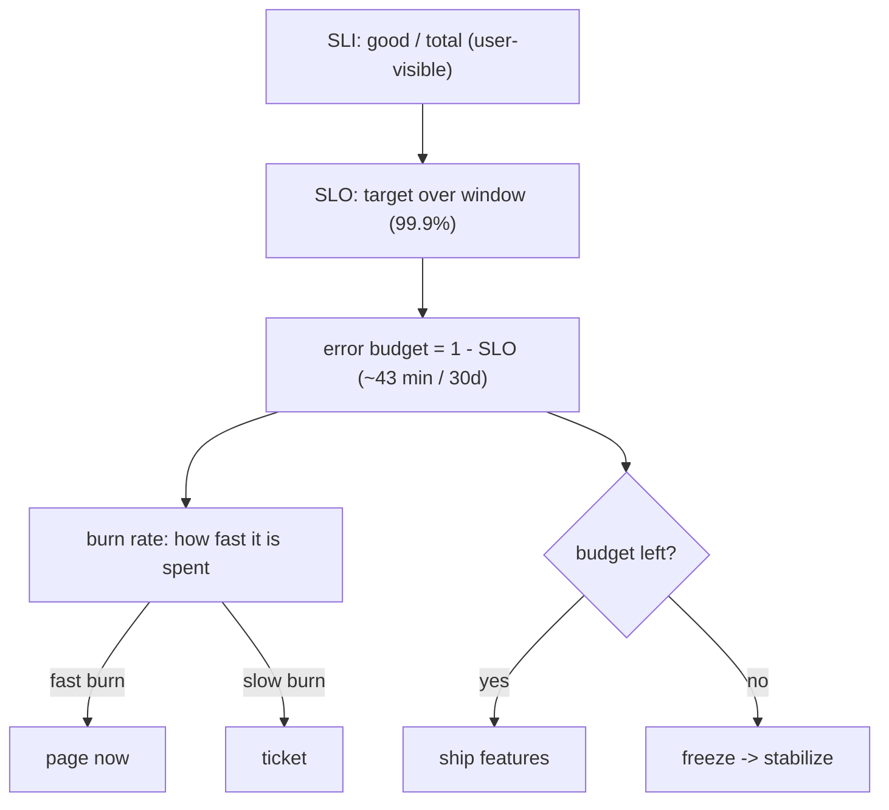

## Thesis

Defining reliability as a measurable target and managing to it --- an SLI is a metric of user-visible health (success rate, latency), an SLO is the target for that metric over a window (99.9% of requests succeed), the gap below 100% is an error budget you are allowed to spend, and the burn rate is how fast you are consuming it --- so reliability becomes a quantified, decision-driving number rather than a vague "keep it up," and the budget tells you when to ship versus when to freeze and stabilize.

## Sub

**Why: reliability has to be measurable** -> **SLI, SLO, SLA** -> **the error budget and burn rate** -> **zoom out** to burn-rate alerting, the budget as a ship-vs-freeze decision, and the pivots an interviewer rides from "make it reliable" into what makes a good SLI, error-budget policy, and burn-rate alerting.

## Spine

- An **SLI** is a metric of user-visible health, an **SLO** is the target for it, an **SLA** is the contractual promise --- SLI is what you *measure* (the proportion of good requests), SLO is the internal *goal* (99.9%), and SLA is the external *contract* (with penalties), set looser than the SLO to leave margin.
- **100% is the wrong target** --- perfect reliability is impossibly expensive and pointless (the user's own network and device fail far more often than that), so you pick a target that's good enough, and the gap below 100% is the budget for the unreliability you accept.
- The **error budget** = 1 - SLO, spent by real errors --- 99.9% over 30 days allows about 43 minutes of downtime; every incident spends budget, and how fast you spend it (the **burn rate**) drives alerting and the ship-versus-freeze decision.
- **Reliability becomes a shared, quantified decision** --- budget remaining means ship features and take risks; budget exhausted means freeze features and focus on stability --- aligning development velocity and reliability on one number instead of an argument.

## Companion Notes

### walk

Reliability as a number you manage

One service's reliability made measurable --- the SLI that captures user-visible health, the SLO target over a window, why the target isn't 100%, the error budget that gap defines, and how the burn rate turns it into alerting and a ship-vs-freeze decision.

Say the reframe first --- "reliability is a number, not a vibe." An SLI you measure, an SLO you target, and an error budget you're allowed to spend turns 'keep it up' into a shared, quantified decision.

### drill

Probe Drill

Graded follow-ups on SLIs, SLOs, error budgets, and burn rate --- the ones that separate "we monitor uptime" from managing reliability as a budget that drives engineering decisions.

Name the chain: SLI (measure user health) -> SLO (the target) -> error budget (1 - SLO, what you may spend) -> burn rate (how fast) -> policy (ship or freeze). That chain is the whole discipline.

## Drill

SDE2 | the terms and the math
SDE3 | good SLIs, policy, and burn rate
Staff | alerting, dependencies, and pitfalls

### SDE2 | what an SLI is

What is an SLI?

A **Service Level Indicator** --- a quantitative measure of some aspect of the service's health *as the user experiences it*. The canonical form is a ratio of good events to total events: the proportion of requests that succeed, the proportion served under some latency threshold, the proportion of data that's fresh. So an SLI is a number between 0 and 100% that says "how well is this specific dimension doing." Good SLIs are user-centric (they reflect what users actually care about --- did my request work, was it fast) rather than internal machine metrics (CPU, memory) that don't directly map to user pain.

### SDE2 | what an SLO is

What is an SLO?

A **Service Level Objective** --- the *target* value for an SLI over a time window. If the SLI is "proportion of successful requests," the SLO might be "99.9% of requests succeed over 30 days." It's the goal you're managing to: the line that separates "reliable enough" from "not." The SLO is an *internal* target the team sets and holds itself to --- it's the reliability bar for the service, chosen deliberately (not 100%), and it's the reference point for the error budget and for deciding whether the service is healthy.

### SDE2 | SLI vs SLO vs SLA

What's the difference between SLI, SLO, and SLA?

**SLI** is the *measurement* (the actual number: 99.95% of requests succeeded this month). **SLO** is the *internal target* for that measurement (we aim for 99.9%). **SLA** is the *external contract* with customers that promises a level and specifies *consequences* if you miss it (99.5% or we credit your bill). The key relationships: the SLI is what you measure against the SLO, and the SLA is set *looser* than the SLO --- you promise customers less than you target internally, so you have margin to miss the internal goal without breaching the contract. SLI is reality, SLO is the goal, SLA is the promise-with-penalty.

### SDE2 | why not 100%

Why not aim for 100% reliability?

Because it's effectively impossible and not worth it. Each additional "nine" of reliability costs dramatically more (redundancy, engineering, operational rigor) for diminishing user benefit, and beyond a point *the user's own environment* --- their WiFi, their ISP, their device --- is less reliable than your service, so extra nines are invisible to them. Chasing 100% also means never being able to take the risks (deploys, changes, experiments) that deliver features. So you pick a target that's good enough for users, and the gap below 100% is deliberate: it's the room you give yourself to change things, the budget for accepted unreliability. 100% is the wrong target because it's infinitely expensive and users can't even perceive it.

### SDE2 | what an error budget is

What is an error budget?

The amount of unreliability you're *allowed* to have --- **1 minus the SLO**. If your SLO is 99.9%, your error budget is 0.1%: that fraction of requests (or that much time) is *permitted* to be bad over the window. It reframes reliability from "never fail" to "you have this much failure to spend." Every incident, bad deploy, or error consumes budget; as long as budget remains, you're meeting your objective and can keep taking risks; when it's exhausted, you've hit your reliability limit and should stop introducing risk. The error budget turns the SLO into an actionable quantity --- a balance you draw down and must manage.

### SDE2 | computing allowed downtime

99.9% over 30 days --- how much downtime is that?

Compute the budget as a fraction of the window. 0.1% (1 - 99.9%) of 30 days: 30 days is 43,200 minutes, times 0.001 = **~43 minutes** of allowed downtime per month. For reference: 99% is ~7.2 hours/month, 99.9% is ~43 minutes/month, 99.99% ("four nines") is ~4.3 minutes/month, 99.999% ("five nines") is ~26 seconds/month. Each nine cuts the allowed downtime by 10x. This time-based view is the intuitive way to feel an error budget --- "we can be down about 43 minutes this month before we breach 99.9%" --- and it makes the cost of each additional nine visceral.

### SDE2 | a good SLI example

Give an example of a good SLI.

The classic **availability SLI**: proportion of successful requests = (successful requests) / (total valid requests), measured at the load balancer or server. Or a **latency SLI**: proportion of requests served faster than a threshold, e.g. "proportion of requests completing under 300ms." Both are user-centric ratios of good events to total. For a data pipeline it might be **freshness** (proportion of data updated within X minutes); for a queue, **correctness** or processing latency. The pattern is always: pick the thing users actually feel (did it work, was it fast, was it fresh), express it as good/total, and set an SLO on it. "CPU under 80%" is *not* a good SLI --- it's an internal metric that doesn't directly reflect user experience.

### SDE3 | what makes a good SLI

What distinguishes a good SLI from a bad one?

A good SLI **tracks user-perceived reliability** and moves *with* user happiness --- when the SLI drops, users are actually hurting; when it's healthy, they're fine. Properties: it's a **proportion of good events over valid events** (naturally 0-100%, easy to target and aggregate); it's measured **as close to the user as practical** (at the load balancer or client, not deep in a backend that misses failures upstream); and it *excludes* things outside your control or irrelevant to users. Bad SLIs are internal resource metrics (CPU, memory --- weakly correlated with user pain), or metrics that stay green while users suffer (or red while they're fine). The test: "if this SLI is met, are users happy?" If the answer isn't reliably yes, it's the wrong SLI.

### SDE3 | error budget policy

What is an error budget policy?

The pre-agreed rule for *what you do* as the budget depletes --- the teeth that make error budgets matter. Typically: while budget remains, the team ships features freely and takes normal risks; when the budget is **exhausted** (SLO at risk of being missed), a **feature freeze** kicks in --- new development stops and the team focuses exclusively on reliability work until the budget recovers. Variants add graduated responses (at 50% burned, slow down risky changes; at 100%, freeze). The point is that the policy is agreed *in advance* by both engineering and product, so when the budget runs out there's no argument --- the response is automatic. Without a policy, error budgets are just interesting numbers; the policy is what turns them into a decision-making mechanism.

### SDE3 | burn rate

What is burn rate?

How *fast* you're consuming the error budget, relative to the rate that would exactly exhaust it over the window. A burn rate of 1 means you'll spend exactly the whole budget by the end of the window (right on target); a burn rate of 10 means you're spending it 10x too fast (a serious problem --- you'll exhaust the month's budget in a tenth of the time); a burn rate below 1 means you're comfortably under. It's the crucial signal for alerting: rather than alerting on every error, you alert when the *burn rate* is high enough to threaten the budget. A brief spike that burns a little budget is fine; a sustained high burn rate means you'll blow the SLO and needs attention. Burn rate turns the static budget into a rate-of-change you can alert on.

### SDE3 | choosing an SLO target

How do you choose the right SLO target?

Base it on **what users actually need**, then set it just high enough --- not aspirationally high. Look at current performance (don't set an SLO you're already missing badly, or one so loose it's always met and meaningless), at user expectations (what level of failure do users notice/tolerate for *this* service), and at the cost of each nine. The SLO should be **achievable but meaningful**: tight enough that meeting it means users are genuinely well-served, loose enough that you have error budget to work with (an SLO of 100% or 99.999% for a service that doesn't need it just creates a permanently-exhausted budget and constant firefighting). A common mistake is setting SLOs by aspiration ("we want five nines!") rather than by user need and achievability --- which produces SLOs nobody can meet and everybody ignores.

### SDE3 | the nines and their cost

Why does each additional nine cost so much more?

Because reliability gains are exponential in effort. Going from 99% to 99.9% (7.2 hours to 43 min of monthly downtime) might mean better monitoring and faster incident response. From 99.9% to 99.99% (43 min to 4.3 min) demands eliminating most single points of failure, automated failover, and very fast detection --- you can't fix things by hand in 4 minutes. From 99.99% to 99.999% (26 seconds/month) requires near-perfect automation, multi-region redundancy, and removing humans from the recovery path entirely (no human responds in seconds). Each nine roughly 10x's the allowed downtime reduction *and* the engineering investment, while the *user-perceived* benefit shrinks (past ~99.9%, other things in their path dominate). This exponential cost curve is exactly why you target the *lowest* nine that satisfies users, not the highest you can imagine.

### SDE3 | latency SLOs

How do you define a latency SLO correctly?

As a **proportion under a threshold**, using **percentiles**, never averages. "99% of requests complete under 300ms" is a good latency SLO; "average latency under 300ms" is a bad one --- averages hide the tail, so a great average can coexist with a slow, painful experience for a meaningful fraction of users. You typically set it at a high percentile (p95, p99) because that captures the *worst* experiences users actually get, which is what erodes trust. Often you define *multiple* latency thresholds (e.g. 90% under 100ms *and* 99% under 500ms) to shape the whole distribution, not just one point. The core discipline: latency is a distribution, so SLO it by percentile-under-threshold, because the average is the one statistic that reliably lies about tail pain.

### SDE3 | measurement window

Rolling window or calendar window for an SLO --- what's the difference?

A **rolling window** (e.g. trailing 30 days) always looks at the last N days from *now*, so the budget continuously reflects recent performance and old incidents gradually age out --- good for ongoing operational decisions (is the service healthy *right now*, over recent history). A **calendar window** (this month, resetting on the 1st) aligns with reporting/billing periods and gives a fixed budget that resets predictably --- but creates a "budget resets Monday" effect where behavior changes around the boundary. Rolling is generally better for engineering decisions (no artificial reset, always current); calendar is common for SLAs and business reporting (aligns with contracts and billing). The choice shapes how the budget behaves over time and when it "refills," so pick rolling for operational SLOs and calendar where you must align with external periods.

### Staff | burn-rate alerting

How do you alert on SLOs well?

With **multi-window, multi-burn-rate** alerts, not simple thresholds. The idea: alert on the error budget *burn rate* over multiple time windows simultaneously. A **fast-burn** alert (e.g. burning 14.4x budget over 1 hour --- which would exhaust a month's budget in ~2 days) pages immediately: something is seriously wrong now. A **slow-burn** alert (e.g. 3x over 6 hours) files a ticket: a smaller sustained problem that will eventually blow the budget but doesn't need a 3am page. Using multiple windows together gives both *fast detection* of severe issues and *low false positives* (a short window confirms the burn is real and ongoing, a longer window catches slow leaks). This is far better than "alert if error rate > X%" because it ties alerting directly to *user-impact-over-time* (the budget) and calibrates urgency to how fast you're actually losing reliability --- the SRE-standard approach.

### Staff | SLOs vs threshold alerting

Why is SLO-based alerting better than traditional threshold alerting?

Because it alerts on **user impact over time**, not on arbitrary point-in-time metrics. Traditional alerting ("CPU > 80%", "error rate > 1% for 5 min") produces two failures: **noise** (alerts fire for conditions that don't actually hurt users --- a brief blip, a metric that's high but harmless), causing alert fatigue; and **gaps** (a slow burn that never crosses the instantaneous threshold silently eats your reliability). SLO burn-rate alerting fixes both: it fires only when you're losing budget *fast enough to matter*, so a harmless spike doesn't page anyone, and a sustained slow degradation *does* get caught (via the long-window alert) even though it never spikes. It also unifies alerting under one meaningful question --- "am I going to miss my SLO?" --- instead of a sprawl of disconnected thresholds. The result is fewer, more actionable pages tied directly to user experience.

### Staff | reliability as a feature

How does the error budget align engineering and product?

By making reliability a *shared, quantified currency* rather than a tug-of-war. The classic tension: product wants features fast (which means risk), SRE wants stability (which means caution). The error budget resolves it: it defines exactly how much unreliability is acceptable, and **both sides agree in advance** what happens as it depletes. Budget remaining -> ship aggressively, the reliability cost of moving fast is within tolerance. Budget exhausted -> freeze features, the team has spent its reliability allowance and must restore it before taking more risk. This converts an emotional, recurring argument ("is it safe to ship?") into an automatic, data-driven decision, and crucially *gives developers an incentive to build reliably* (a flaky service burns budget and triggers a freeze that stops their feature work). Reliability-as-a-feature means it's planned, budgeted, and traded off explicitly like any other feature --- not an infinite demand or an afterthought.

### Staff | SLIs for complex journeys

How do you set SLIs for a multi-step user journey?

Focus on **critical user journeys** and measure them end-to-end, not just individual endpoints. A single request-success SLI misses journeys that span multiple calls (checkout = browse -> add to cart -> pay -> confirm); a user can hit 99.9% on each step but the *compound* success of the whole journey is lower (0.999^4). So you (a) identify the handful of journeys that matter most, (b) define an SLI for the *journey's* success (did the user complete checkout), which may compose the steps or measure the outcome directly, and (c) weight by importance --- the payment step's reliability matters more than a recommendation widget's. You resist the urge to SLO *everything* (too many SLOs = noise and no focus); instead you pick the few journeys whose failure genuinely means a bad experience or lost revenue, and hold those. The discipline is measuring what the user is *trying to accomplish*, not just whether individual components returned 200.

### Staff | dependency SLOs

How do your dependencies' SLOs affect yours?

They cap it. Your service can't be more reliable than the dependencies it *requires* to serve a request --- if you synchronously depend on a service with a 99.9% SLO, your own availability is bounded by it (and if you depend on several in series, the product compounds: three 99.9% dependencies in the critical path -> ~99.7% ceiling). So setting your SLO requires accounting for your dependency chain: either your target must be looser than the compounded dependency budget, or you must *decouple* from unreliable dependencies (make the dependency non-critical via caching, fallbacks, async, or graceful degradation so its failure doesn't fail your request). This is why hard synchronous dependencies are a reliability liability --- they spend *your* error budget when *they* fail. The staff-level move is to map the critical-path dependencies, compute the reliability ceiling they impose, and engineer to remove them from the hard path so your SLO isn't hostage to theirs.

### Staff | SLA design

How do you design an SLA, and why is it looser than the SLO?

An SLA is a *contractual* commitment with financial or reputational consequences, so you design it with **deliberate margin below your internal SLO**: you target 99.9% internally (SLO) but promise only 99.5% externally (SLA). The gap is your safety buffer --- you can miss your internal goal, burn through internal budget, and still not breach the customer contract and owe penalties. You also design the SLA to promise only what you can *measure and defend* (clear definitions of "available," measured at a defined point), *exclude* things outside your control (scheduled maintenance, customer-caused issues, force majeure), and specify realistic *remedies* (service credits, not unbounded liability). The core principle: never make your SLA equal to or tighter than your SLO --- always promise less than you aim for, because the SLA has teeth and you want the internal target to fail *first* (harmlessly) as an early warning, long before the contractual promise does.

### Staff | SLO pitfalls

What are the common ways SLOs go wrong?

Several. **Bad SLIs** --- measuring something that doesn't track user happiness (internal metrics, or measured in the wrong place), so the SLO is green while users suffer. **Aspirational targets** --- setting SLOs by ambition ("five nines!") rather than user need and achievability, producing permanently-exhausted budgets and ignored SLOs. **Too many SLOs** --- SLO-ing every endpoint dilutes focus; nobody can act on 200 SLOs, so you lose the signal. **No error budget policy** --- SLOs with no agreed consequence are just dashboards; without the ship/freeze teeth they change no behavior. **Gaming** --- teams optimizing the metric rather than the experience (excluding inconvenient errors, redefining "valid request" to exclude failures). **Ignoring dependencies** --- setting an SLO tighter than your critical-path dependencies can support. **Wrong window/statistic** --- averages instead of percentiles for latency, or a window that hides real degradation. The through-line: an SLO only works if the SLI genuinely reflects users, the target is realistic, there's a policy with teeth, and there are few enough to focus on --- miss any of those and the SLO becomes theater.

## Walk

### An SLI measures user health; an SLO is the target

```flow
sli[SLI: good events / total events] -> slo[SLO: target over a window, e.g. 99.9%] -> sla[SLA: external contract, looser]
```

Start with the three terms. An **SLI** is a metric of user-visible health, canonically a ratio of good events to total (proportion of requests that succeed, or that are served under a latency threshold). An **SLO** is the *target* for that SLI over a window ("99.9% of requests succeed over 30 days") --- the internal goal that separates "reliable enough" from "not." An **SLA** is the *external contract* that promises a level with penalties if missed.

The ordering matters: SLI is what you measure (reality), SLO is what you aim for (goal), SLA is what you promise customers (with teeth), and the SLA is set *looser* than the SLO so the internal goal fails harmlessly before the contractual one does. A good SLI is user-centric --- it moves with user happiness, unlike an internal metric like CPU.

### 100% is the wrong target --- the gap is your budget

```flow
t[target 99.9%, not 100%] -> b[error budget = 1 - SLO = 0.1%] -> d[~43 min downtime / 30 days]
```

You deliberately *don't* target 100%: each extra nine costs ~10x more for shrinking benefit, and past a point the user's own network and device are less reliable than your service, so extra nines are invisible. The gap below 100% is intentional --- it's the room to change things and the budget for accepted failure.

That gap is the **error budget** = 1 - SLO. A 99.9% SLO gives a 0.1% budget, which over 30 days is ~43 minutes of allowed downtime (99% -> 7.2 hrs, 99.99% -> 4.3 min, 99.999% -> 26 sec --- each nine cuts it 10x). The time view makes it visceral: "we can be down ~43 minutes this month before breaching 99.9%." Every incident spends from this budget.

### Burn rate drives alerting

```flow
c[errors consume budget] -> r[burn rate = how fast vs the sustainable rate] -> a[multi-window alert: fast burn pages, slow burn tickets]
```

The key operational signal isn't the raw error rate --- it's the **burn rate**, how fast you're spending the budget relative to the rate that would exactly exhaust it over the window. Burn rate 1 = on target; burn rate 10 = spending 10x too fast.

```python
def error_budget_status(slo_pct, window_days, actual_success_rate, elapsed_frac):
    budget = 1 - slo_pct / 100          # e.g. 99.9% -> 0.001
    error_rate = 1 - actual_success_rate
    burn_rate = error_rate / budget     # >1 means too fast

    consumed = burn_rate * elapsed_frac # fraction of budget used so far
    remaining = max(0.0, 1 - consumed)

    # multi-window alerting: page on a fast burn, ticket on a slow burn
    if burn_rate >= 14.4:               # ~exhausts a 30-day budget in ~2 days
        alert = "PAGE (fast burn)"
    elif burn_rate >= 3:                # a slow sustained leak
        alert = "TICKET (slow burn)"
    else:
        alert = "ok"
    return burn_rate, remaining, alert
```

You alert on burn rate over *multiple windows*: a fast-burn alert (e.g. 14.4x over 1 hour) pages immediately (something's seriously wrong now), while a slow-burn alert (3x over 6 hours) files a ticket (a leak that'll eventually blow the budget but needn't wake anyone). This ties alerting to *user impact over time*, not an arbitrary threshold --- so a harmless spike doesn't page, and a slow degradation still gets caught.

### The budget drives ship-versus-freeze

```flow
rem[budget remaining -> ship features, take risks] -> gone[budget exhausted -> freeze, focus on stability] -> policy[agreed in advance = no argument]
```

The error budget's real power is as a **decision rule**, agreed in advance by engineering and product (the *error budget policy*). Budget remaining -> ship features and take normal risks, the reliability cost of moving fast is within tolerance. Budget exhausted -> a feature freeze, the team stops new development and focuses on reliability until the budget recovers.

This converts a recurring emotional argument ("is it safe to ship?") into an automatic, data-driven decision, and it gives developers a direct incentive to build reliably --- a flaky service burns budget and triggers a freeze that stops *their* feature work. Zooming out: SLI -> SLO -> error budget -> burn rate -> policy is the whole discipline, and it makes reliability a shared, quantified feature that's planned and traded off explicitly, rather than an infinite demand or an afterthought. Just make sure the SLI genuinely tracks users, the target is achievable, and there are few enough SLOs to act on.

### Model Script

- Frame the reframe | "The core idea is making reliability a measurable number you manage, not a vague 'keep it up.' Three terms: an SLI is a metric of user-visible health, usually a ratio of good events to total -- proportion of requests that succeed or are fast. An SLO is the target for that SLI over a window, like 99.9% over 30 days. And an SLA is the external contract with penalties, which you set looser than the SLO so the internal goal fails harmlessly first."
- Why not 100% and the budget | "You deliberately don't target 100% -- each extra nine costs about ten times more for shrinking benefit, and past a point the user's own network is less reliable than your service anyway, so the extra nines are invisible. The gap below 100% is the error budget, one minus the SLO. A 99.9% SLO is a 0.1% budget, which over a month is about 43 minutes of allowed downtime. That's the intuition: we can be down about 43 minutes this month before we breach the objective, and every incident spends from that budget."
- Burn rate and alerting | "The key operational signal is the burn rate -- how fast you're spending the budget versus the rate that would exhaust it over the window. Burn rate one is on target; burn rate ten is spending ten times too fast. I alert on burn rate over multiple windows: a fast burn, say 14x over an hour, pages immediately because something is seriously wrong now; a slow burn, 3x over six hours, files a ticket because it's a leak that'll eventually blow the budget but doesn't need a 3am page. That's much better than 'alert if error rate exceeds one percent' -- it ties alerting to user impact over time, so a harmless spike doesn't page and a slow degradation still gets caught."
- The policy | "The budget's real power is as a decision rule agreed in advance between engineering and product -- the error budget policy. Budget remaining, ship features and take risks. Budget exhausted, freeze features and focus on stability until it recovers. That turns a recurring emotional argument -- is it safe to ship -- into an automatic, data-driven decision, and it gives developers a direct incentive to build reliably, because a flaky service burns budget and triggers a freeze that stops their own feature work."
- Interviewer: "How would you pick the SLO target for a new service?"
- Choosing the target | "By what users actually need, then set it just high enough -- not aspirationally. I'd look at current performance so I don't set something we're already badly missing or something so loose it's always met and meaningless; at what level of failure users actually notice for this specific service; and at the cost of each nine. The SLO should be achievable but meaningful -- tight enough that meeting it means users are genuinely well-served, loose enough that we have real error budget to work with. The classic mistake is setting SLOs by ambition -- 'we want five nines' -- rather than user need, which produces a permanently-exhausted budget and constant firefighting that everyone eventually ignores."
- Land it | "So: an SLI measures user-visible health, an SLO targets it, an SLA promises less than that externally; 100% is the wrong target so the gap is an error budget of 1 minus the SLO; burn rate drives multi-window alerting tied to user impact; and an agreed error budget policy turns the budget into an automatic ship-vs-freeze decision. The one line is that SLOs make reliability a shared, quantified feature -- planned and traded off explicitly -- rather than an infinite demand, and the error budget is what aligns velocity and reliability on a single number."

## Whiteboard

Sketch the SLI-to-policy chain and the burn rate.

### Why not target 100% reliability?

Each nine costs ~10x more for shrinking benefit, and past a point the user's own network/device fails more than your service -- so the gap below 100% is a deliberate error budget you spend on changes and accepted failure.

### What does burn rate add over an error rate?

It measures how fast you're spending the budget versus the sustainable rate, so you can alert on multiple windows -- a fast burn pages now, a slow burn tickets -- tying urgency to user-impact-over-time instead of an arbitrary threshold.



Verdict: SLI (measure) -> SLO (target) -> error budget (1 - SLO) -> burn rate (rate spent, drives multi-window alerting) -> policy (ship if budget remains, freeze if exhausted) -- reliability as a managed number.

## System

Zoom out to how SLOs sit across a service and its dependencies.

### Where it sits

SLI: measured close to the user (LB / client), good events / total [*]
SLO: the internal target over a rolling or calendar window
Error budget: 1 - SLO, drawn down by every incident
Burn rate: multi-window alerts (fast burn pages, slow burn tickets)
Dependencies: their SLOs cap yours (critical-path product compounds)

### Pivots an interviewer rides

From "make it reliable" they push on the SLI, the budget, and alerting.

#### What makes a good SLI?

-> a proportion of good events over valid events, measured near the user, that moves with user happiness
Not CPU/memory (internal, weakly correlated with pain); the test is "if this SLI is met, are users happy?" -- and latency SLIs use percentiles under a threshold, never averages.

#### How do you alert on an SLO?

-> multi-window multi-burn-rate: a fast burn pages, a slow burn tickets
Ties alerting to user-impact-over-time (the budget), not an arbitrary threshold -- so a harmless spike doesn't page and a slow leak still gets caught, fixing both noise and gaps.

## Trade-offs

The calls that separate "we watch uptime" from managing reliability as a budget.

### Higher vs lower SLO target

- Higher (more nines): stronger reliability promise -- but each nine costs ~10x more, shrinks the error budget (less room to ship), and past ~99.9% users can't perceive it
- Lower: generous error budget, room to move fast -- but risks users actually feeling the failures

Set the SLO at the lowest nine that keeps users genuinely happy -- achievable and meaningful, leaving real budget to work with, not aspirational.

### SLO burn-rate alerting vs threshold alerting

- Burn-rate (multi-window): alerts on user-impact-over-time, calibrated urgency, catches slow leaks and ignores harmless spikes -- but more setup and conceptual overhead
- Threshold ("error rate > X%"): simple to configure -- but noisy (fatigue) and gappy (misses slow burns that never spike)

Use burn-rate alerting for anything with a real SLO; simple thresholds only for coarse, non-SLO signals.

### Rolling vs calendar window

- Rolling (trailing 30d): always current, no artificial reset, best for operational decisions -- but the budget "refills" continuously (less intuitive for reporting)
- Calendar (monthly): aligns with billing/SLA periods, predictable reset -- but creates boundary effects ("budget resets Monday")

Use rolling for operational SLOs; calendar where you must align with SLAs, billing, or business reporting.

## Model Answers

### the reframe | Reliability as a managed number

The frame to lead with.

- SLI measures, SLO targets, SLA promises (looser) | key | reality vs goal vs contract
- 100% is wrong -> the gap is the error budget | store | 1 - SLO, ~43 min at 99.9%/30d
- Budget makes reliability a shared decision | note | ship vs freeze on one number

### the depth | Burn rate and policy

Where it's really tested.

- Burn rate drives multi-window alerting | key | fast burn pages, slow burn tickets
- Error budget policy has teeth | store | agreed ship/freeze, no argument
- Dependencies cap your SLO | note | critical-path product compounds

## Numbers

Back-of-envelope the budget as time and requests, and how fast an outage burns it.

Error budget = 1 - SLO; expressed as allowed downtime over the window, or failed requests -- and a full outage burns it at 100%.

- slo | SLO target (%) | 99.9 | 90 | 0.01
- window | Window (days) | 30 | 1 | 1
- rps | Requests/sec | 1000 | 0 | 100

```js
function (vals, fmt) {
  var slo = vals.slo, window = vals.window, rps = vals.rps;
  var budgetFrac = 1 - slo / 100;
  var windowMin = window * 24 * 60;
  var allowedMin = budgetFrac * windowMin;
  var failedReqs = budgetFrac * rps * window * 86400;
  function r(x, d) { var m = Math.pow(10, d); return Math.round(x * m) / m; }
  return [
    { k: 'Error budget', v: r(budgetFrac * 100, 3) + '%', u: 'of requests may fail', n: '1 - SLO \u2014 the fraction of events allowed to be bad over the window before you breach the objective', over: false },
    { k: 'Allowed downtime', v: fmt.n(r(allowedMin, 1)), u: 'min / ' + window + 'd', n: 'the budget expressed as time \u2014 a ' + slo + '% SLO over ' + window + ' days permits about this much total unavailability', over: false },
    { k: 'Budget in requests', v: '~' + fmt.n(Math.round(failedReqs)), u: 'failed reqs', n: 'at ' + fmt.n(rps) + ' req/s that is this many failed requests over the window before the SLO is breached', over: false },
    { k: 'Full outage burns it in', v: '~' + fmt.n(r(allowedMin, 1)), u: 'min (100% burn)', n: 'a total outage spends budget at a 100% burn rate \u2014 the whole budget gone in the allowed-downtime window, which is why a fast burn must page', over: r(allowedMin, 1) < 15 },
    { k: '100% is not the target', v: 'diminishing returns', u: '', n: 'each extra nine costs ~10x more and the user network/device fails more often anyway \u2014 the gap below 100% is the budget you deliberately spend', over: false }
  ];
}
```

## Red Flags

What makes an interviewer wince.

### "Our SLO is 100% uptime"

100% is impossible and not worth chasing -- each nine costs ~10x more, and past a point the user's own network fails more than your service, so it's invisible; a 100% target also leaves zero error budget, meaning any change is a breach.

Set an achievable, meaningful target (the lowest nine users are happy with), so the gap below 100% is a real error budget you can spend on shipping and accepted failure.

### "We SLO on CPU staying under 80%"

CPU is an internal metric weakly correlated with user pain -- it can be green while users suffer or red while they're fine, so it's a bad SLI.

Use a user-centric SLI (proportion of successful or fast requests, measured near the user); the test is "if this SLI is met, are users happy?"

### "We alert whenever the error rate exceeds 1%"

Static threshold alerting is both noisy (harmless brief spikes page people -> fatigue) and gappy (a slow burn that never crosses 1% silently eats the whole budget).

Use multi-window, multi-burn-rate alerting tied to the error budget -- a fast burn pages, a slow burn tickets -- so urgency tracks user-impact-over-time.

## Opener

### 30s | The one-liner

How I open when asked about reliability targets or on-call alerting.

#### What is the shape?

Make reliability a measured number: an SLI (good events / total, user-centric), an SLO target for it (99.9% over a window), an error budget of 1 - SLO you're allowed to spend, and a burn rate that drives alerting and a ship-vs-freeze policy.

#### What's the key move?

100% is the wrong target, so the gap is a deliberate error budget -- and an agreed policy turns "budget remaining -> ship, budget exhausted -> freeze" into an automatic decision that aligns velocity and reliability.

##### Hooks

Where an interviewer usually pushes next.

- What makes a good SLI? | user-centric good/total, measured near the user | drill
- How do you alert? | multi-window burn-rate, not thresholds | drill
- Why not 100%? | ~10x per nine, user's own network dominates | drill

Foot: two sentences -- SLOs turn reliability into a shared, quantified feature (SLI -> SLO -> error budget -> burn rate -> policy) rather than a vague demand, and the error budget aligns development velocity and reliability on a single number -- ship while budget remains, freeze when it's spent.

## Bank

### SCALE | A payment service that needs a defensible availability SLO

Task: define and manage the reliability target.
Model: pick a user-centric SLI (proportion of successful payment requests, measured at the edge), set an achievable-but-meaningful SLO (e.g. 99.95% over a rolling 30 days -- high because payments matter, but not aspirational five-nines), derive the error budget (1 - SLO), alert on multi-window burn rates (fast burn pages, slow burn tickets), and agree an error budget policy (ship while budget remains, freeze on exhaustion); account for critical-path dependencies (the processor's SLO caps yours) by decoupling where possible.
Int: why not just target 99.999%?
Each nine costs ~10x more, users can't perceive past a point, and it leaves almost no error budget -- producing constant firefighting and no room to ship.

### DESIGN | On-call alerting for a service with an SLO

Task: design alerting tied to the SLO.
Model: replace static thresholds with multi-window, multi-burn-rate alerts on the error budget -- a fast-burn alert (e.g. 14.4x over 1h, exhausting a month in ~2 days) pages immediately, a slow-burn alert (e.g. 3x over 6h) files a ticket; this catches severe issues fast, catches slow leaks that never spike, and stays quiet for harmless blips; back it with an error budget policy so a sustained breach triggers a feature freeze, and keep the number of SLOs small (critical user journeys only) so alerts stay actionable.
Int: what's wrong with "page if error rate > 1% for 5 minutes"?
It's noisy (harmless spikes page -> fatigue) and gappy (a slow burn under 1% silently eats the budget) -- burn-rate alerting fixes both by tracking user-impact-over-time.

### Extra Curveballs

### CURVEBALL | dependency-ceiling | Your team commits to a 99.99% SLO, but your service synchronously calls three downstream services each with a 99.9% SLO. What's the problem?

Model: your availability is capped by your critical-path dependencies, and in series their budgets compound: three 99.9% dependencies multiply to ~99.7% (0.999^3), so you physically cannot hit 99.99% -- every time a dependency fails, it spends *your* error budget, and three of them stacked put your ceiling below even 99.9%. The 99.99% target is unachievable as designed. Fixes: either set your SLO below the compounded dependency ceiling (be honest about ~99.7%), or decouple from those dependencies so they're not on the hard path -- cache their responses, make the calls async, or add fallbacks / graceful degradation so a dependency failure degrades rather than fails your request. The staff-level point is that hard synchronous dependencies are a reliability liability: you can't promise more reliability than the things you *require* to answer a request, so you must either lower the promise or remove them from the critical path.

### Frames

- SLI (measure user health) -> SLO (target) -> error budget (1 - SLO) -> burn rate (how fast) -> policy (ship/freeze)
- 100% is the wrong target: each nine costs ~10x, the gap is a deliberate budget; alert on multi-window burn rate, not thresholds
- The error budget aligns velocity and reliability on one number; dependencies' SLOs cap yours (critical-path product compounds)
