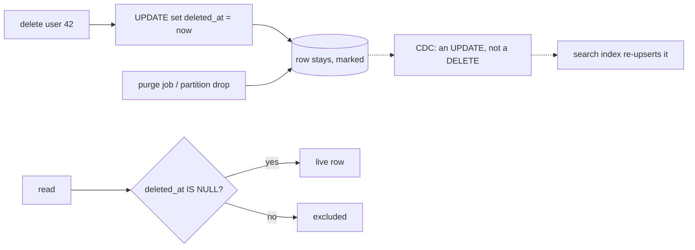

## Thesis

Marking a row deleted with a flag or timestamp instead of physically removing it --- so a delete is reversible, history and references survive, and an audit trail stays intact --- at the cost that every query must now exclude the deleted rows, unique constraints and foreign keys need rethinking, and the data eventually has to be purged for real.

## Sub

**Why soft-delete --- recoverable, referenced, audited** -> **the query-filter tax** -> **the constraint and foreign-key complications** -> **zoom out** to the purge and compliance, and the pivots an interviewer rides from "just mark it deleted" into hard-versus-soft, the forgotten filter, and unique constraints.

## Spine

- A soft delete is a **flag, not a removal** --- a `deleted_at` timestamp (or an `is_deleted` flag) marks the row gone while the data stays, so a delete is reversible and nothing that referenced it dangles.
- Every read must now **exclude the deleted rows** --- a `deleted_at IS NULL` predicate on every query, which is the same forgotten-filter risk as multi-tenancy: miss it and deleted data reappears.
- **Unique constraints and foreign keys** get complicated --- a unique value can't be reused while a soft-deleted row still holds it, and a foreign key can point at a soft-deleted parent, so both need deliberate handling.
- The data still has to be **purged eventually** --- soft-deleted rows accumulate forever and may legally have to be truly erased, so a hard-delete or archival job is the necessary back half.

## Companion Notes

### walk

A delete that marks, not removes

One delete from the flag being set to the row filtered out and eventually purged --- the filter tax, the unique-constraint fix, and the purge.

Say the filter risk early --- "every read needs the not-deleted predicate, or deleted rows come back." That's the tax you're signing up for.

### drill

Probe Drill

Graded follow-ups on hard-versus-soft, the filter, constraints, and the purge --- the ones that separate "add a flag" from a real soft-delete design.

Name the partial unique index --- reusing a unique value after a soft delete is the detail most answers miss.

### wb

Whiteboard

Rebuild the delete path from blank --- the flag, the filter, the enforcement point, the constraints, the restore, and where the row finally goes.

Draw the delete as an arrow that loops back into the table, not one that leaves it. Everything else in the topic follows from the row still being there.

### sys

System Map

Zoom out: a soft delete sits between the user's "delete" and the row's actual removal, and every system downstream of the table has to agree to honour a flag.

Lead with the boundary, not the column --- "a delete is an update, so the row is still there, and every reader has to agree to ignore it."

### trade

Trade-offs

The calls they drill --- soft versus hard, flag versus archive, per-query versus structural enforcement, cascade versus filter-through-parent --- each with the switch condition.

Always name the alternative and its cost. "Soft-delete is safer" is not a trade-off; "soft-delete buys reversibility and referential survival, and charges a filter on every read" is.

### model

Model Answers

Full spoken scripts --- the beats, in order, the way you would actually say them under time pressure.

Steal the frame, not the words --- delete-as-update, the filter enforced once, the constraints, and the purge --- then name the one risk you would own before they ask.

### num

Numbers

Back-of-envelope the tombstone mass a soft delete accumulates, what it costs, and what the purge caps.

Lead with the deleted fraction, not the total --- the number that bites is what share of every index and every scan is data you always throw away.

### rf

Red Flags

What sinks the round --- soft-deleting everything by reflex, treating it as erasure, trusting the ORM, assuming the database will clean up --- and what to say instead.

Name what the interviewer hears --- "soft-delete satisfies the deletion request" is the fastest no-hire in the room, because it is a compliance failure, not a design preference.

### open

30-Second

The opener and the close --- matched to the altitude the question is asked at.

Match the altitude --- open at the delete-as-update boundary, not the column, and land on the filter and the purge as the real hard parts.

## Drill

all | All four levels, mixed --- the way a real loop actually comes at you.
SDE2 | **The model and the mechanics** --- delete-as-update, the filter, restore, hard-versus-soft. The bar is "I know the row is still there and I know what that costs": name the predicate and where it is enforced, not just the column.
SDE3 | **Constraints, indexes, and edges** --- the forgotten filter, partial unique indexes, foreign keys, cascade, bloat, aggregates. The bar is "I have hit these in production": name the failure each choice bounds, and the one it does not.
Staff | **Compliance, purge, and org calls** --- erasure, the purge job, table bloat, derived systems, and when soft-delete is simply wrong. The bar is "reversible for a window, then genuinely gone": name the blast radius and argue the other side credibly.

### SDE2 | what a soft delete is

What is a soft delete?

Marking a row as deleted instead of physically removing it --- typically a `deleted_at` timestamp set to the delete time, or an `is_deleted` boolean. The data stays in the table; only its state changes. The row is treated as gone by the application, but it's recoverable and everything that referenced it still resolves.

Follow: The row is still physically there and still satisfies every constraint. So what actually makes it "deleted"?
An **agreement**. Nothing in the database enforces the deletion --- the row is a perfectly valid row, it still satisfies every FK, it still sits in every index. "Deleted" is a **convention**: a predicate every reader has agreed to apply. That single fact is where the whole topic comes from. Because the deletion is unenforced, every guarantee you used to get for free --- that the row is gone, that its unique value is released, that nothing can reference it --- is now the application's job to reproduce.
Follow: So who is allowed to see the deleted rows?
By default nobody --- but the row exists precisely so that some paths *can*: the restore flow, an admin or audit view, and the purge job. The design rule is that excluding deleted rows is **automatic** and including them is a **deliberate, named opt-in**, so the intent is visible in the code that wants them. If reading deleted rows is easy and accidental, the filter isn't a safety property, it's a suggestion.

Senior: An SDE2 says "we set a flag." A Staff answer says the flag is a **convention, not a constraint** --- the database still considers the row completely valid, so every guarantee it used to give you for free (it's gone; its unique value is free; nothing can point at it) is now yours to reimplement. Naming the deletion as *unenforced* is the frame every other answer in this topic hangs off.
Speak: One line, then the consequence in the same breath: **"A delete becomes an update --- `deleted_at = now()` --- so the row is still physically there and the database still thinks it's a perfectly valid row. 'Deleted' is a convention every reader has to honour, not something the storage engine enforces."** Then go straight to the tax, before they ask for it: every read now needs the predicate.

### SDE2 | why soft-delete

Why soft-delete instead of a real delete?

Three reasons: **recoverability** (an accidental delete is an undo, not a data-loss incident), **referential survival** (rows and audit logs that point at it still resolve instead of dangling), and an **audit trail** (you can see what existed and when it was removed). It trades the simplicity of a hard delete for the ability to reverse, reference, and account for deletions.

Follow: Pick the strongest of those three. Which one alone would justify the design?
**Referential survival** --- because it's the one you cannot buy any other way. Recoverability you can approximate with backups plus an undo queue. An audit trail you can get from an append-only history table or an event log. But the moment other *live* rows point at the deleted one --- an order line referencing a product, an audit entry referencing a user --- a hard delete forces you to choose between cascading (destroying data that is still needed) and nulling the reference out (losing its meaning). Soft-delete is the only option that keeps the reference resolvable while marking the entity gone. If nothing references the row, the case for soft-delete is dramatically weaker.
Follow: Audit trail --- isn't a `deleted_at` timestamp a pretty weak audit trail?
Yes, and I'd concede that rather than count it as a free win. `deleted_at` tells you *when*, not *who*, not *why*, and not *what the row looked like before*. You can add `deleted_by` and a reason, and you're still one `UPDATE` away from losing the pre-delete state entirely --- soft-delete records the **deletion**, not the **history** of the row. A genuine audit requirement wants an append-only history: an audit table, an event log, or system-versioned/temporal tables. Soft-delete falls out of those for free; it is not a substitute for them.

Senior: Separating the three motives and knowing which are *only* obtainable this way. Recoverability and audit both have credible alternatives (backups; an append-only log). Referential survival essentially doesn't --- that is the load-bearing reason, and a senior answer leads with it. It also concedes that the audit story is thin (a timestamp is not a history) instead of listing "audit trail" as a costless benefit.
Speak: **"Three reasons --- recoverability, referential survival, and an audit trail --- but the one that actually forces the design is referential survival: if live rows point at this one, a hard delete makes me choose between cascading the destruction and dangling the reference."** Then volunteer the weakness, which is what earns the room: the audit story is thin --- `deleted_at` is a timestamp, not a history.

### SDE2 | how it is implemented

How do you implement a soft delete?

Add a nullable `deleted_at` column; a delete becomes an update that sets it to now, and a not-yet-deleted row has it null. The application deletes by setting the timestamp and treats any row with a non-null `deleted_at` as gone. The delete operation changes from a `DELETE` statement to an `UPDATE`.

Follow: Why a *nullable* timestamp, rather than a NOT NULL `is_deleted` boolean plus a separate `deleted_at`?
Because the nullable column is what makes the two fixes that matter possible, and it makes an invalid state unrepresentable. `deleted_at IS NULL` is the live predicate, and a **partial index** --- `WHERE deleted_at IS NULL` --- can be built on exactly that predicate, so both the uniqueness fix and the performance fix key off the same column. A boolean plus a separate timestamp gives you two columns that can **disagree**: `is_deleted = true, deleted_at = NULL` is a state with no meaning that some code path will eventually write. One nullable column has no contradictory state --- null means live, non-null means deleted --- and it carries the deletion time for free.
Follow: What about the rows that already exist when you add the column?
They're all live, so `deleted_at` is NULL for every one of them --- which is exactly what adding a nullable column with no default gives you, and in Postgres that's a metadata-only change: instant, even on a very large table. The real work isn't the column. It's that **from the moment a row can be marked deleted, every query without the predicate is a bug**. So I'd sequence it deliberately: add the column, add the partial indexes, land the read-side enforcement (the scope, the view, the RLS policy), and only *then* switch the delete path over. Do it in the other order and you open a window where deleted rows exist and reads don't filter them --- and that window is a live incident, not a migration step.

Senior: The **sequencing**. An SDE2 adds the column and changes `DELETE` to `UPDATE`. A senior lands the *read-side enforcement first*, because the instant a row can be soft-deleted, every unfiltered query in the system is wrong --- and the gap between "rows can be marked deleted" and "reads exclude them" is an outage, not a to-do. Ordering the migration so that gap never exists is the signal.
Speak: Give the mechanics fast, then spend your breath on the part they're actually listening for: **"A nullable `deleted_at`, and the delete becomes an `UPDATE` that stamps it. But I'd land the read-side filter *before* the write side --- because the moment a row can be marked deleted, every query that doesn't carry the predicate is a bug."**

### SDE2 | the query filter

What do soft deletes require of every read?

A filter --- `WHERE deleted_at IS NULL` --- on every query that should see only live rows. This is the tax: the deleted rows are still physically present, so nothing excludes them unless you say so. Forget the predicate on one query and it returns deleted rows as if they were live, which is the classic soft-delete bug.

Follow: Every read --- including the reads that never go through your application?
That's the sharp edge, and it's where most designs actually leak. The predicate is easy to enforce in the code you own and **impossible** to enforce in the code you don't: a BI tool pointed at the read replica, an analytics job reading the table directly, a warehouse sync, an ad-hoc query a DBA runs, a report someone wrote in raw SQL two years ago. Every one of those sees the deleted rows as ordinary rows --- because they are. Which is the argument for enforcing at the **database**, not the ORM: a `users_live` **view** that consumers are granted on instead of the base table, or a **row-level-security policy** `USING (deleted_at IS NULL)`, which applies to every session, raw SQL included, not just the ones that go through your repository.
Follow: What about writes --- does an `UPDATE` need the predicate too?
Yes, and it's the case people forget. `UPDATE users SET plan = 'pro' WHERE id = 42` will cheerfully update a soft-deleted row, and an `UPDATE ... WHERE email = ?` can silently hit the *deleted* row instead of the live one that now holds that email. So you can modify --- and effectively resurrect --- a row that's supposed to be gone. The clean version is that the live-rows scope or view is what **all** ordinary access goes through, reads *and* writes, and the base table is reachable only by the three paths that legitimately need it: restore, audit, and the purge job.

Senior: Realizing the filter is a **data** problem, not a **code** problem. Anyone can say "add `WHERE deleted_at IS NULL`." The senior move is pushing it below the application --- a view or an RLS policy --- because the queries that will actually leak deleted rows are precisely the ones that never touch your ORM: BI, analytics, replicas, ad-hoc SQL. And extending the predicate to **writes**, not just reads, since an update that hits a deleted row can resurrect it.
Speak: Say the tax, then immediately go a level below it --- that's the differentiator: **"Every read needs `deleted_at IS NULL`, and that's the tax. But I wouldn't rely on remembering it. I'd push it into the database --- a live-rows view, or an RLS policy --- because the queries that leak deleted rows are the ones that never go through my ORM: BI tools, analytics jobs, ad-hoc SQL."**

### SDE2 | hard vs soft delete

When do you hard-delete versus soft-delete?

**Soft-delete** when the data may need recovery, is referenced, or must be auditable. **Hard-delete** when the data is truly disposable, when it must be erased for compliance, or when keeping it forever is a cost or a liability. Many systems do both: soft-delete for the reversible window, then hard-delete (purge) after a retention period.

Follow: You said many systems do both. Where exactly is the handoff?
At a **named retention window**. The delete the user performs is soft and reversible for a defined period --- 30 days is the common product choice --- and after that a purge job hard-deletes or irreversibly anonymizes. So they aren't alternatives at all; they're **two phases of one lifecycle**: soft-delete is the reversible window, hard-delete is the terminal state. Naming the window buys you two things at once: it **bounds the bloat**, because the deleted set can no longer grow without limit, and it is the number that goes in the privacy policy. And an erasure request short-circuits the window --- it jumps straight to the terminal state.
Follow: Give me something you'd hard-delete outright, and defend it.
A session row, a rate-limit counter, an expired token, a cache entry, a processed queue message. Nothing references them, nobody will ever ask to restore one, and there is no audit interest in a session that ended. Soft-deleting them buys nothing and costs everything: a predicate on a hot path, index bloat on a high-churn table, and a purge job for data no one wanted. The test I'd apply out loud is three questions --- *does anything reference this row, would anyone ever ask for it back, and does its absence need to be explainable?* If the answer is no to all three, hard-delete it. Soft-delete is not a default; it's a tax you agree to pay for a reason.

Senior: Refusing the binary framing. Soft and hard delete are **two phases of one lifecycle** separated by a named retention window --- and that window is a product and legal decision (it's the number in the privacy policy) as much as a technical one. The other half of the signal is being able to name data you would *never* soft-delete, which proves it isn't a reflex.
Speak: Reject the either/or immediately: **"They're not alternatives, they're phases. Soft-delete is the reversible window; a purge job hard-deletes at the end of it --- thirty days, typically."** Then prove it isn't a reflex by naming the counter-case: **"And I'd hard-delete sessions, tokens and rate-limit counters outright --- nothing references them and nobody will ask for them back."**

### SDE2 | restoring a row

How do you restore a soft-deleted row?

Set `deleted_at` back to null --- the row and everything it referenced were never removed, so undeleting is a single update and the data is intact. This is the whole payoff of soft-delete: recovery is trivial because nothing was actually lost, whereas restoring a hard-deleted row means a backup and a painful reconstruction of its references.

Follow: You soft-deleted a user with email X. Someone then signed up with email X --- which your partial unique index now allows. The first user asks to be restored. What happens?
The restore **fails** --- and it *should*. Setting `deleted_at = NULL` would create a second **live** row with email X, which is exactly what the partial unique index exists to prevent, so the database rejects the update. That's the trap hiding inside "restore is just one update": the very index that made the deleted value **reusable** is the index that now makes the restore **conflict**. And there's no clever fix, because this is a genuine collision --- two real users want one identity. So it has to surface as a real, handled error in the restore flow: refuse and explain, or restore under a changed email. What you must not do is drop the index, or "fix" it by restoring into a duplicate.
Follow: And the children --- you cascaded the soft-delete to them. Does restoring the parent restore them?
Only the ones **that cascade** deleted, and that distinction is the whole subtlety. A child that was already soft-deleted for its own reasons, *before* the parent was, must stay deleted --- and a naive `UPDATE children SET deleted_at = NULL WHERE parent_id = ?` silently resurrects it. So the cascade has to record **which deletion it was**: stamp every row in the cascade with the **same `deleted_at` timestamp** (or an explicit `deleted_batch_id`) on the way down, so the restore can undo exactly that batch --- `WHERE parent_id = ? AND deleted_at = <the parent's timestamp>`. Without that, cascade-restore is a guess, and it over-restores.

Senior: Knowing that restore is where the design gets **tested**, not where it gets easy. Two things bite, and both are consequences of earlier decisions: the partial unique index that freed the deleted value now correctly **blocks the restore** if the value was reused (and that has to surface as a real conflict, not be worked around), and a cascade restore must undo **its own deletion batch**, not every deleted child --- which means the cascade had to stamp a shared timestamp or batch id on the way *down*. Designing the delete so that the restore is even possible is the point of the whole topic.
Speak: Answer the easy version in four words, then volunteer the hard one --- volunteering it is the signal: **"Set `deleted_at` back to null. But restore is where this design actually gets tested: if the unique value was reused while the row was deleted, the restore *correctly* fails on the partial unique index --- and that has to surface as a real conflict, not be worked around."** Then the second one: a cascade restore must undo only its own batch, which means stamping a shared timestamp on the way down.

### SDE2 | where the filter lives

Where should the not-deleted filter be enforced?

At one structural place --- a repository method, an ORM global scope, or a database view --- so it's added to every query automatically, not remembered per handler. It's the same lesson as the tenant predicate: correctness that depends on every developer adding a `WHERE deleted_at IS NULL` every time will eventually be missed. Enforce it once, and let opting *in* to deleted rows be the explicit case.

Follow: Rank those three. Which is actually strongest?
**Database-level is strongest** --- a view the application is granted on instead of the base table, or a Postgres row-level-security policy `USING (deleted_at IS NULL)`. It holds for *every* session: raw SQL, a BI tool, a migration script, someone reading the replica. The **repository layer** is next: it covers everything that goes through your data-access code, which is most of your application and nothing else. The **ORM global scope** is the most convenient and the weakest of the three --- it only binds queries built through the ORM's query API, and it silently does not apply to raw SQL, to a bulk update, or to another service reading the same table. The ranking follows one rule: **the closer the filter sits to the data, the fewer paths can bypass it.**
Follow: Then why doesn't everyone just use row-level security?
Because it isn't free and it isn't always available. RLS is Postgres-specific (SQL Server has its own flavour; MySQL has nothing), and it's **bypassed by superusers, by `BYPASSRLS` roles, and by the table owner itself** unless you explicitly `ALTER TABLE ... FORCE ROW LEVEL SECURITY` --- so your migrations and your purge job need a deliberate, separate identity. It adds a predicate to every query, and it's **invisible**: a developer debugging "why does my query return nothing" has no clue a policy is filtering them. A view has the mirror problem on the write path (you need `INSTEAD OF` triggers or a separate write route). So in practice most teams enforce at the repository *and* expose a live view to the analytics and BI consumers --- which is where the real leaks are --- and accept that this is **defence in depth**, not one perfect gate.

Senior: Ranking the enforcement points by **how many paths can bypass them**, and then being honest that the strongest option has real costs --- Postgres-only, bypassed by superusers and by the table owner unless forced, invisible to a developer debugging an empty result, awkward on writes. The naive answer picks one and calls it solved. The senior answer puts the filter at the repository for the app, exposes a live view to the consumers who never touch the app, and names it as defence in depth.
Speak: **"At one structural place --- and the closer it sits to the data, the fewer paths can bypass it."** Then rank out loud, because the ranking is the answer: **"A view or an RLS policy is strongest, because it also covers raw SQL and BI tools. The repository layer covers the app. An ORM global scope is the weakest --- it only binds queries built through the ORM."** Then own the cost: RLS is Postgres-only, and the table owner bypasses it unless you force it.

### SDE3 | the forgotten filter

Why is the forgotten filter the central risk?

Because a missed predicate doesn't error --- it silently returns deleted rows as live, so a user sees a "deleted" record, a count includes removed items, or a lookup resurrects something. It's structurally identical to the multi-tenant forgotten filter: the safe default (excluding deleted) has to be automatic, and seeing deleted rows must be the deliberate, rare exception, or one query is a bug.

Follow: Where does a missing predicate do the most damage --- a `SELECT` that shows a deleted row, or something worse?
Something worse, and it's worth ranking them by **how long they survive undetected**. A `SELECT` that leaks a deleted row has a witness --- the user is staring at a record they deleted --- and it gets reported that day. The dangerous ones are silent. An **`UPDATE` without the predicate** mutates a soft-deleted row. A **uniqueness check written in application code** (`SELECT ... WHERE email = ?` to see if it's taken) that misses the filter tells a user their email is taken when the only holder is a deleted row --- or, worse, *has* the filter while the database index doesn't, so the check passes and the `INSERT` then explodes. And an **aggregate**, which is the worst of all, because a count that's twenty percent too high looks entirely plausible and can sit wrong for months.
Follow: You compared it to the multi-tenant forgotten filter. Where does that analogy break down?
In the **severity**, and I'd be precise about it rather than just asserting the parallel. A missing tenant predicate is a **security** bug: it leaks another customer's data, and it's a breach. A missing soft-delete predicate is usually a **correctness** bug: it shows a user their own deleted data. Same structural cause, same structural fix, very different blast radius --- and I wouldn't equate them. There is one case where the soft-delete version *is* a security bug, though, and it's the one to actually worry about: when the soft delete **was the revocation mechanism** --- a deleted API key, a deleted membership row, a revoked share --- a forgotten filter means the revocation **silently didn't happen**. Then it's exactly as serious as the tenant leak.

Senior: Two things. Ranking the failures by how long they hide --- aggregates are the worst, because a plausible-looking wrong number has **no witness** and propagates into dashboards and billing. And being precise about the multi-tenancy analogy instead of leaning on it: same cause and same fix, but one is a breach and one is a correctness bug --- *unless* the soft delete was how you revoked access, in which case a forgotten filter means the revocation never took, and it is a security incident after all.
Speak: **"Because it fails silently --- a missing predicate doesn't error, it just returns the deleted rows as live."** Then rank, which is the part that shows you've lived with it: **"And the worst case isn't the query that shows a deleted record --- someone reports that the same day. It's the aggregate. A count that's twenty percent too high looks completely plausible, and it can sit wrong for months while it flows into a dashboard."**

### SDE3 | unique constraints

How do soft deletes break unique constraints?

A plain unique constraint counts the soft-deleted row, so you can't reuse its unique value --- delete a user with email X and you can't create a new user with email X, because the old row still holds it. The fix is a **partial unique index**: unique only over rows where `deleted_at IS NULL`. Then the constraint applies to live rows only, and a deleted row's value is free to reuse.

Follow: You're on MySQL. It has no partial indexes. Now what?
You make the **values** do the work instead of the index predicate, and the trick is to put the NULL on the *deleted* side. Add a column that carries a **constant while the row is live and NULL once it's deleted** --- a generated column is cleanest: `active_flag AS (IF(deleted_at IS NULL, 1, NULL)) STORED`, with `UNIQUE (email, active_flag)`. Two live rows are both `(X, 1)`, so they **collide** --- uniqueness is enforced exactly where you want it. Two deleted rows are both `(X, NULL)`, and since SQL treats **NULLs as distinct** in a unique index, they never collide --- so the value is genuinely freed. The tempting version, `UNIQUE (email, deleted_at)` with NULL meaning live, is **actively wrong** for the same reason read backwards: two *live* rows are both `(X, NULL)`, NULLs are distinct, so they *don't* conflict --- and you have silently destroyed uniqueness on live rows, which is the opposite of what you set out to do.
Follow: What does it cost you to scope uniqueness to live rows only?
You give up the guarantee that the value was **ever** unique across the table's history --- the same email can legitimately be held by several deleted rows and one live one. That matters the moment anything treats the value as a **stable identity** rather than merely a unique field: an analytics join on email, a support agent searching by it, an external system keyed on it --- all of them now find several rows and have to guess. So if the value is an identity, narrowing the constraint is the **wrong** call, and the right move is to keep the constraint global and **release the value at delete time** --- scramble or tombstone it (`email = 'deleted+<id>@example.invalid'`) so it is genuinely free. Deciding which of those two situations you're in is the actual design decision; the partial index is just the mechanism for one of them.

Senior: Knowing the mechanism, and then knowing it's a **semantic** choice rather than a technical one. The partial index quietly redefines the constraint from "this value is unique" to "this value is unique **among live rows**" --- and if the value is an identity anything downstream joins on, that's the wrong redefinition, and the alternative is to release the value on delete (scramble it) instead of narrowing the constraint. Plus the portability trap: MySQL has no partial indexes, and the obvious `UNIQUE(email, deleted_at)` is not merely a workaround, it is **wrong**, because NULLs are distinct.
Speak: **"A plain unique constraint still counts the deleted row, so the value can't be reused. The fix is a partial unique index over `deleted_at IS NULL`."** Then show you've actually hit this outside Postgres: **"On MySQL there's no such thing, so you invert it --- a flag that's `1` when live and NULL when deleted, unique on `(email, flag)`. And the obvious `UNIQUE(email, deleted_at)` is *wrong*: NULLs are distinct, so two live rows don't conflict and you lose uniqueness altogether."**

### SDE3 | foreign keys

What happens to foreign keys with soft deletes?

A foreign key still points at the parent row --- which is good, it doesn't dangle --- but the parent may be soft-deleted, so a child can reference a "deleted" parent that the database still sees as present. The application has to decide: does a live child keep a deleted parent alive, cascade the soft-delete to children, or block deleting a referenced parent? The database won't decide it for you.

Follow: Give me the concrete failure the database will not stop.
Inserting a **new** child that points at an **already soft-deleted** parent. The FK check passes --- the parent row is physically there and perfectly valid --- so the database happily accepts an order line referencing a deleted product, a comment on a deleted post, a membership in a deleted team. Nothing errors, nothing warns. The foreign key has been quietly **demoted from enforcing referential integrity to enforcing row existence**, and the gap between those two is now entirely the application's problem: every insert that takes a parent id has to check that the parent is **live**, not merely that it exists.
Follow: Can you get the database to enforce liveness for you?
Partly, and it's ugly enough that most teams don't. You can carry the parent's liveness **into the child's key** --- add a `parent_deleted_at` column on the child and make the FK composite against `(parent_id, parent_deleted_at)` --- so a reference is only valid against a live parent. But now the parent's deletion has to **propagate into every child row**, which is precisely the cascade you were trying to avoid writing by hand. So the honest engineering answer is usually: accept that the FK guarantees **existence**, enforce **liveness** in the application at insert time, and add a **reconciliation check** --- a scheduled query for live children of deleted parents --- so the violation is at least **detected** even though it isn't **prevented**. You replaced prevention with detection, and you should say so out loud.

Senior: Stating precisely what was traded away: the foreign key now guarantees **existence**, not **validity**. The senior answer names the concrete hole (you can insert a *brand new* child against an *already-deleted* parent, and nothing complains), knows the database-level fix exists but is ugly (a composite FK carrying the parent's liveness, which forces the very cascade you were avoiding), and lands on the honest position --- enforce liveness in the app, and add a reconciliation query, because you have swapped **prevention for detection**.
Speak: **"The FK doesn't dangle --- the parent row is still there. But that's exactly the problem: it now guarantees the parent *exists*, not that it's *live*."** Then make it concrete, because that's what lands: **"So nothing stops me inserting a brand-new order line against an already-deleted product. The FK check passes. Validating that the parent is live is now the application's job --- and I'd add a reconciliation query to catch the ones that slip through, because I've traded prevention for detection."**

### SDE3 | cascading

How do you handle deleting a parent with children?

You choose a policy explicitly. **Cascade** the soft-delete --- deleting a parent soft-deletes its children in the same operation. **Restrict** --- refuse to delete a parent that still has live children. Or **orphan** --- leave children pointing at a deleted parent. Unlike a hard delete's `ON DELETE CASCADE`, a soft-delete cascade is application logic you write, so you must decide and implement it.

Follow: Pick one and defend it --- a team is deleted, and it has 50,000 messages.
I would **not** cascade to the messages. Cascading means a 50,000-row `UPDATE` inside the delete request: a long transaction holding locks on a hot table, for an action the user expects to feel instant --- and 50,000 more rows to undo on restore. Instead I'd soft-delete the **team only** and filter the messages **through the parent**: a message is visible if its own `deleted_at` is null *and* its team's is. That turns an O(children) write into an **O(1)** write, and makes the restore O(1) as well. The cost is real --- every message query now joins or denormalizes the team's liveness --- so the rule is: **cascade when the child set is small and bounded; filter through the parent when it's large.** 50,000 messages is firmly on the second side.
Follow: Filtering through the parent means a join on every read. What if that's too expensive?
Then you **denormalize the parent's liveness onto the child** --- but you do it **asynchronously**, not inside the delete transaction. The delete marks the team, and a background job or a CDC consumer back-fills `deleted_at` onto the messages in batches. The delete stays O(1) and instant, and the children **converge**. What you're accepting is a window of **eventual consistency**: for a few seconds or minutes, a message can still be visible even though its team is gone. That's perfectly fine when the delete means "hide this content" --- and it is **not** fine when the soft delete is a **permissions revocation**, because then the convergence window is an authorization hole. So the choice is driven by what the delete *means*: content, batch it; revocation, it must be correct at read time.

Senior: Refusing to answer "cascade or restrict" as a taxonomy and turning it into a **cost** question. Cascade is an O(children) write inside a user-facing transaction, so it only works for small, bounded child sets; a large child set wants filter-through-parent (O(1) delete, cost moves to reads) or an async back-fill (O(1) delete, eventual consistency). And then the sharpest instinct of the three: noticing that the async option is only safe if the delete is **not a revocation** --- because then the convergence window is an authorization hole.
Speak: Turn it into a cost question immediately: **"Cascade, restrict, or orphan --- but the real question is the size of the child set. Cascading 50,000 messages is a 50,000-row update inside the delete transaction, and 50,000 more on restore."** Then commit: **"So I'd soft-delete the team only and filter the messages through the parent's liveness --- an O(1) delete. Unless the delete is a permissions revocation, in which case it has to be correct at read time, not eventually."**

### SDE3 | indexing

How do you keep queries fast despite the deleted rows?

A **partial index** on the live rows --- `WHERE deleted_at IS NULL` --- so the index covers only rows the queries actually read, keeping it small and off the deleted bloat. Without it, indexes and scans carry the soft-deleted rows too, and a table that's mostly deleted rows makes every query pay for data it will filter out. The partial index is what stops accumulated deletes from slowing live reads.

Follow: You created the partial index and the planner didn't use it. Why not?
Because a partial index is only usable when the planner can **prove the query's predicate implies the index's predicate** --- and it does that by matching the WHERE clause, not by inferring what you meant. Index says `WHERE deleted_at IS NULL` and the query says `WHERE deleted_at IS NULL`: match. But if the query says `WHERE NOT is_deleted`, or the ORM emitted something subtly different, or the predicate lives inside an RLS policy or a view the planner inlines differently, the implication may not be provable, and it falls back to a full index or a scan. Which is one more argument for having exactly **one** place that emits the filter --- because then the index only has to match one string, and the whole system is consistent by construction.
Follow: Does the partial index actually buy much, if only 20% of the rows are deleted?
Honestly, not a lot --- and I'd say so. You shave about 20% off the index, and a B-tree is logarithmic, so the lookup cost barely moves. Where it genuinely earns its keep is when the deleted fraction is **large or unbounded**: a table that is 90% tombstones, or a high-churn table (feed items, notifications, jobs) where you delete far more than you keep. It also helps one pattern disproportionately --- **aggregates over live rows**, which can become an index-only scan over a small index instead of a scan over the whole table. And there is a second, more reliable win: every **non-partial** index still carries entries for the deleted rows, so a lookup on any *other* column walks those entries and discards them --- you pay I/O for rows you always throw away. But I'd be straight about the big picture: at 20% deleted, the partial index is **hygiene**. The real fix for a table that is mostly tombstones is the **purge job** or partitioning. The index manages the symptom; the purge removes the cause.

Senior: Two honest things a weaker answer never says. First, a partial index is only used when the planner can prove the query predicate implies the index predicate --- so the filter has to be **written identically everywhere**, which is yet another argument for a single enforcement point. Second, that the partial index is **not the real fix for bloat**: at 20% deleted it is marginal, and the actual answer to a mostly-tombstone table is the purge or partitioning. Knowing which lever addresses the symptom and which addresses the cause.
Speak: **"A partial index on the live rows --- `WHERE deleted_at IS NULL` --- so the index only carries the rows queries actually read."** Then bound your own answer, which is what separates it: **"Though at twenty percent deleted, I'd be straight that this is hygiene, not a fix. The real answer to a table that's mostly tombstones is the purge job or partitioning. The index manages the symptom; the purge removes the cause."**

### SDE3 | timestamp vs boolean

`deleted_at` timestamp or `is_deleted` boolean?

Prefer the **timestamp**: it tells you *when* the row was deleted (useful for retention, audit, and ordering) and still works as a boolean via `IS NULL`. A boolean loses the deletion time, so you often end up adding a timestamp anyway. The timestamp is strictly more informative for the same column, which is why it's the common choice.

Follow: Give me a decision the timestamp actually enables that the boolean cannot.
The **purge**. The retention policy is "hard-delete anything soft-deleted more than 30 days ago," and that query is `WHERE deleted_at < now() - interval '30 days'`. With a boolean you cannot write it **at all** --- you don't know when anything was deleted --- so you'd have to add a timestamp anyway, and now you have two columns that can disagree. The same goes for the product's "restorable for 30 days" promise, for reporting on deletion volume, and for reconstructing an incident ("everything deleted between 14:00 and 14:05 by that bad script"). The boolean answers exactly one question --- is this row gone --- and the timestamp answers that one **plus every question the lifecycle actually needs**.
Follow: Is there any case where the boolean is genuinely better?
Two, and both are narrow. **Index and row width** on an enormous hot table: a boolean is a byte, a timestamp is eight, and if the column sits in a heavily used composite index that difference is real --- though it's usually noise, and it's a poor reason to blind yourself to the deletion time. The more legitimate one is that a boolean is **impossible to misuse as a business timestamp**: `deleted_at` has a habit of quietly becoming "when the customer churned" in someone's dashboard, which then breaks silently the day an admin back-dates it or the purge job rewrites it. But those are edge cases. The default is the timestamp --- and teams that want more usually end up at `deleted_at` plus `deleted_by` plus a reason, not at a boolean. A boolean is almost never where you *stay*.

Senior: Grounding the choice in **a query you are obliged to write**, not in taste. The timestamp isn't "more informative" in the abstract --- it is the column the **purge** is written against (`deleted_at < now() - 30 days`), so with a boolean the retention policy is literally inexpressible and you'd add the timestamp anyway. And then conceding the honest counter-cases (index width; the timestamp getting quietly adopted as a business event) rather than pretending the choice is free.
Speak: Don't argue it on elegance --- argue it on the query you're forced to write: **"The timestamp. Because the purge query is `WHERE deleted_at < now() - 30 days`, and with a boolean you can't write it at all --- you'd end up adding the timestamp anyway, and then you'd have two columns that can disagree."** Then close it: it's a strict superset, it still works as a boolean via `IS NULL`.

### SDE3 | counting and aggregating

What's the subtle bug in counts and aggregates?

They silently include deleted rows unless the filter is applied --- a `COUNT(*)` or a `SUM` over the table counts removed records, inflating dashboards and totals. Aggregates are where the forgotten filter hides longest, because the result looks plausible. Every aggregate over a soft-delete table needs the not-deleted predicate, the same as every other read.

Follow: Why do aggregates specifically survive so long undetected?
Because the failure has **no witness**. A list view showing a deleted record has a user staring at a row they deleted themselves --- they report it that day. A count has **nobody who knows the right answer**: "you have 1,247 active projects" is completely plausible whether the truth is 1,247 or 1,004, so nothing about the output looks wrong to anyone. And it **compounds** --- the number gets copied into a dashboard, an executive metric, a billing calculation, a capacity plan --- so by the time anyone notices, the wrong number has been load-bearing for a quarter. The class is "silently wrong but plausible," which is the hardest class of bug there is, and it's precisely why the filter has to be structural. You cannot rely on noticing.
Follow: So how would you actually catch it, rather than just being careful?
I wouldn't rely on care at all --- I'd **remove the ability to make the mistake, then verify**. Remove it: aggregates and reports run against the **live-rows view** (or under RLS), so there is no unfiltered table for a report to accidentally query in the first place. Verify it: add a **reconciliation check** --- for the tables that matter, compute both `COUNT(*)` and `COUNT(*) WHERE deleted_at IS NULL`, and alert when a reported metric matches the **unfiltered** number, because that is the exact signature of a forgotten predicate. And in the codebase, a cruder gate works surprisingly well: a lint or CI rule that no raw SQL references the base table directly instead of the view. The principle is the same as everywhere else in this topic --- make the safe thing the only reachable thing, then assert it.

Senior: Naming **why this class is uniquely dangerous** --- it has no witness. A leaked row is seen by the person who deleted it; a wrong count is seen by nobody who knows the right answer, so it propagates into dashboards, billing and capacity plans while looking entirely reasonable. And then refusing to answer "be careful": the senior response is **structural** (aggregate against the view, never the table) plus a **detection** mechanism (reconcile filtered against unfiltered counts and alert on the signature of a missing predicate).
Speak: **"They silently include the deleted rows --- and aggregates are where the forgotten filter hides longest."** Then explain *why*, because the explanation is the insight: **"A wrong count has no witness. A deleted row showing up in a list gets reported the same day. 'You have 1,247 active projects' looks completely plausible when the real number is 1,004 --- and then it flows into a dashboard and a billing calculation and sits there for a quarter."**

### Staff | right to erasure

How does soft-delete interact with a right-to-erasure request?

It conflicts --- soft-delete *keeps* the data, but a legal erasure (GDPR and similar) requires it to be genuinely gone. So a soft delete is not enough for a data-subject deletion; you need a real hard-delete or irreversible anonymization for that data, on a defined timeline. The design has to distinguish "user-facing delete" (reversible, soft) from "erasure" (permanent), because they have opposite requirements.

Follow: Their data is in the primary, a search index, a warehouse, six months of logs, and nightly backups. What does "erased" actually mean?
It means erased everywhere it is **usable**, and it cannot mean rewriting immutable history --- so it splits three ways. **Live systems** --- primary, replicas, caches, search index --- get a genuine hard-delete or irreversible anonymization, and that part is non-negotiable. **Backups** are the honest hard case: nobody surgically edits a backup, so the accepted practice is that backups **age out on their normal rotation**, and you contract that a restore **re-applies outstanding erasures** before the data is served again --- you document the retention period rather than pretend erasure is instantaneous. **Derived and append-only stores** --- an event log, an immutable warehouse --- are where **crypto-shredding** earns its keep: encrypt each subject's data under a **per-subject key**, and erasure becomes **destroying the key**, which renders the ciphertext permanently unreadable everywhere it exists, including in the places you physically cannot rewrite. That last technique is what makes erasure tractable in an immutable system at all.
Follow: Anonymization instead of deletion --- when is that the right call, and does it actually count as erasure?
It's the right call --- and frequently the **only lawful** one --- when a **retention obligation conflicts with the erasure request**. The classic case is financial records: tax law requires you to keep invoices for years, and a user asking to be forgotten does not erase *your* legal obligation to keep the invoice. The erasure right is not absolute; a legal obligation can override it for that specific data. So you keep the **row** --- the order, the invoice, the aggregate --- and destroy the **link to the person**: null the PII, replace the identifier with an irreversible token, keep the row referentially intact. But it only counts as erasure if it is **genuinely irreversible**. If you retain a mapping table that can turn the token back into the person, you have **pseudonymized**, not anonymized --- and pseudonymized data is still personal data. That distinction is the entire test: not "did I hide it," but **"can this ever be re-linked?"**

Senior: Two things separate Staff here. First, treating erasure as a **fan-out problem, not a row problem** --- the row is the easy part; the replicas, the search index, the warehouse, the logs and the backups are the actual work, and knowing **crypto-shredding** (per-subject key, destroy the key) is what makes it tractable in stores you cannot rewrite. Second, knowing that **retention obligations collide with erasure** --- tax law says keep the invoice; the user says forget me --- so the real answer is often **irreversible anonymization** that keeps the row and destroys the link, with the precision that it only counts if it can never be re-linked (otherwise it's pseudonymization, and still personal data).
Speak: Refuse the equivalence in the first sentence, because getting this wrong is a no-hire: **"Soft-delete *keeps* the data --- so it isn't erasure, and treating it as such is a compliance failure, not a design preference."** Then show the real shape: **"Erasure is a fan-out problem, not a row problem --- primary, replicas, search index, warehouse, logs, backups. For the stores I can't rewrite, crypto-shredding: a per-user key, and erasure is destroying the key."** Then the tension: retention law often *requires* keeping the invoice, so you anonymize irreversibly instead.

### Staff | the purge job

Why do you need a purge job?

Because soft-deleted rows accumulate forever otherwise --- unbounded growth, table bloat, and a compliance liability from holding data past its retention. A scheduled job hard-deletes (or archives) soft-deleted rows older than the retention window, in batches to avoid long locks. The purge is the necessary back half of soft-delete: the reversible window is finite, and after it the data is truly removed.

Follow: You said batches. Why not just one `DELETE ... WHERE deleted_at < now() - 30 days`?
Because a single statement deleting millions of rows is one **enormous transaction**, and it fails in every direction at once: it holds locks for its entire duration, it bloats the WAL/undo log, replication lag spikes while replicas apply it, and if it dies at 90% it **rolls back everything** --- hours of work, zero rows removed. Batching (delete a few thousand, commit, repeat, ideally with a small pause) makes the job **interruptible and resumable**, keeps every transaction short, and lets replication keep up. And in Postgres there's a second reason that surprises people: a mass `DELETE` **doesn't shrink the table anyway** --- it produces millions of *dead* tuples that `VACUUM` then has to reclaim, so you've traded the bloat you were trying to remove for vacuum pressure. Which is the argument for a better design entirely.
Follow: What's the better design, then?
**Partition by time, and drop the partition.** If the table is partitioned on the deletion date --- or rows are moved into a dated archive partition at purge time --- then retiring a month of deleted data becomes a `DROP TABLE` on that partition: a **metadata operation**. Instant. No row-by-row work, no dead tuples, no vacuum, no replication storm. That is the difference between purging in **O(rows)** and purging in **O(1)**. It isn't free: the partition key has to line up with the retention window, and partitioned tables complicate unique constraints and foreign keys --- which, in a soft-delete design, are already the delicate parts. So it's worth it when the deleted volume is genuinely large, and a batched delete is perfectly adequate when it isn't. But "the purge is a batched delete" is the SDE3 answer; **"the purge is a partition drop"** is the one that scales.

Senior: Knowing that the naive purge is **itself a production incident** --- one giant `DELETE` is a long transaction, a replication-lag event, and in Postgres it doesn't even reclaim the space, it just converts your bloat into vacuum pressure. And then going one step further than "batch it": the purge that actually scales isn't a better `DELETE` at all, it's a **partition drop** --- O(1), metadata-only --- with the honest caveat that partitioning fights with exactly the unique constraints and foreign keys that soft-delete already complicated.
Speak: **"Because soft-deleted rows accumulate forever --- the purge is the back half of the design, not an optional extra."** Then show you have actually run one: **"But not as one giant `DELETE`. That's a long transaction, a replication-lag spike, and in Postgres it doesn't even shrink the table --- it just gives vacuum more to do. Batch it. Or better: partition by deletion date and *drop* the partition --- O(1) instead of O(rows)."**

### Staff | table bloat

What performance problem do soft deletes create over time?

Bloat --- the table and its indexes carry every row ever deleted, so scans and index lookups pay for data that's always filtered out, and a table that's mostly tombstones is slow. You mitigate with partial indexes on the live rows and a purge job that caps the deleted set, and sometimes by moving old deletions to an archive table so the hot table stays lean. Unbounded soft-delete is a slow-motion performance problem.

Follow: Be precise --- in Postgres, does `VACUUM` clean up soft-deleted rows?
**No**, and this is the assumption that quietly sinks people. `VACUUM` reclaims **dead tuples** --- row versions no transaction can see any more, produced by an `UPDATE` or a genuine `DELETE`. A soft-deleted row is a **live tuple**: it is the current version of a row that still exists, fully visible to any query that doesn't filter it out. Postgres has **no idea** it's "deleted" --- that's *your* predicate, not its bookkeeping. So the table never shrinks, `VACUUM` will never help, and the only things that remove that row are your purge job or a partition drop. (The soft-delete `UPDATE` does leave one dead tuple behind --- the pre-update version --- and vacuum reclaims *that*. The row you marked deleted stays forever.) Confusing "the database will clean this up" with "I have to clean this up" is the whole trap.
Follow: Beyond raw size, what does the deleted mass actually do to your queries?
It shows up in the index I/O, which is the part people don't picture. Every **non-partial** index still holds entries for the deleted rows, interleaved with the live ones --- so a lookup on some *other* column (`owner_id`, say) walks those entries, **fetches their heap pages, and throws them away**. You are paying real I/O proportional to the **total** row count for rows you always discard, and the deeper the tombstone fraction, the worse the ratio. It also degrades the planner's multi-column estimates: without extended statistics Postgres assumes `owner_id = ?` and `deleted_at IS NULL` are independent, so a correlated pair can be badly misestimated and tip the plan the wrong way. Partial indexes fix the first problem directly. The second is one more reason not to *have* an eighty-percent-deleted table in the first place.

Senior: The precision that `VACUUM` will **never** reclaim a soft-deleted row, because it is a **live tuple** --- the database doesn't know it's deleted; that's your predicate, not its bookkeeping. Most candidates quietly assume the database eventually tidies up. And then the second-order effect that shows real operational time: every non-partial index still carries the tombstones, so a lookup on any other column fetches and discards their heap pages --- you pay I/O proportional to total rows for data you always throw away.
Speak: **"Bloat --- the table and every index carry every row ever deleted."** Then land the correction, because most people assume the opposite: **"And to be precise: `VACUUM` will *never* clean these up. A soft-deleted row is a **live** tuple as far as Postgres is concerned --- it has no idea the row is deleted. That's my predicate, not its bookkeeping. Only the purge removes it."**

### Staff | soft-delete vs archive table

Soft-delete in place, or move deleted rows to an archive table?

**In place** (a flag) is simplest and keeps recovery trivial, but bloats the hot table. An **archive table** moves deleted rows out, keeping the live table lean and queries filter-free, at the cost of a move on delete and a two-place restore. In place suits a short reversible window; an archive suits keeping history long-term without taxing live reads. Some systems soft-delete first, then archive on purge.

Follow: The archive sounds strictly better --- lean table, no filter at all. What's the catch?
The delete stops being one atomic `UPDATE` and becomes a **write that can fail halfway**: "insert into archive, delete from live" --- two statements that must be atomic, or you get the row in **both** places (a duplicate that no filter hides any more, because there *is* no filter) or in **neither** (silent data loss --- on a *delete* path, where nobody is looking). Then it compounds: the archive schema has to track the live one **forever**, so every migration is now two migrations, and it will drift. Foreign keys can't point into the archive, so children of an archived parent **genuinely dangle** --- the exact failure soft-delete existed to prevent. And restore is the reverse move, with the same atomicity problem *plus* every constraint on the live table now re-checked against a row that has been sitting in the archive for a month. You deleted the filter tax and bought a distributed-write problem and permanent schema drift.
Follow: So when is the archive genuinely the right call?
When the deleted data is **large, cold, and permanent** --- and especially when it should stop being *rows* altogether. If you're keeping deleted records for **years** for compliance rather than for a 30-day undo, the right destination usually isn't another table in the same database at all: it's **object storage**, as Parquet or JSON, cheap, queryable by an analytics engine, and completely off the operational database. That's the version of "archive" whose economics actually work: the hot table has no tombstones, no filter tax and no bloat, and the history lives somewhere that costs a fraction as much. So the in-place flag is right for the **short reversible window**, where restore must be trivial and instant; the archive is right for the **long cold tail**, where restore is rare and slow is acceptable. Most mature systems run **both**: soft-delete for 30 days, and then the purge job archives to cold storage instead of truly dropping the data.

Senior: Not taking the archive at face value. A senior answer names what the move actually costs --- a delete becomes a **two-place atomic write** that can leave a row duplicated or silently lost, the archive schema drifts from the live one forever, and foreign keys **genuinely dangle** (the very failure soft-delete was preventing). And then it reframes the destination entirely: for the long cold tail, the archive shouldn't be another SQL table at all, it should be **object storage**, which is where the economics actually change. The answer is a **pipeline** --- soft for 30 days, then purge *into* cold storage --- not a choice between two columns.
Speak: **"In place is trivial to restore but bloats the hot table; the archive keeps the live table lean, but the delete becomes a two-place write."** Then name the catch, because that's what they're waiting for: **"And that write can fail halfway --- the row in both places, or in neither, on a *delete* path where nobody is looking. Plus the archive schema drifts from the live one forever."** Then land the mature version: they're phases, not alternatives --- soft for the 30-day undo, then purge *into* cold object storage.

### Staff | when not to soft-delete

When is soft-delete the wrong choice?

When the data is genuinely disposable (a cache row, ephemeral state) --- soft-delete just adds a filter tax for no recovery value. When it must be erased for compliance (soft-delete keeps it). And when the volume of deletes is huge and unreferenced, where the bloat and filter cost outweigh the benefit. Soft-delete earns its place for referenced, recoverable, auditable data --- not as a blanket default.

Follow: Argue the other side. What's the strongest case for *never* soft-deleting --- and why don't you take it?
The strongest case is that soft-delete **replaces a database-enforced guarantee with an application convention, and conventions decay**. A hard delete is *provably* gone: no query can return it, no index carries it, no report double-counts it, and the storage comes back. A soft delete turns every one of those into a promise that 200 engineers, three services, a BI tool and a migration written in 2027 all have to keep --- and correctness that depends on everyone remembering is correctness that will eventually fail. The purist's version is credible: keep the delete **real**, and get recoverability from an **append-only history** --- write the row's contents to an audit table or an event log, then genuinely delete it. You get restore (replay it), audit (the log *is* the audit), and a hot table with **no tombstones and no filter tax**. I don't take it for one specific reason: it **does not solve referential survival**. The history table isn't a foreign-key target, so everything pointing at the row still dangles, and restore stops being one `UPDATE` and becomes a reconstruction against a world that has moved on. But for data nothing references, it is genuinely the better design, and I'd say so.
Follow: So give me the test you'd actually apply.
Three questions, and it needs a **yes** to earn the tax. **Does anything reference it?** --- if live rows point at this one, hard-deleting forces you into cascade-destruction or dangling references, and soft-delete is the only clean answer. **Will anyone realistically ask for it back?** --- is there a recovery story a human will actually invoke, or am I imagining one? **Must its absence be explainable?** --- does someone need to see *that* it was removed, and when? A yes to the first is close to decisive on its own. A no to all three --- sessions, tokens, cache rows, rate-limit counters, processed queue messages --- means hard-delete it and don't buy a filter, an index, a purge job and a whole class of silent bug you will never get value from. And the failure I actually see in the wild isn't getting a hard case wrong; it's making soft-delete the **default on every table**, so a system pays the full tax on forty tables to get the benefit on four.

Senior: Being able to argue **against your own design** credibly. The strongest case against soft-delete is that it swaps a database-enforced guarantee for an application convention, and conventions decay across teams and years --- with a real alternative (hard delete plus an append-only history) that a Staff engineer states **fairly** and then defeats on the one specific ground it loses on: it does not preserve **referential survival**. And then giving a **usable test** rather than a vibe, and naming the failure that actually happens in the wild --- soft-delete as a blanket default, paying the tax on forty tables for value on four.
Speak: **"When the data is disposable, when it must be erased, or when the deletes are huge and unreferenced."** Then argue the other side honestly --- that's the Staff move: **"The strongest case against soft-delete is that it trades a database-enforced guarantee for an application convention, and conventions decay. The alternative is a real delete plus an append-only history table. I don't take it because it doesn't preserve *references* --- but for data nothing points at, it's genuinely the better design."**

### Staff | the ORM global filter

What's the risk of an ORM-level global soft-delete filter?

It's the right default --- automatically excluding deleted rows everywhere --- but it can hide the deleted rows *too* well: admin tools, restore flows, and audits that legitimately need them have to explicitly bypass the filter, and a developer may not realize the filter is silently shaping their results. So you enforce the filter globally but make the escape hatch (include-deleted) obvious and deliberate, so intent is always visible.

Follow: Name the failure mode of the escape hatch itself.
It's **all-or-nothing when you needed it to be surgical**. The hatch --- `unscoped`, `IgnoreQueryFilters`, `withDeleted` --- doesn't say "include deleted **users**." It turns the filter **off for the whole query**. So the moment someone applies it to a query that joins four tables, they have un-filtered **all four**, and the admin screen that legitimately wanted deleted users is now quietly showing deleted orders and deleted teams as well. And because it was needed once, it gets **copied**: into a helper, into a base repository, into a report --- and a filter that was supposed to be a safe default is now off in places nobody has audited. The nastiest version is someone reaching for the hatch to fix a *bug* ("the restore page can't find the row") and landing a change that silently un-filters a shared query path used by twenty other callers.
Follow: So what's the design that avoids both problems?
Make the two populations **two explicit doors, and never one query with a toggle**. The default data-access path can only *ever* see live rows --- repository, view, or RLS policy, no flag. And there is a **separate, deliberately narrow API** for the paths that genuinely need the deleted ones: `findDeletedById` for the restore flow, an admin/audit reader, and the purge job's own privileged access. Each is small, named for its purpose, individually reviewable, and impossible to reach by accident from ordinary code. What you never want is one query builder whose behaviour changes based on a boolean set five call-frames up. And critically, the escape hatch must be **hard to reach and easy to grep for** --- because "who can see deleted rows?" is a question you have to be able to answer by **searching the codebase**, not by reasoning about scope inheritance.

Senior: Understanding that the global filter's real danger isn't the filter --- it's the **escape hatch**. It is typically all-or-nothing, so applying it to a multi-table join silently un-filters **every table in the query**, and it spreads by copy-paste into shared paths nobody audits. The senior design isn't a better flag; it's **two doors** --- an ordinary path that structurally cannot see deleted rows, and a small, named, greppable set of APIs (restore, audit, purge) that can. "Who can see deleted rows?" must be answerable by grep, not by reasoning about scope inheritance.
Speak: **"It's the right default --- but it hides the deleted rows *too* well, and the real risk is the escape hatch, not the filter."** Then the sharp version: **"`unscoped` is all-or-nothing. Apply it to a four-table join and you've un-filtered all four. So I don't want a toggle --- I want two doors: a default path that structurally can't see deleted rows, and a small, named, greppable set of APIs (restore, audit, purge) that can."**

### Staff | derived data and caches

How does a soft delete reach caches and derived systems?

It's a state change, not a removal, so everything downstream --- a cache, a search index, a read replica's view --- must treat the soft delete as an update that hides the row. A cached copy of a now-deleted row is stale until invalidated; a search index still returns it until reindexed. The soft delete has to fan out like any other write, or the row lives on in the systems that copied it --- the deleted-here-but-not-there problem, the same propagation concern as any change.

Follow: Your search index is fed by CDC off the write-ahead log. What does the consumer literally see when you soft-delete a row?
An **`UPDATE`** --- not a `DELETE` --- because that is literally what happened. And that is the trap, because most sink connectors are written to map a database `DELETE` to a **document removal**, and a soft delete **never produces one**. So a consumer that upserts on insert-or-update and only removes on a delete event will faithfully **upsert the deleted row straight back into the index**: the record stays searchable, carrying a `deleted_at` field that nobody's search query filters on. Kafka has the same shape --- **log compaction only evicts a key when it sees a null-valued tombstone**, and a soft delete never emits one, so the record lives in the compacted topic forever. The fix is that the **consumer** must interpret the semantics: an update whose `deleted_at` transitions from **null to non-null** is a **deletion event**, and it has to be translated into a real removal (or a real tombstone) downstream. Nobody gets that by accident --- you have to design it.
Follow: So the row is "deleted" in the database and still live in the search index. What class of bug is that, really?
It's the **deleted-here-but-not-there** problem, and its severity depends entirely on **what the delete meant**. If it meant "hide this document," it's a correctness bug --- stale results, a confused user, a support ticket. If it meant **"revoke access"** or **"erase this person,"** it is a **security or compliance incident**: the data is still being served out of the index, the cache, the replica or the warehouse, and "we deleted it from the primary" is not a defence. Which is exactly why erasure has to be defined as *erased from every system holding a copy*, and why a soft delete must fan out with the same rigour as any other write --- with the extra cruelty that it **doesn't look like a delete to anything downstream**, so every derived system has to be explicitly taught that this particular update is a removal. The rule I'd state: **a soft delete is a delete only in the system that agreed to interpret the flag.** Everywhere else it is just an update, and translating it is on you.

Senior: This is the deepest card in the topic. The Staff insight is that a soft delete **does not look like a delete to anything downstream** --- CDC emits an `UPDATE`, so a sink connector that only removes documents on a `DELETE` event will happily re-upsert the deleted row back into the search index, and a Kafka compacted topic never sees the null tombstone that would evict the key. Consumers must be **taught** that a null-to-non-null `deleted_at` transition *is* a deletion event. And then the severity call: if the soft delete was a **revocation** or an **erasure**, the row surviving downstream isn't a stale-data bug --- it's a security or compliance incident.
Speak: Give the mechanism, then land the trap --- this is the one that separates the room: **"It's an update, not a removal, so it has to fan out like any other write."** Then: **"And here's the trap --- CDC emits an `UPDATE`. So a search-index sink that only deletes a document on a `DELETE` event will cheerfully re-upsert the deleted row straight back into the index. Kafka compaction never sees a tombstone either. Every downstream consumer has to be *taught* that null-to-non-null on `deleted_at` is a deletion."**

## Walk

### A delete marks, it does not remove

```flow
d[delete request] -> u[set deleted_at = now] -> r[row stays, marked gone]
```

A delete becomes an update: instead of a `DELETE`, the row's `deleted_at` is set to the current time. The data stays in the table; only its state changed. Everything that referenced the row still resolves, and the delete is now reversible.

```sql
-- a delete is an update that stamps the deletion time
UPDATE users SET deleted_at = now() WHERE id = 42;
```

That single change --- delete as update --- is what buys recoverability, referential survival, and an audit trail. It also creates every downstream obligation: from now on, the row is physically present and something has to exclude it.

### Every read excludes the deleted

```flow
q[read] -> f[filter deleted_at IS NULL] -> l[live rows only]
```

Because the deleted rows are still there, every query that should see only live data has to say so. The not-deleted predicate goes on every read.

```sql
-- every live-data read must exclude the soft-deleted rows
SELECT id, email FROM users WHERE deleted_at IS NULL;
```

This is the tax, and the risk: forget the predicate on one query and it returns deleted rows as if they were live --- a resurrected record, an inflated count. It's the same forgotten-filter problem as multi-tenancy, so the fix is the same: enforce the filter at one structural place, and make seeing deleted rows the explicit exception.

### Enforce the filter where it cannot be forgotten

```flow
a[app query] -> v[live-rows view] -> t[base table] . b[BI + raw SQL bypass the ORM]
```

An ORM scope only binds queries the ORM builds. The reads that actually leak deleted rows are the ones that never touch your application: a BI tool on the replica, an analytics job, a report someone wrote in raw SQL. So the strongest enforcement lives in the database, where every session is subject to it.

```sql
-- the app is granted on the view, not the base table
CREATE VIEW users_live AS
  SELECT * FROM users WHERE deleted_at IS NULL;

-- or enforce it for EVERY session, raw SQL included
ALTER TABLE users ENABLE ROW LEVEL SECURITY;
CREATE POLICY live_only ON users USING (deleted_at IS NULL);
```

Rank the options by how many paths can bypass them: a view or an RLS policy covers everything; the repository layer covers your application; an ORM global scope covers only what the ORM builds. RLS has a real cost --- it's Postgres-specific, and the table owner bypasses it unless you `FORCE ROW LEVEL SECURITY` --- so in practice you enforce at the repository *and* expose the view to the consumers who never go through your code. Defence in depth, not one perfect gate.

### Unique values need a partial index

```flow
c[unique email] -> p[partial unique index] -> u[live rows only enforce it]
```

A plain unique constraint still counts the soft-deleted row, so you can't reuse its value --- delete a user with an email and you can't recreate one with that email. The fix scopes uniqueness to live rows.

```sql
-- uniqueness applies only to rows that are not soft-deleted
CREATE UNIQUE INDEX users_email_live
  ON users (email) WHERE deleted_at IS NULL;
```

Now uniqueness holds over live rows only, and a deleted row's value is free to reuse. This is the detail most soft-delete designs miss, and the same partial-index idea keeps other indexes lean by covering only the rows queries actually read.

```sql
-- MySQL has no partial indexes: the flag is 1 while live, NULL once deleted
ALTER TABLE users
  ADD COLUMN active_flag TINYINT
    AS (IF(deleted_at IS NULL, 1, NULL)) STORED,
  ADD UNIQUE KEY users_email_live (email, active_flag);
```

MySQL has no partial indexes, so you invert the trick and let NULL do the work --- a flag that is a constant while the row is live and NULL once it is deleted. Live rows are both `(X, 1)`, so they collide and uniqueness is enforced; deleted rows are both `(X, NULL)`, and NULLs are distinct in a unique index, so they never collide and the value is freed. The obvious `UNIQUE (email, deleted_at)` is not a workaround, it is **wrong**: two live rows both hold NULL there, so they do not conflict either --- and you have silently destroyed uniqueness on exactly the rows that needed it.

### The foreign key stops guaranteeing what you think

```flow
o[new order line] -> k[FK check passes] -> p[parent is soft-deleted] . x[nothing errors]
```

The reference doesn't dangle --- the parent row is still physically there --- but that is exactly the problem. The foreign key has been demoted from enforcing *referential integrity* to enforcing *row existence*, and nothing stops you inserting a brand-new child against an already-deleted parent.

```sql
-- the FK is satisfied: product 7 EXISTS. it just isn't LIVE.
INSERT INTO order_lines (order_id, product_id) VALUES (99, 7);
-- so the app must check liveness itself
SELECT 1 FROM products WHERE id = 7 AND deleted_at IS NULL;
```

You can push liveness back into the database with a composite key on `(parent_id, parent_deleted_at)`, but that forces the parent's deletion to propagate into every child row --- the cascade you were trying not to hand-write. So most teams enforce liveness in the application and add a reconciliation query that finds live children of deleted parents. You have traded **prevention for detection**, and you should say that out loud rather than pretend the FK still protects you.

### Cascade, or filter through the parent

```flow
t[delete team] -> c[cascade 50k rows] / f[mark team only, filter children through it]
```

Deleting a parent forces an explicit policy, because there is no `ON DELETE CASCADE` for a flag --- it's code you write. And the right answer is a cost question, not a taxonomy: cascading a team with 50,000 messages means a 50,000-row `UPDATE` inside a user-facing transaction, and 50,000 more to undo on restore.

```sql
-- O(1) delete: mark the parent, and filter the children THROUGH it
SELECT m.* FROM messages m
  JOIN teams t ON t.id = m.team_id
 WHERE m.deleted_at IS NULL
   AND t.deleted_at IS NULL;
```

Cascade when the child set is small and bounded; filter through the parent when it's large. If the join cost hurts, denormalize the parent's liveness onto the children **asynchronously** --- the delete stays O(1) and the children converge. But that convergence window is eventual consistency, and it is only acceptable when the delete means "hide this content." If the soft delete is a **permissions revocation**, the window is an authorization hole, and it has to be correct at read time.

### Restore, and where it fights back

```flow
r[restore row] -> u[deleted_at = NULL] / c[unique value was reused -> conflict]
```

Undeleting looks like the easy half --- one update, nothing was ever lost. It is where the design actually gets tested, because the partial unique index that **freed** the deleted value is the same index that now **blocks** the restore if someone reused it.

```sql
-- this FAILS, and it should: two live rows would hold the same email
UPDATE users SET deleted_at = NULL WHERE id = 42;
--   ERROR: duplicate key value violates "users_email_live"

-- a cascade restore must undo only ITS OWN batch
UPDATE messages SET deleted_at = NULL
 WHERE team_id = 7 AND deleted_at = '2026-05-01 10:00:00';
```

Two things bite, and both are consequences of decisions made earlier. The unique conflict is a **genuine collision** --- two real users want one identity --- so it must surface as a handled error (refuse and explain, or restore under a new value), never be worked around by dropping the index. And a cascade restore must undo **only the rows that cascade deleted**: a child already deleted for its own reasons must stay deleted, which means the cascade had to stamp a shared timestamp or batch id on the way **down**.

### Downstream, a soft delete does not look like a delete

```flow
w[WAL] -> cdc[CDC emits UPDATE] -> s[sink upserts the row BACK] . i[still searchable]
```

This is the trap that survives longest in production. CDC reads the write-ahead log, and what actually happened was an `UPDATE` --- so the sink connector sees an update, not a delete. A connector that upserts on insert-or-update and only removes a document on a `DELETE` event will faithfully **re-upsert the deleted row into the search index**, where it stays searchable with a `deleted_at` field nobody's query filters on. Kafka is the same shape: log compaction only evicts a key when it sees a **null-valued tombstone**, which a soft delete never emits.

So the consumer has to be taught the semantics: a `deleted_at` transitioning from **null to non-null** *is* a deletion event, and must be translated into a real removal (or a real tombstone) downstream. Nobody does that by accident. And the severity depends entirely on what the delete meant --- if it was "hide this post," a stale index is a support ticket; if it was **revoke access** or **erase this person**, the row still being served from the index is a **security or compliance incident**. A soft delete is a delete only in the system that agreed to honour the flag; everywhere else it is just an update.

### The purge is the back half

```flow
t[retention passes] -> h[hard-delete in batches] -> b[bloat capped] . d[or drop a partition]
```

The reversible window is finite. Soft-deleted rows would otherwise accumulate forever --- bloat, slower scans, and a liability from holding data past its retention. So a scheduled job hard-deletes (or archives) rows soft-deleted longer than the retention window, in batches to avoid long locks.

Batches matter for a reason worth saying out loud: one giant `DELETE` is a single enormous transaction that holds locks, spikes replication lag, and rolls everything back if it dies at 90%. And in Postgres it doesn't even shrink the table --- it converts millions of rows into **dead tuples** that `VACUUM` must then reclaim. Which is why the purge that actually scales isn't a better `DELETE` at all: **partition by deletion date and drop the partition** --- a metadata operation, O(1) instead of O(rows).

```sql
-- the baseline: batched, interruptible, resumable -- never one giant DELETE
DELETE FROM users
 WHERE id IN (SELECT id FROM users
               WHERE deleted_at < now() - interval '90 days'
               LIMIT 5000);

-- what actually scales: retire a whole month as a metadata operation
DROP TABLE users_deleted_2026_02;   -- O(1). no dead tuples, no vacuum.
```

And for a legal erasure, soft-delete isn't enough at all: a right-to-erasure request needs the data genuinely gone, so that path hard-deletes or irreversibly anonymizes immediately --- across the replicas, the search index, the warehouse and the caches, not just the primary. The purge and the erasure path are what make soft-delete honest: the data is reversible for a while, then truly removed.

### Model Script

- Frame the pattern | "A soft delete marks a row deleted --- a deleted_at timestamp --- instead of physically removing it. The data stays, so a delete is reversible, rows and audit logs that reference it still resolve, and I have a record of what was removed and when. The delete operation becomes an update, not a DELETE."
- The filter tax | "The cost is that every read now has to exclude the deleted rows with a deleted_at-is-null predicate. That's the central risk: it's the same forgotten-filter problem as multi-tenancy --- miss it on one query and deleted rows come back as live. So I enforce the filter at one structural place, a repository scope or a view, and make seeing deleted rows the explicit exception."
- Below the ORM | "And I'd put that enforcement as close to the data as I can --- a live-rows view, or a row-level-security policy --- because the reads that actually leak deleted rows are the ones that never go through my ORM: BI tools, analytics jobs, ad-hoc SQL on the replica."
- Constraints and keys | "Two complications. Unique constraints: a plain one still counts the deleted row, so I use a partial unique index scoped to deleted_at-is-null, so live rows enforce uniqueness and a deleted value is reusable. And foreign keys: a child can reference a soft-deleted parent, so I decide the policy explicitly --- cascade the soft-delete, restrict, or orphan --- because unlike a hard delete's cascade, that's application logic I write."
- Restore is where it's tested | "And restore is where the design gets tested, not where it gets easy: if that unique value was reused while the row was deleted, the restore correctly fails on the partial index --- and that has to surface as a real conflict, not be worked around."
- The back half | "Soft-deleted rows accumulate forever, so I need a purge job that hard-deletes or archives rows past a retention window, in batches. And a legal erasure is different from a soft delete --- it requires the data genuinely gone, so that path hard-deletes immediately. Soft-delete is a finite reversible window, then real removal."
- Interviewer: "A count on the dashboard looks too high. What's your first guess?"
- The aggregate bug | "That aggregates are including the soft-deleted rows. Counts and sums are where the forgotten filter hides longest, because the number looks plausible. I'd check that the COUNT has the deleted_at-is-null predicate --- every aggregate over a soft-delete table needs it, same as every other read."
- The one nobody sees | "And the one I'd raise before they ask: downstream, a soft delete doesn't look like a delete. CDC emits an UPDATE, so a search-index sink that only removes a document on a DELETE event will re-upsert the deleted row straight back into the index. Every derived system has to be taught that null-to-non-null on deleted_at is a deletion."
- Land it | "So: delete becomes an update that stamps deleted_at, every read filters the deleted rows through one structural enforcement point, unique constraints use a partial index and foreign keys get an explicit cascade policy, and a purge job plus a real erasure path handle the back half. The one line is that soft-delete buys reversibility and audit at the price of a filter you must never forget."

## Whiteboard

Sketch the delete-as-update and the filter, and mark the unique-value fix.

### What does a delete actually do?

Sets `deleted_at` to now instead of removing the row --- reversible, and references survive. Draw the delete as an arrow that **loops back into the table**, not one that leaves it. Everything else on this board follows from the row still being there.

### What must every read now carry?

`WHERE deleted_at IS NULL`. Draw the predicate as a **gate in front of every read arrow**, not as a note beside one query --- because the deleted rows are physically present and nothing excludes them unless you say so.

### Where do you enforce it so it cannot be forgotten?

At one structural point, and the closer to the data the better: a **live-rows view** or an **RLS policy** covers even raw SQL and BI tools; a repository layer covers the app; an ORM scope covers only what the ORM builds. Draw the enforcement **below** the application boundary, and mark the arrows that bypass it --- analytics, replicas, ad-hoc SQL. Those are the ones that leak.

### What's the constraint gotcha?

A plain unique constraint counts the deleted row, so use a partial unique index over `deleted_at IS NULL` to free the value for reuse. On MySQL there are no partial indexes: invert it so the flag is a constant while live and NULL once deleted, and let NULLs-are-distinct free the value.

### What does the foreign key still guarantee?

Only that the parent row **exists** --- not that it's **live**. Draw a new child arrow landing on a greyed-out (deleted) parent and mark it **"FK passes."** Liveness is now the application's job, and you back it with a reconciliation query: prevention traded for detection.

### A parent with 50,000 children --- do you cascade?

No. Cascading is a 50,000-row write inside a user-facing transaction, and 50,000 more to undo on restore. Mark the **parent only** and filter the children **through** it --- an O(1) delete. Unless the delete is a permissions revocation, in which case it must be correct at read time, not eventually.

### Restore: what can fail?

The **unique conflict**. If the deleted value was reused while the row was gone, restoring it would create two live rows with the same value --- and the partial unique index correctly refuses. Draw that as a red arrow bouncing off the index. And a cascade restore must undo only **its own batch**, which means the cascade stamped a shared timestamp on the way down.

### What does the search index see when you soft-delete?

An **`UPDATE`** --- because that is what happened. Draw CDC leaving the table with an "UPDATE" label, and the sink **upserting the row back into the index**. A soft delete never emits a `DELETE` event, and never emits a Kafka tombstone, so the consumer must be taught that null-to-non-null on `deleted_at` *is* a deletion.

### Where does the deleted data finally go?

The **purge**: hard-delete past the retention window, in batches --- or, better, partition by deletion date and **drop the partition** (O(1), metadata-only). And erasure is a separate, immediate path that must reach every copy: replicas, index, warehouse, caches. Draw the exit arrow, or the board is incomplete.



Verdict: delete is an update, every read filters on `deleted_at IS NULL`, a partial index frees reused unique values, and a purge caps the bloat.

Foot: the one people forget is the **exit**. Almost everyone draws the flag and the filter; far fewer draw the row actually leaving --- the purge, the partition drop, the erasure path --- and almost nobody draws the CDC arrow that carries an `UPDATE` downstream and quietly puts the deleted row back in the search index. Draw the whole lifecycle, not just the flag.

## System

Zoom out to where the soft-delete filter sits in the data path.

### Where it sits

Delete operation: an update stamping deleted_at, not a DELETE
Live-data reads: filtered on deleted_at IS NULL [*]
Enforcement point: a repository scope, ORM filter, or view
Constraints and keys: partial unique index, explicit cascade policy
Derived systems: caches, search indexes and the warehouse see an UPDATE, not a delete --- so they must be taught to treat it as a removal
Purge / erasure: hard-delete past retention, and real erasure on request

### Pivots an interviewer rides

From "just mark it deleted" they push on the filter, the constraints, and the back half.

#### Hard delete or soft delete?

-> soft for recoverable, referenced, auditable data; hard for disposable or erasure
Soft-delete buys reversibility, referential survival, and an audit trail, at the cost of a filter tax and bloat. Hard-delete is right for disposable data and required for legal erasure. Many systems soft-delete for a window, then purge.

#### What breaks when you soft-delete?

-> every read needs the filter, and unique constraints and foreign keys need rethinking
The deleted rows are physically present, so reads must exclude them (one structural filter), a plain unique constraint blocks value reuse (use a partial index), and foreign keys can reference deleted parents (choose a cascade policy).

#### This is the same forgotten filter as the tenant predicate. Is it the same fix?

-> Multi-Tenant Isolation (10)
Same structural cause and the same structural fix --- the safe default has to be automatic, enforced below the application, with the exception made explicit. But be precise about severity: a missing tenant predicate is a **breach**, and a missing deleted-at predicate is usually a **correctness** bug. The exception is when the soft delete *was* the revocation --- a deleted API key, a deleted membership --- and then the forgotten filter means the revocation silently never happened, and it is exactly as serious.

#### The user is deleted, but search still returns them. How?

-> Change Data Capture (16)
Because a soft delete is an `UPDATE`, and that is exactly what CDC emits. A sink connector that upserts on update and only removes on a `DELETE` event will re-upsert the deleted row back into the index; a Kafka compacted topic never sees the null tombstone that would evict the key. The consumer has to be taught that a `deleted_at` transition from null to non-null *is* a deletion event. A soft delete is a delete only in the system that agreed to honour the flag.

#### A user invokes their right to erasure. Is soft-delete enough?

-> erasure, not deletion
No --- soft-delete *keeps* the data, which is the opposite of what erasure requires, so it is a compliance failure to conflate them. Erasure is a fan-out problem: the primary, the replicas, the caches, the search index, the warehouse, the logs. Backups age out on rotation, with a contract that a restore re-applies outstanding erasures. For append-only stores you cannot rewrite, crypto-shredding --- a per-subject key, destroyed on erasure --- is what makes it tractable. And where a retention obligation conflicts (tax law requires the invoice), you keep the row and irreversibly anonymize the person.

#### The table is 80% tombstones and queries have slowed. What now?

-> purge, or drop a partition
Not a cleverer index --- the cause, not the symptom. `VACUUM` will never help: a soft-deleted row is a **live tuple**, so Postgres has no idea it is deleted. Partial indexes keep the live working set lean, but the real fix is the purge --- batched, so one giant `DELETE` doesn't become a long transaction and a replication-lag spike --- or, better, partition by deletion date and **drop the partition**, which is a metadata operation: O(1) instead of O(rows).

#### Where does the deleted data actually end up?

-> archive to cold storage
Rarely in another SQL table. An archive table means a delete becomes a two-place atomic write (the row in both places, or in neither), the archive schema drifts from the live one forever, and foreign keys genuinely dangle. If the data is being kept for years rather than for a 30-day undo, the right destination is **object storage** --- Parquet or JSON, cheap, queryable by an analytics engine, entirely off the operational database. So the mature shape is a pipeline: soft-delete for the reversible window, then purge **into** cold storage.

## Trade-offs

The calls that separate "add a flag" from a designed soft-delete.

### Soft delete vs hard delete

- Soft: reversible, references survive, auditable, but a filter tax, bloat, and it doesn't satisfy erasure
- Hard: simple, no filter, satisfies erasure, but no undo and referencing rows dangle

Soft-delete referenced, recoverable, auditable data; hard-delete disposable data and anything a compliance erasure requires.

### In-place flag vs archive table

- In-place: trivial recovery and simple, but the hot table bloats with every deleted row
- Archive table: the live table stays lean and filter-light, but a move on delete and a two-place restore

Flag in place for a short reversible window; archive to keep long history without taxing live reads, often purging from soft to archive.

### Per-query filter vs global enforcement

- Per-query filter: explicit, but one forgotten predicate silently returns deleted rows
- Global enforcement: safe by default, but admin and restore paths must deliberately opt in to deleted rows

Enforce the filter globally at one structural point, and make including deleted rows an obvious, explicit escape hatch.

### Partial unique index vs releasing the value on delete

- Partial unique index: uniqueness over live rows only, so the deleted row's value is reusable --- but the value is no longer unique across the table's history, and a restore can now conflict with whoever reused it
- Release the value on delete: keep the constraint global and scramble or tombstone the value (`deleted+<id>@example.invalid`), so it is genuinely free and history stays unique

Ask whether the value is a **unique field** or an **identity**. A unique field (a slug, a name within a workspace) takes the partial index. An identity that other systems join on (an email, an external key) should be released at delete time instead, because narrowing the constraint silently means "the same email now matches several rows," and every downstream consumer has to cope with that.

### Cascade the delete vs filter through the parent

- Cascade: soft-delete the children in the same operation --- simple reads, but an O(children) write inside a user-facing transaction, and O(children) again to undo on restore
- Filter through the parent: mark only the parent, and treat a child as visible only if its own and its parent's `deleted_at` are null --- an O(1) delete and an O(1) restore, paid for with a join or a denormalized flag on every read

Size of the child set decides. Small and bounded, cascade. Large (a team with 50,000 messages), filter through the parent, and denormalize asynchronously if the join hurts. But the async back-fill buys an eventual-consistency window, and that window is only acceptable if the delete means "hide this content" --- if it is a **permissions revocation**, it must be correct at read time.

### Batched purge vs partition drop

- Batched delete: works on any schema, no upfront design --- but it is O(rows), and in Postgres it doesn't reclaim space, it converts the rows into dead tuples for `VACUUM` to chase
- Partition drop: partition by deletion date and `DROP` the expired partition --- a metadata operation, O(1), no dead tuples, no vacuum, no replication storm

Volume decides, and the price is paid upfront. A batched delete is perfectly fine at modest volume and needs no schema commitment. At large volume the partition drop is the only thing that scales --- but partitioning complicates unique constraints and foreign keys, which in a soft-delete design are already the delicate parts, so you buy the O(1) purge with real modelling cost.

### Soft delete vs hard delete plus an append-only history

- Soft delete: the row stays, so references resolve and restore is one `UPDATE` --- at the price of a filter on every read, tombstone bloat, and correctness that depends on a convention everyone must honour
- Hard delete + history table: the row is genuinely gone --- no filter, no bloat, no forgotten predicate --- and the append-only log gives you both the audit trail and the material to reconstruct a restore

The honest alternative, and it wins whenever **nothing references the row**: it removes the entire class of forgotten-filter bugs by removing the thing to forget. It loses on **referential survival** --- a history table is not a foreign-key target, so everything pointing at the row still dangles, and restore becomes a reconstruction rather than an update. Referenced data takes soft-delete; unreferenced data is usually better off deleted for real, with the history written down.

## Model Answers

### Design it | Delete as an update, and everything that follows

The whole design in one breath, then the tax.

- Frame | frame | "A soft delete marks the row instead of removing it --- `deleted_at = now()` --- so a delete is reversible, anything that references the row still resolves, and I have a record of what was removed and when. The delete operation becomes an `UPDATE`, not a `DELETE`."
- The consequence | head | "Which means the row is still physically there, still valid, still in every index. 'Deleted' is now a **convention** the application enforces, not something the database guarantees --- and every guarantee I used to get for free, I now have to reproduce."
- The filter | sub | "So every read carries `deleted_at IS NULL`. And I enforce it at one structural point --- a live-rows view or an RLS policy --- because the queries that actually leak deleted rows are the ones that never touch my ORM: BI tools, analytics, ad-hoc SQL."
- The constraints | sub | "A plain unique constraint still counts the deleted row, so uniqueness moves to a **partial unique index** over the live rows. And a foreign key now only guarantees the parent *exists*, not that it's *live* --- so liveness is checked in the application."
- The risk | risk | "The failure mode I'd name upfront is the forgotten predicate --- and specifically in **aggregates**, because a count that's twenty percent too high looks completely plausible and can be wrong for months before anyone notices."
- The back half | trade | "And it needs an exit: a purge job that hard-deletes past a retention window, and a separate erasure path for a legal request --- because soft-delete *keeps* the data, which is the opposite of what erasure requires."
- Land it | close | "So: delete becomes an update, one structural filter, a partial index for uniqueness, an explicit cascade policy, and a purge plus an erasure path on the back. It buys reversibility and referential survival, and it charges a filter you can never forget."

### The filter | Where the predicate actually lives

The tax, and how you stop paying it in bugs.

- Frame | frame | "The deleted rows are physically present, so nothing excludes them unless I say so. `WHERE deleted_at IS NULL` on every read is the tax --- and 'remember to add it' is not a design."
- Rank the options | head | "So I rank enforcement by how many paths can bypass it. A **view** or an **RLS policy** covers every session, raw SQL included. A **repository layer** covers my application. An **ORM global scope** is the weakest --- it only binds queries the ORM builds."
- The leak | sub | "Because the reads that actually leak deleted rows are the ones that never go through my code: a BI tool on the replica, an analytics job, a warehouse sync, a report someone wrote in SQL two years ago. An ORM scope does nothing for any of them."
- Writes too | sub | "And it isn't only reads. `UPDATE users SET plan = 'pro' WHERE id = 42` will happily update a soft-deleted row --- so the predicate belongs on writes as well, or you can silently modify and even resurrect a row that's supposed to be gone."
- The escape hatch | risk | "The real danger is the escape hatch, not the filter. `unscoped` is all-or-nothing --- apply it to a four-table join and you've un-filtered all four --- and it spreads by copy-paste into shared paths nobody audits."
- The design | trade | "So I don't want a toggle, I want **two doors**: a default path that structurally cannot see deleted rows, and a small, named, greppable set of APIs --- restore, audit, purge --- that can. 'Who can see deleted rows?' has to be answerable by grep."
- Close | close | "Enforce below the ORM, cover writes as well as reads, and make including deleted rows a deliberate, named, reviewable act rather than a boolean set five call-frames up."

### Constraints and keys | What the database stops guaranteeing

The two things a soft delete quietly breaks.

- Frame | frame | "The row is still there and still valid, so the database's guarantees still apply --- to a row that is supposed to be gone. That breaks uniqueness and it breaks referential integrity, in different ways."
- Uniqueness | head | "A plain unique constraint still counts the deleted row, so you can never reuse a deleted user's email. The fix is a **partial unique index** --- unique only `WHERE deleted_at IS NULL` --- so live rows enforce it and a deleted row's value is free."
- The portability trap | sub | "MySQL has no partial indexes, so you invert it: a flag that's a constant while live and NULL once deleted, unique on `(email, flag)`. Live rows collide; deleted rows carry NULL, and NULLs are distinct, so they don't. And the obvious `UNIQUE(email, deleted_at)` is *wrong* --- two live rows both hold NULL, so they don't conflict, and you've lost uniqueness entirely."
- The semantic cost | sub | "And I'd name what the partial index actually did: it redefined the constraint from 'this value is unique' to 'unique **among live rows**.' If the value is an *identity* other systems join on, that's the wrong redefinition --- release the value on delete instead."
- Foreign keys | risk | "The FK now guarantees the parent **exists**, not that it's **live**. So nothing stops me inserting a brand-new order line against an already-deleted product --- the check passes. Liveness is my job now."
- The honest fix | trade | "You can force it with a composite FK carrying the parent's liveness, but that propagates the deletion into every child --- the cascade you were avoiding. So: enforce liveness in the app, and add a reconciliation query for live children of deleted parents. **Prevention traded for detection.**"
- Close | close | "Partial index for uniqueness, application-level liveness checks plus reconciliation for references --- and be explicit that both are guarantees you took *back* from the database, not ones it still gives you."

### Delete a parent | Cascade, restrict, or filter through

The policy the database will not choose for you.

- Frame | frame | "There is no `ON DELETE CASCADE` for a flag --- a soft-delete cascade is code I write. So it's an explicit policy, and the right one is a **cost** question, not a taxonomy."
- The cost | head | "Take a team with 50,000 messages. Cascading means a 50,000-row `UPDATE` inside the delete request --- a long transaction, locks on a hot table, for an action the user expects to feel instant --- and 50,000 more rows to undo on restore."
- The alternative | sub | "So I'd mark the **team only** and filter the messages **through** the parent: a message is visible if its own and its team's `deleted_at` are null. O(1) delete, O(1) restore. The cost moves to reads, as a join."
- The rule | sub | "Which gives a clean rule: **cascade when the child set is small and bounded; filter through the parent when it's large.** And if the join hurts, denormalize the parent's liveness onto the children asynchronously --- the delete stays O(1) and the children converge."
- The catch | risk | "But that async back-fill buys an **eventual-consistency window** --- for a few minutes a message is visible even though its team is gone. Fine when the delete means 'hide this content.' **Not** fine when the soft delete is a **permissions revocation**, because then the window is an authorization hole."
- Restore | trade | "And the cascade has to think about its own undo: a child already deleted for its own reasons must stay deleted. So the cascade stamps a shared `deleted_at` (or a batch id) on the way down, and the restore undoes exactly that batch."
- Close | close | "So: size the child set, pick cascade or filter-through-parent on that basis, make the async version synchronous whenever the delete is really a revocation, and stamp the batch so the restore can undo precisely what the cascade did."

### Restore it | Where the design gets tested

The easy half that isn't.

- Frame | frame | "The naive answer is one `UPDATE` --- set `deleted_at` back to null, nothing was ever lost. That's true, and it's also where the design gets tested, because two things fight back."
- The unique conflict | head | "If the unique value was **reused** while the row was deleted --- someone signed up with that email, which the partial index now allows --- then restoring would create two **live** rows with the same email, and the partial unique index **correctly refuses**."
- Why that's right | sub | "That isn't a bug to work around. It's a genuine collision: two real users want one identity. The index that *freed* the value is the index that now *blocks* the restore, and that has to surface as a handled error --- refuse and explain, or restore under a changed value."
- The cascade undo | sub | "The second is the children. A blanket `UPDATE children SET deleted_at = NULL WHERE parent_id = ?` silently resurrects children that were **already deleted for their own reasons** before the parent was."
- The fix | risk | "So the cascade must stamp a shared `deleted_at` timestamp --- or an explicit `deleted_batch_id` --- on the way **down**, and the restore undoes exactly that batch. Without it, cascade-restore is a guess, and it over-restores."
- The principle | trade | "Which is really the whole topic in miniature: soft-delete's payoff is the restore, so the restore is what the delete has to be **designed for**. If you didn't think about restore when you wrote the delete, the restore won't work."
- Close | close | "So: restore is one update in the happy path, a real, surfaced conflict when the value was reused, and a batch-scoped undo for the cascade --- and all three are decided by choices you made on the way in."

### Erase it for real | Deletion is not erasure

The compliance answer, and the fan-out it implies.

- Frame | frame | "First, refuse the equivalence: a soft delete **keeps** the data. That is the opposite of what an erasure request demands, so treating soft-delete as compliance is a **failure**, not a design preference."
- Two different operations | head | "So the design has to carry both. A user-facing **delete** is reversible and soft. An **erasure** is irreversible and immediate. They have opposite requirements, and one is not a weaker version of the other."
- It's a fan-out | sub | "And erasure is a **fan-out problem, not a row problem**. The row is the easy part. The work is the replicas, the caches, the search index, the warehouse, and the logs --- every system that took a copy."
- Backups | sub | "Backups are the honest hard case: nobody surgically edits a backup. The accepted practice is that they **age out on their normal rotation**, and a restore **re-applies outstanding erasures** before the data is served. You document the window rather than pretend it's instant."
- Immutable stores | risk | "For append-only stores you genuinely cannot rewrite --- an event log, an immutable warehouse --- the technique is **crypto-shredding**: encrypt each subject's data under a per-subject key, and erasure becomes **destroying the key**. The ciphertext is then permanently unreadable everywhere it exists."
- The conflict | trade | "And erasure isn't absolute: a **retention obligation can override it**. Tax law says keep the invoice. So you keep the **row** and destroy the **link to the person** --- irreversibly. If you keep a mapping that can re-link it, you've **pseudonymized**, not anonymized, and it is still personal data."
- Close | close | "So: soft-delete for the reversible product delete, a separate immediate erasure path that fans out to every copy, crypto-shredding for what you cannot rewrite, and irreversible anonymization where a retention obligation says the row must stay."

### Operate it at scale | Bloat, purge, and the exit

What soft-delete costs you six months in.

- Frame | frame | "Soft-delete is a slow-motion performance problem if it has no exit. The deleted rows accumulate forever, and every scan and every non-partial index carries them."
- The correction | head | "And I'd be precise about one thing people assume: **`VACUUM` will never clean these up.** A soft-deleted row is a **live tuple** --- Postgres has no idea it's deleted; that's my predicate, not its bookkeeping. Only the purge removes it."
- What it costs | sub | "Every non-partial index still holds entries for the tombstones, so a lookup on any *other* column walks them, fetches their heap pages, and throws them away. You pay I/O proportional to **total** rows for data you always discard."
- Partial indexes | sub | "Partial indexes on `deleted_at IS NULL` fix that directly --- but I'd bound the claim. At twenty percent deleted, that's hygiene. It earns real money when the deleted fraction is large or unbounded."
- The purge | risk | "The real fix is the purge, and it has to be **batched** --- one giant `DELETE` is a single enormous transaction: locks held, replication lag spiking, and a full rollback if it dies at ninety percent. And in Postgres it doesn't even shrink the table; it just gives `VACUUM` more to chase."
- The scalable version | trade | "So at real volume the purge isn't a better `DELETE` at all --- **partition by deletion date and drop the partition.** A metadata operation: O(1) instead of O(rows). The price is that partitioning complicates unique constraints and foreign keys, which soft-delete already made delicate."
- Close | close | "So: partial indexes for the live working set, a batched purge as the baseline, a partition drop when volume demands it --- and the discipline to remember that the index manages the symptom while the purge removes the cause."

### Reach the derived systems | The delete that isn't a delete

The trap that survives longest in production.

- Frame | frame | "A soft delete is an `UPDATE`. That is a completely obvious sentence with a very non-obvious consequence: **downstream, it does not look like a delete to anything.**"
- What CDC emits | head | "CDC reads the write-ahead log, and what happened was an update --- so the connector emits an **`UPDATE`**, not a `DELETE`. There is no delete event, because there was no delete."
- The consequence | sub | "So a sink that upserts on insert-or-update and only removes a document on a `DELETE` event will faithfully **re-upsert the deleted row back into the search index** --- where it stays searchable, carrying a `deleted_at` field that nobody's search query filters on."
- Kafka too | sub | "Same shape in Kafka: log compaction only evicts a key when it sees a **null-valued tombstone**, and a soft delete never emits one. The record lives in the compacted topic forever."
- The fix | risk | "So the **consumer** has to be taught the semantics: an update whose `deleted_at` goes from **null to non-null** *is* a deletion event, and must be translated into a real removal --- or a real tombstone --- downstream. Nobody gets that by accident."
- The severity | trade | "And how bad it is depends on what the delete **meant**. 'Hide this post' --- a stale index is a support ticket. **'Revoke access'** or **'erase this person'** --- the row still being served from the index is a **security or compliance incident**, and 'we deleted it from the primary' is not a defence."
- Close | close | "The rule I'd state: **a soft delete is a delete only in the system that agreed to interpret the flag.** Everywhere else, it's just an update --- and translating it into a real removal is on me."

### Name the limits | What soft-delete actually costs

The honest case against your own design.

- The core trade | frame | "The fundamental cost is that soft-delete **replaces a database-enforced guarantee with an application convention** --- and conventions decay across teams and years. A hard delete is *provably* gone. A soft delete is a promise that everyone has to keep, forever."
- The filter | head | "Which shows up as the forgotten predicate --- and it fails **silently**. Worst in aggregates, because a count that's wrong by twenty percent looks entirely plausible and has no witness, so it can be load-bearing in a dashboard for a quarter."
- What the database stopped doing | sub | "Uniqueness needed a partial index. The foreign key now only proves the parent *exists*, not that it's *live*. Cascade is code I write. Every one of those is a guarantee I took back from the database and now owe."
- Bloat | sub | "And it accumulates: `VACUUM` will never reclaim a soft-deleted row, because it's a live tuple. Without a purge, the table and every non-partial index carry every row ever deleted, forever."
- The downstream trap | risk | "And it doesn't look like a delete to anything downstream --- CDC emits an `UPDATE`, so the search index quietly keeps serving the row unless the consumer was explicitly taught otherwise."
- The alternative | trade | "So the credible alternative is a **real delete plus an append-only history** --- no filter, no bloat, no forgotten predicate, and the log *is* the audit. It loses on exactly one thing: **referential survival**. A history table is not a foreign-key target."
- Close | close | "So I'd use soft-delete where rows are **referenced** and recovery is real, hard-delete the disposable, and never make it the default --- because the failure I actually see is a team paying the full tax on forty tables to get the benefit on four."

## Numbers

Back-of-envelope the bloat soft deletes accumulate and what the purge caps.

Deleted rows stay in the table --- they are live tuples your predicate excludes, not space the database reclaims --- until a purge past retention removes them for real. So lead with the deleted **fraction**, not the total: the number that bites is what share of every index and every scan is data you always throw away. At 80% deleted that is four wasted fetches for every useful one.

- rows | Total rows | 10000000 | 0 | 100000
- deletePct | Deleted (% of table) | 20 | 0 | 5
- retentionDays | Retention (days) | 90 | 0 | 30
- rowBytes | Bytes per row | 400 | 0 | 50

```js
function (vals, fmt) {
  var total = vals.rows, deletePct = Math.min(100, Math.max(0, vals.deletePct));
  var retentionDays = vals.retentionDays, rowBytes = vals.rowBytes;
  var deleted = Math.round(total * deletePct / 100);
  var live = Math.max(0, total - deleted);
  var wasted = live > 0 ? deleted / live : Infinity;
  // fmt.n() rounds to an integer, so format this fraction by hand or 0.25 would render as "0"
  var wastedStr = live > 0 ? String(Math.round(wasted * 10) / 10) : '\u221e';
  var wasteMB = Math.round(deleted * rowBytes / 1e6);
  var batch = 5000;
  var batches = Math.ceil(deleted / batch);
  return [
    { k: 'Soft-deleted rows carried', v: fmt.n(deleted), u: 'rows', n: deletePct + '% of the table is tombstones \u2014 physically present, every non-partial index still holds an entry for each one, and every scan walks past them', over: deletePct >= 50 },
    { k: 'Wasted fetches per useful row', v: wastedStr, u: 'dead : 1 live', n: 'the number that actually bites. A lookup on any OTHER column walks the tombstones interleaved with the live rows, fetches their heap pages and throws them away \u2014 so you pay I/O proportional to TOTAL rows. At 80% deleted this is 4: four wasted fetches for every useful one', over: wasted >= 1 },
    { k: 'Dead weight in the heap', v: fmt.n(wasteMB), u: 'MB', n: 'at ' + rowBytes + ' bytes/row \u2014 storage you pay for and always filter out. VACUUM will never reclaim it: a soft-deleted row is a LIVE tuple', over: false },
    { k: 'Rows scanned per full pass', v: fmt.n(total), u: 'rows', n: fmt.n(live) + ' live + ' + fmt.n(deleted) + ' deleted \u2014 a full pass reads every one. A partial index on deleted_at IS NULL keeps the live working set off the bloat', over: false },
    { k: 'Purge batches at ' + fmt.n(batch) + '/batch', v: fmt.n(batches), u: 'batches', n: 'never one giant DELETE \u2014 that is a long transaction, a replication-lag spike, and a full rollback if it dies at 90 percent', over: false },
    { k: 'Partition drop instead', v: '1', u: 'op', n: 'partition by deletion date and DROP the expired partition \u2014 a metadata operation. O(1) instead of O(rows). This is the number that changes the design', over: false },
    { k: 'Recovery window', v: fmt.n(retentionDays), u: 'days', n: 'a soft delete is reversible until it is purged \u2014 the whole point, and the number that goes in the privacy policy', over: false }
  ];
}
```

## Red Flags

What makes an interviewer wince.

### "We soft-delete, so a query just returns the live rows"

Nothing excludes the deleted rows automatically --- forget the `deleted_at IS NULL` predicate on one query and it returns deleted rows as live.

Enforce the not-deleted filter at one structural point (a repository scope, an ORM filter, a view), and make including deleted rows the explicit exception.

### "Soft-delete satisfies the user's deletion request"

A legal erasure requires the data genuinely gone; soft-delete *keeps* it, so it fails a right-to-erasure request.

Distinguish a reversible user-facing delete (soft) from a permanent erasure (hard-delete or irreversible anonymization) and run the erasure path for real.

### "Just add a unique constraint on email"

A plain unique constraint counts the soft-deleted row, so you can never reuse a deleted user's email.

Use a partial unique index scoped to `deleted_at IS NULL`, so uniqueness applies to live rows only and the value is reusable.

### "We soft-delete everything --- it's safer"

Soft-delete is not free and it is not a safety default. It buys reversibility and referential survival, and it charges a predicate on every read, tombstones in every index, a purge job, and an entire class of silent bug. Applying it by reflex means paying that on forty tables to get value on four --- and it says you reached for the flexible option without pricing it.

Make it a **decision**, and say the test out loud: does anything reference this row, will anyone realistically ask for it back, and must its absence be explainable? Sessions, tokens, rate-limit counters and processed queue messages get hard-deleted. Soft-delete earns its place on referenced, recoverable data --- not everywhere.

### "The foreign key still works, so referential integrity is fine"

The FK passes because the parent row is physically there --- which means it has been quietly demoted from guaranteeing **integrity** to guaranteeing **existence**. Nothing stops you inserting a brand-new order line against an already-deleted product; the check passes and nobody hears a thing. Calling that "fine" says you haven't noticed which guarantee you gave up.

Say what was actually lost: the FK proves the parent **exists**, not that it's **live**. Check liveness in the application on every insert that takes a parent id, and add a reconciliation query for live children of deleted parents --- you have traded **prevention for detection**, and the design should admit it.

### "The deleted rows are fine --- VACUUM will clean them up"

It won't, and this is the confident-and-wrong answer that lands hardest. `VACUUM` reclaims **dead tuples**, which are row versions no transaction can see. A soft-deleted row is a **live tuple** --- the current version of a row that still exists and is perfectly visible to any query that doesn't filter it. Postgres has no idea it's "deleted"; that's your predicate, not its bookkeeping.

Own the exit: the only things that remove a soft-deleted row are **your purge job** or a **partition drop**. Say it plainly --- "the database will never clean this up for me, so the retention window and the purge are part of the design, not an afterthought."

### "Restore? That's just setting deleted_at back to null"

It is --- right up until the unique value was reused while the row was deleted, at which point the partial unique index correctly refuses the restore and your "one update" is a failed transaction with no handler. Answering this without flinching says you've drawn the design but never operated it.

Volunteer the conflict before they find it: **the index that freed the value is the index that now blocks the restore**, and that has to surface as a handled error --- refuse and explain, or restore under a changed value. And a cascade restore must undo only **its own batch**, which means the cascade stamped a shared timestamp on the way down.

### "The ORM adds the filter globally, so we're covered"

An ORM scope only binds queries the ORM builds. It does nothing for raw SQL, for a bulk update, for the BI tool on your replica, for the analytics job, or for the service next door reading the same table --- and those are precisely the readers that will surface deleted rows. Worse, the escape hatch is all-or-nothing: `unscoped` on a four-table join un-filters **all four**.

Push the filter **below** the ORM --- a live-rows view the consumers are granted on, or a row-level-security policy that binds every session including raw SQL --- and replace the toggle with **two doors**: a default path that structurally cannot see deleted rows, and a small, named, greppable API (restore, audit, purge) for the paths that must.

### "Once the row is soft-deleted, the search index will drop it"

Note: this is the subtle one --- and the deepest signal in the topic, because it is the failure that survives longest in production and the one almost nobody volunteers.

It will not, and the reason is exact: a soft delete is an `UPDATE`, so **that is what CDC emits**. There is no `DELETE` event, because there was no delete. A sink connector that upserts on insert-or-update and only removes a document on a delete event will faithfully **re-upsert the deleted row straight back into the index**, where it stays searchable with a `deleted_at` field no search query filters on. Kafka is the same: log compaction only evicts a key on a **null-valued tombstone**, which a soft delete never emits.

Teach the consumer the semantics: a `deleted_at` transition from **null to non-null** *is* a deletion event and must be translated into a real removal (or a real tombstone) downstream. And grade the severity honestly --- if the delete meant "hide this post," a stale index is a support ticket; if it meant **revoke access** or **erase this person**, the row still being served is a **security or compliance incident**. A soft delete is a delete only in the system that agreed to honour the flag.

## Opener

### 30s | The one-liner

How I open when asked about deletes that need to be recoverable.

#### What is the shape?

A delete stamps a `deleted_at` timestamp instead of removing the row, so it's reversible and references survive --- and every read filters the deleted rows.

#### What is the cost?

A filter you must never forget on any read, unique constraints and foreign keys to rethink, and a purge job for the back half.

#### What would you name before they ask?

That the flag is a **convention, not a constraint** --- the database still thinks the row is perfectly valid --- so every guarantee it used to give me for free is now mine to reproduce. That's the sentence the rest of the design falls out of.

##### Hooks

Where an interviewer usually pushes next.

- Hard or soft? | recoverable vs disposable/erasure | trade
- Forgotten filter? | enforce it structurally, below the ORM | drill
- Reuse a unique value? | partial unique index | drill
- Still in search results? | CDC emits an UPDATE, not a DELETE | drill

Foot: two sentences --- delete becomes an update that stamps deleted_at, and every read must exclude the deleted rows.

### The Close | Land it, and name what bites

Closing the topic, compress to the spine --- delete-as-update, one structural filter, the partial index, the purge --- and then name the three failures that separate a real design from a naive one.

#### The forgotten filter

The predicate fails **silently**, and it hides longest in **aggregates**: a count that's twenty percent too high looks entirely plausible, has no witness, and flows into a dashboard and a billing calculation for a quarter before anyone doubts it. The fix isn't care --- it's structure: enforce below the ORM (a view, an RLS policy), aggregate against the view, and reconcile filtered against unfiltered counts to catch a missing predicate by its signature.

#### Erasure is not deletion

Soft-delete **keeps** the data, which is the opposite of what a right-to-erasure request requires --- so conflating them is a compliance failure, not a design preference. Erasure is a fan-out: primary, replicas, caches, search index, warehouse, logs. Backups age out on rotation, with a contract that a restore re-applies outstanding erasures; append-only stores get crypto-shredded; and where a retention obligation conflicts, you keep the row and irreversibly anonymize the person.

#### The delete that isn't a delete

Downstream, a soft delete looks like an `UPDATE` --- because it is one. So a search-index sink that only removes a document on a `DELETE` event will re-upsert the deleted row right back into the index, and a Kafka compacted topic never sees the tombstone that would evict the key. Every derived system has to be **taught** that null-to-non-null on `deleted_at` is a deletion, and if the delete was a revocation, that gap is a security incident rather than a stale-data bug.

Foot: what I'd do with more time --- the cascade policy per relationship, the partition strategy for the purge, and the CDC translation into real tombstones. What I'd cut first: the archive table. It sounds like a free win and it buys a two-place atomic write, permanent schema drift, and dangling foreign keys.

## Bank

### FRAME | Design deletes for a system where nothing can be truly lost.

Task: Frame the boundary before any column --- move from "a delete is a DELETE" to "a delete is a state change the whole system has to honour," and name the tax in the same breath.
Model: I'd frame it as a delete that **marks** rather than removes: `deleted_at = now()`, so the row stays, references still resolve, and the delete is reversible. That single change buys recoverability, referential survival, and a record of what was removed --- and it creates every obligation that follows. The row is still physically there and still valid, so "deleted" becomes a **convention** the application enforces, not something the database guarantees: every read needs the predicate, uniqueness needs a partial index, and the foreign key now only proves the parent *exists*. So I'd name the tax up front --- a filter you can never forget, tombstones that accumulate, and a purge job as the mandatory back half.
Int: Why not just delete the row and restore from backup if someone needs it?
Because backups solve recoverability and nothing else. The moment other live rows point at the deleted one --- an order line at a product, an audit entry at a user --- a hard delete forces you to cascade the destruction or dangle the reference, and no backup fixes that. **Referential survival** is the guarantee you can only get by keeping the row, and it's the one that actually forces the design. Recoverability I could approximate with backups and an undo queue; audit I could get from an append-only log. References I cannot.
Int2: What's the single biggest risk you're taking on?
The **forgotten predicate** --- and specifically in aggregates, because that failure has no witness. A deleted row appearing in a list gets reported the same day; a count that's twenty percent too high looks completely plausible and can sit wrong for a quarter while it flows into a dashboard and a billing calculation. Which is why the filter has to be structural --- a view or an RLS policy, below the ORM --- and not a thing anyone is asked to remember.

### DESIGN | Deletes that must be undoable but also legally erasable

Task: design for both reversible delete and true erasure.
Model: soft-delete (deleted_at) for the reversible user-facing window with the filter enforced structurally, a purge job that hard-deletes past retention, and a separate erasure path that hard-deletes or anonymizes immediately for a legal request.
Int: why isn't soft-delete enough for erasure?
It keeps the data; erasure requires it genuinely gone.
Int2: The user's data is also in a search index, a warehouse, and six months of backups. What does "erased" mean then?
It means erased everywhere it's **usable**, and it can't mean rewriting immutable history. Live systems --- primary, replicas, caches, index --- get a real hard-delete or irreversible anonymization. Backups age out on their normal rotation, under a contract that a restore **re-applies outstanding erasures** before serving the data. And for append-only stores you genuinely cannot rewrite, **crypto-shredding**: encrypt each subject's data under a per-subject key, and erasure becomes destroying the key --- which makes the ciphertext permanently unreadable everywhere it exists.

### STRUCTURE | Walk me through it --- the delete, the read, the restore.

Task: Narrate the lifecycle end to end as one path, not a pile of columns: mark, filter, enforce, constrain, restore, purge.
Model: The delete is an `UPDATE` stamping `deleted_at`. Every read then carries `deleted_at IS NULL` --- and I enforce that at one structural point, ideally **below** the ORM as a live-rows view or an RLS policy, because the reads that leak deleted rows are the ones that never touch my code: BI tools, analytics, ad-hoc SQL. Uniqueness moves to a **partial unique index** over the live rows, so a deleted user's email is reusable. Foreign keys now only prove the parent **exists**, so liveness is checked in the application. Restore is one update --- until the unique value was reused, when the partial index correctly refuses and it has to surface as a real conflict. And the whole thing exits through a purge job past the retention window, with erasure as a separate, immediate path.
Int: Where exactly does the filter live, and why there?
As close to the data as I can put it. An ORM global scope only binds queries the ORM builds --- it does nothing for raw SQL, a bulk update, a BI tool on the replica, or the service next door reading the same table. A **view** the consumers are granted on, or an **RLS policy**, binds every session. In practice I enforce at the repository *and* expose the view to the consumers who never go through my code: defence in depth, because the leaks come from outside the application.
Int2: Does the predicate belong on writes too, or only reads?
Writes too, and it's the case people forget. `UPDATE users SET plan = 'pro' WHERE id = 42` will happily update a soft-deleted row, and an update keyed on a reused email can hit the deleted row instead of the live one. Without the predicate on writes you can modify --- and effectively resurrect --- a row that's supposed to be gone.

### SCALE | Ten million rows, a fifth soft-deleted

Task: reason about the bloat and keeping live reads fast.
Model: deleted rows stay in the table and grow every scan, so a partial index on the live rows keeps queries off the bloat, and a purge job past retention caps the deleted set.
Int: where does the forgotten filter hide longest?
In counts and aggregates --- the number looks plausible while it silently includes deleted rows.
Int2: Two million tombstones. Will VACUUM clean them up?
No --- and that's the assumption that sinks people. `VACUUM` reclaims **dead tuples**: versions no transaction can see. A soft-deleted row is a **live tuple** --- the current version of a row that still exists and is fully visible to any query that doesn't filter it. Postgres has no idea it's "deleted"; that's my predicate, not its bookkeeping. So the table never shrinks on its own, and the only things that remove those rows are my purge job or a partition drop. At real volume I'd stop batching deletes and partition by deletion date so retiring a month is a `DROP` --- O(1) instead of O(rows).

### FAILURE | A deleted user is still appearing in search results. Walk the incident.

Task: Diagnose a soft delete that never became a delete downstream --- and fix it at the right layer, not by reindexing.
Model: The symptom: the user is gone from the app and still returned by search. First instinct is a stale index, but the root cause is structural: **a soft delete is an `UPDATE`**, so that is exactly what CDC emitted. There was no `DELETE` event, because there was no delete. Our sink connector upserts on insert-or-update and only removes a document on a delete event --- so it faithfully **re-upserted** the deleted row back into the index, `deleted_at` field and all, and nothing in the search query filters on it. Reindexing "fixes" it for exactly as long as it takes the next soft delete to re-upsert the row. The real fix is at the consumer: treat a `deleted_at` transition from **null to non-null** as a **deletion event** and translate it into a real document removal (or a real tombstone). Then backfill the index for everything already deleted, and add a reconciliation job that asserts nothing soft-deleted is present downstream.
Int: How serious is this, really?
It depends entirely on what the delete **meant**, and I'd grade it explicitly. If it meant "hide this post," it's a correctness bug --- stale results, a support ticket. If the soft delete was how we **revoked access**, or how we honoured an **erasure request**, then the data is still being served out of a system we don't control the query for --- and "we deleted it from the primary" is not a defence. That's a security or compliance incident, and it's why I'd check what the flag was actually being used for before deciding the severity.
Int2: How do you stop this class of bug recurring across every derived system?
Make the translation a property of the pipeline rather than a thing each consumer remembers. Emit a **real deletion event** from the soft-delete path --- either an SMT/transform that rewrites the null-to-non-null update into a delete or a tombstone, or an application-level domain event ("EntityDeleted") that every derived system subscribes to --- so no consumer has to independently reinvent "an update might secretly be a delete." Then gate it: a test that soft-deleting a row removes it from the index, and a reconciliation job that alerts if anything soft-deleted is still present downstream.

### CURVEBALL | restore conflict | A deleted user asks to come back --- but someone else has taken their email. What happens?

Task: Handle the collision the design created for itself: the partial unique index that freed the value is the one now blocking the restore.
Model: The restore **fails** --- and it should. When the user was soft-deleted, the partial unique index over `deleted_at IS NULL` released their email, which is exactly what we wanted: someone else could sign up with it. But restoring means setting `deleted_at = NULL`, which would create a **second live row** holding that email --- precisely what the partial index exists to prevent --- so the database rejects it. That's the trap inside "restore is just one update": the index that **freed** the value is the index that now **blocks** the restore. And there's no clever fix, because it isn't a technical glitch --- it's a **genuine collision**: two real people want one identity. So it has to surface as a first-class, handled outcome in the restore flow: refuse with a clear explanation, or restore under a changed email. What I would absolutely not do is drop the index or "resolve" it by allowing a duplicate --- that would trade a visible, correct failure for a silent, permanent one.
Int: Could you have prevented the collision in the first place?
Yes, by asking whether that value is a **unique field** or an **identity**. A unique field --- a slug, a name within a workspace --- can safely be freed by the partial index, and a rare restore conflict is an acceptable, surfaceable outcome. An **identity** that other systems join on --- an email, an external key --- probably shouldn't be freed at all. For those, keep the constraint **global** and **release the value at delete time** instead: scramble or tombstone it (`deleted+<id>@example.invalid`) so it is genuinely gone and can never be re-taken. Then a restore can never collide, because the original value was surrendered on the way out. It's the same decision either way --- I just made it deliberately instead of discovering it during an incident.
Int2: Same restore, but the user had 50,000 messages you cascaded. What comes back?
Only the ones **that cascade** deleted. A child already soft-deleted for its own reasons --- a message the user deleted last year --- must **stay** deleted, and a blanket `UPDATE ... WHERE user_id = ?` silently resurrects it. So the cascade had to stamp every row it touched with the **same `deleted_at`** (or an explicit `deleted_batch_id`) on the way **down**, and the restore undoes exactly that batch. If the cascade didn't record which deletion it was, cascade-restore is a guess, and it over-restores --- which is the general lesson: **the restore is only as good as what the delete wrote down.**

### CLOSE | Two sentences --- sell me the design.

Task: Compress the whole topic to its spine and its governing judgment, no hedging.
Model: A delete becomes an `UPDATE` stamping `deleted_at`, so the row survives and everything referencing it still resolves --- with the not-deleted predicate enforced at one structural point below the ORM, uniqueness moved to a partial index over the live rows, an explicit cascade policy, and a purge job plus a real erasure path as the back half. It buys reversibility and referential survival, and it charges a filter you can never forget --- so I use it where rows are **referenced** and recovery is real, and I hard-delete the disposable rather than making it a default.
Int: If you had to cut one thing to ship, what goes?
The archive table, without hesitating --- it sounds like a free win (lean table, no filter) and it buys a two-place atomic write that can leave the row duplicated or lost, an archive schema that drifts from the live one forever, and foreign keys that genuinely dangle. What I would **never** cut is the structural enforcement of the filter and the purge job: the filter because a forgotten predicate is silent and the purge because without an exit, soft-delete is just an unbounded leak with extra steps.

### Extra Curveballs

### CURVEBALL | constraint | A user deletes their account, then tries to sign up again with the same email and it's rejected. Why, and the fix?

Model: the plain unique index still counts their soft-deleted row, so the email is taken. Replace it with a partial unique index over `deleted_at IS NULL` so uniqueness applies only to live rows, freeing the deleted user's email for reuse --- the classic soft-delete unique-constraint fix.
Int: You're on MySQL, which has no partial indexes. Now what?
You invert the trick and let NULL do the work. Add a flag that is a **constant while the row is live and NULL once it is deleted** --- cleanest as a generated column, `active_flag AS (IF(deleted_at IS NULL, 1, NULL)) STORED` --- and make it `UNIQUE (email, active_flag)`. Two live rows are both `(X, 1)`, so they collide and uniqueness is enforced. Two deleted rows are both `(X, NULL)`, and SQL treats **NULLs as distinct** in a unique index, so they never collide and the value is freed. The obvious-looking `UNIQUE (email, deleted_at)` is not a workaround, it is **wrong**: two *live* rows both hold NULL there, so they don't conflict either --- and you have silently destroyed uniqueness on exactly the rows that needed it.

### CURVEBALL | revocation | You revoke a user's access by soft-deleting their membership row. They can still read the data. Why?

Model: Almost certainly the revocation never reached the path that authorizes the read. Two candidates, and they're both structural. Either an **authorization query missed the predicate** --- it checks that a membership row exists, not that it's live, which is exactly the forgotten-filter bug wearing a security hat --- or the revocation **hasn't propagated**: the permission is cached, or denormalized onto the child rows by an async back-fill that hasn't converged, or a derived system (a search index, a replica) is still serving the old state. The key reframing is that this is **not** the ordinary correctness bug: when a soft delete *is* the revocation mechanism, a forgotten predicate or an eventual-consistency window is an **authorization hole**, not a stale-data annoyance.
Int: So what changes about the design once a soft delete carries security meaning?
It has to be **correct at read time, not eventually**. The async back-fill and the filter-through-parent optimizations I'd happily use for content are no longer acceptable, because their convergence window is a window in which revoked access still works. So: the authorization check reads the membership's liveness directly (or from a cache with an invalidation you can prove, not a TTL you hope is short), the predicate is enforced below the application so no auth query can be written without it, and I'd add an explicit test that a soft-deleted membership denies access on the very next request. And honestly, for a revocation I'd ask whether it should be soft at all --- an "undo" on a permission grant is a strange feature, and a hard delete plus an audit row gives you the history without the window.

### CURVEBALL | bloat | The table is 80% tombstones, a query that used to be fast now isn't, and the row count barely changed. Explain.

Model: The **live** row count barely changed; the **total** row count exploded. Every non-partial index still holds an entry for every tombstone, interleaved with the live rows --- so a lookup on some other column walks those entries, fetches their heap pages, and throws them away. You're paying real I/O proportional to the *total* rows for data you always discard, and at 80% deleted that's four wasted fetches for every useful one. And `VACUUM` will not save you: a soft-deleted row is a **live tuple**, so Postgres has no idea it's deleted --- that's your predicate, not its bookkeeping. The immediate mitigation is **partial indexes** on `deleted_at IS NULL`, which is a genuine fix for the index I/O. But at 80% the honest answer is that the mitigation is treating a symptom: the table should never have been allowed to get there, and the actual fix is the **purge** --- or, at this volume, partitioning by deletion date so retiring the expired data is a `DROP` rather than a delete.
Int: You add the partial index and the planner still doesn't use it. Why?
Because a partial index is only usable when the planner can **prove the query's predicate implies the index's predicate**, and it does that by matching the WHERE clause, not by inferring intent. If the index says `deleted_at IS NULL` and the query says `deleted_at IS NULL`, it matches. If the query says `NOT is_deleted`, or the ORM emitted a subtly different form, or the predicate arrives via an RLS policy or a view the planner inlines differently, the implication may not be provable and it falls back to a full index or a scan. Which is one more argument for a **single place** that emits the filter --- then the index only has to match one string, and the whole system is consistent by construction.

### CURVEBALL | purge | Your purge job ran and took the site down. What did it do?

Model: Almost certainly it ran as **one statement** --- `DELETE FROM events WHERE deleted_at < now() - interval '90 days'` --- against millions of rows. That's a single enormous transaction: it holds locks for its entire duration, it generates a massive amount of WAL, replicas fall behind trying to apply it (so your read traffic starts serving badly stale data or times out), and if it dies at 90% it rolls back **everything** --- hours of work, zero rows removed, and the load applied twice when someone retries it. And the cruel part: in Postgres it didn't even shrink the table. It converted millions of rows into **dead tuples**, so now autovacuum is chasing them and the I/O storm continues after the delete "finished."
Int: How do you rewrite it?
Batch it, and then question it. **Batched:** delete a few thousand rows per transaction, commit, sleep briefly, repeat --- keyed on an indexed column so each batch is a seek, not a scan --- which makes the job **interruptible and resumable**, keeps every transaction short, lets replication keep up, and turns a catastrophic failure into a paused job. Add a kill switch and a rate limit, and run it off-peak. **Then question it:** at this volume the batched delete is still O(rows) and still churns vacuum. If purging is a permanent, high-volume fact of the system, **partition by deletion date** and make the purge a `DROP TABLE` on the expired partition --- a metadata operation, O(1), no dead tuples, no vacuum, no replication storm. The batched delete is the fix for tonight; the partition is the fix for the design.

### CURVEBALL | cascade | Deleting a team is timing out. It has 50,000 messages. What did you do wrong?

Model: You cascaded. A soft-delete cascade is application code, and cascading a team means a **50,000-row `UPDATE` inside the user-facing delete request** --- a long transaction, locks on a hot table, for an action the user expects to feel instant. It also means 50,000 rows to undo on restore, and it will only get worse as teams grow. The fix is to stop making the delete O(children): soft-delete the **team only**, and make a message visible if its own `deleted_at` is null **and** its team's is --- filtering **through** the parent. That's an O(1) delete and an O(1) restore, and the cost moves to reads as a join. If the join is too expensive on a hot path, denormalize the team's liveness onto the messages **asynchronously** --- a background job or a CDC consumer back-fills in batches --- so the delete stays instant and the children converge.
Int: The async back-fill means a deleted team's messages are briefly still visible. Is that acceptable?
It depends entirely on what the delete **means**, and that's the whole judgment. If it means "hide this team's content," then yes --- a convergence window of seconds or minutes is ordinary eventual consistency, and the delete being instant is worth it. If the soft delete is a **permissions revocation** --- the team was deleted to cut off access --- then **no**: the convergence window is a window in which revoked users can still read data, which is an authorization hole, not a staleness annoyance. Then it has to be correct at read time, so I'd take the join (or check the parent's liveness in the authorization path directly) and accept the read cost rather than the security gap.

### CURVEBALL | aggregates | Finance says the "active customers" number on the dashboard has been wrong for two quarters. Where do you look first?

Model: A missing `deleted_at IS NULL` on the aggregate --- and the reason it survived two quarters is the whole lesson: **that failure has no witness**. A deleted row showing up in a list view is seen by the person who deleted it, and gets reported that day. A count has nobody who knows the right answer: "12,400 active customers" is entirely plausible whether the truth is 12,400 or 10,100. So it doesn't look wrong to anyone, and it compounds --- it flows into a dashboard, an exec metric, a capacity plan, possibly a billing calculation --- and becomes load-bearing while being quietly false. I'd check whether the report queries the **base table** rather than the live-rows view, which is the usual root cause: reporting and BI are written outside the application, so the ORM's global scope never applied to them in the first place.
Int: How do you make sure it can't happen again?
Remove the ability to make the mistake, then verify. **Remove it:** reporting is granted on the **live-rows view**, not the base table --- if the unfiltered table isn't reachable, the predicate can't be forgotten. **Verify it:** a reconciliation check that computes both `COUNT(*)` and `COUNT(*) WHERE deleted_at IS NULL` for the tables that matter, and alerts when a reported metric matches the **unfiltered** number --- because that is the exact signature of a forgotten predicate. That turns an invisible failure into a detectable one, which is the only thing that works for a bug class whose defining property is that nobody notices it.

### CURVEBALL | escape hatch | An engineer added `unscoped` to fix the restore page. Two weeks later a finance report is counting deleted orders. Trace it.

Model: The restore page legitimately needed to see a deleted row, so someone reached for the escape hatch --- and the escape hatch is **all-or-nothing**. It doesn't say "include deleted **users**"; it turns the filter **off for the entire query**. It got added to a shared query builder or a base repository (because that's where the restore path happened to go through), and now every caller of that path inherits an un-filtered view --- including a report that joins orders. On a multi-table join it's worse than it looks: un-scoping the query un-filters **every table in it**, so the report is counting deleted orders *and* deleted line items. The bug isn't that someone was careless; it's that the design offered a single global switch and made it the only way to do a legitimate thing.
Int: So how do you fix it so it can't recur?
Replace the toggle with **two doors**. The ordinary data-access path can only *ever* see live rows --- enforce it below the ORM, in a view or an RLS policy, with **no flag at all**. Then provide a **separate, deliberately narrow API** for the three paths that genuinely need deleted rows: `findDeletedById` for restore, an admin/audit reader, and the purge job's privileged access. Each is small, named for its purpose, individually reviewable, and unreachable by accident from ordinary code. The property I actually want is that **"who can see deleted rows?" is answerable by grep** --- not by reasoning about which scope was inherited five call-frames up.
Int2: The report was written by the data team in raw SQL against the replica. Does your fix even reach them?
Not if the enforcement lives in the ORM --- which is exactly the point, and it's the deeper lesson here. An ORM scope binds only queries the ORM builds; the data team's SQL never went near it. That's why the filter has to sit in the **database**: grant reporting on a `users_live` / `orders_live` **view** rather than the base table, so the unfiltered table isn't reachable, or use an RLS policy that binds every session. The reads that leak deleted rows are overwhelmingly the ones written outside your application, so an application-layer fix addresses the population least likely to be at fault.

### CURVEBALL | referential integrity | Your foreign keys are all intact --- and an order line points at a product that was deleted last month. How did that pass?

Model: It passed because the FK check is satisfied: product 7 **exists**. The row is physically there, perfectly valid, and in every index --- it just has a `deleted_at` set, which the database attaches no meaning to whatsoever. So when the soft delete landed, the foreign key was quietly **demoted from enforcing referential integrity to enforcing row existence**, and nothing on the insert path noticed. The order line was created *after* the product was deleted, and the database accepted it without a murmur. That's the guarantee soft-delete silently took away: the FK used to mean "this parent is valid," and now it only means "this parent is present."
Int: Can't you just make the database enforce liveness?
You can, and it's ugly enough that most teams don't. Carry the parent's liveness into the child's key --- add a `parent_deleted_at` column on the child and make the FK composite against `(parent_id, parent_deleted_at)` --- so a reference is only valid against a live parent. But now the parent's deletion has to **propagate into every child row**, which is precisely the O(children) cascade you were trying not to hand-write. So the honest engineering answer is usually: enforce liveness in the **application** on every insert that takes a parent id, and add a **reconciliation query** that finds live children of deleted parents and alerts. You have traded **prevention for detection** --- and the maturity is saying that out loud rather than pretending the FK still protects you.
Int2: What do you do about the order lines that already point at deleted products?
Decide what the reference *means* before touching anything --- because "clean it up" can destroy real data. An order line pointing at a deleted product is often **completely correct**: the customer really did buy that product, the product was discontinued afterwards, and the order must still render. That's soft-delete working exactly as designed --- **referential survival** is the whole reason we kept the row. So the reconciliation query isn't a cleanup job, it's a **triage** job: it separates the legitimate historical references (leave them; the deleted parent is why we soft-deleted rather than hard-deleted) from the genuinely invalid ones --- a child created *after* the parent's `deleted_at`, which is the actual bug signature. Only those are wrong, and only those get fixed.

### Frames

- Design a delete that can be undone.
- Model deletes for data that other rows still reference.
- Design account deletion that is reversible for 30 days and then genuinely erased.
- Reason about a table whose deleted rows never actually leave.
