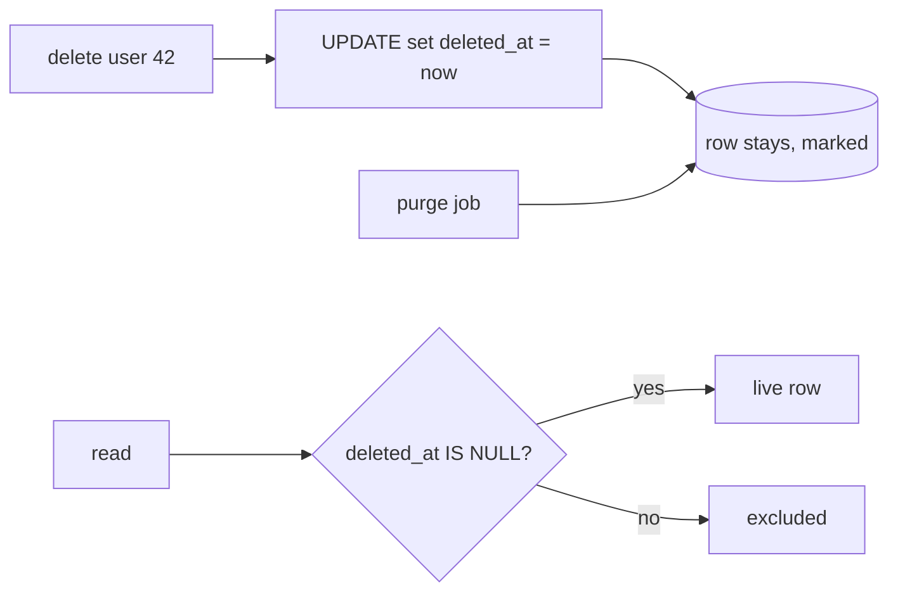

## Thesis

Marking a row deleted with a flag or timestamp instead of physically removing it --- so a delete is reversible, history and references survive, and an audit trail stays intact --- at the cost that every query must now exclude the deleted rows, unique constraints and foreign keys need rethinking, and the data eventually has to be purged for real.

## Sub

**Why soft-delete --- recoverable, referenced, audited** -> **the query-filter tax** -> **the constraint and foreign-key complications** -> **zoom out** to the purge and compliance, and the pivots an interviewer rides from "just mark it deleted" into hard-versus-soft, the forgotten filter, and unique constraints.

## Spine

- A soft delete is a **flag, not a removal** --- a `deleted_at` timestamp (or an `is_deleted` flag) marks the row gone while the data stays, so a delete is reversible and nothing that referenced it dangles.
- Every read must now **exclude the deleted rows** --- a `deleted_at IS NULL` predicate on every query, which is the same forgotten-filter risk as multi-tenancy: miss it and deleted data reappears.
- **Unique constraints and foreign keys** get complicated --- a unique value can't be reused while a soft-deleted row still holds it, and a foreign key can point at a soft-deleted parent, so both need deliberate handling.
- The data still has to be **purged eventually** --- soft-deleted rows accumulate forever and may legally have to be truly erased, so a hard-delete or archival job is the necessary back half.

## Companion Notes

### walk

A delete that marks, not removes

One delete from the flag being set to the row filtered out and eventually purged --- the filter tax, the unique-constraint fix, and the purge.

Say the filter risk early --- "every read needs the not-deleted predicate, or deleted rows come back." That's the tax you're signing up for.

### drill

Probe Drill

Graded follow-ups on hard-versus-soft, the filter, constraints, and the purge --- the ones that separate "add a flag" from a real soft-delete design.

Name the partial unique index --- reusing a unique value after a soft delete is the detail most answers miss.

## Drill

SDE2 | the model and the mechanics
SDE3 | constraints, indexes, and edges
Staff | compliance, purge, and org calls

### SDE2 | what a soft delete is

What is a soft delete?

Marking a row as deleted instead of physically removing it --- typically a `deleted_at` timestamp set to the delete time, or an `is_deleted` boolean. The data stays in the table; only its state changes. The row is treated as gone by the application, but it's recoverable and everything that referenced it still resolves.

### SDE2 | why soft-delete

Why soft-delete instead of a real delete?

Three reasons: **recoverability** (an accidental delete is an undo, not a data-loss incident), **referential survival** (rows and audit logs that point at it still resolve instead of dangling), and an **audit trail** (you can see what existed and when it was removed). It trades the simplicity of a hard delete for the ability to reverse, reference, and account for deletions.

### SDE2 | how it is implemented

How do you implement a soft delete?

Add a nullable `deleted_at` column; a delete becomes an update that sets it to now, and a not-yet-deleted row has it null. The application deletes by setting the timestamp and treats any row with a non-null `deleted_at` as gone. The delete operation changes from a `DELETE` statement to an `UPDATE`.

### SDE2 | the query filter

What do soft deletes require of every read?

A filter --- `WHERE deleted_at IS NULL` --- on every query that should see only live rows. This is the tax: the deleted rows are still physically present, so nothing excludes them unless you say so. Forget the predicate on one query and it returns deleted rows as if they were live, which is the classic soft-delete bug.

### SDE2 | hard vs soft delete

When do you hard-delete versus soft-delete?

**Soft-delete** when the data may need recovery, is referenced, or must be auditable. **Hard-delete** when the data is truly disposable, when it must be erased for compliance, or when keeping it forever is a cost or a liability. Many systems do both: soft-delete for the reversible window, then hard-delete (purge) after a retention period.

### SDE2 | restoring a row

How do you restore a soft-deleted row?

Set `deleted_at` back to null --- the row and everything it referenced were never removed, so undeleting is a single update and the data is intact. This is the whole payoff of soft-delete: recovery is trivial because nothing was actually lost, whereas restoring a hard-deleted row means a backup and a painful reconstruction of its references.

### SDE2 | where the filter lives

Where should the not-deleted filter be enforced?

At one structural place --- a repository method, an ORM global scope, or a database view --- so it's added to every query automatically, not remembered per handler. It's the same lesson as the tenant predicate: correctness that depends on every developer adding a `WHERE deleted_at IS NULL` every time will eventually be missed. Enforce it once, and let opting *in* to deleted rows be the explicit case.

### SDE3 | the forgotten filter

Why is the forgotten filter the central risk?

Because a missed predicate doesn't error --- it silently returns deleted rows as live, so a user sees a "deleted" record, a count includes removed items, or a lookup resurrects something. It's structurally identical to the multi-tenant forgotten filter: the safe default (excluding deleted) has to be automatic, and seeing deleted rows must be the deliberate, rare exception, or one query is a bug.

### SDE3 | unique constraints

How do soft deletes break unique constraints?

A plain unique constraint counts the soft-deleted row, so you can't reuse its unique value --- delete a user with email X and you can't create a new user with email X, because the old row still holds it. The fix is a **partial unique index**: unique only over rows where `deleted_at IS NULL`. Then the constraint applies to live rows only, and a deleted row's value is free to reuse.

### SDE3 | foreign keys

What happens to foreign keys with soft deletes?

A foreign key still points at the parent row --- which is good, it doesn't dangle --- but the parent may be soft-deleted, so a child can reference a "deleted" parent that the database still sees as present. The application has to decide: does a live child keep a deleted parent alive, cascade the soft-delete to children, or block deleting a referenced parent? The database won't decide it for you.

### SDE3 | cascading

How do you handle deleting a parent with children?

You choose a policy explicitly. **Cascade** the soft-delete --- deleting a parent soft-deletes its children in the same operation. **Restrict** --- refuse to delete a parent that still has live children. Or **orphan** --- leave children pointing at a deleted parent. Unlike a hard delete's `ON DELETE CASCADE`, a soft-delete cascade is application logic you write, so you must decide and implement it.

### SDE3 | indexing

How do you keep queries fast despite the deleted rows?

A **partial index** on the live rows --- `WHERE deleted_at IS NULL` --- so the index covers only rows the queries actually read, keeping it small and off the deleted bloat. Without it, indexes and scans carry the soft-deleted rows too, and a table that's mostly deleted rows makes every query pay for data it will filter out. The partial index is what stops accumulated deletes from slowing live reads.

### SDE3 | timestamp vs boolean

`deleted_at` timestamp or `is_deleted` boolean?

Prefer the **timestamp**: it tells you *when* the row was deleted (useful for retention, audit, and ordering) and still works as a boolean via `IS NULL`. A boolean loses the deletion time, so you often end up adding a timestamp anyway. The timestamp is strictly more informative for the same column, which is why it's the common choice.

### SDE3 | counting and aggregating

What's the subtle bug in counts and aggregates?

They silently include deleted rows unless the filter is applied --- a `COUNT(*)` or a `SUM` over the table counts removed records, inflating dashboards and totals. Aggregates are where the forgotten filter hides longest, because the result looks plausible. Every aggregate over a soft-delete table needs the not-deleted predicate, the same as every other read.

### Staff | right to erasure

How does soft-delete interact with a right-to-erasure request?

It conflicts --- soft-delete *keeps* the data, but a legal erasure (GDPR and similar) requires it to be genuinely gone. So a soft delete is not enough for a data-subject deletion; you need a real hard-delete or irreversible anonymization for that data, on a defined timeline. The design has to distinguish "user-facing delete" (reversible, soft) from "erasure" (permanent), because they have opposite requirements.

### Staff | the purge job

Why do you need a purge job?

Because soft-deleted rows accumulate forever otherwise --- unbounded growth, table bloat, and a compliance liability from holding data past its retention. A scheduled job hard-deletes (or archives) soft-deleted rows older than the retention window, in batches to avoid long locks. The purge is the necessary back half of soft-delete: the reversible window is finite, and after it the data is truly removed.

### Staff | table bloat

What performance problem do soft deletes create over time?

Bloat --- the table and its indexes carry every row ever deleted, so scans and index lookups pay for data that's always filtered out, and a table that's mostly tombstones is slow. You mitigate with partial indexes on the live rows and a purge job that caps the deleted set, and sometimes by moving old deletions to an archive table so the hot table stays lean. Unbounded soft-delete is a slow-motion performance problem.

### Staff | soft-delete vs archive table

Soft-delete in place, or move deleted rows to an archive table?

**In place** (a flag) is simplest and keeps recovery trivial, but bloats the hot table. An **archive table** moves deleted rows out, keeping the live table lean and queries filter-free, at the cost of a move on delete and a two-place restore. In place suits a short reversible window; an archive suits keeping history long-term without taxing live reads. Some systems soft-delete first, then archive on purge.

### Staff | when not to soft-delete

When is soft-delete the wrong choice?

When the data is genuinely disposable (a cache row, ephemeral state) --- soft-delete just adds a filter tax for no recovery value. When it must be erased for compliance (soft-delete keeps it). And when the volume of deletes is huge and unreferenced, where the bloat and filter cost outweigh the benefit. Soft-delete earns its place for referenced, recoverable, auditable data --- not as a blanket default.

### Staff | the ORM global filter

What's the risk of an ORM-level global soft-delete filter?

It's the right default --- automatically excluding deleted rows everywhere --- but it can hide the deleted rows *too* well: admin tools, restore flows, and audits that legitimately need them have to explicitly bypass the filter, and a developer may not realize the filter is silently shaping their results. So you enforce the filter globally but make the escape hatch (include-deleted) obvious and deliberate, so intent is always visible.

### Staff | derived data and caches

How does a soft delete reach caches and derived systems?

It's a state change, not a removal, so everything downstream --- a cache, a search index, a read replica's view --- must treat the soft delete as an update that hides the row. A cached copy of a now-deleted row is stale until invalidated; a search index still returns it until reindexed. The soft delete has to fan out like any other write, or the row lives on in the systems that copied it --- the deleted-here-but-not-there problem, the same propagation concern as any change.

## Walk

### A delete marks, it does not remove

```flow
d[delete request] -> u[set deleted_at = now] -> r[row stays, marked gone]
```

A delete becomes an update: instead of a `DELETE`, the row's `deleted_at` is set to the current time. The data stays in the table; only its state changed. Everything that referenced the row still resolves, and the delete is now reversible.

```sql
-- a delete is an update that stamps the deletion time
UPDATE users SET deleted_at = now() WHERE id = 42;
```

That single change --- delete as update --- is what buys recoverability, referential survival, and an audit trail. It also creates every downstream obligation: from now on, the row is physically present and something has to exclude it.

### Every read excludes the deleted

```flow
q[read] -> f[filter deleted_at IS NULL] -> l[live rows only]
```

Because the deleted rows are still there, every query that should see only live data has to say so. The not-deleted predicate goes on every read.

```sql
-- every live-data read must exclude the soft-deleted rows
SELECT id, email FROM users WHERE deleted_at IS NULL;
```

This is the tax, and the risk: forget the predicate on one query and it returns deleted rows as if they were live --- a resurrected record, an inflated count. It's the same forgotten-filter problem as multi-tenancy, so the fix is the same: enforce the filter at one structural place, and make seeing deleted rows the explicit exception.

### Unique values need a partial index

```flow
c[unique email] -> p[partial unique index] -> u[live rows only enforce it]
```

A plain unique constraint still counts the soft-deleted row, so you can't reuse its value --- delete a user with an email and you can't recreate one with that email. The fix scopes uniqueness to live rows.

```sql
-- uniqueness applies only to rows that are not soft-deleted
CREATE UNIQUE INDEX users_email_live
  ON users (email) WHERE deleted_at IS NULL;
```

Now uniqueness holds over live rows only, and a deleted row's value is free to reuse. This is the detail most soft-delete designs miss, and the same partial-index idea keeps other indexes lean by covering only the rows queries actually read.

### The purge is the back half

```flow
t[retention passes] -> h[hard-delete in batches] -> b[bloat capped]
```

The reversible window is finite. Soft-deleted rows would otherwise accumulate forever --- bloat, slower scans, and a liability from holding data past its retention. So a scheduled job hard-deletes (or archives) rows soft-deleted longer than the retention window, in batches to avoid long locks.

And for a legal erasure, soft-delete isn't enough at all: a right-to-erasure request needs the data genuinely gone, so that path hard-deletes or irreversibly anonymizes immediately. The purge and the erasure path are what make soft-delete honest: the data is reversible for a while, then truly removed.

### Model Script

- Frame the pattern | "A soft delete marks a row deleted --- a deleted_at timestamp --- instead of physically removing it. The data stays, so a delete is reversible, rows and audit logs that reference it still resolve, and I have a record of what was removed and when. The delete operation becomes an update, not a DELETE."
- The filter tax | "The cost is that every read now has to exclude the deleted rows with a deleted_at-is-null predicate. That's the central risk: it's the same forgotten-filter problem as multi-tenancy --- miss it on one query and deleted rows come back as live. So I enforce the filter at one structural place, a repository scope or a view, and make seeing deleted rows the explicit exception."
- Constraints and keys | "Two complications. Unique constraints: a plain one still counts the deleted row, so I use a partial unique index scoped to deleted_at-is-null, so live rows enforce uniqueness and a deleted value is reusable. And foreign keys: a child can reference a soft-deleted parent, so I decide the policy explicitly --- cascade the soft-delete, restrict, or orphan --- because unlike a hard delete's cascade, that's application logic I write."
- The back half | "Soft-deleted rows accumulate forever, so I need a purge job that hard-deletes or archives rows past a retention window, in batches. And a legal erasure is different from a soft delete --- it requires the data genuinely gone, so that path hard-deletes immediately. Soft-delete is a finite reversible window, then real removal."
- Interviewer: "A count on the dashboard looks too high. What's your first guess?"
- The aggregate bug | "That aggregates are including the soft-deleted rows. Counts and sums are where the forgotten filter hides longest, because the number looks plausible. I'd check that the COUNT has the deleted_at-is-null predicate --- every aggregate over a soft-delete table needs it, same as every other read."
- Land it | "So: delete becomes an update that stamps deleted_at, every read filters the deleted rows through one structural enforcement point, unique constraints use a partial index and foreign keys get an explicit cascade policy, and a purge job plus a real erasure path handle the back half. The one line is that soft-delete buys reversibility and audit at the price of a filter you must never forget."

## Whiteboard

Sketch the delete-as-update and the filter, and mark the unique-value fix.

### What does a delete actually do?

Sets `deleted_at` to now instead of removing the row --- reversible, and references survive.

### What's the constraint gotcha?

A plain unique constraint counts the deleted row, so use a partial unique index over `deleted_at IS NULL` to free the value for reuse.



Verdict: delete is an update, every read filters on `deleted_at IS NULL`, a partial index frees reused unique values, and a purge caps the bloat.

## System

Zoom out to where the soft-delete filter sits in the data path.

### Where it sits

Delete operation: an update stamping deleted_at, not a DELETE
Live-data reads: filtered on deleted_at IS NULL [*]
Enforcement point: a repository scope, ORM filter, or view
Constraints and keys: partial unique index, explicit cascade policy
Purge / erasure: hard-delete past retention, and real erasure on request

### Pivots an interviewer rides

From "just mark it deleted" they push on the filter, the constraints, and the back half.

#### Hard delete or soft delete?

-> soft for recoverable, referenced, auditable data; hard for disposable or erasure
Soft-delete buys reversibility, referential survival, and an audit trail, at the cost of a filter tax and bloat. Hard-delete is right for disposable data and required for legal erasure. Many systems soft-delete for a window, then purge.

#### What breaks when you soft-delete?

-> every read needs the filter, and unique constraints and foreign keys need rethinking
The deleted rows are physically present, so reads must exclude them (one structural filter), a plain unique constraint blocks value reuse (use a partial index), and foreign keys can reference deleted parents (choose a cascade policy).

## Trade-offs

The calls that separate "add a flag" from a designed soft-delete.

### Soft delete vs hard delete

- Soft: reversible, references survive, auditable, but a filter tax, bloat, and it doesn't satisfy erasure
- Hard: simple, no filter, satisfies erasure, but no undo and referencing rows dangle

Soft-delete referenced, recoverable, auditable data; hard-delete disposable data and anything a compliance erasure requires.

### In-place flag vs archive table

- In-place: trivial recovery and simple, but the hot table bloats with every deleted row
- Archive table: the live table stays lean and filter-light, but a move on delete and a two-place restore

Flag in place for a short reversible window; archive to keep long history without taxing live reads, often purging from soft to archive.

### Per-query filter vs global enforcement

- Per-query filter: explicit, but one forgotten predicate silently returns deleted rows
- Global enforcement: safe by default, but admin and restore paths must deliberately opt in to deleted rows

Enforce the filter globally at one structural point, and make including deleted rows an obvious, explicit escape hatch.

## Model Answers

### the flag and the filter | Delete as an update

The core mechanic.

- Delete stamps deleted_at | key | an update, not a DELETE
- Every read excludes deleted | store | deleted_at IS NULL, enforced once
- Reversible until purged | note | undelete is a single update

### the complications | What soft-delete breaks

The details most answers miss.

- Partial unique index | key | uniqueness over live rows only
- Foreign keys need a policy | store | cascade, restrict, or orphan
- Purge and erasure | note | cap bloat, and erase for real when required

## Numbers

Back-of-envelope the bloat soft deletes accumulate and what the purge caps.

Deleted rows stay in the table, so they grow the table and every scan the filter excludes them from --- until a purge past retention removes them for real.

- rows | Live rows | 10000000 | 0 | 100000
- deletePct | Deleted (%) | 20 | 0 | 5
- retentionDays | Retention (days) | 90 | 0 | 30

```js
function (vals, fmt) {
  var rows = vals.rows, deletePct = vals.deletePct, retentionDays = vals.retentionDays;
  return [
    { k: 'Soft-deleted rows', v: fmt.n(Math.round(rows * deletePct / 100)), u: 'rows', n: 'deleted rows still in the table \u2014 at ' + deletePct + ' percent they are a real fraction of every scan the filter must exclude', over: false },
    { k: 'Table size vs live', v: fmt.n(100 + deletePct) + '%', u: 'of live', n: 'the table carries live plus soft-deleted rows \u2014 bloat a partial index on the live rows keeps off the hot path', over: false },
    { k: 'Purge past ' + retentionDays + ' days', v: fmt.n(Math.round(rows * deletePct / 100)), u: 'rows', n: 'the hard-delete job removes soft-deleted rows past retention \u2014 the back half that stops unbounded growth', over: false },
    { k: 'Filter on every read', v: 'required', u: '', n: 'deleted_at IS NULL on every query \u2014 the same forgotten-filter risk as tenancy, so enforce it once structurally', over: false },
    { k: 'Recovery window', v: fmt.n(retentionDays), u: 'days', n: 'a soft delete is reversible until it is purged \u2014 the whole point, an undo a hard delete can not offer', over: false }
  ];
}
```

## Red Flags

What makes an interviewer wince.

### "We soft-delete, so a query just returns the live rows"

Nothing excludes the deleted rows automatically --- forget the `deleted_at IS NULL` predicate on one query and it returns deleted rows as live.

Enforce the not-deleted filter at one structural point (a repository scope, an ORM filter, a view), and make including deleted rows the explicit exception.

### "Soft-delete satisfies the user's deletion request"

A legal erasure requires the data genuinely gone; soft-delete *keeps* it, so it fails a right-to-erasure request.

Distinguish a reversible user-facing delete (soft) from a permanent erasure (hard-delete or irreversible anonymization) and run the erasure path for real.

### "Just add a unique constraint on email"

A plain unique constraint counts the soft-deleted row, so you can never reuse a deleted user's email.

Use a partial unique index scoped to `deleted_at IS NULL`, so uniqueness applies to live rows only and the value is reusable.

## Opener

### 30s | The one-liner

How I open when asked about deletes that need to be recoverable.

#### What is the shape?

A delete stamps a `deleted_at` timestamp instead of removing the row, so it's reversible and references survive --- and every read filters the deleted rows.

#### What is the cost?

A filter you must never forget on any read, unique constraints and foreign keys to rethink, and a purge job for the back half.

##### Hooks

Where an interviewer usually pushes next.

- Hard or soft? | recoverable vs disposable/erasure | trade
- Forgotten filter? | enforce it structurally | drill
- Reuse a unique value? | partial unique index | drill

Foot: two sentences --- delete becomes an update that stamps deleted_at, and every read must exclude the deleted rows.

## Bank

### SCALE | Ten million rows, a fifth soft-deleted

Task: reason about the bloat and keeping live reads fast.
Model: deleted rows stay in the table and grow every scan, so a partial index on the live rows keeps queries off the bloat, and a purge job past retention caps the deleted set.
Int: where does the forgotten filter hide longest?
In counts and aggregates --- the number looks plausible while it silently includes deleted rows.

### DESIGN | Deletes that must be undoable but also legally erasable

Task: design for both reversible delete and true erasure.
Model: soft-delete (deleted_at) for the reversible user-facing window with the filter enforced structurally, a purge job that hard-deletes past retention, and a separate erasure path that hard-deletes or anonymizes immediately for a legal request.
Int: why isn't soft-delete enough for erasure?
It keeps the data; erasure requires it genuinely gone.

### Extra Curveballs

### CURVEBALL | constraint | A user deletes their account, then tries to sign up again with the same email and it's rejected. Why, and the fix?

Model: the plain unique index still counts their soft-deleted row, so the email is taken. Replace it with a partial unique index over `deleted_at IS NULL` so uniqueness applies only to live rows, freeing the deleted user's email for reuse --- the classic soft-delete unique-constraint fix.

### Frames

- A delete is an update that stamps deleted_at, not a removal
- Every read needs the not-deleted filter --- enforce it once, structurally
- Soft is reversible for a window; a purge and a real erasure path close the back half
