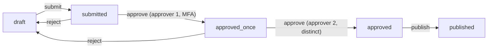

## Thesis

Modeling an entity whose behavior depends on where it is in a lifecycle as an explicit set of states and allowed transitions --- so every change is a validated move from the current state to a permitted next state, illegal moves are rejected by construction, and the rules live in one transition table instead of scattered boolean flags and if-statements --- with each transition's guard, action, and persistence handled consistently.

## Sub

**Why a state machine, not scattered flags** -> **states, transitions, guards, actions** -> **persisting and enforcing the transition table** -> **zoom out** to concurrency, failed states, and event sourcing, and the pivots an interviewer rides from "add a status field" into why-not-booleans, guarding a transition, and two actors moving the same entity at once.

## Spine

- A state machine makes the lifecycle **explicit** --- a fixed set of states and a table of allowed transitions, so "what can happen next" is data you can read, not logic smeared across the codebase.
- Every change is a **guarded transition** --- a move from the current state to a permitted next state, gated by a guard (is this move allowed now?) and paired with an action (its side effect); an illegal move is rejected, never silently applied.
- The current state is **persisted and enforced** --- one state column (or a replayed event log), with every attempted transition validated against the table, so the entity can never sit in an impossible state.
- The hard parts are the **edges** --- concurrent transitions (two actors moving the same entity), failed states and their retries, and whether to store the state or derive it from an event history.

## Companion Notes

### walk

One entity moving through its lifecycle

One change from a current state to the next --- the guard that permits it, the table that rejects the illegal moves, the action that fires, and the compare-and-swap that makes concurrent transitions safe.

Say the reframe first --- "a status field plus scattered checks becomes a table of allowed moves." Everything (illegal-move rejection, auditability) follows from making the transitions explicit.

### drill

Probe Drill

Graded follow-ups on states, guards, the transition table, and the edges --- the ones that separate "add a status column" from a real lifecycle model.

Name the impossible state: the win of a state machine is that an illegal move is unreachable by construction, not merely unlikely.

## Drill

SDE2 | the model and the mechanics
SDE3 | rejection, concurrency, and edges
Staff | storage, scale, and org calls

### SDE2 | what a state machine is

What is a state machine, in application terms?

A model of an entity's lifecycle as a fixed set of **states** and a set of allowed **transitions** between them, where every change is a move from the current state to a permitted next state. An order is `created`, then `paid`, then `shipped`; a document is `draft`, then `submitted`, then `approved`. The point is that the allowed moves are defined up front, so the entity's behavior is governed by *where it is* rather than by ad hoc checks scattered through the code.

### SDE2 | why not booleans

Why model a lifecycle as a state machine instead of a few boolean flags?

Because booleans multiply into impossible and contradictory combinations. `isPaid`, `isShipped`, `isCancelled` gives you eight combinations, several of which are nonsense (shipped-but-not-paid, paid-and-cancelled-and-shipped), and nothing stops the code from setting them into a contradictory state. A single `state` field with a transition table makes exactly the valid states representable and everything else unreachable --- you replace "hope the flags are consistent" with "the entity is always in exactly one valid state."

### SDE2 | states and transitions

What exactly are states and transitions?

A **state** is a named, mutually exclusive condition the entity is in at a moment (`draft`, `submitted`, `approved`) --- it's in exactly one. A **transition** is a named move from one state to another, usually triggered by an event or action (`submit` moves `draft` -> `submitted`). The set of states plus the set of legal transitions *is* the machine; drawing it as a diagram (nodes are states, arrows are transitions) is the clearest way to specify a lifecycle.

### SDE2 | a guard

What is a guard on a transition?

A condition that must hold for a transition to be allowed *right now*, beyond just being a legal move in the table. `approve` might be a legal transition out of `submitted`, but guarded by "the approver has permission and isn't the author," or "two distinct approvers have signed off." The guard is the *when*: it's the difference between "this move exists in the lifecycle" and "this move is permitted in this specific situation," and a failed guard blocks the transition.

### SDE2 | an action

What is the action (or effect) of a transition?

The side effect that fires *when* a transition is taken --- sending the confirmation email on `pay`, kicking off fulfilment on `ship`, publishing the document on `publish`. The transition is the atomic unit: it moves the state *and* runs its action together. Attaching effects to transitions (rather than to states being observed elsewhere) keeps the "what happens when X occurs" logic in one place and makes the lifecycle's behavior readable from the machine itself.

### SDE2 | the transition table

What is the transition table?

The single source of truth for which moves are legal --- a mapping of `(current state, event) -> next state` for every allowed transition, and nothing else. Instead of scattered `if (status === 'submitted') { ... }` checks, one table declares the whole lifecycle, so validating a move is a lookup and the legal moves are inspectable data. Adding or changing a rule is an edit to the table, not a hunt through the code for every place that touches the status.

### SDE2 | where the state lives

Where is the state stored?

Most commonly a single **state column** on the entity's row (`orders.status`), holding the current state, updated on each valid transition. The alternative is to store the *events* (an append-only log of what happened) and derive the current state by replaying them --- event sourcing. Either way there's one authoritative representation of where the entity is: a column you read directly, or a history you fold. The column is simpler; the log gives you the full audit trail for free.

### SDE3 | rejecting illegal transitions

What happens when someone attempts an illegal transition?

It's rejected --- the transition isn't in the table for the current state, so the move is refused and the state is unchanged, ideally with a clear error ("cannot ship an unpaid order"). This is the core value: an impossible state is *unreachable by construction*, not merely discouraged. The check is at the point of transition, against the table, so no code path --- however it's reached --- can slip the entity into a state the lifecycle doesn't permit.

### SDE3 | concurrent transitions

What breaks when two actors transition the same entity at once?

A lost update or a double transition --- both read `submitted`, both decide `approve` is legal, and both apply, so the approval happens twice or two conflicting moves race. The fix is to make the transition atomic on the current state: a **compare-and-swap** --- `UPDATE ... SET state='approved' WHERE id=? AND state='submitted'` --- so exactly one succeeds and the other sees zero rows affected and knows it lost. Reading the state, deciding, and writing must be one guarded atomic step, or concurrency corrupts the lifecycle.

### SDE3 | guard vs permission

How is a transition guard different from the caller's permission?

Permission is *who* may attempt the action (authz --- is this user allowed to call approve?); the guard is *whether the entity may make this move now* given its state and business rules (is it in `submitted`, do two distinct approvers exist?). They're separate layers: a user with permission still can't approve an already-approved doc (guard fails), and the right state still can't be transitioned by an unauthorized user (permission fails). Conflating them leaks one concern into the other; you check both.

### SDE3 | terminal states

What is a terminal state, and why does it matter?

A state with no outgoing transitions --- `delivered`, `cancelled`, `published` --- the entity has reached the end of its lifecycle and can't move further. Marking states terminal matters because it declares "nothing more happens here," so any attempt to transition out is correctly rejected, and it tells the rest of the system the entity is done (safe to archive, no more actions pending). A lifecycle without clear terminal states invites code that keeps trying to act on finished entities.

### SDE3 | failed states and retry

How do you model a step that can fail and be retried?

As explicit states, not a hidden flag --- a `processing` state that transitions to `failed` on error, where `failed` has a `retry` transition back to `pending` (or `processing`), often with an attempt counter and a cap that moves it to a terminal `dead` state after N tries. Making failure a first-class state (rather than "it's still pending but actually broken") means the machine shows exactly what's stuck, retries are a defined transition with a limit, and a poison item ends in a terminal dead state instead of retrying forever.

### SDE3 | a two-approver flow

How would you model a two-approver, MFA-gated approval as a state machine?

With intermediate states that capture partial progress: `submitted` -> `approved_once` (first distinct approver signs, MFA-verified) -> `approved` (second distinct approver signs) -> `published`, plus a `reject` transition to a rejected/`draft` state from either approval state. The guards enforce the rules --- the second approver must differ from the first, each must pass MFA --- and the intermediate `approved_once` state is what makes "one approval in, one to go" an explicit, auditable position rather than a counter hidden in a column. It's a four-eyes workflow expressed as states.

### SDE3 | auditing transitions

How do you get an audit trail of a lifecycle?

Record every transition as an event --- who, when, from-state, to-state, and why --- either as the primary store (event sourcing, where the log *is* the state) or as a side log written in the same transaction as the state update. Then the entity's full history is queryable: how it reached its current state, who approved it, when it failed. A bare state column tells you *where* the entity is but not *how it got there*; appending a transition record is what turns the lifecycle into an accountable history.

### Staff | state column vs event sourcing

State column or event sourcing --- how do you choose?

A **state column** stores the current state directly: simple, fast to read, easy to query "all shipped orders," but it loses history unless you separately log transitions. **Event sourcing** stores the transitions and derives state by replay: you get the complete audit trail and time-travel for free, at the cost of complexity (replay, snapshots, projections) and harder ad hoc queries. Choose the column for most lifecycles and add a transition log for audit; reach for full event sourcing when the history *is* the product (finance, compliance, anything where "how did we get here" is a first-class question).

### Staff | state explosion

What do you do when a state machine grows too many states?

Decompose it --- a flat machine with dozens of states and a combinatorial mess of transitions is a sign the entity is really several concerns tangled together. **Hierarchical states** (a super-state like `active` containing sub-states) collapse shared transitions; **orthogonal regions** model independent dimensions separately (a payment status and a fulfilment status that evolve independently) instead of multiplying them into one giant state set. The goal is to keep each machine small enough to draw and reason about; when it isn't, you're modeling too much in one lifecycle.

### Staff | idempotent transitions

Why make transitions idempotent, and how?

Because retries and duplicate events are inevitable --- a client resubmits, a queue redelivers --- so applying the same transition twice must be safe. The compare-and-swap gives you this for free: the second `submitted -> approved` finds the state already `approved`, matches zero rows, and is a no-op rather than a double-approval. You can also key transitions by an idempotency token so a retried request recognizes it already ran. Idempotent transitions are what let the machine live in a real distributed system where "exactly once" isn't guaranteed.

### Staff | testing a state machine

How do you test a state machine thoroughly?

By covering the *transitions*, not just the states --- assert that every legal transition works and fires its action, and critically that every *illegal* transition is rejected (the negative cases are where bugs hide). Because the machine is a table, you can drive tests off it: enumerate the pairs, confirm the allowed ones succeed and the rest are refused. Add tests for the guards (a same-person second approval is blocked) and for concurrency (two racing transitions, one wins). The transition table makes the test matrix finite and mechanical, which is a real advantage of the explicit model.

### Staff | distributed state machine

How does a state machine span multiple services?

It becomes a **saga**: the lifecycle spans services, so each step is a local transition that emits an event triggering the next service's transition, and there's no shared transaction across them. Because a later step can fail, you design **compensating transitions** to undo earlier ones (a `payment_failed` event drives an `order` back from `reserved` to `cancelled` and releases the inventory). The state is distributed but still explicit --- each service owns its slice, events carry the lifecycle forward, and compensation replaces rollback. It's the same guarded-transition idea stretched across a network with eventual consistency.

### Staff | when it is overkill

When is an explicit state machine overkill?

When the lifecycle is trivial --- two states with a single one-way transition (`active` -> `archived`) doesn't need a machine; a boolean is honest. When there are effectively no rules about *order* (any state can go to any other), the table adds ceremony without protection. And when the "states" are really just a status label with no behavior or transition constraints attached, a plain enum column suffices. The state machine earns its complexity when there are genuine transition rules to enforce, illegal states to prevent, or a lifecycle complex enough that scattered flags would drift --- not for every status field.

### Staff | evolving the machine

How do you add a state to a lifecycle that already has entities in flight?

Carefully, because the transition table is versioned in code but the persisted entities aren't --- adding a state or changing a transition can strand rows in states the new table no longer knows how to move. You make the change additive where you can (new states and transitions that don't break existing paths), migrate or backfill in-flight entities to a valid state under the new table, and keep the old transitions valid until nothing is parked on them. The state field was written by old code, so a lifecycle change is a data migration as much as a code change: you can't just edit the table and assume every existing entity fits the new shape --- you have to account for where the live entities currently sit.

## Walk

### An entity has one explicit current state

```flow
e[entity] -> s[single state field] -> x[not a pile of booleans]
```

The entity carries one `state` --- `draft`, `submitted`, `approved`, `published` --- and it's in exactly one at a time. That single field replaces a scatter of `isSubmitted` / `isApproved` booleans that could otherwise drift into contradictory combinations.

Making the state explicit is the whole foundation: because there's one authoritative field constrained to a known set of values, the entity is always in exactly one valid state, and "what can happen next" becomes a question the machine can answer rather than something each caller re-derives from flags.

### A transition is a guarded move against a table

```flow
a[attempt: submit] -> g[guard checks] -> t[table: draft -> submitted?]
```

A change isn't a direct write to the field --- it's an attempt to take a named transition, which is checked two ways: the guard (is this move permitted right now, given the actor and the rules?) and the transition table (is this even a legal move from the current state?).

```json
{
  "draft":     { "submit": "submitted" },
  "submitted": { "approve": "approved", "reject": "draft" },
  "approved":  { "publish": "published" },
  "published": {}
}
```

The table is the single source of truth for legal moves --- `(state, event) -> next state`, and nothing else. `published` has no outgoing transitions, so it's terminal. Validating a move is a lookup in this table, not a hunt through scattered `if (status === ...)` checks, and the guard layers the business rule (a distinct, MFA-verified approver) on top of the structural rule.

### Illegal moves are rejected, and the action fires

```flow
c[in table + guard ok?] -> y[apply + run action] -> n[else reject, no change]
```

If the move is legal and the guard passes, the state advances and the transition's action fires --- publishing the document, sending the notification --- as one unit. If it isn't in the table (say, `publish` attempted from `draft`), it's rejected and the state is unchanged, with a clear error.

This is the payoff: an impossible state is *unreachable by construction*. No matter how a code path is reached, it can't slip the entity into a state the lifecycle doesn't permit, because every change goes through the table. You've replaced "hope every caller checks the flags correctly" with "the machine refuses the illegal move."

### Concurrent transitions need a compare-and-swap

```flow
two[two actors approve] -> cas[UPDATE ... WHERE state='submitted'] -> one[exactly one wins]
```

When two actors transition the same entity at once, a naive read-decide-write double-applies --- both see `submitted`, both approve. The fix is to make the transition atomic on the current state with a compare-and-swap: update the state *only if* it's still the state you decided from.

`UPDATE docs SET state='approved' WHERE id=? AND state='submitted'` --- exactly one update matches a row; the loser matches zero rows and knows it lost. This also makes transitions idempotent (a replayed `approve` finds `approved` and no-ops), and pairing the state update with a transition record in the same transaction gives the audit trail. State persisted, concurrency safe, history captured --- one guarded, atomic move.

### Model Script

- Frame the reframe | "A state machine models an entity's lifecycle as an explicit set of states and a table of allowed transitions -- so every change is a validated move from the current state to a permitted next one. The alternative, a handful of boolean flags, multiplies into contradictory combinations nothing prevents; one state field plus a transition table makes exactly the valid states representable and everything else unreachable."
- States, guards, actions | "Three pieces. A state is a named condition the entity is in -- it's in exactly one. A transition is a named move between states, triggered by an event. A guard is the condition that permits a move right now -- like a second, distinct, MFA-verified approver -- and the action is the side effect that fires when the move is taken. The transition moves the state and runs its action as one atomic unit."
- The table and illegal moves | "The transition table is the single source of truth -- (state, event) to next state, and nothing else -- so validating a move is a lookup, not scattered status checks. An attempt that isn't in the table is rejected and the state is unchanged. That's the core value: an impossible state is unreachable by construction, not just unlikely, because every change goes through the table."
- The edges | "The hard parts are the edges. Concurrency: two actors moving the same entity race, so I make the transition a compare-and-swap -- update only if the state is still what I decided from -- so exactly one wins and transitions are idempotent. Failure: I model it as an explicit failed state with a bounded retry transition and a terminal dead state, not a hidden flag. And I log each transition -- who, when, from, to -- for the audit trail."
- Interviewer: "Model a two-approver, MFA-gated publish flow."
- Two-approver as states | "Intermediate states capture partial progress: submitted, then approved_once when the first distinct approver signs with MFA, then approved when a second distinct approver signs, then published -- with a reject transition to draft from either approval state. The guards enforce distinct approvers and MFA; the approved_once state makes 'one in, one to go' an explicit, auditable position rather than a counter hidden in a column. Four-eyes expressed as states."
- Land it | "So: model the lifecycle as explicit states and a transition table; every change is a guarded, atomic transition that rejects illegal moves by construction; concurrency is a compare-and-swap; failure and retry are explicit states; and transitions are logged for audit. Store the current state in a column plus a transition log, or event-source it when the history is the product. The one line is that a state machine turns 'a status field and hope' into 'the entity is always in exactly one valid state.'"

## Whiteboard

Sketch the lifecycle and mark the terminal state and a guard.

### What makes an illegal state impossible?

Every change goes through the transition table -- a move not in the table is rejected -- so the entity can only ever be in a state the lifecycle permits.

### Where does the two-approver rule live?

On the guard of the approval transitions -- the second approver must be distinct and MFA-verified -- with an intermediate `approved_once` state making partial progress explicit.



Verdict: states are explicit and mutually exclusive, the table permits only these moves, `published` is terminal, and the distinct-approver rule is a guard on the approval transitions.

## System

Zoom out to where the machine sits and what enforces it.

### Where it sits

Entity state: one persisted field, always one valid value [*]
Transition table: the whitelist of legal (state, event) -> next moves
Guards: the business rules that permit a move right now
Actions: the side effects fired on a transition
Transition log / events: the audit trail, or the source of truth itself

### Pivots an interviewer rides

From "add a status field" they push on why-not-booleans, concurrency, and storage.

#### Why a state machine instead of boolean flags?

-> flags allow contradictory combinations nothing prevents; one state plus a table makes only valid states representable
Booleans multiply into impossible combinations (shipped-but-unpaid) with no guard; a single state field validated against a transition table makes an illegal state unreachable by construction, replacing "hope the flags agree" with an always-valid entity.

#### Two actors transition the same entity at once -- what happens?

-> a compare-and-swap on the current state, so exactly one wins
Update the state only if it still equals the value you decided from; the loser matches zero rows and knows it lost. This makes the transition atomic and idempotent, so concurrency and retries can't double-apply a move.

## Trade-offs

The calls that separate "a status column" from a designed lifecycle.

### State machine vs boolean flags

- State machine: only valid states representable, illegal moves rejected, one place for the rules -- but more upfront modeling
- Boolean flags: trivial to add one -- but combinatorial impossible states with nothing preventing them

Use a state machine when there are real transition rules or illegal states to prevent; a single boolean is fine for a genuinely two-state, rule-free toggle.

### State column vs event sourcing

- State column: simple, fast reads, easy queries -- but no history unless you separately log transitions
- Event sourcing: full audit trail and time-travel for free -- but replay/snapshot complexity and harder ad hoc queries

Store the current state in a column (plus a transition log for audit) for most lifecycles; event-source when the history itself is the product.

### Optimistic vs pessimistic concurrency

- Optimistic (compare-and-swap / version): no locks, scales, one writer wins and the loser retries -- but the loser must handle the conflict
- Pessimistic (row lock): the writer holds the entity while transitioning -- but contention and lock overhead under load

Prefer optimistic compare-and-swap on the state for lifecycle transitions; use a lock only when a transition spans a long critical section that can't be a single atomic update.

## Model Answers

### the reframe | Explicit states, not flags

The frame to lead with.

- One state field | key | always exactly one valid value
- Transition table | store | the whitelist of legal moves
- Illegal is impossible | note | rejected by construction, not just discouraged

### the edges | Concurrency, failure, audit

Where the design is really tested.

- Compare-and-swap | key | atomic transition, one actor wins, idempotent
- Failure as a state | store | explicit failed state, bounded retry, terminal dead
- Log every transition | note | who/when/from/to -- the audit trail

## Numbers

Back-of-envelope how much the transition table constrains, and where concurrency bites.

The states squared is the space of conceivable moves; the table permits only a few, and everything else is rejected --- that gap is what the machine buys you.

- states | States | 8 | 2 | 1
- transitions | Allowed transitions | 14 | 1 | 1
- actors | Concurrent actors | 3 | 1 | 1

```js
function (vals, fmt) {
  var states = vals.states, transitions = vals.transitions, actors = vals.actors;
  var pairs = states * (states - 1);
  return [
    { k: 'Conceivable moves', v: fmt.n(pairs), u: 'ordered pairs', n: 'with ' + states + ' states there are this many moves you could imagine \u2014 the transition table permits only a few of them', over: false },
    { k: 'Allowed transitions', v: fmt.n(transitions), u: 'in the table', n: 'the whitelist \u2014 only these moves are legal; the gap between this and the conceivable moves is the illegal space', over: false },
    { k: 'Illegal moves blocked', v: fmt.n(Math.max(0, pairs - transitions)), u: 'rejected', n: 'every move not in the table is refused \u2014 an impossible state is unreachable by construction, not merely unlikely', over: false },
    { k: 'Concurrent actors', v: fmt.n(actors), u: 'actors', n: actors + ' actors moving one entity means transitions race \u2014 a compare-and-swap on the state is what lets exactly one win', over: actors > 1 },
    { k: 'State storage', v: 'one field', u: '(or event log)', n: 'the current state is one persisted field validated on every transition, or replayed from an event log \u2014 either way, one source of truth for where the entity is', over: false }
  ];
}
```

## Red Flags

What makes an interviewer wince.

### "We track the lifecycle with a few boolean flags"

Booleans multiply into contradictory, impossible combinations -- shipped-but-unpaid, approved-and-rejected -- and nothing stops the code from writing them.

Use a single state field with a transition table so only valid states are representable and every illegal move is rejected by construction.

### "We read the status, check it, then update it"

Under concurrency that read-decide-write double-applies -- two actors both read `submitted` and both approve.

Make the transition a compare-and-swap: `UPDATE ... SET state=? WHERE id=? AND state=?`, so exactly one wins and the transition is idempotent under retries.

### "Failed just stays as pending until someone notices"

Hiding failure inside another state means the machine can't show what's stuck and retries have no bound.

Model failure as an explicit `failed` state with a bounded `retry` transition and a terminal dead state after N attempts, so stuck entities are visible and poison items stop retrying.

## Opener

### 30s | The one-liner

How I open when asked to model an entity's lifecycle.

#### What is the shape?

An explicit set of states and a transition table of allowed moves, so every change is a validated move and an illegal state is unreachable by construction.

#### What are the edges?

Concurrency is a compare-and-swap on the state, failure is an explicit state with bounded retry, and every transition is logged for audit.

##### Hooks

Where an interviewer usually pushes next.

- Why not booleans? | impossible combinations vs one valid state | drill
- Two actors at once? | compare-and-swap, one wins | drill
- Column or event-sourced? | history for free vs simplicity | trade

Foot: two sentences -- the lifecycle is explicit states plus a transition table, and every change is a guarded, atomic move that makes illegal states impossible.

## Bank

### SCALE | An eight-state lifecycle with several concurrent actors

Task: reason about what the table constrains and where concurrency bites.
Model: the states-squared space of conceivable moves is narrowed by the table to a small whitelist, everything else rejected; concurrent actors on one entity race, so each transition is a compare-and-swap that lets exactly one win and is idempotent under retries.
Int: what's the single biggest win of the explicit model here?
An impossible state is unreachable by construction, not merely unlikely.

### DESIGN | A two-approver, MFA-gated document publish flow

Task: design the lifecycle for a four-eyes publish.
Model: states draft -> submitted -> approved_once -> approved -> published, with reject transitions to draft; guards enforce a distinct, MFA-verified second approver; the approved_once state makes partial progress explicit and auditable; each transition is a compare-and-swap and is logged.
Int: why an intermediate approved_once state instead of a counter?
It makes "one approval in, one to go" an explicit, auditable position the machine enforces, rather than a mutable count hidden in a column.

### Extra Curveballs

### CURVEBALL | retry | A processing step fails intermittently and you need bounded retries without losing poison items. Model it.

Model: a `processing` state transitions to `failed` on error; `failed` has a `retry` transition back to `pending` guarded by an attempt counter, and once attempts hit the cap it transitions to a terminal `dead` state for inspection. Failure is a first-class state, so what's stuck is visible, retries are a defined transition with a limit, and a poison item ends terminal instead of retrying forever -- rather than "still pending but actually broken."

### Frames

- Explicit states plus a transition table -- illegal moves rejected by construction
- Every change is a guarded, atomic transition (compare-and-swap for concurrency)
- Failure is an explicit state with bounded retry; log every transition for audit
