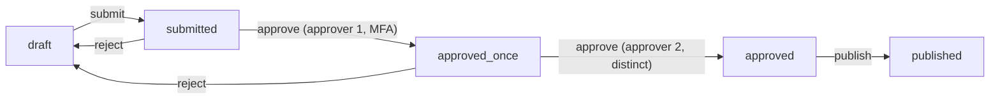

## Thesis

Modeling an entity whose behavior depends on where it is in a lifecycle as an explicit set of states and allowed transitions --- so every change is a validated move from the current state to a permitted next state, illegal moves are rejected by construction, and the rules live in one transition table instead of scattered boolean flags and if-statements --- with each transition's guard, action, and persistence handled consistently.

## Sub

**Why a state machine, not scattered flags** -> **states, transitions, guards, actions** -> **persisting and enforcing the transition table** -> **zoom out** to concurrency, failed states, and event sourcing, and the pivots an interviewer rides from "add a status field" into why-not-booleans, guarding a transition, and two actors moving the same entity at once.

## Spine

- A state machine makes the lifecycle **explicit** --- a fixed set of states and a table of allowed transitions, so "what can happen next" is data you can read, not logic smeared across the codebase.
- Every change is a **guarded transition** --- a move from the current state to a permitted next state, gated by a guard (is this move allowed now?) and paired with an action (its side effect); an illegal move is rejected, never silently applied.
- The current state is **persisted and enforced** --- one state column (or a replayed event log), with every attempted transition validated against the table, so the entity can never sit in an impossible state.
- The hard parts are the **edges** --- concurrent transitions (two actors moving the same entity), failed states and their retries, and whether to store the state or derive it from an event history.

## Companion Notes

### walk

One entity moving through its lifecycle

One change from a current state to the next --- the guard that permits it, the table that rejects the illegal moves, the action that fires, and the compare-and-swap that makes concurrent transitions safe.

Say the reframe first --- "a status field plus scattered checks becomes a table of allowed moves." Everything (illegal-move rejection, auditability) follows from making the transitions explicit.

### drill

Probe Drill

Graded follow-ups on states, guards, the transition table, and the edges --- the ones that separate "add a status column" from a real lifecycle model.

Name the impossible state: the win of a state machine is that an illegal move is unreachable by construction, not merely unlikely.

### wb

Whiteboard

Rebuild the lifecycle from memory --- the states, the terminal, the guard, and the one atomic move --- nine cues, nothing in front of you.

Draw the state graph first, then mark the terminal state and the guarded edge --- recall is the test, not recognition.

### sys

System Map

Zoom out to the seven stages a transition flows through --- and the exact points an interviewer pivots into idempotency, sagas, and authz.

Lead with the flow, not the boxes --- "an event arrives, the engine guards it and looks up the table, a compare-and-swap applies it, the store and log persist it."

### trade

Trade-offs

The calls that separate "a status column" from a designed lifecycle --- each with the switch condition that picks a side.

Always name the axis: table in code vs data, effects inline vs an outbox, column vs event sourcing --- the condition that flips the choice, not just the options.

### model

Model Answers

Full spoken scripts --- the beats, in order, the way you'd actually say them under time pressure.

Steal the frame, not the words: reframe to explicit states first, then the edges (concurrency, failure, audit), then name one risk.

### num

Numbers

Back-of-envelope what the table constrains and where concurrency bites --- the illegal-move space and the hot-entity ceiling.

Lead with the gap: states-squared conceivable moves, a handful legal, everything else rejected --- that gap is what the machine buys you.

### rf

Red Flags

The anti-patterns that quietly fail the loop --- booleans, read-then-write, effects before commit --- and the line that flips each.

Name what the interviewer hears: "hasn't thought about the failure path," or "never run this under concurrency."

### open

30-Second

The opener and the close --- the one-line reframe when they want the frame, the guarded-move detail when they want depth.

Match the altitude: open at "explicit states and a table," and land on the one risk (concurrency, or a rolled-back effect).

## Drill

all | **All four levels, mixed** --- the way a real loop actually rides you, from "just add a status field" into why-not-booleans, guarding a move, and two actors racing the same entity.
SDE2 | **The model and the mechanics** --- states, transitions, guards, actions, the table. The bar is "this is a real lifecycle model, not a status column": show the pieces cleanly and say why booleans don't cut it.
SDE3 | **Rejection, concurrency, the edges** --- illegal moves, the compare-and-swap, guard-vs-permission, failure and retry. The bar is "I've seen this race in production": name the failure mode and the atomic fix.
Staff | **Storage, scale, and org calls** --- event sourcing, state explosion, sagas, when it's overkill. The bar is "I know when *not* to build one": name the ceiling, the decomposition, and the migration.

### SDE2 | what a state machine is

What is a state machine, in application terms?

A model of an entity's lifecycle as a fixed set of **states** and a set of allowed **transitions** between them, where every change is a move from the current state to a permitted next state. An order is `created`, then `paid`, then `shipped`; a document is `draft`, then `submitted`, then `approved`. The point is that the allowed moves are defined up front, so the entity's behavior is governed by *where it is* rather than by ad hoc checks scattered through the code.

Follow: Give me the smallest real example where you'd actually reach for one.
An order or document lifecycle: `draft -> submitted -> approved -> published`. The moment there are rules about which move is legal from where --- you can't publish a draft, can't approve twice --- a status field plus scattered checks starts drifting, and a table of allowed moves pays for itself. If *any* status can legally follow any other, it's just an enum, not a machine.

Follow: Is a state machine a data-modeling choice or a control-flow choice?
Both, and that's the point. The states-and-transitions table is **data** you can read, store, and diff; the guarded-transition function is the **control flow** that enforces it. The power is that the control flow is *derived from* the data --- you change behavior by editing the table, not by hunting `if (status === ...)` branches. Conflating "add a status column" (data only) with "model the lifecycle" (data plus enforced transitions) is the beginner mistake.

Senior: Naming that the machine earns its keep only when there are real *ordering* rules --- and that a rule-free status label is just an enum, not a state machine --- is the tell you know when *not* to reach for it, which is more senior than reciting the definition.

Speak: Lead with the reframe --- "a state machine turns a status field plus scattered checks into a fixed set of states and a table of allowed moves" --- then the payoff, that illegal moves become unrepresentable, not just discouraged.

### SDE2 | why not booleans

Why model a lifecycle as a state machine instead of a few boolean flags?

Because booleans multiply into impossible and contradictory combinations. `isPaid`, `isShipped`, `isCancelled` gives you eight combinations, several of which are nonsense (shipped-but-not-paid, paid-and-cancelled-and-shipped), and nothing stops the code from setting them into a contradictory state. A single `state` field with a transition table makes exactly the valid states representable and everything else unreachable --- you replace "hope the flags are consistent" with "the entity is always in exactly one valid state."

Follow: Three booleans is only eight combinations --- but I set them carefully. What's the *actual* failure?
The failure isn't one careless write; it's that *nothing structurally prevents* the bad combination, so across dozens of call sites and a few years, one path eventually sets `isShipped` without `isPaid`, and now you have a row no code expected. A `state` enum makes the illegal combination **unrepresentable** --- the bug can't be written --- versus "we're careful." You're replacing a convention with an invariant.

Follow: I have three genuinely independent booleans --- `isArchived`, `isPinned`, `isFlagged`. Should those be a state machine too?
No --- those are *orthogonal* dimensions with no ordering rule between them, so a single state enum would multiply them into a combinatorial mess with no meaningful transitions. Independent, rule-free flags stay flags (or become orthogonal regions). The state machine is for the *one* dimension that has a lifecycle --- the ordered progression --- not for every boolean on the row. Knowing which is which is the skill.

Senior: The senior move isn't "booleans bad, enum good" --- it's separating the *ordered lifecycle* dimension (which becomes the machine) from *orthogonal, rule-free* flags (which stay flags), rather than sweeping every boolean into one giant state set.

Speak: "Booleans don't *prevent* the contradictory combination --- they just hope no call site writes it; a single state field makes the illegal state unrepresentable." Then the caveat: only the *ordered* dimension becomes the machine, independent flags stay flags.

### SDE2 | states and transitions

What exactly are states and transitions?

A **state** is a named, mutually exclusive condition the entity is in at a moment (`draft`, `submitted`, `approved`) --- it's in exactly one. A **transition** is a named move from one state to another, usually triggered by an event or action (`submit` moves `draft` -> `submitted`). The set of states plus the set of legal transitions *is* the machine; drawing it as a diagram (nodes are states, arrows are transitions) is the clearest way to specify a lifecycle.

Follow: Is a transition triggered by an event, or is it just a state change?
By an event or action --- and that distinction matters. The transition is `(current state, event) -> next state`: the *event* is the input, the state change is the output. Modeling it as "just set the field to X" loses the event, which is exactly what you want to log, guard, and make idempotent. The event is a first-class thing --- `submit`, `approve`, `pay` --- not "wrote 'approved' to the column."

Follow: Can the same event be legal from two different states and go to different places?
Yes, and that's normal --- `cancel` from `pending` goes to `cancelled`, `cancel` from `shipped` might go to `return_requested`. The transition is keyed on *both* the current state and the event, which is precisely why a flat `if (event === 'cancel')` is wrong: the same event means different things depending on where you are. The `(state, event)` pair is the key, never the event alone.

Senior: Recognizing that the transition is keyed on the `(state, event)` *pair* --- so the same event can legally do different things from different states --- is what separates a real transition table from a switch-on-event, which is the most common broken implementation.

Speak: "A state is a named exclusive condition; a transition is `(current state, event) -> next state`, keyed on the *pair*, so the same event can mean different things from different states." Draw it: nodes are states, arrows are transitions.

### SDE2 | a guard

What is a guard on a transition?

A condition that must hold for a transition to be allowed *right now*, beyond just being a legal move in the table. `approve` might be a legal transition out of `submitted`, but guarded by "the approver has permission and isn't the author," or "two distinct approvers have signed off." The guard is the *when*: it's the difference between "this move exists in the lifecycle" and "this move is permitted in this specific situation," and a failed guard blocks the transition.

Follow: A guard fails. Does the entity change state, throw, or sit still?
It sits still --- a failed guard *blocks* the transition, the state is unchanged, and you return a domain error ("needs a second approver"). It's not an exception in the crash sense; it's a rejected move. The invariant is that a blocked transition is a no-op on state, so the caller can safely retry once the guard would pass. Silently applying the move, or half-applying it, is the bug the guard exists to prevent.

Follow: Where does the guard's data come from --- is it allowed to do I/O?
It reads whatever the rule needs --- the entity, the actor, sometimes another table (is this a *distinct* approver from the first?). That means guards can touch I/O, which is why the guard-check and the state-write must be *one atomic step*: if you check the guard, then write in a separate transaction, a concurrent change can invalidate the guard between check and write --- a TOCTOU bug. Evaluate the guard *inside* the same conditional write, or you've guarded nothing.

Senior: Flagging the TOCTOU seam --- that a guard evaluated in a separate step from the state-write can be invalidated by a concurrent transition before the write lands --- is the senior tell; juniors treat the guard as a pure precondition and miss that it has to be atomic with the move.

Speak: "The guard is the *when* --- the move exists in the table, but is it permitted right now, given the actor and the rules?" Then the sharp part: the guard check and the state write must be one atomic step, or a concurrent move invalidates it between check and write.

### SDE2 | an action

What is the action (or effect) of a transition?

The side effect that fires *when* a transition is taken --- sending the confirmation email on `pay`, kicking off fulfilment on `ship`, publishing the document on `publish`. The transition is the atomic unit: it moves the state *and* runs its action together. Attaching effects to transitions (rather than to states being observed elsewhere) keeps the "what happens when X occurs" logic in one place and makes the lifecycle's behavior readable from the machine itself.

Follow: The action sends an email, but the DB commit that moves the state then fails. What did the user get?
An email for a state change that didn't happen --- the classic side-effect-before-commit bug. The fix is not to fire the external effect inline: write the state change and an **outbox row** in one transaction, and a relay performs the email after the commit, with retries. The action becomes "record that the effect should happen," committed atomically with the state; the actual send is downstream and idempotent. Firing the email *during* the transition welds two failure domains together.

Follow: Should the action run on *entering* the state, or on the *transition* itself?
On the *transition*, not on entering the state --- because a state can be entered by more than one transition, and the effects usually differ. `approve -> approved` sends "approved"; an admin `override -> approved` might send nothing. Attaching the effect to the transition keeps "what happens when X occurs" precise; attaching it to the state ("on entering `approved`, email") fires the same effect regardless of *how* you got there, which is usually wrong.

Senior: Separating the state change from the external effect via an outbox --- so the effect can't fire for a transition that rolled back --- is the distributed-systems maturity here; naming that effects belong to *transitions* not *states* (because a state can be entered many ways) is the modeling half of it.

Speak: "The action is the effect that fires *with* the move --- but I attach it to the *transition*, not the state, and I don't fire external effects inline: state-change plus an outbox row in one transaction, a relay sends after commit." That's what stops an email for a change that rolled back.

### SDE2 | the transition table

What is the transition table?

The single source of truth for which moves are legal --- a mapping of `(current state, event) -> next state` for every allowed transition, and nothing else. Instead of scattered `if (status === 'submitted') { ... }` checks, one table declares the whole lifecycle, so validating a move is a lookup and the legal moves are inspectable data. Adding or changing a rule is an edit to the table, not a hunt through the code for every place that touches the status.

Follow: Does the table live in code, or in the database?
Usually in code --- it's logic, versioned with the app, reviewed in PRs, and it changes with deploys. You put it in the DB only when *non-engineers* need to edit the lifecycle at runtime (a workflow product where admins define states), and then you've bought a config-versioning and validation problem: a bad table edit can strand live entities. Default to code; move it to data only when runtime editability is a real requirement, and then guard the edits as carefully as a migration.

Follow: The table says `submitted -> approved` is legal. Where do the *guards* live --- in the table, or beside it?
Beside it, layered. The table answers the *structural* question ("is this move in the lifecycle?"); the guard answers the *situational* one ("is it permitted right now?"). Baking complex guards into the table cell turns your data back into code and loses the "inspectable data" win. Keep the table a clean `(state, event) -> next` map, and attach guards as a separate concern the transition function evaluates. Structure in the table, business rules in the guards.

Senior: Knowing the table belongs in *code* by default --- and that pushing it into the DB buys a config-versioning and validation burden you take on only for runtime editability --- is the judgment call; so is keeping guards *beside* the table rather than baked into it.

Speak: "The table is `(state, event) -> next state` and nothing else --- the single source of truth for legal moves, so validating a move is a lookup, not scattered `if (status === ...)`." Keep it in code by default; guards ride beside it, not inside it.

### SDE2 | where the state lives

Where is the state stored?

Most commonly a single **state column** on the entity's row (`orders.status`), holding the current state, updated on each valid transition. The alternative is to store the *events* (an append-only log of what happened) and derive the current state by replaying them --- event sourcing. Either way there's one authoritative representation of where the entity is: a column you read directly, or a history you fold. The column is simpler; the log gives you the full audit trail for free.

Follow: You store the state in a column. How do you *also* get the history of how it got there?
A separate transition log written *in the same transaction* as the state update --- `(entity_id, from_state, to_state, event, actor, timestamp)` appended on every move. The column gives you fast "where is it now"; the log gives you "how did it get here," and committing them together is what stops the log drifting from the state. This is the pragmatic middle between a bare column (no history) and full event sourcing (history *is* the state).

Follow: The state column and a cache both hold the state, and they disagree. Which wins, and how did they diverge?
The column wins --- it's the source of truth; the cache is a derived copy. They diverge when a transition updates the column but the cache invalidation is best-effort and gets lost (a crash between the DB commit and the cache delete). Treat the cache as strictly derived: invalidate-on-write with a short TTL as a backstop, or read-through so a miss re-derives from the column. Never let two *writable* copies of the state exist --- that's exactly the multi-store problem the machine is meant to avoid.

Senior: The senior instinct is to pair the state column with a same-transaction transition log for history --- getting the audit trail without paying full event-sourcing cost --- and to treat any cache as strictly derived from the authoritative column, never a second writable copy.

Speak: "One authoritative state column, plus a transition log written in the *same transaction* for history --- that's the pragmatic middle between a bare column and full event sourcing." Any cache is strictly derived from the column, never a second source of truth.

### SDE3 | rejecting illegal transitions

What happens when someone attempts an illegal transition?

It's rejected --- the transition isn't in the table for the current state, so the move is refused and the state is unchanged, ideally with a clear error ("cannot ship an unpaid order"). This is the core value: an impossible state is *unreachable by construction*, not merely discouraged. The check is at the point of transition, against the table, so no code path --- however it's reached --- can slip the entity into a state the lifecycle doesn't permit.

Follow: Rejected *how* --- a 400 to the caller, a thrown exception, a silent no-op?
A domain error the caller can act on --- not a silent no-op, and not a 500. Structurally it's "this move isn't legal from the current state," which maps to a **409 Conflict** (the entity's state conflicts with the request), with a message naming the current state and the attempted move. A silent no-op hides bugs; a 500 implies *you* failed when really the *request* was invalid for the current state. That distinction --- invalid-for-current-state vs server-error --- is what the caller needs to decide whether to retry.

Follow: Is an illegal transition always a bug, or a normal race?
Often a normal race, not a bug --- two tabs, the user clicks approve twice, or a retry redelivers. So "rejected" has to be *graceful*: the second attempt finds the entity already `approved`, `approved -> approve` isn't legal, and the right response is "already done" (idempotent success), not an angry error. You distinguish "illegal because you're a duplicate / too late" (treat as success) from "illegal because this was never a valid move" (real error) --- same rejection mechanism, different caller semantics.

Senior: Treating a rejected transition as a *409 / domain error* the caller can reason about --- and distinguishing a genuine illegal move from a benign duplicate or late retry (which should read as idempotent success) --- is the API-design maturity; juniors either throw a 500 or no-op silently.

Speak: "Rejected means the state is unchanged and the caller gets a domain error --- a 409, not a 500 --- because the *request* conflicts with the current state, not the server failing." And a duplicate or late retry that's technically 'illegal' should read as idempotent success, not an error.

### SDE3 | concurrent transitions

What breaks when two actors transition the same entity at once?

A lost update or a double transition --- both read `submitted`, both decide `approve` is legal, and both apply, so the approval happens twice or two conflicting moves race. The fix is to make the transition atomic on the current state: a **compare-and-swap** --- `UPDATE ... SET state='approved' WHERE id=? AND state='submitted'` --- so exactly one succeeds and the other sees zero rows affected and knows it lost. Reading the state, deciding, and writing must be one guarded atomic step, or concurrency corrupts the lifecycle.

Follow: Your CAS is `UPDATE ... WHERE id=? AND state='submitted'`, and it returns 0 rows. What do you tell the caller?
Zero rows means someone else moved it first --- I lost the race. I re-read the current state and decide: if it's now `approved` and my intent was to approve, it's already done, so idempotent success. If it moved somewhere incompatible (`rejected`), my move is no longer legal, so return the conflict. The 0-rows result is *information*, not just failure --- it says "the world changed under you," and the handler re-evaluates against the new state rather than blindly erroring or retrying.

Follow: CAS works for a single-row state column. My transition also has to update three other tables atomically. Now what?
Then the CAS alone isn't enough --- I wrap the whole transition in a DB transaction and make the *state row* the concurrency anchor: `SELECT ... FOR UPDATE` on the entity (or the conditional `WHERE state=?` update) inside the transaction, so exactly one writer holds it while the multi-table work commits together. If the writes span services with no shared transaction, it becomes a saga with compensations. The principle holds: one atomic gate on the current state, and everything the transition touches commits or rolls back with it.

Senior: Reading the CAS 0-rows as "the state changed under me, re-evaluate" rather than a dumb retry --- and escalating from a single-column CAS to a `FOR UPDATE` transaction (or a saga across services) when the transition spans tables --- is the concurrency depth Staff rounds probe.

Speak: "Make the transition a compare-and-swap on the current state --- `WHERE id=? AND state='submitted'` --- so exactly one writer wins and the loser gets 0 rows." Then the nuance: 0 rows isn't just failure, it means re-read and decide; and if the move spans tables, the state row is your `FOR UPDATE` anchor.

### SDE3 | guard vs permission

How is a transition guard different from the caller's permission?

Permission is *who* may attempt the action (authz --- is this user allowed to call approve?); the guard is *whether the entity may make this move now* given its state and business rules (is it in `submitted`, do two distinct approvers exist?). They're separate layers: a user with permission still can't approve an already-approved doc (guard fails), and the right state still can't be transitioned by an unauthorized user (permission fails). Conflating them leaks one concern into the other; you check both.

Follow: Concretely, what error does each produce --- and are they even the same status code?
Different codes, because they're different failures. A permission failure is **403 Forbidden** --- *you* aren't allowed to attempt this, regardless of the entity's state. A guard failure is **409 / 422** --- the move isn't valid *for this entity right now* (already approved, no second approver). Collapsing them leaks information and confuses the caller: a 403 for a guard failure implies "get more permissions" when the real issue is the entity's state; a 409 for an authz failure tells an unauthorized user *why* they can't, which they shouldn't learn. Check authz first (403), then the guard (409).

Follow: Should the guard ever check *who* the actor is --- isn't that permission bleeding into the guard?
It checks *properties* of the actor that are business rules, not access rights. "The second approver must be a *different person* than the first" is a guard --- a lifecycle rule about the entity --- even though it references the actor. "This user has the `approve` permission" is authz. The line: authz is "may this principal call this operation at all," decided by roles or policy independent of the entity; the guard is "does this specific move satisfy the lifecycle's rules," which can legitimately involve actor *identity* (distinctness) without being about *permission*.

Senior: Mapping the two failures to *different* status codes (403 for authz, 409 for a guard) and articulating that a guard may reference actor *identity* (distinct approver) without becoming *authorization* --- that precise seam is the Staff separator; most candidates fuse "can you" and "should this entity."

Speak: "Permission is *who may attempt it* --- authz, a 403; the guard is *whether the entity may make this move now* --- a 409. Separate layers, separate codes." And a guard can reference actor *identity* (distinct approver) without being about permission --- that's still a lifecycle rule.

### SDE3 | terminal states

What is a terminal state, and why does it matter?

A state with no outgoing transitions --- `delivered`, `cancelled`, `published` --- the entity has reached the end of its lifecycle and can't move further. Marking states terminal matters because it declares "nothing more happens here," so any attempt to transition out is correctly rejected, and it tells the rest of the system the entity is done (safe to archive, no more actions pending). A lifecycle without clear terminal states invites code that keeps trying to act on finished entities.

Follow: `delivered` feels terminal --- but a customer returns the item a week later. Was it actually terminal?
No --- I mismodeled it. If a return is possible, `delivered` has an outgoing `return` transition and isn't terminal; the truly terminal state is something like `closed` or `refunded`, reached after the return window. This is the common trap: calling a state terminal because it's the *happy-path* end, when the real lifecycle has more moves. The test for terminal is "can *anything* legally happen to this entity next," including exceptional paths --- not "is this where the normal flow stops."

Follow: Does a terminal state let you do anything you couldn't before --- cleanup, compaction, deletion?
Yes --- that's the operational payoff. A terminal state is a *proof* nothing more will happen, so it's safe to archive the row to cold storage, drop it from hot indexes, stop including it in "active work" queries, or start a retention clock toward deletion. Without explicit terminals you can't safely do any of that --- you never know if some code will try to act on the entity again. Terminality is what makes lifecycle *garbage collection* correct: it's the signal that the entity is done and its resources can be reclaimed.

Senior: The senior tell is testing terminality against *every* legal next move including exceptional ones (a return after `delivered`) rather than the happy-path end --- and knowing that a real terminal state is what makes archival, index pruning, and retention *safe*, because it proves nothing more can happen.

Speak: "Terminal means *no* outgoing transitions --- and the test is 'can anything legal happen next,' including returns and refunds, not 'where the happy path stops.'" The payoff: a true terminal state is what makes archiving, index pruning, and retention safe.

### SDE3 | failed states and retry

How do you model a step that can fail and be retried?

As explicit states, not a hidden flag --- a `processing` state that transitions to `failed` on error, where `failed` has a `retry` transition back to `pending` (or `processing`), often with an attempt counter and a cap that moves it to a terminal `dead` state after N tries. Making failure a first-class state (rather than "it's still pending but actually broken") means the machine shows exactly what's stuck, retries are a defined transition with a limit, and a poison item ends in a terminal dead state instead of retrying forever.

Follow: Where does the attempt counter live --- on the entity, or on each transition?
On the entity (or a per-attempt log), because the *cap* is a property of this entity's retry history, not of a single move. `failed -> retry` increments the counter and checks it against the cap; past the cap it transitions to a terminal `dead` state instead. If you don't persist the count, a restart resets it and a poison item retries forever. You often want the *log* of attempts too (what error, when) for debugging --- so the richer version is a per-attempt record plus a denormalized count on the entity for the cap check.

Follow: How is your `retry` transition scheduled --- immediately, or with backoff, and what drives it?
With backoff, and driven by something *outside* the entity --- a scheduler or a delay queue, not a tight loop. The `failed` state carries a `next_retry_at`; a poller (or a message queue's visibility timeout) picks up entities whose retry time has passed and fires the `retry` transition. Immediate in-line retry just re-hits the same failure and burns the attempt budget in milliseconds. Exponential backoff with jitter spreads the load and gives a transient dependency time to recover --- the retry is a *scheduled* transition, not a synchronous loop.

Senior: Persisting the attempt count *on the entity* (so a restart can't reset it and poison items still die at the cap) and driving `retry` as a *backoff-scheduled* transition rather than an in-line loop --- those two are the operational details that separate "I drew a failed state" from "I've run one in production."

Speak: "Failure is a first-class `failed` state with a bounded `retry` transition to a terminal `dead` after N attempts --- so what's stuck is visible and poison items stop." The count lives on the entity (survives restarts), and `retry` fires on *backoff*, driven by a scheduler, not a tight loop.

### SDE3 | a two-approver flow

How would you model a two-approver, MFA-gated approval as a state machine?

With intermediate states that capture partial progress: `submitted` -> `approved_once` (first distinct approver signs, MFA-verified) -> `approved` (second distinct approver signs) -> `published`, plus a `reject` transition to a rejected/`draft` state from either approval state. The guards enforce the rules --- the second approver must differ from the first, each must pass MFA --- and the intermediate `approved_once` state is what makes "one approval in, one to go" an explicit, auditable position rather than a counter hidden in a column. It's a four-eyes workflow expressed as states.

Follow: Why an `approved_once` state instead of an integer `approvals_count` on the row?
Because the count hides *who* and loses the auditability --- `approved_once` is an explicit, named position the machine enforces, and the transition *into* it records the first approver's identity (needed to enforce distinctness later). A bare counter invites the bug where the same person approves twice and bumps it to 2; you'd need a separate `approvers` set anyway, at which point the state *is* your progress marker. The intermediate state makes "one in, one to go" a first-class, queryable, guarded position, not a mutable integer nobody guards.

Follow: Three approvers now, then five for high-value items --- does your state-per-approval design scale?
No --- a state per approval count explodes (`approved_1`, `approved_2`, ... `approved_5`) and the table balloons. Past two, or a variable N, I switch representations: keep a *single* `pending_approval` state with an `approvers` set (a signatures table), and a *guard* that permits `-> approved` only when `distinct_approvers >= threshold`. The machine still governs the coarse lifecycle (`draft -> pending_approval -> approved`), but the *counting* moves into a guard over a set. Explicit intermediate states are right for a fixed small N; a variable threshold belongs in a guarded predicate, not the state set.

Senior: Knowing *when to stop* using intermediate states --- a fixed two/four-eyes flow gets explicit states, but a variable N-approver threshold moves the counting into a guard over an approvers set so the state space doesn't explode --- is the modeling judgment; naming that the intermediate state (not a counter) is what makes distinctness enforceable and auditable is the correctness half.

Speak: "Intermediate states capture partial progress --- `approved_once` after the first distinct MFA'd approver, `approved` after the second --- and the transition *in* records who, so distinctness is enforceable." Then the ceiling: fixed small N gets explicit states; a variable threshold moves counting into a guard over an approvers set, or the state space explodes.

### SDE3 | auditing transitions

How do you get an audit trail of a lifecycle?

Record every transition as an event --- who, when, from-state, to-state, and why --- either as the primary store (event sourcing, where the log *is* the state) or as a side log written in the same transaction as the state update. Then the entity's full history is queryable: how it reached its current state, who approved it, when it failed. A bare state column tells you *where* the entity is but not *how it got there*; appending a transition record is what turns the lifecycle into an accountable history.

Follow: Same-transaction log versus event sourcing --- when is each the right call?
A same-transaction transition log is the pragmatic default: you keep a fast state column *and* get history, at the cost of a little denormalization. Full event sourcing --- where the log *is* the state and the column is a projection --- is right when the history is the *product*: finance (every balance change auditable by law), compliance, anything where "reconstruct the state as of last Tuesday" is a first-class query. Event sourcing buys time-travel and a perfect audit for the cost of replay, snapshots, and projections. Don't pay that for a lifecycle where a side log answers every real question.

Follow: Your audit log and your state column disagree --- the log says `approved`, the column says `submitted`. How is that possible, and which do you trust?
It's possible if the log was written *outside* the state transaction --- a best-effort append after the commit that succeeded when the state write rolled back, or vice versa. That's exactly why the log must be written *in the same transaction* as the state change: then they can't disagree, because they commit or roll back together. If they *have* diverged, you trust neither blindly --- you reconcile from whichever is transactionally authoritative (in event sourcing, the log; with a state column, the column) and treat the divergence as a P0, because an audit trail that can drift from reality is worse than none.

Senior: Insisting the transition log commit *in the same transaction* as the state change --- so the audit trail can't drift from the state --- and choosing full event sourcing only when history is the *product* (finance, compliance) rather than reflexively, is the judgment; a log that can disagree with the state is an audit you can't defend.

Speak: "Append every transition --- who, when, from, to, why --- *in the same transaction* as the state change, so the trail can't drift." Reach for full event sourcing only when the history *is* the product; otherwise a same-transaction side log answers every real question cheaper.

### Staff | state column vs event sourcing

State column or event sourcing --- how do you choose?

A **state column** stores the current state directly: simple, fast to read, easy to query "all shipped orders," but it loses history unless you separately log transitions. **Event sourcing** stores the transitions and derives state by replay: you get the complete audit trail and time-travel for free, at the cost of complexity (replay, snapshots, projections) and harder ad hoc queries. Choose the column for most lifecycles and add a transition log for audit; reach for full event sourcing when the history *is* the product (finance, compliance, anything where "how did we get here" is a first-class question).

Follow: Event sourcing gives perfect history. Why isn't it the obvious default for everything?
Because you pay for it on *every read and every query*. "All orders shipped today" is a trivial `WHERE` on a state column; on an event log it's a replay, or a maintained projection you have to build, version, and rebuild when it's wrong. You inherit eventual consistency between the log and its projections, snapshotting to bound replay cost, and a schema-evolution problem for old events. It's a heavy architecture that's *correct* to reach for when history is the product --- but reflexively event-sourcing a simple lifecycle is over-engineering you'll pay rent on forever.

Follow: Can you get 80% of event sourcing's benefit without the cost?
Yes --- a state column *plus* an append-only transition log in the same transaction. You get the fast reads and easy queries of the column and a complete who/when/from/to history from the log, without replay, projections, or snapshotting. What you *don't* get is the ability to reconstruct arbitrary *derived* state as-of any point (event sourcing's time-travel) --- the log records transitions, not full snapshots. So: column-plus-log for "I need an audit trail," full event sourcing only when "the history is the authoritative state and I must replay it." The middle covers most lifecycles.

Senior: Naming the *column-plus-transition-log* middle path --- 80% of the audit benefit without replay, projection, or snapshot cost --- and reserving full event sourcing for when history is the *authoritative state* you must replay, is the architecture judgment; treating event sourcing as a free upgrade is the tell someone hasn't operated one.

Speak: "State column for most lifecycles --- fast reads, trivial queries --- with a same-transaction transition log when I need the audit trail. Full event sourcing only when the history *is* the product and I must replay it, because you pay for that on every read and every query."

### Staff | state explosion

What do you do when a state machine grows too many states?

Decompose it --- a flat machine with dozens of states and a combinatorial mess of transitions is a sign the entity is really several concerns tangled together. **Hierarchical states** (a super-state like `active` containing sub-states) collapse shared transitions; **orthogonal regions** model independent dimensions separately (a payment status and a fulfilment status that evolve independently) instead of multiplying them into one giant state set. The goal is to keep each machine small enough to draw and reason about; when it isn't, you're modeling too much in one lifecycle.

Follow: Give me the actual signal that I have orthogonal regions and not just many states.
When you notice states that are the *product* of two independent dimensions --- `paid_and_unshipped`, `paid_and_shipped`, `unpaid_and_shipped` --- the names are giveaway tuples. That multiplication (payment x fulfilment) means two lifecycles got tangled into one. Split them into orthogonal regions: a payment machine (`unpaid -> paid -> refunded`) and a fulfilment machine (`unshipped -> shipped -> delivered`) that evolve independently. The signal is combinatorial state *names*; the fix is that N x M states become N + M across two machines.

Follow: Hierarchical states collapse shared transitions --- but what real problem does the *super-state* solve?
The "from *any* active sub-state, `cancel` goes to `cancelled`" problem. Without hierarchy you draw that `cancel` edge from every one of a dozen states --- a dozen identical transitions that drift out of sync when someone adds a state and forgets the edge. A super-state `active` containing the sub-states lets you draw `cancel` *once* on the parent; every child inherits it. It's DRY for transitions: the shared move lives on the super-state, the specific moves on the children. The bug it prevents is the forgotten edge on the thirteenth state.

Senior: Diagnosing state *explosion* precisely --- combinatorial tuple-names mean tangled orthogonal lifecycles (split into regions, N x M becomes N + M), a repeated edge from many states means a missing super-state (draw `cancel` once on the parent) --- rather than just "add hierarchy," is the design-decomposition skill Staff rounds want.

Speak: "State explosion has two shapes: tuple-named states (`paid_and_shipped`) are tangled orthogonal lifecycles --- split into regions so N x M becomes N + M; a repeated edge from many states (`cancel` from everywhere) is a missing super-state --- draw it once on the parent." Keep each machine small enough to sketch.

### Staff | idempotent transitions

Why make transitions idempotent, and how?

Because retries and duplicate events are inevitable --- a client resubmits, a queue redelivers --- so applying the same transition twice must be safe. The compare-and-swap gives you this for free: the second `submitted -> approved` finds the state already `approved`, matches zero rows, and is a no-op rather than a double-approval. You can also key transitions by an idempotency token so a retried request recognizes it already ran. Idempotent transitions are what let the machine live in a real distributed system where "exactly once" isn't guaranteed.

Follow: CAS makes the *state change* idempotent. But the transition also charged a card. Is *that* idempotent?
Not automatically --- the CAS no-ops the second state write, but if the charge fired on the first attempt and the response was lost, a retry that finds the state already advanced must *not* charge again. So the external effect needs its own idempotency: an idempotency key the payment provider honors (same key, same charge, once), or the outbox pattern where the charge is recorded once atomically with the state and a relay delivers it with dedup. The rule: CAS handles the state; each side effect needs its own guarantee. "The transition is idempotent" is only true if *every* effect it triggers is.

Follow: Where does the idempotency key come from, so a genuine retry and a genuine second transition don't collide?
From the *request or event*, deterministically --- a client-supplied idempotency key on the API call, or a content/event id from the queue --- never generated fresh server-side per attempt (that defeats it). The key identifies "this specific intended transition," so a retry of the *same* intent carries the *same* key and dedups, while a genuinely *new* transition carries a *new* key and proceeds. Deriving it from the current state alone is wrong: two legitimate `pending -> confirmed` moves on different occasions would collide. The key is per-*intent*, sourced from the caller or event, stable across retries of that intent.

Senior: Separating "the CAS makes the *state* idempotent" from "each *side effect* needs its own idempotency (provider key or outbox)" --- and sourcing the idempotency key from the *request/event* per-intent, not server-side per-attempt --- is the distributed-systems depth; the naive answer stops at "CAS, so it's idempotent" and double-charges.

Speak: "CAS makes the *state* write idempotent for free --- the second move finds the state already advanced and no-ops. But each *side effect* needs its own idempotency: a provider key or an outbox, keyed per-*intent* from the request or event, not generated per attempt." A transition is only idempotent if every effect it fires is.

### Staff | testing a state machine

How do you test a state machine thoroughly?

By covering the *transitions*, not just the states --- assert that every legal transition works and fires its action, and critically that every *illegal* transition is rejected (the negative cases are where bugs hide). Because the machine is a table, you can drive tests off it: enumerate the pairs, confirm the allowed ones succeed and the rest are refused. Add tests for the guards (a same-person second approval is blocked) and for concurrency (two racing transitions, one wins). The transition table makes the test matrix finite and mechanical, which is a real advantage of the explicit model.

Follow: You have 8 states and 14 legal transitions --- that's 8 x 7 = 56 ordered pairs. Do you test all 56?
Yes, and that's the *advantage* of the explicit model: the pair space is finite and enumerable, so you drive the tests off the table itself. For each of the 56 `(from, to)` pairs, assert the 14 in the table succeed and fire their action, and the other 42 are rejected with the state unchanged. That negative space --- the 42 illegal moves --- is where the bugs hide and where hand-written tests always have gaps; generating the matrix from the table guarantees you cover the rejections you'd never think to write by hand. The table makes exhaustive transition testing *mechanical*.

Follow: What can't that transition matrix catch --- where do you still need hand-written tests?
Three things the matrix misses. *Guards*: the pair `submitted -> approved` is legal, but the same-person second approval must be rejected --- that's a guard, not a table cell, so it needs its own test. *Concurrency*: two racing transitions, assert exactly one wins and the CAS rejects the loser --- a property test, not a pair. *Effects*: the action actually fired, once, and idempotently on replay. The matrix proves the *structure* is enforced; guards, races, and side effects are the semantic layer on top, and they're where the subtle bugs live. So: generate the pair matrix, then hand-write the guard, race, and effect tests.

Senior: Driving the *full* pair matrix (especially the negative space of illegal moves) off the table mechanically --- then knowing the matrix *can't* cover guards, concurrency, and effects, which need targeted property and race tests --- is the testing maturity; juniors test the happy-path transitions and never the 42 rejections or the race.

Speak: "The table makes it mechanical: enumerate all `(from, to)` pairs, assert the legal ones fire and the illegal ones are rejected unchanged --- the negative space is where bugs hide." Then hand-write what the matrix can't cover: guards, the concurrent race (exactly one wins), and that effects fire once.

### Staff | distributed state machine

How does a state machine span multiple services?

It becomes a **saga**: the lifecycle spans services, so each step is a local transition that emits an event triggering the next service's transition, and there's no shared transaction across them. Because a later step can fail, you design **compensating transitions** to undo earlier ones (a `payment_failed` event drives an `order` back from `reserved` to `cancelled` and releases the inventory). The state is distributed but still explicit --- each service owns its slice, events carry the lifecycle forward, and compensation replaces rollback. It's the same guarded-transition idea stretched across a network with eventual consistency.

Follow: Orchestration or choreography --- who owns the distributed state?
Orchestration puts one coordinator that owns the lifecycle and *tells* each service to do its local step (`reserve inventory`, then `charge card`, then `confirm`), reacting to results --- the state lives in the orchestrator, easy to reason about and see, at the cost of a central component. Choreography has each service react to events and emit the next, no central owner --- decoupled and resilient, but the "state" is smeared across services and *nobody* can answer "where is this order" without reassembling event history. I default to orchestration for anything with real business logic or where an operator must see the state; choreography for simple, high-scale, few-step flows. The trade is *visibility and control* vs *coupling*.

Follow: A step fails after two earlier steps committed in other services. You said "compensate" --- but the inventory you're un-reserving was just sold to someone else. Now what?
That's the core saga honesty: compensation is *semantic*, not a rollback --- you can't un-happen a commit, only issue a *new* transition that offsets it, and it might not fully restore the prior state. If the un-reserved inventory was resold, the compensation for "charge failed" isn't "give the item back," it's a *different* business path: cancel the order and notify, or backorder. So compensations are first-class business transitions with their own failure modes, not magic undo. You design the compensating path per step *and* accept that some states are only *eventually* and *approximately* reconciled --- which is why you keep the saga's state explicit and monitored, not assume rollback semantics you don't have.

Senior: Choosing orchestration vs choreography on *visibility-and-control vs coupling* --- and being honest that saga compensation is a *semantic offsetting transition* with its own failure modes, not a rollback (the un-reserved item may already be resold) --- is the distributed-systems maturity; juniors say "compensate" as if it were `ROLLBACK`.

Speak: "Across services it's a saga: each step is a local transition emitting an event that drives the next, no shared transaction --- so I default to *orchestration* when I need to see and control the state, choreography for simple high-scale flows." And compensation is a *semantic* offset, not a rollback --- the un-reserved item may already be resold, so the compensating path is its own business transition.

### Staff | when it is overkill

When is an explicit state machine overkill?

When the lifecycle is trivial --- two states with a single one-way transition (`active` -> `archived`) doesn't need a machine; a boolean is honest. When there are effectively no rules about *order* (any state can go to any other), the table adds ceremony without protection. And when the "states" are really just a status label with no behavior or transition constraints attached, a plain enum column suffices. The state machine earns its complexity when there are genuine transition rules to enforce, illegal states to prevent, or a lifecycle complex enough that scattered flags would drift --- not for every status field.

Follow: Give me the litmus test --- in one sentence, when do I *not* build a machine?
When there are no rules about the *order* of moves: if any status can legally follow any other, there's nothing to enforce, so a plain enum column carries the label and the machine adds only ceremony. The machine earns its complexity exactly when illegal transitions *exist* to be prevented --- when "you can't ship an unpaid order" is a real rule. No ordering rules means an enum; real ordering rules or illegal states to prevent means a machine. That single question --- "are there moves that must be forbidden?" --- decides it.

Follow: I started with an enum and a couple of `if`s. When do I *know* it's time to promote it to a real machine?
When the `if (status === ...)` checks start appearing in more than one or two places, when a bug ships because someone forgot one of them, or when a new required ordering rule means editing several scattered branches. That drift --- the same lifecycle logic smeared across the codebase and getting out of sync --- is the signal the enum has outgrown itself. You promote it *reactively*, when the scattered checks become a maintenance and correctness liability, not speculatively on day one. A premature state machine is as much a smell as a premature enum; the trigger is *observed drift*, not anticipation.

Senior: Having a crisp litmus test --- *are there ordering rules or illegal moves to prevent?* enum if no, machine if yes --- and promoting an enum to a machine *reactively* on observed drift (scattered `if`s getting out of sync) rather than speculatively, shows you weigh the cost of the abstraction, not just its benefit.

Speak: "Overkill when there are no *ordering* rules --- if any status can follow any other, an enum carries the label and the machine is ceremony." The litmus: are there moves that must be forbidden? Promote enum to machine *reactively*, when scattered `if`s start drifting out of sync, not on day one.

### Staff | evolving the machine

How do you add a state to a lifecycle that already has entities in flight?

Carefully, because the transition table is versioned in code but the persisted entities aren't --- adding a state or changing a transition can strand rows in states the new table no longer knows how to move. You make the change additive where you can (new states and transitions that don't break existing paths), migrate or backfill in-flight entities to a valid state under the new table, and keep the old transitions valid until nothing is parked on them. The state field was written by old code, so a lifecycle change is a data migration as much as a code change: you can't just edit the table and assume every existing entity fits the new shape --- you have to account for where the live entities currently sit.

Follow: You add a new state `on_hold` between `submitted` and `approved`. A million rows sit in `submitted`. What actually breaks?
Nothing breaks *immediately* --- old rows in `submitted` are still valid under the new table as long as `submitted`'s existing transitions still exist. The danger is if you *rename* or *remove* a state those rows sit in, or remove a transition they depend on --- then a live entity is stranded in a state the new code can't move. So the safe change is *additive*: add `on_hold` and its edges without touching `submitted`'s existing moves; existing rows flow through the old path, new rows can use the new one. It's a data migration in disguise --- the state column was written by old code, and the new table has to keep every state and edge live rows depend on.

Follow: You genuinely need to *remove* a state a million live rows are sitting in. How, without stranding them?
Expand / migrate / contract, same as any schema change. *Expand*: deploy a table that still understands the old state but adds the target. *Migrate*: run a backfill that transitions the stranded rows to a valid new state via an explicit `migrate` transition, logged, so it's auditable --- you don't just `UPDATE` the column and lose the trail. *Contract*: once nothing sits in the old state, deploy the table that removes it. Each step is safe alone and reversible; the removal is *last*, gated on a query proving zero live rows remain. Never edit the table to drop a state and assume the rows will sort themselves out --- you migrate them explicitly first.

Senior: Treating a lifecycle change as a *data migration* (the state column was written by old code, so live rows must still be valid under the new table) and using *expand / migrate / contract* with an explicit, logged `migrate` transition to move stranded rows before removing a state --- rather than editing the table and hoping --- is the operational Staff instinct.

Speak: "A table change is a *data migration* --- live rows were written by old code, so the new table must keep every state and edge they depend on. Additive changes are safe; *removing* a state is expand / migrate / contract: add the target, backfill stranded rows with an explicit logged `migrate` transition, then remove the old state last, gated on zero live rows."

## Walk

### An entity has one explicit current state

```flow
e[entity] -> s[single state field] -> x[not a pile of booleans]
```

The entity carries one `state` --- `draft`, `submitted`, `approved`, `published` --- and it's in exactly one at a time. That single field replaces a scatter of `isSubmitted` / `isApproved` booleans that could otherwise drift into contradictory combinations.

Making the state explicit is the whole foundation: because there's one authoritative field constrained to a known set of values, the entity is always in exactly one valid state, and "what can happen next" becomes a question the machine can answer rather than something each caller re-derives from flags.

### A transition is a guarded move against a table

```flow
a[attempt: submit] -> g[guard checks] -> t[table: draft -> submitted?]
```

A change isn't a direct write to the field --- it's an attempt to take a named transition, which is checked two ways: the guard (is this move permitted right now, given the actor and the rules?) and the transition table (is this even a legal move from the current state?).

```json
{
  "draft":     { "submit": "submitted" },
  "submitted": { "approve": "approved", "reject": "draft" },
  "approved":  { "publish": "published" },
  "published": {}
}
```

The table is the single source of truth for legal moves --- `(state, event) -> next state`, and nothing else. `published` has no outgoing transitions, so it's terminal. Validating a move is a lookup in this table, not a hunt through scattered `if (status === ...)` checks, and the guard layers the business rule (a distinct, MFA-verified approver) on top of the structural rule.

### Illegal moves are rejected, and the action fires

```flow
c[in table + guard ok?] -> y[apply + run action] -> n[else reject, no change]
```

If the move is legal and the guard passes, the state advances and the transition's action fires --- publishing the document, sending the notification --- as one unit. If it isn't in the table (say, `publish` attempted from `draft`), it's rejected and the state is unchanged, with a clear error.

This is the payoff: an impossible state is *unreachable by construction*. No matter how a code path is reached, it can't slip the entity into a state the lifecycle doesn't permit, because every change goes through the table. You've replaced "hope every caller checks the flags correctly" with "the machine refuses the illegal move."

### Concurrent transitions need a compare-and-swap

```flow
two[two actors approve] -> cas[UPDATE ... WHERE state='submitted'] -> one[exactly one wins]
```

When two actors transition the same entity at once, a naive read-decide-write double-applies --- both see `submitted`, both approve. The fix is to make the transition atomic on the current state with a compare-and-swap: update the state *only if* it's still the state you decided from.

`UPDATE docs SET state='approved' WHERE id=? AND state='submitted'` --- exactly one update matches a row; the loser matches zero rows and knows it lost. This also makes transitions idempotent (a replayed `approve` finds `approved` and no-ops), and pairing the state update with a transition record in the same transaction gives the audit trail. State persisted, concurrency safe, history captured --- one guarded, atomic move.

### Failure is a first-class state, not a hidden flag

```flow
p[processing] -> f[failed on error] -> r[retry: backoff + cap] . d[dead after N]
```

A step that can fail gets explicit states, not a boolean stuck on `pending`. `processing` transitions to `failed` on error; `failed` has a `retry` transition --- scheduled with backoff, guarded by an attempt counter on the entity --- back to `pending`, and once attempts hit the cap it goes to a terminal `dead` state for inspection.

Making failure a *state* is what makes the stuck work *visible*: the machine shows exactly what's parked in `failed` and what died in `dead`, instead of a `pending` row that's secretly broken. The counter lives on the entity so a restart can't reset it, and a poison item terminates instead of retrying forever --- retries are a bounded, scheduled transition, never a tight loop.

### History rides in the same transaction as the state

```flow
t[transition] -> w[write state + append log] -> c[one commit]
```

On every move, append a transition record --- `(entity, from, to, event, actor, when)` --- *in the same transaction* as the state update. The column answers "where is it now"; the log answers "how did it get here," and committing them together is what stops the audit trail drifting from the state.

That same-transaction discipline is the whole trick: a log written best-effort *after* the commit succeeds exactly when the state write rolled back, and now your audit disagrees with reality --- worse than no audit. Written together, they can't diverge, and you've bought the full who/when/from/to history for the cost of one extra insert, without the replay machinery of full event sourcing.

### The state can be a column, or an event log you fold

```flow
col[state column] . log[event log] -> f[replay -> current]
```

Two ways to hold "where the entity is": a single `state` column you read directly --- simple, fast, easy to query --- or an append-only *event log* you fold to derive the current state (event sourcing), which gives history and time-travel for the cost of replay, snapshots, and projections.

Most lifecycles want the column, plus the same-transaction log from the previous step for audit --- that's 80% of event sourcing's benefit without the replay machinery. Reach for full event sourcing only when the history *is* the product: finance, compliance, anything where "reconstruct the state as of last Tuesday" is a first-class query you must answer, not a nice-to-have.

### Composing lifecycles keeps the machine small

```flow
flat[flat: N x M states] -> split[orthogonal regions] / super[super-state: cancel once]
```

When the states multiply, the machine is tangling concerns. Tuple-named states (`paid_and_shipped`) are two independent lifecycles fused --- split them into *orthogonal regions* (a payment machine and a fulfilment machine) so N x M states become N + M. A move repeated from many states (`cancel` from everywhere) is a missing *super-state* --- draw `cancel` once on the parent and every child inherits it.

The goal is that each machine stays small enough to sketch and reason about. State explosion is never "we need more states" --- it's a signal you're modeling too much in one lifecycle, and the fix is decomposition (regions for independent dimensions, hierarchy for shared transitions), not a bigger diagram.

### Across services, the machine becomes a saga

```flow
res[reserve] -> chg[charge] -> ok[confirm] . comp[fail -> compensate earlier]
```

When the lifecycle spans services with no shared transaction, it's a *saga*: each step is a local transition that emits an event triggering the next service's transition. Because a later step can fail, you design *compensating* transitions that offset the earlier ones --- a `charge_failed` event drives the order back from `reserved` toward `cancelled` and releases the inventory.

Compensation is *semantic*, not a rollback --- you can't un-happen a commit, only issue a new transition that offsets it, and it may not fully restore the prior state (the un-reserved item may already be resold). So the distributed state stays explicit and monitored, each service owns its slice, and the same guarded-transition idea stretches across the network with eventual consistency: orchestration when you need to see and control the state, choreography for simple high-scale flows.

### Model Script

- Frame the reframe | "A state machine models an entity's lifecycle as an explicit set of states and a table of allowed transitions -- so every change is a validated move from the current state to a permitted next one. The alternative, a handful of boolean flags, multiplies into contradictory combinations nothing prevents; one state field plus a transition table makes exactly the valid states representable and everything else unreachable."
- States, guards, actions | "Three pieces. A state is a named condition the entity is in -- it's in exactly one. A transition is a named move between states, triggered by an event. A guard is the condition that permits a move right now -- like a second, distinct, MFA-verified approver -- and the action is the side effect that fires when the move is taken. The transition moves the state and runs its action as one atomic unit."
- The table and illegal moves | "The transition table is the single source of truth -- (state, event) to next state, and nothing else -- so validating a move is a lookup, not scattered status checks. An attempt that isn't in the table is rejected and the state is unchanged. That's the core value: an impossible state is unreachable by construction, not just unlikely, because every change goes through the table."
- The edges | "The hard parts are the edges. Concurrency: two actors moving the same entity race, so I make the transition a compare-and-swap -- update only if the state is still what I decided from -- so exactly one wins and transitions are idempotent. Failure: I model it as an explicit failed state with a bounded retry transition and a terminal dead state, not a hidden flag. And I log each transition -- who, when, from, to -- for the audit trail."
- Interviewer: "Model a two-approver, MFA-gated publish flow."
- Two-approver as states | "Intermediate states capture partial progress: submitted, then approved_once when the first distinct approver signs with MFA, then approved when a second distinct approver signs, then published -- with a reject transition to draft from either approval state. The guards enforce distinct approvers and MFA; the approved_once state makes 'one approval in, one to go' an explicit, auditable position rather than a counter hidden in a column. Four-eyes expressed as states."
- Land it | "So: model the lifecycle as explicit states and a transition table; every change is a guarded, atomic transition that rejects illegal moves by construction; concurrency is a compare-and-swap; failure and retry are explicit states; and transitions are logged for audit. Store the current state in a column plus a transition log, or event-source it when the history is the product. The one line is that a state machine turns 'a status field and hope' into 'the entity is always in exactly one valid state.'"

## Whiteboard

Sketch the lifecycle and mark the terminal state and a guard.

### What makes an illegal state impossible?

Every change goes through the transition table -- a move not in the table is rejected -- so the entity can only ever be in a state the lifecycle permits.

### Where does the two-approver rule live?

On the guard of the approval transitions -- the second approver must be distinct and MFA-verified -- with an intermediate `approved_once` state making partial progress explicit.

### What is the single source of truth for legal moves?

The transition table -- `(state, event) -> next state`, and nothing else -- so validating a move is a lookup, and any move not in the table is rejected. Never scattered `if (status === ...)` checks.

### How do two actors not double-apply the same move?

A compare-and-swap on the current state -- `UPDATE ... SET state=? WHERE id=? AND state=?` -- so exactly one writer matches a row and the loser matches zero and knows it lost. That also makes the move idempotent under retries.

### Where does an external side effect --- the email --- go?

Not fired inline. A transition-outbox row is written in the *same transaction* as the state change, and a relay sends it after commit, idempotently -- so no email ever fires for a move that rolled back.

### How is failure modeled?

As an explicit `failed` state with a bounded `retry` transition -- backoff-scheduled, attempt counter on the entity -- and a terminal `dead` after N. Never a hidden flag on a `pending` row that's secretly broken.

### How do you get the history of how it got here?

An append-only transition log -- who, when, from, to, why -- written in the same transaction as the state update. Or event-source it when the history *is* the product.

### What marks the end of the lifecycle?

A terminal state with no outgoing transitions -- which is what makes archiving, index pruning, and retention *safe*, because nothing more can legally happen to the entity.

### When would you NOT build this?

When there are no ordering rules -- if any status can legally follow any other, a plain enum carries the label and the machine is just ceremony.



Verdict: states are explicit and mutually exclusive, the table permits only these moves, `published` is terminal, and the distinct-approver rule is a guard on the approval transitions.

## System

Zoom out to the path a single transition travels --- and what enforces it at each hop.

### Where a transition flows

Event / caller: an action or event arrives requesting a move
Authorization: may this principal attempt this operation at all (authz)
Transition engine: look up (state, event) in the table, evaluate the guard [*]
Compare-and-swap: apply the move atomically on the current state
State store + log: persist the new state and append the transition record
Effects / outbox: fire the transition's side effects, after commit, idempotently
Consumers / reactions: downstream that keys off the new state

### Pivots an interviewer rides

From "add a status field" they push on why-not-booleans, concurrency, idempotency, distribution, authz, retries, and audit.

#### Why a state machine instead of boolean flags?

-> booleans vs one state field
Booleans multiply into impossible combinations (shipped-but-unpaid) with no guard; a single state field validated against a transition table makes an illegal state unreachable by construction, replacing "hope the flags agree" with an always-valid entity.

#### Two actors transition the same entity at once -- what happens?

-> compare-and-swap, one wins
Update the state only if it still equals the value you decided from; the loser matches zero rows and knows it lost. This makes the transition atomic and idempotent, so concurrency and retries can't double-apply a move.

#### How do you make a transition idempotent under retries?

-> Idempotency
The CAS makes the *state* write idempotent --- a replayed move finds the state already advanced and no-ops --- but each side effect needs its own idempotency key or an outbox, because the CAS only covers the state, not the charge or the email the transition fired.

#### The lifecycle now spans three services --- what changes?

-> Saga + compensation
Each step becomes a local transition emitting an event that drives the next, with no shared transaction; a later failure triggers a compensating transition that offsets the earlier one --- semantic, not a rollback, since you can't un-happen a commit, only issue a new move that offsets it.

#### Who is allowed to make this move?

-> Authz vs the guard
Permission is who may attempt it (authz, a 403), separate from the guard (may the entity move now, a 409). Check authz first, then the guard; a guard may reference actor identity --- a distinct approver --- without being about permission.

#### A transition fails --- how do you retry it without a poison loop?

-> Retries and timeouts
`failed` is an explicit state with a backoff-scheduled `retry`, an attempt counter on the entity, and a terminal `dead` after N --- so what's stuck is visible and a poison item terminates instead of looping forever.

#### Where does the history live, and how do you audit it?

-> event log / sourcing
A transition log appended in the *same transaction* as the state change --- who, when, from, to --- gives the audit trail; reach for full event sourcing only when the history itself is the product.

## Trade-offs

The calls that separate "a status column" from a designed lifecycle.

### State machine vs boolean flags

- State machine: only valid states representable, illegal moves rejected, one place for the rules -- but more upfront modeling
- Boolean flags: trivial to add one -- but combinatorial impossible states with nothing preventing them

Use a state machine when there are real transition rules or illegal states to prevent; a single boolean is fine for a genuinely two-state, rule-free toggle.

### State column vs event sourcing

- State column: simple, fast reads, easy queries -- but no history unless you separately log transitions
- Event sourcing: full audit trail and time-travel for free -- but replay/snapshot complexity and harder ad hoc queries

Store the current state in a column (plus a transition log for audit) for most lifecycles; event-source when the history itself is the product.

### Optimistic vs pessimistic concurrency

- Optimistic (compare-and-swap / version): no locks, scales, one writer wins and the loser retries -- but the loser must handle the conflict
- Pessimistic (row lock): the writer holds the entity while transitioning -- but contention and lock overhead under load

Prefer optimistic compare-and-swap on the state for lifecycle transitions; use a lock only when a transition spans a long critical section that can't be a single atomic update.

### Transition table in code vs in the database

- Table in code: versioned, reviewed in PRs, deploy-gated, no runtime validation burden -- but only engineers can change the lifecycle
- Table in the database: non-engineers edit the lifecycle at runtime -- but you inherit config-versioning, validation, and the risk of a bad edit stranding live entities

Keep the table in code by default; move it to data only when runtime editability by non-engineers is a real requirement, and then guard the edits as carefully as a migration.

### Fire effects inline vs a transactional outbox

- Inline effect: simplest, the email sends the instant the state changes -- but it fires for a transition that may roll back, welding two failure domains together
- Transactional outbox: state change plus an outbox row in one commit, a relay delivers after -- but you add a relay and a small delivery latency

Use an outbox whenever the effect is externally visible and a rolled-back move must not fire it; accept inline only when the effect is trivially idempotent or the coupling is genuinely acceptable.

### Orchestration vs choreography (distributed)

- Orchestration: one coordinator owns the lifecycle and drives each service; the state is visible and controllable -- but it's a central component
- Choreography: services react to events and emit the next, no central owner; decoupled and resilient -- but the state is smeared across services and hard to observe

Default to orchestration when the flow has real business logic or an operator must see the state; choreography for simple, high-scale, few-step flows where decoupling wins.

### Explicit intermediate states vs a guarded counter

- Intermediate states (`approved_once`): each step of progress is named, auditable, and guarded; distinctness is enforceable -- but a state per count explodes for large or variable N
- Guarded counter (approvers set + threshold): one `pending_approval` state, a guard on `distinct >= N`; scales to any threshold -- but progress is less legible than named states

Use explicit intermediate states for a fixed small N (two-eyes, four-eyes); switch to a guarded approvers-set predicate the moment the threshold is variable or large, or the state space explodes.

## Model Answers

### Model it | Explicit states, not flags

The reframe that unlocks everything: a status field plus scattered checks becomes explicit states and a table of allowed moves.

- FRAME | frame | I model the lifecycle as an explicit set of **states** and a **table of allowed transitions** -- so every change is a validated move from the current state to a permitted next one, and an illegal move is rejected by construction.
- HEADLINE | head | The one line: I replace **booleans and hope** with **one state field the entity is always in exactly one of** -- the illegal combinations aren't unlikely, they're **unrepresentable**.
- WHY NOT FLAGS | sub | Three booleans is eight combinations, several nonsense -- shipped-but-unpaid -- and nothing structurally stops a call site from writing one. A single `state` enum plus a transition table makes only the valid states representable.
- THE TABLE | sub | The table is `(state, event) -> next state` and nothing else -- the single source of truth, so validating a move is a **lookup**, not scattered `if (status === ...)` checks.
- GUARDED MOVE | sub | Each change is a **guarded transition**: the table says the move is structurally legal, the **guard** says it's permitted right now, and the **action** is the effect that fires with it -- all as one atomic step.
- NAME THE RISK | risk | The failure I name unprompted is **concurrency**: read-decide-write double-applies under two actors, so the move is a **compare-and-swap** on the current state -- exactly one wins.
- CLOSE | close | So: explicit states, a transition table, guarded atomic moves that reject illegal transitions by construction, and a compare-and-swap for concurrency. A status field plus hope becomes an entity that's **always in exactly one valid state**.

### The mechanics | States, transitions, guards, actions

Four pieces -- states, transitions, guards, actions -- plus where the state lives.

- FRAME | frame | Four pieces, and I'd define each precisely, because conflating them is where implementations go wrong.
- STATE | sub | A **state** is a named, mutually exclusive condition the entity is in -- it's in exactly one: `draft`, `submitted`, `approved`.
- TRANSITION | sub | A **transition** is `(current state, event) -> next state` -- keyed on the **pair**, so the same event (`cancel`) can legally do different things from different states. That's why a switch-on-event alone is wrong.
- GUARD | sub | A **guard** is the condition that permits the move *right now* -- a distinct, MFA'd second approver -- evaluated **inside** the atomic write, or a concurrent move invalidates it between check and write.
- ACTION | sub | An **action** is the effect that fires *with* the move, attached to the **transition** not the state -- and external effects go through an **outbox** committed with the state, never fired inline, so nothing fires for a move that rolled back.
- STORAGE | sub | The current state lives in **one column** (fast, queryable) plus a **same-transaction transition log** for history -- or you event-source it when the history is the product.
- CLOSE | close | States, transitions on the `(state, event)` pair, guards evaluated atomically, actions on the transition via an outbox, persisted as a column plus a log. Those five decisions *are* the machine.

### Handle concurrency | The compare-and-swap

The read-decide-write race, and the compare-and-swap that closes it.

- FRAME | frame | This is the failure I'd raise before being asked, because the naive implementation has it: two actors, one entity, both read the same state and both apply.
- THE BUG | head | Read-decide-write double-applies: both read `submitted`, both decide `approve` is legal, both write -- a double approval, or two conflicting moves race.
- THE FIX | sub | Make the transition **atomic on the current state** with a compare-and-swap: `UPDATE ... SET state='approved' WHERE id=? AND state='submitted'` -- exactly one matches a row and wins.
- THE LOSER | sub | The loser matches **zero rows**, and that's *information*, not just failure: it means the state changed under me, so I re-read and decide -- already approved is idempotent success, moved elsewhere is a genuine conflict.
- IDEMPOTENT | sub | The CAS also makes the move **idempotent** -- a replayed `approve` finds the state already advanced and no-ops -- but each **side effect** still needs its own idempotency key, because the CAS only covers the state write.
- BEYOND ONE ROW | trade | If the transition spans multiple tables, the state row is my `SELECT ... FOR UPDATE` anchor inside a transaction; across services with no shared transaction, it becomes a **saga** with compensations.
- CLOSE | close | So: a compare-and-swap makes the move atomic and idempotent, zero-rows means re-evaluate not blind-retry, and the pattern scales up to a `FOR UPDATE` transaction or a saga. Concurrency can't double-apply a move.

### Model failure | An explicit failed state

Failure as a first-class state, not a hidden flag on a pending row.

- FRAME | frame | The instinct to avoid is leaving a broken item in `pending` -- I model failure as an **explicit state**, so what's stuck is visible.
- HEADLINE | head | `processing -> failed` on error; `failed` has a bounded **retry** transition back to `pending`, and a terminal `dead` state after N attempts.
- WHY A STATE | sub | Making failure a state (not a flag) means the machine *shows* exactly what's parked in `failed` and what died -- a `pending` row that's secretly broken tells you nothing.
- THE COUNTER | sub | The attempt counter lives **on the entity**, not the transition, so a restart can't reset it and a poison item still dies at the cap -- otherwise it retries forever.
- BACKOFF | sub | The `retry` is **scheduled with backoff**, driven by a poller or a delay queue off a `next_retry_at` -- an in-line retry just re-hits the same failure and burns the budget in milliseconds.
- NAME THE RISK | risk | The poison item is the real risk -- without a terminal `dead` state and a cap, one bad input cycles forever; `dead` is where it lands for inspection instead.
- CLOSE | close | So: `failed` and `dead` are explicit states, the retry is bounded and backoff-scheduled, the counter survives restarts on the entity. Stuck work is visible and poison items terminate.

### Store it | Column or event sourcing

The storage choice, and the middle path most lifecycles actually want.

- FRAME | frame | Two ends of a spectrum, and I'd name the middle, because reflexively event-sourcing is the more common mistake than under-storing.
- COLUMN | sub | A **state column** holds the current state directly: simple, fast reads, trivial queries -- *all shipped orders* is a `WHERE` -- but it loses history unless you log separately.
- EVENT SOURCING | sub | **Event sourcing** stores the transitions and derives state by replay: a perfect audit trail and time-travel -- but you pay **replay, snapshots, and projections** on every read and query, plus event schema evolution.
- THE MIDDLE | head | The middle path most lifecycles want: a **state column plus a same-transaction transition log** -- fast reads and easy queries *and* a who/when/from/to history, for a fraction of event sourcing's cost.
- WHEN TO ES | trade | I reach for full event sourcing only when the history **is the product** -- finance, compliance, anything where *reconstruct the state as of last Tuesday* is a first-class query I must answer.
- THE CACHE | risk | Whatever the store, any cache is **strictly derived** -- never a second writable copy of the state, or I've recreated the multi-store divergence the machine exists to prevent.
- CLOSE | close | So: column for most lifecycles, plus a same-transaction log when I need audit, full event sourcing only when history is the authoritative state I must replay. I pick the cheapest thing that answers the real questions.

### Two-approver | Four-eyes as states

Intermediate states capture partial progress -- and why a counter is the wrong representation.

- FRAME | frame | A four-eyes flow is the canonical "why intermediate states" question, so I'd lead with the states and defend them against the counter.
- THE STATES | head | `submitted -> approved_once -> approved -> published`, with a `reject` transition to `draft` from either approval state.
- THE GUARDS | sub | The guards enforce the rules: the second approver must be a **distinct person** from the first and each passes **MFA** -- and the transition *into* `approved_once` records who, so distinctness is enforceable later.
- WHY NOT A COUNTER | sub | I use an **explicit `approved_once` state**, not an `approvals_count` integer -- a counter hides *who*, lets the same person bump it twice, and isn't guarded; the state makes "one in, one to go" a first-class, auditable position.
- THE CEILING | trade | For a fixed small N (two-eyes, four-eyes) explicit states are right; for a **variable** threshold I switch -- one `pending_approval` state with an **approvers set** and a guard permitting `-> approved` only at `distinct >= threshold`, so the state space doesn't explode.
- AUDIT | sub | Every transition is logged -- who approved, when -- in the same transaction, so the four-eyes flow is **auditable**, which for an approval workflow is usually a hard requirement.
- CLOSE | close | So: intermediate states for partial progress, guards for distinctness and MFA, a logged transition recording each approver -- and a guarded approvers-set when the threshold is variable. Four-eyes expressed as states, not a counter.

### Defend the design | The axis I flex

Why each load-bearing choice -- and the one axis I'd actually flex.

- FRAME | frame | Let me defend the load-bearing choices and name the axis I'd flex each on, because defending everything as universally right reads as junior.
- STATES OVER FLAGS | sub | A state enum over booleans: booleans don't *prevent* the contradictory combination, they hope no call site writes it. The only real alternative is when there are **no ordering rules** -- then it's an honest enum, not a machine.
- TABLE IN CODE | sub | The transition table lives in **code** by default -- versioned, reviewed, deploy-gated. I move it to the **database** only when non-engineers must edit the lifecycle at runtime, and then I've taken on a config-versioning problem I'd guard like a migration.
- CAS OVER LOCKS | trade | **Optimistic compare-and-swap** over a pessimistic row lock: no held locks, it scales, one writer wins and the loser retries. I'd only reach for a lock when a transition holds a long critical section that can't be a single atomic update.
- EFFECTS VIA OUTBOX | sub | Effects go through a **transactional outbox**, not inline -- the axis I flex is latency: if an effect must be synchronous and can't tolerate the relay's delay, I pay the coupling knowingly; otherwise the outbox keeps a rolled-back move from firing an email.
- THE FLEX | trade | The axis I'd genuinely flex is **storage** -- column vs event sourcing -- dictated by whether history is the product, not by preference. I'd say that before they ask.
- CLOSE | close | So every choice is a boundary that makes the next meaningful, and the ones I flex are storage (history as product) and effect-delivery (latency). Defending the switch conditions, not the choices, is the point.

### Test it | The transition matrix

The transition matrix is mechanical -- the guards, races, and effects are where the bugs hide.

- FRAME | frame | The explicit table is a testing *gift*: the transition space is finite, so I test it mechanically -- and then hand-write what the matrix can't reach.
- THE MATRIX | head | For 8 states there are 8x7 = 56 ordered pairs; I drive the tests off the table -- assert the ~14 legal moves fire their action, and the other ~42 are **rejected with the state unchanged**.
- THE NEGATIVE SPACE | sub | That negative space -- the 42 illegal moves -- is where bugs hide and hand-written tests always have gaps. Generating the matrix from the table guarantees I cover the rejections I'd never think to write by hand.
- GUARDS | sub | The matrix *can't* catch guards: `submitted -> approved` is a legal pair, but a **same-person second approval** must be rejected -- that's a guard, needing its own test, not a table cell.
- CONCURRENCY | sub | Nor races: I fire the **same transition twice, concurrently**, and assert exactly one wins and the CAS rejects the loser -- a property test, and the one most teams skip that at-least-once delivery eventually breaks.
- EFFECTS | risk | And effects: assert the action **fired once** and is idempotent on replay -- kill the worker after the state write but before the effect, and assert the retry converges without double-firing.
- CLOSE | close | So: generate the full pair matrix off the table (especially the rejections), then hand-write the guard, race, and effect tests. The table makes structural testing mechanical; the semantics are where I aim the hard tests.

### Name the limits | The knowing trades

The limits I'd ship on purpose -- said as knowing trades, not confessions.

- FRAME | frame | A flawless-sounding design reads as junior, so I name the limits I shipped *on purpose*, each with its trigger for change.
- WHEN OVERKILL | head | The first limit is knowing when **not** to build one: if there are no ordering rules -- any status can follow any other -- a machine is ceremony and an **enum** is honest. I promote enum to machine **reactively**, when scattered `if`s start drifting, not speculatively.
- HOT ENTITY | sub | The compare-and-swap serializes moves on a **single row** -- at ~5ms per atomic commit, that's ~200 moves/sec on one entity. A hot entity above that contends; the fix is to shard the entity or batch its moves, and I'd name that ceiling rather than pretend one row scales.
- EVOLUTION | risk | Changing the lifecycle with **live entities in flight** is a data migration in disguise -- the state column was written by old code, so I use **expand / migrate / contract** with an explicit, logged `migrate` transition, and remove a state last, gated on zero live rows.
- DISTRIBUTED HONESTY | trade | Across services, **compensation is semantic, not rollback** -- I can't un-happen a commit, only offset it, and the un-reserved item may already be resold. So compensating paths are their own business transitions, and some states are only eventually and approximately reconciled.
- THE OUTBOX SEAM | sub | The transactional outbox trades **latency** for correctness -- effects are delivered by a relay after commit, so a synchronous consumer sees a small delay. Where that's unacceptable I pay the inline coupling knowingly.
- CLOSE | close | The tell is naming these as knowing trades: enum-vs-machine by ordering rules, the hot-row CAS ceiling, evolution-as-migration, compensation-isn't-rollback, and outbox latency. A design's maturity is how precisely you can state its own limits.

## Numbers

Back-of-envelope how much the transition table constrains, and where concurrency bites.

The states squared is the space of conceivable moves; the table permits only a few, and everything else is rejected --- that gap is what the machine buys you.

- states | States | 8 | 2 | 1
- transitions | Allowed transitions | 14 | 1 | 1
- actors | Concurrent actors | 3 | 1 | 1
- hot | Peak moves/sec on the hottest entity | 40 | 0 | 5

```js
function (vals, fmt) {
  var states = vals.states, transitions = vals.transitions, actors = vals.actors, hot = vals.hot;
  var pairs = states * (states - 1);
  var rowCeil = 200; // ~5ms per atomic CAS + commit => ~200 serialized moves/sec on ONE row
  return [
    { k: 'Conceivable moves', v: fmt.n(pairs), u: 'ordered pairs', n: 'with ' + states + ' states there are this many moves you could imagine \u2014 the transition table permits only a few of them', over: false },
    { k: 'Allowed transitions', v: fmt.n(transitions), u: 'in the table', n: 'the whitelist \u2014 only these moves are legal; the gap between this and the conceivable moves is the illegal space', over: false },
    { k: 'Illegal moves blocked', v: fmt.n(Math.max(0, pairs - transitions)), u: 'rejected', n: 'every move not in the table is refused \u2014 an impossible state is unreachable by construction, not merely unlikely', over: false },
    { k: 'Concurrent actors', v: fmt.n(actors), u: 'actors', n: actors + ' actors moving one entity means transitions race \u2014 a compare-and-swap on the state is what lets exactly one win', over: actors > 1 },
    { k: 'Hot-entity ceiling', v: fmt.n(rowCeil), u: 'moves/s on one row', n: hot > rowCeil ? hot + '/s on the hottest entity exceeds ~200 \u2014 a single row serializes atomic moves at one per ~5ms commit, so the losers retry; shard the entity or batch its moves' : 'a single row serializes atomic moves at ~200/s (~5ms per CAS + commit); ' + hot + '/s fits on one row', over: hot > rowCeil },
    { k: 'State storage', v: 'one field', u: '(or event log)', n: 'the current state is one persisted field validated on every transition, or replayed from an event log \u2014 either way, one source of truth for where the entity is', over: false }
  ];
}
```

## Red Flags

What makes an interviewer wince.

### "We track the lifecycle with a few boolean flags"

Booleans multiply into contradictory, impossible combinations -- shipped-but-unpaid, approved-and-rejected -- and nothing stops the code from writing them.

Use a single state field with a transition table so only valid states are representable and every illegal move is rejected by construction.

### "We read the status, check it, then update it"

Under concurrency that read-decide-write double-applies -- two actors both read `submitted` and both approve.

Make the transition a compare-and-swap: `UPDATE ... SET state=? WHERE id=? AND state=?`, so exactly one wins and the transition is idempotent under retries.

### "Failed just stays as pending until someone notices"

Hiding failure inside another state means the machine can't show what's stuck and retries have no bound.

Model failure as an explicit `failed` state with a bounded `retry` transition and a terminal dead state after N attempts, so stuck entities are visible and poison items stop retrying.

### "Any status can go to any other status --- it's flexible"

If any state can legally follow any other, there are no ordering rules to enforce, so nothing is actually prevented -- calling that a state machine hides that it's a bare enum with no invariant.

Only build a machine when illegal moves *exist* to reject; if there's genuinely no order, ship an honest enum and don't dress it up as a lifecycle.

### "We check the guard, then update the state"

Two steps means a TOCTOU race -- a concurrent transition can change the state between your guard check and your write, so you apply a move the guard would now reject.

Evaluate the guard *inside* the atomic conditional write (or a `FOR UPDATE` transaction), so the check and the move are one indivisible step.

### "The transition sends the email, then commits the state"

The effect fires for a state change that may still roll back -- a confirmation for something that didn't happen, welding two failure domains together.

Write the state change and an **outbox row** in one transaction; a relay sends the email after commit, idempotently, so nothing fires for a move that reverted.

### "We keep an approvals_count and bump it"

A counter hides *who* approved and lets the same person approve twice, and nothing guards the increment -- so four-eyes isn't actually enforced.

Use an explicit intermediate state whose entering transition records the approver, plus a distinct-approver guard, so partial progress is auditable and distinctness is enforced.

### "The audit log is a separate write after the commit"

A best-effort log written after the state commits drifts the moment one write lands and the other doesn't -- an audit trail that can disagree with reality is worse than none.

Append the transition record in the **same transaction** as the state change, so the state and its history commit or roll back together and can never diverge.

### "We'll just event-source everything for the audit trail"

History isn't free -- you pay replay, snapshots, and projections on every read and query, and inherit event-schema evolution, for a lifecycle that never needed it.

A state column plus a same-transaction transition log gives the audit trail for a fraction of the cost; reach for full event sourcing only when the history *is* the product.

## Opener

### 30s | The one-liner

How I open when asked to model an entity's lifecycle.

#### What is the shape?

An explicit set of states and a transition table of allowed moves, so every change is a validated move and an illegal state is unreachable by construction.

#### What are the edges?

Concurrency is a compare-and-swap on the state, failure is an explicit state with bounded retry, and every transition is logged for audit.

##### Hooks

Where an interviewer usually pushes next.

- Why not booleans? | impossible combinations vs one valid state | drill
- Two actors at once? | compare-and-swap, one wins | drill
- Column or event-sourced? | history for free vs simplicity | trade

Foot: two sentences -- the lifecycle is explicit states plus a transition table, and every change is a guarded, atomic move that makes illegal states impossible.

### Land it | Close on a summary, a risk list, and an invitation

How to close when time's nearly up -- don't just trail off. Summarize the shape, name what you'd watch, hand the wheel back.

#### Summarize the shape in one line

"So -- the lifecycle is explicit states and a transition table, every change a guarded atomic move that makes illegal states unrepresentable, concurrency a compare-and-swap, failure an explicit state with bounded retry, and every move logged. That's the core."

#### Name the three you'd watch

"In production I'd watch three things: **compare-and-swap contention** on hot entities, since a single row serializes; the **same-transaction audit log** actually committing with the state, so the trail can't drift; and the **effects-via-outbox** not lagging the transitions they belong to."

#### Say what's next, and what you cut

"With more time I'd add the **distributed saga** story and the **state-explosion decomposition** -- hierarchical and orthogonal regions. I kept it to a single-service lifecycle deliberately, out of scope for the core. Where would you like to go deeper?"

Foot: the close hands the wheel back -- *"where would you like to go deeper?"* -- so the last minute is theirs, and your named risks (hot-row contention, log drift, outbox lag) are the threads they'll pull.

## Bank

### FRAME | "Model an order (or document) lifecycle as a state machine. Start wherever you like."

Task: frame the scope in one line, then give your one-sentence version.
Model: **Frame:** an entity moves through a fixed lifecycle with rules about which move is legal from where. **One-liner:** model it as an explicit set of states and a transition table of allowed moves, so every change is a validated `(state, event) -> next` move, an illegal move is rejected by construction, and each move is a guarded, atomic, logged transition.
Int: Why a state machine at all --- why not just a status column and a few checks?
A status column plus scattered `if (status === ...)` checks is the thing that *drifts*: the same lifecycle logic smeared across the codebase gets out of sync, and one path eventually sets an impossible combination nothing prevented. The machine centralizes the rules into one table so illegal moves are unrepresentable, not merely discouraged --- that's the whole win.
Int2: So when would you *not* build one?
When there are no ordering rules --- if any status can legally follow any other, an enum carries the label and the machine is ceremony. I promote enum to machine reactively, when the scattered checks start drifting, not speculatively.

### STRUCTURE | "Walk me through it --- entry to backstop."

Task: talk the whole flow, the spine, no code.
Model: An event arrives requesting a move; authz decides *who* may attempt it; the transition engine looks up `(state, event)` in the table and evaluates the **guard** (permitted *now*?); a **compare-and-swap** applies the move atomically on the current state; the new state and a **transition-log** record persist in one transaction; the transition's **effects** fire via an outbox after commit, idempotently; and downstream consumers key off the new state. Illegal moves are rejected against the table; failure is an explicit `failed` state with bounded retry.
Int: Where's the single point that makes an illegal state impossible?
The transition engine's table lookup: every change goes through `(state, event) -> next`, and a move not in the table is refused with the state unchanged. Because *no* code path bypasses it, the entity can only ever sit in a state the lifecycle permits --- unreachable by construction, not just unlikely.

### SCALE | "An eight-state lifecycle with several concurrent actors."

Task: reason about what the table constrains and where concurrency bites.
Model: The states-squared space of conceivable moves (8x7 = 56 ordered pairs) is narrowed by the table to a small whitelist (say 14), everything else rejected; concurrent actors on one entity race, so each transition is a compare-and-swap that lets exactly one win and is idempotent under retries. The ceiling isn't the table --- it's the **hot entity**: a single row serializes atomic moves at roughly one per commit, so ~200/s on one entity, above which the losers retry.
Int: What's the single biggest win of the explicit model here?
An impossible state is unreachable by construction, not merely unlikely --- every one of the 42 illegal moves is refused at the table, so no amount of concurrency or careless calling can land the entity in a state the lifecycle doesn't permit.
Int2: The hot entity is now the bottleneck --- 500 moves/sec want to hit one row. Now what?
A single row serializes atomic CAS-plus-commit at ~200/s, so 500 can't all win on one row. I'd shard the entity if the semantics allow (split the lifecycle into independent sub-entities that transition separately), or **batch** its moves through a single-writer queue per entity so they serialize deliberately instead of contending. If the moves genuinely must all hit one row, ~200/s is the ceiling I design around and name --- not one I pretend away.

### DESIGN | "A two-approver, MFA-gated document publish flow."

Task: design the lifecycle for a four-eyes publish.
Model: States `draft -> submitted -> approved_once -> approved -> published`, with `reject` transitions to `draft` from either approval state; guards enforce a distinct, MFA-verified second approver; the transition *into* `approved_once` records the first approver's identity so distinctness is enforceable; the intermediate state makes partial progress explicit and auditable; each transition is a compare-and-swap and is logged in the same transaction.
Int: Why an intermediate `approved_once` state instead of a counter?
It makes "one approval in, one to go" an explicit, auditable position the machine enforces, rather than a mutable count hidden in a column --- and the transition into it records *who*, so the same person can't approve twice. A bare `approvals_count` hides identity and isn't guarded.
Int2: Now it's a variable N approvers --- three, sometimes five. Does your design still hold?
A state per count explodes, so past a fixed small N I switch representations: one `pending_approval` state with an **approvers set** and a guard permitting `-> approved` only at `distinct >= threshold`. The machine still governs the coarse lifecycle; the counting moves into a guarded predicate over a set, so the state space stays flat.

### CURVEBALL | Concurrency | "Two admins approve the same document at the same instant. Walk me through what happens."

Task: reframe the race out loud, then give the atomic mechanism.
Model: The naive read-decide-write double-applies --- both read `submitted`, both decide `approve` is legal, both write, and now it's approved twice or two moves conflict. The fix is a **compare-and-swap** on the current state: `UPDATE ... SET state='approved' WHERE id=? AND state='submitted'` --- exactly one matches a row and wins, the loser matches zero rows. Reading, deciding, and writing must be one atomic step, and the guard must be evaluated *inside* that write, not before it.
Int: The loser got zero rows. What does it do --- error, or retry?
Neither blindly. Zero rows is *information*: the state changed under me, so I re-read and decide. If it's now `approved` and my intent was to approve, that's idempotent success; if it moved somewhere incompatible, I return the conflict. The CAS makes the move idempotent, so a duplicate or late attempt reads as "already done," not an angry error.

### CLOSE | "Sum it up --- and what would you watch in prod?"

Task: two-sentence close, then the one thing you'd alarm on.
Model: It's a lifecycle modeled as explicit states and a transition table, where every change is a guarded, atomic, logged move that makes illegal states unrepresentable, concurrency is a compare-and-swap, and failure is an explicit state with bounded retry. In prod I'd watch **compare-and-swap contention on hot entities** --- a rising retry/zero-rows rate on one entity is the early signal that a single row has become the bottleneck, the ceiling the whole optimistic design rests on.
Int: One week, not a month --- what do you cut to ship?
I'd cut full event sourcing first and keep a state column plus a same-transaction transition log --- 80% of the audit for a fraction of the cost. What I would *not* cut is the compare-and-swap or the guard-inside-the-write: those are load-bearing for correctness under concurrency, not nice-to-haves. Knowing which is which is the answer.

### Extra Curveballs

### CURVEBALL | retry | A processing step fails intermittently and you need bounded retries without losing poison items. Model it.

Task: model failure and retry as first-class states, not a hidden flag.
Model: A `processing` state transitions to `failed` on error; `failed` has a `retry` transition back to `pending`, backoff-scheduled off a `next_retry_at` and guarded by an attempt counter *on the entity*, and once attempts hit the cap it transitions to a terminal `dead` state for inspection. Failure is a first-class state, so what's stuck is visible, retries are a defined transition with a limit, and a poison item ends terminal instead of retrying forever --- rather than "still pending but actually broken."
Int: Why does the attempt counter live on the entity, not on the transition?
Because the cap is a property of *this entity's* retry history, and it has to survive restarts --- if the count lived in memory or on a single transition, a process restart resets it and the poison item retries forever. On the entity, the guard on `failed -> retry` can check it against the cap and divert to `dead`.

### CURVEBALL | hot-entity | One tenant's entity takes 30% of all transitions, and the compare-and-swap on it is now the bottleneck. Fix it.

Task: name the ceiling, then the fix, without hand-waving "it scales."
Model: A single row serializes atomic CAS-plus-commit at roughly one per ~5ms, so ~200 moves/sec on one entity --- above that, writers contend and the losers retry, wasting work. The fix isn't a bigger box: either **shard the entity** (split its lifecycle into independent sub-entities that transition on their own rows), or **batch** its moves through a single-writer queue per entity so they serialize deliberately instead of racing. If the moves genuinely must hit one row, ~200/s is the ceiling I design around and state out loud.
Int: A queue per hot entity, for thousands of entities?
No --- the serialization is logical, not thousands of physical queues. I partition by entity key (a queue or actor per *active* hot key, or a per-key lock) so only genuinely contended entities get a single-writer lane; the cold majority transition directly with a plain CAS. The discipline lives in routing by entity key, not in a physical queue per row.

### CURVEBALL | distributed | The lifecycle now spans three services with no shared transaction. How does the machine change?

Task: turn the local machine into a distributed one, and be honest about consistency.
Model: It becomes a **saga**: each step is a *local* transition in one service that emits an event triggering the next service's transition --- reserve inventory, then charge, then confirm --- with no shared transaction. A later failure fires a **compensating transition** that offsets an earlier one (release the reservation). I'd default to **orchestration** --- one coordinator owns and drives the lifecycle, so the state is visible --- over choreography, where the state smears across services and nobody can answer "where is this order."
Int: A step fails after two earlier commits, but the inventory you're releasing was already resold. Now what?
That's the saga honesty: compensation is *semantic*, not a rollback --- you can't un-happen a commit, only issue a new transition that offsets it, and it may not restore the prior state. If the item was resold, "charge failed" compensates by cancelling and notifying, or backordering --- a different business path, not magic undo. So compensating paths are first-class transitions with their own failure modes, and some states are only eventually and approximately reconciled.

### CURVEBALL | evolution | You must remove a state that a million live rows are sitting in, without stranding them. How?

Task: treat the lifecycle change as a data migration, not a table edit.
Model: **Expand / migrate / contract.** *Expand:* deploy a table that still understands the old state but adds the target. *Migrate:* backfill the stranded rows via an explicit `migrate` transition --- logged in the same transaction, so it's auditable, not a bare `UPDATE` that loses the trail. *Contract:* once nothing sits in the old state, deploy the table that removes it. Each step is safe alone; the removal is *last*, gated on a query proving zero live rows remain.
Int: Why not just `UPDATE ... SET state='new' WHERE state='old'` and drop it in one deploy?
Because the state column was written by old code that's still running mid-deploy, and a bare update loses the audit trail and races the old code that may still transition those rows. The explicit, logged `migrate` transition keeps the history intact and goes through the same guarded path; gating the removal on zero live rows is what guarantees nothing is stranded when the old state disappears.

### CURVEBALL | exactly-once | The transition charges a card, and the event that drives it redelivers. Don't double-charge.

Task: separate the state guarantee from the effect guarantee.
Model: The compare-and-swap makes the **state** idempotent --- a redelivered `charge` finds the state already advanced and no-ops on the state write. But the CAS doesn't cover the **charge itself**: if it fired on the first attempt and the response was lost, a retry mustn't charge again. So the effect needs its own idempotency: an **idempotency key** the payment provider honors (same key, same charge, once), or an **outbox** where the charge is recorded once atomically with the state and a relay delivers it with dedup downstream.
Int: Where does the idempotency key come from?
From the *request or event*, deterministically --- a client-supplied key or the event id --- per-*intent*, stable across retries of that intent, never generated fresh server-side per attempt. Deriving it from the current state alone is wrong: two legitimate `pending -> confirmed` moves on different occasions would collide on the same key.

### CURVEBALL | explosion | The machine has grown to 40 states and nobody can read the diagram. Untangle it.

Task: diagnose the explosion precisely, then decompose.
Model: Two shapes. Tuple-named states (`paid_and_shipped`, `unpaid_and_shipped`) are two independent lifecycles fused --- split them into **orthogonal regions** (a payment machine and a fulfilment machine that evolve independently), so N x M states collapse to N + M. A move repeated from many states (`cancel` from a dozen places) is a missing **super-state** --- draw `cancel` once on a parent `active` and every child inherits it. The goal is each machine small enough to sketch; 40 states means too many concerns in one lifecycle.
Int: How do you know it's orthogonal regions and not just a genuinely large single lifecycle?
The state *names* give it away: if they read as tuples of two independent dimensions --- payment status crossed with fulfilment status --- that multiplication is the tell that two lifecycles got tangled. A genuinely large single lifecycle has states that are points on *one* progression, not products of two; those you keep but manage with hierarchy, not by splitting.

### CURVEBALL | overkill | The interviewer pushes: "Isn't a full state machine over-engineered for a status field?" Defend or fold.

Task: answer with a litmus test, not a reflex.
Model: It depends entirely on one question: **are there ordering rules --- moves that must be forbidden?** If any status can legally follow any other, there's nothing to enforce, so a plain enum column is the honest choice and the machine *is* over-engineering. If "you can't ship an unpaid order" is a real rule, the machine earns its keep by making that illegal move unrepresentable. So I'd fold gracefully for a rule-free label and defend firmly when real ordering constraints exist --- and I promote enum to machine *reactively*, when scattered `if`s start drifting, not on day one.
Int: Give me the one-sentence rule you'd actually use.
No ordering rules means an enum; real ordering rules or illegal states to prevent means a machine --- and you upgrade from the first to the second the moment the scattered status checks start getting out of sync, not before.

### Frames

- Explicit states plus a transition table -- illegal moves rejected by construction
- Every change is a guarded, atomic transition (compare-and-swap for concurrency)
- Failure is an explicit state with bounded retry; log every transition for audit
- Store the state in a column plus a same-transaction log; event-source only when history is the product
