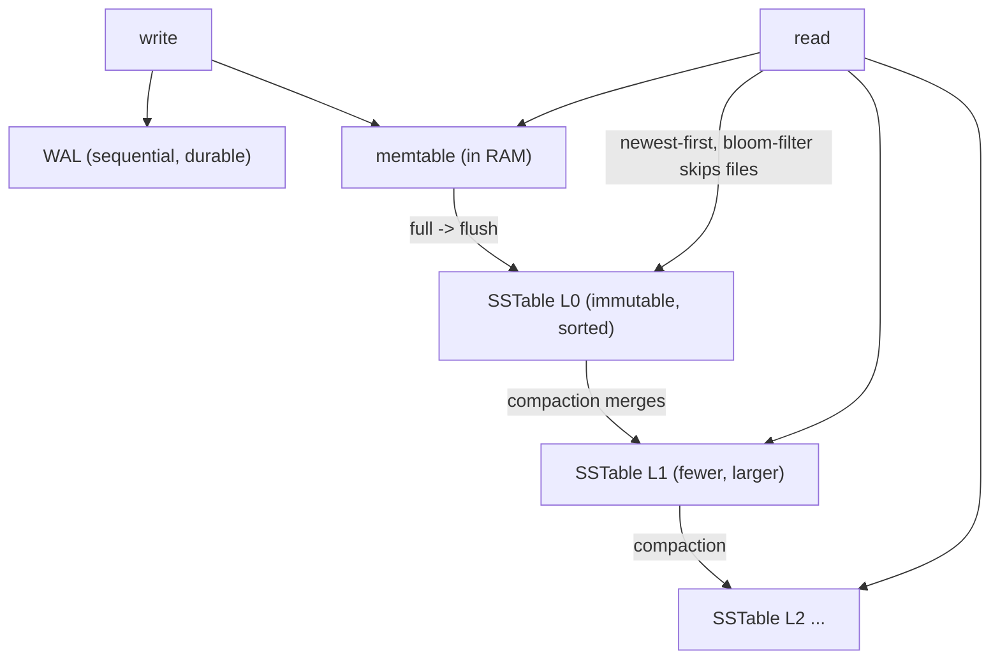

## Thesis

How a database physically lays out data on disk to make reads and writes fast --- the choice of storage engine --- which comes down mostly to two families: B-trees (update in place, keep data sorted in fixed pages; read-optimized, the default for relational databases) and LSM-trees (buffer writes in memory, flush sorted immutable files, merge them in the background; write-optimized, used by Cassandra, RocksDB, and column stores); the engine determines the fundamental trade-offs in read, write, and space amplification, so choosing (or understanding) it is choosing where your workload pays --- reads vs writes vs storage.

## Sub

**Why: the on-disk layout is what makes reads/writes fast, and it's a trade** -> **B-trees (in-place, sorted pages, read-optimized)** -> **LSM-trees (append + compaction, write-optimized)** -> **zoom out** to the read/write/space amplification trade and which-engine-when, and the pivots an interviewer rides from "which database" into B-tree vs LSM, the amplifications, and compaction.

## Spine

- The **storage engine** is how a database physically stores and retrieves data on disk --- and the dominant choice is between two families: **B-trees** (data kept sorted in fixed-size pages, updated **in place**) and **LSM-trees** (writes buffered in memory then flushed as sorted **immutable files** and merged in the background); this choice sets the performance profile.
- **B-trees are read-optimized** --- a balanced tree of sorted pages gives `O(log n)` point lookups and efficient range scans, and updates modify the page **in place** (with a **write-ahead log** for crash safety); the cost is that random in-place writes cause **write amplification** (rewriting whole pages) and fragmentation, so writes are more expensive --- which is why B-trees (Postgres, MySQL/InnoDB) dominate **read-heavy / transactional** workloads.
- **LSM-trees are write-optimized** --- writes go to an in-memory **memtable** (fast) plus a WAL, are flushed to **immutable sorted files (SSTables)**, and **compaction** merges those files in the background; this turns random writes into sequential ones (high write throughput), but a read may have to check **multiple files** (so reads lean on **bloom filters** and compaction to stay fast), and compaction itself consumes I/O --- which is why LSM (Cassandra, RocksDB, ScyllaDB) dominates **write-heavy** workloads.
- The engine is a **read/write/space amplification** trade --- **read amplification** (extra reads per query: LSM checks several files), **write amplification** (extra bytes written per update: B-tree rewrites pages, LSM re-writes during compaction), and **space amplification** (extra storage: LSM holds obsolete rows until compaction, B-trees fragment) pull against each other, and **no engine wins all three** (the RUM conjecture) --- so you pick the one whose amplifications your workload can afford.

## Companion Notes

### walk

How data is stored on disk

The physical layout a database uses to make reads and writes fast --- why it's a trade, how a B-tree keeps data in sorted in-place pages (read-optimized), how an LSM-tree buffers and merges immutable files (write-optimized), and why the read/write/space amplifications mean no engine wins everything, so you choose per workload.

Say the fork first --- "two families: B-trees update in place and favor reads; LSM-trees append and compact and favor writes." Everything else (compaction, bloom filters, the amplifications) is the consequence, and the punchline is the RUM trade: you can't optimize reads, writes, and space all at once.

### drill

Probe Drill

Graded follow-ups on the B-tree/LSM fork, compaction, the three amplifications, and columnar storage --- the ones that separate "Postgres uses B-trees" from reasoning about which physical layout fits a workload and what it costs.

Name the fork and the trade: B-tree = sorted in-place pages, read-optimized; LSM = memtable -> immutable SSTables -> background compaction, write-optimized; and read vs write vs space amplification pull against each other (RUM), so you pick the one whose cost your workload affords.

### wb

Whiteboard

Rebuild both engines from memory --- the B-tree write path, the LSM write and read paths, what compaction actually does, and where the three amplifications land.

Draw the fork first, then hang everything off it. If you can sketch memtable -> SSTable -> compaction and say what each step costs, you can answer almost any storage-engine question from the diagram.

### sys

System Map

Zoom out: the engine sits under the query layer and on top of the memory hierarchy --- and the pivots run out to sharding, replication, bloom filters, and the OLAP store.

Lead with the layer, not the data structure --- "the engine is what the query layer asks for a row, and what the disk gets asked for in return." The physical layout is the middle of a stack, not the whole story.

### trade

Trade-offs

The calls: B-tree vs LSM, size-tiered vs leveled, row vs column, in-place vs copy-on-write, fsync-per-commit vs group commit, and how much RAM you hand to bloom filters.

Always name what you pay. Every one of these buys one amplification with another --- if you can't say what got worse, you haven't named the trade, you've named a preference.

### model

Model Answers

Full spoken scripts --- picking the engine, walking a write to disk, debugging a write stall, defending the choice, and naming the limits.

Steal the frame, not the words. Open on the fork and the trade ("no engine wins all three"), and land on the access pattern --- the layout must follow how you read and write, not the other way round.

### num

Numbers

Back-of-envelope the thing that actually decides it: how many bytes hit the disk per byte your application writes, and whether the device can take it.

Lead with write amplification, not the write rate. 10 MB/s of logical writes becomes 150-300 MB/s of physical writes at a measured 15-30x --- and in a B-tree that page-rewrite cost is a worst case the buffer pool coalesces away while the working set fits in RAM. The questions are whether those bytes land sequentially or randomly, and whether compaction has headroom.

### rf

Red Flags

What sinks the round --- "LSM is just faster," "a delete removes the row," "bloom filters make reads as fast as a B-tree," "just add an index."

Name what the interviewer hears. "Bloom filters fix the read path" is the fastest tell you've never watched a range scan crawl through a million tombstones.

### open

30-Second

The opener and the close --- the fork, the trade, and the one line that says you understand the conservation law underneath.

Match the altitude. Open on "two families, and it's a trade," not on skip lists and SSTables --- mechanism is the second question, not the first.

## Drill

all | **All four levels, mixed** --- the way a real loop actually comes at you.
SDE2 | the two families and the WAL
SDE3 | compaction, amplifications, and columnar
Staff | the RUM trade, tombstones, and OLAP

### SDE2 | what a storage engine is

What is a storage engine and why does it matter?

A **storage engine** is the component of a database that decides **how data is physically stored on disk and retrieved** --- the on-disk data structures and algorithms for writing, reading, updating, and deleting records (and their indexes). It matters because the *physical layout* is what determines the database's real performance characteristics: how fast writes are, how fast point lookups and range scans are, how much extra I/O each operation costs, and how much storage the data takes. The same logical data (rows in a table) can be laid out very differently on disk, and that choice makes a database good at some workloads and bad at others. Crucially, it's a **trade-off, not a free optimization** --- an engine tuned for fast writes tends to pay on reads or storage, and vice versa. So understanding the storage engine (or choosing a database by its engine) is really about matching the *physical* design to your *access pattern* --- and the dominant, interview-relevant split is between two engine families, B-trees and LSM-trees, which sit at opposite ends of the read-vs-write trade.


Follow: You said the same rows can be laid out differently. What actually changes for the application?
**Nothing in the interface; everything in the cost.** The SQL is identical, the API is identical --- what changes is the *cost profile* of each operation. The same `INSERT` is a random in-place page write on a B-tree and a memtable append on an LSM; the same point `SELECT` is one short traversal on a B-tree and a bloom-filter-guided walk across several files on an LSM. So the application cannot tell by reading the code --- it finds out **under load**: the write ceiling it hits, the shape of its read-latency tail (an LSM's p99 is spikier because compaction competes for I/O), and how much disk the same data occupies. The engine is **invisible at the interface and decisive in the operating envelope**.

Follow: If it is just a trade, why do databases ship with one engine instead of letting me pick per table?
Some do --- MySQL is genuinely pluggable (InnoDB, MyRocks, MyISAM) --- but mostly because **the engine's properties bleed upward**. MVCC semantics, transaction isolation, which index types exist, crash recovery, and above all the **query planner's cost model** are all built on assumptions about what the engine makes cheap. Swap the engine and you have to re-derive all of it. So in practice "choosing an engine" means **choosing a database whose engine matches your access pattern** --- and the cases where a team really does swap (Meta moving from compressed InnoDB to MyRocks for the space and write-amplification win) are deliberate, engineered migrations, not a config flag.
Senior: Framing the engine as **invisible at the interface and decisive in the operating envelope** --- the SQL does not change, the cost profile does --- and knowing the engine's properties bleed up into MVCC, isolation, and the planner (which is why you pick a *database*, not an engine) is the systems framing an interviewer is listening for.
Speak: Lead with what it decides, not what it is: **"the storage engine is how the rows physically sit on disk --- it does not change one line of my SQL, it changes what that SQL COSTS."** Then name the fork immediately --- B-trees update sorted pages in place and favor reads, LSM-trees append and compact and favor writes --- because the trade is the point, not the data structure.

### SDE2 | the two families

What are the two main storage engine families, at a high level?

**B-trees** and **LSM-trees (log-structured merge-trees)**. **B-tree**: keeps data (and indexes) **sorted in fixed-size pages** on disk, organized as a balanced tree, and **updates data in place** (find the page, modify it). It's the classic engine behind most **relational databases** (PostgreSQL, MySQL/InnoDB, SQL Server, Oracle) and is **read-optimized** --- fast lookups and range scans. **LSM-tree**: buffers writes in an **in-memory structure (the memtable)**, periodically flushes them to disk as **immutable sorted files (SSTables)**, and **merges those files in the background (compaction)** --- it never updates in place; it appends and later reconciles. It's the engine behind many **write-heavy / NoSQL** stores (Cassandra, ScyllaDB, RocksDB, LevelDB, HBase) and is **write-optimized** --- very high write throughput. The essential contrast: B-trees update **in place** and are **read-optimized**; LSM-trees are **append-only + background-merge** and are **write-optimized**. Almost every storage-engine question reduces to understanding this fork and its consequences (compaction, the amplifications, when to use which).


Follow: You said an LSM "never updates in place." Then how does an UPDATE actually work?
An update is simply a **write of a newer version**. It goes to the memtable with a higher sequence number, flushes into a new SSTable, and now **two versions of the key exist in different files**. The read resolves it by taking the **newest** (that is exactly why the search runs newest-first, and why a compaction merge keeps the newest and discards the rest). The old version is **dead data occupying disk** until a compaction physically drops it --- which is precisely where LSM **space amplification** comes from. It is the same mechanism as a delete, which writes a *tombstone* instead of a value. So in an LSM there is only one operation on the write path --- append a new version --- and "update" and "delete" are just two flavors of it, with compaction as the garbage collector.

Follow: Is there anything BETWEEN the two families, or is it a binary choice?
It is a **spectrum**, and naming the middle is a real signal. **B-epsilon / fractal trees** (TokuDB) keep the B-tree shape but **buffer writes inside the internal nodes** and push them down in batches --- B-tree-ish reads with much of the LSM's write batching. **Copy-on-write B-trees** (LMDB, BoltDB, etcd's store) keep the tree but never overwrite a page: they write new copies of the changed pages plus the path to the root, then **atomically swap the root pointer** --- which gets them crash safety **with no WAL at all** and lock-free snapshot readers, paid for with write amplification. And an LSM itself slides along the spectrum by **compaction strategy**: leveled pulls it toward B-tree-like read behavior (low read amp, high write amp), size-tiered pulls it toward pure append. So the two families are the **poles of a continuum**, and the knobs move you along it.
Senior: Knowing the fork is a **spectrum, not a binary** --- fractal trees buffer writes inside a B-tree, copy-on-write B-trees (LMDB) drop the WAL entirely and get snapshot reads for free, and compaction strategy slides an LSM between the poles --- is the read-past-the-blog-post depth that separates a real answer from a memorized one.
Speak: Say the fork in one breath: **"B-trees keep data sorted in fixed pages and update in place --- read-optimized. LSM-trees buffer writes in a memtable, flush immutable sorted files, and merge them in the background --- write-optimized."** If they push, name the middle: fractal trees buffer writes inside a B-tree, copy-on-write B-trees need no WAL at all, and compaction strategy slides an LSM between the two poles.

### SDE2 | B-tree basics

How does a B-tree store and find data?

A B-tree keeps keys **sorted** across **fixed-size pages** (nodes), arranged as a **shallow, balanced tree**: internal pages hold keys and pointers to child pages, and leaf pages hold the actual data (or pointers to it). To **find** a key, you start at the root and follow pointers down through a few levels to the right leaf --- because each page has a high fan-out (hundreds of keys), the tree stays shallow (a handful of levels even for billions of rows), so a lookup is `O(log n)` and typically just a few page reads. Because keys are **sorted**, **range scans** are efficient (find the start, then read sequential leaves). To **update** a key, you locate its leaf page and **modify it in place** (rewrite that page). This in-place, sorted-page design is what makes B-trees excellent for reads: a point lookup is a short, direct path, and ranges are sequential. The tree stays balanced through splits/merges as pages fill or empty. The trade-off (below) is that in-place updates and page rewrites make **writes** more expensive, but for read-dominated and transactional workloads the B-tree's read efficiency is exactly what you want --- which is why it's the default relational engine.


Follow: You said the tree stays shallow. Put a number on it --- how deep is a B-tree over a billion rows?
**Three or four levels.** The arithmetic: an internal node is an 8KB page holding entries of roughly a key plus a child pointer --- call it ~20 bytes --- so it fans out to a **few hundred** children. A few hundred cubed is already tens of millions, and to the fourth power is billions, so a billion rows sits comfortably inside **four levels**. Better still, the **top levels are always cached** --- the root and the level below it are the hottest pages in the buffer pool --- so a point lookup is typically **one or two real disk reads**, not four. That is the actual reason B-tree reads are fast: high fan-out makes the tree shallow, and caching makes the shallow tree nearly free.

Follow: Real databases use a B+tree, not a B-tree. Does that difference matter here?
Yes --- and it matters exactly where you would want it to: **range scans**. In a **B+tree**, all the data lives in the **leaves** and the internal nodes carry only keys and pointers. That does two things. (1) It **raises the fan-out**, because internal nodes pack more keys when they carry no payload --- so the tree is even shallower. (2) The **leaves are linked together**, so a range scan finds the starting leaf once and then **walks the leaf chain sequentially**, never climbing back up the tree. A classic B-tree stores data in internal nodes too, so a range scan has to traverse up and down. Every serious relational engine uses the B+tree form for precisely those two reasons --- so when someone says "B-tree index" in a database context, they essentially always mean a **B+tree**, and the linked-leaf property is what makes ranges cheap.
Senior: Putting a **number** on the shallowness --- fan-out of a few hundred, so three or four levels for a billion rows, with the top levels always cached so it is really one or two disk reads --- and knowing it is a **B+tree** whose **linked leaves** are what make a range scan a sequential walk, is the concreteness that separates understanding from recall.
Speak: Make it concrete and quantitative: **"high fan-out --- a few hundred children per page --- so a billion rows is three or four levels deep, and the top levels are always cached, so a lookup is really one or two disk reads."** Then the detail that earns the point: it is a B+**tree** --- data only in the leaves, and the leaves are **linked**, which is what turns a range scan into a sequential walk instead of a tree traversal.

### SDE2 | LSM basics

How does an LSM-tree store data?

By **buffering, flushing, and merging** rather than updating in place. (1) A write goes into an **in-memory memtable** (a sorted structure, e.g. a skip list) --- and also to a **write-ahead log** on disk for durability. Because it's an in-memory insert plus a sequential log append, writes are **very fast**. (2) When the memtable fills, it's **flushed to disk as an immutable, sorted file called an SSTable** (sorted string table) --- written sequentially, never modified again. (3) Over time you accumulate many SSTables, so **compaction** runs in the background: it **merges** SSTables together, combining their sorted data, keeping the newest value for each key, and dropping obsolete/deleted entries --- producing fewer, larger, cleaner files. Reads check the memtable and then the SSTables (newest first) to find a key's current value. The defining properties: writes are **sequential appends** (no random in-place I/O), files are **immutable** (so no in-place updates, no locking of existing data), and **compaction** is the background process that keeps the file count and obsolete data under control. This append-then-merge design is what makes LSM-trees excellent for **writes** --- you never pay the random-write cost of updating in place; you append fast and reconcile later.


Follow: The memtable is in RAM. What happens to it on a crash --- and why is that not data loss?
It is **rebuilt from the WAL**. Every write goes to the write-ahead log *and* the memtable, so the memtable is nothing but an in-memory view of the log's tail. On restart the engine **replays the WAL** from the last flushed point and reconstructs the memtable exactly. The moment a memtable is flushed to an SSTable, the WAL segment covering it can be **discarded** --- which is what keeps the log bounded rather than growing forever. So the memtable is fast *because* it is in RAM and safe *because* the log is the durable copy: together they give you in-memory write speed with an on-disk durability guarantee. With the usual honest caveat --- "durable" only extends as far as your **fsync policy** actually forces to disk.

Follow: Writes keep arriving while the memtable is being flushed. Does the engine block?
No --- it **rotates**. When the active memtable hits its size threshold it is marked **immutable** and a **new active memtable** immediately takes the incoming writes, while a background thread flushes the immutable one to an SSTable. Reads check the active memtable, then any immutable ones still awaiting flush, then the SSTables. So flushing is **off the write path** entirely. The failure mode is when flush --- or the compaction behind it --- **cannot keep pace**: immutable memtables accumulate, the engine hits its limit on how many it will hold, and only *then* does it **throttle and stall writes**. That is the LSM's characteristic latency cliff, and the important nuance is what causes it: the engine does not block on a flush, it blocks when it has **run out of room to defer**.
Senior: Knowing the memtable is **rotated, not blocked** --- active becomes immutable, a new active one takes writes, a background thread flushes --- and that the write stall only arrives when flush and compaction cannot keep pace and the engine **runs out of room to defer**, is the mechanism-level detail that shows you have operated one rather than read about one.
Speak: Trace the write in one breath: **"it goes to the WAL and the memtable --- a sequential append plus an in-memory insert, so it is fast; a full memtable becomes immutable and a background thread flushes it as one sorted immutable SSTable; compaction merges SSTables later."** Then the detail that lands it: the memtable **rotates rather than blocks** --- and the dreaded write stall only comes when compaction cannot keep up and the engine runs out of room to defer.

### SDE2 | why read-optimized vs write-optimized

Why are B-trees read-optimized and LSM-trees write-optimized?

It comes down to **where each does its work**. A **B-tree write** must find the key's page and **update it in place** --- a **random write** of a whole page (plus a WAL write), and if the page is on disk it's a read-modify-write; random in-place writes are relatively expensive. But a **B-tree read** is a short, direct traversal to one page --- cheap and predictable. So the B-tree front-loads cost onto writes and keeps reads fast: **read-optimized**. An **LSM write** just appends to an in-memory memtable and a sequential log --- no random I/O, no touching existing data, so writes are **extremely cheap and high-throughput** (sequential writes are far faster than random ones, especially the deferred flush of a whole sorted file at once). But an **LSM read** may have to look in the memtable *and* several SSTables (since a key's latest value could be in any of them), so reads can touch **multiple files** --- more work per read. So LSM defers and batches write cost (sequential appends + background compaction) at the expense of read cost: **write-optimized**. The one-line intuition: B-trees pay on writes (random in-place page updates) to keep reads a single short lookup; LSM-trees pay on reads (checking multiple files) to keep writes cheap sequential appends. That's the fundamental read-vs-write trade the two families embody.


Follow: You keep saying sequential beats random. On a modern NVMe SSD, with no seek time, is that still true?
The gap **narrows but does not close**, and the reason moves from mechanics to the drive's internals. On a spinning disk the answer was seek time. On an SSD there is no seek, and random *reads* are genuinely fast --- hundreds of thousands of IOPS. But random **writes** still hurt, because flash **cannot overwrite in place**: the **flash translation layer** must write to a fresh page, remap it, and later **garbage-collect** the partially-invalidated erase blocks. So scattered small writes generate write amplification and GC work *inside the drive*, while large sequential writes align to erase blocks and keep the drive's own amplification low. So the LSM's write advantage is smaller on NVMe than it was on spinning rust, but it is still real --- it has simply **moved from latency to endurance and sustained throughput**. "SSDs made this obsolete" is the wrong answer; "the gap narrowed and relocated to the FTL" is the right one.

Follow: If the B-tree's hot pages are in the buffer pool, is the "random write" cost imaginary? The write goes to RAM.
That is the right instinct, and it is **half true**. A B-tree write does land in the **buffer pool** and the transaction is acked as soon as the **WAL** is fsynced --- the page write itself is deferred and, crucially, **coalesced**: if the same page is dirtied fifty times before it is flushed, it is written **once**, not fifty times. So the naive "8KB per row update" is a **worst case, not the steady state**. Two things keep the cost real anyway. (1) The working set has to **fit**: once the write set exceeds the buffer pool, a page must be **evicted and re-read before it can be modified**, and you are back to genuine **read-modify-write random I/O**. (2) The checkpoint that flushes dirty pages is still a burst of random writes. So the honest form is: **buffer-pool coalescing makes B-tree writes far cheaper than the page arithmetic suggests --- while the working set fits in RAM --- and the LSM's advantage lives precisely at the point where it stops fitting.**
Senior: Refusing both lazy versions --- "SSDs made sequential-vs-random obsolete" (it relocated to the FTL and endurance; it did not vanish) and "a B-tree writes 8KB per row" (the buffer pool coalesces; the cost is only real once the working set stops fitting) --- is the calibrated, hardware-grounded reasoning that reads as clearly senior.
Speak: Give the mechanism, not the slogan: **"a B-tree write must find the key's page and rewrite it in place --- a random, page-sized write. An LSM write is an append to a memtable and a log --- sequential --- and it defers all the reorganizing to compaction."** If they push on SSDs, do not fold: the gap narrowed but it **moved to the flash translation layer and endurance**; it did not disappear.

### SDE2 | the write-ahead log

What is a write-ahead log and why do both engines use one?

A **write-ahead log (WAL)** is an append-only log on disk to which a change is written **before** it's applied to the main data structure --- the "write ahead" ordering. Its purpose is **durability and crash recovery**: because the change is durably recorded in the log first, if the database **crashes** before the change reaches (or is fully persisted to) the main structure, on restart it can **replay the log** to recover any committed changes that hadn't been fully applied --- so no acknowledged write is lost, and the data structure is brought back to a consistent state. Both engines use it, for the same reason but at slightly different points: a **B-tree** writes the change to the WAL, then updates the page in place (so a crash mid-update is recoverable by replaying the log --- this also protects against a torn/partial page write); an **LSM-tree** writes to the WAL *and* the in-memory memtable (so a crash before the memtable is flushed to an SSTable is recoverable by replaying the log to rebuild the memtable). The WAL is what lets both engines acknowledge a write as durable **before** doing the slower work of updating the on-disk structure --- which is central to performance (sequential log append is fast) *and* durability. (This is also where the fsync/durability-vs-latency trade lives: how aggressively you flush the WAL to disk.)


Follow: The WAL is "durable." What does durable actually mean --- when has the database really not lost my commit?
When the log record has been **fsynced** --- forced out of the OS page cache *and* the drive's volatile cache onto stable media. A plain `write()` only copies bytes into the kernel's page cache; lose power there and the commit is gone. So **"committed" means "the WAL record is fsynced,"** which is why **commit latency is fsync latency**, not data-write latency. The knobs make the trade explicit --- Postgres's `synchronous_commit`, InnoDB's `innodb_flush_log_at_trx_commit` --- letting you fsync every commit (durable, slower) or batch/defer it (faster, with a **bounded data-loss window**, typically the last second of acknowledged writes). Engines amortize the cost with **group commit**: many concurrent transactions ride a single fsync. So durability is not a property you have --- it is a **policy you chose**, and the honest answer names the loss window you accepted.

Follow: So why write the change TWICE --- once to the log, once to the structure? Is that not pure overhead?
Because the two writes have completely different **costs and jobs**. The log write is a **small, sequential append to one file** --- fast, and the *only* thing on the commit's critical path. The structural write is **random and page-sized** (a B-tree page anywhere on disk) or **large and deferred** (an SSTable flush) --- slow, and ruinous to do synchronously on every commit. So the WAL lets you make a commit durable at the **speed of a sequential append**, then apply the expensive structural change **lazily and in batches** (a checkpoint flushing many dirty pages at once, or a memtable flushing one big sorted file). The "extra" write buys three things: commit latency set by a cheap sequential append instead of a random page write; batched, amortized structural updates; and crash recovery. **You write twice so that the write on the critical path is the cheap one.**
Senior: Defining durable as **"fsynced, not written"** --- so commit latency *is* fsync latency --- and framing the WAL as *paying a cheap sequential write on the critical path so the expensive random one can be deferred and batched*, while naming the actual knobs and the loss window they buy, is the durability literacy a senior round is built to test.
Speak: Define it precisely: **"the WAL is an append-only log written BEFORE the change reaches the main structure, so a crash is repaired by replaying it."** Then the line that earns the point: **"durable" means fsynced, not written** --- and relaxing that fsync buys latency at the price of a bounded data-loss window you chose. You write twice so the write on the critical path is the **cheap sequential one**.

### SDE2 | an example

Which real databases use which engine, and what does that tell you?

**B-tree engines**: **PostgreSQL**, **MySQL/InnoDB**, SQL Server, Oracle, and most traditional relational databases --- and it tells you they're built for **read-heavy, transactional (OLTP)** workloads with rich queries, range scans, and strong consistency, where read efficiency and in-place updates matter. **LSM engines**: **Cassandra** and **ScyllaDB** (wide-column NoSQL), **RocksDB** / **LevelDB** (embedded key-value engines, and RocksDB underlies many systems), **HBase**, and it's used inside many write-heavy systems --- telling you they're built for **write-heavy / high-ingest** workloads (time-series, event streams, logging, high-volume key-value) where sustaining a huge write rate matters more than the fastest possible read. **Column stores** like **ClickHouse** use an LSM-family merge-tree *and* a **columnar** layout --- built for **analytics (OLAP)**: massive scans, aggregations, and heavy compression. So knowing a database's engine tells you its natural workload: if I see Postgres, I expect transactional read-heavy use; if I see Cassandra, I expect write-heavy ingest; if I see ClickHouse, I expect analytical scans. And choosing a database *is* substantially choosing a storage engine to match your access pattern --- the engine is why "use Cassandra for high write throughput" or "use Postgres for transactional consistency" are sound defaults.


Follow: MySQL can run InnoDB (B-tree) or MyRocks (LSM) under the same SQL. Why would anyone actually switch?
Because for a large, write-heavy, space-constrained workload the LSM wins on the two axes that cost real money: **space and write amplification**. Meta migrated their main user database from compressed InnoDB to **MyRocks** (RocksDB under MySQL) and reported roughly **half the storage** and a large drop in write amplification --- which at their scale means fewer machines and longer-lived flash. The mechanism is exactly the theory: an LSM packs data into **tightly-packed immutable sorted files** (better compression, no half-full pages, no fragmentation) and its writes are **sequential** rather than random in-place page rewrites. What they gave up is the B-tree's read profile --- more variable read latency, reads that may touch several levels. It is a clean, real-world instance of the trade: they **paid read predictability to buy space and endurance**, because their workload could afford it.

Follow: Where does an engine like SQLite or LMDB fit --- neither is Postgres or Cassandra.
They are **B-tree engines built for embedded, single-writer use**, and **LMDB** is the interesting one because it is a genuinely different design point. SQLite is a straightforward B+tree with a WAL. LMDB (and Go's BoltDB, and etcd's store) is a **copy-on-write B+tree**: it never modifies a page in place --- it writes **new copies** of the changed pages and the whole path up to the root, then **atomically swaps the root pointer**. The consequences are elegant: there is **no WAL at all** (the root swap *is* the commit), readers are **lock-free** and see a consistent snapshot (MVCC for free, since the old pages are still intact until reclaimed), and crash recovery is trivial because the previous root is still valid. The price is **write amplification** --- every write rewrites the entire path to the root --- plus a free-page list to reclaim old pages, and only **one writer at a time**. So it sits at a third corner of the RUM triangle: it trades write amplification for crash-safety-without-a-log and free snapshot reads.
Senior: Reaching past the two-column table to a **real migration with numbers** (Meta's InnoDB to MyRocks: roughly half the storage and far lower write amplification, paid for with read predictability) and a **third design point** (LMDB's copy-on-write B+tree: no WAL, lock-free snapshot readers, paid for with write amplification) is the depth that shows you understand the trade rather than the taxonomy.
Speak: Map engine to workload out loud: **"Postgres and InnoDB are B-trees --- transactional, read-heavy. Cassandra, RocksDB, ScyllaDB are LSM --- write-heavy ingest. ClickHouse is columnar on a merge-tree --- analytics."** Then the tell that you have gone deeper: MySQL can run **either** --- MyRocks is RocksDB under MySQL, and Meta switched for roughly half the storage and far lower write amplification, paying read predictability for it.

### SDE3 | the LSM read path

Walk through an LSM read --- why can it be slower, and how is it kept fast?

An LSM read must find the **current** value of a key, which could be in the memtable or in any SSTable (newer values shadow older ones), so it searches **newest-to-oldest**: (1) check the **memtable** (in memory --- fast); (2) if not found, check the SSTables, **most-recent first**, because the newest SSTable holds the latest value. Naively this means checking **many files** per read --- that's the **read amplification** that makes LSM reads potentially slower than a B-tree's single traversal. It's kept fast by several mechanisms: (1) **Bloom filters** --- each SSTable has a compact probabilistic filter that answers "is this key *definitely not* here?"; a read consults the bloom filter for each SSTable and **skips** the ones that certainly don't contain the key, so it only actually reads the few files that might --- this is the key optimization that cuts read amplification dramatically. (2) **Sorted files + sparse index** --- each SSTable is sorted with a sparse in-memory index, so *within* a file, locating the key is a quick seek (no full scan). (3) **Compaction** --- by merging SSTables into fewer, larger files (and dropping obsolete entries), compaction reduces the number of files a read must consider. (4) **Block cache** --- frequently-read SSTable blocks are cached in memory. So the LSM read path is "memtable, then bloom-filter-guided SSTable lookups, newest first," and the combination of bloom filters (skip files that lack the key), sorted files (fast in-file lookup), and compaction (fewer files) is what keeps reads acceptably fast despite the multi-file structure. The residual truth is that LSM reads still generally do *more* than a B-tree's single short traversal, which is the read-amplification cost of the write-optimized design.


Follow: Bloom filters skip the files that lack the key. Do they help a RANGE scan?
**No --- and that is the sharpest limitation in the entire read path.** A bloom filter answers exactly one question: *"is this specific key definitely absent?"* It cannot answer *"does this file contain any key between A and B"* --- there is no such query against a bloom filter. So a **range scan can skip nothing by filter**: it must open **every SSTable whose key range overlaps the scanned range** and merge them, newest-first, to resolve each key. That is the structural reason LSM range scans are more expensive than a B+tree's (which just walks a linked leaf chain), and why **range-heavy workloads still lean B-tree even when the write rate is high**. Partial mitigations exist --- leveled compaction keeps L1 and below non-overlapping so only one file per level overlaps; each SSTable's min/max key bounds let you skip non-overlapping files; RocksDB's **prefix** bloom filters help *prefix* seeks specifically --- but general range scans get **no help from bloom filters**, and it is exactly this precision an interviewer is listening for.

Follow: You said reads go newest-to-oldest. Why not check all the files in parallel and take the newest hit?
You can, and some engines will --- but it usually **loses**. Searching newest-first lets you **stop at the first hit**, and because the newest levels are small, hot, and cached, most reads for recently-written keys terminate almost immediately. Fanning out to every level in parallel does **strictly more I/O on every read** (you pay for all the levels even when L0 would have answered) --- so it trades **throughput for tail latency**. It genuinely makes sense only when you already know the read will go deep (the bloom filters said "maybe" at several levels) *and* you care about p99 far more than total I/O. The deeper point is the one worth saying: **correctness comes from the newest-wins rule, not from the search order.** If you do query in parallel, you must still resolve the winner by **sequence number**, not by whoever replies first. Order is an optimization; **recency is the semantics.**
Senior: Knowing that **bloom filters do nothing for range scans** --- they answer "is this key absent," never "any key in this range," so a scan must merge every overlapping SSTable, which is the structural reason range-heavy workloads lean B-tree --- is the single most precise and most differentiating thing you can say about the LSM read path.
Speak: Walk it, then qualify it: **"memtable first, then SSTables newest-first --- a bloom filter per file lets the read skip the ones that definitely lack the key, so it only opens the few that might."** Then the line that separates you: **bloom filters only help POINT lookups.** A range scan cannot ask "any key in this range," so it must merge every overlapping file --- which is why range-heavy workloads still lean B-tree.

### SDE3 | compaction

What is compaction, why is it necessary, and what does it cost?

**Compaction** is the background process that **merges SSTables** --- taking several sorted immutable files and combining them into fewer, larger sorted files, keeping only the **newest value** for each key and **discarding superseded/deleted entries** (and tombstones past their grace period). It's **necessary** for three reasons: (1) **Read performance** --- without it, SSTables accumulate endlessly and every read must consider more and more files (read amplification grows unbounded); compaction keeps the file count down. (2) **Space reclamation** --- because LSM never updates in place, an updated or deleted key leaves its **old versions** sitting in older SSTables (dead data); compaction is what actually **removes** them and reclaims the space (otherwise space amplification grows). (3) **Keeping data sorted/organized** for efficient reads. The **cost** is significant: compaction **reads and rewrites large amounts of data** in the background --- so it consumes **disk I/O, CPU, and write bandwidth** (this is the LSM's **write amplification**: a byte written once to the memtable gets rewritten several times as it's compacted through levels). This creates real operational tension: compaction competes with foreground reads/writes for I/O, and if it can't keep up with the write rate, SSTables pile up (reads slow down, space bloats) or the database throttles writes (**write stalls**). So compaction is the essential background maintenance that makes LSM's write-optimized design *sustainable* for reads and space --- but it's also the source of LSM's write amplification and a common operational pain point (tuning compaction to keep pace without starving foreground traffic).


Follow: Compaction reclaims space --- but you also said it NEEDS space to run. Explain that, and what happens on a full disk.
Compaction works by **reading input SSTables and writing new output SSTables**, and it can only delete the inputs once the outputs are safely written. So while it runs, **both are on disk at once** --- it needs headroom roughly the size of its output (and for a big size-tiered merge of large files, that transient spike can be substantial). The failure is a genuine **deadlock**: the disk fills, so compaction cannot write its output, so it cannot delete the obsolete data, so the space is never reclaimed, so the disk stays full --- while un-compacted SSTables keep piling up and driving read amplification up with them. Which yields the rule that catches teams out: **you size the disk to the compaction headroom, not to the logical data size.** It is also why size-tiered (merging huge files, needing a large transient spike) is more dangerous on a tight disk than leveled (merging one file into one level, needing far less).

Follow: Compaction is background I/O. How do you keep it from starving foreground reads and writes?
You **budget it explicitly**, because it is a real resource competition with **symmetric** failure modes. Throttle it too hard and it falls behind: SSTables pile up, read and space amplification climb, and eventually the engine **stalls writes** to let it catch up --- a latency cliff. Let it run flat out and it eats the disk bandwidth and CPU that foreground traffic needs --- p99 spikes during every compaction. The levers: a **compaction rate limit** (RocksDB's rate limiter, Cassandra's compaction throughput), the **number of compaction threads**, a **strategy** whose write amplification your disk can actually sustain (size-tiered writes far fewer bytes than leveled), and sizing the hardware so the steady-state compaction write rate --- **ingest x write amplification** --- fits comfortably inside the device's *sustained* write bandwidth with headroom to catch up after a burst. The discipline is treating **compaction throughput as a provisioned capacity input**, not a background detail.
Senior: Treating **compaction as a provisioned capacity input** --- ingest x write-amplification is a disk-bandwidth requirement, and it needs free-space headroom to write its outputs, so a full disk can **deadlock** it (no room to compact, so no space reclaimed, so still no room) --- is the operational depth that separates someone who has run an LSM from someone who has read about one.
Speak: Say what it is for, then what it costs: **"compaction merges SSTables into fewer, larger sorted files, keeps the newest value per key, and drops superseded rows and expired tombstones --- that is what bounds read amplification and actually reclaims space."** Then the operational half nobody says: it needs **free-space headroom** to write its outputs (a full disk can deadlock it), and its I/O competes with foreground traffic --- so **ingest x write-amp is a bandwidth number you provision for**.

### SDE3 | the three amplifications

What are read, write, and space amplification?

They're the three ways a storage engine does **more work (or uses more space) than the logical operation strictly requires** --- the metrics the engine trade-off is measured in. **Read amplification** = the number of **actual I/O operations (or bytes read) per logical read**. A B-tree read is low (one short traversal, a few pages); an LSM read is higher (it may check the memtable + multiple SSTables, mitigated by bloom filters). **Write amplification** = the number of **actual bytes written to disk per logical byte written**. A B-tree rewrites a whole page (and the WAL) per update, so a small update writes a full page (and random in-place); an LSM writes the byte once to the memtable/WAL but then **rewrites it multiple times through compaction** as it merges up through levels --- both amplify writes, differently. **Space amplification** = the **ratio of actual storage used to the logical data size**. A B-tree has some overhead (partially-full pages, fragmentation); an LSM temporarily holds **obsolete versions and deleted entries** (until compaction removes them) plus duplicate keys across levels, so it can use more space transiently. The point of naming them: the three **pull against each other**, and an engine's design is essentially *which amplifications it chooses to pay*. B-trees trade higher write amplification (in-place page rewrites) for low read amplification; LSM-trees trade higher read and space amplification (multiple files, obsolete data) for low **immediate** write cost (deferring write amplification to compaction). You can even tune within an engine (e.g. compaction strategy) to shift the balance. These three amplifications are the vocabulary for reasoning precisely about storage-engine trade-offs.


Follow: Give me numbers. For a 200-byte row on an 8KB-page B-tree, and a 5-level leveled LSM --- what are the write amplifications?
**B-tree, worst case: the page over the row --- 8192 / 200 is about 41x.** A 200-byte update dirties and eventually rewrites a whole 8KB page, plus the WAL record, plus torn-page protection (InnoDB's doublewrite writes every page twice; Postgres's `full_page_writes` puts a whole page image in the WAL on the first touch after a checkpoint). But that is genuinely a *worst case*: the **buffer pool coalesces** repeat writes to the same page, so a page dirtied many times before flushing is written once --- the real figure is far lower **while the working set fits in RAM**. **LSM, leveled:** a byte is written once on flush, then rewritten at each level transition, and each transition merges it against a level ~10x larger --- so the amortized cost is roughly **the fan-out per transition**, putting a 5-level tree on the order of **tens of x** (measured RocksDB write amplification is commonly quoted in the **10-30x** range, lower than the naive product because not all data reaches the bottom level). The punchline: **the two land in the same ballpark by completely different routes** --- but the LSM's are **large and sequential** and the B-tree's are **small and random**, which is why the LSM sustains an ingest rate the B-tree cannot.

Follow: Which of the three actually bites first in production --- and how would you even measure it?
Usually **write amplification**, because it is the one that silently spends a *finite* budget. It consumes the device's **sustained write bandwidth** (competing directly with foreground traffic) and it burns **SSD endurance** --- so it shows up months later as a worn-out drive or a throughput ceiling nobody can explain. You measure it directly: **bytes actually written to the device** (the engine's own compaction/flush counters, or `iostat`, or the drive's SMART total-host-writes) **divided by the bytes your application logically wrote**. Read amplification you measure as I/O operations or SSTables touched per logical read --- and a *climbing* read amp is the **early warning that compaction is losing the race**. Space amplification is easiest of all: **on-disk bytes over logical bytes**, and a rising number means obsolete versions and tombstones are not being reclaimed. The senior habit is that all three are **instrumented and alarmed**, not inferred: write amp against the disk's write budget, read amp as the leading indicator, space amp as the thing that will one day fill the disk and deadlock compaction.
Senior: Putting **arithmetic** on it --- an 8KB page over a 200-byte row is ~41x worst case *but the buffer pool coalesces*; a leveled LSM is roughly fan-out per level transition, tens of x, measured 10-30x --- and knowing **write amplification bites first** because it silently spends disk bandwidth and SSD endurance, is exactly the quantitative depth a senior round rewards.
Speak: Name all three crisply: **"read amp --- I/O per logical read. Write amp --- bytes written per logical byte. Space amp --- disk used over logical size."** Then the framing: they **pull against each other**, so an engine is a *choice of which to pay*. If they want numbers: an 8KB page over a 200-byte row is ~41x worst case for a B-tree; a leveled LSM is roughly the fan-out per level, tens of x. **Same ballpark --- but the LSM's are sequential and the B-tree's are random.**

### SDE3 | B-tree write amplification

Where does a B-tree's write cost come from?

From **in-place page rewrites plus the WAL**, and the randomness of those writes. When you update (or insert) a single row: (1) the change is first written to the **WAL** (one write), then (2) the corresponding **page is modified in place** --- and because pages are the unit of I/O, updating even a few bytes means **rewriting the whole page** (a page might be 8KB, so a 100-byte update writes 8KB). (3) These page writes are **random** (the page could be anywhere on disk), and random writes are far slower than sequential ones (especially on spinning disks, and they cause more wear/less efficiency on SSDs). (4) Inserts can trigger **page splits** (when a page is full, it splits into two, rewriting more pages and possibly propagating up the tree). (5) There's also the classic **double-write** concern: to protect against **torn pages** (a partial page write during a crash), some engines (e.g. InnoDB's doublewrite buffer) write the page twice, further amplifying. So a B-tree's write amplification comes from: WAL write + full-page in-place rewrite (page-sized, regardless of change size) + random-I/O cost + occasional splits + torn-page protection. This is why B-trees are relatively **write-expensive** --- each logical write becomes at least a page-sized, random, in-place write (plus log). It's the flip side of their read efficiency, and exactly the cost that LSM-trees avoid by appending sequentially and deferring the reorganization to compaction (trading it for compaction's own, different, write amplification).


Follow: You mentioned torn pages. Why is a partial page write so bad, and how do Postgres and InnoDB each solve it?
Because a page is the engine's **atomic unit of meaning** but not the disk's atomic unit of **writing**. An 8KB or 16KB page spans several device sectors, so if power dies mid-write you can be left with a page that is **half old and half new** --- structurally corrupt. And the WAL **cannot repair it**, because the log holds a *delta* ("change these bytes in page P"), and applying a delta to a corrupted page produces garbage. The two engines attack it from opposite ends. **Postgres** uses `full_page_writes`: the **first** modification of a page after each checkpoint writes the **entire page image** into the WAL, so recovery restores the whole page from the log and replays deltas on top. **InnoDB** uses the **doublewrite buffer**: every page is written first to a contiguous scratch area and only then to its real home --- if the real write tears, recovery finds the intact copy. Both are **pure write-amplification taxes paid for crash safety**, and both can be turned off if the device offers genuinely atomic page writes --- which is exactly why those settings exist.

Follow: Postgres is MVCC --- an UPDATE writes a new row version. Does that not break "B-trees update in place"?
It complicates it, and getting this right is a real signal. "Update in place" describes the **B-tree structure** --- pages are found and modified where they sit, rather than appended and merged later. But Postgres's **MVCC** means a row `UPDATE` writes a **new heap tuple** and marks the old one dead rather than overwriting the row's bytes. Two consequences follow. (1) Those dead tuples are garbage that **VACUUM** must reclaim --- if autovacuum falls behind you get **bloat** (the B-tree world's version of space amplification) and, at the extreme, transaction-ID **wraparound**, where Postgres refuses writes to protect itself. (2) Unless the update qualifies as a **HOT (heap-only tuple)** update --- same page, no indexed column changed --- **every index on the table gets a new entry**, so updating a row on a table with five indexes writes into five B-trees. That **index write amplification** is one of Postgres's genuine costs, and it is precisely why "just add an index" is never free. InnoDB does it differently: it updates the row **in place** in the clustered index and pushes the old version into an **undo log** that a purge thread cleans up. So the *structure* is updated in place in both --- Postgres just layers MVCC versioning on top, and VACUUM is the price.
Senior: Knowing why a **torn page cannot be repaired by the WAL alone** (the log holds deltas, not page images) and naming both real defenses (**Postgres `full_page_writes`** vs **InnoDB's doublewrite buffer**) --- plus that Postgres's **MVCC** adds dead tuples, VACUUM, and per-index write amplification on top of the B-tree --- is engine-internals depth that unambiguously reads as senior.
Speak: Source the cost precisely: **"a page is the unit of I/O, so a 200-byte update rewrites a whole 8KB page --- at a random location --- plus the WAL, plus page splits, plus torn-page protection."** Then the detail that lands it: the **WAL cannot fix a torn page on its own** (it stores deltas), which is why Postgres writes full page images after a checkpoint and InnoDB keeps a doublewrite buffer --- both pure write-amp taxes paid for crash safety.

### SDE3 | when to choose LSM vs B-tree

How do you decide between an LSM and a B-tree engine for a workload?

By the **read/write balance and access pattern** of the workload. Favor an **LSM engine** when the workload is **write-heavy / high-ingest**: high sustained write throughput (time-series, event streams, logging, metrics, high-volume key-value, "append lots of data fast"), where the ability to absorb writes cheaply (sequential appends) matters more than the absolute fastest read, and where writes vastly outnumber reads or reads are mostly recent/point lookups. LSM also tends to **compress better** and use disk efficiently for large datasets. Favor a **B-tree engine** when the workload is **read-heavy or transactional (OLTP)**: lots of point lookups and **range scans**, **read-modify-write transactions**, strong consistency and rich querying, where read latency/efficiency is paramount and the write rate is moderate --- the classic relational-database use case. Also consider: **range queries** favor B-trees (data always fully sorted in place; LSM range scans must merge across files); **predictable read latency** favors B-trees (LSM read latency varies with how many files/compaction state); **write-then-rarely-read** or **write-then-scan-analytically** favors LSM (or columnar). The senior framing: it's fundamentally the **read-vs-write trade** --- if writes dominate and you need to sustain high ingest, LSM; if reads/transactions dominate and you need fast, predictable lookups and ranges, B-tree. And in practice you pick the *database* whose default engine matches (Cassandra/RocksDB for write-heavy, Postgres/MySQL for transactional), rather than swapping engines --- so "which engine" usually means "which database for this access pattern."


Follow: Give me a workload that is write-heavy and STILL wants a B-tree.
Anything write-heavy that is also **transactional, range-scan-heavy, or read-modify-write**. The clean example is a high-volume **ledger or order system**: lots of writes, but each one is a `read-modify-write` inside a transaction (read the balance, check it, update it), it needs strong isolation and multi-row atomicity, and its reads are point lookups and range scans that must be **fast and predictable**. An LSM makes the *write* cheap but makes the **read half of every read-modify-write** slower and more variable, and gives you weaker or more awkward transactional support --- so the **transaction's total cost can be worse** even though the raw write is cheaper. The rule I would actually state: an LSM wants **write-heavy AND read-light-or-recent AND scan-tolerant**. The moment writes are entangled with reads (transactions, uniqueness checks, foreign keys) or the reads are range-heavy and latency-sensitive, the B-tree wins back exactly the ground the LSM gained. **"Write-heavy" alone is not enough to pick an engine.**

Follow: The interviewer says "we need both --- high ingest AND fast range queries." What do you actually do?
You stop trying to make **one engine** do both, because that is the RUM trade telling you no. Three real moves, in order of preference. (1) **Split by access pattern**: an LSM (or columnar) store absorbs the ingest, and a B-tree store or an indexed materialized projection serves the range queries, fed by **CDC**. Each layout gets the workload it is optimal for; the price is a pipeline and eventual consistency between them. (2) **Model the range away**: very often the "range query" is really a *known access path* --- recent events per user, a time window per device --- so you design the **key** to make that range a **contiguous scan** (partition by entity, cluster by time, run time-window compaction). LSM ranges are only structurally expensive when they must merge across many overlapping files; a well-chosen key makes the hot ranges cheap and the problem quietly disappears. (3) **Tune the LSM toward reads**: leveled compaction, bigger bloom filters, a fat block cache --- accepting the higher write amplification. The senior answer names (1) as the honest architecture and (2) as the one that most often dissolves the problem --- rather than pretending a single engine is optimal at both.
Senior: Refusing "write-heavy therefore LSM" as a reflex --- naming the workloads that are write-heavy but still want a B-tree (**read-modify-write transactions, uniqueness checks, latency-sensitive range scans**) --- and, when asked for both, **splitting by access pattern via CDC or designing the key so the hot range is contiguous**, rather than pretending one engine wins both, is the trade-off judgment a senior round exists to find.
Speak: Give the rule, then immediately the exception: **"write-heavy, high-ingest, mostly-recent or point reads --- LSM. Read-heavy, transactional, range scans, predictable latency --- B-tree."** Then the line that shows judgment: **write-heavy alone does not pick it** --- if the writes are read-modify-write inside transactions, or the reads are range-heavy, the B-tree wins the ground back. And if they genuinely need both, **split by access pattern**; do not pretend one engine does both.

### SDE3 | how LSM keeps reads fast

Beyond bloom filters, what keeps LSM reads from degrading?

A combination of **structure, filtering, caching, and maintenance**. (1) **Bloom filters** (the headline) --- per-SSTable probabilistic filters let a read skip files that definitely don't contain the key, so it reads only the few that might. (2) **Leveled compaction** --- organizing SSTables into **levels** where each level's files have **non-overlapping key ranges** (except the top level) means a read for a given key needs to check **at most one file per level** (the file whose range covers the key), bounding read amplification to roughly the number of levels rather than the total file count. (3) **Sorted files + sparse indexes** --- each SSTable is sorted and has an in-memory sparse index (and block-boundary offsets), so locating a key *within* a file is a quick binary-search-and-seek, not a scan. (4) **Block cache** --- hot SSTable data blocks are cached in RAM, so frequently-read keys avoid disk entirely. (5) **The memtable** absorbs the very newest data in memory, so reads of recent keys are fast. (6) **Compaction** continuously reduces the number of files and drops dead data, keeping the read cost from growing. So the answer to "won't LSM reads get slow with many files?" is: leveled compaction bounds files-per-read to ~the number of levels, bloom filters skip the irrelevant ones, sparse indexes make in-file lookup fast, and the block cache serves hot data from memory --- together keeping reads acceptably fast. The honest caveat remains that this is *more machinery* than a B-tree's single traversal, and read latency is more variable (depends on compaction state and how many levels a key spans), which is the residual read-amplification cost of the write-optimized design.


Follow: Leveled compaction bounds it to one file per level. So why does L0 get special treatment?
Because **L0 is the one level whose files overlap.** L0 files are direct memtable flushes --- each is internally sorted, but their key ranges overlap each other freely, so the same key can live in several L0 files at once. Every level below (L1 and down) is *maintained* with **non-overlapping** ranges, so exactly one file per level can possibly hold a given key. That means a read must check **every L0 file** plus one file per lower level, making read amplification roughly **(L0 file count) + (number of levels)**. And that is precisely why the **L0 file count is the engine's stall trigger**: RocksDB slows writes when L0 files exceed one threshold and **stops** them at a higher one, because an unbounded L0 means unbounded read amplification. L0 is the pressure gauge --- it is where flush output lands, it is the only overlapping level, and its file count is simultaneously the read-amp driver and the signal that compaction is losing the race.

Follow: Bloom filters cost RAM. What do they actually cost --- and would you ever turn them off?
The standard sizing is about **10 bits per key**, which buys roughly a **1% false-positive rate** (the optimal hash count at 10 bits/key is about 7). The cost scales with the **key count**, not the data size: **a billion keys at 10 bits each is ~1.25 GB of RAM** --- and it must be resident to be worth anything. Which is exactly why you would turn them off in one specific place: the **bottommost level**. In a 10x-fan-out LSM the last level holds roughly **90% of the data** --- and therefore ~90% of the filter memory. RocksDB has an option for precisely this (`optimize_filters_for_hits`), and the reasoning is sharp: **a bloom filter only buys you cheap NEGATIVES.** If your reads mostly **find** the key, the bottom-level filter almost never saves you a read (you were going to open that file anyway), so you are spending gigabytes of RAM to accelerate the rare miss. If your workload does many lookups for **absent** keys, the opposite holds and the bottom-level filter is the most valuable one you have. So the decision is driven by your **hit rate**: provision bloom filters where the negatives actually happen.
Senior: Knowing **L0 is the only overlapping level** --- so read amp is *L0-count plus one-per-level*, and the L0 count is exactly what triggers a write stall --- and being able to **price a bloom filter** (~10 bits/key for ~1% FPR; a billion keys is ~1.25 GB, ~90% of it on the bottom level, which is why you would drop it there when reads mostly hit) is the specific, quantitative internals knowledge that marks the Staff track.
Speak: List the machinery, then price it: **"bloom filters skip files that lack the key; leveled compaction makes L1 and below non-overlapping, so it is one file per level; a sparse index seeks within a file; the block cache serves hot blocks from RAM."** Then the two details that land it: **L0 is the exception** --- its files overlap, so a read checks all of them, which is why the **L0 file count is the stall trigger**. And bloom filters are not free: ~10 bits/key for ~1% false positives, so a billion keys is over a gigabyte of RAM.

### SDE3 | columnar storage

What is columnar storage, and when does it win?

**Columnar storage** lays data out **by column rather than by row** --- instead of storing each row's fields together (row-oriented, what B-trees and typical OLTP engines do), it stores **all values of one column contiguously**. It wins for **analytical (OLAP) workloads** --- queries that **scan many rows but only a few columns** and **aggregate** (sums, averages, group-bys over billions of rows). The reasons: (1) **Only the needed columns are read** --- an analytical query touching 3 of 50 columns reads just those 3 columns' data, not entire rows, slashing I/O. (2) **Far better compression** --- a column holds values of the *same type and often similar/repeated values*, which compress extremely well (run-length, dictionary, delta encoding), so the data is much smaller on disk (this is where ClickHouse's dramatic storage reductions come from --- e.g. a 7x reduction by columnar layout + strong compression). (3) **Vectorized execution** --- processing a column as a tight array of same-type values is cache-friendly and SIMD-friendly, so aggregations run very fast. The trade-off: columnar is **poor for OLTP** --- fetching or updating a **single full row** means touching many separate column files (scattered I/O), and point inserts/updates are inefficient, so columnar stores are for **read-mostly analytics**, not transactional workloads. Column stores (ClickHouse, and analytical warehouses like BigQuery/Redshift) often combine the columnar layout with an **LSM-family merge-tree** (batched writes, background merges) since analytical data is typically **bulk-loaded / append-heavy** and rarely updated in place. The framing: the physical layout should follow the **access pattern** --- row-oriented for "read/write whole rows" (OLTP), column-oriented for "scan few columns across many rows and aggregate" (OLAP) --- which is why analytics uses columnar and gets both the scan efficiency and the compression as a result.


Follow: Columnar reads only the columns you asked for --- but a WHERE clause has to bring the row back together. Does that not undo the win?
No, because the engine works **column-at-a-time and defers reassembly** --- and usually never reassembles at all. Take `SELECT AVG(price) WHERE region = 'EU'`. The engine (1) reads **only the `region` column**, evaluates the predicate **vectorized** over a dense array, and produces a compact **selection bitmap** of matching row positions; (2) uses those positions to read **only the matching values** of the `price` column --- every column is stored in the **same row order**, so position *i* is the same logical row in every column, making "reassembly" a matter of **indexing by position**, not a join; (3) aggregates. The other 48 columns are **never touched**, and the only thing materialized is the final scalar. The win survives predicates entirely. Where the model **inverts** is `SELECT * WHERE id = 42` --- many columns of one specific row --- which becomes 50 separate seeks to rebuild a single row. That is the OLTP pattern, and it is exactly what columnar is bad at. **The win survives predicates; it does not survive whole-row point access.**

Follow: Where does the compression actually come from --- is it just gzip on a column?
No --- the real wins are **type-aware encodings applied before any general-purpose compressor**, and they work only because a column is **homogeneous**. **Run-length encoding**: a sorted or low-cardinality column ("EU, EU, EU, EU...") collapses to value + count. **Dictionary encoding**: a string column with few distinct values becomes a small dictionary plus tiny integer codes --- which *also* makes predicates fast, because you compare the **codes**, never decompressing to strings. **Delta / frame-of-reference**: a sorted or slowly-changing numeric column (timestamps, ids) stores small differences, so 8-byte timestamps become one- or two-byte deltas. **Bit-packing**: if the values only need 5 bits, store 5 bits. **Then** you run a general compressor (LZ4, ZSTD) on top --- and it does far better than it ever could on a row, because the bytes it now sees are highly regular. That is precisely why a row store cannot match it: a row **interleaves** an int, a string, a timestamp and a bool, so the compressor sees noise; a column hands it a thousand similar values in a row. And **sort order is a compression knob** --- sorting by a low-cardinality column before writing turns it into long runs --- which is why choosing the sort key is a real design decision in a column store.
Senior: Explaining that a column store answers the query **in column space** --- predicates evaluate vectorized into a selection bitmap and other columns are read **by position**, so nothing is reassembled until the final result --- and that the compression comes from **type-aware encodings (RLE, dictionary, delta, bit-packing) that only work because a column is homogeneous, with sort order as an explicit knob** --- is the mechanism-level understanding an interviewer is actually listening for.
Speak: Say why the layout wins: **"a query touching 3 of 50 columns reads 3 columns, not whole rows --- and a column is homogeneous, so it compresses far harder: run-length, dictionary, delta, bit-packing, and THEN a general compressor on already-regular bytes."** Then the honest inverse: it is **terrible** at fetching or updating a single whole row --- which is why columnar is for read-mostly analytics, and why you separate OLTP from OLAP instead of forcing one engine to do both.

### Staff | the RUM conjecture

What is the fundamental trade-off behind storage engines (the RUM conjecture)?

The **RUM conjecture** states that for a storage engine you can optimize for at most **two of three** overheads: **Read** amplification, **Update** (write) amplification, and **Memory** (space) amplification --- optimizing any two forces you to give up on the third. It's the formal expression of why **no storage engine is best at everything**. Mapping it: a **B-tree** optimizes **Read** (low read amplification --- one short traversal) and keeps **Memory/space** reasonable, but pays in **Update** (high write amplification --- in-place page rewrites); an **LSM-tree** optimizes **Update** (low immediate write cost --- sequential appends) and can be **space-efficient** with good compaction, but pays in **Read** (higher read amplification --- multiple files) --- or, tuned differently, trades **space** for reads. You can even see the RUM trade *within* an engine's tuning: LSM **compaction strategy** is exactly a knob that moves you along the RUM triangle (leveled compaction reduces read + space amplification at the cost of *more* write amplification; size-tiered does the opposite). The staff value of RUM is that it gives you a **principled way to reason about any storage-engine or index choice**: instead of asking "which is fastest?" you ask "**which two of read/write/space does my workload most need optimized, and which can I afford to give up?**" --- and that directly picks the engine (read-critical transactional -> B-tree, optimizing read+space at write's expense; write-heavy ingest -> LSM, optimizing write at read/space's expense; and analytics adds the columnar layout for scan+compression). It's the unifying principle: the amplifications are conserved quantities you allocate, not costs you can all eliminate.


Follow: RUM says pick two of three. Name a design that genuinely optimizes reads AND space --- and tell me what it gives up.
A **fully-compacted, sorted, read-only columnar file** --- a Parquet-style immutable dataset, or an LSM compacted all the way down to a single level. Reads are optimal (sorted, densely packed, indexed, with no duplicate versions to resolve) and space is optimal (maximum compression, zero obsolete versions, no half-full pages, no fragmentation). What it gives up is **updates**: the only way to change a byte is to **rewrite the file**. So the "U" is not merely expensive --- it is effectively **infinite**. That is why this shape is used exactly where data is **written once and read many times**: analytics partitions, immutable archives, search-index segments. It is the cleanest possible demonstration of the conjecture --- you get optimal reads *and* optimal space **precisely because you surrendered updating** --- and it explains why analytical systems are **append-and-rewrite-partitions** rather than update-in-place: they are deliberately parked in the read+space corner, and every practical OLTP engine is a compromise dragged back toward the middle because real data changes.

Follow: Is RUM just a slogan? Where does it actually change what you DO?
It changes the **question you ask**, and that changes every answer downstream. Without it the instinct is "make it fast" --- which has no answer, so people add indexes, add a cache, and buy a bigger box, quietly paying all three amplifications at once. With it the question becomes: **"which two of read, update, and space does this workload need, and which can I afford to lose?"** That single question resolves a whole chain of real decisions: the **engine** (B-tree buys read+space and pays update; LSM buys update and pays read+space); the **compaction strategy** (leveled buys read+space and pays write; size-tiered the reverse); **whether to add an index at all** (an index buys read and pays **both** write and space --- so it is never free, and it is a bad reflex on a write-saturated table); **whether to compress** (buys space, pays CPU); and **whether to split OLTP from OLAP** (because no single layout is optimal for both, so stop trying). It also lets you **falsify a claim**: anyone promising better reads *and* better writes *and* less space simultaneously is either moving the cost somewhere you have not looked (RAM, CPU, hardware) or benchmarking a workload that hides it. That is the practical value --- it turns "make it fast" into **a budget you allocate**.
Senior: Using RUM as an **operational question rather than a slogan** --- "which two can I afford, and which do I pay?" --- and following it through to the concrete calls it settles (engine, compaction strategy, whether an index is worth its write *and* space cost, compression, splitting OLTP from OLAP), plus using it to **falsify a too-good-to-be-true claim**, is exactly the systems judgment a Staff round is built to surface.
Speak: State it precisely, then make it *useful*: **"the RUM conjecture --- you can optimize at most two of Read, Update, and Memory (space) amplification; optimizing two forces you to give up the third."** Then turn it into a question: **"so I don't ask which engine is fastest --- I ask which two this workload needs and which one I can afford to pay."** That question picks the engine, the compaction strategy, whether an index earns its write-and-space cost, and whether to split OLTP from OLAP.

### Staff | compaction strategies

Compare the main LSM compaction strategies and their trade-offs.

The two canonical strategies are **size-tiered** and **leveled**, and they sit at different points on the write/read/space-amplification trade --- a direct RUM knob. **Size-tiered compaction (STCS)**: SSTables are merged when several of **similar size** accumulate, combining them into one larger file (so you get a few small files, then merge into medium, then large --- tiers by size). **Pros**: **low write amplification** (data is rewritten fewer times --- you merge each size tier occasionally), good for **write-heavy** workloads. **Cons**: **higher read amplification** (a key can be in multiple same-tier files with overlapping ranges, so a read may check several files per tier) and **higher space amplification** (large obsolete files linger until a big merge, and a compaction of huge files temporarily needs space for both input and output --- a transient space spike). **Leveled compaction (LCS)**: SSTables are organized into **levels**, where each level (except the first) has files with **non-overlapping key ranges** and each level is ~10x larger than the one above; compaction merges a file from level N into the overlapping files of level N+1. **Pros**: **low read amplification** (at most one file per level covers a given key, so a read checks ~one-file-per-level) and **low space amplification** (obsolete data is cleaned promptly, less duplication). **Cons**: **high write amplification** (data is rewritten many times as it moves down through levels --- each level transition rewrites it). So the trade is: **size-tiered = write-optimized** (less write amplification, worse read/space --- good for write-heavy, less-read data like logs), **leveled = read/space-optimized** (better reads and less space, at more write amplification --- good for read-heavier or space-constrained workloads). Databases let you choose (Cassandra offers STCS, LCS, and TWCS for time-series; RocksDB is leveled by default with options). The staff point: compaction strategy is how you **tune an LSM along the RUM triangle** to fit whether your workload is more write-bound, read-bound, or space-bound --- it's not a fixed property of "LSM," but a deliberate choice, and misconfiguring it (e.g. size-tiered on a read-heavy dataset -> read amplification pain, or leveled on a write-saturated one -> compaction can't keep up -> write stalls) is a common operational failure.


Follow: Time-series: append hot data, TTL it out after 30 days, query mostly the last day. Which strategy --- and why does the obvious answer fail?
**Time-window compaction (TWCS)**, and the obvious answers fail instructively. **Size-tiered** would eventually merge a brand-new SSTable with old ones purely because they happen to be **similar sizes** --- mixing fresh and expired data into the same file, so a TTL'd row cannot be dropped until *everything* in its file has expired. You end up rewriting cold data forever and never cleanly reclaiming space. **Leveled** is worse: it constantly rewrites data **down through levels** --- enormous, pointless write amplification for data that is **never updated** and will simply be deleted wholesale. **TWCS** groups SSTables by **time window** and only compacts *within* a window --- so a whole window ages out together and, once every row in it has expired, the **entire SSTable is dropped as a unit, with no merge at all**. Space comes back by **deleting files, not rewriting them**; write amplification stays near the floor; and "last day" reads touch only the newest window. The general principle: when data has a **lifecycle** (append-only, immutable, TTL'd), the right strategy is the one that lets you **drop whole files instead of merging them** --- with the corollary that you must not update or delete out-of-window, because that breaks the alignment TWCS depends on.

Follow: You are on leveled compaction and write amplification is killing SSD endurance. What can you change --- besides switching to size-tiered?
Several levers, in rough order of leverage. (1) **Lower the fan-out (T)** --- and note that is the *opposite* of the instinct. Total write amp goes roughly as **T x log_T(N/M)**: each level transition merges the incoming byte against a level T times larger, so you pay ~T per transition, and there are ~log_T(N/M) transitions. Raising T *does* shrink the level count --- but `T / ln T` is **increasing** for every T above ~2.7, so the product **rises**. Concretely, at a million-fold ratio of data to memtable: a fan-out of 10 is 6 levels at **~60x** write amp; a fan-out of 20 is 4.6 levels at **~92x**. You deleted a level and made the amplification 50% worse. To *cut* write amp you **shrink** T --- 10 down to 4 takes ~60x to ~40x --- and you pay for it honestly in the other two amplifications: more levels to probe (a range scan must merge across all of them) and worse space amp, which runs as ~T/(T-1), so 1.11x at T=10 becomes 1.33x at T=4. The reason this trips people is that raising T **is** the right move under **size-tiered**, where write amp is ~log_T(N/M) with **no T factor at all** --- so a correct instinct from the other family inverts here. (2) **Grow the memtable.** A bigger memtable means fewer, larger flushes **and absorbs overwrites in RAM** --- if a key is rewritten repeatedly, only the last value is ever flushed, so those writes **never touch disk at all**. It is also the *clean* way to cut the level count: it raises M, so `log_T(N/M)` falls **without** paying a bigger per-level merge factor --- which is exactly why it works where raising T does not. (3) **Key-value separation** --- RocksDB's BlobDB, TiKV's Titan, the **WiscKey** design: store large values in a separate append-only blob file and keep only the **key plus a pointer** in the LSM. Compaction then rewrites only the small keys, not the big values, which for large values **collapses** write amplification. This is the single biggest win when values are large. (4) **Hybrid levels**: run leveled at the top and size-tiered at the bottom, where most of the data --- and therefore most of the rewriting --- lives. (5) And the honest one: **buy disk.** Space amp and write amp trade against each other, so headroom lets you compact less aggressively. The Staff move is knowing "switch to size-tiered" is the blunt instrument, and that **fan-out, memtable size, and key-value separation** are the precise ones.
Senior: Knowing that a **lifecycle-shaped workload (append-only, TTL'd) wants a strategy that drops whole files rather than merging them (TWCS)** --- and that the real write-amp levers on leveled compaction are **fan-out (T x log_T(N/M) *rises* with T above ~2.7, so you LOWER it to cut write amp --- raising it is size-tiered intuition leaking in, and it makes leveled strictly worse), memtable size (cuts the level count without paying a bigger per-level merge, and overwrites absorbed in RAM never reach disk), and key-value separation (WiscKey/BlobDB: compact the keys, not the values)** rather than just "switch to size-tiered" --- is precisely the Staff-level tuning judgment.
Speak: Contrast them by what they **pay**: **"size-tiered merges same-size files --- low write amplification, but higher read and space amplification and a big transient space spike. Leveled keeps every level non-overlapping --- one file per level on a read, prompt space reclamation --- but rewrites data through every level, so high write amplification."** Then the third one that shows depth: **time-window compaction** for TTL'd time-series, because it lets you **drop a whole expired SSTable instead of merging it**.

### Staff | write amplification deep dive

Go deeper on write amplification --- LSM vs B-tree, SSD wear, and measurement.

Write amplification (WA) = **bytes physically written to disk / bytes logically written by the application** --- and both engine families have it, from different sources, with real consequences for SSD longevity and throughput. **B-tree WA**: each logical write becomes at least a **full-page in-place rewrite** (e.g. an 8KB page for a 100-byte row = 80x for that write) plus the **WAL** write, plus **page splits** and **torn-page protection** (doublewrite) --- so B-tree WA comes from *page granularity* and *in-place random writes*. **LSM WA**: a byte is written once to the memtable/WAL, but then **rewritten every time it's compacted through a level** --- with leveled compaction and a fan-out of ~10, a byte can be rewritten ~10x per level times the number of levels (WA can be 10-30x+), because moving data down the levels re-reads and re-writes it repeatedly. So the irony: LSM has *low immediate* write cost (sequential appends) but can have *high total* write amplification from compaction, while B-tree has high *per-write* cost but no compaction. **SSD wear**: this matters because SSDs have limited program/erase cycles, and both the *device itself* has internal WA (the flash translation layer relocating data) and the *database* has WA on top --- so high database WA (especially unchecked LSM compaction WA) **wears out SSDs faster** and consumes write bandwidth that competes with foreground writes. **Sequential vs random**: LSM's writes, though amplified, are **sequential** (compaction rewrites are large sequential I/O), which is much friendlier to both disk throughput and SSD wear-leveling than B-tree's **random** in-place page writes --- so LSM's *amplified-but-sequential* writes can still outperform B-tree's *less-amplified-but-random* writes on write-heavy loads. **Measurement**: you measure WA by comparing bytes written to the device vs bytes ingested (many engines expose compaction stats / bytes-written metrics), and you **tune** it via compaction strategy (size-tiered = lower WA, leveled = higher WA but better reads/space), memtable size, and level fan-out. The staff framing: WA is a first-class operational metric (it dictates SSD lifespan and write-bandwidth headroom), the two engines amplify writes for different reasons (page granularity vs compaction), and the *sequential* nature of LSM's amplified writes is why it still wins on write-heavy workloads despite a higher WA number --- so you reason about WA as *amount x pattern (sequential vs random)*, not just the raw ratio, and tune compaction to keep it sustainable.


Follow: You have measured write amplification at 30x. Walk me from that number to a decision --- is it a problem?
It is only a problem **relative to two budgets**, so I convert it into both. **Budget one: bandwidth.** Multiply logical ingest by write amplification and compare against the device's **sustained** write bandwidth (not its burst number). 10 MB/s of logical writes at 30x is **300 MB/s** of physical writes competing with foreground reads for the same device --- comfortable on an NVMe sustaining a couple of GB/s, and **fatal** on a device that sustains 400 MB/s, because there is no headroom for compaction to catch up after any burst, so the first sustained spike ends in **write stalls**. **Budget two: endurance.** 300 MB/s is about **26 TB/day**; measured against a drive's rated writes-per-day over its warranty term, that tells me directly whether I am **burning the flash faster than its life** --- and this is the one that fails **silently, months later**. So "30x" on its own is meaningless. It becomes a decision the moment you put it against **sustained bandwidth** (does compaction have headroom?) and **endurance** (will the drive survive the term?). If either fails, the levers are fan-out, memtable size, key-value separation, compaction strategy, or more/faster disk --- and if none of them close the gap, the workload has outgrown the configuration, and I would revisit the **data model** (are we rewriting large values that should be separated? are we updating rows that should be append-only?).

Follow: You said LSM writes are "amplified but sequential," and that is why they still win. When does that stop being true?
When the amplification grows large enough that **raw bandwidth**, not access pattern, becomes the binding constraint --- and on modern NVMe that happens **sooner than people expect**. Sequentiality is a *multiplier on the device's efficiency*; amplification is a *multiplier on the bytes*. If an LSM writes 30x the bytes but does so 3x more efficiently than a B-tree's random writes, it is still consuming **10x more raw device bandwidth** --- it wins anyway only because (a) that work happens **asynchronously in the background**, off the commit path, and (b) the B-tree's random writes would have collapsed the device's throughput outright. On a spinning disk, where random writes were catastrophic, the LSM's edge was enormous. On NVMe, where random 4K writes are decent, the LSM's **sequentiality advantage shrinks while its amplification penalty does not** --- so the crossover **moves**, and for a workload with a **working set that fits in RAM and a moderate write rate**, a B-tree can genuinely be the better choice on today's hardware where it was not on 2008's. The honest Staff answer: the LSM's write advantage is **real but eroding**; it now lives mostly in large sequential writes being kinder to the SSD's FTL and endurance, and in the cost being **deferred off the critical path** --- so on NVMe with a fitting working set, **measure rather than assume**.
Senior: Converting a write-amplification *number* into the **two budgets it actually spends** --- sustained device bandwidth (does compaction have headroom, or does the first burst end in stalls?) and SSD endurance (will the drive survive its term? --- the failure that arrives silently, months later) --- and being honest that **the LSM's sequential-write advantage erodes on NVMe while its amplification penalty does not**, is the hardware-grounded judgment that marks a Staff answer.
Speak: Define it, then **spend** it: **"write amplification is bytes physically written over bytes logically written --- a B-tree's comes from page-granularity in-place rewrites, an LSM's from rewriting data down through compaction levels."** Then the move that lands it: **"the number only means something against two budgets --- sustained disk bandwidth (does compaction have headroom?) and SSD endurance (will the drive survive the term?)."** And the honest note: the LSM's amplified-but-sequential writes are kinder to flash, but that edge **narrows on NVMe**.

### Staff | the memory hierarchy and durability

How do the OS page cache, buffer pools, and fsync fit into storage engines?

They're central --- storage-engine performance is really about **keeping the working set in memory and being deliberate about when data is forced to disk**. **Buffer pool / block cache (memory)**: a B-tree keeps a **buffer pool** (e.g. InnoDB's) of hot pages in RAM, and an LSM keeps a **block cache** of hot SSTable blocks (plus its memtable is inherently in RAM) --- so reads that hit cache avoid disk entirely, and the effective read performance depends heavily on cache hit rate (a "disk" data structure that fits in RAM behaves like an in-memory one). This is why "how much data fits in memory" often dominates real performance more than the on-disk structure. **OS page cache**: on top of (or instead of) the app buffer pool, the OS caches file pages; some engines manage their own buffer pool and bypass/minimize OS caching (to avoid double-caching), others (like RocksDB by default, or Postgres which *relies* on the OS page cache alongside its smaller shared buffers) lean on it. **fsync and the durability trade**: writing to a file doesn't guarantee it's on the physical disk --- it may sit in the OS page cache / disk controller cache --- so to make a write **durable**, the engine must **fsync** (force the data to stable storage), and fsync is **slow** (it waits for the physical write). This is the crux of the **durability-vs-latency trade**: fsync the WAL on **every commit** = maximum durability (no committed write lost on crash/power loss) but higher commit latency; **batch/group commit** (fsync many commits together) or **async/periodic fsync** = lower latency / higher throughput but a **window of potential data loss** on a crash (the un-fsynced tail). Engines expose this (e.g. `synchronous_commit`, `innodb_flush_log_at_trx_commit`, WAL fsync settings) precisely because it's a real trade you tune per how much you can afford to lose. The staff framing: the storage engine sits atop a **memory hierarchy** (buffer pool/block cache -> OS page cache -> disk), so (1) real performance is dominated by cache behavior (fit the working set in RAM), and (2) durability is a **conscious fsync decision** --- the WAL makes commits fast *if* you're willing to relax when it's forced to disk, and "durable" specifically means "fsynced," which trades latency for the guarantee. Understanding these two --- caching and fsync --- is what separates "how the data structure works on paper" from "how the database actually performs and how much it can lose."


Follow: You said fsync is what makes a commit durable. What if fsync LIES?
That is a real, documented failure, and naming it is the point --- it is the **"fsyncgate"** problem Postgres hit in 2018. On Linux, if a writeback of dirty pages failed (say the device threw an I/O error), the kernel could **mark those pages clean and discard the error**, so the **next `fsync()` returned success** even though the data never reached the disk. A database that trusted that success would then trim its WAL and have **silently lost committed data**. The fix Postgres landed on is brutal and correct: **PANIC on fsync failure** --- crash the database rather than continue, so recovery re-applies from a known-good WAL instead of trusting a lie. The broader lesson, which is the actual Staff point: **durability is a chain, and every link can lie.** The drive's **volatile write cache** can acknowledge before the data is on flash (which is why you disable it or require power-loss protection); the virtualization or storage layer can buffer; the filesystem can reorder; the kernel can lose errors. So "we fsync" is a **claim, not a proof** --- you earn durability with fsync *plus* a power-loss-protected device *plus* panicking on fsync errors *plus* **testing it by actually pulling the power**, not by reading the documentation.

Follow: Everyone says "fit the working set in RAM." What actually changes when it stops fitting --- a gentle slope, or a cliff?
It is a **cliff**, and understanding *why* is the whole point. While the working set fits, essentially every read is a buffer-pool or block-cache hit at **~100 nanoseconds**, and writes are absorbed in memory and coalesced --- the on-disk structure barely matters. The moment the working set exceeds the cache, each miss becomes a device I/O that is **~100 microseconds on NVMe** --- a **thousand-fold** jump --- so average latency becomes **entirely dominated by the miss rate**: even at a 99% hit rate, that 1% of misses already accounts for most of the total time. And it is **self-reinforcing on the write side**: once dirty pages must be **evicted before they can be modified**, a B-tree write degrades into a **read-modify-write** (read the page in, change it, write it out), so cost per write roughly doubles *and* turns into random I/O --- precisely when you least want it. That is why the degradation feels like a **wall rather than a slope**: a small change in working-set size, or a small drop in hit rate, moves you from "mostly RAM" to "mostly disk," and the multiplier between those two worlds is enormous. Operationally: **cache hit rate is the metric to watch** (not average latency, which hides the cliff until you are already over it), and the single most effective lever in any storage engine is usually **making the working set fit** --- more RAM, a smaller row and index footprint, better compression, or a data model that keeps the hot set small.
Senior: Naming that **fsync can lie** (Postgres's 2018 fsyncgate --- a failed writeback dropped, a later fsync returning success; fixed by **panicking** on fsync error) and that durability is a **chain** including the drive's volatile cache --- plus knowing the working-set-exceeds-RAM transition is a **cliff, not a slope** (a miss is ~1000x a hit, and a B-tree write degrades into a read-modify-write) --- is the durability-and-hardware depth that unambiguously reads as Staff.
Speak: Put the hierarchy first: **"the engine sits on buffer pool / block cache, then the OS page cache, then disk --- so real performance is mostly about whether the working set fits in RAM, and that is a CLIFF, not a slope: a miss is a thousand times a hit."** Then durability: **"'durable' means fsynced, not written --- and fsync is a policy with a loss window you chose."** If they push: fsync can even **lie** (Postgres's fsyncgate), which is why the engine now **panics** on an fsync error rather than trusting it.

### Staff | tombstones and deletes in LSM

How do deletes work in an LSM-tree, and what problems do tombstones cause?

Because LSM files are **immutable**, a delete **can't remove the data in place** --- so a delete is actually a **write**: it inserts a special marker called a **tombstone** (a record saying "this key is deleted") into the memtable, which flows to an SSTable like any write. On a read, when the newest entry found for a key is a tombstone, the engine treats the key as **absent** (the tombstone shadows any older values in older SSTables). The actual data (the old values *and* the tombstone) is only physically removed later, during **compaction**, once the tombstone has been merged past all the SSTables that could contain older versions of that key. This design causes several well-known problems: (1) **Deletes consume space and write bandwidth** (a delete is a write, not a space saving --- space is only reclaimed at compaction, so a burst of deletes *increases* storage until compaction catches up). (2) **Tombstones slow reads** --- until compaction removes them, reads (especially **range scans**) must **read past all the tombstones** in the range (a range scan over a region with millions of deleted keys reads millions of tombstones to determine what's still live), a classic Cassandra performance pitfall. (3) **Tombstone grace period / resurrection** --- tombstones can't be dropped immediately; they must be retained for a **grace period** (in Cassandra, `gc_grace_seconds`) long enough to ensure the delete has propagated to **all replicas** (so a replica that was down doesn't miss the delete). If a tombstone is purged *before* a lagging replica saw it, and that replica still has the old value, the old value can **resurrect** (come back to life) during read-repair/anti-entropy --- a data-correctness bug. So you must keep tombstones long enough for replication to converge but not so long that they bloat storage/reads. (4) **Range tombstones** exist to delete a whole range efficiently (one marker instead of one per key), but they add read-path complexity. The staff summary: in an LSM, **a delete is a write of a tombstone, reclaimed only by compaction**, which means deletes cost space and write bandwidth, tombstones degrade reads (especially range scans) until compacted, and the grace period is a **correctness-vs-space** balance (long enough to prevent resurrection across replicas, short enough to avoid bloat) --- which is why heavy-delete or queue-like workloads (lots of writes then deletes) are a notorious anti-pattern for LSM stores, and why "don't use Cassandra as a queue" is common advice.


Follow: Why can the engine not drop a tombstone as soon as it is compacted past the last SSTable holding that key?
Because **"the last SSTable *on this node*" is not "everywhere the key exists"** --- and in a **replicated** store, that gap is a correctness bug. Picture a replica that was **down** when the delete happened: it never received the tombstone, so it still holds the **old value**. Meanwhile, on a node that *did* get the tombstone, compaction merges it past the last local file holding the key and --- seeing nothing left to shadow --- **drops the tombstone entirely**. Now the down replica returns, anti-entropy or read-repair compares replicas, and finds one holding **a value** and the others holding **nothing at all**. "Nothing" does not beat "a value," so the old row is **propagated back and resurrected**. The tombstone was the **only evidence the delete ever happened**, so it must outlive the window in which any replica could still be carrying the stale value. That is exactly what Cassandra's **`gc_grace_seconds`** is (10 days by default): a **promise that you will have run repair inside that window**. Which gives the real operational contract --- **if you do not run repair within gc_grace_seconds, you will get zombie data** --- and exposes the trap of "just lower gc_grace to reclaim space faster," which is trading **disk for correctness**.

Follow: The queue workload --- write rows, process them, delete them --- is the classic LSM anti-pattern. What EXACTLY goes wrong, and can you make it work at all?
What goes wrong is that **read cost becomes driven by the deleted rows, not the live ones** --- so performance collapses precisely **as you succeed** at draining the queue. Concretely: you scan for the next N unprocessed rows, which is a **range scan** over the front of the queue --- and everything you already processed and deleted is sitting in exactly that range as **tombstones**. A range scan **cannot use bloom filters** (they only answer point queries), so it must read **through** every tombstone in the range to work out what is still live. After a million processed items, a scan for the next 10 live rows may read a **million dead markers** first. Reads get slower the longer the system runs, until they time out --- and Cassandra will actively **refuse** the query (`tombstone_failure_threshold`) rather than serve it. Deletes also *grow* the database until compaction, so successfully processing the backlog makes the disk **bigger**. Can you rescue it? Partially, and only by **never range-scanning across the graveyard**: **partition by time window** with TWCS so a fully-processed window becomes an SSTable you **drop** whole and live scans only touch the newest partition; use **TTLs instead of explicit deletes** so expiry aligns with the compaction window; and read **by known key, never by scanning a range you have been deleting from**. But the honest, senior answer is that **this workload is asking for a different tool**: a queue wants an **append-only log with an offset** (Kafka) or a real queue --- something where "consumed" is a **pointer moving forward**, not a **delete leaving a marker behind**. The lesson generalizes: in an LSM **a delete is a write**, so any design whose steady state is "write it, then delete it" pays twice and then reads through the wreckage.
Senior: Explaining tombstone **resurrection across replicas** as the reason a tombstone cannot be dropped locally --- so `gc_grace_seconds` is a **promise to run repair**, not a tuning knob --- and diagnosing the queue anti-pattern precisely (**a range scan cannot use bloom filters, so it reads through every tombstone in the range; performance degrades as you succeed**), landing on "this wants a log with an offset, not a table you delete from," is Staff-level correctness-and-modeling judgment.
Speak: Lead with the counterintuitive part: **"in an LSM, a delete is a WRITE --- the files are immutable, so you insert a tombstone that shadows the old value, and the space only comes back at compaction."** Then the two consequences: **tombstones destroy range scans** (a scan cannot use bloom filters, so it reads through every dead marker in the range --- the Cassandra-as-a-queue anti-pattern), and the tombstone must **outlive replication** or a down replica **resurrects** the row --- which is precisely what `gc_grace_seconds` buys.

### Staff | row vs column store deep dive

Go deeper on row vs column stores --- OLTP vs OLAP, and why the layout follows the access pattern.

The physical layout (row-oriented vs column-oriented) is dictated by the **access pattern**, and getting it right is the difference between a query touching kilobytes and touching terabytes. **Row stores** (row-oriented: all of a row's columns stored together) are optimal for **OLTP** --- transactional workloads that **read and write whole rows** by key ("fetch this order," "update this user"), because the entire row is contiguous, so one seek gets everything and a write updates one place; this is what B-tree relational engines do. **Column stores** (column-oriented: each column's values stored contiguously) are optimal for **OLAP** --- analytical workloads that **scan many rows but few columns and aggregate** ("average revenue by region over a billion sales"), for three compounding reasons: (1) **I/O reduction** --- read only the columns the query needs (3 of 50), not whole rows, so a scan reads a fraction of the data. (2) **Compression** --- a column is homogeneous (same type, often sorted or with repeated/similar values), so it compresses far better than mixed-type rows --- run-length encoding (repeated values -> a count), dictionary encoding (low-cardinality strings -> small integer codes), delta encoding (sorted numbers -> small deltas) --- which is where **ClickHouse's dramatic compression (e.g. 7x smaller)** comes from, and better compression *also* means less I/O and more data in cache. (3) **Vectorized / SIMD execution** --- processing a column as a dense array of one type is cache-friendly and lets the CPU apply one operation to many values at once (SIMD), so aggregations run an order of magnitude faster than row-at-a-time. The trade is symmetric: column stores are **bad at OLTP** --- reconstructing or updating a **single full row** means gathering/scattering across many column files, and point inserts are inefficient, so they're **read-mostly, bulk-loaded, append-heavy** (which is why they pair with an LSM-family merge-tree: batch the writes, merge in background, rarely update in place). The staff framing: don't think "columnar is faster" --- think **the layout must match how you access the data**. "Read/write whole rows by key" -> row store (OLTP); "scan a few columns across huge row counts and aggregate" -> column store (OLAP), and you get scan-efficiency, compression, *and* vectorization together as a consequence of the columnar physical layout. This is why real architectures **separate OLTP and OLAP** (a row-store transactional DB feeding, via CDC/ETL, a column-store analytics DB) rather than forcing one engine to do both --- because the physical layout that's optimal for one is pessimal for the other, which is the same "layout follows access pattern" principle that underlies the whole storage-engine topic.


Follow: If columnar is so much better for analytics, why not store BOTH layouts and let the planner pick?
People do --- and knowing the name **and the cost** is the signal. It is a **hybrid / HTAP** design, and it appears three ways. (1) **Two engines, one pipeline**: the row store serves OLTP and feeds a column store via **CDC** --- overwhelmingly the most common and most robust, at the cost of a pipeline and eventual consistency. (2) **Two layouts inside one system**: SQL Server's **columnstore indexes**, Oracle's In-Memory Column Store, SAP HANA --- literally maintaining a second, columnar copy the planner can choose. (3) **One layout that tries to be both**: a **delta + main** design, where recent writes land in a small write-optimized delta store and a background merge folds them into the compressed columnar main store --- which is, note, **structurally the same idea as an LSM**: buffer writes in a write-friendly shape, merge into a read-friendly shape in the background. The **cost** is the honest part: you are **maintaining the data twice**, so you pay double storage, double write amplification, and you inherit a **consistency question** (is the columnar copy transactionally current, or seconds behind?). Which is exactly why the two-engine + CDC split is the practical default: it makes the cost and the staleness **explicit** rather than hiding them inside one system that quietly does more writes than you think. RUM again --- you did not escape the trade, you **bought reads with space and write amplification**.

Follow: Is a column store just a different physical layout, or does it change how the query ENGINE has to be built?
It changes the engine **fundamentally**, and this is where most people stop short. A row-store engine is typically a **tuple-at-a-time iterator** (the Volcano model): each operator calls `next()` on its child and receives **one row** --- a virtual call and a branch **per row, per operator** --- so most of the CPU goes into *interpretation overhead*, not useful work. A column store is built to exploit the layout. (1) **Vectorized execution**: operators process a **batch** of a few thousand values from **one column** at a time, so the per-row interpretation overhead is amortized across the batch and the inner loop becomes a tight, branch-predictable pass over a dense array --- cache-friendly, and something the compiler can emit **SIMD** for, applying one operation to many values at once. (2) **Late materialization**: keep working with column **positions and selection bitmaps** as long as possible; never assemble a row until you absolutely must. (3) **Operating directly on compressed data**: with dictionary encoding you evaluate `region = 'EU'` by comparing small integer **codes**, never decompressing to strings; with run-length encoding you aggregate a run of 10,000 identical values **in one step** instead of 10,000. So the layout is what makes the **execution model** possible, and the execution model is where most of the real speedup lives --- reading fewer columns is the *first* factor, but vectorization and compressed-domain execution are what turn a 10x I/O win into a 100x query win. Which is exactly why you **cannot get column-store performance by bolting a columnar file format onto a row-store engine**: you would fix the I/O and leave the CPU model untouched.
Senior: Knowing columnar changes the **execution engine**, not just the file layout --- **vectorized batch processing** (amortizing tuple-at-a-time interpretation overhead, enabling SIMD), **late materialization**, and evaluating predicates **directly on dictionary codes without decompressing** --- and that this is where most of the speedup lives, so a columnar *format* under a row-store *engine* only fixes the I/O half, is the depth that distinguishes a Staff answer.
Speak: Anchor it in the access pattern: **"row store for read/write whole rows by key --- OLTP. Column store for scan few columns across many rows and aggregate --- OLAP."** Then the part most candidates miss: **columnar changes the execution engine, not just the layout** --- vectorized batches over dense arrays, SIMD, late materialization, and predicates evaluated on **dictionary codes without decompressing**. That is where the order-of-magnitude comes from, not just from reading fewer columns.

### Staff | real-world failure modes

What real-world failure modes and operational realities bite storage engines?

Mostly around compaction, amplification getting out of hand, durability tuning, and using the wrong engine. **Compaction can't keep up / write stalls** (LSM) --- if the write rate exceeds what compaction can merge, SSTables pile up: read amplification climbs (more files per read), space amplification climbs (obsolete data not reclaimed), and eventually the database **throttles or stalls writes** to let compaction catch up (a latency cliff under sustained heavy writes) --- the classic LSM operational failure, tuned via compaction strategy, more compaction threads/throughput, or reducing write rate. **Read amplification blowup** (LSM) --- too many files (bad compaction config, size-tiered on read-heavy data, or lots of overlapping SSTables) makes reads slow; **tombstone pileups** make range scans read millions of dead markers (Cassandra queue anti-pattern). **Space amplification / disk fills** --- delayed compaction (LSM) leaves obsolete versions and duplicates consuming disk (and compaction itself needs *free space* to write outputs, so a nearly-full disk can **deadlock** compaction --- can't compact to reclaim space because there's no space to compact into); B-tree **fragmentation / bloat** (Postgres's dead-tuple bloat from MVCC needing VACUUM) similarly wastes space. **Durability misconfiguration** --- relaxing WAL fsync (async/periodic commit) for throughput opens a **data-loss window** on crash/power loss (the un-fsynced tail is lost) --- fine if intended, a disaster if not understood. **Bloom-filter false positives** --- too-small bloom filters cause reads to touch SSTables that don't have the key (wasted I/O), so under-provisioned bloom filters silently raise read amplification. **B-tree write cost under write-heavy load** --- using a B-tree engine for a write-saturated workload (high-ingest) leads to random-write I/O saturation and poor throughput --- the "wrong engine for the workload" symptom (the fix is an LSM store, not more B-tree tuning). **The mirror mistake** --- using an LSM/columnar store for a transactional, read-a-single-row, low-latency-predictable workload leads to variable read latency and delete/update pain (using Cassandra where you needed Postgres). **VACUUM/GC pressure** (MVCC B-trees) --- Postgres must VACUUM to reclaim dead tuples; if it falls behind, bloat and transaction-ID-wraparound risks appear. The staff summary: the recurring themes are (1) **compaction economics** (it must keep pace with writes, needs I/O and free space, and is the LSM's central operational lever), (2) **amplifications drifting out of the intended range** (read/space blowup from bad compaction or tombstones; write saturation from the wrong engine), (3) **durability being a conscious fsync trade** (relaxed fsync = a loss window), and (4) **wrong-engine-for-workload** (B-tree for high-ingest, or LSM/columnar for point-read transactional) --- and each ties back to the core lesson: the storage engine's amplifications and maintenance (compaction/VACUUM) are conserved costs you must operate deliberately, and the single biggest "failure" is a mismatch between the engine's optimized dimension and the workload's actual access pattern.

Follow: Pick the one you have seen bite hardest, and walk me through it --- symptom to root cause to fix.
**The compaction death spiral**, because its symptom points *away* from its cause. **Symptom:** write latency is fine, fine, fine --- and then at peak it falls off a cliff (p99 from milliseconds to seconds, or writes rejected outright) --- while **read** latency has been quietly creeping up for days beforehand. **The naive read** is "the disk is slow" or "we need more write capacity," and the naive response (more client threads, more retries) makes it strictly worse. **The actual chain:** sustained write rate exceeded what compaction could merge; **L0 SSTables accumulated**; because L0 files **overlap**, every read now checks all of them, so read amplification climbed --- *that creeping read latency was the only warning* --- and obsolete versions were not being reclaimed, so space amplification climbed too; finally the engine hit its L0 / pending-compaction threshold and did the only thing it can: **throttled, then stalled writes** to let compaction catch up. That is the cliff. **Diagnosis** means looking at the right gauges: **L0 file count and pending compaction bytes**, compaction throughput vs ingest rate, and the space-amplification ratio --- **not** CPU or average latency, which both look unremarkable. **Immediate fix:** get compaction back ahead --- raise the compaction rate limit and thread count, and if necessary **shed write load** (backpressure at the application, not retries --- retrying into a stalling store is pouring water into a flooding basement). **Real fix:** capacity --- ingest x write-amplification must fit inside the device's sustained write bandwidth **with headroom**, plus free-space headroom for compaction's outputs; if it does not, change the strategy, cut write amplification (bigger memtable, key-value separation), or add hardware. The lesson to say out loud: **compaction debt behaves like any unpaid debt --- it accrues silently and then forecloses all at once.**

Follow: Compaction debt on the LSM side, VACUUM debt on the Postgres side. Is that the same failure with two names?
Structurally **yes --- and saying so is the point.** Both engines **defer the reclamation of obsolete data to a background process**, and both fail the same way when that process falls behind the mutation rate. The isomorphism is exact. **LSM:** obsolete versions and tombstones accumulate in SSTables; **compaction** reclaims them; fall behind and you get read amplification (more files per read), space amplification (the disk fills), and finally **write stalls**. **Postgres MVCC:** dead tuples accumulate in the heap and indexes; **VACUUM** reclaims them; fall behind and you get **bloat** (tables and indexes grow, so reads touch more pages --- the same read amplification wearing a different hat), wasted disk, degraded index scans, and at the extreme **transaction-ID wraparound**, where Postgres **stops accepting writes entirely** to protect itself --- which is *precisely* a write stall by another name. Even the mitigations rhyme: give the collector more resources (compaction threads / more aggressive autovacuum), **generate less garbage** (fewer updates, HOT updates, append-only modeling, avoiding delete-heavy patterns), or add headroom. So the generalizable law is: **any engine that defers cleanup has a background collector, and that collector's throughput is a hard capacity constraint you must provision for --- not an implementation detail.** Once you see it that way, "is autovacuum keeping up?" and "is compaction keeping up?" are the **same question**, and it is one of the first I would ask of any storage system that does not overwrite in place.
Senior: Recognizing **LSM compaction debt and Postgres VACUUM debt as one failure wearing two names** --- any engine that defers cleanup has a background collector whose **throughput is a hard capacity constraint**, and falling behind produces read amplification, space growth, and finally a write stop (write stalls / XID wraparound) --- plus knowing the **read-latency creep is the only early warning before the write cliff**, is the generalizing systems judgment that lands a Staff signal.
Speak: Lead with the one that actually happens: **"compaction cannot keep up with the write rate --- SSTables pile up, read amp climbs, space climbs, and then the engine stalls writes. That is the cliff --- and the creeping read latency for days beforehand was the only warning you got."** Then generalize it: **VACUUM debt in Postgres is the same failure with a different name** --- any engine that defers cleanup has a background collector whose throughput is a **hard capacity constraint**, not a detail.


## Walk

### The on-disk layout is the trade --- two families

```flow
disk[data on disk] -> fork[B-tree: sorted in-place pages, or LSM: append + background merge] -> profile[sets the read / write / space profile]
```

Start with what a storage engine is and why it's a trade. The engine is **how a database physically lays data out on disk and retrieves it** --- and the *physical* layout is what determines real performance: write speed, lookup and range-scan speed, extra I/O per operation, and storage used. The same rows can be laid out very differently, and each layout is good at some workloads and bad at others.

The dominant, interview-relevant split is two families. A **B-tree** keeps data **sorted in fixed-size pages** and updates them **in place** --- the classic relational engine (Postgres, MySQL/InnoDB), **read-optimized**. An **LSM-tree** buffers writes in memory, flushes **immutable sorted files**, and **merges them in the background** --- the classic write-heavy/NoSQL engine (Cassandra, RocksDB), **write-optimized**. This choice sets the whole performance profile, and it's genuinely a *trade* --- fast writes tend to cost reads or space, and vice versa.

### B-tree: sorted pages, in-place, read-optimized

```flow
pages[keys sorted in fixed pages] -> lookup[O(log n) point lookup + efficient range scan] -> update[update in place + WAL -> page-sized random write]
```

A **B-tree** keeps keys **sorted** across **fixed-size pages** in a shallow balanced tree (high fan-out -> few levels even for billions of rows). A **lookup** follows pointers from the root down to one leaf --- `O(log n)`, a few page reads --- and because keys are sorted, **range scans** read sequential leaves. That's why B-trees are **read-optimized**: a point lookup is a short direct path, ranges are sequential.

The cost is **writes**: an update finds the key's page and **rewrites it in place** --- a **page-sized, random write** (even a 100-byte change rewrites the whole 8KB page), plus a **WAL** write first for crash safety, plus occasional **page splits** and torn-page protection. So a B-tree front-loads cost onto random in-place page writes (**write amplification**) to keep reads a single short lookup --- ideal for **read-heavy / transactional** workloads.

### The write-ahead log --- how both engines survive a crash

```flow
commit[commit] -> wal[append to WAL (sequential)] -> fsync[fsync = durable] . lazy[main structure updated later, in batches]
```

Both families put a **write-ahead log** in front of the main structure: the change is appended to a log **before** it is applied. That is what makes a crash survivable --- on restart the engine **replays the log** and re-applies anything that never reached the data structure. A B-tree replays it onto its pages; an LSM replays it to rebuild the lost **memtable**.

The reason it is a *performance* feature and not just a safety one: the log write is **small and sequential**, while the structural write is **random and page-sized** (a B-tree page) or **large and deferred** (an SSTable flush). The WAL lets you make a commit durable at the speed of a sequential append and then do the expensive structural work **lazily, in batches**. You write twice so that the write on the critical path is the cheap one.

```python
def commit(txn):
    wal.append(txn.records)      # 1. small SEQUENTIAL append -- cheap
    if policy == 'strict':
        wal.fsync()              # 2. DURABLE only here. fsync is the slow part,
                                 #    and it is the whole commit latency.
    apply_to_memory(txn)         # 3. buffer pool page, or memtable -- in RAM
    return ACK                   # 4. acked. the on-disk STRUCTURE is still stale;
                                 #    a checkpoint / memtable flush catches it up later.

# relax step 2 (group commit, or fsync every ~1s) and commits get much faster --
# at the price of a BOUNDED DATA-LOSS WINDOW: the un-fsynced tail dies with the power.
# "Durable" means FSYNCED, not written. It is a policy you chose, not a property you have.
```

The knobs are explicit about it --- Postgres's `synchronous_commit`, InnoDB's `innodb_flush_log_at_trx_commit` --- because this is a real trade you tune: fsync on every commit is maximum durability and maximum commit latency; batching many commits into one fsync (**group commit**) or flushing on a timer is far faster and accepts losing the last slice of acknowledged writes.

### LSM: memtable to SSTable to compaction, write-optimized

```flow
write[write] -> mem[memtable in RAM + sequential WAL] -> flush[flush to immutable sorted SSTable] -> compact[compaction merges SSTables in background]
```

An **LSM-tree** never updates in place --- it **buffers and merges**. A write goes to an in-memory **memtable** plus a sequential **WAL** (fast --- an in-memory insert + a log append); a full memtable **flushes to an immutable sorted file (SSTable)**; and **compaction** merges SSTables in the background, keeping the newest value per key and dropping obsolete/deleted entries.

```python
class LSMEngine:
    def __init__(self):
        self.memtable = {}        # in-memory sorted buffer (a skip list in practice)
        self.sstables = []        # immutable sorted files on disk, NEWEST last
        self.wal = WAL()

    def put(self, key, value):
        self.wal.append(key, value)       # durability first (sequential append)
        self.memtable[key] = value        # then the in-memory insert -> WRITE IS FAST
        if len(self.memtable) >= FLUSH_THRESHOLD:
            self.flush_memtable()

    def flush_memtable(self):
        sst = SSTable.from_sorted(self.memtable)   # write one immutable sorted file
        self.sstables.append(sst)                   # sequential bulk write, never modified
        self.memtable = {}

    def get(self, key):
        if key in self.memtable:                    # 1) check RAM (newest data)
            return self.memtable[key]
        for sst in reversed(self.sstables):         # 2) SSTables NEWEST-first
            if not sst.bloom_filter.might_contain(key):
                continue                            # bloom filter SKIPS files lacking the key
            v = sst.lookup(key)                     # sorted file -> quick seek
            if v is not None:
                return v                            # (a tombstone here means "deleted")
        return None

    def compaction(self):
        # merge SSTables -> fewer files, keep newest per key, DROP obsolete + tombstones.
        # this is what bounds read amplification and reclaims space -- at an I/O cost
        # (the deferred WRITE AMPLIFICATION of the LSM design).
        self.sstables = merge_sorted(self.sstables)
```

A write is a sequential append (no random in-place I/O), so LSM sustains **very high write throughput**; the reorganization cost is **deferred to compaction**. The catch is reads may check multiple files --- kept fast by **bloom filters** (skip files lacking the key), leveled compaction (one file per level), and the block cache. That's why LSM is **write-optimized**: cheap sequential writes now, at the cost of more work per read.

### The LSM read path --- bloom filters, and what they cannot do

```flow
read[read] -> mem[memtable] -> bloom[bloom filter per SSTable: definitely-not-here?] -> few[open only the files that might have it] . range[a RANGE scan gets no help]
```

A read must find the key's **newest** value, which could be in the memtable or in any SSTable, so it searches **newest-first** and stops at the first hit. Naively that is a lot of files. Three things cut it down: a **bloom filter** per SSTable answers "is this key *definitely not* here?" so the read skips the files that certainly lack it; **leveled compaction** keeps L1 and below **non-overlapping**, so at most one file per level can hold the key; and a **block cache** serves hot blocks from RAM.

The limit that matters, and the one candidates miss: **bloom filters only help point lookups.** A filter answers "is this *key* absent" --- it cannot answer "does this file contain *any* key in the range A to B." So a **range scan** can skip nothing by filter; it must open **every SSTable whose key range overlaps** and merge them. That is the structural reason range-scan-heavy workloads still lean B-tree (whose linked leaves make a range a sequential walk) even when the write rate is high --- and it is why a tombstone-filled range is so lethal.

### Compaction --- the background process that pays the bill

```flow
sst[many SSTables] -> merge[merge sorted runs, keep newest per key] -> drop[drop superseded rows + expired tombstones] -> fewer[fewer, larger files] . cost[costs I/O + free disk space]
```

Compaction is what makes the write-optimized design **sustainable**. It merges SSTables into fewer, larger sorted files, keeps only the **newest** value for each key, and physically **drops** superseded versions and expired tombstones. Without it, files accumulate forever (read amplification grows without bound) and obsolete data is never reclaimed (space amplification grows without bound). It is not housekeeping --- it is the other half of the engine.

And it is where the LSM's write cost was hiding all along. A byte written once to the memtable gets **rewritten every time it is compacted down a level**, so the *deferred* write amplification is real and often large. Compaction also needs **free disk space** to write its outputs before deleting its inputs --- which means a nearly-full disk can **deadlock** it: no room to compact, so no space reclaimed, so still no room. The operational rule that follows: your ingest rate times your write amplification is a **disk-bandwidth requirement you provision for**, and compaction headroom is a **capacity input**, not an afterthought. If compaction falls behind, SSTables pile up, reads slow, and the engine eventually **stalls writes** to let it catch up --- the LSM's characteristic latency cliff.

### Deletes are writes --- tombstones and the grace period

```flow
del[delete key] -> tomb[write a TOMBSTONE (files are immutable)] -> shadow[reads see the tombstone -> key is absent] -> compact[space reclaimed only at compaction, after a grace period]
```

Because SSTable files are **immutable**, an LSM **cannot remove a row in place**. A delete is therefore a **write**: it inserts a **tombstone**, a marker meaning "this key is deleted," which shadows every older value. The row *and* the tombstone are only physically removed later, during a compaction that has merged the tombstone past every file that could still hold an older version.

Two consequences bite in production. First, **deletes cost space and write bandwidth** --- a burst of deletes makes the database temporarily *bigger* --- and until compaction runs, **range scans must read through every tombstone in the range** (bloom filters cannot help; they only answer point queries). That is the Cassandra-as-a-queue anti-pattern: write rows, process them, delete them, and your scans get slower the more successfully you drain the queue. Second, the tombstone must be retained for a **grace period** (`gc_grace_seconds`, 10 days by default in Cassandra) long enough for the delete to reach **every replica** --- because if a tombstone is purged before a replica that was down ever saw it, that replica still holds the old value, and anti-entropy will happily **resurrect** it. So the grace period is a correctness setting, not a space knob: it is a promise that you run repair inside that window.

### Columnar --- when the layout should follow the query, not the row

```flow
row[row store: all of a row together -> OLTP] / col[column store: all of a column together -> OLAP] -> win[read 3 of 50 columns + compress hard + vectorize]
```

Everything so far assumed rows are stored **together**. Flip that --- store each **column** contiguously --- and the calculus changes completely for analytics. A query that scans a billion rows but touches **3 of 50 columns** reads only those 3 columns. A column is **homogeneous** (one type, often sorted or repetitive), so it compresses far harder than a row of mixed types: run-length, dictionary, delta, and bit-packing encodings, *then* a general compressor on top of already-regular bytes. And a dense array of one type is cache- and **SIMD**-friendly, so the engine can process a **batch** of values per instruction instead of a row at a time.

```python
# ROW store  (OLTP): one seek gets a whole row -- great for "fetch/update order 42"
[ (42, 'EU', 19.99, ...), (43, 'US', 5.00, ...), ... ]

# COLUMN store (OLAP): "AVG(price) WHERE region='EU'" touches TWO columns, not 50
region = ['EU','US','EU','EU', ...]   # low cardinality -> DICTIONARY-encoded,
                                      # so the predicate compares small int CODES,
                                      # never decompressing to strings
price  = [19.99, 5.00, 12.50, ...]    # homogeneous floats -> compresses hard

# 1) evaluate the predicate VECTORIZED over the region column -> a selection bitmap
# 2) read ONLY the matching positions of price (same row order = index by position)
# 3) aggregate. The other 48 columns are NEVER READ. Nothing is reassembled.
```

The trade is exactly symmetric, which is the point: a column store is **bad at OLTP**. Fetching or updating one whole row means touching 50 separate column files, and point inserts are inefficient --- so column stores are **read-mostly and bulk-loaded**, which is why they pair with an LSM-family merge tree (batch the writes, merge in the background). This is why real architectures **separate OLTP from OLAP** --- a row store feeding a column store via CDC --- rather than forcing one engine to be good at both: the layout that is optimal for one is *pessimal* for the other.

### The amplification trade --- pick per workload

```flow
read[read amp: LSM checks multiple files] -> write[write amp: B-tree rewrites pages, LSM rewrites in compaction] -> space[space amp: LSM holds obsolete rows until compaction]
```

The engine is a **read/write/space amplification** trade. **Read amplification** (I/O per read): low for a B-tree (one short traversal), higher for LSM (multiple files, cut by bloom filters). **Write amplification** (bytes written per update): a B-tree rewrites a whole page in place; an LSM writes once then rewrites through compaction. **Space amplification** (storage vs logical size): a B-tree fragments; an LSM holds obsolete versions until compaction reclaims them.

These three **pull against each other** --- the **RUM conjecture**: optimize at most two of **R**ead, **U**pdate, **M**emory. So no engine wins all three, and you **pick the one whose amplifications your workload can afford**: read-heavy/transactional -> **B-tree** (optimize reads, pay on writes); write-heavy ingest -> **LSM** (optimize writes, pay on reads/space); analytics -> **columnar** (column layout: read few columns across many rows, compress heavily --- ClickHouse's 7x). Zooming out: the physical layout must **follow the access pattern**, deletes in LSM are **tombstone writes reclaimed by compaction** (a range-scan and space pitfall), durability is a conscious **fsync** trade, and compaction economics (keeping pace with writes) is the LSM's central operational lever. The one line: the amplifications are conserved costs you allocate to match your workload, not costs you can all eliminate.

### Model Script

- Frame the fork | "A storage engine is how a database physically lays data out on disk and retrieves it -- and that physical layout is what determines real performance: write speed, lookup and range-scan speed, extra I/O per operation, storage used. The interview-relevant split is two families. A B-tree keeps data sorted in fixed-size pages and updates them in place -- the classic relational engine, Postgres and InnoDB, and it's read-optimized. An LSM-tree buffers writes in memory, flushes immutable sorted files, and merges them in the background -- the classic write-heavy engine, Cassandra and RocksDB, and it's write-optimized. And this is genuinely a trade: fast writes tend to cost reads or space, and vice versa."
- B-tree | "A B-tree keeps keys sorted across fixed pages in a shallow balanced tree, so a lookup is a short path down to one leaf -- a few page reads, order log n -- and because keys are sorted, range scans read sequential leaves. That's why it's read-optimized. The cost is on writes: an update rewrites the key's page in place, which is a page-sized random write -- even a hundred-byte change rewrites the whole eight-kilobyte page -- plus a write-ahead log write first for crash safety, plus occasional page splits. So a B-tree front-loads cost onto random in-place page writes, its write amplification, to keep reads a single short lookup -- ideal for read-heavy and transactional workloads."
- LSM | "An LSM-tree never updates in place -- it buffers and merges. A write goes to an in-memory memtable plus a sequential write-ahead log, so it's an in-memory insert plus a log append, very fast. When the memtable fills, it flushes to an immutable sorted file, an SSTable, written sequentially and never modified. Over time SSTables accumulate, so compaction merges them in the background, keeping the newest value per key and dropping obsolete and deleted entries. So writes are cheap sequential appends and the reorganization is deferred to compaction -- that's why it sustains very high write throughput. The catch is a read may have to check the memtable and several SSTables, since a key's latest value could be in any of them, which is kept fast by bloom filters that skip files lacking the key, leveled compaction, and a block cache. So it's write-optimized: cheap writes now, more work per read."
- The amplifications | "The way to reason about the trade precisely is the three amplifications. Read amplification -- I/O per read -- is low for a B-tree, one traversal, higher for LSM, multiple files. Write amplification -- bytes written per update -- a B-tree rewrites a whole page in place, an LSM writes once then rewrites through compaction. And space amplification -- storage versus logical size -- an LSM holds obsolete versions until compaction reclaims them. These three pull against each other -- that's the RUM conjecture: you can optimize at most two of read, update, and memory. So no engine wins all three, and you pick the one whose amplifications your workload can afford."
- Interviewer: "So how do you actually choose for a given workload?"
- Choose by access pattern | "By the read-write balance and access pattern. Write-heavy or high-ingest -- time-series, event streams, logging, high-volume key-value -- favors an LSM, because absorbing writes cheaply as sequential appends matters more than the fastest read. Read-heavy or transactional -- lots of point lookups and range scans, read-modify-write transactions, strong consistency -- favors a B-tree, because read latency and efficiency are paramount. Range queries and predictable read latency lean B-tree; sustained high write rate leans LSM. And analytics -- scan a few columns across billions of rows and aggregate -- wants a columnar layout, which reads only the needed columns and compresses a homogeneous column extremely well; that's where ClickHouse's seven-x storage reduction comes from. In practice you pick the database whose engine matches -- Cassandra or RocksDB for write-heavy, Postgres for transactional, ClickHouse for analytics -- rather than swapping engines. The principle is the physical layout must follow the access pattern."
- Land it | "So the storage engine is how data is physically stored, and it's fundamentally a read-versus-write-versus-space trade. B-trees update sorted pages in place -- read-optimized, paying on writes. LSM-trees append to a memtable and merge immutable SSTables in the background -- write-optimized, paying on reads and space, with compaction as the essential background maintenance and bloom filters keeping reads fast. The RUM conjecture says you can't optimize all three amplifications, so you match the engine to the workload: B-tree for transactional read-heavy, LSM for write-heavy ingest, columnar for analytics. The amplifications are conserved costs you allocate to fit your access pattern, not costs you can eliminate -- which is why choosing a storage engine, or a database, is really choosing where your workload pays."

## Whiteboard

Sketch the LSM write and read paths and what compaction does.

### Why is an LSM write fast but a read potentially slower?

A write is an in-memory memtable insert + a sequential WAL append -- no random in-place I/O, so it's very fast. A read must find the key's newest value, which could be in the memtable or any SSTable, so it may check multiple files (read amplification) -- kept fast by bloom filters (skip files lacking the key), leveled compaction (one file per level), and a block cache.

### What does compaction do and why is it necessary?

It merges SSTables into fewer, larger sorted files, keeping the newest value per key and dropping obsolete/deleted entries (past the tombstone grace period). Necessary to bound read amplification (fewer files per read) and reclaim space (remove dead versions) -- at the cost of I/O (the LSM's deferred write amplification).

### Draw a B-tree write. Why is it expensive when the row is small?

The page is the unit of I/O, so updating a 200-byte row finds its page and rewrites the **whole page in place** --- ~8KB, at a random location --- plus a WAL record first, plus a page split if the page was full, plus torn-page protection (Postgres writes a full page image to the WAL after a checkpoint; InnoDB writes every page twice via the doublewrite buffer). The buffer pool coalesces repeat writes to the same page, so this is a worst case, not a steady state --- but it stops being a worst case the moment the working set outgrows RAM.

### What does the WAL do, and what does "durable" actually mean?

The change is appended to a sequential log **before** it reaches the main structure, so a crash is repaired by **replaying** it (a B-tree replays onto pages; an LSM rebuilds the memtable). "Durable" means **fsynced** --- not written. A `write()` only reaches the OS page cache; power loss there loses it. So commit latency *is* fsync latency, and relaxing it (group commit, `synchronous_commit`, `innodb_flush_log_at_trx_commit`) buys speed with a **bounded data-loss window** you chose.

### Where do bloom filters sit --- and what can they NOT do?

One per SSTable, consulted before opening the file: "is this key **definitely not** here?" It lets a read skip the files that certainly lack the key, so it only opens the few that might. They cost RAM: ~10 bits/key for ~1% false positives, so a billion keys is over a gigabyte. **They do nothing for range scans** --- a filter answers "is this key absent," never "any key in A..B" --- so a range scan must merge every overlapping SSTable regardless. That is the single most-missed fact about the LSM read path.

### Sketch leveled compaction. What bounds a read to one file per level?

Each level (L1 and below) is kept with **non-overlapping key ranges** and is ~10x larger than the one above, so exactly **one file per level** can contain a given key. **L0 is the exception** --- its files are direct memtable flushes, so their ranges overlap and a read must check **all** of them. Read amplification is therefore roughly *(L0 file count) + (number of levels)* --- which is why the **L0 file count is the engine's stall trigger**: an unbounded L0 means unbounded read amplification.

### How does a delete work, and when is the space actually reclaimed?

Files are immutable, so a delete is a **write**: a **tombstone** that shadows older values. Reads that find a tombstone as the newest entry report the key as absent. The data and the tombstone are physically dropped **only at compaction**, and only after a **grace period** long enough for the delete to reach every replica --- purge it early and a replica that was down resurrects the old value. So a burst of deletes makes the database *bigger*, and tombstones cripple range scans until they are compacted away.

### Name the three amplifications --- and which engine pays which.

**Read** (I/O per logical read), **write** (bytes written per logical byte), **space** (disk used over logical size). A **B-tree** pays **write** (page-sized random in-place rewrites) to keep **read** low (one short traversal). An **LSM** pays **read** (multiple files) and **space** (obsolete rows until compaction) to keep the **immediate write** cheap --- and then pays write amplification anyway, deferred, through compaction. The **RUM conjecture**: optimize at most two of the three; no engine wins all three.

### Draw the memory hierarchy under the engine. Where does a read actually get served?

Buffer pool / block cache (RAM) -> OS page cache -> disk. Most reads should never reach the disk at all, which is why the **cache hit rate**, not the on-disk structure, usually dominates real performance. And it is a **cliff, not a slope**: a hit is ~100ns, a miss on NVMe is ~100us --- a thousand-fold --- so a small drop in hit rate is a large jump in latency. Worse, once dirty pages must be evicted before being modified, a B-tree write degrades into a **read-modify-write**. The biggest single lever in a storage engine is usually making the working set fit.



Foot: **The one people get backwards:** a delete. In an LSM a delete is a **write** (a tombstone), and the space comes back only at compaction --- so a delete-heavy workload gets *slower and bigger* as it succeeds. Say that out loud and you have separated yourself from everyone who thinks the row is removed.

Verdict: writes append to the memtable + WAL and flush to immutable SSTables (fast, sequential); compaction merges SSTables in the background to bound read amplification and reclaim space; reads check the memtable then SSTables newest-first, with bloom filters skipping files that lack the key -- write-optimized, with reads kept fast by filters and compaction.

## System

Zoom out to where the engine choice sits in the stack --- and the adjacent topics an interviewer bridges into.

### Where it sits

Query / execution layer: plans a query and asks the engine for a row by key, or a range
The storage engine: how rows are physically stored and retrieved on disk [*]
B-tree family: sorted pages, updated in place -> read-optimized (Postgres, InnoDB)
LSM family: memtable -> immutable SSTables -> compaction -> write-optimized (Cassandra, RocksDB)
Columnar: values stored by column -> scan few columns, compress hard -> analytics (ClickHouse)
The memory hierarchy: buffer pool / block cache -> OS page cache -> disk (fit the working set)
The trade: read / write / space amplification (RUM) -- no engine wins all three

### Pivots an interviewer rides

From "which database" they push on the engine and the amplifications --- then bridge out to the adjacent deep-dives. Tap a chip to jump.

#### B-tree or LSM for this workload?

-> write-heavy: LSM, read-heavy: B-tree
B-trees pay on writes (in-place page rewrites) to keep reads a short traversal; LSM pays on reads (multiple files) and space (obsolete data) to keep writes cheap sequential appends -- match the amplification your workload affords.

#### Won't LSM reads get slow with many files?

-> bloom filters + leveled compaction + block cache
Compaction merges files (fewer per read) and reclaims space; the residual cost is more machinery than a B-tree's single lookup and more variable read latency -- the read-amplification price of write optimization.

#### The read path leans on bloom filters --- what IS a bloom filter, and what does it cost?

-> Probabilistic structures (46)
A bloom filter is a bit array plus k hashes that answers "definitely absent, or maybe present" --- with no false negatives --- so an LSM read consults one per SSTable and skips every file that provably lacks the key. The cost is RAM: ~10 bits/key buys ~1% false positives, so a billion keys is over a gigabyte, most of it sitting on the bottom level. And the hard limit is that it only answers POINT membership --- it cannot say "any key in A..B" --- so it does nothing for a range scan. The sizing math and the counting/quotient variants are their own topic.

#### One machine can't hold the dataset --- how do you spread the engine across nodes?

-> Sharding and partitioning (42)
You shard ABOVE the engine: each shard runs its own B-tree or LSM over a slice of the keyspace, and a routing layer sends a key to its shard. The engine choice is per-shard and unchanged --- what sharding adds is the partition key (which decides whether a range scan hits one shard or fans out to all), rebalancing as you add nodes, and the hot-shard problem when one key range --- a tenant that is 30% of traffic --- lands on a single node. Engine and shard map are orthogonal layers you design separately.

#### The tombstone grace period is really about replicas --- what's the replication model underneath?

-> Replication and quorums (28)
`gc_grace_seconds` is a promise that you run repair before it elapses, and it exists because a delete must outlive replica divergence. Each row lives on N replicas; writes and reads take quorums (`W + R > N` gives read-your-writes); a replica that was down misses the tombstone, and if the tombstone is compacted away before anti-entropy reconciles, the stale value resurrects. The engine's tombstone is only correct on top of the replication layer's convergence --- which is why the grace period is a replication setting wearing a storage-engine costume.

#### You said performance is really the cache hit rate --- where does caching sit?

-> Caching strategies (15)
The buffer pool (B-tree) and block cache (LSM) ARE caches --- the engine's own rung of the memory hierarchy --- and the working-set-fits-in-RAM cliff is a hit-rate problem: a hit is ~100ns, an NVMe miss ~100us, a thousandfold jump, so average latency is dominated by the miss rate. One level up, an application cache (Redis in front of the database) is the same idea with the same hard questions --- invalidation, write-through vs write-back, stampede on a cold key. Caching is the memory-hierarchy discipline the engine already practises internally.

#### You keep saying split OLTP from OLAP --- how do you actually feed the column store?

-> Change data capture (16)
Via CDC off the row store's own WAL. The transactional engine already writes every change to a write-ahead log for durability; CDC tails that log and streams the changes into the columnar OLAP store --- so the split costs a pipeline and a few seconds of staleness, not a fragile dual-write. It is the cleanest instance of "layout follows access pattern": one engine tuned for whole-row transactions, another for column scans, joined by the log the first was writing anyway.

## Trade-offs

The calls that separate "Postgres uses B-trees" from matching a layout to a workload.

### B-tree vs LSM-tree

- B-tree: fast, predictable reads + range scans, in-place updates -- but write amplification (page-sized random in-place writes), so writes are costlier
- LSM-tree: very high write throughput (sequential appends + deferred compaction), better compression -- but higher read amplification (multiple files) and space amplification (obsolete data until compaction), and compaction I/O

Read-heavy / transactional -> B-tree; write-heavy / high-ingest -> LSM. It's the read-vs-write trade; match the engine to whether reads or writes dominate.

### Size-tiered vs leveled compaction (LSM tuning)

- Size-tiered: low write amplification (fewer rewrites) -- but higher read + space amplification (overlapping files, transient space spikes); good for write-heavy
- Leveled: low read + space amplification (one file per level, prompt cleanup) -- but high write amplification (data rewritten through levels); good for read-heavier / space-constrained

Tune compaction along the RUM triangle: size-tiered for write-saturated / rarely-read data (logs), leveled for read-heavier or space-tight workloads.

### Row store vs column store

- Row store (OLTP): read/write whole rows by key fast (contiguous), transactional -- but scans read whole rows even for a few columns, and compress worse
- Column store (OLAP): scan few columns across many rows, huge compression (homogeneous columns), vectorized aggregation -- but single-row fetch/update scatters across column files (poor OLTP)

Match layout to access pattern: row store for transactional whole-row access; column store for analytical scan-and-aggregate (and separate OLTP from OLAP rather than forcing one engine to do both).

### fsync every commit vs group commit

- fsync per commit: the data is genuinely durable the instant you ack --- zero loss on power failure. Pick it when a lost commit is unacceptable: a ledger, an order, a payment.
- Group commit / relaxed fsync: many commits ride one fsync (or you flush on a ~1s timer), so throughput climbs and commit latency drops --- at the price of a bounded loss window (the un-fsynced tail) on a crash.

The axis is how much acknowledged data you can afford to lose. **"Durable" means fsynced, not written**, so commit latency IS fsync latency --- and the honest answer names the loss window you accepted (`synchronous_commit`, `innodb_flush_log_at_trx_commit`), never "it's durable" full stop. Group commit is the near-free lunch: it amortizes one fsync across many concurrent transactions without widening the window.

### Update-in-place vs copy-on-write (B-tree)

- Update-in-place + WAL: the standard B-tree --- find the page, rewrite it, with a write-ahead log for crash recovery. Pick it for high write concurrency (many concurrent writers) and when the WAL is acceptable.
- Copy-on-write (LMDB, BoltDB, etcd): never overwrite a page --- write new copies up the path to the root, then atomically swap the root pointer. Pick it for crash-safety with NO WAL, lock-free snapshot readers (MVCC for free), and single-writer embedded use.

The axis is what you pay for durability and snapshots. Copy-on-write buys trivial crash recovery (the previous root is always valid) and free consistent-snapshot reads --- paid for with **write amplification** (every write rewrites the whole path to the root) and **one writer at a time**. In-place plus WAL buys write concurrency, paid for with the WAL and torn-page protection.

### Add a secondary index vs leave it off

- Add the index: point and range lookups on that column become a seek instead of a scan. Pick it when a real query's read benefit outweighs the write and space it costs.
- Leave it off: every write stays cheaper and the table stays smaller. Pick it on a write-saturated table, or for a column nothing actually queries.

The axis is **RUM applied to indexes**: an index buys read amplification *down* and pays BOTH write amplification (every insert/update maintains another B-tree --- five indexes means five index writes per row) AND space. So "just add an index" is never free --- it is a read-vs-(write+space) trade, and a bad reflex on an ingest-bound table. Add indexes where reads need them, not everywhere.

### One hybrid engine (HTAP) vs split OLTP + OLAP

- One HTAP engine: a single system serves transactions and analytics (a columnstore index beside the row store, or a delta+main design). Pick it to avoid a pipeline when the analytical load is modest and a little staleness inside one system is fine.
- Split OLTP + OLAP via CDC: a row-store transactional DB feeds a columnar analytics store through change-data-capture. Pick it when analytics is heavy --- the layout optimal for one is pessimal for the other.

The axis is whether one physical layout can serve both access patterns. It cannot optimally --- row-oriented is right for whole-row transactions, column-oriented for scan-and-aggregate --- so HTAP either maintains the data twice (double storage and write amplification) or compromises both. Splitting makes the cost and the staleness **explicit** instead of hiding a second copy inside one engine.

## Model Answers

### the reframe | Two families, one trade

The frame to lead with.

- B-tree: sorted in-place pages -> read-optimized (pays on writes) | key | Postgres/InnoDB, transactional
- LSM: memtable -> immutable SSTables -> compaction -> write-optimized | store | Cassandra/RocksDB, high-ingest
- No engine wins all three amplifications (RUM) | note | match the engine to the access pattern

### the depth | Amplifications, compaction, and columnar

Where it's really tested.

- Read / write / space amplification pull against each other (RUM) | key | pick the two your workload needs
- LSM reads kept fast by bloom filters + leveled compaction; deletes are tombstone writes | store | compaction bounds read amp + reclaims space
- Columnar (ClickHouse) for OLAP: read few columns, heavy compression, vectorized | note | layout follows access pattern

### Pick the engine | "Design the storage layer --- which engine for this workload?"

Characterize the access pattern first, then match the engine --- it is the read-vs-write-vs-space trade, and you pick which amplification to pay.

- FRAME | frame | "I would refuse to name a database until I know the workload, because the engine is a choice of which amplification to pay --- read, write, or space --- and I cannot choose until I know which one the workload can afford. So first: read/write balance, access shape, working-set size."
- THE FORK | head | "Then the fork. Two families: a B-tree keeps data sorted in fixed pages and updates in place --- read-optimized, one short traversal per lookup, sequential range scans. An LSM buffers writes in a memtable and merges immutable SSTables in the background --- write-optimized, cheap sequential appends. That fork is the whole decision."
- WRITE-HEAVY | sub | "If it is write-heavy or high-ingest --- time-series, event streams, logging, metrics --- I lean LSM, because it turns writes into sequential appends and defers the reorganizing to compaction, sustaining an ingest rate a B-tree would choke on with random in-place page writes."
- READ-HEAVY | sub | "If it is read-heavy or transactional --- point lookups, range scans, read-modify-write, strong consistency --- I lean B-tree, because read latency and predictability are paramount. Range scans especially favor B-trees: linked leaves make a range a sequential walk."
- THE CAVEAT | sub | "But write-heavy alone does not pick it. If the writes are read-modify-write inside transactions --- a ledger, an order system --- the read half of every write is on the B-tree's side, so the transaction's total cost can be worse on an LSM even though the raw write is cheaper. The rule is write-heavy AND read-light-or-recent AND scan-tolerant."
- ANALYTICS | sub | "And if it is analytics --- scan a few columns across billions of rows and aggregate --- neither row engine is right; I want a columnar layout, which reads only the queried columns and compresses a homogeneous column heavily. That is ClickHouse's 7x."
- NAME THE RISK | risk | "The risk is picking on the write rate alone and discovering the reads are range-heavy and latency-sensitive --- because the engine is a rewrite to undo, not a config flag. So I over-invest in characterizing the access pattern up front."
- TRADE | trade | "The framing I would defend is RUM: you optimize at most two of read, write, and space, so I am not asking which is fastest, I am asking which two this workload needs and which I can afford to pay. That question picks the engine."
- CLOSE | close | "So: characterize the access pattern, then match --- LSM for write-heavy ingest, B-tree for transactional read-heavy, columnar for analytics --- which in practice means picking the database whose default engine fits, not swapping engines. The layout follows the access pattern, not the other way round."

### Trace a write | "Walk a write to disk in both a B-tree and an LSM."

The shared idea is the WAL --- make the commit durable at the speed of a sequential append, then do the expensive structural work lazily.

- FRAME | frame | "Both engines share one move --- a write-ahead log --- and then diverge on the structure. I trace the shared part first, because it is where durability and the whole performance model live."
- THE WAL | head | "The change is appended to the WAL --- a small, sequential write --- and fsynced. That fsync is the durable commit: durable means fsynced, not written, so commit latency IS fsync latency. Only after that does the slow structural work happen, lazily and in batches."
- B-TREE PATH | sub | "In a B-tree, the change updates the key's page in place, in the buffer pool. The page write is deferred and coalesced --- a page dirtied fifty times before it flushes is written once --- and flushed to its random on-disk location at a later checkpoint. So the naive 8KB-per-row is a worst case, not the steady state."
- LSM PATH | sub | "In an LSM, the change goes to an in-memory memtable, a sorted skip list. A full memtable is frozen and flushed to an immutable sorted SSTable --- one big sequential write, never modified again --- and compaction later merges SSTables, keeping the newest value per key and dropping obsolete rows."
- WHY TWICE | sub | "Why write twice, to the log and the structure? Because they have different jobs: the log write is small, sequential, and the only thing on the commit's critical path; the structural write is random and page-sized, or large and deferred. You write twice so the write on the critical path is the cheap one."
- CRASH | sub | "On a crash the WAL is replayed: a B-tree re-applies the change to its pages, an LSM rebuilds the lost memtable. Nothing acknowledged is lost, because acknowledged meant the WAL was fsynced."
- NAME THE RISK | risk | "The subtle risk is the torn page --- power dies mid-page-write and you get a half-old, half-new page the WAL's delta cannot repair. Which is why Postgres writes full page images after a checkpoint and InnoDB keeps a doublewrite buffer --- write-amp taxes paid for crash safety."
- CLOSE | close | "So: WAL first for a cheap durable commit, then the structure lazily --- in place for a B-tree, as an immutable SSTable plus compaction for an LSM. The WAL is why both ack fast and reorganize slow."

### Debug a write stall | "Writes were fine, then fell off a cliff at peak. Debug it."

It is the compaction death spiral --- and the symptom points away from the cause, so I read the right gauges, not CPU.

- FRAME | frame | "A write-latency cliff at peak, with read latency having crept up for days beforehand, is almost always the compaction death spiral. I resist the obvious disk-is-slow read, because the naive fix --- more threads, more retries --- makes it strictly worse."
- THE CHAIN | head | "The chain: sustained writes exceeded what compaction could merge, so L0 SSTables accumulated. Because L0 files overlap, every read started checking all of them --- read amplification climbed, and that creeping read latency was the only warning. Space climbed too. Finally the engine hit its L0 threshold and throttled, then stalled writes."
- THE GAUGES | sub | "I confirm it on the right gauges, not CPU or average latency --- both look unremarkable. L0 file count and pending-compaction bytes: climbing means compaction is losing. Compaction throughput versus ingest rate. And the space-amplification ratio."
- IMMEDIATE | sub | "Immediate containment: get compaction back ahead --- raise its rate limit and thread count --- and if necessary shed write load at the application, with backpressure, not retries. Retrying into a stalling store is pouring water into a flooding basement."
- REAL FIX | sub | "The real fix is capacity: ingest times write-amplification must fit inside the device's sustained write bandwidth with headroom, plus free-space headroom for compaction's outputs. If it does not, cut write amplification --- bigger memtable, key-value separation --- change the strategy, or add hardware."
- GENERALIZE | sub | "And I generalize it: VACUUM debt in Postgres is the same failure with a different name. Any engine that defers cleanup has a background collector whose throughput is a hard capacity constraint --- so is-compaction-keeping-up and is-autovacuum-keeping-up are the same question."
- NAME THE RISK | risk | "The trap is treating compaction as background housekeeping you can ignore. It is the other half of the engine, and compaction debt behaves like any unpaid debt: it accrues silently, then forecloses all at once."
- CLOSE | close | "So: recognize the spiral from the read-latency creep, confirm on L0 and pending-compaction bytes, contain by getting compaction ahead and shedding load, and fix by provisioning compaction throughput as a capacity input."

### Defend it | "Isn't the LSM and compaction machinery over-engineered? Just use Postgres."

Neither engine is over-engineered --- each pays a different amplification, and the machinery is what makes its bargain sustainable.

- FRAME | frame | "Just-use-Postgres is a fine default, often right --- but it is a B-tree, so it is a choice, not the absence of one. The question is not whether the LSM machinery is complex; it is whether the workload can afford the B-tree's amplification instead."
- THE BARGAIN | head | "The LSM's compaction, bloom filters, and tombstones are not gratuitous --- they make a write-optimized engine readable and bounded. Compaction is the other half: without it, files accumulate forever and obsolete data is never reclaimed. The machinery is the price of turning random writes into sequential ones."
- WHEN POSTGRES WINS | sub | "For a transactional, read-heavy, range-scan workload with a working set that fits in RAM, Postgres genuinely wins: one short traversal per lookup, linked leaves for ranges, buffer-pool coalescing making writes cheap, MVCC for isolation. I reach for it first and do not apologize."
- WHEN IT DOESN'T | sub | "It stops winning when writes saturate the random-I/O path or the dataset dwarfs RAM --- a high-ingest firehose. Then the B-tree's in-place random writes become the bottleneck, and no amount of tuning fixes an engine mismatch. That is when the LSM's machinery earns its keep."
- THE REAL MIGRATION | sub | "And this is a real decision, not academic: Meta moved their main user database from compressed InnoDB to MyRocks --- an LSM under MySQL --- for roughly half the storage and far lower write amplification. They paid read predictability to buy space and endurance, because their workload could afford it."
- NAME THE RISK | risk | "The risk on both sides is defending an engine as universally right. LSM-is-just-faster and Postgres-does-everything are the same mistake --- ignoring that the amplifications are conserved. The senior move is naming what you pay."
- TRADE | trade | "So the trade is explicit: the B-tree buys read predictability and pays write amplification; the LSM buys write throughput and space efficiency and pays read amplification and compaction I/O. Neither is over-engineered --- each is engineered for a different corner of RUM."
- CLOSE | close | "So I defend the choice by workload, not taste: default to the B-tree, reach for the LSM when writes or dataset size break it, and be able to name exactly which amplification I am buying and which I am paying."

### Both at once | "We need high ingest AND fast range queries. One engine, go."

You stop trying to make one engine do both --- that is RUM telling you no --- and either split by access pattern or model the range away.

- FRAME | frame | "High-ingest AND fast-range-queries is the RUM trade telling you no single engine is optimal at both --- LSM ranges must merge across overlapping files, B-tree ingest saturates on random writes. So I would not force one engine; I would name three real moves, in order of preference."
- SPLIT | head | "First and most honest: split by access pattern. An LSM or columnar store absorbs the ingest; a B-tree store or an indexed materialized projection serves the range queries, fed by CDC off the ingest store's log. Each layout gets the workload it is optimal for; the price is a pipeline and eventual consistency."
- MODEL IT AWAY | sub | "Second, and the one that most often dissolves the problem: model the range away. Very often the range query is really a known access path --- recent events per user, a time window per device --- so I design the key to make that range a contiguous scan: partition by entity, cluster by time, run time-window compaction."
- WHY THAT WORKS | sub | "That works because LSM ranges are only structurally expensive when they must merge across many overlapping files. A well-chosen key makes the hot ranges land in one place, so the scan is cheap and the problem quietly disappears --- no second system."
- HTAP CAVEAT | sub | "I would be wary of just-use-one-HTAP-engine --- a columnstore index beside the row store, or a delta-plus-main design. It is real, but it maintains the data twice, so you pay double storage and write amplification and inherit a staleness question. The two-engine split via CDC makes that cost explicit instead of hiding it."
- TUNE | sub | "Third, if I must keep one LSM: tune it toward reads --- leveled compaction, bigger bloom filters, a fat block cache --- accepting the higher write amplification that buys. It is the weakest of the three, because I am paying RUM's tax rather than sidestepping it."
- NAME THE RISK | risk | "The risk is pretending one engine is optimal at both and shipping an LSM that range-scans across a tombstone graveyard, or a B-tree that cannot take the ingest. Both fail under load exactly as RUM predicts."
- CLOSE | close | "So: do not force one engine. Design the key so the hot range is contiguous if you can; split ingest from range-query serving via CDC if you cannot. RUM says you cannot optimize both in one layout --- so use the layout that fits each."

### Operate it | "It is live. How do you keep an LSM store healthy?"

You operate compaction as a provisioned capacity input, watch the leading indicators, and protect the disk from its own reclamation.

- FRAME | frame | "Operating an LSM is mostly operating compaction, because compaction keeps the write-optimized bargain sustainable for reads and space --- and it fails silently before it fails loudly. So I watch the leading indicators, not just the alarms."
- THE CAPACITY MODEL | head | "The core model: ingest times write-amplification is a disk-bandwidth requirement that must fit inside the device's sustained write bandwidth with headroom to catch up after a burst. If it does not, the first sustained spike ends in write stalls. So compaction throughput is capacity I provision, not a background detail."
- LEADING INDICATORS | sub | "I watch L0 file count and pending-compaction bytes as the early warning --- a climbing read-amp is compaction losing the race, days before writes stall. And the space-amplification ratio, because a rising number means obsolete versions and tombstones are not being reclaimed."
- FREE SPACE | sub | "I treat free space as a provisioned input, alarmed well before it is tight, because compaction needs headroom to write its outputs before deleting inputs --- a full disk can deadlock it. On space-constrained volumes I prefer leveled or TWCS over size-tiered, whose transient spike is far larger."
- ENDURANCE | sub | "I instrument write amplification directly --- device bytes written over logical bytes --- and project it against the drive's rated endurance, because that is the failure that arrives silently, months later. It is a dashboard number, not an RMA surprise."
- FILTER SIZING | sub | "I right-size the bloom filters --- about 10 bits per key for a 1% false-positive rate --- and consider dropping them on the bottom level if reads mostly hit, since that level holds ~90% of the data and its filter is ~90% of the memory. A filter only buys cheap negatives, so I spend the RAM where the misses are."
- STRATEGY FIT | sub | "And I fit the compaction strategy to the workload: leveled for read-heavy or space-tight, size-tiered for write-saturated logs, TWCS for TTL'd time-series so a drained window drops whole instead of being merged."
- CLOSE | close | "So: model compaction as capacity, watch L0 and pending-compaction bytes and space-amp as leading indicators, keep free-space and endurance headroom, right-size filters, and fit the strategy to the workload. Operating an LSM is keeping the background collector ahead of the mutation rate."

### Name the limits | "Where does your storage-engine reasoning fall short?"

Four honest limits: the RUM floor, the operational tax of deferred cleanup, hardware assumptions, and that the engine is one layer of a bigger stack.

- FRAME | frame | "Four limits I would name, each with why it is a limit and when it bites --- because knowing where the reasoning bends is how you show you understand it."
- THE RUM FLOOR | head | "First, RUM is a floor, not a slogan I can engineer around. However I tune, I optimize at most two of read, write, and space --- so anyone, including me, promising all three at once is moving the cost somewhere I have not looked, usually RAM or CPU or hardware. The conjecture bounds what is achievable."
- DEFERRED CLEANUP | sub | "Second, every write-optimized or MVCC engine defers cleanup to a background collector --- compaction, VACUUM --- and that collector's throughput is a hard operational ceiling. My steady-state reasoning assumes it keeps up; when it does not, all my nice amplification numbers are wrong and the system stalls."
- HARDWARE | sub | "Third, my rules of thumb are hardware-dependent. Sequential-beats-random narrowed and relocated to the FTL on NVMe; the RAM cliff moves as memory gets cheaper; write-amp's endurance cost depends on the drive class. So the crossover between B-tree and LSM shifts with the hardware --- I should measure, not recite 2008's answer."
- THE STACK | sub | "Fourth, the engine is one layer. Sharding sits above it, replication makes tombstone grace periods a correctness question, caching decides real performance more than the on-disk structure, and CDC connects OLTP to OLAP. Reasoning about the engine in isolation misses that most real questions are about the layer boundaries."
- THE APPROXIMATIONS | sub | "And my numbers are order-of-magnitude, not exact: 10-30x write amp, three-or-four levels for a billion rows, ~10 bits/key for 1% false positives. Right enough to reason with, and I flag them as estimates under questioning rather than defending a false precision."
- NAME THE RISK | risk | "The risk in all four is overconfidence --- stating a crossover or an amplification as fixed when it is workload- and hardware-dependent. The honest move is to name the assumption and offer to measure."
- CLOSE | close | "So the limits are the RUM floor, the deferred-cleanup ceiling, hardware-dependence, and the engine being one layer of a stack --- each bounded, each something I would measure rather than assume. Naming them is how I show I know where the model ends."

## Numbers

Back-of-envelope the number that actually decides it: how many bytes hit the disk for every byte your application writes, and whether the device can take it.

Lead with write amplification, not the write rate. A modest logical write rate becomes a large *physical* write rate in either engine --- the real questions are whether that fits inside the device's **sustained** bandwidth (so compaction has headroom) and inside its **endurance** (so the flash survives the term). Move the sliders: even a modest logical rate, multiplied by a 10-30x amplification, becomes a physical write stream that can outrun the drive's *endurance* long before it touches its *bandwidth*.

- logical | Logical write rate (MB/s) | 5 | 0 | 1
- wamp | Write amplification (x) | 15 | 1 | 1
- diskBW | Device sustained write bandwidth (MB/s) | 500 | 0 | 50
- tbw | Drive endurance rating (TBW) | 3600 | 0 | 100
- years | Warranty / service term (years) | 5 | 1 | 1

```js
function (vals, fmt) {
  var logical = vals.logical, wamp = vals.wamp, bw = vals.diskBW, tbw = vals.tbw, years = vals.years;
  var physical = logical * wamp;                         // MB/s actually hitting the device
  var util = bw > 0 ? physical / bw : 999;               // fraction of sustained write bandwidth
  var headroom = bw - physical;                          // MB/s left for foreground + catch-up
  var tbPerDay = physical * 86400 / 1e6;                 // MB/s -> TB/day the flash absorbs
  var lifeYears = tbPerDay > 0 ? tbw / tbPerDay / 365 : 999;
  function r(x, d) { var m = Math.pow(10, d); return Math.round(x * m) / m; }
  return [
    { k: 'Physical write rate', v: fmt.n(Math.round(physical)), u: 'MB/s to disk', n: fmt.n(logical) + ' MB/s logical \u00d7 ' + wamp + '\u00d7 amplification \u2014 what compaction (LSM) or in-place page rewrites + WAL (B-tree) push to the device for every logical byte', over: false },
    { k: 'Device bandwidth used', v: r(util * 100, 0) + '%', u: 'of sustained', n: util >= 1 ? 'OVER the device\u2019s sustained write bandwidth \u2014 no headroom, so the first burst ends in write stalls and compaction can never catch up' : (util > 0.7 ? 'tight \u2014 little headroom for a burst; compaction falls behind under a spike' : 'comfortable \u2014 compaction has room to catch up after a burst'), over: util >= 1 },
    { k: 'Headroom left', v: headroom >= 0 ? fmt.n(Math.round(headroom)) : '\u2212' + fmt.n(Math.round(-headroom)), u: 'MB/s', n: 'bandwidth left for foreground reads/writes and for compaction to catch up after a spike \u2014 negative means this workload cannot be sustained on this device', over: headroom < 0 },
    { k: 'Written per day', v: r(tbPerDay, 1), u: 'TB/day', n: 'physical bytes/day the flash absorbs \u2014 the figure to measure against the drive\u2019s rated writes, not the logical ingest (which is ' + r(logical * 86400 / 1e6, 1) + ' TB/day)', over: false },
    { k: 'Drive lifetime', v: r(lifeYears, 1), u: 'years', n: lifeYears < years ? 'BELOW the ' + years + '-year term \u2014 amplification is burning endurance faster than the drive\u2019s life; the failure that arrives silently, months later' : 'within the ' + years + '-year term at this amplification and ingest', over: lifeYears < years }
  ];
}
```

## Red Flags

What makes an interviewer wince.

### "LSM is just faster than B-tree"

Neither is universally faster -- LSM is write-optimized (cheap sequential appends) but pays read and space amplification (multiple files, obsolete data); B-tree is read-optimized (one short lookup) but pays write amplification (in-place page rewrites).

Frame it as the read-vs-write (RUM) trade: LSM for write-heavy ingest, B-tree for read-heavy/transactional -- match the engine's optimized dimension to the workload's access pattern.

### "In an LSM, a delete just removes the row"

LSM files are immutable, so a delete is a *write* -- it inserts a tombstone that shadows old values; the data (and the tombstone) is only physically removed later during compaction, so deletes cost space/write bandwidth and tombstones slow range scans until compacted.

Treat LSM deletes as writes reclaimed by compaction (with a grace period to avoid resurrection across replicas) -- which is why heavy-delete/queue workloads are an LSM anti-pattern (e.g. don't use Cassandra as a queue).

### "We'll run analytics queries on the transactional B-tree database"

Row-oriented OLTP engines read whole rows, so a scan-and-aggregate over billions of rows touching a few columns reads everything and can't compress a column well -- far slower and larger than columnar.

Use a columnar store (ClickHouse, or a warehouse) for OLAP -- it reads only needed columns, compresses homogeneous columns heavily, and vectorizes aggregation; separate OLTP (row store) from OLAP (column store), feeding one to the other via CDC/ETL.

### "Bloom filters make LSM reads as fast as a B-tree"

A bloom filter only answers "is this **key** absent" --- it does **nothing for a range scan**, which must still merge every SSTable whose range overlaps. The interviewer hears *"has never watched a range scan crawl through a million tombstones,"* because you've claimed the write-optimized engine is also read-optimal --- the RUM violation.

Bloom filters cut **point-lookup** read amplification by skipping files that lack the key. Range scans get no help: **leveled compaction** (one file per level) and a key chosen so hot ranges are contiguous are what keep them acceptable --- and range-heavy workloads still lean B-tree even at high write rates.

### "SSDs made sequential-vs-random writes irrelevant"

Random writes still hurt on flash --- the **flash translation layer** can't overwrite in place, so it writes a fresh page, remaps, and later garbage-collects partially-invalidated erase blocks. The interviewer hears *"stopped learning hardware a decade ago":* the gap narrowed but **relocated** from seek latency to write amplification and endurance inside the drive.

Say the gap *moved*, not vanished. Large sequential writes align to erase blocks and keep the drive's own amplification low; scattered small writes generate FTL write amplification and GC work. So the LSM's write edge is smaller on NVMe than on spinning rust --- but it's real, and it now lives in **endurance and sustained throughput**, not raw latency.

### "Just add an index and it'll be fast"

An index is not free --- it buys read speed and pays BOTH write amplification (every write maintains another B-tree) AND space. On a write-saturated or ingest-bound table, "add an index" makes the actual bottleneck **worse**. The interviewer hears *"reaches for indexes reflexively without pricing them."*

Treat an index as a **RUM trade**: add it where a real query's read benefit outweighs its write-and-space cost, not everywhere. On an ingest-bound table, ask whether the query needs the index at all, or whether a different **partition or sort key** makes the access path cheap without one.

### "We'll use Cassandra as our job queue"

A queue's steady state is write-a-row-then-delete-it, and in an LSM **a delete is a tombstone write**. Scanning for the next unprocessed rows is a range scan that reads **through** every tombstone left by everything you already processed --- so reads get slower the more successfully you drain the queue, until Cassandra **refuses** the query (`tombstone_failure_threshold`). The interviewer hears *"doesn't know deletes are writes in an LSM."*

A queue wants an **append-only log with a moving offset** (Kafka) or a real queue --- where "consumed" is a pointer advancing, not a delete leaving a marker. If you must use the LSM: partition by time window (TWCS) so a drained window is dropped whole, use **TTLs not explicit deletes**, and never range-scan across the graveyard.

### "A B-tree writes a full 8KB page per row, so LSM writes are always cheaper"

That's the **worst case, not the steady state** --- the buffer pool **coalesces** repeat writes, so a page dirtied fifty times before it flushes is written once. The interviewer hears *"did the naive page arithmetic and stopped":* the B-tree's write cost is far below 8KB/row while the working set fits in RAM.

Note: This one sounds authoritative --- the page arithmetic is genuinely real --- which is exactly why it's a trap: it's the worst case quoted as the steady state.

Frame it honestly: buffer-pool coalescing makes B-tree writes cheap **while the write set fits in memory**; the LSM's advantage lives precisely where it stops fitting and every dirtied page becomes an evict-read-modify-write. The crossover depends on whether your working set fits --- **measure, don't assume** the LSM always wins.

### "Compaction is just background housekeeping --- ignore it"

Compaction is the **other half of the LSM**: it bounds read amplification and reclaims space, and it competes with foreground traffic for I/O. Treat it as an afterthought and it falls behind --- SSTables pile up, read latency creeps for days, then the engine **stalls writes** at a cliff. The interviewer hears *"has never operated an LSM under sustained load."*

Provision for it. **Ingest x write-amplification is a disk-bandwidth requirement**, and compaction needs free-space headroom to write its outputs (a full disk can **deadlock** it). Watch **L0 file count** and pending-compaction bytes as the early warning, and size hardware so steady-state compaction fits inside the device's sustained write bandwidth with headroom.

## Opener

### 30s | The one-liner

How I open when asked how a database stores data, or to choose one for a workload.

#### What is the shape?

A storage engine is how data is physically stored on disk, and it's mostly two families: B-trees (sorted pages updated in place -- read-optimized) and LSM-trees (memtable -> immutable SSTables -> background compaction -- write-optimized). The physical layout sets the performance profile.

#### What's the trade?

Read vs write vs space amplification (the RUM conjecture) -- no engine wins all three, so you match the engine to the access pattern: B-tree for transactional read-heavy, LSM for write-heavy ingest, columnar for analytics.

##### Hooks

Where an interviewer usually pushes next.

- B-tree or LSM for this workload? | write-heavy -> LSM; read-heavy -> B-tree | drill
- Won't LSM reads get slow? | bloom filters + leveled compaction bound it | drill
- What about analytics? | columnar layout (read few columns, compress) | drill

Foot: two sentences -- a storage engine is the on-disk layout that makes reads and writes fast, split mainly into B-trees (in-place sorted pages, read-optimized) and LSM-trees (append to a memtable, flush immutable SSTables, compact in the background, write-optimized). It's a read-vs-write-vs-space amplification trade where no engine wins all three (RUM), so you match it to the workload -- B-tree for transactional read-heavy, LSM for write-heavy ingest, columnar for analytics -- because the physical layout must follow the access pattern.

### Land it | How to close --- name the conservation law

When time's nearly up --- or they ask *"anything else?"* --- don't just stop. A proactive close reads as senior: restate the fork, name what you'd watch in prod, and hand the wheel back. Thirty seconds, unprompted. Say each out loud before you reveal mine.

#### Summarize in one line.

"So --- a storage engine is the on-disk layout, and it's fundamentally a read-vs-write-vs-space trade. B-trees update sorted pages **in place**: read-optimized, paying on writes. LSM-trees append to a memtable and merge **immutable SSTables** in the background: write-optimized, paying on reads and space, with compaction as the essential maintenance. RUM says you can't optimize all three, so you match the engine to the access pattern --- B-tree for transactional read-heavy, LSM for write-heavy ingest, columnar for analytics."

#### Name the three you'd watch.

"In prod I'd watch three things. **Compaction keeping pace** with the write rate --- ingest times write-amplification is a disk-bandwidth number, and when it falls behind you get creeping read latency and then a write-stall cliff. **Write amplification against SSD endurance** --- the failure that arrives silently, months later. And the **cache hit rate** --- because the working-set-fits-in-RAM boundary is a cliff, not a slope: a miss is a thousand times a hit."

#### Say what's next, and what you cut.

"With more time I'd tune the **compaction strategy** to the workload --- leveled for reads, size-tiered for pure ingest, TWCS for TTL'd time-series --- and, if analytics grew, **split OLTP from OLAP via CDC** rather than force one engine to do both. I left out exact index structures and the distributed layer --- sharding and replication sit *above* the engine. Where would you like to go deeper?"

Foot: The tell: juniors stop at *"Postgres uses a B-tree"*; seniors name the **conservation law** --- no engine wins read, write, and space at once --- and close on a *summary, a risk list, and an invitation*. The last minute is theirs.

## Bank

### FRAME | "Design the storage layer for a system --- pick how the data physically sits on disk. Start wherever you like."

Task: Frame the scope in one line, then give your one-sentence version.
Model: **Frame:** the ask is which storage engine --- the on-disk layout that decides whether reads, writes, or storage are cheap --- and it is genuinely a trade, so the real question is which of those the workload most needs. **One-liner:** two families --- B-trees keep data sorted in fixed pages and update in place (read-optimized), LSM-trees buffer writes in a memtable and merge immutable SSTables in the background (write-optimized) --- and the RUM conjecture says no engine wins read, write, and space at once, so I match the engine to the access pattern.
Int: Before any engine, what is the first thing you would establish about the workload?
The **read/write balance and the access shape** --- is it write-heavy ingest or read-heavy transactional, are the reads point lookups or range scans, and how big is the working set relative to RAM. That one characterization picks the engine (write-heavy -> LSM, read/range-heavy -> B-tree), because the engine is a choice of which amplification to pay, and you cannot choose until you know which one the workload can afford. Naming that first is the difference between "use Cassandra, it is fast" and an actual decision.

### STRUCTURE | "Walk me through it --- a write landing on disk, in each engine."

Task: Talk the whole write path, both families --- no code, just the spine.
Model: **B-tree:** the change goes to the **WAL** first (a sequential append, fsynced --- that is the durable commit), then the key's **page is updated in place** in the buffer pool; the page write is deferred and coalesced, flushed to its random on-disk location at a later checkpoint. **LSM:** the change goes to the **WAL** and an in-memory **memtable** (a sorted skip list) --- an append plus an in-memory insert, so it is fast; a full memtable is frozen and **flushed to an immutable sorted SSTable**; and **compaction** later merges SSTables, keeping the newest value per key and dropping obsolete rows and tombstones. The shared idea is the WAL: make the commit durable at the speed of a sequential append, then do the expensive structural work lazily and in batches.
Int: You said the commit is durable after the WAL fsync. What if the process crashes right after that, before the page or memtable is persisted?
It is **recovered by replaying the WAL**. That is the whole point of write-ahead: the log holds the change durably before the structure does, so on restart the engine replays from the last checkpoint --- a B-tree re-applies the change to its pages, an LSM rebuilds the lost memtable. No acknowledged write is lost, because "acknowledged" meant "the WAL record is fsynced," and the WAL is intact. The structure being stale at crash time is expected and fine --- replay brings it current.
Int2: A B-tree page spans several disk sectors. If power dies mid-page-write you get a half-old, half-new page --- and the WAL only holds the delta. How is that not corruption?
That is the **torn-page** problem, and the WAL alone genuinely cannot fix it --- applying a delta to a corrupted page yields garbage. So engines add a defense: **Postgres** writes a **full page image** to the WAL on the first touch of a page after each checkpoint (recovery restores the whole page, then replays deltas); **InnoDB** uses a **doublewrite buffer** --- every page is written to a scratch area first, so if the real write tears, recovery finds the intact copy. Both are pure write-amplification taxes paid for crash safety, and both can be disabled if the device offers atomic page writes --- which is exactly why those knobs exist.

### SCALE | A high-ingest time-series / event workload (millions of writes/sec, mostly recent reads)

Task: pick a storage engine and justify it.
Model: choose an LSM-based store (Cassandra/ScyllaDB, or RocksDB-backed), because the workload is write-dominated and LSM turns writes into cheap sequential appends (memtable + WAL) with reorganization deferred to background compaction -- sustaining an ingest rate a B-tree would choke on with random in-place page writes. Key by time/entity so recent data clusters; use a time-window compaction strategy (TWCS) so old windows are dropped cheaply and compaction doesn't churn old data; rely on bloom filters + the block cache for the mostly-recent reads; and set TTLs so expired data is removed at compaction (avoiding tombstone pileups). Accept the trade: higher read amplification and space-until-compaction, and watch that compaction keeps pace with the write rate (or writes stall).
Int: reads are getting slower over time -- what's the likely cause?
Compaction can't keep up with the write rate, so SSTables accumulate and each read checks more files (read amplification climbs) -- or tombstones/TTL-expired rows are piling up in ranges; fix by tuning compaction (strategy/throughput/threads), ensuring TTL+compaction reclaim data, and confirming bloom filters are adequately sized.

### DESIGN | A system needing both fast transactional reads/writes and heavy analytical reporting

Task: design the storage layer.
Model: separate OLTP from OLAP rather than forcing one engine to do both -- because the optimal physical layout differs. Use a row-oriented B-tree transactional database (Postgres/MySQL) for the OLTP path: fast point lookups, range scans, read-modify-write transactions, strong consistency on whole-row access. Feed a columnar analytical store (ClickHouse, or a warehouse) for reporting via CDC/ETL: the column layout reads only the queried columns across huge row counts, compresses homogeneous columns heavily (large storage reduction), and vectorizes aggregations -- so analytical scans are fast and cheap without hammering the transactional DB. The two are connected by a change-data-capture/ETL pipeline, keeping each engine on the workload its layout fits.
Int: why not just run the analytics on the Postgres primary?
Row-oriented OLTP engines read whole rows and compress columns poorly, so scan-and-aggregate over billions of rows reads far more data and runs much slower than columnar -- and it competes for I/O with transactional traffic; a columnar OLAP store fits the scan-and-aggregate access pattern (read few columns, compress, vectorize).

### FAILURE | "Write latency was fine for weeks. At peak today it fell off a cliff --- p99 from milliseconds to seconds, some writes rejected. Walk the incident."

Task: Contain, diagnose to root cause, then fix --- and note the misdirection.
Model: The symptom points **away** from the cause, so I resist the obvious read. Write latency cliffing at peak, with **read** latency having crept up for days beforehand, is the **compaction death spiral**: sustained writes exceeded what compaction could merge, so **L0 SSTables accumulated**; because L0 files overlap, every read started checking all of them (read amplification climbed --- that creeping read latency *was* the warning), obsolete versions were not reclaimed (space climbed too), and finally the engine hit its L0 / pending-compaction threshold and did the only thing it can: **throttled, then stalled writes** to let compaction catch up. That is the cliff. The naive response --- more client threads, more retries --- pours water into a flooding basement and makes it strictly worse.
Int: What do you look at to confirm that, versus "the disk is just slow"?
The **right gauges**, not CPU or average latency (both look unremarkable). **L0 file count and pending-compaction bytes** --- climbing means compaction is losing the race. Compaction **throughput vs ingest rate**. And the **space-amplification ratio**. A rising read-amp with flat CPU is the tell: it is not the hardware, it is compaction debt --- which behaves like any unpaid debt, accruing silently, then foreclosing all at once.
Int2: Immediate fix versus real fix?
**Immediate:** get compaction back ahead --- raise its rate limit and thread count, and if necessary **shed write load at the application** (backpressure, not retries; retrying into a stalling store is pouring in more water). **Real:** capacity. Ingest x write-amplification must fit inside the device's *sustained* write bandwidth with headroom, plus free-space headroom for compaction's outputs; if it does not, cut write amplification (bigger memtable, key-value separation), change the compaction strategy, or add hardware. The lesson: compaction throughput is a **provisioned capacity input**, not a background detail.

### CURVEBALL | fsync durability | "Your database fsyncs the WAL on every commit, so it is durable. After a power cut, a committed transaction is gone --- and the fsync had returned success. Explain."

Task: Reframe "durable," then name the real failure and the fix.
Model: The premise to say aloud: **fsync returning success is a claim, not a proof** --- durability is a *chain*, and any link can lie. The famous case is **Postgres's 2018 "fsyncgate":** on Linux, if a writeback of dirty pages failed, the kernel could mark those pages clean and **discard the error**, so the *next* `fsync()` returned success even though the data never reached the disk --- and a database that trimmed its WAL on that success **silently lost the commit**. The other links: the drive's **volatile write cache** can ack before data is on flash (so you disable it or require power-loss protection); virtualization and the filesystem can buffer or reorder. The fix Postgres landed is brutal and correct: **PANIC on fsync failure** --- crash and recover from a known-good WAL rather than trust a lie. So "we fsync" earns durability only with fsync *plus* a power-loss-protected device *plus* panicking on fsync errors *plus* actually pulling the power to test it.
Int: If fsync can lie, is any durability guarantee real?
Real, but **earned and tested, not assumed**. You reduce the chain's lies deliberately: enterprise drives with **power-loss protection** (capacitors that flush the cache on power loss), disable volatile write caches you cannot trust, **panic rather than continue** on an fsync error, and --- the part everyone skips --- **verify by actually cutting the power** under load and confirming no acknowledged write vanished. Durability is not a checkbox the docs hand you; it is a property you validate end to end. The honest senior statement is "durable *given* these device guarantees, which I have tested," never "durable" full stop.

### CLOSE | "Sum it up --- and what would you watch in prod?"

Task: Two-sentence close, then the one thing you would alarm on.
Model: A storage engine is the on-disk layout, and it is a read-vs-write-vs-space trade: B-trees update sorted pages in place (read-optimized, paying on writes), LSM-trees append to a memtable and merge immutable SSTables in the background (write-optimized, paying on reads and space), and RUM says no engine wins all three --- so you match the engine to the access pattern, with compaction (LSM) or VACUUM (MVCC B-tree) as the background collector that keeps it sustainable. In prod I would alarm on **compaction/collector lag** --- L0 file count and pending-compaction bytes for an LSM, autovacuum lag and dead-tuple ratio for Postgres --- because that is the shared early warning: read latency creeps for days, then writes stall at a cliff, and the collector falling behind is the one failure that ties them all together.
Int: You have a week to ship, not a month. What is the one call you refuse to get wrong?
**Matching the engine to the access pattern** --- because it is the one decision that is a *rewrite* to undo, not a config change. Everything else (compaction tuning, index choices, cache sizing, even the fsync policy) I can adjust in place later. But shipping a write-saturated ingest workload on a B-tree, or a latency-sensitive range-scan workload on an LSM, bakes the amplification you cannot afford into the storage layer --- and moving off it is a migration, not a tweak. So under time pressure I spend my rigor on characterizing the workload and picking the family correctly, and defer the tuning.

### Extra Curveballs

### CURVEBALL | rum | You're told "just add more indexes and use an LSM engine and everything will be fast -- reads, writes, and storage." Explain why that can't be universally true and how you'd reason about the actual choice.

Model: it can't be universally true because of the fundamental storage-engine trade captured by the RUM conjecture -- you can optimize for at most two of Read amplification, Update (write) amplification, and Memory (space) amplification; optimizing any two forces you to give up the third. So "fast reads AND fast writes AND small storage, all at once" is precisely the thing no single engine or index configuration delivers. Concretely: an LSM engine optimizes writes (cheap sequential appends, deferring reorganization to compaction), but pays read amplification (a read may check the memtable plus multiple SSTables) and space amplification (obsolete versions and tombstones linger until compaction) -- so it's not simultaneously read- and space-optimal. Adding more indexes makes reads faster for specific queries but *worsens* writes and space: every index is another structure that each write must update (more write amplification) and more storage (more space amplification) -- so "add more indexes" trades write/space for read, it doesn't get all three. Even *within* an LSM you see the trade: leveled compaction lowers read and space amplification but *raises* write amplification (data rewritten through levels), while size-tiered does the opposite -- the compaction strategy is literally a knob that moves you around the RUM triangle, not off it. How I'd reason about the actual choice: (1) Characterize the workload's access pattern and which amplifications it can afford -- is it write-heavy/high-ingest (favor low write amplification -> LSM), read-heavy/transactional with range scans and point lookups (favor low read amplification -> B-tree), or space/cost-constrained (favor low space -> tune compaction, or columnar compression)? (2) Recognize you're *allocating* the amplifications, not eliminating them: pick the engine whose optimized two dimensions match the workload's priorities and whose sacrificed dimension the workload tolerates. (3) For indexes specifically: add them where read benefit outweighs the write/space cost, not reflexively -- each index is a read-vs-write/space trade. (4) If the workload genuinely needs both fast transactional access *and* fast analytics, don't force one engine -- use two (row-store OLTP + column-store OLAP via CDC), because the physical layout optimal for one is pessimal for the other. The staff framing: the amplifications are *conserved costs* -- the RUM conjecture is the "no free lunch" theorem of storage engines, so the right instinct is never "make everything fast" but "which two of read/write/space does this workload most need, and which can I afford to pay?" -- and the answer picks the engine, the compaction strategy, the indexing, and whether to split OLTP from OLAP. Anyone promising all three at once is missing the conservation law at the heart of storage-engine design.

### CURVEBALL | tombstone graveyard | "You built a job queue on Cassandra: insert a row, a worker processes it, then deletes it. Fast in staging. In prod, after a few million jobs, reads to grab the next batch time out --- and Cassandra starts refusing the query. What happened?"

Model: The steady state is write-then-delete, and in an LSM **a delete is a tombstone write**, not a removal. Grabbing the next N unprocessed jobs is a **range scan** over the front of the queue --- and everything you already processed and deleted is sitting in exactly that range as tombstones. A range scan **cannot use bloom filters** (they only answer point queries), so it must read **through** every tombstone to find the live rows: after a million processed jobs, a scan for 10 live rows reads a million dead markers first, so reads get slower the more successfully you drain the queue --- until Cassandra hits `tombstone_failure_threshold` and **refuses** the query to protect itself. The deletes also grow the DB until compaction, so succeeding at the backlog makes the disk *bigger*. The real fix is a different tool: a queue wants an **append-only log with a moving offset** (Kafka) or a real queue, where "consumed" is a pointer advancing, not a delete leaving a marker. If forced onto the LSM: partition by time window (TWCS) so a drained window drops whole, use TTLs not explicit deletes, and never range-scan across the graveyard.
Int: Isn't this just a tuning problem --- lower `gc_grace_seconds` so tombstones clear faster?
No, and that is the trap. `gc_grace_seconds` exists so a tombstone **outlives replica divergence** --- purge it before a down replica sees the delete and anti-entropy will **resurrect** the row. So lowering it trades **correctness for space**: you would risk zombie jobs coming back. And even at zero it would not help mid-run, because the tombstones you are reading through are younger than any grace period. The problem is not tombstone lifetime, it is that the **workload's access pattern --- range-scan across deleted rows --- is fundamentally wrong for an LSM**. You do not tune your way out of using the wrong data structure.

### CURVEBALL | the RAM cliff | "The database is fast in staging with 50 GB. You load prod's 500 GB and p99 goes up 40x --- not 10x, 40x. Same queries, same hardware, ten times the data. Why is it so much worse than linear?"

Model: Because the working set **stopped fitting in RAM**, and that boundary is a **cliff, not a slope**. In staging, essentially every read was a buffer-pool / block-cache hit at **~100 nanoseconds**, so the on-disk structure barely mattered. At 10x the data the hot set no longer fits, so a meaningful fraction of reads become device I/O at **~100 microseconds on NVMe** --- a **thousand-fold** jump per miss --- and average latency is now dominated by the **miss rate**: even a 99% hit rate means the 1% of misses account for most of the total time. It is worse than linear because you did not scale the data 10x, you crossed a **threshold** where the multiplier between the two worlds (RAM vs disk) is enormous. And on the write side it is self-reinforcing: once dirty pages must be **evicted before they can be modified**, a B-tree write degrades into a read-modify-write. The metric to watch is **cache hit rate**, not average latency --- which hides the cliff until you are already over it.
Int: So the fix is just "add more RAM until it fits again"?
That is the most effective single lever, but framing it as "make the working set fit" is better than "buy RAM," because you can shrink the working set instead of growing the cache: a **smaller row and index footprint**, better **compression** (more data per cached page), or a **data model that keeps the hot set small** (archive cold rows, partition so queries touch recent data). The goal is the *ratio* of working-set-to-RAM, and you can move either side. But yes --- if the genuinely-hot set is 500 GB, no cleverness beats enough memory to hold it, because the alternative is paying the 1000x miss penalty on every access that spills.

### CURVEBALL | space deadlock | "Your LSM store's disk is 95% full. Compaction has stopped. You cannot add nodes right now. Someone suggests a manual major compaction to reclaim space. Why might that make it worse, and what do you actually do?"

Model: Because **compaction needs free space to reclaim free space** --- it reads input SSTables and writes new output SSTables, and can only delete the inputs once the outputs are safely written, so **both exist on disk at once** during the merge. A big size-tiered compaction of large files can need a transient spike roughly the size of its output. At 95% full, kicking off a manual major compaction can **fill the disk mid-merge**, at which point compaction cannot write its output, cannot delete the obsolete data, and cannot reclaim the space --- a genuine **deadlock**, and now the store may be wedged. What I actually do: first buy headroom **without** a big compaction --- **drop expired data** (lower TTLs, expire old TWCS windows, which drop whole files with no merge), delete snapshots/backups on the volume, or **expand the volume** if storage allows online growth. Then, if I must compact, prefer the **smallest, most-targeted** compaction (a single small file, or leveled, which needs far less transient space than size-tiered), never a full major compaction. The durable lesson: you **size the disk to the compaction headroom, not the logical data size** --- an LSM at 95% is already in the danger zone.
Int: How do you keep from getting here in the first place?
Treat **free space as a provisioned input**, alarmed well before it is tight. Concretely: alarm on utilization at a threshold that leaves room for the largest expected compaction (with size-tiered on large files, that can mean staying well under ~70-80%); prefer **leveled or TWCS** over size-tiered on space-constrained volumes because their transient overhead is far smaller; watch the **space-amplification ratio** so obsolete data is not silently accumulating; and confirm TTL/compaction are actually reclaiming, not just deferring. The failure is not "the disk filled" --- it is "we sized the disk to the data instead of to the data *plus* compaction's working space."

### CURVEBALL | endurance burn | "Your fleet's SSDs are wearing out and hitting their write-endurance limit in about 18 months, not the 5 years you planned. The workload is 'just an LSM doing normal writes,' and the application write *rate* is modest. Explain the gap."

Model: The gap is **write amplification**, the one that spends a *finite* budget silently. The application's *logical* write rate is modest, but an LSM **rewrites each byte every time compaction moves it down a level** --- with leveled compaction and a ~10x fan-out, measured write amplification is commonly **10-30x**. So a modest logical rate becomes a large *physical* write rate to the flash: 5 MB/s logical at 20x is 100 MB/s physical, which is **~8.6 TB/day**, and against a drive's rated total-bytes-written that burns the endurance far faster than the logical rate suggests. It is invisible because nobody watches physical writes --- they watch the app's write rate and assume the drive sees the same. The levers: **cut write amplification** --- a bigger memtable (absorbs overwrites in RAM so they never reach disk), **key-value separation** (WiscKey/BlobDB: compact the small keys, not the big values --- the biggest win when values are large), a larger compaction **fan-out** (fewer levels), or a less write-heavy **strategy** (size-tiered writes far fewer bytes than leveled). And provision drives by **DWPD against the *physical* write rate**, not the logical one.
Int: How would you have caught this before the drives started failing?
By **instrumenting write amplification directly**, as a first-class metric --- not inferring it. Measure **bytes actually written to the device** (the engine's compaction/flush counters, or `iostat`, or the drive's SMART total-host-writes) **divided by the bytes the application logically wrote**. Then convert it to the two budgets it spends: **sustained bandwidth** (does compaction have headroom?) and **endurance** (physical TB/day against the drive's rated TBW over the term). The endurance one is precisely the failure that arrives silently, months later, so it has to be a **projected** alarm --- "at this write-amp and ingest, the drive crosses its TBW in N months" --- not a reactive one when SMART reports 90% wear. Write amplification is a number you watch on a dashboard, not discover in an RMA.

### CURVEBALL | one failure, two names | "You are a Postgres shop, so you tell me LSM compaction problems do not apply to you. Then one day writes start failing and Postgres refuses them entirely. Connect this to the LSM failure you think you avoided."

Model: They are the **same failure wearing two names**, because both engines **defer the reclamation of obsolete data to a background collector**, and both fail identically when it falls behind the mutation rate. **LSM:** obsolete versions and tombstones accumulate in SSTables; **compaction** reclaims them; fall behind and you get read amplification, space growth, and finally **write stalls**. **Postgres MVCC:** an `UPDATE` writes a **new tuple** and marks the old one dead; **VACUUM** (autovacuum) reclaims dead tuples; fall behind and you get **bloat** (tables and indexes grow, so reads touch more pages --- the same read amplification wearing a different hat), wasted disk, degraded scans, and at the extreme **transaction-ID wraparound**, where Postgres **stops accepting writes entirely** to protect itself --- which is *precisely* a write stall by another name. So "we are on Postgres, compaction does not apply" is exactly backwards: you have the same background-collector dependency, just called VACUUM. The law: **any engine that defers cleanup has a background collector whose throughput is a hard capacity constraint you must provision for.**
Int: So what is the one question you would ask of any storage system to check for this class of failure?
**"What is your background collector, and is it keeping up with your mutation rate?"** For an LSM it is "is compaction keeping pace" (L0 file count, pending-compaction bytes); for MVCC Postgres it is "is autovacuum keeping pace" (dead-tuple ratio, oldest-XID age, autovacuum lag). Once you see them as the same question, the mitigations rhyme: give the collector more resources (compaction threads / more aggressive autovacuum), **generate less garbage** (fewer updates, HOT updates, append-only modeling, avoid delete-heavy patterns), or add headroom. It is one of the first things I check on any storage system that does not overwrite in place --- which is most of them.

### CURVEBALL | hardware pushback | "You justified the LSM with 'sequential writes beat random writes.' But this is 2020s NVMe --- no seek time, random reads at hundreds of thousands of IOPS. Doesn't that kill the LSM's whole premise?"

Model: The gap **narrows but does not close, and it relocates** --- and refusing both lazy answers is the point. On a spinning disk the advantage was **seek time**, and it was enormous. On NVMe there is no seek, and random *reads* are genuinely fast. But random **writes** still hurt, because flash **cannot overwrite in place**: the **flash translation layer** must write to a fresh page, remap it, and later **garbage-collect** the partially-invalidated erase blocks. So scattered small writes generate write amplification and GC work *inside the drive*, while large sequential writes align to erase blocks and keep the drive's own amplification low. So the LSM's write advantage is **smaller** on NVMe than on spinning rust, but real --- it moved from **latency to endurance and sustained throughput**. "SSDs made it obsolete" is wrong; "the gap narrowed and relocated to the FTL" is right. And it cuts the other way: because the gap narrowed, a **B-tree with a working set that fits in RAM** can genuinely be the better choice on today's hardware where it was not on 2008's.
Int: So on modern NVMe, when does the LSM's write advantage actually stop being worth it?
When the **amplification** grows large enough that raw device **bandwidth**, not access pattern, becomes the binding constraint. Sequentiality is a multiplier on the device's *efficiency*; amplification is a multiplier on the *bytes*. If an LSM writes 30x the bytes but 3x more efficiently than a B-tree's random writes, it is still consuming ~10x more raw bandwidth --- it wins anyway only because that work is **asynchronous, off the commit path**, and because the B-tree's random writes would have collapsed throughput outright. For a workload with a **working set that fits in RAM and a moderate write rate**, the B-tree's writes are coalesced in the buffer pool and its reads are all cache hits, so it can win on both. The honest answer: the LSM's edge is real but eroding on NVMe, now living mostly in **large sequential writes being kinder to flash endurance** and the cost being **deferred off the critical path** --- so measure rather than assume.

### Frames

- A storage engine is the on-disk layout that makes reads/writes fast -> mainly B-trees (sorted in-place pages, read-optimized) vs LSM-trees (memtable -> immutable SSTables -> background compaction, write-optimized)
- It's a read / write / space amplification trade -- RUM: optimize at most two, no engine wins all three; deletes in LSM are tombstone writes reclaimed by compaction, and compaction economics (keeping pace with writes) is the LSM's central lever
- Match the engine to the access pattern: B-tree for transactional read-heavy, LSM for write-heavy ingest, columnar (ClickHouse: read few columns, heavy compression, vectorized) for analytics -- the physical layout must follow how you access the data
