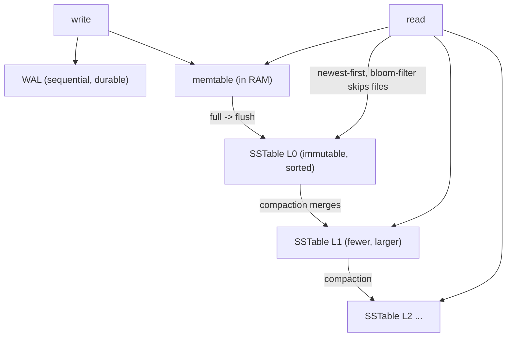

## Thesis

How a database physically lays out data on disk to make reads and writes fast --- the choice of storage engine --- which comes down mostly to two families: B-trees (update in place, keep data sorted in fixed pages; read-optimized, the default for relational databases) and LSM-trees (buffer writes in memory, flush sorted immutable files, merge them in the background; write-optimized, used by Cassandra, RocksDB, and column stores); the engine determines the fundamental trade-offs in read, write, and space amplification, so choosing (or understanding) it is choosing where your workload pays --- reads vs writes vs storage.

## Sub

**Why: the on-disk layout is what makes reads/writes fast, and it's a trade** -> **B-trees (in-place, sorted pages, read-optimized)** -> **LSM-trees (append + compaction, write-optimized)** -> **zoom out** to the read/write/space amplification trade and which-engine-when, and the pivots an interviewer rides from "which database" into B-tree vs LSM, the amplifications, and compaction.

## Spine

- The **storage engine** is how a database physically stores and retrieves data on disk --- and the dominant choice is between two families: **B-trees** (data kept sorted in fixed-size pages, updated **in place**) and **LSM-trees** (writes buffered in memory then flushed as sorted **immutable files** and merged in the background); this choice sets the performance profile.
- **B-trees are read-optimized** --- a balanced tree of sorted pages gives `O(log n)` point lookups and efficient range scans, and updates modify the page **in place** (with a **write-ahead log** for crash safety); the cost is that random in-place writes cause **write amplification** (rewriting whole pages) and fragmentation, so writes are more expensive --- which is why B-trees (Postgres, MySQL/InnoDB) dominate **read-heavy / transactional** workloads.
- **LSM-trees are write-optimized** --- writes go to an in-memory **memtable** (fast) plus a WAL, are flushed to **immutable sorted files (SSTables)**, and **compaction** merges those files in the background; this turns random writes into sequential ones (high write throughput), but a read may have to check **multiple files** (so reads lean on **bloom filters** and compaction to stay fast), and compaction itself consumes I/O --- which is why LSM (Cassandra, RocksDB, ScyllaDB) dominates **write-heavy** workloads.
- The engine is a **read/write/space amplification** trade --- **read amplification** (extra reads per query: LSM checks several files), **write amplification** (extra bytes written per update: B-tree rewrites pages, LSM re-writes during compaction), and **space amplification** (extra storage: LSM holds obsolete rows until compaction, B-trees fragment) pull against each other, and **no engine wins all three** (the RUM conjecture) --- so you pick the one whose amplifications your workload can afford.

## Companion Notes

### walk

How data is stored on disk

The physical layout a database uses to make reads and writes fast --- why it's a trade, how a B-tree keeps data in sorted in-place pages (read-optimized), how an LSM-tree buffers and merges immutable files (write-optimized), and why the read/write/space amplifications mean no engine wins everything, so you choose per workload.

Say the fork first --- "two families: B-trees update in place and favor reads; LSM-trees append and compact and favor writes." Everything else (compaction, bloom filters, the amplifications) is the consequence, and the punchline is the RUM trade: you can't optimize reads, writes, and space all at once.

### drill

Probe Drill

Graded follow-ups on the B-tree/LSM fork, compaction, the three amplifications, and columnar storage --- the ones that separate "Postgres uses B-trees" from reasoning about which physical layout fits a workload and what it costs.

Name the fork and the trade: B-tree = sorted in-place pages, read-optimized; LSM = memtable -> immutable SSTables -> background compaction, write-optimized; and read vs write vs space amplification pull against each other (RUM), so you pick the one whose cost your workload affords.

## Drill

SDE2 | the two families and the WAL
SDE3 | compaction, amplifications, and columnar
Staff | the RUM trade, tombstones, and OLAP

### SDE2 | what a storage engine is

What is a storage engine and why does it matter?

A **storage engine** is the component of a database that decides **how data is physically stored on disk and retrieved** --- the on-disk data structures and algorithms for writing, reading, updating, and deleting records (and their indexes). It matters because the *physical layout* is what determines the database's real performance characteristics: how fast writes are, how fast point lookups and range scans are, how much extra I/O each operation costs, and how much storage the data takes. The same logical data (rows in a table) can be laid out very differently on disk, and that choice makes a database good at some workloads and bad at others. Crucially, it's a **trade-off, not a free optimization** --- an engine tuned for fast writes tends to pay on reads or storage, and vice versa. So understanding the storage engine (or choosing a database by its engine) is really about matching the *physical* design to your *access pattern* --- and the dominant, interview-relevant split is between two engine families, B-trees and LSM-trees, which sit at opposite ends of the read-vs-write trade.

### SDE2 | the two families

What are the two main storage engine families, at a high level?

**B-trees** and **LSM-trees (log-structured merge-trees)**. **B-tree**: keeps data (and indexes) **sorted in fixed-size pages** on disk, organized as a balanced tree, and **updates data in place** (find the page, modify it). It's the classic engine behind most **relational databases** (PostgreSQL, MySQL/InnoDB, SQL Server, Oracle) and is **read-optimized** --- fast lookups and range scans. **LSM-tree**: buffers writes in an **in-memory structure (the memtable)**, periodically flushes them to disk as **immutable sorted files (SSTables)**, and **merges those files in the background (compaction)** --- it never updates in place; it appends and later reconciles. It's the engine behind many **write-heavy / NoSQL** stores (Cassandra, ScyllaDB, RocksDB, LevelDB, HBase) and is **write-optimized** --- very high write throughput. The essential contrast: B-trees update **in place** and are **read-optimized**; LSM-trees are **append-only + background-merge** and are **write-optimized**. Almost every storage-engine question reduces to understanding this fork and its consequences (compaction, the amplifications, when to use which).

### SDE2 | B-tree basics

How does a B-tree store and find data?

A B-tree keeps keys **sorted** across **fixed-size pages** (nodes), arranged as a **shallow, balanced tree**: internal pages hold keys and pointers to child pages, and leaf pages hold the actual data (or pointers to it). To **find** a key, you start at the root and follow pointers down through a few levels to the right leaf --- because each page has a high fan-out (hundreds of keys), the tree stays shallow (a handful of levels even for billions of rows), so a lookup is `O(log n)` and typically just a few page reads. Because keys are **sorted**, **range scans** are efficient (find the start, then read sequential leaves). To **update** a key, you locate its leaf page and **modify it in place** (rewrite that page). This in-place, sorted-page design is what makes B-trees excellent for reads: a point lookup is a short, direct path, and ranges are sequential. The tree stays balanced through splits/merges as pages fill or empty. The trade-off (below) is that in-place updates and page rewrites make **writes** more expensive, but for read-dominated and transactional workloads the B-tree's read efficiency is exactly what you want --- which is why it's the default relational engine.

### SDE2 | LSM basics

How does an LSM-tree store data?

By **buffering, flushing, and merging** rather than updating in place. (1) A write goes into an **in-memory memtable** (a sorted structure, e.g. a skip list) --- and also to a **write-ahead log** on disk for durability. Because it's an in-memory insert plus a sequential log append, writes are **very fast**. (2) When the memtable fills, it's **flushed to disk as an immutable, sorted file called an SSTable** (sorted string table) --- written sequentially, never modified again. (3) Over time you accumulate many SSTables, so **compaction** runs in the background: it **merges** SSTables together, combining their sorted data, keeping the newest value for each key, and dropping obsolete/deleted entries --- producing fewer, larger, cleaner files. Reads check the memtable and then the SSTables (newest first) to find a key's current value. The defining properties: writes are **sequential appends** (no random in-place I/O), files are **immutable** (so no in-place updates, no locking of existing data), and **compaction** is the background process that keeps the file count and obsolete data under control. This append-then-merge design is what makes LSM-trees excellent for **writes** --- you never pay the random-write cost of updating in place; you append fast and reconcile later.

### SDE2 | why read-optimized vs write-optimized

Why are B-trees read-optimized and LSM-trees write-optimized?

It comes down to **where each does its work**. A **B-tree write** must find the key's page and **update it in place** --- a **random write** of a whole page (plus a WAL write), and if the page is on disk it's a read-modify-write; random in-place writes are relatively expensive. But a **B-tree read** is a short, direct traversal to one page --- cheap and predictable. So the B-tree front-loads cost onto writes and keeps reads fast: **read-optimized**. An **LSM write** just appends to an in-memory memtable and a sequential log --- no random I/O, no touching existing data, so writes are **extremely cheap and high-throughput** (sequential writes are far faster than random ones, especially the deferred flush of a whole sorted file at once). But an **LSM read** may have to look in the memtable *and* several SSTables (since a key's latest value could be in any of them), so reads can touch **multiple files** --- more work per read. So LSM defers and batches write cost (sequential appends + background compaction) at the expense of read cost: **write-optimized**. The one-line intuition: B-trees pay on writes (random in-place page updates) to keep reads a single short lookup; LSM-trees pay on reads (checking multiple files) to keep writes cheap sequential appends. That's the fundamental read-vs-write trade the two families embody.

### SDE2 | the write-ahead log

What is a write-ahead log and why do both engines use one?

A **write-ahead log (WAL)** is an append-only log on disk to which a change is written **before** it's applied to the main data structure --- the "write ahead" ordering. Its purpose is **durability and crash recovery**: because the change is durably recorded in the log first, if the database **crashes** before the change reaches (or is fully persisted to) the main structure, on restart it can **replay the log** to recover any committed changes that hadn't been fully applied --- so no acknowledged write is lost, and the data structure is brought back to a consistent state. Both engines use it, for the same reason but at slightly different points: a **B-tree** writes the change to the WAL, then updates the page in place (so a crash mid-update is recoverable by replaying the log --- this also protects against a torn/partial page write); an **LSM-tree** writes to the WAL *and* the in-memory memtable (so a crash before the memtable is flushed to an SSTable is recoverable by replaying the log to rebuild the memtable). The WAL is what lets both engines acknowledge a write as durable **before** doing the slower work of updating the on-disk structure --- which is central to performance (sequential log append is fast) *and* durability. (This is also where the fsync/durability-vs-latency trade lives: how aggressively you flush the WAL to disk.)

### SDE2 | an example

Which real databases use which engine, and what does that tell you?

**B-tree engines**: **PostgreSQL**, **MySQL/InnoDB**, SQL Server, Oracle, and most traditional relational databases --- and it tells you they're built for **read-heavy, transactional (OLTP)** workloads with rich queries, range scans, and strong consistency, where read efficiency and in-place updates matter. **LSM engines**: **Cassandra** and **ScyllaDB** (wide-column NoSQL), **RocksDB** / **LevelDB** (embedded key-value engines, and RocksDB underlies many systems), **HBase**, and it's used inside many write-heavy systems --- telling you they're built for **write-heavy / high-ingest** workloads (time-series, event streams, logging, high-volume key-value) where sustaining a huge write rate matters more than the fastest possible read. **Column stores** like **ClickHouse** use an LSM-family merge-tree *and* a **columnar** layout --- built for **analytics (OLAP)**: massive scans, aggregations, and heavy compression. So knowing a database's engine tells you its natural workload: if I see Postgres, I expect transactional read-heavy use; if I see Cassandra, I expect write-heavy ingest; if I see ClickHouse, I expect analytical scans. And choosing a database *is* substantially choosing a storage engine to match your access pattern --- the engine is why "use Cassandra for high write throughput" or "use Postgres for transactional consistency" are sound defaults.

### SDE3 | the LSM read path

Walk through an LSM read --- why can it be slower, and how is it kept fast?

An LSM read must find the **current** value of a key, which could be in the memtable or in any SSTable (newer values shadow older ones), so it searches **newest-to-oldest**: (1) check the **memtable** (in memory --- fast); (2) if not found, check the SSTables, **most-recent first**, because the newest SSTable holds the latest value. Naively this means checking **many files** per read --- that's the **read amplification** that makes LSM reads potentially slower than a B-tree's single traversal. It's kept fast by several mechanisms: (1) **Bloom filters** --- each SSTable has a compact probabilistic filter that answers "is this key *definitely not* here?"; a read consults the bloom filter for each SSTable and **skips** the ones that certainly don't contain the key, so it only actually reads the few files that might --- this is the key optimization that cuts read amplification dramatically. (2) **Sorted files + sparse index** --- each SSTable is sorted with a sparse in-memory index, so *within* a file, locating the key is a quick seek (no full scan). (3) **Compaction** --- by merging SSTables into fewer, larger files (and dropping obsolete entries), compaction reduces the number of files a read must consider. (4) **Block cache** --- frequently-read SSTable blocks are cached in memory. So the LSM read path is "memtable, then bloom-filter-guided SSTable lookups, newest first," and the combination of bloom filters (skip files that lack the key), sorted files (fast in-file lookup), and compaction (fewer files) is what keeps reads acceptably fast despite the multi-file structure. The residual truth is that LSM reads still generally do *more* than a B-tree's single short traversal, which is the read-amplification cost of the write-optimized design.

### SDE3 | compaction

What is compaction, why is it necessary, and what does it cost?

**Compaction** is the background process that **merges SSTables** --- taking several sorted immutable files and combining them into fewer, larger sorted files, keeping only the **newest value** for each key and **discarding superseded/deleted entries** (and tombstones past their grace period). It's **necessary** for three reasons: (1) **Read performance** --- without it, SSTables accumulate endlessly and every read must consider more and more files (read amplification grows unbounded); compaction keeps the file count down. (2) **Space reclamation** --- because LSM never updates in place, an updated or deleted key leaves its **old versions** sitting in older SSTables (dead data); compaction is what actually **removes** them and reclaims the space (otherwise space amplification grows). (3) **Keeping data sorted/organized** for efficient reads. The **cost** is significant: compaction **reads and rewrites large amounts of data** in the background --- so it consumes **disk I/O, CPU, and write bandwidth** (this is the LSM's **write amplification**: a byte written once to the memtable gets rewritten several times as it's compacted through levels). This creates real operational tension: compaction competes with foreground reads/writes for I/O, and if it can't keep up with the write rate, SSTables pile up (reads slow down, space bloats) or the database throttles writes (**write stalls**). So compaction is the essential background maintenance that makes LSM's write-optimized design *sustainable* for reads and space --- but it's also the source of LSM's write amplification and a common operational pain point (tuning compaction to keep pace without starving foreground traffic).

### SDE3 | the three amplifications

What are read, write, and space amplification?

They're the three ways a storage engine does **more work (or uses more space) than the logical operation strictly requires** --- the metrics the engine trade-off is measured in. **Read amplification** = the number of **actual I/O operations (or bytes read) per logical read**. A B-tree read is low (one short traversal, a few pages); an LSM read is higher (it may check the memtable + multiple SSTables, mitigated by bloom filters). **Write amplification** = the number of **actual bytes written to disk per logical byte written**. A B-tree rewrites a whole page (and the WAL) per update, so a small update writes a full page (and random in-place); an LSM writes the byte once to the memtable/WAL but then **rewrites it multiple times through compaction** as it merges up through levels --- both amplify writes, differently. **Space amplification** = the **ratio of actual storage used to the logical data size**. A B-tree has some overhead (partially-full pages, fragmentation); an LSM temporarily holds **obsolete versions and deleted entries** (until compaction removes them) plus duplicate keys across levels, so it can use more space transiently. The point of naming them: the three **pull against each other**, and an engine's design is essentially *which amplifications it chooses to pay*. B-trees trade higher write amplification (in-place page rewrites) for low read amplification; LSM-trees trade higher read and space amplification (multiple files, obsolete data) for low **immediate** write cost (deferring write amplification to compaction). You can even tune within an engine (e.g. compaction strategy) to shift the balance. These three amplifications are the vocabulary for reasoning precisely about storage-engine trade-offs.

### SDE3 | B-tree write amplification

Where does a B-tree's write cost come from?

From **in-place page rewrites plus the WAL**, and the randomness of those writes. When you update (or insert) a single row: (1) the change is first written to the **WAL** (one write), then (2) the corresponding **page is modified in place** --- and because pages are the unit of I/O, updating even a few bytes means **rewriting the whole page** (a page might be 8KB, so a 100-byte update writes 8KB). (3) These page writes are **random** (the page could be anywhere on disk), and random writes are far slower than sequential ones (especially on spinning disks, and they cause more wear/less efficiency on SSDs). (4) Inserts can trigger **page splits** (when a page is full, it splits into two, rewriting more pages and possibly propagating up the tree). (5) There's also the classic **double-write** concern: to protect against **torn pages** (a partial page write during a crash), some engines (e.g. InnoDB's doublewrite buffer) write the page twice, further amplifying. So a B-tree's write amplification comes from: WAL write + full-page in-place rewrite (page-sized, regardless of change size) + random-I/O cost + occasional splits + torn-page protection. This is why B-trees are relatively **write-expensive** --- each logical write becomes at least a page-sized, random, in-place write (plus log). It's the flip side of their read efficiency, and exactly the cost that LSM-trees avoid by appending sequentially and deferring the reorganization to compaction (trading it for compaction's own, different, write amplification).

### SDE3 | when to choose LSM vs B-tree

How do you decide between an LSM and a B-tree engine for a workload?

By the **read/write balance and access pattern** of the workload. Favor an **LSM engine** when the workload is **write-heavy / high-ingest**: high sustained write throughput (time-series, event streams, logging, metrics, high-volume key-value, "append lots of data fast"), where the ability to absorb writes cheaply (sequential appends) matters more than the absolute fastest read, and where writes vastly outnumber reads or reads are mostly recent/point lookups. LSM also tends to **compress better** and use disk efficiently for large datasets. Favor a **B-tree engine** when the workload is **read-heavy or transactional (OLTP)**: lots of point lookups and **range scans**, **read-modify-write transactions**, strong consistency and rich querying, where read latency/efficiency is paramount and the write rate is moderate --- the classic relational-database use case. Also consider: **range queries** favor B-trees (data always fully sorted in place; LSM range scans must merge across files); **predictable read latency** favors B-trees (LSM read latency varies with how many files/compaction state); **write-then-rarely-read** or **write-then-scan-analytically** favors LSM (or columnar). The senior framing: it's fundamentally the **read-vs-write trade** --- if writes dominate and you need to sustain high ingest, LSM; if reads/transactions dominate and you need fast, predictable lookups and ranges, B-tree. And in practice you pick the *database* whose default engine matches (Cassandra/RocksDB for write-heavy, Postgres/MySQL for transactional), rather than swapping engines --- so "which engine" usually means "which database for this access pattern."

### SDE3 | how LSM keeps reads fast

Beyond bloom filters, what keeps LSM reads from degrading?

A combination of **structure, filtering, caching, and maintenance**. (1) **Bloom filters** (the headline) --- per-SSTable probabilistic filters let a read skip files that definitely don't contain the key, so it reads only the few that might. (2) **Leveled compaction** --- organizing SSTables into **levels** where each level's files have **non-overlapping key ranges** (except the top level) means a read for a given key needs to check **at most one file per level** (the file whose range covers the key), bounding read amplification to roughly the number of levels rather than the total file count. (3) **Sorted files + sparse indexes** --- each SSTable is sorted and has an in-memory sparse index (and block-boundary offsets), so locating a key *within* a file is a quick binary-search-and-seek, not a scan. (4) **Block cache** --- hot SSTable data blocks are cached in RAM, so frequently-read keys avoid disk entirely. (5) **The memtable** absorbs the very newest data in memory, so reads of recent keys are fast. (6) **Compaction** continuously reduces the number of files and drops dead data, keeping the read cost from growing. So the answer to "won't LSM reads get slow with many files?" is: leveled compaction bounds files-per-read to ~the number of levels, bloom filters skip the irrelevant ones, sparse indexes make in-file lookup fast, and the block cache serves hot data from memory --- together keeping reads acceptably fast. The honest caveat remains that this is *more machinery* than a B-tree's single traversal, and read latency is more variable (depends on compaction state and how many levels a key spans), which is the residual read-amplification cost of the write-optimized design.

### SDE3 | columnar storage

What is columnar storage, and when does it win?

**Columnar storage** lays data out **by column rather than by row** --- instead of storing each row's fields together (row-oriented, what B-trees and typical OLTP engines do), it stores **all values of one column contiguously**. It wins for **analytical (OLAP) workloads** --- queries that **scan many rows but only a few columns** and **aggregate** (sums, averages, group-bys over billions of rows). The reasons: (1) **Only the needed columns are read** --- an analytical query touching 3 of 50 columns reads just those 3 columns' data, not entire rows, slashing I/O. (2) **Far better compression** --- a column holds values of the *same type and often similar/repeated values*, which compress extremely well (run-length, dictionary, delta encoding), so the data is much smaller on disk (this is where ClickHouse's dramatic storage reductions come from --- e.g. a 7x reduction by columnar layout + strong compression). (3) **Vectorized execution** --- processing a column as a tight array of same-type values is cache-friendly and SIMD-friendly, so aggregations run very fast. The trade-off: columnar is **poor for OLTP** --- fetching or updating a **single full row** means touching many separate column files (scattered I/O), and point inserts/updates are inefficient, so columnar stores are for **read-mostly analytics**, not transactional workloads. Column stores (ClickHouse, and analytical warehouses like BigQuery/Redshift) often combine the columnar layout with an **LSM-family merge-tree** (batched writes, background merges) since analytical data is typically **bulk-loaded / append-heavy** and rarely updated in place. The framing: the physical layout should follow the **access pattern** --- row-oriented for "read/write whole rows" (OLTP), column-oriented for "scan few columns across many rows and aggregate" (OLAP) --- which is why analytics uses columnar and gets both the scan efficiency and the compression as a result.

### Staff | the RUM conjecture

What is the fundamental trade-off behind storage engines (the RUM conjecture)?

The **RUM conjecture** states that for a storage engine you can optimize for at most **two of three** overheads: **Read** amplification, **Update** (write) amplification, and **Memory** (space) amplification --- optimizing any two forces you to give up on the third. It's the formal expression of why **no storage engine is best at everything**. Mapping it: a **B-tree** optimizes **Read** (low read amplification --- one short traversal) and keeps **Memory/space** reasonable, but pays in **Update** (high write amplification --- in-place page rewrites); an **LSM-tree** optimizes **Update** (low immediate write cost --- sequential appends) and can be **space-efficient** with good compaction, but pays in **Read** (higher read amplification --- multiple files) --- or, tuned differently, trades **space** for reads. You can even see the RUM trade *within* an engine's tuning: LSM **compaction strategy** is exactly a knob that moves you along the RUM triangle (leveled compaction reduces read + space amplification at the cost of *more* write amplification; size-tiered does the opposite). The staff value of RUM is that it gives you a **principled way to reason about any storage-engine or index choice**: instead of asking "which is fastest?" you ask "**which two of read/write/space does my workload most need optimized, and which can I afford to give up?**" --- and that directly picks the engine (read-critical transactional -> B-tree, optimizing read+space at write's expense; write-heavy ingest -> LSM, optimizing write at read/space's expense; and analytics adds the columnar layout for scan+compression). It's the unifying principle: the amplifications are conserved quantities you allocate, not costs you can all eliminate.

### Staff | compaction strategies

Compare the main LSM compaction strategies and their trade-offs.

The two canonical strategies are **size-tiered** and **leveled**, and they sit at different points on the write/read/space-amplification trade --- a direct RUM knob. **Size-tiered compaction (STCS)**: SSTables are merged when several of **similar size** accumulate, combining them into one larger file (so you get a few small files, then merge into medium, then large --- tiers by size). **Pros**: **low write amplification** (data is rewritten fewer times --- you merge each size tier occasionally), good for **write-heavy** workloads. **Cons**: **higher read amplification** (a key can be in multiple same-tier files with overlapping ranges, so a read may check several files per tier) and **higher space amplification** (large obsolete files linger until a big merge, and a compaction of huge files temporarily needs space for both input and output --- a transient space spike). **Leveled compaction (LCS)**: SSTables are organized into **levels**, where each level (except the first) has files with **non-overlapping key ranges** and each level is ~10x larger than the one above; compaction merges a file from level N into the overlapping files of level N+1. **Pros**: **low read amplification** (at most one file per level covers a given key, so a read checks ~one-file-per-level) and **low space amplification** (obsolete data is cleaned promptly, less duplication). **Cons**: **high write amplification** (data is rewritten many times as it moves down through levels --- each level transition rewrites it). So the trade is: **size-tiered = write-optimized** (less write amplification, worse read/space --- good for write-heavy, less-read data like logs), **leveled = read/space-optimized** (better reads and less space, at more write amplification --- good for read-heavier or space-constrained workloads). Databases let you choose (Cassandra offers STCS, LCS, and TWCS for time-series; RocksDB is leveled by default with options). The staff point: compaction strategy is how you **tune an LSM along the RUM triangle** to fit whether your workload is more write-bound, read-bound, or space-bound --- it's not a fixed property of "LSM," but a deliberate choice, and misconfiguring it (e.g. size-tiered on a read-heavy dataset -> read amplification pain, or leveled on a write-saturated one -> compaction can't keep up -> write stalls) is a common operational failure.

### Staff | write amplification deep dive

Go deeper on write amplification --- LSM vs B-tree, SSD wear, and measurement.

Write amplification (WA) = **bytes physically written to disk / bytes logically written by the application** --- and both engine families have it, from different sources, with real consequences for SSD longevity and throughput. **B-tree WA**: each logical write becomes at least a **full-page in-place rewrite** (e.g. an 8KB page for a 100-byte row = 80x for that write) plus the **WAL** write, plus **page splits** and **torn-page protection** (doublewrite) --- so B-tree WA comes from *page granularity* and *in-place random writes*. **LSM WA**: a byte is written once to the memtable/WAL, but then **rewritten every time it's compacted through a level** --- with leveled compaction and a fan-out of ~10, a byte can be rewritten ~10x per level times the number of levels (WA can be 10-30x+), because moving data down the levels re-reads and re-writes it repeatedly. So the irony: LSM has *low immediate* write cost (sequential appends) but can have *high total* write amplification from compaction, while B-tree has high *per-write* cost but no compaction. **SSD wear**: this matters because SSDs have limited program/erase cycles, and both the *device itself* has internal WA (the flash translation layer relocating data) and the *database* has WA on top --- so high database WA (especially unchecked LSM compaction WA) **wears out SSDs faster** and consumes write bandwidth that competes with foreground writes. **Sequential vs random**: LSM's writes, though amplified, are **sequential** (compaction rewrites are large sequential I/O), which is much friendlier to both disk throughput and SSD wear-leveling than B-tree's **random** in-place page writes --- so LSM's *amplified-but-sequential* writes can still outperform B-tree's *less-amplified-but-random* writes on write-heavy loads. **Measurement**: you measure WA by comparing bytes written to the device vs bytes ingested (many engines expose compaction stats / bytes-written metrics), and you **tune** it via compaction strategy (size-tiered = lower WA, leveled = higher WA but better reads/space), memtable size, and level fan-out. The staff framing: WA is a first-class operational metric (it dictates SSD lifespan and write-bandwidth headroom), the two engines amplify writes for different reasons (page granularity vs compaction), and the *sequential* nature of LSM's amplified writes is why it still wins on write-heavy workloads despite a higher WA number --- so you reason about WA as *amount x pattern (sequential vs random)*, not just the raw ratio, and tune compaction to keep it sustainable.

### Staff | the memory hierarchy and durability

How do the OS page cache, buffer pools, and fsync fit into storage engines?

They're central --- storage-engine performance is really about **keeping the working set in memory and being deliberate about when data is forced to disk**. **Buffer pool / block cache (memory)**: a B-tree keeps a **buffer pool** (e.g. InnoDB's) of hot pages in RAM, and an LSM keeps a **block cache** of hot SSTable blocks (plus its memtable is inherently in RAM) --- so reads that hit cache avoid disk entirely, and the effective read performance depends heavily on cache hit rate (a "disk" data structure that fits in RAM behaves like an in-memory one). This is why "how much data fits in memory" often dominates real performance more than the on-disk structure. **OS page cache**: on top of (or instead of) the app buffer pool, the OS caches file pages; some engines manage their own buffer pool and bypass/minimize OS caching (to avoid double-caching), others (like RocksDB by default, or Postgres which *relies* on the OS page cache alongside its smaller shared buffers) lean on it. **fsync and the durability trade**: writing to a file doesn't guarantee it's on the physical disk --- it may sit in the OS page cache / disk controller cache --- so to make a write **durable**, the engine must **fsync** (force the data to stable storage), and fsync is **slow** (it waits for the physical write). This is the crux of the **durability-vs-latency trade**: fsync the WAL on **every commit** = maximum durability (no committed write lost on crash/power loss) but higher commit latency; **batch/group commit** (fsync many commits together) or **async/periodic fsync** = lower latency / higher throughput but a **window of potential data loss** on a crash (the un-fsynced tail). Engines expose this (e.g. `synchronous_commit`, `innodb_flush_log_at_trx_commit`, WAL fsync settings) precisely because it's a real trade you tune per how much you can afford to lose. The staff framing: the storage engine sits atop a **memory hierarchy** (buffer pool/block cache -> OS page cache -> disk), so (1) real performance is dominated by cache behavior (fit the working set in RAM), and (2) durability is a **conscious fsync decision** --- the WAL makes commits fast *if* you're willing to relax when it's forced to disk, and "durable" specifically means "fsynced," which trades latency for the guarantee. Understanding these two --- caching and fsync --- is what separates "how the data structure works on paper" from "how the database actually performs and how much it can lose."

### Staff | tombstones and deletes in LSM

How do deletes work in an LSM-tree, and what problems do tombstones cause?

Because LSM files are **immutable**, a delete **can't remove the data in place** --- so a delete is actually a **write**: it inserts a special marker called a **tombstone** (a record saying "this key is deleted") into the memtable, which flows to an SSTable like any write. On a read, when the newest entry found for a key is a tombstone, the engine treats the key as **absent** (the tombstone shadows any older values in older SSTables). The actual data (the old values *and* the tombstone) is only physically removed later, during **compaction**, once the tombstone has been merged past all the SSTables that could contain older versions of that key. This design causes several well-known problems: (1) **Deletes consume space and write bandwidth** (a delete is a write, not a space saving --- space is only reclaimed at compaction, so a burst of deletes *increases* storage until compaction catches up). (2) **Tombstones slow reads** --- until compaction removes them, reads (especially **range scans**) must **read past all the tombstones** in the range (a range scan over a region with millions of deleted keys reads millions of tombstones to determine what's still live), a classic Cassandra performance pitfall. (3) **Tombstone grace period / resurrection** --- tombstones can't be dropped immediately; they must be retained for a **grace period** (in Cassandra, `gc_grace_seconds`) long enough to ensure the delete has propagated to **all replicas** (so a replica that was down doesn't miss the delete). If a tombstone is purged *before* a lagging replica saw it, and that replica still has the old value, the old value can **resurrect** (come back to life) during read-repair/anti-entropy --- a data-correctness bug. So you must keep tombstones long enough for replication to converge but not so long that they bloat storage/reads. (4) **Range tombstones** exist to delete a whole range efficiently (one marker instead of one per key), but they add read-path complexity. The staff summary: in an LSM, **a delete is a write of a tombstone, reclaimed only by compaction**, which means deletes cost space and write bandwidth, tombstones degrade reads (especially range scans) until compacted, and the grace period is a **correctness-vs-space** balance (long enough to prevent resurrection across replicas, short enough to avoid bloat) --- which is why heavy-delete or queue-like workloads (lots of writes then deletes) are a notorious anti-pattern for LSM stores, and why "don't use Cassandra as a queue" is common advice.

### Staff | row vs column store deep dive

Go deeper on row vs column stores --- OLTP vs OLAP, and why the layout follows the access pattern.

The physical layout (row-oriented vs column-oriented) is dictated by the **access pattern**, and getting it right is the difference between a query touching kilobytes and touching terabytes. **Row stores** (row-oriented: all of a row's columns stored together) are optimal for **OLTP** --- transactional workloads that **read and write whole rows** by key ("fetch this order," "update this user"), because the entire row is contiguous, so one seek gets everything and a write updates one place; this is what B-tree relational engines do. **Column stores** (column-oriented: each column's values stored contiguously) are optimal for **OLAP** --- analytical workloads that **scan many rows but few columns and aggregate** ("average revenue by region over a billion sales"), for three compounding reasons: (1) **I/O reduction** --- read only the columns the query needs (3 of 50), not whole rows, so a scan reads a fraction of the data. (2) **Compression** --- a column is homogeneous (same type, often sorted or with repeated/similar values), so it compresses far better than mixed-type rows --- run-length encoding (repeated values -> a count), dictionary encoding (low-cardinality strings -> small integer codes), delta encoding (sorted numbers -> small deltas) --- which is where **ClickHouse's dramatic compression (e.g. 7x smaller)** comes from, and better compression *also* means less I/O and more data in cache. (3) **Vectorized / SIMD execution** --- processing a column as a dense array of one type is cache-friendly and lets the CPU apply one operation to many values at once (SIMD), so aggregations run an order of magnitude faster than row-at-a-time. The trade is symmetric: column stores are **bad at OLTP** --- reconstructing or updating a **single full row** means gathering/scattering across many column files, and point inserts are inefficient, so they're **read-mostly, bulk-loaded, append-heavy** (which is why they pair with an LSM-family merge-tree: batch the writes, merge in background, rarely update in place). The staff framing: don't think "columnar is faster" --- think **the layout must match how you access the data**. "Read/write whole rows by key" -> row store (OLTP); "scan a few columns across huge row counts and aggregate" -> column store (OLAP), and you get scan-efficiency, compression, *and* vectorization together as a consequence of the columnar physical layout. This is why real architectures **separate OLTP and OLAP** (a row-store transactional DB feeding, via CDC/ETL, a column-store analytics DB) rather than forcing one engine to do both --- because the physical layout that's optimal for one is pessimal for the other, which is the same "layout follows access pattern" principle that underlies the whole storage-engine topic.

### Staff | real-world failure modes

What real-world failure modes and operational realities bite storage engines?

Mostly around compaction, amplification getting out of hand, durability tuning, and using the wrong engine. **Compaction can't keep up / write stalls** (LSM) --- if the write rate exceeds what compaction can merge, SSTables pile up: read amplification climbs (more files per read), space amplification climbs (obsolete data not reclaimed), and eventually the database **throttles or stalls writes** to let compaction catch up (a latency cliff under sustained heavy writes) --- the classic LSM operational failure, tuned via compaction strategy, more compaction threads/throughput, or reducing write rate. **Read amplification blowup** (LSM) --- too many files (bad compaction config, size-tiered on read-heavy data, or lots of overlapping SSTables) makes reads slow; **tombstone pileups** make range scans read millions of dead markers (Cassandra queue anti-pattern). **Space amplification / disk fills** --- delayed compaction (LSM) leaves obsolete versions and duplicates consuming disk (and compaction itself needs *free space* to write outputs, so a nearly-full disk can **deadlock** compaction --- can't compact to reclaim space because there's no space to compact into); B-tree **fragmentation / bloat** (Postgres's dead-tuple bloat from MVCC needing VACUUM) similarly wastes space. **Durability misconfiguration** --- relaxing WAL fsync (async/periodic commit) for throughput opens a **data-loss window** on crash/power loss (the un-fsynced tail is lost) --- fine if intended, a disaster if not understood. **Bloom-filter false positives** --- too-small bloom filters cause reads to touch SSTables that don't have the key (wasted I/O), so under-provisioned bloom filters silently raise read amplification. **B-tree write cost under write-heavy load** --- using a B-tree engine for a write-saturated workload (high-ingest) leads to random-write I/O saturation and poor throughput --- the "wrong engine for the workload" symptom (the fix is an LSM store, not more B-tree tuning). **The mirror mistake** --- using an LSM/columnar store for a transactional, read-a-single-row, low-latency-predictable workload leads to variable read latency and delete/update pain (using Cassandra where you needed Postgres). **VACUUM/GC pressure** (MVCC B-trees) --- Postgres must VACUUM to reclaim dead tuples; if it falls behind, bloat and transaction-ID-wraparound risks appear. The staff summary: the recurring themes are (1) **compaction economics** (it must keep pace with writes, needs I/O and free space, and is the LSM's central operational lever), (2) **amplifications drifting out of the intended range** (read/space blowup from bad compaction or tombstones; write saturation from the wrong engine), (3) **durability being a conscious fsync trade** (relaxed fsync = a loss window), and (4) **wrong-engine-for-workload** (B-tree for high-ingest, or LSM/columnar for point-read transactional) --- and each ties back to the core lesson: the storage engine's amplifications and maintenance (compaction/VACUUM) are conserved costs you must operate deliberately, and the single biggest "failure" is a mismatch between the engine's optimized dimension and the workload's actual access pattern.

## Walk

### The on-disk layout is the trade --- two families

```flow
disk[data on disk] -> fork[B-tree: sorted in-place pages, or LSM: append + background merge] -> profile[sets the read / write / space profile]
```

Start with what a storage engine is and why it's a trade. The engine is **how a database physically lays data out on disk and retrieves it** --- and the *physical* layout is what determines real performance: write speed, lookup and range-scan speed, extra I/O per operation, and storage used. The same rows can be laid out very differently, and each layout is good at some workloads and bad at others.

The dominant, interview-relevant split is two families. A **B-tree** keeps data **sorted in fixed-size pages** and updates them **in place** --- the classic relational engine (Postgres, MySQL/InnoDB), **read-optimized**. An **LSM-tree** buffers writes in memory, flushes **immutable sorted files**, and **merges them in the background** --- the classic write-heavy/NoSQL engine (Cassandra, RocksDB), **write-optimized**. This choice sets the whole performance profile, and it's genuinely a *trade* --- fast writes tend to cost reads or space, and vice versa.

### B-tree: sorted pages, in-place, read-optimized

```flow
pages[keys sorted in fixed pages] -> lookup[O(log n) point lookup + efficient range scan] -> update[update in place + WAL -> page-sized random write]
```

A **B-tree** keeps keys **sorted** across **fixed-size pages** in a shallow balanced tree (high fan-out -> few levels even for billions of rows). A **lookup** follows pointers from the root down to one leaf --- `O(log n)`, a few page reads --- and because keys are sorted, **range scans** read sequential leaves. That's why B-trees are **read-optimized**: a point lookup is a short direct path, ranges are sequential.

The cost is **writes**: an update finds the key's page and **rewrites it in place** --- a **page-sized, random write** (even a 100-byte change rewrites the whole 8KB page), plus a **WAL** write first for crash safety, plus occasional **page splits** and torn-page protection. So a B-tree front-loads cost onto random in-place page writes (**write amplification**) to keep reads a single short lookup --- ideal for **read-heavy / transactional** workloads.

### LSM: memtable to SSTable to compaction, write-optimized

```flow
write[write] -> mem[memtable in RAM + sequential WAL] -> flush[flush to immutable sorted SSTable] -> compact[compaction merges SSTables in background]
```

An **LSM-tree** never updates in place --- it **buffers and merges**. A write goes to an in-memory **memtable** plus a sequential **WAL** (fast --- an in-memory insert + a log append); a full memtable **flushes to an immutable sorted file (SSTable)**; and **compaction** merges SSTables in the background, keeping the newest value per key and dropping obsolete/deleted entries.

```python
class LSMEngine:
    def __init__(self):
        self.memtable = {}        # in-memory sorted buffer (a skip list in practice)
        self.sstables = []        # immutable sorted files on disk, NEWEST last
        self.wal = WAL()

    def put(self, key, value):
        self.wal.append(key, value)       # durability first (sequential append)
        self.memtable[key] = value        # then the in-memory insert -> WRITE IS FAST
        if len(self.memtable) >= FLUSH_THRESHOLD:
            self.flush_memtable()

    def flush_memtable(self):
        sst = SSTable.from_sorted(self.memtable)   # write one immutable sorted file
        self.sstables.append(sst)                   # sequential bulk write, never modified
        self.memtable = {}

    def get(self, key):
        if key in self.memtable:                    # 1) check RAM (newest data)
            return self.memtable[key]
        for sst in reversed(self.sstables):         # 2) SSTables NEWEST-first
            if not sst.bloom_filter.might_contain(key):
                continue                            # bloom filter SKIPS files lacking the key
            v = sst.lookup(key)                     # sorted file -> quick seek
            if v is not None:
                return v                            # (a tombstone here means "deleted")
        return None

    def compaction(self):
        # merge SSTables -> fewer files, keep newest per key, DROP obsolete + tombstones.
        # this is what bounds read amplification and reclaims space -- at an I/O cost
        # (the deferred WRITE AMPLIFICATION of the LSM design).
        self.sstables = merge_sorted(self.sstables)
```

A write is a sequential append (no random in-place I/O), so LSM sustains **very high write throughput**; the reorganization cost is **deferred to compaction**. The catch is reads may check multiple files --- kept fast by **bloom filters** (skip files lacking the key), leveled compaction (one file per level), and the block cache. That's why LSM is **write-optimized**: cheap sequential writes now, at the cost of more work per read.

### The amplification trade --- pick per workload

```flow
read[read amp: LSM checks multiple files] -> write[write amp: B-tree rewrites pages, LSM rewrites in compaction] -> space[space amp: LSM holds obsolete rows until compaction]
```

The engine is a **read/write/space amplification** trade. **Read amplification** (I/O per read): low for a B-tree (one short traversal), higher for LSM (multiple files, cut by bloom filters). **Write amplification** (bytes written per update): a B-tree rewrites a whole page in place; an LSM writes once then rewrites through compaction. **Space amplification** (storage vs logical size): a B-tree fragments; an LSM holds obsolete versions until compaction reclaims them.

These three **pull against each other** --- the **RUM conjecture**: optimize at most two of **R**ead, **U**pdate, **M**emory. So no engine wins all three, and you **pick the one whose amplifications your workload can afford**: read-heavy/transactional -> **B-tree** (optimize reads, pay on writes); write-heavy ingest -> **LSM** (optimize writes, pay on reads/space); analytics -> **columnar** (column layout: read few columns across many rows, compress heavily --- ClickHouse's 7x). Zooming out: the physical layout must **follow the access pattern**, deletes in LSM are **tombstone writes reclaimed by compaction** (a range-scan and space pitfall), durability is a conscious **fsync** trade, and compaction economics (keeping pace with writes) is the LSM's central operational lever. The one line: the amplifications are conserved costs you allocate to match your workload, not costs you can all eliminate.

### Model Script

- Frame the fork | "A storage engine is how a database physically lays data out on disk and retrieves it -- and that physical layout is what determines real performance: write speed, lookup and range-scan speed, extra I/O per operation, storage used. The interview-relevant split is two families. A B-tree keeps data sorted in fixed-size pages and updates them in place -- the classic relational engine, Postgres and InnoDB, and it's read-optimized. An LSM-tree buffers writes in memory, flushes immutable sorted files, and merges them in the background -- the classic write-heavy engine, Cassandra and RocksDB, and it's write-optimized. And this is genuinely a trade: fast writes tend to cost reads or space, and vice versa."
- B-tree | "A B-tree keeps keys sorted across fixed pages in a shallow balanced tree, so a lookup is a short path down to one leaf -- a few page reads, order log n -- and because keys are sorted, range scans read sequential leaves. That's why it's read-optimized. The cost is on writes: an update rewrites the key's page in place, which is a page-sized random write -- even a hundred-byte change rewrites the whole eight-kilobyte page -- plus a write-ahead log write first for crash safety, plus occasional page splits. So a B-tree front-loads cost onto random in-place page writes, its write amplification, to keep reads a single short lookup -- ideal for read-heavy and transactional workloads."
- LSM | "An LSM-tree never updates in place -- it buffers and merges. A write goes to an in-memory memtable plus a sequential write-ahead log, so it's an in-memory insert plus a log append, very fast. When the memtable fills, it flushes to an immutable sorted file, an SSTable, written sequentially and never modified. Over time SSTables accumulate, so compaction merges them in the background, keeping the newest value per key and dropping obsolete and deleted entries. So writes are cheap sequential appends and the reorganization is deferred to compaction -- that's why it sustains very high write throughput. The catch is a read may have to check the memtable and several SSTables, since a key's latest value could be in any of them, which is kept fast by bloom filters that skip files lacking the key, leveled compaction, and a block cache. So it's write-optimized: cheap writes now, more work per read."
- The amplifications | "The way to reason about the trade precisely is the three amplifications. Read amplification -- I/O per read -- is low for a B-tree, one traversal, higher for LSM, multiple files. Write amplification -- bytes written per update -- a B-tree rewrites a whole page in place, an LSM writes once then rewrites through compaction. And space amplification -- storage versus logical size -- an LSM holds obsolete versions until compaction reclaims them. These three pull against each other -- that's the RUM conjecture: you can optimize at most two of read, update, and memory. So no engine wins all three, and you pick the one whose amplifications your workload can afford."
- Interviewer: "So how do you actually choose for a given workload?"
- Choose by access pattern | "By the read-write balance and access pattern. Write-heavy or high-ingest -- time-series, event streams, logging, high-volume key-value -- favors an LSM, because absorbing writes cheaply as sequential appends matters more than the fastest read. Read-heavy or transactional -- lots of point lookups and range scans, read-modify-write transactions, strong consistency -- favors a B-tree, because read latency and efficiency are paramount. Range queries and predictable read latency lean B-tree; sustained high write rate leans LSM. And analytics -- scan a few columns across billions of rows and aggregate -- wants a columnar layout, which reads only the needed columns and compresses a homogeneous column extremely well; that's where ClickHouse's seven-x storage reduction comes from. In practice you pick the database whose engine matches -- Cassandra or RocksDB for write-heavy, Postgres for transactional, ClickHouse for analytics -- rather than swapping engines. The principle is the physical layout must follow the access pattern."
- Land it | "So the storage engine is how data is physically stored, and it's fundamentally a read-versus-write-versus-space trade. B-trees update sorted pages in place -- read-optimized, paying on writes. LSM-trees append to a memtable and merge immutable SSTables in the background -- write-optimized, paying on reads and space, with compaction as the essential background maintenance and bloom filters keeping reads fast. The RUM conjecture says you can't optimize all three amplifications, so you match the engine to the workload: B-tree for transactional read-heavy, LSM for write-heavy ingest, columnar for analytics. The amplifications are conserved costs you allocate to fit your access pattern, not costs you can eliminate -- which is why choosing a storage engine, or a database, is really choosing where your workload pays."

## Whiteboard

Sketch the LSM write and read paths and what compaction does.

### Why is an LSM write fast but a read potentially slower?

A write is an in-memory memtable insert + a sequential WAL append -- no random in-place I/O, so it's very fast. A read must find the key's newest value, which could be in the memtable or any SSTable, so it may check multiple files (read amplification) -- kept fast by bloom filters (skip files lacking the key), leveled compaction (one file per level), and a block cache.

### What does compaction do and why is it necessary?

It merges SSTables into fewer, larger sorted files, keeping the newest value per key and dropping obsolete/deleted entries (past the tombstone grace period). Necessary to bound read amplification (fewer files per read) and reclaim space (remove dead versions) -- at the cost of I/O (the LSM's deferred write amplification).



Verdict: writes append to the memtable + WAL and flush to immutable SSTables (fast, sequential); compaction merges SSTables in the background to bound read amplification and reclaim space; reads check the memtable then SSTables newest-first, with bloom filters skipping files that lack the key -- write-optimized, with reads kept fast by filters and compaction.

## System

Zoom out to where the engine choice sits.

### Where it sits

The physical layout: how rows are stored + retrieved on disk [*]
B-tree: sorted in-place pages -> read-optimized (Postgres, InnoDB)
LSM-tree: memtable -> immutable SSTables -> compaction -> write-optimized (Cassandra, RocksDB)
Columnar: values by column -> scan few columns + compress -> analytics (ClickHouse)
The trade: read / write / space amplification (RUM) -- no engine wins all three

### Pivots an interviewer rides

From "which database" they push on the engine, the amplifications, and compaction.

#### B-tree or LSM for this workload?

-> write-heavy/ingest -> LSM (sequential writes + compaction); read-heavy/transactional -> B-tree (in-place, one lookup)
B-trees pay on writes (in-place page rewrites) to keep reads a short traversal; LSM pays on reads (multiple files) and space (obsolete data) to keep writes cheap sequential appends -- match the amplification your workload affords.

#### Won't LSM reads get slow with many files?

-> bloom filters skip files lacking the key, leveled compaction bounds files-per-read to ~one per level, block cache serves hot data
Compaction merges files (fewer per read) and reclaims space; the residual cost is more machinery than a B-tree's single lookup and more variable read latency -- the read-amplification price of write optimization.

## Trade-offs

The calls that separate "Postgres uses B-trees" from matching a layout to a workload.

### B-tree vs LSM-tree

- B-tree: fast, predictable reads + range scans, in-place updates -- but write amplification (page-sized random in-place writes), so writes are costlier
- LSM-tree: very high write throughput (sequential appends + deferred compaction), better compression -- but higher read amplification (multiple files) and space amplification (obsolete data until compaction), and compaction I/O

Read-heavy / transactional -> B-tree; write-heavy / high-ingest -> LSM. It's the read-vs-write trade; match the engine to whether reads or writes dominate.

### Size-tiered vs leveled compaction (LSM tuning)

- Size-tiered: low write amplification (fewer rewrites) -- but higher read + space amplification (overlapping files, transient space spikes); good for write-heavy
- Leveled: low read + space amplification (one file per level, prompt cleanup) -- but high write amplification (data rewritten through levels); good for read-heavier / space-constrained

Tune compaction along the RUM triangle: size-tiered for write-saturated / rarely-read data (logs), leveled for read-heavier or space-tight workloads.

### Row store vs column store

- Row store (OLTP): read/write whole rows by key fast (contiguous), transactional -- but scans read whole rows even for a few columns, and compress worse
- Column store (OLAP): scan few columns across many rows, huge compression (homogeneous columns), vectorized aggregation -- but single-row fetch/update scatters across column files (poor OLTP)

Match layout to access pattern: row store for transactional whole-row access; column store for analytical scan-and-aggregate (and separate OLTP from OLAP rather than forcing one engine to do both).

## Model Answers

### the reframe | Two families, one trade

The frame to lead with.

- B-tree: sorted in-place pages -> read-optimized (pays on writes) | key | Postgres/InnoDB, transactional
- LSM: memtable -> immutable SSTables -> compaction -> write-optimized | store | Cassandra/RocksDB, high-ingest
- No engine wins all three amplifications (RUM) | note | match the engine to the access pattern

### the depth | Amplifications, compaction, and columnar

Where it's really tested.

- Read / write / space amplification pull against each other (RUM) | key | pick the two your workload needs
- LSM reads kept fast by bloom filters + leveled compaction; deletes are tombstone writes | store | compaction bounds read amp + reclaims space
- Columnar (ClickHouse) for OLAP: read few columns, heavy compression, vectorized | note | layout follows access pattern

## Numbers

Back-of-envelope the workload fit and the LSM read/write profile.

Write-heavy leans LSM, read-heavy leans B-tree; LSM defers write cost to compaction and pays a read-amplification price bounded by levels.

- wr | Writes per second | 50000 | 0 | 1000
- rd | Reads per second | 10000 | 0 | 1000
- levels | LSM levels (SSTable tiers) | 5 | 1 | 1

```js
function (vals, fmt) {
  var wr = vals.wr, rd = vals.rd, levels = vals.levels;
  var mix = wr > rd * 1.5 ? 'write-heavy' : (rd > wr * 1.5 ? 'read-heavy' : 'balanced');
  var engine = wr > rd * 1.5 ? 'favor LSM' : (rd > wr * 1.5 ? 'favor B-tree' : 'either / measure');
  function r(x, d) { var m = Math.pow(10, d); return Math.round(x * m) / m; }
  return [
    { k: 'Workload mix', v: mix, u: fmt.n(wr) + ' w/s : ' + fmt.n(rd) + ' r/s', n: wr > rd * 1.5 ? 'writes dominate \u2014 an LSM (sequential appends + compaction) sustains ingest a B-tree would choke on with random in-place writes' : (rd > wr * 1.5 ? 'reads dominate \u2014 a B-tree (in-place sorted pages, one short lookup) gives fast, predictable reads and range scans' : 'no clear winner \u2014 decide by range-scan needs, read-latency predictability, and space'), over: false },
    { k: 'Engine lean', v: engine, u: 'first choice', n: 'match the engine to whether reads or writes dominate \u2014 it is fundamentally the read-vs-write trade; analytics (scan few columns, aggregate) instead wants a columnar store', over: false },
    { k: 'LSM read amp (worst)', v: '~' + fmt.n(levels + 1), u: 'files / read', n: 'memtable + one SSTable per level worst-case; bloom filters skip files lacking the key, so effective reads are far fewer \u2014 but still more than a B-tree\u2019s single traversal', over: levels + 1 > 8 },
    { k: 'LSM write path', v: 'sequential', u: '1 append + WAL', n: 'a write is an in-memory memtable insert + a sequential WAL append -> very high throughput; the write-amplification cost is DEFERRED to background compaction (rewrites through levels)', over: false },
    { k: 'The trade', v: 'no free lunch', u: 'RUM', n: 'read, update (write), and memory (space) amplification pull against each other \u2014 optimize at most two, so pick the engine whose costs your workload can afford', over: false }
  ];
}
```

## Red Flags

What makes an interviewer wince.

### "LSM is just faster than B-tree"

Neither is universally faster -- LSM is write-optimized (cheap sequential appends) but pays read and space amplification (multiple files, obsolete data); B-tree is read-optimized (one short lookup) but pays write amplification (in-place page rewrites).

Frame it as the read-vs-write (RUM) trade: LSM for write-heavy ingest, B-tree for read-heavy/transactional -- match the engine's optimized dimension to the workload's access pattern.

### "In an LSM, a delete just removes the row"

LSM files are immutable, so a delete is a *write* -- it inserts a tombstone that shadows old values; the data (and the tombstone) is only physically removed later during compaction, so deletes cost space/write bandwidth and tombstones slow range scans until compacted.

Treat LSM deletes as writes reclaimed by compaction (with a grace period to avoid resurrection across replicas) -- which is why heavy-delete/queue workloads are an LSM anti-pattern (e.g. don't use Cassandra as a queue).

### "We'll run analytics queries on the transactional B-tree database"

Row-oriented OLTP engines read whole rows, so a scan-and-aggregate over billions of rows touching a few columns reads everything and can't compress a column well -- far slower and larger than columnar.

Use a columnar store (ClickHouse, or a warehouse) for OLAP -- it reads only needed columns, compresses homogeneous columns heavily, and vectorizes aggregation; separate OLTP (row store) from OLAP (column store), feeding one to the other via CDC/ETL.

## Opener

### 30s | The one-liner

How I open when asked how a database stores data, or to choose one for a workload.

#### What is the shape?

A storage engine is how data is physically stored on disk, and it's mostly two families: B-trees (sorted pages updated in place -- read-optimized) and LSM-trees (memtable -> immutable SSTables -> background compaction -- write-optimized). The physical layout sets the performance profile.

#### What's the trade?

Read vs write vs space amplification (the RUM conjecture) -- no engine wins all three, so you match the engine to the access pattern: B-tree for transactional read-heavy, LSM for write-heavy ingest, columnar for analytics.

##### Hooks

Where an interviewer usually pushes next.

- B-tree or LSM for this workload? | write-heavy -> LSM; read-heavy -> B-tree | drill
- Won't LSM reads get slow? | bloom filters + leveled compaction bound it | drill
- What about analytics? | columnar layout (read few columns, compress) | drill

Foot: two sentences -- a storage engine is the on-disk layout that makes reads and writes fast, split mainly into B-trees (in-place sorted pages, read-optimized) and LSM-trees (append to a memtable, flush immutable SSTables, compact in the background, write-optimized). It's a read-vs-write-vs-space amplification trade where no engine wins all three (RUM), so you match it to the workload -- B-tree for transactional read-heavy, LSM for write-heavy ingest, columnar for analytics -- because the physical layout must follow the access pattern.

## Bank

### SCALE | A high-ingest time-series / event workload (millions of writes/sec, mostly recent reads)

Task: pick a storage engine and justify it.
Model: choose an LSM-based store (Cassandra/ScyllaDB, or RocksDB-backed), because the workload is write-dominated and LSM turns writes into cheap sequential appends (memtable + WAL) with reorganization deferred to background compaction -- sustaining an ingest rate a B-tree would choke on with random in-place page writes. Key by time/entity so recent data clusters; use a time-window compaction strategy (TWCS) so old windows are dropped cheaply and compaction doesn't churn old data; rely on bloom filters + the block cache for the mostly-recent reads; and set TTLs so expired data is removed at compaction (avoiding tombstone pileups). Accept the trade: higher read amplification and space-until-compaction, and watch that compaction keeps pace with the write rate (or writes stall).
Int: reads are getting slower over time -- what's the likely cause?
Compaction can't keep up with the write rate, so SSTables accumulate and each read checks more files (read amplification climbs) -- or tombstones/TTL-expired rows are piling up in ranges; fix by tuning compaction (strategy/throughput/threads), ensuring TTL+compaction reclaim data, and confirming bloom filters are adequately sized.

### DESIGN | A system needing both fast transactional reads/writes and heavy analytical reporting

Task: design the storage layer.
Model: separate OLTP from OLAP rather than forcing one engine to do both -- because the optimal physical layout differs. Use a row-oriented B-tree transactional database (Postgres/MySQL) for the OLTP path: fast point lookups, range scans, read-modify-write transactions, strong consistency on whole-row access. Feed a columnar analytical store (ClickHouse, or a warehouse) for reporting via CDC/ETL: the column layout reads only the queried columns across huge row counts, compresses homogeneous columns heavily (large storage reduction), and vectorizes aggregations -- so analytical scans are fast and cheap without hammering the transactional DB. The two are connected by a change-data-capture/ETL pipeline, keeping each engine on the workload its layout fits.
Int: why not just run the analytics on the Postgres primary?
Row-oriented OLTP engines read whole rows and compress columns poorly, so scan-and-aggregate over billions of rows reads far more data and runs much slower than columnar -- and it competes for I/O with transactional traffic; a columnar OLAP store fits the scan-and-aggregate access pattern (read few columns, compress, vectorize).

### Extra Curveballs

### CURVEBALL | rum | You're told "just add more indexes and use an LSM engine and everything will be fast -- reads, writes, and storage." Explain why that can't be universally true and how you'd reason about the actual choice.

Model: it can't be universally true because of the fundamental storage-engine trade captured by the RUM conjecture -- you can optimize for at most two of Read amplification, Update (write) amplification, and Memory (space) amplification; optimizing any two forces you to give up the third. So "fast reads AND fast writes AND small storage, all at once" is precisely the thing no single engine or index configuration delivers. Concretely: an LSM engine optimizes writes (cheap sequential appends, deferring reorganization to compaction), but pays read amplification (a read may check the memtable plus multiple SSTables) and space amplification (obsolete versions and tombstones linger until compaction) -- so it's not simultaneously read- and space-optimal. Adding more indexes makes reads faster for specific queries but *worsens* writes and space: every index is another structure that each write must update (more write amplification) and more storage (more space amplification) -- so "add more indexes" trades write/space for read, it doesn't get all three. Even *within* an LSM you see the trade: leveled compaction lowers read and space amplification but *raises* write amplification (data rewritten through levels), while size-tiered does the opposite -- the compaction strategy is literally a knob that moves you around the RUM triangle, not off it. How I'd reason about the actual choice: (1) Characterize the workload's access pattern and which amplifications it can afford -- is it write-heavy/high-ingest (favor low write amplification -> LSM), read-heavy/transactional with range scans and point lookups (favor low read amplification -> B-tree), or space/cost-constrained (favor low space -> tune compaction, or columnar compression)? (2) Recognize you're *allocating* the amplifications, not eliminating them: pick the engine whose optimized two dimensions match the workload's priorities and whose sacrificed dimension the workload tolerates. (3) For indexes specifically: add them where read benefit outweighs the write/space cost, not reflexively -- each index is a read-vs-write/space trade. (4) If the workload genuinely needs both fast transactional access *and* fast analytics, don't force one engine -- use two (row-store OLTP + column-store OLAP via CDC), because the physical layout optimal for one is pessimal for the other. The staff framing: the amplifications are *conserved costs* -- the RUM conjecture is the "no free lunch" theorem of storage engines, so the right instinct is never "make everything fast" but "which two of read/write/space does this workload most need, and which can I afford to pay?" -- and the answer picks the engine, the compaction strategy, the indexing, and whether to split OLTP from OLAP. Anyone promising all three at once is missing the conservation law at the heart of storage-engine design.

### Frames

- A storage engine is the on-disk layout that makes reads/writes fast -> mainly B-trees (sorted in-place pages, read-optimized) vs LSM-trees (memtable -> immutable SSTables -> background compaction, write-optimized)
- It's a read / write / space amplification trade -- RUM: optimize at most two, no engine wins all three; deletes in LSM are tombstone writes reclaimed by compaction, and compaction economics (keeping pace with writes) is the LSM's central lever
- Match the engine to the access pattern: B-tree for transactional read-heavy, LSM for write-heavy ingest, columnar (ClickHouse: read few columns, heavy compression, vectorized) for analytics -- the physical layout must follow how you access the data
