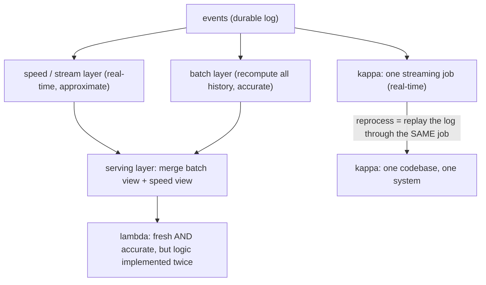

## Thesis

Stream and batch are the two models for computing over large data: **batch** processes a bounded, finite dataset all at once (high throughput, high latency --- a job over yesterday's data), while **stream** processes an unbounded, continuous flow record-by-record or in small windows as data arrives (low latency, but results are always "so far"). The core distinction is **bounded versus unbounded data**, and it forces different mental models: batch has a natural "end," so aggregations are simple and correctness is easy; streaming has no end, so you compute over **windows** of time, must handle **out-of-order and late** data (via **watermarks**), and must define what **exactly-once** means when records can be reprocessed across failures. The design decisions are which model fits the requirement (latency versus throughput versus correctness), how to window and cope with event-time skew, and the architecture that reconciles both --- **lambda** (run batch and stream in parallel and merge) versus **kappa** (stream-only, reprocess history by replaying the log).

## Sub

**Why: compute over huge data --- bounded (batch) or unbounded (stream)** -> **batch (finite, high-throughput, simple correctness) vs stream (continuous, low-latency, windowed)** -> **windowing, event-time vs processing-time, watermarks + late data, exactly-once** -> **zoom out** to lambda vs kappa architectures, when each model fits, and the processing frameworks (MapReduce / Spark / Flink) that run them.

## Spine

- **Batch and stream differ on bounded versus unbounded data** --- batch processes a finite dataset to completion (there is an "all the data," so aggregations and correctness are straightforward, at the cost of latency); stream processes an infinite flow as it arrives (results are continuous and low-latency, but always partial and harder to get exactly right).
- **Streaming forces you to reason about time and windows** --- with no end to the data you aggregate over **windows** (tumbling, sliding, session), and you must distinguish **event time** (when it happened) from **processing time** (when you saw it), because records arrive out of order and late.
- **Watermarks and exactly-once are the hard streaming problems** --- a **watermark** is the system's estimate that "event time has advanced to here," letting you decide when a window is complete despite stragglers (and what to do with data later than that); and **exactly-once** processing (each record affects the result once, even across failures and replays) requires idempotency, checkpointing, and transactional sinks.
- **The architecture reconciles both models** --- **lambda** runs a batch layer (accurate, slow) and a speed/stream layer (fast, approximate) in parallel and merges them; **kappa** drops the batch layer and does everything as streaming, reprocessing history by **replaying the log** --- and you pick the processing model per requirement (latency vs throughput vs correctness).

## Companion Notes

### walk

Computing over data in motion and at rest

One pipeline walked from a nightly batch job to a streaming one --- why bounded-vs-unbounded data is the core split, how batch trades latency for simple correctness and streaming trades simplicity for low latency, why streaming forces windows and event-time reasoning with watermarks for late data, what exactly-once really means, and how lambda and kappa architectures reconcile the two.

Say it as one distinction and its consequences: bounded (batch, high-throughput, simple) vs unbounded (stream, low-latency, windowed) -- and streaming's hard parts (event-time vs processing-time, watermarks + late data, exactly-once) plus the lambda/kappa architecture choice.

### drill

Stream and batch reps

Graded reps on batch vs stream, windowing, event-time vs processing-time, watermarks, exactly-once, and lambda vs kappa --- the ones that separate "we process the data" from a pipeline that windows correctly, handles late data, and gets its correctness/latency trade right.

Anchor on bounded-vs-unbounded (batch simple/high-latency vs stream low-latency/windowed), the time model (event-time vs processing-time, watermarks for late data), exactly-once (= at-least-once + idempotent/transactional sink), and lambda (batch + speed) vs kappa (stream-only + replay).

## Drill

SDE2 | batch vs stream, latency/throughput, windows, event time
SDE3 | window types, watermarks, late data, state, exactly-once
Staff | exactly-once end-to-end, lambda vs kappa, scaling, when not to

### SDE2 | batch vs stream

What is the core difference between batch and stream processing?

**Bounded versus unbounded data.** **Batch** processes a **finite, complete dataset** --- "all of yesterday's transactions," "this table" --- as a single job that reads the whole input, computes, and produces a result, then finishes. Because the data has a definite beginning and end, everything is simpler: aggregations are exact (you have all the records), there is a clear notion of "the answer," and reprocessing is just re-running the job. The cost is **latency** --- you wait for the dataset to be collected and the job to run, so results are as fresh as your batch interval (hourly, nightly). **Stream** processes an **unbounded, continuous flow** of records as they arrive --- an endless sequence with no "end" --- computing incrementally, record-by-record or in small time windows, and emitting results continuously. Because there is no end, results are always **partial** ("the count so far," "the average over the last minute"), and you must decide *when* a result is "done enough" to emit (windowing) and how to handle records that arrive late or out of order. The benefit is **low latency** --- results update within seconds of an event, not on a batch cycle. So the one-line distinction: batch = compute over a finite dataset all at once (simple, high-latency); stream = compute over an infinite flow as it arrives (low-latency, but partial and harder to get exactly right). The unbounded nature is what makes streaming genuinely harder --- everything else (windows, watermarks, exactly-once) follows from "the data never ends."

### SDE2 | what batch processing is

Describe batch processing and the MapReduce/Spark mental model.

Batch processing runs a **job over a large, static dataset**: read all the input, transform and aggregate it in parallel across many machines, write the output. The canonical mental model is **MapReduce**: **map** each input record to intermediate key-value pairs in parallel across the cluster (e.g. map each log line to `(url, 1)`), **shuffle** to group all values for the same key onto the same machine, then **reduce** each key's values to a result in parallel (e.g. sum the 1s per url to get counts). This is powerful because it makes **massive parallelism** easy --- the framework partitions the data, runs map/reduce on many nodes, handles distribution and failures (re-running failed tasks) --- so you process terabytes by expressing a simple map and reduce and letting the engine parallelize. Modern engines like **Spark** generalize this: they keep intermediate data in memory and express computations as a DAG of transformations (map, filter, join, aggregate) over distributed datasets, which is much faster than classic disk-based MapReduce for multi-step jobs, but the core idea is the same --- **partition the data, compute in parallel, shuffle to group, aggregate**. Batch's strengths are **high throughput** (process enormous volumes efficiently in one pass), **simple exact correctness** (you have all the data), and **easy reprocessing** (re-run the job on new/corrected data). Its weakness is **latency** --- results are only as fresh as the batch cadence. It is the right tool for large-scale analytics, ETL, report generation, and training data prep --- anywhere you compute over a complete dataset and can tolerate the latency of a scheduled run.

### SDE2 | what stream processing is

Describe stream processing and how it differs mechanically from batch.

Stream processing computes over an **unbounded flow of records as they arrive**, continuously, rather than over a static dataset in one shot. Mechanically: records flow in from a source (a message log like Kafka, a change stream, events), a topology of **operators** (map, filter, aggregate, join, window) processes each record (or small groups) as it comes, maintaining any needed **state** (running counts, window contents) in the stream processor, and results are **emitted continuously** as computations update. The differences from batch: it is **always running** (a long-lived job, not a start-finish job), it processes data **incrementally** (one record or a small window at a time, updating results), it must maintain **state across records** (a batch job sees all data at once; a stream job accumulates state as records flow), and it produces **continuously-updating, partial results** (the "current" count/average, revised as more data arrives). Because the data never ends, streaming introduces concerns batch never has: **windows** (you can't aggregate "all" data, so you aggregate over time windows), **time semantics** (event-time vs processing-time, since records can arrive out of order), **watermarks** (deciding when a window is complete), and **exactly-once across failures** (a long-running job must recover its state and not double-count on restart). Frameworks like **Flink**, **Kafka Streams**, and **Spark Structured Streaming** provide these primitives. The upside is **low latency** (results within seconds of an event), making it right for real-time analytics, fraud detection, live dashboards, alerting, and any "act on data as it happens" use case --- at the cost of the added complexity that unbounded, out-of-order data brings.

### SDE2 | latency vs throughput

Why is batch high-throughput/high-latency while streaming is low-latency, and what does that trade mean?

It's a direct consequence of *when* they process data. **Batch** waits to accumulate a large dataset and then processes it **all at once**, which is **throughput-efficient** --- one pass over a huge volume amortizes overhead, enables bulk optimizations (sequential reads, large shuffles, vectorized operations), and maximizes work-per-unit-cost --- but inherently **high-latency**, because a result isn't available until the data is collected and the job runs (you see yesterday's numbers today). **Streaming** processes each record (or tiny window) **as it arrives**, which gives **low latency** (a result reflects an event within seconds) --- but generally **lower peak throughput per dollar** and more overhead, because you pay per-record processing costs, maintain continuous state, and can't batch work as aggressively (though modern stream engines mini-batch and are quite efficient). The trade means: choose based on **how fresh the result must be**. If a few hours (or a day) of staleness is fine and you want maximum efficiency over huge volumes --- analytics, reports, ETL --- **batch**. If results must reflect events within seconds --- fraud detection, live dashboards, alerting, real-time features --- **stream**, accepting more complexity and typically higher per-record cost. It's not that one is "better"; it's a latency-vs-simplicity/efficiency trade, and the requirement (how stale can the answer be?) decides. Many systems use both: batch for the bulk/accurate historical view, streaming for the fresh/real-time view --- which is exactly what lambda architecture formalizes.

### SDE2 | what a window is

Why does stream processing need windows, and what is a tumbling window?

Because the data is **unbounded**, you cannot compute an aggregate over "all" of it (there is no "all" --- it never ends), so instead you compute aggregates over **windows**: bounded slices of the stream, usually by time. A window turns "count all events" (impossible on an infinite stream) into "count events **per minute**" (a well-defined, emittable result) --- it's how you get finite, meaningful aggregates out of an endless flow. A **tumbling window** is the simplest kind: **fixed-size, non-overlapping, contiguous** time intervals --- e.g. every 1-minute window `[12:00, 12:01)`, `[12:01, 12:02)`, and so on, each event belonging to exactly one window. You aggregate within each window (count, sum, average) and emit a result when the window closes. Tumbling windows are right for **periodic, non-overlapping** aggregates: "requests per minute," "revenue per hour," "errors per 5-minute bucket." Other window types (sliding, session) handle overlapping or activity-based grouping, but tumbling is the baseline. The key idea to convey: windowing is the fundamental adaptation streaming makes to unbounded data --- you can't wait for the end (there isn't one), so you carve the stream into time windows and emit a result per window, which is what makes continuous aggregation possible. And once you have windows, the next question is *when* a window is complete (given late/out-of-order data) --- which leads to event-time and watermarks.

### SDE2 | event time vs processing time

What's the difference between event time and processing time, and why does it matter?

**Event time** is *when the event actually happened* --- the timestamp embedded in the record (a click at 12:00:03, a transaction at 09:15). **Processing time** is *when the stream processor observed/handled the record* (it arrived at the processor at 12:00:07). They differ because there's a delay --- often variable --- between an event occurring and the processor seeing it: network latency, buffering, retries, a mobile device that was offline and uploads later, a partition that lagged. This matters enormously for **correctness of windowed aggregates**. If you window by **processing time**, a "12:00-12:01 window" contains whatever *arrived* in that wall-clock minute --- which mixes events that actually happened at different times and misplaces late-arriving events (an event that happened at 11:59 but arrived at 12:01 lands in the wrong window). If you window by **event time**, the "12:00-12:01 window" contains events that *happened* in that minute regardless of when they arrived --- which is what you almost always actually want ("how many purchases happened between 12:00 and 12:01?"). The catch: with event-time windowing, records arrive **out of order** (a later-happening event can arrive before an earlier one) and **late** (after their window would naively close), so you need a mechanism to decide when an event-time window is "complete enough" to emit despite stragglers --- that mechanism is the **watermark**. So the distinction matters because event-time is usually the *correct* basis for aggregation, but it forces you to handle out-of-order and late data, which processing-time windowing sidesteps at the cost of being wrong when arrival is delayed.

### SDE2 | a real example of each

Give a concrete example where batch is right and one where streaming is right, and why.

**Batch is right --- a nightly financial/analytics report.** Say you produce a daily revenue report per product across all of yesterday's transactions. The dataset is **bounded** (all of yesterday), a **few hours of latency is fine** (the report is read the next morning), you want **exact correctness** (financial numbers, all data included), and the volume is large (best processed efficiently in one pass). A batch job that runs after midnight over the complete day's data is ideal: simple, exact, high-throughput, easy to re-run if a bug is found. Streaming would add complexity (windows, watermarks, exactly-once) for a freshness the use case doesn't need. **Streaming is right --- real-time fraud detection.** A payment system must flag a suspicious transaction **within seconds** to block it before completion. Here latency is everything (a fraud result tomorrow is useless), the data is **unbounded** (transactions flow continuously), and you compute over recent windows ("this card's spend in the last 5 minutes," "velocity of transactions") to score each event live. A stream processor consuming the transaction stream, maintaining per-card windowed state, and scoring each transaction as it arrives is the only viable model --- batch's latency would defeat the purpose. The contrast captures the decision rule: **batch when the data is bounded and staleness is acceptable and you want simple exact efficiency** (reports, ETL, analytics); **stream when results must reflect events within seconds** (fraud, alerting, live dashboards, real-time features) --- the freshness requirement is the deciding factor.

### SDE3 | window types

Compare tumbling, sliding, and session windows and when you'd use each.

They differ in how they slice the stream. **Tumbling**: fixed-size, **non-overlapping**, contiguous intervals (every 1-minute `[12:00,12:01)`, `[12:01,12:02)`); each event is in exactly one window. Use for **periodic, disjoint** aggregates --- "requests per minute," "revenue per hour," "errors per 5-min bucket" --- where you want a clean result per interval. **Sliding**: fixed-size windows that **overlap**, advancing by a step smaller than the window (a 5-minute window sliding every 1 minute, so windows are `[12:00,12:05)`, `[12:01,12:06)`, ...); each event can belong to **multiple** windows. Use for **moving/rolling** aggregates --- "average over the last 5 minutes, updated every minute," "rolling 1-hour count" --- where you want a smoothed, continuously-updated view rather than disjoint buckets. **Session**: **variable-size**, activity-based windows defined by a **gap of inactivity** --- events are grouped into a session that stays open as long as events keep arriving within a timeout, and closes after a gap (e.g. a user's activity session ends after 30 minutes of no events). Use for **per-entity activity bursts** --- "a user's browsing session," "a device's active period" --- where the natural unit is a burst of related activity of unpredictable length, not a fixed clock interval. The choice follows the question: disjoint periodic buckets -> tumbling; rolling/overlapping averages -> sliding; activity grouped by inactivity gaps -> session. All three are event-time based (so all need watermarks for late data), and sliding windows cost more (each event in many windows -> more state/computation), which is a consideration at scale.

### SDE3 | event-time vs processing-time in depth

Why is event-time processing usually the "correct" choice, and what does choosing it force you to handle?

Event-time is usually correct because **the question you're answering is almost always about when things happened, not when you observed them**. "How many orders were placed between 12:00 and 12:01?", "what was the sensor's average reading in that minute?", "how many users were active in that hour?" --- these are about **event time**, and answering them by **processing time** gives wrong answers whenever arrival is delayed or reordered (an order placed at 11:59 that arrives at 12:01 is counted in the wrong minute; a batch of events from a phone that was offline all afternoon lands in the wrong windows entirely). Processing-time windows are only "correct" when arrival delay is negligible and uniform, which real systems rarely guarantee (mobile clients, network variance, backpressure, retries, partition lag all create skew). So event-time is the principled choice --- results are correct with respect to reality regardless of transport delays. What it **forces you to handle**: (1) **out-of-order arrival** --- a later-happening event can arrive before an earlier one, so you can't assume records come in event-time order and must place each in its correct window by its event timestamp; (2) **late data** --- an event can arrive *after* its window would naively have closed (the offline phone), so you need a policy for stragglers; (3) **deciding when a window is complete** --- since you can't wait forever for possible late events, you need an estimate of "event time has progressed past this window, emit it" --- which is the **watermark**; and (4) **a completeness-vs-latency trade** --- wait longer (higher watermark delay / more allowed lateness) to include more late data but emit results later, or emit sooner and risk missing stragglers. In short, event-time is correct but not free: it obligates you to reason about out-of-order and late data and to define, via watermarks and allowed lateness, when "enough" data has arrived to emit a window --- which processing-time windowing avoids by simply being wrong under delay.

### SDE3 | watermarks

What is a watermark, and how does it let a stream decide when a window is done?

A **watermark** is the stream processor's assertion that **"event time has advanced to at least T"** --- i.e. "I believe I've now seen (essentially) all events with event-time <= T, so events older than T are unlikely to still arrive." It flows through the stream as a special marker interleaved with the data, and it's what lets an **event-time** system make progress on **unbounded, out-of-order** data: a window covering event-time `[12:00, 12:01)` can be **emitted (fired)** once the watermark passes 12:01, because the watermark asserts that essentially all events up to 12:01 have arrived --- so the window is "complete enough" to produce a result. Without watermarks, you could never close an event-time window (you'd wait forever for a possibly-later straggler); the watermark provides the "we've waited long enough, event time has moved past here" signal. How it's derived: the processor estimates the watermark from the data --- commonly "current max observed event-time minus an allowed-lateness bound" (e.g. watermark = newest event-time seen minus 10 seconds, tolerating up to 10s of out-of-orderness) --- so the watermark trails real event-time by a delay that reflects how out-of-order you expect data to be. The trade it encodes is **completeness vs latency**: a **more conservative** watermark (larger delay) waits longer, capturing more late events before firing (more correct, higher latency); a **more aggressive** watermark (smaller delay) fires sooner (lower latency, but may miss stragglers that arrive after it). And there's a companion notion --- **allowed lateness** --- for events that arrive *after* the watermark has passed their window: you either **drop** them, or keep the window's state a bit longer and **update** the emitted result when a late event arrives (a correction). So the watermark is the mechanism that reconciles "I need to emit results" with "data is out-of-order and might be late" --- it's the system's moving estimate of event-time progress, and setting its delay is how you dial the completeness/latency trade.

### SDE3 | late and out-of-order data

An event arrives after its window has already been emitted. What are your options?

This is **late data** (the event's timestamp falls in a window whose watermark has already passed, so the window already fired), and you have three broad policies. (1) **Drop it** --- discard events later than the watermark/allowed-lateness bound. Simplest, and fine when a tiny fraction of stragglers won't materially affect the result (approximate analytics, dashboards) --- you accept a small inaccuracy for simplicity. (2) **Update/restate the result** --- keep the window's state for an **allowed-lateness** period beyond the watermark, and when a late event arrives within that grace period, **recompute and re-emit** the window's result (a correction/retraction), so downstream consumers get an updated value. This preserves accuracy at the cost of retaining state longer and handling result updates downstream (consumers must accept restatements). (3) **Route to a side output / dead-letter** --- send very-late events to a separate stream for special handling (log them, reconcile in a later batch job, alert if lateness is excessive) rather than dropping silently or updating inline. The choice is governed by **how much accuracy the late data affects** and **whether downstream can handle updates**: drop when stragglers are negligible and you want simplicity; update within a bounded allowed-lateness when accuracy matters and consumers can accept restated results; side-output for auditability or when lateness exceeds your grace period. Underlying all three is the recognition that in event-time streaming you **cannot** guarantee all data has arrived when you emit --- so you set a watermark (when to fire), an allowed-lateness (how long to still accept corrections), and a policy for beyond that (drop or side-output) --- explicitly choosing where you sit on the completeness-vs-latency-vs-complexity trade rather than pretending late data doesn't happen.

### SDE3 | stateful stream processing

Why do stream processors need to manage state, and what does that entail?

Because most useful stream computations are **aggregations or joins that accumulate information across records** --- a windowed count needs the running count, a "last 5 minutes average" needs the window's contents, a stream-to-stream join needs to buffer records from each side, deduplication needs to remember seen ids, sessionization needs the open session. Unlike batch (which has all records at once and can compute in a pass), a stream sees records **one at a time over time**, so it must **remember** what it has seen so far --- that memory is **state**, and managing it is central to stream processing. What it entails: (1) **Keyed state** --- state is typically partitioned by a key (per-user, per-device, per-window) so aggregations are per-key and can be parallelized across the cluster (each key's state lives on one node); (2) **State backends** --- the state must be stored efficiently and scalably (in-memory for speed, often backed by an embedded store like RocksDB for large state that exceeds memory, as Flink does); (3) **Checkpointing/snapshots** --- because the job is long-running and machines fail, the state must be **periodically snapshotted to durable storage** so that on failure the job can **restore** its state and resume without losing accumulated aggregates (this is also the foundation of exactly-once --- see below); (4) **State growth management** --- unbounded state is a risk (keys accumulate forever), so you bound it via windowing (window state is cleared after the window closes + allowed lateness), TTLs on keyed state, and cleanup policies, or you'll run out of memory/storage. So stateful stream processing entails **partitioning state by key, storing it in a scalable backend, checkpointing it durably for fault tolerance, and bounding its growth** --- and it's precisely this state (and recovering it correctly on failure) that makes exactly-once processing both necessary and hard. A stateless stream (map/filter only) is easy; the moment you aggregate or join, state management becomes the core engineering problem.

### SDE3 | exactly-once basics

Why is exactly-once processing hard, and how is it typically approximated?

It's hard because **failures and retries naturally cause either duplicates or loss**, and eliminating both across a distributed, long-running, stateful pipeline is genuinely difficult. Consider: a stream processor consumes a record, updates state, emits output, then commits its progress (offset). If it crashes *after* emitting but *before* committing the offset, on restart it reprocesses that record --- **double-counting** (at-least-once). If instead it commits the offset *before* the work is durably done and crashes, the record is **lost** (at-most-once). Getting *exactly* once --- each record affects the result and output exactly one time despite arbitrary failures --- requires coordinating **state updates, output emission, and offset commits** so they all take effect together or not at all, which spans the source, the processor's state, and the sink. How it's typically achieved/approximated: (1) **Checkpointing with atomic state + offset** --- the processor periodically snapshots its state *and* the corresponding source offsets together (a consistent checkpoint, e.g. Flink's distributed snapshots); on failure it restores both, so it resumes from a point where state and progress agree --- no double-processing of already-reflected records within the engine. (2) **Idempotent operations** --- make the effect of processing a record idempotent (keyed by an id) so that reprocessing it doesn't change the result (at-least-once delivery + idempotent handling = **effectively-once**), which is the pragmatic backbone. (3) **Transactional sinks** --- for output, use a sink that supports transactions/atomic commit tied to the checkpoint (transactional Kafka producer, an idempotent upsert to a DB), so output is committed exactly once with the checkpoint rather than duplicated on replay. The honest framing is that true end-to-end exactly-once requires the whole path (source, processing, sink) to cooperate, and in practice you achieve **"effectively-once"** = at-least-once processing + idempotent/transactional application of effects, with checkpointing ensuring the engine's internal state is consistent. Claiming "exactly-once" without idempotent/transactional sinks and consistent checkpointing is a red flag --- the guarantee only holds when every stage participates.

### SDE3 | the MapReduce mental model

Explain the MapReduce model and why it made large-scale batch processing tractable.

MapReduce expresses a batch computation as two user-defined functions the framework parallelizes: **map** --- applied to each input record independently, emitting intermediate key-value pairs (e.g. for word count, map each document to `(word, 1)` for each word); and **reduce** --- applied to all values sharing a key, combining them into a result (sum the `1`s per word to get the count). Between them the framework does the **shuffle** --- grouping all intermediate values by key and routing each key's values to the reducer responsible for it (a distributed group-by). The reason it made large-scale batch tractable is that it **separates the *what* from the *how* of distribution**: you write only the map and reduce logic (simple, sequential-looking functions), and the framework handles everything hard about running at scale --- **partitioning** the input across many machines, **scheduling** map and reduce tasks across the cluster, doing the **shuffle** (the network-heavy regrouping), **fault tolerance** (detecting failed tasks and re-running them on other nodes, since map/reduce tasks are deterministic and re-runnable), and **data locality** (running maps near their data). So a programmer who couldn't write a distributed system could still process terabytes by expressing a map and a reduce, and the framework made it parallel and fault-tolerant automatically. That abstraction --- **embarrassingly-parallel map, a shuffle to group, a parallel reduce, with the framework owning distribution and failure recovery** --- is the foundation of the batch world. Modern engines (Spark) generalize beyond the rigid two-stage model to arbitrary DAGs of in-memory transformations (faster for multi-step and iterative jobs), but they inherit the same essence: express the computation declaratively, let the engine partition, shuffle, parallelize, and recover. Understanding MapReduce is understanding *why* batch scales --- it turns distributed data processing into writing two pure functions.

### Staff | exactly-once end to end

Walk through what it actually takes to get exactly-once semantics through an entire streaming pipeline.

End-to-end exactly-once requires **every stage --- source, processing, sink --- to participate in a coordinated commit**, because a guarantee is only as strong as its weakest link; a single non-idempotent sink turns the whole pipeline at-least-once. The pieces: **(1) A replayable source with committable offsets** --- the source (e.g. Kafka) must let you re-read from a known position and commit consumption progress *as part of* the processing commit, so on failure you resume exactly where the last committed checkpoint left off (no gap, no overlap). **(2) Consistent checkpointing of state + offsets** --- the processor periodically takes a **distributed snapshot** that atomically captures all operators' state *and* the source offsets that produced it (Flink's Chandy-Lamport-style barriers align a consistent cut across the whole dataflow), so a restore returns the entire pipeline to a coherent point where "state reflects exactly the records up to these offsets." This ensures the *engine's internal* effect of each record is exactly-once across failures. **(3) Transactional or idempotent sinks** --- output is the hard part, because emitting to an external system must also be exactly-once. Two approaches: **transactional sink** --- the sink participates in a two-phase commit tied to the checkpoint (a transactional Kafka producer, or a sink that writes then commits atomically with the checkpoint), so output becomes visible only when the checkpoint commits and is rolled back on failure --- output appears exactly once; or **idempotent sink** --- writes are keyed so replaying them is a no-op (an upsert by primary key, a dedup by event id), so even if the same output is emitted twice after a restart, the external state ends up as if once (**effectively-once**). **(4) End-to-end coordination** --- these must be tied together: the checkpoint commit is the transaction boundary that atomically advances offsets, persists state, and commits sink output. The staff-level honesty: **true exactly-once is a property of the whole path, achieved by consistent snapshots (state+offsets) plus transactional/idempotent sinks**, and where a transactional sink isn't available you deliberately design for **effectively-once via idempotency** (at-least-once + dedup/upsert). The common mistake is assuming the stream engine's internal exactly-once (checkpointing) gives you end-to-end exactly-once --- it doesn't unless the source is replayable and the sink is transactional or idempotent. So you audit every stage and either make it transactional or make its effects idempotent; anything else is at-least-once with duplicates leaking to the output.

### Staff | lambda architecture

What is the lambda architecture, what problem does it solve, and what's the criticism of it?

Lambda architecture runs **two parallel processing paths over the same data** and merges them: a **batch layer** that periodically recomputes results from the **complete historical dataset** (accurate, comprehensive, high-latency) and a **speed (streaming) layer** that processes **recent data in real time** (low-latency, approximate, covering just the gap since the last batch run), with a **serving layer** that **merges** the batch view and the speed view to answer queries (the authoritative batch result for older data, the fast streaming result for the most recent slice). It solves a real problem: you want **both** low-latency results (the speed layer) **and** eventually-accurate, reprocessable results (the batch layer) --- the batch layer gives correctness and the ability to reprocess all history (fix bugs, change logic, recompute from raw data), while the speed layer fills the freshness gap the batch cadence leaves. It also provides **fault tolerance and correction**: the batch layer periodically overwrites/corrects any approximation or error from the speed layer, so mistakes in the fast path are self-healing on the next batch run. The **criticism** (notably from Jay Kreps, who proposed kappa as the alternative) is **duplicated logic and operational complexity**: you must implement and maintain the **same business logic twice** --- once in the batch framework and once in the streaming framework --- keeping them consistent as requirements change (a notorious source of bugs and drift), and you operate **two complex distributed systems** plus a merge layer. That double-implementation and dual-operation burden is lambda's core weakness. So lambda is a pragmatic pattern that guarantees both freshness and accuracy by running batch and stream together, at the cost of maintaining two codebases and two systems --- which is exactly the pain kappa architecture set out to remove.

### Staff | kappa architecture

What is the kappa architecture, how does it reprocess history without a batch layer, and when does it work?

Kappa architecture **eliminates the separate batch layer and does everything as stream processing** --- there is one processing paradigm (streaming) and one codebase, in contrast to lambda's dual batch+speed layers. Its key insight is that **a durable, replayable log (like Kafka with long retention) makes batch reprocessing unnecessary as a separate system**: instead of a batch job over a stored dataset, you **reprocess history by replaying the log through the same streaming job**. So when you need to recompute (fix a bug, change logic, backfill a new metric), you don't run a different batch pipeline --- you spin up a **new instance of the streaming application, reset it to the beginning of the retained log, and let it reprocess all the historical events** through the identical streaming logic, producing a fresh output; then you switch consumers to the new output. This gives you the reprocessing capability lambda used the batch layer for, but with **a single implementation** (the streaming job *is* both the real-time and the reprocessing engine) and **a single system** to operate --- removing lambda's double-logic and dual-operations burden. When it works: (1) the source is a **replayable log with sufficient retention** (you can re-read all the history you'd ever need to reprocess --- Kafka with long/infinite retention, or tiered storage); (2) the stream processor is capable enough (stateful, event-time, exactly-once) to produce correct results equivalent to what a batch job would (modern Flink/Kafka-Streams are); and (3) reprocessing the full history through the stream is **feasible in time/cost** (replaying a very long log can be expensive, though it's a one-off when you change logic, and you can parallelize the replay). It's less ideal when history is enormous and reprocessing the whole log is prohibitively slow/costly, or when a genuine batch tool is simply better for some heavy analytical recompute --- but for many pipelines kappa's "one streaming system, replay the log to reprocess" is simpler and now the common modern default, precisely because durable logs + capable stream engines removed the reason lambda needed a separate batch layer. The staff framing: kappa trades lambda's dual-system accuracy safety net for the elegance of one streaming codebase plus log-replay reprocessing, which is the right call when your log is replayable and your stream engine is correct enough that a separate batch layer earns its keep for no one.

### Staff | backpressure and scaling in streams

How do you scale a stream processing job, and what happens under backpressure?

You scale by **partitioning the stream by key and running operators in parallel**, and you must handle **backpressure** when a downstream stage can't keep up. **Scaling**: the input is partitioned (e.g. Kafka partitions), and the stream job runs **parallel instances of each operator**, each handling a subset of keys/partitions --- so throughput scales by adding parallelism (more partitions + more task slots/workers), with **keyed state** partitioned alongside (each key's state on the node processing it). The constraints are that **parallelism is bounded by partition count** (you can't have more parallel consumers than partitions for a keyed stream), **stateful operators** make rescaling harder (redistributing state across a new parallelism requires repartitioning the state --- modern engines support this but it's non-trivial), and **skew** (a hot key sending disproportionate load to one instance --- the sharding hot-key problem) can bottleneck one operator. **Backpressure**: when a downstream operator (or the sink) processes slower than upstream produces, records back up. Well-designed stream engines **propagate backpressure upstream** --- the slow operator's full input buffers cause the upstream operator to slow down, cascading back to the source, which **slows consumption from the log** (stops pulling faster than the pipeline can process). This is the correct behavior: the whole pipeline throttles to the speed of its slowest stage, and because the source is a **durable log**, unconsumed data simply **accumulates in the log (as consumer lag)** rather than being lost or overflowing memory --- the log acts as the buffer, and you monitor **consumer lag** as the health signal (growing lag = the job can't keep up with the input rate). The responses to sustained backpressure: **scale up** the bottleneck operator (more parallelism), **optimize** the slow stage, address **skew** (repartition a hot key), or if it's the sink, speed up/batch writes. The staff framing ties to the backpressure and kafka topics: a stream job under load should **propagate backpressure to the source and let the durable log absorb the backlog as lag** (never drop silently or OOM), you **scale via keyed parallelism bounded by partitions**, and **consumer lag is the primary scaling/health metric** --- if lag grows unboundedly, the job is under-provisioned for the input rate and you must add parallelism or reduce work.

### Staff | stream joins

How do you join two streams, or enrich a stream against a database table, in a streaming pipeline?

Joins are harder in streaming than in batch because the data is unbounded and arrives over time --- you can't just "have both sides," so you bound the join with **state and time**. **Stream-stream join** (e.g. match `impressions` to `clicks` by id): a matching record from the other stream may arrive earlier or later, so you **buffer records from both sides in state** and match as they arrive --- but you can't buffer forever, so the join is **windowed/time-bounded**: you only join records whose event-times are within a bounded interval (a "join window," e.g. a click within 30 minutes of its impression) and **evict** buffered state older than the window (past which a match is impossible). This bounds state, defines the semantics (matches only within the temporal window --- a click 2 hours later won't join), and, being event-time based, inherits watermarks and late-data concerns. **Stream-table (enrichment) join** (add user-profile fields to each event): either **look up per event** against an external store (simple, but per-event latency/load, and the value can change), or --- the streaming-native way --- **materialize the table into the processor's local state** via CDC / a compacted changelog (as Kafka Streams' KTable does), so each event joins a **local, continuously-updated copy** (fast, no external call) kept current by consuming the table's change stream. A key subtlety is **temporal correctness**: often you want the table's value **as of the event's time** (a temporal/versioned join) --- join a transaction against the exchange rate in effect *when it happened*, not now --- which requires versioned table state. The staff framing: streaming joins are **bounded by state and time** --- stream-stream is windowed (buffer both sides, evict past the window), stream-table is materialize-the-table-into-local-state-via-changelog (with as-of/versioned semantics when correctness needs it) --- and the insight is that "join" on unbounded data means "maintain bounded state from the other side and match within a time bound," a fundamentally more stateful operation than a batch join that simply has all rows at once.

### Staff | when NOT to stream

When is stream processing the wrong choice, and why is batch often the better default?

Stream processing is the wrong choice when you **don't actually need low-latency results**, because it carries a real **complexity tax** that batch avoids: windowing, event-time and watermarks, late-data policies, stateful fault-tolerance and checkpointing, exactly-once concerns, and operating a continuously-running distributed job with backpressure and lag monitoring. If a few minutes/hours/a day of latency is acceptable --- which is true for a huge amount of analytics, reporting, ETL, aggregations, and data warehousing --- **batch is simpler, cheaper, and easier to get correct**: bounded data means exact aggregations with no windows/watermarks, reprocessing is just re-running the job, correctness is straightforward (you have all the data), there's no long-running job to keep healthy, and throughput-per-dollar is higher. So batch is the better default whenever the freshness requirement is loose. Stream is justified specifically when **results must reflect events within seconds and that freshness has real value** --- fraud detection, real-time alerting, live dashboards/metrics, real-time personalization/features, monitoring --- where batch latency would defeat the purpose. Even then, consider **micro-batching** (a small, frequent batch --- e.g. every minute) as a middle ground that gets near-real-time freshness with much of batch's simplicity, sufficient for many "fairly fresh" needs without full streaming complexity. And a common anti-pattern is **streaming everything** because it seems modern --- building a complex stream pipeline for data that's consumed on a dashboard refreshed hourly, paying the full streaming tax for freshness nobody uses. The staff judgment: **default to batch (or micro-batch) and reach for true streaming only when a concrete requirement needs second-level freshness that has genuine value** --- match the tool to the latency requirement, and don't pay streaming's substantial complexity cost for staleness you could tolerate. The question to always ask is "how fresh does this result actually need to be, and what's the value of that freshness?" --- if the answer is "hours is fine," batch wins.

### Staff | telling the stream/batch story

How do you present a stream-vs-batch or data-pipeline design decision well in an interview?

Lead with the **defining question --- how fresh must the result be? --- because it maps directly to the model.** "Batch and stream differ on bounded vs unbounded data: batch processes a finite dataset all at once --- simple, exact, high-throughput, but as fresh as its cadence --- while stream processes an unbounded flow as it arrives --- low-latency, but partial and harder to get right. So my first question is the latency requirement: if hours of staleness is fine, batch (or micro-batch); if results must reflect events within seconds, streaming." Then, if streaming, **show you understand its hard parts**: "Streaming forces windowing --- I can't aggregate infinite data, so I aggregate over tumbling/sliding/session windows --- and it forces event-time reasoning, because records arrive out of order and late; I'd window by **event time** (what actually happened) and use **watermarks** to decide when a window is complete, with an allowed-lateness policy to update or drop stragglers, explicitly choosing where I sit on completeness-vs-latency." Then **exactly-once honestly**: "For correctness across failures I'd use consistent checkpointing of state-plus-offsets and either transactional or idempotent sinks --- true exactly-once needs the whole path to cooperate, so realistically I design for **effectively-once**: at-least-once plus idempotent application." Then the **architecture**: "For both fresh and accurate/reprocessable results, lambda runs batch and stream in parallel and merges them --- but it duplicates logic across two systems, so I'd prefer **kappa** where possible: one streaming codebase, and reprocess history by replaying a durable log, which works when the log is replayable and the engine is correct enough." Close on **restraint and grounding**: "And I'd push back on streaming-by-default --- batch is simpler and right whenever the freshness need is loose --- and ground the choice in the concrete use case: a nightly report is batch, live fraud detection is stream." That arc --- freshness requirement -> model -> windowing/event-time/watermarks -> exactly-once reality -> lambda vs kappa -> restraint --- demonstrates you see stream/batch as a latency-and-correctness trade with real operational depth, not a buzzword choice.

## Walk

### Bounded vs unbounded: batch vs stream

```flow
data[the data] -> batch[bounded finite dataset -> batch: all at once, high-throughput, simple correctness] -> stream[unbounded continuous flow -> stream: as it arrives, low-latency, partial]
```

Start with the one distinction everything follows from: **bounded versus unbounded data**. **Batch** processes a **finite** dataset --- "all of yesterday's transactions" --- as a job that reads everything, computes, and finishes. Because there's a definite "all the data," aggregations are **exact**, correctness is easy, throughput is high (one efficient pass), and reprocessing is just re-running --- at the cost of **latency** (results are as fresh as the batch cadence). The MapReduce mental model: map records to key-value pairs in parallel, shuffle to group by key, reduce per key --- the framework owns distribution and failure recovery.

**Stream** processes an **unbounded** flow --- an endless sequence with no "end" --- computing **incrementally** as records arrive, emitting continuously-updating **partial** results ("the count so far"). The upside is **low latency** (results within seconds); the cost is that "no end" forces everything hard: windows, event-time, watermarks, exactly-once. The deciding question is simply **how fresh must the result be** --- hours is fine -> batch; seconds matter -> stream.

### Streaming forces windows and event-time

```flow
noend[unbounded: no all-the-data] -> window[aggregate over windows: tumbling / sliding / session] -> time[by event-time not processing-time -- records arrive out of order]
```

Because the data never ends, you can't aggregate "all" of it --- you aggregate over **windows** (tumbling = fixed disjoint buckets; sliding = overlapping rolling windows; session = activity bursts split by inactivity gaps). And you must choose a **time basis**: **event time** (when it happened) versus **processing time** (when you saw it). Event-time is almost always what you want ("orders placed between 12:00 and 12:01"), because processing-time misplaces delayed events. A keyed, event-time windowed aggregation:

```python
def window_for(event_time, size):
    start = event_time - (event_time % size)   # tumbling window this event belongs to
    return (start, start + size)

state = {}   # (key, window) -> running aggregate
def on_event(key, event_time, value):
    w = window_for(event_time, 60)             # 60s tumbling, by EVENT time
    state[(key, w)] = state.get((key, w), 0) + value
    # emit (key, w) only once the watermark passes w[1] -- not on arrival
```

Choosing event-time is correct but not free: records arrive **out of order** and **late**, so you can't just emit a window when wall-clock time passes its end --- you need a signal that event-time has actually advanced far enough.

### Watermarks and late data

```flow
wm[watermark = event-time has advanced to T] -> fire[fire windows whose end < watermark] -> late[stragglers after the watermark -> allowed lateness: update or drop]
```

A **watermark** is the processor's estimate that "**event time has advanced to T** --- I've seen essentially all events up to T." It flows through the stream and lets an event-time window **fire** once the watermark passes the window's end (the assertion "all events up to here have arrived, so this window is complete enough"). It's typically derived as **max-observed-event-time minus an allowed-lateness bound** (e.g. newest event minus 10s, tolerating 10s of out-of-orderness), so it trails real event-time by a delay you tune.

That delay is a **completeness-versus-latency dial**: a larger delay waits longer and catches more late events (more correct, slower); a smaller delay fires sooner (faster, may miss stragglers). For events that arrive **after** the watermark passes their window (**late data**), you pick a policy: **drop** them (fine when stragglers are negligible), **update/restate** the window's result within an **allowed-lateness** grace period (accurate, but downstream must accept corrections), or **side-output** very-late events (audit, reconcile in batch). The honest core: you can never prove all data has arrived on an unbounded stream, so you explicitly choose when to fire (watermark), how long to still accept corrections (allowed lateness), and what to do beyond that.

### Architecture: lambda vs kappa

```flow
arch[need fresh AND accurate/reprocessable?] -> lambda[lambda: batch layer + speed layer, merge -- but duplicated logic] -> kappa[kappa: stream-only, replay the durable log to reprocess -- one codebase]
```

To get **both** low-latency and eventually-accurate/reprocessable results, **lambda** runs two paths: a **batch layer** recomputing from the complete history (accurate, slow, reprocessable) and a **speed layer** processing recent data live (fast, approximate), with a **serving layer** merging them --- and the batch layer self-heals the speed layer's approximations on each run. Its cost is the well-known criticism: you implement the **same logic twice** (batch + streaming) and operate **two systems**, a chronic source of drift and complexity.

**Kappa** removes the batch layer: **everything is streaming, one codebase**, and you reprocess history by **replaying a durable log** (Kafka with long retention) through the *same* streaming job --- reset a new instance to the log's start, reprocess all events, switch consumers to the new output. It gives lambda's reprocessing with a single implementation and system, and it's the common modern default *when* the log is replayable and the stream engine is correct enough (stateful, event-time, exactly-once) that a separate batch layer earns its keep for no one. And for **exactly-once** across either architecture: consistent checkpointing of state-plus-offsets and transactional/idempotent sinks --- realistically **effectively-once** (at-least-once + idempotent application). The arc: bounded-vs-unbounded -> model by freshness need -> windowing + event-time + watermarks -> exactly-once reality -> lambda vs kappa -> and default to batch unless second-level freshness has real value.

### Model Script

- Frame the distinction | "Batch and stream differ on one thing: bounded versus unbounded data. Batch processes a finite dataset all at once -- all of yesterday's transactions -- so aggregations are exact, correctness is easy, throughput is high, and reprocessing is just re-running, at the cost of latency: results are as fresh as the batch cadence. Stream processes an unbounded flow as it arrives, computing incrementally and emitting partial results like the count so far -- low latency, but everything's harder because the data never ends. So my first question is always the freshness requirement: if hours of staleness is fine, batch; if results must reflect events within seconds, streaming."
- Windowing and event-time | "If it's streaming, the unbounded nature forces two things. First, windowing -- I can't aggregate infinite data, so I aggregate over windows: tumbling for disjoint periodic buckets, sliding for rolling averages, session for activity bursts split by inactivity. Second, time semantics -- I distinguish event time, when the thing actually happened, from processing time, when I saw it. I window by event time almost always, because that's what the question asks -- orders placed between 12:00 and 12:01 -- and processing time misplaces delayed events. But event time means records arrive out of order and late, so I can't just fire a window when the wall clock passes its end."
- Watermarks | "That's what watermarks are for. A watermark is the processor's estimate that event time has advanced to T -- I've seen essentially all events up to T -- so a window fires once the watermark passes its end. It's derived as roughly max-observed-event-time minus an allowed-lateness bound, so it trails real event-time by a delay I tune, and that delay is a completeness-versus-latency dial: wait longer to catch more late data, or fire sooner for lower latency. For events later than the watermark, I pick a policy -- drop them if stragglers are negligible, keep the window's state for an allowed-lateness grace period and restate the result, or side-output very-late events for reconciliation. The honest point is I can never prove all data has arrived on an infinite stream, so I explicitly choose when to fire and how long to accept corrections."
- Exactly-once and architecture | "For correctness across failures, I'd use consistent checkpointing that snapshots state and source offsets together, plus transactional or idempotent sinks -- and I'd be honest that true end-to-end exactly-once needs every stage to cooperate, so realistically I design for effectively-once: at-least-once plus idempotent application keyed by id. Architecturally, if I need both fresh and accurate-reprocessable results, lambda runs batch and stream in parallel and merges them -- but it duplicates logic across two systems, which is its well-known weakness. So I'd prefer kappa where possible: one streaming codebase, and I reprocess history by replaying a durable log through the same job, which works when the log is replayable and the engine is correct enough."
- Interviewer: "You're windowing by event time with a 10-second watermark delay, but a mobile client was offline for an hour and its events arrive way after their windows closed. What happens to that data?"
- Late data handling | "Those events are far later than the watermark, so their windows fired long ago -- and my policy decides their fate. If I set allowed-lateness to, say, a minute, anything within a minute past the watermark would restate its window; but an hour late is well beyond that, so those events would be dropped by default. If that data matters -- and for a mobile client that was just offline, it probably does -- I wouldn't silently drop it: I'd side-output the very-late events to a separate stream and reconcile them, either in a periodic batch job that corrects the affected windows, or by feeding them to a correction path. This is exactly why lambda's batch layer exists -- it recomputes from complete history and heals late-data gaps the speed layer missed -- and in a kappa design I'd handle it by replaying or by an explicit late-event reconciliation stream. The key is that I've made a deliberate choice about the completeness-versus-latency-versus-complexity trade, rather than pretending an hour-late event can't happen."
- Land it | "So the arc is: bounded versus unbounded decides batch versus stream, and the freshness requirement is the real question -- hours is fine means batch, seconds matter means stream. Streaming forces windowing and event-time reasoning with watermarks and a late-data policy. Correctness across failures is effectively-once via checkpointing plus idempotent or transactional sinks. And the architecture is lambda -- batch plus speed, but duplicated logic -- or kappa -- stream-only with log replay for reprocessing. Above all I'd default to batch or micro-batch and only pay streaming's complexity tax when second-level freshness has genuine value."

## Whiteboard

Sketch how an event-time windowed aggregation fires with watermarks, and how lambda and kappa architectures differ.

### How does a streaming job produce a correct per-minute aggregate from out-of-order data?

By windowing on **event time** and firing on **watermarks**. Each event is placed in the event-time window it belongs to (by its own timestamp, not arrival time), and per-window state accumulates. A **watermark** --- the estimate "event time has advanced to T" --- flows through the stream, and a window fires when the watermark passes its end (asserting essentially all its events have arrived). Late events (after the watermark) are handled by an **allowed-lateness** policy: update the result within a grace period, then drop or side-output. This gives correct-by-event-time aggregates despite out-of-order arrival, with the watermark delay tuning completeness vs latency.

### Lambda vs kappa: how do they differ?

Lambda runs **two paths**: a batch layer recomputing from complete history (accurate, slow, reprocessable) and a speed layer processing recent data live (fast, approximate), merged at a serving layer --- getting both freshness and accuracy but **duplicating logic across two systems**. Kappa runs **one streaming path**: real-time processing plus reprocessing-by-replaying-the-durable-log through the same job --- one codebase, one system, at the cost of needing a replayable log and a stream engine correct enough to replace batch.



Verdict: pick the model by freshness need (batch if hours is fine, stream if seconds matter) -> window by event-time with watermarks + a late-data policy -> effectively-once via checkpointing + idempotent/transactional sinks -> lambda for a batch-accuracy safety net, kappa (stream + log-replay) when the log is replayable and the engine is correct enough.

## System

Zoom out to how a data-processing pipeline is laid out and its cross-cutting concerns.

### Where it sits

Model: bounded -> batch (all-at-once, high-throughput, simple) vs unbounded -> stream (as-it-arrives, low-latency, windowed) [*]
Time: event-time (correct, out-of-order) vs processing-time (simple, wrong under delay); watermarks decide window completeness
State: keyed, checkpointed to durable storage; windowing bounds its growth; the basis of fault-tolerance
Correctness: exactly-once needs replayable source + consistent checkpoints + transactional/idempotent sink -> effectively-once
Architecture: lambda (batch + speed, merge -- duplicated logic) vs kappa (stream-only, replay the log to reprocess)

### Pivots an interviewer rides

From "process this data" they push on the model choice and streaming's hard parts.

#### Batch or stream?

-> by freshness requirement: hours-fine -> batch (simple, exact, high-throughput); seconds-matter -> stream (low-latency, windowed)
Batch for bounded data where staleness is acceptable (reports, ETL, analytics) -- simpler and exact; stream when results must reflect events within seconds (fraud, alerting, live dashboards) -- and consider micro-batch as the middle ground before paying full streaming complexity.

#### How do you handle out-of-order and late data?

-> window by event-time, fire on watermarks, and set an allowed-lateness policy (update / drop / side-output)
Event-time windowing is correct but forces late-data handling: a watermark (event-time-so-far) decides when a window fires, allowed-lateness restates results for stragglers within a grace period, and very-late events are dropped or side-output for reconciliation -- explicitly choosing the completeness/latency/complexity trade.

## Trade-offs

The calls that separate "we process the data" from a correct pipeline.

### Batch vs stream

- Batch: simple exact aggregations (all the data), high throughput, easy reprocessing (re-run), no long-running job -- but latency bounded by the batch cadence (hours/nightly)
- Stream: low latency (results within seconds), continuous -- but windowing, event-time/watermarks, late-data policies, stateful fault-tolerance, exactly-once, and a continuously-running job to operate

Batch when the freshness need is loose (analytics, reports, ETL) -- simpler and exact; stream when second-level freshness has genuine value (fraud, alerting, real-time features); micro-batch as a middle ground that gets near-real-time freshness with much of batch's simplicity.

### Lambda vs kappa

- Lambda: both fresh (speed layer) and accurate/reprocessable (batch layer), with batch self-healing the speed layer's approximations -- but the same logic implemented twice, in two systems, that must stay consistent (drift, double the ops)
- Kappa: one streaming codebase and one system; reprocess by replaying a durable log through the same job -- but needs a replayable log with enough retention and a stream engine correct enough (event-time, exactly-once) to replace batch

Kappa where the log is replayable and the engine is correct enough (the modern default -- one codebase, log-replay reprocessing); lambda when you want a batch-accuracy safety net or genuinely heavy analytical recompute that a batch tool does better, accepting the dual-implementation cost.

### Event-time vs processing-time

- Event-time: correct results with respect to when things happened, robust to transport delay and reordering -- but forces out-of-order handling, watermarks, and late-data policies (more complex)
- Processing-time: simple (window by arrival, no watermarks/late-data) and lower-latency -- but wrong whenever arrival is delayed or reordered (events land in the wrong window)

Event-time for anything where correctness-by-when-it-happened matters (essentially all real aggregation), accepting watermarks and late-data handling; processing-time only when arrival delay is negligible/uniform and its simplicity is worth being wrong under skew (rough, latency-critical approximations).

## Model Answers

### the reframe | Bounded vs unbounded, chosen by freshness need

The frame to lead with.

- Batch = finite dataset all at once (simple, exact, high-throughput, high-latency); stream = unbounded flow as it arrives (low-latency, partial) | key | the freshness requirement decides
- Streaming forces windowing + event-time + watermarks (unbounded, out-of-order data) | store | tumbling/sliding/session; event-time is correct but not free
- Exactly-once is really effectively-once (at-least-once + idempotent/transactional sink) | note | needs replayable source + consistent checkpoints

### the depth | Watermarks, late data, and lambda vs kappa

Where it is really tested.

- Watermark = event-time-so-far; fires windows; delay dials completeness vs latency | key | late data -> allowed-lateness (update / drop / side-output)
- Lambda (batch + speed, merge -- duplicated logic) vs kappa (stream-only + log replay) | store | kappa when the log is replayable and the engine is correct enough
- Default to batch/micro-batch; stream only when second-level freshness has real value | note | streaming's complexity tax is real -- match tool to latency need

## Numbers

Back-of-envelope the freshness gap between batch and streaming, and the events a window holds, from the event rate and cadences.

Result freshness for batch is roughly the batch interval plus job runtime; for streaming it is roughly the window size plus the watermark delay -- a large gap that justifies (or doesn't) streaming's complexity.

- eps | Events per second | 20000 | 0 | 1000
- batch | Batch interval (hours) | 6 | 0 | 1
- winsec | Stream window + watermark delay (seconds) | 70 | 1 | 5

```js
function (vals, fmt) {
  var eps = vals.eps, batchHrs = vals.batch, winsec = vals.winsec;
  var batchFreshnessSec = batchHrs * 3600;          // ~worst-case staleness before next batch result
  var streamFreshnessSec = winsec;                  // window + watermark delay before a window result
  var eventsPerWindow = eps * winsec;               // rough events accumulated per (unkeyed) window
  var fresher = streamFreshnessSec > 0 ? batchFreshnessSec / streamFreshnessSec : 0;
  function r(x, d) { var m = Math.pow(10, d); return Math.round(x * m) / m; }
  function hms(s){ if(s>=3600) return r(s/3600,1)+' h'; if(s>=60) return r(s/60,1)+' min'; return fmt.n(Math.round(s))+' s'; }
  return [
    { k: 'Batch result freshness', v: '~' + hms(batchFreshnessSec), u: 'stale', n: 'a batch result is up to one interval (' + fmt.n(batchHrs) + 'h) old before the next run \u2014 the staleness you accept for batch simplicity', over: false },
    { k: 'Stream result freshness', v: '~' + hms(streamFreshnessSec), u: 'stale', n: 'a streaming window emits ~window-size + watermark-delay (' + fmt.n(winsec) + 's) after events occur \u2014 near-real-time', over: false },
    { k: 'Streaming is fresher by', v: '~' + fmt.n(Math.round(fresher)) + 'x', u: '', n: 'streaming results are this many times fresher than batch here \u2014 the freshness gain you are paying streaming complexity to get (only worth it if that freshness has value)', over: false },
    { k: 'Events per window', v: '~' + fmt.n(Math.round(eventsPerWindow)), u: 'per window', n: 'event rate (' + fmt.n(eps) + '/s) x window (' + fmt.n(winsec) + 's) \u2014 rough state/compute per window (per key it divides by key cardinality)', over: eventsPerWindow > 5e6 },
    { k: 'Verdict', v: (fresher >= 100 ? 'stream only if freshness is valued' : 'batch likely fine'), u: '', n: fresher >= 100 ? 'streaming is far fresher \u2014 justified only if second-level freshness has genuine value; otherwise batch/micro-batch is simpler' : 'the freshness gap is modest \u2014 batch or micro-batch is likely the simpler right choice', over: false }
  ];
}
```

## Red Flags

What makes an interviewer wince.

### "We'll window by when the events arrive"

Windowing by processing (arrival) time misplaces any event whose arrival is delayed or reordered -- an event that happened at 11:59 but arrives at 12:01 lands in the wrong window -- so aggregates are wrong exactly when transport is imperfect (mobile clients, retries, lag).

Window by event time (the timestamp of when it happened) for correct-by-reality aggregates, and use watermarks plus an allowed-lateness policy to handle the out-of-order and late data that event-time windowing then has to face.

### "We'll stream everything for real-time processing"

Streaming carries a real complexity tax (windowing, watermarks, late-data, stateful checkpointing, exactly-once, a long-running job) that is wasted when the data is consumed with hours of acceptable staleness -- paying for freshness nobody uses.

Default to batch (or micro-batch) whenever the freshness requirement is loose -- it is simpler, exact, and higher-throughput -- and reach for true streaming only when results must reflect events within seconds and that freshness has genuine value.

### "It's exactly-once because the stream engine checkpoints"

The engine's internal exactly-once (consistent checkpointing) does not give end-to-end exactly-once: if the sink isn't transactional or idempotent, a replay after failure re-emits output and duplicates leak downstream.

Exactly-once is a property of the whole path: a replayable source, consistent checkpoints of state+offsets, AND a transactional or idempotent sink -- otherwise design honestly for effectively-once (at-least-once + idempotent/upsert application keyed by id).

## Opener

### 30s | The one-liner

How I open when asked to design a data pipeline or choose batch vs streaming.

#### What is the shape?

Batch and stream are the two models for computing over large data, split by bounded vs unbounded input: batch processes a finite dataset all at once (simple, exact, high-throughput, high-latency), stream processes an unbounded flow as it arrives (low-latency, but partial and forced to reason about windows, event-time, and late data). The core decision is which model the freshness requirement demands, and the architecture (lambda vs kappa) that reconciles them.

#### What's the key move?

Pick the model by how fresh the result must be --- batch if hours is fine, stream if seconds matter --- and if streaming, window by event-time with watermarks and an explicit late-data policy, get correctness via checkpointing + idempotent/transactional sinks (effectively-once), and prefer kappa (one streaming codebase, replay the log to reprocess) over lambda's duplicated logic. And default to batch unless second-level freshness has real value.

##### Hooks

Where an interviewer usually pushes next.

- Batch or stream? | by freshness need: hours -> batch, seconds -> stream (micro-batch between) | drill
- Out-of-order / late data? | event-time windows + watermarks + allowed-lateness | drill
- Lambda or kappa? | kappa (stream + log replay) when log is replayable; lambda for a batch safety net | drill

Foot: two sentences --- batch and stream differ on bounded vs unbounded data, so the deciding question is how fresh the result must be: batch processes a finite dataset all at once (simple, exact, high-throughput, but only as fresh as its cadence), while stream processes an unbounded flow as it arrives (low-latency, but partial and forced to window over time, distinguish event-time from processing-time, use watermarks to decide window completeness, and handle late data via an allowed-lateness policy); correctness across failures is realistically effectively-once (at-least-once plus idempotent or transactional sinks, with consistent checkpointing of state and offsets), and the architecture is either lambda (batch + speed layers merged, at the cost of duplicated logic in two systems) or kappa (one streaming codebase that reprocesses history by replaying a durable log) --- and you default to batch or micro-batch, reaching for true streaming only when second-level freshness has genuine value.

## Bank

### SCALE | A real-time analytics pipeline computing per-minute metrics over a high-volume event stream

Task: compute per-minute aggregates (counts, unique users, rates) over a high-throughput event stream, served to a live dashboard, correct despite out-of-order arrival.
Model: stream processing (the dashboard needs second-to-minute freshness). Consume from a durable log (Kafka), partition by the aggregation key for parallelism, and run a stateful stream job (Flink / Kafka Streams / Spark Structured Streaming). Window by **event-time** (per-minute tumbling), because the metrics are about when events happened, not when they arrived; use **watermarks** (max-event-time minus an allowed-lateness bound tuned to observed out-of-orderness) to fire each window, with an **allowed-lateness** grace period to restate a window when a straggler arrives and a **side-output** for very-late events (reconciled in a periodic batch correction). Keep keyed windowed state in a checkpointed state backend (RocksDB), bounded by clearing window state after close + lateness. For correctness across failures, use consistent checkpointing of state+offsets and an **idempotent/transactional sink** (upsert per (key, window) so replays are no-ops) -> effectively-once. Scale by adding partitions + parallelism; monitor **consumer lag** as the health/scaling signal and let backpressure propagate to the log (which absorbs backlog as lag) rather than dropping or OOMing.
Int: how do you keep the aggregate correct when events arrive out of order?
Event-time windowing plus watermarks: each event goes into the window of its own timestamp regardless of arrival order, and the window fires only when the watermark -- the estimate that event-time has advanced past the window's end -- passes it, so out-of-order events still land in the right window as long as they arrive before the watermark; for stragglers after it, allowed-lateness restates the window within a grace period and very-late events go to a side-output for batch reconciliation -- so I'm explicitly choosing where I sit on completeness vs latency rather than assuming in-order arrival.

### DESIGN | Choosing an architecture for a metric that must be both real-time and eventually exact

Task: a business metric needs a real-time approximate value AND a periodically-recomputed exact value (to fix bugs / backfill / correct late data). Lambda or kappa?
Model: both architectures deliver "fresh + accurate/reprocessable"; the choice is about implementation cost. **Lambda**: a speed (stream) layer computes the real-time approximate value, a batch layer recomputes the exact value from complete history on a schedule, and a serving layer merges them (batch-authoritative for older data, speed for the recent slice); the batch layer self-heals the speed layer's approximations and late-data gaps. Its cost is implementing the **same logic twice** (batch + streaming) and operating two systems that must stay consistent. **Kappa**: one streaming job computes the metric; to "recompute exactly" (fix a bug, backfill, correct late data), replay the durable log from the start through a new instance of the same job and switch consumers to its output -- one codebase, one system. Decision: choose **kappa** if the log is replayable with enough retention and the stream engine is correct enough (event-time, exactly-once, handles the late-data reconciliation) that a separate batch layer earns its keep for no one -- the modern default. Choose **lambda** if you want a batch-accuracy safety net independent of the stream, or the exact recompute is a heavy analytical job a batch tool does far better, accepting the dual-implementation cost.
Int: what specifically makes kappa viable here where it wasn't a decade ago?
Durable, long-retention replayable logs (Kafka with tiered storage) plus stream engines that are genuinely stateful, event-time-aware, and exactly-once (Flink, Kafka Streams) -- together they let the streaming job reprocess full history equivalently to a batch job, which removes the original reason lambda needed a separate batch layer; a decade ago streams were less capable and logs less durable, so you needed batch for accuracy and reprocessing, and now for many pipelines you don't.

### Extra Curveballs

### CURVEBALL | reprocessing | A bug in your streaming aggregation logic has been producing wrong results for two weeks. How do you fix it and correct the historical results, in lambda vs kappa?

Model: the requirement is **reprocess history with corrected logic** and restate the two weeks of wrong output --- and this is exactly the capability lambda's batch layer and kappa's log-replay exist to provide. **In lambda**: fix the logic in **both** the batch and speed implementations (the double-maintenance cost showing itself), then let the **batch layer** recompute the affected period from the complete raw historical dataset with the corrected logic --- it overwrites the wrong results in the serving layer, since the batch view is authoritative for historical data. The speed layer's wrong recent output is likewise corrected on the next batch run. So lambda "just works" for this by design (the batch layer's whole purpose is authoritative recomputation), at the cost of having fixed the logic twice and keeping the two consistent. **In kappa**: fix the logic in the **single** streaming codebase, then **replay the durable log** from (at least) two weeks back through a **new instance** of the corrected job, producing a corrected output stream/table; once it's caught up, **switch consumers to the new output** (a versioned output topic/table, then cut over) and retire the old one. This requires the log to retain at least two weeks (retention/tiered storage must cover the reprocessing window --- a key kappa design constraint) and the replay to be feasible in time/cost (you can parallelize it; it's a one-off). The staff points: (1) **both architectures make historical correction a first-class operation** --- lambda via authoritative batch recompute, kappa via log-replay through the fixed job --- which is precisely why you want one of them rather than an ad-hoc pipeline where fixing history is a nightmare; (2) kappa does it with **one code change** (vs lambda's two), but **depends on sufficient log retention** to cover the reprocessing window (if the log only retained 3 days, you couldn't replay 2 weeks --- so retention must be sized to your worst-case reprocessing need, or you fall back to a batch recompute from archived raw data); (3) in either case you **produce corrected output alongside the old and cut over** rather than mutating in place, so consumers move atomically and you can roll back; and (4) this is the concrete argument for durable, replayable logs and idempotent/versioned outputs --- they turn "we had a bug for two weeks" from a data-loss disaster into a bounded reprocessing task. The lesson: design pipelines so that reprocessing corrected logic over history is a **routine, supported operation** (batch layer or log-replay), and size log retention to your reprocessing window --- because logic bugs are inevitable and the ability to restate history cleanly is exactly what separates a mature pipeline from a fragile one.

### Frames

- Batch vs stream = bounded vs unbounded data; decide by freshness need (hours -> batch: simple/exact/high-throughput/high-latency; seconds -> stream: low-latency/windowed/partial); micro-batch as the middle
- Streaming forces windowing (tumbling/sliding/session) + event-time-not-processing-time + watermarks (event-time-so-far, fires windows, delay = completeness/latency dial) + late-data policy (update within allowed-lateness / drop / side-output)
- Exactly-once = effectively-once (at-least-once + idempotent/transactional sink + consistent state+offset checkpoints); architecture = lambda (batch + speed, merge -- duplicated logic) vs kappa (stream-only + replay the durable log to reprocess -- needs retention + a correct engine); default to batch unless second-level freshness has real value
