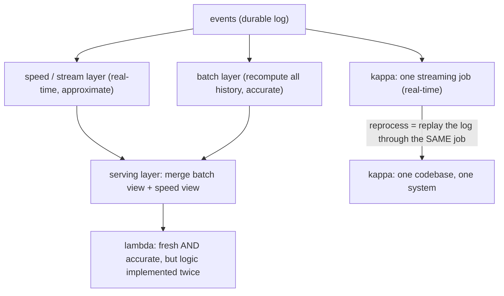

## Thesis

Stream and batch are the two models for computing over large data: **batch** processes a bounded, finite dataset all at once (high throughput, high latency --- a job over yesterday's data), while **stream** processes an unbounded, continuous flow record-by-record or in small windows as data arrives (low latency, but results are always "so far"). The core distinction is **bounded versus unbounded data**, and it forces different mental models: batch has a natural "end," so aggregations are simple and correctness is easy; streaming has no end, so you compute over **windows** of time, must handle **out-of-order and late** data (via **watermarks**), and must define what **exactly-once** means when records can be reprocessed across failures. The design decisions are which model fits the requirement (latency versus throughput versus correctness), how to window and cope with event-time skew, and the architecture that reconciles both --- **lambda** (run batch and stream in parallel and merge) versus **kappa** (stream-only, reprocess history by replaying the log).

## Sub

**Why: compute over huge data --- bounded (batch) or unbounded (stream)** -> **batch (finite, high-throughput, simple correctness) vs stream (continuous, low-latency, windowed)** -> **windowing, event-time vs processing-time, watermarks + late data, exactly-once** -> **zoom out** to lambda vs kappa architectures, when each model fits, and the processing frameworks (MapReduce / Spark / Flink) that run them.

## Spine

- **Batch and stream differ on bounded versus unbounded data** --- batch processes a finite dataset to completion (there is an "all the data," so aggregations and correctness are straightforward, at the cost of latency); stream processes an infinite flow as it arrives (results are continuous and low-latency, but always partial and harder to get exactly right).
- **Streaming forces you to reason about time and windows** --- with no end to the data you aggregate over **windows** (tumbling, sliding, session), and you must distinguish **event time** (when it happened) from **processing time** (when you saw it), because records arrive out of order and late.
- **Watermarks and exactly-once are the hard streaming problems** --- a **watermark** is the system's estimate that "event time has advanced to here," letting you decide when a window is complete despite stragglers (and what to do with data later than that); and **exactly-once** processing (each record affects the result once, even across failures and replays) requires idempotency, checkpointing, and transactional sinks.
- **The architecture reconciles both models** --- **lambda** runs a batch layer (accurate, slow) and a speed/stream layer (fast, approximate) in parallel and merges them; **kappa** drops the batch layer and does everything as streaming, reprocessing history by **replaying the log** --- and you pick the processing model per requirement (latency vs throughput vs correctness).

## Companion Notes

### walk

Computing over data in motion and at rest

One pipeline walked from a nightly batch job to a streaming one --- why bounded-vs-unbounded data is the core split, how batch trades latency for simple correctness and streaming trades simplicity for low latency, why streaming forces windows and event-time reasoning with watermarks for late data, what exactly-once really means, and how lambda and kappa architectures reconcile the two.

Say it as one distinction and its consequences: bounded (batch, high-throughput, simple) vs unbounded (stream, low-latency, windowed) -- and streaming's hard parts (event-time vs processing-time, watermarks + late data, exactly-once) plus the lambda/kappa architecture choice.

### drill

Stream and batch reps

Graded reps on batch vs stream, windowing, event-time vs processing-time, watermarks, exactly-once, and lambda vs kappa --- the ones that separate "we process the data" from a pipeline that windows correctly, handles late data, and gets its correctness/latency trade right.

Anchor on bounded-vs-unbounded (batch simple/high-latency vs stream low-latency/windowed), the time model (event-time vs processing-time, watermarks for late data), exactly-once (= at-least-once + idempotent/transactional sink), and lambda (batch + speed) vs kappa (stream-only + replay).

### wb

Whiteboard

Rebuild the streaming correctness story from memory --- how an event-time window fires on a watermark despite out-of-order data, and how lambda and kappa differ --- with only the cues in front of you.

Draw the window and the watermark first --- an event lands in the window of its own timestamp, and the window fires when the watermark crosses its end. If you can draw that, the late-data policy and the architecture fall out of it.

### sys

System Map

Zoom out: stream and batch sit between the raw data (a log, a table, a change stream) and the served result, and the model you pick ripples into time, state, correctness, and architecture.

Lead with the axis, not the frameworks --- "bounded data goes to batch, unbounded to stream, and the freshness requirement decides." Flink vs Spark is a detail; bounded-vs-unbounded is the spine.

### trade

Trade-offs

The calls an interviewer drills --- batch vs stream, event-time vs processing-time, lambda vs kappa, the window type, the watermark delay --- each with the constraint that flips it.

Always name what forces the choice. The honest answer is almost always "it depends on how fresh the result must be and how out-of-order the data is" --- never defend streaming or event-time as universally right.

### model

Model Answers

Full spoken scripts --- the beats in order, the way you'd actually say them, from the freshness reframe through watermarks to the architecture.

Steal the frame, not the words --- open on "bounded vs unbounded, decided by freshness," and name the one honest limit (you can never prove all late data has arrived) before they ask.

### num

Numbers

Back-of-envelope the freshness gap between batch and streaming, and the events a window holds --- the numbers that decide whether streaming's complexity is worth paying for.

Lead with the freshness ratio --- if streaming is a hundred times fresher and nobody uses that freshness, the number just argued you out of streaming.

### rf

Red Flags

What sinks the round --- windowing by arrival time, streaming everything by default, claiming exactly-once because "the engine checkpoints" --- and the line that flips each.

Name what the interviewer hears --- "would give wrong aggregates the moment data arrives late" is the fastest way to look like you've never run a real pipeline.

### open

30-Second

The opener and the close --- the whole batch-vs-stream decision in one breath, or the mechanism when they want mechanism.

Match the altitude --- open on the bounded-vs-unbounded split and the freshness question, and land on watermarks, effectively-once, and kappa as the real depth.

## Drill

all | All three tiers, mixed --- the way a real loop escalates: baseline mechanics, then the failure modes, then judgment about whether streaming is even the right tool. The bar rises from "I can define batch vs stream" to "I know exactly-once is really effectively-once and why I'd default to batch."
SDE2 | batch vs stream, latency/throughput, windows, event time
SDE3 | window types, watermarks, late data, state, exactly-once
Staff | exactly-once end-to-end, lambda vs kappa, scaling, when not to

### SDE2 | batch vs stream

What is the core difference between batch and stream processing?

**Bounded versus unbounded data.** **Batch** processes a **finite, complete dataset** --- "all of yesterday's transactions," "this table" --- as a single job that reads the whole input, computes, and produces a result, then finishes. Because the data has a definite beginning and end, everything is simpler: aggregations are exact (you have all the records), there is a clear notion of "the answer," and reprocessing is just re-running the job. The cost is **latency** --- you wait for the dataset to be collected and the job to run, so results are as fresh as your batch interval (hourly, nightly). **Stream** processes an **unbounded, continuous flow** of records as they arrive --- an endless sequence with no "end" --- computing incrementally, record-by-record or in small time windows, and emitting results continuously. Because there is no end, results are always **partial** ("the count so far," "the average over the last minute"), and you must decide *when* a result is "done enough" to emit (windowing) and how to handle records that arrive late or out of order. The benefit is **low latency** --- results update within seconds of an event, not on a batch cycle. So the one-line distinction: batch = compute over a finite dataset all at once (simple, high-latency); stream = compute over an infinite flow as it arrives (low-latency, but partial and harder to get exactly right). The unbounded nature is what makes streaming genuinely harder --- everything else (windows, watermarks, exactly-once) follows from "the data never ends."

Follow: You keep calling streaming results "partial." If the stream never ends, is any streaming number ever actually final?
The *global, all-time* aggregate is never final --- but that's not what you emit. **Windowing** converts "count everything" (never done) into "count per minute" (done the moment that minute's window closes). A window's result is provisional while its watermark is still climbing, **final once the watermark passes its end**, and --- if you allow lateness --- revisable for a grace period after that. So "partial" means the all-time total never settles; each *windowed* result does. You trade one un-finishable number for a stream of finished per-window ones.

Follow: Is bounded-versus-unbounded really fundamental, or is a batch just a stream you've chopped into a finite piece?
The modern unifying view (Google's Dataflow model, Beam, Flink) is exactly that: **batch is the special case of streaming where the data is bounded**, so one global window covers all of it and the watermark jumps to +infinity --- everything has arrived, so windows, late data, and long-running state all become trivial. That's why one engine can run both. But the distinction still earns its keep operationally: bounded data lets you *skip* watermarks, a late-data policy, and a long-lived checkpointed job entirely --- which is why batch stays genuinely simpler even when you frame it as "streaming with an easy special case."

Senior: Framing the split as bounded-versus-unbounded, then knowing batch is the easy special case of streaming (bounded means one global window with the watermark at +infinity) rather than treating them as two unrelated tools --- is what reads as someone who's actually held both models.
Speak: Lead with the one axis: "batch is a finite dataset computed all at once --- simple and exact but only as fresh as its cadence; stream is an unbounded flow computed as it arrives --- low-latency but partial." Then the deciding question is always freshness: hours is fine means batch, seconds matter means stream.

### SDE2 | what batch processing is

Describe batch processing and the MapReduce/Spark mental model.

Batch processing runs a **job over a large, static dataset**: read all the input, transform and aggregate it in parallel across many machines, write the output. The canonical mental model is **MapReduce**: **map** each input record to intermediate key-value pairs in parallel across the cluster (e.g. map each log line to `(url, 1)`), **shuffle** to group all values for the same key onto the same machine, then **reduce** each key's values to a result in parallel (e.g. sum the 1s per url to get counts). This is powerful because it makes **massive parallelism** easy --- the framework partitions the data, runs map/reduce on many nodes, handles distribution and failures (re-running failed tasks) --- so you process terabytes by expressing a simple map and reduce and letting the engine parallelize. Modern engines like **Spark** generalize this: they keep intermediate data in memory and express computations as a DAG of transformations (map, filter, join, aggregate) over distributed datasets, which is much faster than classic disk-based MapReduce for multi-step jobs, but the core idea is the same --- **partition the data, compute in parallel, shuffle to group, aggregate**. Batch's strengths are **high throughput** (process enormous volumes efficiently in one pass), **simple exact correctness** (you have all the data), and **easy reprocessing** (re-run the job on new/corrected data). Its weakness is **latency** --- results are only as fresh as the batch cadence. It is the right tool for large-scale analytics, ETL, report generation, and training data prep --- anywhere you compute over a complete dataset and can tolerate the latency of a scheduled run.

Follow: If MapReduce and Spark share the same model, why did Spark largely replace classic MapReduce?
Classic MapReduce **writes intermediate results to disk (HDFS) between every map and reduce stage**, and a real job chains many stages --- so a multi-step or iterative computation pays a full disk round-trip per stage. Spark keeps intermediate data **in memory** and expresses the whole job as a **DAG of transformations** it can pipeline and optimize across stages, spilling to disk only when data exceeds memory. For iterative workloads that reuse a dataset (gradient descent over the same data a hundred times) that's often 10--100x faster. The model --- partition, map, shuffle, reduce --- is identical; Spark changed the *execution*: DAG scheduling and in-memory caching instead of rigid, disk-materialized two-stage MapReduce.

Follow: Where does the shuffle actually cost you, and why do people obsess over it?
The **shuffle** is the all-to-all data movement that regroups intermediate records by key so each reducer sees every value for its keys --- and it's the expensive part because it's **network- and disk-bound**: every mapper's output is partitioned, written, transferred across the cluster, and merged. It's where **data skew** bites (one hot key ships a giant partition to one reducer, which straggles while the rest finish), and where you tune --- a **map-side combine** to shrink what crosses the network, a **broadcast join** to avoid shuffling the big side, or better partitioning. Map and reduce are embarrassingly parallel and cheap; the shuffle is the coordination cost, so "minimize and de-skew the shuffle" is most of batch performance work.

Senior: Knowing that MapReduce made *distribution* the framework's job --- partition, schedule, shuffle, re-run failed tasks --- so a programmer expresses only two pure functions, and that Spark kept the model but moved execution onto an in-memory optimizable DAG, is the "I understand why batch scales" depth, not just "it runs on a cluster."
Speak: Give the arc in one breath: "**map** each record to key-value pairs in parallel, **shuffle** to group all values by key, **reduce** per key --- and the framework owns partitioning, scheduling, the shuffle, and re-running failed tasks." Then add that Spark generalizes it to an in-memory DAG, much faster for multi-step jobs, same essence.

### SDE2 | what stream processing is

Describe stream processing and how it differs mechanically from batch.

Stream processing computes over an **unbounded flow of records as they arrive**, continuously, rather than over a static dataset in one shot. Mechanically: records flow in from a source (a message log like Kafka, a change stream, events), a topology of **operators** (map, filter, aggregate, join, window) processes each record (or small groups) as it comes, maintaining any needed **state** (running counts, window contents) in the stream processor, and results are **emitted continuously** as computations update. The differences from batch: it is **always running** (a long-lived job, not a start-finish job), it processes data **incrementally** (one record or a small window at a time, updating results), it must maintain **state across records** (a batch job sees all data at once; a stream job accumulates state as records flow), and it produces **continuously-updating, partial results** (the "current" count/average, revised as more data arrives). Because the data never ends, streaming introduces concerns batch never has: **windows** (you can't aggregate "all" data, so you aggregate over time windows), **time semantics** (event-time vs processing-time, since records can arrive out of order), **watermarks** (deciding when a window is complete), and **exactly-once across failures** (a long-running job must recover its state and not double-count on restart). Frameworks like **Flink**, **Kafka Streams**, and **Spark Structured Streaming** provide these primitives. The upside is **low latency** (results within seconds of an event), making it right for real-time analytics, fraud detection, live dashboards, alerting, and any "act on data as it happens" use case --- at the cost of the added complexity that unbounded, out-of-order data brings.

Follow: You said a stream job keeps state "in the processor." Where does that state actually live, and what happens to it when a worker dies?
It lives in a **state backend** local to each operator instance --- on the JVM heap for small state, or an embedded **RocksDB** on local disk when state exceeds memory, as Flink does --- partitioned by key so each key's state sits on the node processing it. If a worker dies that local state would be lost, so the engine **periodically checkpoints**: an asynchronous **snapshot** of all operators' state *plus* the source offsets, written to durable storage (S3/HDFS). On failure the job **restores from the last checkpoint** --- state and offsets together --- and resumes. So state is fast-and-local for processing, but its *durability* comes from checkpointing to remote storage, which is also the foundation of exactly-once.

Follow: A long-running job accumulates state as new keys keep arriving. Doesn't it eventually run out of memory?
It will, if you never bound it --- **unbounded state is the classic streaming failure**. You bound it structurally: **windowing** clears a window's state once it fires plus allowed-lateness; **state TTL** expires keyed entries untouched for some period; session and dedup state is evicted after its gap. For genuinely large keyed state you use a spillable backend (RocksDB) so it's disk- not memory-bound, with incremental checkpoints. The rule is that every piece of state needs an eviction story --- a window that closes, a TTL, a compaction --- or the job is a memory leak with a long fuse.

Senior: Distinguishing the *processing* state (fast, local, keyed) from its *durability* (asynchronous checkpoints of state+offsets to remote storage), and immediately naming that unbounded state must be bounded by windowing or TTL --- is what separates "I've operated a stream job" from "I've read about operators."
Speak: Mechanically: "a long-lived job of **operators** processing each record as it arrives, holding **keyed state** in a local backend, emitting continuously-updating results." Every difference from batch is a consequence of *unbounded* --- always-on, incremental, stateful, partial results --- which is what forces windows, event-time, watermarks, and checkpointing.

### SDE2 | latency vs throughput

Why is batch high-throughput/high-latency while streaming is low-latency, and what does that trade mean?

It's a direct consequence of *when* they process data. **Batch** waits to accumulate a large dataset and then processes it **all at once**, which is **throughput-efficient** --- one pass over a huge volume amortizes overhead, enables bulk optimizations (sequential reads, large shuffles, vectorized operations), and maximizes work-per-unit-cost --- but inherently **high-latency**, because a result isn't available until the data is collected and the job runs (you see yesterday's numbers today). **Streaming** processes each record (or tiny window) **as it arrives**, which gives **low latency** (a result reflects an event within seconds) --- but generally **lower peak throughput per dollar** and more overhead, because you pay per-record processing costs, maintain continuous state, and can't batch work as aggressively (though modern stream engines mini-batch and are quite efficient). The trade means: choose based on **how fresh the result must be**. If a few hours (or a day) of staleness is fine and you want maximum efficiency over huge volumes --- analytics, reports, ETL --- **batch**. If results must reflect events within seconds --- fraud detection, live dashboards, alerting, real-time features --- **stream**, accepting more complexity and typically higher per-record cost. It's not that one is "better"; it's a latency-vs-simplicity/efficiency trade, and the requirement (how stale can the answer be?) decides. Many systems use both: batch for the bulk/accurate historical view, streaming for the fresh/real-time view --- which is exactly what lambda architecture formalizes.

Follow: Modern stream engines mini-batch and are "quite efficient." Is the throughput gap between batch and streaming even real anymore, or is it folklore?
Narrowed but real. Micro-batching (Spark Structured Streaming) and pipelined operators (Flink) recover much of batch's efficiency by amortizing overhead over many records, so a tuned stream job sustains high throughput. But batch still wins **peak throughput per dollar** on bounded reprocessing, because it can do things a live stream can't: **large sequential sorted scans**, latency-unconstrained **massive shuffles**, columnar/vectorized execution end to end, and running flat-out on transient capacity then releasing it. Streaming pays a **continuity tax** --- always-on resources, per-record and keyed state, watermark bookkeeping, checkpointing. So for a one-off recompute of a year of data, batch is still cheaper; for live results, streaming's per-record cost buys the latency. It's a continuity tax, not folklore.

Follow: Give me the decision rule as a number, not a vibe. When does "a few seconds fresher" actually justify streaming's cost?
The rule is **latency requirement times the value of that freshness**. Quantify the gap: batch freshness is roughly its interval plus runtime (a 6-hour batch is up to ~6 hours stale); streaming freshness is roughly window size plus watermark delay (tens of seconds). If that gap has real value --- a fraud decision within seconds to *block* a transaction, an alert within seconds to page before an outage widens --- streaming is justified. If the result is read off an hourly dashboard, being 30 seconds fresh instead of an hour buys nothing and you've paid the full streaming tax for freshness nobody consumes. So name *who reads the result and how fast they act*; if their action cadence is slower than the batch interval, batch wins.

Senior: Grounding the trade in how fast someone *acts* on the result --- and being honest that modern engines narrowed but didn't erase batch's peak-throughput-per-dollar edge on bounded reprocessing --- rather than reciting "batch is throughput, stream is latency" as a slogan, is the judgment a senior round rewards.
Speak: "It's about *when* they process: batch accumulates and processes in one pass, amortizing overhead for max throughput but paying latency; streaming processes each record as it arrives for low latency at higher per-record cost. So choose by how stale the answer can be --- hours fine means batch, seconds matter means stream --- with micro-batch as the middle ground."

### SDE2 | what a window is

Why does stream processing need windows, and what is a tumbling window?

Because the data is **unbounded**, you cannot compute an aggregate over "all" of it (there is no "all" --- it never ends), so instead you compute aggregates over **windows**: bounded slices of the stream, usually by time. A window turns "count all events" (impossible on an infinite stream) into "count events **per minute**" (a well-defined, emittable result) --- it's how you get finite, meaningful aggregates out of an endless flow. A **tumbling window** is the simplest kind: **fixed-size, non-overlapping, contiguous** time intervals --- e.g. every 1-minute window `[12:00, 12:01)`, `[12:01, 12:02)`, and so on, each event belonging to exactly one window. You aggregate within each window (count, sum, average) and emit a result when the window closes. Tumbling windows are right for **periodic, non-overlapping** aggregates: "requests per minute," "revenue per hour," "errors per 5-minute bucket." Other window types (sliding, session) handle overlapping or activity-based grouping, but tumbling is the baseline. The key idea to convey: windowing is the fundamental adaptation streaming makes to unbounded data --- you can't wait for the end (there isn't one), so you carve the stream into time windows and emit a result per window, which is what makes continuous aggregation possible. And once you have windows, the next question is *when* a window is complete (given late/out-of-order data) --- which leads to event-time and watermarks.

Follow: A tumbling window has hard edges. An event at 11:59:59 and its causally-related event at 12:00:01 land in different windows. Isn't that arbitrary?
Yes --- **any hard boundary splits activity that straddles it**, which is a real limitation of fixed windows and exactly why the other types exist. If you care about *rolling* behaviour across the boundary, a **sliding window** smooths it (overlapping windows, so the pair is seen together in some window). If the natural unit is a *burst of related activity*, a **session window** groups by inactivity gaps rather than a clock, so the two stay in one session as long as they're close in time. Tumbling is right when the question genuinely is "per fixed interval"; when the boundary is arbitrary for your question, that's the signal to pick sliding or session. The window type should match the *shape of the question*, not default to tumbling.

Follow: What decides the window *size*? Isn't picking "1 minute" just as arbitrary?
Size is a **latency-versus-signal trade** set by the use case. Smaller windows emit sooner and react faster (a 10-second window for near-real-time alerting) but hold fewer events, so the aggregate is **noisier** and you fire more often --- more state churn and downstream writes. Larger windows are smoother and cheaper to emit but **stale**, since you wait the whole window for a result. So size it to "how fresh must this metric be, and how much smoothing does it need": sub-minute for live ops signals, minutes-to-hours for dashboards and billing. And size interacts with the watermark delay --- total freshness is roughly window plus watermark delay --- so you tune both together against one latency budget.

Senior: Recognizing that the window *type* matches the shape of the question (fixed interval -> tumbling, rolling -> sliding, activity burst -> session) and that window *size* is a latency-versus-smoothing trade tied to the watermark delay --- rather than reflexively answering "1-minute tumbling" --- is the modeling maturity that reads as senior.
Speak: "Unbounded data has no 'all,' so you aggregate over **windows** --- bounded slices, usually by time. A **tumbling** window is the simplest: fixed-size, non-overlapping, each event in exactly one --- right for periodic disjoint buckets like requests per minute." Then flag that sliding and session handle rolling and activity-burst shapes.

### SDE2 | event time vs processing time

What's the difference between event time and processing time, and why does it matter?

**Event time** is *when the event actually happened* --- the timestamp embedded in the record (a click at 12:00:03, a transaction at 09:15). **Processing time** is *when the stream processor observed/handled the record* (it arrived at the processor at 12:00:07). They differ because there's a delay --- often variable --- between an event occurring and the processor seeing it: network latency, buffering, retries, a mobile device that was offline and uploads later, a partition that lagged. This matters enormously for **correctness of windowed aggregates**. If you window by **processing time**, a "12:00-12:01 window" contains whatever *arrived* in that wall-clock minute --- which mixes events that actually happened at different times and misplaces late-arriving events (an event that happened at 11:59 but arrived at 12:01 lands in the wrong window). If you window by **event time**, the "12:00-12:01 window" contains events that *happened* in that minute regardless of when they arrived --- which is what you almost always actually want ("how many purchases happened between 12:00 and 12:01?"). The catch: with event-time windowing, records arrive **out of order** (a later-happening event can arrive before an earlier one) and **late** (after their window would naively close), so you need a mechanism to decide when an event-time window is "complete enough" to emit despite stragglers --- that mechanism is the **watermark**. So the distinction matters because event-time is usually the *correct* basis for aggregation, but it forces you to handle out-of-order and late data, which processing-time windowing sidesteps at the cost of being wrong when arrival is delayed.

Follow: Is processing-time windowing ever the *right* choice, or is it just always wrong?
It's right when the question is genuinely *about arrival*, or when arrival delay is negligible and simplicity is worth it. Legitimate uses: **monitoring the pipeline itself** ("records ingested per second" is a processing-time question --- you *want* wall-clock), **triggering on ingestion lag**, or a rough real-time counter where small skew doesn't matter and you don't want the cost of watermarks and late-data handling. Processing-time windows are simpler (no watermarks, no out-of-order, lower latency) and *correct* when arrival approximates occurrence. They're wrong only when used to answer an **event-time question** under real transport delay --- then delayed events land in the wrong window. So it's not "always wrong"; it's "wrong for event-time questions," and knowing which kind you have is the skill.

Follow: Where does the event-time timestamp even come from, and what if the producer's clock is skewed?
It comes from the **event itself** --- a timestamp the producer stamps at occurrence, carried in the record. That's a real dependency: with **skewed producer clocks** your event-time is only as good as their clocks, and a device with a wildly wrong clock can place events in absurd windows or drag the watermark. Mitigations: stamp the time as close to a source of truth as possible (server-side ingestion time if the client clock is untrusted, or the source DB's commit timestamp for CDC), **clamp or reject** timestamps outside a sane bound, and handle far-future timestamps specially so one bad clock can't shove the watermark ahead and prematurely fire --- and thus drop --- everyone else's windows. Event-time correctness assumes a trustworthy timestamp, so part of the design is deciding whose clock you trust.

Senior: Not dismissing processing-time as simply "wrong" but naming its legitimate uses (pipeline monitoring, ingestion-rate), and knowing that event-time correctness hinges on a trustworthy source timestamp so clock skew is a real design concern --- is the nuance that separates a memorized answer from a lived one.
Speak: "**Event time** is when it happened, the timestamp in the record; **processing time** is when the processor saw it. They diverge because arrival is delayed and reordered. I window by event time almost always, because the question --- 'orders between 12:00 and 12:01' --- is about when things happened; processing-time misplaces delayed events. The price event-time charges is out-of-order and late data, which is what watermarks handle."

### SDE2 | a real example of each

Give a concrete example where batch is right and one where streaming is right, and why.

**Batch is right --- a nightly financial/analytics report.** Say you produce a daily revenue report per product across all of yesterday's transactions. The dataset is **bounded** (all of yesterday), a **few hours of latency is fine** (the report is read the next morning), you want **exact correctness** (financial numbers, all data included), and the volume is large (best processed efficiently in one pass). A batch job that runs after midnight over the complete day's data is ideal: simple, exact, high-throughput, easy to re-run if a bug is found. Streaming would add complexity (windows, watermarks, exactly-once) for a freshness the use case doesn't need. **Streaming is right --- real-time fraud detection.** A payment system must flag a suspicious transaction **within seconds** to block it before completion. Here latency is everything (a fraud result tomorrow is useless), the data is **unbounded** (transactions flow continuously), and you compute over recent windows ("this card's spend in the last 5 minutes," "velocity of transactions") to score each event live. A stream processor consuming the transaction stream, maintaining per-card windowed state, and scoring each transaction as it arrives is the only viable model --- batch's latency would defeat the purpose. The contrast captures the decision rule: **batch when the data is bounded and staleness is acceptable and you want simple exact efficiency** (reports, ETL, analytics); **stream when results must reflect events within seconds** (fraud, alerting, live dashboards, real-time features) --- the freshness requirement is the deciding factor.

Follow: Fraud detection --- couldn't you just run a batch job every minute and call it near-real-time? Why does it *have* to be streaming?
For many "fairly fresh" needs a **micro-batch every minute is the right, simpler answer**. Whether it *has* to be true streaming turns on two things: the **latency budget** and the **statefulness**. If fraud must be blocked within *seconds*, before the transaction completes, a per-minute batch's up-to-a-minute lag is too slow --- you'd approve fraud you could have caught. And fraud scoring is **stateful per entity** ("this card's velocity in the last 5 minutes," "spend vs baseline"), which a stateless batch recomputes from scratch each run while a stream maintains it incrementally. So the test is: does the decision act within seconds, and does it need continuously-maintained per-key state? Two yeses -> streaming. A minute of latency fine and a simple recompute -> micro-batch. Match the tool to the latency; don't assume real-time means streaming.

Follow: Give me a genuinely ambiguous case --- where reasonable engineers disagree on batch vs stream --- and how you'd decide.
**Daily user-engagement metrics** for a product dashboard. Batch: run nightly, exact, simple, reprocessable, read next morning --- freshness doesn't matter. Streaming: product wants numbers updating through the day to react to a launch live. Reasonable people disagree because it hinges on **whether anyone acts on intraday freshness**. I'd ask the consumer: "if this were 12 hours stale, what would you do differently?" If the honest answer is "nothing, we review it in standup," batch. If it's "we'd pause a broken experiment mid-day," intraday freshness has value --- so I'd do **hourly micro-batch** first (most of the freshness, little of the tax) and go full streaming only if sub-minute genuinely matters. The tiebreaker is always the value of freshness to a *real decision*, not which is more modern.

Senior: Not treating "real-time" as automatically "streaming" --- offering micro-batch as the middle ground and deciding ambiguous cases by what decision the freshness actually changes --- is exactly the restraint that reads as senior rather than resume-driven architecture.
Speak: "**Batch** for a nightly revenue report: bounded data, hours of staleness fine, exact numbers, high volume --- simple and right. **Streaming** for fraud: flag within seconds to block, unbounded flow, per-card windowed state scored live. The deciding factor is the freshness the use case genuinely needs --- and I'd offer micro-batch when it's in between."

### SDE3 | window types

Compare tumbling, sliding, and session windows and when you'd use each.

They differ in how they slice the stream. **Tumbling**: fixed-size, **non-overlapping**, contiguous intervals (every 1-minute `[12:00,12:01)`, `[12:01,12:02)`); each event is in exactly one window. Use for **periodic, disjoint** aggregates --- "requests per minute," "revenue per hour," "errors per 5-min bucket" --- where you want a clean result per interval. **Sliding**: fixed-size windows that **overlap**, advancing by a step smaller than the window (a 5-minute window sliding every 1 minute, so windows are `[12:00,12:05)`, `[12:01,12:06)`, ...); each event can belong to **multiple** windows. Use for **moving/rolling** aggregates --- "average over the last 5 minutes, updated every minute," "rolling 1-hour count" --- where you want a smoothed, continuously-updated view rather than disjoint buckets. **Session**: **variable-size**, activity-based windows defined by a **gap of inactivity** --- events are grouped into a session that stays open as long as events keep arriving within a timeout, and closes after a gap (e.g. a user's activity session ends after 30 minutes of no events). Use for **per-entity activity bursts** --- "a user's browsing session," "a device's active period" --- where the natural unit is a burst of related activity of unpredictable length, not a fixed clock interval. The choice follows the question: disjoint periodic buckets -> tumbling; rolling/overlapping averages -> sliding; activity grouped by inactivity gaps -> session. All three are event-time based (so all need watermarks for late data), and sliding windows cost more (each event in many windows -> more state/computation), which is a consideration at scale.

Follow: Sliding windows put each event in many windows --- you said that costs more state. Concretely how much more, and how do engines keep it from exploding?
The overlap factor is **window size divided by slide** --- a 5-minute window sliding every minute puts each event in 5 windows, so naively 5x the state and aggregation work; a 1-hour window sliding every second is 3,600x, clearly untenable. Engines avoid the blowup with **incremental / paned aggregation**: slice time into small **panes** (the slide size), aggregate each pane once, and compute a sliding window as the combination of its panes --- so an event is aggregated into *one* pane and windows are cheap sums of panes. This works for **associative, incrementally-combinable** aggregates (sum, count, min/max); for holistic ones (exact median, distinct-count) you approximate with a mergeable sketch (HyperLogLog) or pay more. So the cost is real but bounded by paning for the common aggregates; what to watch is a huge size-to-slide ratio with a non-incremental aggregate.

Follow: Session windows depend on a gap timeout. How does the engine decide a session has *ended* on an unbounded, out-of-order stream, and what if a late event should have kept it open?
A session stays open while events arrive within the **gap**, and is considered **ended when the watermark passes (last-event-time + gap)** --- the same watermark machinery, because "no more events within the gap" is an event-time judgment, not wall-clock. The subtlety is real: sessions are **dynamically merged**. A late event landing between two already-formed sessions (or within the gap of one) causes the engine to **merge** the affected sessions into one and restate the result within allowed lateness --- session windows are mergeable, so a straggler can retroactively bridge sessions. Past the allowed-lateness bound it's dropped or side-output like any late event. So session end is watermark-driven and correctness under late data comes from session *merging*, which is why sessions cost more to maintain than tumbling windows.

Senior: Knowing sliding windows are made affordable by **paned/incremental aggregation** (and that it only works cleanly for associative aggregates), and that **session windows merge** under late data and end on the watermark --- rather than treating the three as interchangeable shapes --- is the implementation-level depth an SDE3+ round probes.
Speak: "**Tumbling**: fixed, non-overlapping --- disjoint periodic buckets. **Sliding**: fixed but overlapping, advancing by a step --- rolling averages, more state since each event is in several windows. **Session**: variable-size, defined by an inactivity gap --- per-entity activity bursts. All event-time based, so all need watermarks; the choice follows whether you want disjoint buckets, a rolling view, or activity grouping."

### SDE3 | event-time vs processing-time in depth

Why is event-time processing usually the "correct" choice, and what does choosing it force you to handle?

Event-time is usually correct because **the question you're answering is almost always about when things happened, not when you observed them**. "How many orders were placed between 12:00 and 12:01?", "what was the sensor's average reading in that minute?", "how many users were active in that hour?" --- these are about **event time**, and answering them by **processing time** gives wrong answers whenever arrival is delayed or reordered (an order placed at 11:59 that arrives at 12:01 is counted in the wrong minute; a batch of events from a phone that was offline all afternoon lands in the wrong windows entirely). Processing-time windows are only "correct" when arrival delay is negligible and uniform, which real systems rarely guarantee (mobile clients, network variance, backpressure, retries, partition lag all create skew). So event-time is the principled choice --- results are correct with respect to reality regardless of transport delays. What it **forces you to handle**: (1) **out-of-order arrival** --- a later-happening event can arrive before an earlier one, so you can't assume records come in event-time order and must place each in its correct window by its event timestamp; (2) **late data** --- an event can arrive *after* its window would naively have closed (the offline phone), so you need a policy for stragglers; (3) **deciding when a window is complete** --- since you can't wait forever for possible late events, you need an estimate of "event time has progressed past this window, emit it" --- which is the **watermark**; and (4) **a completeness-vs-latency trade** --- wait longer (higher watermark delay / more allowed lateness) to include more late data but emit results later, or emit sooner and risk missing stragglers. In short, event-time is correct but not free: it obligates you to reason about out-of-order and late data and to define, via watermarks and allowed lateness, when "enough" data has arrived to emit a window --- which processing-time windowing avoids by simply being wrong under delay.

Follow: You keep saying watermarks let you decide when a window is "complete." But you can never actually *know* all events arrived --- isn't a watermark just a guess you've dressed up?
It is a guess, deliberately --- and that's the honest core of streaming: **on an unbounded, out-of-order stream you can never prove completeness**, so every system must at some point *estimate* "event-time has progressed past here" and act. The watermark makes that estimate **explicit and tunable** instead of hidden. What makes it more than a bare guess: it's **monotonic** (never goes backward, so windows fire in order), **derived from observed data** (max event-time seen minus a lateness bound), and paired with an **allowed-lateness policy** so being wrong is *handled* --- a straggler past the watermark is dropped, updated, or side-outputted by explicit choice. So yes, a guess --- but a principled, monotonic, data-derived one with a defined failure policy, which is exactly what lets you make progress instead of waiting forever for completeness you can't have.

Follow: If event-time forces all this complexity, why not just make producers send events in order and on time, and sidestep it?
Because you fundamentally can't guarantee that in a distributed system, and trying is more fragile than handling disorder. Ordering-at-the-source would require every producer --- offline mobile clients, cross-region services, retrying senders, lagging partitions --- to buffer and emit in perfect global event-time order, which is impossible when producers are independent and networks unreliable; one offline phone breaks it. Even a partial attempt (per-partition ordering in Kafka) orders only *within* a partition, not across, and doesn't help a device offline for an hour. Event-time plus watermarks is **robust to exactly the disorder you can't eliminate**: it accepts events whenever they arrive and reconstructs correctness from their timestamps. You don't sidestep the complexity by demanding order; you absorb the disorder that's inevitable, which is cheaper and more reliable than preventing it.

Senior: Saying plainly that a watermark is an *estimate* you can't avoid making --- and defending it as a monotonic, data-derived estimate with an explicit late-data policy rather than pretending completeness is knowable --- is the intellectual honesty that distinguishes a Staff-track answer from "watermarks make windows complete."
Speak: "Event-time is usually correct because the question is about when things *happened*, not when I saw them --- and processing-time is wrong whenever arrival is delayed. Choosing it forces four things: out-of-order arrival, late data, deciding when a window is complete-enough (the watermark), and a completeness-versus-latency trade. Correct, but not free."

### SDE3 | watermarks

What is a watermark, and how does it let a stream decide when a window is done?

A **watermark** is the stream processor's assertion that **"event time has advanced to at least T"** --- i.e. "I believe I've now seen (essentially) all events with event-time <= T, so events older than T are unlikely to still arrive." It flows through the stream as a special marker interleaved with the data, and it's what lets an **event-time** system make progress on **unbounded, out-of-order** data: a window covering event-time `[12:00, 12:01)` can be **emitted (fired)** once the watermark passes 12:01, because the watermark asserts that essentially all events up to 12:01 have arrived --- so the window is "complete enough" to produce a result. Without watermarks, you could never close an event-time window (you'd wait forever for a possibly-later straggler); the watermark provides the "we've waited long enough, event time has moved past here" signal. How it's derived: the processor estimates the watermark from the data --- commonly "current max observed event-time minus an allowed-lateness bound" (e.g. watermark = newest event-time seen minus 10 seconds, tolerating up to 10s of out-of-orderness) --- so the watermark trails real event-time by a delay that reflects how out-of-order you expect data to be. The trade it encodes is **completeness vs latency**: a **more conservative** watermark (larger delay) waits longer, capturing more late events before firing (more correct, higher latency); a **more aggressive** watermark (smaller delay) fires sooner (lower latency, but may miss stragglers that arrive after it). And there's a companion notion --- **allowed lateness** --- for events that arrive *after* the watermark has passed their window: you either **drop** them, or keep the window's state a bit longer and **update** the emitted result when a late event arrives (a correction). So the watermark is the mechanism that reconciles "I need to emit results" with "data is out-of-order and might be late" --- it's the system's moving estimate of event-time progress, and setting its delay is how you dial the completeness/latency trade.

Follow: Your job reads from 8 Kafka partitions. One partition goes quiet --- no new events --- and your windows stop firing entirely. Why, and how do you fix it?
Because the operator's watermark is the **minimum of its input partitions' watermarks** --- it can only assert "event-time reached T" if *every* source reached T, otherwise a lagging source might still deliver an older event. A **silent partition never advances its watermark**, so the global watermark is pinned at that partition's last timestamp and **no window past it can fire** --- the whole job stalls even though 7 partitions are flowing. The fix is **idleness detection**: mark a source **idle** after a timeout of no data (Flink's `withIdleness`) so it's excluded from the min while quiet, letting the watermark advance on the active partitions; it rejoins when it resumes. You accept a small correctness risk (old events it later delivers may now be late), tuned by the idleness timeout. "Windows stopped firing" almost always traces to a stalled or idle partition holding the min watermark --- it's one of the most common streaming incidents.

Follow: Max-event-time-minus-a-fixed-bound assumes you know how out-of-order the data is. What if the out-of-orderness varies --- bursty, or worse at peak?
A **fixed bounded-out-of-orderness** watermark is the simple default, but it mis-serves variable disorder: too tight and you drop stragglers during bursts; too loose and you needlessly delay every result for a rare worst case. Options: (1) size the fixed bound to a **high percentile** of observed lateness (p99 of arrival-minus-event-time) --- cover most disorder at a fixed latency cost, the common pragmatic choice; (2) an **adaptive** watermark that widens when it sees more disorder and tightens when the stream is orderly; or (3) keep a tight bound for low latency and lean on **allowed-lateness** to *restate* windows for the tail. In practice you **measure the actual lateness distribution** and set the bound from it, using allowed-lateness as the safety valve beyond it --- rather than guessing a constant.

Senior: The idle-partition stall (watermark = min across sources, so one silent partition freezes everything, fixed by idleness detection) is the single most telling watermark follow-up --- naming it unprompted, and sizing the delay from the *measured* lateness distribution rather than a magic constant, is a strong Staff signal.
Speak: "A watermark is the assertion that event-time has advanced to T --- 'I've seen essentially all events up to T' --- so a window fires once the watermark passes its end. It's roughly max-event-time-seen minus an allowed-lateness bound, trailing real time by a delay I tune, and that delay is the completeness-versus-latency dial: wait longer to catch late data, or fire sooner for lower latency."

### SDE3 | late and out-of-order data

An event arrives after its window has already been emitted. What are your options?

This is **late data** (the event's timestamp falls in a window whose watermark has already passed, so the window already fired), and you have three broad policies. (1) **Drop it** --- discard events later than the watermark/allowed-lateness bound. Simplest, and fine when a tiny fraction of stragglers won't materially affect the result (approximate analytics, dashboards) --- you accept a small inaccuracy for simplicity. (2) **Update/restate the result** --- keep the window's state for an **allowed-lateness** period beyond the watermark, and when a late event arrives within that grace period, **recompute and re-emit** the window's result (a correction/retraction), so downstream consumers get an updated value. This preserves accuracy at the cost of retaining state longer and handling result updates downstream (consumers must accept restatements). (3) **Route to a side output / dead-letter** --- send very-late events to a separate stream for special handling (log them, reconcile in a later batch job, alert if lateness is excessive) rather than dropping silently or updating inline. The choice is governed by **how much accuracy the late data affects** and **whether downstream can handle updates**: drop when stragglers are negligible and you want simplicity; update within a bounded allowed-lateness when accuracy matters and consumers can accept restated results; side-output for auditability or when lateness exceeds your grace period. Underlying all three is the recognition that in event-time streaming you **cannot** guarantee all data has arrived when you emit --- so you set a watermark (when to fire), an allowed-lateness (how long to still accept corrections), and a policy for beyond that (drop or side-output) --- explicitly choosing where you sit on the completeness-vs-latency-vs-complexity trade rather than pretending late data doesn't happen.

Follow: If you "update and re-emit" a window, downstream already consumed the first value. How does a consumer not double-count the correction?
The correction must be a **restatement of that window's value, not an additional delta**, and the consumer must apply it **idempotently by key**. Emit results keyed by (window, key) and have the sink **upsert** --- the corrected value *overwrites* the previous one for that (window, key), so re-emitting replaces rather than adds. If downstream instead does `total += value`, the restatement double-counts, which is the bug. Two clean patterns: an **upsert/keyed sink** (a DB row per (window,key) the correction overwrites, or a compacted Kafka topic keyed by (window,key) so the latest wins), or an explicit **retraction stream** ("-old, +new", as Flink's changelog/retract mode does) the consumer nets out. Either way the window result must be *addressable and replaceable* --- which is why "update the result" only works when downstream is built to accept restatements.

Follow: How do you actually *choose* between drop, update, and side-output? Give me the decision, not the menu.
By **how much the late data affects the answer and whether downstream can accept a change**. **Drop** when stragglers are a negligible fraction and the metric tolerates small error --- a live dashboard of approximate counts; simplest, an explicit accuracy-for-simplicity trade. **Update within allowed-lateness** when accuracy matters, the late-data volume is bounded, and downstream can take upserts --- billing-adjacent or engagement metrics that must be right. **Side-output** for events *beyond* the grace period or needing audit --- an offline phone dumping an hour of events, reconciled in a periodic batch correction rather than restated live. The governing question: is a late event's impact material, and can my consumer accept a corrected value? Immaterial -> drop; material and tolerant -> update; material but out-of-grace -> side-output. Set the allowed-lateness from the same measured lateness distribution as the watermark.

Senior: Knowing "update the result" only works if the window is **addressable and the sink upserts** (or you emit retractions) so corrections replace rather than double-count --- and choosing drop/update/side-output by materiality and downstream tolerance --- is the operational depth that separates handling late data from listing the options.
Speak: "Three policies. **Drop** stragglers past the watermark --- fine when negligible. **Update** within an allowed-lateness grace period --- recompute and re-emit a *restated* value, so downstream must accept corrections. **Side-output** very-late events to a separate stream for batch reconciliation. You're explicitly choosing where you sit on completeness-versus-latency-versus-complexity, not pretending late data can't happen."

### SDE3 | stateful stream processing

Why do stream processors need to manage state, and what does that entail?

Because most useful stream computations are **aggregations or joins that accumulate information across records** --- a windowed count needs the running count, a "last 5 minutes average" needs the window's contents, a stream-to-stream join needs to buffer records from each side, deduplication needs to remember seen ids, sessionization needs the open session. Unlike batch (which has all records at once and can compute in a pass), a stream sees records **one at a time over time**, so it must **remember** what it has seen so far --- that memory is **state**, and managing it is central to stream processing. What it entails: (1) **Keyed state** --- state is typically partitioned by a key (per-user, per-device, per-window) so aggregations are per-key and can be parallelized across the cluster (each key's state lives on one node); (2) **State backends** --- the state must be stored efficiently and scalably (in-memory for speed, often backed by an embedded store like RocksDB for large state that exceeds memory, as Flink does); (3) **Checkpointing/snapshots** --- because the job is long-running and machines fail, the state must be **periodically snapshotted to durable storage** so that on failure the job can **restore** its state and resume without losing accumulated aggregates (this is also the foundation of exactly-once --- see below); (4) **State growth management** --- unbounded state is a risk (keys accumulate forever), so you bound it via windowing (window state is cleared after the window closes + allowed lateness), TTLs on keyed state, and cleanup policies, or you'll run out of memory/storage. So stateful stream processing entails **partitioning state by key, storing it in a scalable backend, checkpointing it durably for fault tolerance, and bounding its growth** --- and it's precisely this state (and recovering it correctly on failure) that makes exactly-once processing both necessary and hard. A stateless stream (map/filter only) is easy; the moment you aggregate or join, state management becomes the core engineering problem.

Follow: Checkpointing snapshots a running, distributed job. How do you get a *consistent* snapshot without stopping the world when state on every node is changing constantly?
With **asynchronous barrier snapshotting** (Flink's Chandy-Lamport-style algorithm). The source injects a numbered **checkpoint barrier** into the stream; it flows downstream with the records. When an operator has received the barrier on all inputs (**barrier alignment**), it snapshots its state *at that point in the stream* and forwards the barrier --- so every operator snapshots at the same **logical cut**, not the same wall-clock instant. The state write is **asynchronous** (copy-on-write, or an incremental RocksDB snapshot uploaded in the background), so processing barely pauses. The result is globally consistent: "every operator's state reflects exactly the records up to this barrier," tied to the source offsets that produced it. On recovery you restore all operators to that cut and rewind the source to those offsets --- state and progress agree. No stop-the-world, because you snapshot a consistent *cut* of the stream, not a frozen moment of the cluster.

Follow: You bound state with windowing and TTL. But a stream-to-stream join buffers both sides --- what bounds *that*, and what happens to a record whose match never comes?
A **time-bounded join window** bounds it: you join only records whose event-times fall within a bounded interval (a "within 30 minutes" condition) and **evict** buffered state older than that interval --- past it a match is impossible, so the state is safe to drop. A never-matched record is handled by the join *type*: an **inner join** simply never emits for it (it ages out unmatched and is evicted); an **outer join** emits it null-padded **once the window closes** (the watermark passes the interval), so "an impression with no click in 30 minutes" is emitted as unmatched rather than buffered forever. So the join is bounded by an event-time interval plus eviction, and the never-matched record either quietly ages out (inner) or is emitted at window close (outer) --- never retained indefinitely. Drop the time bound and join state grows unbounded, which is the classic stream-join OOM.

Senior: Explaining checkpoint consistency as an **asynchronous barrier snapshot of a logical stream cut** (not a stop-the-world freeze), and bounding a stream-join with an **event-time interval plus eviction** with a defined outcome for never-matched records --- is the stateful-processing depth that marks a strong SDE3/Staff answer.
Speak: "Most useful stream computations accumulate across records --- a windowed count, a join, dedup --- so the processor must *remember*, and that memory is state. It entails: **keyed state** partitioned per key for parallelism, a scalable **backend** (RocksDB when it exceeds memory), **checkpointing** state+offsets to durable storage for fault tolerance, and **bounding growth** with windowing and TTL. The moment you aggregate or join, state management is the core problem."

### SDE3 | exactly-once basics

Why is exactly-once processing hard, and how is it typically approximated?

It's hard because **failures and retries naturally cause either duplicates or loss**, and eliminating both across a distributed, long-running, stateful pipeline is genuinely difficult. Consider: a stream processor consumes a record, updates state, emits output, then commits its progress (offset). If it crashes *after* emitting but *before* committing the offset, on restart it reprocesses that record --- **double-counting** (at-least-once). If instead it commits the offset *before* the work is durably done and crashes, the record is **lost** (at-most-once). Getting *exactly* once --- each record affects the result and output exactly one time despite arbitrary failures --- requires coordinating **state updates, output emission, and offset commits** so they all take effect together or not at all, which spans the source, the processor's state, and the sink. How it's typically achieved/approximated: (1) **Checkpointing with atomic state + offset** --- the processor periodically snapshots its state *and* the corresponding source offsets together (a consistent checkpoint, e.g. Flink's distributed snapshots); on failure it restores both, so it resumes from a point where state and progress agree --- no double-processing of already-reflected records within the engine. (2) **Idempotent operations** --- make the effect of processing a record idempotent (keyed by an id) so that reprocessing it doesn't change the result (at-least-once delivery + idempotent handling = **effectively-once**), which is the pragmatic backbone. (3) **Transactional sinks** --- for output, use a sink that supports transactions/atomic commit tied to the checkpoint (transactional Kafka producer, an idempotent upsert to a DB), so output is committed exactly once with the checkpoint rather than duplicated on replay. The honest framing is that true end-to-end exactly-once requires the whole path (source, processing, sink) to cooperate, and in practice you achieve **"effectively-once"** = at-least-once processing + idempotent/transactional application of effects, with checkpointing ensuring the engine's internal state is consistent. Claiming "exactly-once" without idempotent/transactional sinks and consistent checkpointing is a red flag --- the guarantee only holds when every stage participates.

Follow: You said "commit the offset after the work is durable" avoids loss. Walk me through the exact crash sequence and which guarantee each ordering gives.
Two orderings, opposite failure modes. **Commit offset first, then do the work**: crash *after* committing but *before* the work is durable -> on restart it resumes past that record, whose effect is **lost** (at-most-once). **Do the work, then commit the offset**: crash *after* the work but *before* committing -> on restart it **reprocesses** that record, so the effect happens **twice** (at-least-once). You almost always choose the second (work-then-commit, never lose) and kill the duplicate with **idempotency**: the reprocessed record produces the same keyed effect, so re-applying is a no-op. The residual is the window *between* doing the work and committing --- a crash there re-does the work, which is fine *if* it's idempotent and a silent bug if it isn't. The ordering picks your poison (loss vs duplicate), you pick duplicate, idempotency neutralizes it -> effectively-once. Loss is unrecoverable; a duplicate is recoverable with a dedup key, which is why at-least-once is the right base.

Follow: Idempotency needs a key. For a running windowed *sum*, what's the idempotency key --- there's no natural request id?
The key is the **(window, aggregation-key) address of the result**, and idempotency comes from the write being an **overwrite of the whole aggregate, not an increment**. A windowed sum recovered from a checkpoint recomputes the total *from the checkpointed state*, so on replay it produces the **same final value** for (window, key) --- and if the sink **upserts** that value by (window, key), re-emitting is idempotent no matter how often replay happens. The trap is a sink doing `running_total += emitted_value` (a delta), which double-adds on replay --- so never emit deltas from an at-least-once stream into a non-idempotent accumulator. For genuinely append-only sinks you dedup on a **deterministic per-result id** (hash of window+key+checkpoint). So there *is* a natural key --- the result's (window, key) address --- and idempotency is "upsert the recomputed aggregate," not "add a delta." Deltas plus at-least-once is the exactly-once illusion breaking.

Senior: Walking the **work-then-commit vs commit-then-work** crash sequence and naming which gives loss vs duplicate, then explaining that a windowed aggregate's idempotency key is its **(window, key) address with an upsert, never a delta** --- is the precise, mechanism-level exactly-once literacy an interviewer is really testing.
Speak: "It's hard because failures force either a duplicate or a loss, and killing both across a distributed stateful pipeline is genuinely difficult. You approximate it with three things: **consistent checkpointing** of state and offsets together, **idempotent operations** keyed by id, and a **transactional or idempotent sink**. Honestly it's **effectively-once** --- at-least-once plus idempotent application --- and claiming exactly-once without those is a red flag."

### SDE3 | the MapReduce mental model

Explain the MapReduce model and why it made large-scale batch processing tractable.

MapReduce expresses a batch computation as two user-defined functions the framework parallelizes: **map** --- applied to each input record independently, emitting intermediate key-value pairs (e.g. for word count, map each document to `(word, 1)` for each word); and **reduce** --- applied to all values sharing a key, combining them into a result (sum the `1`s per word to get the count). Between them the framework does the **shuffle** --- grouping all intermediate values by key and routing each key's values to the reducer responsible for it (a distributed group-by). The reason it made large-scale batch tractable is that it **separates the *what* from the *how* of distribution**: you write only the map and reduce logic (simple, sequential-looking functions), and the framework handles everything hard about running at scale --- **partitioning** the input across many machines, **scheduling** map and reduce tasks across the cluster, doing the **shuffle** (the network-heavy regrouping), **fault tolerance** (detecting failed tasks and re-running them on other nodes, since map/reduce tasks are deterministic and re-runnable), and **data locality** (running maps near their data). So a programmer who couldn't write a distributed system could still process terabytes by expressing a map and a reduce, and the framework made it parallel and fault-tolerant automatically. That abstraction --- **embarrassingly-parallel map, a shuffle to group, a parallel reduce, with the framework owning distribution and failure recovery** --- is the foundation of the batch world. Modern engines (Spark) generalize beyond the rigid two-stage model to arbitrary DAGs of in-memory transformations (faster for multi-step and iterative jobs), but they inherit the same essence: express the computation declaratively, let the engine partition, shuffle, parallelize, and recover. Understanding MapReduce is understanding *why* batch scales --- it turns distributed data processing into writing two pure functions.

Follow: MapReduce made batch tractable in the mid-2000s. Why did the industry move past raw MapReduce to Spark, Flink, and SQL engines --- what was actually painful?
Three pains. **Performance**: rigid two-stage, disk-materialized MapReduce paid a full HDFS round-trip between every map and reduce, so multi-stage and iterative jobs were slow --- Spark's in-memory DAG fixed it. **Expressiveness**: real computations are many joins and aggregations, but you had to hand-decompose each into a *chain* of map-reduce jobs, manually wiring intermediate outputs. Higher-level layers (Spark DataFrames, Hive/SQL-on-Hadoop, Flink's dataflow) let you write the *logic* and have the engine compile an optimized DAG. **Latency**: MapReduce is inherently batch --- no streaming --- so low-latency use cases needed a different model, which is where Flink and Kafka Streams came in. So the *ideas* --- express computation as parallel functions, let the framework own distribution and fault tolerance --- won permanently; what got replaced was the specific *execution* (two-stage, disk, batch-only) by faster in-memory DAGs, declarative APIs, and streaming.

Follow: Fault tolerance in MapReduce is "re-run the failed task." Why is that safe --- and when does it break down?
It's safe because map and reduce tasks are **deterministic, side-effect-free functions over immutable input partitions**: a task reads its split, computes, writes output; if it dies, the framework **re-runs it on another node** from the same immutable input and gets the identical result --- no coordination, no partial-state recovery, because there's no mutable state to corrupt. That determinism-plus-immutability is *why* re-execution works. It breaks when tasks **aren't deterministic or have side effects** --- a reducer writing to an external system can double-write on re-run (the same exactly-once problem), or a map using wall-clock/random values produces different output on retry. It also strains on a **straggler** (a slow node, often from skew, not a failure); the mitigation is **speculative execution** --- run a backup of slow tasks, take whichever finishes. So re-run-the-task is elegant *because* of functional purity over immutable data, and the cracks appear exactly where that purity is violated or where slowness, not failure, is the problem.

Senior: Explaining that MapReduce's *ideas* (parallel functions + framework-owned distribution/fault-tolerance) won permanently while its *execution* was replaced --- and that "re-run the task" is safe only because tasks are deterministic functions over immutable data (breaking on side effects, nondeterminism, or stragglers, hence speculative execution) --- is "I understand the foundation, not just the API" depth.
Speak: "MapReduce expresses a job as two pure functions the framework parallelizes: **map** each record to key-value pairs, **shuffle** to group by key, **reduce** per key. It made batch tractable by separating the *what* from the *how of distribution* --- you write map and reduce, and the framework owns partitioning, scheduling, the shuffle, fault tolerance (re-run failed tasks, since they're deterministic), and data locality. It turned distributed processing into writing two functions."

### Staff | exactly-once end to end

Walk through what it actually takes to get exactly-once semantics through an entire streaming pipeline.

End-to-end exactly-once requires **every stage --- source, processing, sink --- to participate in a coordinated commit**, because a guarantee is only as strong as its weakest link; a single non-idempotent sink turns the whole pipeline at-least-once. The pieces: **(1) A replayable source with committable offsets** --- the source (e.g. Kafka) must let you re-read from a known position and commit consumption progress *as part of* the processing commit, so on failure you resume exactly where the last committed checkpoint left off (no gap, no overlap). **(2) Consistent checkpointing of state + offsets** --- the processor periodically takes a **distributed snapshot** that atomically captures all operators' state *and* the source offsets that produced it (Flink's Chandy-Lamport-style barriers align a consistent cut across the whole dataflow), so a restore returns the entire pipeline to a coherent point where "state reflects exactly the records up to these offsets." This ensures the *engine's internal* effect of each record is exactly-once across failures. **(3) Transactional or idempotent sinks** --- output is the hard part, because emitting to an external system must also be exactly-once. Two approaches: **transactional sink** --- the sink participates in a two-phase commit tied to the checkpoint (a transactional Kafka producer, or a sink that writes then commits atomically with the checkpoint), so output becomes visible only when the checkpoint commits and is rolled back on failure --- output appears exactly once; or **idempotent sink** --- writes are keyed so replaying them is a no-op (an upsert by primary key, a dedup by event id), so even if the same output is emitted twice after a restart, the external state ends up as if once (**effectively-once**). **(4) End-to-end coordination** --- these must be tied together: the checkpoint commit is the transaction boundary that atomically advances offsets, persists state, and commits sink output. The staff-level honesty: **true exactly-once is a property of the whole path, achieved by consistent snapshots (state+offsets) plus transactional/idempotent sinks**, and where a transactional sink isn't available you deliberately design for **effectively-once via idempotency** (at-least-once + dedup/upsert). The common mistake is assuming the stream engine's internal exactly-once (checkpointing) gives you end-to-end exactly-once --- it doesn't unless the source is replayable and the sink is transactional or idempotent. So you audit every stage and either make it transactional or make its effects idempotent; anything else is at-least-once with duplicates leaking to the output.

Follow: Transactional sinks use a two-phase commit tied to the checkpoint. What's the failure window, and what breaks if the sink can't participate?
The classic risk is the **commit window**: the sink *pre-commits* (writes but doesn't make visible) as the checkpoint pre-commits, and *commits* (makes visible) on the checkpoint-complete notification. If the job crashes **after the checkpoint is durable but before the commit notification lands**, recovery must **re-issue the commit** for those pre-committed transactions --- so the sink's transactions must be **committable-by-id on recovery**, or you lose the pre-committed data or double-commit. Flink's `TwoPhaseCommitSinkFunction` remembers pending transactions in the checkpoint and re-commits on restore. It breaks if the sink **can't hold an open transaction across the checkpoint interval**, or has a **transaction timeout shorter than your checkpoint interval** (it aborts before you commit --- a real Kafka-transactional pitfall). When the sink genuinely can't do 2PC, you **fall back to idempotent upserts by key** --- effectively-once without distributed transactions, which is why idempotency is the pragmatic backbone.

Follow: You've got exactly-once end-to-end. Now a second consumer *you don't control* reads your output. Does your guarantee still hold for them?
Only if **they** are idempotent or read transactionally --- your guarantee ends at your committed output, it doesn't extend into a consumer you don't own. If your sink is a **transactional Kafka topic**, a downstream gets exactly-once *only if* it reads with `read_committed` isolation and manages its offsets transactionally; a naive consumer double-processing on its own restart reintroduces duplicates on their side. If your sink is an **idempotent store**, a consumer reading the *current value* sees each result once, but one tailing a *change stream* still sees multiple writes for a corrected window and must dedup. So exactly-once is a property of a *path*, and each new consumer is a **new segment** that must itself be idempotent or transactional. You can't hand exactly-once to an arbitrary downstream; you give them a **clean contract** (a transactional topic, or upserted rows with a version) and correct consumption is then their job. Same weakest-link rule, now crossing an ownership boundary.

Senior: Naming the concrete 2PC commit-window failure (crash after checkpoint, before commit-notify, so you must re-commit by id) and the **transaction-timeout-shorter-than-checkpoint** pitfall --- and being clear that exactly-once **stops at your committed output**, so a downstream you don't own must itself be idempotent or transactional --- is the end-to-end rigor that separates Staff from "the engine gives us exactly-once."
Speak: "End-to-end exactly-once needs *every* stage to participate --- it's only as strong as its weakest link. Three pieces: a **replayable source with committable offsets**, **consistent checkpoints** capturing state and offsets at one cut, and a **transactional or idempotent sink**. The common mistake is thinking the engine's internal checkpointing gives you end-to-end exactly-once; it doesn't unless the source replays and the sink participates. Realistically I design for **effectively-once** via idempotency."

### Staff | lambda architecture

What is the lambda architecture, what problem does it solve, and what's the criticism of it?

Lambda architecture runs **two parallel processing paths over the same data** and merges them: a **batch layer** that periodically recomputes results from the **complete historical dataset** (accurate, comprehensive, high-latency) and a **speed (streaming) layer** that processes **recent data in real time** (low-latency, approximate, covering just the gap since the last batch run), with a **serving layer** that **merges** the batch view and the speed view to answer queries (the authoritative batch result for older data, the fast streaming result for the most recent slice). It solves a real problem: you want **both** low-latency results (the speed layer) **and** eventually-accurate, reprocessable results (the batch layer) --- the batch layer gives correctness and the ability to reprocess all history (fix bugs, change logic, recompute from raw data), while the speed layer fills the freshness gap the batch cadence leaves. It also provides **fault tolerance and correction**: the batch layer periodically overwrites/corrects any approximation or error from the speed layer, so mistakes in the fast path are self-healing on the next batch run. The **criticism** (notably from Jay Kreps, who proposed kappa as the alternative) is **duplicated logic and operational complexity**: you must implement and maintain the **same business logic twice** --- once in the batch framework and once in the streaming framework --- keeping them consistent as requirements change (a notorious source of bugs and drift), and you operate **two complex distributed systems** plus a merge layer. That double-implementation and dual-operation burden is lambda's core weakness. So lambda is a pragmatic pattern that guarantees both freshness and accuracy by running batch and stream together, at the cost of maintaining two codebases and two systems --- which is exactly the pain kappa architecture set out to remove.

Follow: The serving layer "merges" the batch view and the speed view. How does that merge avoid double-counting the overlap, and what's the tricky boundary?
The merge is a **time-partitioned union with the batch view authoritative up to a cutoff**. The batch layer produces exact results up to the last completed run's watermark ("everything through 02:00"); the speed layer covers *only the recent slice since that cutoff* ("02:00 to now"). A query takes **batch results for the range batch covers and speed results only for the gap after the cutoff** --- no overlap to double-count *if the boundary is respected*. The tricky part is exactly that boundary: the speed layer must be **queryable by the same keys/time buckets** to union cleanly; when a new batch run completes, the serving layer must **advance the cutoff and discard the speed results now subsumed** by batch, atomically, or you briefly double-count the seam; and the speed layer's approximate values are **replaced, not added to**, by the next batch run (self-healing). So "merge" is really "batch is truth up to T, speed fills T-to-now, and each batch run ratchets T forward and overwrites the speed slice it now covers."

Follow: Jay Kreps called "implement the logic twice" lambda's fatal flaw. Is it *always* fatal, or is two implementations sometimes the right call?
Not always fatal --- it's a real cost you sometimes rationally pay. The critique bites hardest when batch and stream express *the same computation* in two frameworks that must stay bug-for-bug consistent. But two implementations is defensible when: the **batch recompute is a genuinely different, heavier computation** (a global join or an algorithm that only makes sense in batch) --- then it's two appropriate tools, not "the same logic twice"; you want a **batch-accuracy safety net independent of the stream** that catches *any* streaming bug or late-data gap, which some regulated contexts justify; or the org has a mature batch stack and streaming is a thin freshness add-on. Modern practice is that **capable engines plus replayable logs make kappa the default**, so you don't reach for lambda reflexively --- but genuine lambda earns its keep mainly when the exact path is a *different, heavier* computation or you specifically want an independent backstop.

Senior: Explaining the merge as **batch-authoritative-up-to-a-cutoff plus speed-fills-the-gap, each run ratcheting the cutoff and overwriting the speed slice** (the seam being the tricky part), and giving a nuanced take on "logic twice" --- fatal when it's literally the same computation duplicated, defensible when the batch path is genuinely different --- is the architecture judgment a Staff round rewards.
Speak: "Lambda runs **two paths over the same data**: a **batch layer** recomputing exact results from complete history and a **speed layer** processing recent data live, merged at a **serving layer** --- batch authoritative for older data, speed for the recent slice, each batch run self-healing the speed layer's approximations. Both fresh and accurate. The criticism, from Jay Kreps, is **duplicated logic** --- the same computation built and maintained twice, in two systems, which drifts. That's what kappa set out to remove."

### Staff | kappa architecture

What is the kappa architecture, how does it reprocess history without a batch layer, and when does it work?

Kappa architecture **eliminates the separate batch layer and does everything as stream processing** --- there is one processing paradigm (streaming) and one codebase, in contrast to lambda's dual batch+speed layers. Its key insight is that **a durable, replayable log (like Kafka with long retention) makes batch reprocessing unnecessary as a separate system**: instead of a batch job over a stored dataset, you **reprocess history by replaying the log through the same streaming job**. So when you need to recompute (fix a bug, change logic, backfill a new metric), you don't run a different batch pipeline --- you spin up a **new instance of the streaming application, reset it to the beginning of the retained log, and let it reprocess all the historical events** through the identical streaming logic, producing a fresh output; then you switch consumers to the new output. This gives you the reprocessing capability lambda used the batch layer for, but with **a single implementation** (the streaming job *is* both the real-time and the reprocessing engine) and **a single system** to operate --- removing lambda's double-logic and dual-operations burden. When it works: (1) the source is a **replayable log with sufficient retention** (you can re-read all the history you'd ever need to reprocess --- Kafka with long/infinite retention, or tiered storage); (2) the stream processor is capable enough (stateful, event-time, exactly-once) to produce correct results equivalent to what a batch job would (modern Flink/Kafka-Streams are); and (3) reprocessing the full history through the stream is **feasible in time/cost** (replaying a very long log can be expensive, though it's a one-off when you change logic, and you can parallelize the replay). It's less ideal when history is enormous and reprocessing the whole log is prohibitively slow/costly, or when a genuine batch tool is simply better for some heavy analytical recompute --- but for many pipelines kappa's "one streaming system, replay the log to reprocess" is simpler and now the common modern default, precisely because durable logs + capable stream engines removed the reason lambda needed a separate batch layer. The staff framing: kappa trades lambda's dual-system accuracy safety net for the elegance of one streaming codebase plus log-replay reprocessing, which is the right call when your log is replayable and your stream engine is correct enough that a separate batch layer earns its keep for no one.

Follow: Replaying a huge log sounds slow. In a real cutover, how do you reprocess two years of history and switch consumers without downtime or double-processing?
The pattern is **parallel run + versioned output + atomic cutover**. Spin up a **new instance of the corrected job** reading from the log's start, writing to a **new versioned output** (a v2 topic/table) --- the old job keeps running and serving v1, so **no downtime**. Because a two-year replay is *bounded work on immutable data*, you **parallelize it far more than the live job** (you're racing through history, not keeping pace with real-time) and let v2 catch up to live. Then **cut consumers over from v1 to v2 atomically** (flip an alias, or switch at a coordinated offset) and retire v1. No double-processing because consumers read *either* v1 *or* v2, never both. And it's **reversible** --- if v2 is wrong, point back at v1. You never mutate in place; you rebuild alongside and swap, which is why kappa wants **idempotent/versioned outputs**. The cost is transient double storage/compute during the parallel run, fine for a one-off fix.

Follow: Kappa depends on "a replayable log with enough retention." Two years of events is enormous to keep in Kafka. Doesn't that quietly kill kappa in practice?
It would, if "keep it all hot in Kafka" were the only option --- but **tiered storage** makes long retention affordable and keeps kappa viable. Kafka (and managed variants) offload old segments to **cheap object storage (S3)** while keeping recent data on brokers, so you get effectively unbounded retention at object-storage prices, and a replay transparently reads history from S3 then catches up on brokers. Where even that's too costly, the hybrid is: **retain in the log only as far back as your realistic reprocessing window** (often weeks, not years), and for older reprocessing, replay from an **archive of raw events in a lake** (Parquet on S3) through the same streaming logic --- still kappa-shaped (one codebase, replay raw history), just sourcing ancient history from cold storage. So the retention cost is real but managed by tiering and by sizing retention to the actual reprocessing need. The requirement to watch: **your retention must cover your worst-case reprocessing window**, or you need the lake-archive fallback.

Senior: Describing a real kappa cutover as **parallel run to a versioned output then atomic swap** (reversible, no double-count), and defending long retention via **tiered storage plus a lake-archive fallback sized to the reprocessing window** --- rather than hand-waving "just replay the log" --- is the operational Staff depth that shows you've actually reprocessed history.
Speak: "Kappa **drops the batch layer** --- everything is streaming, one codebase --- and reprocesses history by **replaying a durable, retained log through the same job**: spin up a new instance from the log's start, produce a fresh output, switch consumers over. Lambda's reprocessing with one implementation and one system. It works when the **log is replayable with enough retention**, the **engine is correct enough** (stateful, event-time, exactly-once), and the **replay is feasible in time and cost** --- the modern default, because durable logs plus capable engines removed the reason lambda needed a separate batch layer."

### Staff | backpressure and scaling in streams

How do you scale a stream processing job, and what happens under backpressure?

You scale by **partitioning the stream by key and running operators in parallel**, and you must handle **backpressure** when a downstream stage can't keep up. **Scaling**: the input is partitioned (e.g. Kafka partitions), and the stream job runs **parallel instances of each operator**, each handling a subset of keys/partitions --- so throughput scales by adding parallelism (more partitions + more task slots/workers), with **keyed state** partitioned alongside (each key's state on the node processing it). The constraints are that **parallelism is bounded by partition count** (you can't have more parallel consumers than partitions for a keyed stream), **stateful operators** make rescaling harder (redistributing state across a new parallelism requires repartitioning the state --- modern engines support this but it's non-trivial), and **skew** (a hot key sending disproportionate load to one instance --- the sharding hot-key problem) can bottleneck one operator. **Backpressure**: when a downstream operator (or the sink) processes slower than upstream produces, records back up. Well-designed stream engines **propagate backpressure upstream** --- the slow operator's full input buffers cause the upstream operator to slow down, cascading back to the source, which **slows consumption from the log** (stops pulling faster than the pipeline can process). This is the correct behavior: the whole pipeline throttles to the speed of its slowest stage, and because the source is a **durable log**, unconsumed data simply **accumulates in the log (as consumer lag)** rather than being lost or overflowing memory --- the log acts as the buffer, and you monitor **consumer lag** as the health signal (growing lag = the job can't keep up with the input rate). The responses to sustained backpressure: **scale up** the bottleneck operator (more parallelism), **optimize** the slow stage, address **skew** (repartition a hot key), or if it's the sink, speed up/batch writes. The staff framing ties to the backpressure and kafka topics: a stream job under load should **propagate backpressure to the source and let the durable log absorb the backlog as lag** (never drop silently or OOM), you **scale via keyed parallelism bounded by partitions**, and **consumer lag is the primary scaling/health metric** --- if lag grows unboundedly, the job is under-provisioned for the input rate and you must add parallelism or reduce work.

Follow: Backpressure lets the log absorb the backlog as lag. But if lag just keeps growing you're falling behind forever. How do you tell transient from terminal, and what do you do?
By the **shape of the lag curve** and the **input-vs-processing rate**. **Transient**: a burst makes lag *rise then drain* once the burst passes --- the processing rate exceeds the now-normal input rate, so lag peaks and returns toward zero. Healthy; the log did its job as a buffer. **Terminal**: lag rises **monotonically** and the **sustained processing rate is below the sustained input rate** --- the job is structurally under-provisioned, so lag grows without bound and latency blows out. The test is literally "is max-processing-rate at least the sustained input-rate?" If no, no buffering saves you --- **add parallelism/partitions**, **reduce work per record** (optimize the hot operator, pre-aggregate), or **shed/sample load** if tolerable. Alarm on **lag trend and derivative**, not absolute lag: a big-but-draining lag is fine, a small-but-growing lag is the early warning.

Follow: Adding parallelism means rescaling a *stateful* job. What actually has to happen to a running job's state when you double the parallelism?
The keyed state must be **repartitioned across the new tasks**, which is why stateful rescaling is non-trivial. Engines use **key groups** (Flink): keys hash into a fixed, large number of key groups at job creation, and each task owns a *contiguous range* of them; rescaling **reassigns key-group ranges to the new task count**, and each task loads exactly its groups' state from a checkpoint/savepoint. Mechanics: **take a savepoint** (a rescalable snapshot), **stop the job**, **restart at the new parallelism**, each task **restores its key-group ranges**. Not free: you can't exceed the **max parallelism** fixed by the key-group count (set it high up front), redistributing means **reading and reshuffling large state** from remote storage (a real pause), and it's typically **stop-and-restart-from-savepoint**, not seamless. Also parallelism is capped by **partition count** for a keyed source. So "add parallelism" for a stateful job means savepoint, reassign key groups, restore --- planned, not instant.

Senior: Distinguishing transient (rising-then-draining) from terminal (monotonic, processing-rate below input-rate) lag with the explicit rate test, and knowing stateful rescaling means **repartitioning key-group state from a savepoint**, bounded by max-parallelism and partition count --- is the operations-under-load depth that reads as Staff, not "add more workers."
Speak: "You scale by **partitioning the stream by key and running operators in parallel**, keyed state partitioned alongside, bounded by partition count. Under **backpressure** a slow stage fills its buffers, slowing the upstream, cascading to the source, which **slows consumption from the log** --- so the durable log absorbs the backlog as **consumer lag** rather than dropping or OOMing. Consumer lag is the primary health metric: rising-then-draining is a healthy burst; monotonically growing means under-provisioned --- add parallelism, optimize the hot operator, or fix skew."

### Staff | stream joins

How do you join two streams, or enrich a stream against a database table, in a streaming pipeline?

Joins are harder in streaming than in batch because the data is unbounded and arrives over time --- you can't just "have both sides," so you bound the join with **state and time**. **Stream-stream join** (e.g. match `impressions` to `clicks` by id): a matching record from the other stream may arrive earlier or later, so you **buffer records from both sides in state** and match as they arrive --- but you can't buffer forever, so the join is **windowed/time-bounded**: you only join records whose event-times are within a bounded interval (a "join window," e.g. a click within 30 minutes of its impression) and **evict** buffered state older than the window (past which a match is impossible). This bounds state, defines the semantics (matches only within the temporal window --- a click 2 hours later won't join), and, being event-time based, inherits watermarks and late-data concerns. **Stream-table (enrichment) join** (add user-profile fields to each event): either **look up per event** against an external store (simple, but per-event latency/load, and the value can change), or --- the streaming-native way --- **materialize the table into the processor's local state** via CDC / a compacted changelog (as Kafka Streams' KTable does), so each event joins a **local, continuously-updated copy** (fast, no external call) kept current by consuming the table's change stream. A key subtlety is **temporal correctness**: often you want the table's value **as of the event's time** (a temporal/versioned join) --- join a transaction against the exchange rate in effect *when it happened*, not now --- which requires versioned table state. The staff framing: streaming joins are **bounded by state and time** --- stream-stream is windowed (buffer both sides, evict past the window), stream-table is materialize-the-table-into-local-state-via-changelog (with as-of/versioned semantics when correctness needs it) --- and the insight is that "join" on unbounded data means "maintain bounded state from the other side and match within a time bound," a fundamentally more stateful operation than a batch join that simply has all rows at once.

Follow: The stream-table enrichment materializes the table via a changelog. What happens at startup when the job restarts and the local table is empty --- do early events enrich against nothing?
That's the **bootstrap / cold-start problem**, and it's real: an empty enrichment table on startup would join early events against missing data. The fix is that the changelog must be **replayable and read to its current end before you process the stream**. Concretely, the table's changelog is a **compacted topic** (Kafka log compaction keeps the latest value per key, so it's a complete current snapshot, not infinite history), and on startup the job **replays the compacted changelog to rebuild the full local table** before joining --- Kafka Streams restores its state store from the changelog on startup/reassignment exactly this way. The subtlety is **ordering**: you want the table caught up to now before enriching live events, or events briefly see a stale table --- handled by bootstrapping the table state first, and for strict correctness by an **event-time (temporal) join** that joins each event against the table version *as of the event's timestamp*. So cold start is solved by replaying a **compacted** changelog to rebuild the table before processing, with temporal semantics for strictness.

Follow: You mentioned as-of / temporal joins --- join a transaction against the rate "when it happened." How's that implemented; you can't keep every historical version forever?
With **versioned table state keyed by (key, valid-time)** and bounded retention, looking up "the value whose validity covers the event's event-time." The enrichment side is a **changelog of versioned values** (each rate with its effective time), materialized as a **temporal table** --- for a key you keep an ordered set of versions, and an event at time T joins the version *effective at T* (latest with valid-from at or before T). You don't keep every version forever: **bound retention to the stream side's maximum lateness / allowed-lateness** --- you only need versions as far back as the oldest event that could still arrive and need them, which the watermark bounds, and you **evict older versions** past it, exactly like windowed-join eviction. Flink's **temporal table joins** implement this directly. So as-of correctness is versioned state looked up by event-time, with version history bounded to the stream's lateness horizon, not kept forever.

Senior: Naming the **cold-start bootstrap** (replay a *compacted* changelog to rebuild the local table before joining) and implementing **as-of joins** as versioned state looked up by event-time with retention bounded to the stream's lateness horizon --- is the streaming-join depth that shows real implementation experience, not just "materialize the table locally."
Speak: "Joins are harder in streaming because data is unbounded, so you bound them with **state and time**. A **stream-stream join** buffers both sides and matches within a **time window**, evicting state past it. A **stream-table (enrichment) join** materializes the table into **local state via a compacted changelog** (a KTable) so each event joins a local, continuously-updated copy --- and for correctness you often want an **as-of/temporal** join against the table version at the event's time, not now."

### Staff | when NOT to stream

When is stream processing the wrong choice, and why is batch often the better default?

Stream processing is the wrong choice when you **don't actually need low-latency results**, because it carries a real **complexity tax** that batch avoids: windowing, event-time and watermarks, late-data policies, stateful fault-tolerance and checkpointing, exactly-once concerns, and operating a continuously-running distributed job with backpressure and lag monitoring. If a few minutes/hours/a day of latency is acceptable --- which is true for a huge amount of analytics, reporting, ETL, aggregations, and data warehousing --- **batch is simpler, cheaper, and easier to get correct**: bounded data means exact aggregations with no windows/watermarks, reprocessing is just re-running the job, correctness is straightforward (you have all the data), there's no long-running job to keep healthy, and throughput-per-dollar is higher. So batch is the better default whenever the freshness requirement is loose. Stream is justified specifically when **results must reflect events within seconds and that freshness has real value** --- fraud detection, real-time alerting, live dashboards/metrics, real-time personalization/features, monitoring --- where batch latency would defeat the purpose. Even then, consider **micro-batching** (a small, frequent batch --- e.g. every minute) as a middle ground that gets near-real-time freshness with much of batch's simplicity, sufficient for many "fairly fresh" needs without full streaming complexity. And a common anti-pattern is **streaming everything** because it seems modern --- building a complex stream pipeline for data that's consumed on a dashboard refreshed hourly, paying the full streaming tax for freshness nobody uses. The staff judgment: **default to batch (or micro-batch) and reach for true streaming only when a concrete requirement needs second-level freshness that has genuine value** --- match the tool to the latency requirement, and don't pay streaming's substantial complexity cost for staleness you could tolerate. The question to always ask is "how fresh does this result actually need to be, and what's the value of that freshness?" --- if the answer is "hours is fine," batch wins.

Follow: You've inherited a streaming pipeline that would be simpler as batch. Migrating is risky. How do you decide whether to rip it out or leave it?
By weighing **the ongoing cost the streaming complexity imposes against the risk and cost of migrating**, not by ideology. Quantify the tax *here*: on-call burden (does it page --- watermark stalls, checkpoint failures, lag?), infra cost (always-on cluster vs a scheduled job), dev velocity (does every change fight windows and state?). If it runs fine, is cheap, and nobody touches it, **leave it** --- "simpler as batch" isn't worth a risky migration for a stable system; that's rewrite-for-elegance, which rarely pays. You migrate when the complexity is **actively hurting** --- recurring incidents, real spend, or it blocks changes --- *and* the batch version genuinely meets the freshness need. Then de-risk it: build the batch version **in parallel**, **shadow** it against the streaming output to prove equivalence, and cut over only once it matches. So it's cost-of-keeping vs cost-and-risk-of-changing; the default for a stable system is leave it, and you rip out a live liability via a shadowed parallel cutover, not a big-bang rewrite.

Follow: Where's the line between micro-batch and "true" streaming, really? If micro-batch does most of it, when is real streaming actually necessary?
The line is **latency floor and per-event semantics**. Micro-batch (Spark Structured Streaming) processes small discrete batches, so its latency floor is roughly the **batch interval** (hundreds of ms to seconds); it's simpler, still gets exactly-once and event-time windowing, and is plenty for near-real-time (dashboards, minutely metrics, most analytics). True record-at-a-time streaming (Flink) processes each event as it arrives, reaching **single-digit-ms** latency and handling **per-event logic** naturally. Real streaming is *necessary* when: you need **sub-second tight-tail latency** (fraud block, ad bid, trading signal) where a 1-second interval is too slow; **fine-grained per-event triggering / complex event processing** (detect a *pattern* across events); or **rich event-time and state semantics** (sessions, timers, CEP) the micro-batch model handles coarsely. If none bite --- "a few seconds" is fine and you're doing windowed aggregations --- **micro-batch is the right, simpler choice**, and reaching for Flink is paying for latency headroom you don't use.

Senior: Deciding a migration by **cost-of-keeping vs cost-and-risk-of-changing** (default: leave a stable system, rip out a live liability via a shadowed parallel cutover) and drawing the micro-batch/streaming line at **sub-second latency and per-event semantics** --- rather than treating "true streaming" as automatically better --- is the restraint-and-judgment that is the whole point of this card.
Speak: "Streaming is wrong when you **don't actually need low-latency results**, because it carries a real complexity tax --- windowing, watermarks, late data, stateful checkpointing, exactly-once, a long-running job. If minutes or hours of staleness is fine (most analytics, reporting, ETL), **batch is simpler, cheaper, and easier to get right**. So default to batch or **micro-batch**, and reach for true streaming only when a concrete requirement needs second-level freshness with genuine value. The question is always 'how fresh does this really need to be, and what's that freshness worth?'"

### Staff | telling the stream/batch story

How do you present a stream-vs-batch or data-pipeline design decision well in an interview?

Lead with the **defining question --- how fresh must the result be? --- because it maps directly to the model.** "Batch and stream differ on bounded vs unbounded data: batch processes a finite dataset all at once --- simple, exact, high-throughput, but as fresh as its cadence --- while stream processes an unbounded flow as it arrives --- low-latency, but partial and harder to get right. So my first question is the latency requirement: if hours of staleness is fine, batch (or micro-batch); if results must reflect events within seconds, streaming." Then, if streaming, **show you understand its hard parts**: "Streaming forces windowing --- I can't aggregate infinite data, so I aggregate over tumbling/sliding/session windows --- and it forces event-time reasoning, because records arrive out of order and late; I'd window by **event time** (what actually happened) and use **watermarks** to decide when a window is complete, with an allowed-lateness policy to update or drop stragglers, explicitly choosing where I sit on completeness-vs-latency." Then **exactly-once honestly**: "For correctness across failures I'd use consistent checkpointing of state-plus-offsets and either transactional or idempotent sinks --- true exactly-once needs the whole path to cooperate, so realistically I design for **effectively-once**: at-least-once plus idempotent application." Then the **architecture**: "For both fresh and accurate/reprocessable results, lambda runs batch and stream in parallel and merges them --- but it duplicates logic across two systems, so I'd prefer **kappa** where possible: one streaming codebase, and reprocess history by replaying a durable log, which works when the log is replayable and the engine is correct enough." Close on **restraint and grounding**: "And I'd push back on streaming-by-default --- batch is simpler and right whenever the freshness need is loose --- and ground the choice in the concrete use case: a nightly report is batch, live fraud detection is stream." That arc --- freshness requirement -> model -> windowing/event-time/watermarks -> exactly-once reality -> lambda vs kappa -> restraint --- demonstrates you see stream/batch as a latency-and-correctness trade with real operational depth, not a buzzword choice.

Follow: An interviewer has 40 minutes and will interrupt. If they let you say *one* thing that proves you understand stream/batch, what is it, and why that?
**"Batch and stream split on bounded versus unbounded data, so the real decision is how fresh the result must be --- and exactly-once is really effectively-once."** That one line proves the three things that matter: the **right framing** (bounded/unbounded, not "Kafka vs Spark"), which shows I think in the fundamental axis not tools; that I **decide by the requirement** (freshness), the senior instinct to match the tool to the need rather than default to streaming; and the **exactly-once honesty**, the single fastest credibility signal here, because claiming true exactly-once *delivery* is the classic tell that someone hasn't run a real pipeline. Interrupted after one sentence, it still lands "frames it right, decides by requirement, knows the honest guarantee." Everything else --- windows, watermarks, lambda/kappa --- is depth I add *if* they let me; that line is the irreducible proof.

Follow: Interviewers can smell a memorized script. How do you tell this arc so it sounds like thinking, and adapt when they push somewhere you didn't plan?
By **leading with the decision and deriving each next thing from the last** so it's a chain of reasoning, and **grounding every abstraction in their concrete problem** instead of reciting definitions. I don't announce "there are three window types"; I say "your data's unbounded, so I can't aggregate 'all' of it --- I window, and since events arrive late I window by *event time*, which forces watermarks" --- each step *falls out* of the previous, which is what thinking sounds like. When they push somewhere unplanned I **follow their thread instead of steering back** --- a hot key takes me to skew and two-phase aggregation; the log takes me to kappa and retention --- because the arc is a *web of connected ideas*, not a linear speech, so any pull just surfaces the connected node. And I **name the honest limit before they find it** ("I can never prove all late data arrived, so here's my policy"). The tell of recitation is answering the question you prepared instead of the one they asked; the fix is to treat the arc as a map you navigate *with* them.

Senior: Compressing the whole topic into one requirement-first, exactly-once-honest sentence for the interrupt case, and telling the arc as **derived reasoning grounded in their problem** that follows the interviewer's pushes rather than a rehearsed speech --- is the meta-skill that turns correct knowledge into a passed loop.
Speak: "Lead with the **defining question --- how fresh must the result be?** --- because it maps straight to the model: batch if hours is fine, stream if seconds matter. Then show the hard parts fall out of *unbounded* --- windows, event-time, watermarks, a late-data policy --- be **honest that exactly-once is effectively-once**, give **lambda vs kappa** for reprocessing, and close on **restraint**: default to batch, ground it in the concrete case."

## Walk

### Bounded vs unbounded: batch vs stream

```flow
data[the data] -> batch[bounded finite dataset -> batch: all at once, high-throughput, simple correctness] -> stream[unbounded continuous flow -> stream: as it arrives, low-latency, partial]
```

Start with the one distinction everything follows from: **bounded versus unbounded data**. **Batch** processes a **finite** dataset --- "all of yesterday's transactions" --- as a job that reads everything, computes, and finishes. Because there's a definite "all the data," aggregations are **exact**, correctness is easy, throughput is high (one efficient pass), and reprocessing is just re-running --- at the cost of **latency** (results are as fresh as the batch cadence). The MapReduce mental model: map records to key-value pairs in parallel, shuffle to group by key, reduce per key --- the framework owns distribution and failure recovery.

**Stream** processes an **unbounded** flow --- an endless sequence with no "end" --- computing **incrementally** as records arrive, emitting continuously-updating **partial** results ("the count so far"). The upside is **low latency** (results within seconds); the cost is that "no end" forces everything hard: windows, event-time, watermarks, exactly-once. The deciding question is simply **how fresh must the result be** --- hours is fine -> batch; seconds matter -> stream.

### The batch model: map, shuffle, reduce

```flow
input[bounded dataset] -> map[map: record to key-value pairs, in parallel] -> shuffle[shuffle: group all values by key across the cluster] -> reduce[reduce: combine per key] . out[one pass, high throughput]
```

**Batch** takes the *whole* finite dataset and computes it in one distributed pass. The canonical shape is **MapReduce**: **map** each record to key-value pairs in parallel across the cluster, **shuffle** to route all values for a key onto one node, **reduce** each key's values to a result --- you write two pure functions and the framework owns the rest.

The reason batch scales is that this **separates what you compute from how it's distributed**: map and reduce are embarrassingly parallel, and the framework owns partitioning, scheduling, the shuffle, data locality, and re-running failed tasks (safe, because the tasks are deterministic functions over immutable splits). The expensive step is the **shuffle** --- the all-to-all regroup by key, network- and disk-bound --- which is where **skew** bites and where you optimize (a map-side combine, a broadcast join). Modern engines (**Spark**) keep the model but run it as an **in-memory DAG** of transformations instead of rigid disk-materialized two-stage jobs, far faster for multi-step work. Batch's payoff: exact aggregations over all the data and reprocessing that's just re-running the job; its cost is latency.

```python
# word count -- the canonical map/reduce
def map(doc):                  # runs in parallel on each input split
    for word in doc.split():
        emit(word, 1)          # -> intermediate (key, value) pairs
# ---- framework shuffles: all values for a key land on one reducer ----
def reduce(word, counts):      # counts = every 1 emitted for this word
    emit(word, sum(counts))    # -> the per-word total
```

The programmer writes only `map` and `reduce`; the framework partitions the input, runs both across the cluster, does the shuffle in between, and re-runs any failed task on another node --- which is exactly why a programmer who can't write a distributed system can still process terabytes.

### The stream model: operators over an endless flow

```flow
src[durable log (Kafka)] -> ops[operators: map / filter / window / join] -> state[keyed state, checkpointed] -> emit[continuously-updating results] . job[always-on job]
```

**Stream** processing runs a **long-lived job** over an unbounded flow. Records arrive from a source (a durable log like Kafka, a change stream), a topology of **operators** processes each one as it comes, maintaining **keyed state** (running counts, window contents, join buffers), and results are **emitted continuously**. Unlike batch's start-finish job, it's always on, incremental, and stateful.

Everything hard about streaming follows from *unbounded*. With no "all the data," you can't aggregate once at the end --- you carry **state** across records and emit partial, continuously-revised results. That state is **partitioned by key** (so it parallelizes and each key lives on one node), held in a **local state backend** (RocksDB when it exceeds memory), and made durable by **periodic checkpoints** of state-plus-offsets so a crashed worker restores and resumes. And because it never ends, you must **bound state** (windowing, TTL) or it leaks. The upside is **low latency** --- results within seconds of an event; the cost is the continuity tax of an always-on, stateful job.

### Streaming forces windows and event-time

```flow
noend[unbounded: no all-the-data] -> window[aggregate over windows: tumbling / sliding / session] -> time[by event-time not processing-time -- records arrive out of order]
```

Because the data never ends, you can't aggregate "all" of it --- you aggregate over **windows** (tumbling = fixed disjoint buckets; sliding = overlapping rolling windows; session = activity bursts split by inactivity gaps). And you must choose a **time basis**: **event time** (when it happened) versus **processing time** (when you saw it). Event-time is almost always what you want ("orders placed between 12:00 and 12:01"), because processing-time misplaces delayed events. A keyed, event-time windowed aggregation:

```python
def window_for(event_time, size):
    start = event_time - (event_time % size)   # tumbling window this event belongs to
    return (start, start + size)

state = {}   # (key, window) -> running aggregate
def on_event(key, event_time, value):
    w = window_for(event_time, 60)             # 60s tumbling, by EVENT time
    state[(key, w)] = state.get((key, w), 0) + value
    # emit (key, w) only once the watermark passes w[1] -- not on arrival
```

Choosing event-time is correct but not free: records arrive **out of order** and **late**, so you can't just emit a window when wall-clock time passes its end --- you need a signal that event-time has actually advanced far enough.

### Event-time, out-of-order, and late arrival

```flow
happened[event happens at 11:59] -> transit[network / offline / retry / partition lag] -> seen[processor sees it at 12:01] . wrong[processing-time would bucket it wrong]
```

The moment you window an unbounded stream, **time** becomes the hard problem. An event has an **event time** (when it happened, stamped in the record) and a **processing time** (when the processor saw it), and they differ --- often a lot --- because of network latency, retries, an offline mobile client, or a lagging partition. Window by *processing time* and a delayed event lands in the wrong bucket.

You almost always want to window by **event time**, because the question is about when things *happened* ("orders placed between 12:00 and 12:01"), and event-time is correct regardless of transport delay. But choosing it forces you to handle what processing-time ignores: records arrive **out of order** (a later-happening event can arrive first) and **late** (after their window would naively close). So you can't fire a window just because the wall clock passed its end --- you need a signal that *event* time itself has advanced far enough, which is the watermark. (And event-time is only as trustworthy as the source timestamp, so you clamp bad clocks and decide whose clock you trust.)

### Watermarks and late data

```flow
wm[watermark = event-time has advanced to T] -> fire[fire windows whose end < watermark] -> late[stragglers after the watermark -> allowed lateness: update or drop]
```

A **watermark** is the processor's estimate that "**event time has advanced to T** --- I've seen essentially all events up to T." It flows through the stream and lets an event-time window **fire** once the watermark passes the window's end (the assertion "all events up to here have arrived, so this window is complete enough"). It's typically derived as **max-observed-event-time minus an allowed-lateness bound** (e.g. newest event minus 10s, tolerating 10s of out-of-orderness), so it trails real event-time by a delay you tune.

That delay is a **completeness-versus-latency dial**: a larger delay waits longer and catches more late events (more correct, slower); a smaller delay fires sooner (faster, may miss stragglers). For events that arrive **after** the watermark passes their window (**late data**), you pick a policy: **drop** them (fine when stragglers are negligible), **update/restate** the window's result within an **allowed-lateness** grace period (accurate, but downstream must accept corrections), or **side-output** very-late events (audit, reconcile in batch). The honest core: you can never prove all data has arrived on an unbounded stream, so you explicitly choose when to fire (watermark), how long to still accept corrections (allowed lateness), and what to do beyond that.

### State and checkpointing

```flow
op[keyed operator] -> backend[state backend: heap / RocksDB] -> barrier[checkpoint barrier flows through] -> snap[async snapshot: state + offsets -> durable] . restore[crash -> restore the cut]
```

A stateful stream job's **state is its correctness** --- the running aggregates, window contents, join buffers --- so it must survive worker failures. State lives **local and keyed** (JVM heap, or RocksDB on disk when large), and durability comes from **checkpointing**: periodically snapshotting all operators' state *plus* the source offsets to durable storage.

The snapshot has to be **consistent without stopping the world**. Flink injects a numbered **checkpoint barrier** into the stream; when an operator has seen it on all inputs (**barrier alignment**) it snapshots its state at that **logical cut** and forwards the barrier --- so every operator snapshots the same point *in the stream*, not the same wall-clock instant, and the write is asynchronous so processing barely pauses. On failure the job **restores all state to that cut and rewinds the source to the matching offsets** --- state and progress agree. This consistent snapshot of state-plus-offsets is the foundation of exactly-once, and it's what makes stateful rescaling (repartitioning key-group state from a savepoint) possible.

### Exactly-once, honestly: effectively-once

```flow
src[replayable source + committable offsets] -> ckpt[consistent checkpoint: state + offsets] -> sink[transactional OR idempotent sink] . real[at-least-once + idempotent = effectively-once]
```

Across failures you want each record to affect the result **once**. True end-to-end exactly-once needs **every stage to cooperate**: a **replayable source** with committable offsets, **consistent checkpoints** capturing state and offsets at one cut, and a **transactional or idempotent sink**. The engine's internal checkpointing alone is not enough --- if the sink isn't transactional or idempotent, a replay re-emits output and duplicates leak downstream.

In practice you design for **effectively-once**: **at-least-once** delivery (do the work, *then* commit the offset, so nothing is lost) plus **idempotent application** (upsert the recomputed aggregate by its (window, key) address, so a replay overwrites rather than double-adds). Where a transactional sink exists --- a two-phase commit tied to the checkpoint, a transactional Kafka producer --- you get true exactly-once on that path; where it doesn't, idempotency is the pragmatic backbone. The honest framing, and the fastest credibility signal in this topic: **exactly-once is really effectively-once**, and claiming exactly-once *delivery* without idempotent or transactional sinks is a red flag.

### Architecture: lambda vs kappa

```flow
arch[need fresh AND accurate/reprocessable?] -> lambda[lambda: batch layer + speed layer, merge -- but duplicated logic] -> kappa[kappa: stream-only, replay the durable log to reprocess -- one codebase]
```

To get **both** low-latency and eventually-accurate/reprocessable results, **lambda** runs two paths: a **batch layer** recomputing from the complete history (accurate, slow, reprocessable) and a **speed layer** processing recent data live (fast, approximate), with a **serving layer** merging them --- and the batch layer self-heals the speed layer's approximations on each run. Its cost is the well-known criticism: you implement the **same logic twice** (batch + streaming) and operate **two systems**, a chronic source of drift and complexity.

**Kappa** removes the batch layer: **everything is streaming, one codebase**, and you reprocess history by **replaying a durable log** (Kafka with long retention) through the *same* streaming job --- reset a new instance to the log's start, reprocess all events, switch consumers to the new output. It gives lambda's reprocessing with a single implementation and system, and it's the common modern default *when* the log is replayable and the stream engine is correct enough (stateful, event-time, exactly-once) that a separate batch layer earns its keep for no one. And for **exactly-once** across either architecture: consistent checkpointing of state-plus-offsets and transactional/idempotent sinks --- realistically **effectively-once** (at-least-once + idempotent application). The arc: bounded-vs-unbounded -> model by freshness need -> windowing + event-time + watermarks -> exactly-once reality -> lambda vs kappa -> and default to batch unless second-level freshness has real value.

### Model Script

- Frame the distinction | "Batch and stream differ on one thing: bounded versus unbounded data. Batch processes a finite dataset all at once -- all of yesterday's transactions -- so aggregations are exact, correctness is easy, throughput is high, and reprocessing is just re-running, at the cost of latency: results are as fresh as the batch cadence. Stream processes an unbounded flow as it arrives, computing incrementally and emitting partial results like the count so far -- low latency, but everything's harder because the data never ends. So my first question is always the freshness requirement: if hours of staleness is fine, batch; if results must reflect events within seconds, streaming."
- Windowing and event-time | "If it's streaming, the unbounded nature forces two things. First, windowing -- I can't aggregate infinite data, so I aggregate over windows: tumbling for disjoint periodic buckets, sliding for rolling averages, session for activity bursts split by inactivity. Second, time semantics -- I distinguish event time, when the thing actually happened, from processing time, when I saw it. I window by event time almost always, because that's what the question asks -- orders placed between 12:00 and 12:01 -- and processing time misplaces delayed events. But event time means records arrive out of order and late, so I can't just fire a window when the wall clock passes its end."
- Watermarks | "That's what watermarks are for. A watermark is the processor's estimate that event time has advanced to T -- I've seen essentially all events up to T -- so a window fires once the watermark passes its end. It's derived as roughly max-observed-event-time minus an allowed-lateness bound, so it trails real event-time by a delay I tune, and that delay is a completeness-versus-latency dial: wait longer to catch more late data, or fire sooner for lower latency. For events later than the watermark, I pick a policy -- drop them if stragglers are negligible, keep the window's state for an allowed-lateness grace period and restate the result, or side-output very-late events for reconciliation. The honest point is I can never prove all data has arrived on an infinite stream, so I explicitly choose when to fire and how long to accept corrections."
- Exactly-once and architecture | "For correctness across failures, I'd use consistent checkpointing that snapshots state and source offsets together, plus transactional or idempotent sinks -- and I'd be honest that true end-to-end exactly-once needs every stage to cooperate, so realistically I design for effectively-once: at-least-once plus idempotent application keyed by id. Architecturally, if I need both fresh and accurate-reprocessable results, lambda runs batch and stream in parallel and merges them -- but it duplicates logic across two systems, which is its well-known weakness. So I'd prefer kappa where possible: one streaming codebase, and I reprocess history by replaying a durable log through the same job, which works when the log is replayable and the engine is correct enough."
- Interviewer: "You're windowing by event time with a 10-second watermark delay, but a mobile client was offline for an hour and its events arrive way after their windows closed. What happens to that data?"
- Late data handling | "Those events are far later than the watermark, so their windows fired long ago -- and my policy decides their fate. If I set allowed-lateness to, say, a minute, anything within a minute past the watermark would restate its window; but an hour late is well beyond that, so those events would be dropped by default. If that data matters -- and for a mobile client that was just offline, it probably does -- I wouldn't silently drop it: I'd side-output the very-late events to a separate stream and reconcile them, either in a periodic batch job that corrects the affected windows, or by feeding them to a correction path. This is exactly why lambda's batch layer exists -- it recomputes from complete history and heals late-data gaps the speed layer missed -- and in a kappa design I'd handle it by replaying or by an explicit late-event reconciliation stream. The key is that I've made a deliberate choice about the completeness-versus-latency-versus-complexity trade, rather than pretending an hour-late event can't happen."
- Land it | "So the arc is: bounded versus unbounded decides batch versus stream, and the freshness requirement is the real question -- hours is fine means batch, seconds matter means stream. Streaming forces windowing and event-time reasoning with watermarks and a late-data policy. Correctness across failures is effectively-once via checkpointing plus idempotent or transactional sinks. And the architecture is lambda -- batch plus speed, but duplicated logic -- or kappa -- stream-only with log replay for reprocessing. Above all I'd default to batch or micro-batch and only pay streaming's complexity tax when second-level freshness has genuine value."

## Whiteboard

Sketch how an event-time windowed aggregation fires with watermarks, and how lambda and kappa architectures differ.

### Batch vs stream --- the one axis, and what decides it.

**Bounded vs unbounded data.** Batch computes a finite dataset all at once (simple, exact, high-throughput, high-latency); stream computes an unbounded flow as it arrives (low-latency, partial). The decider is **how fresh the result must be** --- hours fine -> batch, seconds matter -> stream, in between -> micro-batch.

### Why can't you aggregate an unbounded stream directly --- and the fix?

There's no "all the data" to aggregate over. The fix is **windows** --- bounded slices: **tumbling** (fixed, disjoint), **sliding** (fixed, overlapping/rolling), **session** (activity bursts split by an inactivity gap). "Count everything" becomes "count per window."

### Event time vs processing time --- which, and what does it cost?

**Event time** (when it happened, in the record) almost always, because the question is about when things happened, and processing-time misplaces delayed events. The cost: records now arrive **out of order and late**, so you can't fire a window when the wall clock passes its end.

### What is a watermark, in one line?

The processor's estimate that **event-time has advanced to T** --- "I've seen essentially all events up to T." A window fires when the watermark passes its end; the watermark's delay is the **completeness-versus-latency dial**. (It's the *min* across input partitions, so one idle partition stalls it.)

### A late event arrives after its window already fired --- your three options?

**Drop** it (fine when stragglers are negligible), **update/restate** the window within an **allowed-lateness** grace period (downstream must accept upserts), or **side-output** very-late events for batch reconciliation. You're choosing where you sit on completeness vs latency vs complexity.

### Exactly-once --- the honest version, and what it needs.

**Effectively-once** = at-least-once (never lose) + idempotent or transactional application (never duplicate). It needs a **replayable source**, **consistent checkpoints** of state+offsets at one cut, and an **idempotent/transactional sink**. Claiming exactly-once *delivery* without those is the red flag.

### How do you scale a stream job --- and what does backpressure do?

Partition by key, run operators in **parallel** (bounded by partition count), keyed state alongside. Under load, **backpressure propagates upstream** to the source, which slows consumption, so the **durable log absorbs the backlog as consumer lag** --- never dropping or OOMing. **Consumer lag** is the health signal: rising-then-draining is fine, monotonic means under-provisioned.

### How does a streaming job produce a correct per-minute aggregate from out-of-order data?

By windowing on **event time** and firing on **watermarks**. Each event is placed in the event-time window it belongs to (by its own timestamp, not arrival time), and per-window state accumulates. A **watermark** --- the estimate "event time has advanced to T" --- flows through the stream, and a window fires when the watermark passes its end (asserting essentially all its events have arrived). Late events (after the watermark) are handled by an **allowed-lateness** policy: update the result within a grace period, then drop or side-output. This gives correct-by-event-time aggregates despite out-of-order arrival, with the watermark delay tuning completeness vs latency.

### Lambda vs kappa: how do they differ?

Lambda runs **two paths**: a batch layer recomputing from complete history (accurate, slow, reprocessable) and a speed layer processing recent data live (fast, approximate), merged at a serving layer --- getting both freshness and accuracy but **duplicating logic across two systems**. Kappa runs **one streaming path**: real-time processing plus reprocessing-by-replaying-the-durable-log through the same job --- one codebase, one system, at the cost of needing a replayable log and a stream engine correct enough to replace batch.



Foot: **The one people get backwards:** firing a window on the wall clock. On an unbounded, out-of-order stream you fire on the **watermark** --- event-time progress --- not processing time, and you decide *explicitly* what happens to stragglers past it. Draw the watermark crossing the window's end first; the late-data policy and the whole lambda-vs-kappa choice hang off it.

Verdict: pick the model by freshness need (batch if hours is fine, stream if seconds matter) -> window by event-time with watermarks + a late-data policy -> effectively-once via checkpointing + idempotent/transactional sinks -> lambda for a batch-accuracy safety net, kappa (stream + log-replay) when the log is replayable and the engine is correct enough.

## System

Zoom out to how a data-processing pipeline is laid out and its cross-cutting concerns.

### Where it sits

Model: bounded -> batch (all-at-once, high-throughput, simple) vs unbounded -> stream (as-it-arrives, low-latency, windowed) [*]
Time: event-time (correct, out-of-order) vs processing-time (simple, wrong under delay); watermarks decide window completeness
Windowing: tumbling / sliding / session --- carve the unbounded stream into finite, emittable aggregates (event-time based)
State: keyed, checkpointed to durable storage; windowing bounds its growth; the basis of fault-tolerance
Correctness: exactly-once needs replayable source + consistent checkpoints + transactional/idempotent sink -> effectively-once
Architecture: lambda (batch + speed, merge -- duplicated logic) vs kappa (stream-only, replay the log to reprocess)

### Pivots an interviewer rides

From "process this data" they push on the model choice and streaming's hard parts.

#### Batch or stream?

-> by freshness requirement: hours-fine -> batch (simple, exact, high-throughput); seconds-matter -> stream (low-latency, windowed)
Batch for bounded data where staleness is acceptable (reports, ETL, analytics) -- simpler and exact; stream when results must reflect events within seconds (fraud, alerting, live dashboards) -- and consider micro-batch as the middle ground before paying full streaming complexity.

#### How do you handle out-of-order and late data?

-> window by event-time, fire on watermarks, and set an allowed-lateness policy (update / drop / side-output)
Event-time windowing is correct but forces late-data handling: a watermark (event-time-so-far) decides when a window fires, allowed-lateness restates results for stragglers within a grace period, and very-late events are dropped or side-output for reconciliation -- explicitly choosing the completeness/latency/complexity trade.

#### The kappa design replays a durable log. How is that log actually built to be replayable?

-> Kafka internals (the log)
A **partitioned, append-only, durable commit log** --- Kafka. Each partition is an ordered, immutable sequence you can **re-read from any offset**, retained long enough (or tiered to object storage) to cover your reprocessing window. That replayability is *the* precondition for kappa: reprocessing is just resetting a new consumer to the start and replaying the same job. How partitions, offsets, retention, and the in-sync replica set give you a durable, ordered, replayable log is the Kafka-internals deep-dive.

#### When the stream can't keep up, what actually happens --- do you drop data?

-> Backpressure
No --- a well-built pipeline **propagates backpressure upstream**: the slow stage fills its buffers, slowing the upstream, cascading to the source, which slows consumption from the log. The **durable log absorbs the backlog as consumer lag** rather than dropping or OOMing. You watch lag as the health signal and respond by scaling parallelism or optimizing the bottleneck. How backpressure propagates and what to do under sustained load is the backpressure topic.

#### Where does the stream's data even come from --- often it's changes to a database?

-> Change data capture (CDC)
Frequently, yes. **CDC** turns a database's commit log (the WAL or binlog) into an event stream --- every insert, update, and delete becomes a record --- so the stream processor consumes *changes* as they happen. It's the classic source for a kappa pipeline and for stream-table enrichment (materializing a table into local state from its changelog). How you capture changes reliably (log-based CDC, ordering, the transactional-outbox alternative) is the CDC deep-dive.

#### Exactly-once needs an idempotent sink. How do you actually make a write idempotent?

-> Idempotency
You make the effect **keyed and repeatable**: upsert by the result's (window, key) address so a replay **overwrites** rather than double-adds, or dedup on a deterministic id so a re-emitted record is recognized and dropped. That's how at-least-once processing plus idempotent application becomes effectively-once. The general patterns --- idempotency keys, dedup stores, TTLs --- are the idempotency topic.

#### What consistency does a streaming result actually give the reader?

-> Consistency models
Usually **eventual consistency with restatement**: a windowed result is emitted when its watermark fires and may be *updated* later if late data arrives within allowed-lateness, so a reader sees a value that converges rather than one immediately final. If a reader must never see a corrected-away value, you lean on transactional sinks and read-committed isolation. Where streaming sits on the consistency spectrum --- and what "eventually consistent, with corrections" costs a consumer --- is the consistency-models topic.

## Trade-offs

The calls that separate "we process the data" from a correct pipeline.

### Batch vs stream

- Batch: simple exact aggregations (all the data), high throughput, easy reprocessing (re-run), no long-running job -- but latency bounded by the batch cadence (hours/nightly)
- Stream: low latency (results within seconds), continuous -- but windowing, event-time/watermarks, late-data policies, stateful fault-tolerance, exactly-once, and a continuously-running job to operate

Batch when the freshness need is loose (analytics, reports, ETL) -- simpler and exact; stream when second-level freshness has genuine value (fraud, alerting, real-time features); micro-batch as a middle ground that gets near-real-time freshness with much of batch's simplicity.

### Lambda vs kappa

- Lambda: both fresh (speed layer) and accurate/reprocessable (batch layer), with batch self-healing the speed layer's approximations -- but the same logic implemented twice, in two systems, that must stay consistent (drift, double the ops)
- Kappa: one streaming codebase and one system; reprocess by replaying a durable log through the same job -- but needs a replayable log with enough retention and a stream engine correct enough (event-time, exactly-once) to replace batch

Kappa where the log is replayable and the engine is correct enough (the modern default -- one codebase, log-replay reprocessing); lambda when you want a batch-accuracy safety net or genuinely heavy analytical recompute that a batch tool does better, accepting the dual-implementation cost.

### Event-time vs processing-time

- Event-time: correct results with respect to when things happened, robust to transport delay and reordering -- but forces out-of-order handling, watermarks, and late-data policies (more complex)
- Processing-time: simple (window by arrival, no watermarks/late-data) and lower-latency -- but wrong whenever arrival is delayed or reordered (events land in the wrong window)

Event-time for anything where correctness-by-when-it-happened matters (essentially all real aggregation), accepting watermarks and late-data handling; processing-time only when arrival delay is negligible/uniform and its simplicity is worth being wrong under skew (rough, latency-critical approximations).

### Tumbling vs sliding vs session windows

- Tumbling: you want **disjoint periodic buckets** (requests per minute, revenue per hour) --- fixed, non-overlapping intervals, each event in exactly one window, cheapest state.
- Sliding: you want a **rolling, smoothed view** (a 5-minute average updated every minute) --- fixed but overlapping windows, each event in several, more state (bounded by paned aggregation).
- Session: the unit is a **burst of related activity** (a user's session) --- variable-size windows split by an inactivity gap; merge under late data, most expensive to maintain.

Match the window to the shape of the question: disjoint periodic -> tumbling, rolling -> sliding, activity-burst -> session. All are event-time based so all need watermarks; default to tumbling and only pay sliding or session's extra state when the question genuinely needs a rolling or activity view.

### Aggressive vs conservative watermark

- Aggressive (small delay, little allowed-lateness): **latency matters more than the tail** --- fire windows sooner and accept that stragglers past the watermark are dropped or arrive too late to count.
- Conservative (large delay, generous allowed-lateness): **completeness matters** --- wait longer to fire and keep window state longer to restate on late data, at the cost of higher result latency and more retained state.

The watermark delay is the completeness-versus-latency dial, and you set it from the **measured** lateness distribution (cover the p99 of out-of-orderness), not a guess. Best of both: fire on a tighter watermark for latency and lean on **allowed-lateness** to restate the tail, so you're not forced to one extreme.

### Micro-batch vs true streaming

- Micro-batch (Spark Structured Streaming): **near-real-time is enough** --- process small discrete batches; latency floor is the batch interval (sub-second to seconds), simpler, still exactly-once and event-time windowed.
- True streaming (Flink): **sub-second, per-event, or rich event-time semantics** --- process each event as it arrives for single-digit-millisecond latency, complex-event processing, timers, session windows.

Default to micro-batch for near-real-time analytics --- it recovers most of streaming's benefit with less operational surface. Reach for true streaming only when sub-second tail latency, per-event or pattern logic, or sophisticated event-time state genuinely matter; otherwise you're paying for latency headroom you don't use.

### In-memory vs RocksDB state backend

- In-memory (heap): state **fits comfortably in RAM** --- fastest access, simplest, but bounded by memory and heavier to checkpoint as it grows.
- RocksDB (local disk): state is **large or long-lived** --- spills to disk so it can exceed memory and supports incremental checkpoints, at the cost of slower per-access (serialization plus disk).

Use heap while state is small and hot; move to RocksDB when keyed state grows past memory or you need incremental checkpoints of large state. Either way, **bound the state** with windowing and TTL --- the backend choice is about how big state can get, not permission for it to grow forever.

## Model Answers

### Frame it | "Design a pipeline to compute this metric --- batch or streaming?"

Bounded vs unbounded data, decided by how fresh the result must be --- that's the whole reframe.

- FRAME | frame | I'd frame the decision on one axis: **bounded versus unbounded data**. Batch processes a finite dataset all at once --- simple, exact, high-throughput, but only as fresh as its cadence. Stream processes an unbounded flow as it arrives --- low-latency, but partial and harder to get right. So before anything, I ask the requirement.
- THE QUESTION | head | The deciding question is **how fresh must this result be**. Hours of staleness fine --- a nightly report, ETL, analytics --- batch. Results within seconds --- fraud, alerting, live dashboards --- stream. In between --- **micro-batch**, a small frequent batch that gets near-real-time freshness with most of batch's simplicity.
- IF BATCH | sub | If batch, the model is **map, shuffle, reduce**: I express the logic as parallel functions and the framework owns distribution and fault tolerance; on a modern engine it's an in-memory DAG (Spark). I get exact aggregations over all the data and reprocessing that's just re-running the job.
- IF STREAM | sub | If stream, the unbounded nature forces the hard parts, and I'd name them up front: **windowing** (I can't aggregate infinite data), **event-time** reasoning with **watermarks** (records arrive out of order and late), and **stateful, checkpointed** processing for correctness across failures.
- CORRECTNESS | sub | On correctness I'm honest that it's **effectively-once**: at-least-once plus idempotent or transactional application, with consistent checkpoints of state and offsets. True exactly-once needs every stage to cooperate, so I design for it deliberately rather than claim it.
- NAME THE RISK | risk | The risk I'd flag is **reaching for streaming by default**. It carries a real complexity tax --- windows, watermarks, late data, checkpointing, a long-running job --- and paying it for freshness nobody consumes is the classic over-build. I ground the choice in the actual freshness requirement.
- CLOSE | close | So: bounded vs unbounded, decided by freshness --- batch for loose freshness (or micro-batch), stream when seconds have genuine value; and if stream, windowing plus event-time plus watermarks plus effectively-once. The axis is the answer; the frameworks are a detail.

### Handle late data | "Events arrive out of order and late. How do you get a correct aggregate?"

Window by event-time, fire on watermarks, and pick an explicit late-data policy --- you can never prove all data arrived.

- FRAME | frame | The core problem the moment I window an unbounded stream is **time**: an event has an event-time (when it happened) and a processing-time (when I saw it), and they diverge because of network delay, retries, offline clients, partition lag. I window by **event-time**, because the question is about when things happened.
- OUT-OF-ORDER | head | Event-time is correct but forces me to handle **out-of-order and late arrival**: I can't fire a window because the wall clock passed its end, since a later-happening event might arrive first and stragglers arrive after the window would naively close. I need a signal that *event* time has advanced.
- WATERMARK | sub | That signal is the **watermark** --- the estimate that "event-time has advanced to T, I've seen essentially all events up to T." A window fires when the watermark passes its end. It's roughly max-event-time-seen minus a lateness bound, so it trails real time by a delay I tune from the **measured** lateness distribution.
- THE DIAL | sub | That delay is the **completeness-versus-latency dial**: larger waits longer and catches more late events (more correct, slower); smaller fires sooner (faster, may miss stragglers). I set it to cover, say, the p99 of observed out-of-orderness rather than guessing.
- LATE POLICY | sub | For events later than the watermark I pick an explicit policy: **drop** if negligible, **update/restate** the window within an **allowed-lateness** grace period (downstream must accept upserts), or **side-output** very-late events for batch reconciliation. I'm choosing where I sit on completeness vs latency vs complexity.
- NAME THE RISK | risk | The subtle trap is the **idle partition**: the watermark is the minimum across input partitions, so one silent partition freezes it and windows stop firing entirely. I'd handle it with idleness detection so a quiet source doesn't stall the whole job.
- CLOSE | close | So: event-time windowing for correctness, watermarks to decide when to fire, an allowed-lateness policy for the tail, idleness handling so a quiet partition doesn't stall me. The honest core is I can never prove all late data arrived, so I make the trade explicit rather than pretend it can't happen.

### Guarantee correctness | "What processing guarantee do you provide, and how?"

Effectively-once --- at-least-once plus idempotent or transactional application, with consistent checkpoints.

- FRAME | frame | The honest guarantee is **effectively-once**: at-least-once processing plus idempotent or transactional application. I'm precise because the common wrong answer is "exactly-once," and true end-to-end exactly-once is genuinely hard.
- WHY HARD | head | It's hard because failures force **either a duplicate or a loss**: crash after doing the work but before committing the offset -> reprocess -> duplicate; commit the offset first then crash -> the effect is lost. You can't get neither for free across a distributed, stateful, long-running pipeline.
- AT-LEAST-ONCE | sub | I choose the **don't-lose** side: do the work, *then* commit the offset, so a crash re-processes rather than loses --- at-least-once, nothing silently dropped, at the cost of possible duplicates on replay.
- IDEMPOTENT | sub | Then I kill the duplicate with **idempotency**: upsert the recomputed aggregate by its (window, key) address so a replay **overwrites** rather than double-adds --- never emit deltas into a non-idempotent accumulator. At-least-once plus idempotent application is effectively-once.
- CHECKPOINTS | sub | Underneath, the engine takes **consistent checkpoints** --- an async barrier snapshot of all operators' state *plus* the source offsets at one logical cut --- so on failure it restores state and offsets together and resumes coherently. That's the engine's internal exactly-once.
- NAME THE RISK | risk | The trap is thinking the engine's checkpointing gives **end-to-end** exactly-once. It doesn't unless the **source is replayable and the sink is transactional or idempotent** --- a single non-idempotent sink turns the whole pipeline at-least-once, with duplicates leaking downstream.
- CLOSE | close | So: at-least-once so nothing's lost, idempotent or transactional so nothing's doubled, consistent checkpoints so state and offsets agree --- effectively-once. And I'd never claim exactly-once *delivery*, because that's the tell you haven't thought about lost acks and non-participating sinks.

### Lambda or kappa | "You need results both fresh and eventually exact. Which architecture?"

Both give fresh-plus-reprocessable; kappa when the log is replayable, lambda when you want an independent batch backstop.

- FRAME | frame | Both architectures deliver "fresh plus accurate and reprocessable"; the choice is about **implementation cost** --- one streaming codebase, or two systems with a batch safety net?
- LAMBDA | head | **Lambda** runs two paths: a **batch layer** recomputing exact results from complete history, and a **speed layer** processing recent data live, merged at a **serving layer** --- batch authoritative for older data, speed for the recent slice, each batch run self-healing the speed layer's approximations. Both freshness and accuracy.
- LAMBDA COST | sub | Its cost is the well-known criticism: the **same logic implemented twice**, in two frameworks that must stay consistent, plus two systems to operate --- a chronic source of drift and double the ops.
- KAPPA | sub | **Kappa** drops the batch layer: everything is streaming, **one codebase**, and you reprocess history by **replaying a durable, retained log** through the same job --- spin up a new instance from the log's start, produce a fresh output, switch consumers over.
- WHEN KAPPA | sub | Kappa works when the **log is replayable with enough retention** (tiered storage makes that affordable), the **engine is correct enough** (stateful, event-time, exactly-once), and the **replay is feasible in time and cost**. It's the modern default, because durable logs plus capable engines removed the reason lambda needed a batch layer.
- NAME THE TRADE | trade | I'd reach for **lambda** specifically when I want a batch-accuracy backstop **independent** of the stream, or when the exact recompute is a genuinely heavier, different computation a batch tool does better --- accepting the dual-implementation cost for that safety.
- CLOSE | close | So: **kappa** when the log is replayable and the engine is correct enough --- one codebase, log-replay reprocessing; **lambda** when you want an independent accuracy net or a heavy analytical recompute. And I'd size log retention to my worst-case reprocessing window either way.

### Scale it | "Traffic spikes 10x. What happens, and how do you scale the job?"

Partition by key for parallelism; backpressure lets the log absorb the burst as lag; scale by parallelism, and watch skew.

- FRAME | frame | First, what *should* happen under a spike: nothing catastrophic. A well-built pipeline **propagates backpressure** and lets the **durable log absorb the burst as consumer lag** --- it doesn't drop data or OOM. The spike becomes lag that drains once it passes.
- BACKPRESSURE | head | Mechanically, the slowest stage fills its buffers, slowing the upstream, cascading to the source, which **slows consumption from the log**. The whole pipeline throttles to its slowest stage, and unconsumed data accumulates in the log as lag --- the log is the buffer.
- LAG SIGNAL | sub | So **consumer lag** is my primary health and scaling metric. Rising-then-draining is a healthy burst; **monotonically growing** lag with sustained processing-rate below input-rate means under-provisioned --- and I alarm on the lag *trend*, not just the absolute value.
- SCALING | sub | I scale by **partitioning the stream by key and running operators in parallel**, keyed state alongside --- bounded by partition count (no more parallel consumers than partitions). Rescaling a stateful job means repartitioning key-group state from a savepoint, so it's planned, not instant.
- SKEW | sub | The thing that bites at scale is **skew** --- a hot key sends disproportionate load to one operator, which straggles while others idle. I'd address it with **two-phase aggregation** (pre-aggregate locally, then combine) or by **salting** the hot key, which works cleanly for associative aggregates.
- NAME THE RISK | risk | The wrong move is "the framework auto-parallelizes, so it's fine." Parallelism is capped by partition count, stateful rescaling isn't free, and one hot key bottlenecks the whole job regardless of total parallelism --- so I provision partitions and handle skew deliberately.
- CLOSE | close | So: under a spike, backpressure to the source and let the log hold the backlog as lag; scale via keyed parallelism bounded by partitions; watch lag trend as the signal; handle skew with two-phase aggregation. If lag grows unboundedly, I'm under-provisioned --- add parallelism or reduce work per record.

### Reprocess history | "A bug produced wrong results for two weeks. Fix the historical output."

Reprocess corrected logic over history --- lambda's batch layer or kappa's log-replay, always to a versioned output with an atomic swap.

- FRAME | frame | The requirement is **reprocess history with corrected logic and restate two weeks of wrong output** --- exactly the capability lambda's batch layer and kappa's log-replay exist to provide. It's why you want one of them rather than an ad-hoc pipeline where fixing history is a nightmare.
- IN LAMBDA | head | In **lambda** I fix the logic in **both** implementations, then let the **batch layer** recompute the affected period from complete raw history --- it's authoritative for historical data, so it overwrites the wrong results in the serving layer. Lambda "just works" here by design, at the cost of having fixed the logic twice.
- IN KAPPA | sub | In **kappa** I fix the **single** streaming codebase and **replay the durable log** from two weeks back through a new instance of the corrected job, producing a corrected output. One code change instead of two --- but it depends on the log retaining two weeks.
- VERSIONED OUTPUT | sub | Crucially, either way I produce the corrected results **alongside** the old --- a versioned output --- rather than mutating in place, then **cut consumers over atomically** and retire the old. Consumers move cleanly, and I can roll back if the fix is wrong.
- NO DOWNTIME | sub | The old job keeps serving throughout, so **no downtime**; the replay is bounded work on immutable data, so I **parallelize it heavily** to catch up fast and cut over once it reaches live. No double-processing, because consumers read one version or the other, never both.
- NAME THE RISK | risk | The risk is **insufficient retention**: kappa can only replay as far back as the log retains, so three days of retention couldn't restate two weeks. I'd size retention to my worst-case reprocessing window (tiered storage makes that cheap), or fall back to replaying a raw-event archive from the lake.
- CLOSE | close | So: reprocess corrected logic over history --- batch recompute or log-replay --- to a **versioned output** with an atomic cutover, no downtime, reversible. The lesson is to design pipelines so restating history is a routine, supported operation, because logic bugs are inevitable.

### When not to stream | "Why not just stream everything --- isn't real-time always better?"

Streaming's complexity is a tax; default to batch or micro-batch and reach for streaming only when second-level freshness has real value.

- FRAME | frame | Because streaming carries a real **complexity tax**, and paying it for freshness nobody uses is the classic over-build. My default is the opposite: batch or micro-batch, and streaming only when a concrete requirement earns it.
- THE TAX | head | The tax is concrete: **windowing, event-time and watermarks, late-data policies, stateful fault-tolerance and checkpointing, exactly-once concerns, and a continuously-running job** with backpressure and lag. Batch avoids all of it --- bounded data means exact aggregations, no windows, reprocessing is just re-running.
- WHEN BATCH | sub | So whenever the freshness need is loose --- most analytics, reporting, ETL, aggregations, warehousing --- **batch is simpler, cheaper, and easier to get right**, with higher throughput per dollar. A huge amount of data processing tolerates hours of latency.
- MIDDLE GROUND | sub | When it's near-real-time but not sub-second, I reach for **micro-batch** --- a small frequent batch (every minute) that gets most of the freshness with most of batch's simplicity, before paying full streaming complexity.
- WHEN STREAM | sub | I reserve **true streaming** for when results must reflect events within seconds and that freshness has **genuine value** --- fraud, real-time alerting, live personalization, monitoring --- where batch latency would defeat the purpose.
- NAME THE RISK | risk | The anti-pattern is **streaming everything because it seems modern** --- a complex stream pipeline for data read off an hourly dashboard, paying the full tax for freshness never consumed. That's resume-driven architecture, and it reads as the opposite of senior.
- CLOSE | close | So: default to batch or micro-batch, reach for streaming only when second-level freshness has real value, and always ask "how fresh does this need to be, and what's that worth?" If the answer is "hours is fine," batch wins --- and knowing that is the judgment being tested.

### Operate it | "It's live. How do you keep the pipeline healthy?"

Watch consumer lag, watermark progress, checkpoint health, and the DLQ --- the failures here are mostly silent.

- FRAME | frame | Operating a streaming pipeline is mostly about catching **silent failures** --- it keeps running while quietly producing wrong or stale results --- so I instrument the things that go wrong invisibly, not just "is it up."
- LAG | head | The first signal is **consumer lag**: rising-then-draining is a healthy burst, but **monotonically growing** lag means the job can't keep up --- under-provisioned. I alarm on the lag *trend and derivative*, because a small-but-growing lag is the early warning a big-but-draining one isn't.
- WATERMARK | sub | I watch **watermark progress** per source. A **stalled watermark** means windows have stopped firing --- almost always an **idle or stuck partition** holding back the min-across-partitions watermark. A frozen watermark while data flows is a classic "results silently stopped updating" incident.
- CHECKPOINTS | sub | I watch **checkpoint health** --- duration and failure rate. Slow or failing checkpoints mean state is growing unbounded or the backend is struggling, and a job that can't checkpoint can't recover effectively-once --- so rising checkpoint time is an early warning of a state-growth problem.
- DATA QUALITY | sub | And I watch **late-data and DLQ volume**: a spike in side-outputted late events or dead-lettered records means an upstream source went bad or a schema changed, so the aggregates are quietly drifting even though the job is "up."
- NAME THE RISK | risk | The trap is watching only liveness. A job can be up, lagging, watermark-stalled, and dropping late data all at once while looking green --- so I monitor **correctness signals** (lag trend, watermark progress, checkpoint health, late/DLQ volume), not just "is it running."
- CLOSE | close | So: lag trend for keeping-up, watermark progress for windows-firing, checkpoint health for recoverability, late/DLQ volume for data quality. Operating streaming is catching the *silent* failures --- the ones where the job is up but the answers have quietly gone wrong.

### Name the limits | "Where does this design fall short?"

You can't prove completeness, state and reprocessing cost real money, exactly-once is only effectively-once, and skew resists auto-scaling.

- FRAME | frame | Four honest limits, each with why it's a limit and when it bites.
- COMPLETENESS | head | **You can never prove all data has arrived.** On an unbounded, out-of-order stream the watermark is an estimate, so every result is "correct as of what arrived by the watermark" --- late data past allowed-lateness is dropped or reconciled separately. I can move the completeness/latency trade, not eliminate it.
- COST | sub | **State and reprocessing cost real money.** Large keyed state means a big checkpointed backend and slower recovery, and replaying a long log to reprocess is expensive compute --- bounded but real, and retention sized to a worst-case reprocessing window is a standing storage cost.
- EXACTLY-ONCE | sub | **It's exactly-once *effect*, not delivery, and only if every stage cooperates.** A single non-idempotent sink or a non-replayable source turns the pipeline at-least-once. The guarantee is only as good as its weakest link, which is why I make idempotency structural.
- SKEW | sub | **Skew resists naive scaling.** A hot key bottlenecks one operator regardless of total parallelism, and stateful rescaling isn't seamless (repartition key-group state from a savepoint). "Add more workers" doesn't fix a hot key --- you need two-phase aggregation or salting.
- HONEST CLOSE | trade | None of these is a reason not to build streaming when it's warranted --- they're the things I'd monitor and design around: an explicit late-data policy, retention sized deliberately, structural idempotency, skew handling. Each is bounded and watched.
- CLOSE | close | So the limits are: no provable completeness, real state-and-reprocessing cost, effectively-not-actually exactly-once, and skew that resists auto-scaling. Naming them shows I know where the design bends --- and each maps to a concrete mitigation, not a shrug.

## Numbers

Back-of-envelope the freshness gap between batch and streaming, and the events a window holds, from the event rate and cadences.

Result freshness for batch is roughly the batch interval plus job runtime; for streaming it is roughly the window size plus the watermark delay -- a large gap that justifies (or doesn't) streaming's complexity.

- eps | Events per second | 20000 | 0 | 1000
- batch | Batch interval (hours) | 6 | 0 | 1
- winsec | Stream window + watermark delay (seconds) | 70 | 1 | 5
- keys | Distinct keys / cardinality | 1000000 | 1 | 1000

```js
function (vals, fmt) {
  var eps = vals.eps, batchHrs = vals.batch, winsec = vals.winsec;
  var batchFreshnessSec = batchHrs * 3600;          // ~worst-case staleness before next batch result
  var streamFreshnessSec = winsec;                  // window + watermark delay before a window result
  var eventsPerWindow = eps * winsec;               // rough events accumulated per (unkeyed) window
  var keys = vals.keys;
  var perKeyPerWindow = keys > 0 ? eventsPerWindow / keys : 0;   // per-key load in a window (most keys cold; a hot key gets far more)
  var keyedStateMB = keys * 100 / 1e6;              // ~one 100-byte aggregate per active key -> checkpointed state
  var fresher = streamFreshnessSec > 0 ? batchFreshnessSec / streamFreshnessSec : 0;
  function r(x, d) { var m = Math.pow(10, d); return Math.round(x * m) / m; }
  function hms(s){ if(s>=3600) return r(s/3600,1)+' h'; if(s>=60) return r(s/60,1)+' min'; return fmt.n(Math.round(s))+' s'; }
  return [
    { k: 'Batch result freshness', v: '~' + hms(batchFreshnessSec), u: 'stale', n: 'a batch result is up to one interval (' + fmt.n(batchHrs) + 'h) old before the next run \u2014 the staleness you accept for batch simplicity', over: false },
    { k: 'Stream result freshness', v: '~' + hms(streamFreshnessSec), u: 'stale', n: 'a streaming window emits ~window-size + watermark-delay (' + fmt.n(winsec) + 's) after events occur \u2014 near-real-time', over: false },
    { k: 'Streaming is fresher by', v: '~' + fmt.n(Math.round(fresher)) + 'x', u: '', n: 'streaming results are this many times fresher than batch here \u2014 the freshness gain you are paying streaming complexity to get (only worth it if that freshness has value)', over: false },
    { k: 'Events per window', v: '~' + fmt.n(Math.round(eventsPerWindow)), u: 'per window', n: 'event rate (' + fmt.n(eps) + '/s) x window (' + fmt.n(winsec) + 's) \u2014 rough state/compute per window (per key it divides by key cardinality)', over: eventsPerWindow > 5e6 },
    { k: 'Events/window/key', v: '~' + fmt.n(r(perKeyPerWindow, 2)), u: 'per key', n: 'event rate x window / key cardinality (' + fmt.n(keys) + ' keys) \u2014 most keys are cold; a hot key (skew) gets far more and can bottleneck one operator', over: false },
    { k: 'Keyed state (rough)', v: '~' + fmt.n(Math.round(keyedStateMB)), u: 'MB', n: 'about one 100-byte aggregate per active key (' + fmt.n(keys) + ') \u2014 what the checkpointed state backend holds per open window; spill to RocksDB once it exceeds memory', over: keyedStateMB > 10000 },
    { k: 'Verdict', v: (fresher >= 100 ? 'stream only if freshness is valued' : 'batch likely fine'), u: '', n: fresher >= 100 ? 'streaming is far fresher \u2014 justified only if second-level freshness has genuine value; otherwise batch/micro-batch is simpler' : 'the freshness gap is modest \u2014 batch or micro-batch is likely the simpler right choice', over: false }
  ];
}
```

## Red Flags

What makes an interviewer wince.

### "We'll window by when the events arrive"

Windowing by processing (arrival) time misplaces any event whose arrival is delayed or reordered -- an event that happened at 11:59 but arrives at 12:01 lands in the wrong window -- so aggregates are wrong exactly when transport is imperfect (mobile clients, retries, lag).

Window by event time (the timestamp of when it happened) for correct-by-reality aggregates, and use watermarks plus an allowed-lateness policy to handle the out-of-order and late data that event-time windowing then has to face.

### "We'll stream everything for real-time processing"

Streaming carries a real complexity tax (windowing, watermarks, late-data, stateful checkpointing, exactly-once, a long-running job) that is wasted when the data is consumed with hours of acceptable staleness -- paying for freshness nobody uses.

Default to batch (or micro-batch) whenever the freshness requirement is loose -- it is simpler, exact, and higher-throughput -- and reach for true streaming only when results must reflect events within seconds and that freshness has genuine value.

### "It's exactly-once because the stream engine checkpoints"

The engine's internal exactly-once (consistent checkpointing) does not give end-to-end exactly-once: if the sink isn't transactional or idempotent, a replay after failure re-emits output and duplicates leak downstream.

Exactly-once is a property of the whole path: a replayable source, consistent checkpoints of state+offsets, AND a transactional or idempotent sink -- otherwise design honestly for effectively-once (at-least-once + idempotent/upsert application keyed by id).

### "We'll keep all the window and keyed state in memory."

**Unbounded state is a memory leak with a long fuse.** A long-running job accumulates state as new keys arrive; hold it all on the heap with no eviction and the job OOMs and dies --- on a big keyed aggregation it's not "if" but "when." The interviewer hears *"hasn't run a stateful stream job in production."*

**Bound every piece of state.** Windowing clears a window's state after it fires plus allowed-lateness; **state TTL** expires idle keys; and a **spillable backend (RocksDB)** puts large state on disk, not memory, with incremental checkpoints. Every piece of state needs an eviction story --- a window that closes, a TTL, a compaction --- or it grows forever.

### "We'll join the two streams by buffering both sides."

**A stream-stream join with no time bound is unbounded state.** Buffer every impression waiting for a click and every click waiting for an impression, forever, and the join state grows without limit until the job dies. The interviewer hears *"treated an unbounded join like a batch join that already has all the rows."*

**Bound the join by an event-time window and evict.** Join only records within a bounded interval (a click within 30 minutes of its impression) and **evict** buffered state older than that --- past it a match is impossible. A never-matched record ages out (inner join) or is emitted null-padded at window close (outer). Bounded by time and state, not "keep both sides."

### "We commit the offset as soon as we read the record."

**Committing before the work is durable is at-most-once --- silent data loss.** Read the record, commit the offset, then crash before the result is written, and on restart you resume *past* that record: its effect is gone, with no error. The interviewer hears *"drops data on any crash and never notices."*

**Do the work, then commit the offset** (or checkpoint state and offset atomically). A crash now *reprocesses* rather than loses --- at-least-once --- and you kill the resulting duplicate with an **idempotent sink** (upsert by key). At-least-once plus idempotency is effectively-once; commit-first is the classic loss bug.

### "The framework auto-parallelizes, so a hot key isn't a problem."

**Data skew defeats naive parallelism.** A key that's 30 to 40 percent of traffic routes all its events to one operator instance, which straggles while the others idle --- adding parallelism doesn't help, because one key can't be split across tasks. The interviewer hears *"thinks 'more workers' fixes a hot partition."*

**Handle skew explicitly.** For associative aggregates, **two-phase aggregation** --- pre-aggregate locally (a combine), then combine the partials --- or **salt** the hot key (split it across N sub-keys, then merge). Detect it from per-partition throughput. Parallelism scales even load; a hot key needs pre-aggregation or salting, not more tasks.

### "Kappa can always replay the log, so retention doesn't matter."

**A kappa reprocess is bounded by log retention.** If you need to restate two weeks but the log retains three days, you *can't* replay it --- the history is gone. The interviewer hears *"assumed infinite history for free, which is the one thing kappa depends on and doesn't get by default."*

**Size retention to your worst-case reprocessing window.** Use **tiered storage** (offload old segments to cheap object storage) so long retention is affordable; if even that's too costly, keep the log short and replay older history from a **raw-event archive in a lake** (Parquet on S3) through the same job. Retention is a design parameter, not an afterthought.

### "Set the watermark delay to zero so results are as fresh as possible."

**A zero (or too-tight) watermark fires windows before their events arrive.** With any out-of-orderness, a zero-delay watermark passes each window's end immediately, so on-time-but-slightly-late events land *after* the watermark and get **dropped** --- your aggregates are systematically low and you don't know it. The interviewer hears *"optimized latency by silently discarding correct data."*

**Tune the delay to the measured out-of-orderness**, not to zero. Set it to cover the p99 of arrival-minus-event-time so most events land before the watermark, and use **allowed-lateness** to restate the tail. Fresher isn't free --- the watermark delay is a completeness-versus-latency trade, and zero buys latency by dropping correctness.

Note: This one sounds like a good instinct (minimize latency) --- which is exactly why it's dangerous: it silently trades away correctness, and the symptom (aggregates quietly a few percent low) is easy to miss until someone reconciles against a batch job.

## Opener

### 30s | The one-liner

How I open when asked to design a data pipeline or choose batch vs streaming.

#### What is the shape?

Batch and stream are the two models for computing over large data, split by bounded vs unbounded input: batch processes a finite dataset all at once (simple, exact, high-throughput, high-latency), stream processes an unbounded flow as it arrives (low-latency, but partial and forced to reason about windows, event-time, and late data). The core decision is which model the freshness requirement demands, and the architecture (lambda vs kappa) that reconciles them.

#### What's the key move?

Pick the model by how fresh the result must be --- batch if hours is fine, stream if seconds matter --- and if streaming, window by event-time with watermarks and an explicit late-data policy, get correctness via checkpointing + idempotent/transactional sinks (effectively-once), and prefer kappa (one streaming codebase, replay the log to reprocess) over lambda's duplicated logic. And default to batch unless second-level freshness has real value.

##### Hooks

Where an interviewer usually pushes next.

- Batch or stream? | by freshness need: hours -> batch, seconds -> stream (micro-batch between) | drill
- Out-of-order / late data? | event-time windows + watermarks + allowed-lateness | drill
- Lambda or kappa? | kappa (stream + log replay) when log is replayable; lambda for a batch safety net | drill

Foot: two sentences --- batch and stream differ on bounded vs unbounded data, so the deciding question is how fresh the result must be: batch processes a finite dataset all at once (simple, exact, high-throughput, but only as fresh as its cadence), while stream processes an unbounded flow as it arrives (low-latency, but partial and forced to window over time, distinguish event-time from processing-time, use watermarks to decide window completeness, and handle late data via an allowed-lateness policy); correctness across failures is realistically effectively-once (at-least-once plus idempotent or transactional sinks, with consistent checkpointing of state and offsets), and the architecture is either lambda (batch + speed layers merged, at the cost of duplicated logic in two systems) or kappa (one streaming codebase that reprocesses history by replaying a durable log) --- and you default to batch or micro-batch, reaching for true streaming only when second-level freshness has genuine value.

### Land it | How to close --- name the hard part

When time's nearly up --- or they ask *"anything else?"* --- **don't just stop.** A proactive close reads as senior: restate the decision, name what you'd watch, hand the wheel back. Thirty seconds, unprompted. Say each out loud before you reveal mine.

#### **Restate the decision in one line.** Re-anchor on the axis so they remember the shape, not the detours.

"So --- batch and stream split on bounded versus unbounded data, and the real decision is how fresh the result must be: batch for loose freshness, stream when seconds have genuine value, micro-batch in between. If it's streaming, I window by event-time with watermarks and a late-data policy, and I design for effectively-once. That's the whole trade: latency versus correctness versus complexity."

#### **Name the three you'd watch in prod.** Naming your own risks reads as senior, not insecure.

"In production I'd watch three things: **consumer lag** --- monotonic growth means I'm under-provisioned, so I scale parallelism or fix skew; the **watermark** --- a stalled one, often an idle partition, means windows silently stopped firing; and **exactly-once coverage** --- anything that bypasses idempotency reintroduces duplicates, so I keep the sink idempotent and the check structural."

#### **Say what's next, and what you cut.** Shows you scoped on purpose, not from missing it.

"With more time I'd go deeper on **window types and watermark tuning**, **stream-join and enrichment** semantics, and **reprocessing** --- sizing log retention and the versioned-output cutover. I kept it to the core decision and the streaming correctness story; I left out framework-specific tuning and the batch shuffle internals. Where would you like to go deeper?"

Foot: **The close hands the wheel back** --- *"where would you like to go deeper?"* --- so the last minute is theirs. The tell: juniors stop at "and we process the data"; seniors name **effectively-once and the late-data policy as the hard parts** and close on a *summary, a risk list, and an invitation.*

## Bank

### FRAME | "Design a system to compute a metric over a huge volume of events. Batch, streaming --- start wherever you like."

Task: Frame the scope in one line, then give your one-sentence version.
Model: **Frame:** the job is to compute a metric over large data, and the first fork is bounded vs unbounded --- a finite dataset I process all at once, or an unbounded flow I process as it arrives --- with how fresh the result must be as the decider. **One-liner:** I'd pick the model by the freshness requirement --- batch for a finite dataset where hours of staleness is fine (map/shuffle/reduce, exact, reprocessable), streaming for an unbounded flow where results must reflect events within seconds (windowed by event-time, watermarks, effectively-once) --- reaching for micro-batch in between.
Int: Assume it needs to be fresh within a minute. Batch or stream?
A minute of freshness is the classic **micro-batch** sweet spot, so I wouldn't reach for full streaming. A small batch every minute gets near-real-time freshness with most of batch's simplicity --- exact aggregations, no watermarks or long-running state to operate. I'd only go true streaming if the requirement tightened to seconds or sub-second, or the computation needed per-event logic or rich event-time state. Matching the tool to the actual latency need, rather than defaulting to streaming, is the move.
Int2: What's the very first thing you'd pin down before designing either?
The **freshness requirement and how someone acts on the result**, because it decides everything downstream. "If this were a few hours stale, what decision would change?" --- "nothing, it's reviewed in standup" means batch; "we'd block a fraudulent transaction" means streaming. I pin that first because it determines the model, which determines whether I even have to deal with windows, watermarks, and late data. Designing before knowing the freshness need is how you pay streaming's complexity tax for freshness nobody uses.

### STRUCTURE | "Walk me through a streaming pipeline --- raw events to the served result."

Task: Talk the whole flow, source to served, no code --- just the spine.
Model: Events land in a **durable, partitioned log** (Kafka) -> a stateful stream job **consumes and partitions by the aggregation key** for parallelism -> each event is placed in its **event-time window** (its own timestamp, not arrival) -> **keyed windowed state** accumulates in a checkpointed backend (RocksDB) -> a **watermark** flows through and **fires** each window once event-time passes its end -> **late data** past the watermark is restated within allowed-lateness or side-outputted -> the window result is written to an **idempotent/transactional sink** (upsert per (key, window)) -> served; with **consistent checkpoints** of state+offsets making the whole thing recover exactly-once, and **consumer lag** watched as the health signal.
Int: Where in that flow is correctness actually won or lost?
At **two places**: the **watermark plus late-data policy** (correctness with respect to *when events happened* --- get it wrong and out-of-order data lands in the wrong window or is silently dropped), and the **sink plus checkpoint** (correctness across *failures* --- get it wrong and a replay double-counts or loses data). The windowing and partitioning are mechanics; the event-time/watermark decision and the idempotent-sink-plus-consistent-checkpoint decision are where a pipeline is right or quietly wrong.
Int2: A producer emits an event. Does the stream job call it synchronously?
No --- the producer **writes to the log and returns**; the stream job consumes asynchronously on its own path. That decoupling is the point of the durable log: the producer isn't coupled to the stream job's availability or speed, a burst is absorbed by the log as lag rather than backpressuring the producer, and the log's replayability is what makes reprocessing (kappa) possible. The boundary is an append to a log, not a synchronous call.

### SCALE | A real-time analytics pipeline computing per-minute metrics over a high-volume event stream

Task: compute per-minute aggregates (counts, unique users, rates) over a high-throughput event stream, served to a live dashboard, correct despite out-of-order arrival.
Model: stream processing (the dashboard needs second-to-minute freshness). Consume from a durable log (Kafka), partition by the aggregation key for parallelism, and run a stateful stream job (Flink / Kafka Streams / Spark Structured Streaming). Window by **event-time** (per-minute tumbling), because the metrics are about when events happened, not when they arrived; use **watermarks** (max-event-time minus an allowed-lateness bound tuned to observed out-of-orderness) to fire each window, with an **allowed-lateness** grace period to restate a window when a straggler arrives and a **side-output** for very-late events (reconciled in a periodic batch correction). Keep keyed windowed state in a checkpointed state backend (RocksDB), bounded by clearing window state after close + lateness. For correctness across failures, use consistent checkpointing of state+offsets and an **idempotent/transactional sink** (upsert per (key, window) so replays are no-ops) -> effectively-once. Scale by adding partitions + parallelism; monitor **consumer lag** as the health/scaling signal and let backpressure propagate to the log (which absorbs backlog as lag) rather than dropping or OOMing.
Int: how do you keep the aggregate correct when events arrive out of order?
Event-time windowing plus watermarks: each event goes into the window of its own timestamp regardless of arrival order, and the window fires only when the watermark -- the estimate that event-time has advanced past the window's end -- passes it, so out-of-order events still land in the right window as long as they arrive before the watermark; for stragglers after it, allowed-lateness restates the window within a grace period and very-late events go to a side-output for batch reconciliation -- so I'm explicitly choosing where I sit on completeness vs latency rather than assuming in-order arrival.

### DESIGN | Choosing an architecture for a metric that must be both real-time and eventually exact

Task: a business metric needs a real-time approximate value AND a periodically-recomputed exact value (to fix bugs / backfill / correct late data). Lambda or kappa?
Model: both architectures deliver "fresh + accurate/reprocessable"; the choice is about implementation cost. **Lambda**: a speed (stream) layer computes the real-time approximate value, a batch layer recomputes the exact value from complete history on a schedule, and a serving layer merges them (batch-authoritative for older data, speed for the recent slice); the batch layer self-heals the speed layer's approximations and late-data gaps. Its cost is implementing the **same logic twice** (batch + streaming) and operating two systems that must stay consistent. **Kappa**: one streaming job computes the metric; to "recompute exactly" (fix a bug, backfill, correct late data), replay the durable log from the start through a new instance of the same job and switch consumers to its output -- one codebase, one system. Decision: choose **kappa** if the log is replayable with enough retention and the stream engine is correct enough (event-time, exactly-once, handles the late-data reconciliation) that a separate batch layer earns its keep for no one -- the modern default. Choose **lambda** if you want a batch-accuracy safety net independent of the stream, or the exact recompute is a heavy analytical job a batch tool does far better, accepting the dual-implementation cost.
Int: what specifically makes kappa viable here where it wasn't a decade ago?
Durable, long-retention replayable logs (Kafka with tiered storage) plus stream engines that are genuinely stateful, event-time-aware, and exactly-once (Flink, Kafka Streams) -- together they let the streaming job reprocess full history equivalently to a batch job, which removes the original reason lambda needed a separate batch layer; a decade ago streams were less capable and logs less durable, so you needed batch for accuracy and reprocessing, and now for many pipelines you don't.

### FAILURE | "Your per-minute metric suddenly stops updating. The job is 'running.' Walk the incident."

Task: Diagnose a live streaming incident --- contain, find the cause, close the class.
Model: **The job is up but windows stopped firing --- that's almost always the watermark not advancing.** I'd check **watermark progress per source** first: a frozen watermark while data still flows is the signature. The usual cause is an **idle or stuck partition** --- the watermark is the *minimum* across input partitions, so one silent partition pins it and no window past it can fire. Confirm via per-partition throughput and lag: a partition with zero incoming (dead producer, a repartition) or a stuck consumer holds the min. Fix: **idleness detection** (exclude a legitimately-quiet source from the min) if it's truly idle, or unstick the lagging partition (a slow/hot consumer, a poison message). Contain by confirming data isn't *lost* --- it's buffering in the log as lag --- so once the watermark advances the held windows fire and catch up. Close the class: alarm on **watermark progress and per-partition lag**, not just "job up," because liveness monitoring is exactly what misses this.
Int: You said data isn't lost, it's buffered. When those "waiting" windows finally fire, are the results correct?
Yes, *if* the delayed data arrived before the now-advancing watermark passed those windows --- the normal case, because the watermark was *stalled*, so it hadn't passed them; when it advances it fires them with all their events present. The risk is only if you'd applied an aggressive idleness timeout that advanced the watermark *past* those windows while the partition was actually just slow (not idle) --- then its events arrive late and get dropped or restated. So correctness hinges on distinguishing "genuinely idle" (safe to advance) from "slow" (don't skip it): tune the idleness timeout so you don't mark a merely-lagging partition idle and lose its data.
Int2: How would you have caught this before it paged you?
An **alarm on watermark staleness** --- "the watermark hasn't advanced in N minutes while input is nonzero" --- which directly catches "windows silently stopped firing," plus a **per-partition lag alarm** for a stuck or dead partition. The general lesson is to monitor **progress/correctness signals** (watermark advance, lag trend, checkpoint success), not just liveness --- because the worst streaming failures are the ones where the job stays up and green while the answers quietly go stale or wrong.

### CLOSE | "Sum it up --- and what would you watch in prod?"

Task: Two-sentence close, then the one thing you'd alarm on.
Model: It's a bounded-vs-unbounded decision driven by freshness: batch for a finite dataset where staleness is fine (map/shuffle/reduce, exact, reprocessable), streaming for an unbounded flow where seconds matter (event-time windows, watermarks, effectively-once via checkpoints plus idempotent sinks), micro-batch in between --- and the architecture is lambda (batch + speed, duplicated logic) or kappa (stream-only + log replay). In prod I'd alarm on **consumer lag trend** (monotonic growth means under-provisioned) and **watermark staleness** (a frozen watermark means windows silently stopped firing) --- the two signals that catch the *silent* failures before a human notices the numbers are wrong.
Int: One thing to cut to ship in a week, not a month --- what goes?
The **sophistication, never the correctness.** I'd ship a **micro-batch** version first if the freshness need allows (skip watermarks, late-data policy, and long-running state entirely --- a huge simplification), or if it must be true streaming, ship with a **simpler late-data policy** (drop past a generous watermark, reconcile in a nightly batch) and add allowed-lateness restatement later. What I would *not* cut is **event-time windowing** (processing-time is wrong under skew) and an **idempotent sink** (without it every replay double-counts). Those two are correctness; sliding/session windows, tiered-storage reprocessing, sub-second latency are depth I layer on. Knowing which parts are correctness and which are polish is the answer.
Int2: What's the single sentence you'd want them to remember about you from this?
That I **decide by the requirement and I'm honest about the guarantee** --- "batch versus stream is bounded versus unbounded, decided by how fresh the result must be, and exactly-once is really effectively-once." That one line signals the three things that matter: I frame on the fundamental axis (not tools), I match the model to the freshness need (not resume-driven streaming), and I know the honest correctness story (not a buzzword). Everything else --- windows, watermarks, lambda/kappa --- is depth I can go into, but that sentence is the read I want them to leave with.

### Extra Curveballs

### CURVEBALL | reprocessing | A bug in your streaming aggregation logic has been producing wrong results for two weeks. How do you fix it and correct the historical results, in lambda vs kappa?

Model: the requirement is **reprocess history with corrected logic** and restate the two weeks of wrong output --- and this is exactly the capability lambda's batch layer and kappa's log-replay exist to provide. **In lambda**: fix the logic in **both** the batch and speed implementations (the double-maintenance cost showing itself), then let the **batch layer** recompute the affected period from the complete raw historical dataset with the corrected logic --- it overwrites the wrong results in the serving layer, since the batch view is authoritative for historical data. The speed layer's wrong recent output is likewise corrected on the next batch run. So lambda "just works" for this by design (the batch layer's whole purpose is authoritative recomputation), at the cost of having fixed the logic twice and keeping the two consistent. **In kappa**: fix the logic in the **single** streaming codebase, then **replay the durable log** from (at least) two weeks back through a **new instance** of the corrected job, producing a corrected output stream/table; once it's caught up, **switch consumers to the new output** (a versioned output topic/table, then cut over) and retire the old one. This requires the log to retain at least two weeks (retention/tiered storage must cover the reprocessing window --- a key kappa design constraint) and the replay to be feasible in time/cost (you can parallelize it; it's a one-off). The staff points: (1) **both architectures make historical correction a first-class operation** --- lambda via authoritative batch recompute, kappa via log-replay through the fixed job --- which is precisely why you want one of them rather than an ad-hoc pipeline where fixing history is a nightmare; (2) kappa does it with **one code change** (vs lambda's two), but **depends on sufficient log retention** to cover the reprocessing window (if the log only retained 3 days, you couldn't replay 2 weeks --- so retention must be sized to your worst-case reprocessing need, or you fall back to a batch recompute from archived raw data); (3) in either case you **produce corrected output alongside the old and cut over** rather than mutating in place, so consumers move atomically and you can roll back; and (4) this is the concrete argument for durable, replayable logs and idempotent/versioned outputs --- they turn "we had a bug for two weeks" from a data-loss disaster into a bounded reprocessing task. The lesson: design pipelines so that reprocessing corrected logic over history is a **routine, supported operation** (batch layer or log-replay), and size log retention to your reprocessing window --- because logic bugs are inevitable and the ability to restate history cleanly is exactly what separates a mature pipeline from a fragile one.

### CURVEBALL | Late-data flood | A mobile client was offline for a full day, then uploads 100,000 events at once, all timestamped yesterday. Your per-minute windows for yesterday closed hours ago. What happens, and what should?

Task: Distinguish what happens by default from what you'd design.
Model: **By default those events are far past the watermark**, so their windows fired long ago and, unless allowed-lateness still covers them (it won't for a full day), they're **dropped** --- silently, which is the danger. What *should* happen depends on whether the data matters, and for a paying user's activity it does, so I wouldn't silently drop it: I'd **side-output the very-late events** to a separate stream and **reconcile them in a periodic batch correction** that recomputes the affected windows from complete data (lambda's batch layer, or a kappa replay of the affected range). The move is a **deliberate policy** --- allowed-lateness for the small tail, side-output-plus-batch-reconcile for the large late arrivals --- rather than pretending a day-late upload can't happen. And I'd cap allowed-lateness so I'm not holding every window's state open for a day "just in case," which would blow up state.
Int: Why not just set allowed-lateness to 24 hours so those windows stay open and restate automatically?
Because keeping **every** window's state open for 24 hours to catch a rare day-late straggler is a huge, mostly-wasted state cost --- you'd retain a full day of windowed state for all keys to handle the 0.1% that arrive that late, blowing up the checkpointed backend and recovery time. Allowed-lateness is sized to the *common* out-of-orderness (seconds to minutes); the rare far-late tail is cheaper to handle out-of-band via side-output plus batch reconciliation than to hold all state open for. Same completeness-vs-cost trade: pay for the common case inline, handle the rare extreme with a cheaper asynchronous correction.

### CURVEBALL | Exactly-once illusion | Your Flink job is configured for exactly-once and checkpoints cleanly. Downstream still sees duplicate rows after every restart. The config isn't lying --- explain.

Task: Locate the gap between engine exactly-once and end-to-end exactly-once.
Model: The config tells the truth about the **engine's internal** exactly-once --- consistent checkpoints of state+offsets --- but exactly-once is a property of the **whole path**, and the **sink** is the gap. Between checkpoints the job emits output; on a restart it rewinds to the last checkpoint and **re-emits** everything produced since it --- and if the sink is a plain append (a non-transactional insert, an append-only file/topic), those re-emitted rows are **duplicates** downstream. The engine's guarantee covers its own state, not effects that already left for an external system. Fix: make the sink **transactional** (a two-phase commit tied to the checkpoint, so output becomes visible only when the checkpoint commits --- a transactional Kafka producer, a transactional DB write) or **idempotent** (upsert by (key, window), or dedup by a deterministic id, so a re-emitted row overwrites or no-ops). Exactly-once without a participating sink is at-least-once with a clean-looking config.
Int: They say "we can't make the sink transactional --- it's a third-party HTTP API with no transactions." Now what?
Then you make the **effect idempotent**, since you can't make the transport transactional. Send a **deterministic idempotency key** with each write (hash of (key, window, checkpoint-id), or the result's natural id) and have the receiver **dedup on it** --- most write APIs support an idempotency key or upsert-by-id, so a re-emitted request is recognized and ignored. If the API truly can't dedup, put an **idempotent stage you control in front of it** (a dedup store keyed by the idempotency key that drops already-sent results before the HTTP call). Either way you convert at-least-once delivery into effectively-once *effect* by making the write idempotent --- the pragmatic fallback whenever a transactional sink isn't available, and why idempotency, not distributed transactions, is the backbone in practice.

### CURVEBALL | Hot key skew | One key --- a single celebrity user --- is 40% of your event volume. One task is pinned at 100% while the rest idle, and adding parallelism does nothing. Fix it.

Task: Explain why parallelism doesn't help, then the skew fix.
Model: Parallelism doesn't help because **all events for one key hash to one task** --- keyed state is partitioned by key, so a single hot key can't be split across tasks no matter how many you add; you just get more idle tasks and one still-overloaded one. The fix is **two-phase (pre-)aggregation** for the hot key: **salt** it into N sub-keys (append a random 0..N-1 to the key), aggregate each sub-key in parallel across N tasks (phase one), then **re-aggregate the N partials** into the true per-key result (phase two). That spreads the celebrity's load across N tasks. It works cleanly for **associative, commutative aggregates** (sum, count, min/max, and mergeable sketches like HyperLogLog for distinct-count) because partial-then-combine equals the whole; for holistic aggregates (exact median) it's harder and you approximate. Salt only the known hot keys (detected from per-key throughput) and leave the long tail unsalted, so you pay the extra combine only where skew actually is.
Int: Salting adds a second aggregation stage and more shuffling. When is the skew bad enough to be worth that complexity?
When **one key's load exceeds a single task's capacity**, so the skewed task becomes the bottleneck for the *whole* job --- its lag grows while others idle, and no scaling fixes it. If the hottest key is only ~2x the average, one task absorbs it and salting isn't worth the extra stage. The trigger is: is a single key's throughput above one task's capacity (or is p99 task-load dominated by one key)? Then the two-phase cost buys the ability to scale past the hot key. Below that, leave it --- salting adds shuffle and a combine, so you apply it surgically to the genuinely-hot keys, not everywhere, exactly like you'd pay any de-skewing cost only where skew is the bottleneck.

### CURVEBALL | Small files | Your streaming job writes results to a data lake on S3. It works, but downstream query jobs have slowed to a crawl --- you're creating millions of tiny files. Why, and fix it without abandoning streaming.

Task: Connect checkpoint cadence to file count, then the fix.
Model: It's the **streaming-sink small-file problem**: a streaming job commits output **per checkpoint** (to make output atomic with the checkpoint for exactly-once), and each commit writes new files --- so a frequent checkpoint interval times many partitions produces a flood of tiny files. Query engines then choke because **per-file overhead** (open, list, metadata, one task per file) dominates when files are kilobytes instead of hundreds of MB --- listing and opening millions of files is the bottleneck, not the data volume. Fixes, keeping streaming: **compact** small files (a periodic compaction job, or a table format --- Iceberg/Delta/Hudi --- that does automatic compaction and exposes a clean compacted view); **lengthen the checkpoint/commit interval** so each commit writes fewer, larger files (trading a little output latency for far fewer files); and **reduce sink partitioning** (don't over-partition the output). The clean modern answer is a **table format with compaction** on top of the object store: streaming writes small files, background compaction merges them into read-optimized ones.
Int: Compaction rewrites files a reader might be querying. How do you compact without breaking or duplicating for a concurrent reader?
With the **table format's atomic snapshot/commit**: compaction writes new merged files and then **atomically swaps the table's metadata** to point at them, so a reader sees either the pre-compaction snapshot or the post-compaction one --- never a mix, and never both the small files and their merged replacement (which would double-count). Iceberg/Delta/Hudi implement exactly this: snapshot isolation via an atomic metadata commit, with old files retained until no reader needs them, then garbage-collected. So compaction is a metadata swap, not an in-place mutation --- the same "produce alongside, cut over atomically, retire the old" discipline as a versioned reprocessing cutover, applied to file layout.

### CURVEBALL | Backpressure vs drop | Under a traffic spike your job falls behind. A teammate proposes "just drop events when we can't keep up so we never lag." Push back or agree?

Task: Reframe what backpressure and the log already give you, then when dropping is actually right.
Model: I'd push back for the default case. Dropping events to avoid lag **throws away correctness to solve a problem the architecture already solves**: under load a well-built pipeline **propagates backpressure** to the source and lets the **durable log absorb the backlog as consumer lag** --- the data isn't lost, it's buffered, and once the spike passes the job drains the lag and catches up. So the spike costs *latency*, not data, which is almost always the right trade for an aggregation that must be correct. Dropping trades a recoverable latency blip for permanent, silent data loss and wrong aggregates. **When dropping *is* right**: genuinely **load-sheddable** workloads where freshness beats completeness --- a live "current requests/sec" gauge, sampled telemetry, a best-effort real-time signal --- where stale-but-complete is worse than fresh-but-sampled. Even then, **sample deterministically** (drop a defined fraction) so you *know* your completeness. Default to backpressure and let the log buffer; shed load only for explicitly best-effort metrics, deliberately and measurably.
Int: The lag keeps growing even after the spike passes --- the log isn't draining. Does that change your answer?
Yes --- that's no longer a transient spike, it's **terminal lag**: sustained processing-rate below sustained input-rate, meaning the job is **structurally under-provisioned**, and no buffering saves you because the log fills faster than you drain it forever. Now the fix isn't "drop to hide the lag" (that masks under-provisioning while losing data) --- it's **add capacity or reduce work**: more parallelism/partitions, optimize the hot operator, fix skew, pre-aggregate. *If* after genuinely scaling you still can't keep up and the use case tolerates it, *then* deliberate load-shedding (sampling with known completeness) is a legitimate last resort. But dropping should be the considered response to "we've scaled and the workload is fundamentally too big for the freshness we need," not the first reflex to a lag number --- the rate test (processing-rate vs input-rate) tells you which situation you're in.

### CURVEBALL | Reprocessing cost | Kappa. You need to reprocess two years of history to backfill a new metric, but a full replay would take a week and saturate the cluster. What do you do?

Task: Attack the replay cost without abandoning kappa's one-codebase benefit.
Model: A week-long replay is a real constraint, but it doesn't force lambda --- I'd make the replay cheaper and non-disruptive. **Parallelize the replay far beyond the live job**: reprocessing is bounded work on immutable history, not real-time pacing, so I run it on a **separate, larger transient cluster** and race through history. **Isolate it**: the reprocessing job writes to a **versioned output** while the live job keeps serving, so the backfill doesn't saturate production. **Bound the work**: if the new metric only needs 90 days of history for its purpose, replay only that range, not two years. And for genuinely enormous history, **replay from cold storage** --- read the old events from the **lake archive (Parquet on S3)**, often cheaper and more parallelizable to scan than the log, through the same streaming logic (still kappa-shaped, one codebase). Then **cut consumers over** to the versioned output when it catches up. So: parallelize hard, isolate on transient compute, bound the range, source ancient history from the cheapest scannable store --- reprocessing stays a bounded one-off, not a reason to build a second system.
Int: While the week-long backfill runs, new live events keep arriving. How does the backfilled output stay consistent with live once you cut over?
The reprocessing job **replays history and then keeps going into live** --- it doesn't stop at "two years ago to a week ago," it catches all the way up to the current tail, consuming the same log the live job does. So by the time it's caught up, the versioned output holds the *full* history-plus-live for the new metric, computed by one consistent codebase. The **cutover is at a coordinated point**: once the reprocessing output's lag hits ~zero, consumers switch from the old output to the new one at a clean boundary (a coordinated offset, or an atomic alias flip). Because both are computed from the same log by the same logic, there's no seam --- the new output *is* the authoritative version from offset zero onward, and the old is retired. New events arriving during the backfill are simply consumed as the job reaches them; nothing special is needed, because the log is the single source both read from.

### CURVEBALL | Duplicate under retry | A consumer reads a record, updates a running total in a DB with total = total + value, then acks. It crashes between the DB write and the ack, the record redelivers, and the total is now wrong. What's the bug, and fix it?

Task: Name the exact bug, then make the effect idempotent.
Model: The bug is a **non-idempotent side effect under at-least-once delivery**. The DB write succeeded but the ack didn't, so on redelivery the consumer runs `total = total + value` **again** --- double-counting. At-least-once *guarantees* redelivery on a crash-before-ack (that's it working correctly), so any non-idempotent effect will duplicate, and the `+= value` **increment** is the specific problem: replaying it changes the result. Fix: make the update **idempotent**. (1) **Upsert the recomputed absolute value** keyed by (key, window) instead of incrementing --- a replay overwrites with the same value, a no-op. (2) If you must increment, **dedup** with a deterministic id --- record "processed record R" in the same transaction as the increment and skip if R is already recorded, so the second delivery is ignored. (3) Do the DB write and the offset commit in **one transaction** so there's no window where one happened without the other. The principle: at-least-once will replay, so the *effect* must be idempotent --- never emit a non-idempotent delta from an at-least-once stream.
Int: Upserting an absolute value needs the consumer to know the full running total, but it only has one record's value. How does that work in a stream job?
The **running total lives in the stream job's keyed state**, not only in the external DB --- the job maintains the aggregate in its checkpointed state, so at any point it *knows* the current absolute total for that key and **upserts that absolute value**, not a delta. On a replay, the job restores its state from the last consistent checkpoint (state + offsets together), recomputes forward to the same absolute total, and upserts it again --- idempotently. So the external DB is a **mirror of the job's authoritative keyed state**, updated by absolute upsert, which is exactly why "keep the aggregate in checkpointed state and upsert by (key, window)" is the standard pattern: the state gives you the absolute value to write, the upsert makes the write idempotent under replay. The naive `+= value` fails precisely because it treats the DB as the source of truth and mutates it with a non-idempotent delta.

### Frames

- Batch vs stream = bounded vs unbounded data; decide by freshness need (hours -> batch: simple/exact/high-throughput/high-latency; seconds -> stream: low-latency/windowed/partial); micro-batch as the middle
- Streaming forces windowing (tumbling/sliding/session) + event-time-not-processing-time + watermarks (event-time-so-far, fires windows, delay = completeness/latency dial) + late-data policy (update within allowed-lateness / drop / side-output)
- Exactly-once = effectively-once (at-least-once + idempotent/transactional sink + consistent state+offset checkpoints); architecture = lambda (batch + speed, merge -- duplicated logic) vs kappa (stream-only + replay the durable log to reprocess -- needs retention + a correct engine); default to batch unless second-level freshness has real value
